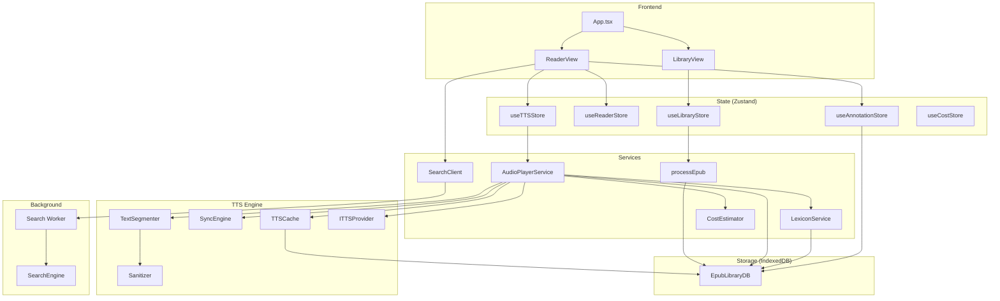

# Versicle Architecture

## Overview

Versicle is a local-first, web-based EPUB reader and manager. It runs entirely in the browser, using IndexedDB for storage, React for the UI, and `epub.js` for rendering. It features advanced capabilities like Text-to-Speech (TTS) with sentence highlighting, full-text search, and annotation management.

## System Architecture

## Directory Structure

*   `src/components/`: React components (Library, Reader, UI).
*   `src/db/`: IndexedDB configuration and schema.
*   `src/hooks/`: React hooks (e.g., `useTTS`).
*   `src/lib/`: Core logic and utilities.
    *   `ingestion.ts`: EPUB processing.
    *   `search.ts`: Search client.
    *   `tts/`: TTS engine and providers.
*   `src/store/`: Zustand state stores.
*   `src/workers/`: Web Workers (Search).
*   `src/types/`: TypeScript definitions.

## Modules

### 1. Ingestion Module (`src/lib/ingestion.ts`)

Handles the import of EPUB files into the system.

*   `processEpub(file: File): Promise<string>`
    *   **Purpose**: Parses an EPUB file, extracts metadata and cover image, and persists the binary and metadata to IndexedDB.
    *   **Parameters**:
        *   `file` (File): The uploaded EPUB file.
    *   **Returns**: `Promise<string>` - The UUID of the newly created book.

### 2. Search Module

Implements full-text search using `FlexSearch` in a Web Worker to avoid blocking the main thread.

#### Client (`src/lib/search.ts`)
*   `class SearchClient` (Singleton `searchClient`)
    *   `indexBook(book: Book, bookId: string): Promise<void>`
        *   **Purpose**: Extracts text from all spine items of a book and sends it to the worker for indexing.
    *   `search(query: string, bookId: string): Promise<SearchResult[]>`
        *   **Purpose**: Sends a search query to the worker.
        *   **Returns**: `Promise` resolving to an array of results with excerpts and CFIs.
    *   `terminate(): void`
        *   **Purpose**: Terminates the underlying Web Worker.

#### Engine (`src/lib/search-engine.ts`)
*   `class SearchEngine` (Runs inside Worker)
    *   `indexBook(bookId: string, sections: { id: string; href: string; text: string }[]): void`
        *   **Purpose**: Creates a FlexSearch index for the book and adds documents.
    *   `search(bookId: string, query: string): SearchResult[]`
        *   **Purpose**: Queries the index and generates text excerpts.

### 3. Text-to-Speech (TTS) Module

Orchestrates audio playback, text synchronization, and provider management.

#### Service (`src/lib/tts/AudioPlayerService.ts`)
*   `class AudioPlayerService` (Singleton)
    *   `static getInstance(): AudioPlayerService`
    *   `setBookId(bookId: string | null): void`
        *   **Purpose**: Sets context for loading book-specific lexicon rules.
    *   `setProvider(provider: ITTSProvider): void`
        *   **Purpose**: Switches the active TTS provider (Local vs. Cloud).
    *   `init(): Promise<void>`
        *   **Purpose**: Initializes the current provider.
    *   `getVoices(): Promise<TTSVoice[]>`
        *   **Purpose**: Retrieves available voices from the provider.
    *   `setQueue(items: TTSQueueItem[], startIndex?: number): void`
        *   **Purpose**: Loads a new queue of text segments to play.
    *   `play(): Promise<void>`
        *   **Purpose**: Starts or resumes playback. Handles buffering, caching, and rule application.
    *   `pause(): void`
        *   **Purpose**: Pauses playback and records timestamp for smart resume.
    *   `resume(): Promise<void>`
        *   **Purpose**: Resumes playback. Implements "Smart Resume" to rewind slightly if paused for a long time.
    *   `stop(): void`
        *   **Purpose**: Stops playback and resets state.
    *   `next(): void`
        *   **Purpose**: Skips to the next item in the queue.
    *   `prev(): void`
        *   **Purpose**: Skips to the previous item.
    *   `seek(offset: number): void`
        *   **Purpose**: Seeks forward/backward by `offset` seconds (Cloud only).
    *   `setSpeed(speed: number): void`
    *   `setVoice(voiceId: string): void`
    *   `subscribe(listener: PlaybackListener): () => void`
        *   **Purpose**: registers a callback for state changes (playing, paused, activeCfi).
    *   `generatePreroll(chapterTitle: string, wordCount: number, speed?: number): string`
        *   **Purpose**: Generates an announcement string for the chapter (e.g., "Chapter 1. Estimated time...").

#### Segmentation (`src/lib/tts/TextSegmenter.ts`)
*   `class TextSegmenter`
    *   `constructor(locale: string, abbreviations: string[], alwaysMerge: string[], sentenceStarters: string[])`
    *   `segment(text: string): TextSegment[]`
        *   **Purpose**: Splits text into sentences using `Intl.Segmenter` and custom heuristic merging logic (handling "Mr.", "Dr.", etc.).

#### Processing (`src/lib/tts/processors/Sanitizer.ts`)
*   `class Sanitizer`
    *   `static sanitize(text: string): string`
        *   **Purpose**: Cleans text before speech (removes URLs, page numbers, citations).

#### Lexicon (`src/lib/tts/LexiconService.ts`)
*   `class LexiconService` (Singleton)
    *   `getRules(bookId?: string): Promise<LexiconRule[]>`
    *   `saveRule(rule): Promise<void>`
    *   `deleteRule(id): Promise<void>`
    *   `applyLexicon(text: string, rules: LexiconRule[]): string`
        *   **Purpose**: Applies pronunciation replacements (regex or string) to text.
    *   `getRulesHash(rules: LexiconRule[]): Promise<string>`
        *   **Purpose**: Generates a hash for cache invalidation.

#### Caching (`src/lib/tts/TTSCache.ts`)
*   `class TTSCache`
    *   `generateKey(text, voiceId, speed, pitch, lexiconHash): Promise<string>`
    *   `get(key): Promise<CachedSegment | undefined>`
    *   `put(key, audio, alignment?): Promise<void>`
        *   **Purpose**: Persists synthesized audio to IndexedDB to save costs/bandwidth.

#### Cost Control (`src/lib/tts/CostEstimator.ts`)
*   `class CostEstimator` (Singleton)
    *   `track(text: string): void`
        *   **Purpose**: Adds character count to the session total.
    *   `estimateCost(text: string, provider: 'google' | 'openai'): number`

#### Synchronization (`src/lib/tts/SyncEngine.ts`)
*   `class SyncEngine`
    *   `loadAlignment(alignment: AlignmentData[]): void`
    *   `updateTime(currentTime: number): void`
        *   **Purpose**: Triggers callbacks when audio playback time matches a word/sentence boundary.

#### Providers (`src/lib/tts/providers/`)
*   **Interface `ITTSProvider`**:
    *   `init(): Promise<void>`
    *   `getVoices(): Promise<TTSVoice[]>`
    *   `synthesize(text, voiceId, speed): Promise<SpeechSegment>`
*   **Implementations**:
    *   `WebSpeechProvider`: Uses browser's `speechSynthesis`.
    *   `GoogleTTSProvider`: Uses Google Cloud Text-to-Speech API.
    *   `OpenAIProvider`: Uses OpenAI Audio API.

### 4. State Management (Zustand)

Located in `src/store/`.

*   **`useLibraryStore`**:
    *   **State**: `books` (metadata list), `isLoading`.
    *   **Actions**: `fetchBooks()`, `addBook(file)`, `removeBook(id)`.
*   **`useReaderStore`**:
    *   **State**: `currentBookId`, `currentCfi`, `progress`, `currentTheme` ('light'|'dark'|'sepia'|'custom'), `fontSize`, `viewMode` ('paginated'|'scrolled'), `toc`.
    *   **Actions**: `updateLocation(cfi, progress)`, `setTheme(theme)`, `setFontSize(size)`, `setViewMode(mode)`.
    *   **Persistence**: Persists to `localStorage` (reader settings).
*   **`useTTSStore`**:
    *   **State**: `status` (playing/stopped), `activeCfi`, `voice`, `rate`, `providerId` ('local'|'google'|'openai'), `apiKeys`, `customAbbreviations`.
    *   **Actions**: `play()`, `pause()`, `setRate()`, `setProviderId()`, `setApiKey()`.
*   **`useAnnotationStore`**:
    *   **State**: `annotations` (list).
    *   **Actions**: `loadAnnotations(bookId)`, `addAnnotation()`, `deleteAnnotation()`, `showPopover()`.
*   **`useCostStore`**:
    *   **State**: `sessionCharacters`.
    *   **Actions**: `addUsage(count)`, `resetSession()`.

### 5. Persistence (`src/db/db.ts`)

Uses `idb` to manage `EpubLibraryDB`.

*   `initDB()` / `getDB()`: Opens the database (v4).
*   **Object Stores**:
    *   `books`: Metadata (`id`, `title`, `coverBlob`, `progress`, `currentCfi`).
    *   `files`: Raw EPUB `ArrayBuffer`.
    *   `locations`: Cached `epub.js` locations JSON (for performance).
    *   `annotations`: User highlights and notes (`cfiRange`, `text`, `color`).
    *   `tts_cache`: Audio blobs and alignment data indexed by hash.
    *   `lexicon`: Pronunciation rules.

### 6. User Interface (`src/components/`)

*   **`LibraryView`**: Grid of books, drag-and-drop upload.
*   **`ReaderView`**:
    *   Initializes `epub.js` `Rendition`.
    *   Manages layout (Paginated vs. Scrolled).
    *   Injects custom styles for Themes and Highlights.
    *   Connects `useTTS` hook to `epub.js` DOM.
    *   Handles "Immersive Mode" and Gesture controls.
