# Versicle Architecture

## 1. High-Level Overview

Versicle is a **Local-First**, **Privacy-Centric** EPUB reader and audiobook player that runs entirely in the browser (or as a Hybrid Mobile App via Capacitor).

### Core Design Principles

1.  **Store-First (Local-First) Architecture**:
    *   **Why**: To enable seamless offline functionality, instant UI updates, and conflict-free data synchronization without a central server.
    *   **How**: The application uses **Yjs** (CRDTs) as the single source of truth for all user data (reading progress, library inventory, annotations).
        *   **Zustand Middleware**: State changes in the UI (`useLibraryStore`, `useReadingStateStore`) are automatically mapped to Yjs documents via `zustand-middleware-yjs`.
        *   **Persistence**: The Yjs document is persisted to **IndexedDB** (`y-indexeddb`) for offline access.
    *   **Trade-off**: The initial load (hydration) involves reading the Yjs binary from IndexedDB, which scales with dataset size.

2.  **Heavy Client-Side Logic**:
    *   **Why**: To avoid server costs and maintain privacy. Features typically done on a backend (Text-to-Speech segmentation, Full-Text Indexing, File Parsing) are moved to the client.
    *   **How**:
        *   **Search**: Uses a **Web Worker** running a custom `SearchEngine` with **RegExp** scanning to find text in memory.
        *   **TTS**: Uses client-side logic (`TextSegmenter`) with JIT refinement to split text into sentences and caches audio segments locally (`TTSCache`).
        *   **Ingestion**: Parses EPUB files directly in the browser using `epub.js` and a custom **Offscreen Renderer** for accurate text extraction.
        *   **Yield Strategy**: Implements a **Time-Budgeted Yield Strategy** (pauses every 16ms) to keep the main thread responsive during heavy parsing.
    *   **Trade-off**: Higher memory and CPU usage on the client device. Large books may take seconds to index for search or parse for ingestion.

3.  **Hybrid Text-to-Speech (TTS) & GenAI**:
    *   **Why**: To balance quality, cost, and offline availability.
    *   **How**:
        *   **Local**: Uses the Web Speech API (OS native) or local WASM models (Piper) for free, offline reading.
        *   **Cloud**: Integrates with Google/OpenAI for high-quality neural voices.
        *   **Table Teleprompter**: Uses Multimodal GenAI to "see" data tables and convert them into natural speech (narrative flow).
    *   **Stability**: The system implements a "Let It Crash" philosophy for worker management to ensure resilience.

### User Interface: The "Three Rooms"

The UI is organized into three distinct operational modes to reduce cognitive load:
1.  **The Reading Room**: The distraction-free reading interface, controlled via `VisualSettings` (fonts, themes, layout).
2.  **The Listening Room**: The audio experience, managed by `UnifiedAudioPanel` (playback, speed, voice selection).
3.  **The Engine Room**: Global configuration, handled by `GlobalSettingsDialog` (data management, API keys, advanced imports).

## 2. System Architecture Diagram

```mermaid
graph TD
    subgraph Frontend [React UI]
        App[App.tsx]
        Library[LibraryView]
        Reader[ReaderView]
        VisualSettings[VisualSettings]
        AudioPanel[UnifiedAudioPanel]
        GlobalSettings[GlobalSettingsDialog]
        useEpub[useEpubReader Hook]
    end

    subgraph State [Zustand Stores]
        ReaderStore[useReaderStore]
        TTSStore[useTTSStore]
        LibStore[useLibraryStore]
        AnnotStore[useAnnotationStore]
        GenAIStore[useGenAIStore]
        ContentAnalysisStore[useContentAnalysisStore]
        UIStore[useUIStore]
        SyncStore[useSyncStore]
    end

    subgraph DataLayer [Data & Sync]
        YjsProvider[YjsProvider]
        Middleware[zustand-middleware-yjs]
        YDoc[Y.Doc CRDT]
        FireSync[FirestoreSyncManager]
        FireProvider[y-fire]
        AndroidBackup[AndroidBackupService]
    end

    subgraph Core [Core Services]
        APS[AudioPlayerService]
        Pipeline[AudioContentPipeline]
        Ingestion[ingestion.ts]
        BatchIngestion[batch-ingestion.ts]
        SearchClient[SearchClient]
        Backup[BackupService]
        Export[ExportImportService]
        Maint[MaintenanceService]
        GenAI[GenAIService]
        CostEst[CostEstimator]
        TaskRunner[cancellable-task-runner.ts]
        MediaSession[MediaSessionManager]
        ServiceWorker[ServiceWorker]
    end

    subgraph TTS [TTS Subsystem]
        PSM[PlaybackStateManager]
        Segmenter[TextSegmenter]
        Lexicon[LexiconService]
        TTSCache[TTSCache]
        Sync[SyncEngine]
        Providers[ITTSProvider]
        Piper[PiperProvider]
        PiperUtils[piper-utils.ts]
        BG[BackgroundAudio]
        TaskSeq[TaskSequencer]
    end

    subgraph Workers [Web Workers]
        SearchWorker[search.worker.ts]
        SearchEngine[SearchEngine]
    end

    subgraph Storage [IndexedDB]
        DBService[DBService]
        StaticStores[Static & Resources]
        UserStores[User Data & Progress]
        CacheStores[Cache & Tables]
        AppStores[Checkpoints & Logs]
        YDB[versicle-yjs]
    end

    App --> Library
    App --> Reader
    Reader --> VisualSettings
    Reader --> AudioPanel
    Reader --> GlobalSettings
    Reader --> useEpub
    Library --> ServiceWorker

    VisualSettings --> ReaderStore
    AudioPanel --> TTSStore
    GlobalSettings --> UIStore
    GlobalSettings --> SyncStore
    GlobalSettings --> Export

    TTSStore --> APS
    Library --> LibStore

    LibStore <--> Middleware
    ReaderStore <--> Middleware

    Middleware <--> YDoc
    YDoc <--> YjsProvider
    YjsProvider <--> YDB
    YjsProvider --> FireSync
    FireSync --> FireProvider
    LibStore --> AndroidBackup

    LibStore --> DBService
    LibStore --> Ingestion
    LibStore --> BatchIngestion
    LibStore --> Backup
    LibStore --> Maint

    APS --> Pipeline
    APS --> PSM
    Pipeline --> GenAI
    Pipeline --> GenAIStore
    Pipeline --> ContentAnalysisStore
    Pipeline --> DBService

    APS --> Providers
    APS --> Segmenter
    APS --> Lexicon
    APS --> TTSCache
    APS --> Sync
    APS --> Piper
    APS --> CostEst
    APS --> BG
    APS --> MediaSession
    APS --> TaskSeq

    Piper --> PiperUtils

    Reader --> SearchClient
    SearchClient --> SearchWorker
    SearchWorker --> SearchEngine

    GenAIStore --> GenAI

    Ingestion --> DBService
    TTSCache --> DBService

    DBService --> StaticStores
    DBService --> UserStores
    DBService --> CacheStores
    DBService --> AppStores
```

## 3. Detailed Module Reference

### Data Layer (`src/db/`)

The data layer is built on **IndexedDB** using the `idb` library. It is accessed primarily through the `DBService` singleton, which provides a high-level API for all storage operations.

#### `src/db/DBService.ts`
The main database abstraction layer. It handles error wrapping (converting DOM errors to typed application errors like `StorageFullError`), transaction management, and debouncing for frequent writes.

**Key Stores (Schema v22):**
*   **Domain 1: Static (Immutable/Heavy)** - *Managed by DBService*
    *   `static_manifests`: Lightweight metadata (Title, Author, Cover Thumbnail) for listing books.
    *   `static_resources`: The raw binary EPUB files (Blobs). This is the heaviest store.
    *   `static_structure`: Synthetic TOC and Spine Items derived during ingestion.
*   **Domain 2: User (Mutable/Syncable)** - *Managed by Yjs*
    *   **Yjs Exclusive**: `user_inventory` (Books), `user_progress` (Reading State), and `user_reading_list` are managed **exclusively** by Yjs stores. `DBService` only reads/writes static data.
    *   **IDB Local/Hybrid**:
        *   `user_overrides`: Custom settings like Lexicon rules.
        *   `user_annotations`: Highlights and notes. Managed via `useAnnotationStore`.
    *   **Deprecated/Replaced**:
        *   `user_journey`: **(Removed)** Granular reading history sessions are no longer stored in IDB.
        *   `user_ai_inference`: **(Replaced)** Expensive AI-derived data is now handled by the synced `useContentAnalysisStore` (Yjs).
*   **Domain 3: Cache (Transient/Regenerable)**
    *   `cache_table_images`: Snapshot images of complex tables (`webp`) for teleprompter/visual preservation.
    *   `cache_audio_blobs`: Generated TTS audio segments.
    *   `cache_render_metrics`: Layout calculation results.
    *   `cache_session_state`: Playback queue persistence.
    *   `cache_tts_preparation`: Staging area for TTS text extraction.

**Key Functions:**
*   **`offloadBook(id)`**: Deletes the large binary EPUB from `static_resources` and cached assets but keeps all `User` domain data (Progress, Annotations) and `user_reading_list` entry.
    *   *Trade-off*: User must re-import the *exact same file* to read again.
*   **`importBookWithId(id, file)`**: Special ingestion mode for restoring "Ghost Books" (books that exist in Yjs inventory but are missing local files). It bypasses new ID generation to match the existing Yjs record.
*   **`ingestBook(data)`**: Performs a "Static Only" write. It persists the heavy immutable data (`static_manifests`, `static_resources`) to IDB but relies on the caller (Zustand) to update the Yjs `user_inventory`.

#### `src/lib/batch-ingestion.ts` (Batch Ingestion)
*   **Goal**: Handle bulk import of books, including ZIP archives containing multiple EPUBs.
*   **Logic**:
    *   **Recursive Extraction**: Uses `JSZip` to extract EPUBs from uploaded ZIP files.
    *   **Progress Tracking**: Provides granular callbacks for both upload/extraction progress and individual book ingestion status.
    *   **Error Isolation**: A failure in one book (e.g., corruption) does not fail the entire batch.
*   **Trade-offs**:
    *   **Memory Pressure**: Loading a large ZIP file (e.g., 500MB+) entirely into memory (ArrayBuffer) for extraction can cause tab crashes on memory-constrained mobile devices.
    *   **Main Thread Blocking**: While `JSZip` is async, large decompression tasks can still cause frame drops or UI jank during the extraction phase.

#### Hardening: Validation & Sanitization (`src/db/validators.ts`)
*   **Goal**: Prevent database corruption and XSS attacks.
*   **Logic**:
    *   **Quota Management**: Explicitly handles `QuotaExceededError` (including legacy code 22) and wraps it in a typed `StorageFullError` for UI handling.
    *   **Magic Number Check**: Verifies ZIP signature (`50 4B 03 04`) before parsing.
    *   **Sanitization**: Delegates to `DOMPurify` to strip HTML tags from metadata.
    *   **Safe Mode**: A specialized UI state (`SafeModeView`) triggered by critical database initialization failures in `App.tsx`. It provides a last-resort "Factory Reset" option (`deleteDB`) to recover the application from a corrupted state without requiring user technical knowledge.

### Sync & Cloud (`src/lib/sync/`)

Versicle implements a strategy combining **Real-Time Sync** (via Firestore) for cross-device activity and **Native Backup** (via Android) for data safety.

#### `CheckpointService.ts` (The Moral Layer)
*   **Goal**: Prevent data loss during complex sync merges by creating "Safety Snapshots".
*   **Logic**:
    *   **Before Sync**: Creates a `SyncManifest` snapshot in the `checkpoints` IDB store.
    *   **Rotation**: Maintains a rolling buffer of the last 10 checkpoints.

#### `FirestoreSyncManager.ts` (Real-Time Cloud)
Provides a "Cloud Overlay" for real-time synchronization.

*   **Logic**:
    *   **Y-Fire**: Uses `y-cinder` (a custom `y-fire` fork) to sync Yjs updates incrementally to Firestore (`users/{uid}/versicle/{env}`).
    *   **Configurable Debounce**: Implements `maxWaitFirestoreTime` (default 2000ms) and `maxUpdatesThreshold` (default 50) to balance cost vs. latency.
    *   **Environment Aware**: Writes to `dev` bucket in development and `main` in production to prevent test data pollution.
    *   **Authenticated**: Sync only occurs when the user is signed in via Firebase Auth.
    *   **Mock Mode**: Includes a `MockFireProvider` for integration testing without a real Firebase project.
*   **Trade-offs**:
    *   **Complexity**: Requires maintaining a Firestore project.

#### `AndroidBackupService.ts` (Cold Path)
Manages integration with the native Android Backup Service.

*   **Logic**:
    *   **Payload File**: Periodically writes a `backup_payload.json` file to the app's internal data directory.
    *   **Native Handoff**: The Android OS automatically backs up this file to the user's Google Drive (if enabled in Android settings).
*   **Trade-off**: Restore is all-or-nothing and handled by the OS during app installation/restore.

### Core Logic & Services (`src/lib/`)

#### Logging (`src/lib/logger.ts`)
*   **Goal**: Provide environment-aware logging with context isolation.
*   **Logic**:
    *   **Scoped Loggers**: Uses `createLogger('Namespace')` to create isolated logger instances.
    *   **Filtering**: Filters logs based on `VITE_LOG_LEVEL` or environment (Info in Dev, Warn in Prod).
    *   **Legacy**: The singleton `Logger` class is deprecated in favor of functional factory usage.

#### Performance: Hot Paths (`src/lib/cfi-utils.ts`)
*   **Goal**: Minimize latency during heavy text segmentation and rendering operations.
*   **Logic**:
    *   **Fast Merge**: `tryFastMergeCfi` uses optimistic string manipulation to merge Canonical Fragment Identifiers (CFIs) without the expensive overhead of parsing/regenerating them via `epubjs`.
    *   **Heuristic Fallback**: If the fast path fails (complex structure), it gracefully falls back to the standard, slower implementation.
*   **Verification**:
    *   **Fuzz Testing**: The optimization is verified using seeded Fuzz tests (`cfi-utils.fuzz.test.ts`) that generate random CFI inputs and assert that the Fast Path output matches the Slow Path reference implementation.

#### Ingestion (`src/lib/ingestion.ts` & `src/lib/offscreen-renderer.ts`)
Handles the complex task of importing an EPUB file.

*   **`extractBookData(file)`**:
    1.  **Validation**: Enforces strict ZIP signature check (`PK\x03\x04`).
    2.  **Offscreen Rendering**: Uses a hidden `iframe` (via `offscreen-renderer.ts`).
        *   **Time-Budgeted Yield Strategy**: Explicitly checks `performance.now()` and yields to the main thread every 16ms (1 frame) to prevent freezing the UI during heavy parsing.
    3.  **Fingerprinting**: Generates a **"3-Point Fingerprint"** (Head 4KB + Metadata + Tail 4KB) using a `cheapHash` function for O(1) duplicate detection.
    4.  **Adaptive Contrast**: Generates a **Cover Palette** using K-Means (`cover-palette.ts`).

#### Service Worker Image Serving (`src/lib/serviceWorkerUtils.ts`)
*   **Goal**: Prevent memory leaks caused by `URL.createObjectURL`.
*   **Logic**:
    *   Uses a custom URL scheme: `/__versicle__/covers/:bookId`.
    *   A **Service Worker** intercepts these requests, fetches the cover blob from IndexedDB (`static_manifests`), and responds directly.

#### Generative AI (`src/lib/genai/`)
*   **Smart Rotation**: Implements a rotation strategy (`gemini-flash-lite-latest` <-> `gemini-2.5-flash`) to handle `429 RESOURCE_EXHAUSTED` errors and maximize free tier quotas.
*   **Resilience**: Automatically retries requests with the fallback model.
*   **Thinking Budget**: `generateTableAdaptations` utilizes a configurable `thinkingBudget` (default 512 tokens) to improve reasoning quality for complex data interpretation.
*   **Teleprompter**: Uses Multimodal GenAI to convert complex table images into narrative text for TTS accessibility.

#### Search (`src/lib/search.ts` & `src/workers/search.worker.ts`)
Implements full-text search off the main thread.

*   **Logic**: Uses a **RegExp** scanning approach over in-memory text via `SearchEngine` class, exposed via `Comlink`.
*   **Trade-off**: The index is **transient** (in-memory only) and rebuilt on demand.

#### Backup (`src/lib/BackupService.ts`)
Manages manual internal state backup and restoration.

*   **`createLightBackup()`**: JSON-only export (metadata, settings, history).
*   **`createFullBackup()`**: ZIP archive containing the JSON manifest plus all original `.epub` files.

#### Export (`src/lib/export.ts` & `src/lib/sync/ExportImportService.ts`)
*   **Goal**: Provide a platform-agnostic way to export data.
*   **Logic**:
    *   **Unified Export (`export.ts`)**: Acts as a **Platform Adapter**.
        *   **Web**: Uses `file-saver` to trigger a browser download.
        *   **Native**: Writes the file to the app's cache directory and uses `Capacitor Share` API to open the native share sheet.
    *   **Export/Import Service (`ExportImportService.ts`)**: The **Logic Provider** for the "Cold Path" (Manual Backup).
        *   **Export**: Serializes Yjs state (Inventory, Progress, Annotations) into a JSON blob with a checksum.
        *   **Import**: Validates schema and merges data into the local Yjs document using atomic transactions.
*   **Trade-offs**:
    *   **Memory Pressure**: On native devices, converting large Blobs to Base64 (for the Filesystem API) can cause Out-Of-Memory (OOM) crashes with very large backups.

#### `src/lib/MaintenanceService.ts`
*   **Goal**: Perform database hygiene and remove orphaned data.
*   **Logic**:
    *   **Orphan Detection**: Scans `static_resources` (files) and `cache_` stores for keys that no longer exist in the Yjs `user_inventory`.
    *   **Post-Migration Role**: Unlike legacy versions, it *does not* touch user data (inventory, progress) as those are managed by Yjs/Firestore sync. It strictly cleans up the heavy binary/cache data left behind.

#### Cancellable Task Runner (`src/lib/cancellable-task-runner.ts`)
*   **Goal**: Solve the "Zombie Promise" problem in React `useEffect` hooks.
*   **Logic**: Uses a **Generator** pattern (`function*`) to yield Promises. Calling `cancel()` throws a `CancellationError` into the generator.

---

### TTS Subsystem (`src/lib/tts/`)

#### `src/lib/tts/AudioPlayerService.ts`
The Orchestrator. Manages playback state, provider selection, and UI updates.

*   **Logic**:
    *   **Concurrency**: Uses `TaskSequencer` (`enqueue`) to serialize public methods (play, pause) to prevent race conditions during rapid UI interaction.
    *   **Battery Optimization**: On Android, explicitly checks for and warns about aggressive battery optimization (`checkBatteryOptimization`) via `BatteryGuard`.
    *   **Delegation**: Offloads content loading to `AudioContentPipeline` and state to `PlaybackStateManager`.

#### `src/lib/tts/TaskSequencer.ts`
*   **Goal**: Prevent race conditions in async audio operations.
*   **Logic**:
    *   **Queue**: Maintains a promise chain (`pendingPromise`).
    *   **Serialization**: Ensures tasks like `play()`, `pause()`, and `loadSection()` run sequentially, preventing "Double Play" or invalid state transitions.
*   **Trade-offs**:
    *   **Head-of-Line Blocking**: A single slow operation (e.g., a network timeout) will block all subsequent playback actions.

#### `src/lib/tts/CostEstimator.ts`
*   **Goal**: Track and estimate usage costs for Cloud TTS providers.
*   **Logic**:
    *   **Session Tracking**: Uses a transient Zustand store (`useCostStore`) to track characters processed in the current session.
    *   **Estimation**: Applies per-character pricing models (e.g., $0.000016/char for Google WaveNet).

#### `src/lib/tts/AudioContentPipeline.ts`
The Data Pipeline for TTS.

*   **Goal**: Decouple "Content Loading" from "Playback Readiness".
*   **Logic (Optimistic Playback)**:
    1.  **Immediate Return**: Returns a raw, playable queue immediately after basic extraction.
    2.  **Background Analysis**: Fires "fire-and-forget" asynchronous tasks (`detectContentSkipMask`, `processTableAdaptations`) to analyze content using GenAI.
    3.  **Dynamic Updates**: Updates the *active* queue while it plays via callbacks (`onMaskFound`), allowing the player to seamlessly skip content identified later without delaying the start of playback.

#### `src/lib/tts/TextSegmenter.ts`
*   **Goal**: Robustly split text into sentences and handle abbreviations.
*   **Logic**:
    *   **Manual Backward Scan**: `mergeText` uses a manual character scan loop (bypassing `trimEnd()` and regex) to find the merge point, reducing expensive string allocations in tight loops.
    *   **Refinement**: Dynamically merges short segments using cached regex options for abbreviations and sentence starters.
    *   **Optimization**: Uses `tryFastMergeCfi` to merge CFIs optimistically via string manipulation.
*   **Trade-offs**:
    *   **Maintenance**: The manual character scanning logic is more complex and brittle than standard regex or `String.trim()`, requiring careful regression testing.

#### `src/lib/tts/PlaybackStateManager.ts`
Manages the virtual playback timeline.

*   **Goal**: Abstract the complexity of skipped items and dynamic replacements.
*   **Logic**:
    *   **Virtualized Timeline**: Maintains a queue where items can be marked `isSkipped` without being removed.

#### `src/lib/tts/LexiconService.ts`
*   **Goal**: Manage pronunciation rules for TTS, handling book-specific and global overrides.
*   **Logic**:
    *   **Layered Application**: Applies rules in a strict order: Book Specific (High Priority) -> Global -> Bible Rules (if enabled) -> Book Specific (Low Priority).
    *   **Regex Caching**: Caches compiled `RegExp` objects for performance during heavy text processing.
    *   **Bible Lexicon**: Injects a specialized set of rules for Bible citations (e.g., "Gen 1:1") if enabled for the book.

#### `src/lib/tts/processors/Sanitizer.ts`
*   **Goal**: Clean raw text before segmentation to improve TTS quality.
*   **Logic**:
    *   **Regex Operations**: Removes non-narrative artifacts like page numbers, URLs (keeping domain), and citations (numeric/author-year).
    *   **Efficiency**: Uses pre-compiled global regexes to minimize overhead during heavy processing.

#### `BackgroundAudio.ts`
*   **Goal**: Ensure the app process remains active on Android/iOS when the screen is off.
*   **Logic**: Plays a silent (or white noise) audio loop in the background to prevent the OS from killing the suspended app.

#### `src/lib/tts/providers/CapacitorTTSProvider.ts`
*   **Logic**: Uses `queueStrategy: 1` to preload the next utterance into the OS buffer while the current one plays.

---

### State Management (`src/store/`)

State is managed using **Zustand** with specialized strategies for different data types.

*   **`useBookStore` (Synced)**: Manages **User Inventory**. Backed by Yjs Map.
*   **`useReadingListStore` (Synced)**:
    *   **Goal**: Functions as a **"Shadow Inventory"**.
    *   **Logic**: Tracks book status (Read, Reading, Want to Read) and Rating independently of the file existence. Persists even if the book file is offloaded or deleted.
*   **`useReadingStateStore` (Per-Device Sync)**:
    *   **Strategy**: Uses a nested map structure (`bookId -> deviceId -> Progress`) in Yjs.
    *   **Why**: To prevent overwriting reading positions when switching between devices.
    *   **Aggregation**: The UI selector aggregates these to find the "Furthest Read" point.
*   **`useDeviceStore` (Sync Mesh)**:
    *   **Strategy**: Maintains a Yjs Map of active devices in the mesh.
    *   **Logic**: Updates a `lastActive` timestamp (Heartbeat) with throttling (5 mins) to track online status.
    *   **Why**: Enables "Send to Device" features and provides visibility into the sync network.
*   **`useReaderStore`**: (Conceptual Facade) Aggregates ephemeral UI state (`useReaderUIStore`) and persistent settings (`usePreferencesStore`) for easier component consumption.
*   **`useContentAnalysisStore` (Synced)**:
    *   **Goal**: Sync expensive AI artifacts (Table Adaptations, Semantic Maps) across devices.
    *   **Logic**: Maps `${bookId}/${sectionId}` to a `SectionAnalysis` object containing the semantic map (footnotes/titles) and teleprompter scripts. Avoids re-running expensive GenAI queries on every device.
*   **`useLibraryStore` (Local Only)**:
    *   **Strategy**: Manages **Static Metadata** (covers, file hashes) which are too heavy for Yjs.
    *   **The "Ghost Book" Pattern**: The UI merges Synced Inventory (Yjs) with Local Static Metadata (IDB). If the local file is missing, the book appears as a "Ghost Book" using synced metadata.

#### Selector Optimization (`src/store/selectors.ts`)
*   **Goal**: Ensure smooth UI scrolling (60fps) by preventing unnecessary re-renders in the main `LibraryView`.
*   **Logic**:
    *   **Phase 1 (Base Book Memoization)**: Merges heavy static metadata (covers, titles) into book objects. Memoized on `books` + `staticMetadata` (rare changes).
    *   **Phase 2 (Progress Merge)**: Merges frequent updates (Reading Progress) into the Base Books using **Reference Stability**.
        *   *Array Item Memoization*: Reuses the *same* book object reference from the previous render if only the progress changed but the book identity/metadata is stable, allowing `React.memo` components to skip updates.
*   **Trade-offs**:
    *   **Complexity**: Requires manual management of dependency arrays and object identity, making the code harder to maintain than simple selectors.
    *   **Stale Data Risk**: If a dependency is missed, the UI will not update even if the store changes.

### UI Layer

#### Mobile Integration
*   **Safe Area**: Uses `@capacitor-community/safe-area`.
*   **Media Session**: Managed via `MediaSessionManager` with support for artwork cropping.
