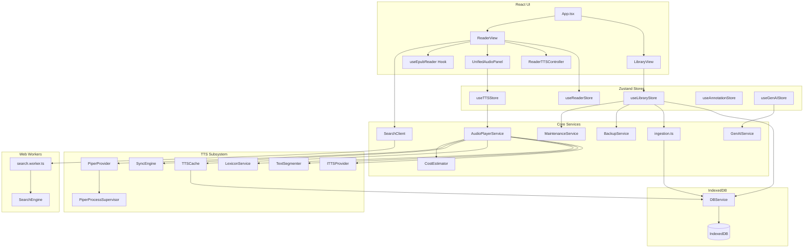

# Versicle Architecture

## 1. High-Level Overview

Versicle is a **Local-First**, **Privacy-Centric** EPUB reader and audiobook player that runs entirely in the browser (or as a Hybrid Mobile App via Capacitor).

### Core Design Principles

1.  **Local-First & Offline-Capable**:
    *   **Why**: To provide zero-latency access, total privacy (no reading analytics sent to a server), and true ownership of data. Users should be able to read their books without an internet connection or fear of service shutdown.
    *   **How**: All data—books, annotations, progress, and settings—is stored in **IndexedDB** via the `idb` wrapper. The app is a PWA that functions completely offline.
    *   **Trade-off**: Data is bound to the device. Syncing across devices requires manual backup/restore (JSON/ZIP export), as there is no central sync server. Storage is limited by the browser's quota (though usually generous).

2.  **Heavy Client-Side Logic**:
    *   **Why**: To avoid server costs and maintain privacy. Features typically done on a backend (Text-to-Speech segmentation, Full-Text Indexing, File Parsing) are moved to the client.
    *   **How**:
        *   **Search**: Uses a **Web Worker** running `FlexSearch` to build an in-memory index of the book on demand.
        *   **TTS**: Uses client-side logic (`TextSegmenter`) to split text into sentences and caches audio segments locally (`TTSCache`).
        *   **Ingestion**: Parses EPUB files directly in the browser using `epub.js` and `JSZip`.
    *   **Trade-off**: Higher memory and CPU usage on the client device. Large books may take seconds to index for search or parse for ingestion.

3.  **Hybrid Text-to-Speech (TTS)**:
    *   **Why**: To balance quality, cost, and offline availability.
    *   **How**:
        *   **Local**: Uses the Web Speech API (OS native) or local WASM models (Piper) for free, offline reading.
        *   **Cloud**: Integrates with Google/OpenAI/LemonFox for high-quality neural voices, but caches generated audio to minimize API costs and latency on replay.
    *   **Stability**: The system implements a robust fallback mechanism. If a cloud provider fails, it automatically switches to a local provider.

## 2. System Architecture Diagram

## 3. Detailed Module Reference

### Data Layer (`src/db/`)

The data layer is built on **IndexedDB** using the `idb` library. It is accessed primarily through the `DBService` singleton, which provides a high-level API for all storage operations.

#### `src/db/DBService.ts`
The main database abstraction layer. It handles error wrapping (converting DOM errors to typed application errors like `StorageFullError`), transaction management, and debouncing for frequent writes.

**Key Functions:**

*   **`getLibrary()`**: Retrieves all books. Validates metadata integrity using `validators.ts` and sorts by import date.
    *   *Returns*: `Promise<BookMetadata[]>`
*   **`getBook(id)`**: Retrieves both metadata and the binary EPUB file.
    *   *Returns*: `Promise<{ metadata: BookMetadata; file: Blob | ArrayBuffer }>`
*   **`addBook(file)`**: Imports a new book. Delegates parsing to `ingestion.ts`.
*   **`saveProgress(bookId, cfi, progress)`**: Saves reading progress.
    *   *Implementation*: Debounced (1s) to prevent thrashing IndexedDB during scrolling/reading.
    *   *Trade-off*: A crash within 1 second of reading might lose the very last position update.
*   **`saveTTSState(bookId, queue, currentIndex)`**: Persists the current TTS playlist and position.
    *   *Why*: Allows the user to close the app and resume the audiobook exactly where they left off.
*   **`offloadBook(id)`**: Deletes the large binary EPUB file to save space but keeps metadata, annotations, and reading progress. Sets `isOffloaded: true`.
    *   *Trade-off*: User must re-import the *exact same file* (verified via SHA-256 hash) to read again.
*   **`restoreBook(id, file)`**: Restores an offloaded book. Verifies `fileHash` matches the original before accepting.
*   **`updateReadingHistory(bookId, newRange)`**: Merges a new CFI range into the book's reading history to track "read" status.

### Core Logic & Services (`src/lib/`)

#### Ingestion (`src/lib/ingestion.ts`)
Handles the complex task of importing an EPUB file.

*   **`processEpub(file)`**:
    1.  **Validation**: Checks ZIP headers (magic bytes) to ensure file validity.
    2.  **Parsing**: Uses `epub.js` to parse the container.
    3.  **Synthetic TOC**: Iterates through the spine to generate a table of contents and calculate character counts (for reading time estimation).
    4.  **Hashing**: Computes a SHA-256 hash of the file incrementally (chunked) to avoid memory spikes. Used for integrity checks during restore.
    5.  **Sanitization**: Uses `DOMParser` to strip HTML and scripts from metadata fields, and enforces character limits (e.g. 255 chars for Author).
    *   *Returns*: `Promise<string>` (New Book ID).

#### Search (`src/lib/search.ts` & `src/workers/search.worker.ts`)
Implements full-text search off the main thread to prevent UI freezing.

*   **`SearchClient`**: The main-thread interface. Manages the Worker lifecycle and request/response correlation using UUIDs.
*   **`SearchEngine`**: Runs inside the Worker. Uses `FlexSearch` to build an inverted index.
*   **Trade-off**: The index is **transient** (in-memory only). It is rebuilt every time the user opens a book and initiates a search. This avoids storing massive indices in IndexedDB but adds a delay before search is ready for large books.

#### Backup (`src/lib/BackupService.ts`)
Manages internal state backup and restoration (JSON/ZIP).

*   **`createMetadataBackup()`**: Exports JSON containing metadata, themes, and settings.
    *   *Note*: Does **not** include EPUB binaries (metadata only).
*   **`restoreMetadataBackup(json)`**: Restores data from a JSON backup string.
    *   **Strategy**: Upserts metadata. If a book exists, it preserves the existing binary.

#### Data Portability (`src/lib/csv.ts`)
Handles interoperability with external reading trackers (Goodreads).

*   **Goal**: Allow users to import/export their reading lists and status without vendor lock-in.
*   **Logic**:
    *   **Parsing**: Uses `PapaParse` to handle CSV complexity (quoted fields, newlines).
    *   **Heuristics**: If the CSV lacks a unique filename (e.g. Goodreads export), it generates a deterministic ID from ISBN or Title+Author.
    *   **Normalization**: Maps various status strings (e.g., "to-read", "want to read") to internal states.
*   **Trade-off**: Fuzzy matching by Title/Author when ISBN is missing can be imprecise (e.g., different editions of the same book).

#### Maintenance (`src/lib/MaintenanceService.ts`)
Handles database health and integrity.

*   **Goal**: Ensure the database is free of orphaned records (files, annotations, lexicon rules) that no longer have a parent book.
*   **Logic**: Scans all object stores (`files`, `annotations`, `locations`, `lexicon`) and compares IDs against the `books` store.
*   **Trade-off**: `pruneOrphans()` is a destructive operation. If logic is flawed, valid data could be lost. It is designed to be run manually or on specific error conditions.

#### Generative AI (`src/lib/genai/`)
Enhances the reading experience using LLMs (Google Gemini).

*   **Goal**: Provide features like "Smart Table of Contents" generation, summarization, and text analysis.
*   **Logic**:
    *   **`GenAIService`**: Singleton wrapper around `@google/generative-ai`. Handles API configuration and request logging.
    *   **`generateStructured`**: Uses Gemini's JSON schema enforcement to return strictly typed data (e.g., TOC structure).
    *   **`textMatching.ts`**: Provides fuzzy matching to locate AI-generated quotes/references back in the original source text (handling whitespace/case differences).
*   **Trade-off**: Requires an active internet connection and a Google API Key. Privacy implication: Book text snippets are sent to Google's servers.

#### Cost Estimator (`src/lib/tts/CostEstimator.ts`)
*   **Goal**: Provide users with a rough estimate of API costs for Cloud TTS usage during a session.
*   **Logic**: Tracks total characters sent to paid providers (Google, OpenAI) in a transient Zustand store (`useCostStore`).
*   **Trade-off**: Estimates are client-side approximations and do not account for billing nuances (e.g., minimum request size, retries).

---

### TTS Subsystem (`src/lib/tts/`)

This is the most complex subsystem, handling audio generation, synchronization, and playback control. It is designed as a modular pipeline.

#### `src/lib/tts/AudioPlayerService.ts`
The singleton controller (Orchestrator).

*   **Goal**: Manage the playback queue, provider selection, and state machine (`playing`, `paused`, `loading`, etc.).
*   **Logic**:
    *   **Concurrency**: Uses a **Mutex** pattern (`executeWithLock`) to serialize async operations (play, pause, next) and prevent race conditions.
    *   **Smart Resume**: Automatically rewinds context (2 sentences) after a pause to re-orient the listener.
    *   **Media Session**: Integrates with the OS Media Session API (lock screen controls) via `MediaSessionManager`.
*   **Trade-off**: High complexity to handle all edge cases (network failure, background play, interruptions).

#### `src/lib/tts/TextSegmenter.ts`
Splits raw text into natural-sounding sentences.

*   **Logic**: Uses `Intl.Segmenter` (browser native) augmented with a custom Rules Engine.
*   **Hardening**:
    *   **Abbreviation Handling**: Merges splits caused by common abbreviations (e.g., "Mr.", "Dr.") using a whitelist.
    *   **Sentence Starters**: Checks if the next segment starts with a lowercase letter (indicating a false split).

#### `src/lib/tts/TTSCache.ts`
Persists synthesized audio to IndexedDB.

*   **Logic**: Generates a cache key based on `text + voiceId + speed + pitch + lexiconHash`.
*   **Benefit**: If you re-listen to a chapter, it plays instantly and costs zero API credits.

#### `src/lib/tts/SyncEngine.ts`
Manages visual "Karaoke" synchronization.

*   **Logic**: Binary search (or optimized scan) through time-alignment data provided by the TTS provider to highlight the current word/sentence.

#### `src/lib/tts/AudioElementPlayer.ts`
Low-level wrapper around the HTML5 `<audio>` element.

*   **Goal**: Abstract resource management for Blob-based playback used by `BaseCloudProvider` (Piper, OpenAI, etc.).
*   **Logic**: Automatically revokes `ObjectURLs` on track end or stop to prevent memory leaks.

#### `src/lib/tts/BackgroundAudio.ts`
*   **Goal**: Prevent mobile operating systems (iOS/Android) from killing the app or pausing audio when the screen is locked or the app is in the background.
*   **Logic**: Plays a silent loop (or optional white noise) to keep the OS Media Session active.
*   **Trade-off**: "Hack" solution required due to restrictive mobile browser policies.

#### TTS Processors (`src/lib/tts/processors/`)
*   **`Sanitizer.ts`**: Cleans text before speech generation. Removes page numbers, citations, and URLs to improve listening flow.

#### `src/lib/tts/providers/`
Plugin architecture for TTS backends. All providers implement `ITTSProvider`.
*   **`PiperProvider`**: Runs local WASM models. Use `PiperProcessSupervisor` to manage the unstable Worker.
*   **`CloudProvider`**: Adapts Google/OpenAI APIs.
*   **`LemonFoxProvider`**: Adapts LemonFox.ai API (OpenAI-compatible) for lower cost.
*   **`CapacitorTTSProvider`**: Wraps `@capacitor-community/text-to-speech` for native mobile playback.
*   **`WebSpeechProvider`**: Adapts browser native synthesis.

#### Hardening: `PiperProcessSupervisor`
*   **Goal**: Prevent the application from crashing if the Piper WASM worker runs out of memory or hangs.
*   **Logic**: Wraps the worker in a supervisor that handles timeouts and automatic restarts. If a request hangs or the worker terminates, the supervisor kills the worker, spawns a fresh instance, and retries the request (up to 1 retry).
*   **Trade-off**: Restarting the worker introduces a latency spike on the next request.

---

### Reader Subsystem (`src/hooks/`)

#### `src/hooks/useEpubReader.ts`
The critical bridge between React and the imperative `epub.js` library.

**Responsibilities:**
*   **Lifecycle**: Initializes/destroys `Book` and `Rendition`.
*   **View Modes**: Handles `paginated` vs `scrolled-doc` flow.
*   **Hardening**:
    *   **ResizeObserver**: Uses debounced resize logic to prevent layout thrashing on window resize.
    *   **Force Font**: Injects high-specificity CSS (`!important`) to override stubborn publisher styles when "Force Font" is enabled.
    *   **Selection Fallback**: Implements a manual `mouseup` listener because `epub.js`'s native `selected` event can be unreliable after DOM manipulation.
    *   **Context Menu**: Blocks the default context menu to improve the mobile long-press experience.
*   **Location**: Generates and caches location data to allow accurate scrollbar progress.

---

### State Management (`src/store/`)

State is managed using **Zustand** with persistence to `localStorage` for preferences.

*   **`useReaderStore`**: Manages the visual reader preferences.
    *   *Persisted*: `currentTheme`, `fontFamily`, `fontSize`, `lineHeight`, `viewMode`, `gestureMode`.
    *   *Transient*: `currentBookId`, `currentCfi` (location is synced to IDB, transient copy here for UI), `toc`.
*   **`useTTSStore`**: Manages TTS configuration and acts as the reactive bridge to `AudioPlayerService`.
    *   *Persisted*: `voice`, `rate`, `pitch`, `apiKeys`, `providerId`, `customAbbreviations`.
    *   *Transient*: `isPlaying`, `queue`, `currentIndex`, `activeCfi` (synced via subscription to `AudioPlayerService`).
    *   *Interaction*: Subscribes to `AudioPlayerService` events to update the UI.
*   **`useGenAIStore`**: Manages AI settings (API key, model) and usage logs.
    *   *Persisted*: `apiKey`, `model`, `isEnabled`, `logs`, `usageStats`.
*   **`useUIStore`**: Manages global UI state (e.g., `isGlobalSettingsOpen`). Transient.

### Common Types (`src/types/db.ts`)
*   **`BookMetadata`**: Includes `fileHash`, `isOffloaded`, `coverBlob`, and playback state (`lastPlayedCfi`).
*   **`Annotation`**: Stores highlights (`cfiRange`, `color`) and notes.
*   **`LexiconRule`**: Regex or string replacement rules for TTS pronunciation.
