# Versicle Architecture

## 1. High-Level Overview

Versicle is a **Local-First**, **Privacy-Centric** EPUB reader and audiobook player that runs entirely in the browser (or as a Hybrid Mobile App via Capacitor).

### Core Design Principles

1.  **Store-First (Local-First) Architecture**:
    *   **Why**: To enable seamless offline functionality, instant UI updates, and conflict-free data synchronization without a central server.
    *   **How**: The application uses **Yjs** (CRDTs) as the single source of truth for all user data (reading progress, library inventory, annotations).
        *   **Zustand Middleware**: State changes in the UI (`useLibraryStore`, `useReadingStateStore`) are automatically mapped to Yjs documents via `zustand-middleware-yjs`.
        *   **Persistence**: The Yjs document is persisted to **IndexedDB** (`y-indexeddb`) for offline access.
    *   **Trade-off**: The initial load (hydration) involves reading the Yjs binary from IndexedDB, which scales with dataset size.

2.  **Heavy Client-Side Logic**:
    *   **Why**: To avoid server costs and maintain privacy. Features typically done on a backend (Text-to-Speech segmentation, Full-Text Indexing, File Parsing) are moved to the client.
    *   **How**:
        *   **Search**: Uses a **Web Worker** running a custom `SearchEngine` with **RegExp** scanning to find text in memory.
        *   **TTS**: Uses client-side logic (`TextSegmenter`) with JIT refinement to split text into sentences and caches audio segments locally (`TTSCache`).
        *   **Ingestion**: Parses EPUB files directly in the browser using `epub.js` and a custom **Offscreen Renderer** for accurate text extraction.
    *   **Trade-off**: Higher memory and CPU usage on the client device. Large books may take seconds to index for search or parse for ingestion.

3.  **Hybrid Text-to-Speech (TTS) & GenAI**:
    *   **Why**: To balance quality, cost, and offline availability.
    *   **How**:
        *   **Local**: Uses the Web Speech API (OS native) or local WASM models (Piper) for free, offline reading.
        *   **Cloud**: Integrates with Google/OpenAI for high-quality neural voices.
        *   **Table Teleprompter**: Uses Multimodal GenAI to "see" data tables and convert them into natural speech (narrative flow).
    *   **Stability**: The system implements a "Let It Crash" philosophy for worker management to ensure resilience.

### User Interface: The "Three Rooms"

The UI is organized into three distinct operational modes to reduce cognitive load:
1.  **The Reading Room**: The distraction-free reading interface, controlled via `VisualSettings` (fonts, themes, layout).
2.  **The Listening Room**: The audio experience, managed by `UnifiedAudioPanel` (playback, speed, voice selection).
3.  **The Engine Room**: Global configuration, handled by `GlobalSettingsDialog` (data management, API keys, advanced imports).

## 2. System Architecture Diagram

```mermaid
graph TD
    subgraph Frontend [React UI]
        App[App.tsx]
        Library[LibraryView]
        Reader[ReaderView]
        VisualSettings[VisualSettings]
        AudioPanel[UnifiedAudioPanel]
        GlobalSettings[GlobalSettingsDialog]
        useEpub[useEpubReader Hook]
    end

    subgraph State [Zustand Stores]
        ReaderStore[useReaderStore]
        TTSStore[useTTSStore]
        LibStore[useLibraryStore]
        AnnotStore[useAnnotationStore]
        GenAIStore[useGenAIStore]
        UIStore[useUIStore]
        SyncStore[useSyncStore]
    end

    subgraph DataLayer [Data & Sync]
        YjsProvider[YjsProvider]
        Middleware[zustand-middleware-yjs]
        YDoc[Y.Doc CRDT]
        YSync[YjsSyncService]
        GDrive[GoogleDriveProvider]
        FireSync[FirestoreSyncManager]
        FireProvider[y-fire]
    end

    subgraph Core [Core Services]
        APS[AudioPlayerService]
        Pipeline[AudioContentPipeline]
        Ingestion[ingestion.ts]
        BatchIngestion[batch-ingestion.ts]
        SearchClient[SearchClient]
        Backup[BackupService]
        Maint[MaintenanceService]
        GenAI[GenAIService]
        CostEst[CostEstimator]
        TaskRunner[cancellable-task-runner.ts]
        MediaSession[MediaSessionManager]
        ServiceWorker[ServiceWorker]
    end

    subgraph TTS [TTS Subsystem]
        PSM[PlaybackStateManager]
        Segmenter[TextSegmenter]
        Lexicon[LexiconService]
        TTSCache[TTSCache]
        Sync[SyncEngine]
        Providers[ITTSProvider]
        Piper[PiperProvider]
        PiperUtils[piper-utils.ts]
        BG[BackgroundAudio]
    end

    subgraph Workers [Web Workers]
        SearchWorker[search.worker.ts]
        SearchEngine[SearchEngine]
    end

    subgraph Storage [IndexedDB]
        DBService[DBService]
        StaticStores[Static & Resources]
        UserStores[User Data & Progress]
        CacheStores[Cache & Tables]
        AppStores[Checkpoints & Logs]
        YDB[versicle-yjs]
    end

    App --> Library
    App --> Reader
    Reader --> VisualSettings
    Reader --> AudioPanel
    Reader --> GlobalSettings
    Reader --> useEpub
    Library --> ServiceWorker

    VisualSettings --> ReaderStore
    AudioPanel --> TTSStore
    GlobalSettings --> UIStore
    GlobalSettings --> SyncStore

    TTSStore --> APS
    Library --> LibStore

    LibStore <--> Middleware
    ReaderStore <--> Middleware

    Middleware <--> YDoc
    YDoc <--> YjsProvider
    YjsProvider <--> YDB
    YjsProvider --> YSync
    YSync --> GDrive
    YjsProvider --> FireSync
    FireSync --> FireProvider

    LibStore --> DBService
    LibStore --> Ingestion
    LibStore --> BatchIngestion
    LibStore --> Backup
    LibStore --> Maint

    APS --> Pipeline
    APS --> PSM
    Pipeline --> GenAI
    Pipeline --> GenAIStore
    Pipeline --> DBService

    APS --> Providers
    APS --> Segmenter
    APS --> Lexicon
    APS --> TTSCache
    APS --> Sync
    APS --> Piper
    APS --> CostEst
    APS --> BG
    APS --> MediaSession

    Piper --> PiperUtils

    Reader --> SearchClient
    SearchClient --> SearchWorker
    SearchWorker --> SearchEngine

    GenAIStore --> GenAI

    Ingestion --> DBService
    TTSCache --> DBService

    DBService --> StaticStores
    DBService --> UserStores
    DBService --> CacheStores
    DBService --> AppStores
```

## 3. Detailed Module Reference

### Data Layer (`src/db/`)

The data layer is built on **IndexedDB** using the `idb` library. It is accessed primarily through the `DBService` singleton, which provides a high-level API for all storage operations.

#### `src/db/DBService.ts`
The main database abstraction layer. It handles error wrapping (converting DOM errors to typed application errors like `StorageFullError`), transaction management, and debouncing for frequent writes.

**Key Stores (Schema v22):**
*   **Domain 1: Static (Immutable/Heavy)** - *Managed by DBService*
    *   `static_manifests`: Lightweight metadata (Title, Author, Cover Thumbnail) for listing books.
    *   `static_resources`: The raw binary EPUB files (Blobs). This is the heaviest store.
    *   `static_structure`: Synthetic TOC and Spine Items derived during ingestion.
*   **Domain 2: User (Mutable/Syncable)** - *Hybrid Management*
    *   **Yjs Primary**: `user_inventory`, `user_progress`, and `user_reading_list` are managed primarily by Yjs stores (`useBookStore`, `useReadingStateStore`).
    *   **IDB Primary (Sync Overlay)**:
        *   `user_overrides`: Custom settings like Lexicon rules. Synced manually by `YjsSyncService` to a Yjs Map.
    *   **IDB Local/Hybrid**:
        *   `user_ai_inference`: Expensive AI-derived data (Summaries, Accessibility Layers). Not automatically synced.
        *   `user_annotations`: Highlights and notes. Managed via `useAnnotationStore` (often with IDB backing for indexing).
        *   `user_journey`: Granular reading history sessions (Local only).
*   **Domain 3: Cache (Transient/Regenerable)**
    *   `cache_table_images`: Snapshot images of complex tables (`webp`) for teleprompter/visual preservation.
    *   `cache_audio_blobs`: Generated TTS audio segments.
    *   `cache_render_metrics`: Layout calculation results.
    *   `cache_session_state`: Playback queue persistence.
    *   `cache_tts_preparation`: Staging area for TTS text extraction.

**Key Functions:**
*   **`offloadBook(id)`**: Deletes the large binary EPUB from `static_resources` and cached assets but keeps all `User` domain data (Progress, Annotations) and `user_reading_list` entry.
    *   *Trade-off*: User must re-import the *exact same file* (verified via 3-point fingerprint) to read again.
*   **`importBookWithId(id, file)`**: Special ingestion mode for restoring "Ghost Books" (books that exist in Yjs inventory but are missing local files).

#### Hardening: Validation & Sanitization (`src/db/validators.ts`)
*   **Goal**: Prevent database corruption and XSS attacks.
*   **Logic**:
    *   **Magic Number Check**: Verifies ZIP signature (`50 4B 03 04`) before parsing.
    *   **Sanitization**: Delegates to `DOMPurify` to strip HTML tags from metadata.

### Sync & Cloud (`src/lib/sync/`)

Versicle implements a Dual-Sync architecture: **Snapshot Sync** (Google Drive) for backup/restore and **Real-time Sync** (Firestore) for live collaboration.

#### `YjsSyncService.ts` (Primary: Google Drive)
The main controller for synchronization, replacing the legacy `SyncOrchestrator`.

*   **Logic**:
    *   **Snapshot-Based**: Periodically (or on demand) captures the entire Yjs state using `Y.encodeStateAsUpdate`.
    *   **Binary Storage**: Uploads the binary blob (`versicle_yjs_state.bin`) to the user's Google Drive App Data folder via `GoogleDriveProvider`.
    *   **Conflict-Free**: Merges remote updates using Yjs `applyUpdate`, which handles CRDT conflicts automatically.
    *   **Hybrid Data Sync**: Manually serializes non-Yjs IDB stores (like `user_overrides` / Lexicon) into Yjs Maps to ensure they are synced.
*   **Trade-offs**:
    *   **Bandwidth**: Uploads the full state snapshot on every sync (no delta optimization).

#### `FirestoreSyncManager.ts` (Secondary: Real-Time)
Provides a "Cloud Overlay" for real-time synchronization.

*   **Logic**:
    *   **Y-Fire**: Uses `y-fire` to sync Yjs updates incrementally to Firestore (`users/{uid}/versicle/main`).
    *   **Mock Mode**: Includes a `MockFireProvider` for integration testing without a real Firebase project.
*   **Trade-offs**:
    *   **Complexity**: Requires maintaining a Firestore project. Currently acts as an optional overlay.

### Core Logic & Services (`src/lib/`)

#### Ingestion (`src/lib/ingestion.ts`)
Handles the complex task of importing an EPUB file.

*   **`processEpub(file)`**:
    1.  **Validation**: Enforces strict ZIP signature check (`PK\x03\x04`) to reject invalid files immediately.
    2.  **Offscreen Rendering**: Uses a hidden `iframe` (via `offscreen-renderer.ts`) to render chapters.
        *   *Logic*: Scrapes text nodes for TTS and uses `@zumer/snapdom` to capture tables as structural `webp` images (enforcing white background).
    3.  **Adaptive Contrast**: Generates a **Cover Palette** (5-color swatch) using a weighted K-Means algorithm (`cover-palette.ts`). This palette drives the UI's dynamic background gradients and text colors.
    4.  **Fingerprinting**: Generates a **"3-Point Fingerprint"** (Head + Metadata + Tail) using a `cheapHash` function for O(1) duplicate detection.

#### Service Worker Image Serving (`src/lib/serviceWorkerUtils.ts`)
*   **Goal**: Prevent memory leaks caused by `URL.createObjectURL` when displaying hundreds of book covers.
*   **Logic**:
    *   Instead of creating `blob:` URLs (which must be manually revoked and can leak memory if components unmount unexpectedly), the app uses a custom URL scheme: `/__versicle__/covers/:bookId`.
    *   A **Service Worker** intercepts these requests, fetches the cover blob from IndexedDB (`static_manifests`), and responds with the image data directly.
    *   *Trade-off*: Requires Service Worker installation and warm-up time; fails if SW is blocked or unsupported (though fallbacks exist).

#### Generative AI (`src/lib/genai/`)
Enhances the reading experience using LLMs.

*   **Logic**:
    *   **Free Tier Rotation**: Implements a rotation strategy (`gemini-2.5-flash-lite`, `gemini-2.5-flash`) to maximize quota. Automatically retries with a different model upon `429 RESOURCE_EXHAUSTED` errors.
    *   **Multimodal Input**: Accepts text and images (blobs) for tasks like table interpretation.
    *   **Structured Output**: Enforces strict JSON schemas for all responses.

#### Search (`src/lib/search.ts` & `src/workers/search.worker.ts`)
Implements full-text search off the main thread.

*   **Logic**: Uses a **RegExp** scanning approach over in-memory text via `SearchEngine` class, exposed via `Comlink`.
*   **Trade-off**: The index is **transient** (in-memory only). It is rebuilt every time the user opens a book.

#### Maintenance (`src/lib/MaintenanceService.ts`)
Handles database health.

*   **Goal**: Ensure the database is free of orphaned records (files, annotations) that no longer have a parent book.
*   **Logic**: Scans all object stores and compares IDs against the `static_manifests` store.

#### Backup (`src/lib/BackupService.ts`)
Manages internal state backup and restoration.

*   **`createLightBackup()`**: JSON-only export (metadata, settings, history).
*   **`createFullBackup()`**: ZIP archive containing the JSON manifest plus all original `.epub` files (reconstructed from `static_resources`).
*   **`restoreBackup()`**: Implements a smart merge strategy (keeps newer progress).

#### Cancellable Task Runner (`src/lib/cancellable-task-runner.ts`)
*   **Goal**: Solve the "Zombie Promise" problem in React `useEffect` hooks and async flows.
*   **Logic**:
    *   Uses a **Generator** pattern (`function*`) instead of standard `async/await`.
    *   The runner iterates the generator, yielding Promises. If `cancel()` is called, it throws a `CancellationError` into the generator, triggering `finally` blocks for cleanup and preventing subsequent code execution.
*   **Trade-off**: Requires writing async logic as generators, which is non-standard syntax for many developers.

---

### TTS Subsystem (`src/lib/tts/`)

#### `src/lib/tts/AudioPlayerService.ts`
The Orchestrator. Manages playback state, provider selection, and UI updates.

*   **Logic**:
    *   **Delegation**: Offloads content loading to `AudioContentPipeline` and state management to `PlaybackStateManager`.
    *   **Concurrency**: Uses `TaskSequencer` (`enqueue`) to serialize public methods.

#### `src/lib/tts/AudioContentPipeline.ts`
The Data Pipeline for TTS.

*   **Goal**: Decouple "Content Loading" from "Playback Readiness".
*   **Logic (Optimistic Playback)**:
    1.  **Immediate Return**: Returns a raw, playable queue immediately so playback starts instantly.
    2.  **Background Analysis**: Fires asynchronous tasks (`detectContentSkipMask`, `processTableAdaptations`) to analyze the content in the background.
    3.  **Dynamic Updates**: When analysis completes, it triggers callbacks (`onMaskFound`, `onAdaptationsFound`) to update the *active* queue while it plays.
*   **Content Filtering (Background Masking)**:
    *   `detectContentSkipMask` runs asynchronously using GenAI to identify skip targets (e.g., footnotes, tables).
    *   Returns a set of *source indices* to skip, which are applied to the active queue without interrupting playback.
*   **Table Adaptation (Teleprompter)**:
    *   Uses **Multimodal GenAI** to "see" table images and convert them into narrative text.
    *   **Precise Grouping**: Matches table images to their source sentences by CFI structure (e.g., `epubcfi(/6/14[table-id])`).
*   **Trade-off**: The first few seconds of playback might contain un-adapted content (e.g., reading a footnote) before the mask is applied.

#### `src/lib/tts/PlaybackStateManager.ts`
Manages the virtual playback timeline.

*   **Goal**: Abstract the complexity of skipped items and dynamic replacements from the player.
*   **Logic**:
    *   **Virtualized Timeline**: Maintains a queue where items can be marked `isSkipped` without being removed (preserving index stability).
    *   **Table Adaptation Strategy (Anchor + Skip)**:
        *   When a table adaptation is applied, the *first* matching queue item (Anchor) gets its text replaced with the AI narrative.
        *   All *subsequent* items belonging to that table are marked `isSkipped`.

#### `src/lib/tts/providers/CapacitorTTSProvider.ts`
Native mobile TTS integration.

*   **Goal**: Gapless playback on Android/iOS.
*   **Logic (Smart Handoff)**: Uses `queueStrategy: 1` to preload the next utterance into the OS buffer while the current one plays.

#### `src/lib/tts/providers/PiperProvider.ts`
Local WASM Neural TTS.

*   **Transactional Download**: Verifies integrity before committing to Cache API.
*   **Resilience**: Uses a "Let It Crash" strategy for the worker (Error Boundary resets the worker on failure).

---

### Reader Subsystem (`src/hooks/`)

#### CFI Normalization & Precise Grouping (`src/lib/cfi-utils.ts`)
*   **Goal**: Ensure annotations and TTS playback align perfectly with logical text blocks.
*   **Logic**:
    *   **Leaf Stripping**: Strips leaf offsets to target the containing block element.
    *   **Precise Grouping**: Explicitly snaps selection to known structural roots (like `<table>`, `
`) using a colon-delimiter heuristic. This ensures that complex elements (tables) are treated as atomic blocks for GenAI analysis.
*   **Trade-off**: Sacrifices granular addressing within complex structures (e.g., cannot highlight a single cell in a table).

---

### State Management (`src/store/`)

State is managed using **Zustand** with specialized strategies for different data types.

*   **`useBookStore` (Synced)**: Manages the **User Inventory** (list of books, custom titles, tags). Backed by Yjs Map `books`.
*   **`useReadingStateStore` (Per-Device Sync)**:
    *   **Strategy**: Uses a nested map structure (`bookId -> deviceId -> Progress`) in Yjs.
    *   **Why**: To prevent overwriting reading positions when switching between devices (e.g., Phone vs Tablet). The UI selector (`useAllBooks`/`useBook`) aggregates these to find the "Furthest Read" point across all devices.
*   **`usePreferencesStore` (Global Sync)**:
    *   **Strategy**: Uses a global Yjs Map `preferences`.
    *   **Why**: Themes and fonts are synced globally across all devices.
*   **`useLibraryStore` (Local Only)**:
    *   **Strategy**: Manages **Static Metadata** (covers, file hashes) which are too heavy for Yjs.
    *   **The "Ghost Book" Pattern**: The `useAllBooks` selector (in `selectors.ts`) merges the *Synced Inventory* (Yjs) with the *Local Static Metadata* (IDB).
        *   It prioritizes Yjs data for mutable fields (Title, Author).
        *   It uses IDB data for heavy assets (Covers).
        *   If the local file is missing (Offloaded), the book still appears in the library ("Ghost") using the synced metadata.

### UI Layer

#### Adaptive Contrast System
*   **Logic**: Extracts perceptual lightness ($L^*$) from the book cover's dominant colors.
*   **Application**: Dynamically assigns Tailwind utility classes (e.g., `text-slate-700` vs `text-white`) to ensure accessible contrast on book cards and headers.

#### Mobile Integration
*   **Safe Area**: Uses `@capacitor-community/safe-area`.
*   **Media Session**: Managed via `MediaSessionManager` with support for artwork cropping.
