# Versicle Architecture

## 1. High-Level Overview

Versicle is a **Local-First**, **Privacy-Centric** EPUB reader and audiobook player that runs entirely in the browser (or as a Hybrid Mobile App via Capacitor).

### Core Design Principles

1.  **Local-First & Offline-Capable**:
    *   **Why**: To provide zero-latency access, total privacy (no reading analytics sent to a server), and true ownership of data. Users should be able to read their books without an internet connection or fear of service shutdown.
    *   **How**: All data—books, annotations, progress, and settings—is stored in **IndexedDB** via the `idb` wrapper. The app is a PWA that functions completely offline.
    *   **Trade-off**: Data is bound to the device. Syncing across devices requires manual backup/restore (JSON/ZIP export) or explicit sync configuration (Google Drive), as there is no central sync server. Storage is limited by the browser's quota.

2.  **Heavy Client-Side Logic**:
    *   **Why**: To avoid server costs and maintain privacy. Features typically done on a backend (Text-to-Speech segmentation, Full-Text Indexing, File Parsing) are moved to the client.
    *   **How**:
        *   **Search**: Uses a **Web Worker** running a custom `SearchEngine` with **RegExp** scanning to find text in memory.
        *   **TTS**: Uses client-side logic (`TextSegmenter`) with JIT refinement to split text into sentences and caches audio segments locally (`TTSCache`).
        *   **Ingestion**: Parses EPUB files directly in the browser using `epub.js` and a custom **Offscreen Renderer** for accurate text extraction.
    *   **Trade-off**: Higher memory and CPU usage on the client device. Large books may take seconds to index for search or parse for ingestion.

3.  **Hybrid Text-to-Speech (TTS)**:
    *   **Why**: To balance quality, cost, and offline availability.
    *   **How**:
        *   **Local**: Uses the Web Speech API (OS native) or local WASM models (Piper) for free, offline reading.
        *   **Cloud**: Integrates with Google/OpenAI/LemonFox for high-quality neural voices, but caches generated audio to minimize API costs and latency on replay.
        *   **Table Teleprompter**: Uses Multimodal GenAI to "see" data tables and convert them into natural speech (narrative flow) instead of robotic cell reading.
    *   **Stability**: The system implements a "Let It Crash" philosophy for worker management to ensure resilience.

### User Interface: The "Three Rooms"

The UI is organized into three distinct operational modes to reduce cognitive load:
1.  **The Reading Room**: The distraction-free reading interface, controlled via `VisualSettings` (fonts, themes, layout).
2.  **The Listening Room**: The audio experience, managed by `UnifiedAudioPanel` (playback, speed, voice selection).
3.  **The Engine Room**: Global configuration, handled by `GlobalSettingsDialog` (data management, API keys, advanced imports).

## 2. System Architecture Diagram

```mermaid
graph TD
    subgraph Frontend [React UI]
        App[App.tsx]
        Library[LibraryView]
        Reader[ReaderView]
        VisualSettings[VisualSettings]
        AudioPanel[UnifiedAudioPanel]
        GlobalSettings[GlobalSettingsDialog]
        useEpub[useEpubReader Hook]
    end

    subgraph State [Zustand Stores]
        ReaderStore[useReaderStore]
        TTSStore[useTTSStore]
        LibStore[useLibraryStore]
        AnnotStore[useAnnotationStore]
        GenAIStore[useGenAIStore]
        UIStore[useUIStore]
        SyncStore[useSyncStore]
    end

    subgraph Core [Core Services]
        APS[AudioPlayerService]
        Pipeline[AudioContentPipeline]
        Ingestion[ingestion.ts]
        BatchIngestion[batch-ingestion.ts]
        SearchClient[SearchClient]
        Backup[BackupService]
        Maint[MaintenanceService]
        GenAI[GenAIService]
        CostEst[CostEstimator]
        TaskRunner[cancellable-task-runner.ts]
        MediaSession[MediaSessionManager]
    end

    subgraph SyncSubsystem [Sync & Cloud]
        Orchestrator[SyncOrchestrator]
        Manager[SyncManager]
        Checkpoint[CheckpointService]
        Provider[GoogleDriveProvider]
        AndroidBackup[AndroidBackupService]
    end

    subgraph TTS [TTS Subsystem]
        PSM[PlaybackStateManager]
        Segmenter[TextSegmenter]
        Lexicon[LexiconService]
        TTSCache[TTSCache]
        Sync[SyncEngine]
        Providers[ITTSProvider]
        Piper[PiperProvider]
        PiperUtils[piper-utils.ts]
        BG[BackgroundAudio]
    end

    subgraph Workers [Web Workers]
        SearchWorker[search.worker.ts]
        SearchEngine[SearchEngine]
    end

    subgraph Storage [IndexedDB]
        DBService[DBService]
        StaticStores[Static & Resources]
        UserStores[User Data & Progress]
        CacheStores[Cache & Tables]
        AppStores[Checkpoints & Logs]
    end

    App --> Library
    App --> Reader
    Reader --> VisualSettings
    Reader --> AudioPanel
    Reader --> GlobalSettings
    Reader --> useEpub

    VisualSettings --> ReaderStore
    AudioPanel --> TTSStore
    GlobalSettings --> UIStore
    GlobalSettings --> SyncStore

    TTSStore --> APS
    Library --> LibStore
    LibStore --> DBService
    LibStore --> Ingestion
    LibStore --> BatchIngestion
    LibStore --> Backup
    LibStore --> Maint

    ReaderStore --> Orchestrator
    SyncStore --> Orchestrator

    Orchestrator --> Manager
    Orchestrator --> Checkpoint
    Orchestrator --> Provider
    Orchestrator --> AndroidBackup
    Checkpoint --> DBService
    Manager --> DBService

    APS --> Pipeline
    APS --> PSM
    Pipeline --> GenAI
    Pipeline --> GenAIStore
    Pipeline --> DBService

    APS --> Orchestrator

    APS --> Providers
    APS --> Segmenter
    APS --> Lexicon
    APS --> TTSCache
    APS --> Sync
    APS --> Piper
    APS --> CostEst
    APS --> BG
    APS --> MediaSession

    Piper --> PiperUtils

    Reader --> SearchClient
    SearchClient --> SearchWorker
    SearchWorker --> SearchEngine

    GenAIStore --> GenAI

    Ingestion --> DBService
    TTSCache --> DBService

    DBService --> StaticStores
    DBService --> UserStores
    DBService --> CacheStores
    DBService --> AppStores
```

## 3. Detailed Module Reference

### Data Layer (`src/db/`)

The data layer is built on **IndexedDB** using the `idb` library. It is accessed primarily through the `DBService` singleton, which provides a high-level API for all storage operations.

#### `src/db/DBService.ts`
The main database abstraction layer. It handles error wrapping (converting DOM errors to typed application errors like `StorageFullError`), transaction management, and debouncing for frequent writes.

**Key Stores (Schema v19):**
*   **Domain 1: Static (Immutable/Heavy)**
    *   `static_manifests`: Lightweight metadata (Title, Author, Cover Thumbnail) for listing books.
    *   `static_resources`: The raw binary EPUB files (Blobs). This is the heaviest store.
    *   `static_structure`: Synthetic TOC and Spine Items derived during ingestion.
*   **Domain 2: User (Mutable/Syncable)**
    *   `user_inventory`: User-specific metadata (Added Date, Custom Title, Tags, Status, Rating).
    *   `user_progress`: Reading state (CFI, Percentage, Last Read Timestamp, Queue Position).
    *   `user_annotations`: Highlights and notes.
    *   `user_overrides`: Custom settings like Lexicon rules (pronunciation overrides).
    *   `user_journey`: Granular reading history sessions.
    *   `user_ai_inference`: Expensive AI-derived data (Summaries, Accessibility Layers).
*   **Domain 3: Cache (Transient/Regenerable)**
    *   `cache_table_images`: Snapshot images of complex tables (`webp`) for teleprompter/visual preservation.
    *   `cache_audio_blobs`: Generated TTS audio segments.
    *   `cache_render_metrics`: Layout calculation results.
*   **App Level (System)**:
    *   `checkpoints`: Snapshots of the SyncManifest for "Safety Net" rollbacks.
    *   `sync_log`: Audit logs for sync operations.
    *   `app_metadata`: Global application configuration.
*   **Legacy/Migration**:
    *   Includes logic to migrate from Schema v17 (monolithic `books`/`files` stores) to the v19 Domain Model.

**Key Functions:**
*   **`saveProgress(bookId, cfi, progress)`**: Debounced (1s) persistence of reading position. Updates `user_progress`.
*   **`offloadBook(id)`**: Deletes the large binary EPUB from `static_resources` and cached assets but keeps all `User` domain data (Progress, Annotations).
    *   *Trade-off*: User must re-import the *exact same file* (verified via 3-point fingerprint) to read again.

#### Hardening: Validation & Sanitization (`src/db/validators.ts`)
*   **Goal**: Prevent database corruption and XSS attacks.
*   **Logic**:
    *   **Magic Number Check**: Verifies ZIP signature (`50 4B 03 04`) before parsing.
    *   **Sanitization**: Delegates to `DOMPurify` to strip HTML tags from metadata.

### Sync & Cloud (`src/lib/sync/`)

Versicle implements a "Serverless Sync" model using personal cloud storage (Google Drive) as a dumb file store.

#### `SyncOrchestrator.ts`
The controller for synchronization. It manages the sync lifecycle and integrates with the UI.

*   **Logic**:
    *   **Manifest-Based**: Generates a `SyncManifest` JSON containing all User Domain data.
    *   **Last-Write-Wins (LWW)**: Merges local and remote manifests based on timestamps.
    *   **Debounced Push**: Reading progress updates are debounced (60s) to avoid API rate limits.
    *   **Force Push**: Critical actions (Pause, Bookmark) trigger immediate sync.
    *   **Background Sync**: Listens for `visibilitychange` to sync when the app is backgrounded.
*   **Trade-offs**:
    *   **Conflict Resolution**: LWW is simple but can lose data if two devices edit the same field offline simultaneously.
    *   **Traffic**: Uploads the entire metadata manifest on every sync (no delta sync yet).

#### `CheckpointService.ts` ("The Moral Layer")
*   **Goal**: Safety net for sync operations.
*   **Logic**: Creates a local snapshot of the `SyncManifest` (stored in `checkpoints` store) before every sync operation. Allows the user to roll back to a previous state if a bad sync occurs.

#### `AndroidBackupService.ts`
*   **Goal**: Native Android backup integration.
*   **Logic**: Writes the `SyncManifest` to a specific file (`backup_payload.json`) in the app's data directory, which Android's `BackupManager` can include in OS-level backups.

### Core Logic & Services (`src/lib/`)

#### Ingestion (`src/lib/ingestion.ts`)
Handles the complex task of importing an EPUB file.

*   **`processEpub(file)`**:
    1.  **Validation**: Enforces strict ZIP signature check (`PK\x03\x04`) to reject invalid files immediately.
    2.  **Offscreen Rendering**: Uses a hidden `iframe` (via `offscreen-renderer.ts`) to render chapters.
        *   *Logic*: Scrapes text nodes for TTS and uses `@zumer/snapdom` to capture tables as structural `webp` images (enforcing white background).
    3.  **Fingerprinting**: Generates a **"3-Point Fingerprint"** (Head + Metadata + Tail) using a `cheapHash` function for O(1) duplicate detection.

*   **`reprocessBook(bookId)`**:
    *   **Goal**: Update book content (e.g., better text extraction, new table snapshots) without losing reading progress or annotations.
    *   **Logic**: Re-reads the source file from `static_resources`, re-runs the extraction pipeline, and performs a transactional update of structure and caches.

#### Generative AI (`src/lib/genai/`)
Enhances the reading experience using LLMs.

*   **Goal**: Enhance the reading and listening experience using LLMs (Gemini).
*   **Logic**:
    *   **Free Tier Rotation**: Implements a rotation strategy (`gemini-2.5-flash-lite`, `gemini-2.5-flash`, `gemini-3-flash`) to maximize quota. Automatically retries with a different model upon `429 RESOURCE_EXHAUSTED` errors.
    *   **Multimodal Input**: Accepts text and images (blobs) for tasks like table interpretation.
    *   **Structured Output**: Enforces strict JSON schemas for all responses (e.g., Content Type classification, Table Adaptation).
*   **Trade-off**: Requires an active internet connection and a Google API Key. Privacy implication: Book text snippets/images are sent to Google's servers.

#### Search (`src/lib/search.ts` & `src/workers/search.worker.ts`)
Implements full-text search off the main thread.

*   **Logic**: Uses a simple **RegExp** scanning approach over in-memory text.
    *   *Why*: `FlexSearch` (previously used) proved too memory-intensive for typical "find on page" use cases in personal libraries.
    *   **Offloading**: XML parsing is offloaded to the worker (`DOMParser` in Worker).
*   **Trade-off**: The index is **transient** (in-memory only). It is rebuilt every time the user opens a book.

#### Maintenance (`src/lib/MaintenanceService.ts`)
Handles database health.

*   **Goal**: Ensure the database is free of orphaned records (files, annotations) that no longer have a parent book.
*   **Logic**: Scans all object stores and compares IDs against the `static_manifests` store.

#### Backup (`src/lib/BackupService.ts`)
Manages internal state backup and restoration.

*   **`createLightBackup()`**: JSON-only export (metadata, settings, history).
*   **`createFullBackup()`**: ZIP archive containing the JSON manifest plus all original `.epub` files (reconstructed from `static_resources`).
*   **`restoreBackup()`**: Implements a smart merge strategy (keeps newer progress).

---

### TTS Subsystem (`src/lib/tts/`)

#### `src/lib/tts/AudioPlayerService.ts`
The Orchestrator. Manages playback state, provider selection, and UI updates.

*   **Logic**:
    *   **Delegation**: Offloads content loading to `AudioContentPipeline` and state management to `PlaybackStateManager`.
    *   **Concurrency**: Uses `TaskSequencer` (`enqueue`) to serialize public methods.

#### `src/lib/tts/AudioContentPipeline.ts`
The Data Pipeline for TTS.

*   **Goal**: Decouple "Content Loading" from "Playback Readiness".
*   **Logic (Optimistic Playback)**:
    1.  **Immediate Return**: Returns a raw, playable queue immediately so playback starts instantly.
    2.  **Background Analysis**: Fires asynchronous tasks (`detectContentSkipMask`, `processTableAdaptations`) to analyze the content in the background.
    3.  **Dynamic Updates**: When analysis completes, it triggers callbacks (`onMaskFound`, `onAdaptationsFound`) to update the *active* queue while it plays.
*   **Content Filtering (Background Masking)**:
    *   `detectContentSkipMask` runs asynchronously using GenAI to identify skip targets (e.g., footnotes, tables) based on user preferences.
    *   Returns a set of *source indices* to skip, which are applied to the active queue without interrupting playback.
*   **Table Adaptation Mapping**:
    *   Uses **Precise Grouping** to match table images to their source sentences by CFI structure.
    *   Sorts table roots by length descending to correctly handle nested tables (longest match wins).
*   **Trade-off**: The first few seconds of playback might contain un-adapted content (e.g., reading a footnote) before the mask is applied.

#### `src/lib/tts/PlaybackStateManager.ts`
Manages the virtual playback timeline.

*   **Goal**: Abstract the complexity of skipped items and dynamic replacements from the player.
*   **Logic**:
    *   **Virtualized Timeline**: Maintains a queue where items can be marked `isSkipped` without being removed (preserving index stability).
    *   **Table Adaptation Strategy (Anchor + Skip)**:
        *   When a table adaptation is applied, the *first* matching queue item (Anchor) gets its text replaced with the AI narrative.
        *   All *subsequent* items belonging to that table are marked `isSkipped`.

#### `src/lib/tts/providers/CapacitorTTSProvider.ts`
Native mobile TTS integration.

*   **Goal**: Gapless playback on Android/iOS.
*   **Logic (Smart Handoff)**: Uses `queueStrategy: 1` to preload the next utterance into the OS buffer while the current one plays.

#### `src/lib/tts/providers/PiperProvider.ts`
Local WASM Neural TTS.

*   **Transactional Download**: Verifies integrity before committing to Cache API.
*   **Resilience**: Uses a "Let It Crash" strategy for the worker (Error Boundary resets the worker on failure).

---

### Reader Subsystem (`src/hooks/`)

#### CFI Normalization & Precise Grouping (`src/lib/cfi-utils.ts`)
*   **Goal**: Ensure annotations and TTS playback align perfectly with logical text blocks.
*   **Logic**:
    *   **Leaf Stripping**: Strips leaf offsets to target the containing block element.
    *   **Precise Grouping**: Explicitly snaps selection to known structural roots (like `<table>`, `
`) using a colon-delimiter heuristic. This ensures that complex elements (tables) are treated as atomic blocks for GenAI analysis.
*   **Trade-off**: Sacrifices granular addressing within complex structures (e.g., cannot highlight a single cell in a table).

---

### State Management (`src/store/`)

State is managed using **Zustand**.

*   **`useReaderStore`**: Persists visual preferences and reading state (font size, theme, current location) to **localStorage** (UI) and **IndexedDB** (Progress). Syncs via `SyncOrchestrator`.
*   **`useTTSStore`**: Persists TTS settings (voice, speed, provider) to **localStorage**.
*   **`useGenAIStore`**: Persists AI settings and usage stats to **localStorage**.
*   **`useLibraryStore`**: Transient UI state. Hydrates book lists from `DBService` (IndexedDB) on mount.
*   **`useSyncStore`**: Persists Sync credentials and settings to **localStorage**.

### UI Layer

#### Mobile Integration
*   **Safe Area**: Uses `@capacitor-community/safe-area`.
*   **Media Session**: Managed via `MediaSessionManager` with support for artwork cropping.
