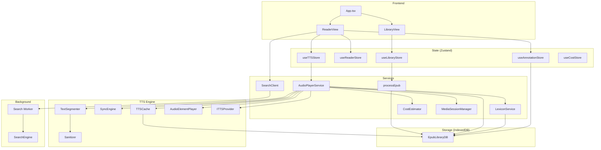

# Versicle Architecture

## Overview

Versicle is a local-first, web-based EPUB reader and manager. It runs entirely in the browser, utilizing IndexedDB for persistent storage, React for the UI, and `epub.js` for rendering. The system is designed for privacy and performance, featuring advanced Text-to-Speech (TTS) capabilities, full-text search, and annotation management without relying on external servers for core functionality.

## System Architecture

## Directory Structure

*   `src/components/`: React UI components.
    *   `library/`: Components for the library view (book grid, upload).
    *   `reader/`: Components for the reader view (renderer, controls, panels).
    *   `ui/`: Reusable primitive components (dialogs, toasts).
*   `src/db/`: IndexedDB configuration and schema definitions.
*   `src/hooks/`: Custom React hooks.
*   `src/lib/`: Core application logic and utilities.
    *   `ingestion.ts`: EPUB processing logic.
    *   `search.ts`: Client-side search interface.
    *   `search-engine.ts`: Worker-side search logic.
    *   `tts/`: Complete Text-to-Speech engine (services, providers, processors).
*   `src/store/`: Zustand state management stores.
*   `src/types/`: TypeScript type definitions.
*   `src/workers/`: Web Worker entry points.
*   `verification/`: Playwright visual verification tests.

---

## Detailed Module Reference

### 1. Data Types (`src/types/`)

#### `src/types/db.ts`
Defines the data structures persisted in IndexedDB.

*   **`interface BookMetadata`**: Metadata for a stored book.
    *   `id`: Unique UUID.
    *   `title`: Book title.
    *   `author`: Author name.
    *   `description`: Book description.
    *   `coverUrl`: Ephemeral Blob URL for display.
    *   `coverBlob`: Binary Blob of the cover image.
    *   `addedAt`: Timestamp of import.
    *   `lastRead`: Timestamp of last access.
    *   `progress`: Reading progress (0-1).
    *   `currentCfi`: Last read location (CFI).
*   **`interface Annotation`**: User-created highlights and notes.
    *   `id`: Unique UUID.
    *   `bookId`: ID of the book.
    *   `cfiRange`: The CFI range of the selection.
    *   `text`: The selected text content.
    *   `type`: 'highlight' or 'note'.
    *   `color`: Color identifier (e.g., 'yellow').
    *   `note`: Optional user note.
    *   `created`: Timestamp.
*   **`interface CachedSegment`**: Cached TTS audio.
    *   `key`: SHA-256 hash key.
    *   `audio`: ArrayBuffer of the audio.
    *   `alignment`: Optional word-level alignment data.
    *   `createdAt`: Timestamp.
    *   `lastAccessed`: Timestamp for LRU eviction.
*   **`interface LexiconRule`**: Pronunciation replacement rule.
    *   `id`: Unique UUID.
    *   `original`: Text to replace.
    *   `replacement`: Replacement text (phonetic).
    *   `isRegex`: Whether `original` is a regex pattern.
    *   `bookId`: Optional book ID scope.

---

### 2. Database (`src/db/`)

#### `src/db/db.ts`
Manages the IndexedDB connection using the `idb` library.

*   **`interface EpubLibraryDB`**: The database schema definition.
    *   Stores: `books`, `files`, `locations`, `annotations`, `tts_cache`, `lexicon`.
*   **`initDB()`**
    *   **Purpose**: Opens the `EpubLibraryDB` database (version 4) and handles schema migrations.
    *   **Returns**: `Promise<IDBPDatabase<EpubLibraryDB>>`.
*   **`getDB()`**
    *   **Purpose**: Returns the active database connection, initializing it if necessary.
    *   **Returns**: `Promise<IDBPDatabase<EpubLibraryDB>>`.

---

### 3. State Management (`src/store/`)

#### `src/store/useLibraryStore.ts`
Manages the collection of books.

*   **State**:
    *   `books`: `BookMetadata[]`.
    *   `isLoading`: `boolean`.
    *   `isImporting`: `boolean`.
    *   `error`: `string | null`.
*   **Actions**:
    *   `fetchBooks()`: Loads all books from DB, sorted by `addedAt`.
    *   `addBook(file: File)`: Processes and adds a new EPUB file.
    *   `removeBook(id: string)`: Deletes a book and all associated data (files, annotations, etc.) from DB.

#### `src/store/useReaderStore.ts`
Manages the reader's view state and settings. Persists to `localStorage`.

*   **State**:
    *   `currentBookId`: `string | null`.
    *   `viewMode`: `'paginated' | 'scrolled'`.
    *   `currentTheme`: `'light' | 'dark' | 'sepia' | 'custom'`.
    *   `fontFamily`: `string`.
    *   `fontSize`: `number` (percentage).
    *   `lineHeight`: `number`.
    *   `currentCfi`: `string | null` (current location).
    *   `progress`: `number` (0-100).
    *   `toc`: `NavigationItem[]`.
    *   `gestureMode`: `boolean`.
*   **Actions**:
    *   `updateLocation(cfi, progress, chapterTitle)`: Updates current position.
    *   `setTheme(...)`, `setFontSize(...)`, etc.: Setters for visual preferences.
    *   `setGestureMode(enabled)`: Toggles the touch gesture overlay.

#### `src/store/useTTSStore.ts`
Manages Text-to-Speech configuration and playback state. Persists settings.

*   **State**:
    *   `isPlaying`: `boolean`.
    *   `status`: `'playing' | 'paused' | 'stopped' | 'loading' | 'completed'`.
    *   `rate`: `number` (speed).
    *   `voice`: `TTSVoice | null`.
    *   `providerId`: `'local' | 'google' | 'openai'`.
    *   `activeCfi`: `string | null`.
    *   `queue`: `TTSQueueItem[]`.
    *   `lastPauseTime`: `number | null` (for smart resume).
    *   `customAbbreviations`: `string[]` (for segmenter).
*   **Actions**:
    *   `play()`, `pause()`, `stop()`: Controls playback via `AudioPlayerService`.
    *   `setRate(rate)`, `setVoice(voice)`: Configures playback.
    *   `setProviderId(id)`: Switches provider and re-initializes.
    *   `loadVoices()`: Fetches available voices from the current provider.
    *   `syncState(...)`: Internal action used by `AudioPlayerService` listeners.

#### `src/store/useAnnotationStore.ts`
Manages user annotations and the popover UI.

*   **State**:
    *   `annotations`: `Annotation[]`.
    *   `popover`: `{ visible, x, y, cfiRange, text }`.
*   **Actions**:
    *   `loadAnnotations(bookId)`: Fetches annotations for a book.
    *   `addAnnotation(...)`, `deleteAnnotation(id)`: CRUD operations on annotations.
    *   `showPopover(...)`, `hidePopover()`: Controls the annotation menu visibility.

---

### 4. Core Logic (`src/lib/`)

#### Ingestion (`src/lib/ingestion.ts`)
*   **`processEpub(file: File): Promise<string>`**
    *   **Purpose**: Parses an uploaded EPUB, extracts the cover image (handling Blob URLs), and saves the binary and metadata to IndexedDB.
    *   **Parameters**: `file` - The uploaded EPUB file.
    *   **Returns**: The UUID of the new book.

#### Search Client (`src/lib/search.ts`)
*   **`class SearchClient` (Singleton)**
    *   **`indexBook(book: Book, bookId: string): Promise<void>`**
        *   **Purpose**: Extracts text from all book chapters and sends it to the worker for indexing.
    *   **`search(query: string, bookId: string): Promise<SearchResult[]>`**
        *   **Purpose**: Sends a search request to the worker and awaits results via a correlation ID.
    *   **`terminate()`**: Kills the worker.

#### Search Engine (`src/lib/search-engine.ts`)
*   **`class SearchEngine`** (Runs in Worker)
    *   Uses `FlexSearch` to index and search text.
    *   **`indexBook(bookId, sections)`**: Creates a document index for the book.
    *   **`search(bookId, query)`**: Returns matches with text excerpts.

#### Text-to-Speech (`src/lib/tts/`)

**Service: `AudioPlayerService` (`src/lib/tts/AudioPlayerService.ts`)**
The central controller for TTS. Singleton.

*   **Methods**:
    *   `init()`: Initializes the active provider.
    *   `play()`: Starts playback. Handles lexicon application, caching (for cloud), and cost tracking.
    *   `pause()`: Pauses playback and records timestamp.
    *   `resume()`: Resumes playback. Implements "Smart Resume" (rewinds context based on pause duration).
    *   `stop()`: Stops playback and resets state.
    *   `setQueue(items, startIndex)`: Loads a new playlist of sentences.
    *   `setProvider(provider)`: Swaps the TTS engine (Local <-> Cloud).
    *   `generatePreroll(chapterTitle, wordCount, speed)`: Creates a spoken intro string.
    *   `subscribe(listener)`: Allows UI to listen to state changes.

**Segmentation: `TextSegmenter` (`src/lib/tts/TextSegmenter.ts`)**
*   **`segment(text: string): TextSegment[]`**
    *   **Purpose**: Splits text into sentences.
    *   **Logic**: Uses `Intl.Segmenter` combined with custom heuristic merging for abbreviations (e.g., "Mr.", "Dr.") and sentence starters to prevent incorrect splits.

**Caching: `TTSCache` (`src/lib/tts/TTSCache.ts`)**
*   **`generateKey(text, voiceId, speed, ...): Promise<string>`**: Creates a SHA-256 hash key.
*   **`get(key)`**: Retrieves cached audio/alignment from IndexedDB.
*   **`put(key, audio, alignment)`**: Saves synthesis results.

**Lexicon: `LexiconService` (`src/lib/tts/LexiconService.ts`)**
*   **`applyLexicon(text, rules)`**: Performs text replacements (string or regex) before synthesis.
*   **`getRules(bookId?)`**: Fetches global and book-specific rules.

**Sync: `SyncEngine` (`src/lib/tts/SyncEngine.ts`)**
*   **`updateTime(currentTime)`**: Updates the active word/sentence index based on audio playback time.
*   **`loadAlignment(data)`**: Loads timing data from the provider.

**Player Wrapper: `AudioElementPlayer` (`src/lib/tts/AudioElementPlayer.ts`)**
*   Wraps `HTMLAudioElement` to handle Blob playback, cleanup (`revokeObjectURL`), and event mapping.

**Session: `MediaSessionManager` (`src/lib/tts/MediaSessionManager.ts`)**
*   Interacts with the browser's Media Session API to support hardware media keys (Play, Pause, Next, Prev) and lock screen metadata.

#### Utilities (`src/lib/tts.ts`)
*   **`extractSentences(rendition: Rendition): SentenceNode[]`**
    *   **Purpose**: Traverses the DOM of the current `epub.js` view to extract text nodes, handling block-level elements to preserve structure, and segments them into sentences for TTS.

---

### 5. Components (`src/components/`)

#### Reader (`src/components/reader/ReaderView.tsx`)
The core reading interface.
*   **Responsibilities**:
    *   Initializes `epub.js` `Rendition`.
    *   Manages "Paginated" vs "Scrolled" view modes.
    *   Injects custom CSS for Themes and Highlights.
    *   Highlights the active TTS sentence (`activeCfi`).
    *   Handles text selection for Annotations (with fallback for iframe events).
    *   Integrates `GestureOverlay` for touch controls.
    *   Manages sidebars (TOC, Annotations, Search).

#### Library (`src/components/library/LibraryView.tsx`)
The bookshelf interface.
*   **Responsibilities**:
    *   Displays grid of `BookCard` components.
    *   Handles file uploads via `FileUploader` (drag-and-drop).
    *   Provides search/filter for the library.

#### Audio Panel (`src/components/reader/UnifiedAudioPanel.tsx`)
A side panel (Sheet) for advanced audio controls.
*   Contains `TTSQueue` (visual playback list) and playback controls.

---

### 6. Workers (`src/workers/`)

#### `search.worker.ts`
*   **Input**: `INDEX_BOOK` or `SEARCH` messages.
*   **Output**: `SEARCH_RESULTS` or status updates.
*   **Purpose**: Offloads heavy text processing and indexing to a background thread to keep the UI responsive.
