# Versicle Architecture

## 1. High-Level Overview

Versicle is a **Local-First**, **Privacy-Centric** EPUB reader and audiobook player that runs entirely in the browser (or as a Hybrid Mobile App via Capacitor).

### Core Design Principles

1.  **Local-First & Offline-Capable**:
    *   **Why**: To provide zero-latency access, total privacy (no reading analytics sent to a server), and true ownership of data. Users should be able to read their books without an internet connection or fear of service shutdown.
    *   **How**: All data—books, annotations, progress, and settings—is stored in **IndexedDB** via the `idb` wrapper. The app is a PWA that functions completely offline.
    *   **Trade-off**: Data is bound to the device. Syncing across devices requires manual backup/restore (JSON/ZIP export), as there is no central sync server. Storage is limited by the browser's quota.

2.  **Heavy Client-Side Logic**:
    *   **Why**: To avoid server costs and maintain privacy. Features typically done on a backend (Text-to-Speech segmentation, Full-Text Indexing, File Parsing) are moved to the client.
    *   **How**:
        *   **Search**: Uses a **Web Worker** running a custom `SearchEngine` with **RegExp** scanning to find text in memory.
        *   **TTS**: Uses client-side logic (`TextSegmenter`) with JIT refinement to split text into sentences and caches audio segments locally (`TTSCache`).
        *   **Ingestion**: Parses EPUB files directly in the browser using `epub.js` and a custom **Offscreen Renderer** for accurate text extraction.
    *   **Trade-off**: Higher memory and CPU usage on the client device. Large books may take seconds to index for search or parse for ingestion.

3.  **Hybrid Text-to-Speech (TTS)**:
    *   **Why**: To balance quality, cost, and offline availability.
    *   **How**:
        *   **Local**: Uses the Web Speech API (OS native) or local WASM models (Piper) for free, offline reading.
        *   **Cloud**: Integrates with Google/OpenAI/LemonFox for high-quality neural voices, but caches generated audio to minimize API costs and latency on replay.
    *   **Stability**: The system implements a "Let It Crash" philosophy for worker management to ensure resilience.

### User Interface: The "Three Rooms"

The UI is organized into three distinct operational modes to reduce cognitive load:
1.  **The Reading Room**: The distraction-free reading interface, controlled via `VisualSettings` (fonts, themes, layout).
2.  **The Listening Room**: The audio experience, managed by `UnifiedAudioPanel` (playback, speed, voice selection).
3.  **The Engine Room**: Global configuration, handled by `GlobalSettingsDialog` (data management, API keys, advanced imports).

## 2. System Architecture Diagram

```mermaid
graph TD
    subgraph Frontend [React UI]
        App[App.tsx]
        Library[LibraryView]
        Reader[ReaderView]
        VisualSettings[VisualSettings]
        AudioPanel[UnifiedAudioPanel]
        GlobalSettings[GlobalSettingsDialog]
        useEpub[useEpubReader Hook]
    end

    subgraph State [Zustand Stores]
        ReaderStore[useReaderStore]
        TTSStore[useTTSStore]
        LibStore[useLibraryStore]
        AnnotStore[useAnnotationStore]
        GenAIStore[useGenAIStore]
        UIStore[useUIStore]
        ToastStore[useToastStore]
    end

    subgraph Core [Core Services]
        APS[AudioPlayerService]
        Pipeline[AudioContentPipeline]
        Ingestion[ingestion.ts]
        BatchIngestion[batch-ingestion.ts]
        SearchClient[SearchClient]
        Backup[BackupService]
        Maint[MaintenanceService]
        GenAI[GenAIService]
        CostEst[CostEstimator]
        TaskRunner[cancellable-task-runner.ts]
        MediaSession[MediaSessionManager]
    end

    subgraph TTS [TTS Subsystem]
        Segmenter[TextSegmenter]
        Lexicon[LexiconService]
        TTSCache[TTSCache]
        Sync[SyncEngine]
        Providers[ITTSProvider]
        Piper[PiperProvider]
        PiperUtils[piper-utils.ts]
        BG[BackgroundAudio]
    end

    subgraph Workers [Web Workers]
        SearchWorker[search.worker.ts]
        SearchEngine[SearchEngine]
    end

    subgraph Storage [IndexedDB]
        DBService[DBService]
        IDB[(IndexedDB)]
    end

    App --> Library
    App --> Reader
    Reader --> VisualSettings
    Reader --> AudioPanel
    Reader --> GlobalSettings
    Reader --> useEpub

    VisualSettings --> ReaderStore
    AudioPanel --> TTSStore
    GlobalSettings --> UIStore

    TTSStore --> APS
    Library --> LibStore
    LibStore --> DBService
    LibStore --> Ingestion
    LibStore --> BatchIngestion
    LibStore --> Backup
    LibStore --> Maint

    APS --> Pipeline
    Pipeline --> GenAI
    Pipeline --> GenAIStore
    Pipeline --> DBService

    APS --> Providers
    APS --> Segmenter
    APS --> Lexicon
    APS --> TTSCache
    APS --> Sync
    APS --> Piper
    APS --> CostEst
    APS --> BG
    APS --> MediaSession

    Piper --> PiperUtils

    Reader --> SearchClient
    SearchClient --> SearchWorker
    SearchWorker --> SearchEngine

    GenAIStore --> GenAI

    Ingestion --> DBService
    TTSCache --> DBService

    DBService --> IDB
```

## 3. Detailed Module Reference

### Data Layer (`src/db/`)

The data layer is built on **IndexedDB** using the `idb` library. It is accessed primarily through the `DBService` singleton, which provides a high-level API for all storage operations.

#### `src/db/DBService.ts`
The main database abstraction layer. It handles error wrapping (converting DOM errors to typed application errors like `StorageFullError`), transaction management, and debouncing for frequent writes.

**Key Stores (Schema v15):**
*   `books`: Metadata and 50KB thumbnail blobs.
*   `files`: The raw binary EPUB files (large).
*   `table_images`: **(New)** Stores `webp` snapshots of tables captured during ingestion. Keyed by `${bookId}-${cfi}`.
*   `content_analysis`: **(New)** Stores GenAI classification results (e.g., this block is a footnote).
*   `tts_cache`: Stores generated audio segments.
*   `reading_history`: Tracks user sessions.

**Key Functions:**
*   **`saveProgress(bookId, cfi, progress)`**: Debounced (1s) persistence of reading position.
    *   *Trade-off*: A crash within 1 second of reading might lose the very last position update.
*   **`saveTTSState(bookId, queue, currentIndex)`**: Persists the playback queue and position.
*   **`updateReadingHistory(bookId, newRange, type)`**: Records reading sessions.
    *   *Logic*: Merges overlapping ranges. Coalesces events within 5 minutes into a single session to prevent database bloat.
    *   *Limits*: Enforces a rolling window of the last 100 sessions per book.
*   **`offloadBook(id)`**: Deletes the large binary EPUB file (`files` store) to save space but keeps metadata, annotations, and reading progress.
    *   *Trade-off*: User must re-import the *exact same file* (verified via 3-point fingerprint) to read again.

#### Hardening: Validation & Sanitization (`src/db/validators.ts`)
*   **Goal**: Prevent database corruption and XSS attacks.
*   **Logic**:
    *   **Magic Number Check**: Verifies ZIP signature (`50 4B 03 04`) before parsing.
    *   **Sanitization**: Delegates to `DOMPurify` to strip HTML tags from metadata.

### Core Logic & Services (`src/lib/`)

#### Ingestion (`src/lib/ingestion.ts`)
Handles the complex task of importing an EPUB file.

*   **`processEpub(file)`**:
    1.  **Validation**: Checks ZIP headers.
    2.  **Offscreen Rendering**: Uses a hidden `iframe` (via `offscreen-renderer.ts`) to render chapters.
        *   *Logic*: Scrapes text nodes for TTS and uses `snapdom` to capture tables as images.
    3.  **Fingerprinting**: Generates a **"3-Point Fingerprint"** (Head + Metadata + Tail) using a `cheapHash` function for O(1) duplicate detection.
        *   *Trade-off*: Theoretical risk of collision is negligible for personal library scale, while performance gain is massive compared to SHA-256.
    4.  **Sanitization**: Registers an `epub.js` hook to sanitize HTML content before rendering.

#### Batch Ingestion (`src/lib/batch-ingestion.ts`)
*   **Goal**: Allow bulk import of multiple EPUBs or ZIP archives containing books.
*   **Logic**:
    *   **ZIP Expansion**: Uses `JSZip` to recursively scan and extract `.epub` files from uploaded archives.
    *   **Sequential Processing**: Processes files one by one to avoid memory spikes, reporting progress to the UI.
*   **Trade-off**: Processing a large ZIP happens on the main thread (mostly), which might cause minor UI jank.

#### Generative AI (`src/lib/genai/`)
Enhances the reading experience using LLMs.

*   **Logic**:
    *   **Service**: Wrapper around **Gemini 2.5 Flash Lite** (via `@google/generative-ai`).
    *   **Structured Output**: Enforces strict JSON schemas for all responses (e.g., content classification).
    *   **Classification**: Classifies text blocks as `title`, `footnote`, `main`, `table`, or `other`.
    *   **Mocking**: Supports `localStorage` mocks (`mockGenAIResponse`) for cost-free E2E testing.
*   **Trade-off**: Requires an active internet connection and a Google API Key. Privacy implication: Book text snippets are sent to Google's servers.

#### Search (`src/lib/search.ts` & `src/workers/search.worker.ts`)
Implements full-text search off the main thread to prevent UI freezing.

*   **Logic**: Uses a simple **RegExp** scanning approach over in-memory text.
    *   *Why*: `FlexSearch` (previously used) proved too memory-intensive and complex for typical "find on page" use cases in personal libraries.
    *   **Offloading**: If supported, XML parsing is offloaded to the worker (`DOMParser` in Worker) to further unblock the main thread.
    *   **Direct Archive Access**: Attempts to read raw XML from the ZIP archive (via `JSZip`) to bypass the slow `epub.js` rendering pipeline.
*   **Trade-off**: The index is **transient** (in-memory only). It is rebuilt every time the user opens a book. Linear scanning is slower than an inverted index for massive corpora but perfectly adequate for single books.

#### Backup (`src/lib/BackupService.ts`)
Manages internal state backup and restoration (JSON/ZIP).

*   **`createLightBackup()`**: Exports JSON containing metadata, themes, settings, and reading history.
*   **`createFullBackup()`**: Exports a ZIP file containing the "Light" JSON manifest plus all original `.epub` files.
    *   *Logic*: Uses `JSZip` to stream file content from IndexedDB into a downloadable archive.
*   **`restoreBackup()`**:
    *   **Smart Merge**: If a book already exists, it only updates reading progress if the backup's timestamp is newer.
    *   **Sanitization**: Validates and sanitizes all metadata in the backup manifest before writing to the DB.

#### Cost Estimator (`src/lib/tts/CostEstimator.ts`)
*   **Goal**: Provide users with a rough estimate of API costs for Cloud TTS usage during a session.
*   **Logic**: Tracks total characters sent to paid providers (Google, OpenAI) in a transient Zustand store (`useCostStore`).
*   **Trade-off**: Estimates are client-side approximations and do not account for billing nuances (e.g., minimum request size, retries).

#### Maintenance (`src/lib/MaintenanceService.ts`)
Handles database health and integrity.

*   **Goal**: Ensure the database is free of orphaned records (files, annotations, lexicon rules) that no longer have a parent book.
*   **Logic**: Scans all object stores and compares IDs against the `books` store.
*   **Trade-off**: `pruneOrphans()` is a destructive operation. If logic is flawed, valid data could be lost.

---

### TTS Subsystem (`src/lib/tts/`)

#### `src/lib/tts/AudioPlayerService.ts`
The Orchestrator. Manages playback state, provider selection, and UI updates.

*   **Logic**:
    *   **Delegation**: Offloads content loading and filtering to `AudioContentPipeline`.
    *   **Concurrency**: Uses `TaskSequencer` (`enqueue`) to serialize async operations (Play -> Pause -> Next).
    *   **Persistence**: Syncs state to `DBService` for resume-on-restart.

#### `src/lib/tts/AudioContentPipeline.ts`
The Data Pipeline for TTS.

*   **Goal**: Separate "what to play" (Content) from "how to play it" (Player).
*   **Logic**:
    *   **Precise Grouping**: Groups sentences by their "Root CFI" (e.g., all cells in a table share a common `<table>` parent).
    *   **Content Filtering**: Uses GenAI analysis (from `content_analysis` store) to filter out unwanted blocks (footnotes, tables) based on user settings.
    *   **Speculative Execution**: Implements `triggerNextChapterAnalysis` to analyze the *next* chapter in the background while the current one plays.

#### `src/lib/tts/providers/CapacitorTTSProvider.ts`
Native mobile TTS integration.

*   **Goal**: Gapless playback on Android/iOS.
*   **Logic (Smart Handoff)**:
    *   **Queue Strategy 1**: Uses `queueStrategy: 1` (Add) to preload the next utterance into the OS buffer while the current one plays.
    *   **Promise Adoption**: If `play()` is called and matches the preloaded text, it adopts the existing promise instead of stopping and restarting the engine.

#### `src/lib/tts/providers/PiperProvider.ts`
Local WASM Neural TTS.

*   **Transactional Download**:
    1.  **Staging**: Download to memory.
    2.  **Verify**: Commit to Cache API only if successful.
    3.  **Integrity**: Test synthesis before marking as ready.
*   **Stitching**: Stitches multiple WAV blobs (from split sentences) into a single seamless audio file.

#### Resilience: `piper-utils.ts` ("Let It Crash")
*   **Goal**: Prevent the application from entering invalid states if the Piper WASM worker crashes.
*   **Logic**: Instead of a complex "Supervisor" that attempts restarts, we use a simple **Error Boundary** pattern. If the worker crashes or errors, the current request rejects immediately. The worker is terminated, and a fresh instance is lazily created on the next request.
*   **Philosophy**: Simplicity > Complex Recovery.

#### `src/lib/tts/LexiconService.ts`
Manages pronunciation rules.

*   **Goal**: Fix mispronounced words.
*   **Logic**:
    *   **Rules**: Supports simple string replacement and **RegExp**.
    *   **Cache Invalidation**: Uses `getRulesHash` to generate a checksum of active rules. This hash is embedded in the TTS cache key, ensuring that if rules change, previously generated audio is invalidated and re-synthesized.

---

### Reader Subsystem (`src/hooks/`)

#### CFI Normalization & Precise Grouping (`src/lib/cfi-utils.ts`)
*   **Goal**: Ensure annotations and TTS playback align perfectly with logical text blocks.
*   **Logic**:
    *   **Leaf Stripping**: Strips leaf offsets to target the containing block element.
    *   **Snap to Known Roots**: Explicitly snaps selection to known structural roots (like `<table>`) to ensure atomic treatment of complex elements.
*   **Trade-off**: Sacrifices granular addressing within complex structures. It is impossible to highlight a single cell in a table or a specific span within a figure caption; the entire block is treated as the atomic unit.

---

### State Management (`src/store/`)

State is managed using **Zustand**.

*   **`useReaderStore`**: Persists visual preferences (Theme, Font).
*   **`useTTSStore`**: Persists TTS settings (Voice, Rate, API Keys). Subscribes to `AudioPlayerService`.
*   **`useGenAIStore`**: Persists AI settings and usage stats.
*   **`useLibraryStore`**: Transient UI state for the library view.

### UI Layer

#### Mobile Integration
*   **Safe Area**: Uses `@capacitor-community/safe-area` to handle notches/dynamic islands.
*   **Media Session**: Overrides peer dependencies in `package.json` to support Capacitor 7.
