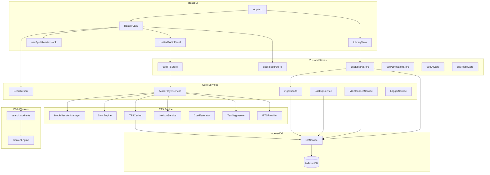

# Versicle Architecture

## Overview

Versicle is a sophisticated, local-first web-based EPUB reader designed for advanced reading capabilities, privacy, and performance. It runs entirely in the browser, utilizing IndexedDB for persistent storage, React for the UI, and `epub.js` for rendering.

Key architectural characteristics:
*   **Local-First**: All data (books, annotations, progress) is stored locally in IndexedDB. No server is required for core functionality.
*   **Offline-Capable**: The app is a Progressive Web App (PWA) and functions fully offline.
*   **Heavy Client-Side Logic**: Complex tasks like text ingestion, search indexing, and TTS text segmentation happen in the browser, often offloaded to Web Workers.
*   **Hybrid TTS**: Supports both local Web Speech API (free, offline) and cloud-based Neural TTS (Google, OpenAI) with local caching.

## System Architecture

## Directory Structure

*   **`src/components/`**: React UI components, organized by feature (library, reader, ui).
*   **`src/db/`**: Database configuration and abstraction layer.
*   **`src/hooks/`**: Custom React hooks.
*   **`src/lib/`**: Core business logic and singleton services.
    *   **`tts/`**: The complete Text-to-Speech subsystem.
*   **`src/store/`**: Global state management using Zustand.
*   **`src/types/`**: TypeScript type definitions.
*   **`src/workers/`**: Web Worker entry points for background processing.
*   **`verification/`**: Python-based Playwright visual verification suite.

---

## Detailed Module Reference

### 1. Data Layer (`src/types/`, `src/db/`)

The data layer is built on **IndexedDB** using the `idb` library. It is accessed primarily through the `DBService` singleton.

#### `src/types/db.ts`
Defines the schema for objects stored in IndexedDB.

*   **`interface BookMetadata`**
    *   `id`: `string` - Unique UUID for the book.
    *   `title`: `string` - Book title.
    *   `author`: `string` - Author name.
    *   `description?`: `string` - Book description.
    *   `coverUrl?`: `string` - Ephemeral Blob URL for display.
    *   `coverBlob?`: `Blob` - Binary Blob of the cover image.
    *   `addedAt`: `number` - Timestamp of import.
    *   `lastRead?`: `number` - Timestamp of last access.
    *   `progress?`: `number` - Reading progress (0.0 - 1.0).
    *   `currentCfi?`: `string` - Last read location (CFI).
    *   `lastPlayedCfi?`: `string` - Last location played by TTS.
    *   `lastPauseTime?`: `number` - Timestamp when TTS was last paused.
    *   `fileHash?`: `string` - SHA-256 hash of the EPUB file.
    *   `isOffloaded?`: `boolean` - Whether the binary file is removed.
    *   `fileSize?`: `number` - Size of the file in bytes.
    *   `syntheticToc?`: `NavigationItem[]` - Generated TOC.
    *   `totalChars?`: `number` - Total character count.

*   **`interface SectionMetadata`**
    *   `id`: `string` - Composite key.
    *   `bookId`: `string` - Book ID.
    *   `sectionId`: `string` - Section href.
    *   `characterCount`: `number` - Length of section.
    *   `playOrder`: `number` - Sequence order.

*   **`interface Annotation`**
    *   `id`: `string` - UUID.
    *   `bookId`: `string` - Book ID.
    *   `cfiRange`: `string` - CFI range of selection.
    *   `text`: `string` - Selected text.
    *   `type`: `'highlight' | 'note'`.
    *   `color`: `string` - Color code.
    *   `note?`: `string` - User note.
    *   `created`: `number` - Timestamp.

*   **`interface CachedSegment`**
    *   `key`: `string` - SHA-256 hash key.
    *   `audio`: `ArrayBuffer` - Audio data.
    *   `alignment?`: `Timepoint[]` - Synchronization data.
    *   `createdAt`: `number`.
    *   `lastAccessed`: `number`.

*   **`interface TTSState`**
    *   `bookId`: `string`.
    *   `queue`: `TTSQueueItem[]` - Persisted playback queue.
    *   `currentIndex`: `number`.
    *   `updatedAt`: `number`.

*   **`interface LexiconRule`**
    *   `id`: `string`.
    *   `original`: `string` - Text to match.
    *   `replacement`: `string` - Phonetic replacement.
    *   `isRegex?`: `boolean`.
    *   `bookId?`: `string` - Scope (null for global).
    *   `created`: `number`.

#### `src/db/DBService.ts`
The main database abstraction layer. Handles all read/write operations, transactions, and error handling.

**Class: `DBService`**

*   **`getLibrary()`**
    *   **Purpose**: Retrieves all books in the library.
    *   **Returns**: `Promise<BookMetadata[]>` - List of validated book metadata sorted by import date.
*   **`getBook(id)`**
    *   **Purpose**: Retrieves metadata and binary file for a book.
    *   **Params**: `id: string` - Book ID.
    *   **Returns**: `Promise<{ metadata: BookMetadata | undefined; file: Blob | ArrayBuffer | undefined }>`
*   **`getBookMetadata(id)`**
    *   **Purpose**: Retrieves only metadata.
    *   **Params**: `id: string`.
    *   **Returns**: `Promise<BookMetadata | undefined>`
*   **`getBookFile(id)`**
    *   **Purpose**: Retrieves only the binary file.
    *   **Params**: `id: string`.
    *   **Returns**: `Promise<Blob | ArrayBuffer | undefined>`
*   **`addBook(file)`**
    *   **Purpose**: Imports a new book (delegates to `processEpub`).
    *   **Params**: `file: File`.
    *   **Returns**: `Promise<void>`
*   **`deleteBook(id)`**
    *   **Purpose**: Deletes a book and all cascading data (files, annotations, locations, queue, lexicon).
    *   **Params**: `id: string`.
    *   **Returns**: `Promise<void>`
*   **`offloadBook(id)`**
    *   **Purpose**: Removes the binary file to save space but preserves metadata and userdata. Calculates hash if missing.
    *   **Params**: `id: string`.
    *   **Returns**: `Promise<void>`
*   **`restoreBook(id, file)`**
    *   **Purpose**: Re-attaches a binary file to an offloaded book, verifying the SHA-256 hash.
    *   **Params**: `id: string`, `file: File`.
    *   **Returns**: `Promise<void>`
*   **`saveProgress(bookId, cfi, progress)`**
    *   **Purpose**: Saves reading progress (Debounced).
    *   **Params**: `bookId: string`, `cfi: string`, `progress: number`.
    *   **Returns**: `void`
*   **`updatePlaybackState(bookId, lastPlayedCfi?, lastPauseTime?)`**
    *   **Purpose**: Updates TTS-specific state (last played position, pause time).
    *   **Params**: `bookId: string`, `lastPlayedCfi?: string`, `lastPauseTime?: number | null`.
    *   **Returns**: `Promise<void>`
*   **`saveTTSState(bookId, queue, currentIndex)`**
    *   **Purpose**: Persists the entire TTS playback queue (Debounced).
    *   **Params**: `bookId: string`, `queue: TTSQueueItem[]`, `currentIndex: number`.
    *   **Returns**: `void`
*   **`getTTSState(bookId)`**
    *   **Purpose**: Retrieves persisted TTS queue.
    *   **Params**: `bookId: string`.
    *   **Returns**: `Promise<TTSState | undefined>`
*   **`addAnnotation(annotation)`**
    *   **Purpose**: Saves a new annotation.
    *   **Params**: `annotation: Annotation`.
    *   **Returns**: `Promise<void>`
*   **`getAnnotations(bookId)`**
    *   **Purpose**: Retrieves annotations for a book.
    *   **Params**: `bookId: string`.
    *   **Returns**: `Promise<Annotation[]>`
*   **`deleteAnnotation(id)`**
    *   **Purpose**: Deletes an annotation.
    *   **Params**: `id: string`.
    *   **Returns**: `Promise<void>`
*   **`getCachedSegment(key)`**
    *   **Purpose**: Retrieves a cached audio segment.
    *   **Params**: `key: string`.
    *   **Returns**: `Promise<CachedSegment | undefined>`
*   **`cacheSegment(key, audio, alignment?)`**
    *   **Purpose**: Stores an audio segment in cache.
    *   **Params**: `key: string`, `audio: ArrayBuffer`, `alignment?: any[]`.
    *   **Returns**: `Promise<void>`
*   **`getLocations(bookId)`**
    *   **Purpose**: Retrieves stored `epub.js` locations.
    *   **Params**: `bookId: string`.
    *   **Returns**: `Promise<BookLocations | undefined>`
*   **`saveLocations(bookId, locations)`**
    *   **Purpose**: Stores `epub.js` locations.
    *   **Params**: `bookId: string`, `locations: string`.
    *   **Returns**: `Promise<void>`

#### `src/db/validators.ts`
Utilities for data validation.

*   **`validateBookMetadata(data)`**
    *   **Purpose**: Checks if an object adheres to the `BookMetadata` interface. Logs warnings for missing fields.
    *   **Params**: `data: any` - The object to validate.
    *   **Returns**: `boolean` - True if valid.

---

### 2. Core Logic & Services (`src/lib/`)

#### Ingestion (`src/lib/ingestion.ts`)
Handles the parsing and import of EPUB files.

*   **`computeFileHash(file)`**
    *   **Purpose**: incrementally computes SHA-256 hash of a file.
    *   **Params**: `file: File`.
    *   **Returns**: `Promise<string>` (Hex hash).
*   **`processEpub(file)`**
    *   **Purpose**: Parses EPUB, extracts metadata/cover, generates synthetic TOC if needed, calculates character counts, and saves to DB.
    *   **Params**: `file: File`.
    *   **Returns**: `Promise<string>` (New Book ID).

#### Search (`src/lib/search.ts`, `src/lib/search-engine.ts`)
Client-side interface and Worker implementation for FlexSearch.

**Class: `SearchClient`**
*   **`indexBook(book, bookId, onProgress?)`**
    *   **Purpose**: Extracts text from the book and sends it to the worker for indexing.
    *   **Params**: `book: Book` (epub.js instance), `bookId: string`, `onProgress?: (percent) => void`.
    *   **Returns**: `Promise<void>`
*   **`search(query, bookId)`**
    *   **Purpose**: Queries the worker for search results.
    *   **Params**: `query: string`, `bookId: string`.
    *   **Returns**: `Promise<SearchResult[]>`
*   **`terminate()`**
    *   **Purpose**: Kills the worker.

**Class: `SearchEngine` (Worker Internal)**
*   **`initIndex(bookId)`**: Initializes an empty FlexSearch index.
*   **`addDocuments(bookId, sections)`**: Adds text sections to the index.
*   **`search(bookId, query)`**: Executes search and returns results with excerpts.

#### Backup (`src/lib/BackupService.ts`)
Handles data export and import.

**Class: `BackupService`**
*   **`createLightBackup()`**
    *   **Purpose**: Exports JSON containing metadata, annotations, lexicon, and locations (no files).
    *   **Returns**: `Promise<void>` (Trigger file download).
*   **`createFullBackup(onProgress?)`**
    *   **Purpose**: Exports ZIP containing manifest JSON and all EPUB files.
    *   **Params**: `onProgress?: (percent, message) => void`.
    *   **Returns**: `Promise<void>` (Trigger file download).
*   **`restoreBackup(file, onProgress?)`**
    *   **Purpose**: Restores data from JSON or ZIP. Handles merging and verification.
    *   **Params**: `file: File`, `onProgress?: (percent, message) => void`.
    *   **Returns**: `Promise<void>`

#### Maintenance (`src/lib/MaintenanceService.ts`)
Database integrity tools.

**Class: `MaintenanceService`**
*   **`scanForOrphans()`**
    *   **Purpose**: Finds records (files, annotations) detached from books.
    *   **Returns**: `Promise<{ files: number; annotations: number; ... }>`
*   **`pruneOrphans()`**
    *   **Purpose**: Deletes orphaned records.
    *   **Returns**: `Promise<void>`

#### Logging (`src/lib/logger.ts`)
**Class: `LoggerService`**
*   **`info(context, message, data?)`**: Logs info level messages.
*   **`warn(context, message, data?)`**: Logs warning level messages.
*   **`error(context, message, error?)`**: Logs error level messages.
*   **`debug(context, message, data?)`**: Logs debug level messages.

#### Utilities (`src/lib/utils.ts`)
*   **`cn(...inputs)`**: Merges Tailwind CSS classes using `clsx` and `tailwind-merge`.

---

### 3. Text-to-Speech Subsystem (`src/lib/tts/`)

A complex engine managing playback, queueing, providers, and synchronization.

#### `src/lib/tts/AudioPlayerService.ts`
The singleton controller for TTS.

**Class: `AudioPlayerService`**
*   **`getInstance()`**: Returns the singleton instance.
*   **`setBookId(bookId)`**
    *   **Purpose**: Sets context. Restores the persisted queue for this book.
    *   **Params**: `bookId: string | null`.
*   **`play()`**
    *   **Purpose**: Starts playback. Handles concurrency locking and provider synthesis.
    *   **Returns**: `Promise<void>`.
*   **`pause()`**
    *   **Purpose**: Pauses playback. Saves state.
    *   **Returns**: `Promise<void>`.
*   **`resume()`**
    *   **Purpose**: Resumes playback. Implements "Smart Resume" (rewinds slightly based on pause duration).
    *   **Returns**: `Promise<void>`.
*   **`stop()`**
    *   **Purpose**: Stops playback, releases Foreground Service (Android), resets state.
    *   **Returns**: `Promise<void>`.
*   **`next()` / `prev()`**
    *   **Purpose**: Skips to next/previous item in queue.
*   **`jumpTo(index)`**
    *   **Purpose**: Jumps to specific queue index.
    *   **Params**: `index: number`.
*   **`seek(offset)`**
    *   **Purpose**: Seeks by seconds (Cloud) or items (Local).
    *   **Params**: `offset: number` (seconds).
*   **`setQueue(items, startIndex?)`**
    *   **Purpose**: Updates the playlist.
    *   **Params**: `items: TTSQueueItem[]`, `startIndex: number`.
*   **`setProvider(provider)`**
    *   **Purpose**: Hot-swaps the TTS provider (e.g., Local -> Google).
    *   **Params**: `provider: ITTSProvider`.
*   **`setVoice(voiceId)`**
    *   **Purpose**: Changes the active voice.
    *   **Params**: `voiceId: string`.
*   **`setSpeed(speed)`**
    *   **Purpose**: Changes playback rate.
    *   **Params**: `speed: number`.
*   **`preview(text)`**
    *   **Purpose**: Plays a single utterance (for testing lexicon).
    *   **Params**: `text: string`.
*   **`subscribe(listener)`**
    *   **Purpose**: Adds a state change listener.
    *   **Params**: `listener: PlaybackListener`.
    *   **Returns**: Unsubscribe function.

#### `src/lib/tts/TextSegmenter.ts`
Splits text into sentences.

**Class: `TextSegmenter`**
*   **`segment(text)`**
    *   **Purpose**: Splits text using `Intl.Segmenter` and applies heuristics to merge abbreviations (e.g., "Mr.").
    *   **Params**: `text: string`.
    *   **Returns**: `TextSegment[]` (text, index, length).

#### `src/lib/tts/LexiconService.ts`
Manages pronunciation rules.

**Class: `LexiconService`**
*   **`getRules(bookId?)`**: Fetches rules.
*   **`saveRule(rule)`**: Saves a rule.
*   **`deleteRule(id)`**: Deletes a rule.
*   **`applyLexicon(text, rules)`**
    *   **Purpose**: Applies regex/string replacements to text.
    *   **Params**: `text: string`, `rules: LexiconRule[]`.
    *   **Returns**: `string` (Processed text).
*   **`getRulesHash(rules)`**: Generates hash for cache invalidation.

#### `src/lib/tts/SyncEngine.ts`
Maps audio time to text characters.

**Class: `SyncEngine`**
*   **`loadAlignment(alignment)`**: Loads timing data.
*   **`updateTime(currentTime)`**: Updates internal state based on audio time.
*   **`setOnHighlight(callback)`**: Registers callback for highlighting.

#### `src/lib/tts/TTSCache.ts`
**Class: `TTSCache`**
*   **`generateKey(...)`**: Creates cache key.
*   **`get(key)`**: Retrieves cached segment.
*   **`put(key, audio, alignment)`**: Saves segment.

#### `src/lib/tts/CostEstimator.ts`
Tracks and estimates cloud TTS costs.

**Class: `CostEstimator`**
*   **`getInstance()`**: Singleton access.
*   **`track(text)`**: Adds character usage count to session.
*   **`getSessionUsage()`**: Returns total characters used in session.
*   **`estimateCost(text, provider)`**: Calculates estimated cost in USD based on provider pricing.

#### `src/lib/tts/CsvUtils.ts`
Helpers for CSV import/export.

**Object: `LexiconCSV`**
*   **`parse(text)`**: Parses CSV string into `LexiconRule` partials.
*   **`generate(rules)`**: Generates CSV string from rules.

**Object: `SimpleListCSV`**
*   **`parse(text, header?)`**: Parses simple newline-separated lists.
*   **`generate(items, header)`**: Generates string list.

#### `src/lib/tts/MediaSessionManager.ts`
Handles integration with OS media controls (Android/Web).

**Class: `MediaSessionManager`**
*   **`setMetadata(metadata)`**: Updates title, artist, and artwork.
*   **`setPlaybackState(state)`**: Updates playing/paused status and position/duration.

---

### 4. State Management (`src/store/`)

#### `src/store/useReaderStore.ts`
Manages Reader UI state. Persisted to LocalStorage.

*   **State**: `currentBookId`, `currentCfi`, `currentTheme`, `fontSize`, `viewMode`, `gestureMode`, `shouldForceFont`, etc.
*   **Actions**:
    *   `updateLocation(cfi, progress, ...)`: Updates position.
    *   `setTheme(theme)`: Changes theme.
    *   `setGestureMode(enabled)`: Toggles touch controls.

#### `src/store/useTTSStore.ts`
Manages TTS Settings and connects to `AudioPlayerService`. Persisted.

*   **State**: `isPlaying`, `status`, `voice`, `rate`, `providerId`, `apiKeys`, `queue`, `activeCfi`.
*   **Actions**:
    *   `play()`, `pause()`, `stop()`: Delegates to Player.
    *   `setProviderId(id)`: Switches provider and re-initializes.
    *   `loadVoices()`: Fetches voices from current provider.

#### `src/store/useLibraryStore.ts`
Manages Library view state. Persisted.

*   **State**: `books`, `isLoading`, `viewMode`.
*   **Actions**: `fetchBooks()`, `addBook()`, `removeBook()`, `offloadBook()`, `restoreBook()`.

#### `src/store/useAnnotationStore.ts`
Manages annotations.

*   **State**: `annotations`, `popover` state.
*   **Actions**: `loadAnnotations()`, `addAnnotation()`, `deleteAnnotation()`.

#### `src/store/useUIStore.ts`
Manages global UI overlays.

*   **State**: `isGlobalSettingsOpen`.
*   **Actions**: `setGlobalSettingsOpen(open)`.

#### `src/store/useToastStore.ts`
Manages global toast notifications.

*   **State**: `isVisible`, `message`, `type`, `duration`.
*   **Actions**: `showToast(message, type, duration)`, `hideToast()`.

---

### 5. UI Layer (`src/components/`, `src/hooks/`)

#### Key Components
*   **`ReaderView`**: The main reading interface. Handles routing, layout, and orchestrates sub-components (TOC, Annotations, AudioPanel).
*   **`LibraryView`**: Displays the bookshelf grid/list and handles file import.
*   **`FileUploader`**: Drag-and-drop zone for EPUB files.
*   **`UnifiedAudioPanel`**: Controls for TTS playback, settings, and voice selection.
*   **`GlobalSettingsDialog`**: Configuration for API keys, backups, and data management.

#### Custom Hooks
*   **`useEpubReader(bookId, viewerRef, options)`**:
    *   **Purpose**: Manages `epub.js` instantiation, rendering, and event binding.
    *   **Returns**: Book instance, rendition object, loading state, table of contents.
*   **`useTTS(rendition, isReady)`**:
    *   **Purpose**: Extracts text from the current chapter and synchronizes with `AudioPlayerService`.
    *   **Returns**: Sentence nodes for the current view.
*   **`useChapterDuration()`**:
    *   **Purpose**: Estimates remaining time in chapter/book based on reading speed.
    *   **Returns**: Duration estimates.
*   **`useLocalStorage(key, initialValue)`**:
    *   **Purpose**: React state hook that persists values to `localStorage`.

---

### 6. Background Workers (`src/workers/`)

#### `src/workers/search.worker.ts`
Handles full-text indexing and searching using `FlexSearch` to prevent blocking the main thread.

**Protocol:**
*   **Input (`SearchRequest`)**:
    *   `INIT_INDEX`: `{ bookId }`
    *   `ADD_TO_INDEX`: `{ bookId, sections }`
    *   `FINISH_INDEXING`: `{ bookId }`
    *   `SEARCH`: `{ query, bookId }`
*   **Output (`SearchResponse`)**:
    *   `ACK`: Operation successful.
    *   `SEARCH_RESULTS`: `{ results: SearchResult[] }`
    *   `ERROR`: `{ error: string }`

### 7. Types (`src/types/`)

#### `src/types/search.ts`
*   **`SearchResult`**: `{ href, excerpt, cfi? }`
*   **`SearchRequest`**: Discriminated union of worker commands.
*   **`SearchResponse`**: Discriminated union of worker responses.

#### `src/types/errors.ts`
*   **`AppError`**: Base error class.
*   **`DatabaseError`**: Wraps DB failures.
*   **`StorageFullError`**: Specific error for quota exceeded.
