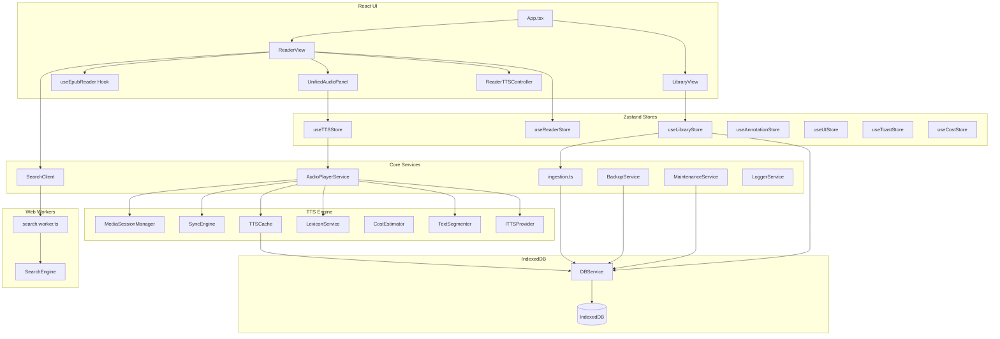

# Versicle Architecture

## Overview

Versicle is a sophisticated, local-first web-based EPUB reader designed for advanced reading capabilities, privacy, and performance. It runs entirely in the browser, utilizing IndexedDB for persistent storage, React for the UI, and `epub.js` for rendering.

Key architectural characteristics:
*   **Local-First**: All data (books, annotations, reading progress) is stored locally in IndexedDB using `idb`. No server is required for core functionality.
*   **Offline-Capable**: The app is a Progressive Web App (PWA) and functions fully offline.
*   **Heavy Client-Side Logic**: Complex tasks like text ingestion, search indexing, and TTS text segmentation happen in the browser, often offloaded to Web Workers.
*   **Hybrid TTS**: Supports both local Web Speech API (free, offline) and cloud-based Neural TTS (Google, OpenAI, LemonFox, Piper) with local caching.

## System Architecture

## Directory Structure

*   **`src/components/`**: React UI components.
    *   **`library/`**: Book list, import, and management views.
    *   **`reader/`**: Reading interface, TOC, and controls.
    *   **`ui/`**: Reusable design system components (Button, Dialog, etc.).
    *   **`audio/`**: Audio player controls.
*   **`src/db/`**: Database configuration and abstraction layer (`DBService`).
*   **`src/hooks/`**: Custom React hooks (e.g., `useEpubReader`, `useTTS`).
*   **`src/lib/`**: Core business logic and singleton services.
    *   **`tts/`**: The complete Text-to-Speech subsystem.
*   **`src/store/`**: Global state management using Zustand.
*   **`src/types/`**: TypeScript type definitions.
*   **`src/workers/`**: Web Worker entry points for background processing.
*   **`verification/`**: Python-based Playwright visual verification suite.

---

## Detailed Module Reference

### 1. Data Layer (`src/db/`)

The data layer is built on **IndexedDB** using the `idb` library. It is accessed primarily through the `DBService` singleton.

#### `src/db/DBService.ts`
The main database abstraction layer. Handles all read/write operations, transactions, and error handling.

**Class: `DBService`**

*   **`getLibrary()`**
    *   **Purpose**: Retrieves all books in the library.
    *   **Returns**: `Promise<BookMetadata[]>` - List of validated book metadata sorted by import date (newest first).
*   **`getBook(id)`**
    *   **Purpose**: Retrieves metadata and binary file for a book.
    *   **Params**: `id: string` - Unique identifier of the book.
    *   **Returns**: `Promise<{ metadata: BookMetadata | undefined; file: Blob | ArrayBuffer | undefined }>`
*   **`getBookMetadata(id)`**
    *   **Purpose**: Retrieves only metadata for a book.
    *   **Params**: `id: string`.
    *   **Returns**: `Promise<BookMetadata | undefined>`
*   **`getBookFile(id)`**
    *   **Purpose**: Retrieves only the binary file for a book.
    *   **Params**: `id: string`.
    *   **Returns**: `Promise<Blob | ArrayBuffer | undefined>`
*   **`addBook(file)`**
    *   **Purpose**: Imports a new book (delegates to `processEpub`).
    *   **Params**: `file: File` - The EPUB file to import.
    *   **Returns**: `Promise<void>`
*   **`deleteBook(id)`**
    *   **Purpose**: Deletes a book and all cascading data (files, annotations, locations, queue, lexicon, content analysis).
    *   **Params**: `id: string`.
    *   **Returns**: `Promise<void>`
*   **`offloadBook(id)`**
    *   **Purpose**: Removes the binary file to save space but preserves metadata and userdata. Calculates hash if missing.
    *   **Params**: `id: string`.
    *   **Returns**: `Promise<void>`
*   **`restoreBook(id, file)`**
    *   **Purpose**: Re-attaches a binary file to an offloaded book, verifying the SHA-256 hash.
    *   **Params**: `id: string`, `file: File`.
    *   **Returns**: `Promise<void>`
*   **`saveProgress(bookId, cfi, progress)`**
    *   **Purpose**: Saves reading progress (Debounced).
    *   **Params**: `bookId: string`, `cfi: string` (Location), `progress: number` (0.0-1.0).
    *   **Returns**: `void`
*   **`updatePlaybackState(bookId, lastPlayedCfi?, lastPauseTime?)`**
    *   **Purpose**: Updates TTS-specific state (last played position, pause time).
    *   **Params**: `bookId: string`, `lastPlayedCfi?: string`, `lastPauseTime?: number | null`.
    *   **Returns**: `Promise<void>`
*   **`saveTTSState(bookId, queue, currentIndex)`**
    *   **Purpose**: Persists the entire TTS playback queue (Debounced).
    *   **Params**: `bookId: string`, `queue: TTSQueueItem[]`, `currentIndex: number`.
    *   **Returns**: `void`
*   **`getTTSState(bookId)`**
    *   **Purpose**: Retrieves persisted TTS queue.
    *   **Params**: `bookId: string`.
    *   **Returns**: `Promise<TTSState | undefined>`
*   **`addAnnotation(annotation)`**
    *   **Purpose**: Saves a new annotation.
    *   **Params**: `annotation: Annotation`.
    *   **Returns**: `Promise<void>`
*   **`getAnnotations(bookId)`**
    *   **Purpose**: Retrieves annotations for a book.
    *   **Params**: `bookId: string`.
    *   **Returns**: `Promise<Annotation[]>`
*   **`deleteAnnotation(id)`**
    *   **Purpose**: Deletes an annotation.
    *   **Params**: `id: string`.
    *   **Returns**: `Promise<void>`
*   **`getCachedSegment(key)`**
    *   **Purpose**: Retrieves a cached audio segment.
    *   **Params**: `key: string` - SHA-256 hash key.
    *   **Returns**: `Promise<CachedSegment | undefined>`
*   **`cacheSegment(key, audio, alignment?)`**
    *   **Purpose**: Stores an audio segment in cache.
    *   **Params**: `key: string`, `audio: ArrayBuffer`, `alignment?: any[]`.
    *   **Returns**: `Promise<void>`
*   **`getLocations(bookId)`**
    *   **Purpose**: Retrieves stored `epub.js` locations.
    *   **Params**: `bookId: string`.
    *   **Returns**: `Promise<BookLocations | undefined>`
*   **`saveLocations(bookId, locations)`**
    *   **Purpose**: Stores `epub.js` locations.
    *   **Params**: `bookId: string`, `locations: string` (JSON string).
    *   **Returns**: `Promise<void>`
*   **`saveContentAnalysis(analysis)`**
    *   **Purpose**: Saves AI content analysis results.
    *   **Params**: `analysis: ContentAnalysis`.
    *   **Returns**: `Promise<void>`
*   **`getContentAnalysis(bookId, sectionId)`**
    *   **Purpose**: Retrieves content analysis for a specific section.
    *   **Params**: `bookId: string`, `sectionId: string`.
    *   **Returns**: `Promise<ContentAnalysis | undefined>`
*   **`getBookAnalysis(bookId)`**
    *   **Purpose**: Retrieves all content analysis entries for a book.
    *   **Params**: `bookId: string`.
    *   **Returns**: `Promise<ContentAnalysis[]>`

#### Key Data Models (`src/types/db.ts`)

*   **`BookMetadata`**: `{ id, title, author, coverUrl, addedAt, lastRead, progress, currentCfi, isOffloaded, fileHash, ... }`
*   **`Annotation`**: `{ id, bookId, cfiRange, text, color, type, note, created }`
*   **`TTSState`**: `{ bookId, queue, currentIndex, updatedAt }`
*   **`CachedSegment`**: `{ key, audio, alignment, createdAt, lastAccessed }`
*   **`LexiconRule`**: `{ id, original, replacement, isRegex, bookId, created }`
*   **`SectionMetadata`**: `{ id, bookId, sectionId, characterCount, playOrder }`
*   **`ContentAnalysis`**: `{ id, bookId, sectionId, structure, summary, lastAnalyzed }`

---

### 2. Core Logic & Services (`src/lib/`)

#### Ingestion (`src/lib/ingestion.ts`)
Handles the parsing and import of EPUB files.

*   **`computeFileHash(file)`**
    *   **Purpose**: Incrementally computes SHA-256 hash of a file.
    *   **Params**: `file: File`.
    *   **Returns**: `Promise<string>` (Hex hash).
*   **`processEpub(file)`**
    *   **Purpose**: Parses EPUB using `epub.js`, extracts metadata/cover, generates synthetic TOC, calculates character counts, and saves to DB.
    *   **Params**: `file: File`.
    *   **Returns**: `Promise<string>` (New Book ID).

#### Search (`src/lib/search.ts`)
Client-side interface for the Search Worker.

**Class: `SearchClient`**
*   **`indexBook(book, bookId, onProgress?)`**
    *   **Purpose**: Extracts text from the book spine and sends it to the worker for indexing in batches.
    *   **Params**: `book: Book` (epub.js instance), `bookId: string`, `onProgress?: (percent: number) => void`.
    *   **Returns**: `Promise<void>`
*   **`search(query, bookId)`**
    *   **Purpose**: Queries the worker for search results.
    *   **Params**: `query: string`, `bookId: string`.
    *   **Returns**: `Promise<SearchResult[]>`
*   **`terminate()`**
    *   **Purpose**: Terminates the web worker and clears pending requests.

#### Search Engine (`src/lib/search-engine.ts`)
Internal logic used by the worker to manage FlexSearch indexes.

**Class: `SearchEngine`**
*   **`initIndex(bookId)`**: Initializes an empty FlexSearch index for a book.
*   **`addDocuments(bookId, sections)`**: Adds a batch of text sections to the index.
*   **`search(bookId, query)`**: Executes a search and returns results with excerpts.

#### Backup (`src/lib/BackupService.ts`)
Handles data export and import (JSON/ZIP).

**Class: `BackupService`**
*   **`createLightBackup()`**
    *   **Purpose**: Exports JSON containing metadata, annotations, lexicon, and locations (no binary files).
    *   **Returns**: `Promise<void>` (Trigger file download).
*   **`createFullBackup(onProgress?)`**
    *   **Purpose**: Exports ZIP containing manifest JSON and all EPUB files.
    *   **Params**: `onProgress?: (percent: number, message: string) => void`.
    *   **Returns**: `Promise<void>` (Trigger file download).
*   **`restoreBackup(file, onProgress?)`**
    *   **Purpose**: Restores data from JSON or ZIP. Handles merging and hash verification.
    *   **Params**: `file: File`, `onProgress?: (percent: number, message: string) => void`.
    *   **Returns**: `Promise<void>`

#### Maintenance (`src/lib/MaintenanceService.ts`)
Database integrity tools.

**Class: `MaintenanceService`**
*   **`scanForOrphans()`**
    *   **Purpose**: Finds records (files, annotations) detached from books.
    *   **Returns**: `Promise<{ files: number; annotations: number; locations: number; lexicon: number; }>`
*   **`pruneOrphans()`**
    *   **Purpose**: Deletes orphaned records.
    *   **Returns**: `Promise<void>`

#### Utilities (`src/lib/logger.ts`, `src/lib/utils.ts`)
*   **`LoggerService`**: Static methods `info`, `warn`, `error`, `debug` for structured logging.
*   **`cn(...inputs)`**: Merges Tailwind CSS classes.

---

### 3. Text-to-Speech Subsystem (`src/lib/tts/`)

A comprehensive engine managing playback, queueing, providers, and synchronization.

#### `src/lib/tts/AudioPlayerService.ts`
The singleton controller for TTS.

**Class: `AudioPlayerService`**
*   **`getInstance()`**
    *   **Returns**: The singleton instance.
*   **`setBookId(bookId)`**
    *   **Purpose**: Sets context and restores the persisted queue for this book.
    *   **Params**: `bookId: string | null`.
*   **`play()`**
    *   **Purpose**: Starts playback. Handles concurrency locking and provider synthesis.
    *   **Returns**: `Promise<void>`.
*   **`pause()`**
    *   **Purpose**: Pauses playback and saves state.
    *   **Returns**: `Promise<void>`.
*   **`resume()`**
    *   **Purpose**: Resumes playback, intelligently rewinding context if needed.
    *   **Returns**: `Promise<void>`.
*   **`stop()`**
    *   **Purpose**: Stops playback, releases Foreground Service (Android), resets state.
    *   **Returns**: `Promise<void>`.
*   **`next()` / `prev()`**
    *   **Purpose**: Skips to next/previous item in queue.
*   **`jumpTo(index)`**
    *   **Purpose**: Jumps to specific queue index.
    *   **Params**: `index: number`.
*   **`seek(offset)`**
    *   **Purpose**: Seeks by seconds (Cloud) or items (Local).
    *   **Params**: `offset: number` (seconds).
*   **`setQueue(items, startIndex?)`**
    *   **Purpose**: Updates the playlist.
    *   **Params**: `items: TTSQueueItem[]`, `startIndex: number`.
*   **`setProvider(provider)`**
    *   **Purpose**: Hot-swaps the TTS provider.
    *   **Params**: `provider: ITTSProvider`.
*   **`setVoice(voiceId)`**
    *   **Purpose**: Changes the active voice.
    *   **Params**: `voiceId: string`.
*   **`setSpeed(speed)`**
    *   **Purpose**: Changes playback rate.
    *   **Params**: `speed: number`.
*   **`preview(text)`**
    *   **Purpose**: Plays a single utterance for testing (e.g., in settings).
    *   **Params**: `text: string`.
*   **`subscribe(listener)`**
    *   **Purpose**: Adds a state change listener.
    *   **Params**: `listener: PlaybackListener`.
    *   **Returns**: Unsubscribe function.
*   **`generatePreroll(chapterTitle, wordCount, speed)`**
    *   **Purpose**: Generates a spoken introduction string for a chapter.
    *   **Params**: `chapterTitle: string`, `wordCount: number`, `speed: number`.
    *   **Returns**: `string`.

#### `src/lib/tts/TextSegmenter.ts`
Robust sentence splitting logic.

**Class: `TextSegmenter`**
*   **`segment(text)`**
    *   **Purpose**: Splits text using `Intl.Segmenter` and applies heuristics to merge abbreviations (e.g., "Mr.", "i.e.") to prevent incorrect breaks.
    *   **Params**: `text: string`.
    *   **Returns**: `TextSegment[]` (text, index, length).

#### `src/lib/tts/LexiconService.ts`
Manages pronunciation rules.

**Class: `LexiconService`**
*   **`getRules(bookId?)`**
    *   **Purpose**: Fetches global rules and book-specific rules.
    *   **Params**: `bookId?: string`.
    *   **Returns**: `Promise<LexiconRule[]>`
*   **`saveRule(rule)`**
    *   **Purpose**: Saves a rule to DB.
    *   **Params**: `rule: Omit<LexiconRule, 'id' | 'created'> & { id?: string }`.
*   **`deleteRule(id)`**
    *   **Params**: `id: string`.
*   **`applyLexicon(text, rules)`**
    *   **Purpose**: Applies regex/string replacements to text.
    *   **Params**: `text: string`, `rules: LexiconRule[]`.
    *   **Returns**: `string` (Processed text).

#### `src/lib/tts/SyncEngine.ts`
Maps audio time to text characters for Karaoke-style highlighting.

**Class: `SyncEngine`**
*   **`loadAlignment(alignment)`**
    *   **Purpose**: Loads timing data for the current segment.
    *   **Params**: `alignment: AlignmentData[]`.
*   **`updateTime(currentTime)`**
    *   **Purpose**: Updates internal state based on audio time and triggers callbacks.
    *   **Params**: `currentTime: number` (seconds).
*   **`setOnHighlight(callback)`**
    *   **Params**: `callback: (index: number, length?: number) => void`.

#### `src/lib/tts/TTSCache.ts`
**Class: `TTSCache`**
*   **`generateKey(text, voiceId, speed, pitch?, lexiconHash?)`**
    *   **Purpose**: Creates a SHA-256 cache key.
    *   **Returns**: `Promise<string>`.
*   **`get(key)`**
    *   **Returns**: `Promise<CachedSegment | undefined>`.
*   **`put(key, audio, alignment?)`**
    *   **Returns**: `Promise<void>`.

#### `src/lib/tts/CostEstimator.ts`
Tracks and estimates cloud TTS costs.

**Class: `CostEstimator`**
*   **`track(text)`**
    *   **Purpose**: Adds character usage count to the session store.
    *   **Params**: `text: string`.
*   **`getSessionUsage()`**
    *   **Returns**: `number`.
*   **`estimateCost(text, provider)`**
    *   **Purpose**: Calculates estimated cost in USD.
    *   **Params**: `text: string`, `provider: 'google' | 'openai'`.
    *   **Returns**: `number`.

#### `src/lib/tts/MediaSessionManager.ts`
Handles integration with OS media controls.

**Class: `MediaSessionManager`**
*   **`setMetadata(metadata)`**
    *   **Params**: `metadata: MediaSessionMetadata` (title, artist, album, artwork).
*   **`setPlaybackState(state)`**
    *   **Params**: `state: PlaybackState` (playing/paused, position, duration).

#### Providers (`src/lib/tts/providers/`)
*   **`WebSpeechProvider`**: Uses browser native `speechSynthesis`.
*   **`GoogleTTSProvider`**: Uses Google Cloud Text-to-Speech API.
*   **`OpenAIProvider`**: Uses OpenAI Audio API.
*   **`LemonFoxProvider`**: Uses LemonFox API.
*   **`PiperProvider`**: (Experimental) Local Wasm-based Neural TTS.
*   **`CapacitorTTSProvider`**: Uses native mobile TTS via Capacitor.

---

### 4. State Management (`src/store/`)

#### `src/store/useReaderStore.ts`
Manages Reader UI state. Persisted to LocalStorage.

*   **State**: `isLoading`, `currentBookId`, `currentTheme`, `fontSize`, `viewMode`, `gestureMode`, `shouldForceFont`, `toc`, `currentCfi`, `progress`.
*   **Actions**:
    *   `updateLocation(cfi, progress, ...)`: Updates position.
    *   `setTheme(theme)`: Changes theme (light/dark/sepia/custom).
    *   `setFontFamily(font)`, `setFontSize(size)`, `setLineHeight(height)`: Updates typography.
    *   `setViewMode(mode)`: Toggles between 'paginated' and 'scrolled'.
    *   `setGestureMode(enabled)`: Toggles full-screen gesture controls.

#### `src/store/useTTSStore.ts`
Manages TTS Settings and connects to `AudioPlayerService`. Persisted.

*   **State**: `isPlaying`, `status`, `voice`, `rate`, `providerId`, `apiKeys`, `queue`, `activeCfi`, `voices`, `prerollEnabled`, `sanitizationEnabled`.
*   **Actions**:
    *   `play()`, `pause()`, `stop()`: Delegates to Player.
    *   `setProviderId(id)`: Switches provider and re-initializes.
    *   `setApiKey(provider, key)`: Updates keys.
    *   `loadVoices()`: Fetches voices from current provider.
    *   `setCustomAbbreviations(...)`, `setAlwaysMerge(...)`: Updates segmentation rules.
    *   `setSanitizationEnabled(enable)`: Toggles skipping of URLs/references.
    *   `setPrerollEnabled(enable)`: Toggles chapter announcements.

#### `src/store/useLibraryStore.ts`
Manages Library view state.

*   **State**: `books`, `isLoading`, `isImporting`, `viewMode`.
*   **Actions**:
    *   `fetchBooks()`: Reloads library from DB.
    *   `addBook(file)`: Imports a file.
    *   `removeBook(id)`: Deletes a book.
    *   `offloadBook(id)` / `restoreBook(id, file)`: Manages storage optimization.
    *   `setViewMode(mode)`: Toggles grid/list.

#### `src/store/useAnnotationStore.ts`
Manages user annotations and the selection menu.

*   **State**: `annotations`, `popover` (visibility/position).
*   **Actions**: `addAnnotation`, `deleteAnnotation`, `showPopover`, `hidePopover`.

---

### 5. UI Hooks (`src/hooks/`)

#### `src/hooks/useEpubReader.ts`
Manages `epub.js` lifecycle.

*   **Params**: `bookId`, `viewerRef`, `options` (theme, viewMode, callbacks).
*   **Returns**: `EpubReaderResult`
    *   `book`: The `epub.js` Book instance.
    *   `rendition`: The `epub.js` Rendition instance.
    *   `isReady`: Boolean indicating interaction readiness.
    *   `toc`: Table of Contents.
    *   `metadata`: Book metadata.
*   **Functionality**:
    *   Handles loading of the book from IndexedDB.
    *   Manages resizing via `ResizeObserver`.
    *   Applies themes and forced styles.
    *   Generates/Restores locations.

#### `src/hooks/useTTS.ts`
Bridge between the Reader and the Audio Service.

*   **Params**: `rendition`, `isReady`.
*   **Returns**: `{ sentences: SentenceNode[] }`.
*   **Functionality**:
    *   Extracts sentences from the current chapter when `rendition` relocates.
    *   Populates the `AudioPlayerService` queue.
    *   Handles "No text" scenarios and Pre-roll generation.

---

### 6. Background Workers (`src/workers/`)

#### `src/workers/search.worker.ts`
Handles full-text indexing and searching using `FlexSearch` to prevent blocking the main thread.

**Protocol (`src/types/search.ts`):**
*   **Requests**: `INDEX_BOOK`, `INIT_INDEX`, `ADD_TO_INDEX`, `FINISH_INDEXING`, `SEARCH`.
*   **Responses**: `ACK`, `SEARCH_RESULTS`, `ERROR`.

---

### 7. UI Components (`src/components/`)

#### `src/components/reader/ReaderView.tsx`
The core reading interface.
*   Integrates `useEpubReader` for rendering.
*   Manages sidebars (TOC, Annotations, Search).
*   Handles keyboard shortcuts and layout.

#### `src/components/library/LibraryView.tsx`
The bookshelf interface.
*   Virtualized Grid/List view using `react-window`.
*   Handles file drop and import.

#### `src/components/reader/UnifiedAudioPanel.tsx`
The "Audio Deck" control panel.
*   Provides playback controls (Play/Pause, Seek, Speed).
*   Visualizes the TTS Queue (`TTSQueue.tsx`).
*   Configures Voice, Provider, and Lexicon.
