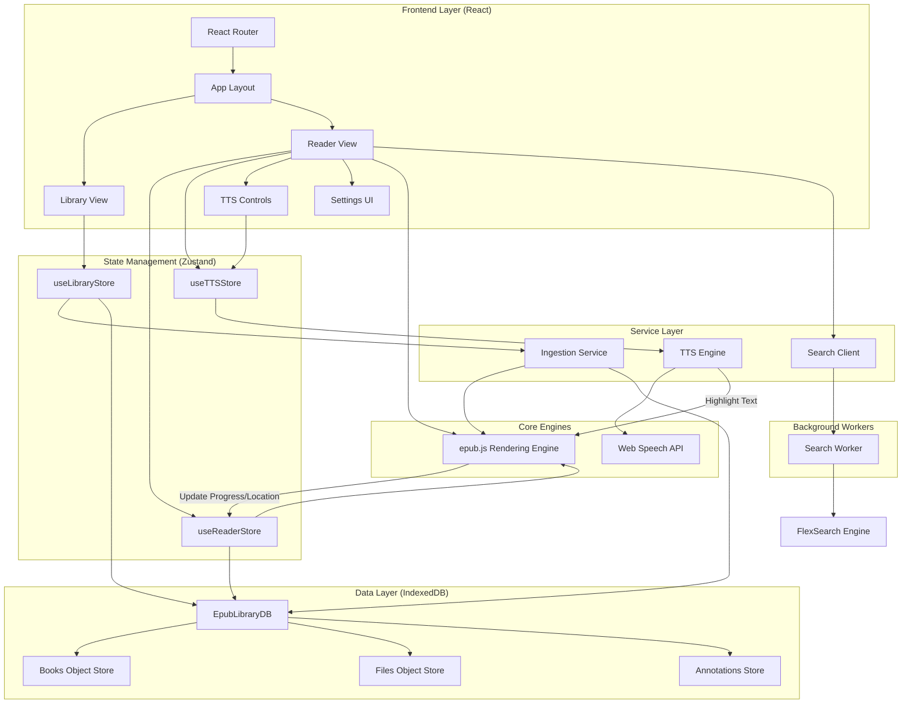

# Versicle Architecture

## Overview

Versicle is a local-first web-based EPUB reader and manager. It utilizes modern web technologies to parse, store, and render EPUB files directly in the browser without requiring a backend server for content processing.

The application is built with **React** and **Vite**, uses **Zustand** for state management, and **IndexedDB** for persistent local storage of books and metadata. **epub.js** is the core engine for rendering EPUB content, and **FlexSearch** powers the full-text search functionality.

## System Architecture

## detailed Component Descriptions

### 1. Frontend Layer
- **Library View (`src/components/library`)**: The main landing page. It displays a grid of books with their covers and metadata. It handles file uploading via drag-and-drop or file selection.
- **Reader View (`src/components/reader`)**: The core reading interface. It initializes the `epub.js` `Rendition` object, handles page navigation, theme switching, and layout controls. It also integrates the TTS controls and Search sidebar.
- **Settings UI**: A modal within the Reader View for adjusting font size and color themes (Light, Dark, Sepia).

### 2. State Management
- **`useLibraryStore`**: Manages the list of available books. It handles fetching metadata from IndexedDB and orchestrating the book ingestion process.
- **`useReaderStore`**: Manages the transient state of the active reading session, including the current book ID, current CFI (Canonical Fragment Identifier) location, reading progress, and display settings (theme, font size).
- **`useTTSStore`**: Manages the state of the Text-to-Speech feature, including playback status (playing/paused), speech rate, selected voice, and the currently active sentence CFI for highlighting.

### 3. Service Layer
- **Ingestion Service (`src/lib/ingestion.ts`)**: Responsible for parsing new EPUB files. It uses `epub.js` to extract metadata (title, author, cover) and stores the raw binary data and metadata into IndexedDB. It generates a UUID for each book.
- **TTS Engine (`src/lib/tts.ts` & `src/hooks/useTTS.ts`)**: logic for extracting text from the current chapter, segmenting it into sentences, mapping sentences to CFIs for highlighting, and controlling the browser's `SpeechSynthesis` API.
- **Search Client (`src/lib/search.ts`)**: An abstraction layer that communicates with the Search Worker. It handles sending book content to be indexed and querying the worker for search results.

### 4. Background Workers
- **Search Worker (`src/workers/search.worker.ts`)**: Runs in a separate thread to prevent blocking the UI. It uses **FlexSearch** to build an inverted index of the book's content. When a user opens a book, the client extracts text from spine items and sends it to the worker for indexing. Searches are executed against this in-memory index.

### 5. Data Layer (IndexedDB)
- **`EpubLibraryDB`**: A local IndexedDB database initialized via the `idb` library.
  - **`books`**: Stores JSON metadata for each book (id, title, author, description, addedAt, currentCfi, progress).
  - **`files`**: Stores the raw `ArrayBuffer` of the EPUB file. This is separate from metadata to allow efficient listing of the library without loading heavy file data.
  - **`annotations`**: (Planned/Partial) Stores user highlights and notes.

## Key Workflows

### Book Ingestion
1. User uploads a file in `LibraryView`.
2. `useLibraryStore.addBook` is called.
3. `ingestion.ts` reads the file as an ArrayBuffer.
4. `epub.js` parses the buffer to extract metadata and the cover image.
5. The metadata and raw ArrayBuffer are saved to the `books` and `files` stores in IndexedDB, respectively.
6. The library list is refreshed.

### Reading & Persistence
1. User clicks a book in `LibraryView`.
2. Router navigates to `/read/:id`.
3. `ReaderView` fetches the book's ArrayBuffer from IndexedDB using the ID.
4. `epub.js` renders the book to the DOM.
5. `ReaderView` restores the last reading position from the book's metadata (`currentCfi`).
6. As the user navigates, `relocated` events from `epub.js` trigger updates to `useReaderStore` and persist the new `currentCfi` and `progress` to IndexedDB.

### Full-Text Search
1. When a book is loaded, `ReaderView` triggers `searchClient.indexBook`.
2. The client iterates through the book's spine, loads each chapter, and extracts text.
3. Text chunks are sent to the `SearchWorker`.
4. The worker adds documents to the `FlexSearch` index.
5. When the user searches, the query is sent to the worker, which returns matches with excerpts and CFIs.
6. Clicking a result navigates the reader to the specific CFI.

### Text-to-Speech
1. `useTTS` hook listens for the `rendered` event from `epub.js`.
2. It extracts text nodes from the DOM of the current chapter.
3. Text is split into sentences and mapped back to CFIs.
4. When played, `SpeechSynthesis` speaks the sentences sequentially.
5. The active sentence's CFI is used to apply a highlight style in the `epub.js` rendition, syncing visual feedback with audio.
