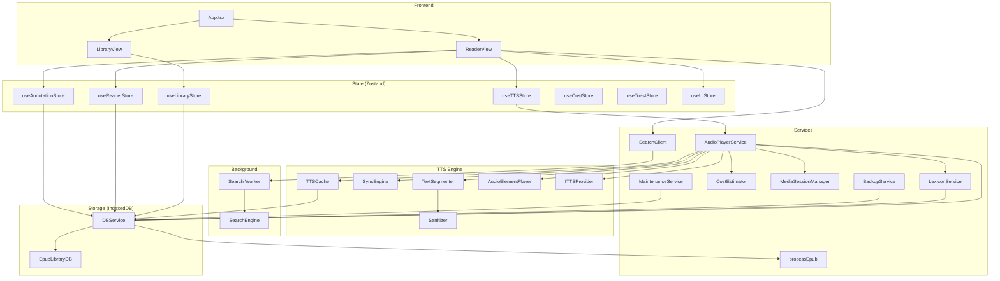

# Versicle Architecture

## Overview

Versicle is a local-first, web-based EPUB reader and manager. It runs entirely in the browser, utilizing IndexedDB for persistent storage, React for the UI, and `epub.js` for rendering. The system is designed for privacy and performance, featuring advanced Text-to-Speech (TTS) capabilities, full-text search, and annotation management without relying on external servers for core functionality.

## System Architecture

## Directory Structure

*   `src/components/`: React UI components.
    *   `library/`: Components for the library view (book grid, upload).
    *   `reader/`: Components for the reader view (renderer, controls, panels).
    *   `ui/`: Reusable primitive components (dialogs, toasts).
*   `src/db/`: IndexedDB configuration and schema definitions.
*   `src/hooks/`: Custom React hooks.
*   `src/lib/`: Core application logic and utilities.
    *   `ingestion.ts`: EPUB processing logic.
    *   `search.ts`: Client-side search interface.
    *   `search-engine.ts`: Worker-side search logic.
    *   `tts/`: Complete Text-to-Speech engine (services, providers, processors).
*   `src/store/`: Zustand state management stores.
*   `src/types/`: TypeScript type definitions.
*   `src/workers/`: Web Worker entry points.
*   `verification/`: Playwright visual verification tests.

---

## Detailed Module Reference

### 1. Data Types (`src/types/`)

#### `src/types/db.ts`
Defines the data structures persisted in IndexedDB.

*   **`interface BookMetadata`**: Metadata for a stored book.
    *   `id`: `string` - Unique UUID.
    *   `title`: `string` - Book title.
    *   `author`: `string` - Author name.
    *   `description`: `string` - Book description.
    *   `coverUrl`: `string` - Ephemeral Blob URL for display.
    *   `coverBlob`: `Blob` - Binary Blob of the cover image.
    *   `addedAt`: `number` - Timestamp of import.
    *   `lastRead`: `number` - Timestamp of last access.
    *   `progress`: `number` - Reading progress (0-1).
    *   `currentCfi`: `string` - Last read location (CFI).
    *   `fileHash`: `string` - SHA-256 hash of the EPUB file (for integrity).
    *   `isOffloaded`: `boolean` - Whether the binary file has been removed to save space.
    *   `syntheticToc`: `NavigationItem[]` - Generated table of contents if none exists.
    *   `lastPlayedCfi`: `string` - Last location played by TTS.
    *   `lastPauseTime`: `number` - Timestamp when TTS was last paused (for smart resume).
*   **`interface Annotation`**: User-created highlights and notes.
    *   `id`: `string` - Unique UUID.
    *   `bookId`: `string` - ID of the book.
    *   `cfiRange`: `string` - The CFI range of the selection.
    *   `text`: `string` - The selected text content.
    *   `type`: `'highlight' | 'note'`.
    *   `color`: `string` - Color identifier (e.g., 'yellow').
    *   `note`: `string` - Optional user note.
    *   `created`: `number` - Timestamp.
*   **`interface CachedSegment`**: Cached TTS audio.
    *   `key`: `string` - SHA-256 hash key.
    *   `audio`: `ArrayBuffer` - The audio data.
    *   `alignment`: `Timepoint[]` - Optional word-level alignment data.
    *   `createdAt`: `number` - Timestamp.
    *   `lastAccessed`: `number` - Timestamp for LRU eviction.
*   **`interface LexiconRule`**: Pronunciation replacement rule.
    *   `id`: `string` - Unique UUID.
    *   `original`: `string` - Text to replace.
    *   `replacement`: `string` - Replacement text (phonetic).
    *   `isRegex`: `boolean` - Whether `original` is a regex pattern.
    *   `bookId`: `string` - Optional book ID scope.

---

### 2. Database Layer (`src/db/`)

#### `src/db/DBService.ts`
A singleton service that abstracts all IndexedDB interactions. It handles error mapping, transactions, and complex operations like cascading deletes.

*   **`class DBService`**
    *   **`getLibrary(): Promise<BookMetadata[]>`**: Retrieves all books, validating their metadata integrity.
    *   **`getBook(id: string): Promise<{ metadata: BookMetadata; file: Blob | ArrayBuffer }>`**: Retreives a book and its binary content.
    *   **`addBook(file: File): Promise<void>`**: Imports a new book (delegates to `processEpub`).
    *   **`deleteBook(id: string): Promise<void>`**: Cascading delete of a book and all its related data (files, annotations, lexicon, queue).
    *   **`offloadBook(id: string): Promise<void>`**: Removes the binary file of a book but keeps metadata. Calculates hash if missing.
    *   **`restoreBook(id: string, file: File): Promise<void>`**: Re-uploads a book file, verifying the hash matches the original.
    *   **`saveProgress(bookId: string, cfi: string, progress: number): void`**: Debounced saving of reading progress.
    *   **`saveTTSState(bookId: string, queue: TTSQueueItem[], currentIndex: number): void`**: Debounced saving of TTS playback queue.
    *   **`getTTSState(bookId: string): Promise<TTSState | undefined>`**: Retrieves persisted TTS queue.
    *   **`updatePlaybackState(bookId: string, lastPlayedCfi?, lastPauseTime?): Promise<void>`**: Updates TTS-specific playback markers.

#### `src/db/db.ts`
Low-level configuration using `idb`.

*   **`interface EpubLibraryDB`**: Defines the object stores and indexes.
    *   Stores: `books`, `files`, `locations`, `annotations`, `tts_cache`, `tts_queue`, `lexicon`.
*   **`initDB()`**: Opens the database (version 5) and handles schema migrations.

---

### 3. State Management (`src/store/`)

#### `src/store/useLibraryStore.ts`
Manages the collection of books and library view state. Persisted.

*   **State**: `books`, `isLoading`, `isImporting`, `error`, `viewMode`.
*   **Actions**:
    *   `fetchBooks()`: Loads library from DB.
    *   `addBook(file)`: Imports a file.
    *   `removeBook(id)`: Deletes a book.
    *   `offloadBook(id)`: Offloads a book.
    *   `restoreBook(id, file)`: Restores a book.

#### `src/store/useReaderStore.ts`
Manages the reader's view state, settings, and navigation. Persisted.

*   **State**: `currentBookId`, `viewMode`, `currentTheme`, `fontFamily`, `fontSize`, `lineHeight`, `currentCfi`, `progress`, `toc`, `gestureMode`, `shouldForceFont`.
*   **Actions**:
    *   `updateLocation(cfi, progress, title)`: Updates reading position.
    *   `setTheme(theme)`, `setFontSize(size)`, etc.: Updates visual settings.
    *   `setGestureMode(enabled)`: Toggles the touch overlay.

#### `src/store/useTTSStore.ts`
Manages TTS configuration and playback state. Persisted.

*   **State**: `isPlaying`, `status`, `rate`, `voice`, `providerId`, `activeCfi`, `queue`, `customAbbreviations`.
*   **Actions**:
    *   `play()`, `pause()`, `stop()`: Controls playback via `AudioPlayerService`.
    *   `setRate(rate)`, `setVoice(voice)`: Configures playback.
    *   `setProviderId(id)`: Switches provider (Local/Google/OpenAI).
    *   `jumpTo(index)`: Skips to a specific sentence in the queue.
    *   `loadVoices()`: Fetches available voices.

#### `src/store/useAnnotationStore.ts`
Manages annotations and the popover UI.

*   **State**: `annotations`, `popover` (visibility/coordinates).
*   **Actions**: `loadAnnotations(bookId)`, `addAnnotation(data)`, `deleteAnnotation(id)`.

---

### 4. Text-to-Speech Engine (`src/lib/tts/`)

#### Service: `AudioPlayerService` (`src/lib/tts/AudioPlayerService.ts`)
The central controller for TTS. Implements the Singleton pattern.

*   **Key Methods**:
    *   **`setBookId(bookId: string)`**: Sets context to load specific lexicon rules and restore queue.
    *   **`play()`**: Starts playback with locking and concurrency control.
    *   **`resume()`**: Resumes playback. Implements "Smart Resume" (rewinds based on pause duration).
    *   **`setQueue(items: TTSQueueItem[])`**: Loads a playlist of sentences.
    *   **`setProvider(provider: ITTSProvider)`**: Hot-swaps the TTS engine.
    *   **`generatePreroll(...)`**: Creates "Chapter X. Estimated time..." announcements.
    *   **`preview(text)`**: Plays a single utterance for testing (e.g., Lexicon editor).

#### Segmentation: `TextSegmenter` (`src/lib/tts/TextSegmenter.ts`)
*   **`segment(text: string): TextSegment[]`**
    *   **Purpose**: Splits text into sentences using `Intl.Segmenter`.
    *   **Logic**: Includes heuristic merging to prevent splits on abbreviations (e.g., "Mr.", "i.e.") based on configurable lists.

#### Caching: `TTSCache` (`src/lib/tts/TTSCache.ts`)
*   **`generateKey(text, voiceId, speed, ...)`**: Creates a SHA-256 hash key.
*   **`get(key)` / `put(key, audio)`**: Interfaces with the `tts_cache` object store.

#### Lexicon: `LexiconService` (`src/lib/tts/LexiconService.ts`)
*   **`applyLexicon(text, rules)`**: Applies string replacement or Regex rules to text before synthesis.
*   **`getRulesHash(rules)`**: Generates a hash to invalidate TTS cache when rules change.

#### Providers (`src/lib/tts/providers/`)
*   **`interface ITTSProvider`**: Common interface for all providers.
    *   `init()`: Initialize.
    *   `synthesize(text, voiceId, speed, signal)`: Returns audio or plays natively.
*   **`WebSpeechProvider`**: Wraps the browser's `window.speechSynthesis`.
*   **`GoogleTTSProvider`**: Connects to Google Cloud Text-to-Speech API.
*   **`OpenAIProvider`**: Connects to OpenAI Audio API.

#### Utilities
*   **`CostEstimator`**: Tracks character usage for paid APIs.
*   **`SyncEngine`**: Maps audio time to text character indices for highlighting.
*   **`MediaSessionManager`**: Integrates with hardware media keys (Play/Pause/Next).

---

### 5. Core Services (`src/lib/`)

#### Ingestion (`src/lib/ingestion.ts`)
*   **`processEpub(file: File): Promise<string>`**
    *   Parses EPUB using `epub.js`.
    *   Extracts metadata and cover image.
    *   Generates a synthetic Table of Contents if the book lacks one.
    *   Computes SHA-256 hash.
    *   Saves to DB.

#### Search (`src/lib/search.ts` & `src/lib/search-engine.ts`)
*   **`SearchClient`**: Main thread interface. Sends messages to the worker.
*   **`SearchEngine`**: Worker-side logic using `FlexSearch` to index and query document text.

#### Backup (`src/lib/BackupService.ts`)
*   **`createLightBackup()`**: Exports JSON manifest of metadata, annotations, lexicon, and locations.
*   **`createFullBackup()`**: Exports ZIP containing manifest and all EPUB files.
*   **`restoreBackup(file)`**: Imports backup, handling merging of progress and file verification.

#### Maintenance (`src/lib/MaintenanceService.ts`)
*   **`scanForOrphans()`**: Identifies database records (files, annotations) detached from books.
*   **`pruneOrphans()`**: Deletes orphaned records.

---

### 6. UI Components (`src/components/`)

#### Reader (`src/components/reader/ReaderView.tsx`)
The core reading interface.
*   **Responsibilities**:
    *   Initializes `epub.js` `Rendition`.
    *   Manages "Paginated" vs "Scrolled" view modes.
    *   Injects custom CSS for Themes (including "Force Font") and Highlights.
    *   Highlights the active TTS sentence (`activeCfi`).
    *   Handles text selection for Annotations (with manual fallback for iframe events).
    *   Integrates `GestureOverlay` for touch controls.
    *   Manages sidebars (TOC, Annotations, Search).
    *   Listens for keyboard shortcuts (Arrow keys).

#### Library (`src/components/library/LibraryView.tsx`)
The bookshelf interface.
*   **Responsibilities**:
    *   Displays books in a virtualized grid or list (`react-window`).
    *   Handles file uploads.
    *   Provides access to global settings.

#### Audio Panel (`src/components/reader/UnifiedAudioPanel.tsx`)
A global Sheet component for audio controls.
*   **Responsibilities**:
    *   Displays the TTS playback queue.
    *   Provides controls for speed, provider selection, and voice selection.
    *   Toggles gesture mode.

---

### 7. Workers (`src/workers/`)

#### `search.worker.ts`
*   **Protocol**:
    *   `INDEX_BOOK`: Payload `{ bookId, sections }`.
    *   `SEARCH`: Payload `{ query, bookId }`.
    *   `SEARCH_RESULTS`: Response payload `{ results }`.
*   **Purpose**: Offloads heavy text processing to keep the UI responsive.
