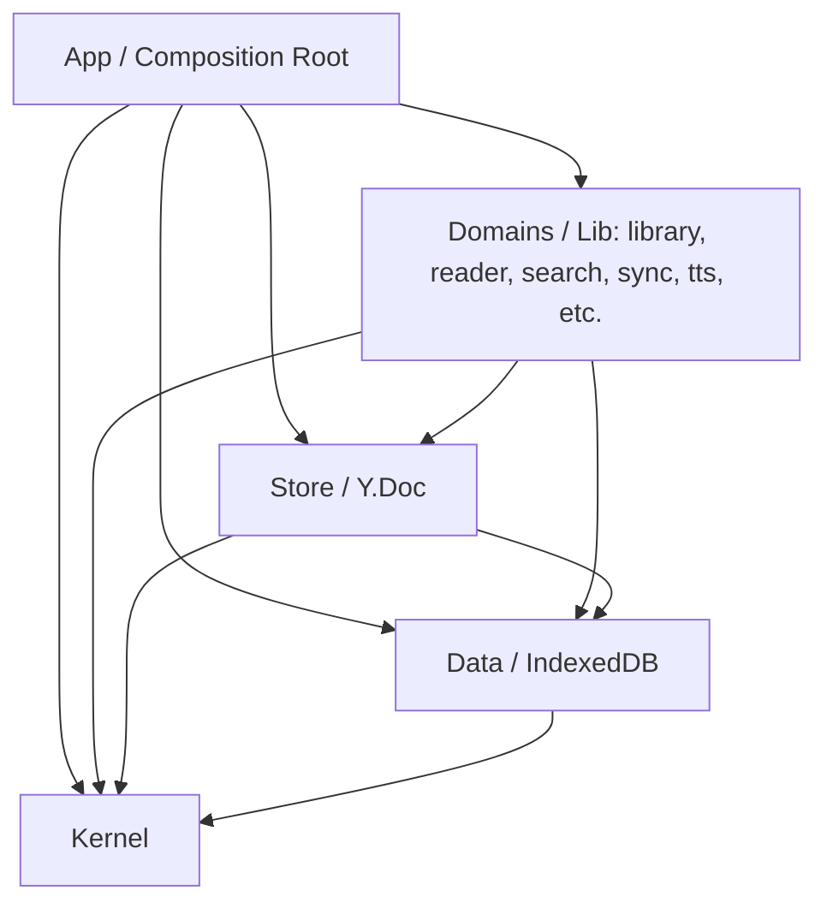

<!-- GENERATED FILE — do not edit by hand. -->
<!-- Rendered by src/app/docs/registryDocs.ts from the live registries. -->
<!-- Drift-gated by src/app/docs/docs.test.ts: a plain `npm test` fails when -->
<!-- this file disagrees with the registries. Regenerate: npm run docs:generate -->

# Versicle Architecture

Versicle is a local-first, privacy-centric EPUB reader and audiobook player
that runs entirely in the browser (or as a Capacitor hybrid app). User data
lives in a Yjs CRDT persisted to IndexedDB and optionally synced through the
owner's own Firebase project (BYO-Firebase); books, caches, and derived
content live in IndexedDB; heavy work (TTS synthesis, search, extraction)
runs client-side, much of it in workers.

This document describes the **end state of the 2026 overhaul program**
(plan/overhaul/README.md — phases 0–9, PROGRAM COMPLETE). It is generated
from the code's own registries, so it cannot drift: the structure below IS
what the gates enforce. History and rationale live in the master plan; how
to verify changes lives in `TESTING.md`.

## 1. Module map (the modular-monolith geography, as built)

Layers L0–L4 only depend downward (enforced — see §3). Replacement code
landed at its final address during the strangler phases; `lib/` is the
honest residual: the audio domain and a set of app services whose internals
were rebuilt in place without the (pure-motion) relocation to
`domains/audio/` — see the close-out notes in the master plan.

```
src/
  kernel/                  # L0 — imports nothing internal (admission: zero deps + ≥2 consumers, C12)
    cfi/                   # canonical CFI algebra — parse, contains, group, merge, locale-aware sentence snap
    diagnostics/           # flight-recorder ring-buffer core (namespaced buffers per subsystem)
    locale/                # typed MessageKey catalog, cached Intl formatters, LiveAnnouncer, uiLocale
    net/                   # NetworkGateway + egress destination registry + generated-CSP renderer
    quota/                 # QuotaGovernor rate/spend math — in-memory RPM/TPM windows + injected-port daily RPD
  data/                    # L1 — the ONLY IndexedDB subsystem (rule 2; see src/data/README.md)
  store/                   # L2 — three-tier store registry + Y.Doc provider (see src/store/README.md)
  domains/                 # L3 — vertical feature modules (rule 3; see src/domains/README.md)
    chinese/               # pinyin geometry engine, dictionary (separate versicle-dict IDB), vocabulary
    google/                # GoogleAuthClient (per-service tokens), DriveClient, GenAIClient + per-feature zod modules
    library/               # ImportOrchestrator job queue, LibraryService (keyed mutex), SHA-256 identity, reingest driver
    reader/                # ReaderEngine port (EpubJsEngine = sole epubjs importer), overlays, session recorder
    search/                # SearchSession over the search worker + persisted searchText repo
    sync/                  # SyncBackend port (Firestore or Mock), SyncOrchestrator, workspaces, typed SyncEvent bus
  lib/                     # legacy-geography keepers — incl. the AUDIO domain at lib/tts/ (engine, providers, pipeline) and app services (Backup, Maintenance, ingestion, sanitizer)
  app/                     # L4 — composition root: bootstrap + boot tasks, CRDT migration coordinator, routes, settings registry, controllers, port adapters, repositories
  components/              # React UI by feature area (library, reader, settings, sync, chinese, ui design system)
  hooks/                   # shared React hooks (useEpubReader + reader/sync/TTS hooks)
  layouts/                 # RootLayout — the router shell (toasts/confirm/announcer live ABOVE the route gate)
  types/                   # L0 types layer — db.ts dissolved by domain (P1); types-imports-nothing at 0
  assets/                  # static imports (icons, images)
  test/                    # vitest setup + typed harness + fixtures (see TESTING.md)
  verification/            # in-vitest characterization ports of two E2E journeys (drive sync, background crash)
  workers/                 # worker entries (search, TTS) — import closures asserted by the worker-chunk check
  main.tsx                 # thin entry — installs the test API (DEV/E2E), mounts <App/>
  App.tsx                  # boot-state rendering + router gate over app/routes.tsx
  sw.ts                    # service worker — workbox precache, runtime caching, SKIP_WAITING handshake
  test-api.ts              # window.__versicleTest page-side seams (DEV/VITE_E2E builds only)
```

### System Architecture Diagram


```mermaid
graph TD
    L4[App / Composition Root] --> L3[Domains / Lib: library, reader, search, sync, tts, etc.]
    L4 --> L2
    L4 --> L1
    L4 --> L0
    L3 --> L2[Store / Y.Doc]
    L3 --> L1
    L3 --> L0
    L2 --> L1
    L2 --> L0
    L1[Data / IndexedDB] --> L0[Kernel]
```

### Module Reference

- **`src/lib/tts/engine/PlaybackController.ts`**
  - **Goal**: Replaces the monolithic `AudioPlayerService` to provide an isolated TTS orchestration core.
  - **Logic**: Uses dependency injection (`EngineContext`) for Web Worker portability, removing jsdom/Zustand dependencies.
  - **Trade-offs**: Requires explicit state synchronization across the worker boundary.

- **`src/data/write-gate.ts`**
  - **Goal**: Prevent WebKit IndexedDB deadlocks caused by concurrent readwrite transactions.
  - **Logic**: Uses a Mutex pattern (`navigator.locks`) for cross-context exclusive write locking, falling back to a promise chain where Web Locks are unavailable.
  - **Trade-offs**: Writes are serialized, meaning a long-running transaction can stall the entire system.

- **`src/workers/search.worker.ts`**
  - **Goal**: Fast, offline full-text search without blocking the main thread UI.
  - **Logic**: Runs `SearchEngine` with Comlink to process searches asynchronously in a Web Worker.
  - **Trade-offs**: Memory overhead of loading the corpus into worker memory; message-passing latency.

- **`src/workers/tts.worker.ts`**
  - **Goal**: Offload heavy TTS processing (e.g. WASM inference) from the main thread.
  - **Logic**: Implements a worker-side `TtsEngine` communicating via message channels.
  - **Trade-offs**: Complex state synchronization with the main thread; serialization costs.

### Hardening

Added `write-gate.ts` implementing the Web Locks API (`navigator.locks`) to ensure cross-context exclusivity for IndexedDB writes. This safety rail mitigates intermittent WebKit deadlocks triggered when multiple `readwrite` transactions overlap across the main thread and workers.

Other repo roots:

| Path | What it is |
| --- | --- |
| `verification/` | Playwright journey suite (Docker lane; see TESTING.md) |
| `scripts/` | operator tooling: gates, generators, codemods, fixture capture (scripts/README.md) |
| `third-party/` | vendored runtime artifacts (piper) + the license inventory |
| `docs/adr/` | architecture decision records (i18n strategy, android-backup) |
| `plan/overhaul/` | the overhaul program: master plan, analyses, prep docs, close-out |

## 2. The contract registry (C1–C12)

The program's governing artifact (plan/overhaul/proposals/contract-first.md;
operating rules in the master plan §3). A contract version bump requires a
matching contract-suite change in the same PR. Everything not in this table
is an internal and may be rewritten at will.

| Id | Contract | Home | Validation / versioning | Pinned by |
| --- | --- | --- | --- | --- |
| C1 | IndexedDB storage schema | `src/data/schema.ts` | zod rows in src/data/rows/; append-only versioned migration registry (DB v30) | `src/data/migrations.test.ts`, `src/data/connection.test.ts`, `src/data/__fixtures__/schema-fixtures.ts` |
| C2 | CRDT document schema | `src/store/registry.ts`, `src/app/migrations.ts` | syncedKeys whitelist + merge-defaults hydration; coordinator chain at v9; doc-level quarantine on the meta map | `src/store/__tests__/crdt-contract/fixtures-manifest.test.ts`, `src/store/__tests__/crdt-contract/fixtures-hydration.test.ts`, `src/store/__tests__/crdt-contract/migrations.test.ts`, `src/test/fixtures/ydoc/manifest.json` |
| C3 | Sync transport (SyncBackend) | `src/domains/sync/backend/SyncBackend.ts` | one behavioral spec, two transports (mock on every run, Firestore emulator gated); observe-mode zod on inbound docs | `src/lib/sync/syncBackendContract.ts`, `src/lib/sync/syncBackendContract.mock.test.ts`, `src/lib/sync/syncBackendContract.emulator.test.ts` |
| C4 | TTS engine RPC | `src/lib/tts/engine/TtsEngine.ts`, `src/lib/tts/engine/WorkerTtsEngine.ts` | single monotonic PlaybackSnapshot{seq} channel; 23 parity scenarios × 2 transports | `src/lib/tts/engine/engineParityScenarios.ts`, `src/lib/tts/engine/engineParity.inprocess.test.ts`, `src/lib/tts/engine/engineParity.worker.test.ts` |
| C5 | TTS provider plugin interface | `src/lib/tts/providers/types.ts`, `src/lib/tts/providers/registry.ts` | ProviderDescriptor registry (6 providers); reject-only play(), typed ProviderPlaybackError | `src/lib/tts/providers/describeProviderContract.ts` |
| C6 | Store/selector public API | `src/store/registry.ts`, `src/store/yjs-provider.ts` | three declared tiers; synced stores created only via defineSyncedStore; generated README | `src/store/__tests__/registry.test.ts` |
| C7 | Reader engine port | `src/domains/reader/engine/ReaderEngine.ts` | renderer-agnostic port; EpubJsEngine is the sole runtime epubjs importer (lint error) | `src/domains/reader/engine/ReaderEngine.contract.test.ts` |
| C8 | Ingestion artifact contract | `src/lib/ingestion/sentence-extraction.ts`, `src/domains/library/import/extract.ts` | raw-at-rest extraction v3; CFI-comparison fixtures gate any extractionVersion bump; one extractBook() | `src/lib/ingestion/sentence-extraction.test.ts`, `src/lib/ingestion/extractSentences.test.ts`, `src/domains/library/import/extract.test.ts`, `src/domains/library/reingest.test.ts` |
| C9 | External egress contract | `src/kernel/net/destinations.ts`, `src/kernel/net/NetworkGateway.ts` | 9 destinations with data class/consent/timeout; CSP GENERATED from the registry (scripts/generate-csp.mjs) | `src/kernel/net/csp.test.ts`, `src/kernel/net/NetworkGateway.test.ts` |
| C10 | Error contract | `src/types/errors.ts`, `src/app/errors/presentError.ts` | AppError taxonomy; append-only code namespaces; presentError is the one user-facing mapper | `src/types/errors.test.ts` |
| C11 | Boot contract | `src/app/bootstrap.ts`, `src/app/boot/registerBootTasks.ts` | 8 phases, sequential awaited tasks; halt() for migration confirmation; SafeMode on throw | `src/App_Boot.test.tsx`, `src/App_MigrationFailure.test.tsx`, `src/App_SW_Wait.test.tsx`, `src/App_Capacitor.test.tsx` |
| C12 | Layering & worker-purity contract | `.dependency-cruiser.cjs`, `.dependency-cruiser.runtime.cjs`, `eslint.config.js` | compile-time direction via tsc -b project references; emitted-artifact ground truth via the five-check build gate | `scripts/check-worker-chunk.mjs`, `scripts/depcruise-baseline.mjs`, `scripts/assert-single-instance.cjs`, `src/store/__tests__/crdt-contract/single-yjs-instance.test.ts` |

## 3. Boundary rules and their enforcement (master plan §2, end state)

Levels: **error** = CI-blocking, zero undocumented exceptions; **ratchet** =
warn-severity with a frozen baseline that may only decrease; **process** =
review/test-enforced. Source audit: plan/overhaul/prep/phase9-close.md §3.

| # | Rule | Enforcement | Level | Named exceptions / residuals |
| --- | --- | --- | --- | --- |
| 1 | kernel/ imports nothing internal; admission = zero deps + ≥2 consumers | depcruise `kernel-imports-nothing` + `types-imports-nothing`, both error at 0 | error | `~types` is the one sanctioned dependency (named in the rule itself) |
| 2 | All IndexedDB via data/ repos; readwrite + `idb` banned elsewhere | eslint `idb`-import ban (prod AND tests) + `readwrite`-literal syntactic ban, error; depcruise `data-no-upward` error at 0; the write-gate's synchronous-callback API structurally bans intra-transaction awaits | error | none — schema fixtures live inside src/data/__fixtures__/ |
| 3 | Domain services import kernel+data+own module+other domains' index only, never store/ | depcruise `domains-no-store` error at 0 | error | ONE carve-out: store/yjs-provider.ts for the relocated CheckpointService/Inspector live Y.Doc handles |
| 4 | Domain ui/ reads via published hooks; writes via services/controllers | store-registry README + projection-port pattern (libraryViewStore et al.); review-enforced | process | no mechanical lint (a setter-import ban cannot tell reads from writes); residual ~70 `.getState()` sites outside store/+app/ are event-handler reads + injected port handles |
| 5 | `getState()` outside store/+app/ is an error | structural, via the import graph: `domains-no-store` error at 0; `lib-not-to-store` ratchet 54→19 frozen edges | error + ratchet | the 19 baseline-frozen lib/ edges (legacy geography: lib/tts engine context, LexiconService, BackupService, …) |
| 6 | Worker import closure free of zustand/yjs/store | check:worker-chunk check 1 (emitted-chunk closure) in the build gate; `consistent-type-imports` error; depcruise `no-circular` + `no-circular-runtime` error at 0 | error + ratchet | `worker-no-state-typegraph` stays a ratchet at 16 type-only edges (hazard meter; the chunk check is the hard floor) |
| 7 | All egress via NetworkGateway.egress(); CSP generated from the registry | syntactic fetch/XHR/sendBeacon bans at error; CSP rendered by scripts/generate-csp.mjs; registry==CSP pinned by csp.test.ts | error | ONE carve-out: src/kernel/net/** (the gateway itself); tests share it |
| 8 | epubjs only in the reader engine; synthesis SDKs only in providers; singletons only in app/; no module-scope side effects outside bootstrap | runtime-epubjs import ban at error (type-only legal) with named carve-outs; piper vendored behind PiperRuntime; C11 entry-gate boot tests | error | three named epubjs carve-outs (engine dir incl. offscreen/, kernel epubcfiShim, library extract.ts per C8); singleton/side-effect halves rest on the C11 contract + review |
| 9 | Mock seams reachable only from the composition root behind DEV/VITE_E2E | check:worker-chunk check 2: no MockBackend/MockFireProvider/MockGenAIClient source in ANY production chunk | error | none |
| 10 | TS project references per layer + all test code typechecked | `tsc -b` solution build: app + test + e2e + node + 3 vendored packages | partial | per-LAYER references NOT implemented (`composite` forces declaration emit, conflicting with the bundler-mode posture); dependency DIRECTION is enforced by the depcruise error rules instead — documented exception |

Ratchet counters (live, from the committed baselines): dependency-cruiser
total **34** (`lib-not-to-store` 19 + `worker-no-state-typegraph` 15; every other rule at
error/0), lint-debt allowlist **20** `any`-sites +
**33** disables (`lint-debt-allowlist.json`), coverage
floor `coverage-baseline.json`, bundle budget `bundle-baseline.json`.

## 4. Persisted formats (the format-change chain)

The CRDT document schema is at **v9** (`CURRENT_SCHEMA_VERSION`,
src/store/yjs-provider.ts). The coordinator chain (src/app/migrations.ts —
checkpoint before, atomic transactional bump, loud-fail to SafeMode):

| Step | Transform |
| --- | --- |
| v1 → v2 | `pruneInvalidReadingSessions` |
| v2 → v4 | *(pure version bump)* |
| v3 → v4 | *(pure version bump)* |
| v4 → v5 | `backfillFontProfiles` |
| v5 → v6 | `migrateV5toV6` |
| v6 → v7 | `canonicalizeVocabularyKeys` |
| v7 → v8 | `linkReadingListEntries` |
| v8 → v9 | `clearHusksAndRetireDualWrite` |

The IndexedDB schema (`EpubLibraryDB`) is at **v30** (`DB_VERSION`,
src/data/schema.ts). Versioned registry steps past the v24 baseline
(append-only; released steps are persisted format):

| Step | Transform |
| --- | --- |
| v25 | `migrateToV25` |
| v26 | `migrateToV26` |
| v27 | `migrateToV27` |
| v28 | `migrateToV28` |
| v29 | `migrateToV29` |
| v30 | `migrateToV30` |

localStorage (zustand/persist) stores:

| Store | Key |
| --- | --- |
| `useSyncStore` | `sync-storage` |
| `useTTSSettingsStore` | `tts-settings` |
| `useDriveStore` | `drive-config-storage` |
| `useGoogleServicesStore` | `google-services-storage` |
| `useGenAIStore` | `genai-storage` |
| `useLocalHistoryStore` | `local-history-storage` |

Backups are manifest **v3** (validate-before-destroy, pre-restore
checkpoint — src/lib/BackupService.ts; round-trip suite
src/lib/BackupService.roundtrip.test.ts). The Chinese dictionary lives in
its own `versicle-dict` IndexedDB (src/domains/chinese/dictionary/).

## 5. Boot sequence (C11)

`src/app/bootstrap.ts` owns the order; subsystems register tasks via the
manifest `src/app/boot/registerBootTasks.ts` (the one file that may import
subsystem boot modules). Phases, in order:

| # | Phase | What runs |
| --- | --- | --- |
| 1 | `interceptMigration` | workspace-migration interceptor — may halt boot for user confirmation or apply a staged swap |
| 2 | `openDB` | open EpubLibraryDB through the versioned migration registry (v30) |
| 3 | `startYjsPersistence` | y-idb persistence for the workspace Y.Doc (no module-scope boot) |
| 4 | `whenHydrated` | IDB load + per-store hydration handles; static-metadata projection hydrates |
| 5 | `migrations` | CRDT migration coordinator — checkpoint, transform, atomic bump (target v9) |
| 6 | `syncInit` | sync orchestration (skipped while a migration awaits user confirmation) |
| 7 | `deviceRegistration` | TTS engine init + device-mesh registration |
| 8 | `backgroundTasks` | device heartbeat, Drive auto-scan, audio-cache eviction, re-ingest wave, social login |

A task throw routes to SafeModeView; `ctx.halt()` stops the sequence (used
while a backup restore or staged workspace swap needs the page). Wipe hooks
(`src/data/wipe.ts`) are registered at manifest time so `wipeAllData()`
can stop the sync and Yjs writers it cannot import.

## 6. Network egress (C9)

Every destination the app may contact, from
`src/kernel/net/destinations.ts` (the CSP is generated from this table —
`npm run generate:csp`; `src/kernel/net/csp.test.ts` pins registry==CSP):

| Id | Hosts | Via | Data class | Consent | Timeout | Offline |
| --- | --- | --- | --- | --- | --- | --- |
| `gemini` | generativelanguage.googleapis.com | gateway | book-content | per-book | 60000 ms | fail |
| `google-tts` | texttospeech.googleapis.com | gateway | book-content | provider-selection | 30000 ms | fail |
| `openai-tts` | api.openai.com | gateway | book-content | provider-selection | 30000 ms | fail |
| `lemonfox-tts` | api.lemonfox.ai | gateway | book-content | provider-selection | 30000 ms | fail |
| `hf-piper-catalog` | huggingface.co | gateway | metadata | provider-selection | 30000 ms | cache-fallback |
| `hf-piper-models` | huggingface.co, cdn-lfs.huggingface.co, cdn-lfs-us-1.huggingface.co | gateway | binary-asset | provider-selection | unbounded (abortable) | fail |
| `drive` | www.googleapis.com | gateway | binary-asset | oauth | unbounded (abortable) | fail |
| `google-oauth` | accounts.google.com | sdk | auth | oauth | unbounded (abortable) | fail |
| `firebase` | firestore.googleapis.com, identitytoolkit.googleapis.com, securetoken.googleapis.com, www.googleapis.com, firebasestorage.googleapis.com, *.firebaseio.com | sdk | book-derived | oauth | unbounded (abortable) | fail |

`via: 'sdk'` rows (firebase, OAuth plugins) own their HTTP inside an SDK:
their hosts feed the CSP but calls cannot route through `egress()`.

## 7. Settings surface

`src/app/settings/registry.ts` — every tab is deep-linkable as
`/settings/:tab`; panels lazy-load on first activation:

| Tab | Order | Label key | Danger |
| --- | --- | --- | --- |
| `general` | 10 | `settings.tab.general` |  |
| `tts` | 20 | `settings.tab.tts` |  |
| `genai` | 30 | `settings.tab.genai` |  |
| `sync` | 40 | `settings.tab.sync` |  |
| `devices` | 50 | `settings.tab.devices` |  |
| `dictionary` | 60 | `settings.tab.dictionary` |  |
| `recovery` | 70 | `settings.tab.recovery` |  |
| `diagnostics` | 80 | `settings.tab.diagnostics` |  |
| `data` | 90 | `settings.tab.data` | yes |

## 8. TTS providers (C5)

`src/lib/tts/providers/registry.ts` — the settings UI, id unions, and
construction all derive from this registry:

| Id | Name | Kind | API key | Platforms | Capabilities |
| --- | --- | --- | --- | --- | --- |
| `webspeech` | Web Speech (Local) | device | no | web | — |
| `capacitor` | System Speech (Local) | device | no | native | — |
| `piper` | Piper (High Quality Local) | wasm | no | all | downloadable voices, locale-aware |
| `google` | Google Cloud TTS | cloud | yes | all | — |
| `openai` | OpenAI | cloud | yes | all | — |
| `lemonfox` | LemonFox.ai | cloud | yes | all | — |

## 9. State stores

10 synced (CRDT user data), 6 local-persisted
(localStorage), 7 ephemeral — declared in
`src/store/registry.ts` and documented in the generated
`src/store/README.md` (tier semantics, Y.Map bindings, hydration modes).

## 10. How this app is verified

`TESTING.md` is the one authoritative testing document (local gate, CI
lanes, Docker E2E, emulator suites, ratchet model). The test strategy's
spine is the contract tier: every dual-implementation seam in §2 carries a
shared behavioral spec run against all implementations.
