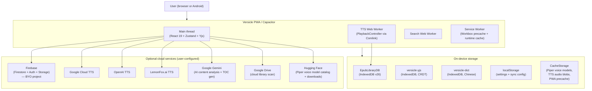
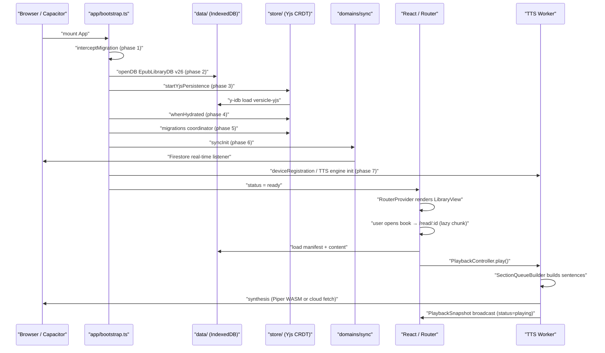
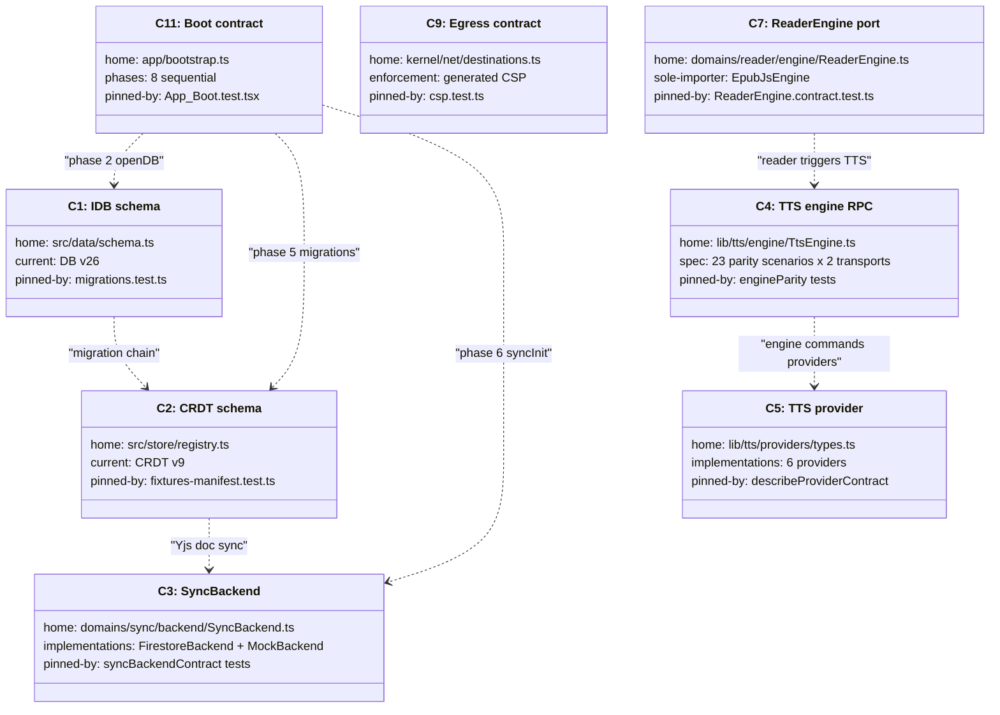

# Introduction & Product Vision

> This document is part of the Versicle comprehensive documentation set. For
> a map of all documents, see [Architecture overview](10-architecture-overview.md).
> For terminology used throughout, see [Glossary](02-glossary-and-domain-model.md).

---

## 1. What Versicle Is

Versicle is a **local-first, privacy-focused EPUB reader and audiobook player**
that runs entirely in the browser or as a native mobile app via Capacitor. The
defining property is data ownership: your books, reading progress, annotations,
and listening history live on your device, in your own browser storage and — if
you choose — in a Firebase project you control. No Versicle-operated server ever
sees your library or your content.

The project was built almost entirely by AI coding agents (initially Google Jules,
later Claude) across 3,600+ commits. The 2026 overhaul program
([plan/overhaul/README.md](../../plan/overhaul/README.md)) paid off a large
structural debt accumulated during that process and concluded in June 2026 with
all ten phases complete.

### The core promise in three sentences

1. **Your books belong to you.** Every byte of library data is stored in IndexedDB
   on your device. You can export a full ZIP archive at any time and take it
   elsewhere.

2. **You control what leaves the device.** Network egress is governed by a
   generated Content Security Policy derived from an explicit registry
   ([src/kernel/net/destinations.ts](../../src/kernel/net/destinations.ts)).
   Cloud TTS, AI analysis, and sync are opt-in; the app works entirely offline
   without them.

3. **Listening is a first-class feature.** Any EPUB can become an audiobook using
   offline Piper WASM synthesis or cloud voices (Google, OpenAI, LemonFox), with
   the same paragraph-level position tracking as reading.

---

## 2. Who It Is For

Versicle is built for **people who read a lot and want to also listen**. The
typical user:

- Has a large personal EPUB library and does not want to upload it to a service.
- Commutes or exercises and wants to continue their book by listening rather than
  reading.
- Reads Chinese texts and wants on-demand Pinyin overlays and Simplified-to-Traditional
  conversion without a dedicated dictionary app.
- Is technically confident enough to supply their own API keys for cloud voice
  providers or their own Firebase project for sync.

The app is not optimized for casual single-book users or readers who want managed
cloud storage of their library — there is no Versicle backend to manage it for
them.

---

## 3. System Context

The diagram below places Versicle in its environment: what the user's browser or
native shell contains, what the app stores locally, and which external services
are contacted (all opt-in, enumerated in [Architecture overview](10-architecture-overview.md)
§Network egress).



---

## 4. Feature Tour

### 4.1 Reading Room

The reading surface is an [epub.js](https://github.com/futurepress/epub.js)
renderer wrapped behind the `ReaderEngine` port
([src/domains/reader/engine/ReaderEngine.ts](../../src/domains/reader/engine/ReaderEngine.ts)).
Only `EpubJsEngine` imports epub.js at runtime (boundary rule 8, lint-enforced),
which means the renderer can be swapped without touching any other module.

**Adaptive cover theming.** When you open a book, the app runs
[src/lib/cover-palette.ts](../../src/lib/cover-palette.ts): a weighted K-Means
clustering algorithm extracts dominant colors from the cover image and produces a
`PerceptualPalette`. The UI shell applies this palette as a gradient and picks
contrasting text themes, so each book has a distinct visual identity.

**Import paths.** You can import EPUBs by:
- Drag-and-drop anywhere in the app.
- File-picker, including batch ZIP archives (JSZip) and folder imports.
- Google Drive scan (optional; requires OAuth).

The `ImportOrchestrator` in
[src/domains/library/import/](../../src/domains/library/import/) queues
every import as a job and uses a `KeyedMutex`
([src/domains/library/mutex.ts](../../src/domains/library/mutex.ts))
to serialize per-book operations. SHA-256 content hashing provides identity:
re-importing the same file finds the existing record rather than creating a
duplicate.

**Ghost Books.** When you offload a book file to save space, the metadata,
progress, highlights, and notes remain in the CRDT as a "ghost". Importing a
file whose SHA-256 matches will automatically reattach to the ghost.

**Chinese language support.** For books whose `language` metadata starts with
`zh`, the `domains/chinese` module
([src/domains/chinese/index.ts](../../src/domains/chinese/index.ts)) registers
as a content processor on the `ReaderEngine`'s `contentRendered` event. It
provides:
- On-the-fly Pinyin overlays via `PinyinGeometryEngine` (code-point-safe for
  astral characters; CH-1 fixed in Phase 6).
- Simplified-to-Traditional conversion via `opencc-js`.
- A CC-CEDICT dictionary lookup backed by the separate `versicle-dict` IndexedDB
  database.
- Smart Pinyin filtering: characters the user marks as "known" progressively
  stop showing Pinyin overlays, implementing spaced-vocabulary tracking.

**Annotations.** Full highlight and note support, stored in the `useAnnotationStore`
CRDT map (keyed by UUID). Annotations can be exported as Markdown or copied to
the clipboard.

**Full-text search.** Search runs in a background Web Worker
([src/workers/search.worker.ts](../../src/workers/search.worker.ts)) so indexing
never blocks the UI. The `SearchSession` in
[src/domains/search/](../../src/domains/search/) coordinates query dispatch and
result navigation. The search corpus is persisted to `cache_search_text` (IDB
v26 addition) so subsequent sessions do not re-index from scratch.

**Instant resume.** `useLocalHistoryStore` (localStorage) records the last-open
book id independently of the full CRDT sync, so the app can restore your place
without waiting for Yjs hydration.

### 4.2 Listening Room

TTS is the most architecturally complex feature in the app. The engine lives in a
Web Worker, synthesizes audio via one of six providers, and keeps the UI in sync
through a single monotonic `PlaybackSnapshot` broadcast channel.

**Six providers, one interface.** Every provider implements `ITTSProvider`
([src/lib/tts/providers/types.ts](../../src/lib/tts/providers/types.ts)) and is
registered in the `PROVIDERS` descriptor table
([src/lib/tts/providers/registry.ts](../../src/lib/tts/providers/registry.ts)):

| Id | Kind | API key | Platforms |
|----|------|---------|-----------|
| `webspeech` | device | no | web |
| `capacitor` | device | no | native |
| `piper` | wasm | no | all |
| `google` | cloud | yes | all |
| `openai` | cloud | yes | all |
| `lemonfox` | cloud | yes | all |

Piper ([src/lib/tts/providers/PiperProvider.ts](../../src/lib/tts/providers/PiperProvider.ts))
runs a vendored WASM runtime in `third-party/piper/` with WebGPU via ONNX
Runtime Web, falling back to WASM. Voice models are downloaded transactionally
into `CacheStorage ('piper-voices-v1')` and verified before use.

**Speed-at-sink policy.** Synthesis always runs at rate 1.0. Playback speed is
applied at the `AudioSink` (`HTMLAudioElement.playbackRate`). This means cached
audio blobs are speed-agnostic — the cache key does not include speed — and a
provider cannot accidentally double-apply rate.

**The engine architecture.** The worker runs `PlaybackController`
([src/lib/tts/engine/PlaybackController.ts](../../src/lib/tts/engine/PlaybackController.ts),
1,248 lines) which composes:

- `QueueModel` — immutable queue state transitions.
- `AnalysisApplier` — applies GenAI skip masks and table adaptations to the
  queue asynchronously.
- `MediaMetadataPublisher` — pushes lock-screen controls via Media Session API.
- `DragnetGesture` — captures the audio bookmark on pause→resume (the position
  within a sentence, not just which sentence).

The main thread talks to the worker through `WorkerTtsEngine` / `WorkerEngineHandle`
(Comlink). `WorkerEngineContext`
([src/lib/tts/engine/WorkerEngineContext.ts](../../src/lib/tts/engine/WorkerEngineContext.ts))
keeps a replicated-state cache of the synced Zustand stores so the worker can
read them synchronously without reaching across the thread boundary.

**Content pipeline.** Before queuing a section for playback, `SectionQueueBuilder`
([src/lib/tts/SectionQueueBuilder.ts](../../src/lib/tts/SectionQueueBuilder.ts))
runs `TextSegmenter` (locale-aware sentence splitting using `TextScanningTrie` —
a zero-allocation trie implementation) and applies the `LexiconEngine`
([src/lib/tts/LexiconEngine.ts](../../src/lib/tts/LexiconEngine.ts)): compiled
pronunciation rules (regex-supported) keyed by `(bookId, language, storeVersion)`.
The Bible abbreviation lexicon is a lazy-loaded JSON file; an agent-loop test in
the build gate asserts it stays out of the entry chunk.

**AI content filtering.** The `ReferenceSectionDetector`
([src/lib/tts/ReferenceSectionDetector.ts](../../src/lib/tts/ReferenceSectionDetector.ts))
can use Gemini to identify the paragraph where a section transitions from
narrative to reference material (footnotes, citations, indexes). Only the
boundary is found — not individual elements — which minimizes token usage.
Smart Rotation automatically switches between Gemini Flash Lite and Flash when
rate limits (HTTP 429) are encountered.

**Background playback and lock screen.** On Android the Capacitor foreground
service keeps audio running when the screen is off. The `MediaSessionManager`
([src/lib/tts/MediaSessionManager.ts](../../src/lib/tts/MediaSessionManager.ts))
publishes position and artwork to the OS media controls. A `BatteryOptimization`
check warns users if aggressive Android battery policies might kill playback.

**Caching.** Synthesized audio blobs are cached per `(providerId, voiceId, text,
format)` in `cache_audio_blobs` (IDB). An LRU eviction job runs at startup using
the `by_lastAccessed` index added in v25.

### 4.3 Engine Room (Library Management)

**Dual sync.** Versicle offers two complementary sync mechanisms:

- **Firestore real-time sync** (BYO Firebase): The `SyncOrchestrator` in
  [src/domains/sync/](../../src/domains/sync/) connects the Yjs Y.Doc to
  Firestore via the vendored `y-cinder` package. Every Yjs update is a
  Firestore document write; other devices receive it via a real-time listener.
  The `SyncBackend` port
  ([src/domains/sync/backend/SyncBackend.ts](../../src/domains/sync/backend/SyncBackend.ts))
  has two implementations: `FirestoreBackend` (production) and `MockBackend`
  (dev/E2E, never in the production bundle per boundary rule 9).

- **Android native backup**: Integration with Android's Backup Manager writes
  the Yjs snapshot and IDB metadata to the platform's cold-path backup.

**Workspace switching.** Moving to a different Firestore workspace is a
crash-resumable staged swap: download → verify → write to `versicle-yjs-staging`
→ set `STAGED` flag → reload applies atomically under the cross-tab write lock.
If the process is interrupted at any point, the boot interceptor
(`interceptMigration` phase) detects and completes or rolls back the swap on
next launch.

**Checkpoints.** Before any dangerous operation (migration, backup restore,
workspace switch) the `YjsSnapshotService` writes a serialized Y.Doc snapshot to
`sync_checkpoints` (IDB). The last 10 checkpoints are retained. The
"Checkpoint Forensics" tool in the Diagnostics settings tab lets users inspect
the data difference between the live state and any checkpoint.

**Backups.** `BackupService`
([src/lib/BackupService.ts](../../src/lib/BackupService.ts)) offers two export
forms:
- **Light backup**: JSON of `user_*` metadata, settings, and the Yjs snapshot.
- **Full backup**: ZIP archive including book files (offloaded books excluded),
  with a V2 binary Yjs snapshot (`Y.encodeStateAsUpdate`) that restores without
  merge conflicts.

Restores are validate-before-destroy: the incoming manifest is parsed and
version-checked (manifest v3) before any local data is touched, and a
pre-restore checkpoint is written.

**Reading list and history.** The `useReadingListStore` CRDT map tracks status
(Read / Reading / Want to Read) and rating per book, keyed by filename. It
survives file deletion as a "shadow inventory". CSV import/export with
entity-resolution normalization matches entries to library books even when
filenames differ.

**Safe Mode and Schema Quarantine.** If the boot sequence throws, `SafeModeView`
activates, offering data export and factory reset. `ObsoleteLockView` activates
when the Yjs doc reports a schema version newer than the running client (v5
threshold in the schema quarantine logic) — preventing an old build from
corrupting data written by a newer one.

**Flight Data Recorders.** The `kernel/diagnostics` ring-buffer core captures
black-box snapshots of Zustand state during unexpected errors. These are
persisted to `flight_snapshots` (IDB) and are readable in the Diagnostics
settings tab.

---

## 5. High-Level Capability Flow

The following sequence diagram shows what happens from the moment a user opens
the app to the moment audio starts playing. This is the "critical path" across
nearly every subsystem.



---

## 6. Architecture at a Glance

The codebase is organized as a **modular monolith** with five enforced layers.
Dependency direction is one-way (L0 → L1 → L2 → L3 → L4 → entries), enforced
by dependency-cruiser rules and TypeScript project references.

```mermaid
graph TB
    subgraph L0["L0 — kernel/ (imports nothing internal)"]
        CFI["kernel/cfi\n(CFI algebra)"]
        Diag["kernel/diagnostics\n(flight recorder)"]
        Locale["kernel/locale\n(i18n formatters)"]
        Net["kernel/net\n(NetworkGateway + CSP)"]
    end

    subgraph L1["L1 — data/ (only IndexedDB subsystem)"]
        Conn["connection.ts"]
        Repos["repos/ (7 repos)"]
        Rows["rows/ (zod schemas)"]
        Wipe["wipe.ts"]
        WriteGate["write-gate.ts"]
    end

    subgraph L2["L2 — store/ (Yjs CRDT + Zustand)"]
        Registry["registry.ts\n(9 synced + 6 local + 7 ephemeral)"]
        YjsProv["yjs-provider.ts\n(defineSyncedStore)"]
    end

    subgraph L3["L3 — domains/ (vertical feature modules)"]
        Chinese["chinese/"]
        Google["google/"]
        Library["library/"]
        Reader["reader/"]
        Search["search/"]
        SyncD["sync/"]
    end

    subgraph L4["L4 — app/ (composition root)"]
        Boot["bootstrap.ts + boot/"]
        Migr["migrations.ts"]
        Routes["routes.tsx"]
        Settings["settings/registry.ts"]
    end

    subgraph Entries["Entries / Workers"]
        Main["main.tsx"]
        AppTSX["App.tsx"]
        Workers["workers/tts + search"]
        SW["sw.ts"]
    end

    L0 --> L1
    L1 --> L2
    L2 --> L3
    L3 --> L4
    L4 --> Entries
```



The six domains and their responsibilities:

| Domain | Primary concern |
|--------|----------------|
| `chinese/` | Pinyin geometry, CC-CEDICT dictionary, vocabulary tracking |
| `google/` | Google OAuth, Drive scanning, Gemini AI client |
| `library/` | Import orchestration, book identity, offload/restore lifecycle |
| `reader/` | ReaderEngine port, overlays, session recording |
| `search/` | Full-text search sessions, persisted search corpus |
| `sync/` | SyncBackend port, workspace management, device mesh |

The **audio domain** is the one honest geography exception: it was rebuilt in
place across Phase 5 and lives at `src/lib/tts/` with its app-side adapters at
`src/app/tts/`. Every boundary rule applies to it via path-specific lint rules
rather than a `domains/audio/` directory. This was a deliberate choice:
relocating it would have been pure motion with no behavioral payoff
([src/domains/README.md](../../src/domains/README.md)).

---

## 7. Technology Stack

All version numbers are from [README.md](README.md) at the HEAD of the
overhaul branch.

| Category | Technology |
|----------|-----------|
| UI framework | React 19.2.3 + React Router 7.11.0 |
| Language | TypeScript 5.9.3 |
| Build | Vite 7.3.0 |
| Styling | Tailwind CSS v4.1.18 + Radix UI |
| State | Zustand + Yjs (CRDT) + `zustand-middleware-yjs` (vendored fork) |
| Persistence | IndexedDB via `idb`; Yjs via `y-idb` (vendored fork) |
| Sync | `y-cinder` (vendored fork) → Firestore 11.10.0 |
| EPUB rendering | epub.js |
| TTS synthesis | Piper WASM, Web Speech API, Capacitor TTS, Google Cloud TTS, OpenAI, LemonFox.ai |
| TTS worker bridge | Comlink |
| AI features | Google Gemini 2.5 Flash / Flash Lite via `@google/generative-ai` |
| Mobile | Capacitor 7.1.1 (Android) |
| Chinese | `opencc-js` + `pinyin-pro` + CC-CEDICT |
| Testing | Vitest 4.0.16 (3,103 tests / 307 files) |
| E2E | Playwright (78 spec files, Docker lane) |
| Linting | ESLint 9.39.2 + dependency-cruiser |

### Vendored packages

Three forks live as npm workspaces under `packages/`:

| Package | What was added |
|---------|---------------|
| `zustand-middleware-yjs` | `syncedKeys` whitelist, merge-defaults hydration, `scopedDiff`, `api.yjs` handle |
| `y-idb` | `flush()`, `writeSnapshot()`, `readSnapshot()`, durable `synced` event |
| `y-cinder` | `saved` flush events, Firestore Yjs provider |

---

## 8. The Twelve Contracts

Versicle's architecture is governed by twelve explicit contracts (C1–C12),
each with a home module, runtime validation, and a pinning test suite. These
are the only surfaces that require a versioned change process; everything else
is an internal that can be rewritten freely. Full details are in
[Architecture overview](10-architecture-overview.md) §2.



---

## 9. Data Ownership in Depth

This section documents every storage surface the app uses, because data
ownership is a core product promise.

### 9.1 IndexedDB databases

The app owns four IndexedDB databases:

```
EpubLibraryDB  (schema v26, src/data/schema.ts)
├── static_manifests      — EPUB OPF manifest rows (immutable)
├── static_resources      — EPUB resource blobs (spine items, images)
├── static_structure      — EPUB TOC/spine structure
├── cache_audio_blobs     — synthesized TTS audio (LRU-evicted)
├── cache_render_metrics  — epub.js render measurements
├── cache_tts_preparation — pre-processed sentence nodes
├── cache_search_text     — search corpus (added v26)
├── cache_session_state   — TTS playback state (WebKit-safe)
├── table_images          — extracted table images for AI adaptation
├── app_metadata          — schema-evolution envelope + legacy recovery
├── flight_snapshots      — black-box diagnostic captures
├── sync_checkpoints      — pre-danger Yjs snapshots (last 10)
└── sync_log              — sync event log (frozen, future bump)

versicle-yjs              (Yjs CRDT, managed by y-idb)
├── (Yjs binary update log — all nine synced stores)

versicle-dict             (Chinese dictionary, src/domains/chinese/dictionary/)
└── (CC-CEDICT compiled key-value store)

versicle-yjs-staging      (transient, workspace swap buffer)
```

### 9.2 localStorage keys

| Key | Store | Purpose |
|-----|-------|---------|
| `sync-storage` | `useSyncStore` | Firebase config, sync/auth status |
| `tts-settings` | `useTTSSettingsStore` | TTS provider/voice profiles (post-v3 split) |
| `drive-config-storage` | `useDriveStore` | Linked Drive folder + file index |
| `google-services-storage` | `useGoogleServicesStore` | Connected Google services |
| `genai-storage` | `useGenAIStore` | Gemini API key/model config |
| `local-history-storage` | `useLocalHistoryStore` | Last-read book id (instant resume) |

### 9.3 CacheStorage buckets

| Bucket | Contents |
|--------|---------|
| `piper-voices-v1` | Downloaded Piper voice model files (`.onnx` + config) |
| Workbox precache | Versioned app shell (JS chunks, CSS, HTML) |
| `/fonts` runtime cache | Custom font files (CacheFirst) |
| `/dict` runtime cache | `cedict.json` dictionary data (CacheFirst) |
| `/piper` runtime cache | Piper WASM worker assets (CacheFirst) |

### 9.4 CRDT document schema (v9)

The nine Zustand stores that synchronize through the Yjs CRDT, each mapped to a
named Y.Map:

| Store | Y.Map key | Synced keys | Purpose |
|-------|-----------|-------------|---------|
| `useBookStore` | `library` | `books` | Book inventory (per-book metadata) |
| `useReadingStateStore` | `progress` | `progress` | Reading progress + sessions, per device |
| `useAnnotationStore` | `annotations` | `annotations` | Highlights and notes (UUID-keyed) |
| `usePreferencesStore` | `preferences.<deviceId>` | 15 keys | Per-device display preferences |
| `useReadingListStore` | `reading-list` | `entries` | Reading list (status + rating) |
| `useVocabularyStore` | `vocabulary` | `knownCharacters` | Known Chinese characters |
| `useLexiconStore` | `lexicon` | `rules`, `settings` | TTS pronunciation rules |
| `useContentAnalysisStore` | `contentAnalysis` | `sections` | AI analysis cache |
| `useDeviceStore` | `devices` | `devices` | Device registry (sync mesh) |

The migration chain from v1 to v9 is documented in
[State management](13-state-management-crdt.md). The key invariant: each store
uses `merge-defaults` hydration, which means new top-level keys added to the
store's declared defaults survive hydration from an older CRDT document. Nested
new fields still require a migration backfill.

---

## 10. Privacy Architecture

Versicle's privacy posture is enforced at the code level, not just documented in
a policy:

1. **No Versicle telemetry.** There are no analytics calls in the codebase. The
   README states explicitly: "We don't know what you read."

2. **Generated CSP.** The Content Security Policy is rendered from the
   destination registry ([src/kernel/net/destinations.ts](../../src/kernel/net/destinations.ts))
   by `npm run generate:csp`. `src/kernel/net/csp.test.ts` is a permanent CI
   invariant: if the generated CSP disagrees with the committed `nginx.conf` and
   `index.html` meta tag, tests fail. Since Phase 8, the policy has no `https:`
   wildcard — every permitted host is explicitly enumerated.

3. **Raw fetch banned outside the gateway.** `eslint.config.js` bans `fetch`,
   `XMLHttpRequest`, and `sendBeacon` everywhere except `src/kernel/net/`
   (boundary rule 7). The NetworkGateway checks the destination registry before
   every request.

4. **Consent gates.** Cloud TTS providers require API key entry (provider
   selection consent). AI features (Gemini) require per-book consent stored in
   `usePreferencesStore.aiConsent`. Drive scanning requires OAuth. Firebase sync
   requires explicit onboarding.

5. **Remote images stripped from EPUBs.** The sanitizer
   ([src/lib/sanitizer.ts](../../src/lib/sanitizer.ts)) strips `src` attributes
   pointing to remote URLs from EPUB HTML at ingest time. The strict `img-src`
   CSP blocks any that slip through. This kills tracking pixels embedded in
   books.

6. **Data classification in the registry.** Every destination in
   `destinations.ts` carries a `dataClass` tag: `book-content`, `book-derived`,
   `metadata`, `binary-asset`, or `auth`. The nine destinations are:

   | Destination | Data class | Consent |
   |-------------|-----------|---------|
   | `gemini` | book-content | per-book |
   | `google-tts` | book-content | provider-selection |
   | `openai-tts` | book-content | provider-selection |
   | `lemonfox-tts` | book-content | provider-selection |
   | `hf-piper-catalog` | metadata | provider-selection |
   | `hf-piper-models` | binary-asset | provider-selection |
   | `drive` | binary-asset | oauth |
   | `google-oauth` | auth | oauth |
   | `firebase` | book-derived | oauth |

---

## 11. The Overhaul Program: A Brief History

Versicle's current architecture is the result of a ten-phase overhaul completed
on 2026-06-12. The full record is in
[plan/overhaul/README.md](../../plan/overhaul/README.md).

The starting point was ~46k lines of TypeScript accumulated across 3,600+ AI
agent commits. The analysis found 286 debt items (26 critical, 110 high). The
five critical clusters were:

1. **Data loss / destructive-before-validate**: "Clear All Data" left the Yjs
   IndexedDB intact; backup restore wiped local data before validating the
   incoming file; workspace switching had a rollback that could silently fail.
2. **Cloud security**: Invalid `firestore.rules` syntax; `deleteWorkspace` left
   remote data behind; Cloud Storage had no access rules.
3. **Schema evolution hazard**: Inbound Yjs hydration deleted state keys absent
   from the Y.Map, so no field could safely be added to any synced store.
4. **Concurrency without ownership**: Provider events bypassed the TaskSequencer;
   playback speed was applied at both synthesis and playback (double-rate bug).
5. **Unsequenced boot**: 229 of 266 modules executed eagerly at module scope;
   App.tsx boot relied on implicit cross-effect ordering.

The synthesis of three competing proposals (strangler-incremental, modular-monolith,
contract-first) produced the program: strangler ordering, modular-monolith
destination geography, contract-first governance authored just-in-time.

By close, the scoreboard showed:
- 26/26 verified criticals retired
- Vitest tests: 1,805 → 3,103 (307 files)
- Import cycles: 117 (full graph) → 0
- Production `as any` occurrences: 138 → 20 (justified per file in
  `lint-debt-allowlist.json`)
- ESLint-disable directives: 245 → 25
- Coverage (lines): 65.30% → 75.49%
- Dependency-cruiser violations: 207 → 35 (frozen ratchet baselines)

The [Overhaul history](80-overhaul-history.md) document covers this in full,
including the per-phase decision record and the god-file deletion log.

---

## 12. Reading This Documentation Set

This set of 44 documents covers Versicle from first principles to
production-readiness details. The suggested reading order for a new engineer:

**Start here (orientation):**
- [00-introduction.md](00-introduction.md) — this document
- [02-glossary-and-domain-model.md](02-glossary-and-domain-model.md) — terminology and domain types
- [10-architecture-overview.md](10-architecture-overview.md) — full module map and contracts

**Data and state (the foundation):**
- [20-storage-gateway.md](20-storage-gateway.md) — IndexedDB, write gate, repos
- [21-schema-and-migrations-idb.md](21-schema-and-migrations-idb.md) — IDB schema evolution
- [13-state-management-crdt.md](13-state-management-crdt.md) — Yjs CRDT, store registry

**Features (vertical slices):**
- [30-domain-reader-engine.md](30-domain-reader-engine.md) — ReaderEngine port
- [32-domain-audio-tts-engine.md](32-domain-audio-tts-engine.md) — TTS engine architecture
- [36-domain-sync.md](36-domain-sync.md) — Sync backend and workspace management

**Operational concerns:**
- [14-bootstrap-and-lifecycle.md](14-bootstrap-and-lifecycle.md) — boot sequence
- [60-build-and-bundling.md](60-build-and-bundling.md) — Vite config, bundle budget
- [63-testing-strategy.md](63-testing-strategy.md) — test pyramid and contract suites

**Reference:**
- [81-directory-map.md](81-directory-map.md) — full file tree with descriptions
- [01-product-design-decisions.md](01-product-design-decisions.md) — the "why" behind key choices
- [80-overhaul-history.md](80-overhaul-history.md) — what was built and why, phase by phase

---

## 13. Getting Started as a Developer

### Prerequisites and setup

```bash
# Node.js 22+ and npm are required (Docker optional for E2E)
git clone <repo>
cd versicle
npm install        # also runs postinstall → npm run prepare-piper (copies WASM assets to public/piper)
npm run dev        # local HTTPS (vite-plugin-mkcert)
```

### Key commands

```bash
npm test                         # Vitest unit + integration (3,103 tests)
npm run lint                     # ESLint 9
npx tsc -b                       # typecheck: app + tests + e2e + node + 3 packages
npm run build                    # production build
npm run generate:csp             # regenerate nginx.conf from destinations.ts
./run_verification.sh            # Playwright E2E suite (Docker)
```

### Where to look for things

| "I want to understand…" | Start at |
|-------------------------|----------|
| How a book is imported | [src/domains/library/import/ImportOrchestrator.ts](../../src/domains/library/import/) |
| How the epub renders | [src/domains/reader/engine/EpubJsEngine.ts](../../src/domains/reader/engine/) |
| How TTS plays audio | [src/lib/tts/engine/PlaybackController.ts](../../src/lib/tts/engine/PlaybackController.ts) |
| How stores sync | [src/store/yjs-provider.ts](../../src/store/yjs-provider.ts) |
| How the app boots | [src/app/bootstrap.ts](../../src/app/bootstrap.ts) |
| How IDB is accessed | [src/data/repos/](../../src/data/repos/) |
| How the CSP is generated | [src/kernel/net/destinations.ts](../../src/kernel/net/destinations.ts) |
| What contracts govern a seam | [architecture.md](../../architecture.md) §2 |

---

*This document is part of the Versicle comprehensive documentation set.
It describes the codebase as of the close of the 2026 overhaul program
(commit `3b0cfcff` as the analysis baseline; final close on branch
`claude/amazing-davinci-d7336e`).*
