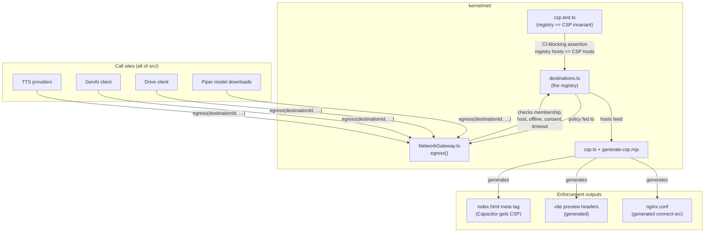
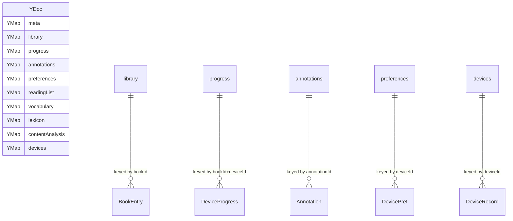
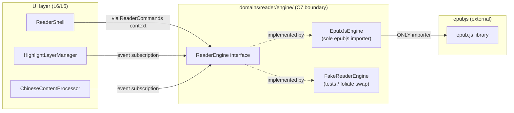
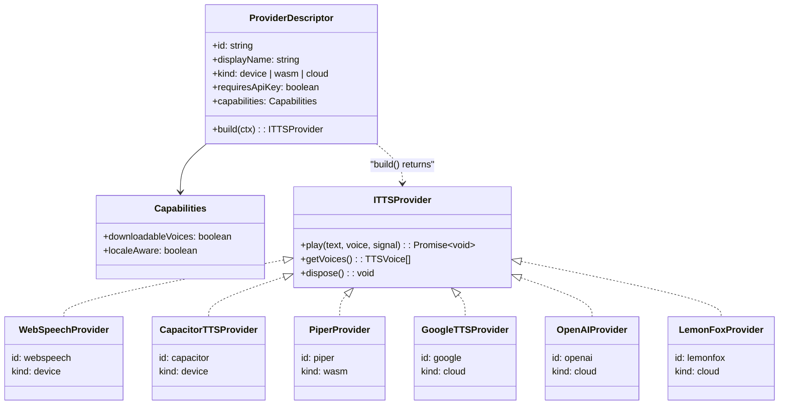
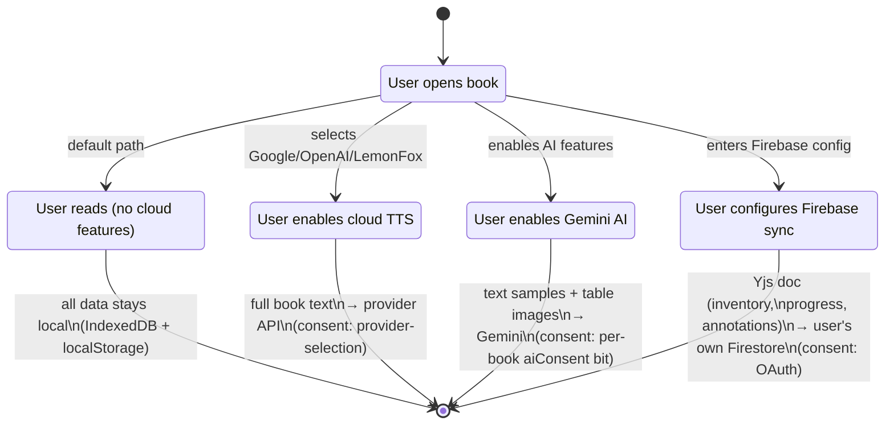
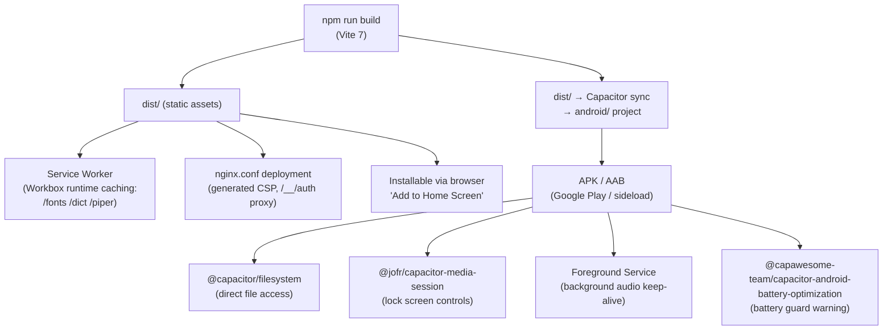
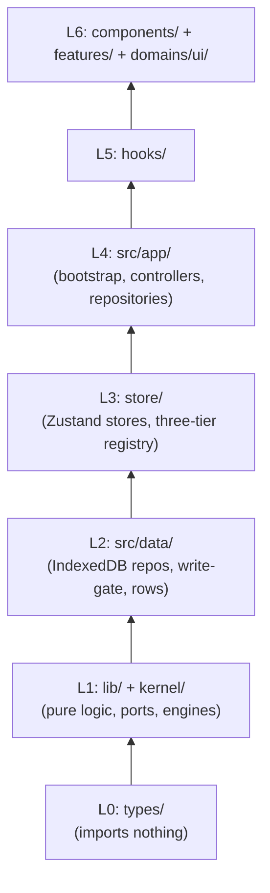

# Product Design Decisions

This document explains the **why** behind Versicle's architecture: the values that shaped
the product, the trade-offs made at each fork in the road, and the rejected alternatives.
It is a prerequisite for understanding any of the technical choices described in the rest
of this documentation set. Engineers new to the codebase should read it first.

See also [Architecture overview](10-architecture-overview.md), [State management / CRDT](13-state-management-crdt.md),
[TTS providers and platform](33-tts-providers-and-platform.md), [Security and privacy](70-security-and-privacy.md).

---

## 1. The Core Proposition: Local-First, Privacy-Centric

Versicle's README states the mission plainly:

> **Local-First**: Your books live on your device. No cloud servers, no tracking, no
> accounts.  
> **Privacy-Centric**: We don't know what you read. No analytics.

These are not marketing bullet points layered over a cloud service. They define the
delivery model at the infrastructure level: Versicle has **no first-party server**. There
is no Versicle API, no Versicle account, no Versicle database. Every byte of user data
starts and remains on the user's device unless the user actively opts in to a specific
egress destination. This is the architectural invariant the codebase is built to enforce.

The design consequence is immediately visible in the dependency graph: there are no
analytics SDKs (no Sentry, no PostHog, no Google Analytics, no Firebase Analytics) in
`package.json` or anywhere in `src/`. The privacy posture analysis (`plan/overhaul/analysis/gap-privacy-posture-data-egress-ma.md`)
audited every network primitive in the codebase and confirmed this: "The 'no analytics'
half of the claim holds — there are no telemetry SDKs anywhere."

The "we don't know what you read" half requires active enforcement, because several
features are inherently egress-positive (cloud TTS, Gemini AI analysis, Firestore sync).
That enforcement is discussed in depth in §4 and §8 of this document.

---

## 2. Why Local-First at All? The Alternative Considered and Rejected

The natural alternative for an EPUB reader with multi-device sync is a traditional
backend: user accounts, server-side storage, a REST or GraphQL API that mediates all
access. This is how Kindle, Kobo, and most modern reading apps work.

That model was rejected for three compounding reasons:

1. **Operational cost and longevity.** A server-backed service requires indefinite
   operation. Services that store your reading history can be shut down, acquired, or
   go bankrupt. A local-first app survives vendor failure by definition — the data is on
   your device.

2. **Privacy without trust.** A server-backed service requires trusting the operator with
   detailed reading history: what books you own, what pages you read, when you paused,
   what you annotated. Versicle's audience includes readers of sensitive material (religious
   texts, political books, language learners working with content they may not want
   disclosed). The local-first model eliminates the need for trust.

3. **Audience alignment.** Versicle is explicitly designed for Chinese-language learners
   (pinyin overlay, OpenCC conversion, CC-CEDICT dictionary, Chinese TTS voices). That
   audience is geographically distributed and privacy-conscious in ways a centralized
   service complicates.

The design decision has a cost: multi-device sync cannot simply be a database query. It
requires a conflict-resolution strategy that works without a central authority. That cost
is paid by the Yjs CRDT layer described in §5.

---

## 3. BYO-Firebase: Sync Without a First-Party Server

Versicle offers real-time, cross-device sync, which seems to contradict the local-first
model. The resolution is **Bring-Your-Own-Firebase (BYO-Firebase)**:

- The user creates and owns their own Firebase/Firestore project.
- Versicle stores sync data in the user's project — Versicle the company never has
  access to it.
- The Firebase configuration (API key, project ID, auth domain) is entered by the user in
  the settings UI and persisted locally. It is never transmitted to any Versicle
  endpoint (because there is no Versicle endpoint).

This is visible in `src/lib/sync/firebase-config.ts`: initialization is lazy, triggered
only when the user has supplied a configuration, and all Firebase SDK calls route through
the user's own project:

```ts
// src/lib/sync/firebase-config.ts
export const initializeFirebase = (): boolean => {
    const config = getFirebaseConfig();   // user-supplied, from local store
    if (!config) return false;
    // ...
    app = initializeApp(config);
    auth = getAuth(app);
    // ...
};
```

The Firebase SDK owns the HTTP transport (it is not mediated by `NetworkGateway.egress`
because the destination and credentials are user-configurable at runtime), but the hosts
it contacts are listed in the egress destination registry:

```ts
// src/kernel/net/destinations.ts
{
  id: 'firebase',
  hosts: [
    'firestore.googleapis.com',
    'identitytoolkit.googleapis.com',
    'securetoken.googleapis.com',
    'www.googleapis.com',
    'firebasestorage.googleapis.com',
    '*.firebaseio.com',
  ],
  via: 'sdk',
  purpose: "Sync to the user's own Firebase project: Yjs doc (library inventory, " +
           "progress, annotations incl. selected text), checkpoints, Cloud Storage snapshots",
  dataClass: 'book-derived',
  consent: 'oauth',
  // ...
}
```

The `via: 'sdk'` annotation means the SDK owns the HTTP but the hosts feed the generated
CSP. The user's `authDomain` is proxied same-origin via `/__/auth/` in `nginx.conf` for
web deployments, keeping the CSP enumeratable.

**Trade-offs accepted with BYO-Firebase:**

- Setup friction. A user who wants sync must create a Firebase project. This is a
  deliberate barrier: sync is optional, and the barrier screens for users who understand
  the trade-off.
- No E2E encryption at HEAD. Sync data (including annotation text, reading positions,
  vocabulary) is readable by anyone with access to the user's Firebase project and by
  Google. The `gap-privacy-posture` analysis (D12) flags this explicitly. The Yjs update
  blob is already opaque bytes to Firestore, making optional client-side E2EE tractable
  as a future addition, but it is not implemented.
- Firebase rules complexity. Rewritten `firestore.rules` and `storage.rules` (Phase 0
  hotfix, then Phase 4 full enforcement) provide per-workspace tombstone protection and
  purge policies, but the rules only protect the user from other devices on the same
  account — not from Google.

The `capacitor.config.ts` records the one hardening decision that does not require user
action: `androidScheme: 'https'`, `cleartext: false`, `allowNavigation: []` — the
Android WebView is hardened against navigation to arbitrary URLs regardless of sync
configuration.

---

## 4. The Egress Policy: Making "Privacy-Centric" Enforceable

The local-first philosophy requires more than good intentions — it requires a mechanism
that prevents accidental egress from slipping in during feature development.

At the codebase's starting state (analyzed at commit `3b0cfcff`), there was no such
mechanism. Eleven `fetch()` call sites were scattered across eight source files, one
unbundled XHR helper lived in a static public asset (`public/piper/piper_worker.js`),
and the CSP `connect-src` contained a blanket `https:` wildcard that made the header
a no-op as an allowlist.

Phase 7 introduced the **egress destination registry** and the **NetworkGateway**, which
together make the privacy claim continuously auditable:



Every destination is declared once in `EGRESS_DESTINATIONS` with a typed data
classification, consent requirement, timeout, and offline policy. The `egress()` function
in `NetworkGateway.ts` applies all five checks before a byte leaves the device:

1. Registry membership (`NET_UNKNOWN_DESTINATION`)
2. Host allowlist — the URL's hostname must match a declared `hosts` pattern
3. Offline policy — `navigator.onLine === false` trips `NET_OFFLINE`
4. Consent gate — `per-book` destinations require either a user gesture or a positive
   result from the injected `ConsentResolver` (wired at the composition root to the
   per-book `aiConsent` preference)
5. Per-destination `AbortController` timeout

The lint rule banning raw `fetch`/`XMLHttpRequest` outside `src/kernel/net/` is enforced
at error level with zero production exemptions; the `csp.test.ts` invariant that the
registry hosts equal the generated CSP is a permanent CI gate. Adding a new egress
destination is a deliberate act that touches the registry, regenerates the CSP, and
triggers a policy review in code review.

The six known provider types and their data classifications in the registry:

| Destination | `dataClass` | `consent` | `timeoutMs` |
|---|---|---|---|
| `gemini` | `book-content` | `per-book` | 60 000 |
| `google-tts` | `book-content` | `provider-selection` | 30 000 |
| `openai-tts` | `book-content` | `provider-selection` | 30 000 |
| `lemonfox-tts` | `book-content` | `provider-selection` | 30 000 |
| `hf-piper-catalog` | `metadata` | `provider-selection` | 30 000 |
| `hf-piper-models` | `binary-asset` | `provider-selection` | null (unbounded) |
| `drive` | `binary-asset` | `oauth` | null (unbounded) |
| `google-oauth` | `auth` | `oauth` | null |
| `firebase` | `book-derived` | `oauth` | null |

Notice that `remote-code` appears in the `EgressDataClass` union but has no entry in the
live registry. This is intentional: Phase 5a vendored `onnxruntime` into
`/public/piper/` as same-origin assets, eliminating the `cdnjs.cloudflare.com`
`importScripts` that the privacy report flagged as a supply-chain injection vector.

---

## 5. Why Yjs (CRDT) for Multi-Device Sync

Multi-device sync without a central arbiter requires a conflict-resolution strategy that
works when devices are offline, update independently, and reconnect in any order.
Versicle chose **Yjs**, a Conflict-free Replicated Data Type (CRDT) library.

### The alternatives considered

**Operational Transform (OT).** OT is used by Google Docs and similar collaborative
editors. It requires a server to sequence operations. That disqualifies it for a
local-first, BYO-Firebase model where no Versicle server exists.

**Last-Write-Wins (LWW) per record with timestamps.** Simple to implement, fails on
concurrent edits to the same field (the last writer wipes the other's change, even if
the fields are different). It also requires clock synchronization, which is unreliable.

**Manual merge with server authority.** The user resolves conflicts via a UI. Acceptable
for documents; catastrophic for reading progress (which updates on every page turn across
multiple devices simultaneously).

**Yjs CRDTs.** Yjs Y.Map and Y.Array types support concurrent updates that merge
deterministically without coordination. A Y.Map entry updated on two devices offline
results in the later timestamp winning for the same key — but different keys never
conflict. Reading progress per device, annotations, and vocabulary can all be represented
as independent Y.Map entries that merge without loss.

The specific CRDT topology in Versicle maps directly to the product's data model:



The `progress` map uses a `bookId+deviceId` composite key so that reading position on
a phone never overwrites reading position on a tablet — both survive and the app
aggregates the most recent across the mesh. This is a deliberate per-device progress
design, not a deficiency.

The current schema version is `CURRENT_SCHEMA_VERSION = 9` (as declared in
[yjs-provider.ts](../../src/store/yjs-provider.ts)). The migration coordinator in
`src/app/migrations.ts` applies CRDT transforms atomically (one `yDoc.transact` per
version step) and pre-creates a checkpoint before running any destructive transform.

### The Yjs middleware choice

Zustand is the React state management layer. Each synced store is a Zustand store
wrapped by `defineSyncedStore` (the only legal callsite for the forked
`zustand-middleware-yjs` middleware — lint-enforced). The forked middleware adds:

- `syncedKeys` whitelist: only declared keys replicate; the rest stay local.
- `hydration: 'merge-defaults'`: inbound Y.Map patches are merged over the store's
  declared defaults instead of replacing the whole state. This prevents a critical
  historical bug where any field absent from a received Y.Map would be deleted from
  the local store, making it impossible to safely add a field to a synced store.
- `scopedDiff`: per-key diffing instead of whole-store diffing, eliminating the write
  amplification that previously caused 60fps page turns to flush the entire CRDT.
- `api.yjs.whenHydrated()`: a Promise that resolves once the first sync from IndexedDB
  or Firestore has applied. The boot sequence awaits this before running migrations.

---

## 6. epub.js for Rendering: Scope and Isolation

EPUB files are ZIP archives containing HTML, CSS, images, and an OPF manifest. Rendering
them requires parsing the archive, loading the correct HTML frames, applying user themes
over book styles, and mapping DOM positions to CFI (Canonical Fragment Identifier)
addresses for navigation and annotation.

Versicle chose **epub.js** for this task.

### Why epub.js

epub.js is the established open-source EPUB rendering library for the browser. The
alternatives at the time of the product's creation were:

- **foliate-js** (the GNOME Books engine, extracted): newer, no `iframe` per section,
  better CSS isolation. Not yet stable enough at the time of initial development.
- **Readium.js**: the W3C reference implementation. Complex integration surface, large
  runtime, designed for full reading systems rather than embedded use.
- **DIY parsing**: epubcfi navigation and CFI algebra are complex enough that building
  them from scratch would be high risk. epub.js provides both.

epub.js was chosen as the pragmatic choice with the widest community. The design
decision that matters for the codebase, however, is **how** epub.js is used, not that it
is used.

### The ReaderEngine isolation boundary

Phase 6 introduced the `ReaderEngine` interface (at
[src/domains/reader/engine/ReaderEngine.ts](../../src/domains/reader/engine/ReaderEngine.ts))
as the sole public contract through which the rest of the application interacts with
the rendering layer. The acceptance criterion for this boundary is documented in the
interface file's header:

> The C7 acceptance: swapping to foliate-js is a one-module change, demonstrated by
> the shell booting on the fake.

`EpubJsEngine` (at [src/domains/reader/engine/EpubJsEngine.ts](../../src/domains/reader/engine/EpubJsEngine.ts))
is the sole runtime importer of epub.js — this is enforced by a lint rule at error
level. Components, hooks, and TTS code consume only the `ReaderEngine` interface.



The historical alternative — `(rendition as any)` spread across eight files, plus
`window` CustomEvent bus for cross-component communication — was eliminated in Phase 6.
The before state had the rendering object escaping into stores and callbacks, making the
renderer untestable in isolation and any future renderer swap a global codebase surgery.

### epub.js and the CFI kernel

epub.js provides its own CFI implementation (`epubcfi` package). Versicle developed a
parallel canonical CFI kernel at `src/kernel/cfi/` because the epub.js CFI algebra was
insufficient for TTS use cases (sentence-boundary snapping, grouping adjacent CFIs into
segments for batch synthesis). The kernel is the single source of truth for CFI string
parsing and manipulation; `epubcfi` is used only within `EpubJsEngine` for the
`cfiFromRange` / `getRange` operations that require the rendition's live DOM context.

---

## 7. Multi-Provider TTS as an Audiobook Experience

Versicle's "Listening Room" converts any EPUB into an audiobook. The design philosophy
is that this must work **without any cloud service at all** (offline, no API keys),
while offering studio quality when the user supplies API keys. Multiple providers are
supported simultaneously in a single registry:



The `PROVIDERS` constant in [src/lib/tts/providers/registry.ts](../../src/lib/tts/providers/registry.ts)
is the single source of truth. Every registry-derived behavior — the settings UI list,
the platform-specific availability, the API key field label, the fallback order, the
capability type guards — derives from `PROVIDERS`. The historical alternative was six
hand-maintained registration sites scattered across the codebase, which had drifted out
of sync (e.g., `PiperProvider extends BaseCloudProvider` — the local WASM engine
classified as cloud, inheriting cost tracking for free synthesis).

### The three provider kinds

**device (webspeech / capacitor):** Uses the operating system's built-in TTS engine. Zero
configuration, zero cost, but voice quality depends entirely on the OS. On web: Web
Speech API, which may route some voices to a cloud service (Chrome's "Google" voices
are network-backed despite appearing in `speechSynthesis`). On Android: the system
`TextToSpeech` engine via Capacitor, similarly OS-controlled.

**wasm (piper):** The Piper TTS runtime (Mozilla Research's neural voice engine compiled
to WASM) runs entirely on-device. Voice models are downloaded once (from HuggingFace,
mediated by `NetworkGateway.egress('hf-piper-models', …)`) and cached. Phase 5a vendored
`onnxruntime-web` into `public/piper/` to eliminate the `cdnjs.cloudflare.com`
`importScripts` dependency that had broken offline use and introduced a remote-code
supply-chain risk. When WebGPU is available, `onnxruntime` uses it for hardware
acceleration; it falls back to WASM.

**cloud (google / openai / lemonfox):** The user supplies their own API key. Full book
text is sent sentence-by-sentence to the chosen endpoint. Provider selection counts as
consent (`consent: 'provider-selection'` in the registry). Each cloud provider has a
30-second timeout enforced by the gateway.

### The speed policy (P0 decision)

A subtle but audible bug that existed before Phase 0: TTS speed was applied at **both**
synthesis time (in the API request body) and playback time (as `audio.playbackRate`).
The result was that a 2× speed setting produced approximately 4× speed. The fix was
the P0 speed policy, which is now a permanent invariant in the codebase:

> Synthesize at 1.0 always; playback rate applied at the audio sink after `src` load;
> speed removed from request bodies and the audio cache key.

This is reflected in `TTSCache.ts`: cache keys are SHA-256 of `text|voiceId` only,
with no speed parameter. An audio segment cached at 1.0 is reused regardless of the
current playback rate.

### Fallback and recovery policy

The `TTSProviderManager` (the `PlaybackBackend` port implementation) does not perform
fallback. It detaches and disposes outgoing providers on swap, normalizes events
(filtering spurious interruption signals), and rethrows play failures as typed
`ProviderPlaybackError`s. Recovery policy is the engine's exclusive responsibility:
`PlaybackController.recoverWithLocalProvider()` executes one sequenced fallback task
(stop → swap → replay) with a retry cap.

This separation matters because the historical double-fire bug (where cloud failure
triggered both the provider's event path and a separate gesture path, each launching
an independent fallback) was caused by two code paths owning recovery. The current
design has exactly one.

---

## 8. Privacy Posture: What Data Leaves the Device and When

The egress registry (§4) is the enforcement mechanism. This section maps the user's
privacy expectations to the concrete data flows, including the ones that are
conditionally egress-positive.



**What never leaves the device (by design):**

- The book file itself (EPUB binary). Firestore sync replicates metadata, not files.
- Book cover images (served as blob URLs from IndexedDB).
- The cedict.json dictionary (same-origin `/dict/cedict.json`).
- Piper voice models after initial download (served from `Cache Storage`).
- Reading history, annotations, vocabulary — unless Firebase sync is enabled.

**What leaves the device only with explicit provider selection (cloud TTS):**

Full book text, sentence by sentence, to the selected provider. The `consent:
'provider-selection'` gate means that choosing a cloud provider in settings counts as
consent for all books played with that provider. This is documented in the provider
picker UI but not yet with a one-time disclosure dialog (planned post-overhaul).

**What leaves the device with the Gemini AI flag and per-book consent:**

Text samples (first 60% truncated to 8 words, tail to 120 characters per group) and
full-resolution table screenshots go to `generativelanguage.googleapis.com`. The
`consent: 'per-book'` gate requires either a user gesture (`consent.interactive: true`)
or a positive `consentResolver` result for the specific book's `aiConsent` bit. The
consent resolver is wired at the composition root, keeping `kernel/net/` itself
store-agnostic.

**What leaves the device with Firebase sync (user's own project):**

The complete Yjs document: library inventory (titles, authors), reading progress, all
annotations (including selected text excerpts), vocabulary, reading lists, content
analysis results including Gemini-generated table narrations, device registry, and
checkpoint snapshots. These go to the user's own Firestore project — Versicle has no
access — but without client-side E2EE, they are readable by Google and by anyone with
Firebase admin access to the project.

**Privacy hardening in content rendering:**

The DOMPurify-based EPUB sanitizer (`src/lib/sanitizer.ts`) strips remote references
from resource-loading elements (`IMG`, `SOURCE`, `VIDEO`, `AUDIO`, `TRACK`, `IMAGE`,
`USE`) by rewriting any `src`/`href`/`srcset` with a remote URL pattern (`^https?:|//`)
to a blocked placeholder. This eliminates read-tracking pixels embedded in EPUBs
(a real attack vector described in the privacy posture analysis as D5). The sanitizer
also strips external `<link>` CSS tags, fixes reverse-tabnabbing on `target="_blank"`
links, and strips `<script>`. The strict `img-src 'self' data: blob:` CSP in the
generated `nginx.conf` provides defense-in-depth.

---

## 9. PWA + Native Parity: One Codebase, Two Deployment Targets

Versicle ships as both a **Progressive Web App** (PWA) and a **Capacitor-wrapped Android
app**. The philosophy is that these are not separate products — they share the same React
codebase, the same state management, the same TTS engine, and the same storage layer.

### The deployment target decision tree



`capacitor.config.ts` declares the shared configuration: `appId: 'com.vrwarp.versicle'`,
`androidScheme: 'https'` (required for Secure Context APIs, CORS, and WebCrypto),
`cleartext: false`, `allowNavigation: []`.

### What differs between platforms

The `ProviderDescriptor` registry (`platforms` field) is the programmatic expression of
platform differences:

```ts
{ id: 'webspeech', platforms: ['web'], … }     // Web Speech API unavailable in Capacitor
{ id: 'capacitor', platforms: ['native'], … }  // @capacitor-community/text-to-speech
{ id: 'piper', /* no platforms: */ … }         // available everywhere
```

Platform-specific behaviors are encapsulated in Capacitor plugins rather than
conditional code scattered through features:

- **File system access:** `@capacitor/filesystem` for direct file paths (EPUBs can be
  opened from the device's Files app on Android without a browser file picker).
- **Media session + lock screen:** `@jofr/capacitor-media-session` provides artwork
  and playback controls on the Android lock screen and notification shade; the
  `MediaSessionManager` and `PlatformIntegration` modules abstract this behind the
  same interface used by the browser Media Session API on web.
- **Background audio:** A foreground service (configured via `plugins.MediaSession.
  foregroundService: "always"` in `capacitor.config.ts`) keeps the app alive during
  playback when the screen is off. The `BackgroundAudio` module generates white noise
  to prevent aggressive OS audio-session teardown. `BatteryOptimization` warns users
  if aggressive battery management is enabled.
- **OAuth:** `@capgo/capacitor-social-login` handles the native Google OAuth sheet on
  Android vs the web popup flow. `GoogleAuthClient` wraps both behind a single
  per-service token map.

### PWA installability and Service Worker

Phase 8 landed the final PWA finishers:

- A single `manifest.webmanifest` (the duplicate was deleted).
- Workbox runtime caching for three asset groups: `/fonts`, `/dict`, `/piper` — these
  are the static assets whose offline availability makes the app usable without a
  network connection.
- A prompt-style SW update (SKIP_WAITING handshake + persistent "Reload to update"
  toast) replacing the old `skipWaiting` auto-reload that could disrupt in-progress
  playback.
- A soft boot gate: the app no longer hard-gates on the SW controller being present,
  so it starts immediately even when there is no SW (first visit, private mode).

---

## 10. i18n: "i18n-Ready, English-Only"

Versicle's primary audience at launch is English-speaking Chinese-language learners.
The UI is entirely English. The product is also explicitly a Chinese reading tool, and a
Chinese UI locale is the obvious eventual ask.

ADR 0001 (`docs/adr/0001-i18n-strategy.md`, accepted 2026-06-10) records the decision
and its reasoning. The key points:

**What was decided:** No user-facing locale work during Phases 0–7. New shared
infrastructure APIs (the toast queue, `presentError`, `useConfirm`, the settings
registry, TTS spoken strings) accept `(messageKey, params)` typed tuples rather than
English prose strings. Full catalog extraction is deferred to happen opportunistically
inside planned component rewrites, never as a big-bang pass.

**Why this approach:** The overhaul (Phases 7–8) rewrites exactly the choke points where
i18n plugs in. If those APIs were designed around raw string prose, a later localization
effort would touch all ~800 existing call sites *plus* the freshly rewritten
infrastructure. Designing the choke-point APIs as key-based from day one means a future
Chinese UI locale touches only catalog files and a settings dropdown.

**The two-locale rule:** UI locale (a per-device setting, when it exists) governs chrome
strings, formatting, and collation. The existing `book.language` (extracted at ingestion
from the OPF metadata, normalized by `src/lib/language-utils.ts`) governs TTS
segmentation, voices, pinyin/OpenCC activation, and content `lang=` attributes. These
two dimensions must never substitute for each other.

**Library choice deferred:** The overhaul identified constraints: usable from plain TS
modules AND from inside the TTS Web Worker (spoken strings live in the engine layer,
which rules out React-context-bound i18n). The ADR's evaluation favors paraglide-js as
the first choice, with `@lingui/core` as fallback; react-i18next fails the type-safety
and tree-shaking constraints.

**Phase 8 deliverables (landed):** `document.documentElement.lang` set from
`kernel/locale/` at boot, `lang={book.language}` attributes on book-text render surfaces
(library card titles, TOC labels, dictionary entries), and a cached `Intl`-based
formatter module (`formatDate/RelativeTime/Bytes/Percent`, `compareTitles`) replacing the
three hand-rolled relative-time implementations and five byte-size formatters that had
coexisted in the codebase.

---

## 11. Android Backup: Decided Not to Wire

ADR 0002 (`docs/adr/0002-android-backup.md`, accepted 2026-06-12, Phase 9) records a
decision about a feature that was built but never completed.

`AndroidBackupService` (`src/lib/sync/android-backup.ts`, 65 LOC) was written to bridge
the app's backup manifest with Android Auto Backup: `writeBackupPayload()` serializes
the backup manifest to `backup_payload.json` under `Directory.Data`; `readBackupPayload()`
reads it back through zod validation.

The integration was never finished on either side. Zero callers invoke
`writeBackupPayload` or `readBackupPayload`. The `android/` project contains no
`BackupAgent`, no `dataExtractionRules` XML, no WorkManager job. Even if a payload file
existed, no code on the restore side would read it.

The Phase 9 decision was to delete the cluster rather than wire it. The reasons:

1. The product already has three real backup stories: explicit file export/import
   (BackupService), Google Drive library sync, and Firestore workspace sync. A fourth
   OS-mediated channel adds surface complexity without adding capability.
2. Android Auto Backup has a 25 MB per-app quota. A manifest that embeds library state
   can exceed it silently, causing the OS to stop backing up the app's data entirely
   (including the WebView's own data). Doing this properly requires a `key/value
   BackupAgent` and size-capped payloads — real native work not on the roadmap.
3. A passive format adapter rots: the module had already needed retouches at Phase 0
   (manifest v3) and Phase 3 (zod envelope hardening) while delivering no value.

Resurrection guidance is recorded in the ADR: re-create the writer over
`generateManifest()`, add a boot task that schedules it debounced post-hydration, add
the native restore probe at boot (validate → hand to BackupService's validate-before-
destroy restore), cap the payload, and add `fullBackupContent` rules.

---

## 12. The Layer Stack and Why Strict Layering Matters

Every design decision above has an implication for the module dependency graph. The
overhaul's target architecture enforces a strict layer stack to make those implications
durable:



The direction of arrows means "may import." Lower layers may not import upper layers.
`lib/` and `kernel/` do not import from `store/` — this is the rule that prevented the
historical pattern of 97 `getState()` calls inside library code. The composition root
(`app/`) constructs singletons and injects dependencies downward; stores and engines
receive their dependencies through ports, not by reaching up into the store graph.

The `src/kernel/` subtree introduced in Phase 5c (for the CFI algebra, Phase 7 for
network egress, Phase 8 for locale) is the most constrained tier: `kernel/` imports
nothing internal. This means `kernel/net/destinations.ts` cannot import path aliases,
which is why the module explicitly notes:

```ts
// ONLY fully erasable TypeScript syntax — no enums, no namespaces.
// NO path aliases (Node cannot resolve them).
// scripts/generate-csp.mjs imports this file directly under Node's type stripping.
```

Enforcement is three-layered: ESLint boundary rules (`no-restricted-imports` +
`dependency-cruiser`), TypeScript compilation (cycles at error), and a CI bundle
assertion that the TTS worker chunk contains no Zustand or Yjs imports.

The net result of this architecture is that each product design decision — local-first,
BYO-Firebase, multi-provider TTS, epub.js isolation, CRDT sync — is instantiated in a
bounded module that can be reasoned about, replaced, and tested in isolation, rather than
being diffused across the codebase as emergent behavior from cross-cutting dependencies.

---

## 13. Summary of Decisions and Trade-offs

| Decision | Why chosen | Trade-off accepted |
|---|---|---|
| Local-first, no first-party server | Longevity, privacy, no trust required | Multi-device sync requires CRDT; setup friction for users |
| BYO-Firebase for sync | User owns their data; Versicle has no access | Setup friction; no E2EE at HEAD; Firebase rules complexity |
| Yjs CRDT over OT or LWW | Works offline with no central authority | Schema evolution requires versioned migration coordinator; merge-over-defaults fork surgery |
| Multi-provider TTS (device / wasm / cloud) | Works fully offline; cloud quality available with own API keys | Provider registry complexity; each cloud provider sends full book text |
| Piper WASM (vendored onnxruntime) | True offline neural voice; supply-chain safe | ~1.5 MB WASM payload; voice models must be downloaded per voice |
| epub.js behind `ReaderEngine` port | Proven library; C7 acceptance = swap is one-module change | epub.js iframe model complicates overlay systems; CFI algebra required a separate kernel |
| "i18n-ready, English-only" | Avoids double-paying the migration; choke-point APIs designed once for keys | ~800 inline English strings remain; ceremony for key-based infrastructure while catalog is sparse |
| Egress registry + NetworkGateway | Privacy claim is auditable and enforcement is structural | All fetch call sites must route through gateway; SDK-mediated transports (Firebase, OAuth) can only be registered, not enforced |
| Android native backup: deleted not wired | Three backup stories already exist; Auto Backup quota too small; dead code rots | No OS-level backup integration at HEAD |
| Strict layer stack (L0–L6) | Bounded modules; each design decision is replaceable | Dependency injection boilerplate; composition root is the only place singletons live |
