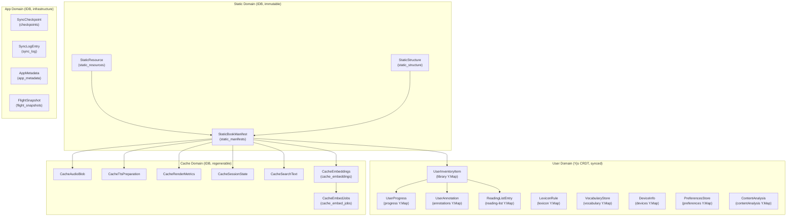
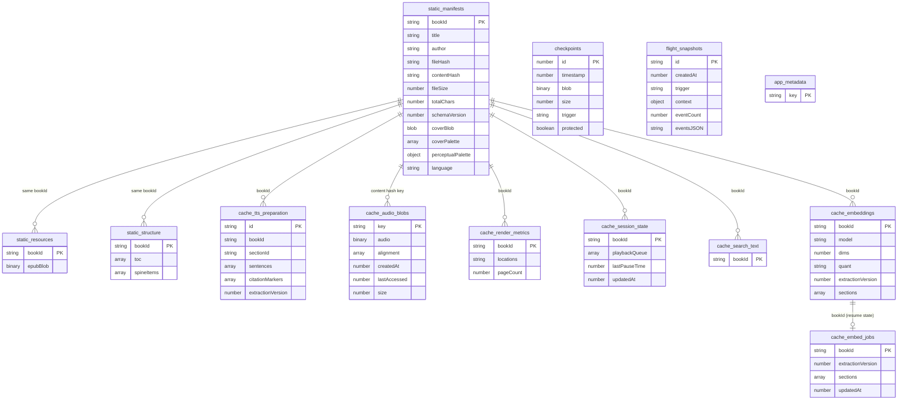
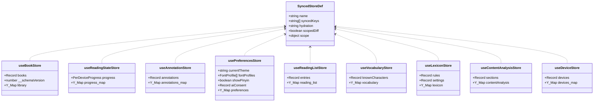
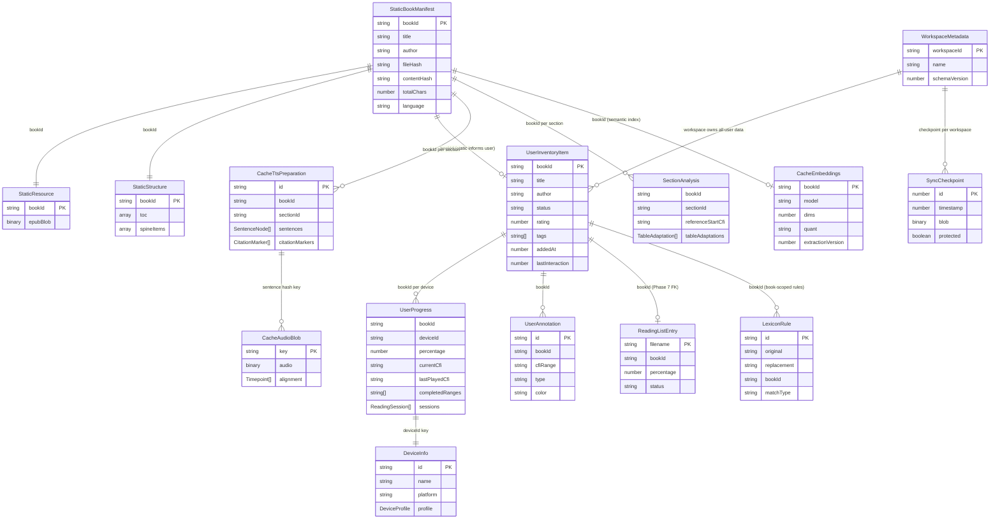
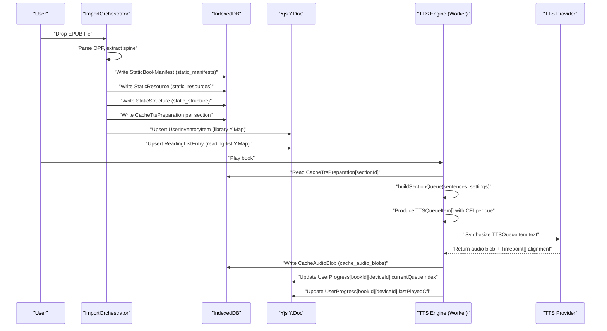

# Glossary & Domain Model

This document defines every major domain term in Versicle and builds the conceptual model of how entities relate. The intended reader is an engineer new to the codebase who needs to understand both _why_ concepts exist and _how_ they are represented in code.

Cross-references: [Architecture overview](10-architecture-overview.md) | [State management & CRDT](13-state-management-crdt.md) | [Storage gateway](20-storage-gateway.md) | [Bootstrap & lifecycle](14-bootstrap-and-lifecycle.md) | [TTS engine](32-domain-audio-tts-engine.md) | [Library domain](37-domain-library.md) | [Search domain](38-domain-search.md) | [Google domain](39-domain-google.md)

---

## 1. Why a Formal Domain Model?

Versicle is a local-first application: user data lives on-device in IndexedDB, replicated to the cloud through a Yjs CRDT document synced to Firestore, and mirrored across devices via `zustand-middleware-yjs`. This architecture draws a hard boundary between two kinds of data:

- **Static data** — immutable, derived from the EPUB file at ingest time, authoritative on the device that holds the file.
- **User data** — mutable, user-authored, synced across every device through the CRDT.

Getting this boundary wrong causes catastrophic data loss. The domain model is therefore not just documentation; it is the specification against which the storage schema, the CRDT wire format, the migration registry, and the type system are all audited.

The primary sources for this chapter are:

| Source | Role |
|---|---|
| [src/types/book.ts](../../src/types/book.ts) | Static & legacy book types |
| [src/types/user-data.ts](../../src/types/user-data.ts) | Mutable user types |
| [src/types/tts.ts](../../src/types/tts.ts) | TTS queue and position types |
| [src/types/tts-content.ts](../../src/types/tts-content.ts) | Sentence extraction types |
| [src/types/sync.ts](../../src/types/sync.ts) | Sync wire and checkpoint types |
| [src/types/workspace.ts](../../src/types/workspace.ts) | Workspace & migration state types |
| [src/types/device.ts](../../src/types/device.ts) | Device identity and profile types |
| [src/types/cache.ts](../../src/types/cache.ts) | Transient cache types |
| [src/data/schema.ts](../../src/data/schema.ts) | IDB schema & migration registry |
| [src/data/rows/cache.ts](../../src/data/rows/cache.ts) | Cache row schemas (incl. embeddings) |
| [src/types/errors.ts](../../src/types/errors.ts) | `AppError` taxonomy (incl. `NET_RATE_LIMITED`) |
| [src/store/registry.ts](../../src/store/registry.ts) | Three-tier store registry |
| [src/store/yjs-provider.ts](../../src/store/yjs-provider.ts) | CRDT schema version and middleware |
| [src/kernel/quota/QuotaGovernor.ts](../../src/kernel/quota/QuotaGovernor.ts) | Cross-provider quota governor |
| [src/domains/sync/backend/SyncBackend.ts](../../src/domains/sync/backend/SyncBackend.ts) | C3 sync backend (incl. artifact methods) |
| [src/domains/library/ports.ts](../../src/domains/library/ports.ts) | Library domain ports |
| [src/domains/chinese/types.ts](../../src/domains/chinese/types.ts) | Chinese overlay types |

---

## 2. Top-Level Domain Map



---

## 3. Book — the Central Entity

### 3.1 What a "Book" is

In Versicle, a **book** is a parsed EPUB file. The single conceptual entity is stored across multiple physical records, split by mutability:

- The **static manifest** (`StaticBookManifest`) holds OPF metadata (title, author, ISBN, file hash, total character count, cover thumbnail, language, base font metrics). This data never changes after ingest.
- The **static resource** (`StaticResource`) holds the raw EPUB binary blob.
- The **static structure** (`StaticStructure`) holds the parsed table of contents and spine item list.
- The **user inventory item** (`UserInventoryItem`) holds user-mutable state: tags, custom title/author override, reading status, rating, and "Ghost Book" metadata snapshots (see §3.3).

All four records share a common primary key: **`bookId`**, a UUID assigned at ingest time.

### 3.2 `bookId` and Identity Fingerprints

A `bookId` is a UUID allocated at import time ([src/domains/library](../../src/domains/library)), stable for the lifetime of the installation. It is the key for every IDB store and every Yjs map entry.

There are two additional identity fields on `StaticBookManifest` that serve different purposes:

```typescript
// src/types/book.ts
fileHash: string;       // Legacy: "${filename}-${title}-${author}" + djb2 of first/last 4 KiB
contentHash?: string;   // SHA-256 of EPUB content bytes (Phase 7, filename-independent)
```

`fileHash` predates Phase 7 and is NOT a cryptographic hash. `contentHash` (SHA-256 hex) is the true content-identity fingerprint added in Phase 7 for Drive sync duplicate detection. On pre-Phase-7 manifests the field is absent and lazily backfilled when a legacy-fingerprint match succeeds during restore.

### 3.3 Ghost Book

A **Ghost Book** is a `UserInventoryItem` in the Yjs CRDT that represents a book the current device has never downloaded (the EPUB binary is absent from `static_resources`). It exists because the user's inventory syncs to every device immediately, but the binary file transfer is a separate opt-in step.

Ghost Books carry metadata snapshots in `UserInventoryItem` specifically to allow the library UI to display a rich card (title, author, cover palette gradient) without the file:

```typescript
// src/types/user-data.ts
export interface UserInventoryItem {
  bookId: string;
  title: string;   // Ghost Book metadata: snapshot from static manifest
  author: string;  // Ghost Book metadata: snapshot from static manifest
  coverPalette?: number[];          // 5× 16-bit integers (R4-G8-B4)
  perceptualPalette?: PerceptualPalette; // CIELAB K-Means palette
  status: 'unread' | 'reading' | 'completed' | 'abandoned';
  // ...
}
```

When the user downloads the EPUB on that device, `ImportOrchestrator` detects the Ghost Book by metadata match and links the new binary to the existing inventory entry rather than creating a duplicate.

### 3.4 Section

A **section** is one spine item in the EPUB — roughly, one chapter file (an XHTML document). Sections appear in `StaticStructure.spineItems`:

```typescript
// src/types/book.ts
export interface StaticStructure {
  bookId: string;
  toc: NavigationItem[];
  spineItems: {
    id: string;           // href/id of the section
    characterCount: number;
    index: number;        // play order
  }[];
}
```

Sections also have their own cache rows: `CacheTtsPreparation` (extracted sentences keyed by `${bookId}-${sectionId}`) and `SectionMetadata` (character count, play order, title).

At import time each section's plain text is stamped with a **`sectionTextHash`** (`cheapHash` of the encoded `section.text`, keyed by the stable `href`). This is the embedding invalidation lever (see §12.2): a section is re-embedded only when its body text actually changed, so the segmenter/CFI-only `extractionVersion` bumps in project history do not waste embedding quota re-embedding unchanged prose.

### 3.5 NavigationItem (TOC entry)

```typescript
// src/types/book.ts
export interface NavigationItem {
  id: string;
  href: string;
  label: string;
  subitems?: NavigationItem[];  // recursive tree
  parent?: string;
}
```

The TOC tree is stored in `StaticStructure.toc`. There is also a "synthetic TOC" concept: an AI-generated alternative table of contents activated per-book via `UserInventoryItem.useSyntheticToc`.

---

## 4. CFI — Canonical Fragment Identifier

### 4.1 Concept

A **CFI** (Canonical Fragment Identifier, also written EPUB CFI) is a string like `epubcfi(/6/4[chap01]!/4/2/1:0)` that uniquely identifies a position or range within an EPUB document. It is defined by the EPUB 3 specification and implemented in this project via the `epubjs` library.

CFIs are the universal position currency in Versicle:

| Usage | CFI shape |
|---|---|
| Reading progress bookmark | Point CFI: `currentCfi` on `UserProgress` |
| TTS sentence location | Point CFI: `cfi` on `TTSQueueItem` and `SentenceNode` |
| Last-spoken position | Point CFI: `lastPlayedCfi` on `UserProgress` |
| Annotation extent | Range CFI: `cfiRange` on `UserAnnotation` |
| Completed reading range | Range CFI: elements of `completedRanges` |
| Content analysis mark | Point CFI: `referenceStartCfi` on `SectionAnalysis` |

### 4.2 Range Merging

The progress store (`useReadingStateStore`) merges overlapping CFI ranges into a minimal covering set via `mergeCfiRanges` (from `@kernel/cfi`). This is how "read coverage" is tracked without storing every visited position individually. The merge window for session consolidation is 20 minutes (`MERGE_TIME_WINDOW = 20 * 60 * 1000`).

---

## 5. User Data Entities

The following entities all live in the Yjs CRDT document and replicate across devices automatically through `zustand-middleware-yjs`.

### 5.1 UserProgress (Reading State)

`UserProgress` is the mutable progress object for one book on one device:

```typescript
// src/types/user-data.ts
export interface UserProgress {
  bookId: string;
  percentage: number;        // 0.0–1.0
  currentCfi?: string;       // visual bookmark
  lastPlayedCfi?: string;    // TTS resume point
  currentQueueIndex?: number;
  currentSectionIndex?: number;
  lastRead: number;          // UTC ms
  completedRanges: string[]; // merged CFI ranges
  readingSessions?: ReadingSession[];
}
```

The progress map in `useReadingStateStore` is doubly-keyed: `progress[bookId][deviceId]`. This preserves each device's position independently while still allowing cross-device fallback. The `getProgress` selector applies this priority order:

1. Current device's entry (if `percentage > 0.5%`)
2. Most recently updated entry across any device
3. Current device's entry regardless of percentage

### 5.2 Reading Session

A `ReadingSession` is a timestamped record of a reading event appended to `UserProgress.readingSessions`:

```typescript
// src/types/user-data.ts
export interface ReadingSession {
  cfiRange: string;
  cfiRanges?: string[];   // merged structural ranges
  startTime: number;
  endTime: number;
  type: 'tts' | 'scroll' | 'page';
  label?: string;         // sentence text (TTS) or "Chapter N – P%"
}
```

Sessions are merged when the same type and label occur within a 20-minute window (preventing chatty history from rapid page turns). The array is capped at `MAX_READING_SESSIONS = 500` and pruned to 300 when the cap is hit.

### 5.3 UserAnnotation (Highlight / Note)

```typescript
// src/types/user-data.ts
export interface UserAnnotation {
  id: string;          // UUID
  bookId: string;
  cfiRange: string;    // selected text range
  text: string;        // selected text content
  type: 'highlight' | 'note' | 'audio-bookmark';
  color: string;       // hex or rgba
  note?: string;       // optional user commentary
  created: number;
}
```

The `audio-bookmark` type is an annotation created at a TTS cue position (rather than a visual text selection). All annotations live in the `annotations` Y.Map, keyed by UUID. The `getByBook` action filters client-side because the Yjs map holds annotations for all books.

### 5.4 ReadingListEntry

The **reading list** is a lightweight, filename-keyed projection of reading progress designed to be portable (e.g., exported as CSV for Goodreads import). It is separate from the inventory because it predates the Yjs migration and uses filename as primary key for portability across devices that may import the same book under different UUIDs.

```typescript
// src/types/user-data.ts
export interface ReadingListEntry {
  filename: string;         // primary key (portable)
  bookId?: string;          // FK to inventory (Phase 7 additive)
  title: string;
  author: string;
  isbn?: string;
  percentage: number;
  lastUpdated: number;
  status?: 'read' | 'currently-reading' | 'to-read';
  rating?: number;
}
```

Progress updates in `useReadingStateStore` automatically upsert the corresponding `ReadingListEntry` via a side effect that reads the inventory item's `sourceFilename`.

### 5.5 LexiconRule

A **lexicon rule** is a pronunciation substitution for the TTS engine:

```typescript
// src/types/user-data.ts
export interface LexiconRule {
  id: string;
  original: string;       // text or regex to match
  replacement: string;    // spoken pronunciation
  matchType?: 'ignore_case' | 'match_case' | 'regex';
  bookId?: string;        // absent = global rule
  applyBeforeGlobal?: boolean;
  order?: number;         // lower runs first
  language?: string;      // ISO 639-1 scope
  created: number;
}
```

Rules live in the `lexicon` Y.Map (via `useLexiconStore`, keys `rules` and `settings`). The `settings` sub-map holds per-book configuration like `bibleLexiconEnabled: 'on' | 'off' | 'default'`. Global rules have no `bookId`; book-specific rules run before or after globals depending on `applyBeforeGlobal`.

### 5.6 Vocabulary (Chinese)

The vocabulary store tracks known Chinese characters for the Pinyin overlay feature:

```typescript
// src/store/useVocabularyStore.ts
knownCharacters: Record<string, number>  // char → learned-at timestamp
```

Keys are canonicalized to simplified form (CRDT v7 migration, `canonicalizeChar`). The store's Y.Map name is `vocabulary`.

---

## 6. TTS Domain

### 6.1 TTS Provider

A **TTS provider** is an implementation of the `ITTSProvider` interface that synthesizes text to audio. The available providers are declared in the registry at [src/lib/tts/providers/registry.ts](../../src/lib/tts/providers/registry.ts):

| Provider ID | Type | Platform |
|---|---|---|
| `webspeech` | Device (Web Speech API) | Web browsers |
| `capacitor` | Device (native speech) | iOS / Android |
| `piper` | Local AI (WASM) | Web |
| `google` | Cloud API | All |
| `openai` | Cloud API | All |
| `lemonfox` | Cloud API | All |

The legacy id `'local'` is accepted as an alias for the device provider (resolved per platform). Provider instances are never constructed in the TTS worker — only `providerId` strings cross the Comlink boundary.

### 6.2 TTSQueueItem (Cue)

A **TTS cue** is one spoken unit in the playback queue:

```typescript
// src/types/tts.ts
export interface TTSQueueItem {
  text: string;
  cfi: string | null;     // book position (null for preroll)
  title?: string;         // chapter title (displayed as track label)
  isPreroll?: boolean;    // chapter announcement
  isSkipped?: boolean;    // content analysis skip flag
  sourceIndices?: number[]; // raw sentence indices that merged into this item
}
```

The queue is the core playback unit — the TTS engine advances through it one item at a time. Cues map 1:1 to synthesized audio segments. `isSkipped` is set by content analysis when the segment is a reference section that should not be read aloud.

### 6.3 TTSPosition

`TTSPosition` is the lightweight persisted position that enables cross-device TTS handoff (the "continue on another device" feature):

```typescript
// src/types/tts.ts
export interface TTSPosition {
  bookId: string;
  currentIndex: number;
  sectionIndex?: number;
  updatedAt: number;
}
```

These are stored in `SyncManifest.transientState.ttsPositions` (keyed by `bookId`) in the legacy sync path, and in `UserProgress.currentQueueIndex` / `UserProgress.currentSectionIndex` in the Yjs path.

### 6.4 SentenceNode

`SentenceNode` is the extraction unit produced by the sentence extractor and consumed by the queue builder:

```typescript
// src/types/tts-content.ts
export interface SentenceNode {
  text: string;
  cfi: string;
  sourceIndices?: number[];
}
```

Sentence nodes are stored in `CacheTtsPreparation.sentences` and promoted to `TTSQueueItem`s by `buildSectionQueue` ([src/lib/tts/SectionQueueBuilder.ts](../../src/lib/tts/SectionQueueBuilder.ts)) after segmentation merging (via `TextSegmenter.refineSegments`).

### 6.5 Timepoint

A **timepoint** is a sub-word audio alignment datum that enables word-level highlighting during playback:

```typescript
// src/types/tts.ts
export interface Timepoint {
  timeSeconds: number;  // offset from audio segment start
  charIndex: number;    // character index in the source text
  type?: string;        // 'word' | 'sentence' | 'mark'
}
```

Timepoints are produced by cloud providers (Google, OpenAI, LemonFox) at synthesis time and stored alongside the audio blob in `cache_audio_blobs`. The `alignment` field holds the canonical array; `alignmentData` is a legacy alias that the `audioCache` repo normalizes on read.

### 6.6 TTSProfile

A **TTS profile** captures voice and rate preferences per language:

```typescript
// src/store/useTTSSettingsStore.ts
export interface TTSProfile {
  voiceId: string | null;
  rate: number;
  minSentenceLength?: number;
}
```

Profiles are stored in `useTTSSettingsStore.profiles` keyed by language code (e.g., `'en'`, `'zh'`). The active profile is derived via `selectActiveProfile`. The default `minSentenceLength` is language-sensitive: 6 for Chinese (`zh*`), 36 for all other languages.

### 6.7 CitationMarker

A `CitationMarker` is a suppressed footnote/endnote marker detected during sentence extraction:

```typescript
// src/types/tts-content.ts
export interface CitationMarker {
  cfi: string;
  markerText: string;   // e.g. "1", "[2]", "*"
  super: boolean;
  numeric: boolean;
  glued: boolean;       // immediately follows text without whitespace
  leading: boolean;     // first content of its block (note-head)
  fontSizeRatio?: number;
  targetHref?: string;
}
```

Citation markers are captured but omitted from spoken text. They accumulate in `CacheTtsPreparation.citationMarkers` and are used downstream by `SectionAnalysisDriver` to detect reference sections (a cluster of citation markers near the end of a section signals the start of the references, triggering `isSkipped = true` on subsequent queue items).

---

## 7. Sync and Workspace Entities

### 7.1 Workspace

A **workspace** is a named, isolated CRDT document owned by a user — roughly equivalent to a "library" in the cloud. Every workspace has its own Firestore document at `users/{uid}/versicle/{workspaceId}` and its own Yjs state. Users can switch workspaces (which involves a crash-resumable migration state machine).

```typescript
// src/types/workspace.ts
export interface WorkspaceMetadata {
  workspaceId: string;    // e.g. "ws_abc123"
  name: string;           // user-defined label
  createdAt: number;
  schemaVersion: number;  // CURRENT_SCHEMA_VERSION at creation
  deletedAt?: number;     // soft-delete filter
}
```

Workspace metadata is listed from `users/{uid}/workspaces/{workspaceId}` in Firestore. The actual synced data lives at `users/{uid}/versicle/{workspaceId}`.

### 7.2 SyncMigrationState

When a user switches workspaces, a crash-resumable state machine tracks the transition. Its state is persisted to `localStorage` under the key `__VERSICLE_MIGRATION_STATE__`:

```typescript
// src/types/workspace.ts
export interface SyncMigrationState {
  status: 'STAGED' | 'AWAITING_CONFIRMATION' | 'RESTORING_BACKUP';
  targetWorkspaceId?: string;
  backupCheckpointId?: number;
  previousWorkspaceId?: string;  // Phase 4 additive — for rollback
}
```

The `STAGED` state is the commit point: the verified remote blob is durably in the `versicle-yjs-staging` IDB key, and the boot interceptor's `STAGED` arm applies `main ← staging` (idempotent on crash re-entry) before transitioning to `AWAITING_CONFIRMATION`.

### 7.3 SyncCheckpoint

A **checkpoint** is a point-in-time Yjs binary state vector snapshot for local crash recovery:

```typescript
// src/types/sync.ts
export interface SyncCheckpoint {
  id: number;            // auto-increment PK
  timestamp: number;
  blob: Uint8Array;      // Yjs binary state vector
  size: number;          // KB (for UI display)
  trigger: string;       // 'pre-sync' | 'manual' | ...
  protected?: boolean;   // if true, rolling prune never deletes this
}
```

The `protected` flag pins the pre-workspace-switch backup so it cannot be evicted by the rolling checkpoint prune before the migration state machine resolves.

### 7.4 Device

A **device** is any browser or native app instance participating in the sync mesh:

```typescript
// src/types/device.ts
export interface DeviceInfo {
  id: string;           // matches the key in the devices Y.Map Record
  name: string;         // user-editable, e.g. "My iPhone"
  platform: string;     // "iOS" | "Android" | "Windows" | ...
  browser: string;
  model: string | null;
  userAgent: string;
  appVersion: string;
  lastActive: number;
  created: number;
  profile: DeviceProfile;
}
```

The `DeviceProfile` embedded in `DeviceInfo` carries the device's display preferences (theme, font size, TTS voice URI and rate) and is used for the "adopt settings from another device" feature.

Device IDs are generated once per installation (stable UUID stored in `localStorage`). Each boot calls `useDeviceStore.registerCurrentDevice()`, which upserts the current UA metadata. Heartbeats are throttled to 5 minutes (`HEARTBEAT_THROTTLE_MS`).

`DeviceInfo` also carries an additive nested **`embedSpend`** field — `{ day: <PT date>; rpd: number; tpm?: number }` — each device's rolling embedding spend for the current Pacific day:

```typescript
// src/types/device.ts
embedSpend?: { day: string; rpd: number; tpm?: number };
```

The free-tier Gemini quota is per-Google-Cloud-project, not per-device, so the **quota governor** (§13) sums `embedSpend.rpd` across heartbeat-active devices stamped with today's date to compute the remaining shared budget. Because it is nested *below* the synced `devices` key (and `syncedKeys` is root-only — §9.2), it needs no CRDT format change. `registerCurrentDevice` carries it forward rather than rebuilding the record from a bare literal, so the per-boot device-record rewrite cannot wipe it.

### 7.5 SyncManifest (Legacy Wire Shape)

`SyncManifest` is the older serialized sync projection (predating Yjs). It is still referenced in `src/types/sync.ts` and `src/domains/sync`, but the Yjs CRDT is the active sync mechanism. The manifest shape documents what the Yjs doc logically contains:

```typescript
// src/types/sync.ts
export interface SyncManifest {
  version: number;
  lastUpdated: number;
  deviceId: string;
  books: { [bookId: string]: { metadata, history, annotations, aiInference? } };
  lexicon: LexiconRule[];
  readingList: Record<string, ReadingListEntry>;
  settings?: { theme, fontFamily, fontSize, lineHeight, ... };
  transientState: { ttsPositions: Record<string, TTSPosition> };
  deviceRegistry: { [deviceId: string]: { name, lastSeen } };
}
```

---

## 8. Storage Layer Entities

### 8.1 IDB Schema (EpubLibraryDB)

The IndexedDB database is named `EpubLibraryDB` ([src/data/schema.ts](../../src/data/schema.ts)) and is currently at version **27** (`DB_VERSION = 27`). The v27 bump (`migrateToV27`) is purely additive: it creates the two new regenerable embedding stores `cache_embeddings` and `cache_embed_jobs` (see §12.2), guarded by `contains()` so re-running is idempotent.

> **Deviation note:** v27 was originally reserved for *retiring* old surface (the `sync_log` drop + the service-worker legacy-cover fallback). That cleanup was never done, so the additive embedding stores took the v27 slot; the `sync_log` / SW-cover cleanup is now the **next (v28)** bump.



The three domain partitions in IDB:

- **STATIC** (`static_manifests`, `static_resources`, `static_structure`) — immutable EPUB-derived data.
- **CACHE** (`cache_*`, including the v27 `cache_embeddings` / `cache_embed_jobs`) — ephemeral and regenerable derived data. All cache stores can be rebuilt from the static domain (embeddings additionally re-derive from `cache_search_text` + the embedding API).
- **APP** (`checkpoints`, `sync_log`, `app_metadata`, `flight_snapshots`) — sync infrastructure and diagnostics. The quota governor's persisted daily counter (§13) is a key in the existing `app_metadata` store (no new store), written by `src/data/repos/quotaCounter.ts`.

There is no `USER` domain in IDB. All user data that used to live in the `user_*` stores (v18 schema) migrated into the Yjs CRDT document (`versicle-yjs` IDB key, managed by `y-idb`).

### 8.2 Deprecated Stores

The IDB migration at v25 deletes the following legacy stores ([src/data/schema.ts](../../src/data/schema.ts)):

```typescript
// v17 monolith layout
'books', 'book_sources', 'book_states', 'files',
'annotations', 'lexicon', 'sections', 'content_analysis',
'reading_history', 'reading_list', 'tts_queue', 'tts_position',
'tts_cache', 'locations', 'tts_content', 'table_images',
// v18 user stores (now in Yjs)
'user_inventory', 'user_reading_list', 'user_progress',
'user_annotations', 'user_overrides', 'user_journey', 'user_ai_inference',
```

Before deleting them, the v25 straggler guard snapshots the surviving user-data stores into `app_metadata['legacy-recovery-v25']` (size-capped at 8 MB; binary fields replaced by descriptors).

---

## 9. The Yjs CRDT Document

### 9.1 CRDT Schema Version

The CRDT document has its own schema version, separate from the IDB version. The current version is `CURRENT_SCHEMA_VERSION = 9` ([src/store/yjs-provider.ts](../../src/store/yjs-provider.ts)). Each store declares a `SyncedStoreDef` that specifies its Y.Map name, synced keys, hydration mode, and scoped-diff behavior.

The nine synced stores form the complete set of user data:



### 9.2 syncedKeys

`syncedKeys` is the replication whitelist declared in each store's `SyncedStoreDef`. Only the listed top-level state keys replicate into the Y.Map; actions (functions) and any unlisted keys are local-only. `__schemaVersion` is implicitly synced and need not be listed.

Example:

```typescript
// src/store/useBookStore.ts
export const LIBRARY_STORE_DEF: SyncedStoreDef<'books'> = {
    name: 'library',
    syncedKeys: ['books'],
    hydration: 'merge-defaults',
    scopedDiff: true,
};
```

Only the `books` map replicates; `setBooks`, `updateBook`, etc. are local-only methods.

### 9.3 scopedDiff

When `scopedDiff: true`, the Yjs middleware diffs each synced key individually rather than diffing the entire store state object. This is the **D13 write-amplification fix**: without scoped diff, every store mutation triggers a full-document comparison even if only one nested key changed. All nine stores were flipped to `scopedDiff: true` in the Phase 2 "fork surgery" wave.

### 9.4 hydration Mode

`hydration` controls what happens when the Y.Map inbound patch contains no entry for a key that the store declares as a default:

- `'merge-defaults'` — the declared default survives (new fields in updated code do not get wiped by hydration from an older CRDT document). This is the **D2 fix** for new-field survivability.
- `'replace'` — the legacy behavior: the inbound patch wholesale replaces top-level keys.

All nine stores have been flipped to `'merge-defaults'` (Phase 2 flip wave, documented in `phase2-fork-surgery.md §2.6`).

### 9.5 Husk

A **husk** is a Y.Map entry that still exists in the CRDT document but is no longer read or written by current code. Husks accumulate when a Y.Map name is retired without a cleanup migration. The v9 migration (`clearHusksAndRetireDualWrite`) removes three classes of husks:

1. Legacy per-device preference maps (from before the `preferences.<deviceId>` scoped layout).
2. Stale `popover` key in the `annotations` Y.Map (moved to the ephemeral reader UI store).
3. `activeContext` Y.Map (moved to route state in Phase 8).

Husks are pure residue — they carry no data the current code needs, but they consume storage and can confuse old clients that still read them.

---

## 10. Store Tiers

The three-tier registry ([src/store/registry.ts](../../src/store/registry.ts)) classifies every Zustand store:

```mermaid
stateDiagram-v2
    state "Synced (CRDT)" as S
    state "Local-persisted (localStorage)" as L
    state "Ephemeral (in-memory)" as E

    [*] --> S : useBookStore\nuseReadingStateStore\nuseAnnotationStore\nusePreferencesStore\nuseReadingListStore\nuseVocabularyStore\nuseLexiconStore\nuseContentAnalysisStore\nuseDeviceStore

    [*] --> L : useSyncStore\nuseTTSSettingsStore\nuseDriveStore\nuseGoogleServicesStore\nuseGenAIStore\nuseLocalHistoryStore

    [*] --> E : useLibraryStore\nuseUIStore\nuseToastStore\nuseReaderUIStore\nuseBackNavigationStore\nuseSidebarStore\nuseTTSPlaybackStore
```



- **Synced** stores replicate through the shared Y.Doc to all devices in the sync mesh. They survive page reloads (via `y-idb`) and app restarts (via Firestore).
- **Local-persisted** stores use `zustand/persist` with `localStorage`. They survive page reloads on the same device but are not replicated.
- **Ephemeral** stores are in-memory only and die when the tab closes.

The `useLibraryStore` is ephemeral because it is a projection of IndexedDB metadata (`staticMetadata`) plus an offloaded-book set — it is rebuilt on every boot and costs nothing to re-derive. The CRDT stores are the authoritative user data.

---

## 11. Content Analysis

**Content analysis** is AI-assisted section preprocessing:

```typescript
// src/store/useContentAnalysisStore.ts
export interface SectionAnalysis {
  referenceStartCfi?: string;     // boundary where reference section begins
  tableAdaptations?: TableAdaptation[]; // CFI → spoken text for tables
  title?: string;                 // AI-extracted section title
  generatedAt: number;
  status?: 'idle' | 'loading' | 'success' | 'error';
  lastError?: string;
  lastAttempt?: number;
}
```

The `contentAnalysis` Y.Map holds `SectionAnalysis` objects keyed by `${bookId}/${sectionId}`. The results feed the TTS pipeline:

- `referenceStartCfi` lets the queue builder mark all subsequent cues with `isSkipped = true`.
- `tableAdaptations` replace table HTML with a spoken narrative description.
- `title` can override the TOC-derived section title in TTS preroll announcements.

---

## 12. Search Entities

### 12.1 DetailedSearchResult

Search results carry enough position data to navigate to the exact occurrence within a section:

```typescript
// src/types/search.ts
export interface DetailedSearchResult {
  href: string;             // section reference
  sectionTitle?: string;
  excerpt: string;          // context snippet from original text
  charOffset: number;       // code-unit offset within the section's indexed text
  matchLength: number;
  occurrence: number;       // 1-based ordinal within this section
  cfi?: string;             // resolved lazily at click time
}
```

The `cfi` field is never produced by the search engine (which never touches the DOM). It is resolved lazily on demand via `resolveResultCfi` when the user clicks a result. The regex full-text corpus lives in `cache_search_text` (one row per book keyed by `bookId`).

### 12.2 Semantic search vs full-text

There are two retrieval paths in Versicle, fused into one ranked list:

- **Full-text (regex) search** is the always-on, local, privacy default. It scans the `cache_search_text` corpus, touches no network, and works for every loaded book regardless of any AI setting.
- **Semantic search** retrieves by *meaning* rather than exact substring ("find the passage about X"). It compares the query's **embedding** (§12.3) against the book's stored chunk embeddings by cosine similarity. It is **off by default**, configured in the GenAI settings tab, and gracefully degrades to regex full-text whenever it is off, unconfigured, quota-exhausted, or the book is not yet embedded.

When semantic search is on and a book is embedded, the two result lists are combined by **reciprocal-rank fusion** (`fuseRrf`, [src/domains/search/rrf.ts](../../src/domains/search/rrf.ts)) inside `SearchSession`. Each list contributes `1/(k + rank)` per result (`k = 60`); a result found by both fuses into one hit, with the regex hit's richer fields (e.g. `occurrence`) kept. This preserves exact-match wins (names, quotes) while adding meaning-based hits.

### 12.3 Embedding & int8 quantization

An **embedding** is a fixed-length numeric vector that places a chunk of text in a "meaning space," so semantically similar passages sit near each other. Versicle sub-chunks each section into ~320-token, sentence-snapped windows (per-chunk char offsets `charStart`/`charEnd` are persisted; the EPUB CFI jump-target is resolved lazily at click time) and embeds each chunk with **Gemini Embedding 2** at **768 dimensions** via the four-part `EmbeddingClient` capability ([src/domains/google/genai/embedding/](../../src/domains/google/genai/embedding): `contract` / `GeminiEmbeddingClient` impl / `holder` with a NOT-CONFIGURED default / lazy facade — barrel-exported so `search/` carries no concrete `google/` dependency).

Vectors are **int8-quantized**: instead of storing four-byte `float32` values, each vector is scaled by its own `max(|v|)/127` factor and stored as one-byte `int8` values plus a single `float32` scale. At ~772 bytes/chunk this is ~43% of the text's own byte size (vs 170% for `float32@768`), and because Gemini Embedding 2 auto-normalizes truncated vectors it is near-lossless. Quantization and cosine ranking happen in the search worker over transferred typed arrays (`SearchEngine.rankInt8` — an integer dot product with the two per-vector scales applied once at the end); all IDB I/O stays on the main thread.

The vectors live in the regenerable CACHE store **`cache_embeddings`** (one row per book, each section carrying its packed `int8` vectors + `float32` scales, stamped `{model, dims, quant, extractionVersion}` plus the per-section `sectionTextHash`). A sibling **`cache_embed_jobs`** store records per-section resume progress (how far each section got, paired with `sectionTextHash` as the resume key). A foreground `EmbeddingIndexer` embeds the open book outward from the reading position (resumable); a background backfill boot task embeds every book present on the device, gated by a default-OFF library-wide opt-in (`preEmbedLibrary`) wired into the consent resolver ([src/app/google/aiConsent.ts](../../src/app/google/aiConsent.ts)). The query embedding is cached so repeated searches do not burn the shared daily budget.

A stamp mismatch (`{model, dims}`) on read invalidates and re-embeds — vectors are never converted. A `sectionTextHash` mismatch re-embeds only the changed sections.

### 12.4 The Artifact Lane (shared AI-cache)

Embeddings are expensive to compute, so the **Artifact Lane** mirrors a book's embedding blob into the user's **own** BYO Cloud Storage so a book embedded once on one device is *downloaded* by the user's other devices instead of re-spending Gemini quota. It is cross-**device** only (cross-user sharing is explicitly deferred).

Two cloud tiers, neither in the CRDT:

- A **content-addressed artifact** — the packed embedding blob written at `embeddings/{key}.bin` under the workspace prefix, where `key = sha256(contentHash | model | dims | quant | extractionVersion)`. Identical inputs produce byte-identical content, so uploads are idempotent and a different model/dims is simply a different object (a miss, never a silent reinterpret). The serialize/parse codec is [src/domains/search/artifactBlob.ts](../../src/domains/search/artifactBlob.ts) — a self-describing blob (u32 header length + JSON header + packed body) whose header carries the per-section `sectionTextHash` list so a partially-re-extracted book reconciles section-by-section on download.
- A **HEAD doc** — a tiny Firestore directory record at `embedCache/{key}` holding the blob's stamp + byte size, so a device can probe "do we already have this?" with one cheap `getDoc` rather than a Storage `list`. Because the blob is written **before** the HEAD doc, a HEAD hit implies the bytes are present.

The C3 `SyncBackend` interface ([src/domains/sync/backend/SyncBackend.ts](../../src/domains/sync/backend/SyncBackend.ts)) gained **five** additive artifact methods: `headArtifact` / `putArtifact` / `getArtifact` (probe / write / read) plus `deleteArtifactHead` / `sweepArtifacts` (GC). `FirestoreBackend` (the sole `firebase/storage` importer) added `uploadBytes` + `getBytes`, widening it from delete-only to read/write; `MockBackend` has an in-memory implementation.

> **Deviation note:** the C3 artifact surface shipped as **five** methods, not the originally-planned method trio (the GC pair `deleteArtifactHead`/`sweepArtifacts` was added).

Flow and lifecycle:

- An app-layer `ArtifactConsult` adapter ([src/app/google/artifactConsult.ts](../../src/app/google/artifactConsult.ts)) probes + hydrates **before** the quota gate, so a cache hit hydrates ~251 KB and spends **zero** Gemini quota; an `ArtifactPublisher` boot task uploads (idempotent, head-before-put) when the default-OFF **"Share AI caches across my devices"** opt-in (`shareAiCaches`) is on. Both consult and upload share the same consent predicate.
- On book removal, `LibraryService.remove` deletes the HEAD doc but **leaves** the content-addressed blob (a sibling device may still need it); the blob is reclaimed by a separate cloud TTL/quota **sweeper** boot task. Local IDB eviction follows persist-on-evict with a never-evict-an-unconfirmed-upload rule. `embedCache` is in `PURGE_SUBCOLLECTIONS` so the HEAD doc is swept on workspace delete (added in Phase A). A HEAD-hit-but-object-missing **drift** metric makes steady-state drift observable.

> **Status / caveat:** the Artifact Lane is implemented, unit-tested, and full-suite verified, but the cloud round-trips (the Firestore + Storage emulator put/head/get/delete/sweep and HEAD-after-Storage ordering) and the security-rules suite are **CI-pending** — they auto-skip without local emulators. The cloud paths are therefore **`MockBackend`-verified and code-complete but not yet proven end-to-end against real Firebase.** Cross-user sharing, TTS-audio cache sharing, per-blob HMAC, and the live token reconcile are deferred.

---

## 13. Quota Governor

The **quota governor** ([src/kernel/quota/QuotaGovernor.ts](../../src/kernel/quota/QuotaGovernor.ts)) is a kernel subsystem (`QuotaGovernor` + a `ptDay` Pacific-day helper + an index barrel) that paces all GenAI egress within each provider's free-tier budget. It tracks three budgets per **lane**:

| Budget | Window | Storage |
|---|---|---|
| **RPM** (requests per minute) | sliding 60 s | in-memory |
| **TPM** (tokens per minute) | sliding 60 s | in-memory |
| **RPD** (requests per day) | midnight-PT reset | persisted via an injected `QuotaStore` port |

A **lane** is the priority class of an egress: **`fg`** (foreground / interactive — reading and query embeds, never rate-divided, first claim) or **`bg`** (background — prefetch/backfill, capped to a fraction of the minute budget and refused while any `fg` claim is in flight). Foreground preempts background.

Spend is recorded at **admission** (`acquire`) **inside `NetworkGateway.egress`** — the single egress chokepoint — so throttling cannot be bypassed by a client that forgets to call it (the same unbypassable seam as consent). `commit()` later reconciles the acquire-time token estimate to the actual cost; `release()` only frees a foreground claim and never undoes a recorded spend (the attempt still counts, matching free-tier reality). A request that never commits — every embedding — still counts because the record happens at `acquire`.

Pre-network backpressure (cooldown after a 429, RPD exhausted, or the minute budget full) surfaces as a typed `AppError` **`NET_RATE_LIMITED`** ([src/types/errors.ts](../../src/types/errors.ts), `retryable: true` + `retryAfterMs`) — meters and graceful-degradation branch on the code, never on message substrings.

The kernel touches no storage: the persisted RPD counter goes through the injected `QuotaStore` port, wired by `app/` to `src/data/repos/quotaCounter.ts`, which writes a key in the existing `app_metadata` store (no new store). Because the free-tier ceiling is per-Google-Cloud-project, the governor reconciles the budget across the synced device mesh by summing each device's `embedSpend` (§7.4). Consumers are `GeminiClient`, the cloud TTS providers, and the embedding client; model-rotation-on-429 stays in `GeminiClient` (the governor never owns rotation). Editable per-lane limits, a pause-all switch, and live used-vs-limit meters live in the GenAI settings tab, fed by `snapshot()` through `useGenAIStore`.

---

## 14. Diagnostics — FlightSnapshot

The **flight recorder** is a lightweight ring-buffer diagnostics subsystem for TTS playback:

```typescript
// src/types/flight-recorder.ts
export interface FlightEvent {
  seq: number;    // sequential id
  ts: number;     // monotonic ms (performance.now())
  wall: number;   // wall-clock Unix ms
  src: FlightEventSource; // 'APS' | 'PSM' | 'CAP' | 'TSQ' | 'TTS' | 'PLT'
  ev: string;     // event name, e.g. 'play', 'handoff'
  d?: Record<string, string | number | boolean | null | undefined>;
}
```

Snapshots are persisted to `flight_snapshots` in IDB. A snapshot can be triggered manually from the diagnostics UI or automatically when the `PlaybackStateManager` detects a chapter-advance anomaly (`trigger: 'anomaly:chapter_advance'`).

---

## 15. Chinese Domain

### 15.1 PinyinPosition

The Chinese domain produces `PinyinPosition` objects from geometry collection inside the section iframe, passed to the parent-document overlay portal:

```typescript
// src/domains/chinese/types.ts
export interface PinyinPosition {
  char: string;
  pinyin: string;
  top: number;
  left: number;
  width: number;
  height: number;
}
```

These are ephemeral layout-time objects; they are never persisted. The Pinyin overlay renders them as absolutely positioned annotations layered over the reader iframe.

---

## 16. Relationships — Full Domain ER Diagram



---

## 17. Invariants and Edge Cases

### 17.1 The Static / User Data Boundary

The most important invariant in the system is that **static data is never written after ingest**. If the EPUB file is deleted ("offloaded"), the static manifest and structure rows survive; only `static_resources` (the binary blob) is deleted. The user's inventory item (`UserInventoryItem`) gains `isOffloaded` semantics through the library projection store (`useLibraryStore.offloaded()`), but the manifest stays.

### 17.2 Progress Fallback Priority

The `getProgress` selector applies device-priority logic. The invariant "local progress is preferred" prevents a scenario where coming online after reading offline immediately overwrites the local position with a stale cloud position. The threshold `> 0.5%` prevents a fresh install from shadowing cross-device progress with a zero-percentage entry.

### 17.3 CFI Null Safety in TTS Queue Items

`TTSQueueItem.cfi` is `string | null`, not `string`. Preroll announcements (the chapter title read before the chapter starts) set `cfi: null` because they have no corresponding text position in the book. All consumers must handle the null case.

### 17.4 `__schemaVersion` as Poison Pill

Every synced store's Y.Map carries `__schemaVersion` (implicitly, the middleware stamps it). When the middleware hydrates a store and sees `__schemaVersion > CURRENT_SCHEMA_VERSION`, it calls `handleObsoleteClient`, which:
1. Emits an `'obsolete'` event on the sync event bus (severing the Firestore connection and stopping the device heartbeat).
2. Sets `useUIStore.obsoleteLock = true` (locking the UI).

This prevents an outdated client from corrupting a newer-format CRDT document.

### 17.5 Reading List / Inventory Dual Keying

`ReadingListEntry` is keyed by `filename` (portable, stable) while `UserInventoryItem` is keyed by `bookId` (UUID). The Phase 7 `bookId` FK on `ReadingListEntry` links them after import. Old entries without the FK are linked by a one-time migration linker (`app/migrations.linkReadingList.ts`). If both the filename match and the FK are absent, the two records remain unlinked — the reading list entry is treated as standalone.

### 17.6 LRU Audio Cache

`cache_audio_blobs` is an LRU cache. The `by_lastAccessed` index (added in IDB v25) supports the eviction job. The `size` field (additive, absent on pre-v25 rows) is backfilled by a post-open idle job in `repos/audioCache`. Cache keys are SHA-256 hashes of the synthesis parameters (text + voice + provider), independent of playback rate (all cloud providers synthesize at 1.0 and rate is applied at the audio sink).

---

## 18. Complete Sequence: Ingest to First Playback

The following sequence shows how the domain entities are created and related during a book import and its first TTS playback session.



---

## 19. Term Quick Reference

| Term | Definition | Source |
|---|---|---|
| **bookId** | UUID primary key assigned at import; stable for the lifetime of an installation | [src/types/book.ts](../../src/types/book.ts) |
| **CFI** | EPUB Canonical Fragment Identifier; the universal position and range currency | [src/types/book.ts](../../src/types/book.ts), [src/types/user-data.ts](../../src/types/user-data.ts) |
| **section** | One spine item (XHTML file) in an EPUB | [src/types/book.ts](../../src/types/book.ts) |
| **Ghost Book** | A `UserInventoryItem` whose EPUB binary is absent on the current device | [src/types/user-data.ts](../../src/types/user-data.ts) |
| **workspace** | An isolated named CRDT library in Firestore; users can switch workspaces | [src/types/workspace.ts](../../src/types/workspace.ts) |
| **checkpoint** | A Yjs binary state-vector snapshot used for local crash recovery | [src/types/sync.ts](../../src/types/sync.ts) |
| **husk** | A Y.Map entry that still exists in the CRDT but is no longer read or written | [src/store/yjs-provider.ts](../../src/store/yjs-provider.ts) |
| **syncedKeys** | Replication whitelist on `SyncedStoreDef`; only listed keys enter the Y.Map | [src/store/yjs-provider.ts](../../src/store/yjs-provider.ts) |
| **scopedDiff** | Per-key diffing option (D13 fix) that prevents full-document comparisons on every mutation | [src/store/yjs-provider.ts](../../src/store/yjs-provider.ts) |
| **hydration** | `'merge-defaults'` preserves declared defaults when the Y.Map has no entry for a key; `'replace'` overwrites | [src/store/yjs-provider.ts](../../src/store/yjs-provider.ts) |
| **TTSQueueItem** | A single spoken cue: text + CFI + skip/preroll flags | [src/types/tts.ts](../../src/types/tts.ts) |
| **SentenceNode** | An extracted sentence with its CFI, produced by the sentence extractor | [src/types/tts-content.ts](../../src/types/tts-content.ts) |
| **Timepoint** | Sub-word audio alignment datum (time offset + char index) for word-highlighting | [src/types/tts.ts](../../src/types/tts.ts) |
| **TTSProfile** | Per-language voice and rate preferences (voiceId + rate + minSentenceLength) | [src/store/useTTSSettingsStore.ts](../../src/store/useTTSSettingsStore.ts) |
| **CitationMarker** | A footnote/endnote superscript suppressed from spoken text but kept for reference detection | [src/types/tts-content.ts](../../src/types/tts-content.ts) |
| **LexiconRule** | A TTS pronunciation substitution, global or per-book, with optional regex matching | [src/types/user-data.ts](../../src/types/user-data.ts) |
| **PerceptualPalette** | A two-color CIELAB palette (standout + background + deltaE) extracted from the cover image | [src/types/book.ts](../../src/types/book.ts) |
| **SectionAnalysis** | AI-derived per-section metadata: reference boundary CFI, table adaptations, title | [src/store/useContentAnalysisStore.ts](../../src/store/useContentAnalysisStore.ts) |
| **FlightSnapshot** | A persisted ring-buffer of `FlightEvent`s for post-mortem TTS playback diagnostics | [src/types/flight-recorder.ts](../../src/types/flight-recorder.ts) |
| **DeviceInfo** | Identity, UA fingerprint, and display profile for one sync-mesh participant | [src/types/device.ts](../../src/types/device.ts) |
| **ReadingSession** | A timestamped CFI-range record (tts / scroll / page) appended to `UserProgress` | [src/types/user-data.ts](../../src/types/user-data.ts) |
| **fileHash** | Legacy non-cryptographic identity fingerprint (filename + title + author + djb2 of first/last 4 KiB) | [src/types/book.ts](../../src/types/book.ts) |
| **contentHash** | SHA-256 of EPUB content bytes; filename-independent (Phase 7) | [src/types/book.ts](../../src/types/book.ts) |
| **CRDT schema version** | Integer stamped in each Y.Map as `__schemaVersion`; mismatch triggers the obsolete-client lock | [src/store/yjs-provider.ts](../../src/store/yjs-provider.ts) |
| **quota governor** | Kernel subsystem pacing GenAI egress within RPM/TPM/RPD budgets; recorded at admission inside `NetworkGateway.egress` | [src/kernel/quota/QuotaGovernor.ts](../../src/kernel/quota/QuotaGovernor.ts) |
| **lane (fg / bg)** | Egress priority class — `fg` (interactive, first claim) vs `bg` (background, fraction-capped, refused while fg in flight) | [src/kernel/quota/QuotaGovernor.ts](../../src/kernel/quota/QuotaGovernor.ts) |
| **RPM / TPM / RPD** | Requests-per-minute / tokens-per-minute / requests-per-day — the three per-lane quota budgets | [src/kernel/quota/QuotaGovernor.ts](../../src/kernel/quota/QuotaGovernor.ts) |
| **NET_RATE_LIMITED** | Typed `AppError` for pre-network quota backpressure (`retryable` + `retryAfterMs`) | [src/types/errors.ts](../../src/types/errors.ts) |
| **embedSpend** | Additive nested field on `DeviceInfo` publishing a device's rolling per-PT-day embedding spend, summed across the mesh for shared-quota reconciliation | [src/types/device.ts](../../src/types/device.ts) |
| **embedding** | A fixed-length meaning vector for a ~320-token text chunk (Gemini Embedding 2 @ 768 dims) | [src/data/rows/cache.ts](../../src/data/rows/cache.ts) |
| **int8 quantization** | Storing each vector as `int8` + one `float32` per-vector scale (~43% of text bytes; near-lossless) | [src/data/rows/cache.ts](../../src/data/rows/cache.ts) |
| **semantic search** | Meaning-based retrieval (int8 cosine over embeddings), fused with regex full-text by RRF; off by default | [src/domains/search/rrf.ts](../../src/domains/search/rrf.ts) |
| **sectionTextHash** | `cheapHash` of a section's text, stamped at import; the per-section embedding invalidation key | [src/data/rows/cache.ts](../../src/data/rows/cache.ts) |
| **Artifact Lane** | Cross-device shared embedding cache: content-addressed blob in BYO Cloud Storage + Firestore HEAD-doc directory | [src/app/google/artifactConsult.ts](../../src/app/google/artifactConsult.ts) |
| **content-addressed artifact** | Embedding blob keyed by `sha256(contentHash \| model \| dims \| quant \| extractionVersion)`; identical inputs → byte-identical content | [src/domains/search/artifactBlob.ts](../../src/domains/search/artifactBlob.ts) |
| **HEAD doc** | Tiny Firestore record (`embedCache/{key}`) holding an artifact's stamp + size for a cheap existence probe; written after the blob | [src/domains/sync/backend/SyncBackend.ts](../../src/domains/sync/backend/SyncBackend.ts) |
| **PinyinPosition** | Layout-time geometry object for the Chinese Pinyin overlay (never persisted) | [src/domains/chinese/types.ts](../../src/domains/chinese/types.ts) |
