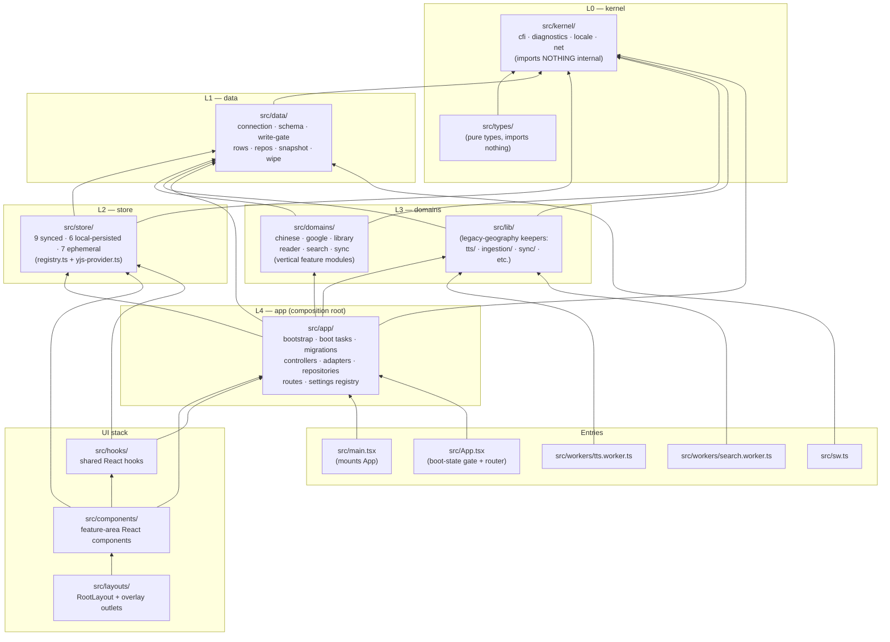
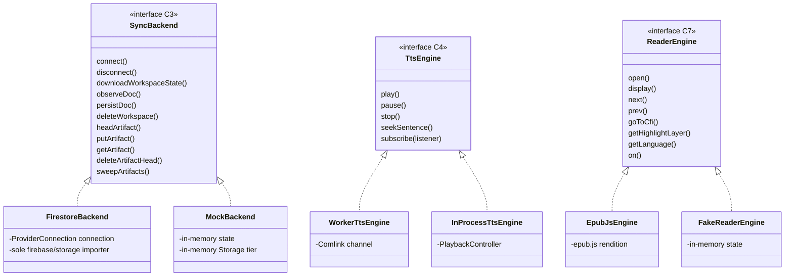
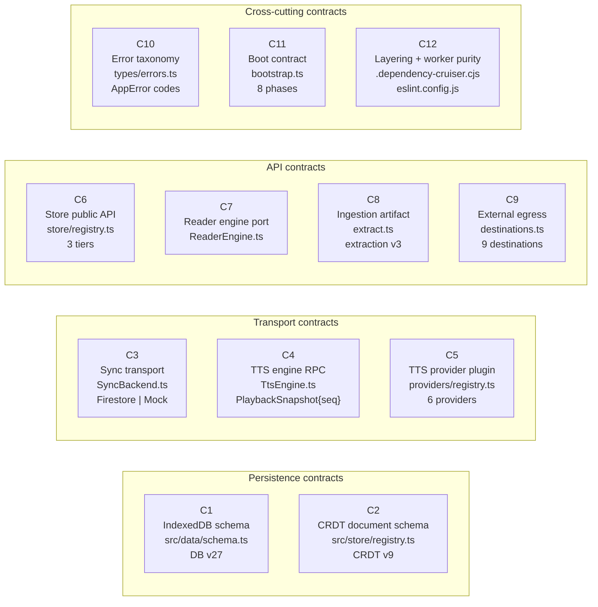
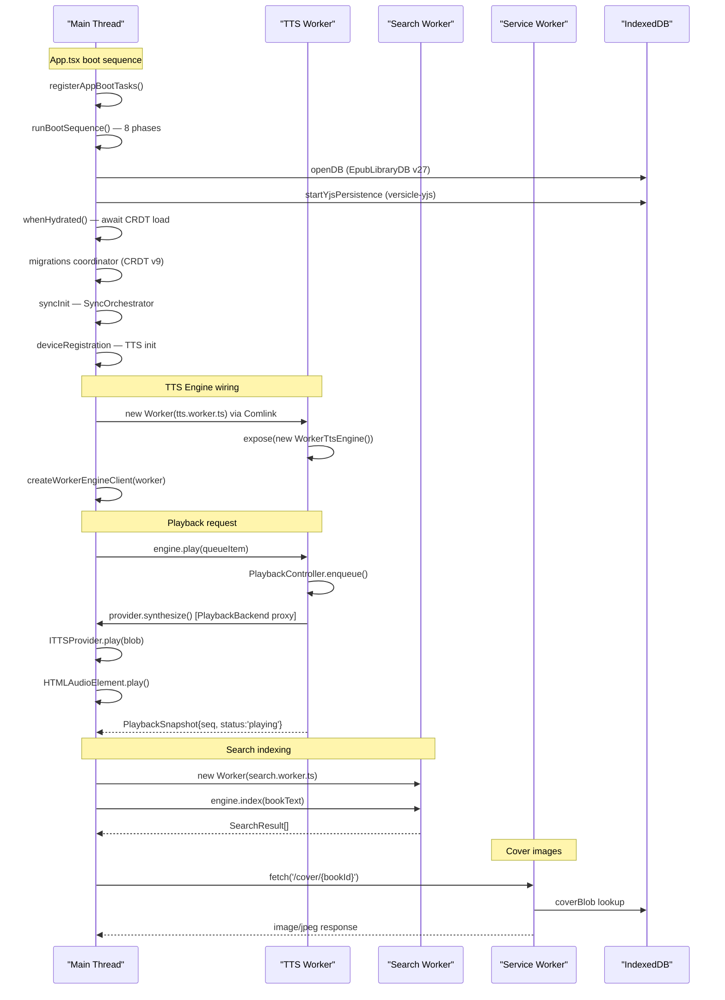
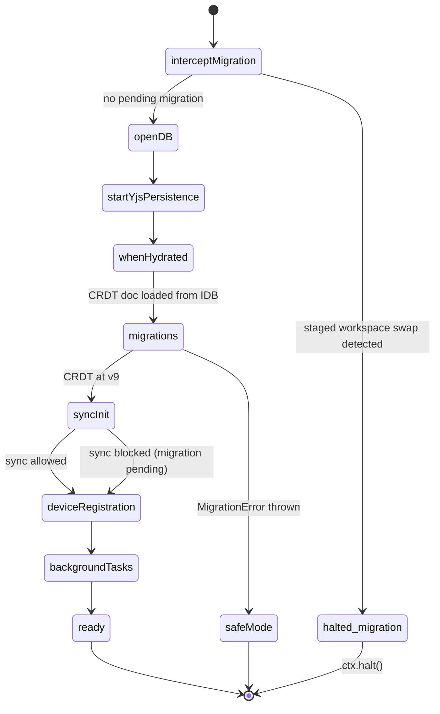
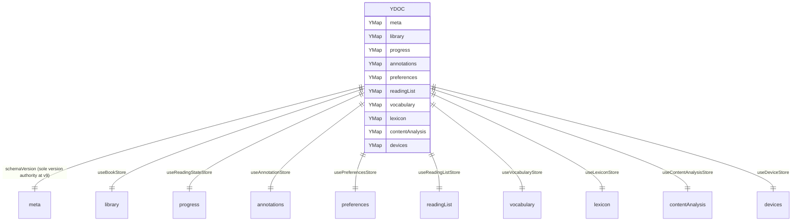
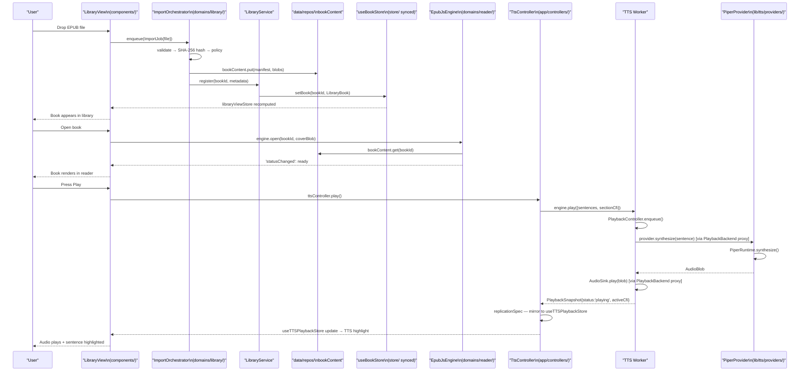
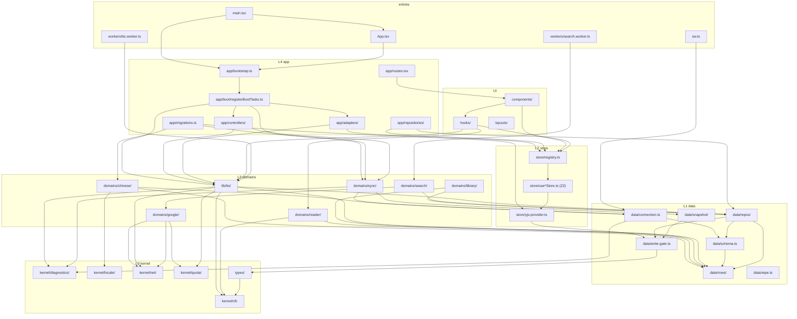
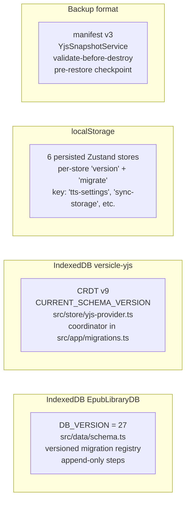

# Architecture Overview

Versicle is a local-first EPUB reader and TTS audiobook player delivered as a Progressive Web
App (PWA) with Capacitor bindings for Android and iOS. This document describes **what the system
is, why it is shaped the way it is, and how every part fits together** — from the governing
design principles down to concrete file-level implementation details.

This is the entry-point document for engineers new to the codebase. It is intentionally wide
rather than deep; companion documents go deeper into each subsystem (see cross-links throughout).

> **Source of truth**: [`architecture.md`](../../architecture.md) at the repo root is
> machine-generated from the live code registries and drift-gated by `npm test`. When in
> doubt, that file wins over anything written here.

---

## 1. Design Intent — Why this shape exists

### 1.1 The problem Versicle solves

A user has a personal EPUB library they want to read on any device — phone, tablet, desktop —
with high-quality TTS narration that can switch seamlessly between a local neural engine (Piper)
and several cloud providers (Google TTS, OpenAI, LemonFox). The library, reading position,
annotations, and vocabulary must stay in sync across devices without the user managing a
third-party account: they bring their own Firebase project.

Every feature that serves this goal must be designed with **privacy** as a hard constraint.
Book content is sensitive; the app must be able to run entirely offline; egress to any cloud
service must be consent-gated and auditable.

### 1.2 How the 2026 overhaul shaped the final architecture

Versicle was built by AI coding agents over 3,600+ commits. The 2026 overhaul program
(`plan/overhaul/README.md`, 10 phases, now COMPLETE) was triggered by a deep multi-agent
analysis that found 285 debt findings (26 critical, 110 high). The analysis verdict was
consistent across all 21 subsystem reports:

> **Quality is highest exactly where explicit boundaries already exist. Debt sediment
> accumulated wherever boundaries were missing.**

The overhaul follows three governing principles, adopted from three competing architectural
proposals and synthesized in `plan/overhaul/README.md`:

| Principle | Proposal document | One-sentence summary |
|---|---|---|
| **Strangler-incremental** | [`strangler-incremental.md`](../../plan/overhaul/proposals/strangler-incremental.md) | The app stays shippable after every commit; each new subsystem strangles and then deletes its predecessor. |
| **Modular-monolith** | [`modular-monolith.md`](../../plan/overhaul/proposals/modular-monolith.md) | Vertical domain modules with enforced, compile-time dependency direction; one codebase, no microservices. |
| **Contract-first** | [`contract-first.md`](../../plan/overhaul/proposals/contract-first.md) | Every cross-module seam is declared as a versioned contract, runtime-validated, and pinned by a contract test suite that ALL implementations must pass. |

These three are not alternatives — they are orthogonal dimensions applied simultaneously: the
strangler sequence governs the *journey*, the modular-monolith geography defines the *destination*,
and the contract-first registry governs *what is frozen versus what is free to change*.

### 1.3 The core invariant

**Agents (and humans) write good code against contracts they cannot violate without a red CI.**

This shapes every boundary enforcement decision: rules are not style guidelines; they are
CI-blocking build errors. The enforcement ladder (from `architecture.md` §3):

- **error** — CI-blocking; zero undocumented exceptions.
- **ratchet** — warn-severity with a frozen baseline that may only decrease.
- **process** — review/test-enforced (used only where mechanical enforcement is genuinely
  impractical).

---

## 2. C4 Container Diagram

The runtime topology — browser tab, web workers, service worker, and the external services
the app may contact:

```mermaid
graph TD
    subgraph "User's Device"
        subgraph "Browser (Main Thread)"
            MT["Main Thread\n(React UI + Zustand stores\n+ app/bootstrap composition root)"]
        end
        subgraph "Browser (Web Workers)"
            TW["TTS Worker\n(WorkerTtsEngine via Comlink)"]
            SW2["Search Worker\n(SearchEngine via Comlink)"]
        end
        subgraph "Browser (Service Worker)"
            SW["Service Worker\n(Workbox precache +\nruntime caching +\ncover responses)"]
        end
        subgraph "Storage"
            IDB["IndexedDB EpubLibraryDB\n(books, audio cache, search text,\nsession state, checkpoints)"]
            YIDB["IndexedDB versicle-yjs\n(Yjs CRDT persistence via y-idb)"]
            LS["localStorage\n(6 persisted Zustand stores)"]
            CS["Cache Storage\n(fonts, dict, piper assets)"]
        end
        MT -- "Comlink RPC\n(commands + PlaybackSnapshot)" --> TW
        MT -- "Comlink RPC\n(index + search)" --> SW2
        MT -- "postMessage SKIP_WAITING" --> SW
        SW -- "serves cover images\n+ assets" --> MT
        MT -- "IDB via data/ repos" --> IDB
        MT -- "y-idb persistence" --> YIDB
        MT -- "zustand/persist" --> LS
        TW -- "write-gate\n(navigator.locks)" --> IDB
        SW -- "CacheFirst routes" --> CS
    end
    subgraph "External Services"
        FB["Firebase\n(Firestore + Auth +\nCloud Storage\n+ Artifact Lane mirror)"]
        GTTS["Google Cloud TTS"]
        OAI["OpenAI TTS"]
        LF["LemonFox TTS"]
        HF["HuggingFace\n(Piper voice models)"]
        GAPI["Google APIs\n(Drive, OAuth)"]
        GEM["Gemini API\n(generate + Embedding 2)"]
    end
    MT -- "firebase SDK (sdk via)" --> FB
    MT -- "NetworkGateway.egress()\n(quota-governed)" --> GTTS
    MT -- "NetworkGateway.egress()\n(quota-governed)" --> OAI
    MT -- "NetworkGateway.egress()\n(quota-governed)" --> LF
    MT -- "NetworkGateway.egress()" --> HF
    MT -- "NetworkGateway.egress()" --> GAPI
    MT -- "NetworkGateway.egress()\n(quota-governed)" --> GEM
```



Key observations from this diagram:

1. **All IndexedDB access from the main thread goes through `src/data/` repos** (C1/C12 rule 2).
   The TTS worker also reaches IDB, but only via the write-gate (`navigator.locks` spanning
   workers and tabs), not via direct `getDB()` calls.
2. **All external egress except Firebase/OAuth SDK routes through `NetworkGateway.egress()`**
   (C9/C12 rule 7). Raw `fetch` is a lint error outside `src/kernel/net/`.
3. **The service worker is not in the critical boot path** — Phase 8 removed the hard boot
   gate. A "degraded" notice fires if the SW is absent, but the app renders.
4. **Comlink bridges the main-thread/worker boundary** for both the TTS and Search workers.
   The worker closures exclude `zustand`/`yjs`/`store/**` — asserted by a build-time chunk
   content test (C12 rule 6).
5. **Every Gemini and cloud-TTS egress is paced by the kernel quota governor** before it
   leaves the device — admission is recorded *inside* `NetworkGateway.egress()` so it cannot
   be bypassed (see §7.1). The newest external consumer is **Gemini Embedding 2**, used by the
   semantic-search pipeline (§5.5).
6. **Firebase carries a second, content-addressed payload** — the **Artifact Lane** mirrors
   expensive embedding blobs into the user's own Cloud Storage with a small Firestore
   HEAD-doc directory, so a book embedded once is hydrated for free on the user's other
   devices instead of re-spending Gemini quota (§7.2).

---

## 3. The Layered Module Map

### 3.1 Layer stack

The source tree is divided into seven numbered layers (L0–L4 are strictly ordered; L5/L6 are
the UI stack above the composition root). The direction rule: **higher layers may only import
lower layers, never the reverse** (enforced by dependency-cruiser; violations at error/0).



### 3.2 Layer-by-layer directory anatomy

**`packages/` — vendored forks (npm workspaces)**

Three upstream libraries are vendored as first-party npm workspaces so that surgeries applied
to them are tested as first-party changes:

| Package | Why forked |
|---|---|
| `packages/zustand-middleware-yjs/` | P2 surgeries: `syncedKeys` whitelist, `merge-defaults` hydration, `scopedDiff`, `api.yjs` handle |
| `packages/y-idb/` | P3 surgeries: `flush()`, `writeSnapshot()`, `readSnapshot()`, durable `synced` signal |
| `packages/y-cinder/` | P9 vendoring: Firestore Yjs provider with `saved` flush events |

All three are tested by the emulator contract suite (C3/C12). The `check:single-instance`
gate asserts that only one physical copy of `yjs` and `zustand` reaches the bundle — the
peer-dep posture enforces this without `--legacy-peer-deps`.

**`src/kernel/` (L0) — zero internal imports**

The kernel is the foundation layer: it imports nothing from the rest of the codebase (rule 1,
`kernel-imports-nothing` at error/0). Admission criterion: zero internal deps **and** at least
two consumers. Modules:

- [`cfi/`](../../src/kernel/cfi/) — canonical CFI algebra on parsed EpubCFI components
  (`cfiContains`, `stripCfiWrapper`, locale-aware sentence snapping). String fast-paths
  survive only behind property-based equivalence fuzz tests (>10k cases).
- [`diagnostics/`](../../src/kernel/diagnostics/) — flight-recorder ring-buffer core.
  Namespaced buffers per subsystem (TTS/SYNC/DB/GENAI/INGEST/UI).
- [`locale/`](../../src/kernel/locale/) — typed `MessageKey` catalog, cached `Intl` formatters
  (date/relative/bytes/collator), `LiveAnnouncer`, `uiLocale`. Worker-safe — no DOM.
- [`net/`](../../src/kernel/net/) — `NetworkGateway` + egress destination registry +
  generated-CSP renderer (see §7 for full details).
- [`quota/`](../../src/kernel/quota/) — `QuotaGovernor`: the cross-provider rate throttle
  (RPM/TPM/RPD sliding windows per `fg`/`bg` lane) plus the `ptDay` midnight-Pacific helper.
  Pure math: it keeps in-memory windows and persists the daily counter through an injected
  `QuotaStore` port (kernel touches no storage). Its ≥2-consumer admission bar is met by the
  GenAI clients and the cloud-TTS providers. See §7.1.

**`src/data/` (L1) — the ONLY IndexedDB subsystem**

Rule 2 is absolute: `idb` and `readwrite`-transaction literals are banned outside this
directory at lint error severity with zero production exceptions. This directory is the
complete persistence surface:

- [`connection.ts`](../../src/data/connection.ts) — `openDB` with blocked/blocking/terminated
  handlers and reset-on-failure.
- [`schema.ts`](../../src/data/schema.ts) — typed `DBSchema` + versioned migration registry
  (`DB_VERSION = 27`).
- [`write-gate.ts`](../../src/data/write-gate.ts) — `navigator.locks` exclusive writer
  spanning workers/tabs. The synchronous-callback API structurally bans intra-transaction
  `await`s (which cause WebKit IDB deadlocks — a documented invariant in the code).
- [`rows/`](../../src/data/rows/) — zod schemas per store; `z.infer` row types are the
  single validation source for backup/Android/Firestore ingress.
- [`repos/`](../../src/data/repos/) — `bookContent`, `playbackCache`, `audioCache` (with LRU
  eviction), `searchText`, `diagnostics`, `checkpoints`, `embeddings` (packed int8 vectors +
  resumable job state, with LRU eviction), `quotaCounter` (the governor's daily-counter
  persistence port — the only IDB touch for quota).
- [`snapshot/`](../../src/data/snapshot/) — `YjsSnapshotService` (one capture/validate/apply
  implementation replacing three previous mechanisms).
- [`wipe.ts`](../../src/data/wipe.ts) — `wipeAllData()`: closes + deletes both databases
  (`EpubLibraryDB` + `versicle-yjs`), clears localStorage (Versicle keys) and app caches.
  Uses an inversion-of-control hook registry so the wipe can stop sync and Yjs writers
  without importing them (that import path would violate the layering rules).

**`src/store/` (L2) — three-tier state registry**

22 Zustand stores declared in [`registry.ts`](../../src/store/registry.ts) in three tiers:

| Tier | Count | How persisted | Notes |
|---|---|---|---|
| `synced` | 9 | Yjs CRDT → IDB (`versicle-yjs`) → Firestore | Created only via `defineSyncedStore` |
| `local-persisted` | 6 | localStorage (zustand/persist) | Device-local settings |
| `ephemeral` | 7 | In-memory | Dies with the tab |

Stores hold state and pure reducers only. Workflow logic (import sagas, sync lifecycle, TTS
command routing) lives in domain services or `app/` controllers, injected via port adapters.

**`src/domains/` (L3) — vertical feature modules**

Six domain modules. Each owns its model, services, and UI behind a single public
`index.ts`. Domain services may import `kernel`, `data`, their own module, and other
domains' `index.ts` only — never `store/` directly (enforced by `domains-no-store`
at error/0):

| Domain | Key responsibilities |
|---|---|
| `chinese/` | Pinyin geometry engine, IDB dictionary service, vocabulary store |
| `google/` | `GoogleAuthClient` (per-service tokens), `DriveClient`, `GenAIClient`, `EmbeddingClient` (Gemini Embedding 2, four-part GenAI pattern) |
| `library/` | `ImportOrchestrator` job queue, `LibraryService` (keyed mutex), SHA-256 identity |
| `reader/` | `ReaderEngine` port, `EpubJsEngine`, overlay manager, session recorder |
| `search/` | `SearchSession` over the search worker, persisted `searchText` repo; the semantic-search pipeline (`EmbeddingIndexer`, int8 vector ranking, RRF fusion, artifact blob codec) |
| `sync/` | `SyncBackend` port (Firestore or Mock), `SyncOrchestrator`, typed `SyncEvent` bus; the Artifact Lane method set (head/put/get + delete/sweep) |

**`src/lib/` — legacy-geography keepers**

`lib/` is the honest residual: the audio domain (`lib/tts/`) and a set of app services whose
internals were rebuilt in place without relocation to their final `domains/audio/` address.
This is documented openly in the master plan close-out. The `lib-not-to-store` depcruise
ratchet (19 baseline edges, decreasing only) tracks progress toward the eventual relocation.

**`src/app/` (L4) — composition root**

The ONLY layer that may import everything below it. Key responsibilities:
- [`bootstrap.ts`](../../src/app/bootstrap.ts) — the phase machine (C11).
- [`boot/registerBootTasks.ts`](../../src/app/boot/registerBootTasks.ts) — the composition
  manifest; the ONE file that may import subsystem boot modules.
- [`migrations.ts`](../../src/app/migrations.ts) — CRDT migration coordinator (static imports,
  sequential `await`, atomic version bumps, loud-fail to SafeMode).
- `controllers/` — `TtsController`, `SyncController`, import policy.
- `adapters/` — store-backed port adapters (`createZustandEngineContext`,
  `createWorkerEngineClient`, replication wiring).
- `repositories/` — `BookRepository` / `ContentAnalysisRepository` (main-thread IDB↔Yjs
  mergers; worker-safety constraint documented and enforced by the chunk test).
- [`routes.tsx`](../../src/app/routes.tsx) — `/`, `/notes`, `/read/:id`, `/settings/:tab?`
  (all lazy-loaded).

---

## 4. The Three Governing Principles in Practice

### 4.1 Strangler-incremental: how code moved

The strangler pattern means: build the new implementation behind a seam interface, prove it
passes the same behavioral contract as the old code, wire the new path into production, then
delete the old path in the same PR. "Build, verify, strangle, delete" — never "build and
leave two paths alive."

The seam interfaces that enabled this (from the strangler seam catalog):



Each dual-implementation seam carries a shared behavioral spec (`describeXxxContract`) that
BOTH implementations must pass. For TTS the spec is 23 scenarios × 2 transports (C4).
For sync it is a `describeSyncBackendContract` run against MockBackend on every test run and
against FirestoreBackend on the Firestore emulator (C3).

The C3 interface grew by **five** additive methods for the Artifact Lane (§7.2):
`headArtifact` / `putArtifact` / `getArtifact` (probe / write / read) and
`deleteArtifactHead` / `sweepArtifacts` (GC). This widened `FirestoreBackend` — the *sole*
`firebase/storage` importer — from delete-only to read/write (it gained `uploadBytes` +
`getBytes`); `MockBackend` carries an in-memory Storage tier. The cloud round-trips
(emulator put/head/get/delete/sweep, HEAD-after-Storage ordering, the `storage.rules`
security suite) are **CI-PENDING**: they auto-skip without local emulators, so the cloud paths
are MockBackend-verified and code-complete but not yet proven end-to-end against real Firebase.

### 4.2 Modular-monolith: why not microservices

The modular-monolith choice is deliberate. The analysis showed that the problems were about
*boundary discipline inside one codebase*, not about *deployment topology*. Splitting into
services would add network latency and operational complexity without solving the root cause
(missing compile-time boundaries). The solution was to enforce those boundaries at the type
and lint level, making violations impossible rather than discouraged.

The module boundary rule that directly expresses this:

```
# Rule 3: Domain services may import kernel + data + own module +
# other domains' index.ts only. Never store/.
# Enforced: depcruise 'domains-no-store' at error/0.
```

Domain services declare what they need from the outside world as *ports* (`ports.ts`); `app/`
injects adapters. This is the hexagonal architecture pattern applied uniformly — the TTS
`EngineContext` port was the proven keeper that the entire overhaul generalized.

### 4.3 Contract-first: the C1–C12 registry

Twelve contracts govern every frozen boundary in the system. A contract version bump requires
a matching contract-suite change in the same PR. Everything not in this table is an internal
and may be rewritten freely.



The full contract table (from `architecture.md` §2) is reproduced in [Contract-First Registry](12-contract-first-registry.md).

---

## 5. Runtime Threads and Worker Topology



### 5.1 Main thread responsibilities

The main thread runs:
- All React rendering (UI, boot state machine, router).
- All Zustand stores (22 stores; some synced to the TTS worker via the replication spec).
- The `app/` composition root: bootstrap, controllers, adapters.
- All provider-side audio: `HTMLAudioElement`, `MediaSession` API, cloud TTS fetch calls.
- The Yjs CRDT document and its `y-idb` persistence.
- Firebase SDK connection (which owns its own internal HTTP transport).

### 5.2 TTS worker (`src/workers/tts.worker.ts`)

The TTS worker entry is three lines:

```typescript
import * as Comlink from 'comlink';
import { WorkerTtsEngine } from '@lib/tts/engine/WorkerTtsEngine';

Comlink.expose(new WorkerTtsEngine());
```

The `WorkerTtsEngine` runs the orchestration brain (`PlaybackController` + `TaskSequencer`)
off the main thread. It has **no access to stores, Yjs, or Zustand** — the closure is asserted
by `check:worker-chunk` (build gate check 1). It communicates with the main thread through:

- **Inbound**: command RPC calls via Comlink (`play`, `pause`, `stop`, `seekSentence`, etc.)
- **Outbound**: a single monotonic `PlaybackSnapshot{seq}` stream via Comlink proxy callbacks.

The provider side (`HTMLAudioElement`, cloud synthesis calls, MediaSession) lives on the main
thread and is injected as a `PlaybackBackend` port. The worker engine calls this port — the
call crosses the thread boundary via a Comlink proxy — so the worker never touches DOM APIs
directly. See [TTS Engine](32-domain-audio-tts-engine.md) for full details.

### 5.3 Search worker (`src/workers/search.worker.ts`)

```typescript
import * as Comlink from 'comlink';
import { SearchEngine } from '@lib/search-engine';

const engine = new SearchEngine();
Comlink.expose(engine);
```

The search worker holds the full-text index for the currently open book. The
`SearchSession` in `domains/search/` manages its lifecycle and proxies the `SearchEngine`
interface over Comlink. The index is not rebuilt on every reader session because extracted
text is persisted in `data/repos/searchText` (C1 store `cache_search_text`).

The worker also carries the **semantic** half of search (§5.5): it int8-quantizes embedding
vectors and runs int8-cosine top-k ranking (`SearchEngine.rankInt8`) over typed arrays
transferred from the main thread — pure compute, no IDB. The worker stays free of
`store`/`yjs`/`zustand` (the `worker-no-state-typegraph` ratchet, baseline 16, holds; the
emitted-chunk gate `check:worker-chunk` is TTS-only today).

### 5.4 Service worker (`src/sw.ts`)

The service worker uses Workbox and handles:
- **Precache** — all JS/CSS/HTML bundles (Vite injectManifest).
- **Runtime cache** — `/dict/*` (CC-CEDICT, ~15 MB, CacheFirst), `/fonts/*` (pinyin overlay
  TTFs), `/piper/*` (onnxruntime and the Piper worker, same-origin after Phase 5a vendoring).
- **Cover images** — a custom fetch handler that reads cover blobs from IndexedDB and serves
  them as `image/jpeg` responses via the `createCoverResponse` helper from
  [`src/data/sw-contract.ts`](../../src/data/sw-contract.ts). This is the only IDB access
  the service worker performs; it uses the shared constant module to avoid hardcoding store
  names.
- **Prompt-style SW updates** — the unconditional `self.skipWaiting()` was replaced in Phase 8
  with a SKIP_WAITING message handler: the new SW waits until the user accepts the in-app
  update toast before activating.

### 5.5 Semantic-search / embeddings pipeline (search + google + worker)

Semantic search spans three threads and three layers, hung off the existing regex search:

1. **Chunk** (main thread) — the plain text already in `cache_search_text` is sub-chunked into
   ~320-token, sentence-snapped windows; a per-section `sectionTextHash` is stamped at import so
   only changed sections re-embed. Per-chunk char offsets (`charStart`/`charEnd`) are persisted;
   the EPUB CFI jump-target is resolved lazily at click time.
2. **Embed** (`domains/google`) — `EmbeddingClient` (the four-part GenAI pattern: contract,
   `GeminiEmbeddingClient` impl, holder with a NOT-CONFIGURED default, lazy facade, barrel-exported
   from `src/domains/google/index.ts`) calls Gemini Embedding 2 through `egress('gemini', …)`, so
   it inherits the consent + quota lane (§7.1). An `EmbeddingIndexer` (`domains/search`, injected
   ports only — no store/sibling-domain import) drives a **foreground** lane that embeds the open
   book outward from the reading position (resumable) and a **background** backfill of
   loaded-but-unread books, gated by a default-OFF library-wide opt-in wired into the consent
   resolver.
3. **Quantize + rank** (search worker) — vectors are int8-quantized at 768 dims (per-vector scale)
   and stored as a packed blob in the new `cache_embeddings` CACHE store; resumable job state lives
   in `cache_embed_jobs`. The query embedding is cached; int8-cosine ranking (`rankInt8`) is fused
   with the regex engine via **reciprocal-rank fusion** (`src/domains/search/rrf.ts`) inside
   `SearchSession`.

**Regex full-text remains the graceful default** whenever semantic search is off, unconfigured,
quota-exhausted, or the book is not yet embedded — and is the privacy default (nothing leaves the
device). The pipeline took the IDB **v27** bump for its two CACHE stores (`migrateToV27`, additive);
the previously reserved-for-`sync_log`/SW-cover v27 cleanup was never done and is now the **next**
(v28) bump. See [Search Domain](38-domain-search.md) and [Google Domain](39-domain-google.md).

---

## 6. The Boot Sequence (C11)

Boot is an explicit, awaited phase machine defined in
[`src/app/bootstrap.ts`](../../src/app/bootstrap.ts). The key design decision: the sequencer
imports NO subsystems. Subsystems register named `BootTask` objects into phases via
[`src/app/boot/registerBootTasks.ts`](../../src/app/boot/registerBootTasks.ts) — the one
composition manifest that may import subsystem boot modules.



**Phase detail** (from `architecture.md` §5):

| # | Phase | Key tasks registered |
|---|---|---|
| 1 | `interceptMigration` | Workspace-migration interceptor — may `ctx.halt()` for user confirmation |
| 2 | `openDB` | Open `EpubLibraryDB` through migration registry (v27) |
| 3 | `startYjsPersistence` | Start `y-idb` persistence for the workspace Y.Doc |
| 4 | `whenHydrated` | IDB load + per-store hydration handles; static-metadata projection |
| 5 | `migrations` | CRDT migration coordinator — checkpoint, transform, atomic bump (→ v9) |
| 6 | `syncInit` | `SyncOrchestrator` boot (skipped if `ctx.syncAllowed === false`) |
| 7 | `deviceRegistration` | TTS engine init + device-mesh registration |
| 8 | `backgroundTasks` | Device heartbeat, Drive auto-scan, audio-cache LRU eviction, re-ingest wave, social login, embedding backfill (opt-in), Artifact Lane publisher + sweeper (opt-in) |

**Boot task contract** (from `src/app/bootstrap.ts`):

```typescript
export interface BootTask {
  name: string;            // stable diagnostic name, e.g. 'sync/initialize'
  run(ctx: BootContext): void | Promise<void>;
}

export interface BootContext {
  setStatusMessage(message: string): void;
  syncAllowed: boolean;
  pendingMigration: PendingWorkspaceMigration | null;
  halt(reason: BootHaltReason): void;
  addCleanup(cleanup: () => void): void;
}
```

**Failure modes:**
- A `BootTask.run()` throw rejects the boot promise → `App.tsx` routes to `SafeModeView`.
- A CRDT `MigrationError` carries the pre-migration checkpoint ID → `CriticalMigrationFailureView`
  offers a restore path.
- `ctx.halt()` stops the sequence after the current phase — used while a backup restore or
  staged workspace swap is reloading the page.

**Wipe hooks** — `wipeAllData()` in `src/data/wipe.ts` must stop the Yjs persistence and
the Firestore sync provider before deleting databases. But `data/` cannot import `store/`
or `domains/sync/` (layering rules). The solution: a hook registry in `wipe.ts`; subsystem
boot modules call `registerWipeHook(...)` at manifest registration time (not at boot success,
so even a pre-boot wipe from SafeMode works).

---

## 7. The Network Egress Contract (C9)

Every destination the app may contact is declared in
[`src/kernel/net/destinations.ts`](../../src/kernel/net/destinations.ts). The file is
import-free (no internal deps) because `scripts/generate-csp.mjs` runs it directly under
Node's TypeScript type stripping to produce the CSP.

Enforcement is three-layered:

1. **`NetworkGateway.egress(destinationId, url, init?, opts?)`** in
   [`src/kernel/net/NetworkGateway.ts`](../../src/kernel/net/NetworkGateway.ts) is the ONLY
   production fetch path for gateway destinations. Raw `fetch`/XHR outside `src/kernel/net/`
   is a lint error (C12).
2. **CSP `connect-src` is generated** from the registry by `npm run generate:csp`. The four
   hand-maintained copies that existed before Phase 7 are gone.
3. **Registry == CSP is a permanent invariant** pinned by `src/kernel/net/csp.test.ts` —
   every gateway/SDK host in the registry must appear in the generated connect-src.

Gateway enforcement steps (from `NetworkGateway.ts`):
1. Registry membership check (`NET_UNKNOWN_DESTINATION`).
2. `via: 'gateway'` assertion — `firebase` and `google-oauth` are `via: 'sdk'` (their HTTP is
   owned by their SDKs); they feed the CSP but cannot route through `egress()`.
3. Host allowlist (`NET_HOST_NOT_ALLOWED`).
4. Offline policy (`NET_OFFLINE`).
5. Consent gate (`NET_CONSENT_REQUIRED`) — `per-book` destinations require either
   `consent.interactive` (a user gesture) or a resolver grant. The resolver is wired at the
   composition root to the synced per-book `aiConsent` map.
6. Per-destination `AbortController` timeout, composed with the caller's signal.

The nine declared destinations (from `architecture.md` §6). The `rateLimit` column marks the
destinations whose egress is paced by the quota governor (§7.1):

| Id | Via | Data class | Consent | Timeout | rateLimit |
|---|---|---|---|---|---|
| `gemini` | gateway | book-content | per-book | 60 s | yes (generate + Embedding 2) |
| `google-tts` | gateway | book-content | provider-selection | 30 s | yes |
| `openai-tts` | gateway | book-content | provider-selection | 30 s | yes |
| `lemonfox-tts` | gateway | book-content | provider-selection | 30 s | yes |
| `hf-piper-catalog` | gateway | metadata | provider-selection | 30 s | — |
| `hf-piper-models` | gateway | binary-asset | provider-selection | unbounded (abortable) | — |
| `drive` | gateway | binary-asset | oauth | unbounded (abortable) | — |
| `google-oauth` | sdk | auth | oauth | unbounded | — |
| `firebase` | sdk | book-derived | oauth | unbounded | — |

### 7.1 The cross-provider quota governor

The free-tier ceilings on Gemini and the cloud-TTS providers are real, shared, and undocumented
(Google defers the per-model numbers to the AI Studio dashboard), so a single throttle paces all
GenAI and cloud-TTS egress. `QuotaGovernor` (`src/kernel/quota/`) tracks three windows per lane —
**requests-per-minute**, **tokens-per-minute** (sliding 60 s), and **requests-per-day** (RPD,
reset at midnight Pacific via the `ptDay` helper) — in two lanes: `fg` (foreground, the book being
read + query embeds) and `bg` (background backfill, capped to leave foreground headroom).

The governor is a **kernel service callers funnel into** (a downward dependency, like `egress`),
not a layer above the clients — `GeminiClient`, the `EmbeddingClient`, and the cloud-TTS providers
all import `@kernel/quota`. Because `kernel-imports-nothing` is error/0, it keeps only in-memory
windows and persists the daily counter through an injected `QuotaStore` port, wired at the
composition root to `src/data/repos/quotaCounter.ts` (which writes a single key in the existing
`app_metadata` store — **no new store**).

Two design decisions make it unbypassable and honest:

- **Admission is recorded at `acquire`, inside `NetworkGateway.egress()`** (the same chokepoint
  that owns host-allowlist/offline/consent). The gateway holds a `QuotaScheduler` seam installed
  via `setQuotaScheduler` (mirroring `setConsentResolver`), so a caller cannot forget to throttle.
  RPM/TPM/RPD are debited at admission — important because embeddings never `commit`, so
  admission-time recording is what makes them count. The gateway is the single owner of the
  once-per-egress claim release (try/finally). `commit()` is a client-side step that reconciles
  the token *estimate* to the actual.
- **Backpressure is a typed pre-network error.** When a lane is exhausted the governor refuses
  *before* any network call, so the existing 429 `isResourceExhausted` check cannot match it. A
  new `AppError` subclass, **`NET_RATE_LIMITED`** (in `src/types/errors.ts`, the taxonomy home,
  with `retryable: true` + `retryAfterMs`), signals this; meters and graceful-degradation branch
  on the code, never message substrings.

Because the free-tier quota is **per-Google-Cloud-project, not per-device**, the governor
reconciles the budget across the synced device mesh: each device publishes its rolling daily spend
as an **additive nested `embedSpend` field** on its existing `DeviceInfo` record (no CRDT format
change — it rides below the `devices` synced key, which is root-only-gated), and the background
lane subtracts the sum of heartbeat-active siblings' spend from the project ceiling before issuing.
429-backoff is the convergence safety net for CRDT/heartbeat lag.

**Model rotation stays in `GeminiClient`** (the EM2 / `-001` embedding spaces are incompatible, so
embeddings must never rotate); the governor owns only rate-buckets, backoff, cooldown, and
`Retry-After`. Editable per-lane limits, a master "pause all GenAI" switch, and live
used-vs-limit meters (fed by `governor.snapshot()` through `useGenAIStore`) live in the `genai`
settings tab.

### 7.2 The shared AI-cache (Artifact Lane)

Embedding a book is the single most quota-expensive operation in the app, and the result
(~251 KB of int8 vectors) is identical on every device that owns the same book. The **Artifact
Lane** mirrors that blob into the user's own BYO cloud so a book embedded once is downloaded by
the user's *other* devices instead of re-spending Gemini quota. It is two tiers, neither in the
CRDT:

- **Payload** — a content-addressed object `embeddings/{key}.bin` under the workspace prefix in
  the user's BYO **Cloud Storage** (too large for the 1 MB CRDT doc budget).
- **HEAD directory** — one tiny `embedCache/{key}` doc per artifact in the user's BYO
  **Firestore**, for a cheap existence/stamp probe with no Storage `list`.

The flow hangs off the C3 artifact methods (§4.1) and the app layer:

- **Consult (read)** — `ArtifactConsult` (`src/app/google/artifactConsult.ts`) probes
  (`headArtifact`) and hydrates (`getArtifact` → `putHydrated`) **before** the quota gate. Because
  the `firebase` download is `via: 'sdk'` it never routes through `egress()`, so a full cache hit
  spends **zero** Gemini quota. The download obeys the **same per-book consent predicate** the
  governed embed would (`src/app/google/aiConsent.ts`).
- **Publish (write)** — an `ArtifactPublisher` boot task uploads (idempotent, head-before-put,
  Storage-then-HEAD ordering) when the default-OFF **"Share AI caches across my devices"** opt-in
  is on. Consult and upload share the same consent predicate.
- **Lifecycle** — per-book cloud delete is an *app-layer* concern (`LibraryService.remove` deletes
  the HEAD doc before `deleteBook` destroys the manifest carrying the content hash, and leaves the
  content-addressed blob for the sweeper since a sibling device may still need it); IDB LRU is
  persist-on-evict with a never-evict-an-unconfirmed-upload rule; a separate cloud TTL/quota
  **sweeper** boot task bounds the bucket; `embedCache` is in `PURGE_SUBCOLLECTIONS` (wired in
  Phase A); and a HEAD-hit-but-object-missing **drift metric** self-heals the stale HEAD doc.

The blob serialize/parse codec is `src/domains/search/artifactBlob.ts`. The cloud round-trips and
the security-rules suite are **CI-PENDING** (MockBackend-verified, code-complete, not yet proven
against real Firebase — §4.1). Cross-*user* sharing (a global commons) and TTS-audio cache sharing
are explicitly **deferred**.

---

## 8. The CRDT State Layer (C2)

User data lives in a single shared Yjs `Y.Doc` that is:
- Persisted locally via `y-idb` to `IndexedDB/versicle-yjs`.
- Replicated to the user's own Firebase project via the `y-cinder` Firestore Yjs provider
  (BYO-Firebase — the user controls the server).
- Exposed to React via the `zustand-middleware-yjs` fork, which bridges Y.Map changes into
  Zustand store updates.

The CRDT schema is at **v9** (`CURRENT_SCHEMA_VERSION` in
[`src/store/yjs-provider.ts`](../../src/store/yjs-provider.ts)). The nine synced stores and
their Y.Map names are declared in [`src/store/registry.ts`](../../src/store/registry.ts):



**The `syncedKeys` whitelist** — each synced store declares which keys actually replicate to
other devices. This prevents ephemeral state (UI position, reader scroll offset) from being
synced — a class of bug that existed before Phase 2 (ephemeral popover state was synced
through the CRDT to other devices).

**The `merge-defaults` hydration** — a Phase 2 fork surgery. Before the fix, inbound Y.Map
hydration deleted store keys absent from the map. The fix: inbound patch merges map JSON
over declared defaults instead of replacing. This retired ~20 defensive `|| {}` fallbacks
and the `v4→v5` "migration-as-backfill" hack.

**The migration coordinator** (`src/app/migrations.ts`) — runs once per boot, after
`whenHydrated()`, before React renders. Design rules (from the module's doc comment):
- Static imports, single call site.
- Reads the Y.Doc directly, not store state.
- One `doc.transact()` per step: the version bump is atomic with its transform.
- Doc transforms, not `setState` — the middleware receives migrations as ordinary inbound
  traffic from `MIGRATION_ORIGIN`.
- Pre-migration checkpoint: if any step will run on a doc that holds data, a protected
  checkpoint is created BEFORE the first transform.
- Any throw surfaces as `MigrationError` → `CriticalMigrationFailureView`.

The v1→v9 migration chain is documented in `architecture.md` §4.

See [State Management and CRDT](13-state-management-crdt.md) for full details.

---

## 9. End-to-End Request Flow: Importing and Playing an EPUB

This section traces a complete user-level action — dropping an EPUB file, then pressing Play —
through every layer of the system.



**Import pipeline** (step by step, from `domains/library/`):
1. `ImportOrchestrator.enqueue(job)` — serializes by per-book keyed mutex.
2. Validate: magic bytes, MIME type.
3. Identify: SHA-256 `contentHash` (replacing the old djb2 filename-embedding fingerprint).
4. Policy: new | duplicate (ask user) | ghost (adopt).
5. `extractBook(file, 'full', signal)` — one call, no triplication.
6. `data/repos/bookContent.put(...)` — zod-validated write through the write-gate.
7. Register in `useBookStore` (CRDT) + `useReadingListStore`.

**TTS playback** (step by step):
1. `TtsController.play()` on the main thread calls `engine.play()` — crosses the Comlink
   boundary to the TTS worker.
2. `WorkerTtsEngine.play()` enqueues the request in the `PlaybackController`.
3. `PlaybackController` calls `this.backend.synthesize(sentence)` — this is a Comlink proxy
   call BACK to the main thread (the `PlaybackBackend` lives on the main thread).
4. The main-thread backend calls the active `ITTSProvider` (here: `PiperProvider`).
5. `PiperProvider` sends the text to `PiperRuntime` (a WASM neural engine running in a
   sub-worker with its own Comlink channel).
6. The audio blob returns to the main thread backend, which calls `AudioSink.play(blob)`.
7. The `PlaybackController` publishes `PlaybackSnapshot{seq, status:'playing', activeCfi}`.
8. The snapshot crosses the Comlink boundary back to the main thread.
9. The `replicationSpec` mirrors the snapshot to `useTTSPlaybackStore` (ephemeral).
10. React re-renders the TTS highlight overlay.

---

## 10. The Boundary Ruleset (C12)

Ten rules govern the layering and worker-purity contract. They are listed here with their
enforcement mechanism and severity:

| # | Rule | Enforcement | Level |
|---|---|---|---|
| 1 | `kernel/` imports nothing internal; admission = zero deps + ≥2 consumers | depcruise `kernel-imports-nothing` error at 0 | error |
| 2 | All IDB via `data/` repos; `idb` + `readwrite` banned elsewhere | eslint `idb`-import ban + `readwrite`-literal ban, error | error |
| 3 | Domain services never import `store/` | depcruise `domains-no-store` error at 0 | error |
| 4 | Domain UI reads via published hooks; writes via services/controllers | store-registry README + projection-port pattern | process |
| 5 | `getState()` outside `store/` + `app/` | `domains-no-store` error + `lib-not-to-store` ratchet at 19 | error + ratchet |
| 6 | Worker import closure free of `zustand`/`yjs`/`store/` | `check:worker-chunk` check 1 on emitted chunk | error + ratchet |
| 7 | All egress via `NetworkGateway.egress()`; CSP generated from registry; quota throttle enforced at the same chokepoint | fetch/XHR ban + CSP generation + registry==CSP test | error |
| 8 | `epubjs` only in reader engine; synthesis SDKs only in providers; singletons only in `app/` | runtime-epubjs import ban at error with named carve-outs | error |
| 9 | Mock seams reachable only from composition root behind DEV/VITE_E2E | `check:worker-chunk` check 2: no MockBackend source in prod chunk | error |
| 10 | TS project references per layer + all test code typechecked | `tsc -b` solution build covering app + test + e2e + packages | partial |

Current ratchet counters:
- `lib-not-to-store`: **19** baseline edges (legacy `lib/` geography)
- `worker-no-state-typegraph`: **16** type-only edges
- `lint-debt-allowlist.json`: **20** `any` sites + **25** disables
- Coverage floor: `coverage-baseline.json`
- Bundle budget: `bundle-baseline.json`

See [Layering and Boundaries](11-layering-and-boundaries.md) for the full treatment.

---

## 11. Module Dependency Graph



Key observations:
- The TTS worker (`TW`) reaches only `lib/tts/` — one layer of the domain stack.
- The search worker (`SW2`) reaches only `domains/search/`.
- The service worker (`SWTS`) reaches only `data/connection.ts` (for cover serving).
- All three workers are free of `store/`, `yjs`, and `zustand` by construction.

---

## 12. The Settings Surface

Settings is a registry of self-contained lazy panels, each deep-linkable as `/settings/:tab`.
The registry lives at [`src/app/settings/registry.ts`](../../src/app/settings/registry.ts);
panels lazy-load on first activation:

| Tab | Order | Danger | Notes |
|---|---|---|---|
| `general` | 10 | — | Font, theme, flow mode |
| `tts` | 20 | — | Provider, voices, lexicon |
| `genai` | 30 | — | Gemini API key, per-book consent, semantic search + embedding opt-ins, quota per-lane limits + pause-all + live meters |
| `sync` | 40 | — | Firebase config, device mesh |
| `devices` | 50 | — | Device registration and heartbeat |
| `dictionary` | 60 | — | CC-CEDICT import status |
| `recovery` | 70 | — | Checkpoint restore, export |
| `diagnostics` | 80 | — | Flight recorder export, network counters |
| `data` | 90 | yes | Wipe all data |

The `GlobalSettingsDialog` (742 lines before the overhaul) is deleted; the registry pattern
(with `DiagnosticsTab` as the model) replaced it. See [Settings Shell](41-settings-shell.md).

---

## 13. Persisted Format Summary

Three independent persistence layers, each with its own versioned migration strategy:



**IndexedDB `EpubLibraryDB` (C1):**
- Schema v27 (three steps past the v24 baseline: `migrateToV25`, `migrateToV26`, `migrateToV27`).
- Stores classified as STATIC (immutable book content), CACHE (regenerable), APP (sync state).
- `migrateToV27` adds the regenerable CACHE stores `cache_embeddings` + `cache_embed_jobs`
  (additive). This took the slot once reserved for the `sync_log` drop / SW-cover cleanup; that
  cleanup was never done, so it now rides the **next** IDB bump at v28.

**Yjs CRDT (C2):**
- Schema v9 (eight migration steps from v1; the last format change of the overhaul program).
- The `meta` Y.Map is the sole version authority at v9 (`library.__schemaVersion` is retired
  as a dual-write tripwire for pre-v9 client quarantine).

**localStorage:**
- Six persisted Zustand stores (see `architecture.md` §4 for the key table).
- Each uses zustand/persist's `version` + `migrate` pattern for backward compatibility.

**Backup manifest v3:**
- Binary fields stripped/base64'd.
- Zod-validated manifest, dry-run `Y.applyUpdate` before apply, automatic pre-restore
  checkpoint via `CheckpointService`.

See [Schema and Migrations (IDB)](21-schema-and-migrations-idb.md) and
[CRDT Format and Migrations](22-crdt-format-and-migrations.md) for full details.

---

## 14. Quality Gate and CI

Every PR must pass eleven checks (from `AGENTS.md`). The checks are ordered to catch the most
common failure modes first:

| # | Command | What it checks |
|---|---|---|
| 1 | `npm run lint` | 0 errors (warnings are ratchets) |
| 2 | `npx tsc -b` | Type check: app + tests + e2e + packages |
| 3 | `npm test` | 3,296 unit/integration tests (the embeddings/quota/Artifact-Lane work is full-suite-gated; the Artifact Lane's cloud round-trips + security-rules suite are CI-PENDING and auto-skip without local emulators) |
| 4 | `npm run build` | Production bundle succeeds |
| 5 | `npm run depcruise:check` | Dependency boundary counts ≤ baseline |
| 6 | `npm run lintdebt:check` | lint-debt counts match `lint-debt-allowlist.json` |
| 7 | `npm run knip` | Zero dead code findings |
| 8 | `npm run check:worker-chunk` | 5 checks: worker closure purity + bundle budget |
| 9 | `npm run check:single-instance` | One physical copy of `yjs` and `zustand` |
| 10 | `npm run licenses:check` | License allowlist gate |
| 11 | `npm run coverage` | Totals ≥ `coverage-baseline.json` |

The program scoreboard at close (from `plan/overhaul/README.md`):

| Metric | Start | Close |
|---|---|---|
| Verified criticals retired | 0 / 26 | 26 / 26 |
| Vitest tests | 1,805 | 3,103 / 307 files |
| depcruiser violations | 207 | 35 (two ratchets; all other rules at error/0) |
| Import cycles (full graph / runtime) | 117 / 33 | 0 / 0 |
| Production `as any` | 138 | 20 |
| eslint-disable directives | 245 | 25 |
| Coverage (lines / stmts / funcs / branches) | 65.3 / 64.0 / 58.7 / 56.1 | 75.5 / 74.3 / 69.9 / 65.5 |

See [Testing Strategy](63-testing-strategy.md) and [CI and Quality Gates](65-ci-and-quality-gates.md).

---

## 15. Cross-document Map

This document is the entry point. The full documentation set is organized as follows:

**Foundation:**
- [Introduction](00-introduction.md) — product overview and reading guide
- [Product Design Decisions](01-product-design-decisions.md) — BYO-Firebase, local-first, privacy
- [Glossary and Domain Model](02-glossary-and-domain-model.md) — terms and entity relationships

**Architecture (this section):**
- **10-architecture-overview.md** ← you are here
- [Layering and Boundaries](11-layering-and-boundaries.md) — the ten boundary rules in detail
- [Contract-First Registry](12-contract-first-registry.md) — C1–C12 contract inventory

**State and Storage:**
- [State Management and CRDT](13-state-management-crdt.md)
- [Bootstrap and Lifecycle](14-bootstrap-and-lifecycle.md)
- [Error Handling and Recovery](15-error-handling-and-recovery.md)
- [Storage Gateway](20-storage-gateway.md) — `src/data/` in depth
- [Schema and Migrations (IDB)](21-schema-and-migrations-idb.md)
- [CRDT Format and Migrations](22-crdt-format-and-migrations.md)
- [Backup and Restore](23-backup-and-restore.md)

**Domains:**
- [Reader Engine](30-domain-reader-engine.md)
- [Reader UI and Overlays](31-reader-ui-and-overlays.md)
- [TTS Engine](32-domain-audio-tts-engine.md)
- [TTS Providers and Platform](33-tts-providers-and-platform.md)
- [TTS Content Pipeline](34-tts-content-pipeline.md)
- [Chinese Domain](35-domain-chinese.md)
- [Sync Domain](36-domain-sync.md)
- [Library Domain](37-domain-library.md)
- [Search Domain](38-domain-search.md)
- [Google Domain](39-domain-google.md)

**UI and App Shell:**
- [Design System](40-ui-design-system.md)
- [Settings Shell](41-settings-shell.md)
- [App Shell and Routing](42-app-shell-and-routing.md)
- [Composition Root](50-composition-root.md)
- [TTS App Integration](51-tts-app-integration.md)

**Build and Platform:**
- [Build and Bundling](60-build-and-bundling.md)
- [PWA and Service Worker](61-pwa-and-service-worker.md)
- [Capacitor Native](62-capacitor-native.md)
- [Testing Strategy](63-testing-strategy.md)
- [E2E Verification](64-e2e-verification.md)
- [CI and Quality Gates](65-ci-and-quality-gates.md)
- [Vendored Forks](66-vendored-forks.md)

**Reference:**
- [Security and Privacy](70-security-and-privacy.md)
- [Internationalization](71-internationalization.md)
- [Accessibility](72-accessibility.md)
- [Performance](73-performance.md)
- [Observability and Diagnostics](74-observability-and-diagnostics.md)
- [Overhaul History](80-overhaul-history.md)
- [Directory Map](81-directory-map.md)
- [End-to-End Flows](82-end-to-end-flows.md)
- [Extending the System](83-extending-the-system.md)
