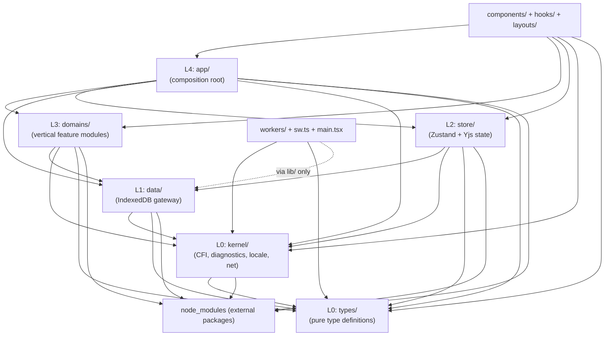
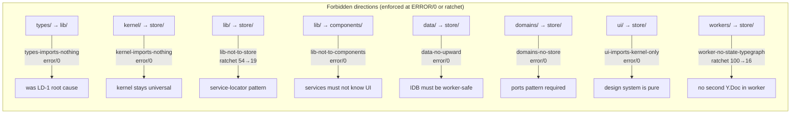
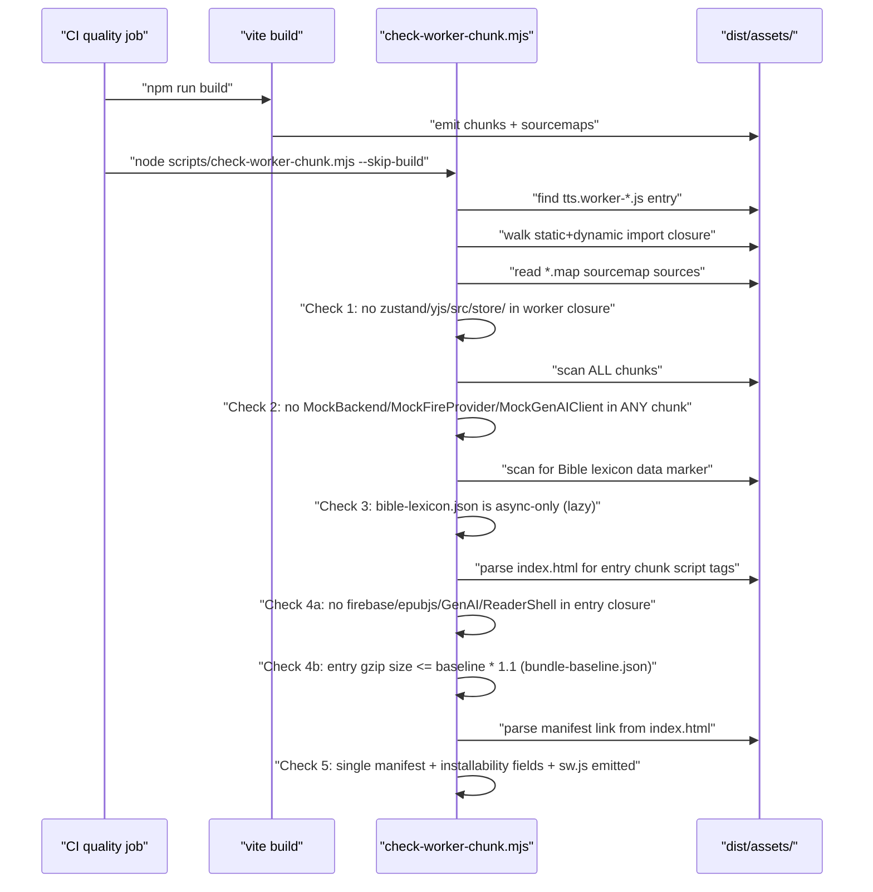
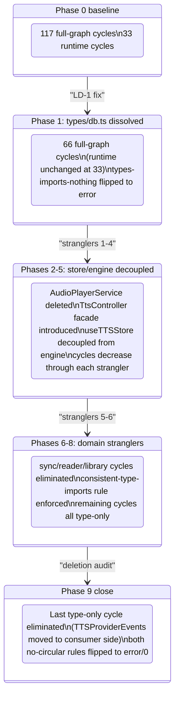
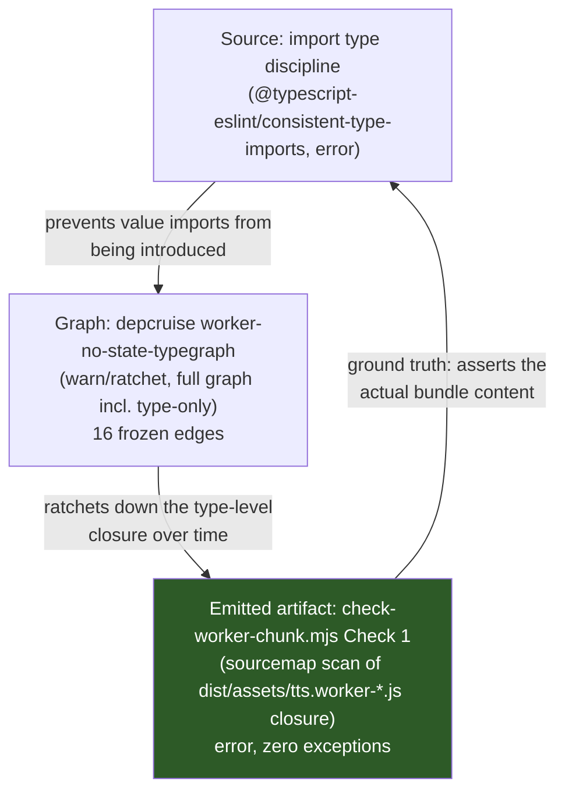
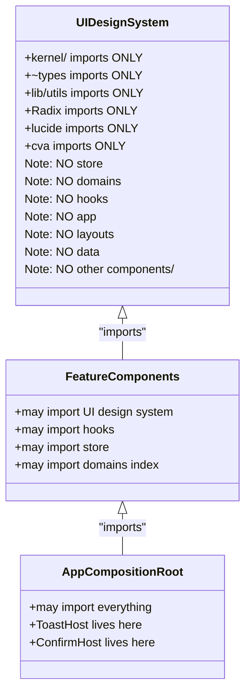
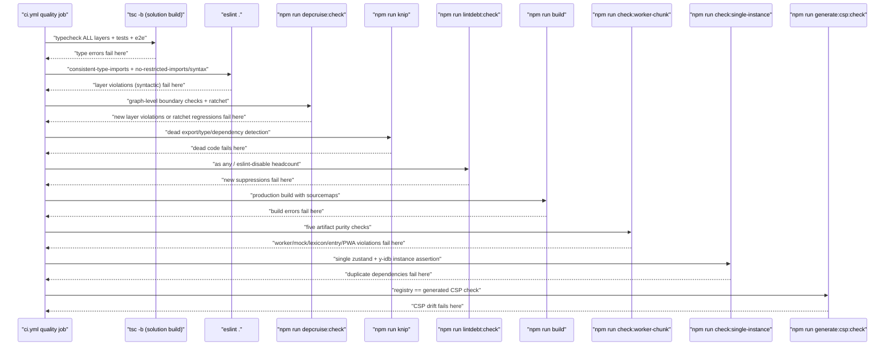

# Layering & Boundary Enforcement

Versicle's architecture is a **modular monolith** organized in five strict dependency layers (L0–L4) plus peripheral layers for UI, workers, and entries. Every layer-to-layer allowed direction is codified in two complementary enforcement tools: [.dependency-cruiser.cjs](../../.dependency-cruiser.cjs) for graph-level rules and [eslint.config.js](../../eslint.config.js) for syntactic rules. The layering is C12 in the [contract registry](../../architecture.md) (§2), and it is the mechanical foundation on which the entire ten-phase overhaul program was built.

This document explains *why* the boundary design exists, what each layer owns, and exactly *how* each rule is mechanically enforced — from the depcruise rule pipeline down to the individual ESLint AST selectors.

---

## 1. Design intent: why boundaries need to be mechanical

The pre-overhaul codebase contained **65 import cycles** (full graph), **97 `getState()` calls inside `lib/`**, and a `types/db.ts` that imported deep into the TTS engine — making the nominal layer structure completely fictitious. Every static analysis tool (madge, dependency-cruiser, IDE find-references) produced noise. Tests required constructing the entire global store world before running any service. Adding a field to any synced store required grepping all of `lib/`. The TTS worker's runtime import closure was clean but **one `import type` → `import` typo away** from pulling a second `Y.Doc` instance into the worker and corrupting persisted data.

The meta-cause identified by the overhaul analysis (`plan/overhaul/analysis/layering-deps.md`): agents and humans write clean code against contracts they cannot violate without a red CI, and the pre-overhaul codebase had almost none. The overhaul therefore made every important boundary **explicit, machine-checked, and CI-blocking**. A new dependency that crosses a layer now causes an immediate build failure.

The end state (reached at Phase 9, 2026-06-12) is:

| Metric | Phase 0 baseline | Phase 9 end state |
|---|---|---|
| Import cycles (full graph) | 117 | **0** (rule at error) |
| Import cycles (runtime graph) | 33 | **0** (rule at error) |
| dependency-cruiser violations | 207 | **35** (two ratcheted rules only) |
| `lib/ → store/` edges | 54 | **19** (ratchet, decreasing only) |
| Worker type-closure edges into state | 100 | **16** (ratchet, hard floor at 0 by build check) |

See [Architecture overview](10-architecture-overview.md) for the full program history, and [80-overhaul-history.md](80-overhaul-history.md) for the phase-by-phase sequence.

---

## 2. The five-layer dependency stack

```
L0  kernel/ + types/     — the universal base
L1  data/                — the only IndexedDB subsystem  
L2  store/               — Zustand + Yjs state management
L3  domains/             — vertical feature modules
L4  app/                 — composition root
    ↓ (may import anything below)
    components/ + hooks/ + layouts/   — React UI (may import L0–L4)
    workers/ + sw.ts + main.tsx       — thin entries with asserted closures
```

Dependency direction is strictly downward. Each layer may import from any layer **below** it in the stack; no upward imports are allowed. The two L0 layers (`kernel/` and `types/`) are independent of each other but may not import any other internal module.



### 2.1 L0 — `kernel/` and `types/`

**`src/types/`** contains pure type definitions with zero internal imports. Before Phase 1 it was a "god type hub" (`types/db.ts`, 934 lines, fan-in 59) that imported from `lib/tts/` — poisoning the entire graph with ~50 of the 65 pre-overhaul cycles. Phase 1 dissolved it into six acyclic domain type modules. Rule: `types-imports-nothing` at **error/0** in depcruise.

**`src/kernel/`** houses the four universal sub-layers: `cfi/` (canonical CFI algebra), `diagnostics/` (flight-recorder ring-buffer), `locale/` (typed message catalog + formatters), and `net/` (NetworkGateway + egress destination registry). The kernel admission rule is strict: any module entering `kernel/` must have **zero internal dependencies** (beyond `~types`) and **at least two consuming domains**. This is the anti-junk-drawer constraint. Rule: `kernel-imports-nothing` at **error/0**.

The kernel boundary is also tested in `src/kernel/cfi/cfi.kernel-boundary.test.ts`, which scans the source tree at runtime to assert that `epubjs/src/epubcfi` is imported only by the shim (`kernel/cfi/epubcfiShim.ts`) and that no `kernel/` file imports outside `kernel/` or `types/` — a belt-and-suspenders check over the depcruise rule that also covers test files.

### 2.2 L1 — `data/`

`src/data/` is the **only IndexedDB subsystem** in the application. Rule 2 of the master plan (C12): all IndexedDB access goes through the `data/` repos; raw `idb` imports and `readwrite` transaction literals are banned everywhere else. The write gate (`data/write-gate.ts`) uses navigator.locks to span tabs and the TTS worker, preventing concurrent readwrite transactions — the proven WebKit IndexedDB hang pair. The synchronous-callback API of the write gate structurally prevents `await` inside a transaction, making the WebKit-hang-safe pattern unrepresentable as a violation. Rule: `data-no-upward` at **error/0** prevents `data/` from importing `store/`, `hooks/`, `components/`, `app/`, or `lib/sync`.

### 2.3 L2 — `store/`

`src/store/` owns all Zustand stores, declared in three explicit tiers (synced CRDT, local-persisted, ephemeral) via the store registry (`src/store/registry.ts`). The `defineSyncedStore` function in `yjs-provider.ts` is the single `yjs()` middleware call site — a lint rule bans the raw middleware import everywhere else. Stores may import from `data/` (for data connections and types) but never from `app/`, `domains/`, `hooks/`, or `components/`.

### 2.4 L3 — `domains/`

`src/domains/` contains six vertical feature modules: `chinese/`, `google/`, `library/`, `reader/`, `search/`, and `sync/`. Each domain may import `kernel/`, `data/`, its own internals, and other domains' published `index.ts` files — **never `store/`**. Domains declare `ports.ts` interfaces where they need state or platform services; `app/` injects store-backed adapters. This is the EngineContext pattern generalized. Rule: `domains-no-store` at **error/0**, with one named carve-out: `store/yjs-provider.ts` for the relocated CheckpointService/Inspector's live Y.Doc handles.

The audio domain is the one honest geography exception: it was rebuilt in place and lives at `src/lib/tts/` (with app-side adapters at `src/app/tts/`). Every boundary rule applies to it via path-specific lint rules — see [Domain: Audio/TTS Engine](32-domain-audio-tts-engine.md).

### 2.5 L4 — `app/`

`src/app/` is the composition root. It is the only layer permitted to import from all layers below it simultaneously. It owns: the bootstrap sequencer (`bootstrap.ts`), CRDT migration coordinator (`migrations.ts`), store-backed port adapters (e.g., `tts/createZustandEngineContext.ts`, `sync/composeSync.ts`), repositories (`repositories/BookRepository.ts`, `repositories/ContentAnalysisRepository.ts`), route definitions (`routes.tsx`), the settings registry (`settings/registry.ts`), and the keyboard shortcut service (`shortcuts/`). For details see [Composition root](50-composition-root.md).

---

## 3. The full forbidden-edge matrix

The table below maps every cross-layer direction and whether it is allowed, forbidden (with the enforcing rule), or ratcheted:



The complete enforcement table from `architecture.md` §3 / `plan/overhaul/prep/phase9-close.md` §3:

| Rule | depcruise name | Level | Violations at P9 |
|---|---|---|---|
| `types/` imports nothing internal | `types-imports-nothing` | error | 0 |
| `kernel/` imports nothing internal | `kernel-imports-nothing` | error | 0 |
| `lib/` must not import `store/` | `lib-not-to-store` | warn (ratchet) | 19 |
| `lib/` must not import `components/` or `layouts/` | `lib-not-to-components` | error | 0 |
| `data/` must not import `store/`, `hooks/`, `components/`, `app/`, or `lib/sync` | `data-no-upward` | error | 0 |
| `domains/` must not import `store/` (one named carve-out) | `domains-no-store` | error | 0 |
| `components/ui/` may only import `kernel/`, `~types`, `lib/utils`, and external | `ui-imports-kernel-only` | error | 0 |
| Worker type closure must not reach `store/`, `zustand`, or `yjs` | `worker-no-state-typegraph` | warn (ratchet) | 16 |
| No import cycles (full graph, including type-only) | `no-circular` | error | 0 |
| No import cycles (runtime graph only) | `no-circular-runtime` | error | 0 |

---

## 4. The dependency-cruiser rule pipeline

### 4.1 The two config files

The enforcement uses two depcruise config files:

**[.dependency-cruiser.cjs](../../.dependency-cruiser.cjs)** — the primary config. Runs on the **full graph** (`tsPreCompilationDeps: true`), meaning `import type` declarations are included. This is essential for catching the "type-level poisoning" scenario (LD-1): when `types/db.ts` imported from `lib/tts/`, every module that touched a DB type was statically coupled to the TTS engine even though TypeScript erased it at compile time. The runtime worker purity rule (`worker-no-state-typegraph`) operates on this full graph and is specifically about the `import type` hazard — one keyword change from a type-only to a value import would pull zustand/yjs into the worker.

**[.dependency-cruiser.runtime.cjs](../../.dependency-cruiser.runtime.cjs)** — the runtime-only variant. Runs with `tsPreCompilationDeps: false`, measuring cycles only on value imports. This second cruise is necessary because dependency-cruiser reports at most **one cycle per edge**. On the full graph, a type-edge-tainted cycle and an all-runtime cycle that share an edge may be reported together — a type-only refactor that deletes the type edge can then "unmask" the runtime cycle, spuriously *raising* the reported count. Cruising the runtime graph directly measures the real count, immune to that artifact. The `no-circular-runtime` violation count in the baseline is measured from this second pass.

### 4.2 The ratchet mechanism

The ratchet is implemented in [scripts/depcruise-baseline.mjs](../../scripts/depcruise-baseline.mjs). The baseline file [.dependency-cruiser-baseline.json](../../.dependency-cruiser-baseline.json) records a frozen per-rule violation count:

```json
{
  "counts": {
    "no-circular": 0,
    "no-circular-runtime": 0,
    "types-imports-nothing": 0,
    "kernel-imports-nothing": 0,
    "lib-not-to-store": 19,
    "lib-not-to-components": 0,
    "data-no-upward": 0,
    "domains-no-store": 0,
    "ui-imports-kernel-only": 0,
    "worker-no-state-typegraph": 16
  },
  "total": 35
}
```

- `node scripts/depcruise-baseline.mjs` — regenerates the baseline from the live graph (used after paying down violations; commit the result)
- `node scripts/depcruise-baseline.mjs --check` (= `npm run depcruise:check`) — CI gate: exits 1 if any rule's current count exceeds its baselined count

The ratchet invariant is **decrease-only**: the baseline may never increase. The rule is that a rule may not be flipped from `warn` to `error` while its baseline count is non-zero. Both remaining ratcheted rules (`lib-not-to-store` at 19, `worker-no-state-typegraph` at 16) represent **legacy geography** violations that cannot be mechanically deleted without behavioral changes; they are frozen and owned by named sub-systems.

### 4.3 Rule-by-rule implementation details

**`no-circular` and `no-circular-runtime`**

The cycle-elimination journey: Phase 0 baseline was 117 full-graph cycles (65 measured by madge at the analysis point; the depcruise count was 117 because it counts per-edge). The root causes were two giant cycles:

1. **The type cycle** (~50 of 65 madge chains): `types/db.ts:2,11` imported `Timepoint` and `TTSQueueItem` from `lib/tts/AudioPlayerService` and `lib/tts/providers/types`. With fan-in 59, every module touching a DB type was transitively coupled to the TTS engine in the type graph. Dissolved in Phase 1 by splitting `types/db.ts` into six acyclic domain modules.

2. **The store↔engine runtime cycle** (16 madge chains): `store/useTTSStore.ts` imported `getAudioPlayer` from `lib/tts/engine/mainThreadAudioPlayer.ts`; that file imported `createZustandEngineContext` and `WorkerEngineHandle`; those imported `useTTSStore` and 5+ other stores back. Resolved across Phases 2–5 by moving the host adapters to `src/app/tts/` and introducing `TtsController` as the command facade — stores are now pure state that the composition root wires to the engine.

The last full-graph cycle (type-only: `PlaybackBackend ↔ TTSProviderManager`) was killed in Phase 9 by moving `TTSProviderEvents` to the consumer side of the interface. Both rules flipped to **error** at Phase 9.

**`types-imports-nothing`** (error/0 since Phase 1)

The `from: { path: '^src/types' }` / `to: { path: '^src', pathNot: '^src/types' }` rule ensures no `types/` module imports any other internal module. Before Phase 1, `types/db.ts` violated this via its TTS imports — making it impossible to use static analysis tools reliably on the graph. The fix was mechanical: type definitions moved out of `lib/` into the `types/` modules they belonged in.

**`kernel-imports-nothing`** (error/0 since Phase 5c)

Born at error when `kernel/cfi` + `kernel/locale` joined `kernel/diagnostics` (Phase 5c); `kernel/net` joined at the Phase 7 merge. The one sanctioned dependency is `~types` — explicitly carved out in the rule itself: `to: { path: '^src', pathNot: '^src/(kernel|types)' }`. The `~types` layer is itself zero-dep (`types-imports-nothing`), so the transitivity is clean.

**`lib-not-to-store`** (warn/ratchet, 19 frozen edges)

This rule captures the pre-overhaul service-locator pattern where `lib/` services called `store.getState()` directly (97 call sites at analysis time). The 19 remaining edges represent the **legacy geography** of the audio domain: because `src/lib/tts/` was rebuilt in place rather than relocated to `domains/audio/`, its app-side wiring files (`createZustandEngineContext.ts`, `createWorkerEngineClient.ts`, `replicationSpec.ts`) legitimately import stores — they are the main-thread host adapters that compose the engine to the store layer. These 19 edges are intentional, documented, and owned by the audio domain's geography exception. See [src/domains/README.md](../../src/domains/README.md).

**`data-no-upward`** (error/0 since Phase 3)

`src/data/` must never import `store/`, `hooks/`, `components/`, `app/`, or `lib/sync`. This is what makes every `data/` repository usable from the TTS worker: the worker cannot import any of those layers (it would pull `Y.Doc` into the worker), so `data/` must not depend on them either. Before Phase 3, `db/BookRepository.ts` imported two stores at runtime, and `db/DBService.ts` imported types from `lib/tts/AudioPlayerService` — both violations. Phase 3 carved the repositories out of `src/db/` into `src/data/repos/` with zero upward imports, and moved the read-model merger repositories (`BookRepository`, `ContentAnalysisRepository`) to `src/app/repositories/` where store imports are legal.

**`domains-no-store`** (error/0 since Phase 4)

Domain services may not import the state layer. The enforcement path is: domain modules declare port interfaces; `app/` creates store-backed adapters and injects them at composition time. The one named carve-out (`store/yjs-provider.ts` for `CheckpointService`/`Inspector`) is explicitly listed in the rule comment and refers specifically to live `Y.Doc` handle access needed for snapshot operations — an architectural residual from the Phase 4 CheckpointService relocation that a future "staged-swap" reshape will remove.

**`ui-imports-kernel-only`** (error/0 since Phase 8)

`src/components/ui/` is the design system layer. It may only import `kernel/`, `~types`, `lib/utils`, and external packages (Radix, lucide, cva). It cannot import `store/`, `domains/`, `hooks/`, `app/`, `layouts/`, `data/`, or `components/` outside `ui/`. This keeps the design system a pure presentational library, testable in isolation.

**`worker-no-state-typegraph`** (warn/ratchet, 16 frozen type-only edges)

The most subtle rule. The worker runtime closure contains zero zustand/yjs/store code (enforced by the emitted-artifact check, below). But the **type-level closure** of `workers/tts.worker.ts` still reaches 16 edges into the state layer via `import type` declarations. This ratchet is a **hazard meter**: every edge is one `type` keyword deletion away from pulling state into the worker bundle. The `consistent-type-imports` ESLint rule (error since Phase 5) ensures every type-only import explicitly says `import type` — verbatimModuleSyntax means a plain value import is *preserved* by the bundler. The hard floor is enforced not by depcruise but by the emitted-artifact check.

---

## 5. The emitted-artifact checks (the ground truth)

Depcruise operates on source; it can miss bundler surprises (inlining, dead-branch elimination failures). The **five emitted-artifact checks** in [scripts/check-worker-chunk.mjs](../../scripts/check-worker-chunk.mjs) assert the actual production build output. These are the ultimate source of truth for runtime purity.



**Check 1 — Worker purity (C12 rule 6)**

The forbidden patterns for the worker chunk closure:
- `node_modules/zustand` — the state management library
- `node_modules/yjs/` — the CRDT library
- `src/store/` — all zustand store modules
- `packages/zustand-middleware-yjs/` — the vendored Yjs middleware fork
- `packages/y-idb/` — the vendored IndexedDB persistence fork

The vendored forks are explicitly listed because since vendoring (Phases 2 and 3), their sourcemap paths are `packages/<name>/src/*` rather than `node_modules/*`. A second `Y.Doc` instance in the worker with its own `y-idb` persistence handle is the exact **data-corruption scenario** that `src/app/repositories/BookRepository.ts` warns about in its module-level docstring: two processes writing different Yjs snapshots to the same IndexedDB database.

**Check 2 — Production mock purity (C12 rule 9)**

No production chunk may contain `MockBackend`, `MockFireProvider`, or `MockGenAIClient`. These test-seam modules are reachable only from the composition root's dynamic import inside an `import.meta.env.DEV || VITE_E2E` branch (`src/app/sync/createSync.ts`). The Rollup/Vite dead-branch-elimination of that conditional is asserted here, not assumed.

**Check 3 — Lazy lexicon purity (Phase 5c)**

The Bible lexicon data (`src/lib/tts/bible-lexicon.json`, ~85 KB) must exist only as an async chunk. The pre-overhaul version was a 2,899-line TypeScript data file eagerly loaded by the entry graph on both the main thread and the TTS worker. The check uses a Unicode data marker (`約翰三書` — 3 John in Traditional Chinese) to detect the chunk and verify it is absent from both the entry static closure and the worker static closure.

**Check 4 — Entry-chunk budget (Phase 8)**

Check 4a asserts the entry static closure contains none of the first-use-loaded modules: `firebase`, `@firebase`, `y-cinder` (vendored Firestore Yjs provider), `epubjs` engine modules (the kernel CFI shim's `epubjs/src/epubcfi` submodule is allowed — it's the whole point of Phase 5c), `FirestoreBackend`, `composeSync`, `GeminiClient`, GenAI feature modules, and `ReaderShell`. Check 4b asserts the gzip size of the entry closure does not exceed `bundle-baseline.json` × 1.1 (10% headroom). The baseline is regenerated with `--update-entry-baseline` after deliberate intentional changes.

**Check 5 — PWA shell (Phase 8)**

The build emits exactly one manifest link in `index.html`, the manifest contains all installability fields (`id`, `start_url`, `scope`, `display`, `lang`, `dir`, `name`, `short_name`, `icons` at 192×192 and 512×512), and `dist/sw.js` is present.

---

## 6. ESLint syntactic boundary enforcement

Where depcruise sees import graph edges, ESLint sees the AST and enforces syntactic patterns that depcruise cannot detect. The [eslint.config.js](../../eslint.config.js) boundary rules are organized using flat-config blocks (same-named rules replace, never merge — a load-bearing property of every override block).

### 6.1 `consistent-type-imports` (error, global)

```js
'@typescript-eslint/consistent-type-imports': [
  'error',
  { disallowTypeAnnotations: false },
]
```

Every type-only import must say `import type`. With `verbatimModuleSyntax: true` in `tsconfig.app.json`, the bundler preserves value imports verbatim — a missing `type` keyword pulls real store code into the TTS worker. This rule was the mechanical solution to the "one typo away" hazard (LD-7 in `plan/overhaul/analysis/layering-deps.md`). The repo was autofixed clean when this rule landed (Phase 5). `disallowTypeAnnotations: false` allows inline `import('...')` type annotations (18 sites, mostly `typeof import(...)` in tests) that are type-position-only by construction and always erased.

### 6.2 `no-restricted-imports` — the cross-root alias rule (error, global)

```js
const crossRootRelativeImportPattern = {
  regex: '^(\\.\\./)+(app|components|data|domains|hooks|kernel|lib|store|types|test|workers)(/|$)',
  message: 'Cross-root relative import. Use the path alias...'
};
```

A relative import that climbs out of one `src/` root and re-enters another must use the canonical path alias instead (`@lib/foo`, `@data/bar`, `~types/baz`). Path aliases were introduced in Phase 1 (codemodded repo-wide, 1,069 imports). This makes layer violations visually obvious in code review — `@store/useBookStore` is immediately recognizable as a potential violation when imported from `@lib/` code.

The alias map (from `tsconfig.app.json`):

| Alias | Root | Note |
|---|---|---|
| `@app/*` | `src/app/*` | L4 composition root |
| `@components/*` | `src/components/*` | React UI |
| `@data/*` | `src/data/*` | L1 storage gateway |
| `@domains/*` | `src/domains/*` | L3 vertical modules |
| `@hooks/*` | `src/hooks/*` | shared React hooks |
| `@kernel/*` | `src/kernel/*` | L0 kernel modules |
| `@lib/*` | `src/lib/*` | legacy-geography keepers |
| `@store/*` | `src/store/*` | L2 Zustand + Yjs state |
| `~types/*` | `src/types/*` | L0 types (uses `~` not `@` — TypeScript rejects `@types/` specifiers, TS6137) |
| `@test/*` | `src/test/*` | test harness |
| `@workers/*` | `src/workers/*` | worker entries |

### 6.3 `zustand-middleware-yjs` default import ban (error, `src/**` except `data/`, `yjs-provider.ts`, tests)

```js
{
  name: 'zustand-middleware-yjs',
  importNames: ['default'],
  message: 'Create synced stores via defineSyncedStore (src/store/registry.ts)...'
}
```

Only `src/store/yjs-provider.ts` may call the raw Yjs middleware. All other synced store creation goes through `defineSyncedStore`, which is the single production `yjs()` call site. This makes the store registry the structural single source of truth for which stores participate in CRDT replication. Named (type) imports from `zustand-middleware-yjs` remain allowed — store modules may import `YjsOptions` and `YjsStoreHandle` types.

### 6.4 `idb` import ban (error, `src/**` except `src/data/**`, including tests)

```js
const idbImportBan = {
  name: 'idb',
  message: "Raw IndexedDB access is the data layer's job..."
};
```

The `idb` library is the exclusive privilege of `src/data/`. The ban applies in both production and test files (outside `src/data/`) — test seeding goes through repos, the connection module, or one-shot `db.get/put/clear` helpers from `@data/connection`. Phase 3 exit criterion: zero exceptions. This prevents any module outside `data/` from opening a readwrite transaction that could race with a Yjs flush.

### 6.5 `readwrite` transaction ban (error, `src/**` except `src/data/**`)

```js
const readwriteTransactionSelector = {
  selector: "CallExpression[callee.property.name='transaction'] > Literal[value='readwrite']",
  message: 'readwrite transactions are banned outside src/data...'
};
```

A syntactic AST ban on the string literal `'readwrite'` as the argument to `.transaction()`. depcruise cannot see string arguments, so the ban is syntactic here. A readwrite transaction opened outside the write gate can overlap a Yjs flush — the proven WebKit cross-context hang pair, documented in `data/write-gate.ts`. Readonly transactions and one-shot `db.get/getAll` calls remain unrestricted.

### 6.6 Raw egress ban (error, `src/**` except `src/kernel/net/**` and tests)

The egress boundary (C9, C12 rule 7) bans four patterns:

```js
const rawEgressSelectors = [
  { selector: "CallExpression[callee.name='fetch']",           message: 'Raw fetch is banned...' },
  { selector: "CallExpression[callee.object.name='globalThis'][callee.property.name='fetch'], ...", message: '...' },
  { selector: "NewExpression[callee.name='XMLHttpRequest']",   message: 'XMLHttpRequest is banned...' },
  { selector: "CallExpression[callee.property.name='sendBeacon']", message: 'sendBeacon is banned...' },
];
```

All network egress must route through `NetworkGateway.egress(destinationId, …)` (`src/kernel/net/NetworkGateway.ts`). Same-origin or blob URL fetches use `localFetch()` from the same module. The CSP is generated from the destination registry (`src/kernel/net/destinations.ts`) by `scripts/generate-csp.mjs`; the registry==CSP invariant is pinned by `src/kernel/net/csp.test.ts`. The ONE production carve-out is `src/kernel/net/**` itself — the gateway is the only place raw `fetch` is legal. Test files are globally exempt (they stub fetch via `vi.stubGlobal`), except in the TTS engine and provider directories where the ban covers tests too (those directories' suites stub fetch, never call it directly).

### 6.7 `epubjs` runtime import ban (error, `src/**` except named carve-outs)

```js
{
  name: 'epubjs',
  allowTypeImports: true,
  message: "Runtime epub.js is the reader engine's exclusive dependency..."
}
```

Only three production paths may import epubjs at runtime:
1. `src/domains/reader/engine/**` — `EpubJsEngine.ts` is the sole runtime importer (the C7 ReaderEngine port)
2. `src/kernel/cfi/epubcfiShim.ts` — the kernel CFI shim for the `epubjs/src/epubcfi` submodule only
3. `src/domains/library/import/extract.ts` — the ingestion-side extractor preamble (sanctioned by C8)

Type-only imports (`allowTypeImports: true`) remain legal everywhere — `Book` and `Rendition` type references in hooks don't create runtime dependencies. The `epubjs/src/epubcfi` submodule is separately banned **everywhere** (including the engine carve-out) except `kernel/cfi/epubcfiShim.ts`, preventing accidental use of epubjs internals across the codebase.

### 6.8 Audio player import ban (error, `src/**` except `src/app/tts/**`)

```js
const audioPlayerImportBan = {
  name: '@app/tts/mainThreadAudioPlayer',
  message: 'Engine commands live on the TtsController facade...'
};
```

`getAudioPlayer()` is the engine composition root and is private to `src/app/tts/`. Components use `useAudioCommands()` (the React hook facade); non-component app code uses `getTtsController()`. Both live in `src/app/tts/`. This ban was introduced in Phase 5b to replace the pre-overhaul pattern where `store/useTTSStore.ts` called `getAudioPlayer()` directly (18 call sites inside store actions, forming a store↔engine runtime cycle).

### 6.9 Sync transport UX copy ban (error, `src/lib/sync/**` and `src/domains/sync/**`)

```js
{
  name: '@store/useToastStore',
  message: 'Sync transport must not own UX copy. Emit a typed SyncEvent...'
}
```

The sync domain must not write toast notifications directly. The typed `SyncEvent` bus (`src/domains/sync/events.ts`) carries structured events; the **one subscriber** (`src/app/sync/wireSyncEvents.ts`) maps them to user-facing strings. This is rule 3's enforcement in the sync domain: domain services do not know about presentation. The single-subscriber pattern means all sync UX copy is in one place and i18n key additions are reviewable in one diff.

### 6.10 `vi.mock` bans in engine and provider directories (error)

Engine (`src/lib/tts/engine/**`) and provider (`src/lib/tts/providers/**`) test files may not use `vi.mock`. The engine directory's allowlist reached zero at Phase 5b-PR4 after the `AudioPlayerService` decomposition replaced all direct imports with `EngineContext` ports — `FakeEngineContext`, `FakePlaybackBackend`, and the `parityHostDb` port factories now supply isolation without module mocking. The providers directory allows exactly one exception: `@capacitor-community/text-to-speech`, a native plugin with no injection seam.

### 6.11 Additional syntactic bans

| Ban | ESLint rule | Applies to |
|---|---|---|
| Native `confirm()`/`alert()`/`prompt()` | `no-alert`, `no-restricted-globals` | `src/**` |
| `toLocale*` date/number formatting | `no-restricted-syntax` AST selector | `src/**` (except tests) |
| `addEventListener('keydown')` outside `src/app/shortcuts/` | `no-restricted-syntax` AST selector | `src/**` |

The `toLocale*` ban routes date/time/number rendering through the cached UI-locale formatters in `src/kernel/locale/format.ts` (which uses `Intl` directly). The `keydown` listener ban exists because two overlapping global keyboard registries caused the P0 destructive-conflict hotfix; `KeyboardShortcutService` is now the single listener, with shortcuts registered via `useShortcut()`.

---

## 7. The import-cycle journey: before and after



The key insight that the overhaul analysis captured: the **type cycle** and the **runtime cycle** had different root causes and required different fixes.

The type cycle was structural: `types/db.ts` importing from `lib/tts/` made the types layer dependent on the deepest service layer. The fix was type relocation — moving `TTSQueueItem`, `Timepoint`, and related types into dedicated `types/tts*.ts` modules. This had zero runtime behavior change.

The runtime cycle was architectural: stores calling engine methods, engine methods reading stores. The fix was the controller pattern — introduce `TtsController` at the composition root, pull the 18 `getAudioPlayer()` calls out of `useTTSStore` actions, and have the controller subscribe to state changes and emit engine commands. After this, `lib/tts/**` (the engine core) has zero store imports; stores are pure state with pure actions.

---

## 8. TypeScript project references (rule 10)

Rule 10 of the master plan specifies TypeScript project references per layer. The `tsconfig.json` solution build (`tsc -b`) covers:

```json
{
  "references": [
    { "path": "./packages/zustand-middleware-yjs" },
    { "path": "./packages/zustand-middleware-yjs/tsconfig.test.json" },
    { "path": "./packages/y-idb/tsconfig.test.json" },
    { "path": "./packages/y-cinder" },
    { "path": "./packages/y-cinder/tsconfig.test.json" },
    { "path": "./tsconfig.app.json" },
    { "path": "./tsconfig.node.json" },
    { "path": "./tsconfig.test.json" },
    { "path": "./tsconfig.e2e.json" }
  ]
}
```

`tsconfig.app.json` additionally references the vendored forks:

```json
"references": [
  { "path": "./packages/zustand-middleware-yjs" },
  { "path": "./packages/y-cinder" }
]
```

This makes the vendored forks typecheck as their own `composite` projects, redirecting app imports to their emitted declarations rather than pulling foreign source into the application's stricter compilation.

**The documented exception**: per-layer TS project references (`kernel → data → store → domains → app`) are NOT implemented. The reason is a fundamental conflict: `composite: true` forces declaration emit, which is incompatible with the bundler-mode posture (`noEmit: true`, `allowImportingTsExtensions: true`). Dependency direction is enforced by the depcruise error rules instead — all at error/0. This is recorded as a named exception in `architecture.md` §3 rule 10 and `plan/overhaul/prep/phase9-close.md` §3. Revisit only if the depcruise enforcement ever proves insufficient.

---

## 9. The `worker-no-state-typegraph` ratchet in depth

This ratchet deserves extended treatment because its failure mode is uniquely dangerous.

### 9.1 The hazard

The TTS worker (`src/workers/tts.worker.ts`) must never bundle `zustand`, `yjs`, or `src/store/` modules. A second `Y.Doc` in the worker with its own `y-idb` persistence would write Yjs updates to the same `versicle-yjs` IndexedDB database that the main thread's `Y.Doc` also writes to — producing two competing, divergent CRDT histories in the same database. This is a **silent data corruption scenario** that `src/app/repositories/BookRepository.ts` explicitly warns about.

### 9.2 The three-layer defense



Layer 1 (`consistent-type-imports`) is the prevention layer — it ensures every type-only edge is explicitly marked, making accidental promotion visible. Layer 2 (depcruise ratchet) is the progress meter — the 16 remaining type-only edges are the remaining hazard, decreasing over time as shared types move into `types/`. Layer 3 (the build check) is the hard floor — regardless of what the source says, the emitted artifact must not contain the forbidden modules. Layer 3 cannot be weakened.

### 9.3 The 16 residual edges

The 16 type-only edges in the `worker-no-state-typegraph` ratchet are paths where the worker's type closure reaches the state layer through `import type` chains. These exist because:
- The TTS engine's port interfaces (`EngineContext`, `WorkerEngineContext`) import types from store state shapes for the replication payload typings
- Moving these type definitions into `types/` (the long-term fix) requires separating the data types from the store implementation types, which is a larger refactor

The depcruise rule walks the **full graph** (type imports included) from `src/workers/**` and checks reachability to `src/store/`, `node_modules/zustand`, `node_modules/yjs`, and the vendored forks:

```js
{
  name: 'worker-no-state-typegraph',
  from: { path: '^src/workers' },
  to: {
    path: '^(src/store|packages/(zustand-middleware-yjs|y-idb)|node_modules/zustand|node_modules/yjs)',
    reachable: true,
  },
}
```

The `reachable: true` flag makes this a reachability rule, not just a direct-import rule — it catches any transitive path through the full import graph.

---

## 10. The design-system layer isolation (`ui-imports-kernel-only`)

`src/components/ui/` is the primitives layer of the component hierarchy. It is the one layer in the UI that must never know about application state:



The rule is `ui-imports-kernel-only` (error/0 since Phase 8). The two Toast carve-outs that existed before Phase 8 were eliminated: `ToastContainer` became `src/components/ToastHost.tsx` (moving the store subscription out of `ui/`), and `Toast.tsx` became purely presentational.

The jsx-a11y recommended rules are at **error** (rather than the global warn default) for `src/components/ui/**` and several other Phase 8 directories (`app/settings/`, `app/shortcuts/`, `components/reader/pills/`, `components/sync/`, `components/chinese/`). This was the Phase 8 a11y ratchet: directories that were at zero warnings at the flip had their rules promoted to error.

---

## 11. Vendored forks and the boundary

Three packages are vendored as npm workspaces:

```
packages/
  zustand-middleware-yjs/  (P2)  — syncedKeys, merge-defaults, scopedDiff, api.yjs
  y-idb/                   (P3)  — flush(), writeSnapshot(), readSnapshot(), durable `synced`
  y-cinder/                (P9)  — Firestore Yjs provider, `saved` flush events
```

The depcruise configuration explicitly includes these in the cruise scope because since vendoring, they no longer appear as `node_modules/` paths in the sourcemap — the boundary check must cover them at their `packages/*/src` addresses:

```js
// .dependency-cruiser.cjs
doNotFollow: { path: 'node_modules|^packages/(zustand-middleware-yjs|y-idb)' },
includeOnly: {
  path: '^(src|packages/(zustand-middleware-yjs|y-idb)/src|node_modules/(zustand|yjs))',
},
```

`doNotFollow` prevents recursing into the fork internals (each fork's internal layering is its own concern, and following them would inflate violation counts the baseline froze). `includeOnly` ensures the boundary targets (`src/store`, `packages/zustand-middleware-yjs`, `packages/y-idb`) are visible to the `worker-no-state-typegraph` reachability rule. The `y-cinder` package is NOT included in the standard cruise — it is the Firestore provider and lives behind the lazy `composeSync` dynamic import; its presence in the worker closure would be caught by the build-time check (Check 1 FORBIDDEN list).

The vendored forks are covered by the `check:single-instance` gate (`scripts/assert-single-instance.cjs`) to verify that `zustand-middleware-yjs` and `y-idb` are singletons — only one copy in the module graph. A duplicated `Y.Doc` from two different `y-idb` versions is the same data-corruption scenario the worker purity check guards against.

---

## 12. How a CI run exercises the boundary rules



Every gate is redundant with at least one other gate, ensuring that a boundary violation is caught before merge regardless of which tool it evades. The depcruise check catches graph violations that ESLint cannot see (it operates on import edges, not AST patterns). ESLint catches syntactic patterns that depcruise cannot see (string arguments, AST node types). The build artifact check catches bundler surprises that static analysis cannot see. The `tsc -b` catch ensures all test and e2e code is typechecked — not just production source.

---

## 13. Named exceptions and residuals

Every exception is named, owned, and documented. The principle is that an unnamed exception is a violation; a named exception with a recorded reason is a deliberate architectural decision.

| Exception | Location | Reason | Path to removal |
|---|---|---|---|
| `store/yjs-provider.ts` in `domains-no-store` | Rule carve-out comment | `CheckpointService`/`Inspector` need live Y.Doc handle access for snapshot operations | Staged-swap item: reshape onto injected handles, then delete the carve-out |
| 19 `lib/ → store/` edges | `.dependency-cruiser-baseline.json` | Legacy geography of the audio domain (`lib/tts/` rebuilt in place; `createZustandEngineContext`, `createWorkerEngineClient`, `replicationSpec` legitimately import stores) | Audio domain relocation to `domains/audio/` (pure motion; documented non-done item) |
| 16 worker type-closure edges | `.dependency-cruiser-baseline.json` | TTS engine port types import from store state shapes for replication payload typings | Move shared type definitions from store modules into `types/` |
| `@capacitor-community/text-to-speech` in `vi.mock` provider ban | ESLint provider-dir block | Native Capacitor plugin with no injection seam | Capacitor port abstraction |
| 3 named epubjs carve-outs | ESLint `@typescript-eslint/no-restricted-imports` | Engine dir (sanctioned runtime importer), `epubcfiShim.ts` (kernel CFI quarantine), `library/import/extract.ts` (C8 ingestion extractor) | Permanent (these are the intended importer boundaries) |
| `src/kernel/net/**` raw-fetch carve-out | ESLint `no-restricted-syntax` | NetworkGateway IS the gateway — it must use raw fetch | Permanent |
| `src/app/shortcuts/**` keydown carve-out | ESLint `no-restricted-syntax` | KeyboardShortcutService IS the single listener | Permanent |
| `src/app/tts/**` audioPlayerImportBan carve-out | ESLint `no-restricted-imports` | `getAudioPlayer()` is private to `app/tts/` — the composition root legitimately accesses it | Permanent |
| per-layer TS project references not implemented | `architecture.md` §3 rule 10 | Conflicts with bundler-mode `noEmit + allowImportingTsExtensions`; depcruise enforces direction instead | Revisit if depcruise enforcement proves insufficient |

---

## 14. Cross-references

- [Architecture overview](10-architecture-overview.md) — the five-layer module map in context
- [Contract-first registry](12-contract-first-registry.md) — C12 is the layering & worker-purity contract; the full C1–C12 table
- [State management (CRDT)](13-state-management-crdt.md) — L2 store layer internals, `defineSyncedStore`, the store registry
- [Bootstrap and lifecycle](14-bootstrap-and-lifecycle.md) — L4 composition root, the boot task registry
- [Storage gateway](20-storage-gateway.md) — L1 `data/` layer, the write gate, repos
- [Domain: Sync](36-domain-sync.md) — `domains-no-store` in practice, the SyncEvent bus, `wireSyncEvents.ts`
- [Domain: Audio/TTS Engine](32-domain-audio-tts-engine.md) — the `lib/tts/` geography exception, `worker-no-state-typegraph` ratchet
- [TTS providers and platform](33-tts-providers-and-platform.md) — the `vi.mock` provider-dir ban in context
- [Build and bundling](60-build-and-bundling.md) — Vite config, the `check:worker-chunk` five-check gate, `ANALYZE=true` treemaps
- [CI and quality gates](65-ci-and-quality-gates.md) — the full CI pipeline and how every gate is wired
- [Directory map](81-directory-map.md) — the physical layout of every `src/` subtree
- [Vendored forks](66-vendored-forks.md) — `packages/zustand-middleware-yjs`, `packages/y-idb`, `packages/y-cinder`
