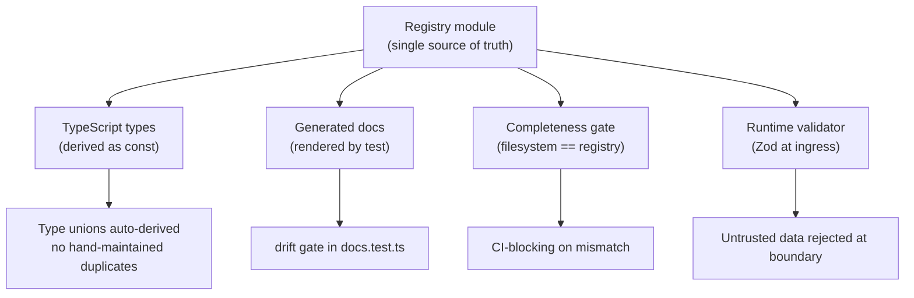
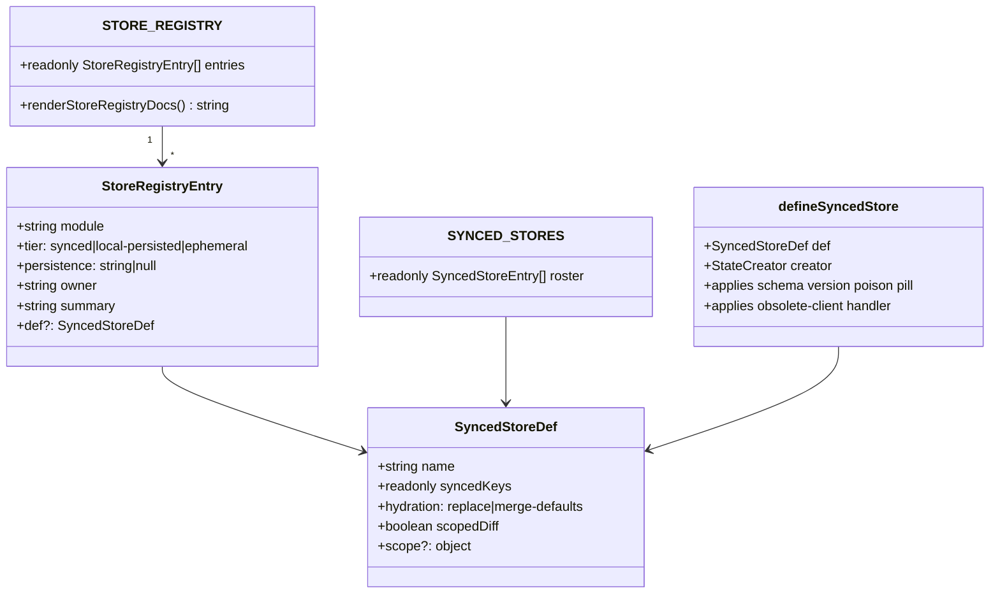
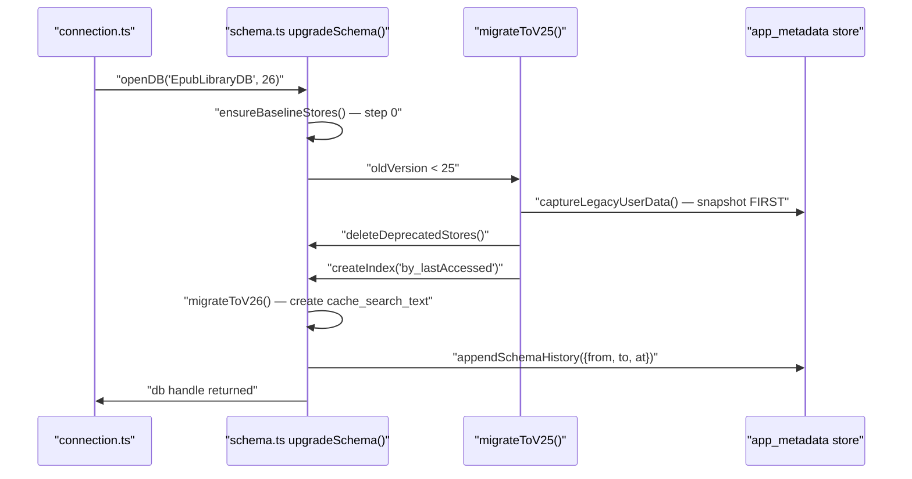
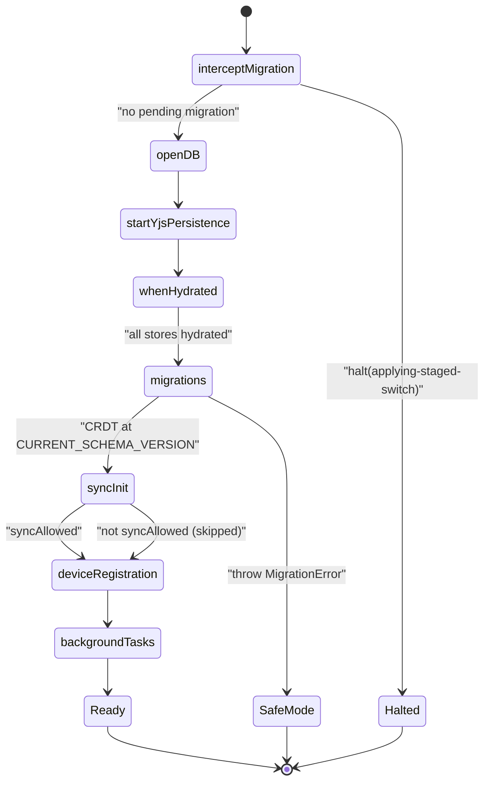
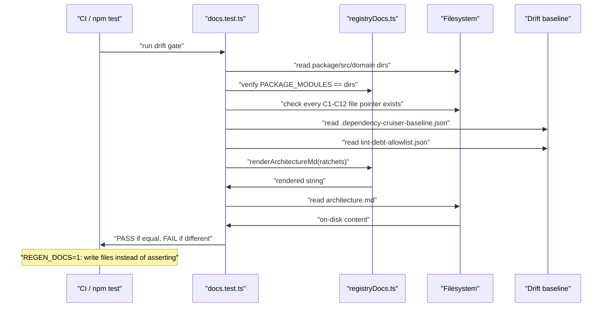
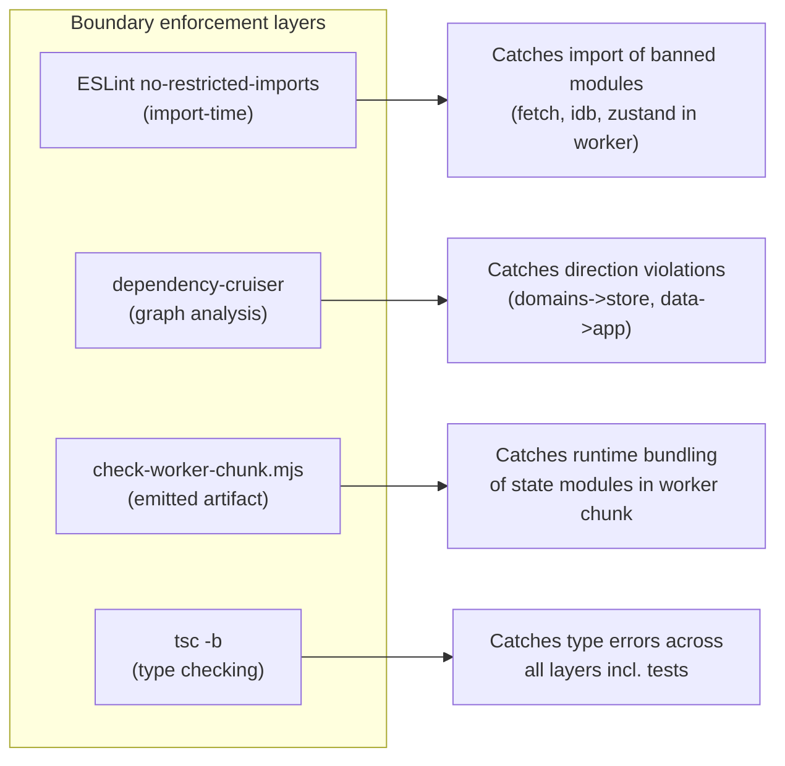

# Contract-First Registries

This document describes the architectural spine of the Versicle overhaul program: the registry pattern that governs every significant system boundary. The core thesis, stated in the proposal, is that *good boundaries already existed in the codebase, and quality was highest precisely where those boundaries were enforced.* The overhaul extends that discipline uniformly by making every contract explicit, versioned, runtime-validated with Zod, and machine-enforced in CI.

**Cross-reference:** The layering rules that give these registries force are described in [Layering and boundaries](11-layering-and-boundaries.md). How the contracts compose at startup is in [Bootstrap and lifecycle](14-bootstrap-and-lifecycle.md). The State stores the store registry governs are detailed in [State management and CRDT](13-state-management-crdt.md).

---

## Why a registry pattern?

The pre-overhaul codebase had 97 `getState()` calls inside `lib/`, 65 madge dependency cycles, `types/db.ts` importing the TTS engine (an inverted dependency arrow), five `useLibraryStore` race-regression files, and dead Zod validators that had drifted from the shapes they were meant to guard. These are all symptoms of the same underlying condition: contract violations that were invisible at development time surfaced only as production bugs.

The insight that drove the overhaul architecture is recorded in [plan/overhaul/proposals/contract-first.md](../../plan/overhaul/proposals/contract-first.md):

> Agents (and humans) write good code against contracts they cannot violate without a red CI. The overhaul therefore spends its budget making contracts *explicit, validated, versioned, and lint/CI-enforced first*, so that every subsequent internal rewrite — and every future agent iteration — is fenced.

A **registry** in Versicle's usage is a single TypeScript module that is the *one* place a set of related declarations lives. From that single source of truth, three things are derived automatically:

1. **Types** — TypeScript unions, interface constraints, and type guards are computed from `as const` arrays, eliminating divergence between declaration sites.
2. **Documentation** — human-readable README files and architecture docs are *rendered* from the registries by test-gated generators. They cannot drift because a plain `npm test` fails if they do.
3. **Enforcement** — completeness gates in the test suite assert that the registry matches the filesystem (every store module has a row; every contract file pointer exists on disk). Adding a module without a registry entry fails CI.

The twelve contracts that define the system's frozen boundaries are labeled C1 through C12. Everything **not** in that table is an implementation detail and may be rewritten freely.



---

## The contract inventory (C1–C12)

The full inventory is maintained in [src/app/docs/registryDocs.ts](../../src/app/docs/registryDocs.ts) and is rendered into [architecture.md](../../architecture.md) by the drift gate at [src/app/docs/docs.test.ts](../../src/app/docs/docs.test.ts). The twelve contracts, their home modules, and their pinning suites are defined in the `CONTRACTS` array:

```typescript
export const CONTRACTS: readonly ContractRow[] = [
  {
    id: 'C1',
    name: 'IndexedDB storage schema',
    home: ['src/data/schema.ts'],
    posture: `zod rows in src/data/rows/; append-only versioned migration registry (DB v${DB_VERSION})`,
    pinnedBy: ['src/data/migrations.test.ts', 'src/data/connection.test.ts', ...],
  },
  // ... C2 through C12
```

Every pointer in `home` and `pinnedBy` is existence-gated by `docs.test.ts` — a dead test file or moved source causes immediate CI failure. Contract ids are pinned to be exactly C1–C12 in order:

```typescript
it('contract ids are exactly C1–C12, in order', () => {
  expect(CONTRACTS.map((c) => c.id)).toEqual(
    Array.from({ length: 12 }, (_, i) => `C${i + 1}`),
  );
});
```

The table below summarizes the twelve contracts:

| Id | Contract | Home module | Runtime validation | Version surface |
|---|---|---|---|---|
| C1 | IndexedDB storage schema | [src/data/schema.ts](../../src/data/schema.ts) | Zod row schemas in `src/data/rows/` at untrusted ingress | `DB_VERSION = 26`; append-only `MIGRATIONS` registry |
| C2 | CRDT document schema | [src/store/registry.ts](../../src/store/registry.ts), [src/app/migrations.ts](../../src/app/migrations.ts) | `syncedKeys` whitelist + merge-defaults hydration; `meta` Y.Map quarantine | `CURRENT_SCHEMA_VERSION = 9` |
| C3 | Sync transport | [src/domains/sync/backend/SyncBackend.ts](../../src/domains/sync/backend/SyncBackend.ts) | Typed errors; Zod on inbound workspace metadata | `firestore.rules` versioned in-repo |
| C4 | TTS engine RPC | [src/lib/tts/engine/TtsEngine.ts](../../src/lib/tts/engine/TtsEngine.ts) | Single monotonic `PlaybackSnapshot{seq}` channel | 23 parity scenarios × 2 transports |
| C5 | TTS provider plugin | [src/lib/tts/providers/registry.ts](../../src/lib/tts/providers/registry.ts) | `ProviderDescriptor` registry; reject-only `play()` | 6 providers in `PROVIDERS as const` |
| C6 | Store/selector public API | [src/store/registry.ts](../../src/store/registry.ts) | Three declared tiers; `defineSyncedStore` seam | Generated `src/store/README.md` |
| C7 | Reader engine port | [src/domains/reader/engine/ReaderEngine.ts](../../src/domains/reader/engine/ReaderEngine.ts) | `EpubJsEngine` sole epubjs importer (lint error) | One swap-test as acceptance |
| C8 | Ingestion artifact contract | [src/lib/ingestion/sentence-extraction.ts](../../src/lib/ingestion/sentence-extraction.ts) | `extractionVersion` stamp; raw-at-rest CFI fixtures | Real-EPUB integration tests |
| C9 | External egress contract | [src/kernel/net/destinations.ts](../../src/kernel/net/destinations.ts) | `NetworkGateway.egress()` checks every call; CSP generated | `EGRESS_DESTINATIONS` array |
| C10 | Error contract | [src/types/errors.ts](../../src/types/errors.ts) | `AppError` taxonomy; append-only code namespaces | `presentError` is the one UI mapper |
| C11 | Boot contract | [src/app/bootstrap.ts](../../src/app/bootstrap.ts) | 8 phases; `halt()` for migration confirmation | `BOOT_PHASES as const` |
| C12 | Layering & worker-purity | [.dependency-cruiser.cjs](../../.dependency-cruiser.cjs) | depcruise + ESLint; emitted-chunk content test | 10 boundary rules, most at error/0 |

---

## Concrete registry implementations

### The store registry (C2 and C6)

The store registry in [src/store/registry.ts](../../src/store/registry.ts) is the canonical example of the pattern. Every Zustand store in the application — currently 22 of them — must have exactly one row in `STORE_REGISTRY`. The registry categorizes stores into three tiers:

- **`synced`** — CRDT user data replicated through the Yjs middleware into the shared Y.Doc. Created exclusively via `defineSyncedStore` (a lint-enforced seam in [src/store/yjs-provider.ts](../../src/store/yjs-provider.ts)).
- **`local-persisted`** — device-local settings via `zustand/persist` (localStorage).
- **`ephemeral`** — in-memory UI/session state; dies with the tab.

The `StoreRegistryEntry` type captures all metadata about each store:

```typescript
export interface StoreRegistryEntry {
  /** Module basename under src/store/ (also the hook name). */
  readonly module: string;
  readonly tier: StoreTier;
  /**
   * Where the data lives: the Y.Map name (synced), the zustand/persist
   * localStorage key (local-persisted), or null (ephemeral).
   */
  readonly persistence: string | null;
  /** Owning target domain (master plan §2 geography). */
  readonly owner: string;
  readonly summary: string;
  /** Synced stores carry their replication def. */
  readonly def?: SyncedStoreDef;
}
```

The nine synced stores and their Y.Map bindings are:

| Store | Y.Map | Owner | Purpose |
|---|---|---|---|
| `useBookStore` | `library` | library | Book inventory; carries `__schemaVersion` |
| `useReadingStateStore` | `progress` | reader | Reading progress per book per device |
| `useAnnotationStore` | `annotations` | reader | Highlights and notes, keyed by UUID |
| `usePreferencesStore` | `preferences.<deviceId>` | shell | Per-device display preferences |
| `useReadingListStore` | `reading-list` | library | Reading-list entries, progress projection |
| `useVocabularyStore` | `vocabulary` | chinese | Known Chinese characters |
| `useLexiconStore` | `lexicon` | audio | TTS pronunciation rules |
| `useContentAnalysisStore` | `contentAnalysis` | audio | AI analysis cache |
| `useDeviceStore` | `devices` | sync | Device registry of the sync mesh |

The six local-persisted stores use `zustand/persist` with named localStorage keys: `sync-storage`, `tts-settings`, `drive-config-storage`, `google-services-storage`, `genai-storage`, and `local-history-storage`.

The seven ephemeral stores hold session-only state: `useLibraryStore` (IDB projection), `useUIStore`, `useToastStore`, `useReaderUIStore`, `useBackNavigationStore`, `useSidebarStore`, and `useTTSPlaybackStore`.

#### The `SyncedStoreDef` type

Synced stores declare a `SyncedStoreDef` that captures their replication contract:

```typescript
export interface SyncedStoreDef<K extends string = string> {
    /** Top-level Y.Map name. FROZEN: renaming is a schema migration. */
    readonly name: string;
    /** The replication whitelist (fork option syncedKeys). */
    readonly syncedKeys: readonly K[];
    /**
     * 'merge-defaults' suppresses top-level deletes of declared defaults
     * (the D2 fix: new fields survive hydration from older docs).
     * 'replace' is the legacy wipe.
     */
    readonly hydration: 'replace' | 'merge-defaults';
    /** Per-top-level-key diffing (the D13 write-amplification fix). */
    readonly scopedDiff: boolean;
    /** Bind to a nested Y.Map (preferences fold). */
    readonly scope?: { readonly key: string };
}
```

This is a key design decision: the `syncedKeys` whitelist is what prevents ephemeral UI state from leaking into the CRDT and replicating across devices. The previous codebase had popover state syncing through the CRDT to other devices — that bug class is now structurally impossible because only explicitly whitelisted keys replicate.

#### The `defineSyncedStore` seam

Every synced store is created through exactly one function, `defineSyncedStore` in [src/store/yjs-provider.ts](../../src/store/yjs-provider.ts):

```typescript
export function defineSyncedStore<S, Mps extends ..., Mcs extends ...>(
    def: SyncedStoreDef<keyof S & string>,
    creator: StateCreator<S, Mps, Mcs>,
): StateCreator<S, Mps, Mcs> {
    return yjs(getYDoc(), def.name, creator, {
        schemaVersion: CURRENT_SCHEMA_VERSION,
        onObsolete: handleObsoleteClient,
        disableYText: true,
        syncedKeys: def.syncedKeys,
        hydration: def.hydration,
        scopedDiff: def.scopedDiff,
        scope: def.scope,
    });
}
```

This seam guarantees that every synced store gets the schema-version poison pill (`schemaVersion: CURRENT_SCHEMA_VERSION`), the obsolete-client handler, plain-string encoding (`disableYText`), and its declared replication options from the def. The raw middleware import is lint-banned outside this module — the seam is the only legal call site.



#### The completeness gate

The registry test in [src/store/__tests__/registry.test.ts](../../src/store/__tests__/registry.test.ts) performs several checks on every CI run:

```typescript
it('declares every store module under src/store/ (and nothing else)', () => {
  const declared = STORE_REGISTRY.map((e) => e.module).sort();
  expect(declared).toEqual(storeModulesOnDisk());
});
```

`storeModulesOnDisk()` reads the actual `src/store/` directory and returns every file matching `/^use[A-Z]\w*\.ts$/`. Any new store that is not in the registry fails this assertion. Any registry entry for a deleted store also fails. The registry and the filesystem are kept in exact sync.

Additional assertions verify that:
- Each module appears exactly once
- Synced rows carry a `SyncedStoreDef`; non-synced rows do not
- Synced rows reference each `SYNCED_STORE_DEFS` entry exactly once
- Persistence labels match the live Y.Map binding (with deviceId placeholdered)
- Every live store in the boot roster carries a `yjs` handle (`api.yjs`)

#### The generated README

The `renderStoreRegistryDocs()` function in the registry module renders `src/store/README.md` — a human-readable table of all stores with their tiers, Y.Map names, owners, and hydration semantics. The generated file is checked into the repository and the test gate diffs it against the freshly rendered output on every run:

```
REGEN_STORE_DOCS=1 npx vitest run src/store/__tests__/registry.test.ts
```

Under `REGEN_STORE_DOCS=1` the file is overwritten; without it, any drift between the file on disk and the registry rendering fails the test. The comment in every generated file is explicit:

```
<!-- GENERATED FILE — do not edit by hand. -->
<!-- Source: src/store/registry.ts. Regenerate with: -->
<!--   REGEN_STORE_DOCS=1 npx vitest run src/store/__tests__/registry.test.ts -->
```

---

### The IDB schema registry (C1)

The IndexedDB schema is the most critical contract in the system — a bug here can destroy user data. The schema is defined in [src/data/schema.ts](../../src/data/schema.ts) and governed by a versioned migration registry.

#### The `EpubLibraryDB` schema interface

The database is typed via the `idb` library's `DBSchema` interface. Every store, its key type, value type, and any indexes are declared in one place:

```typescript
export interface EpubLibraryDB extends DBSchema {
  // --- DOMAIN 1: STATIC (Immutable Book Content) ---
  static_manifests: { key: string; value: StaticManifestRow; };
  static_resources: { key: string; value: StaticResourceRow; };
  static_structure: { key: string; value: StaticStructureRow; };

  // --- DOMAIN 2: CACHE (Ephemeral, Regenerable) ---
  cache_audio_blobs: {
    key: string;
    value: CacheAudioBlobRow;
    indexes: { by_lastAccessed: number; };
  };
  cache_tts_preparation: {
    key: string;
    value: CacheTtsPreparationRow;
    indexes: { by_bookId: string; };
  };
  cache_search_text: { key: string; value: CacheSearchTextRow; };

  // --- DOMAIN 3: APP (Sync Infrastructure + Schema Evolution) ---
  checkpoints: {
    key: number;
    value: SyncCheckpointRow;
    indexes: { by_timestamp: number; };
  };
  app_metadata: { key: string; value: AppMetadataValue; };
  flight_snapshots: { key: string; value: FlightSnapshotRow; };
  // ...
}
```

This three-domain taxonomy (STATIC / CACHE / APP) is a fundamental organizational rule: static stores hold immutable book content, cache stores hold ephemeral/regenerable derived data, and app stores hold sync infrastructure. The classification governs backup behavior (only static survives backup), eviction policy (only cache is subject to LRU), and wipe behavior.

The current schema version is `DB_VERSION = 26` (as of Phase 7).

#### Zod row schemas as the data contract

All value types in the schema interface are derived from Zod schemas in [src/data/rows/](../../src/data/rows/). This is a deliberate design: the Zod schema is the *source of truth* for what a row looks like, and the TypeScript type is a plain alias (not `z.infer`) to avoid the implicit index signature that `z.infer` produces:

```typescript
// From src/data/rows/static.ts
export const cacheRenderMetricsRowSchema = z.looseObject({
  bookId: z.string().min(1),
  locations: z.string(),
  pageCount: z.number().optional(),
});
export type CacheRenderMetricsRow = {
  bookId: string;
  locations: string;
  pageCount?: number;
};
```

Two design choices are worth noting:

1. **`z.looseObject` at the envelope** (not `z.object`): unknown fields written by other builds pass through untouched. This is forward compatibility — a newer build writing new fields to a row will not cause an older build's validation to reject the row.
2. **Validation runs at untrusted ingress only**, never on the hot read/write path. The two untrusted ingress points are: backup restore, and the Android backup payload. Internal reads are trusted because they were always written through the same validated path.

Binary fields use a custom schema that accepts both `ArrayBuffer` (canonical, WebKit-safe) and `Blob` (legacy, from pre-normalization builds):

```typescript
export const binaryValueSchema = z.custom<ArrayBuffer | Blob>(
  (v) => v instanceof ArrayBuffer || v instanceof Blob,
  { message: 'Expected ArrayBuffer or Blob' },
);
```

#### The versioned migration registry

The migration registry is append-only. A released step's body is persisted-format surface and must never be edited. A later bug gets a later step:

```typescript
export interface IdbMigration {
  readonly toVersion: number;
  migrate(
    db: IDBPDatabase<EpubLibraryDB>,
    tx: UpgradeTransaction,
    oldVersion: number,
  ): Promise<void> | void;
}

export const MIGRATIONS: readonly IdbMigration[] = [
  { toVersion: 25, migrate: migrateToV25 },
  { toVersion: 26, migrate: migrateToV26 },
];
```

The `upgradeSchema` callback runs them sequentially, with a "step 0" baseline that ensures all current stores exist before the versioned steps run (so any pre-24 straggler converges):

```typescript
export async function upgradeSchema(db, oldVersion, newVersion, transaction) {
  ensureBaselineStores(db, transaction);       // step 0: idempotent create-if-missing
  for (const step of MIGRATIONS) {
    if (oldVersion < step.toVersion) {
      await step.migrate(db, transaction, oldVersion);
    }
  }
  await appendSchemaHistory(transaction, oldVersion, targetVersion);
}
```

The v25 migration is the most important: it implements the "straggler guard" — before deleting any legacy store, it serializes every surviving user-data store into `app_metadata['legacy-recovery-v25']`. The critical invariant, enforced by a code comment, is:

> **NEVER reorder these two**: snapshot-before-delete always precedes the deletion loop.

```typescript
async function migrateToV25(db, tx, oldVersion) {
  // 1. Snapshot-before-delete: NEVER reorder these two.
  await captureLegacyUserData(db, tx, oldVersion);
  deleteDeprecatedStores(db);

  // 2. The LRU eviction index
  const audioBlobs = tx.objectStore('cache_audio_blobs');
  if (!audioBlobs.indexNames.contains('by_lastAccessed')) {
    audioBlobs.createIndex('by_lastAccessed', 'lastAccessed');
  }
}
```

The captured recovery data is size-capped at 8 MB (`LEGACY_RECOVERY_SIZE_CAP_BYTES = 8 * 1024 * 1024`) to keep the upgrade transaction's memory bounded. Binary fields are serialized as descriptors (`{ __binary: 'ArrayBuffer', byteLength: N }`) rather than raw bytes.



---

### The boot task registry (C11)

The boot contract in [src/app/bootstrap.ts](../../src/app/bootstrap.ts) defines eight sequential boot phases:

```typescript
export const BOOT_PHASES = [
  'interceptMigration',
  'openDB',
  'startYjsPersistence',
  'whenHydrated',
  'migrations',
  'syncInit',
  'deviceRegistration',
  'backgroundTasks',
] as const;
```

The sequencer itself is subsystem-free: it only owns the registry and the phase ordering. Subsystems register tasks via [src/app/boot/registerBootTasks.ts](../../src/app/boot/registerBootTasks.ts) — the "composition manifest," the only file allowed to import subsystem boot modules.

The `BootTask` interface is deliberately minimal:

```typescript
export interface BootTask {
  /** Stable diagnostic name, `<subsystem>/<action>` */
  name: string;
  run(ctx: BootContext): void | Promise<void>;
}
```

The `BootContext` exposes the protocol a task may use:

```typescript
interface BootContext {
  setStatusMessage(message: string): void;
  syncAllowed: boolean;
  pendingMigration: PendingWorkspaceMigration | null;
  halt(reason: BootHaltReason): void;
  addCleanup(cleanup: () => void): void;
}
```

`ctx.halt()` stops the sequence after the current phase (used by the migration interceptor while a backup restore reloads the page). A thrown exception routes the boot to `SafeModeView`.

```typescript
const promise = (async (): Promise<BootResult> => {
  for (const phase of BOOT_PHASES) {
    for (const task of registry.get(phase) ?? []) {
      await task.run(ctx);
    }
    if (haltReason !== null) {
      return { status: 'halted', reason: haltReason };
    }
  }
  return { status: 'ready', pendingMigration: ctx.pendingMigration };
})();
```

The composition manifest registers all tasks and also registers wipe hooks — the data layer's `wipe.ts` cannot import the Firestore sync manager (that would invert the dependency direction), so it exposes a hook registry instead:

```typescript
registerWipeHook({
  name: 'sync/stop',
  stop: async () => {
    const { stopSyncForWipe } = await import('../sync/createSync');
    stopSyncForWipe();
  },
});
registerWipeHook({
  name: 'state/stop-yjs-persistence',
  stop: () => disconnectYjs(),
});
```

The dynamic import in the sync wipe hook is intentional: it keeps the Firebase dependency tree out of the manifest's static import graph (same posture the wipe itself had before).

The `BOOT_PHASES as const` array is imported by `registryDocs.ts` and rendered into the architecture documentation. The `Record<BootPhase, string>` type for phase notes makes coverage a compile-time property — adding a phase without a corresponding note is a TypeScript error.



---

### The settings panel registry

The settings surface in [src/app/settings/registry.ts](../../src/app/settings/registry.ts) applies the registry pattern to UI panels. Every settings tab is a `SettingsPanel` descriptor:

```typescript
export interface SettingsPanel {
  /** Route param (/settings/:tab) and Radix Tabs value. */
  id: SettingsTabId;
  /** Visible tab label — typed catalog key (i18n ADR §2). */
  labelKey: MessageKey;
  icon: LucideIcon;
  /** React.lazy source — the panel chunk loads on first activation. */
  load: () => Promise<{ default: ComponentType }>;
  /** Sidebar position (ascending). */
  order: number;
  /** Destructive-area styling (the Data Management tab). */
  danger?: boolean;
}
```

The nine registered panels are: `general` (order 10), `tts` (20), `genai` (30), `sync` (40), `devices` (50), `dictionary` (60), `recovery` (70), `diagnostics` (80), and `data` (90, danger=true).

The `labelKey: MessageKey` type is significant: labels are typed message catalog keys, not prose strings. This means a future i18n migration touches the catalog, not this registry. The `resolveSettingsTab` function handles unknown route params safely:

```typescript
export function resolveSettingsTab(param: string | undefined): SettingsTabId {
  return param && PANEL_IDS.has(param) ? (param as SettingsTabId) : DEFAULT_SETTINGS_TAB;
}
```

The `load: () => Promise<{ default: ComponentType }>` field makes panels lazy-loaded via `React.lazy`: each panel chunk loads only on first activation. Adding a settings area means adding exactly one row here plus one self-contained panel module under `./panels/` — the shell renders the whole surface from this table.

The registry is consumed by `registryDocs.ts` and rendered into `architecture.md §7`:

```typescript
const settingsRows = [...SETTINGS_PANELS]
  .sort((a, b) => a.order - b.order)
  .map((p) => [`\`${p.id}\``, String(p.order), `\`${p.labelKey}\``, p.danger ? 'yes' : '']);
```

---

### The TTS provider registry (C5)

The provider registry in [src/lib/tts/providers/registry.ts](../../src/lib/tts/providers/registry.ts) demonstrates how the pattern eliminates the class of bug where adding a new provider requires editing six hand-maintained sites. Before the overhaul, the provider id union was re-declared in `useTTSStore`, the construction switch lived in `providerFactory`, the settings UI had hardcoded items, and the capability checks used `as any`. Now there is exactly one declaration:

```typescript
export const PROVIDERS = [
    {
        id: 'webspeech',
        displayName: 'Web Speech (Local)',
        kind: 'device',
        requiresApiKey: false,
        platforms: ['web'],
        capabilities: { downloadableVoices: false, localeAware: false },
        build: () => new WebSpeechProvider(),
    },
    // ... piper, google, openai, lemonfox, capacitor
] as const satisfies readonly ProviderDescriptor[];
```

Everything else is derived from this array:

- **The id union** is derived: `type RegisteredProviderId = (typeof PROVIDERS)[number]['id']`
- **API-key provider ids**: `type TTSApiKeyProviderId = Extract<(typeof PROVIDERS)[number], { requiresApiKey: true }>['id']`
- **Settings UI choices** come from `selectableProviders(platform)`, which filters by platform and returns `ProviderOption[]`
- **Capability type guards** (`asVoiceDownloadable`, `asLocaleAware`) are descriptor-driven, not duck-typing: they look up the descriptor and check its `capabilities` field before narrowing the type

The `ProviderBuildContext` interface captures everything a provider may receive at construction — `apiKey`, `language`, and an `AudioSink`. The provider registry never reaches into stores; the caller injects what is needed. This severs the `providerFactory → useTTSStore` import cycle that existed before.

The `ProviderDescriptor.build(ctx)` function is the only construction path, eliminating the previous switch statement in `providerFactory.ts`.

The provider contract is pinned by `describeProviderContract`, a shared behavioral specification that every provider must pass. Key invariants from the contract:

- `play()` resolves when audible playback has *started*
- `play()` rejects exactly once if playback fails — never emits an `error` event for a failure it already rejected
- Speed is **always** applied at the playback sink, never in synthesis (the `P0 speed policy`): cloud providers synthesize at 1.0 always; the cache key is `hash(text|voiceId|providerId)` without speed
- `dispose()` is required; providers must not emit events after dispose

The `ProviderPlaybackError` class carries the `name = 'ProviderPlaybackError'` field explicitly because Comlink re-creates errors across the worker boundary preserving only `{message, name, stack}`. Identification goes through `e.name`, not `instanceof`.

The registry table is rendered into `architecture.md §8` by `registryDocs.ts`:

```typescript
const providerRows = (PROVIDERS as readonly ProviderDescriptor[]).map((p) => [
  `\`${p.id}\``,
  p.displayName,
  p.kind,
  p.requiresApiKey ? 'yes' : 'no',
  p.platforms ? p.platforms.join(', ') : 'all',
  [p.capabilities.downloadableVoices ? 'downloadable voices' : '',
   p.capabilities.localeAware ? 'locale-aware' : '']
    .filter(Boolean).join(', ') || '—',
]);
```

---

### The egress destination registry (C9)

The network egress registry in [src/kernel/net/destinations.ts](../../src/kernel/net/destinations.ts) is the most constrained module in the codebase. It declares every host the app may contact, with three layers of enforcement:

1. `NetworkGateway.egress(destinationId, …)` — every production fetch routes through it (raw `fetch` is lint-banned outside `src/kernel/net/`)
2. The CSP `connect-src` is generated from this registry into nginx config, vite preview headers, and `index.html`
3. The `csp.test.ts` invariant: every gateway/SDK host in the registry must appear in the generated `connect-src`

The module has a hard constraint: **no imports**. The `scripts/generate-csp.mjs` script imports this file directly under Node's type stripping, so only fully erasable TypeScript syntax is allowed (no enums, no namespaces, no parameter properties) and no path aliases.

Each destination carries metadata for both enforcement and the privacy report:

```typescript
export interface EgressDestination {
  id: DestinationId;
  hosts: readonly string[];      // exact hostnames or CSP-style *.host wildcards
  via: 'NetworkGateway' | 'sdk'; // sdk hosts feed the CSP but calls can't route through egress()
  dataClass: EgressDataClass;    // 'book-content' | 'book-derived' | 'metadata' | 'binary-asset' | 'auth'
  consent: EgressConsent;        // 'none' | 'per-book' | 'per-action' | 'oauth' | 'provider-selection'
  timeoutMs: number | null;
  offline: string;               // human-readable offline behavior description
}
```

The `DestinationId` union is append-only: `'gemini' | 'google-tts' | 'openai-tts' | 'lemonfox-tts' | 'hf-piper-catalog' | 'hf-piper-models' | 'drive' | 'google-oauth' | 'firebase'`.

---

## The drift gate and doc generation system

The documentation generation system in [src/app/docs/](../../src/app/docs/) is the mechanism by which registries become self-enforcing documentation.

### What is generated

Five files are generated from the live registries:

| Generated file | Renderer | Source registries |
|---|---|---|
| `architecture.md` | `renderArchitectureMd()` | All twelve contracts, boundary rules, boot phases, providers, stores, egress |
| `AGENTS.md` | `renderAgentsMd()` | TESTING.md local-gate table + path aliases from tsconfig |
| `src/kernel/README.md` | `renderKernelReadme()` | `KERNEL_MODULES`, `EGRESS_DESTINATIONS` |
| `src/data/README.md` | `renderDataReadme()` | `MIGRATIONS`, `DATA_MODULES`, `DATA_REPOS` |
| `src/domains/README.md` | `renderDomainsReadme()` | `DOMAIN_MODULES` |

`src/store/README.md` is generated by its own gate (`registry.test.ts` with `REGEN_STORE_DOCS=1`).

### How the drift gate works

The test in [src/app/docs/docs.test.ts](../../src/app/docs/docs.test.ts) has two responsibilities:

**Completeness:** authored maps in `registryDocs.ts` must match the filesystem. The test reads `packages/`, `src/`, `src/domains/`, `src/kernel/`, `src/data/`, and `src/data/repos/` from disk and compares them with the `PACKAGE_MODULES`, `SRC_MODULES`, etc. maps. Adding a directory without updating the registry fails:

```typescript
it('src/* directories match SRC_MODULES', () => {
  expect(Object.keys(SRC_MODULES).sort()).toEqual(dirsOf('src'));
});
```

Every file pointer in the C1–C12 table and boundary-rule table is existence-gated:

```typescript
it('every C1–C12 home and pinning pointer exists', () => {
  for (const c of CONTRACTS) {
    for (const p of [...c.home, ...c.pinnedBy]) {
      expect(existsSync(join(root, p)), `${c.id} pointer ${p}`).toBe(true);
    }
  }
});
```

**Drift:** generated files must exactly match what the registry renders:

```typescript
const expectGenerated = (relPath: string, expected: string) => {
  const abs = join(root, relPath);
  if (REGEN) writeFileSync(abs, expected);
  expect(
    readFileSync(abs, 'utf8'),
    `${relPath} drifted from the registries — run \`npm run docs:generate\``,
  ).toBe(expected);
};
```

Under `REGEN_DOCS=1` (invoked as `npm run docs:generate`) the files are overwritten. Without it, any character-level difference between disk and the registry rendering fails the test. This means generated documentation is always current by construction.

The gate also reads live ratchet counters from the committed baseline files (`.dependency-cruiser-baseline.json`, `lint-debt-allowlist.json`) and embeds them in the generated `architecture.md`, so the documentation reflects the actual current debt level.



---

## CRDT migration registry (C2)

The CRDT migration coordinator in [src/app/migrations.ts](../../src/app/migrations.ts) governs schema evolution of the Yjs document. The schema is currently at version 9 (`CURRENT_SCHEMA_VERSION = 9`).

### The migration step type

```typescript
export interface CrdtMigration {
  /** Version this step migrates FROM (runs when the doc version === from). */
  from: number;
  to: number;
  /**
   * Synchronous, deterministic, idempotent transform on Y types.
   * NO store access — the middleware picks the changes up as inbound.
   */
  migrate(doc: Y.Doc): void;
}
```

The full migration chain:

```typescript
export const CRDT_MIGRATIONS: readonly CrdtMigration[] = [
  { from: 1, to: 2, migrate: pruneInvalidReadingSessions },
  { from: 2, to: 4, migrate: () => undefined }, // pure bump (v4 = the disableYText flip)
  { from: 3, to: 4, migrate: () => undefined }, // pure bump (v3 was itself a pure bump)
  { from: 4, to: 5, migrate: backfillFontProfiles },
  { from: 5, to: 6, migrate: migrateV5toV6 },
  { from: 6, to: 7, migrate: canonicalizeVocabularyKeys },
  { from: 7, to: 8, migrate: linkReadingListEntries },
  { from: 8, to: 9, migrate: clearHusksAndRetireDualWrite },
];
```

The v5→v6 migration was the program's first substantive schema change: it deleted `annotations.popover` (ephemeral state that had leaked into the CRDT), created the `meta` Y.Map for the version authority, folded per-device preference Y.Maps, merged traditional-script vocabulary keys into simplified-canonical form, and performed the one-time reading-list `bookId` linking pass.

### Coordinator invariants

Seven invariants govern the coordinator, each reversing a numbered hazard of the legacy runner:

1. **Static imports, single call site** — invoked exactly once per boot from the `migrations` phase. No dynamic-import dodges.
2. **Reads the doc, not store state** — `readDocSchemaVersion` takes `max(meta.schemaVersion, library.__schemaVersion)` to tolerate partial dual-writes.
3. **One transaction per step, bump atomic with its transform** — the version bump executes inside the same `doc.transact` as the step's transform, so no client ever sees transformed-but-unversioned data.
4. **DOC transforms, not store setState** — steps mutate Y types directly; the middleware receives the migration as ordinary inbound traffic (`origin = MIGRATION_ORIGIN`).
5. **Loud failure** — any throw aborts the run and surfaces a `MigrationError` to the boot sequence (routed to `CriticalMigrationFailureView`).
6. **Pre-migration checkpoint** — if any step will run on a doc that holds data, a protected checkpoint is created before the first transform. Checkpoint failure aborts the migration.
7. **Cross-client safety via determinism + LWW** — transforms are deterministic and idempotent (delete-if-present, copy-if-absent, sorted iteration), so concurrent migrations by two clients converge to the same terminal state.

The `MIGRATION_ORIGIN = Symbol('versicle:migration')` tag distinguishes migration writes from store-API writes in the middleware, preventing the echo-loop guard from suppressing legitimate migration traffic.

This registry is also consumed by `registryDocs.ts` for the format-change chain table in `architecture.md §4`:

```typescript
const crdtRows = CRDT_MIGRATIONS.map((m) => [
  `v${m.from} → v${m.to}`,
  m.migrate.name && m.migrate.name !== 'migrate'
    ? `\`${m.migrate.name}\``
    : '*(pure version bump)*',
]);
```

---

## The boundary rules and their enforcement (C12)

Ten boundary rules, declared in `registryDocs.ts` as `BOUNDARY_RULES`, describe the mechanical enforcement posture. They are rendered into `architecture.md §3`. Each rule has a `level` field with one of four values:

- **`error`** — CI-blocking, zero undocumented exceptions (depcruise or ESLint rule at zero violations)
- **`error + ratchet`** — error severity with a committed baseline; the count may only decrease
- **`ratchet`** — warn severity with a frozen baseline
- **`process`** — review/test enforced

The ten rules:

| # | Rule | Level |
|---|---|---|
| 1 | `kernel/` imports nothing internal; admission = zero deps + ≥2 consumers | error |
| 2 | All IndexedDB via `data/` repos; `readwrite` + `idb` banned elsewhere | error |
| 3 | Domain services never import `store/` | error |
| 4 | Domain UI reads via published hooks; writes via services/controllers | process |
| 5 | `getState()` outside `store/`+`app/` is an error | error + ratchet |
| 6 | Worker import closure free of zustand/yjs/store | error + ratchet |
| 7 | All egress via `NetworkGateway.egress()`; CSP generated from the registry | error |
| 8 | `epubjs` only in the reader engine; singletons only in `app/`; no module-scope side effects outside bootstrap | error |
| 9 | Mock seams reachable only from the composition root behind DEV/VITE_E2E | error |
| 10 | TS project references per layer + all test code typechecked | partial |

Rule 6 has a particularly interesting enforcement mechanism. The worker chunk purity check (`scripts/check-worker-chunk.mjs`) inspects the *emitted build artifact* — the actual JavaScript bundle that ships to the worker — to verify that the `zustand`, `yjs`, and `store/**` module ids are absent. This is stronger than `import type` discipline alone (which was the previous guard) because it catches cases where a type import was used but the module's runtime code was still bundled in.

The `worker-no-state-typegraph` depcruise ratchet runs at warn severity with a baseline of 16 type-only edges. The chunk check is the hard floor that prevents any of those type edges from becoming runtime dependencies.



---

## How contracts are versioned and evolved

Every contract has a version surface, a rule governing version bumps, and a test gate that pins the current version.

**The one-in-flight rule** (master plan §4 rule 4): at most one user-data format change may be in flight at a time. The sequencing is: backup manifest v3 → CRDT v6 → IDB v25, each landing in separate phases with a stability window between.

**Append-only migration registries**: both `MIGRATIONS` (IDB) and `CRDT_MIGRATIONS` (CRDT) are append-only. A released step is persisted-format surface and must never be edited. The `migrations.test.ts` suite runs the migration chain against captured fixture databases (v18 and v24 for IDB; v1/v4/v5 doc snapshots for CRDT) to ensure historical paths still converge.

**Contract version bumps require matching suite changes**: this rule is stated in `AGENTS.md` (generated from the registry):

> A contract version bump requires a matching contract-suite change in the same PR.

The `CURRENT_SCHEMA_VERSION` constant in `yjs-provider.ts` is imported by both the middleware seam and the docs generator, ensuring the architecture documentation always reflects the live version.

**Error codes are append-only**: the `AppError` taxonomy in [src/types/errors.ts](../../src/types/errors.ts) has namespaced codes (`DB_* / SYNC_* / TTS_* / GENAI_* / DRIVE_* / INGEST_*`). The `code` union is append-only by convention — removing a code would break `presentError` mappings in older clients.

---

## Design invariants and edge cases

### The `syncedKeys` whitelist invariant

The `syncedKeys` field on `SyncedStoreDef` is a whitelist of top-level state keys that replicate to the CRDT. Keys not in the list are local-only. This is enforced by the forked `zustand-middleware-yjs` middleware. The invariant: ephemeral UI state (popover position, active panel, scroll offsets) must never appear in a store's `syncedKeys`. Violations are caught during review, but the structural protection is that incorrect keys would need to be explicitly added.

### The `hydration: 'merge-defaults'` invariant

The `merge-defaults` hydration mode suppresses top-level deletes of declared defaults during inbound Y.Doc patches. This means a new field added to a store's state shape will survive hydration from an older doc that does not have that key — the declared default is retained rather than being overwritten by the absent key from the older doc.

**Important limitation**: retention is shallow. A *present-but-empty* map value wins over a rich default, so new nested fields inside an existing synced container still need a migration backfill. This is why v4→v5 had a `backfillFontProfiles` step: `fontProfiles` was added as a nested field inside an existing container, and the `merge-defaults` protection did not cover it.

### The `write-gate` structural ban

The `write-gate.ts` in [src/data/write-gate.ts](../../src/data/write-gate.ts) uses a synchronous-callback API to make the WebKit-hang trigger unrepresentable. WebKit deadlocks when two `readwrite` IDB transactions are in flight simultaneously across contexts. The write gate serializes all writers through `navigator.locks`, which spans the main thread, the TTS worker, and other tabs.

The synchronous-callback API is the key design:

```typescript
write(stores, syncCallback)
//    ^^^^^^^^ synchronous callback, not async
```

A synchronous callback cannot `await` inside the transaction, making the forbidden intra-transaction `await` (which is WebKit hang trigger #2) structurally impossible to write. This is a contract enforced by the API shape, not by documentation.

### The composition root privilege

The file [src/app/boot/registerBootTasks.ts](../../src/app/boot/registerBootTasks.ts) is the one place in the codebase allowed to import subsystem boot modules. This is enforced by the C11 contract comment and by convention rather than a lint rule, but the architecture gate (depcruise) does enforce that the `bootstrap.ts` sequencer itself imports no subsystems. The sequencer stays pure so it can be tested in isolation.

The wipe hook pattern (`registerWipeHook`) solves an import direction problem: `src/data/wipe.ts` needs to stop the Firestore sync manager and Yjs persistence before deleting storage, but those modules live above `data/` in the dependency graph. The hook registry inverts the dependency: callers register themselves, and `wipeAllData()` iterates the registry without needing to import anything above it.

---

## Extending the system with a new registry entry

When extending any of the registries described above, the pattern is the same:

1. **Add the descriptor** to the relevant `as const` array or `StoreRegistryEntry` in the appropriate registry file
2. **Implement the seam** — for stores, this means exporting a `SyncedStoreDef` and using `defineSyncedStore`; for providers, implementing `ITTSProvider`; for settings panels, implementing a self-contained panel module under `./panels/`
3. **Run the completeness gate** — `npm test` will tell you whether the filesystem and the registry agree
4. **For docs-generating registries**: run `npm run docs:generate` to regenerate the affected documentation files
5. **For version-surface registries** (IDB schema, CRDT schema, error codes): only append, never modify existing entries; pair the change with a test that exercises the new path

The same discipline applies to removing entries: deletion of a store, provider, or settings panel must go through the registry. A deleted row with a surviving module fails the completeness gate. A surviving row with a deleted module also fails.

See [Extending the system](83-extending-the-system.md) for a comprehensive walkthrough.
