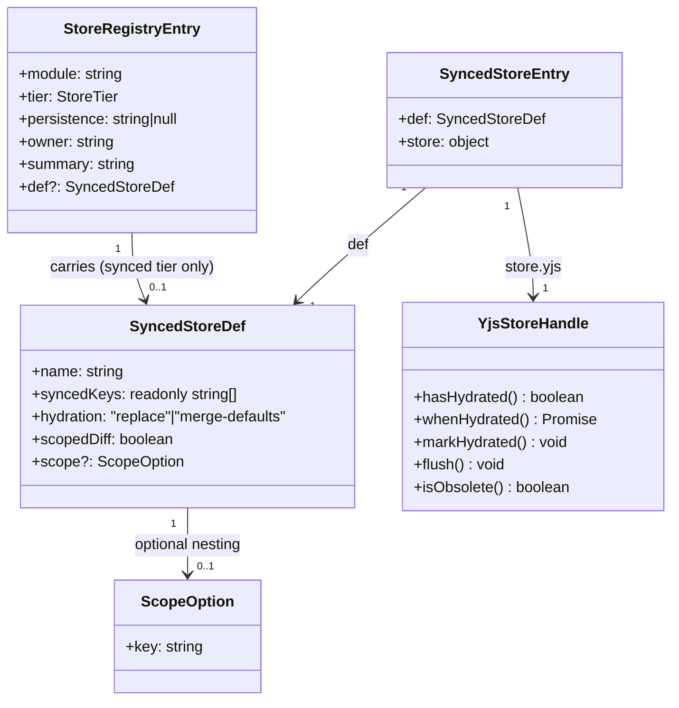
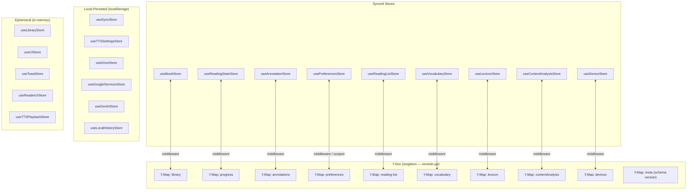
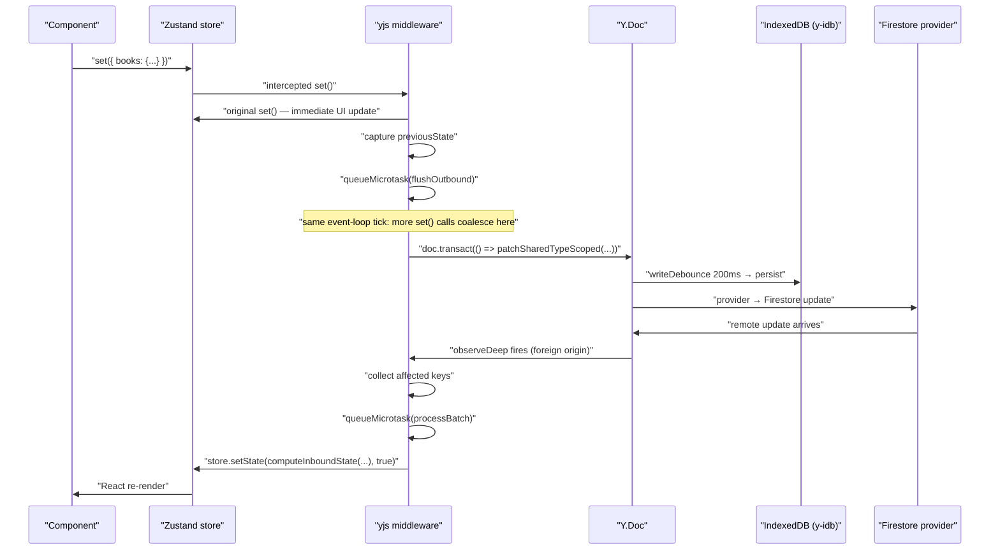
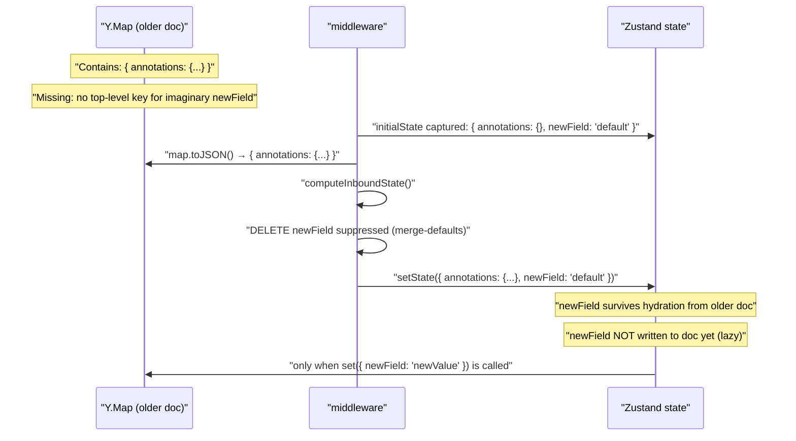
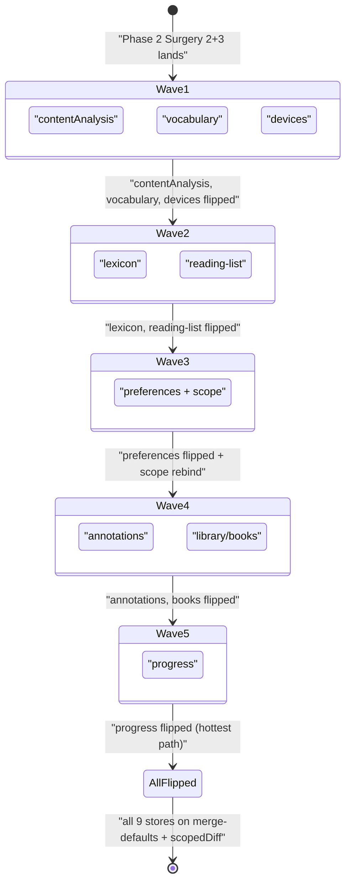
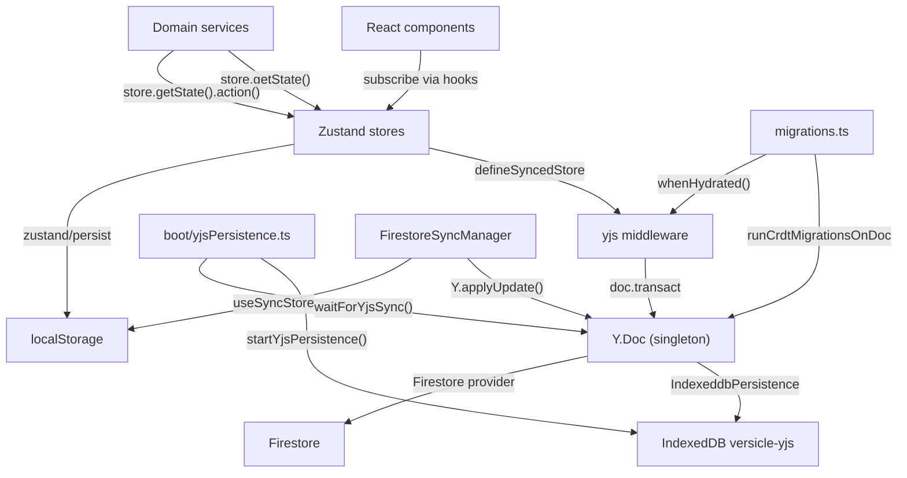

# State Management: Zustand + Yjs CRDT

Versicle is a local-first application — all user data must be readable and writable without a network connection, and must converge correctly when multiple devices reconnect after diverging offline. That constraint drives every architectural decision in the state layer.

This document covers the full state management system: the three-tier store registry, the vendored `zustand-middleware-yjs` fork that turns selected Zustand stores into CRDTs, the `defineSyncedStore` seam, the Yjs document topology, hydration semantics, the `scopedDiff` write-path optimization, and the `YjsStoreHandle` lifecycle API. Related topics: CRDT migrations live in [22-crdt-format-and-migrations.md](22-crdt-format-and-migrations.md); the Firestore sync layer that replicates the Y.Doc across devices is in [36-domain-sync.md](36-domain-sync.md); bootstrap sequencing (when persistence starts and when stores are hydrated) is in [14-bootstrap-and-lifecycle.md](14-bootstrap-and-lifecycle.md); the vendored fork's provenance is detailed in [66-vendored-forks.md](66-vendored-forks.md).

---

## Why this architecture

The simplest approach to multi-device sync is "last write wins on the whole document". That breaks as soon as two devices write different books or annotations offline — one device's changes silently disappear on reconnect. A CRDT (Conflict-free Replicated Data Type) solves this structurally: every peer maintains a copy of the document, edits are encoded as operations that can be merged in any order, and the merged result is always the same regardless of which peer applies which changes first.

Yjs is a mature CRDT library for JavaScript that uses a state-vector-based protocol to efficiently exchange only the operations each peer is missing. Versicle does not use Yjs's collaborative-text primitives (`Y.Text`) — it disables them globally via `disableYText: true` — but it uses Yjs's `Y.Map` and `Y.Doc` as the convergent container for all user data. The `zustand-middleware-yjs` fork bridges between Zustand (which React components subscribe to) and the Y.Doc (which Yjs syncs), so component code never touches Yjs directly.

The result: React components subscribe to plain Zustand stores as they always would; under the hood, every `set()` propagates into the Y.Doc, and every remote change from another device propagates back into the stores, all without components knowing.

---

## The three-tier registry

Every Zustand store in the app is declared in a single file: [src/store/registry.ts](../../src/store/registry.ts). The file defines `STORE_REGISTRY`, an array of `StoreRegistryEntry` objects, one per store, with a mandatory `tier` field:

```typescript
type StoreTier = 'synced' | 'local-persisted' | 'ephemeral';

export interface StoreRegistryEntry {
  readonly module: string;        // basename under src/store/
  readonly tier: StoreTier;
  readonly persistence: string | null; // Y.Map name, localStorage key, or null
  readonly owner: string;         // owning target domain
  readonly summary: string;
  readonly def?: SyncedStoreDef;  // synced stores only
}
```

The registry test in [src/store/__tests__/registry.test.ts](../../src/store/__tests__/registry.test.ts) asserts that every `use*Store.ts` file under `src/store/` has exactly one entry in the registry, that `local-persisted` rows match the actual `zustand/persist` `name` values by dynamically importing each store, that synced rows reference their `SyncedStoreDef`, and that `src/store/README.md` is byte-for-byte the rendered output of `renderStoreRegistryDocs()`. The README is therefore a generated artifact — never edit it by hand; run `REGEN_STORE_DOCS=1 npx vitest run src/store/__tests__/registry.test.ts` to regenerate it.



### Tier 1: Synced stores

Synced stores hold CRDT user data. Their state is mirrored into named `Y.Map`s on the singleton `Y.Doc`, persisted to IndexedDB by `y-idb`, and replicated to other devices via Firestore. All nine synced stores use the `merge-defaults` hydration mode and `scopedDiff: true` — both are Phase 2 overhaul changes explained in detail below.

| Store | Y.Map name | Owner | Synced keys | Purpose |
|---|---|---|---|---|
| `useBookStore` | `library` | library | `books` | Book inventory (per-book user data; carries `__schemaVersion`) |
| `useReadingStateStore` | `progress` | reader | `progress` | Reading progress per book per device, including reading sessions |
| `useAnnotationStore` | `annotations` | reader | `annotations` | Highlights and notes, keyed by UUID |
| `usePreferencesStore` | `preferences.<deviceId>` | shell | 14 keys (theme, fonts, layout, Chinese, AI consent) | Per-device display preferences, scoped to a nested map |
| `useReadingListStore` | `reading-list` | library | `entries` | Reading-list entries keyed by filename |
| `useVocabularyStore` | `vocabulary` | chinese | `knownCharacters` | Known Chinese characters (char → learned-at timestamp) |
| `useLexiconStore` | `lexicon` | audio | `rules`, `settings` | TTS pronunciation rules and per-book lexicon settings |
| `useContentAnalysisStore` | `contentAnalysis` | audio | `sections` | AI content-analysis cache (references, table adaptations, titles) |
| `useDeviceStore` | `devices` | sync | `devices` | Device registry of the sync mesh (UA, heartbeat, names) |

`usePreferencesStore` is the only store that uses `scope`. Its Y.Map name is `preferences`, but the actual store data lives in a nested map at `preferences.get(deviceId)`. This is the "preferences fold" introduced in schema v6, which replaced the earlier pattern of creating one top-level `Y.Doc` shared type per device (Yjs top-level shared types can never be deleted, so the old pattern accumulated permanently growing metadata).

### Tier 2: Local-persisted stores

These stores use `zustand/persist` with `localStorage` as the backend. They hold device-local settings or caches that do not need to replicate across devices.

| Store | Persist key | Owner | Purpose |
|---|---|---|---|
| `useSyncStore` | `sync-storage` | sync | Firebase config, auth status, onboarding flag |
| `useTTSSettingsStore` | `tts-settings` | audio | TTS provider/voice profiles and segmentation config |
| `useDriveStore` | `drive-config-storage` | google | Linked Drive folder and scanned file index |
| `useGoogleServicesStore` | `google-services-storage` | google | Connected Google services and OAuth client IDs |
| `useGenAIStore` | `genai-storage` | google | Gemini API key/model config, feature toggles, request logs |
| `useLocalHistoryStore` | `local-history-storage` | reader | Last-read book ID (local cache to avoid progress-map scans) |

### Tier 3: Ephemeral stores

Ephemeral stores live only in memory. They hold transient UI state or runtime-computed projections that make no sense to persist.

| Store | Owner | Purpose |
|---|---|---|
| `useLibraryStore` | library | Static-metadata projection of IndexedDB, offloaded-book set, import progress |
| `useUIStore` | shell | Global UI flags (currently just the obsolete-client lock) |
| `useToastStore` | shell | Toast notification state |
| `useReaderUIStore` | reader | Reader session UI (menus, popover, compass, reader callbacks) |
| `useBackNavigationStore` | shell | Priority-ordered back-button handler registry |
| `useSidebarStore` | reader | Which reader side panel is open |
| `useTTSPlaybackStore` | audio | Engine playback mirror and voice list (the 5b split's ephemeral half) |



---

## The shared Y.Doc singleton

All nine synced stores share a single `Y.Doc` instance. The doc is created lazily in [src/store/yjs-provider.ts](../../src/store/yjs-provider.ts):

```typescript
let doc: Y.Doc | null = null;

export function getYDoc(): Y.Doc {
    if (!doc) {
        doc = new Y.Doc();
    }
    return doc;
}
```

Lazy construction matters: importing `yjs-provider` to read `CURRENT_SCHEMA_VERSION` (as the migration coordinator does) must not create CRDT state. The singleton is accessed through `getYDoc()`, never through the module-level `doc` variable.

The persistence binding — an `IndexeddbPersistence` from the vendored `y-idb` fork — is started explicitly by the bootstrap phase `startYjsPersistence()`, not at module import time. The IDB store name is `versicle-yjs`. The write debounce is 200 ms, and all IDB writes are serialized through `runExclusiveIdbWrite` to prevent concurrent transactions from interleaving.

```typescript
persistence = new IndexeddbPersistence('versicle-yjs', getYDoc(), {
    writeDebounceMs: 200,
    transactionRunner: runExclusiveIdbWrite,
});
```

`waitForYjsSync(timeoutMs)` returns a promise that resolves when the IDB provider fires its `synced` event, or immediately if persistence is already synced or disabled. A 5-second timeout prevents the boot sequence from stalling forever if IDB is unavailable.

### Schema version constant

```typescript
export const CURRENT_SCHEMA_VERSION = 9;
```

This integer tracks the Y.Doc format version. Every increment requires: a matching `CrdtMigration` step in `src/app/migrations.ts`, fixture-matrix coverage in [src/store/__tests__/crdt-contract/migrations.test.ts](../../src/store/__tests__/crdt-contract/migrations.test.ts), and a migration design note in the comment block above the constant. The comment block in `yjs-provider.ts` narrates each version bump (v6 through v9) with their semantic changes and fleet-safety reasoning.

---

## The `defineSyncedStore` seam

Every synced store is created by wrapping its state creator with `defineSyncedStore`:

```typescript
export const useBookStore = create<BookState>()(
    defineSyncedStore(
        LIBRARY_STORE_DEF,
        (set) => ({
            __schemaVersion: 1,
            books: {},
            setBooks: (books) => set({ books }),
            // ... more actions
        })
    )
);
```

`defineSyncedStore` is the single call site for the `yjs()` middleware in production code. The lint rule `no-restricted-imports` bans direct middleware imports outside `yjs-provider.ts`, so all middleware configuration flows through this function:

```typescript
export function defineSyncedStore<S, Mps, Mcs>(
    def: SyncedStoreDef<keyof S & string>,
    creator: StateCreator<S, Mps, Mcs>,
): StateCreator<S, Mps, Mcs> {
    return yjs(getYDoc(), def.name, creator, {
        schemaVersion: CURRENT_SCHEMA_VERSION,
        onObsolete: handleObsoleteClient,
        disableYText: true,
        syncedKeys: def.syncedKeys,
        hydration: def.hydration,
        scopedDiff: def.scopedDiff,
        scope: def.scope,
    });
}
```

Every synced store consistently gets: the schema-version poison pill (`schemaVersion` + `onObsolete`), plain-string encoding (`disableYText: true` — the v4 format), and the declared replication options from its `SyncedStoreDef`.

### The `SyncedStoreDef` type

```typescript
export interface SyncedStoreDef<K extends string = string> {
    readonly name: string;           // Y.Map name — FROZEN, renaming is a migration
    readonly syncedKeys: readonly K[]; // replication whitelist
    readonly hydration: 'replace' | 'merge-defaults';
    readonly scopedDiff: boolean;
    readonly scope?: { readonly key: string }; // for nested maps (preferences fold)
}
```

Each synced store module declares and exports its own def constant (e.g., `LIBRARY_STORE_DEF`, `PROGRESS_STORE_DEF`). The registry aggregates these into `SYNCED_STORE_DEFS` and `SYNCED_STORES`. The type parameter `K` is constrained to `keyof S & string`, so a type error at store creation is the first signal of a misconfiguration — and the middleware also throws at runtime in dev mode if a `syncedKeys` entry is missing from the initial state.

---

## Inside the middleware: how sync works

The vendored `zustand-middleware-yjs` package lives at [packages/zustand-middleware-yjs](../../packages/zustand-middleware-yjs). Its source is [packages/zustand-middleware-yjs/src/index.ts](../../packages/zustand-middleware-yjs/src/index.ts). It was forked from `github:vrwarp/zustand-middleware-yjs` at commit `f2842963` (v1.3.1) and then extended with four surgeries during Phase 2 of the overhaul. The upstream was a public MIT-licensed package by Joseph R Miles; see [packages/zustand-middleware-yjs/PROVENANCE.md](../../packages/zustand-middleware-yjs/PROVENANCE.md) for the full lineage and modification log.

### The outbound path (store → Y.Doc)

When a component calls an action, e.g. `useBookStore.getState().addBook(book)`, this calls the store's `set()` function, which the middleware has intercepted:

1. The middleware's replacement `set()` calls the original Zustand `set()` immediately (optimistic update — the component re-renders at once with the new state).
2. It records `previousState` (the state before the mutation) if this is the first `set()` in the current event-loop tick.
3. It calls `scheduleOutbound(previousState)`, which queues a microtask if one is not already pending.
4. The microtask runs `flushOutbound()`, which diffs the state against the Y.Map and writes only the changes inside a `doc.transact()`.

The microtask batching means multiple `set()` calls in the same event-loop tick produce exactly one Yjs transaction. The transaction's `origin` is set to the store's `api` object, which the `observeDeep` handler uses to suppress echo (the echo-prevention check: `if (transaction.origin === api) return`).

**With `scopedDiff: true` (all production stores):** Only top-level keys whose value changed by `Object.is` between `previousState` and the current state are diffed, each against its own Y.Map subtree. This is the `patchSharedTypeScoped` path in [packages/zustand-middleware-yjs/src/patching.ts](../../packages/zustand-middleware-yjs/src/patching.ts). Non-changed keys are skipped entirely — no Y.Map serialization, no diffing.

**First flush (no `previousState`):** Falls back to the legacy full-tree diff (`patchSharedType`). This only happens on the very first `set()` before any `previousState` has been captured.

### The inbound path (Y.Doc → store)

When a remote peer's changes arrive (via IndexedDB or Firestore), Yjs fires `observeDeep` on the root map:

1. The poison pill check runs first: if `rootMap.get('__schemaVersion')` exceeds `CURRENT_SCHEMA_VERSION`, the middleware sets `isObsolete = true`, calls `handleObsoleteClient`, and returns — no further processing.
2. If the transaction's `origin` is the store's own `api`, it is the echo of a local write and is ignored.
3. With `scopedDiff: true`: the event's changed top-level key names are collected into `pendingInboundKeys`.
4. A microtask is scheduled for `processBatch()` if one is not pending.
5. `processBatch()` reads only the affected keys from the Y.Map (`dataMap.get(key)`) and calls `patchStore` with a partial map JSON.

`patchStore` calls `computeInboundState`, which diffs the current Zustand state against the incoming map JSON and calls `store.setState(result, true)` (full replacement). With `hydration: 'merge-defaults'`, top-level keys present in the store's declared defaults but absent from the incoming map are not deleted.

### The scope option (nested maps)

`usePreferencesStore` uses `scope: { key: getDeviceId() }`. The middleware creates a nested map: `doc.getMap('preferences').get(deviceId)`. The inbound path filters events: only transactions that touch `preferences.get(deviceId)` reach this store — changes to sibling devices' preference entries are ignored. The `__schemaVersion` poison pill still reads the top-level `preferences` map, not the nested one.

A new device starts from declared defaults. On first `set()`, the middleware lazily creates the nested map (`ensureDataMap()`) and writes only the changed key into it. No legacy per-device top-level shared types are created.



---

## Hydration: `merge-defaults`

All nine synced stores use `hydration: 'merge-defaults'`. This is Phase 2 Surgery 2 of the overhaul, fixing finding D2 from [plan/overhaul/analysis/state-stores.md](../../plan/overhaul/analysis/state-stores.md):

> Inbound hydration deletes any state key missing from the Y.Map — new fields can't be added safely.

Under the legacy `'replace'` mode, the inbound patch treated the Y.Map JSON as the complete truth. Any key declared in the store's initial state but absent from the map was deleted. This meant that adding a field to a synced store's type silently broke all existing users until a migration backfilled the key. The v4→v5 migration existed entirely because of this — it added `fontProfiles` to the preferences map since hydration would otherwise delete the initial default.

Under `'merge-defaults'`, the middleware captures the store's declared defaults (the non-function keys of the initial state returned by the state creator) before any patching runs:

```typescript
const declaredDefaultKeys: ReadonlySet<string> | undefined =
  options?.hydration === "merge-defaults"
    ? new Set(
        Object.entries(initialState as Record<string, unknown>)
          .filter(([, value]) => (value instanceof Function) === false)
          .map(([key]) => key)
      )
    : undefined;
```

An inbound `DELETE` change for a key in this set is suppressed in `patchState`. Everything else — inserts, updates, nested deletes inside a present key — applies unchanged.

**Shallow semantics:** The retention is top-level-key-presence-based. A map key that exists but is "poorer" than the default (e.g., an empty object `{}` where the default is a rich record) still wins. This means new nested fields inside an existing synced container still require a migration backfill. The v4→v5 `fontProfiles` pattern documents this: the default `fontProfiles` value is retained when the map has no `fontProfiles` key at all, but once any value for `fontProfiles` is present in the map, the default is not merged in.

**Lazy backfill:** A retained default is not written back to the doc until something actually calls `set()` with that key. This is "lazy backfill" — the doc remains sparse until the user takes an action.



---

## `syncedKeys`: the replication whitelist

Before Phase 2 Surgery 1, every non-function key in a synced store was mirrored into the Y.Map. This caused bug D1 from the analysis: ephemeral popover UI state (screen coordinates, open/close state) was syncing through the CRDT to all devices, causing phantom popovers to appear on other screens.

`syncedKeys` fixes this by declaring an explicit replication whitelist on `SyncedStoreDef`. The middleware enforces it in both directions:

**Outbound:** Only listed keys are inserted, updated, or deleted in the Y.Map. A non-listed state key can never reach the doc. A key removed from `syncedKeys` (but still in the Y.Map from an older version) is a "resurrection guard" — it can never be written back, and only a migration can remove it from the doc.

**Inbound:** A foreign map key (present in the Y.Map but not in `syncedKeys`) is never inserted into Zustand state. A non-listed local key is never touched by remote updates.

`__schemaVersion` is implicitly synced whenever `schemaVersion` is set — the poison pill read and the migration dual-write both depend on this key reaching both the doc and store state. Stores do not need to list it in `syncedKeys`.

Dev-mode validation at store creation throws loudly if a `syncedKeys` entry is absent from the initial state (likely a typo) or if it maps to a function (functions are never replicated):

```typescript
options.syncedKeys.forEach((key) => {
    if (!(key in initialRecord)) {
        throw new Error(
            `[zustand-middleware-yjs] syncedKeys entry "${key}" is not a key ` +
            `of the initial state of store "${name}".`
        );
    }
    if (initialRecord[key] instanceof Function) {
        throw new Error(
            `[zustand-middleware-yjs] syncedKeys entry "${key}" of store ` +
            `"${name}" is a function. Functions are never replicated; remove it from syncedKeys.`
        );
    }
});
```

---

## `scopedDiff`: per-key write optimization

Phase 2 Surgery 3 fixes finding D13 from the analysis:

> Outbound flush diffs the entire map JSON vs entire store state on every batched `set()`. `progress` holds up to 500 readingSessions × device × book, and every page turn runs a full diff of the whole progress tree.

With `scopedDiff: true`, the outbound path compares `previousState` (the batch-start snapshot) and `currentState` with `Object.is` for each top-level key. Only keys that changed by reference are diffed, and each is diffed only against its own subtree in the Y.Map. The implementation is `patchSharedTypeScoped` in [packages/zustand-middleware-yjs/src/patching.ts](../../packages/zustand-middleware-yjs/src/patching.ts):

```typescript
export const patchSharedTypeScoped = (
  sharedType: Y.Map<any>,
  newState: any,
  previousState: any,
  options?: SharedTypePatchOptions
): void => {
  // Union of keys from both states
  const keys = new Set([...Object.keys(prevRecord), ...Object.keys(newRecord)]);

  keys.forEach((key) => {
    if (options?.syncedKeys !== undefined && !options.syncedKeys.has(key)) return;
    // Object.is fast path: skip if reference-equal and presence unchanged
    if (!presenceChanged && Object.is(prevValue, nextValue)) return;

    // Single-key records confined to this key's subtree
    applyChangesToSharedType(sharedType, getChanges(a, b), b, { ... });
  });
};
```

On the inbound side, `scopedDiff` collects the top-level keys named by the batch's Yjs events. `processBatch` reads only those keys from the Y.Map and patches only those keys into the store, so untouched keys keep their JavaScript object identity (critical for React memoization downstream).

**The divergence tripwire:** `scopedDiff` is sound only when stores follow Zustand's immutable-update convention (every `set()` returns a new object). A mutate-in-place write would produce the same object reference before and after, so `Object.is` would see no change, and the Y.Map would drift from the store silently. The middleware defends against this in dev mode via `assertScopedDiffConvergence`, called with a 2% sampling rate (`__scopedDiffDevSampling.rate = 0.02`) after every scoped flush:

```typescript
if (isDevEnvironment() && Math.random() < __scopedDiffDevSampling.rate) {
    const dataMap = getDataMap();
    if (dataMap !== undefined)
        assertScopedDiffConvergence(dataMap, api.getState(), syncedKeySet);
}
```

`assertScopedDiffConvergence` runs a full state-vs-map diff and throws a loud error if it finds any `UPDATE` or `PENDING` residuals (which would indicate drift). Tests pin `__scopedDiffDevSampling.rate = 1` (always) to make this deterministic, and the contract suite includes a fast-check property proving scoped ≡ full across concurrent two-doc merges.

The store-flips test in [src/store/__tests__/crdt-contract/store-flips.test.ts](../../src/store/__tests__/crdt-contract/store-flips.test.ts) verifies that a page-turn `set()` on `useReadingStateStore` produces a scoped transaction touching only the changed book's subtree:

```typescript
it('D.5 in-repo: a page-turn set() produces a SCOPED transaction', async () => {
    // ...
    expect(toJSONInstances).not.toContain(rootMap);
    for (const path of eventPaths) {
        expect(path.slice(0, 2)).toEqual(['progress', BOOK_EN]);
    }
});
```

---

## The `YjsStoreHandle` lifecycle API

The middleware attaches a `YjsStoreHandle` to each synced store as `api.yjs`, modeled on `zustand/persist`'s `api.persist`. This is Phase 2 Surgery 4. The interface:

```typescript
export interface YjsStoreHandle {
  hasHydrated(): boolean;
  whenHydrated(): Promise<void>;
  markHydrated(): void;
  flush(): void;
  isObsolete(): boolean;
}
```

Hydration resolves via one of three sources (whichever fires first):

- **Source (a):** The data map was non-empty at store creation — the synchronous initial patch at module init immediately marks the store hydrated.
- **Source (b):** The first applied inbound `processBatch` — a real inbound patch from IndexedDB or Firestore marks the store hydrated.
- **Source (c):** `api.yjs.markHydrated()` — called by the boot coordinator for stores whose Y.Map is legitimately empty (the IDB sync completed but the map has no data, so no inbound patch will ever arrive).

`whenHydrated()` resolves strictly after the hydrating `setState` returns, so any awaiting caller observes the fully hydrated state. This is the structural replacement for the pre-Phase 2 nested `queueMicrotask` hack that had to outrace the middleware's own microtask.

The boot coordinator uses `syncedDataMapIsEmpty(doc, def)` from the registry to identify stores with empty maps:

```typescript
export function syncedDataMapIsEmpty(doc: Y.Doc, def: SyncedStoreDef): boolean {
  const root = doc.getMap(def.name);
  if (def.scope === undefined) return root.size === 0;
  const child = root.get(def.scope.key);
  return !(child instanceof Y.Map) || child.size === 0;
}
```

The accessor `yjsHandleOf(store)` from the registry returns `undefined` when the store is a test mock without the middleware augmentation, allowing boot code to handle test environments gracefully.

`flush()` drains the pending outbound microtask synchronously. Tests use this to avoid `await`-ing microtask queues. The flag guard (`if (isOutboundPending) flushOutbound()`) prevents a stale scheduled microtask from double-running after a manual flush.

---

## The schema-version poison pill

Each synced store's `observeDeep` handler checks for an obsolete schema version before processing any inbound data:

```typescript
if (options?.schemaVersion !== undefined) {
    const incomingVersion = (rootMap.get('__schemaVersion') as number | undefined) || 0;
    if (incomingVersion > options.schemaVersion) {
        isObsolete = true;
        options.onObsolete?.(incomingVersion);
        return;
    }
}
```

Once `isObsolete` is set, the store permanently stops processing both inbound and outbound transactions. This prevents an old client from corrupting upgraded data structures.

`handleObsoleteClient` in `yjs-provider.ts` owns two responsibilities: announcing the quarantine on the typed sync event bus (`getSyncEventBus().emit({ type: 'obsolete', incomingVersion })`), which causes the sync manager subscriber to destroy the live provider connection and stop the device heartbeat; and locking the UI (`useUIStore.getState().setObsoleteLock(true)`). The UI import is lazy (`import('./useUIStore')`) to avoid circular deps at module init — `useUIStore` has no dependencies at all, so this is more caution than necessity after the overhaul.

The `__schemaVersion` key always reads from the **top-level named map** (`rootMap`), not from the scoped nested map. This means the poison pill fires correctly even for stores like `usePreferencesStore` that use `scope` — the schema version in the `preferences` top-level map is authoritative for quarantine purposes, regardless of which device's sub-map the store is bound to.

---

## The diff engine

The diff engine lives in [packages/zustand-middleware-yjs/src/diff.ts](../../packages/zustand-middleware-yjs/src/diff.ts). It computes a `Change[]` list — a minimal edit script transforming one value into another.

```typescript
export enum ChangeType {
  NONE = "none",
  INSERT = "insert",
  UPDATE = "update",
  DELETE = "delete",
  PENDING = "pending",   // recursive: value is a nested Change[]
}

export type Change = [ChangeType, string | number, any];
```

The algorithm dispatches on type:

- **Records (objects):** `getRecordChanges` — for each key in `a` not in `b`, emit `DELETE`; for each key in `b` not in `a`, emit `INSERT`; for keys in both, if the values are the same type and diffable, emit `PENDING` with a recursive diff; otherwise emit `UPDATE`.
- **Arrays:** Windowed lookahead (window size 10) to detect insertions and deletions with limited reorder detection. Falls back to `UPDATE` or `PENDING` when no match is found within the window.
- **Strings:** Wu et al. O(NP) text diff (since Versicle uses `disableYText: true`, string diffing is rarely exercised in practice, but the algorithm is correct for plain-string values).

`applyChangesToSharedType` in `patching.ts` applies the `Change[]` to a Yjs shared type, recursing into `Y.Map` and `Y.Array` for `PENDING` changes. String values are stored as plain strings (since `disableYText: true` is always on), and nested objects/arrays become nested `Y.Map`/`Y.Array`.

---

## Store-by-store deep dive: synced stores

### `useBookStore` — the library inventory

Y.Map: `library`. Synced keys: `books`. The `books` field is a `Record<bookId, UserInventoryItem>`. Schema version marker `__schemaVersion` is implicitly synced (the middleware's poison pill and migration coordinator dual-write read/write it).

```typescript
export const LIBRARY_STORE_DEF: SyncedStoreDef<'books'> = {
    name: 'library',
    syncedKeys: ['books'],
    hydration: 'merge-defaults',
    scopedDiff: true,
};
```

Actions: `setBooks`, `updateBook`, `removeBook`, `addBook`, `addBooks`. All follow strict immutable-update patterns (spreading old state with new values, no in-place mutation).

The store was flipped to `merge-defaults + scopedDiff` last among the four stores in flip wave 4 because of its high criticality. The four `state.books || {}` defensive fallbacks in the pre-flip codebase were deleted as canaries — if any remained, they would indicate missed hydration behavior.

### `useReadingStateStore` — reading progress

Y.Map: `progress`. Synced keys: `progress`. The `progress` field has shape `Record<bookId, Record<deviceId, UserProgress>>`.

This double-keying — book then device — is the app's most important data-model decision. Each device writes only its own `progress[bookId][deviceId]` entry; different devices never overwrite each other's progress. The CRDT merges the per-device sub-maps additively, so no progress is ever lost on reconnect.

`UserProgress` contains: `bookId`, `currentCfi` (the current reading position as an EPUB CFI string), `percentage`, `lastRead`, `completedRanges` (sorted, merged CFI ranges of pages actually read), `readingSessions` (capped at `MAX_READING_SESSIONS = 500`, pruned to `HISTORY_PRUNE_SIZE = 200` when exceeded), `lastPlayedCfi` (TTS position), `currentQueueIndex`, `currentSectionIndex`.

Progress resolution (`getProgress`, `useBookProgress` hook): local device first (if `percentage > 0.005`), then most-recent valid across all devices, then local as a final fallback. The `useBookProgress` selector inlines this logic in a selector function rather than calling `getProgress()` (which uses the store's `get()` closure and does not reactively update).

This store was flipped last in flip wave 5 — it is the hottest write path (every page turn) and was verified against `selectors.perf.test.ts` before the flip.

### `useAnnotationStore` — highlights and notes

Y.Map: `annotations`. Synced keys: `annotations`. The `annotations` field is `Record<uuid, UserAnnotation>`.

An older version of this store synced ephemeral popover coordinates (bug D1). The popover state moved to `useReaderUIStore` (ephemeral). The stale `popover` key was removed from `syncedKeys`, so it is structurally excluded from both inbound and outbound sync regardless of what old docs contain. A v6 CRDT migration pruned the popover husk from existing documents.

### `usePreferencesStore` — per-device display preferences

Y.Map: `preferences`, scope: `getDeviceId()`. This is the only scoped store. The preference data lives in `preferences.get(deviceId)`, a nested `Y.Map`.

Synced keys: `currentTheme`, `customTheme`, `fontFamily`, `lineHeight`, `fontSize`, `shouldForceFont`, `readerViewMode`, `libraryLayout`, `libraryFilterMode`, `librarySortOrder`, `fontProfiles`, `forceTraditionalChinese`, `showPinyin`, `pinyinSize`, `aiConsent` (14 keys total; `activeContext` was removed in Phase 8 when settings became route state).

The scope fold was introduced in schema v6 to replace the old pattern of `preferences/<deviceId>` as a top-level Y.Doc shared type per device. The old pattern created permanent, undeletable shared types accumulating forever (Yjs top-level shared types cannot be removed from a doc). The new pattern makes each device's preferences a deletable entry in the single `preferences` map.

### `useLexiconStore` — TTS pronunciation rules

Y.Map: `lexicon`. Synced keys: `rules`, `settings`. Two keys, both records. `rules` is a flat map of UUID → `LexiconRule` (pronunciation substitution rules for TTS). `settings` is per-book Bible lexicon configuration.

This is the only store with two synced keys. The `merge-defaults` hydration means a doc containing only `rules` (with no `settings` key) correctly retains the default empty `settings` map.

### `useContentAnalysisStore` — AI analysis cache

Y.Map: `contentAnalysis`. Synced keys: `sections`. The `sections` field is a flat record keyed by `${bookId}/${sectionId}`. Values are `SectionAnalysis` objects containing CFI references, table adaptations, AI-generated section titles, and analysis status.

This store holds AI-expensive computations (Gemini API calls) that are synced across devices so the analysis only runs once per user, not once per device. It was flipped in flip wave 1 (lowest data criticality — worst case is re-running analysis) and its seven `state.sections || {}` defensive fallbacks were deleted as canaries.

### `useDeviceStore` — device registry

Y.Map: `devices`. Synced keys: `devices`. The `devices` field is `Record<deviceId, DeviceInfo>` where `DeviceInfo` includes parsed user-agent data, app version, timestamps, and a user-editable name.

The store self-heals: `registerCurrentDevice` runs every boot, so a missing or stale device entry is recreated automatically. The 5-minute heartbeat throttle (`HEARTBEAT_THROTTLE_MS = 5 * 60 * 1000`) prevents constant CRDT writes from the background heartbeat.

---

## Store-by-store deep dive: local-persisted stores

### `useSyncStore`

Persist key: `sync-storage`. Holds Firebase project configuration (API key, project ID, etc.), auth status, onboarding flag, active workspace ID, and last sync timestamp. The `partialize` function explicitly lists persisted fields to exclude runtime-only status fields (`firestoreStatus`, `firebaseAuthStatus`, `firebaseUserEmail`) from localStorage.

### `useTTSSettingsStore`

Persist key: `tts-settings`. This is the persisted half of the 5b split of the legacy `tts-storage` god store. It holds per-language TTS profiles (voice ID, rate, minimum sentence length), the active provider ID, API keys for cloud TTS providers, and sentence segmentation configuration. It has zero engine imports — engine synchronization is the `TtsController`'s job. See [32-domain-audio-tts-engine.md](32-domain-audio-tts-engine.md) and [33-tts-providers-and-platform.md](33-tts-providers-and-platform.md) for the full TTS architecture.

---

## Store-by-store deep dive: ephemeral stores

### `useLibraryStore` — static metadata projection

This store holds the runtime library view: `staticMetadata` (title, author, cover URL from `static_manifests` in IDB), `offloadedBookIds` (books whose binary content is not locally present), import progress flags, and error state. It is the projection port written to by `LibraryService`. Components never call library workflows directly — they go through the controller which delegates to the service domain.

### `useTTSPlaybackStore` — engine mirror

The ephemeral half of the 5b split. Written exclusively by `TtsController.initialize()`'s subscription to the engine's `PlaybackSnapshot` stream. Contains: `status`, `isPlaying`, `activeCfi`, `currentIndex`, `queue`, `lastError`, `engineReady`, `voices`, `voice`, and download progress for Piper model downloads. Never persisted, never replicated into the worker. By keeping playback state here and settings in `useTTSSettingsStore`, the per-sentence echo loop bug (S6) is dead by construction.

---

## The derived store: `libraryViewStore`

[src/store/libraryViewStore.ts](../../src/store/libraryViewStore.ts) is a derived store created with plain `create()` (no middleware). It recomputes the library view model off-render by subscribing to four source stores: `useBookStore`, `useLibraryStore`, `useReadingStateStore`, `useReadingListStore`. This replaced the old `selectors.ts` render-time module-level mutable cache that required 12 `eslint-disable react-hooks/immutability` pragmas and was non-trivially fragile.

The derived `LibraryBook` type extends `UserInventoryItem` with view-specific fields:

```typescript
export interface LibraryBook extends UserInventoryItem {
  id: string;          // alias of bookId
  isOffloaded: boolean;
  progress: number;    // resolved (Local Priority > Global Recent)
  currentCfi?: string;
  lastRead: number;
  allProgress?: Record<string, UserProgress>;
  readingListEntry?: ReadingListEntry;
}
```

Reading-list join order (Phase 7 §D): the `bookId` FK written at registration time wins; exact `sourceFilename` next; fuzzy title+author key last (the fallback for pre-linking entries).

---

## The flip wave ledger

All nine synced stores were migrated from the legacy `hydration: 'replace'` to `hydration: 'merge-defaults'` and from `scopedDiff: false` to `scopedDiff: true` in a specific order, documented in `phase2-fork-surgery.md §2.6`. The order reflects increasing data criticality — the lowest-risk stores first, to prove the pattern before applying it to the hottest paths:

1. **Wave 1:** `contentAnalysis`, `vocabulary`, `devices` — regenerable cache, tiny data, self-healing. Seven `|| {}` fallbacks in contentAnalysis deleted as canaries.
2. **Wave 2:** `lexicon`, `reading-list` — small user data, self-healing projection. Four reading-list `|| {}` fallbacks deleted.
3. **Wave 3:** `preferences` — also flipped to `scope: { key: getDeviceId() }` for the preferences fold. Zero consumer call sites changed (the flat state shape is unchanged; only the map depth changed).
4. **Wave 4:** `annotations`, `library/books` — real user data but single keys. Annotations canaries: the store already assumed `annotations` present so the flip was strictly risk-reducing. Books canaries: four `state.books || {}` fallbacks deleted.
5. **Wave 5:** `progress` — the hottest write path (every page turn). Flipped last. The only deleted canary was `selectors.ts`'s `progressMapRaw || {}` memo; per-book `state.progress[bookId] || {}` guards in actions are KEPT (they guard a legitimately absent book, not a hydration failure).



---

## Invariants and edge cases

### Immutable updates are required for `scopedDiff`

Every `set()` call on a synced store must return a new object for changed top-level keys. In-place mutation (`state.books[id] = value; set(state)`) makes `previousState` and `currentState` reference the same object, so `Object.is` sees no change, and the Y.Map drifts from the store silently. The DEV sampling tripwire (`assertScopedDiffConvergence`) fires loudly on the next divergent flush, but only for 2% of flushes in production.

### Top-level key removal is a migration concern

Removing a key from `syncedKeys` stops it from being written or hydrated, but any existing value in the Y.Map remains there until a migration cleans it up. Old clients that still list the key in `syncedKeys` will continue to write it (resurrection guard only protects the direction: the new client won't write it, but the old client will). This is why the `activeContext` key (removed from `usePreferencesStore.syncedKeys` in Phase 8) is accompanied by a v9 husk-clearing migration.

### New nested fields inside an existing synced container need migration backfill

`merge-defaults` retains a top-level key if it is absent from the doc. But if the key is present with an "older" value (missing a new nested field), the old value wins. Adding `newNestedField` to `UserAnnotation` (which lives inside the `annotations` top-level record) requires a migration to backfill the new field into existing annotation entries — `merge-defaults` does not help here.

### Deliberate top-level key deletion is a migration concern

If you want to remove a top-level synced key permanently (not just stop writing it), you must: (1) remove it from `syncedKeys` and the initial state defaults, (2) bump the schema version, and (3) add a migration step that calls `map.delete(key)` on the relevant Y.Map. Without the migration, old docs retain the stale value and it can never reach stores on new clients.

### Concurrent writers converge correctly

The per-device progress structure (`bookId → deviceId → UserProgress`) means two devices writing their own progress never conflict — each writes a disjoint key. Annotations use UUID keys generated with `generateSecureId()` (cryptographically random), so concurrent annotation creates on different devices produce different keys and merge additively. Preferences use scoped maps per device — no cross-device conflicts possible by construction.

The one LWW (last-write-wins) scenario is when two devices update the same key in the same Y.Map without device scoping (e.g., a book's title in the `library` map). Yjs applies LWW semantics on concurrent map entries (the entry with the higher logical timestamp in the CRDT wins). This is acceptable for the library inventory because book metadata is either device-local (from the file the user imported) or authoritative (from a shared library source).

---

## Error and failure modes

### `handleObsoleteClient` — schema mismatch

When a synced store detects a `__schemaVersion` in the Y.Map greater than `CURRENT_SCHEMA_VERSION = 9`, it calls `handleObsoleteClient(incomingVersion)`. This: emits `{ type: 'obsolete', incomingVersion }` on the sync event bus (which the `wireSyncEvents` subscriber handles by destroying the provider connection and stopping the device heartbeat), and sets `useUIStore.getState().setObsoleteLock(true)` (which locks the UI behind an upgrade prompt). The `isObsolete` flag prevents any further inbound or outbound sync on that store permanently.

### Y.Doc persistence failure

If `IndexeddbPersistence` construction throws (e.g., IDB not available), the error is caught and logged, and the app continues in memory-only mode. `waitForYjsSync` resolves immediately when `persistence` is null. The app is fully functional without persistence, but changes are lost on reload.

### Store hydration timeout

The `whenHydrated()` promise for a store with a non-empty Y.Map resolves immediately at creation time (source a). For stores with an empty map, it resolves when `markHydrated()` is called by the boot coordinator after IDB sync completes. There is no inherent timeout on `whenHydrated()` — the timeout sits at the boot level (`waitForYjsSync` with its 5-second timeout gate).

---

## Relationship to other subsystems



**Bootstrap and lifecycle:** `startYjsPersistence()` is called exclusively from `src/app/boot/yjsPersistence.ts` — it must not be called at module init. The migration coordinator awaits `whenHydrated()` on all stores before running migrations. See [14-bootstrap-and-lifecycle.md](14-bootstrap-and-lifecycle.md).

**CRDT format and migrations:** The migration coordinator in `src/app/migrations.ts` transforms the Y.Doc directly (not through store actions). Schema version bumps are atomic Yjs transactions. See [22-crdt-format-and-migrations.md](22-crdt-format-and-migrations.md).

**Sync domain:** `FirestoreSyncManager` calls `Y.applyUpdate(getYDoc(), remoteUpdate)` to apply received Firestore updates. The `__schemaVersion` check in the middleware then fires on the next `observeDeep` cycle. See [36-domain-sync.md](36-domain-sync.md).

**TTS engine:** `useTTSSettingsStore` (persisted, no engine imports) and `useTTSPlaybackStore` (ephemeral mirror) are the 5b split. The engine worker does not import any store — it communicates through a typed Comlink bridge. See [32-domain-audio-tts-engine.md](32-domain-audio-tts-engine.md).

**Architecture overview:** The store layer is the "state" tier in the layered architecture described in [11-layering-and-boundaries.md](11-layering-and-boundaries.md). The contract-first design of `SyncedStoreDef` connects to [12-contract-first-registry.md](12-contract-first-registry.md).

---

## Testing the store layer

### Contract suite (the fork)

The contract suite lives at [packages/zustand-middleware-yjs/test/contract/](../../packages/zustand-middleware-yjs/test/contract/). It covers:

- `hydration.test.ts` — Cases A.1–A.6: legacy `'replace'` behavior pinned (A.5: a doc missing a key deletes the default under replace mode).
- `merge-defaults.test.ts` — Cases C.1–C.8: `merge-defaults` retains declared defaults; nested deletes still propagate; lazy backfill (C.7) is pinned.
- `scoped-diff.test.ts` — Cases D.1–D.6: scoped ≡ full; first-flush fallback; referential stability of untouched keys (D.4); in-repo scoped-transaction confinement pinned (D.5).
- `synced-keys.test.ts` — Cases B.1–B.6: whitelist enforcement; resurrection guard; implicit `__schemaVersion`.
- `echo-prevention.test.ts` — Local-origin transactions do not re-enter the store.
- `hydration-api.test.ts` — Cases E.1–E.4: `whenHydrated()` ordering; `flush()` drains synchronously; `markHydrated()` idempotency.
- `scope.test.ts` — Scope binding; sibling isolation; lazy map creation.

### Per-store flip suite

[src/store/__tests__/crdt-contract/store-flips.test.ts](../../src/store/__tests__/crdt-contract/store-flips.test.ts) runs each store's ACTUAL flip state through the fixture matrix. Mirror stores replicate `defineSyncedStore`'s wiring against per-fixture docs; flipping a store's def immediately changes what this suite expects. It documents flip waves 1 through 5 and pins that deleted canaries (`|| {}` fallbacks) are genuinely not needed after each flip.

### Registry completeness test

[src/store/__tests__/registry.test.ts](../../src/store/__tests__/registry.test.ts) asserts the registry is complete and self-consistent. Adding a new store without touching the registry causes this test to fail immediately.

### Fixture docs

Binary `v{n}.update.bin` fixture documents at `src/test/fixtures/ydoc/` represent the Y.Doc state at each schema version. Migration tests use these to verify v1/v2/v4/v5/v6/v7/v8 → v9 terminate in canonically-equal doc JSON. See [22-crdt-format-and-migrations.md](22-crdt-format-and-migrations.md) for how fixtures are created and used.

---

## Extending the system: adding a new synced store

1. Create `src/store/useMyStore.ts`. Export the store and its `SyncedStoreDef` constant (e.g. `MY_STORE_DEF`).
2. Define the def: choose a stable Y.Map name (never rename it later without a migration), list only the state keys you want to replicate in `syncedKeys`, and set `hydration: 'merge-defaults'` and `scopedDiff: true` for all new stores.
3. Create the store using `defineSyncedStore(MY_STORE_DEF, creator)`.
4. Register it in `src/store/registry.ts`: add a `SyncedStoreDef` entry to `SYNCED_STORE_DEFS`, add a `SyncedStoreEntry` to `SYNCED_STORES`, and add a `StoreRegistryEntry` to `STORE_REGISTRY` with `tier: 'synced'`.
5. Regenerate `src/store/README.md` with `REGEN_STORE_DOCS=1 npx vitest run src/store/__tests__/registry.test.ts`.
6. Do NOT add a new synced store mid-release without a schema version bump and corresponding migration — the registry test will catch missing rows, and the migration coordinator enforces that the schema version in the doc matches `CURRENT_SCHEMA_VERSION`.

See [83-extending-the-system.md](83-extending-the-system.md) for the full extension guide.

---

## Quick reference

| Concept | Location |
|---|---|
| Store registry | [src/store/registry.ts](../../src/store/registry.ts) |
| `defineSyncedStore`, `SyncedStoreDef`, schema version | [src/store/yjs-provider.ts](../../src/store/yjs-provider.ts) |
| Middleware source | [packages/zustand-middleware-yjs/src/index.ts](../../packages/zustand-middleware-yjs/src/index.ts) |
| Diff engine | [packages/zustand-middleware-yjs/src/diff.ts](../../packages/zustand-middleware-yjs/src/diff.ts) |
| Patching (outbound + inbound) | [packages/zustand-middleware-yjs/src/patching.ts](../../packages/zustand-middleware-yjs/src/patching.ts) |
| Fork provenance + modification log | [packages/zustand-middleware-yjs/PROVENANCE.md](../../packages/zustand-middleware-yjs/PROVENANCE.md) |
| Generated README (store table) | [src/store/README.md](../../src/store/README.md) |
| Historical analysis (findings D1–D15) | [plan/overhaul/analysis/state-stores.md](../../plan/overhaul/analysis/state-stores.md) |
| Registry completeness test | [src/store/__tests__/registry.test.ts](../../src/store/__tests__/registry.test.ts) |
| Per-store flip suite | [src/store/__tests__/crdt-contract/store-flips.test.ts](../../src/store/__tests__/crdt-contract/store-flips.test.ts) |
| Migration test | [src/store/__tests__/crdt-contract/migrations.test.ts](../../src/store/__tests__/crdt-contract/migrations.test.ts) |
