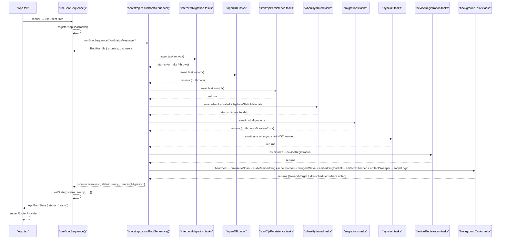
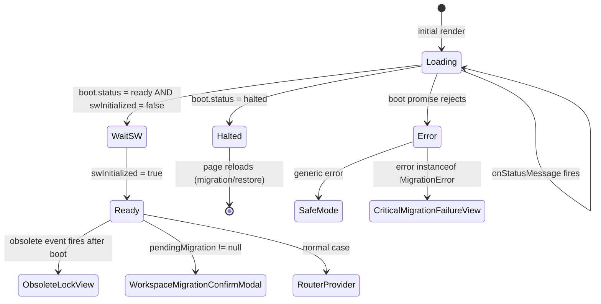
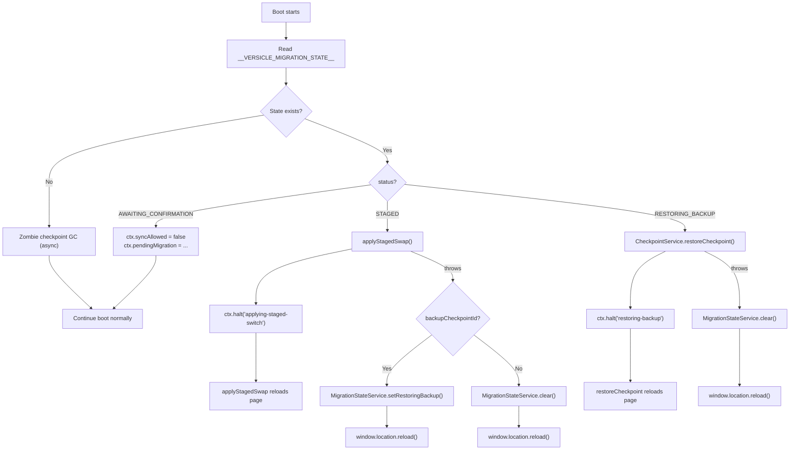
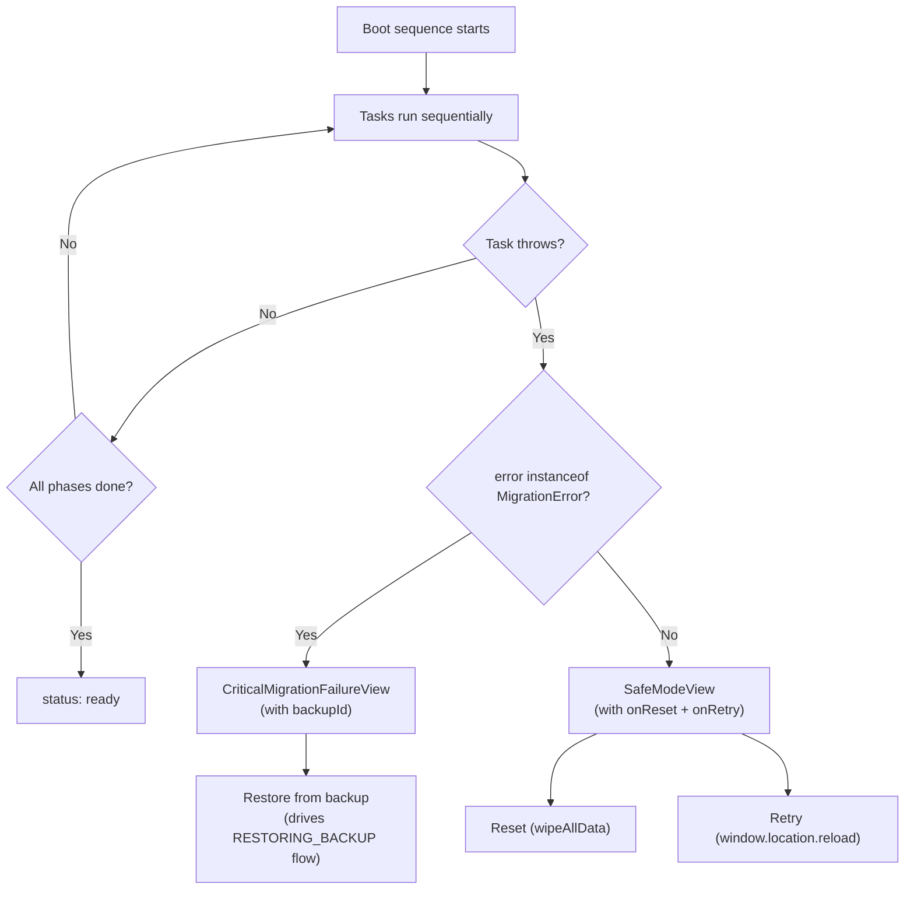
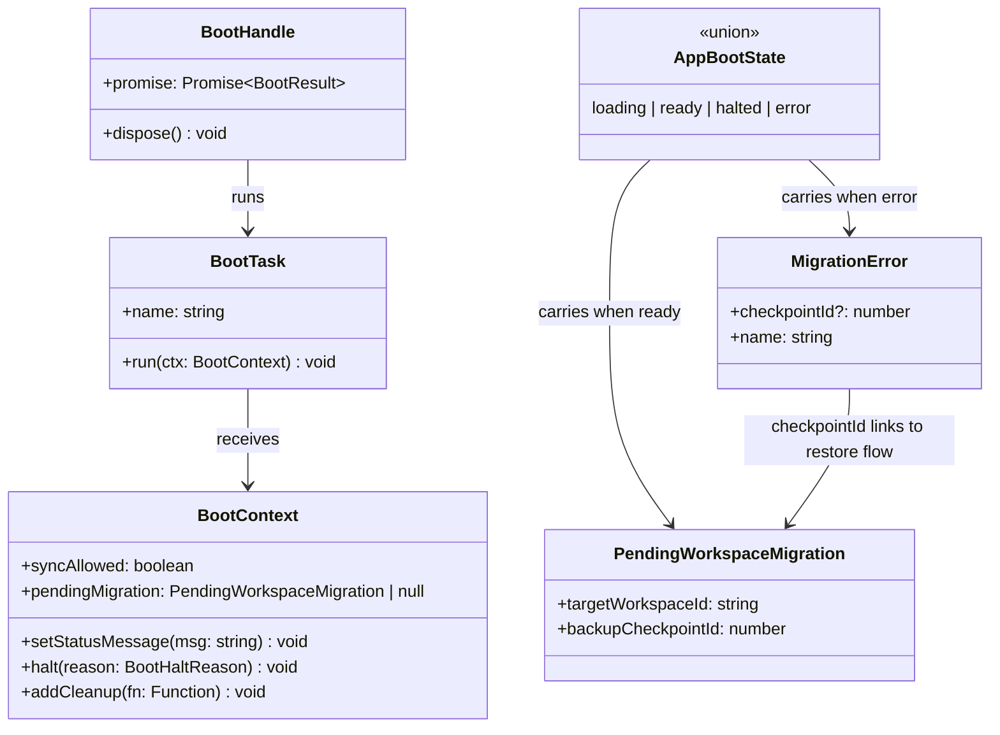

# Bootstrap & Application Lifecycle

Versicle's startup path is governed by an **explicit, awaited boot contract** called C11. Before C11 was introduced, `App.tsx` was nearly 375 lines and mixed import-time side effects with render-time initialization: importing any synced store started Yjs IndexedDB persistence immediately, Google auth initialized at module scope, and `App.tsx` itself made decisions about migration state, sync startup, device heartbeat timing, and service worker gating in an ad-hoc way. The result was subtle races (the device heartbeat fired before device registration completed, migrations could trigger multiple times), and a layering violation where the data layer reached upward to pull in store and sync modules through import chains.

C11 reverses this completely. Every initialization concern is split into a named **BootTask** registered into an ordered set of **BootPhases**. The sequencer in [src/app/bootstrap.ts](../../src/app/bootstrap.ts) owns the ordering and knows nothing about any subsystem. The composition manifest in [src/app/boot/registerBootTasks.ts](../../src/app/boot/registerBootTasks.ts) knows about subsystems but has no ordering logic. Subsystem boot modules (under `src/app/boot/`) know their own domain but nothing about other subsystems or the sequencer's implementation. React owns a single hook, `useBootSequence`, that fires the sequencer and projects its result into a four-state render union for `App.tsx`.

The C11 architecture is documented in [plan/overhaul/proposals/contract-first.md](../../plan/overhaul/proposals/contract-first.md) and the final phase-1 result is summarized in [plan/overhaul/README.md](../../plan/overhaul/README.md).

---

## Contents

1. [Design intent and why it matters](#1-design-intent-and-why-it-matters)
2. [The boot contract: BOOT_PHASES and BootTask](#2-the-boot-contract-boot_phases-and-boottask)
3. [The sequencer: runBootSequence](#3-the-sequencer-runbootsequence)
4. [The composition manifest: registerAppBootTasks](#4-the-composition-manifest-registerappboottasks)
5. [Phase-by-phase: each boot task in depth](#5-phase-by-phase-each-boot-task-in-depth)
   - [interceptMigration](#51-interceptmigration)
   - [openDB](#52-opendb)
   - [startYjsPersistence](#53-startyjspersistence)
   - [whenHydrated](#54-whenhydrated)
   - [migrations](#55-migrations)
   - [syncInit](#56-syncinit)
   - [deviceRegistration](#57-deviceregistration)
   - [backgroundTasks](#58-backgroundtasks)
6. [React owner: useBootSequence](#6-react-owner-usebootsequence)
7. [The service-worker gate: useServiceWorkerGate](#7-the-service-worker-gate-useserviceworkergate)
8. [Render-state mapping: App.tsx](#8-render-state-mapping-apptsx)
9. [Halt semantics and the migration state machine](#9-halt-semantics-and-the-migration-state-machine)
10. [Cleanup and dispose contract](#10-cleanup-and-dispose-contract)
11. [Wipe hooks and the full-data-wipe path](#11-wipe-hooks-and-the-full-data-wipe-path)
12. [Global error handlers](#12-global-error-handlers)
13. [Failure modes and safe-mode routing](#13-failure-modes-and-safe-mode-routing)
14. [Invariants and key rules](#14-invariants-and-key-rules)
15. [Cross-references](#15-cross-references)

---

## 1. Design Intent and Why It Matters

A local-first app like Versicle has an unusually deep startup path:

- It must open IndexedDB before doing anything (no reads without a connection).
- It must load and validate the Yjs CRDT document from local persistence before any store state is trustworthy.
- It must run any pending schema migrations on that document before allowing remote sync to merge cloud data — running migrations after sync would corrupt the doc.
- It must not initialize Firestore sync while a workspace migration is awaiting user confirmation, because merging cloud data into a partially-applied workspace state would produce an inconsistent CRDT.
- Background housekeeping (heartbeat, Drive scan, audio cache eviction, content re-ingestion) must start after device registration so the heartbeat never fires for an unregistered device.

The pre-C11 codebase could not enforce these dependencies because initialization was driven by React effects in `App.tsx` that ran in parallel and in no guaranteed order. C11 makes the ordering a compile-time artifact of the `BOOT_PHASES` array. No task can run before every task in every prior phase has settled, and a task that throws short-circuits the entire sequence with a deterministic error path.

A second motivating rule (plan/overhaul/README.md §4 rule 9): **boot tasks register into the bootstrap registry — subsystems do not import each other and the sequencer imports no subsystem.** This is what allows [`src/app/bootstrap.ts`](../../src/app/bootstrap.ts) to be 147 lines of pure lifecycle plumbing without a single Firebase, Yjs, or IndexedDB import.

---

## 2. The Boot Contract: BOOT_PHASES and BootTask

[`src/app/bootstrap.ts`](../../src/app/bootstrap.ts) defines the entire public contract of the boot system as five exported names:

```typescript
export const BOOT_PHASES = [
  'interceptMigration',
  'openDB',
  'startYjsPersistence',
  'whenHydrated',
  'migrations',
  'syncInit',
  'deviceRegistration',
  'backgroundTasks',
] as const;

export type BootPhase = (typeof BOOT_PHASES)[number];
```

A `BootTask` is the unit of work:

```typescript
export interface BootTask {
  /** Stable diagnostic name, `<subsystem>/<action>` (e.g. `sync/initialize`). */
  name: string;
  run(ctx: BootContext): void | Promise<void>;
}
```

The task's `run` method receives a `BootContext` that exposes exactly four operations:

| Method | Purpose |
|--------|---------|
| `setStatusMessage(msg)` | Surface a human-readable loading message (the spinner text in the loading screen). |
| `halt(reason)` | Stop the sequence after the current phase completes. Used exclusively by the migration interceptor. |
| `addCleanup(fn)` | Register a teardown callback (intervals, event subscriptions) that runs on unmount. |
| `syncAllowed` | Mutable boolean; the migration interceptor sets it to `false` when a workspace migration is awaiting user confirmation, and `syncInit` reads it before composing the firebase chunk. |
| `pendingMigration` | Mutable field; set by the migration interceptor in the `AWAITING_CONFIRMATION` state and surfaced to `App.tsx` via the final `BootResult`. |

The `BootContext` interface is deliberately not exported — it is internal to `bootstrap.ts`. Tasks receive it as an argument and cannot hold a reference beyond their `run` call's scope (the `halt` implementation simply mutates a local variable in the sequencer's closure; it does not expose an ongoing handle).

Two `BootHaltReason` values are defined:

```typescript
export type BootHaltReason = 'restoring-backup' | 'applying-staged-switch';
```

A `BootResult` is either ready or halted:

```typescript
type BootResult =
  | { status: 'ready'; pendingMigration: PendingWorkspaceMigration | null }
  | { status: 'halted'; reason: BootHaltReason };
```

The `BootHandle` returned by `runBootSequence` exposes only two members:

```typescript
export interface BootHandle {
  promise: Promise<BootResult>;
  dispose(): void;
}
```

This separation means the React owner can `dispose()` long-lived resources registered via `ctx.addCleanup` on unmount even while the boot promise is still in flight — the `dispose()` call sets a `disposed` flag and drains the cleanup queue immediately.

---

## 3. The Sequencer: runBootSequence

[`src/app/bootstrap.ts`](../../src/app/bootstrap.ts) maintains a module-level registry:

```typescript
const registry = new Map<BootPhase, BootTask[]>();
```

Tasks are added to this registry via `registerBootTask`. A duplicate `(phase, task.name)` pair throws immediately at registration time — this is a programming error, not a runtime condition.

`runBootSequence` is the engine:

```typescript
export function runBootSequence(options: RunBootOptions = {}): BootHandle {
  const cleanups: Array<() => void> = [];
  let disposed = false;
  let haltReason: BootHaltReason | null = null;

  const ctx: BootContext = { /* ... */ };

  const promise = (async (): Promise<BootResult> => {
    for (const phase of BOOT_PHASES) {
      for (const task of registry.get(phase) ?? []) {
        await task.run(ctx);
      }
      if (haltReason !== null) {
        return { status: 'halted', reason: haltReason };
      }
    }
    return { status: 'ready', pendingMigration: ctx.pendingMigration };
  })();

  return {
    promise,
    dispose: () => {
      disposed = true;
      while (cleanups.length > 0) {
        cleanups.pop()?.();
      }
    },
  };
}
```

Key implementation details:

- The outer async IIFE starts the sequence immediately and synchronously. `runBootSequence` returns before the first `await` resolves, so the caller has a `BootHandle` it can `dispose()` at any time.
- Within a phase, tasks run **sequentially in registration order** — there is no parallelism within a phase.
- A `halt` is only checked **after each phase completes** (after all tasks in the phase have `await`-ed), not after each individual task. This means a task that calls `ctx.halt()` in `interceptMigration` will still run every other task registered in `interceptMigration` before the halt check fires. In practice only one task is registered in `interceptMigration`, so this distinction is moot today.
- If any task's `run` throws, the exception propagates up through the async function and rejects `promise`. Nothing catches it inside `bootstrap.ts`.
- If `disposed` is already `true` when `addCleanup` is called (the owner unmounted before the task ran), the cleanup fires **immediately** in the `addCleanup` call, not on some future dispose. This prevents a leak where the owner unmounts mid-sequence and a background interval never gets cleaned up.



---

## 4. The Composition Manifest: registerAppBootTasks

[`src/app/boot/registerBootTasks.ts`](../../src/app/boot/registerBootTasks.ts) is the **only** file in the codebase allowed to import from subsystem boot modules. It is also the only place where the two wipe hooks are registered (see [Wipe Hooks](#11-wipe-hooks-and-the-full-data-wipe-path)).

Two synchronous, side-effect-free composition steps run before any boot task is registered:

1. **`wireGoogleDomain()`** — installs the `GoogleAuthClient`, `DriveClient`, and `DriveLibrarySync` singletons with store-backed adapters. This must happen before any boot task or React component runs so the Google domain is ready to be called.
2. **`applyDocumentLanguage()`** — sets `document.documentElement.lang` from the resolved UI locale (kernel/locale/uiLocale.ts) and re-syncs it on change. This runs before boot phases so even the loading screen and SafeMode carry the correct `lang` attribute, not just the static `lang="en"` from `index.html`.

The full registration table:

| Phase | Task name | Source |
|-------|-----------|--------|
| `interceptMigration` | `sync/migration-interceptor` | migrationInterceptor.ts |
| `openDB` | `db/open` | openDatabase.ts |
| `startYjsPersistence` | `state/start-yjs-persistence` | yjsPersistence.ts |
| `whenHydrated` | `state/when-hydrated` | whenHydrated.ts |
| `whenHydrated` | `library/hydrate-static-metadata` | whenHydrated.ts |
| `migrations` | `state/crdt-migrations` | crdtMigrations.ts |
| `syncInit` | `sync/initialize` | syncInit.ts |
| `deviceRegistration` | `tts/initialize` | deviceRegistration.ts |
| `deviceRegistration` | `device/register` | deviceRegistration.ts |
| `backgroundTasks` | `device/heartbeat` | backgroundTasks.ts |
| `backgroundTasks` | `drive/auto-scan` | backgroundTasks.ts |
| `backgroundTasks` | `data/audio-cache-eviction` | backgroundTasks.ts |
| `backgroundTasks` | `data/embedding-cache-eviction` | backgroundTasks.ts |
| `backgroundTasks` | `library/reingest-wave` | backgroundTasks.ts |
| `backgroundTasks` | `search/embedding-backfill` | embeddingBackfill.ts |
| `backgroundTasks` | `search/artifact-publisher` | artifactPublisher.ts |
| `backgroundTasks` | `search/artifact-sweeper` | artifactSweeper.ts |
| `backgroundTasks` | `google/social-login` | socialLogin.ts |

The `registered` boolean guard at the top of `registerAppBootTasks` makes the function idempotent — HMR and repeated calls in tests cannot double-register tasks or the sequencer would throw on the duplicate-name check.

```mermaid
graph TD
    A["registerAppBootTasks()"] --> B["wireGoogleDomain()"]
    A --> C["applyDocumentLanguage()"]
    A --> D["registerWipeHook: sync/stop"]
    A --> E["registerWipeHook: state/stop-yjs-persistence"]
    A --> P1["registerBootTask interceptMigration\nsync/migration-interceptor"]
    A --> P2["registerBootTask openDB\ndb/open"]
    A --> P3["registerBootTask startYjsPersistence\nstate/start-yjs-persistence"]
    A --> P4a["registerBootTask whenHydrated\nstate/when-hydrated"]
    A --> P4b["registerBootTask whenHydrated\nlibrary/hydrate-static-metadata"]
    A --> P5["registerBootTask migrations\nstate/crdt-migrations"]
    A --> P6["registerBootTask syncInit\nsync/initialize"]
    A --> P7a["registerBootTask deviceRegistration\ntts/initialize"]
    A --> P7b["registerBootTask deviceRegistration\ndevice/register"]
    A --> P8a["registerBootTask backgroundTasks\ndevice/heartbeat"]
    A --> P8b["registerBootTask backgroundTasks\ndrive/auto-scan"]
    A --> P8c["registerBootTask backgroundTasks\ndata/audio-cache-eviction"]
    A --> P8d["registerBootTask backgroundTasks\ndata/embedding-cache-eviction"]
    A --> P8e["registerBootTask backgroundTasks\nlibrary/reingest-wave"]
    A --> P8f["registerBootTask backgroundTasks\nsearch/embedding-backfill"]
    A --> P8g["registerBootTask backgroundTasks\nsearch/artifact-publisher"]
    A --> P8h["registerBootTask backgroundTasks\nsearch/artifact-sweeper"]
    A --> P8i["registerBootTask backgroundTasks\ngoogle/social-login"]

    style P1 fill:#f9f,stroke:#333
    style P2 fill:#f9f,stroke:#333
    style P3 fill:#ffa,stroke:#333
    style P4a fill:#ffa,stroke:#333
    style P4b fill:#ffa,stroke:#333
    style P5 fill:#aff,stroke:#333
    style P6 fill:#aff,stroke:#333
    style P7a fill:#afa,stroke:#333
    style P7b fill:#afa,stroke:#333
    style P8a fill:#faa,stroke:#333
    style P8b fill:#faa,stroke:#333
    style P8c fill:#faa,stroke:#333
    style P8d fill:#faa,stroke:#333
    style P8e fill:#faa,stroke:#333
    style P8f fill:#faa,stroke:#333
    style P8g fill:#faa,stroke:#333
    style P8h fill:#faa,stroke:#333
    style P8i fill:#faa,stroke:#333
```



---

## 5. Phase-by-Phase: Each Boot Task in Depth

### 5.1 interceptMigration

**Source:** [src/app/boot/migrationInterceptor.ts](../../src/app/boot/migrationInterceptor.ts)
**Task name:** `sync/migration-interceptor`
**Phase:** `interceptMigration` (first to run, before the database is even opened)

This task reads the workspace migration state machine (stored in `localStorage` under `__VERSICLE_MIGRATION_STATE__`) and branches into one of four paths:

**Path 1: `STAGED`**
A workspace switch was prepared and staged but the page was reloaded (or the tab was closed) before the apply could run. The interceptor calls `applyStagedSwap(migrationState, ...)`, which executes the crash-resumable idempotent apply (Phase 4 §D4: wipe main IDB + rewrite from the durable staging IDB under the cross-tab swap lock, then transition to `AWAITING_CONFIRMATION`). It then calls `ctx.halt('applying-staged-switch')` and returns. The `applyStagedSwap` call will reload the page when it completes. If `applyStagedSwap` throws, the interceptor routes to `RESTORING_BACKUP` (if a backup checkpoint id exists) or clears state and reloads. Boot never continues after a `STAGED` intercept.

**Path 2: `RESTORING_BACKUP`**
A migration or workspace switch failed and needs to be rolled back. The interceptor calls `CheckpointService.restoreCheckpoint(backupCheckpointId, ...)`, then calls `ctx.halt('restoring-backup')`. The `restoreCheckpoint` call will reload the page when the snapshot is fully written. If the checkpoint id is missing (a stale state from before the pre-migration backup pinning hotfix), the interceptor clears the migration state and reloads. Boot never continues after a `RESTORING_BACKUP` intercept.

**Path 3: `AWAITING_CONFIRMATION`**
A workspace switch was staged and applied, and the user needs to confirm or reject it. The interceptor does NOT halt — boot continues to give the user a working UI for the confirmation modal. It sets `ctx.syncAllowed = false` (enforced as state, not a comment) and `ctx.pendingMigration = { targetWorkspaceId, backupCheckpointId }`. The `syncInit` task will skip sync initialization when it reads `ctx.syncAllowed === false`.

**Path 4: Standard boot (no migration state)**
The interceptor performs zombie cleanup: it lists all `pre-migration` checkpoint triggers and deletes any that are older than 7 days. This is fire-and-forget (errors are warned, not thrown) and runs asynchronously without blocking the boot sequence.

### 5.2 openDB

**Source:** [src/app/boot/openDatabase.ts](../../src/app/boot/openDatabase.ts)
**Task name:** `db/open`
**Phase:** `openDB`

Sets the status message to `'Connecting to database...'`, then configures the connection event callbacks for the `EpubLibraryDB` IndexedDB database and awaits `getConnection()`. The three event callbacks wire UI (toasts) to connection lifecycle events that live in [src/data/connection.ts](../../src/data/connection.ts):

- **`onBlocked`**: another tab holds an older schema version open; the user sees an informational toast with a message to close the other tab.
- **`onBlocking`**: this tab's (already-closed) connection is blocking another tab's schema upgrade; an error toast prompts the user to reload.
- **`onTerminated`**: the browser killed the connection; an error toast prompts a reload if problems persist.

After the database is open, `openDatabaseTask` runs a **non-fatal one-time cover blob repair**: `maintenanceService.repairCorruptCoverBlobsOnce()`. This repairs corrupt (non-binary) `coverBlob` values left by pre-v3 backup restores. If the repair throws, the error is logged as a warning and boot continues — the boot integration test (`App_Boot.test.tsx`) pins this non-fatal behavior explicitly.

### 5.3 startYjsPersistence

**Source:** [src/app/boot/yjsPersistence.ts](../../src/app/boot/yjsPersistence.ts)
**Task name:** `state/start-yjs-persistence`
**Phase:** `startYjsPersistence`

Calls `startYjsPersistence()` from [src/store/yjs-provider.ts](../../src/store/yjs-provider.ts). This is intentionally synchronous and fast — it constructs the `IndexeddbPersistence` binding for the singleton `Y.Doc` and attaches a `synced` event listener for logging. The actual IDB read (loading the document) runs asynchronously in the background and is awaited in the next phase.

**Historical significance:** Before Phase 1b of the C11 overhaul, calling `startYjsPersistence()` happened as a **module-scope side effect** of importing any synced store — importing `useAnnotationStore` would start IndexedDB persistence before React rendered. This was `LD-6` in the layering-deps audit. Moving construction behind `startYjsPersistence()` and having boot own the call makes the side effect explicit, ordered, and testable.

The `startYjsPersistence` function itself is idempotent — a `persistenceStarted` flag prevents double-construction even if called multiple times.

### 5.4 whenHydrated

**Source:** [src/app/boot/whenHydrated.ts](../../src/app/boot/whenHydrated.ts)
**Task names:** `state/when-hydrated`, `library/hydrate-static-metadata`
**Phase:** `whenHydrated`

Two tasks run in this phase sequentially.

**`whenHydratedTask`** (`state/when-hydrated`) calls the internal `whenHydrated(timeoutMs = 8000)` function, which composes three steps:

1. **IDB load gate:** `waitForYjsSync(timeoutMs)` resolves when the `IndexeddbPersistence`'s `synced` event fires (meaning the Y.Doc has been loaded from `versicle-yjs`). If `persistence` is null (storage unavailable or unit tests without persistence), it resolves immediately. If 5 seconds pass without the `synced` event, it warns and resolves anyway — the boot must never hang on a corrupt or unavailable IDB.

2. **Empty-map hydration:** For each store registered in `SYNCED_STORES`, the code checks whether the corresponding Y.Map in the loaded doc is empty. If so, it calls `handle.markHydrated()` immediately. This is needed because the `zustand-middleware-yjs` fork can distinguish "doc loaded, this map is empty" from "doc not loaded yet" only if told explicitly — a store that starts from declared defaults will never receive an inbound patch and would wait forever without this explicit signal.

3. **Store hydration wait:** `Promise.all(handles.map(h => h.whenHydrated()))` races against an 8-second timeout. Each store's `whenHydrated()` resolves when the middleware's inbound patch has been applied (the structural replacement for a legacy `sleep(100)` retry loop). Warn-and-proceed on timeout.

**`hydrateStaticMetadataTask`** (`library/hydrate-static-metadata`) calls `getLibrary().service.start()` and then awaits `service.hydrate()`. This is the sole owner of static-metadata hydration (Phase 7 D16). The `service.start()` call subscribes to inventory deltas so newly synced books hydrate automatically; `service.hydrate()` performs the initial pass across the current inventory.

### 5.5 migrations

**Source:** [src/app/boot/crdtMigrations.ts](../../src/app/boot/crdtMigrations.ts), [src/app/migrations.ts](../../src/app/migrations.ts)
**Task name:** `state/crdt-migrations`
**Phase:** `migrations`

Sets the status message to `'Checking data version...'` and awaits `runCrdtMigrations()`.

The CRDT migration coordinator is documented in depth in [src/app/migrations.ts](../../src/app/migrations.ts). The key operating rules:

- **Single call site:** `runCrdtMigrations()` is protected by a module-level `inFlight` promise — if called twice (HMR, repeated mount in tests), both calls share the same promise.
- **Reads the doc, not store state:** `readDocSchemaVersion` reads `max(meta.schemaVersion, library.__schemaVersion)` from the Y.Doc directly, tolerating partial dual-writes from the v6–v8 era.
- **Pre-migration checkpoint:** If any step will run on a non-empty doc, a protected checkpoint is created via `CheckpointService.createCheckpoint` BEFORE the first transform. If checkpoint creation fails, the migration aborts with a `MigrationError` before any change is made.
- **One transaction per step:** Each migration step's transform and version bump are wrapped in a single `doc.transact(...)` call, so no observer (other browser tabs, y-idb, Firestore sync) ever sees a transformed-but-unversioned doc.
- **DOC transforms, not `setState`:** Steps mutate Y types directly via `Y.Map`, `Y.Array`, etc. The middleware receives the changes as ordinary inbound traffic (with `MIGRATION_ORIGIN = Symbol('versicle:migration')` as the transaction origin) and patches stores normally.
- **Loud failure:** Any throw becomes a `MigrationError` carrying the pre-migration checkpoint id. `App.tsx` routes it to `CriticalMigrationFailureView`.

The migration chain as of schema version 9 (`CURRENT_SCHEMA_VERSION = 9`):

| From | To | Transform |
|------|----|-----------|
| 1 | 2 | Prune reading sessions with non-numeric `startTime`/`endTime` |
| 2 | 4 | Pure version bump (v4 = `disableYText` encoding flip) |
| 3 | 4 | Pure version bump (v3 was itself a pure bump) |
| 4 | 5 | Backfill `fontProfiles` in every per-device preferences map |
| 5 | 6 | Delete `annotations.popover` residual; fold `preferences/<deviceId>` into `preferences` keyed map (copy-without-clear) |
| 6 | 7 | Canonicalize vocabulary `knownCharacters` keys to simplified form (min-timestamp merge for duplicates) |
| 7 | 8 | Link reading list entries to inventory via `bookId` FK |
| 8 | 9 | Clear legacy preference husks; retire `library.__schemaVersion` dual-write (meta is sole authority) |

The `LAST_DUAL_WRITTEN_SCHEMA_VERSION = 8` constant controls which steps also write `library.__schemaVersion` (the pre-meta-era poison pill). Steps through v8 do; v9 and beyond do not.

### 5.6 syncInit

**Source:** [src/app/boot/syncInit.ts](../../src/app/boot/syncInit.ts)
**Task name:** `sync/initialize`
**Phase:** `syncInit`

This task has three actions, in order:

1. **`configureSyncBackendSelection()`** (always runs, even when sync is skipped): determines whether the app should use `FirestoreBackend` (production) or `MockBackend` (DEV/E2E with `window.__VERSICLE_MOCK_FIRESTORE__`). This is unconditional because `WorkspaceMigrationConfirmModal` may re-start sync after the user confirms a migration, and by then the backend decision and event wiring must already be in place.

2. **`ctx.addCleanup(wireSyncEvents())`** (always runs): installs the single `SyncEvent` subscriber. `wireSyncEvents()` returns an unsubscribe function that is registered as cleanup. The subscriber handles `status`, `auth`, `flushed`, `clean-sync`, `switch`, `workspace-tombstoned`, `connection-error`, `sync-failure`, `save-rejected`, `local-persistence-unavailable`, `workspace-purged`, and `obsolete` events. The `obsolete` event handler (quarantine) calls `peekSyncOrchestrator()?.severObsoleteConnection()` and `stopDeviceHeartbeat()` — the heartbeat is stopped here, in the sync event subscriber, not in the boot task, because the quarantine can fire at any time after boot.

3. **Conditional sync start:** If `ctx.syncAllowed` is `false` (migration awaiting confirmation), the task logs and returns. If `isSyncEnabled()` returns `false` (Firebase not configured, or mock not enabled), the task logs and returns. Otherwise it calls `getSyncOrchestratorAsync().then(o => o.start())` — intentionally NOT awaited. Boot must never block on network activity. This invariant is pinned by `App_Boot.test.tsx`.

The lazy dynamic import inside `getSyncOrchestratorAsync` (in `src/app/sync/createSync.ts`) is the "first-use gate" (Phase 8 §A): un-configured users never download the Firebase SDK chunk. The import only fires inside this task body, and only when `isSyncEnabled()` passed.

### 5.7 deviceRegistration

**Source:** [src/app/boot/deviceRegistration.ts](../../src/app/boot/deviceRegistration.ts)
**Task names:** `tts/initialize`, `device/register`
**Phase:** `deviceRegistration`

Two tasks run sequentially.

**`ttsInitializeTask`** (`tts/initialize`) calls `getTtsController().initialize()`. This wires the TTS engine to the stores: it establishes the engine-to-store mirror, installs the store-to-engine settings sync, and replays any rehydrated settings. The TTS initialization must precede device registration because the device profile (assembled in the next task) reads the active TTS voice and rate from the store.

**`deviceRegistrationTask`** (`device/register`) assembles a `DeviceProfile` and calls `deviceStore.registerCurrentDevice(deviceId, profile)`. The profile includes:

```typescript
const profile: DeviceProfile = {
  theme: prefs.currentTheme,
  fontSize: prefs.fontSize,
  ttsVoiceURI: selectActiveVoiceId(tts),
  ttsRate: selectActiveRate(tts),
  ttsPitch: 1.0,  // dropped from real settings in 5b, kept at neutral value in synced shape
};
```

`registerCurrentDevice` is idempotent — if the device already exists, it updates `lastActive` and syncs the profile. If it is new, it creates the device entry. This is also the first time the device id (from `@lib/device-id`, which reads/creates a `versicle-device-id` localStorage key) is committed to the CRDT.

### 5.8 backgroundTasks

**Source:** [src/app/boot/backgroundTasks.ts](../../src/app/boot/backgroundTasks.ts), [src/app/boot/embeddingBackfill.ts](../../src/app/boot/embeddingBackfill.ts), [src/app/boot/artifactPublisher.ts](../../src/app/boot/artifactPublisher.ts), [src/app/boot/artifactSweeper.ts](../../src/app/boot/artifactSweeper.ts), [src/app/boot/socialLogin.ts](../../src/app/boot/socialLogin.ts)
**Task names:** `device/heartbeat`, `drive/auto-scan`, `data/audio-cache-eviction`, `data/embedding-cache-eviction`, `library/reingest-wave`, `search/embedding-backfill`, `search/artifact-publisher`, `search/artifact-sweeper`, `google/social-login`
**Phase:** `backgroundTasks`

Nine tasks run in this phase. All of them either fire-and-forget, start background intervals, or schedule work on the next idle slot; none block on network operations. The four semantic-search/shared-cache tasks (`data/embedding-cache-eviction`, `search/embedding-backfill`, `search/artifact-publisher`, `search/artifact-sweeper`) were added alongside the embeddings and Artifact Lane work; each is **heartbeat-active gated** (it bails unless this device's heartbeat is recent, reusing `ACTIVE_DEVICE_WINDOW_MS`, so an idle or locked device never spends quota, uploads, or sweeps) and **idle-gated** (scheduled on `requestIdleCallback`, falling back to a macrotask, so it never competes with the boot path or interactive work).

**`deviceHeartbeatTask`** (`device/heartbeat`): Starts a 5-minute interval (`HEARTBEAT_INTERVAL_MS = 5 * 60 * 1000`) that calls `useDeviceStore.getState().touchDevice(deviceId)`. Registers `stopDeviceHeartbeat` as cleanup via `ctx.addCleanup`. The heartbeat deliberately starts AFTER device registration (pre-C11 it raced registration from a parallel effect). `stopDeviceHeartbeat` is also called directly by the `wireSyncEvents` `obsolete` handler — an obsolete client must stop announcing itself even while the UI lock is displayed.

**`driveAutoScanTask`** (`drive/auto-scan`): Checks whether a Drive folder is linked and whether the last scan was more than one week ago (`ONE_WEEK = 7 * 24 * 60 * 60 * 1000`). If both conditions pass, calls `getDriveLibrarySync().shouldAutoSync()` for a heuristic check (connection status, etc.), and then calls `scanAndIndex()`. The scan is fire-and-forget. If a `GoogleAuthRequiredError` is caught, it logs silently without showing UI — the user reconnects from settings. This is the "never pop auth UI from boot" policy (GG-2 reversal).

**`audioCacheEvictionTask`** (`data/audio-cache-eviction`): Fire-and-forget chain. First runs `audioCache.backfillSizesOnce()` (the v25 one-time `size` field backfill; flag-guarded so it runs once and retries on failure). Then runs `audioCache.runEviction()` for the LRU sweep. If the backfill fails, the eviction still runs (it falls back to `audio.byteLength`). Neither operation is awaited; boot must not wait for storage maintenance.

**`embeddingCacheEvictionTask`** (`data/embedding-cache-eviction`): Fire-and-forget, mirroring `audioCacheEvictionTask` for the v27 `cache_embeddings` store. The sweep streams a readonly cursor and deletes through the embeddings write gate, so it can never overlap an indexer write. The recency signal is **injected at the task level** (the repo stays store-free, per `data-no-upward`): the task builds a `Map<bookId, lastReadMs>` from the reading-state store's per-book progress so recently-read books evict last; books with no valid progress rank oldest. The task also shapes the **never-evict-unconfirmed-upload protected set** (`computeProtectedBookIds`, the Artifact Lane Phase D guardrail) before calling `embeddingsRepo.runEviction(recency, undefined, protectedIds)`. That set is empty — zero added cost, no HEAD probes — whenever the `shareAiCaches` switch is OFF or no artifact backend is connected; when it is ON and connected, for each candidate book the task derives the content-addressed key and HEAD-probes the backend, and a HEAD **miss** (upload not yet confirmed) **protects** the book so eviction never destroys the only copy of a cache the user opted to share. The probe is **fail-safe**: a throw (offline blip, permission error) also protects the book.

**`reingestWaveTask`** (`library/reingest-wave`): Checks a `versicle_reingest_defer` localStorage flag. If set, logs and returns. Otherwise, schedules `runReingestWave(...)` after a 10-second idle delay (`REINGEST_START_DELAY_MS = 10_000`), keeping it entirely off the critical boot path. The wave uses stamp-based candidacy and processes books through the `ImportOrchestrator` at `'idle'` priority (user imports always preempt). Registers cleanup that cancels both the timer and signals `shouldContinue: () => !cancelled` to stop the wave if the component unmounts.

**`embeddingBackfillTask`** (`search/embedding-backfill`): Pre-embeds the library for semantic search so books are searchable **without** first being opened in the reader. On the next idle slot it constructs its own long-lived `EmbeddingIndexer` (the foreground indexer is created per reader session) and trickles every book whose local binary is present — the whole on-device library; the per-section resume-skip makes already-embedded books free — through the indexer on the **background quota lane** (`{ interactive: false, lane: 'bg' }`; an idle path never takes the interactive bypass). The trickle is doubly consent-gated: it runs only when the default-OFF library-wide `preEmbedLibrary` opt-in is ON (the consent that grants this background egress, wired through the consent resolver in [src/app/google/aiConsent.ts](../../src/app/google/aiConsent.ts)) **and** the embedding client `isConfigured()`. Before spending any quota on a book it first consults the shared Artifact Lane cache (`getArtifactConsult().probeArtifact` / `hydrateFromArtifact`): a cache hit downloads a peer's vectors for free and skips the embed, so even a device that has exhausted its quota still reuses peer-embedded books. On a miss it checks the app-layer cross-device daily-request budget and stops the trickle when this device's share of the shared daily quota is used up; a `NetRateLimitedError` (pre-network backpressure from the cross-provider quota governor) or a per-book failure marks the pass errored, and the boot task re-runs it after `ERROR_RETRY_DELAY_MS` (90 s) — the resume-skip makes the retry cheap. The whole pass bails unless this device's heartbeat is recent. The core `runEmbeddingBackfill` is pure/injectable; the boot task wires the real store/repo/governor seams and registers a cleanup that cancels the idle callback and signals `shouldContinue: () => false`.

**`artifactPublisherTask`** (`search/artifact-publisher`): The upload half of the Artifact Lane (shared AI-cache Phase C). On idle it mirrors each locally-embedded book's whole-corpus int8 vectors into the user's **own** BYO Cloud Storage (a content-addressed blob `embeddings/{key}.bin` under the workspace prefix) plus a small companion HEAD record, so a sibling device downloads them for free instead of re-spending Gemini quota. It runs only when the default-OFF **"Share AI caches across my devices"** opt-in (`shareAiCaches`) is ON; the per-book upload consent is built from the **same consent predicate** the download path uses (`makeArtifactConsentGate`: `shareAiCaches` ANDed with library pre-embed or per-book consent), so a book that may be downloaded by a peer is exactly one that may be uploaded. It is a silent no-op when no backend handle is connected (sync off / not connected / no active workspace), read fresh per call. The blob key is derived from the embedding **row's** stamp (`{model, dims, quant, extractionVersion}`), not live config, so the object is addressed by what was actually embedded and a peer re-derives the same key from the blob header; `putArtifact` is **idempotent** (head-before-put, write-if-absent), so racing devices write byte-identical content harmlessly. Per-book failures are best-effort (log and continue; the next idle/boot retries). Cleanup cancels the idle callback and sets `shouldContinue` false.

**`artifactSweeperTask`** (`search/artifact-sweeper`): The cloud garbage-collector for the shared embedding cache (Artifact Lane Phase D), kept **separate** from `data/embedding-cache-eviction` because it is the companion to the per-book cloud-delete policy: deleting a book drops only its HEAD record and leaves the content-addressed blob for this sweeper to reclaim once it ages past the TTL (a sibling device may still need it). On idle it calls `backend.sweepArtifacts(...)` with a 30-day `ARTIFACT_TTL_MS` and the embeddings cache byte budget — each HEAD record past the TTL (and, when the bucket is over budget, oldest-first beyond that) is deleted along with its sibling blob. It is a silent no-op when no backend is connected, and best-effort: a thrown sweep is logged and swallowed (the next boot retries; the sweep is idempotent). **CI-PENDING caveat:** like every Artifact Lane cloud round-trip (`headArtifact` / `putArtifact` / `getArtifact` / `deleteArtifactHead` / `sweepArtifacts` and the HEAD-after-Storage ordering), the sweep is verified against `MockBackend` but its Firestore+Storage-emulator path auto-skips without local emulators, so the cloud GC is code-complete but not yet proven end-to-end against real Firebase.

**`socialLoginTask`** (`google/social-login`): Calls `SocialLogin.initialize(...)` with the configured Google client IDs, fire-and-forget. Subscribes to `useGoogleServicesStore` to re-initialize when the user changes the client IDs in settings. The subscription is registered once per page load (guarded by a module-level `subscribed` flag) and its unsubscribe is registered via `ctx.addCleanup`.

---

## 6. React Owner: useBootSequence

[`src/app/boot/useBootSequence.ts`](../../src/app/boot/useBootSequence.ts) is the React hook that bridges the boot sequencer to the render tree. Its full API surface is a single exported function:

```typescript
export function useBootSequence(): AppBootState
```

The `AppBootState` union:

```typescript
export type AppBootState =
  | { status: 'loading'; message: string }
  | { status: 'ready'; pendingMigration: PendingWorkspaceMigration | null }
  | { status: 'halted'; reason: BootHaltReason; message: string }
  | { status: 'error'; error: unknown };
```

The hook starts in `{ status: 'loading', message: 'Initializing...' }` and transitions to one of the other three states exactly once. Transitions are one-way.

Implementation details:

```typescript
export function useBootSequence(): AppBootState {
  const [state, setState] = useState<AppBootState>({ status: 'loading', message: 'Initializing...' });

  useEffect(() => {
    let active = true;
    let lastMessage = 'Initializing...';

    const removeErrorHandlers = installGlobalErrorHandlers();
    registerAppBootTasks();

    const handle = runBootSequence({
      onStatusMessage: (message) => {
        lastMessage = message;
        if (active) {
          setState((prev) => (prev.status === 'loading' ? { status: 'loading', message } : prev));
        }
      },
    });

    handle.promise
      .then((result) => { /* setState to ready or halted */ })
      .catch((error: unknown) => { /* setState to error */ });

    return () => {
      active = false;
      removeErrorHandlers();
      handle.dispose();
    };
  }, []);

  return state;
}
```

The `active` flag guards all `setState` calls — if the component unmounts while boot is in progress (e.g., in tests, or an unlikely early unmount), no setState fires after unmount. The `lastMessage` variable tracks the most recent status message so the `halted` state can carry it (the `halt` path keeps the loading screen visible, showing the last message that was set before the halt).

`installGlobalErrorHandlers()` is called here, not in a separate hook, so global error handlers are installed and removed alongside the boot lifecycle. `registerAppBootTasks()` is called inside the effect, which means it runs once per mount (idempotent due to the `registered` guard). `runBootSequence` is called once per mount and a new handle is created.

The boot sequencer itself is **not** React — it is a plain TypeScript async function. This means the sequencer can be unit-tested without a React tree, and the React hook is a thin adaptor. `App_Boot.test.tsx` renders the full `App` component (which uses `useBootSequence`) rather than the hook in isolation, testing the integration contract.

---

## 7. The Service-Worker Gate: useServiceWorkerGate

[`src/app/boot/useServiceWorkerGate.ts`](../../src/app/boot/useServiceWorkerGate.ts) runs **in parallel** with the boot sequence. It gates rendering independently of the data initialization path — cover images are served through the service worker's fetch handler, so the app holds the loading screen briefly for the SW controller.

```typescript
export function useServiceWorkerGate(): { swInitialized: boolean }
```

The gate is **soft**: `waitForServiceWorkerController` from [src/lib/serviceWorkerUtils.ts](../../src/lib/serviceWorkerUtils.ts) never rejects. It:

1. Races `navigator.serviceWorker.ready` against a 3-second timeout.
2. If `ready` fires, polls `navigator.serviceWorker.controller` up to 8 times with exponential backoff (starting at 5ms, doubling each attempt).
3. Returns regardless — on timeout, on poll exhaustion, or on controller acquisition.

After the wait completes, `notifyServiceWorkerDegradedOnce()` is called. If there is still no controller, and the build is not DEV/E2E, it fires a keyed toast (`'app.swDegraded'`) warning the user that covers and offline assets may not load. This is a one-shot notification (module-level `degradedNotified` flag). The DEV/E2E exemption exists because those environments block service workers by design (`serviceWorkers: 'block'` in Playwright), and the toast would pollute every test journey.

**Historical note:** The previous code had an unreachable `swError` state and a dead "Critical Error" screen in `App.tsx` for the SW gate. The `waitForServiceWorkerController` function could not actually reject (it resolved on timeout), so the error branch never fired. Both the dead state and the dead screen were deleted in Phase 8 §G and replaced with the honest soft-degradation toast.

`App.tsx` keeps the loading screen visible while `!swInitialized`, even if `boot.status === 'ready'`. The status message in this case becomes `'Starting...'` (the boot status is ready but the SW gate hasn't cleared yet, so there is no boot message to show).

---

## 8. Render-State Mapping: App.tsx

[`src/App.tsx`](../../src/App.tsx) renders around the union of two independent state sources: `AppBootState` from `useBootSequence()` and `{ swInitialized }` from `useServiceWorkerGate()`.

Three "infrastructure" components mount **above** the boot gate at the top of the render tree: `ToastHost`, `SWUpdatePrompt`, and `ConfirmHost`. These are unconditional so that:
- A toast fired during boot renders instead of being dropped.
- The SafeMode reset path gets the accessible `confirmDialog` flow (native `confirm()` and `alert()` are banned at lint-ERROR severity).
- A boot-blocked client can still accept a service-worker update (`SWUpdatePrompt`) — the recovery channel for a bad deploy.

The body IIFE maps the combined state:



In detail:

| Condition | Rendered body |
|-----------|---------------|
| `boot.status === 'error'` AND `boot.error instanceof MigrationError` | `CriticalMigrationFailureView` with `backupId={boot.error.checkpointId}` |
| `boot.status === 'error'` (other error) | `SafeModeView` with `onReset={handleReset}` and `onRetry={reload}` |
| `boot.status === 'loading'` OR `boot.status === 'halted'` OR `!swInitialized` | Loading spinner with the appropriate message |
| `boot.status === 'ready'` AND `swInitialized` | `ObsoleteLockView` + optional `WorkspaceMigrationConfirmModal` + `RouterProvider` |

The `ObsoleteLockView` is **always** mounted when boot succeeds — it renders nothing unless `useUIStore().obsoleteLock` is `true`, which is set by `handleObsoleteClient` in response to the `obsolete` sync event. It is not gated in `App.tsx` because the obsolete event can fire at any time after boot.

`WorkspaceMigrationConfirmModal` mounts when `boot.pendingMigration` is non-null (the `AWAITING_CONFIRMATION` intercept path). Its `onResolved={() => window.location.reload()}` callback reloads the page after the user confirms or rejects the migration, letting the normal boot sequence handle the new state.

The `handleReset` callback in `App.tsx` is the single owner of the full-data-wipe flow from the UI layer. It confirms via `confirmDialog` (the accessible modal, not `window.confirm`) and calls `wipeAllData()`.

---

## 9. Halt Semantics and the Migration State Machine

`ctx.halt(reason)` is a soft signal, not an exception. It sets `haltReason` in the sequencer's closure to a non-null value. The sequencer checks `haltReason !== null` **after each phase**, returns `{ status: 'halted', reason }`, and the `useBootSequence` hook transitions to `{ status: 'halted', reason, message: lastMessage }`.

`App.tsx` renders the loading spinner for `boot.status === 'halted'` — the same spinner as `'loading'`. This is intentional: the halt means the page is about to reload (a backup restore or staged workspace apply is running in the background), and showing a different UI would flash briefly before the reload.

The two halt reasons map to specific migration state machine states:



The halt contract guarantees:

1. No data phase (openDB, whenHydrated, migrations, sync) runs when the page is about to reload from a halt.
2. The loading screen stays visible during the halt because `App.tsx` treats `'halted'` and `'loading'` identically.
3. If the reload never happens (a bug in `applyStagedSwap` or `restoreCheckpoint`), the page is stuck on the loading screen indefinitely — an explicit product decision that "stuck loading" is safer than "boot with half-migrated data."

---

## 10. Cleanup and Dispose Contract

`ctx.addCleanup(fn)` accumulates teardown functions in the sequencer's `cleanups: Array<() => void>` array. `handle.dispose()` pops the array (last-in-first-out) and calls each function:

```typescript
dispose: () => {
  disposed = true;
  while (cleanups.length > 0) {
    cleanups.pop()?.();
  }
},
```

If `disposed` is already `true` when a task calls `addCleanup`, the cleanup fires **immediately** instead of being queued. This edge case arises when the React owner unmounts before the boot sequence finishes (e.g., in tests where the component is unmounted after asserting the loading state).

Tasks that register cleanups:

| Task | Cleanup registered |
|------|--------------------|
| `device/heartbeat` | `stopDeviceHeartbeat` — clears the 5-minute interval |
| `sync/initialize` | `wireSyncEvents()` return value — unsubscribes from the SyncEvent bus |
| `library/reingest-wave` | `() => { cancelled = true; clearTimeout(timer); }` — stops the 10-second idle timer and signals the wave to stop |
| `search/embedding-backfill` | `() => { cancelled = true; cancelIdle(); }` — cancels the idle callback and signals the trickle to stop |
| `search/artifact-publisher` | `() => { cancelled = true; cancelIdle(); }` — cancels the idle callback and signals the upload pass to stop |
| `search/artifact-sweeper` | `() => { cancelled = true; cancelIdle(); }` — cancels the idle callback before the cloud sweep fires |
| `google/social-login` | `() => { subscribed = false; unsubscribe(); }` — unsubscribes from `useGoogleServicesStore` |

`useBootSequence`'s cleanup effect calls `handle.dispose()`, so all of these run when `App` unmounts. In practice the React root never unmounts in production use, but the contract matters for test isolation and for future scenarios like a full PWA re-initialization.

---

## 11. Wipe Hooks and the Full-Data-Wipe Path

[`src/data/wipe.ts`](../../src/data/wipe.ts) owns the single "Clear All Data" path. It cannot import store or sync modules (the data layer must not reach upward), so it exposes a `WipeHook` registry:

```typescript
export interface WipeHook {
  name: string;
  stop(): Promise<void> | void;
}

export function registerWipeHook(hook: WipeHook): void {
  wipeHooks.set(hook.name, hook);
}
```

`registerBootTasks.ts` registers two hooks at composition time (before any boot phase runs):

- **`sync/stop`**: dynamically imports `createSync.ts` and calls `stopSyncForWipe()`. The dynamic import keeps the Firebase chunk out of the wipe module's static graph.
- **`state/stop-yjs-persistence`**: calls `disconnectYjs()`, which calls `persistence.destroy()` (flushes and closes the y-idb binding). This releases the `versicle-yjs` IDB connection before the deletion so the browser can delete the database without a "blocked" outcome.

The registration happens at manifest import time, not at boot success. This means the hooks are registered even when the app crashes before the boot sequence starts — but since neither writer was ever started in that case, the hooks are no-ops that stop nothing, which is exactly safe.

`wipeAllData()` executes in four steps:

1. **Stop all writers:** `runWipeHooks()` (sync/stop, state/stop-yjs-persistence), then `playbackCache.dropPending()` (drops the debounced session write without flushing), then `closeConnection()` and `closeDictionaryConnection()`.
2. **Delete all databases:** Iterates `APP_DATABASES = ['versicle-yjs', 'versicle-yjs-staging', 'EpubLibraryDB', 'versicle-dict']`. If any deletion is `'blocked'` (another tab holds the connection), it accumulates the blocked names.
3. **Clear localStorage and CacheStorage:** Removes all Versicle-owned keys (exact matches plus prefix matches for `versicle`, `__VERSICLE_`, `mockGenAI`). Deletes CacheStorage entries matching prefixes `piper-voices`, `versicle-dict-assets`, `versicle-fonts`, `versicle-piper-runtime`.
4. **Throw if blocked, reload otherwise:** If any database was blocked, throws with a message listing the blocked names. The UI (`handleReset` in `App.tsx`) catches this error and shows a toast. Otherwise calls `window.location.reload()`.

Each individual step is bounded by a 5-second timeout (`STEP_TIMEOUT_MS = 5000`) via `withTimeout`. A step that does not settle within 5 seconds logs a warning and continues — the wipe does not hang.

---

## 12. Global Error Handlers

[`src/app/boot/globalErrorHandlers.ts`](../../src/app/boot/globalErrorHandlers.ts) installs a single `unhandledrejection` listener on `window`. It is called by `useBootSequence` in its `useEffect`, and its teardown is returned as `removeErrorHandlers`, which is called on component unmount.

The handler has a narrow scope: it surfaces `StorageFullError` (and raw `QuotaExceededError`) as error toasts. Other unhandled rejections are logged to the console but produce no UI. This is intentional — a blanket "surface all unhandled rejections as toasts" policy would generate noise from third-party library rejections and internal fire-and-forget paths.

---

## 13. Failure Modes and Safe-Mode Routing



**`CriticalMigrationFailureView`** is shown when the `migrations` phase throws a `MigrationError`. The view receives `backupId={boot.error.checkpointId}`. When the user clicks "Restore from backup", the view sets `MigrationStateService.setRestoringBackup()` and calls `window.location.reload()`. On the next boot, the `interceptMigration` task detects `RESTORING_BACKUP`, calls `CheckpointService.restoreCheckpoint(backupCheckpointId)`, and halts boot. The restore completes and reloads the page again into a clean state.

**`SafeModeView`** is shown for all other errors. It provides two actions:
- **Reset:** calls `wipeAllData()` (after `confirmDialog` confirmation), clearing all local data.
- **Retry:** calls `window.location.reload()`, re-running the full boot sequence.

`SafeModeView` mounts above the router — it does not depend on any route or store, only on the error prop and the two callbacks.

**`ObsoleteLockView`** is mounted unconditionally after a successful boot, but renders visible UI only when `useUIStore().obsoleteLock === true`. This is set by `handleObsoleteClient` (in `src/store/yjs-provider.ts`) when any quarantine layer (middleware poison pill, P4 doc-level layers) detects a schema version mismatch. The user sees a "this client is outdated" overlay. The accompanying sync event (`'obsolete'`) triggers `wireSyncEvents` to sever the Firestore connection and stop the heartbeat.

---

## 14. Invariants and Key Rules

The following invariants are enforced structurally (import-banning, test pinning, or registration-time checks) rather than by convention:

1. **`bootstrap.ts` imports no subsystem.** The file has no Firebase, Yjs, IndexedDB, or store imports. Lint enforces this via `no-restricted-imports` (plan/overhaul/README.md §4 rule 9).

2. **`registerBootTask` throws on duplicate `(phase, name)`.** Double-registration is a programming error that surfaces immediately.

3. **The `idGuard`** (`registered = false` flag in `registerBootTasks.ts`) makes the composition manifest idempotent across HMR reloads and test repeated-mount scenarios.

4. **Phase order is strictly sequential.** The outer `for...of BOOT_PHASES` loop in `runBootSequence` runs phase-by-phase with an `await` per task. No two phases overlap.

5. **`sync.start()` is never awaited during boot.** The `syncInit` task explicitly does NOT await `orchestrator.start()`. This is pinned by `App_Boot.test.tsx`. Boot must not block on network activity.

6. **`whenHydrated` timeout is warn-and-proceed.** A corrupt IDB or swallowed persistence error must not brick startup (risk R3). Both `waitForYjsSync` and the per-store `whenHydrated()` race use timeouts that log warnings and resolve.

7. **The migration interceptor is the FIRST phase.** It must see the migration state before the database is opened, before Yjs persistence starts, and before any migration or sync runs. Running it last would create exactly the race it exists to prevent.

8. **`backgroundTasks` is the LAST phase.** All background tasks depend on the device being registered (heartbeat) or on the library being hydrated (reingest wave, Drive scan, embedding backfill, artifact publish/sweep). They must run after all data phases. The four semantic-search/shared-cache tasks add their own self-gating on top of phase order: each is heartbeat-active gated (it bails unless this device's heartbeat is recent) and idle-scheduled, so they never spend quota, upload, or sweep from an idle device or on the critical boot path.

9. **Wipe hooks are registered at composition time, not boot success.** If the app crashes before the boot sequence starts, the hooks are still registered (and are no-ops because the writers never started).

10. **`applyStagedSwap` and `restoreCheckpoint` own their own reloads.** The boot sequence halts and trusts these operations to reload. If they fail, they clear state and reload as a last resort — the boot sequence never tries to "continue" after a halt.

---

## 15. Cross-References

The boot system touches nearly every other part of Versicle:

- **[Architecture overview](10-architecture-overview.md)** — the layering that makes boot tasks legal to import subsystems without the sequencer doing so.
- **[Layering and boundaries](11-layering-and-boundaries.md)** — the full import rules; the `no-restricted-imports` lint enforcements that keep `bootstrap.ts` subsystem-free.
- **[State management and CRDT](13-state-management-crdt.md)** — the Yjs Y.Doc singleton, `startYjsPersistence`, `waitForYjsSync`, `defineSyncedStore`, and `SYNCED_STORES` that the `whenHydrated` phase depends on.
- **[Schema and migrations (IDB)](21-schema-and-migrations-idb.md)** — the `EpubLibraryDB` connection lifecycle; the `openDB` boot phase's `getConnection()` call.
- **[CRDT format and migrations](22-crdt-format-and-migrations.md)** — the `CRDT_MIGRATIONS` chain, `runCrdtMigrationsOnDoc`, and the `MigrationError` type that routes boot to `CriticalMigrationFailureView`.
- **[Backup and restore](23-backup-and-restore.md)** — `CheckpointService.createCheckpoint` (pre-migration protection), `CheckpointService.restoreCheckpoint` (the `RESTORING_BACKUP` boot path), and `wipeAllData`.
- **[Domain sync](36-domain-sync.md)** — the sync orchestrator, `isSyncEnabled`, `getSyncOrchestratorAsync`, `wireSyncEvents`, and the `obsolete` quarantine event; the Artifact Lane's five additive `SyncBackend` methods (`headArtifact` / `putArtifact` / `getArtifact` / `deleteArtifactHead` / `sweepArtifacts`) and the `getConnectedArtifactBackend()` handle the publisher/sweeper/eviction tasks read fresh per pass.
- **[Domain search](38-domain-search.md)** — the `EmbeddingIndexer` the `search/embedding-backfill` task drives on the background lane, RRF fusion and int8 cosine ranking, the content-addressed artifact key (`contentKey`), and the blob serialize/parse codec (`serializeArtifactBlob`) the publisher uses.
- **[TTS app integration](51-tts-app-integration.md)** — `getTtsController().initialize()` in the `deviceRegistration` phase.
- **[PWA and service worker](61-pwa-and-service-worker.md)** — the service-worker gate (`useServiceWorkerGate`), `waitForServiceWorkerController`, and `notifyServiceWorkerDegradedOnce`.
- **[Domain library](37-domain-library.md)** — `getLibrary().service.hydrate()` in the `hydrateStaticMetadataTask` and `getLibrary().orchestrator.reprocess()` in `reingestWaveTask`.
- **[Domain Google](39-domain-google.md)** — `wireGoogleDomain()` (runs before boot phases), `getDriveLibrarySync().scanAndIndex()` (`drive/auto-scan`), `SocialLogin.initialize()` (`google/social-login`), `getEmbeddingClient()` (the embedding facade the backfill task wires), the `getArtifactConsult()` consult adapter, and the consent resolver (`aiConsent.ts`) behind the `preEmbedLibrary` / `shareAiCaches` opt-ins.
- **[Error handling and recovery](15-error-handling-and-recovery.md)** — `SafeModeView`, `CriticalMigrationFailureView`, `MigrationError`, `AppError`, and `installGlobalErrorHandlers`.
- **[Observability and diagnostics](74-observability-and-diagnostics.md)** — boot task names as diagnostic labels (`<subsystem>/<action>` convention), the `createLogger('Boot')` pattern used across all boot modules.

---

## Appendix: Boot Task Quick Reference



| Phase | Task | File | Await? | Notes |
|-------|------|------|--------|-------|
| `interceptMigration` | `sync/migration-interceptor` | migrationInterceptor.ts | sync | May halt; may `window.location.reload()` |
| `openDB` | `db/open` | openDatabase.ts | yes | Awaits `getConnection()`; repair is non-fatal |
| `startYjsPersistence` | `state/start-yjs-persistence` | yjsPersistence.ts | no | Idempotent; IDB load runs in background |
| `whenHydrated` | `state/when-hydrated` | whenHydrated.ts | yes | 8 s timeout; warn-and-proceed |
| `whenHydrated` | `library/hydrate-static-metadata` | whenHydrated.ts | yes | Awaits initial hydration pass |
| `migrations` | `state/crdt-migrations` | crdtMigrations.ts | yes | Throws `MigrationError` on failure |
| `syncInit` | `sync/initialize` | syncInit.ts | partial | `configureSyncBackendSelection` awaited; `start()` not awaited |
| `deviceRegistration` | `tts/initialize` | deviceRegistration.ts | no | Synchronous wiring |
| `deviceRegistration` | `device/register` | deviceRegistration.ts | no | Reads hydrated stores |
| `backgroundTasks` | `device/heartbeat` | backgroundTasks.ts | no | Starts 5-min interval; registers cleanup |
| `backgroundTasks` | `drive/auto-scan` | backgroundTasks.ts | partial | Awaits `shouldAutoSync()`; scan is fire-and-forget |
| `backgroundTasks` | `data/audio-cache-eviction` | backgroundTasks.ts | no | Fire-and-forget |
| `backgroundTasks` | `data/embedding-cache-eviction` | backgroundTasks.ts | no | Fire-and-forget; injects recency + never-evict-unconfirmed-upload set |
| `backgroundTasks` | `library/reingest-wave` | backgroundTasks.ts | no | 10 s idle delay; registers cleanup |
| `backgroundTasks` | `search/embedding-backfill` | embeddingBackfill.ts | no | Idle-scheduled; heartbeat-active + `preEmbedLibrary` gated; registers cleanup |
| `backgroundTasks` | `search/artifact-publisher` | artifactPublisher.ts | no | Idle-scheduled; heartbeat-active + `shareAiCaches` gated; registers cleanup |
| `backgroundTasks` | `search/artifact-sweeper` | artifactSweeper.ts | no | Idle-scheduled; cloud GC (MockBackend-verified, emulator CI-pending); registers cleanup |
| `backgroundTasks` | `google/social-login` | socialLogin.ts | no | Fire-and-forget init; cleanup on unmount |
