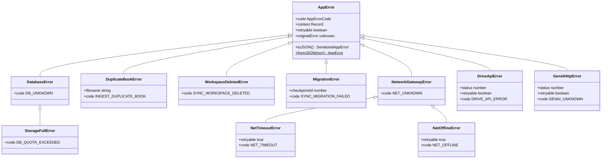
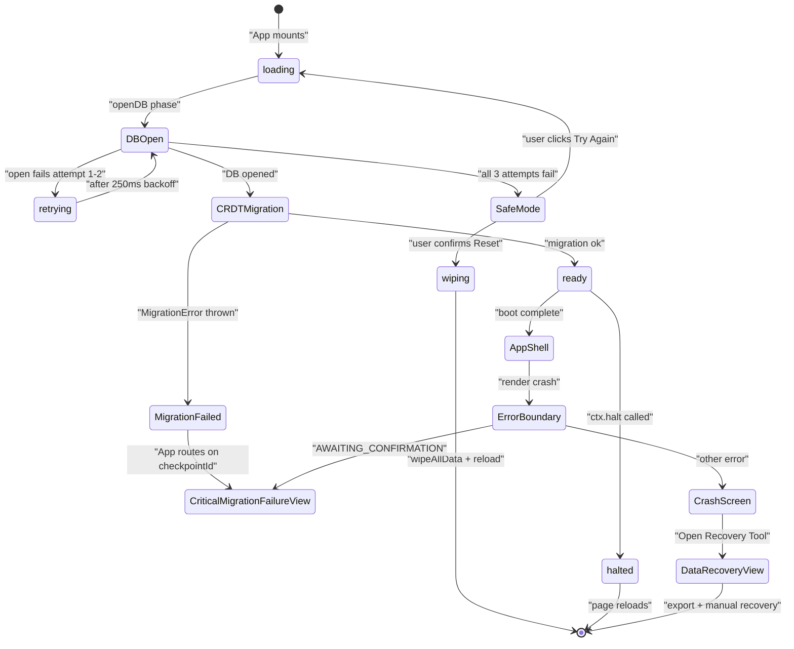
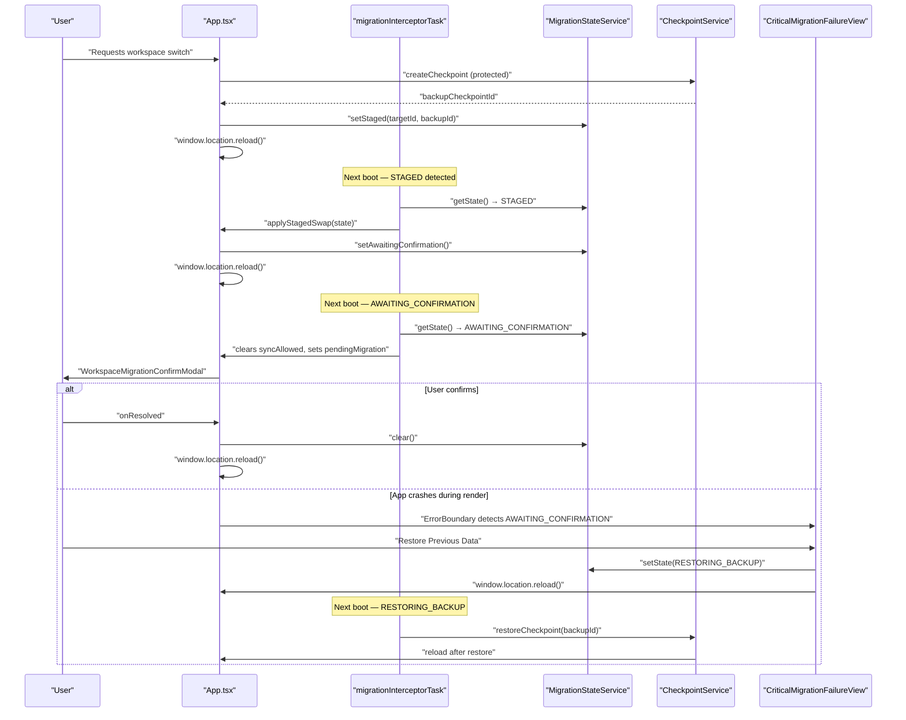
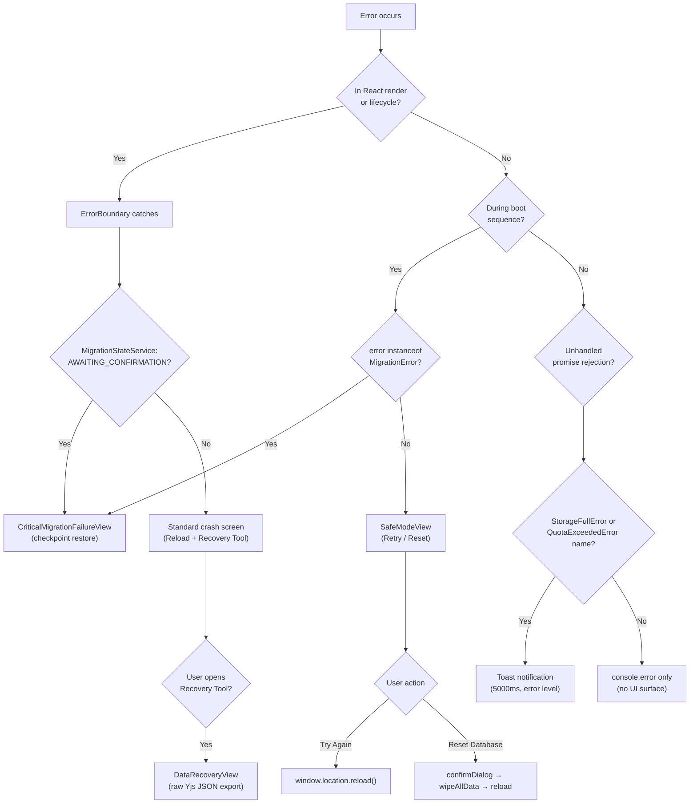
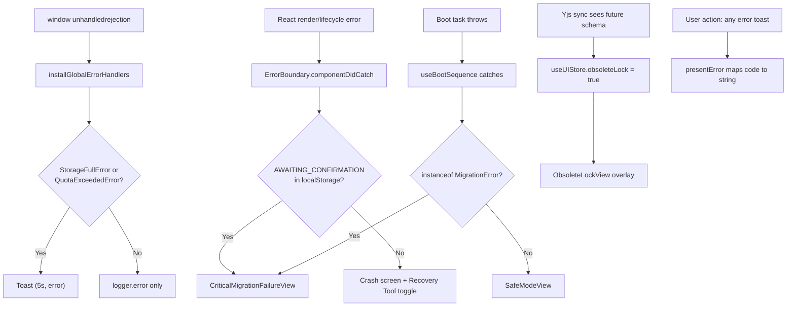

# Error Handling & Recovery

Versicle's error system is designed around a single principle: **every catch boundary produces a typed value; no layer ever branches on raw message text.** This constraint, introduced as overhaul item C10, enables two things the legacy codebase lacked — a uniform mapping from any thrown value to a user-visible string, and a safe crossing of the Web Worker boundary (where subclass identity cannot survive `postMessage`).

This document covers the full stack: the `AppError` taxonomy and its invariants, the boundary-mapping helpers that enforce the contract, the global unhandled-rejection handler, the React `ErrorBoundary`, the `SafeModeView` that appears when boot itself fails, the `CriticalMigrationFailureView` for CRDT migration crashes, and the `ObsoleteLockView` that protects a stale tab from corrupting migrated data. It closes with the Safe Mode E2E harness and the WebKit `indexedDB` getter nuance that the test documents.

Cross-references to related chapters: [Bootstrap & Lifecycle](14-bootstrap-and-lifecycle.md), [Schema & Migrations (IDB)](21-schema-and-migrations-idb.md), [CRDT Format & Migrations](22-crdt-format-and-migrations.md), [State Management CRDT](13-state-management-crdt.md), [Backup & Restore](23-backup-and-restore.md), [Observability & Diagnostics](74-observability-and-diagnostics.md).

---

## 1. Design intent

### 1.1 The problem with legacy error handling

Before C10, every catch block in Versicle either swallowed the error silently, called `console.error` and continued, or forwarded `error.message` directly to the UI. Three hazards arose:

1. **Message fragility.** UI strings were assembled from `error.message` prose written by services — prose that could change without notice. Callers used `message.includes('is not connected')` (documented as `GG-7` in the Google auth domain) for behavioral branching, which is the most brittle possible coupling.
2. **Worker boundary opacity.** Errors thrown inside the TTS Web Worker (running via Comlink) lost their subclass identity on deserialisation. `error instanceof StorageFullError` always returned `false` on the main thread, so the quota handler never fired.
3. **Missing retry metadata.** Nothing in the error value distinguished "definitely broken, don't retry" from "transient, retry is safe" — callers guessed.

### 1.2 The C10 solution

The solution is a **single base class** (`AppError`) with three structural properties beyond the standard `Error`:

- `code` — a string literal from an append-only registry. The code is the stable discriminant; classes and messages may be refactored, codes never are.
- `context` — a structured, log-safe bag (`Record<string, unknown>`). Safe to persist or send to diagnostics; must not contain PII.
- `retryable` — a boolean. Defaulting to `false`; networking and quota errors that are genuinely worth retrying set it explicitly.

A companion `toJSON()` / `fromJSON()` round-trip enables lossless enough crossing of the Worker boundary: `code`, `message`, `context`, `retryable`, `name`, and `stack` survive exactly; the `cause` chain is flattened to a message array (`causeChain`). The critical invariant is that `code` is the discriminant on both sides of the boundary — subclass identity is not revived, and no caller should need it to be.

---

## 2. The `AppError` taxonomy

All error types live in [src/types/errors.ts](../../src/types/errors.ts).

### 2.1 Code registry

Codes are collected in the `APP_ERROR_CODES` tuple, which is `as const satisfies readonly \`${AppErrorNamespace}_${Uppercase<string>}\`[]`. A TypeScript compile error fires if any code violates the namespace-prefix rule. Codes are **append-only**: old codes may appear in persisted diagnostics or in cross-version worker messages, so renaming or removing one silently breaks consumers.

The current namespaces are:

| Namespace | Domain |
|-----------|--------|
| `APP` | Cross-cutting / fallback |
| `DB` | IndexedDB / local persistence |
| `SYNC` | Firestore / Yjs sync |
| `TTS` | Speech engine and providers |
| `GENAI` | Gemini structured-output boundary |
| `DRIVE` | Google Drive HTTP boundary |
| `INGEST` | Book import / EPUB ingestion |
| `NET` | Network/fetch failures, egress gateway |
| `BACKUP` | Backup snapshot capture and restore |
| `GOOGLE` | Google OAuth boundary |
| `SEARCH` | In-book search engine/session |

The exhaustiveness test in [src/types/errors.test.ts](../../src/types/errors.test.ts) constructs a `Record<AppErrorCode, AppErrorNamespace>` that will fail to compile if any code is added without mapping it to a namespace. This means neither the registry nor the test can diverge silently.

### 2.2 The `AppError` base class

```typescript
// src/types/errors.ts
export class AppError extends Error {
  readonly code: AppErrorCode;          // stable, append-only discriminant
  readonly context?: Record<string, unknown>; // log-safe structured detail
  readonly retryable: boolean;          // defaults to false

  constructor(message: string, options: AppErrorOptions = {}) {
    super(message, options.cause === undefined ? undefined : { cause: options.cause });
    this.name = 'AppError';
    this.code = options.code ?? 'APP_UNKNOWN';
    this.context = options.context;
    this.retryable = options.retryable ?? false;
  }

  get originalError(): unknown { return this.cause; } // deprecated alias

  toJSON(): SerializedAppError { ... }
  static fromJSON(json: SerializedAppError): AppError { ... }
}
```

The `originalError` getter is the pre-taxonomy alias for `cause`, kept for call sites that predate C10. It is deprecated; new code uses `error.cause` directly.

### 2.3 Concrete subclasses

The taxonomy ships with several concrete subclasses for domains that existed before the typed errors phase:

```typescript
// Hierarchy under AppError
AppError
├── DatabaseError           (code: DB_UNKNOWN)
│   └── StorageFullError    (code: DB_QUOTA_EXCEEDED) — maps QuotaExceededError
├── DuplicateBookError      (code: INGEST_DUPLICATE_BOOK) — carries filename
└── WorkspaceDeletedError   (code: SYNC_WORKSPACE_DELETED) — workspace tombstone
```

`MigrationError` (in [src/app/migrations.ts](../../src/app/migrations.ts)) extends `AppError` with `code: 'SYNC_MIGRATION_FAILED'` and carries an optional `checkpointId: number` — the id of the pre-migration checkpoint taken before any destructive operation. The `ErrorBoundary` and `App.tsx` both check for `instanceof MigrationError` to route to `CriticalMigrationFailureView` instead of `SafeModeView`.

Domain-level error subclasses live next to their boundary:

- [`src/kernel/net/errors.ts`](../../src/kernel/net/errors.ts) — `NetworkGatewayError`, `UnknownDestinationError`, `HostNotAllowedError`, `NetConsentRequiredError`, `NetTimeoutError` (retryable), `NetOfflineError` (retryable).
- [`src/domains/google/auth/errors.ts`](../../src/domains/google/auth/errors.ts) — `GoogleAuthRequiredError`, `GoogleUnknownServiceError`.
- [`src/domains/google/genai/errors.ts`](../../src/domains/google/genai/errors.ts) — `GenAINotConfiguredError`, `GenAIInvalidResponseError`, `GenAIHttpError` (retryable at 429 / ≥500).
- [`src/domains/google/drive/errors.ts`](../../src/domains/google/drive/errors.ts) — `DriveApiError` (retryable at 429 / ≥500), plus the `handleDriveError` boundary mapper.

### 2.4 `toJSON` / `fromJSON` — Worker boundary crossing

The serialization protocol flattens the `cause` chain into a string array (`causeChain`, outermost first) so it is JSON-safe:

```typescript
// src/types/errors.ts
export interface SerializedAppError {
  name: string;
  code: AppErrorCode;
  message: string;
  retryable: boolean;
  context?: Record<string, unknown>;
  causeChain: string[];  // messages of the cause chain, outermost first
  stack?: string;
}
```

On the receiving side, `fromJSON` rebuilds a base `AppError` (subclass identity is not revived — `code` is always sufficient) and re-chains the cause messages as nested plain `Error`s so the revived error re-serializes identically. The cycle-detection guard (`seen: Set<unknown>`) and the `MAX_CAUSE_CHAIN_LENGTH = 16` cap prevent infinite loops or runaway allocation when pathological cause cycles exist (this is tested in [src/types/errors.test.ts](../../src/types/errors.test.ts)).

---

## 3. AppError taxonomy — class diagram



---

## 4. Boundary-mapping helpers — the `handleDbError` pattern

The design mandates that vendor/raw errors are mapped to typed `AppError`s at **exactly one module per boundary**. The pattern is documented in `src/types/errors.ts` as the "mapping-helper convention":

1. Log via the boundary's scoped logger.
2. Rethrow errors that are already typed (`if (error instanceof AppError) throw error`).
3. Map known vendor shapes to specific subclasses/codes.
4. Fall through to the domain's generic code with the raw error as `cause`.

### 4.1 Storage boundary — `handleDbError`

[`src/data/errors.ts`](../../src/data/errors.ts) is the canonical implementation. It was relocated verbatim from the deleted `src/db/DBService.ts` so that error semantics remain identical across the refactored data layer:

```typescript
// src/data/errors.ts
export function handleDbError(error: unknown): never {
  logger.error('Database operation failed', error);
  if (error instanceof DatabaseError) throw error;
  if (error instanceof Error && error.name === 'QuotaExceededError') {
    throw new StorageFullError(error);
  }
  if (error instanceof DOMException && error.name === 'QuotaExceededError') {
    throw new StorageFullError(error);
  }
  throw new DatabaseError('An unexpected database error occurred', error);
}
```

Both the `Error.name === 'QuotaExceededError'` and the `DOMException` paths are tested in [`src/data/repos/quota-mapping.test.ts`](../../src/data/repos/quota-mapping.test.ts) — this catches the fact that different browsers report quota exhaustion through different shapes.

### 4.2 Drive boundary — `handleDriveError`

[`src/domains/google/drive/errors.ts`](../../src/domains/google/drive/errors.ts) follows the same pattern but also lets already-typed `AppError`s (including the `GOOGLE_AUTH_*` family from `GoogleAuthRequiredError`) pass through unchanged:

```typescript
export function handleDriveError(error: unknown, operation: string): never {
  if (error instanceof AppError) throw error;
  throw new AppError(`Drive ${operation} failed.`, {
    code: 'DRIVE_UNKNOWN',
    cause: error,
    context: { operation },
  });
}
```

The `if (error instanceof AppError) throw error` passthrough is critical: the Drive domain calls the egress gateway (`NetworkGateway`), which can throw `NetTimeoutError` or `NetOfflineError` — these must surface with their original codes (and their `retryable: true` flags intact) rather than being collapsed into `DRIVE_UNKNOWN`.

---

## 5. Global unhandled-rejection handler

[`src/app/boot/globalErrorHandlers.ts`](../../src/app/boot/globalErrorHandlers.ts) installs a single `window.addEventListener('unhandledrejection', ...)` listener via `installGlobalErrorHandlers()`. It is called from `useBootSequence` at mount, and its teardown is registered via the returned cleanup function so it never leaks.

The handler's scope is intentionally narrow — it does not attempt to classify every possible rejection. It catches exactly two patterns:

1. **`StorageFullError` instances** — shows a keyed toast "Storage limit exceeded. Please delete some books." for 5 000 ms.
2. **Raw `QuotaExceededError` by name** — the defensive fallback for quota errors that escaped the `handleDbError` boundary before C10 adoption was complete. Shows "Storage limit exceeded. Please free up space."

```typescript
// src/app/boot/globalErrorHandlers.ts
const handleUnhandledRejection = (event: PromiseRejectionEvent) => {
  logger.error('Unhandled Promise Rejection:', event.reason);
  if (event.reason instanceof StorageFullError) {
    useToastStore.getState().showToast(event.reason.message, 'error', 5000);
  } else if (event.reason?.name === 'QuotaExceededError' || ...) {
    useToastStore.getState().showToast('Storage limit exceeded. Please free up space.', 'error', 5000);
  }
};
```

All other unhandled rejections are logged but not surfaced to the user; the `ErrorBoundary` catches synchronous render-phase errors separately.

---

## 6. The `presentError` UI mapper

[`src/app/errors/presentError.ts`](../../src/app/errors/presentError.ts) is the single authorized entry point from `AppError` to a user-visible string. The C10 convention prohibits any UI component from reading `error.message` directly; instead they call `presentError(error)`.

```typescript
const MESSAGES: Partial<Record<string, string>> = {
  INGEST_DUPLICATE_BOOK: 'This book is already in your library.',
  INGEST_INVALID_FILE: 'That file is not a valid EPUB.',
  INGEST_FILE_MISMATCH: "That file doesn't match this book's original content.",
  INGEST_CANCELLED: 'Import cancelled.',
  INGEST_UNKNOWN: 'Failed to import book.',
  DB_QUOTA_EXCEEDED: 'Device storage full. Please delete some books.',
  SEARCH_SESSION_DISPOSED: 'Search was interrupted. Try again.',
  SEARCH_UNKNOWN: 'Search failed. Try again.',
  NET_OFFLINE: 'You appear to be offline.',
  NET_TIMEOUT: 'The request timed out. Try again.',
};

const FALLBACK = 'Something went wrong. Please try again.';

export function presentError(error: unknown): string {
  if (error instanceof AppError) return MESSAGES[error.code] ?? FALLBACK;
  return FALLBACK;
}
```

The `MESSAGES` map is currently an `en`-only static object. The module comment notes that when the Phase 8 message catalog (`src/kernel/locale/messages.ts`) reaches full coverage of error codes, `presentError` will become a catalog lookup keyed `errors.<code>` (matching the `ErrorMessages = { [C in AppErrorCode as \`errors.${C}\`]: string }` mapped type already defined there). The catalog already carries an entry for every `AppErrorCode` — the compile-time exhaustiveness is enforced by the mapped type — but `presentError` hasn't migrated to it yet.

`presentError` is called at import-site toast invocations in [`src/components/library/LibraryView.tsx`](../../src/components/library/LibraryView.tsx) and [`src/components/library/FileUploader.tsx`](../../src/components/library/FileUploader.tsx).

---

## 7. React `ErrorBoundary`

[`src/components/ErrorBoundary.tsx`](../../src/components/ErrorBoundary.tsx) is a class component (React requires a class for `componentDidCatch`). It wraps the entire application tree and catches synchronous render-phase errors.

### 7.1 State

```typescript
interface State {
  hasError: boolean;
  error: Error | null;
  errorInfo: ErrorInfo | null;
  showRecovery: boolean;  // toggle between crash screen and DataRecoveryView
}
```

### 7.2 Error routing logic

When `hasError` is true, the boundary checks `MigrationStateService.getState()` **synchronously** before deciding which fallback surface to show:

```typescript
// src/components/ErrorBoundary.tsx — render()
if (this.state.hasError) {
  const migrationState = MigrationStateService.getState();
  if (migrationState && migrationState.status === 'AWAITING_CONFIRMATION') {
    return <CriticalMigrationFailureView backupId={migrationState.backupCheckpointId} />;
  }
  if (this.state.showRecovery) {
    return <DataRecoveryView ... />;
  }
  // Standard crash screen with Reload + Open Recovery Tool
}
```

The `AWAITING_CONFIRMATION` check is critical: if the app crashed during the post-migration boot (where the downloaded remote workspace was loaded but the user hadn't yet confirmed the switch), the crash strongly suggests that the new workspace data is incompatible with this app version. The right recovery surface is the checkpoint-restore flow, not a generic "reload" button. This path is pinned by [`src/App_MigrationFailure.test.tsx`](../../src/App_MigrationFailure.test.tsx).

### 7.3 DataRecoveryView escape hatch

The standard crash fallback shows two buttons: **Reload Page** (calls `window.location.reload()`) and **Open Recovery Tool**. The latter toggles `showRecovery: true`, which renders `DataRecoveryView` inline — an emergency data-export panel that reads the raw Yjs update from IndexedDB via `readSnapshot()` and presents a JSON dump of all CRDT root types. This is the last-resort data-rescue path before a full wipe.

---

## 8. Boot-failure surfaces

The boot sequence ([`src/app/bootstrap.ts`](../../src/app/bootstrap.ts)) runs tasks in eight sequential phases. If any task throws, `useBootSequence` transitions to `{ status: 'error', error: unknown }` and `App.tsx` branches into a recovery surface. If a task calls `ctx.halt()`, the state becomes `{ status: 'halted' }` and the app stays on the loading screen while the page reloads.

### 8.1 `AppBootState`

```typescript
// src/app/boot/useBootSequence.ts
export type AppBootState =
  | { status: 'loading'; message: string }
  | { status: 'ready'; pendingMigration: PendingWorkspaceMigration | null }
  | { status: 'halted'; reason: BootHaltReason; message: string }
  | { status: 'error'; error: unknown };
```

### 8.2 `App.tsx` dispatch

```typescript
// src/App.tsx — the body IIFE
if (boot.status === 'error') {
  if (boot.error instanceof MigrationError) {
    return <CriticalMigrationFailureView backupId={boot.error.checkpointId} />;
  }
  return <SafeModeView error={boot.error} onReset={handleReset} onRetry={() => window.location.reload()} />;
}
if (boot.status === 'loading' || boot.status === 'halted' || !swInitialized) {
  return <LoadingSpinner message={...} />;
}
// ... normal router
```

The `MigrationError` instanceof check is the same guard the `ErrorBoundary` applies, but from the boot side — CRDT migration failure is the only boot error that routes to `CriticalMigrationFailureView`.

---

## 9. Safe Mode — DB-open failure

### 9.1 Trigger

The `openDB` boot phase is registered as the `'openDB'` task under `src/app/boot/openDatabase.ts`. It calls `getConnection()`, which attempts to open the `EpubLibraryDB` IndexedDB database with 3 retries and a 250 ms backoff between attempts (`OPEN_RETRY_ATTEMPTS = 3`, `OPEN_RETRY_BACKOFF_MS = 250`):

```typescript
// src/data/connection.ts
async function openWithRetry(): Promise<IDBPDatabase<EpubLibraryDB>> {
  let lastError: unknown;
  for (let attempt = 1; attempt <= OPEN_RETRY_ATTEMPTS; attempt++) {
    try {
      return await openConnection();
    } catch (error) {
      lastError = error;
      logger.warn(`IndexedDB open attempt ${attempt}/${OPEN_RETRY_ATTEMPTS} failed:`, error);
      if (attempt < OPEN_RETRY_ATTEMPTS) await delay(OPEN_RETRY_BACKOFF_MS);
    }
  }
  throw lastError;
}
```

If all three attempts fail, the rejection propagates up through the bootstrap sequencer, `useBootSequence` catches it, and `App.tsx` renders `SafeModeView`.

### 9.2 `SafeModeView` component

[`src/components/SafeModeView.tsx`](../../src/components/SafeModeView.tsx) is a dependency-free React function component — it imports only `Button` from the design system. It receives three props:

| Prop | Type | Purpose |
|------|------|---------|
| `error` | `unknown` | The failure that caused Safe Mode — rendered as `error.message` + optional `error.stack` |
| `onReset` | `() => void` | "Reset Database (Data Loss)" — destructive wipe |
| `onRetry` | `() => void` | "Try Again" — calls `window.location.reload()` |

The component always shows the raw error message and stack, even in production, because Safe Mode implies the app is not functional and the user or support staff may need the diagnostic detail.

### 9.3 Safe-Mode reset flow

The "Reset Database" button calls `onReset`, which in `App.tsx` is:

```typescript
const handleReset = async () => {
  const confirmed = await confirmDialog({
    titleKey: 'app.resetAll.title',
    bodyKey: 'app.resetAll.body',
    confirmKey: 'app.resetAll.confirm',
    danger: true,
  });
  if (!confirmed) return;
  try {
    await wipeAllData();
  } catch (err) {
    logger.error('Failed to wipe data:', err);
    useToastStore.getState().showToast('app.resetAll.failed', 'error', 8000);
  }
};
```

The `confirmDialog` is a programmatic call into `ConfirmHost` (mounted above the boot gate in `App.tsx` — deliberately above so it renders even in Safe Mode). The native `confirm()` / `alert()` APIs are banned at lint `error` level. `wipeAllData()` (from [`src/data/wipe.ts`](../../src/data/wipe.ts)) is the canonical owner of "clear all local Versicle data":

1. Runs registered writer-stopping hooks (stops sync, drops y-idb persistence).
2. Explicitly closes the `EpubLibraryDB` and dictionary connections.
3. Deletes four IndexedDB databases: `versicle-yjs`, `versicle-yjs-staging`, `EpubLibraryDB`, `versicle-dict`.
4. Removes all Versicle-owned `localStorage` keys (by exact name and by prefix: `versicle`, `__VERSICLE_`, `mockGenAI`).
5. Clears Piper voice and SW asset caches from `CacheStorage`.
6. If any database deletion was blocked (another tab holds a connection), throws an error after clearing everything else.
7. Calls `window.location.reload()`.

Safe Mode safety argument: the wipe hooks are registered at manifest-import time (`registerBootTasks.ts`), not at boot-completion time. So even if the app crashed before the boot sequence completed, the writers that would have been started were never started — the missing hook stops nothing.

---

## 10. Boot-failure → recovery — state diagram



---

## 11. Critical migration failure — checkpoint restore

### 11.1 When it triggers

`CriticalMigrationFailureView` appears in two distinct situations:

1. **Boot-side:** `App.tsx` detects `boot.error instanceof MigrationError` — the CRDT migration coordinator (`src/app/migrations.ts`) threw before or during a doc transform.
2. **Render-side:** `ErrorBoundary` detects `MigrationStateService.getState()?.status === 'AWAITING_CONFIRMATION'` — the workspace switch downloaded a remote doc and the app tried to render it but crashed (schema incompatibility between the remote doc and this app version).

Both paths lead to the same component, [`src/components/sync/CriticalMigrationFailureView.tsx`](../../src/components/sync/CriticalMigrationFailureView.tsx), with an optional `backupId: number`.

### 11.2 The rollback action

```typescript
// src/components/sync/CriticalMigrationFailureView.tsx
const handleRollback = async () => {
  setIsRollingBack(true);
  if (backupId != null) {
    MigrationStateService.setState({
      status: 'RESTORING_BACKUP',
      backupCheckpointId: backupId,
    });
    window.location.reload();
  } else {
    logger.error('No backup ID available for rollback');
    MigrationStateService.clear();
    window.location.reload();
  }
};
```

The pattern: set localStorage to `RESTORING_BACKUP` state, then reload. On the next boot, the `migrationInterceptorTask` picks up the `RESTORING_BACKUP` state and executes `CheckpointService.restoreCheckpoint(backupId, { pauseSync, setActiveWorkspaceId })`, which writes the snapshot back to the Yjs database and reloads again into a clean state. The checkpoint itself was taken by the CRDT migration coordinator **before any transform ran** (`CheckpointService.createCheckpoint('pre-crdt-migration-v…', { protected: true })`).

### 11.3 Pre-migration checkpoint guarantee

The coordinator in [`src/app/migrations.ts`](../../src/app/migrations.ts) creates the checkpoint before the first transform:

```typescript
// src/app/migrations.ts — runCrdtMigrationsOnDoc
try {
  checkpointId = await createCheckpoint(`pre-crdt-migration-v${target}`);
} catch (cause) {
  throw new MigrationError(
    `Pre-migration checkpoint failed; migration v${from} → v${target} aborted before any change.`,
    { cause, context: { from, target } },
  );
}
```

If the checkpoint itself fails, the migration is **aborted before any data is touched**. The resulting `MigrationError` carries no `checkpointId`, but no data was modified either. If the migration transform fails mid-flight, the thrown `MigrationError` carries the valid `checkpointId` for the restore flow. The `protected: true` flag prevents automated pruning of the checkpoint while the migration recovery is pending.

### 11.4 `MigrationStateService` — the localStorage bridge

[`src/domains/sync/workspaces/MigrationStateService.ts`](../../src/domains/sync/workspaces/MigrationStateService.ts) is a static-only class that persists `SyncMigrationState` under the key `__VERSICLE_MIGRATION_STATE__`. It survives page reloads and is the ONLY cross-reload coordination mechanism for the workspace-switch state machine.

The `SyncMigrationState` type has three statuses: `STAGED`, `AWAITING_CONFIRMATION`, `RESTORING_BACKUP`. The full state machine is documented in [`src/types/workspace.ts`](../../src/types/workspace.ts).

---

## 12. The workspace-migration state machine — sequence diagram



---

## 13. The `ObsoleteLockView` — stale-client protection

[`src/components/ObsoleteLockView.tsx`](../../src/components/ObsoleteLockView.tsx) is a non-dismissible full-screen overlay rendered from `App.tsx` only when `useUIStore(state => state.obsoleteLock)` is truthy.

The `obsoleteLock` flag is set by the Yjs middleware when it detects that the cloud document carries a schema version higher than `CURRENT_SCHEMA_VERSION`. A stale client that attempted to write to the already-migrated doc would corrupt it. The lock prevents any interaction; the only action available is **Reload After Updating**.

This is distinct from Safe Mode in a critical way:

| | `SafeModeView` | `ObsoleteLockView` |
|---|---|---|
| Trigger | IDB open failure during boot | Live Yjs sync delivers a schema version newer than the current build |
| Data safety concern | Local storage possibly corrupt | Remote data is migrated beyond what this build understands |
| Recovery action | Retry or destructive wipe | Update the app and reload |
| Dismissible? | No — user must act | No — user must act |
| Renders during boot | Yes (renders instead of the app) | No (renders over the app shell) |

The view displays the current schema version (`CURRENT_SCHEMA_VERSION` from `yjs-provider`) so users and support staff know which version the app is running.

---

## 14. Error surface decision tree



---

## 15. Connection lifecycle errors

The `EpubLibraryDB` connection (managed in [`src/data/connection.ts`](../../src/data/connection.ts)) has three asynchronous lifecycle events that require UI notification. The data layer never imports UI, so the wiring happens in the boot task [`src/app/boot/openDatabase.ts`](../../src/app/boot/openDatabase.ts) via `configureConnectionEvents()`:

### 15.1 `onBlocked`

Another tab holds an older schema version open, preventing the schema upgrade. Toast: "Waiting for another Versicle tab to close before the database can update…" (8 000 ms, `info` level). The block is usually resolved when the blocking tab is closed or reloaded.

### 15.2 `onBlocking`

This tab's connection was blocking another tab's schema upgrade. The connection is already closed by the time this fires (the `blocking` callback in `openDB` calls `closeConnection()` immediately). Toast: "Versicle was updated in another tab. Please reload this tab." (duration 0 = persistent). The current tab cannot continue using the database.

### 15.3 `onTerminated`

The browser killed the connection (storage eviction or quota pressure). `connection.ts` already drops the cached promise so the next `getConnection()` call reopens. Toast: "The browser closed the database connection. If problems persist, reload." (8 000 ms, `error` level).

---

## 16. The ring recorder — diagnostics support

[`src/kernel/diagnostics/ringRecorder.ts`](../../src/kernel/diagnostics/ringRecorder.ts) is the kernel-level ring-buffer event core used by flight recorders (currently by `TTSFlightRecorder` and planned for reader/sync). It is not itself an error handler, but it is the diagnostic substrate that error events are recorded into.

Key design invariants:

- **No internal imports.** The kernel module imports nothing from the Versicle codebase. It is a pure TypeScript class.
- **Hot-path discipline.** `record()` is a fixed-cost append: ring overwrite when full, per-string truncation to `maxStringLength` (default 80) in the payload, no allocation beyond the event object.
- **Default capacity: 2 000 events.** When the buffer is full, the oldest event is overwritten.
- **Chronological export.** `export()` reconstructs the chronological order from the ring (concatenating `buffer[head…end]` + `buffer[0…head-1]`).

```typescript
// src/kernel/diagnostics/ringRecorder.ts
export interface RingEvent<S extends string = string> {
  seq: number;   // sequential counter — ordering even with identical timestamps
  ts: number;    // monotonic performance.now()
  wall: number;  // Date.now() — wall-clock for log correlation
  src: S;        // subsystem that generated the event
  ev: string;    // specific event name
  d?: RingEventData; // optional truncated payload
}
```

Domain wrappers (e.g. `TTSFlightRecorder`) own anomaly heuristics, snapshot assembly, and IndexedDB persistence — the ring recorder itself stays generic. See [Observability & Diagnostics](74-observability-and-diagnostics.md) for the full flight-recorder architecture.

---

## 17. Safe Mode E2E test and the WebKit `indexedDB` getter nuance

The Playwright journey [`verification/test_safe_mode.spec.ts`](../../verification/test_safe_mode.spec.ts) verifies the full Safe Mode path: IDB failure → `SafeModeView` → visible buttons.

The injection strategy patches `window.indexedDB.open` to throw synchronously for `EpubLibraryDB`:

```typescript
// verification/test_safe_mode.spec.ts
await page.addInitScript(() => {
  const real = window.indexedDB;
  const originalOpen = real.open.bind(real);
  real.open = function (...args) {
    if (args[0] === 'EpubLibraryDB') {
      throw new Error('Simulated DB Failure');
    }
    return originalOpen(...args);
  };
  // WebKit's `window.indexedDB` is a getter that hands back a fresh
  // IDBFactory wrapper on repeated reads, so the `.open` override above is
  // dropped between connection.ts's open retries — the retry then hits a
  // clean native factory, succeeds, and the app boots normally instead of
  // entering Safe Mode.
  Object.defineProperty(window, 'indexedDB', { configurable: true, get: () => real });
});
```

The comment explains the WebKit nuance: on WebKit (Safari), `window.indexedDB` is implemented as a getter that returns a **new** `IDBFactory` wrapper object on each access. When `connection.ts`'s `openWithRetry()` catches the error from attempt 1 and loops back to attempt 2, `openConnection()` calls `openDB(...)`, which internally accesses the bare `indexedDB` global (not the patched reference captured by `real`). On WebKit, this second access gets a fresh, unpatched factory — the override is invisible, `EpubLibraryDB` opens successfully, and the app boots normally instead of entering Safe Mode.

The fix pins the getter with `Object.defineProperty(window, 'indexedDB', { configurable: true, get: () => real })`, ensuring that **every** read of `window.indexedDB` — including reads by the `idb` library internally — returns the same patched factory. On Chromium, `window.indexedDB` is a stable object reference, so the `Object.defineProperty` call is a safe no-op.

This is a well-documented WebKit behaviour for object-valued getters on the Window prototype. It does not affect production code (production code does not rely on patching `IDBFactory`), but it is essential for Safe Mode E2E test reliability on `--project=webkit`.

---

## 18. The wipe orchestration — error handling inside `wipeAllData`

[`src/data/wipe.ts`](../../src/data/wipe.ts) is designed to be maximally resilient: it clears as much as possible even when individual steps fail.

### 18.1 Writer-stopping hooks

The hook registry (`Map<string, WipeHook>`) is populated at manifest-import time (`registerBootTasks.ts` calls `registerWipeHook` for the Firestore sync manager and the y-idb persistence binding). Each hook's `stop()` is wrapped in a 5 000 ms timeout:

```typescript
// src/data/wipe.ts
const STEP_TIMEOUT_MS = 5000;

const withTimeout = async (promise: Promise<unknown>, label: string): Promise<void> => {
  // ...races the promise against a timeout, warns but continues
};
```

Hooks that fail or time out are skipped with a `logger.warn` — the wipe continues regardless.

### 18.2 Blocked database deletion

`deleteDatabase(name)` resolves `'blocked'` when another tab still holds a connection, using `request.onblocked` from the IndexedDB API. The caller collects all blocked names and throws after completing the remaining cleanup steps:

```typescript
// src/data/wipe.ts
if (blocked.length > 0) {
  throw new Error(
    `Could not delete: ${blocked.join(', ')}. Another Versicle tab is holding ` +
    'the database open — close all other Versicle tabs and try again.'
  );
}
```

This means `wipeAllData` can throw even though it cleared localStorage and caches. The Safe Mode UI in `App.tsx` shows this error as a toast (`app.resetAll.failed`) rather than a modal.

### 18.3 Four storage surfaces covered

```
1. IndexedDB: versicle-yjs, versicle-yjs-staging, EpubLibraryDB, versicle-dict
2. localStorage: exact keys (tts-storage, sync-storage, …) + prefixes (versicle, __VERSICLE_, mockGenAI)
3. CacheStorage: piper-voices*, versicle-dict-assets*, versicle-fonts*, versicle-piper-runtime*
4. (Service-worker precache intentionally excluded — no user data, SW lifecycle manages it)
```

---

## 19. Cross-cutting invariants

| Invariant | Location | Enforcement |
|-----------|----------|-------------|
| Error codes are append-only | [`src/types/errors.ts`](../../src/types/errors.ts) | Code review + `satisfies` compile check |
| Every code is `<NAMESPACE>_<UPPER>` | same | `satisfies readonly \`${AppErrorNamespace}_${Uppercase<string>}\`[]` |
| Every code maps to a namespace | [`src/types/errors.test.ts`](../../src/types/errors.test.ts) | Compile-time exhaustiveness via `Record<AppErrorCode, AppErrorNamespace>` |
| UI never renders `error.message` directly | [`src/app/errors/presentError.ts`](../../src/app/errors/presentError.ts) | Convention, ESLint in future |
| Boundary mappers rethrow AppErrors unchanged | `handleDbError`, `handleDriveError` | Code review + integration tests |
| `retryable` defaults to false | `AppError` constructor | Type default |
| Safe Mode reset routes through `wipeAllData` | [`src/App.tsx`](../../src/App.tsx) | Pinned by regression test in [`src/App_SW_Wait.test.tsx`](../../src/App_SW_Wait.test.tsx) |
| `confirmDialog` used (not native `confirm`) | `App.tsx` `handleReset` | Lint rule banning native dialog APIs |
| Pre-migration checkpoint taken before any transform | [`src/app/migrations.ts`](../../src/app/migrations.ts) | Coordinator design, tested in `migrations.test.ts` |
| Migration state bridges reloads via localStorage | [`src/domains/sync/workspaces/MigrationStateService.ts`](../../src/domains/sync/workspaces/MigrationStateService.ts) | State-machine transitions; boot integration tests |

---

## 20. Error surface hierarchy summary



---

## 21. Testing coverage

| Test file | What it covers |
|-----------|---------------|
| [`src/types/errors.test.ts`](../../src/types/errors.test.ts) | Code registry exhaustiveness, `toJSON`/`fromJSON` round-trips, cause chains, cycle detection |
| [`src/data/repos/quota-mapping.test.ts`](../../src/data/repos/quota-mapping.test.ts) | `handleDbError` maps both `DOMException` and `Error.name === 'QuotaExceededError'` shapes to `StorageFullError` |
| [`src/App_MigrationFailure.test.tsx`](../../src/App_MigrationFailure.test.tsx) | `MigrationError` → `CriticalMigrationFailureView`; non-migration boot errors → `SafeModeView` |
| [`src/App_SW_Wait.test.tsx`](../../src/App_SW_Wait.test.tsx) | Safe Mode reset routes through `wipeAllData`; confirm/cancel behavior |
| [`src/App_Boot.test.tsx`](../../src/App_Boot.test.tsx) | Boot interceptor state machine; zombie checkpoint GC; non-fatal repair failure |
| [`verification/test_safe_mode.spec.ts`](../../verification/test_safe_mode.spec.ts) | End-to-end: IDB failure → Safe Mode UI visible; Try Again + Reset Database buttons present; WebKit getter pin |

---

## 22. Related documentation

- [Bootstrap & Lifecycle](14-bootstrap-and-lifecycle.md) — the full boot phase registry and `BootContext` contract.
- [CRDT Format & Migrations](22-crdt-format-and-migrations.md) — the migration steps, `MIGRATION_ORIGIN`, and F.3 convergence tests.
- [Backup & Restore](23-backup-and-restore.md) — `CheckpointService`, the protected checkpoint mechanism, and restore flow.
- [State Management CRDT](13-state-management-crdt.md) — the Yjs middleware, quarantine layers, and `ObsoleteLockView` trigger path.
- [Storage Gateway](20-storage-gateway.md) — `EpubLibraryDB` schema, connection lifecycle, write-gate mechanics.
- [Observability & Diagnostics](74-observability-and-diagnostics.md) — `RingRecorder`, `TTSFlightRecorder`, flight snapshot persistence.
- [E2E Verification](64-e2e-verification.md) — the full Playwright journey suite including `test_safe_mode.spec.ts`.
