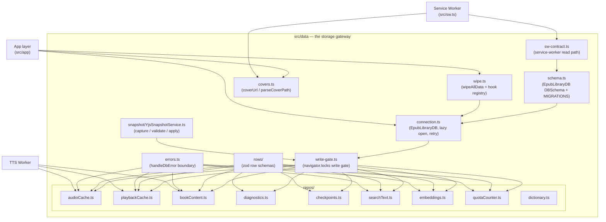
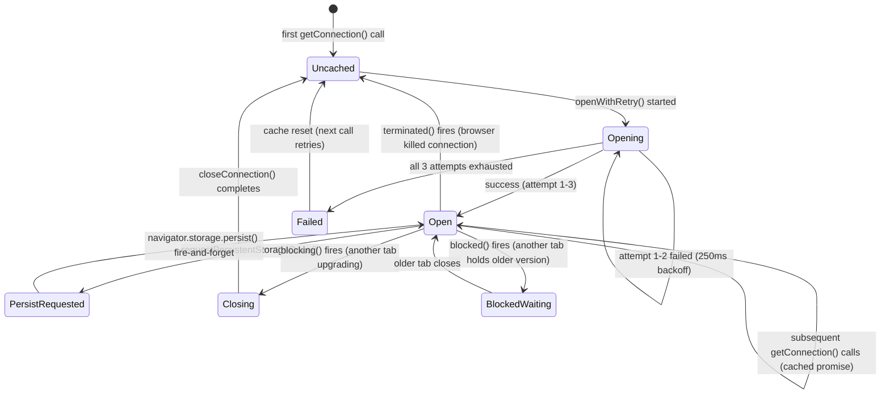
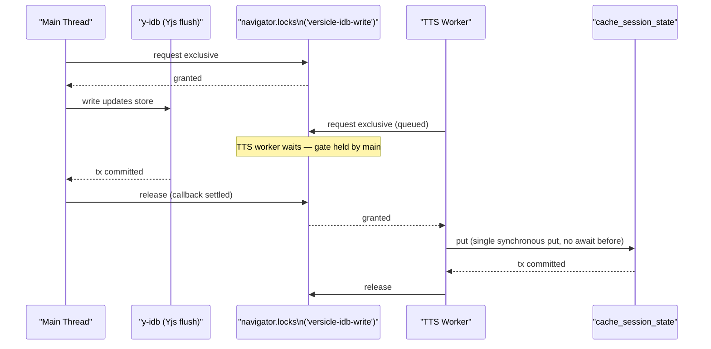
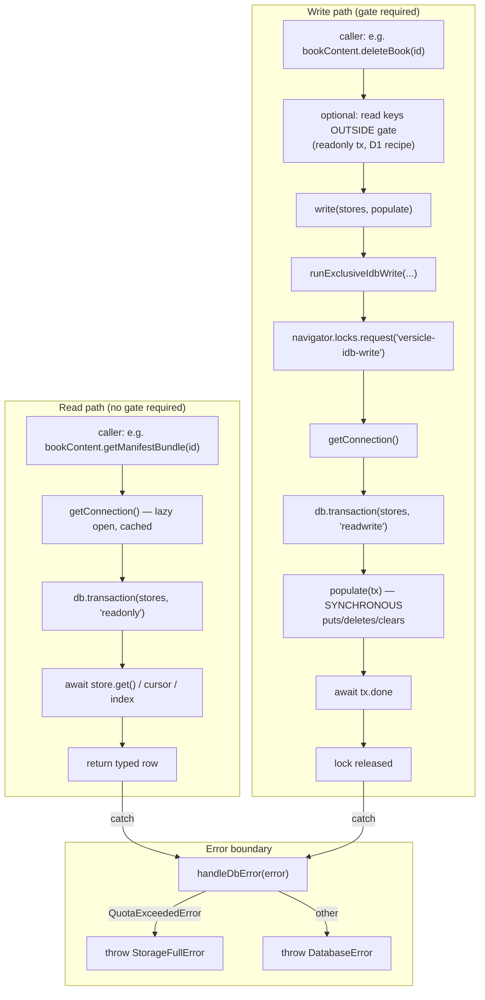
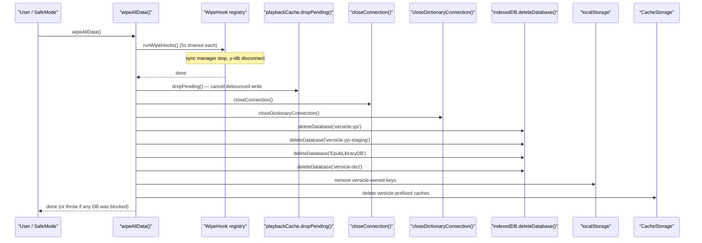
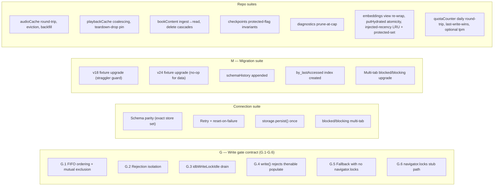

# Storage Gateway (src/data)

The `src/data` directory is the **only** IndexedDB subsystem in Versicle. Every byte stored in, read from, or deleted from IndexedDB passes through this directory's public surface. No other part of the codebase opens a `readwrite` transaction, imports from `idb`, or names an IDB store — that prohibition is enforced at error level by both ESLint and dependency-cruiser. This single-gateway discipline is not cosmetic: it is the structural fix for a class of proven multi-tab, cross-worker WebKit deadlocks that cost the team a multi-week investigation.

Understanding `src/data` is a prerequisite for working on any feature that touches book storage, TTS playback continuity, backup/restore, search indexing, or the service-worker cover route. This document explains why the subsystem is shaped the way it is, then exhaustively describes every file and behavior.

---

## Why a storage gateway?

Before Phase 3 of the overhaul program, IndexedDB access in Versicle was scattered across fourteen modules: UI components named IDB store names directly, TTS service files ran their own `readwrite` transactions, and a 670-line `DBService` god object coexisted with raw `getDB()` calls in the backup and checkpoint code. Three consequences:

**The WebKit hang.** Two concurrent `readwrite` transactions — even on _different_ object stores — intermittently deadlock WebKit's IndexedDB implementation. This was proven with `verification/_idb_probe.js`, which captured two outstanding `readwrite` transactions (one on y-idb's `updates` store, one on `cache_session_state`) starting within 1 ms of each other and then hanging for 42 seconds, wedging the TTS task sequencer. The per-JS-context promise-chain serializer (`src/lib/idb-write-lock.ts`) did not span the TTS worker, so the worker's `cache_session_state` write could overlap a main-thread Yjs flush, reintroducing the proven hang pair the moment the worker engine became the default path.

**Schema fragility.** Store-name literals appeared in seven modules outside `src/db/`. Any schema change required auditing the entire tree, and tests mocked at three different seams.

**Clear-All left Yjs data.** The UI-owned "Clear All Data" dialog enumerated eight IDB stores by hand and called `localStorage.clear()`, missing the `versicle-yjs` IndexedDB database entirely — so a "full wipe" resurrected all user data on reload.

The gateway fixes all three: one connection, one write gate spanning every JS context, one wipe function, one surface tested exhaustively.

---

## Data-layer architecture



The layering rule is absolute: `src/data` imports from `~types/*`, `@lib/logger`, `idb`, `yjs`, `y-idb`, and `zod` only. It never imports from `@store/*`, `@lib/sync/*`, React, or Zustand. This is what makes every repository importable from the TTS worker — an invariant enforced by dependency-cruiser's `data-no-upward` rule at error level with baseline 0.

---

## The database: EpubLibraryDB at v27

The database is named `EpubLibraryDB` (constant `DB_NAME` in [schema.ts](../../src/data/schema.ts)) and lives at version 27 ([`DB_VERSION = 27`](../../src/data/schema.ts#L87)). It holds three domains:

| Domain | Stores | Nature |
|--------|--------|--------|
| **STATIC** | `static_manifests`, `static_resources`, `static_structure` | Immutable book content; written at import, deleted with the book |
| **CACHE** | `cache_render_metrics`, `cache_audio_blobs`, `cache_session_state`, `cache_tts_preparation`, `cache_table_images`, `cache_search_text`, `cache_embeddings`, `cache_embed_jobs` | Ephemeral, regenerable; can be wiped without data loss |
| **APP** | `checkpoints`, `sync_log`, `flight_snapshots`, `app_metadata` | Sync infrastructure and schema-evolution envelope |

The v27 stores `cache_embeddings` and `cache_embed_jobs` back semantic (meaning-based) search and are device-local and rebuildable like the rest of the CACHE domain. They are described under [Schema and migrations](#schema-and-migrations) and [searchText / embeddings](#embeddings-reposembeddingsts) below. The free-tier AI rate limiter's persisted daily counter does **not** get a store of its own — it lives as a single `quota-daily-usage` key in the existing `app_metadata` store (see [quotaCounter](#quotacounter-reposquotacounterts)).

All user data — library inventory, reading progress, annotations, vocabulary, reading lists — lives in the separate `versicle-yjs` IndexedDB database, managed by the vendored `y-idb` fork. That database is outside this module's connection scope but is enumerated by `wipeAllData()` and managed by `YjsSnapshotService`.

---

## Connection lifecycle



The connection module ([connection.ts](../../src/data/connection.ts)) owns the single process-wide `IDBPDatabase<EpubLibraryDB>` promise, opening it lazily and caching the result. The critical behavior fixes over the predecessor `src/db/db.ts` are:

### Retry with reset-on-failure

The predecessor cached a rejected `dbPromise` forever, bricking all database access until reload after one transient open failure (e.g. Safari private mode, locked profile). The gateway retries three times with 250 ms backoff:

```typescript
const OPEN_RETRY_ATTEMPTS = 3;
const OPEN_RETRY_BACKOFF_MS = 250;

async function openWithRetry(): Promise<IDBPDatabase<EpubLibraryDB>> {
  let lastError: unknown;
  for (let attempt = 1; attempt <= OPEN_RETRY_ATTEMPTS; attempt++) {
    try {
      return await openConnection();
    } catch (error) {
      lastError = error;
      if (attempt < OPEN_RETRY_ATTEMPTS) await delay(OPEN_RETRY_BACKOFF_MS);
    }
  }
  throw lastError;
}
```

On exhaustion, the rejection propagates to every concurrent caller, but the module-level `dbPromise` is reset to `null` — only when it still points at the failed promise, to avoid racing with a `blocking`/`terminated` handler that may have already replaced it:

```typescript
.catch((error) => {
  if (dbPromise === promise) dbPromise = null;
  throw error;
});
```

### blocked / blocking / terminated handlers

The `openDB` call receives all three lifecycle callbacks. The critical one is `blocking`: when this connection is older than what another tab is trying to upgrade to, the connection is closed immediately (before the app-layer callback fires), so the other tab's upgrade can proceed:

```typescript
blocking() {
  void closeConnection().then(() => events.onBlocking?.());
},
terminated() {
  dbPromise = null;      // drop the dead connection
  events.onTerminated?.();
},
```

The actual UI response (toast, reload prompt) is wired by `app/boot/openDatabase.ts` through [`configureConnectionEvents`](../../src/data/connection.ts#L49). The data layer never imports the toast store.

### navigator.storage.persist()

After the first successful open, `requestPersistentStorageOnce()` asks the browser to promote this origin's storage to persistent (best-effort eviction immunity). It is fire-and-forget — a denied result is logged but not surfaced to the user. The call happens exactly once per session (`persistRequested` flag), regardless of how many times `getConnection()` is called.

### closeConnection()

`closeConnection()` drops the cached promise then awaits and closes the underlying `IDBPDatabase`. It tolerates a null cache (already closed) and an already-failed open (nothing to close).

---

## The write gate

The write gate ([write-gate.ts](../../src/data/write-gate.ts)) is the most important module in `src/data`. It is the mechanism that prevents WebKit IndexedDB deadlocks across all tabs and the TTS worker.

### Why the Web Locks API

The predecessor serializer (`src/lib/idb-write-lock.ts`) was a module-level promise chain — per-JS-context state. When the TTS worker engine became the production path, the worker ran its own chain, completely independent of the main thread's. A worker `cache_session_state` write could overlap a main-thread Yjs `updates` flush, recreating exactly the proven hang pair across contexts.

The fix is `navigator.locks`: one named exclusive lock (`'versicle-idb-write'`), FIFO-fair, shared by every agent of the origin — main thread, TTS worker, and other tabs.

### Two public APIs

**`runExclusiveIdbWrite(work, label?)`** is the drop-in replacement for the old promise-chain API. It accepts any async work function, serializes it through the gate, and returns a promise for the work's result. Rejections never wedge the queue.

**`write(stores, populate)`** is the structural API for Phase 3 repositories. It opens one `readwrite` transaction over the named stores _inside_ the gate, hands it to `populate` (which must be synchronous — `void` return), then awaits `tx.done`:

```typescript
export function write<Names extends readonly StoreNames<EpubLibraryDB>[]>(
  stores: Names,
  populate: (tx: IDBPTransaction<EpubLibraryDB, Names, 'readwrite'>) => void,
): Promise<void>
```

If `populate` returns a thenable — i.e. if someone accidentally writes `async (tx) => { ... }` — the transaction is aborted and the call rejects with a `TypeError` that names the WebKit hang trigger:

```
write(): populate must be synchronous — it returned a thenable.
Intra-transaction awaits are the WebKit hang trigger this API exists to ban.
```

This makes WebKit hang trigger #2 (an intra-transaction `await get()` then `put()`) **unrepresentable** for any new code using `write()`.

### Fallback for jsdom and Safari < 15.4

`navigator.locks` is absent in jsdom (the entire vitest suite runs under jsdom) and Safari < 15.4. The gate detects this by probing `globalThis.navigator?.locks` on each call (resolved per-call so tests can install/remove a stub), and falls back to the verbatim promise-chain implementation:

```typescript
const run = locks
  ? (locks.request(LOCK_NAME, { mode: 'exclusive' }, guarded) as Promise<T>)
  : (tail.then(guarded, guarded) as Promise<T>);
```

Both implementations are exercised by the same contract suite (G.1–G.6, below).

### The `tail` promise and rejection isolation

A module-level `tail` promise tracks the most-recently-issued request's settled state. For the fallback chain, it IS the serialization mechanism; for the locks path, it enables `idbWriteLockIdle()`. After every `runExclusiveIdbWrite` call, the result is swallowed:

```typescript
tail = run.then(swallow, swallow);
```

This ensures a rejecting work never prevents subsequent works from running.

### Watchdog timer

A 10-second watchdog fires if the gate is held longer than expected:

```typescript
const watchdog = setTimeout(() => {
  logger.error(`IDB write gate held > ${WATCHDOG_MS}ms by ${label} — a wedged ` +
    'transaction inside the gate stalls every writer in every context.');
}, WATCHDOG_MS);
```

The watchdog never force-releases. A genuinely hung WebKit transaction can stall all writers in all contexts — this is the _intended_ serialization, but it must be visible in logs. The 10s threshold matches the proven 5–42s hang window from the original investigation.

### Re-entrancy DEV tripwire

In development builds, if `runExclusiveIdbWrite` is called while this context already holds the gate, a `logger.error` fires. Awaiting the inner request from within the holder would deadlock — under `navigator.locks` this stalls every context in the origin. New code using `write()` cannot express this hazard at all (synchronous callback).

### The read-modify-write recipe

Because `write()`'s populate must be synchronous, any code that needs to read before writing must do so _outside_ the gate in a plain readonly transaction first, then compute, then call `write()` with a synchronous `put`. This is documented as the "D1 recipe" throughout the repositories. The race is last-write-wins between the read and the write — identical to (actually narrower than) the races the old intra-transaction-await sites already had, since the gate's serialization means no other app writer can interleave.

---

## Cross-context write-gate sequence



Before the `navigator.locks` gate, the TTS worker's `cache_session_state` write could start while the main thread's Yjs `updates` write was still in flight, producing two concurrent `readwrite` transactions — the proven WebKit hang trigger. The gate ensures they are strictly serialized across all contexts.

---

## Schema and migrations

[schema.ts](../../src/data/schema.ts) owns the `EpubLibraryDB` TypeScript interface (the typed DBSchema), the `DB_VERSION` constant, and the append-only migration registry. The connection module imports `upgradeSchema` from here and passes it as the `upgrade` callback to `openDB`.

### Store definitions

```typescript
export interface EpubLibraryDB extends DBSchema {
  // STATIC domain
  static_manifests:  { key: string; value: StaticManifestRow }
  static_resources:  { key: string; value: StaticResourceRow }
  static_structure:  { key: string; value: StaticStructureRow }
  // CACHE domain
  cache_table_images:    { key: string; value: TableImageRow; indexes: { by_bookId: string } }
  cache_render_metrics:  { key: string; value: CacheRenderMetricsRow }
  cache_audio_blobs:     { key: string; value: CacheAudioBlobRow; indexes: { by_lastAccessed: number } }
  cache_session_state:   { key: string; value: CacheSessionStateRow }
  cache_tts_preparation: { key: string; value: CacheTtsPreparationRow; indexes: { by_bookId: string } }
  cache_search_text:     { key: string; value: CacheSearchTextRow }    // v26
  cache_embeddings:      { key: string; value: CacheEmbeddingsRow }    // v27 (key IS bookId, no index)
  cache_embed_jobs:      { key: string; value: CacheEmbedJobsRow }     // v27 (key IS bookId, no index)
  // APP domain
  checkpoints:      { key: number; value: SyncCheckpointRow; indexes: { by_timestamp: number } }
  sync_log:         { key: number; value: SyncLogEntryRow; indexes: { by_timestamp: number } }
  app_metadata:     { key: string; value: AppMetadataValue }
  flight_snapshots: { key: string; value: FlightSnapshotRow }
}
```

### The migration registry

Migrations are append-only `IdbMigration` entries in the `MIGRATIONS` array. A released step's body is persisted-format surface — a later bug gets a later step, never an edit. The current registry:

| `toVersion` | What it does |
|-------------|-------------|
| 25 | Straggler guard (snapshot surviving v17/v18 user-data stores before deletion), legacy-store deletion loop, `by_lastAccessed` index on `cache_audio_blobs` |
| 26 | Creates the empty `cache_search_text` store (Phase 7 §F; additive, cache-domain, rebuildable) |
| 27 | Creates the empty `cache_embeddings` + `cache_embed_jobs` stores (`migrateToV27`; additive, cache-domain, device-local, rebuildable). Each create is `contains()`-guarded; no existing data is read or moved |

The v27 step is **decoupled** from the long-reserved `sync_log`/SW-cover cleanup. That cleanup was never carried out, so semantic search took the next free additive bump (v27) rather than waiting on it — the cleanup is now the **next** bump (v28). On an older build the two v27 stores simply do not exist, which the embeddings repo treats as "never embedded" and re-derives, so the rollback story is trivial.

The `upgradeSchema` function runs:
1. `ensureBaselineStores()` — idempotent create-if-missing for every active store (the v24 baseline kept verbatim so any pre-24 straggler still converges)
2. Each migration step where `oldVersion < step.toVersion`
3. `appendSchemaHistory()` — appends `{ from, to, at }` to `app_metadata['schemaHistory']`

### v25 straggler guard (snapshot-before-delete)

The pre-Phase-3 upgrade silently destroyed a returning pre-Yjs user's annotations, progress, and reading history by deleting deprecated stores with no backup. v25 fixes this: before the deletion loop runs, any surviving v17/v18 USER-DATA store has its rows serialized into `app_metadata['legacy-recovery-v25']`, size-capped at 8 MiB:

```typescript
export const LEGACY_RECOVERY_SIZE_CAP_BYTES = 8 * 1024 * 1024;
```

Binary fields (ArrayBuffer, TypedArray, Blob) are replaced by `{ __binary: <ctor>, byteLength }` descriptors to prevent `JSON.stringify` corruption and keep the snapshot within the budget. The result is recoverable via support/diagnostics. The ordering invariant is explicit in the code: **validation/snapshot first, destruction second — never reorder**.

---

## Row schemas (src/data/rows)

The `rows/` directory defines Zod schemas as the single source of truth for every persisted store's shape. There are four modules:

| Module | Stores covered |
|--------|----------------|
| [static.ts](../../src/data/rows/static.ts) | `static_manifests`, `static_resources`, `static_structure` |
| [cache.ts](../../src/data/rows/cache.ts) | `cache_render_metrics`, `cache_audio_blobs`, `cache_session_state`, `cache_tts_preparation`, `cache_table_images`, `cache_search_text`, `cache_embeddings`, `cache_embed_jobs` |
| [app.ts](../../src/data/rows/app.ts) | `checkpoints`, `sync_log` (frozen), `flight_snapshots`, `app_metadata` envelope |
| [backup.ts](../../src/data/rows/backup.ts) | Backup-manifest restore ingress shapes |

### Design posture

Every schema uses `z.looseObject` at the envelope — unknown fields written by other builds pass through untouched (forward compatibility). Required keys are strict. Binary fields (ArrayBuffer or Blob) use `z.custom`:

```typescript
export const binaryValueSchema = z.custom<ArrayBuffer | Blob>(
  (v) => v instanceof ArrayBuffer || v instanceof Blob,
  { message: 'Expected ArrayBuffer or Blob' },
);
```

This accepts both forms because WebKit's IDB structured clone cannot store `Blob` — ingest normalizes Blob to ArrayBuffer at write time, but rows written by pre-normalization builds may still hold a Blob. Both are valid on-disk states.

**Validation runs at untrusted ingress only** — backup restore rows, the Android payload read, and Firestore inbound data. Repos do not validate on every read/write in production (performance; observe-then-enforce posture).

### Row types as plain aliases

Row types are written as plain TypeScript `type` aliases, not `z.infer<...>`. The inferred type carries `z.looseObject`'s string index signature, which would reject domain-interface values at compile time. Compile-time drift guards at the bottom of each module pin three invariants per store:

1. `z.infer<typeof schema> extends RowType` — schema output is assignable to the row alias
2. `RowType extends DomainInterface` — row type satisfies the domain interface consumers expect
3. `DomainInterface extends RowType` — domain values can be written (the spread is needed for binary-field unions)

```typescript
// From rows/static.ts — the three-pin pattern
type _ManifestSchemaMatches = z.infer<typeof staticManifestRowSchema> extends StaticManifestRow ? true : never;
type _StructureRound = StaticStructureRow extends StaticStructure ? true : never;
const _schemaChecks: [_ManifestSchemaMatches, ...] = [true, ...];
```

This means a TypeScript build fails immediately when a Zod schema change and a domain type change diverge.

### Key cache-domain row notes

**`CacheAudioBlobRow`** carries two optional fields worth noting:
- `alignmentData?: Timepoint[]` — legacy field name written by older builds. The `audioCache` repo normalizes it onto the canonical `alignment` field on read. New rows never write it.
- `size?: number` — additive byte-length field stamped at write time (v25+). Absent on older rows; the v25 post-open idle backfill (`backfillSizesOnce`) stamps it. The eviction scan falls back to `row.audio?.byteLength` when absent.

**`CacheSessionStateRow`** embeds `TTSQueueItem[]` as the `playbackQueue`. The persisted queue-item shape lives in `rows/cache.ts` (imported by `AudioPlayerService` — the dependency arrow points inward toward data, not outward from it).

**`CacheEmbeddingsRow`** (v27) is one row per book, keyed by `bookId`, carrying a `{model, dims, quant, extractionVersion}` stamp so search can detect vectors built with a now-outdated model or settings and rebuild them. Each spine `section` holds its packed **int8** `vectors` and the per-vector float32 `scales` needed to dequantize them — both persisted as raw `ArrayBuffer`s (the typed array's `.buffer`) via an `embeddingBinarySchema` that, unlike the audio `binaryValueSchema`, accepts **only** `ArrayBuffer` (WebKit IDB cannot store typed-array views directly here). Per-chunk `cfiStart`/`cfiEnd` locators plus additive `charStart`/`charEnd` character offsets ride alongside; legacy rows lacking the offsets fall back to re-splitting (no migration). `quant` is pinned to the literal `'int8-pervec'`.

**`CacheEmbedJobsRow`** (v27) is the resumable build-progress companion, also keyed by `bookId`: per-section `embeddedThroughChunk` plus an optional `sectionTextHash` resume key (re-embed on mismatch). It dies with the book and its vectors in the same gated delete transaction.

**`AppMetadataValue`** is a union: `SchemaHistoryEntry[] | LegacyRecoveryRecord | QuotaDailyUsageRow | boolean`. Readers narrow by key using `APP_METADATA_KEYS`:

```typescript
export const APP_METADATA_KEYS = {
  schemaHistory: 'schemaHistory',
  legacyRecoveryV25: 'legacy-recovery-v25',
  audioSizeBackfillV25: 'audio-size-backfill-v25',
  quotaDailyUsage: 'quota-daily-usage',  // cross-provider quota governor's per-day counter
} as const;
```

The `quota-daily-usage` key is the only one written outside a migration: it is the cross-provider AI rate limiter's persisted daily request count for the current Pacific-time day (a stored row whose day-string differs from today counts as zero — once-a-day rollover). It deliberately reuses `app_metadata` so the quota governor needs **no dedicated store and no DB version bump**; only the per-minute request/token windows the limiter tracks stay in memory and never reach disk. Read and written solely by [quotaCounter](#quotacounter-reposquotacounterts).

---

## Repository class map

```mermaid
classDiagram
    class AudioCacheRepo {
        -putsSinceEviction: number
        +getSegment(key: string) CacheAudioBlobRow
        +putSegment(key, audio, alignment?) void
        +backfillSizesOnce() number
        +runEviction(budgetBytes?) deleted+freedBytes
    }

    class PlaybackCacheRepo {
        -sessionWriteChain: Promise
        -sessionCache: Map bookId to Row
        -sessionDirty: Set bookId
        -sessionFlushTimer
        +getSession(bookId) CacheSessionStateRow
        +saveQueue(bookId, queue) void
        +savePauseTime(bookId, time) void
        +flushPending() void
        +dropPending() void
    }

    class BookContentRepo {
        +getManifestBundle(id) ManifestBundle
        +getManifestBundleBulk(ids) ManifestBundle array
        +getManifest(bookId) StaticManifestRow
        +listManifests() StaticManifestRow array
        +getBookFile(id) Blob or ArrayBuffer
        +getSections(bookId) SectionMetadata array
        +getBookStructure(bookId) StaticStructureRow
        +getLocations(bookId) BookLocations
        +getTableImages(bookId) TableImage array
        +getTTSPreparation(bookId, sectionId) Row
        +ingest(data, mode) void
        +replaceDerivedContent(bookId, replacement) void
        +deleteBook(id) void
        +offloadBook(id) void
        +restoreResource(id, buf) void
        +saveLocations(bookId, locations) void
        +saveTTSPreparation(row) void
        +scanOrphans(validIds) counts
        +pruneOrphans(validIds) void
    }

    class CheckpointsRepo {
        +add(record, opts?) id
        +list() SyncCheckpointRow array
        +get(id) SyncCheckpointRow
        +remove(id) void
        +latestByTrigger(trigger) SyncCheckpointRow
    }

    class DiagnosticsRepo {
        +saveSnapshot(snap) void
        +listSnapshots() metadata array
        +getSnapshot(id) FlightSnapshotRow
        +deleteSnapshot(id) void
        +clearSnapshots() void
    }

    class SearchTextRepo {
        +get(bookId) CacheSearchTextRow
        +put(row) void
        +delete(bookId) void
    }

    class EmbeddingsRepo {
        +get(bookId) CacheEmbeddingsView
        +getJob(bookId) CacheEmbedJobsRow
        +put(row) void
        +putJob(row) void
        +putHydrated(row, jobRow) void
        +delete(bookId) void
        +runEviction(recencyByBookId, budget?, protected?) deleted+freedBytes
    }

    class QuotaCounterRepo {
        +load() QuotaDailyUsageRow
        +save(usage) void
    }

    AudioCacheRepo --> WriteGate : write()
    PlaybackCacheRepo --> WriteGate : runExclusiveIdbWrite()
    BookContentRepo --> WriteGate : write()
    CheckpointsRepo --> WriteGate : runExclusiveIdbWrite() + write()
    DiagnosticsRepo --> WriteGate : write()
    SearchTextRepo --> WriteGate : write()
    EmbeddingsRepo --> WriteGate : write()
    QuotaCounterRepo --> WriteGate : write()
```



All repositories are singletons exported as lowercase constants (`audioCache`, `playbackCache`, `bookContent`, `checkpoints`, `diagnostics`, `searchTextRepo`, `embeddingsRepo`, `quotaCounterRepo`). They are stateless except for `PlaybackCacheRepo` (which holds the in-memory session mirror) and `AudioCacheRepo` (which counts puts since the last eviction sweep).

---

## Repository implementations in depth

### audioCache ([repos/audioCache.ts](../../src/data/repos/audioCache.ts))

Owns the `cache_audio_blobs` store — synthesized TTS audio segments from cloud providers (Google, OpenAI, LemonFox). Worker-safe; the TTS engine worker imports this via `TTSCache`.

**`getSegment(key)`** reads a segment and bumps `lastAccessed` if the stored stamp is more than 1 hour old. The bump is fire-and-forget through `write()` — a failed bump never fails the read. It also normalizes the legacy `alignmentData` field onto `alignment` on cache hits from old builds.

**`putSegment(key, audio, alignment?)`** stamps `size: audio.byteLength` (for the eviction scan) alongside the mandatory `createdAt` and `lastAccessed`. Every `EVICTION_PUT_INTERVAL` (50) puts, it launches an opportunistic eviction sweep.

**`backfillSizesOnce()`** is a post-open idle job (run once during the `background` boot phase). It stamps the additive `size` field on rows written before P3-6 introduced it. Two-pass to avoid OOM: pass 1 streams a readonly cursor collecting only keys of rows missing `size`; pass 2 re-reads each row outside the gate and puts synchronously in batches of 10. A completion flag in `app_metadata[APP_METADATA_KEYS.audioSizeBackfillV25]` short-circuits later boots.

**`runEviction(budgetBytes = 512 MiB)`** is a two-pass LRU sweep:
- Pass 1: streaming readonly cursor collecting `{key, lastAccessed, size}` one row at a time. Never `getAll` — rows hold multi-MB audio blobs and a `getAll` would OOM.
- Pass 2: sort by `lastAccessed` ascending, delete oldest-first through `write()` in batches of 50 until the cache is under budget. Rows touched in the last 24 hours are skipped so audio cannot vanish mid-playback.

Constants:

| Constant | Value | Purpose |
|----------|-------|---------|
| `AUDIO_CACHE_BUDGET_BYTES` | 512 MiB | Default eviction budget |
| `LAST_ACCESSED_BUMP_INTERVAL_MS` | 1 hour | Debounce threshold for LRU stamp writes |
| `EVICTION_RECENT_WINDOW_MS` | 24 hours | Mid-playback safety window |
| `EVICTION_DELETE_BATCH` | 50 rows | Rows per gated delete transaction |
| `EVICTION_PUT_INTERVAL` | 50 puts | Puts between opportunistic eviction sweeps |

### playbackCache ([repos/playbackCache.ts](../../src/data/repos/playbackCache.ts))

Owns `cache_session_state` — the TTS playback session mirror. The WebKit-hang-safe block was carved **verbatim** from `src/db/DBService.ts` and is an explicitly protected keeper. Do not simplify its structure without re-reading the original investigation notes.

**The three-layer design:**

1. **In-memory mirror** (`sessionCache: Map<string, CacheSessionStateRow>`): the source of truth during a session. Mutations are synchronous; the mirror is seeded from disk on first access per book.
2. **Debounced coalescing** (`scheduleSessionWrite`, 500 ms timer, `sessionDirty` set): cross-session resume only needs the final state, not every intermediate mutation. Coalescing also minimizes how often a `readwrite` transaction is in flight — a hung transaction wedges the whole IDB connection.
3. **Serialized write** (`enqueueSessionWrite` → `writeSession`): one per-book promise chain, then the cross-context write gate, then a **single synchronous `put()`** with no await before it. This eliminates WebKit hang trigger #2 (the intra-transaction `await get()` then `put()` pattern).

```typescript
private writeSession(bookId: string): Promise<void> {
  return this.enqueueSessionWrite(async () => {
    const snapshot = { ...session };
    await runExclusiveIdbWrite(async () => {
      const tx = db.transaction('cache_session_state', 'readwrite');
      tx.objectStore('cache_session_state').put(snapshot);  // no await before this
      await tx.done;
    });
  });
}
```

**Known gaps (deferred to P5b):** Cold-start `savePauseTime` seeds the mirror from disk, but cold-start `saveQueue` constructs a fresh record and can clobber a persisted `lastPauseTime` from a previous session. The worker and main thread each hold their own `sessionCache` mirror — the navigator.locks gate removes the cross-context hang hazard, but single ownership lands with P5b's `SessionStore` port.

**`flushPending()`** cancels the timer and immediately writes all dirty sessions. Used by the E2E test API (`window.__versicleTest.flushPersistence()`).

**`dropPending()`** cancels the timer and discards the dirty set _without_ writing. Used by the wipe path — writing during teardown can race a closing connection, so drop-not-flush is the correct semantic there.

### bookContent ([repos/bookContent.ts](../../src/data/repos/bookContent.ts))

The largest repository. Owns the three static stores plus the derived cache rows that live and die with a book. Worker-safe; the TTS engine worker imports this for sections, TTS preparation, and table images.

**Reads** open readonly transactions directly (no gate needed for reads). The bulk read path (`getManifestBundleBulk`) uses one transaction over three stores simultaneously and uses `count()` instead of `getKey()` to check resource presence — avoiding unnecessary data transfer across the IDB serialization boundary:

```typescript
const manifestsPromise = Promise.all(ids.map(id => manifestStore.get(id)));
const resourceCountPromise = Promise.all(ids.map(id => resourceStore.count(id)));
const structuresPromise = Promise.all(ids.map(id => structureStore.get(id)));
```

**`ingest(data, mode)`** is the book import transaction. It normalizes all Blobs to ArrayBuffers _before_ entering the gate (WebKit's IDB structured clone rejects Blobs), then atomically writes five stores in one synchronous `write()` call. The populate function uses `silence(promise)` — each `put` returns a promise that is deliberately dropped, because the result is surfaced through `tx.done` if the transaction aborts:

```typescript
const silence = (p: Promise<unknown>) => void p.catch(() => {});
silence(manifestStore.add(manifestToStore));
// ...
```

In `mode: 'add'`, a duplicate book triggers a `ConstraintError` which aborts the transaction, and `write()` surfaces it as a rejected promise — the caller gets a `DatabaseError`.

**`replaceDerivedContent(bookId, replacement)`** absorbs what was previously raw transaction code in `lib/ingestion.ts`. It reads old index keys _outside_ the gate (D1 recipe), then in one synchronous `write()` drops old TTS prep and table image rows and writes the new ones.

**`deleteBook(id)`** spans all per-book stores including the v26 `cache_search_text` corpus and the v27 `cache_embeddings` + `cache_embed_jobs` stores — the persisted search corpus, its embedding vectors, and the resumable build-job state all die with the book, so no vectors leak past deletion:

```typescript
await write([
  'static_manifests', 'static_resources', 'static_structure',
  'cache_render_metrics', 'cache_session_state', 'cache_tts_preparation',
  'cache_table_images', 'cache_search_text',
  'cache_embeddings', 'cache_embed_jobs'
], (tx) => { /* ... */ });
```

**`restoreResource(id, epubArrayBuffer)`** uses the read-modify-write recipe: `get` outside the gate, then `write()` synchronously. The old DBService `restoreBookResource` awaited `store.get()` inside the readwrite transaction — that was WebKit hang trigger #2.

### checkpoints ([repos/checkpoints.ts](../../src/data/repos/checkpoints.ts))

Owns `cache_session_state` rows for Y.Doc recovery checkpoints. The repository uses `runExclusiveIdbWrite` directly (rather than `write()`) for `add()` because it needs cursor awaits inside the transaction to enforce the protected-flag invariants:

- **Supersede-older-protected**: only one migration can be in flight at a time, so only the newest protected checkpoint stays pinned. After inserting the new checkpoint, the repo scans all others and removes the `protected` flag.
- **Prune-skip-protected**: when over the 10-checkpoint cap, oldest rows are deleted first but protected rows are skipped.

Both invariants run inside one gated transaction. The cursor awaits keep the transaction active via `continue()` requests (not the inactive-across-await WebKit trap).

```typescript
async add(record, opts?: { protected?: boolean }): Promise<number> {
  return runExclusiveIdbWrite(async () => {
    const tx = db.transaction('checkpoints', 'readwrite');
    const id = await tx.store.add(checkpoint as SyncCheckpointRow);
    // ... supersede + prune logic with cursor awaits ...
    await tx.done;
    return id as number;
  }, 'checkpoints.add');
}
```

`CheckpointService` itself stays in `domains/sync/checkpoints` (its decomposition is P4 scope); only the IDB access moved into this repo.

### diagnostics ([repos/diagnostics.ts](../../src/data/repos/diagnostics.ts))

Owns `flight_snapshots` — the TTS flight-recorder ring-buffer snapshots. Zero contention with other repos. `saveSnapshot` scans existing metadata outside the gate (collecting only `id` and `createdAt` to avoid loading `eventsJSON` payloads, which can be hundreds of kilobytes), then deletes the oldest excess rows and writes the new snapshot in one `write()` call. The ring-buffer cap is `MAX_SNAPSHOTS = 10`.

### searchText ([repos/searchText.ts](../../src/data/repos/searchText.ts))

The simplest repository. Owns `cache_search_text` — the per-book plain-text search corpus (v26, Phase 7 §F). Written at import as a free output of the unified text extractor, lazily on first search for pre-existing books. Cache-domain: absence triggers re-extraction. The book-deletion path (`bookContent.deleteBook`) deletes the row in its own multi-store transaction; `searchTextRepo.delete()` is for explicit manual deletion.

### embeddings ([repos/embeddings.ts](../../src/data/repos/embeddings.ts))

Owns the two v27 stores `cache_embeddings` and `cache_embed_jobs` — the per-book int8 embedding vectors that power semantic search and the resumable progress of the job that computes them. Both are keyed by `bookId`, device-local, never synced as ordinary user data, and deleted with the book. Worker-safe like every repo: writes go through the gate, failures funnel through `handleDbError`. (Design: `plan/semantic-search-design.md`, `plan/shared-ai-cache-design.md`.)

**The view boundary.** `get(bookId)` re-wraps each section's stored ArrayBuffers as the typed-array views the cosine-ranking worker consumes — `vectors` → `Int8Array`, `scales` → `Float32Array` — and returns the wrapped shape (`CacheEmbeddingsView`). Persisting always uses the ArrayBuffer-shaped `CacheEmbeddingsRow`. Centralizing the wrap here means a wrong-view bug cannot leak past this boundary. `getJob(bookId)` reads as stored (no binary fields).

**`putHydrated(row, jobRow)`** writes the embedding row **and** its companion `complete` job row in **one** gated cross-store transaction. This is the cloud-refill path (the **Artifact Lane** hydrates a book another device already embedded into the user's own cloud, avoiding a re-spend of Gemini quota — see [Sync domain](36-domain-sync.md)). Atomicity is the point: the plain single-store `put`/`putJob` are two independent transactions, so a crash between them could mark a section done in the job row while its vectors are absent — and the resume logic, seeing it "done", would skip it forever. The caller's `jobRow` must mark only the sections actually present in `row` as complete, so a partial fill stays correct.

**`delete(bookId)`** removes the vectors **and** the resumable job state in one gated two-store transaction (the job progress must die with the vectors). The book-deletion path clears both inline in its own cascade as well.

**`runEviction(recencyByBookId, budgetBytes = 256 MiB, protectedBookIds = ∅)`** is the same streaming-cursor + gated-batch-delete shape as the audio cache, but `cache_embeddings` has **no** `lastAccessed` field or recency index — so the recency signal is **injected** by the caller (built from each book's last-read time), which keeps the repo store-free. Pass 1 streams a readonly cursor summing `section.vectors.byteLength + section.scales.byteLength` off the **stored** ArrayBuffers (never the re-wrapped view — re-wrapping multi-KB blobs just to measure them would defeat the streaming goal). Pass 2 deletes least-recently-read-first (a book absent from the map ranks 0 → evicts first), removing both stores per `bookId` in batches of `EVICTION_DELETE_BATCH` (50) until under budget. The budget is deliberately tighter than the 512 MiB audio budget because vectors are int8-packed and re-derivable from `cache_search_text` plus the embedding API. The injected `protectedBookIds` set is **never** evicted (its bytes still count toward the total): it is how the caller pins a book whose embeddings exist only on this device and have not yet reached the user's cloud, so eviction can never destroy the last copy before the upload completes (the "never-evict-unconfirmed-upload" rule). When AI-cache sharing is off, the set is empty and everything is evictable.

### quotaCounter ([repos/quotaCounter.ts](../../src/data/repos/quotaCounter.ts))

Persists the cross-provider AI rate limiter's daily request count so the per-day cap survives reloads and is shared across this app's tabs. It writes **no dedicated store** — `save(usage)` puts a single `QuotaDailyUsageRow` under the `quota-daily-usage` key of the existing `app_metadata` store, and `load()` reads it back and narrows the envelope to that key's shape. The limiter keeps its per-minute request/token windows in memory and reaches disk only through this one record; the short-window counters are never persisted. The quota governor that consumes it (the `QuotaGovernor` kernel subsystem in `src/kernel/quota/`, recorded at admission inside `NetworkGateway.egress` so throttling cannot be bypassed) is documented in [Architecture overview](10-architecture-overview.md) and [Google domain](39-domain-google.md); this repo is only its persistence port.

### dictionary ([repos/dictionary.ts](../../src/data/repos/dictionary.ts))

A separate `versicle-dict` IndexedDB database for the CC-CEDICT Chinese dictionary (Phase 6). Deliberately separate from `EpubLibraryDB` — the dictionary is rebuildable static content, needs no schema version bump in the main migration registry, and requires no write-gate coordination (no other tab or worker writes it). It follows the same lazy-open / reset-on-failure / terminated-handler pattern as the main connection. `wipeAllData()` includes `versicle-dict` in `APP_DATABASES` and calls `closeDictionaryConnection()` first.

---

## Read and write paths



### Error handling

[errors.ts](../../src/data/errors.ts) contains `handleDbError`, relocated verbatim from `src/db/DBService.ts`. Every repository method wraps its work in try/catch and calls `handleDbError`:

```typescript
export function handleDbError(error: unknown): never {
  if (error instanceof DatabaseError) throw error;
  if (error instanceof Error && error.name === 'QuotaExceededError') {
    throw new StorageFullError(error);
  }
  if (error instanceof DOMException && error.name === 'QuotaExceededError') {
    throw new StorageFullError(error);
  }
  throw new DatabaseError('An unexpected database error occurred', error);
}
```

Both the `Error` name check and the `DOMException` check are needed for `QuotaExceededError` — the legacy `DOMException` code 22 form and the modern `Error` subclass form are both in the wild across browser versions.

---

## The service-worker read contract

[sw-contract.ts](../../src/data/sw-contract.ts) and [covers.ts](../../src/data/covers.ts) together form the service worker's interface to IndexedDB.

### sw-contract.ts

The service worker runs in its own JS context and cannot share the app's connection. `sw-contract.ts` opens a short-lived, read-only connection at whatever version is current — an **unversioned open** (no `version` parameter to `openDB`). This is correct: the SW must never trigger or block a schema upgrade.

```typescript
export async function getCoverFromDB(bookId: string): Promise<Blob | ArrayBuffer | undefined> {
  const db = await openDB(DB_NAME); // unversioned open
  try {
    if (db.objectStoreNames.contains(STATIC_MANIFESTS_STORE)) {
      const manifest = await db.get(STATIC_MANIFESTS_STORE, bookId);
      return manifest?.coverBlob;
    }
    // Legacy fallback for pre-v18 databases
    if (db.objectStoreNames.contains(BOOKS_STORE)) {
      const book = await db.get(BOOKS_STORE, bookId);
      return book?.coverBlob;
    }
  } finally {
    db.close(); // always close — short-lived connection
  }
}
```

The `DB_NAME` constant comes from `schema.ts` — the two can no longer drift (before Phase 3, `sw-utils.ts` re-declared it locally).

The legacy `'books'` store fallback is intentionally preserved until P9: a pre-v18 straggler's covers must render before their first main-app upgrade.

### covers.ts

Book covers are served through a virtual same-origin endpoint (`/__versicle__/covers/<bookId>`), not as `blob:` URLs. This eliminates `createObjectURL` leaks and enables long-lived HTTP caching (`Cache-Control: public, max-age=31536000` in `createCoverResponse`).

Before Phase 3 the path literal appeared in five modules. Now it exists in exactly one place:

```typescript
export const COVERS_ENDPOINT_PREFIX = '/__versicle__/covers/';

export function coverUrl(bookId: string): string {
  return `${COVERS_ENDPOINT_PREFIX}${bookId}`;
}

export function parseCoverPath(pathname: string): string | null {
  if (!pathname.startsWith(COVERS_ENDPOINT_PREFIX)) return null;
  const bookId = pathname.slice(COVERS_ENDPOINT_PREFIX.length);
  return bookId.length > 0 ? bookId : null;
}
```

Note that `bookId` is interpolated raw (not URL-encoded). Book IDs are UUIDs and the SW slices the pathname without decoding — encoding here would break the contract.

---

## YjsSnapshotService

[snapshot/YjsSnapshotService.ts](../../src/data/snapshot/YjsSnapshotService.ts) provides three primitives that replace three hand-rolled implementations of the same Yjs snapshot dance:

| Primitive | What it does |
|-----------|-------------|
| `captureDoc(doc)` | `Y.encodeStateAsUpdate(doc)` — produces the `Uint8Array` backup/checkpoint format |
| `validateSnapshot(update)` | Dry-runs `Y.applyUpdate` on a scratch `Y.Doc`, throws `AppError('BACKUP_SNAPSHOT_INVALID')` for empty/garbage updates |
| `applySnapshot(update, opts?)` | Replaces the persisted Yjs state durably, through the write gate |

The live `Y.Doc` is always **passed in**, never imported. `YjsSnapshotService` must not know about `@store/yjs-provider` — this keeps it importable from the TTS worker and future non-store contexts.

`applySnapshot` delegates to the vendored fork's `writeSnapshot` primitive, which opens/creates the database with y-idb's own store layout, clears `updates`, writes one snapshot row, and commits — all inside `runExclusiveIdbWrite`. In DEV, `validateSnapshot` is called again as a last line of defense before anything is written.

A `readSnapshot` function reads the complete persisted Yjs state without constructing a live persistence binding — used by the boot-time staged workspace swap interceptor.

`deleteYjsDatabase` wraps the fork's `clearDocument` through the write gate — used to clear staging databases after a finalized switch.

---

## Data wipe

[wipe.ts](../../src/data/wipe.ts) is the single owner of all local data deletion. The ordering contract:



### WipeHook registry

The data layer cannot import store or sync modules (the `data-no-upward` rule). Writers that must be stopped are registered by the app's composition manifest:

```typescript
export interface WipeHook {
  name: string;
  stop(): Promise<void> | void;
}

export function registerWipeHook(hook: WipeHook): void {
  wipeHooks.set(hook.name, hook);  // idempotent by name
}
```

Registration happens at manifest import time, not boot success — so SafeMode can wipe even if the app crashed before any writer started.

### Blocked deletions

`deleteDatabase` resolves `'blocked'` when another tab still holds a connection. This is surfaced as a thrown `Error` after the rest of the wipe completes — the UI can tell the user to close other Versicle tabs. The error happens even on the `versicle-yjs-staging` or `versicle-dict` databases.

### Storage surfaces wiped

- `versicle-yjs`, `versicle-yjs-staging`, `EpubLibraryDB`, `versicle-dict` (IDB)
- Specific localStorage keys (`tts-storage`, `sync-storage`, `genai-storage`, etc.) plus keys matching `versicle`, `__VERSICLE_`, `mockGenAI` prefixes
- CacheStorage caches matching `piper-voices`, `versicle-dict-assets`, `versicle-fonts`, `versicle-piper-runtime` prefixes

The SW precache is intentionally left alone — it holds no user data.

---

## Test suite overview



The write-gate suite ([write-gate.test.ts](../../src/data/write-gate.test.ts)) runs the same contract body against both implementations: the native fallback (which jsdom exercises by default, since it has no `navigator.locks`) and a Web Locks stub installed with `beforeAll`. G.5 verifies that jsdom genuinely has no `navigator.locks` so the fallback path actually runs.

The connection suite ([connection.test.ts](../../src/data/connection.test.ts)) mutates module-level connection state and fully resets between tests (close connection, delete database). The first test in the file intentionally owns the first successful open because `requestPersistentStorageOnce` uses a module-level flag.

---

## Invariants and failure modes

### Invariants

1. **No readwrite transaction outside the gate.** ESLint `no-restricted-syntax` bans `transaction(..., 'readwrite')` outside `src/data/` at error level. The only exceptions are inside `src/data/` itself, which is the gate.

2. **No `idb` import outside `src/data/`.** ESLint `no-restricted-imports` bans bare `idb` outside `src/data/` at error level.

3. **Populate callbacks are synchronous.** `write()` aborts the transaction and rejects if `populate` returns a thenable.

4. **The data layer never reaches upward.** `data-no-upward` depcruise rule, error level, baseline 0. `src/data` imports `~types/*`, `@lib/logger`, `idb`, `yjs`, `y-idb`, `zod` only.

5. **Worker-safe by construction.** Every repository in `src/data/repos/` imports only from `~types/*`, `@lib/logger`, and the data layer itself. No `@store/*`, React, or Zustand.

6. **Blob→ArrayBuffer normalization at ingest.** WebKit's IDB structured clone cannot store `Blob`. `bookContent.ingest()` awaits all Blob-to-ArrayBuffer conversions _before_ opening the gate. Row schemas accept both forms (reads from old builds may return Blobs).

7. **Row types are drift-guarded.** Compile-time assertions in each `rows/*.ts` file ensure schema output, row alias, and domain interface stay in sync. A broken guard causes a TypeScript build failure.

8. **Embedding binaries are persisted as raw ArrayBuffers.** `cache_embeddings` `vectors`/`scales` are stored as the typed array's `.buffer` and re-wrapped (`Int8Array`/`Float32Array`) only on read, inside `embeddingsRepo.get`. The `embeddingBinarySchema` accepts `ArrayBuffer` only (not `Blob`), and the eviction scan sizes rows off the stored buffers, never the re-wrapped views.

### Known edge cases

**`static_manifests` `coverBlob` may be `ArrayBuffer | Blob | {}`.** Pre-Phase-3 backup restores could write `coverBlob: {}` (JSON-serialized `ArrayBuffer`). `MaintenanceService.repairCorruptCoverBlobsOnce()` scans for and removes these on first boot after restoration. The `staticManifestRowSchema` does not accept `{}` — rows corrupted this way fail validation at restore ingress and are handled by the restore sanitizer.

**`sync_log` is a dead store.** It is defined in the schema with zero production readers or writers. Its schema is frozen in `rows/app.ts` for P4 to adopt (the SyncEvent design) or P9 to delete.

**`app_metadata` keys are append-only.** Never reuse a retired key for a different shape — readers narrow by key string, and reusing a key would silently corrupt the typed union.

**The v27 bump is decoupled from the reserved cleanup.** v27 was meant to be the long-reserved `sync_log`/SW-cover cleanup, but that cleanup was never done, so semantic search took v27 for its two additive cache stores instead. The reserved cleanup is therefore now the **next** bump, v28. Because the v27 stores are device-local and rebuildable, a build that predates them (or an evicted/missing row) simply re-embeds — there is no migration to reverse and no synced format to break.

**Dictionary writes bypass the write gate.** `versicle-dict` is a separate database from `EpubLibraryDB`. Dictionary writes (`bulkPutEntries`, `clearAll`) do NOT go through the `'versicle-idb-write'` lock — the dictionary is never written concurrently with the main database, and the lock's entire purpose is to prevent overlapping `readwrite` transactions on EpubLibraryDB and the Yjs database.

**Session state dual-mirror (P5b deferred gap).** The TTS worker and the main thread each hold their own `PlaybackCacheRepo` instance and thus their own `sessionCache` map. The navigator.locks gate removes the cross-context _hang_ hazard — they cannot produce overlapping readwrite transactions. Single ownership (one authoritative mirror) lands with P5b's `SessionStore` port.

**`deleteDatabase` blocked by another tab.** `wipeAllData()` throws after completing the rest of the wipe if any database was blocked. The user must close other Versicle tabs and retry. The Yjs data is logically deleted (the connection is closed and nothing will write it again) but the file is not removed from disk until the other tab's connection closes.

---

## Cross-references

- The schema migration system and fixture tests are detailed in [Schema and Migrations (IDB)](21-schema-and-migrations-idb.md).
- The Yjs CRDT format and its own migration registry are covered in [CRDT Format and Migrations](22-crdt-format-and-migrations.md).
- Backup and restore flows that call `YjsSnapshotService` and `bookContent` are in [Backup and Restore](23-backup-and-restore.md).
- The TTS audio pipeline's use of `audioCache` and `bookContent` (TTS prep rows) is in [TTS Content Pipeline](34-tts-content-pipeline.md).
- Semantic search — int8 quantization, `SearchEngine.rankInt8`, reciprocal-rank fusion, and the foreground/background embedding indexers that fill `cache_embeddings`/`cache_embed_jobs` — is in [Search domain](38-domain-search.md).
- The `EmbeddingClient`, the `GeminiClient`, and the `QuotaGovernor`/`NetworkGateway` admission path that the `quotaCounter` repo persists for are in [Google domain](39-domain-google.md); the kernel `NetworkGateway.egress()` boundary itself is in [Architecture overview](10-architecture-overview.md).
- The Artifact Lane (the shared AI-cache that hydrates `cache_embeddings` via `embeddingsRepo.putHydrated` from the user's own cloud) and the `SyncBackend` artifact methods are in [Sync domain](36-domain-sync.md).
- The service worker's use of `sw-contract.ts` and `covers.ts` is in [PWA and Service Worker](61-pwa-and-service-worker.md).
- The bootstrap sequence that calls `getConnection()` and wires `configureConnectionEvents` is in [Bootstrap and Lifecycle](14-bootstrap-and-lifecycle.md).
- The layering rule that makes `src/data` the floor of the import graph is explained in [Layering and Boundaries](11-layering-and-boundaries.md).
- The overhaul history that produced the Phase 3 storage gateway — including the WebKit deadlock investigation — is in [Overhaul History](80-overhaul-history.md).
