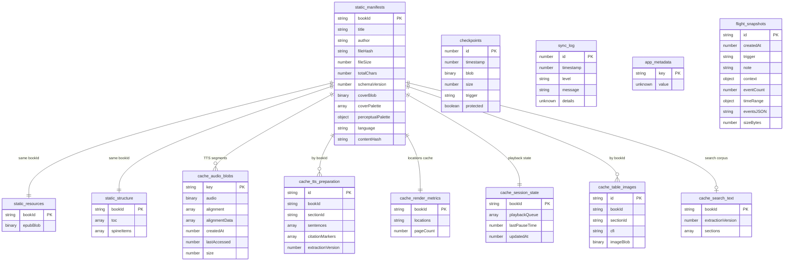
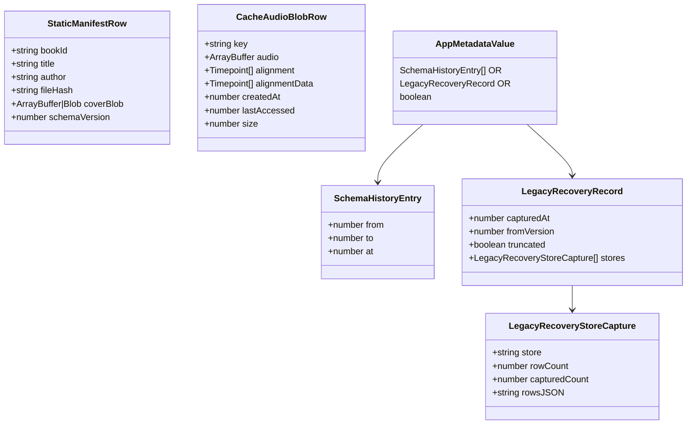
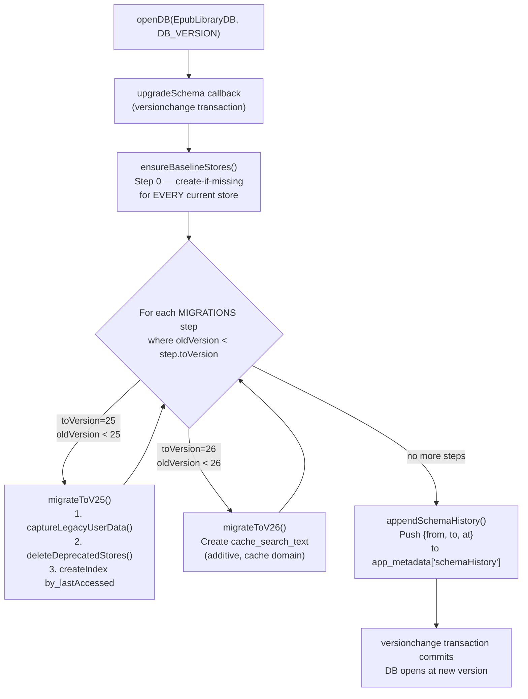
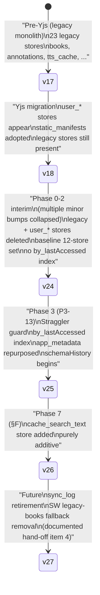
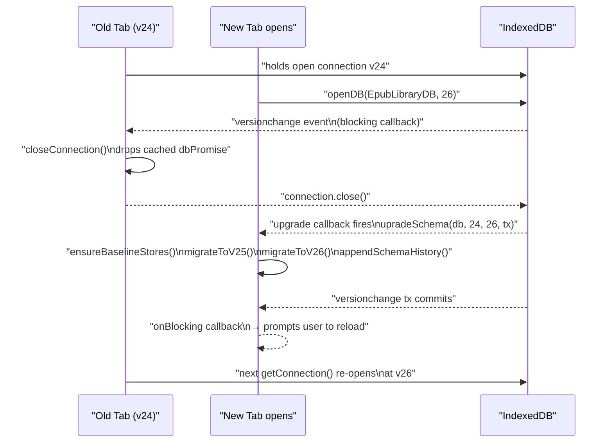
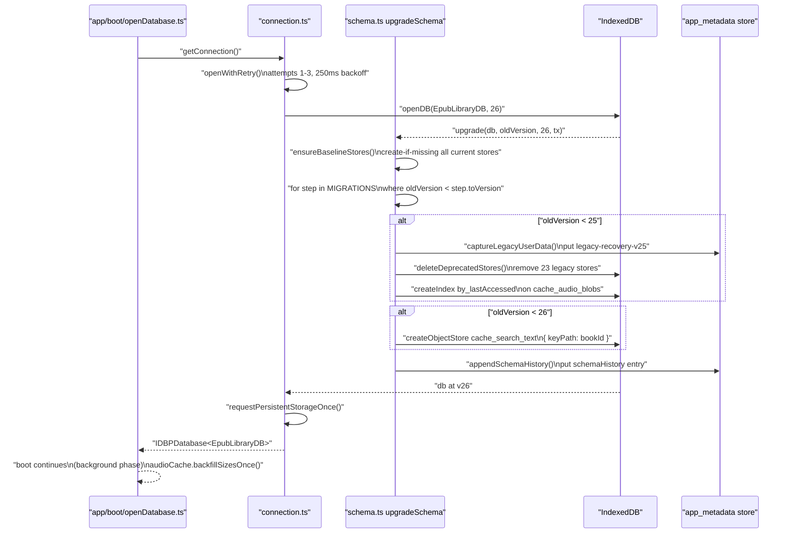

# IndexedDB Schema & Migrations

This document covers the `EpubLibraryDB` IndexedDB schema in full — every object store, its key path, its indexes, and the row types — plus the versioned migration registry, the IDB v25 and v26 steps, the straggler snapshot-before-delete guard, the `schemaHistory` append-on-upgrade mechanism, the `by_lastAccessed` LRU index and its post-open idle size backfill, and multi-tab upgrade coordination. The authoritative source code is [src/data/schema.ts](../../src/data/schema.ts), [src/data/connection.ts](../../src/data/connection.ts), [src/data/rows/](../../src/data/rows/), and [src/data/migrations.test.ts](../../src/data/migrations.test.ts).

For the broader storage gateway context — the write gate, repos, wipe, and service-worker contract — see [Storage gateway](20-storage-gateway.md). For the Yjs CRDT that lives in the separate `versicle-yjs` database, see [CRDT format and migrations](22-crdt-format-and-migrations.md).

---

## 1. Why IndexedDB? Design Intent

Versicle's working set is dominated by EPUB content: cover thumbnails (ArrayBuffers), the raw EPUB archive blob, synthesized TTS audio segments (multi-MB ArrayBuffers each), TTS sentence preparation caches, and location/pagination data. These cannot live in `localStorage` (size), in a remote database (offline-first requirement), or in memory alone (library survives a reload). IndexedDB is the one browser API that can structured-clone binary data across origins and persist it durably.

The data that governs what the user actually *did* — their reading progress, annotations, library inventory, vocabulary overrides — lives in the Yjs CRDT document, not in `EpubLibraryDB`. This separation is deliberate and architectural: CRDT data is replicated to Firestore and synchronized across devices; static content is not. `EpubLibraryDB` therefore stores only three categories:

- **STATIC**: immutable book content written once at import and read many times thereafter.
- **CACHE**: ephemeral, regenerable data — audio blobs, TTS preparation, render metrics, session state, search text. Losing any of it is a performance cost, not a data-loss event.
- **APP**: sync infrastructure (checkpoints, sync log) and the schema-evolution envelope (`app_metadata`, `flight_snapshots`).

This taxonomy is embedded in the store naming convention (`static_*`, `cache_*`, and un-prefixed app stores) and enforced by the store-domain comments in [src/data/schema.ts](../../src/data/schema.ts#L86).

### The One-In-Flight Format Rule

The master plan (`plan/overhaul/README.md` §4 rule 4) enforces that at most one user-data format change is in flight at any time, in a specific chain: backup manifest v3 (Phase 0) → CRDT v6 (Phase 2) → **IDB v25** (Phase 3) → `tts-storage` v3 / `tts-settings` v1 (Phase 5b) → CRDT v7 (Phase 6) → CRDT v8 + IDB v26 (Phase 7) → CRDT v9 (Phase 9). IDB versions are monotonic — a v24 build cannot open a v25 database — which is why each IDB bump waits for the previous format change's stability window.

---

## 2. The EpubLibraryDB Schema



### 2.1 Object Store Reference Table

| Store | Key Path | Auto-Inc | Indexes | Domain |
|---|---|---|---|---|
| `static_manifests` | `bookId` | No | — | STATIC |
| `static_resources` | `bookId` | No | — | STATIC |
| `static_structure` | `bookId` | No | — | STATIC |
| `cache_table_images` | `id` | No | `by_bookId` | CACHE |
| `cache_render_metrics` | `bookId` | No | — | CACHE |
| `cache_audio_blobs` | `key` | No | `by_lastAccessed` (v25) | CACHE |
| `cache_session_state` | `bookId` | No | — | CACHE |
| `cache_tts_preparation` | `id` | No | `by_bookId` | CACHE |
| `cache_search_text` | `bookId` | No | — | CACHE (v26) |
| `checkpoints` | `id` | Yes | `by_timestamp` | APP |
| `sync_log` | `id` | Yes | `by_timestamp` | APP |
| `app_metadata` | out-of-line | No | — | APP |
| `flight_snapshots` | `id` | No | — | APP |

The complete 13-store set at `DB_VERSION = 26` is pinned by both `connection.test.ts` and `migrations.test.ts` (the `CURRENT_STORE_SET` constant at [src/data/migrations.test.ts](../../src/data/migrations.test.ts#L56)).

### 2.2 Static Domain

The three static stores hold immutable book content written once at import ([bookContent.ts](../../src/data/repos/bookContent.ts) via the ingestion path) and thereafter read-only:

**`static_manifests`** — one row per book. The `StaticManifestRow` type defined in [src/data/rows/static.ts](../../src/data/rows/static.ts#L84) carries book identity (`bookId`, `title`, `author`, `fileHash`, `fileSize`, `totalChars`), cover data (`coverBlob`, `coverPalette`, `perceptualPalette`), and optional typography hints (`baseFontSize`, `baseLineHeight`). The `contentHash` field (a SHA-256 of the EPUB content, Phase 7) is additive — absent on pre-Phase-7 manifests, used as a deduplication key by the import orchestrator.

The `coverBlob` field is canonically an `ArrayBuffer` at rest. WebKit's IDB structured clone cannot clone `Blob` objects, so the ingest path converts them at write time. Rows from pre-normalization builds may still hold a `Blob`, which is why the zod schema accepts the union `ArrayBuffer | Blob`. The service-worker cover endpoint ([src/data/sw-contract.ts](../../src/data/sw-contract.ts)) reads this field and re-wraps it when needed.

**`static_resources`** — one row per book, holding only `bookId` and `epubBlob` (the full EPUB archive as an `ArrayBuffer`). This is the largest row class in the database.

**`static_structure`** — one row per book, holding the table of contents (`NavigationItem[]`, a recursive tree) and the spine item list (`{ id, characterCount, index }[]`). The character counts drive the TTS chunking and section-queue estimation.

### 2.3 Cache Domain

Cache stores hold regenerable data. Losing any of them degrades performance but does not lose user-created data.

**`cache_render_metrics`** — one row per book, keyed by `bookId`. Holds `locations` (a serialized JSON string used by epubjs for pagination) and optional `pageCount`. Rebuilt from the EPUB when absent.

**`cache_audio_blobs`** — synthesized TTS audio segments. The key is a SHA-256 cache key derived from the segment text and provider settings, not the book ID. Two important row-level subtleties:

1. **`alignmentData` legacy field**: rows written by pre-Phase-3 builds stored cloud-TTS alignment data under the field name `alignmentData`. The canonical field is `alignment`. The audioCache repo's `getSegment()` method applies a read-shim — if `alignment` is absent and `alignmentData` is present, it returns a normalized row with `alignment: segment.alignmentData`. New writes never write `alignmentData`.

2. **`size` additive field**: Phase 3 P3-6 introduced an additive `size: audio.byteLength` stamp on new rows so the LRU eviction scan can read the byte length without deserializing the audio ArrayBuffer. Rows written before this change lack `size`; they are handled by the post-open idle backfill introduced at v25.

The v25 migration step adds the `by_lastAccessed` index on this store (see §4.1).

**`cache_session_state`** — one row per book, holding the last TTS playback queue state (`playbackQueue: TTSQueueItem[]`), an optional last-pause timestamp, and `updatedAt`. Used to restore TTS position after a reload.

**`cache_tts_preparation`** — one row per `(bookId, sectionId)` pair, keyed by a compound `id = "${bookId}-${sectionId}"` string. Holds `sentences` (text + CFI pairs), optional `citationMarkers`, and an `extractionVersion` invalidation stamp. Written at import and lazily for pre-existing books.

**`cache_table_images`** — rendered table images captured as ArrayBuffers, keyed by `id = "${bookId}-${cfi}"`. The `by_bookId` index supports clearing all images for a book on deletion.

**`cache_search_text`** — introduced by the v26 migration step (Phase 7). One row per book, keyed by `bookId`. Holds a `sections` array of `{ href, title, text }` objects representing the plain-text search corpus for each spine section, plus an `extractionVersion` invalidation stamp. Absence triggers re-extraction on first search. Deleted in the same transaction as the book ([bookContent.ts](../../src/data/repos/bookContent.ts)).

### 2.4 App Domain

**`checkpoints`** — recovery checkpoints for the Yjs document, written before migration steps and periodically by the sync layer. Uses autoincrement numeric keys (`id`). The `by_timestamp` index supports querying the most-recent checkpoint. The `protected` boolean (additive, absent on old rows) pins a checkpoint against the rolling 10-checkpoint prune limit. The checkpoints repo ([src/data/repos/checkpoints.ts](../../src/data/repos/checkpoints.ts)) enforces both invariants: supersede-older-protected (only the newest protected checkpoint stays pinned) and prune-skip-protected (protected rows are never pruned during the rolling trim).

**`sync_log`** — a dead store at HEAD. Defined in the schema with a `by_timestamp` index and a typed `SyncLogEntryRow` shape (`level: 'info' | 'warn' | 'error'`, `message`, optional `details`), but has zero production readers or writers. Frozen as-is (`rows/app.ts` comment: "FROZEN (dead store at HEAD, see module docs)") for the Phase 4 sync strangler to adopt or Phase 9 to delete (the operator's hand-off checklist, point 4). The next IDB bump that touches it must be a separate v27 step.

**`app_metadata`** — an out-of-line-key key-value store repurposed by the v25 migration step as the schema-evolution envelope (previously it was unused since v18). Known keys are enumerated in `APP_METADATA_KEYS` ([src/data/rows/app.ts](../../src/data/rows/app.ts#L107)):

```typescript
export const APP_METADATA_KEYS = {
  /** SchemaHistoryEntry[] — one entry appended per versionchange upgrade. */
  schemaHistory: 'schemaHistory',
  /** LegacyRecoveryRecord — the v25 straggler guard's snapshot. */
  legacyRecoveryV25: 'legacy-recovery-v25',
  /** true once the post-open idle audio size backfill completed (v25). */
  audioSizeBackfillV25: 'audio-size-backfill-v25',
} as const;
```

The typed envelope is `AppMetadataValue = SchemaHistoryEntry[] | LegacyRecoveryRecord | boolean`. Keys are append-only — a retired key must never be reused for a different shape.

**`flight_snapshots`** — diagnostic flight-recorder snapshots keyed by a UUID `id`. Each snapshot contains a `context` (book ID, section index, queue length, playback status), an `eventsJSON` string serialization of the event ring buffer, and metadata (`createdAt`, `trigger`, `note`, `eventCount`, `timeRange`, `sizeBytes`). Written by the diagnostics repo ([src/data/repos/diagnostics.ts](../../src/data/repos/diagnostics.ts)).

---

## 3. The Row Type System

The row types are the single source of truth for what is actually persisted to disk. They are defined in [src/data/rows/](../../src/data/rows/) as plain TypeScript type aliases (not `z.infer` — zod's loose envelope inferred type carries a string index signature that domain interfaces do not have, causing spurious compile errors at assignment sites).



### 3.1 Zod Schemas as Compile-Time Guards

Each row module defines both a zod schema and a plain type alias for each store, then uses compile-time type assertions to pin the relationship. For example, in [src/data/rows/static.ts](../../src/data/rows/static.ts):

```typescript
type _ManifestSchemaMatches =
  z.infer<typeof staticManifestRowSchema> extends StaticManifestRow ? true : never;
```

If the zod schema and the row alias drift (e.g. a field is added to the alias but not the schema), the type assertion becomes `never` and the file fails to compile. Additional "round-trip" assertions pin that the row type extends the domain interface (e.g. `StaticStructureRow extends StaticStructure`), ensuring the repos can return rows directly to domain code.

### 3.2 Validation at Ingress Only

Zod schema validation runs at untrusted ingress — backup restore, the Android backup payload read — never on the hot read/write path. The `binaryValueSchema` in [src/data/rows/static.ts](../../src/data/rows/static.ts#L37) handles the `ArrayBuffer | Blob` binary union that exists because older builds predated the WebKit normalization:

```typescript
export const binaryValueSchema = z.custom<ArrayBuffer | Blob>(
  (v) => v instanceof ArrayBuffer || v instanceof Blob,
  { message: 'Expected ArrayBuffer or Blob' },
);
```

The `z.looseObject` envelope used on all schemas passes unknown fields through untouched, enabling forward compatibility: a row written by a newer build with additional optional fields passes a schema written by an older build without those fields.

### 3.3 The Binary Field Invariant

WebKit's IDB implementation cannot structured-clone `Blob` objects. Ingest paths normalize `Blob → ArrayBuffer` at write time. However, rows written by pre-normalization builds persist `Blob` values, so row types union both: `coverBlob?: ArrayBuffer | Blob`. Schemas use `binaryValueSchema` to accept both. Code reading binary fields must handle both forms, or explicitly call the appropriate conversion utility.

---

## 4. The Versioned Migration Registry



The registry is the `MIGRATIONS` constant in [src/data/schema.ts](../../src/data/schema.ts#L363):

```typescript
export const MIGRATIONS: readonly IdbMigration[] = [
  { toVersion: 25, migrate: migrateToV25 },
  { toVersion: 26, migrate: migrateToV26 },
];
```

Each entry implements `IdbMigration`:

```typescript
export interface IdbMigration {
  readonly toVersion: number;
  migrate(
    db: IDBPDatabase<EpubLibraryDB>,
    tx: UpgradeTransaction,
    oldVersion: number,
  ): Promise<void> | void;
}
```

**The append-only invariant** is a program rule, enforced by the migration test suite (`migrations.test.ts` runs the M suite against committed v18/v24 fixtures). A released step's body is part of the persisted format surface — a bug in a released step gets a new later step, never an edit to the existing one. The `M.* migration registry shape` test (line 103) checks that steps are ordered, have unique versions, end at `DB_VERSION`, and all have version numbers above 24 (the baseline).

### 4.1 The Upgrade Callback: Three Phases

`upgradeSchema` ([src/data/schema.ts](../../src/data/schema.ts#L446)) orchestrates three phases inside the single `versionchange` transaction:

**Phase 0 — `ensureBaselineStores()`**: Runs on every upgrade. Creates every current-version store and index if it does not already exist (the "create-if-missing" pattern). This ensures a pre-v24 straggler converges to the full store set before any versioned step runs. The baseline mirrors verbatim the v24 upgrade callback from the now-deleted `src/db/db.ts`.

**Phase 1 — versioned registry steps**: Iterates `MIGRATIONS` in order. For each step where `oldVersion < step.toVersion`, calls `step.migrate(db, transaction, oldVersion)`. Steps are idempotent with guard checks (e.g. `if (!audioBlobs.indexNames.contains('by_lastAccessed'))`).

**Phase 2 — `appendSchemaHistory()`**: Reads the current `schemaHistory` array from `app_metadata`, appends `{ from: oldVersion, to: targetVersion, at: Date.now() }`, and puts it back. This is the diagnostic record of every upgrade path ever taken by this profile.

---

## 5. IDB v25: The Phase 3 Format Change

v25 is Phase 3's single format change (the one-in-flight rule). It addresses three distinct concerns.

### 5.1 The Straggler Snapshot-Before-Delete Guard (P9 Fix)

Before v25, the upgrade callback in the old `src/db/db.ts` deleted all 23 deprecated legacy stores unconditionally and immediately. A "returning pre-Yjs user" — someone who installed Versicle before Phase 2 (the Yjs migration) and opened the app again years later — would have their entire library inventory, reading progress, annotations, vocabulary, and reading history silently destroyed before the first Yjs CRDT load.

v25 fixes this by serializing surviving user-data stores into `app_metadata['legacy-recovery-v25']` **before** the deletion loop runs. The order is strict — the comment in `migrateToV25` reads: "Snapshot-before-delete: NEVER reorder these two."

The guard operates on `LEGACY_USER_DATA_STORES`, which contains the stores that held user-created data (library inventory, positions, annotations, vocabulary, history) but not regenerable stores (files, sections, TTS caches — rebuilding them from the EPUB is trivial and capturing multi-MB audio binaries would waste the size budget for zero recovery value):

```typescript
const LEGACY_USER_DATA_STORES = [
  'books', 'book_states', 'annotations', 'lexicon',
  'reading_history', 'reading_list',
  'user_inventory', 'user_reading_list', 'user_progress',
  'user_annotations', 'user_overrides', 'user_journey', 'user_ai_inference',
] as const;
```

The capture process ([src/data/schema.ts](../../src/data/schema.ts#L254)) streams a cursor over each surviving store, serializes each row to JSON with binary fields elided to descriptors, and accumulates results under a 8 MB soft budget (`LEGACY_RECOVERY_SIZE_CAP_BYTES = 8 * 1024 * 1024`):

```typescript
function serializeLegacyRow(row: unknown): string {
  return JSON.stringify(row, (_key, value: unknown) => {
    if (value instanceof ArrayBuffer) {
      return { __binary: 'ArrayBuffer', byteLength: value.byteLength };
    }
    if (ArrayBuffer.isView(value)) {
      return { __binary: value.constructor.name, byteLength: value.byteLength };
    }
    if (typeof Blob !== 'undefined' && value instanceof Blob) {
      return { __binary: 'Blob', byteLength: value.size, type: value.type };
    }
    return value;
  });
}
```

Binary values (`ArrayBuffer`, `TypedArray`, `Blob`) are replaced by `{ __binary, byteLength }` descriptors — they would serialize as `{}` via plain `JSON.stringify`, which is useless for recovery, and including them would bloat the snapshot past the size cap. The resulting `LegacyRecoveryRecord` shape:

```typescript
type LegacyRecoveryRecord = {
  capturedAt: number;
  fromVersion: number;
  truncated: boolean;    // true when the size cap was hit mid-stream
  stores: LegacyRecoveryStoreCapture[];
};

type LegacyRecoveryStoreCapture = {
  store: string;
  rowCount: number;          // actual row count in the store
  capturedCount: number;     // rows captured before the budget ran out
  rowsJSON: string;          // JSON array string, parseable even when truncated
};
```

When `truncated` is `true`, the capture stopped mid-store. The `capturedCount` field tells support personnel how many rows were captured vs. `rowCount` total. Even truncated captures are valid JSON arrays — the serialization loop builds them incrementally (`[${serialized.join(',')}]`) and commits what it has.

After capture, `deleteDeprecatedStores()` runs the full deletion loop. A v24 database (no surviving legacy stores) produces no recovery record at all — this is the normal case and is verified by migration test M.1.

### 5.2 The `by_lastAccessed` Index

The third action in `migrateToV25` creates the LRU eviction index:

```typescript
const audioBlobs = tx.objectStore('cache_audio_blobs');
if (!audioBlobs.indexNames.contains('by_lastAccessed')) {
  audioBlobs.createIndex('by_lastAccessed', 'lastAccessed');
}
```

The `by_lastAccessed` index enables efficient LRU traversal. However, at v25 the eviction scan in `audioCache.runEviction()` ([src/data/repos/audioCache.ts](../../src/data/repos/audioCache.ts#L195)) still streams the full store with a primary-key cursor rather than using the index — using the index to iterate oldest-first and stop early once under budget is documented in the prep doc as a named follow-up optimization.

Older rows that predate the `size` additive field are still indexed — `lastAccessed` has been a required field since the store was created — so the index covers the entire store.

### 5.3 The `schemaHistory` Append

`appendSchemaHistory` runs at the end of every upgrade, regardless of which versioned steps ran:

```typescript
async function appendSchemaHistory(
  tx: UpgradeTransaction,
  from: number,
  to: number,
): Promise<void> {
  const store = tx.objectStore('app_metadata');
  const existing = await store.get(APP_METADATA_KEYS.schemaHistory);
  const history: SchemaHistoryEntry[] = Array.isArray(existing) ? existing : [];
  history.push({ from, to, at: Date.now() });
  store.put(history, APP_METADATA_KEYS.schemaHistory);
}
```

A fresh install produces `[{ from: 0, to: 26, at: <timestamp> }]`. A v24-to-current upgrade produces `[{ from: 24, to: 26, at: ... }]`. This is the only way to determine the upgrade path taken on a given device, which is useful for diagnosing issues in production (e.g. "was this database ever at v18?").

---

## 6. IDB v26: The Phase 7 Additive Step

v26 is Phase 7's format change — specifically, the §F additive `cache_search_text` store:

```typescript
function migrateToV26(db: IDBPDatabase<EpubLibraryDB>): void {
  if (!db.objectStoreNames.contains('cache_search_text')) {
    db.createObjectStore('cache_search_text', { keyPath: 'bookId' });
  }
}
```

This step is entirely additive: no existing data is read, moved, or transformed. It creates a single empty object store keyed by `bookId`. The rollback story is trivial — if a v26 build's `cache_search_text` rows are ever lost, the search re-extracts them from the EPUB on first use (the current behavior when the store is absent on an older build).

The step was deliberately bundled as a v26 bump through the Phase 3 versioned migration registry rather than being added to the v25 baseline, because it represents a Phase 7 feature addition that follows the one-in-flight rule: CRDT v8 landed first (the reading-list FK linker), then IDB v26.

---

## 7. The IDB Version Timeline



The version numbers below 24 are reconstructed from the deprecated-store list in [src/data/schema.ts](../../src/data/schema.ts#L194) and the v18-fixture documentation in [src/data/__fixtures__/schema-fixtures.ts](../../src/data/__fixtures__/schema-fixtures.ts#L17). v25 and v26 are the two versioned steps in the live `MIGRATIONS` registry.

---

## 8. The Post-Open Idle Size Backfill

The v25 `by_lastAccessed` index (§5.2) enables LRU eviction, but the eviction budget calculation needs the byte size of each audio row. New rows stamped after P3-6 carry `size: audio.byteLength` as an additive field. Pre-P3-6 rows do not.

Rather than reading the `audio` ArrayBuffer (potentially multiple MB) on every eviction scan for legacy rows, v25 introduces a one-time post-open idle backfill: `audioCache.backfillSizesOnce()` ([src/data/repos/audioCache.ts](../../src/data/repos/audioCache.ts#L139)), run once from the boot pipeline's `background` phase after the database is open.

The backfill uses a two-pass approach to avoid loading multi-MB blobs into memory simultaneously:

**Pass 1** — streams a readonly cursor over `cache_audio_blobs` and collects only the `key` values of rows where `size === undefined`. No audio data is held in memory.

**Pass 2** — re-reads each missing row individually (outside the write gate), stamps `{ ...row, size: row.audio.byteLength }`, and writes back in small gated batches of 10 rows (`SIZE_BACKFILL_BATCH = 10`).

After all rows are stamped, the completion flag `app_metadata['audio-size-backfill-v25'] = true` is written. Subsequent boots call `backfillSizesOnce()`, read the flag, and return `0` immediately. The test M.6 in `migrations.test.ts` verifies that:
- Only the legacy row lacking `size` is stamped (the modern row is untouched)
- The legacy `alignmentData` field name survives the backfill untouched
- The completion flag is set after the first run
- A second run is a no-op

---

## 9. Multi-Tab Upgrade Coordination

IndexedDB's version-change protocol creates a race condition when two tabs are open and a deployment bump the schema version. The old-version tab holds an open connection; the new-version tab's `openDB` call fires the `upgrade` callback only after all old-version connections close.



The `connection.ts` module ([src/data/connection.ts](../../src/data/connection.ts)) handles all three IDB lifecycle events:

**`blocking`**: called on the old-version connection when a newer-version open is waiting. The handler immediately closes the connection (`closeConnection()`) so the new-version upgrade can proceed. After closing, it fires `events.onBlocking?.()` — an app-layer callback (wired in `src/app/boot/openDatabase.ts`) that can prompt the user to reload the tab.

**`blocked`**: called on the new-version open when it is blocked by old-version connections. Fires `events.onBlocked?.({ oldVersion: currentVersion })` to inform the app.

**`terminated`**: called when the browser kills the connection (e.g. storage eviction under memory pressure). Resets `dbPromise = null` so the next `getConnection()` call reopens.

The migration test M.5 ([src/data/migrations.test.ts](../../src/data/migrations.test.ts#L258)) pins the exact two-tab v24→v25 scenario:

```typescript
it('lets the v25 open complete once the v24 holder closes on versionchange', async () => {
  await buildV24Fixture();
  let holderSawBlocking = false;
  let holder: IDBPDatabase<any> | null = null;
  holder = await openDB(DB_NAME, 24, {
    blocking() {
      holderSawBlocking = true;
      holder?.close();
    },
  });
  const db = await getConnection();
  expect(db.version).toBe(DB_VERSION);
  expect(holderSawBlocking).toBe(true);
});
```

---

## 10. Connection Hardening

The connection module ([src/data/connection.ts](../../src/data/connection.ts)) addresses three defects present in the old `src/db/db.ts`:

### 10.1 Reset-on-Failure (▲18)

The old `db.ts` cached a rejected `dbPromise` forever — one transient open failure (e.g. a browser crash recovery restart, a QuotaExceeded during upgrade) bricked all database access until a full page reload. The new `getConnection()` uses a self-evicting promise:

```typescript
export function getConnection(): Promise<IDBPDatabase<EpubLibraryDB>> {
  if (!dbPromise) {
    const promise: Promise<IDBPDatabase<EpubLibraryDB>> = openWithRetry()
      .then((db) => {
        requestPersistentStorageOnce();
        return db;
      })
      .catch((error) => {
        // Only evict OUR promise: a blocking/terminated handler or concurrent
        // close may have already replaced it.
        if (dbPromise === promise) dbPromise = null;
        throw error;
      });
    dbPromise = promise;
  }
  return dbPromise;
}
```

The failure handler evicts the rejected promise from the cache only if it is still the current `dbPromise` (guarding against a race where a concurrent `closeConnection` or `terminated` handler already replaced it). After eviction, the next `getConnection()` call starts a fresh open attempt.

### 10.2 Retry With Backoff

Open failures are retried up to `OPEN_RETRY_ATTEMPTS = 3` times with `OPEN_RETRY_BACKOFF_MS = 250` ms between attempts:

```typescript
async function openWithRetry(): Promise<IDBPDatabase<EpubLibraryDB>> {
  let lastError: unknown;
  for (let attempt = 1; attempt <= OPEN_RETRY_ATTEMPTS; attempt++) {
    try {
      return await openConnection();
    } catch (error) {
      lastError = error;
      if (attempt < OPEN_RETRY_ATTEMPTS) await delay(OPEN_RETRY_BACKOFF_MS);
    }
  }
  throw lastError;
}
```

Migration test connection tests (M.* suite via `connection.test.ts`) verify that two sequential failures followed by a success complete without throwing, and that exhausting the attempt budget does not brick later calls.

### 10.3 Persistent Storage Request

After the first successful open, `requestPersistentStorageOnce()` calls `navigator.storage.persist()` (fire-and-forget, result logged). This requests that the browser treat the origin's storage as persistent — making it far less likely to evict the EPUB library under storage pressure. The call is guarded by a `persistRequested` flag and a feature check (`typeof storage?.persist !== 'function'`). The connection test suite verifies that `persist()` is called exactly once per session regardless of how many `getConnection()` calls are made.

---

## 11. Error Handling at the Storage Boundary

All repo methods catch errors from IDB operations and route them through `handleDbError` ([src/data/errors.ts](../../src/data/errors.ts#L17)):

```typescript
export function handleDbError(error: unknown): never {
  if (error instanceof DatabaseError) throw error;
  if (error instanceof Error && error.name === 'QuotaExceededError') {
    throw new StorageFullError(error);
  }
  if (error instanceof DOMException && error.name === 'QuotaExceededError') {
    throw new StorageFullError(error);
  }
  throw new DatabaseError('An unexpected database error occurred', error);
}
```

`QuotaExceededError` (both `Error` and `DOMException` forms — browser implementations vary) maps to `StorageFullError`, which the app layer catches to surface a user-visible quota warning. All other errors become `DatabaseError`. Both extend the C10 `AppError` taxonomy defined in `~types/errors`. The `handleDbError` boundary is on the program's explicit keeper list: no caller should suppress or rethrow without mapping.

---

## 12. The Service-Worker Read Contract

The service worker runs in its own JavaScript context and cannot share the app's cached `IDBPDatabase` connection. [src/data/sw-contract.ts](../../src/data/sw-contract.ts) provides a dedicated read path:

```typescript
export async function getCoverFromDB(bookId: string): Promise<Blob | ArrayBuffer | undefined> {
  const db = await openDB(DB_NAME); // Opens with whatever version is current

  try {
    if (db.objectStoreNames.contains(STATIC_MANIFESTS_STORE)) {
      const manifest = await db.get(STATIC_MANIFESTS_STORE, bookId);
      return manifest?.coverBlob;
    }
    // Legacy Architecture (Fallback)
    if (db.objectStoreNames.contains(BOOKS_STORE)) {
      const book = await db.get(BOOKS_STORE, bookId);
      return book?.coverBlob;
    }
    return undefined;
  } finally {
    db.close();
  }
}
```

Two design decisions here:

1. **Unversioned open**: `openDB(DB_NAME)` (no version argument) opens the database at whatever current version exists without triggering an upgrade. The SW must never trigger or block a version change — it does not own the schema.

2. **Legacy fallback**: The `BOOKS_STORE = 'books'` fallback survives until the next IDB bump deletes it (hand-off item 4). A pre-v18 straggler's covers render before their first main-app upgrade.

The `DB_NAME` constant is imported from `schema.ts` rather than re-declared locally, closing a previous drift hazard where the SW had its own `DB_NAME` literal that could diverge.

---

## 13. The Complete Migration Pipeline



---

## 14. Fixture Strategy and Test Coverage

The migration test suite ([src/data/migrations.test.ts](../../src/data/migrations.test.ts)) uses programmatic fixture builders — [src/data/__fixtures__/schema-fixtures.ts](../../src/data/__fixtures__/schema-fixtures.ts) — rather than binary database dumps. Programmatic builders are reviewable, deterministic under `fake-indexeddb` (the vitest IDB environment), and resilient to test runner differences. They re-declare store names and layouts as literals rather than importing from `schema.ts`, so a fixture cannot silently start testing the current schema instead of the historical one.

### 14.1 v24 Fixture

`buildV24Fixture()` opens the database at version 24 using the verbatim store set and key paths from the old `src/db/db.ts` upgrade callback, then inserts one row in every store. Notable `v24Rows` entries:

- `legacyAudio`: no `size` field, uses `alignmentData` (the legacy field name) — exercises both the v25 backfill and the `alignmentData` read-shim.
- `modernAudio`: has `alignment` (canonical name) and `size: 3` — must be untouched by the backfill.
- `checkpoint`: has `protected: true` — pins the checkpoint prune invariants.
- `syncLog`: a dead store row that must survive the upgrade (the store is frozen, not deleted).

### 14.2 v18 Fixture

`buildV18Fixture()` opens at version 18 with:
- The three `static_*` stores (v18 architecture — the SW read contract's "V18 Architecture" comment confirms this layout).
- All 10 user-data stores in `V18_USER_DATA_STORE_NAMES` (derived from `v18UserRows` keys), each populated with fixture rows including a `books` entry carrying a binary `coverBlob` ArrayBuffer to exercise binary elision.
- One regenerable v17 store (`tts_cache`, the `V18_REGENERABLE_STORE` constant) that the guard must NOT capture.

The `oversizedAnnotations` option allows M.3 to inject synthetic rows that exceed the 8 MB size cap, verifying truncation behavior.

### 14.3 Test Coverage Map

| Test | Verifies |
|---|---|
| M.1 v24 fixture → current | Zero data loss; `by_lastAccessed` index created; no recovery record for clean DB |
| M.2 v18 fixture → current | Straggler guard: all user-data stores captured; binary fields elided; regenerable store not captured |
| M.3 size cap | `truncated: true` when annotations exceed 8 MB; upgrade still completes |
| M.4 fresh create | `schemaHistory` from 0 |
| M.5 multi-tab | v24 holder closes on `blocking`; v26 open completes |
| M.6 size backfill | Legacy rows stamped once; `alignmentData` untouched; flag set; second run no-op |
| M.7 v26 search text | `cache_search_text` created empty; keyed by `bookId` |

---

## 15. The Deprecated Store Inventory

The two generations of deprecated stores, frozen in [src/data/schema.ts](../../src/data/schema.ts#L194):

**Legacy v17 stores** (the pre-Yjs monolith):
`books`, `book_sources`, `book_states`, `files`, `annotations`, `lexicon`, `sections`, `content_analysis`, `reading_history`, `reading_list`, `tts_queue`, `tts_position`, `tts_cache`, `locations`, `tts_content`, `table_images`

**v18 user stores** (moved into the Yjs CRDT at Phase 2):
`user_inventory`, `user_reading_list`, `user_progress`, `user_annotations`, `user_overrides`, `user_journey`, `user_ai_inference`

These 23 entries in `DEPRECATED_STORES` are the deletion target for `deleteDeprecatedStores()`. They are never removed from the constant — a straggler may carry any of them, and the guard must recognize all of them.

The **`LEGACY_USER_DATA_STORES`** subset (13 entries) is the capture target for the straggler guard. The difference is the 10 excluded regenerable stores: `book_sources`, `files`, `sections`, `content_analysis`, `tts_queue`, `tts_position`, `tts_cache`, `locations`, `tts_content`, `table_images`. These are all data that can be rebuilt from the EPUB file itself — no recovery value justifies their byte cost.

---

## 16. Related Subsystems

**[Storage gateway](20-storage-gateway.md)** — the full `src/data/` module: repos, write gate, wipe, error mapping.

**[Bootstrap and lifecycle](14-bootstrap-and-lifecycle.md)** — how `openDatabase.ts` in the boot registry wires the `onBlocked`/`onBlocking`/`onTerminated` connection event callbacks, and where the `audioCache.backfillSizesOnce()` idle task is registered.

**[CRDT format and migrations](22-crdt-format-and-migrations.md)** — the Yjs document in the separate `versicle-yjs` database and its versioned migration coordinator; the sequencing relationship between CRDT versions and IDB versions under rule 4.

**[Backup and restore](23-backup-and-restore.md)** — the `BackupService` that reads from `checkpoints` and `static_*` stores; the `backupStaticManifestRowSchema` and `backupManifestEnvelopeSchema` at the untrusted ingress boundary; how the straggler recovery record can be surfaced via support/diagnostics.

**[Domain: library](37-domain-library.md)** — `ImportOrchestrator` and `LibraryService` that write to `static_*` and `cache_tts_preparation`/`cache_search_text` stores during book import.

**[Domain: search](38-domain-search.md)** — the `searchTextRepo` that reads and writes `cache_search_text`; how extraction version invalidation works.
