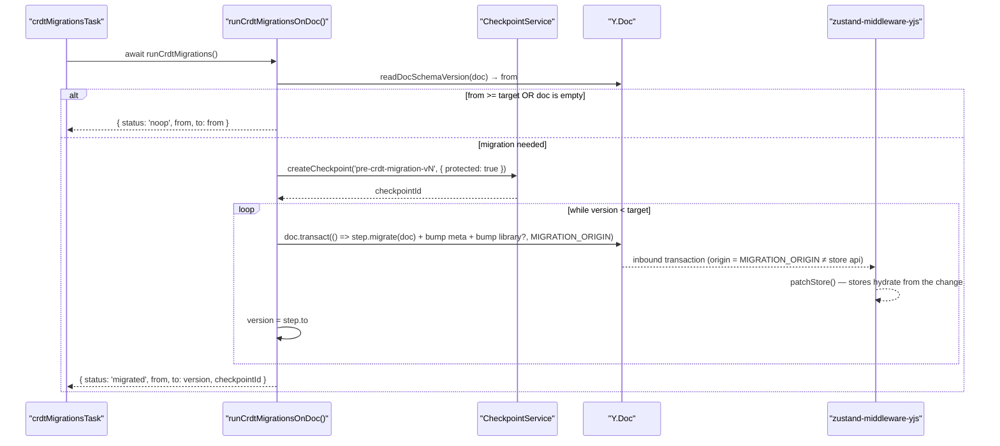
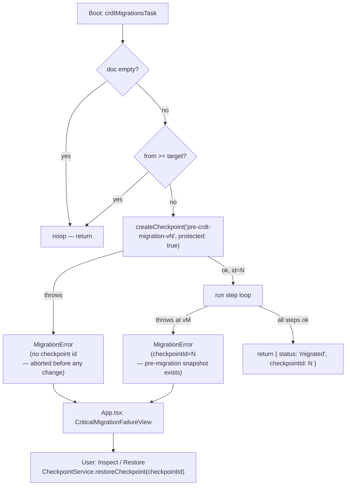
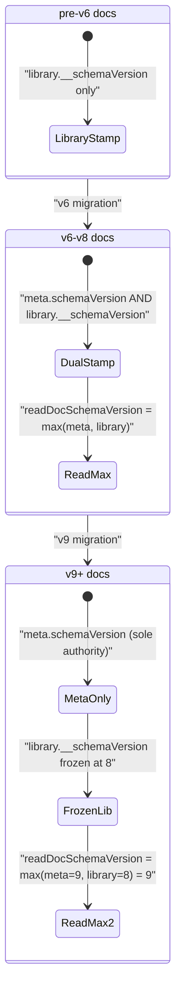
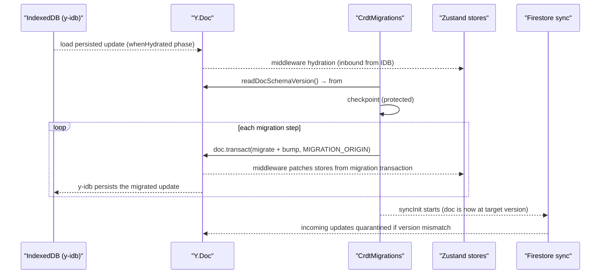
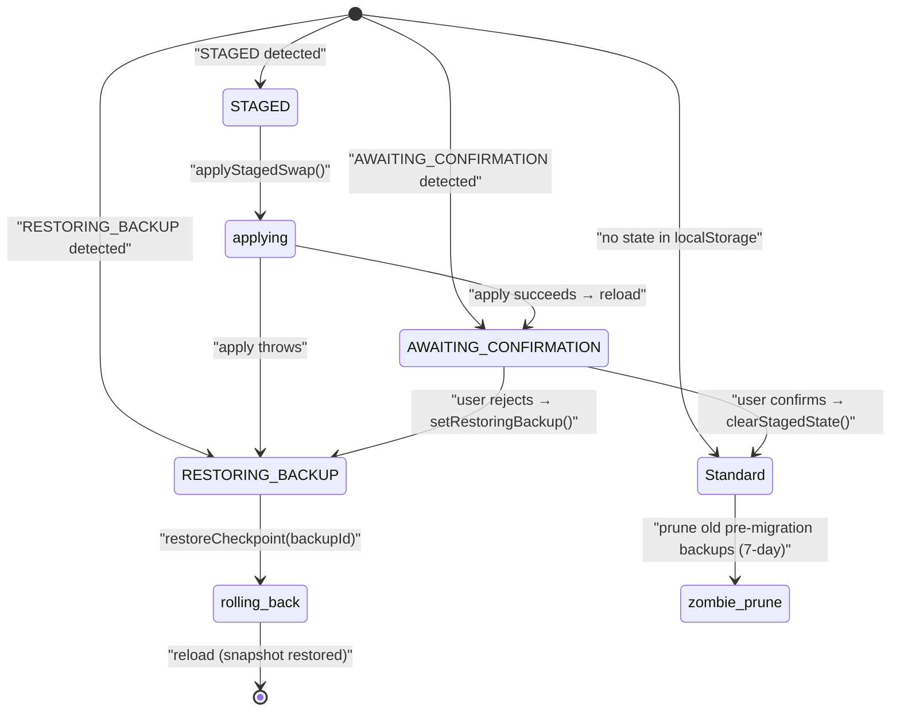
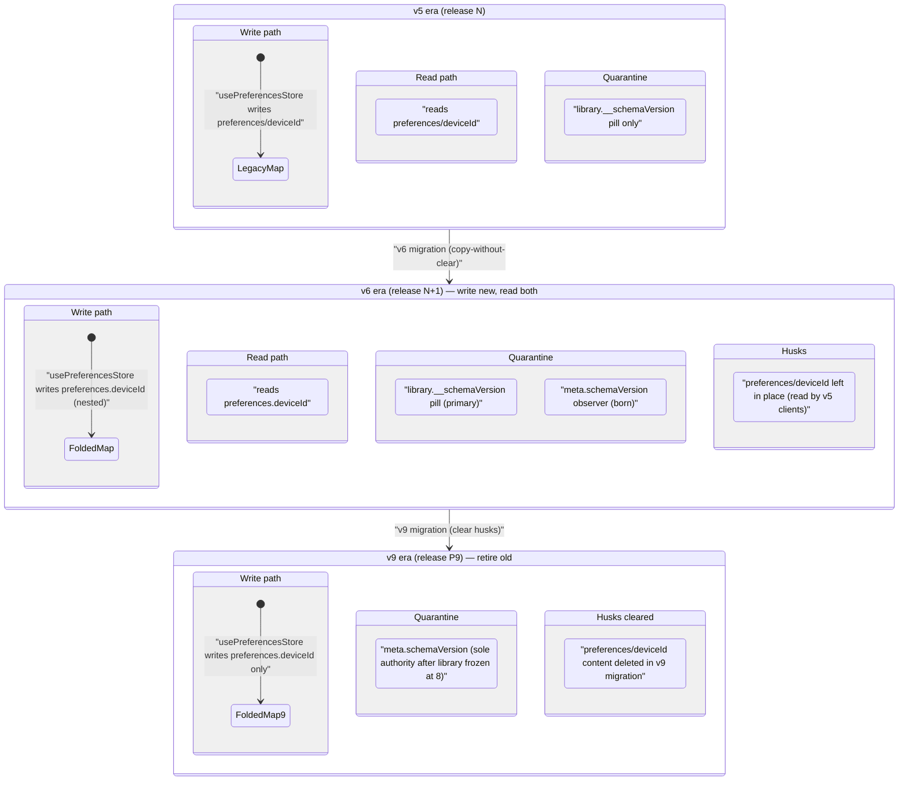
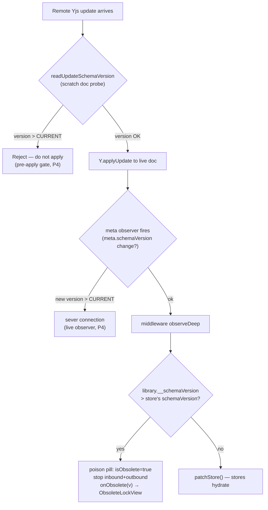
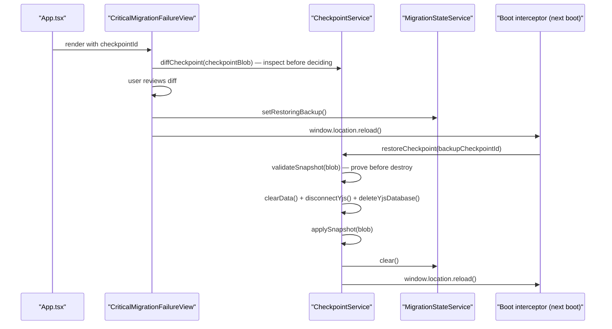
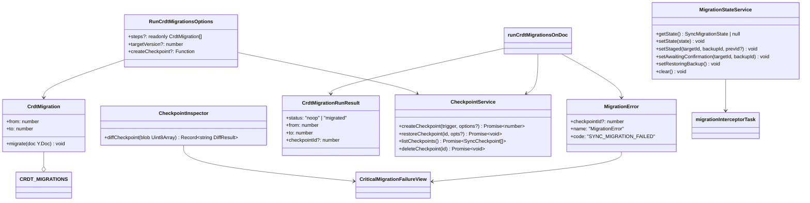

# CRDT Format & Migrations

This document covers the Yjs CRDT document model, its versioned schema history from v1 through v9, the migration coordinator that replaces the legacy runner, the pre-migration checkpoint discipline, the dual-write staging protocol, and the terminal husk-clearing bump that closed the overhaul program's format-change work.

Related reading: [State management](13-state-management-crdt.md) for how stores bind to CRDT maps and hydrate, [Storage gateway](20-storage-gateway.md) for the IndexedDB layer that persists the Y.Doc, [Bootstrap and lifecycle](14-bootstrap-and-lifecycle.md) for how the migrations phase fits into the boot sequence, [Domain sync](36-domain-sync.md) for the quarantine layers that protect against format-future documents.

---

## 1. Why a versioned CRDT format at all

Yjs provides conflict-free merging of concurrent edits by maintaining a log of operations. But the *shape* of the data stored inside shared types is application-defined — a `Y.Map` named `'library'` can hold whatever structure the app decides. When that structure changes (a new top-level key, a folded map, a deleted stale key), clients on different versions of the app can produce incompatible shapes. Two classes of problem emerge:

1. **Old client writes corrupt new-format data.** A pre-fold client writing to `preferences/<deviceId>` and a post-fold client reading from the nested `preferences` map see different views of the same doc state. If the old client's write wins by LWW, the new client sees stale or missing preferences.

2. **New client's inbound hydration deletes data the old doc never wrote.** The middleware's `getRecordChanges` emits a `DELETE` for every state key absent from the map JSON. An old doc that predates a field causes the middleware to wipe the new field's default on hydration — this is defect D2 in the codebase's analysis, which originally drove the v4→v5 migration that backfilled `fontProfiles`.

The CRDT schema version exists to solve both problems through two mechanisms:

- **Quarantine**: a client holding a doc at a version it does not understand refuses to apply it (the middleware "poison pill" and the Phase 4 doc-level layers).
- **Migration**: a client that boots with an older doc transforms it forward into the current format before any store hydration, so all subsequent writes land in the new shape.

Versicle's format history spans v1 through v9 across the Phase 0–9 overhaul program, with v9 being the last planned format change.

---

## 2. Version timeline

```mermaid
graph LR
  V1["v1\n(Y.Text encoding\ncorrupt sessions)"]
  V2["v2\n(sessions pruned)"]
  V3["v3\n(pure bump:\nFirestore path)"]
  V4["v4\n(pure bump:\ndisableYText flip)"]
  V5["v5\n(fontProfiles\nbackfill)"]
  V6["v6\n(popover deleted\nmeta dual-write\nprefs folded)"]
  V7["v7\n(vocabulary\ncanonicalized)"]
  V8["v8\n(reading-list\nbookId FK)"]
  V9["v9 — TERMINAL\n(husks cleared\ndual-write retired\nactiveContext pruned)"]

  V1 -->|"prune invalid readingSessions"| V2
  V2 -->|"pure bump (path change)"| V3
  V3 -->|"pure bump (disableYText)"| V4
  V2 -->|"pure bump (path change)"| V4
  V4 -->|"backfill fontProfiles"| V5
  V5 -->|"delete popover key\nmeta dual-write\npreferences fold"| V6
  V6 -->|"canonicalize vocabulary keys\ntrad→simp min-timestamp"| V7
  V7 -->|"link reading-list bookId FKs\nexact filename + fuzzy title/author"| V8
  V8 -->|"clear preference husks\nretire library.__schemaVersion\nprune activeContext"| V9
```



The version lives at [`src/store/yjs-provider.ts`](../../src/store/yjs-provider.ts):

```ts
export const CURRENT_SCHEMA_VERSION = 9;
```

Each version increment requires a matching `CrdtMigration` step in the registry and fixture-matrix coverage. The comment block in `yjs-provider.ts` records the meaning of each bump.

### Version meanings (from git archaeology and code)

| Version | Format change | Phase |
|---------|--------------|-------|
| v1 | Initial Yjs adoption; strings stored as `Y.Text`; `readingSessions` may contain non-numeric `startTime`/`endTime` | — |
| v2 | `readingSessions` with invalid times pruned (delete-if-absent, reverse iteration) | — |
| v3 | **Pure bump** — Firestore path changed from `users/{uid}/versicle/main2` → `main`; no doc-shape change | — |
| v4 | **Pure bump** — `disableYText: true` became the global default; new writes use plain strings; Y.Text values in old docs are repaired lazily by the middleware's mismatch-repair path | — |
| v5 | `fontProfiles` key backfilled in preferences maps where absent (the D2 hydration-delete class in action; the v4→v5 migration existed solely because D2 was not yet fixed) | P2 |
| v6 | Stale `annotations.popover` key deleted; `meta` map created with `schemaVersion` (N+1 staged write — no reader yet); top-level `preferences/<deviceId>` maps folded into a single nested `preferences` map (copy-without-clear) | P2 |
| v7 | `vocabulary.knownCharacters` keys canonicalized from traditional to simplified using the committed `trad2simp.json` table; duplicate pairs merged with min-timestamp semantics | P6 |
| v8 | One-time `bookId` FK linked in `reading-list.entries` by exact `sourceFilename` join then fuzzy `title+author` join | P7 |
| v9 | **Terminal:** legacy `preferences/<deviceId>` husks emptied; `library.__schemaVersion` frozen at 8 (meta becomes the sole version authority); `activeContext` key pruned from folded device maps | P9 |

---

## 3. Document structure: the top-level shared maps

The Y.Doc is a collection of named shared types. All of the following are `Y.Map` instances registered at the top level:

| Map name | Owned by | Purpose |
|----------|----------|---------|
| `library` | `useBookStore` | Book inventory; also carries the `__schemaVersion` dual-write (frozen at v8) |
| `progress` | `useReadingStateStore` | Per-book, per-device reading progress and session records |
| `annotations` | `useAnnotationStore` | Highlights and notes (the stale `popover` key was deleted in v6) |
| `preferences` | `usePreferencesStore` | Post-v6: nested map keyed by `deviceId` containing flat per-device settings |
| `preferences/<deviceId>` | legacy | Pre-v6 per-device flat maps; husks cleared in v9, top-level shares never deletable |
| `reading-list` | `useReadingListStore` | Reading list entries; gained `bookId` FK in v8 |
| `vocabulary` | `useVocabularyStore` | `knownCharacters` map; keys canonicalized to simplified in v7 |
| `lexicon` | `useLexiconStore` | TTS pronunciation rules and settings |
| `contentAnalysis` | `useContentAnalysisStore` | Per-book AI-generated content analysis sections |
| `devices` | `useDeviceStore` | Registered device records |
| `meta` | Migration coordinator | Schema version authority from v6 onward; `meta.schemaVersion` is the primary version source |

The `meta` map is special: it is not owned by any store. The migration coordinator creates it and writes `schemaVersion` into it inside each step's transaction. The `readDocSchemaVersion` function in [`src/domains/sync/core/quarantine.ts`](../../src/domains/sync/core/quarantine.ts) reads both `meta.schemaVersion` and `library.__schemaVersion` and returns their max:

```ts
export function readDocSchemaVersion(doc: Y.Doc): number {
  const metaVersion = doc.getMap('meta').get('schemaVersion');
  const libraryVersion = doc.getMap('library').get('__schemaVersion');
  return (
    Math.max(
      typeof metaVersion === 'number' ? metaVersion : 0,
      typeof libraryVersion === 'number' ? libraryVersion : 0,
    ) || 1
  );
}
```

The `max` is deliberate: during the N+1 staging window (v6 introduced `meta` but v5 clients only read `library.__schemaVersion`), a doc partially written by a mixed fleet will have one or both keys. Taking the max correctly identifies the true version in every case and prevents a false-negative quarantine on a half-stamped doc (risk R4 in the overhaul risk register).

---

## 4. The migration coordinator

### 4.1 Design intent: reversing the legacy hazards

Before Phase 2, migrations lived in `src/store/yjs-provider.ts` as `runMigrationsImpl`. The legacy runner had six documented hazards:

1. **Up to 9× per boot**: registered as `onLoaded` on every synced store; `onLoaded` fires both eagerly and on first inbound — nine stores × two fire points.
2. **Version read from store state through a cast**: `(bookState as unknown as Record<string, unknown>).__schemaVersion as number || 1` — subject to store-hydration ordering.
3. **Non-atomic bumps**: version bumps in `.then()` callbacks while the outer chain advanced `currentVersion` synchronously; concurrent invocations could all read v1 and double-apply.
4. **Transform and bump as separate store `setState` calls**: separate Yjs transactions; a crash between them strands transformed-but-unversioned data.
5. **Ordering by undocumented fork internals**: a nested `queueMicrotask` "to jump behind zustand-middleware-yjs's microtask," pinned by a spy test.
6. **Every failure swallowed**: `.catch(() => {})` — a failed migration was indistinguishable from a successful one.

The new coordinator in [`src/app/migrations.ts`](../../src/app/migrations.ts) reverses each hazard:

| Hazard | Coordinator fix |
|--------|----------------|
| 1. Runs 9× | Module-level `inFlight` promise; a single call site in the `'migrations'` boot phase |
| 2. Version from store | `readDocSchemaVersion(doc)` reads `max(meta, library)` directly from Y types |
| 3. Non-atomic bumps | Steps run sequentially, `while (version < target)`, never concurrently |
| 4. Separate transactions | Transform + bump in one `doc.transact(…, MIGRATION_ORIGIN)` — atomic for all observers |
| 5. Microtask ordering | Doc transforms bypass the middleware entirely; the middleware sees them as ordinary inbound |
| 6. Silent failure | Any throw surfaces a typed `MigrationError` with the pre-migration checkpoint id |

### 4.2 Key types

```ts
// src/app/migrations.ts

export interface CrdtMigration {
  from: number;   // run when readDocSchemaVersion(doc) === from
  to: number;
  migrate(doc: Y.Doc): void;  // synchronous, deterministic, idempotent
}

export class MigrationError extends AppError {
  readonly checkpointId?: number;  // pre-migration checkpoint for the restore flow
}

export interface CrdtMigrationRunResult {
  status: 'noop' | 'migrated';
  from: number;
  to: number;
  checkpointId?: number;  // set when a checkpoint was taken
}
```

The `CrdtMigration.migrate` function is intentionally synchronous. Steps mutate Y types directly — they do not call store `setState`. The middleware receives the migration transaction as ordinary inbound traffic (the transaction's origin is `MIGRATION_ORIGIN`, a Symbol distinct from any store api object), so stores hydrate normally from it without any special ordering.

### 4.3 The step registry

```ts
// src/app/migrations.ts
export const CRDT_MIGRATIONS: readonly CrdtMigration[] = [
  { from: 1, to: 2, migrate: pruneInvalidReadingSessions },
  { from: 2, to: 4, migrate: () => undefined }, // pure bump (v4 = disableYText flip)
  { from: 3, to: 4, migrate: () => undefined }, // pure bump (v3 was itself a pure bump)
  { from: 4, to: 5, migrate: backfillFontProfiles },
  { from: 5, to: 6, migrate: migrateV5toV6 },
  { from: 6, to: 7, migrate: canonicalizeVocabularyKeys },
  { from: 7, to: 8, migrate: linkReadingListEntries },
  { from: 8, to: 9, migrate: clearHusksAndRetireDualWrite },
];
```

The `from: 3` entry exists because v3 was a pure version bump (Firestore path change); the legacy runner handled it by folding v2 and v3 into one branch. Having explicit `from: 2` and `from: 3` entries makes the registry complete and avoids a version-gap exception for docs that happen to be stamped v3.

---

## 5. The coordinator engine: `runCrdtMigrationsOnDoc`



The critical invariant is that **transform and version bump execute in one Yjs transaction**. No observer — not y-idb, not a remote peer, not the zustand middleware — can see transformed-but-unversioned data. If the process dies mid-transaction, Yjs discards the incomplete transaction; the doc retains its pre-migration version and the coordinator re-runs identically on next boot.

### 5.1 Empty-doc protection

```ts
const isDocEmpty = (doc: Y.Doc): boolean => Y.encodeStateAsUpdate(doc).byteLength <= 2;
```

A freshly initialized `Y.Doc` encodes to exactly 2 bytes (the Yjs update header with no operations). The coordinator treats an empty doc as a no-op and takes no checkpoint. This is intentional: "version follows data." Stamping an empty doc would mark it as already-migrated, so cloud data that arrives later via sync would be applied to a doc already claiming the target version — that is the source of the D2-class bugs the migration exists to repair.

Tombstones (items deleted in Yjs but still tracked by the CRDT log) count as content and are correctly above the 2-byte floor.

### 5.2 In-tab re-entry guard

```ts
let inFlight: Promise<CrdtMigrationRunResult> | null = null;

export function runCrdtMigrations(): Promise<CrdtMigrationRunResult> {
  inFlight ??= runCrdtMigrationsOnDoc(getYDoc());
  return inFlight;
}
```

The module-level `inFlight` promise ensures that even if something calls `runCrdtMigrations()` more than once (e.g., a component re-render during the boot sequence), only one migration run executes per page load. A failed run stays failed — the recovery path is the checkpoint-restore flow, which reloads the page, resetting the module state.

The test-seam function `__resetCrdtMigrationsForTests()` clears `inFlight` between test suites.

---

## 6. Pre-migration checkpoints

Every migration that will transform a non-empty doc creates a protected checkpoint **before the first step runs**. If checkpoint creation itself fails, the migration aborts before touching any data:

```ts
try {
  checkpointId = await createCheckpoint(`pre-crdt-migration-v${target}`);
} catch (cause) {
  throw new MigrationError(
    `Pre-migration checkpoint failed; migration v${from} → v${target} aborted before any change.`,
    { cause, context: { from, target } },
  );
}
```

The checkpoint is created with `{ protected: true }`:

```ts
// CheckpointService.createCheckpoint (src/domains/sync/checkpoints/CheckpointService.ts)
static async createCheckpoint(trigger: string, options?: { protected?: boolean }): Promise<number> {
  const stateBlob = captureDoc(getYDoc());
  return checkpoints.add({
    timestamp: Date.now(),
    trigger,
    blob: stateBlob,
    size: Math.round(stateBlob.byteLength / 1024) || 1,
  }, options);
}
```

A protected checkpoint is pinned against the rolling prune: only the latest protected checkpoint stays pinned; creating a new one returns older ones to the normal rotation. This prevents abandoned pre-migration backups from accumulating forever, while keeping the most recent one available during the restore flow.

### 6.1 Checkpoint flow on failure



`App.tsx` inspects the error type to route appropriately:

```ts
// src/App.tsx
if (boot.error instanceof MigrationError) {
  // Render CriticalMigrationFailureView with the checkpoint id
}
```

The `CriticalMigrationFailureView` exposes the checkpoint diff and restore flow that already existed for workspace-switch rollbacks — reusing the same user-facing recovery path for migration failures as well.

---

## 7. The dual-write protocol (N+1 staging)

The overhaul program uses a "N+1 staging" rule (program rule 5): every new version authority must be **written** in release N before it is **read for enforcement** in release N+1. This ensures that a rolling fleet upgrade never leaves a client without a quarantine signal.

The v6 migration introduced the `meta` map and started writing `meta.schemaVersion`. But v6-era clients still quarantine via the per-store middleware poison pill (`library.__schemaVersion`), not via `meta`. The Phase 4 doc-level quarantine layers (pre-attach metadata probe, pre-apply scratch check, live `meta` observer) are the first readers — shipped at least one full release after v6.

The coordinator implements dual-write for all steps up to and including v8:

```ts
const LAST_DUAL_WRITTEN_SCHEMA_VERSION = 8;

doc.transact(() => {
  step.migrate(doc);
  doc.getMap('meta').set('schemaVersion', step.to);
  if (step.to <= LAST_DUAL_WRITTEN_SCHEMA_VERSION) {
    doc.getMap('library').set('__schemaVersion', step.to);
  }
}, MIGRATION_ORIGIN);
```

From v9 onward, only `meta.schemaVersion` is written. But `library.__schemaVersion` is **not deleted** — it stays frozen at 8 as the pre-meta-era poison-pill tripwire. An offline v5-era device that missed v6, v7, and v8 will still trip on `library.__schemaVersion = 8 > 5` when it comes back online. Deleting the key would remove its only quarantine layer and risk that device writing v5-format data into a v9 doc.

### 7.1 Version authority after v9



---

## 8. Individual migration steps

### 8.1 v1 → v2: prune invalid reading sessions

```ts
const pruneInvalidReadingSessions = (doc: Y.Doc): void => {
  const progressRoot = doc.getMap('progress').get('progress');
  if (!(progressRoot instanceof Y.Map)) return;

  progressRoot.forEach((devices) => {
    if (!(devices instanceof Y.Map)) return;
    devices.forEach((userProgress) => {
      if (!(userProgress instanceof Y.Map)) return;
      const sessions = userProgress.get('readingSessions');
      if (!(sessions instanceof Y.Array)) return;
      // Reverse iteration: deletions do not shift the unvisited indices.
      for (let i = sessions.length - 1; i >= 0; i--) {
        const session: unknown = sessions.get(i);
        const startTime = session instanceof Y.Map ? session.get('startTime') : undefined;
        const endTime = session instanceof Y.Map ? session.get('endTime') : undefined;
        if (typeof startTime !== 'number' || typeof endTime !== 'number') {
          sessions.delete(i, 1);
        }
      }
    });
  });
};
```

The reverse iteration is an important correctness detail: deleting index `i` in a `Y.Array` shifts all elements after it down by one. Iterating forward and deleting would skip elements or cause index-out-of-bounds. Reverse iteration ensures all unvisited indices remain valid after each deletion.

The docblock notes this is a reimplementation as a doc transform; the fixture matrix in `src/store/__tests__/crdt-contract/migrations.test.ts` pins equivalence with the legacy runner's terminal state.

### 8.2 v2 → v4 and v3 → v4: pure version bumps

These are no-op migrates — `migrate: () => undefined` — that exist solely to advance the version counter. The coordinator's atomic bump writes the target version to `meta` and (since v4 <= 8) to `library.__schemaVersion`. A doc stamped v3 was format-identical to a v2 doc; including the `from: 3` entry prevents a "No migration step from v3" exception.

### 8.3 v4 → v5: backfill font profiles

```ts
const DEFAULT_FONT_PROFILES = {
  en: { fontSize: 100, lineHeight: 1.5 },
  zh: { fontSize: 120, lineHeight: 1.8 },
} as const;

const backfillFontProfiles = (doc: Y.Doc): void => {
  for (const name of legacyPreferenceMapNames(doc)) {
    const map = doc.getMap(name);
    if (map.size === 0) continue; // never-materialized husk
    if (!map.has('fontProfiles')) {
      map.set('fontProfiles', plainToY(DEFAULT_FONT_PROFILES));
    }
  }
};
```

The legacy runner only backfilled the *current device's* preferences store. The doc transform backfills every per-device map (copy-if-absent, sorted iteration) — a deterministic superset of legacy behavior that closes the gap where other devices' profiles were left to be wiped on hydration (D2). The "sorted iteration for determinism" pattern appears in every migration step; it ensures two clients processing the same doc in the same order produce identical Yjs transactions, so Y-level merges converge.

The helper `legacyPreferenceMapNames` discovers per-device maps by inspecting `doc.share`:

```ts
const legacyPreferenceMapNames = (doc: Y.Doc): string[] =>
  [...doc.share.keys()]
    .filter((key) => key.startsWith(PREFERENCES_PREFIX) && key.length > PREFERENCES_PREFIX.length)
    .sort();
```

### 8.4 v5 → v6: popover deletion, meta dual-write, preferences fold

This is the most consequential migration in the program. Its scope from [`src/app/migrations.ts`](../../src/app/migrations.ts#L210):

```ts
const migrateV5toV6 = (doc: Y.Doc): void => {
  doc.getMap('annotations').delete('popover');

  const folded = doc.getMap('preferences');
  for (const name of legacyPreferenceMapNames(doc)) {
    const deviceId = name.slice(PREFERENCES_PREFIX.length);
    const legacy = doc.getMap(name);
    if (legacy.size === 0) continue; // never-materialized husk
    if (!folded.has(deviceId)) {
      // toJSON() normalizes any pre-v4 Y.Text values to plain strings
      folded.set(deviceId, plainToY(legacy.toJSON()));
    }
  }
};
```

Three actions in one transaction:

**1. Popover key deletion.** The `annotations.popover` key was a pre-hotfix leak of transient UI state into the CRDT. The store-side hotfix moved popover state to `useReaderUIStore`; the v6 migration cleans the residual key from existing docs. `Y.Map.delete` on an absent key is a no-op (idempotent).

**2. `meta` map creation (via the coordinator's generic bump).** The coordinator's transaction writes `doc.getMap('meta').set('schemaVersion', 6)`. This is the N+1-staged write: no client reads `meta` for enforcement in the v6 release. v5 clients keep quarantining via `library.__schemaVersion = 6`. Phase 4's synchronous pre-merge check is the first reader.

**3. Preferences fold (copy-without-clear).** The top-level `preferences/<deviceId>` maps are copied into a single `preferences` Y.Map keyed by `deviceId`. Critically, the legacy maps are **not cleared**. The comment explains why:

> Clearing them would let the D5 window (per-map quarantine is async and only library-guarded) wipe a still-v5 device's live preferences before its UI locks. The husks stop mattering once stores rebind to the folded map and are cleared in v9 (P9).

The `toJSON()` call normalizes any pre-v4 `Y.Text` values to plain strings, so the folded copy is always in the v4+ plain encoding regardless of the source doc's era.

### 8.5 v6 → v7: vocabulary key canonicalization

From [`src/domains/chinese/vocabulary/canonicalize.ts`](../../src/domains/chinese/vocabulary/canonicalize.ts):

```ts
export function canonicalizeChar(char: string): string {
  return TABLE[char] ?? char;
}

export function mergeCanonicalTimestamps(
  existing: unknown,
  incoming: unknown,
): number | undefined {
  const existingTs = typeof existing === 'number' && Number.isFinite(existing) ? existing : undefined;
  const incomingTs = typeof incoming === 'number' && Number.isFinite(incoming) ? incoming : undefined;
  if (existingTs !== undefined && incomingTs !== undefined) return Math.min(existingTs, incomingTs);
  return existingTs ?? incomingTs;
}
```

The problem: `vocabulary.knownCharacters` uses a character as the key and a numeric timestamp as the value. The triage card wrote whatever script was *displayed* — Traditional mode wrote `紅`, Simplified wrote `红`. The overlay filter compared against the displayed character, so vocabulary silently stopped matching when the script toggle changed, and the same character could exist twice with different timestamps.

The v7 migration normalizes all keys to the simplified form using a committed `trad2simp.json` table generated from opencc-js. When both `紅` (traditional) and `红` (simplified) are present, the merge takes the minimum timestamp (earliest known date wins).

```ts
const canonicalizeVocabularyKeys = (doc: Y.Doc): void => {
  const knownCharacters = doc.getMap('vocabulary').get('knownCharacters');
  if (!(knownCharacters instanceof Y.Map)) return;

  for (const key of [...knownCharacters.keys()].sort()) {
    const canonical = canonicalizeChar(key);
    if (canonical === key) continue;
    const merged = mergeCanonicalTimestamps(
      knownCharacters.get(canonical),
      knownCharacters.get(key),
    );
    if (merged !== undefined && knownCharacters.get(canonical) !== merged) {
      knownCharacters.set(canonical, merged);
    }
    knownCharacters.delete(key);
  }
};
```

Idempotency: `canonicalizeChar` returns the same value for already-canonical keys, so they are skipped by the `if (canonical === key) continue` guard. Determinism: sorted iteration + code-versioned table; both clients produce the same operations. The min-timestamp rule is also deterministic and commutative.

### 8.6 v7 → v8: reading-list bookId FK linker

The full linker lives in [`src/app/migrations.linkReadingList.ts`](../../src/app/migrations.linkReadingList.ts). It is registered as `{ from: 7, to: 8, migrate: linkReadingListEntries }` in the main registry.

**The problem:** `ReadingListEntry.bookId` is the FK to the library inventory. New entries written since the `ImportOrchestrator` cutover carry the FK at registration time. Existing entries do not. The FK is needed for efficient joins and to survive the reading-list store's whole-entry-rebuild pattern on edit.

**Why the FK needs a version bump:** Pre-v8 clients rebuild whole entry objects on edit (`addEntry`/`upsertEntry` spread fresh literals) and would silently drop any unknown field including `bookId`. The version bump quarantines pre-v8 clients from writing into a v8 workspace.

**The join strategy:**

```ts
export function linkReadingListEntries(doc: Y.Doc): void {
  const entriesRoot = doc.getMap('reading-list').get('entries');
  const booksRoot = doc.getMap('library').get('books');
  if (!(entriesRoot instanceof Y.Map) || !(booksRoot instanceof Y.Map)) return;

  // Build lookup maps from the inventory (sorted for determinism)
  const byFilename = new Map<string, string>();
  const byMatchKey = new Map<string, string>();
  for (const bookId of [...booksRoot.keys()].sort()) {
    const item = booksRoot.get(bookId);
    if (!(item instanceof Y.Map)) continue;
    const sourceFilename = str(item.get('sourceFilename'));
    if (sourceFilename && !byFilename.has(sourceFilename)) {
      byFilename.set(sourceFilename, bookId);
    }
    const matchKey = generateMatchKey(str(item.get('title')), str(item.get('author')));
    if (matchKey && !byMatchKey.has(matchKey)) {
      byMatchKey.set(matchKey, bookId);
    }
  }

  for (const filename of [...entriesRoot.keys()].sort()) {
    const entry = entriesRoot.get(filename);
    if (!(entry instanceof Y.Map)) continue;
    if (entry.get('bookId') !== undefined) continue; // copy-if-absent (idempotent)

    let bookId = byFilename.get(filename);
    if (!bookId) {
      const matchKey = generateMatchKey(str(entry.get('title')), str(entry.get('author')));
      if (matchKey) bookId = byMatchKey.get(matchKey);
    }
    if (bookId) entry.set('bookId', bookId);
  }
}
```

The `str()` helper handles both plain strings and legacy `Y.Text` values (pre-v4 docs), since pure version bumps never rewrote existing field values. A long-lived install can reach v7 with `Y.Text` titles and `sourceFilename` values; the join must read them as strings.

The test in [`src/app/migrations.linkReadingList.test.ts`](../../src/app/migrations.linkReadingList.test.ts) covers exact match, fuzzy match, idempotency, concurrent migration convergence, Y.Text values, and tolerance of missing maps (fresh installs).

### 8.7 v8 → v9: husk clearing, dual-write retirement, activeContext pruning

This is the program's terminal format change. Three actions documented in the `clearHusksAndRetireDualWrite` function:

```ts
const clearHusksAndRetireDualWrite = (doc: Y.Doc): void => {
  // 1. Empty every legacy per-device preference husk
  for (const name of legacyPreferenceMapNames(doc)) {
    const husk = doc.getMap(name);
    for (const key of [...husk.keys()].sort()) {
      husk.delete(key);
    }
  }

  // 3. Prune the de-synced activeContext key from the folded device maps
  const folded = doc.getMap('preferences');
  for (const deviceId of [...folded.keys()].sort()) {
    const deviceMap = folded.get(deviceId);
    if (deviceMap instanceof Y.Map) {
      deviceMap.delete('activeContext');
    }
  }

  // 2. The dual-write retirement lives in the runner (LAST_DUAL_WRITTEN_SCHEMA_VERSION)
};
```

**Action 1: husk clearing.** Why it is now safe when v6 had to defer it: the only clients that ever *wrote* the legacy `preferences/<deviceId>` maps are v5-era stacks. Every such client has been hard-quarantined since the v6 bump — the library-map poison pill fires synchronously before any store patch. The comment in the source spells out the fleet-quarantine chain that makes this safe at v9.

Yjs top-level shared types (`doc.getMap(name)`) are permanent — they can never be removed from a Y.Doc once registered (doing so would be a structural change incompatible with the update log). So the husk maps are emptied by deleting their contents, not the maps themselves.

**Action 2: dual-write retirement.** The coordinator's runner handles this via `LAST_DUAL_WRITTEN_SCHEMA_VERSION = 8`. Steps with `to > 8` do not write `library.__schemaVersion`. This causes the library version stamp to stay frozen at 8 permanently.

**Action 3: activeContext pruning.** Phase 8 §J moved the library/notes view switch to route state and dropped `activeContext` from the preferences `syncedKeys`. The key lingers in every folded per-device map; v9 deletes it. A not-yet-quarantined v8-era client built before Phase 8 can race a re-add into its local doc — inert (v9+ stacks never hydrate the key) and stopped fleet-wide by the bump.

---

## 9. Transform discipline: determinism, idempotency, and LWW safety

Every migration step follows the F.3 pattern — named for the fixture matrix test suite that pins it:

**Deterministic**: sorted iteration over Y.Map keys, code-versioned lookup tables, no random or time-based decisions. Any two clients given identical input produce identical Yjs operations.

**Idempotent**: delete-if-present, copy-if-absent. Running a step twice leaves the doc in the same state. `Y.Map.delete` on a missing key is a no-op; the `if (!folded.has(deviceId))` guard in the v6 fold and `if (entry.get('bookId') !== undefined) continue` in the v8 linker prevent double-writes.

**LWW-safe under concurrent migration**: because transforms are additive (or target already-non-present data) and deterministic, two clients migrating the same doc independently and then merging via Yjs `Y.applyUpdate` converge to the identical terminal state. The migration coordinator test suite verifies this:

```ts
it('two clients migrating concurrently converge (determinism + LWW)', async () => {
  const docA = loadDoc(5);
  const docB = loadDoc(5);

  await migrate(docA, 1);
  await migrate(docB, 2);
  Y.applyUpdate(docB, Y.encodeStateAsUpdate(docA));
  Y.applyUpdate(docA, Y.encodeStateAsUpdate(docB));

  expect(docJson(docA)).toEqual(docJson(docB));
});
```

---

## 10. Captured fixture strategy

The migration test suite loads binary fixtures from `src/test/fixtures/ydoc/v{1,2,4,5,6,7,8}.update.bin`. These are Yjs state updates captured from real or reconstructed docs at each historical era. The fixture strategy is documented in [`plan/overhaul/prep/phase2-fork-surgery.md`](../../plan/overhaul/prep/phase2-fork-surgery.md) §4.

Key properties of the fixtures:

- v1/v2 fixtures contain `Y.Text`-encoded values (the pre-`disableYText` era)
- The v4 fixture contains preferences maps *without* `fontProfiles` (exercising the v4→v5 backfill)
- The v5 fixture contains the stale `annotations.popover` key (exercising v6 deletion)
- The v6 fixture introduces `紅` (traditional) and `红` (simplified) both in `knownCharacters` (exercising the v7 min-timestamp merge)
- Era-8 fixture is the captured state just before the v9 cleanup

The fixture test verifies that every era terminates in canonically-equal doc JSON after migration:

```ts
it('all eras terminate in canonically-equal doc JSON', async () => {
  const terminal: Record<string, unknown>[] = [];
  for (const era of eras) {
    const doc = loadDoc(era);
    await migrate(doc);
    terminal.push(docJson(doc));
  }
  for (let i = 1; i < terminal.length; i++) {
    expect(terminal[i]).toEqual(terminal[0]);
  }
});
```

And that after migration, `library.__schemaVersion` stays frozen at 8 while `meta.schemaVersion` reads 9:

```ts
expect(doc.getMap('meta').get('schemaVersion')).toBe(9);
expect(doc.getMap('library').get('__schemaVersion')).toBe(8);
expect(readDocSchemaVersion(doc)).toBe(9);
```

---

## 11. How the migration fits into the boot sequence

The coordinator is invoked exactly once, from the `'migrations'` boot phase, registered in [`src/app/boot/crdtMigrations.ts`](../../src/app/boot/crdtMigrations.ts):

```ts
export const crdtMigrationsTask: BootTask = {
  name: 'state/crdt-migrations',
  run: async (ctx) => {
    ctx.setStatusMessage('Checking data version...');
    await runCrdtMigrations();
  },
};
```

This task is registered AFTER `whenHydrated` (which ensures the Y.Doc has been loaded from IndexedDB) and BEFORE `syncInit` (which connects to Firestore). The full phase ordering from [`src/app/boot/registerBootTasks.ts`](../../src/app/boot/registerBootTasks.ts):

```
interceptMigration
openDB
startYjsPersistence
whenHydrated          ← doc loaded from IDB, stores hydrated
migrations            ← coordinator runs here
syncInit              ← Firestore sync begins
deviceRegistration
backgroundTasks
```

This ordering is correct for two reasons:

1. The coordinator reads `readDocSchemaVersion(doc)` which requires the doc to be populated from persistence. Running before `whenHydrated` would see an empty doc (always a no-op) and silently skip needed migrations.

2. Running before `syncInit` means the doc is migrated and stamped with the new version before any Firestore updates can arrive. When sync does connect, the quarantine layer (live `meta` observer) correctly identifies any future-versioned update from the server.



---

## 12. The migration interceptor: workspace-switch state machine

Alongside the CRDT format migration, a second migration mechanism handles workspace switches. The `migrationInterceptorTask` (first in the boot sequence) checks `localStorage` for a `MigrationStateService` state machine record:



States:

- **STAGED**: a workspace switch verified and durably staged in `versicle-yjs-staging` IDB; apply the idempotent wipe+rewrite and reload.
- **RESTORING_BACKUP**: apply throw or user rollback; restore the pinned checkpoint and reload.
- **AWAITING_CONFIRMATION**: staged apply completed; `ctx.syncAllowed = false` prevents sync until the user confirms or rejects the switch.
- **Standard boot**: zombie pre-migration backups older than 7 days are pruned.

The `MigrationStateService` ([`src/domains/sync/workspaces/MigrationStateService.ts`](../../src/domains/sync/workspaces/MigrationStateService.ts)) persists the state to `localStorage` under the key `__VERSICLE_MIGRATION_STATE__`. This survives page reloads, enabling the crash-resumable property: a process kill during the staged apply re-enters the STAGED arm and re-runs the idempotent apply.

---

## 13. Dual-write staging and retirement in detail

The preferences fold (v6) is the canonical example of the dual-write staging pattern:



The three-release gap between the fold (v6) and the husk-clear (v9) was deliberate. The comments in `clearHusksAndRetireDualWrite` trace the exact fleet-quarantine chain:

- v5-era stacks: quarantined by `library.__schemaVersion = 6` at v6 bump; frozen at 8 forever
- v6-era stacks: carry the P4 meta layers; `meta.schemaVersion = 7` quarantines them
- v7-era stacks: same; quarantined by v8 bump
- v8-era stacks (the only live clients at a v8 doc): every v8-era build is ≥ P7 and carries P4 meta layers; `meta.schemaVersion = 9` alone quarantines them

---

## 14. The `plainToY` helper: JSON into Yjs types

The v4+ document encoding uses plain scalars (strings, numbers, booleans) inside `Y.Map` and `Y.Array` — the `disableYText: true` mode. The `plainToY` helper in `migrations.ts` converts arbitrary JSON-compatible values into this encoding:

```ts
const plainToY = (value: unknown): unknown => {
  if (Array.isArray(value)) {
    const arr = new Y.Array();
    arr.push(value.map(plainToY));
    return arr;
  }
  if (value !== null && typeof value === 'object') {
    const map = new Y.Map();
    for (const [key, child] of Object.entries(value as Record<string, unknown>)) {
      map.set(key, plainToY(child));
    }
    return map;
  }
  return value;
};
```

This is used in `backfillFontProfiles` (building the default font profile structure) and in `migrateV5toV6` (building the folded preferences copy from `legacy.toJSON()`). The `toJSON()` call normalizes pre-v4 `Y.Text` values to plain strings, so the resulting folded copy is always in the v4+ plain encoding regardless of source era.

---

## 15. Quarantine: the other half of version safety

The migration coordinator transforms old docs forward. The quarantine system prevents old clients from writing into new docs. The two are complementary and both are needed.

The quarantine system has three layers, all reading `meta.schemaVersion` via `readDocSchemaVersion` (from [`src/domains/sync/core/quarantine.ts`](../../src/domains/sync/core/quarantine.ts)):

**Layer 1: Pre-attach / pre-apply probe.** Before the sync layer attaches to a cloud workspace or applies a downloaded state blob, it reads the workspace metadata's `schemaVersion` and the blob's version (via `readUpdateSchemaVersion` on a scratch doc). A version from the future causes the attach/apply to be rejected before any byte touches the live doc.

**Layer 2: Live meta observer.** After attaching, the sync layer observes `doc.getMap('meta')` for changes. If a remote transaction advances `meta.schemaVersion` beyond `CURRENT_SCHEMA_VERSION`, the connection is severed synchronously — before any inbound patch reaches the middleware. This fixes D5: the legacy per-map poison pill was asynchronous and fired only after the Y-level merge had already happened.

**Layer 3: Middleware per-map poison pill (legacy, library only).** The zustand-middleware-yjs fork checks `map.get('__schemaVersion') > options.schemaVersion` on every transaction. This fires on the `library` map and provides the quarantine surface for pre-Phase 4 clients that do not have the doc-level layers. It stays alive as long as `library.__schemaVersion` stays frozen at 8.



---

## 16. Error handling and the restore flow

### 16.1 MigrationError

```ts
export class MigrationError extends AppError {
  readonly checkpointId?: number;

  constructor(
    message: string,
    options: { checkpointId?: number; cause?: unknown; context?: Record<string, unknown> } = {},
  ) {
    super(message, {
      code: 'SYNC_MIGRATION_FAILED',
      cause: options.cause,
      context: { ...options.context, checkpointId: options.checkpointId },
    });
    this.name = 'MigrationError';
    this.checkpointId = options.checkpointId;
  }
}
```

Two situations produce a `MigrationError`:

1. **Checkpoint creation fails**: `checkpointId` is `undefined` (no snapshot was taken; the migration aborted before any data change).
2. **A migration step throws**: `checkpointId` is the id of the protected pre-migration snapshot.

Both cases propagate to `App.tsx`, which routes them to `CriticalMigrationFailureView` with the checkpoint id.

### 16.2 Recovery path



The `CheckpointInspector.diffCheckpoint` (in [`src/domains/sync/checkpoints/CheckpointInspector.ts`](../../src/domains/sync/checkpoints/CheckpointInspector.ts)) hydrates the checkpoint blob into an ephemeral doc and diffs it against the live doc, producing `{ added, removed, modified, unchangedCount }` per top-level shared type. This lets the user review what would be lost before confirming the rollback.

The restore is validate-before-destroy: the blob is proven to apply cleanly on a scratch doc before any destructive step. A corrupted checkpoint blob cannot wipe live data.

---

## 17. Testing coverage

The migration coordinator's test suite lives in [`src/store/__tests__/crdt-contract/migrations.test.ts`](../../src/store/__tests__/crdt-contract/migrations.test.ts). It covers:

**F.3 fixture migration matrix:**
- Each of v1, v2, v4, v5, v6, v7, v8 migrates to v9 with all expected post-migration invariants
- All eras terminate in canonically-equal doc JSON
- Re-running is a no-op (idempotence)
- Two clients migrating concurrently converge (LWW determinism)
- Staggered-era migrations (v1 doc + v5 doc representing the same seed) merge to the same terminal state

**Coordinator invariants:**
- No-op on an up-to-date doc: no checkpoint, no writes
- No-op on a doc from the future (quarantine belongs to the middleware)
- No-op on a fresh empty doc: no premature stamp, no checkpoint, doc stays byte-empty
- Step-not-found throws `MigrationError` (version gap detection)
- Checkpoint-failure aborts before any data change
- Step-failure produces `MigrationError` with the pre-migration checkpoint id
- The version bump is atomic with the transform (no partially-migrated observable state)
- In-tab re-entry guard: repeated calls share the same promise

**F.2 two-client quarantine (per-bump, four pairings):**
- v5-vs-v6, v6-vs-v7, v7-vs-v8, v8-vs-v9
- Pre-bump stack receiving a migrated doc fires `onObsolete(version)` before any store patch
- The v8-vs-v9 case specifically pins that the middleware per-map pill stays silent (by design — `library.__schemaVersion` is frozen at 8, not 9) and the P4 doc-level meta layers own the v9 quarantine

The linker's own unit suite ([`src/app/migrations.linkReadingList.test.ts`](../../src/app/migrations.linkReadingList.test.ts)) covers join semantics, idempotency, concurrent-migration convergence, Y.Text compatibility, and tolerance of missing maps.

---

## 18. Class and type relationships



---

## 19. Invariants and edge cases

### "Version follows data" invariant

An empty Y.Doc is never stamped with a version. This is critical: a fresh install boots with an empty doc, `runCrdtMigrations` returns `noop`, and the first store write carries `__schemaVersion = CURRENT_SCHEMA_VERSION` (from `defineSyncedStore`'s `schemaVersion` option). If cloud data merges in later via sync, `readDocSchemaVersion` reads the correct version from the merged data, and the migration chain runs on next boot.

Stamping an empty doc would mark subsequently-arriving cloud data as already-migrated — this is exactly the bug the `isDocEmpty` guard prevents.

### "No format change in-flight at the same time" rule

The overhaul program rule 4 states that only one format change can be in flight at any time. The v6 migration deliberately limits its scope (noted in the comments: "deliberately DOWN-SCOPED"). The preferences husk-clear was earmarked to v9 from v6's design doc, and the dual-write retirement was delayed until the fleet-quarantine chain was provably complete.

This rule prevents situations where two concurrent format changes produce a net doc state that neither change alone would have produced — a non-trivial hazard in a CRDT system where concurrent operations can interleave.

### The `from: 2` and `from: 3` entries for v4

The registry has two entries that both target v4:

```ts
{ from: 2, to: 4, migrate: () => undefined },
{ from: 3, to: 4, migrate: () => undefined },
```

A doc stamped v3 (the Firestore path change) is format-identical to a v2 doc after the path-change bump. The legacy runner handled both via a `currentVersion === 2 || currentVersion === 3` branch. The coordinator uses `steps.find((s) => s.from === current)`, so both `from` values must be present in the registry to avoid a "No migration step from v3" exception.

### Steps are synchronous; the coordinator is async only for the checkpoint

Every `CrdtMigration.migrate` function is synchronous by interface. The `runCrdtMigrationsOnDoc` function is `async` purely because `createCheckpoint` is async (it writes to IndexedDB). Once the checkpoint is created, the step loop runs entirely synchronously within `doc.transact()` callbacks.

This keeps the migration window — from first transform to last bump — free of async gaps where the process could be killed between steps in a way that leaves the version counter inconsistent with the data. Each step is a single atomic Yjs transaction.

### Concurrent clients during migration

Two clients can run the migration concurrently (e.g., two browser tabs open simultaneously). Because transforms are deterministic and idempotent, their Yjs operations converge via Y-level LWW. The test "two clients migrating concurrently converge" pins this property for every step pair. The key insight is that Yjs LWW applies at the individual operation level — both clients write `meta.schemaVersion = 9` at the same logical clock position (after seeing version 8), and Yjs resolves this correctly.

---

## 20. The single-call-site discipline

The entire migration system is designed to be invoked exactly once per boot, at the exact right moment, with no possibility of accidental re-invocation:

- `runCrdtMigrations()` is exported only from `src/app/migrations.ts`
- It is imported only by `src/app/boot/crdtMigrations.ts`
- `crdtMigrationsTask` is registered only in `src/app/boot/registerBootTasks.ts`
- The `inFlight` module-level promise guards any in-tab re-entry

The legacy runner's `onLoaded: runMigrations` hook on nine stores meant the runner could fire up to nine times per boot (once per store, sometimes twice — eager and on first inbound). The coordinator eliminates this by taking the invocation out of the middleware entirely and placing it at an explicit, sequential position in the boot contract.

---

## 21. What was deliberately not changed

**`library.__schemaVersion` key preserved.** As of v9, the key is frozen at 8 and never advanced, but it is explicitly not deleted. The reasoning: it is the only quarantine layer that pre-P4 builds (which lack the doc-level meta observer) possess. An offline v5-era device that somehow survived through v7 and v8 would still trip on `library.__schemaVersion = 8 > 5`. Deleting the key would remove this floor. The frozen value is not an accident — it is a deliberate invariant, pinned by the migration test:

```ts
expect(doc.getMap('library').get('__schemaVersion')).toBe(8);
```

**Legacy `preferences/<deviceId>` top-level shares.** Yjs top-level shared types registered with `doc.getMap(name)` are permanent structural entries in the Y.Doc. They cannot be removed from the CRDT log. v9 empties their content (all keys deleted), but the empty map entries remain. Attempting to "delete" a top-level share would be a structural incompatibility with all existing persisted states.

**The step registry is append-only.** Removing a step from `CRDT_MIGRATIONS` would cause any client that boots with a doc at the removed step's `from` version to throw "No migration step from vN." Existing steps are only ever added to; their `from`/`to` values are immutable.
