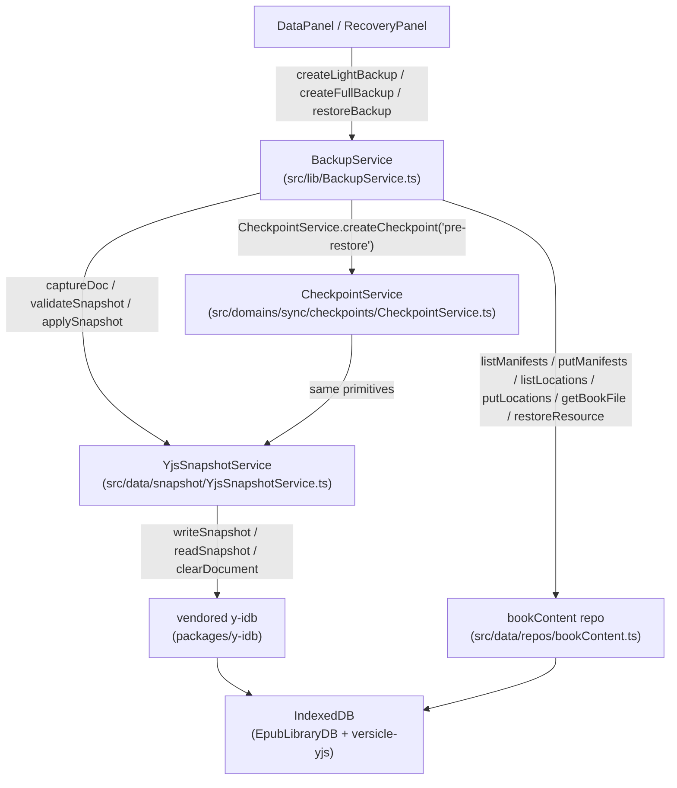
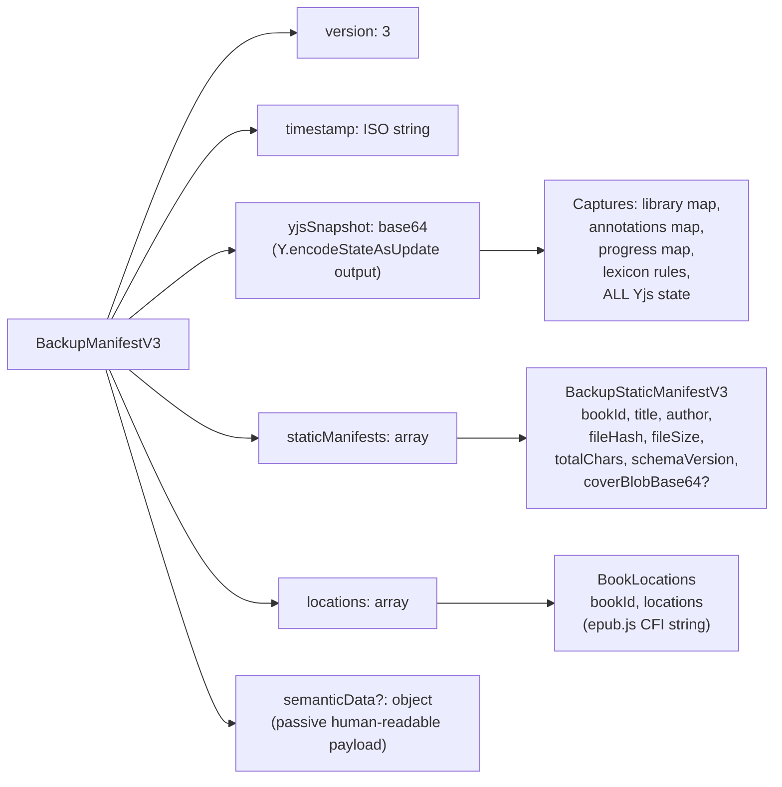
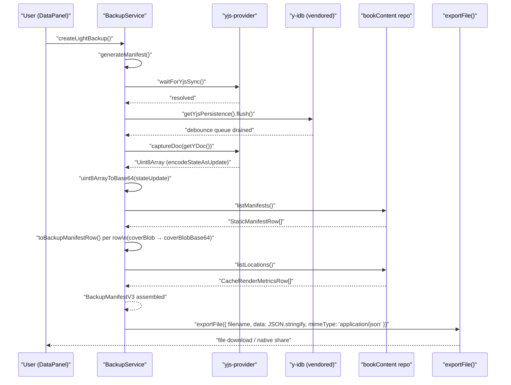
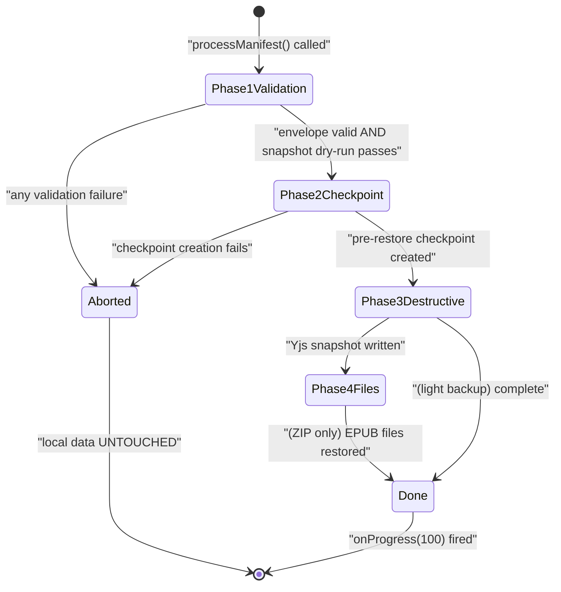
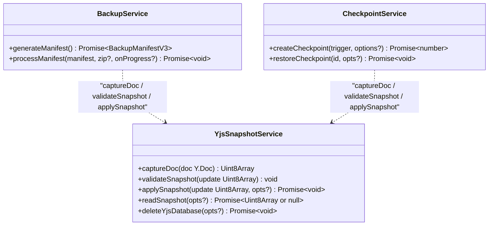
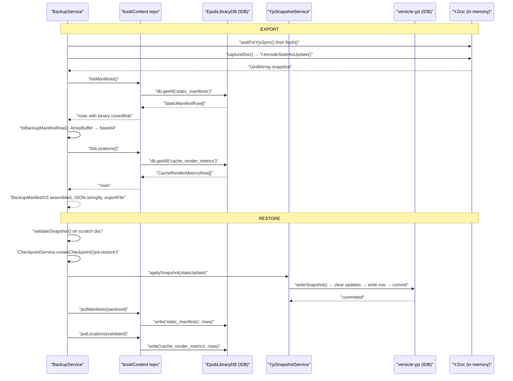

# Backup & Restore

Versicle's backup system is one of the most safety-critical paths in the codebase: it must serialize the entire user library state to a portable file and reconstitute it faithfully on any device — without ever silently corrupting or losing data. This document covers the design intent, all three manifest versions, the two backup modes (light JSON and full ZIP), the step-by-step restore sequence with its validate-before-destroy contract, the cover-blob repair logic that motivated manifest v3, and how checkpoint-based recovery integrates with the same underlying primitives.

---

## Design Intent

The backup system answers three failure scenarios:

1. **Device loss or migration** — a user's phone breaks or they move to a new one. All reading progress, annotations, lexicon rules, and book files must be portable.
2. **Accidental data wipe or sync corruption** — a bad cloud sync can replace the user's Yjs CRDT with stale or empty state. The user needs a local snapshot they can roll back to.
3. **Developer-induced regression** — schema migrations, CRDT rewrites, or IDB store changes must not silently discard user data. The backup/restore roundtrip is the acceptance gate.

The system's core invariant, stated explicitly in [BackupService.ts](../../src/lib/BackupService.ts):

> **Validate-before-destroy.** Nothing destructive may run until every check passes. Any failure before the destructive step leaves local data untouched.

This invariant is tested in the regression suite (see [Testing](#testing)) and is the reason the restore flow has a strict phase ordering rather than a simple overwrite.

A secondary invariant: the backup file is a **portable, format-stable artifact**. Manifest v3 was introduced specifically because v2 silently corrupted binary cover images through JSON serialization. The v2 reader is kept forever so old backup files remain restorable.

---

## Architecture Overview



The key module is [BackupService.ts](../../src/lib/BackupService.ts). It is a singleton (`export const backupService = new BackupService()`) with three public entry points:

| Method | Description |
|--------|-------------|
| `createLightBackup()` | Generates a manifest and downloads it as a `.json` file |
| `createFullBackup(onProgress?)` | Generates a manifest, packs all non-offloaded EPUB files into a ZIP, downloads as `.zip` |
| `restoreBackup(file, onProgress?)` | Dispatches to `restoreLightBackup` or `restoreFullBackup` based on file extension |

The heavy lifting — snapshot capture, dry-run validation, and durable write-back — is delegated to [YjsSnapshotService](../../src/data/snapshot/YjsSnapshotService.ts), a thin doc-agnostic primitive layer. Static IDB data (manifest rows, locations, EPUB files) flows through the [bookContent repo](../../src/data/repos/bookContent.ts). Both the backup path and the checkpoint path share the same three primitives (`captureDoc`, `validateSnapshot`, `applySnapshot`), so the contract is tested once and used consistently everywhere.

---

## Manifest Versions

The manifest is the JSON envelope that describes all restorable state. Three versions have existed; only v2 and v3 are currently restorable.

### Version 1 (dropped)

V1 embedded books, annotations, reading progress, and lexicon as flat JSON arrays derived from Zustand store snapshots. It predated the Yjs CRDT and is not restorable; the restore path rejects it immediately:

```typescript
// BackupService.ts line 279
if (!manifest || !manifest.yjsSnapshot) {
  throw new Error("Fatal: yjsSnapshot is missing. Legacy V1 restoration is not supported.");
}
```

### Version 2 (readable, legacy)

V2 replaced the flat-JSON payload with a Yjs snapshot: the entire Y.Doc state is captured via `Y.encodeStateAsUpdate()`, base64-encoded, and stored in `yjsSnapshot`. This gave the backup proper CRDT semantics — vector clocks, merge safety, and complete state capture including annotations, reading progress, and lexicon rules.

V2 had one known defect: `staticManifests` rows were embedded **verbatim** in the JSON. Since `coverBlob` is an `ArrayBuffer`, `JSON.stringify()` serialized it as `{}` — empty object garbage. Every v2 backup lost all cover images.

The v2 type:

```typescript
export interface BackupManifestV2 {
  version: 2;
  timestamp: string;
  yjsSnapshot: string;            // base64-encoded Y.encodeStateAsUpdate()
  staticManifests: StaticBookManifest[];  // coverBlob corrupted to {} via JSON
  locations: BookLocations[];
  semanticData?: Record<string, unknown>;
}
```

V2 backups remain restorable forever. The sanitizer in `processManifest` detects and strips the `{}` garbage and falls back to any pre-existing local cover (see [Cover-Blob Repair](#cover-blob-repair-the-v2-defect-and-v3-fix)).

### Version 3 (current)

V3 is structurally identical to v2 except binary fields in `staticManifests` are explicitly base64-encoded under a distinct key (`coverBlobBase64`) rather than being passed through `JSON.stringify` as raw binary:

```typescript
export type BackupStaticManifestV3 = Omit<StaticBookManifest, 'coverBlob'> & {
  coverBlobBase64?: string;   // base64-encoded thumbnail; absent if no cover
};

export interface BackupManifestV3 {
  version: 3;
  timestamp: string;
  yjsSnapshot: string;
  staticManifests: BackupStaticManifestV3[];   // covers base64-encoded, lossless
  locations: BookLocations[];
  semanticData?: Record<string, unknown>;
}
```

The `BACKUP_VERSION` constant in `BackupService` is `3`, so all new backups are v3.

### Manifest Structure



#### What goes in `yjsSnapshot`

`captureDoc(getYDoc())` calls `Y.encodeStateAsUpdate(doc)` — the standard Yjs binary encoding of the entire document state, including all `Y.Map` entries at every key the app uses. At runtime this encompasses:

- `library.books` — user's book inventory (title, author, tags, status, lastInteraction)
- `annotations` — per-book highlights and notes
- `progress` — reading position (CFI + percentage)
- `lexicon` — user-defined TTS pronunciation overrides

Because the snapshot is a Yjs update, it can be applied to a fresh (empty) Y.Doc using `Y.applyUpdate` and will fully reconstruct all state.

#### What goes in `staticManifests`

The `static_manifests` IDB store holds per-book data derived from EPUB parsing: file hash, file size, total character count, navigation structure, and the cover image thumbnail. This is **not** in Yjs because it is derived from the immutable EPUB file, not user-editable state.

#### What goes in `locations`

The `cache_render_metrics` store holds epub.js render-position data: the serialized CFI string (`locations`) used for fast percentage-to-page mapping. Regenerating it requires re-rendering the book, which takes time. Backing it up avoids that cost on restore.

#### `semanticData` — the passive payload

`generateManifest()` calls `generateSemanticTree()` from [src/lib/sync/semantic-tree.ts](../../src/lib/sync/semantic-tree.ts) concurrently with the snapshot. The result — a human-readable representation of the library — is stored in `semanticData`. It is never read during restore; it exists as an **audit artifact** and for potential future tooling. The field is untyped by design: typing it would import the sync manifest shape into the backup module's import graph.

---

## Export Paths

### Light Backup (JSON)



The pre-export flush (`getYjsPersistence()?.flush()`) is critical: the vendored y-idb fork batches writes with a debounce window. Without flushing, the last 200 ms of user changes could be missing from the snapshot. This surgery was added to the y-idb fork as "Surgery 1" (see [packages/y-idb/PROVENANCE.md](../../packages/y-idb/PROVENANCE.md)).

`exportFile()` in [src/lib/export.ts](../../src/lib/export.ts) handles both targets: on web it uses `file-saver`'s `saveAs`; on Capacitor native it writes to `Directory.Cache` then invokes the system share sheet via `@capacitor/share`.

### Full Backup (ZIP)

The full backup adds EPUB file archiving on top of the light backup:

1. Call `generateManifest()` (same as light backup)
2. Open a JSZip instance; write `manifest.json`
3. Open a `files/` folder in the zip
4. Iterate `library.books` keys from the Y.Doc's `books` submap
5. For each book ID, skip if `offloadedBookIds.has(bookId)` (books whose binary content has been offloaded to cloud storage are not present locally and cannot be archived)
6. Fetch the EPUB ArrayBuffer via `bookContent.getBookFile(bookId)` and write it as `${bookId}.epub`
7. Compress the zip with progress callbacks
8. Export the resulting Blob as `.zip`

The progress callback signature is `(percent: number, message: string) => void`, which the [DataPanel](../../src/app/settings/panels/DataPanel.tsx) threads through to a status line in the UI.

```typescript
// BackupService.ts — offload skip logic
const offloadedBookIds = useLibraryStore.getState().offloadedBookIds;
for (const bookId of bookIds) {
  if (offloadedBookIds.has(bookId)) {
    logger.warn(`Skipping offloaded book ${bookId} in full backup`);
    processed++;
    continue;
  }
  // ... fetch and archive
}
```

A light backup restored on a new device leaves books in the "offloaded" state — the library card shows a cloud icon, indicating the book is known but its binary content is absent. A full backup restores the EPUB files and clears the offloaded status.

---

## The Restore Pipeline

This is the most complex and safety-critical path. `processManifest()` is the single method that handles both light and full restores, parameterized by an optional JSZip instance.

### Phase Ordering

The strict four-phase ordering enforces the validate-before-destroy invariant:



#### Phase 1: Validation (no destructive side effects)

```typescript
// 1a. Check yjsSnapshot field is present (v1 rejection)
if (!manifest || !manifest.yjsSnapshot) {
  throw new Error("Fatal: yjsSnapshot is missing. ...");
}

// 1b. Zod envelope validation
const envelope = backupManifestEnvelopeSchema.safeParse(manifest);
if (!envelope.success) {
  throw new Error(`Invalid backup manifest: ${detail}`);
}

// 1c. Decode base64
let stateUpdate: Uint8Array;
try {
  stateUpdate = this.base64ToUint8Array(manifest.yjsSnapshot);
} catch {
  throw new Error('Invalid backup: yjsSnapshot is not valid base64. ...');
}

// 1d. Dry-run: apply to scratch Y.Doc
try {
  validateSnapshot(stateUpdate);
} catch (e) {
  throw new Error('Invalid backup: yjsSnapshot is not a decodable Yjs update. ...');
}
```

`validateSnapshot()` in [YjsSnapshotService.ts](../../src/data/snapshot/YjsSnapshotService.ts) creates a disposable `Y.Doc`, calls `Y.applyUpdate(scratch, update)`, and destroys it. If Yjs throws (which it does for truncated or garbage bytes), the error is caught and re-thrown as an `AppError` with code `BACKUP_SNAPSHOT_INVALID`. The scratch doc is always destroyed in the `finally` block.

The Zod envelope schema ([src/data/rows/backup.ts](../../src/data/rows/backup.ts)) is deliberately loose:

```typescript
export const backupManifestEnvelopeSchema = z.looseObject({
  version: z.union([z.literal(2), z.literal(3)]),
  timestamp: z.string(),
  yjsSnapshot: z.string().min(1),
  staticManifests: z.array(z.looseObject({ bookId: z.string() })).optional(),
  locations: z.array(z.looseObject({ bookId: z.string() })).optional(),
});
```

`z.looseObject` passes unknown extra fields through. The row-level schemas (`backupStaticManifestRowSchema`, `bookLocationsRowSchema`) that validate individual items are applied later, at write time, so old v2 manifests with extra or missing fields still pass the envelope check.

#### Phase 2: Pre-Restore Checkpoint

Before any destructive operation, `BackupService` creates a checkpoint of the **current** live state:

```typescript
const { CheckpointService } = await import('@domains/sync/checkpoints/CheckpointService');
const checkpointId = await CheckpointService.createCheckpoint('pre-restore');
```

This is a dynamic import to avoid pulling `CheckpointService` (and its Firestore/sync dependencies) into `BackupService`'s eager import graph. If the checkpoint fails (e.g. disk full), the restore is aborted with the error "Restore aborted: could not create a pre-restore checkpoint. Local data was left untouched."

The test suite asserts the ordering explicitly:

```typescript
// BackupService.test.ts
const checkpointOrder = mocks.checkpointMock.createCheckpoint.mock.invocationCallOrder[0];
const clearOrder = mocks.persistenceMock.clearData.mock.invocationCallOrder[0];
expect(checkpointOrder).toBeLessThan(clearOrder);
```

#### Phase 3: Destructive Replacement

This is the first point at which local data is touched, and only after both phases above have succeeded.

```typescript
// 1. Clear existing y-idb persistence
const persistence = getYjsPersistence();
if (persistence) {
  await persistence.clearData();
}

// 2. Write the snapshot durably
await applySnapshot(stateUpdate);
```

`applySnapshot()` in [YjsSnapshotService.ts](../../src/data/snapshot/YjsSnapshotService.ts) calls `writeSnapshot(dbName, update, { transactionRunner: runExclusiveIdbWrite })` from the vendored y-idb fork. This opens the `versicle-yjs` IndexedDB, clears the `updates` store, writes a single snapshot row, and resolves only after the transaction has **committed** — so the caller can immediately reload the page without the risk of losing the write. The cross-context exclusive write gate (`runExclusiveIdbWrite`) ensures this never overlaps another IDB writer.

The comment in the source documents why the old approach (a raw `indexedDB.open('versicle-yjs')` block plus a 1000 ms sleep) was replaced:

```typescript
// No flush wait needed: applySnapshot already awaited the commit (the
// 1000ms sleep that used to live here was covering for the lack of a
// durable write primitive).
```

After `applySnapshot`, static IDB data is written. Each incoming row goes through per-row schema validation:

**Static manifests** — `backupStaticManifestRowSchema.safeParse(raw)`. Invalid rows (missing `bookId`, etc.) are **skipped with a warning** instead of being written as garbage. Valid rows are passed through `sanitizeManifestRow()` for cover-blob handling (see next section), then bulk-written via `bookContent.putManifests()`.

**Locations** — `bookLocationsRowSchema.safeParse(raw)`. Rows missing the required `locations: string` field are skipped. Valid rows are bulk-written via `bookContent.putLocations()`.

#### Phase 4: File Restoration (ZIP only)

When a JSZip is present, the `files/` folder is iterated:

```typescript
filesFolder.forEach((relativePath, zipFile) => {
  if (relativePath.endsWith('.epub')) {
    const bookId = relativePath.replace('.epub', '');
    const p = (async () => {
      const arrayBuffer = await zipFile.async('arraybuffer');
      await bookContent.restoreResource(bookId, arrayBuffer);
      restoredBookIds.push(bookId);
    })();
    filePromises.push(p);
  }
});
await Promise.all(filePromises);
```

Files are restored in parallel. `bookContent.restoreResource()` does a read-modify-write: it reads the existing `static_resources` row outside the write gate, then puts the new `epubBlob: arrayBuffer` in a single gated transaction (per the D1 write discipline — no awaits inside the readwrite transaction, preventing WebKit IDB hangs).

After files are restored, offload status is cleared for each restored book via `useLibraryStore.getState().unmarkOffloaded(id)`. The comment explains why per-key deltas are used rather than wholesale replacement of the offloaded set (Phase 7 I-5 constraint).

---

## Cover-Blob Repair: The V2 Defect and V3 Fix

This is the most subtle part of the backup system and the direct motivation for introducing manifest v3.

### The Defect

In v2, `staticManifests` were embedded verbatim:

```typescript
// v2 manifest generation (simplified)
const staticManifests = await bookContent.listManifests();
return { version: 2, ..., staticManifests };
```

When `JSON.stringify()` serialized a `StaticBookManifest`, the `coverBlob: ArrayBuffer` field became `{}` — JSON has no representation for binary data. The deserialized manifest had `coverBlob: {}` (a plain empty object), which is neither a Blob nor an ArrayBuffer. Every v2 backup silently discarded all cover images.

### The V3 Fix: Explicit Base64 Encoding

`toBackupManifestRow()` runs per manifest row during export:

```typescript
private async toBackupManifestRow(manifest: StaticManifestRow): Promise<BackupStaticManifestV3> {
  const { coverBlob, ...rest } = manifest;
  const row: BackupStaticManifestV3 = { ...rest };
  const cover: unknown = coverBlob;

  if (cover instanceof ArrayBuffer) {
    row.coverBlobBase64 = this.uint8ArrayToBase64(new Uint8Array(cover));
  } else if (cover instanceof Blob) {
    row.coverBlobBase64 = this.uint8ArrayToBase64(new Uint8Array(await cover.arrayBuffer()));
  }
  // Non-binary garbage (e.g., {} from pre-v3 restores) is silently dropped:
  // it never enters coverBlobBase64.

  return row;
}
```

The raw `coverBlob` field is stripped from the output; only `coverBlobBase64` appears in the v3 JSON. On restore, `sanitizeManifestRow()` decodes it back:

```typescript
if (typeof coverBlobBase64 === 'string' && coverBlobBase64.length > 0) {
  try {
    row.coverBlob = this.base64ToUint8Array(coverBlobBase64).buffer;
  } catch {
    logger.warn(`Dropping undecodable cover for book ${incoming.bookId}`);
  }
}
```

The result is an `ArrayBuffer` — the canonical storage format for covers in IDB (WebKit's structured clone does not support `Blob`).

### V2 Sanitization: Never Clobber a Healthy Local Cover

For v2 restores, `sanitizeManifestRow()` applies a merge rule:

```typescript
// 1. Try coverBlobBase64 (v3 path)
// 2. Fall through to raw coverBlob if it is a real binary (in-memory v2)
// 3. If neither is usable, look for a pre-existing local cover and preserve it

if (row.coverBlob === undefined && existing) {
  const localCover: unknown = existing.coverBlob;
  if (localCover instanceof Blob || localCover instanceof ArrayBuffer) {
    row.coverBlob = localCover;
  }
}
```

This means a restore can **never destroy a healthy local cover** with the `{}` garbage from a v2 backup. The existing rows are read before the write gate opens (D1 recipe: read outside the gate, write synchronously inside) and matched by `bookId`.

The test asserting this invariant:

```typescript
// BackupService.test.ts — v2 sanitization test
const b1 = putRows.find(r => r.bookId === 'b1');
expect(b1.coverBlob).toBe(localCover);   // preserved, not clobbered

const b2 = putRows.find(r => r.bookId === 'b2');
expect('coverBlob' in b2).toBe(false);   // {} stripped, never written
```

---

## YjsSnapshotService: The Primitive Layer

[src/data/snapshot/YjsSnapshotService.ts](../../src/data/snapshot/YjsSnapshotService.ts) is the shared implementation of the three snapshot operations. It is explicitly **doc-agnostic** — it never imports `@store/yjs-provider` and takes or returns the doc as a parameter. This keeps it importable from the TTS worker and from future non-store contexts.



**`captureDoc(doc)`** — a thin wrapper around `Y.encodeStateAsUpdate(doc)`. Returns a `Uint8Array`.

**`validateSnapshot(update)`** — creates a scratch `Y.Doc`, calls `Y.applyUpdate(scratch, update)`, destroys the doc. Throws `AppError` with code `BACKUP_SNAPSHOT_INVALID` for empty bytes, non-`Uint8Array` values, or Yjs decode errors.

**`applySnapshot(update, opts?)`** — calls `writeSnapshot(dbName, update, { transactionRunner: runExclusiveIdbWrite })` from the vendored y-idb fork. The fork's `writeSnapshot` (Surgery 2, added during Phase 3) opens the named IDB database with y-idb's own store layout, clears the `updates` store, writes the single snapshot row, and awaits the transaction `complete` event before resolving. In DEV mode, `applySnapshot` re-validates the update as a last-line-of-defense check (makes "applySnapshot wrote garbage" unrepresentable in development).

**`readSnapshot(opts?)`** — reads the complete persisted state from `dbName` without constructing a live persistence binding. Used by the boot interceptor to read from the staging database (`versicle-yjs-staging`) before any provider exists.

**`deleteYjsDatabase(opts?)`** — calls `clearDocument(dbName)` from the fork (`indexedDB.deleteDatabase`). Used to wipe the staging database after a finalized workspace switch.

The two named database constants are also defined here to avoid upward imports:

```typescript
export const YJS_DB_NAME = 'versicle-yjs';
export const YJS_STAGING_DB_NAME = 'versicle-yjs-staging';
```

---

## Checkpoint-Based Recovery

While `BackupService` handles user-exported files, `CheckpointService` handles **automatic in-app snapshots** — taken before sync operations, before workspace migrations, and on user request.

Checkpoints use the same three primitives (`captureDoc`, `validateSnapshot`, `applySnapshot`) and the same validate-before-destroy ordering. The recovery UI is exposed through [RecoveryPanel](../../src/app/settings/panels/RecoveryPanel.tsx) and the presentational [RecoverySettingsTab](../../src/components/settings/RecoverySettingsTab.tsx).

### Checkpoint Triggers

| Trigger string | Created by |
|---|---|
| `'pre-restore'` | `BackupService.processManifest()` — before any file restore |
| `'pre-migration'` | Workspace switch startup — protected against pruning |
| `'pre-sync'` | Automatic checkpoint before a cloud sync pull |
| `'manual'` | User clicks "Create Snapshot" in RecoveryPanel |
| `'auto'` | Interval-gated automatic checkpoint (`createAutomaticCheckpoint`) |

### Protected Checkpoints

`createCheckpoint(trigger, { protected: true })` pins the checkpoint against the rolling prune. Only the **latest** protected checkpoint stays pinned — creating a new one returns older protected checkpoints to the normal rotation, so they cannot accumulate forever.

### Restore via Checkpoint

`CheckpointService.restoreCheckpoint(id, opts)` follows the same validate-before-destroy pattern:

1. Fetch checkpoint blob from IDB
2. `validateSnapshot(checkpoint.blob)` — dry-run before anything destructive
3. `opts.pauseSync?.()` — sever cloud sync (injected handle, the §D7 inversion pattern that breaks the circular dependency)
4. Under `withSwapLock` (cross-tab lock): `persistence.clearData()` → `disconnectYjs()` → `applySnapshot(checkpoint.blob)`
5. Revert `activeWorkspaceId` if the migration state carries `previousWorkspaceId` (P4-5 rollback path)
6. Clear migration state machine
7. `window.location.reload()`

The `withSwapLock` call ensures the destructive section is serialized against concurrent cross-tab operations.

If no live persistence binding exists (boot-time rollback, where the boot interceptor's `RESTORING_BACKUP` arm precedes `startYjsPersistence`), the path branches: `deleteYjsDatabase()` is called instead of `persistence.clearData()`, and then `applySnapshot` creates the database fresh.

### Checkpoint Inspection (Diff View)

`CheckpointInspector.diffCheckpoint(blob)` hydrates the checkpoint blob into an ephemeral `Y.Doc` and computes a per-store diff against the current live doc:

```typescript
static diffCheckpoint(checkpointBlob: Uint8Array): Record<string, DiffResult> {
  const tempDoc = new Y.Doc();
  Y.applyUpdate(tempDoc, checkpointBlob);
  const liveJson = this.docToJson(getYDoc());
  const checkpointJson = this.docToJson(tempDoc);
  // ... diff each store
}
```

The `DiffResult` interface:

```typescript
export interface DiffResult {
  added: Record<string, unknown>;       // in checkpoint but not in live → will be restored
  removed: Record<string, unknown>;     // in live but not in checkpoint → will be lost
  modified: Record<string, { old: unknown; new: unknown }>;
  unchangedCount: number;
}
```

The UI renders this via `CheckpointDiffView`, allowing the user to inspect what will be gained and lost before confirming a rollback.

---

## The Roundtrip Contract

The test file [src/lib/BackupService.roundtrip.test.ts](../../src/lib/BackupService.roundtrip.test.ts) is the acceptance gate for the entire backup pipeline. It runs against the **real** `BackupService`, the **real** Y.Doc, and a **real** fake-indexeddb IDB (no y-idb mocks):

```
S.1 — the end-to-end backup generate→restore round-trip characterization
```

The suite seeds a Y.Doc with a library book, an annotation, and a binary cover (including bytes > 0x7F to catch base64/charCode encoding bugs), then:

1. Calls `backupService.generateManifest()` and simulates `JSON.parse(JSON.stringify(manifest))` to prove JSON is lossless
2. Wipes the app database
3. Calls `backupService.processManifest(manifest)`
4. Opens the `versicle-yjs` IDB directly and verifies: exactly **one** row in the `updates` store, byte-identical to `base64ToBytes(manifest.yjsSnapshot)`
5. Hydrates a fresh `Y.Doc` from those raw rows (simulating y-idb's boot rehydration) and asserts the library and annotation content matches

```typescript
// BackupService.roundtrip.test.ts — key assertions
expect(rows).toHaveLength(1);
expect(Array.from(rows[0])).toEqual(Array.from(base64ToBytes(manifest.yjsSnapshot)));

const fresh = new Y.Doc();
Y.applyUpdate(fresh, rows[0]);
const books = fresh.getMap('library').toJSON().books as Record<string, { title: string }>;
expect(books[BOOK_ID]?.title).toBe('Round-Trip Book');
```

Cover bytes used in the roundtrip test include high-value bytes specifically chosen to catch encoding bugs:

```typescript
const COVER_BYTES = [137, 80, 78, 71, 13, 10, 26, 10, 0, 255, 128, 7];
```

---

## UI Integration

### DataPanel

[src/app/settings/panels/DataPanel.tsx](../../src/app/settings/panels/DataPanel.tsx) is the wired container for the presentational [DataManagementTab](../../src/components/settings/DataManagementTab.tsx). It holds all backup-related handlers:

| Handler | Calls |
|---|---|
| `handleExportLight` | `backupService.createLightBackup()` |
| `handleExportFull` | `backupService.createFullBackup(onProgress)` |
| `handleRestoreBackupFile` | Shows `useConfirm()` dialog, then `backupService.restoreBackup(file, onProgress)` |

After a successful restore, `DataPanel` calls `window.location.reload()` with a 500 ms delay. This is required because `applySnapshot` writes to IDB but the live Y.Doc and Zustand stores still hold the pre-restore state in memory; only a full reload causes y-idb to rehydrate the doc from the new IDB contents.

```typescript
// DataPanel.tsx — post-restore reload
setBackupStatus('Restore complete! Reloading...');
setTimeout(() => window.location.reload(), 500);
```

### DataManagementTab (presentational)

[src/components/settings/DataManagementTab.tsx](../../src/components/settings/DataManagementTab.tsx) is a pure presentational component. It exposes:

- Two export buttons: "Full ZIP Export" and "Quick JSON Export"
- A "Restore Backup" button that opens a hidden `<input type="file" accept=".zip,.json,.vbackup">`
- A `backupStatus` string prop that renders as a pulsing status line during long operations

The hidden file input uses `data-testid="backup-file-input"` — the test ID the Playwright E2E tests target.

### RecoveryPanel

[src/app/settings/panels/RecoveryPanel.tsx](../../src/app/settings/panels/RecoveryPanel.tsx) lists all checkpoints and wires the "Create Snapshot" button to `CheckpointService.createCheckpoint('manual')`. The checkpoint listing uses a `useEffect` with an `ignore` flag to prevent state updates after unmount — a predictability regression that was pinned in `SettingsShell.test.tsx`.

Checkpoint restore goes through `RecoverySettingsTab.handleConfirmRestore()`, which calls `CheckpointService.restoreCheckpoint(id, { pauseSync: stopSyncConnections })`. The `stopSyncConnections` handle from `@app/sync/createSync` is injected here rather than imported into `CheckpointService`, breaking the circular dependency (§D7 inversion).

---

## Testing

### Unit Tests

[src/lib/BackupService.test.ts](../../src/lib/BackupService.test.ts) covers:

- `createLightBackup` — asserts the exported file is valid v3 JSON with a non-empty `yjsSnapshot`
- `createFullBackup` — asserts the export is a ZIP with the correct MIME type
- V2 restore — asserts `clearData` was called, then verifies the raw `versicle-yjs` IDB updates store contains the snapshot
- V1 rejection — asserts the "Fatal: yjsSnapshot is missing" error
- **Regression suite (validate-before-destroy)**:
  - Invalid manifest structure rejected → local data untouched, checkpoint not created
  - Unknown version (4+) rejected
  - Invalid base64 rejected → local data untouched, checkpoint not created
  - Garbage bytes (valid base64, not a Yjs update) rejected via dry-run → local data untouched, checkpoint not created
  - Checkpoint ordering: checkpoint is created BEFORE `clearData`, asserted via `invocationCallOrder`
  - Checkpoint failure aborts restore
- **Cover-blob regression suite**:
  - V3 export: `coverBlob` absent from JSON, `coverBlobBase64` present as string; restore decodes back to `ArrayBuffer`
  - V2 import: `{}` garbage stripped; healthy local cover preserved for `b1`

### Roundtrip Test

[src/lib/BackupService.roundtrip.test.ts](../../src/lib/BackupService.roundtrip.test.ts) — the S.1 acceptance gate. No y-idb mocks; tests the raw IDB write shape.

### Row Schema Tests

[src/data/rows/rows.test.ts](../../src/data/rows/rows.test.ts) validates `backupStaticManifestRowSchema` and `bookLocationsRowSchema`:

- `backupStaticManifestRowSchema` accepts rows with `coverBlobBase64`, with `coverBlob: {}` (v2 garbage), and without a cover
- `bookLocationsRowSchema` requires `locations: string`; rejects missing or non-string values

### E2E Verification Tests

[verification/test_journey_backup.spec.ts](../../verification/test_journey_backup.spec.ts) contains two Playwright journeys:

**Journey: Light JSON Backup & Restore**
1. Import an EPUB, add a lexicon rule, export "Quick JSON Export", delete the book, restore from the downloaded `.json`, verify the book card is visible and shows the "offloaded" cloud icon overlay (because the EPUB file was not in the light backup).

**Journey: Full ZIP Backup & Restore**
1. Import an EPUB, export "Full ZIP Export", delete the book, restore from the downloaded `.zip`, verify the book card is visible and does **not** show the cloud icon (EPUB file fully restored).

Both journeys use `await utils.acceptConfirm(page)` to dismiss the in-app `ConfirmDialog` (which replaced the previously-used `window.confirm()` call).

---

## Failure Modes and Edge Cases

| Scenario | Behavior |
|---|---|
| V1 backup file | Rejected immediately: "Fatal: yjsSnapshot is missing." Local data untouched. |
| Unknown version (e.g., 4) | Zod envelope rejects `z.union([z.literal(2), z.literal(3)])`. Local data untouched. |
| Manifest missing `timestamp` | Zod envelope rejects. Local data untouched. |
| `yjsSnapshot` is invalid base64 | `base64ToUint8Array` throws. Local data untouched; checkpoint not created. |
| `yjsSnapshot` decodes to garbage (not a Yjs update) | `validateSnapshot` throws from `Y.applyUpdate` on scratch doc. Local data untouched; checkpoint not created. |
| Pre-restore checkpoint fails (disk full, IDB error) | Restore aborted: "Restore aborted: could not create a pre-restore checkpoint." Local data untouched. |
| `staticManifests` row missing `bookId` | `backupStaticManifestRowSchema.safeParse` fails. Row skipped with a warning; other rows still written. |
| `locations` row missing `locations` field | `bookLocationsRowSchema.safeParse` fails. Row skipped with a warning. |
| Cover `coverBlobBase64` is malformed base64 | `base64ToUint8Array` inside `sanitizeManifestRow` throws; warning logged, cover dropped (book metadata still written without cover). |
| EPUB file missing from ZIP for a given book | `bookContent.getBookFile` returns `undefined`; logged as error; other books still archived. |
| Book is offloaded during full backup | Skipped with a warning; book will appear as offloaded after restore. |
| Full backup ZIP missing `manifest.json` | Throws "Invalid backup: manifest.json is missing". |
| `.vbackup` extension | Treated as ZIP (same code path as `.zip`). |

---

## Data Flow: Export and Import IDB Layers



---

## Relationship to Other Subsystems

- **[State management (CRDT)](13-state-management-crdt.md)** — `yjsSnapshot` is the serialized form of the entire Yjs Y.Doc; restoring it replaces all CRDT state atomically.
- **[Storage gateway](20-storage-gateway.md)** and **[Schema and migrations](21-schema-and-migrations-idb.md)** — the `bookContent` repo's `putManifests`, `putLocations`, and `restoreResource` methods are the backup system's write surface into IDB. All writes go through the cross-context exclusive write gate (`write()` in [src/data/write-gate.ts](../../src/data/write-gate.ts)).
- **[Bootstrap and lifecycle](14-bootstrap-and-lifecycle.md)** — the `RESTORING_BACKUP` migration state (in [`src/types/workspace.ts`](../../src/types/workspace.ts)) connects the checkpoint restore flow to the boot interceptor, enabling boot-time rollback.
- **[Domain sync](36-domain-sync.md)** — `CheckpointService.createCheckpoint('pre-sync')` is called before cloud sync pulls. `pauseSync` injection (§D7 inversion) means `CheckpointService` severs sync without importing the sync orchestrator.
- **[Error handling and recovery](15-error-handling-and-recovery.md)** — the checkpoint inspection (Diff View) and the Raw Data Recovery Tool in `RecoverySettingsTab` are the emergency recovery UI path for corrupted state.
- **[Vendored forks](66-vendored-forks.md)** — the y-idb fork's Surgery 1 (`flush()`), Surgery 2 (`writeSnapshot`), and Surgery 4 (`readSnapshot`) are the durability primitives the backup system depends on. Without Surgery 2, the restore path re-implemented y-idb's store layout with a raw `indexedDB.open` call and a 1000 ms sleep.
- **[Settings shell](41-settings-shell.md)** — `DataPanel` and `RecoveryPanel` are lazy-loaded settings panels registered in the settings registry. The Data panel's `backup-file-input` mounts a beat after the tab activates; the E2E tests explicitly wait for `state: "attached"` before setting files.
- **[E2E verification](64-e2e-verification.md)** — `test_journey_backup.spec.ts` is one of the named journey tests in the verification suite.

---

## Key Files Quick Reference

| Path | Role |
|---|---|
| [src/lib/BackupService.ts](../../src/lib/BackupService.ts) | Main service: export, restore, manifest generation |
| [src/data/snapshot/YjsSnapshotService.ts](../../src/data/snapshot/YjsSnapshotService.ts) | Primitive layer: captureDoc, validateSnapshot, applySnapshot |
| [src/data/rows/backup.ts](../../src/data/rows/backup.ts) | Zod envelope schema for untrusted backup ingress |
| [src/data/rows/static.ts](../../src/data/rows/static.ts) | `backupStaticManifestRowSchema` (per-row validation) |
| [src/data/rows/cache.ts](../../src/data/rows/cache.ts) | `bookLocationsRowSchema` (per-row validation) |
| [src/data/repos/bookContent.ts](../../src/data/repos/bookContent.ts) | IDB read/write for manifests, locations, resources |
| [src/domains/sync/checkpoints/CheckpointService.ts](../../src/domains/sync/checkpoints/CheckpointService.ts) | Checkpoint create, restore, list, prune |
| [src/domains/sync/checkpoints/CheckpointInspector.ts](../../src/domains/sync/checkpoints/CheckpointInspector.ts) | Diff a checkpoint blob against live state |
| [src/app/settings/panels/DataPanel.tsx](../../src/app/settings/panels/DataPanel.tsx) | Wired container for backup/restore UI |
| [src/app/settings/panels/RecoveryPanel.tsx](../../src/app/settings/panels/RecoveryPanel.tsx) | Wired container for checkpoint recovery UI |
| [src/components/settings/DataManagementTab.tsx](../../src/components/settings/DataManagementTab.tsx) | Presentational backup/restore UI |
| [src/components/settings/RecoverySettingsTab.tsx](../../src/components/settings/RecoverySettingsTab.tsx) | Presentational checkpoint recovery UI |
| [src/lib/BackupService.test.ts](../../src/lib/BackupService.test.ts) | Unit + regression tests |
| [src/lib/BackupService.roundtrip.test.ts](../../src/lib/BackupService.roundtrip.test.ts) | S.1 acceptance gate (real IDB, no mocks) |
| [verification/test_journey_backup.spec.ts](../../verification/test_journey_backup.spec.ts) | Playwright E2E journey tests |
| [packages/y-idb/PROVENANCE.md](../../packages/y-idb/PROVENANCE.md) | Fork delta log for vendored y-idb (Surgeries 1–4) |
| [docs/adr/0002-android-backup.md](../../docs/adr/0002-android-backup.md) | ADR: why the Android Auto Backup integration was deleted |
