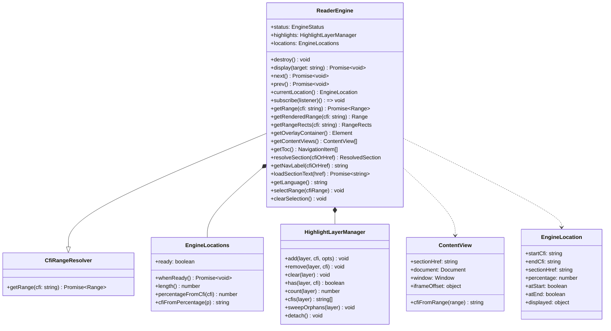
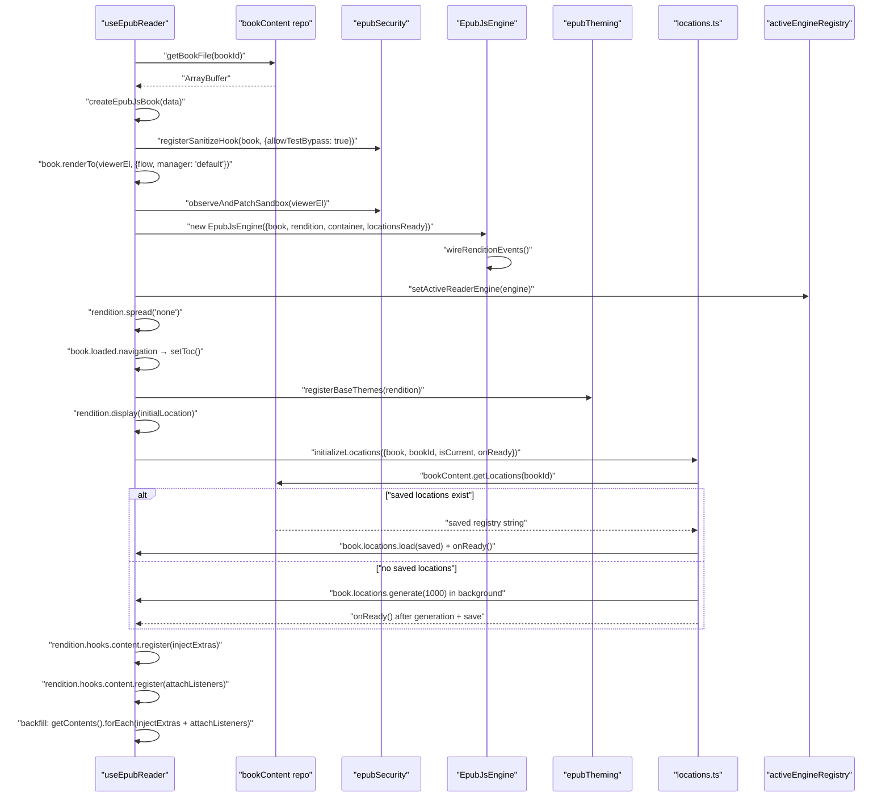
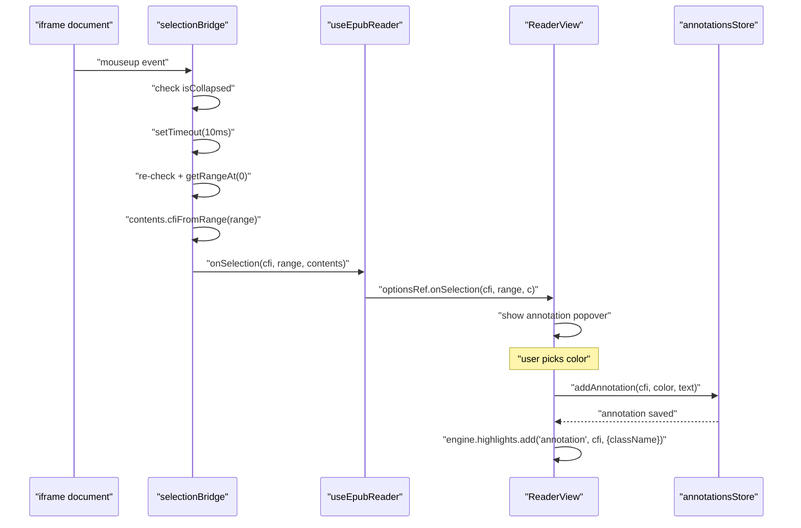
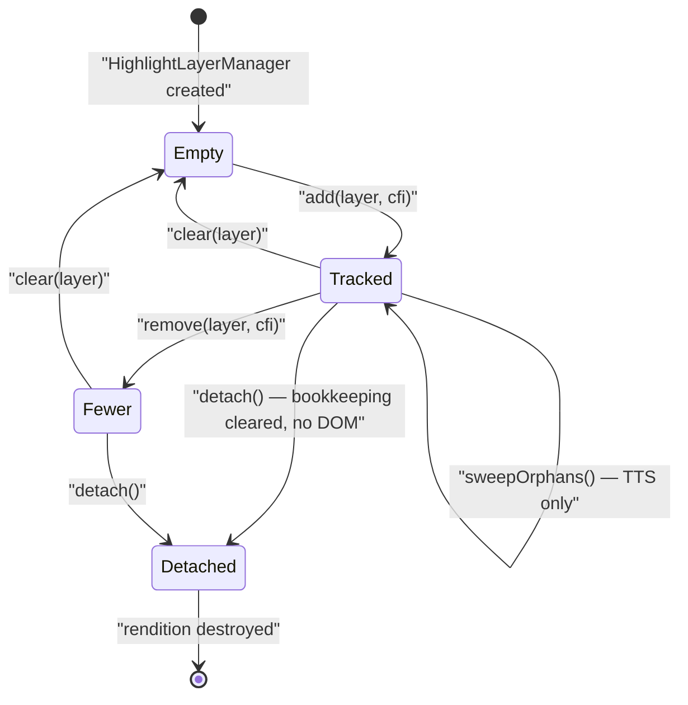
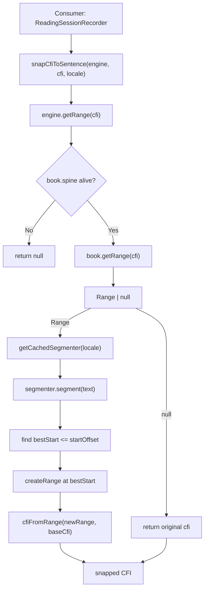
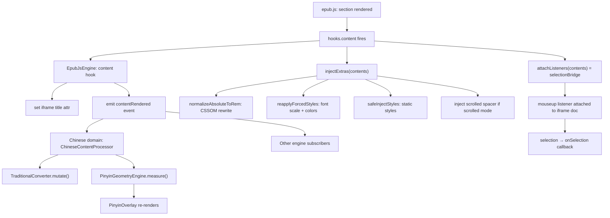
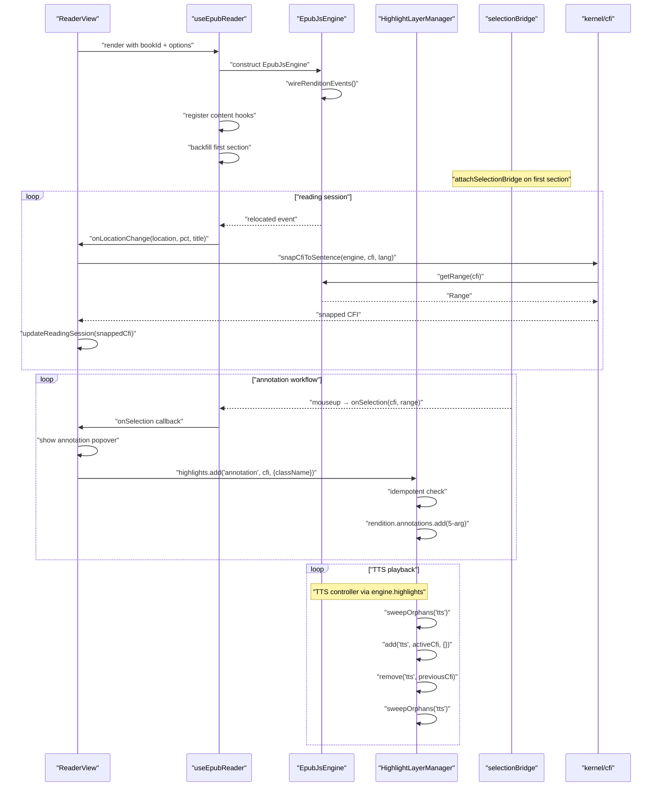

# Reader Domain: Rendering Engine

The reader engine is the most structurally significant subsystem in Versicle. It wraps epub.js 0.3.93 — an effectively unmaintained library that renders EPUB content inside sandboxed iframes — and exposes a clean, renderer-agnostic port (`ReaderEngine`, contract C7) to the rest of the application. Everything above the port boundary — components, panels, the TTS engine, the Chinese domain, reading-session recording — interacts with `ReaderEngine`; nothing above that line ever imports or touches an epub.js `Book` or `Rendition` directly.

This document covers the design intent, the architecture of the engine domain, and the detailed implementation of every module: the `ReaderEngine` interface itself, the `EpubJsEngine` production implementation, the `FakeReaderEngine` test double, the active-engine registry, the selection bridge and its first-section fix, the `HighlightLayerManager`, epub security sanitization, theming, and CFI/location resolution.

Cross-references: [Architecture overview](10-architecture-overview.md), [Layering and boundaries](11-layering-and-boundaries.md), [Contract-first registry](12-contract-first-registry.md), [State management](13-state-management-crdt.md), [Reader UI and overlays](31-reader-ui-and-overlays.md), [TTS engine](32-domain-audio-tts-engine.md), [Chinese domain](35-domain-chinese.md).

---

## 1. Why the Engine Port Exists

Before Phase 6, epub.js internals — raw `Book`, `Rendition`, and their undocumented `.manager`, `.views()`, `.pane.element` children — were load-bearing API surface scattered across twelve components and hooks. Any change to epub.js semantics (or a renderer swap) required touching everything. Worse, the `Rendition` was passed as an `any`-typed prop through component hierarchies, held in Zustand store callbacks, and driven via `window` `CustomEvent`s from outside the React tree. A test global `window.rendition` was the E2E hook into the live book.

The motivating debt items from [plan/overhaul/analysis/reader.md](../../plan/overhaul/analysis/reader.md) make this concrete:

- **D9 (Leaky abstraction):** `rendition`/`book` reached `TOCPanel`, `ReadingHistoryPanel`, `SearchPanel`, `ReaderTTSController`, `CompassPill` via a never-supplied `rendition?: any` prop, and `useReaderUIStore` held `jumpToLocation`/`playFromSelection` closures over the live rendition.
- **D10 (Six overlay systems):** Three manual DOM sweeps of `view.pane.element` inside `ReaderTTSController` to remove orphaned SVG `g.tts-highlight` nodes leaked by epub.js — triplicated scar tissue, with styling sourced from three conflicting locations.
- **D3 (Dual selection pipelines):** epub.js's own `selected` event and a parallel `mouseup` pipeline both fired `onSelection`, causing the annotation popover to appear twice per gesture.
- **D1 (Shadowed type stub):** A hand-rolled `src/types/epubjs.d.ts` shadowed the library's own shipped types, causing ~53 `as any` casts throughout the codebase.

The design objective was:

> Components and stores never see `Book`/`Rendition`; they see `ReaderEngine` from context. `EpubJsEngine` is the ONLY runtime importer of epubjs in the tree (boundary rule 8, lint-enforced). After this refactor, swapping to a different renderer is a one-module change — demonstrated by the shell booting on `FakeReaderEngine`.

---

## 2. Module Map

All source files live under [`src/domains/reader/engine/`](../../src/domains/reader/engine/).

| File | Role |
|---|---|
| [`ReaderEngine.ts`](../../src/domains/reader/engine/ReaderEngine.ts) | The port interface (contract C7) and all its supporting types |
| [`EpubJsEngine.ts`](../../src/domains/reader/engine/EpubJsEngine.ts) | The sole runtime epub.js implementation; the ONLY epubjs importer |
| [`FakeReaderEngine.ts`](../../src/domains/reader/engine/FakeReaderEngine.ts) | In-memory test double; proves the port is renderer-agnostic |
| [`ReaderEngine.contract.test.ts`](../../src/domains/reader/engine/ReaderEngine.contract.test.ts) | Conformance suite run against both implementations |
| [`activeEngineRegistry.ts`](../../src/domains/reader/engine/activeEngineRegistry.ts) | Module-scope singleton for the live engine (E2E test seam) |
| [`selectionBridge.ts`](../../src/domains/reader/engine/selectionBridge.ts) | The single mouseup-based selection pipeline |
| [`HighlightLayerManager.ts`](../../src/domains/reader/engine/HighlightLayerManager.ts) | The ONLY caller of `annotations.add/remove` |
| [`highlightStyles.ts`](../../src/domains/reader/engine/highlightStyles.ts) | One style registry emitting both iframe CSS and parent SVG CSS |
| [`epubSecurity.ts`](../../src/domains/reader/engine/epubSecurity.ts) | Shared sanitize hook + iframe sandbox observer |
| [`epubTheming.ts`](../../src/domains/reader/engine/epubTheming.ts) | Presentation pipeline: theme, font normalization, flow |
| [`locations.ts`](../../src/domains/reader/engine/locations.ts) | CFI↔percentage registry: load-from-IDB or background generate |
| [`epubjsInternals.ts`](../../src/domains/reader/engine/epubjsInternals.ts) | Typed widenings for epub.js undeclared internals |
| [`offscreen/offscreen-renderer.ts`](../../src/domains/reader/engine/offscreen/offscreen-renderer.ts) | Ingestion-time hidden rendition for sentence CFI extraction |

The CFI algebra kernel lives at [`src/kernel/cfi/`](../../src/kernel/cfi/) — a separate domain that `EpubJsEngine` implements as a `CfiRangeResolver`.

---

## 3. The ReaderEngine Interface (Contract C7)



### 3.1 Type Definitions

**`EngineStatus`** — the engine lifecycle:

```typescript
export type EngineStatus = 'idle' | 'loading' | 'ready' | 'error';
```

`EpubJsEngine` starts at `'ready'` (constructed after the rendition is live); transitions to `'idle'` on `destroy()`. The `'loading'` and `'error'` states are reserved for a future async construction path.

**`EngineLocation`** — the normalized position shape emitted on every relocation:

```typescript
export interface EngineLocation {
  startCfi: string;         // epubcfi(…) of the first visible character
  endCfi: string;           // epubcfi(…) of the last visible character
  sectionHref: string;      // OPF spine item href (e.g. 'chapter01.xhtml')
  percentage: number;       // 0–1 book-wide reading progress
  atStart: boolean;
  atEnd: boolean;
  displayed?: { page: number; total: number };
}
```

**`ContentView`** — a rendered section surface, wrapping an epub.js `Contents` object:

```typescript
export interface ContentView {
  sectionHref: string;
  document: Document;
  window: Window;
  iframeOffset: { top: number; left: number };
  cfiFromRange(range: Range): string;
}
```

The `iframeOffset` field captures the scrolled-doc stacking position of this section's iframe within the viewer container — required for translating iframe-local geometry into container-absolute coordinates for overlay portals.

**`ReaderEngineEvent`** — the full event union:

```typescript
export type ReaderEngineEvent =
  | { type: 'relocated'; location: EngineLocation }
  | { type: 'selected'; cfiRange: string; range: Range; view: ContentView | null }
  | { type: 'click'; event: MouseEvent }
  | { type: 'keydown'; event: KeyboardEvent }
  | { type: 'contentRendered'; view: ContentView }
  | { type: 'contentDestroyed'; sectionHref: string }
  | { type: 'resized' }
  | { type: 'statusChanged'; status: EngineStatus }
  | { type: 'locationsReady' };
```

Notable additions beyond the original prep doc sketch:
- `'keydown'` forwards the iframe keydown stream, required by the P0 TTS keyboard-gating hotfix in `useReaderNavigation`.
- `'statusChanged'` and `'locationsReady'` were added for the React adapter (the hook needs these to mirror state).
- `'contentRendered'` is per-section; the Chinese domain's content processor and overlay systems subscribe to this event without importing epub.js.

### 3.2 Two `getRange` Variants

The interface deliberately exposes two range-resolution paths with different semantics:

| Method | Backing | Async? | Scope |
|---|---|---|---|
| `getRange(cfi)` | `book.getRange(cfi)` — book-level, traverses the full spine | Yes | Any section, loaded or not |
| `getRenderedRange(cfi)` | `rendition.getRange(cfi)` — rendition-level, uses the live view | No (sync) | Only currently rendered sections |

`getRange` is the `CfiRangeResolver` implementation used by `snapCfiToSentence` in the kernel — it can resolve CFIs in any section of the book because epub.js's book-level resolver can fetch unrendered sections. `getRenderedRange` is the fast path for geometry computation (overlay positions, TTS highlight placement) where the section is guaranteed to be on-screen.

### 3.3 Highlights — The Only Path to Annotations

```typescript
// highlights — the ONLY path to epub.js annotations (Phase 6 §4)
readonly highlights: HighlightLayerManager;
```

This single field is the exclusive channel through which any caller adds, removes, or clears epub.js SVG annotations. Before Phase 6, `annotations.add/remove` was called from at least eight locations across the codebase. Post Phase 6, the exit criterion is grep-zero `annotations.add/remove` outside `HighlightLayerManager`.

---

## 4. EpubJsEngine — The Production Implementation

[`src/domains/reader/engine/EpubJsEngine.ts`](../../src/domains/reader/engine/EpubJsEngine.ts) is the **sole runtime importer of `epubjs`** in the entire application tree. This is a lint-enforced boundary rule (boundary rule 8 in the overhaul program): depcruise and ESLint `no-restricted-imports` reject any import of the `epubjs` runtime package outside this directory, with two named exceptions for ingestion (`src/lib/ingestion.ts`) and the offscreen renderer (both on a P7 deletion deadline).

### 4.1 Construction

```typescript
export interface EpubJsEngineDeps {
  book: Book;
  rendition: Rendition;
  container: HTMLElement;
  locationsReady: Promise<void>;
}

export class EpubJsEngine implements ReaderEngine {
  readonly highlights: HighlightLayerManager;
  readonly locations: EngineLocations;
  private _status: EngineStatus = 'ready';
  private listeners = new Set<(e: ReaderEngineEvent) => void>();
  private detachFns: Array<() => void> = [];
  private locationsAreReady = false;
  private destroyed = false;
  // ...
}
```

The engine is constructed **after** the epub.js `book` and `rendition` are live. The lifecycle hook (`useEpubReader`) creates the `Book` and `Rendition`, then wraps them in an `EpubJsEngine` before displaying the initial location. This means the content hook (`contentRendered`) fires from the engine even for the very first section — a non-trivial ordering guarantee.

The `locationsReady` promise is passed in as an external dependency: `useEpubReader` creates a deferred promise (via a `Promise` constructor with a captured `resolve`), passes it to the engine, then drives it by calling `initializeLocations`. This decouples the engine from the IDB-backed location cache without the engine needing to know about the data layer.

### 4.2 The Book Entry Point

```typescript
export function createEpubJsBook(data: ArrayBuffer | Blob | File): Book {
  return ePub(data as ArrayBuffer);
}
```

This thin factory is the ONE call site where `ePub()` is invoked. It exists so that `useEpubReader` never imports `epubjs` directly — it calls `createEpubJsBook` and receives an opaque `Book` that it hands to `EpubJsEngine`. (In practice, `useEpubReader` still imports `Book`/`Rendition` types from `epubjs` for typing its `useRef` values, but no runtime code other than `EpubJsEngine.ts` and `createEpubJsBook` touches epub.js at runtime.)

### 4.3 Event Wiring

The `wireRenditionEvents()` method, called from the constructor, registers handlers on the epub.js `Rendition` event bus and forwards them into the engine's listener set:

```typescript
private wireRenditionEvents(): void {
  const rendition = this.deps.rendition;

  const on = (event: string, handler: (...args: unknown[]) => void) => {
    try {
      rendition.on(event, handler);
      this.detachFns.push(() => rendition.off?.(event, handler));
    } catch (e) {
      logger.warn(`failed to wire '${event}'`, e);
    }
  };

  on('relocated', (location) => { /* ... */ });
  on('selected', (cfiRange, contents) => { /* ... */ });
  on('click', (event) => { /* ... */ });
  on('keydown', (event) => { /* ... */ });
  on('resized', () => { /* ... */ });
  // plus the hooks.content.register call for contentRendered
}
```

Every handler is captured in `detachFns` so `destroy()` can cleanly remove them. Wiring failures are caught per-event — a single failed registration does not abort the rest.

The `selected` event from epub.js is wired here but the engine's `'selected'` event is NOT emitted from it. The epub.js `selected` listener performs a `getRenderedRange` call and immediately drops the event if the range is null — it acts as a safety net in the wire, but the primary selection pipeline is the `selectionBridge` (see Section 7).

### 4.4 The Content Hook

```typescript
rendition.hooks?.content?.register?.((contents: Contents) => {
  if (!contents?.document) return;
  try {
    const iframe = contents.window?.frameElement as HTMLIFrameElement | null;
    if (iframe && !iframe.getAttribute('title')) {
      const title = this.deps.book?.packaging?.metadata?.title;
      iframe.setAttribute('title', typeof title === 'string' && title ? title : 'Book content');
    }
  } catch { /* best effort */ }
  this.emit({ type: 'contentRendered', view: this.toContentView(contents) });
});
```

This is the engine's primary hook into the epub.js section rendering pipeline. When epub.js renders a new section, the engine:
1. Sets the iframe `title` attribute for screen reader accessibility (the C7 SR contract: every reader iframe must be named at content render). This is a best-effort operation — the engine does not throw if it fails.
2. Emits `'contentRendered'` with a `ContentView` wrapping the rendered section.

Subscribers to `'contentRendered'` include:
- `useEpubReader`'s own hook-level handler, which calls `injectContentExtras` (CSS normalization + spacer injection) and `attachSelectionBridge` (the single selection pipeline).
- The Chinese domain's content processor (after Phase 6 §7), which registers via the app controller and rides this event to process Traditional conversion and pinyin geometry.

### 4.5 Destroy

```typescript
destroy(): void {
  if (this.destroyed) return;
  this.destroyed = true;
  this.detachFns.forEach((fn) => {
    try { fn(); } catch { /* rendition may already be torn down */ }
  });
  this.detachFns = [];
  this.highlights.detach();
  this.listeners.clear();
  this._status = 'idle';
}
```

Destroy is idempotent (the guard `if (this.destroyed) return` makes repeated calls safe). It:
1. Detaches all rendition event listeners.
2. Calls `highlights.detach()` which drops bookkeeping without touching the DOM (safe because epub.js destroys its panes at the same time).
3. Clears the subscriber set.

After destroy, `getRange()` returns `null` (the lifecycle guard `if (this.destroyed || !this.deps.book || !this.deps.book.spine) return null`), `status` is `'idle'`, and event emissions are silenced.

### 4.6 The `epubjsInternals.ts` Typed Widening Layer

Because TypeScript cannot augment the default exports that epub.js ships (upstream uses `export default class`, which cannot be declaration-merged), the engine maintains a separate typed widening module:

```typescript
// src/domains/reader/engine/epubjsInternals.ts

export type RenditionInternals = Omit<Rendition, 'getContents' | 'views'> & {
  manager?: RenditionManager;
  getContents(): Contents[];
  views(): ViewWithPane[];
};

export type BookInternals = Omit<Book, 'spine'> & {
  spine: Omit<Book['spine'], 'get'> & {
    get(target?: string | number): SpineSection;
    items?: SpineSection[];
  };
};

export function internals(rendition: Rendition): RenditionInternals {
  return rendition as unknown as RenditionInternals;
}

export function bookInternals(book: Book): BookInternals {
  return book as unknown as BookInternals;
}
```

The two widening functions (`internals` and `bookInternals`) are the ONE sanctioned point of unsafe casting in the reader engine. Every other file in `domains/reader/engine/` uses the typed surface; only `EpubJsEngine.ts` imports these widenings, and only for the genuinely undeclared internals:
- `rendition.manager` — the `DefaultViewManager` instance, used to get the overlay container and the per-view `Contents` list.
- `rendition.views()` — returns the view pane array for orphan SVG sweeping.
- `spine.get()` — returns the `SpineSection` with the `label` field epub.js copies from navigation at unpack time.

---

## 5. Architecture: Load Pipeline

The following diagram shows the complete boot sequence from a `bookId` to a live `ReaderEngine`:



### 5.1 The First-Section Backfill (Selection Bridge Fix)

The most subtle fix in this architecture is the explicit backfill of content hooks for the already-rendered first section. epub.js's `hooks.content.register()` only fires for sections rendered **after** the hook is registered. By the time `useEpubReader` registers `injectExtras` and `attachListeners`, `rendition.display(initialLocation)` has already run and the first section is live.

Without the backfill, text selection and the annotation popover silently did nothing until the reader turned to page 2 (causing a new section to load). Books with a single chapter never got selection at all.

The fix:

```typescript
// Manually run BOTH content hooks for already-loaded content.
(newRendition.getContents() as unknown as Contents[]).forEach((contents) => {
  injectExtras(contents);
  attachListeners(contents);
});
```

The cast is documented: upstream types `getContents()` as a single `Contents`, but the `DefaultViewManager` returns an array at runtime.

---

## 6. FakeReaderEngine — The Test Double

[`FakeReaderEngine`](../../src/domains/reader/engine/FakeReaderEngine.ts) is an in-memory implementation of `ReaderEngine` that satisfies the full port contract with deterministic, synthetic data. It serves two purposes:

1. **Conformance proof:** The `describeReaderEngineContract` suite in [`ReaderEngine.contract.test.ts`](../../src/domains/reader/engine/ReaderEngine.contract.test.ts) runs against BOTH `EpubJsEngine` (with jsdom doubles) and `FakeReaderEngine`. Every clause that passes on both engines is a port invariant.

2. **Renderer-swap smoke test:** The C7 acceptance criterion is that the reader shell boots on `FakeReaderEngine` in jsdom. This demonstrates that the architecture is genuinely renderer-agnostic — swapping to foliate-js would be a one-module change.

### 6.1 Synthetic CFI Shape

```typescript
private cfiForSection(idx: number, sentence = 0): string {
  return `epubcfi(/6/${2 * (idx + 1)}!/4/2/${sentence + 1}:0)`;
}
```

The synthetic CFI format (`/6/2!/4/2/1:0` for section 0 sentence 0) matches the EPUB CFI grammar well enough for parsing tests. The section index is encoded as `2*(idx+1)` which follows the epub.js convention of even-numbered children for manifest items.

### 6.2 Deterministic Geometry

```typescript
getRangeRects(cfi: string): RangeRects | null {
  const range = this.getRenderedRange(cfi);
  if (!range) return null;
  const n = this.sentenceIndexFromCfi(cfi);
  const rect = { top: n * 20, left: 0, right: 200, bottom: n * 20 + 20,
                  width: 200, height: 20, x: 0, y: n * 20, /* ... */ } as DOMRect;
  return { rects: [rect], iframeOffset: { top: 0, left: 0 } };
}
```

Each sentence occupies one 20px line of 200px width. This makes overlay geometry tests predictable without a browser rendering engine.

### 6.3 The `annotationLog`

```typescript
readonly annotationLog: RecordedAnnotation[] = [];
```

The fake engine records every `annotations.add` call in a public log for assertions. This is the pattern used by test suites to assert that highlight layers are populated correctly without inspecting the DOM.

---

## 7. Selection Bridge

[`src/domains/reader/engine/selectionBridge.ts`](../../src/domains/reader/engine/selectionBridge.ts) is the **single source** of selection events in Versicle. It replaces the dual-pipeline architecture where both epub.js's own `selected` event and a parallel `mouseup` listener both fired `onSelection`, causing the annotation popover to appear twice per gesture.

### 7.1 Why mouseup Instead of epub.js `selected`

epub.js emits a debounced `selected` event that is unreliable in WebKit. Selection state in WebKit is collapsed by the time epub.js's debounced callback fires on some gesture types. The `mouseup` approach re-checks selection after a 10ms delay to let the browser settle, then resolves the CFI directly via `contents.cfiFromRange`.

The decision: the WebKit-reliable mouseup pipeline is the source; the epub.js `selected` listener in `EpubJsEngine.wireRenditionEvents()` is retained only as a null-guard (it performs a `getRenderedRange` and drops the event if null), never emitting to the engine's `'selected'` event — which is instead emitted only by the selection bridge via `useEpubReader`'s `onSelection` callback.

### 7.2 Implementation

```typescript
export function attachSelectionBridge(contents: Contents, onSelection: SelectionHandler): void {
  const doc = contents.document;
  if (!doc) return;

  // Idempotency guard: prevent duplicate listeners on re-render of same Contents
  const flagged = contents as Contents & { _listenersAttached?: boolean };
  if (flagged._listenersAttached) return;
  flagged._listenersAttached = true;

  // Suppress context menu (Android long-press)
  doc.addEventListener('contextmenu', (e: Event) => {
    e.preventDefault();
    e.stopPropagation();
  });

  doc.addEventListener('mouseup', () => {
    const selection = contents.window.getSelection();
    if (!selection || selection.isCollapsed) return;

    setTimeout(() => {
      // Re-check after 10ms to handle click-clears-selection races
      if (selection.rangeCount === 0 || selection.isCollapsed) return;
      let range;
      try {
        range = selection.getRangeAt(0);
      } catch {
        return; // IndexSizeError if selection was cleared
      }
      if (!range) return;
      const cfi = contents.cfiFromRange(range);
      if (cfi) {
        onSelection(cfi, range, contents);
      }
    }, 10);
  });
}
```

Key invariants:
- **Idempotent per `Contents` instance:** The `_listenersAttached` expando prevents double-registration when epub.js re-fires the content hook for the same `Contents` object on re-render.
- **10ms delay:** Allows browser selection to settle after mouseup; defends against click-after-mouseup clearing the selection before the handler runs.
- **IndexSizeError guard:** `getRangeAt(0)` throws if the selection was cleared between the delay start and the callback — caught explicitly.
- **Contextmenu suppression:** Prevents the native context menu on Android long-press, which would otherwise interfere with the selection gesture.

### 7.3 Calling Site in useEpubReader

```typescript
const attachListeners = (contents: Contents) => {
  attachSelectionBridge(contents, (cfi, range, c) => {
    if (optionsRef.current.onSelection) {
      optionsRef.current.onSelection(cfi, range, c);
    }
  });
};

newRendition.hooks.content.register(attachListeners);

// CRITICAL: backfill for the already-rendered first section
(newRendition.getContents() as unknown as Contents[]).forEach((contents) => {
  injectExtras(contents);
  attachListeners(contents);   // first-section fix
});
```

The selection pipeline flows: `mouseup in iframe document → attachSelectionBridge handler → onSelection callback → useEpubReader's optionsRef → ReaderView.onSelection → annotation popover`.



---

## 8. Highlight Layer Manager

[`src/domains/reader/engine/HighlightLayerManager.ts`](../../src/domains/reader/engine/HighlightLayerManager.ts) consolidates all epub.js annotation API calls — previously scattered across eight locations and accompanied by triplicated orphaned-SVG DOM sweeps in `ReaderTTSController`.

### 8.1 Layer Registry

```typescript
export type HighlightLayerId = 'annotation' | 'tts' | 'history' | 'debug' | 'search';
```

Each layer has an entry in `HIGHLIGHT_LAYERS` in [`highlightStyles.ts`](../../src/domains/reader/engine/highlightStyles.ts):

| Layer | Default class | Styles | sweepOrphans |
|---|---|---|---|
| `annotation` | `highlight-yellow` | none (5-arg form) | false |
| `tts` | `tts-highlight` | none (5-arg form) | **true** |
| `history` | `reading-history-highlight` | `{fill: 'gray', fillOpacity: '0.1', mixBlendMode: 'multiply'}` | false |
| `debug` | `debug-analysis-highlight` | none (5-arg form) | false |
| `search` | `search-highlight` | none (5-arg form) | false |

The `search` layer is reserved for Phase 7's `SearchSession` navigate-to-match temporary highlight; it is not yet used.

### 8.2 The Two epub.js Call Forms

epub.js's `annotations.add` accepts either 5 or 6 arguments:

```typescript
// 5-arg form (no styles object — uses epub.js defaults: yellow fill, 0.3 opacity, multiply)
rendition.annotations.add('highlight', cfiRange, data, callback, className);

// 6-arg form (explicit styles object applied as SVG presentation attributes)
rendition.annotations.add('highlight', cfiRange, data, callback, className, styles);
```

`HighlightLayerManager` preserves this distinction exactly:

```typescript
const styles = 'styles' in opts ? opts.styles : config.defaultStyles;
if (styles !== undefined) {
  this.rendition.annotations.add('highlight', cfi, opts.data ?? {}, opts.onClick, className, styles);
} else {
  this.rendition.annotations.add('highlight', cfi, opts.data ?? {}, opts.onClick, className);
}
```

The check `'styles' in opts` (presence check, not truthiness) allows callers to pass `styles: undefined` explicitly to force the 5-arg form even for layers with `defaultStyles`.

### 8.3 Idempotent Add

```typescript
add(layer: HighlightLayerId, cfi: string, opts: AddHighlightOptions = {}): void {
  const entries = this.layerMap(layer);
  if (entries.has(cfi)) return;     // idempotent: no double-registration
  // ...
}
```

This is critical because callers may attempt to add the same CFI multiple times (e.g. a diff effect that runs before annotations are confirmed removed). The map check prevents double-annotation which would corrupt epub.js's internal annotation registry.

### 8.4 Orphan Sweep — The ONE Implementation

The TTS sentence highlight has a known epub.js bug: when epub.js re-renders a view (e.g. due to visibility changes, resize, or multiple inject() calls), SVG annotation elements can be orphaned — their parent pane element is cleared but the `g.tts-highlight` nodes remain in the DOM from the previous render. This caused visible stacked highlights.

Before `HighlightLayerManager`, the sweep was duplicated in three places inside `ReaderTTSController.tsx`. It is now implemented once:

```typescript
sweepOrphans(layer: HighlightLayerId): void {
  const config = HIGHLIGHT_LAYERS[layer];
  const sweepClass = config.sweepClassName ?? config.defaultClassName;
  try {
    const views = this.rendition.views?.();
    if (views) {
      views.forEach((view) => {
        if (view.pane && view.pane.element) {
          const orphaned = view.pane.element.querySelectorAll(`g.${sweepClass}`);
          orphaned.forEach((node: Element) => node.remove());
        }
      });
    }
  } catch (e) {
    logger.warn(`Manual DOM cleanup failed (${layer})`, e);
  }
}
```

Only the `'tts'` layer has `sweepOrphans: true`. The sweep runs before `add` and after `remove` for this layer. The `annotation` layer does not sweep because it does not exhibit the visibility-race orphaning behavior.



### 8.5 The Styling Split

epub.js draws annotation SVGs in the **parent document** (in the marks-pane element above the iframe), not inside the iframe. This means iframe-injected CSS (via `themes.default`) cannot reach the SVG fill attributes for annotation highlights. Before `highlightStyles.ts`, there were three conflicting styling sources:

1. iframe `themes.default` CSS — `fill-opacity: 0.3/0.4` — DEAD for SVG highlights (parent doc wins)
2. Parent-document `ReaderHighlightsStyles.tsx` — `fill-opacity: 0.8/0.4` — these WIN
3. Per-call `styles` objects — camelCase keys like `fillOpacity` are NOT valid SVG attributes

`highlightStyles.ts` documents all three and pins the **effective** rendering:

```typescript
export function parentHighlightCss(currentTheme: string): string {
  const isDark = currentTheme === 'dark';
  const opacity = isDark ? 0.4 : 0.8;
  const blendMode = isDark ? 'screen' : 'multiply';

  const classRules = Object.entries(ANNOTATION_FILLS)
    .map(([cls, fill]) => `
      .${cls} {
        fill: ${fill};
        fill-opacity: ${opacity};
        mix-blend-mode: ${blendMode};
      }`)
    .join('');
  // ...
}
```

The annotation colors are:
- `highlight-yellow` → `#fde047`
- `highlight-green` → `#86efac`
- `highlight-blue` → `#93c5fd`
- `highlight-red` → `#fca5a5`

The `history` layer's `fillOpacity: '0.1'` style passed in the `defaultStyles` object is a **dead camelCase key** (SVG attribute is `fill-opacity`; the browser ignores camelCase in SVG presentation attributes). The effective rendering is gray at the epub.js default 0.3 opacity. This is documented in the module header and pinned byte-identical to avoid moving a pixel during consolidation.

---

## 9. EPUB Security Sanitization

[`src/domains/reader/engine/epubSecurity.ts`](../../src/domains/reader/engine/epubSecurity.ts) is the shared security module used by both the live reader and the offscreen ingestion renderer. Before Phase 6, the sanitize hook and the iframe sandbox observer were duplicated between `useEpubReader.ts` and `offscreen-renderer.ts` — and critically, only the live copy honored the `__VERSICLE_SANITIZATION_DISABLED__` E2E kill-switch, and it did so without any build-environment gate (a boundary rule 9 violation: the bypass was reachable in production builds).

### 9.1 Sanitize-at-Serialize Hook

```typescript
export function registerSanitizeHook(
  book: EpubJsBookLike,
  opts: RegisterSanitizeHookOptions,
): void {
  const serialize = book.spine?.hooks?.serialize;
  if (!serialize) return;

  const env = opts.env ?? buildEnv();
  const bypassReachable = opts.allowTestBypass && (env.dev || env.e2e);

  serialize.register((html: string) => {
    if (bypassReachable && isSanitizationDisabled()) {
      return html;
    }
    return sanitizeContent(html);
  });
}
```

This registers a hook on epub.js's `spine.hooks.serialize` — called for every section before epub.js renders the HTML string into an iframe. Every byte of EPUB HTML passes through `sanitizeContent` (DOMPurify) before rendering.

The `allowTestBypass` option controls whether the E2E kill-switch is respected:
- Live reader: passes `true` — the bypass works in DEV/VITE_E2E builds only.
- Offscreen ingestion: passes `false` — always sanitizes.

This is a deliberate tiny behavior change in production builds (the prod bypass was previously reachable), asserted by a unit test in [`epubSecurity.test.ts`](../../src/domains/reader/engine/epubSecurity.test.ts).

The CFI-agreement invariant — ingested sentence CFIs must resolve against the live DOM — is now structurally guaranteed by this shared module: both pipelines sanitize with identical DOMPurify configuration, so the DOM shape that epub.js renders at ingestion time matches the DOM shape at reading time, and CFIs computed at ingestion are valid at read time.

### 9.2 Sandbox Observer

```typescript
export function observeAndPatchSandbox(root: HTMLElement): () => void {
  const observer = new MutationObserver((mutations) => {
    mutations.forEach((mutation) => {
      if (mutation.type === 'childList') {
        mutation.addedNodes.forEach((node) => {
          const element = node as HTMLElement;
          if (element.tagName === 'IFRAME') {
            patchIframeSandbox(element as HTMLIFrameElement);
          }
        });
      } else if (mutation.type === 'attributes' && mutation.target.nodeName === 'IFRAME') {
        patchIframeSandbox(mutation.target as HTMLIFrameElement);
      }
    });
  });

  observer.observe(root, {
    childList: true, subtree: true,
    attributes: true, attributeFilter: ['sandbox'],
  });

  root.querySelectorAll('iframe').forEach(patchIframeSandbox);
  return () => observer.disconnect();
}
```

epub.js creates iframes per section and manages their `sandbox` attribute. In WebKit, event handling inside sandboxed iframes requires `allow-scripts` and `allow-same-origin`. The observer watches for any iframe additions or `sandbox` attribute changes and ensures both tokens are present.

The `attributeFilter: ['sandbox']` avoids infinite loops from the `setAttribute` call in `patchIframeSandbox` — the observer won't fire for changes to other attributes, and `patchIframeSandbox` only calls `setAttribute` when the value actually changes:

```typescript
export function patchIframeSandbox(iframe: HTMLIFrameElement): void {
  const sandbox = iframe.getAttribute('sandbox') || '';
  const tokens = new Set(sandbox.split(/\s+/).filter(Boolean));
  tokens.add('allow-scripts');
  tokens.add('allow-same-origin');
  const newValue = Array.from(tokens).join(' ');
  if (newValue !== sandbox) {   // only set if different
    iframe.setAttribute('sandbox', newValue);
  }
}
```

---

## 10. Theming Pipeline

[`src/domains/reader/engine/epubTheming.ts`](../../src/domains/reader/engine/epubTheming.ts) owns everything that turns preference state into iframe CSS. It was extracted verbatim from `useEpubReader`'s 840-line settings effect (D5 fix included).

### 10.1 Base Themes

```typescript
export function registerBaseThemes(rendition: Rendition): void {
  const themes = rendition.themes as any;
  themes.register('light', {
    'body': { 'background': '#ffffff !important', 'color': '#000000 !important' },
    // ...
  });
  themes.register('dark', { /* #1a1a1a background, #f5f5f5 text */ });
  themes.register('sepia', { /* #f4ecd8 background, #5b4636 text */ });
}
```

Three built-in themes are registered immediately after the rendition is created, before the first display.

### 10.2 The ReaderThemeSpec

The full presentation input passed to `applyReaderTheme`:

```typescript
export interface ReaderThemeSpec {
  viewMode: 'paginated' | 'scrolled';
  currentTheme: string;
  customTheme: { bg: string; fg: string };
  fontFamily: string;
  fontSize: number;       // user preference percentage (pre-normalization)
  lineHeight: number;
  shouldForceFont: boolean;
  showPinyin: boolean;    // minimum leading 1.8 when true
  baseFontSize?: number;  // from book's ingestion metadata
  baseLineHeight?: number;
}
```

### 10.3 Font Scale Normalization

The normalization math compensates for EPUB books that declare absolute font sizes (e.g. a book that sets `font-size: 12pt` internally) against a 16pt/1rem baseline:

```typescript
export function computeFontScale(spec: ReaderThemeSpec): {
  finalFSScalePct: number;
  finalLH: number;
} {
  const bookBasePx = spec.baseFontSize || TARGET_BASE_PX;  // TARGET_BASE_PX = 16
  const bookBaseLH = spec.baseLineHeight || (bookBasePx * TARGET_RATIO);  // TARGET_RATIO = 1.35
  const bookNativeRatio = bookBaseLH / bookBasePx;

  const fsNormalizationFactor = TARGET_BASE_PX / bookBasePx;
  const lhNormalizationFactor = TARGET_RATIO / bookNativeRatio;
  const finalFSScalePct = Math.round(spec.fontSize * fsNormalizationFactor);

  const normalizedLH = spec.lineHeight * lhNormalizationFactor;
  const finalLH = spec.showPinyin ? Math.max(normalizedLH, 1.8) : normalizedLH;
  return { finalFSScalePct, finalLH };
}
```

`baseFontSize` and `baseLineHeight` come from the offscreen ingestion renderer's dominant-font detection — they represent the book's natural rendering scale at 1000×1000px. If a book renders at 12pt by default, `fsNormalizationFactor = 16/12 = 1.33`, so a 100% user preference becomes `133%` to normalize back to 16pt.

### 10.4 D5 Fix: Conditional Reflow

Before Phase 6, the settings effect ran `rendition.flow(viewMode)` followed by `rendition.display(currentCfi)` on every settings change — including pure color/typography changes. This caused:
- A visible reflow flash on every font-size slider tick
- Lost sub-page scroll position in scrolled mode
- Extra `relocated` events feeding the reading session recorder

The fix:

```typescript
export function applyReaderTheme(
  rendition: Rendition,
  spec: ReaderThemeSpec,
  opts: { flowModeChanged: boolean },
): () => void {
  // ... theme registration, font application ...

  // D5: only call flow() when the mode actually changed
  if (opts.flowModeChanged) {
    const currentLoc = (rendition.location as typeof rendition.location | undefined)?.start?.cfi;
    rendition.flow(spec.viewMode === 'scrolled' ? 'scrolled-doc' : 'paginated');
    if (currentLoc) {
      rendition.display(currentLoc);
    }
  }

  // Forced styles (always applied)
  const applyStyles = () => { /* ... */ };
  applyStyles();
  return applyStyles;
}
```

The caller (`useEpubReader`) tracks the previous flow mode and computes `flowModeChanged`:

```typescript
const flowModeChanged =
  prevViewModeRef.current !== null && prevViewModeRef.current !== options.viewMode;
```

The first run after a new book load is never a mode change (`prevViewModeRef.current` is null), preventing a redundant flow call on initial render.

### 10.5 Per-Content CSS Normalization

`injectContentExtras` runs on every section load (via `hooks.content.register`). It:

1. **Rewrites absolute CSS units to rem** in all section stylesheets and inline styles:
```typescript
const normalizeAbsoluteToRem = (cssValue: string): string | null => {
  // handles: pt, px, in, cm, mm, pc, Q, and named sizes (xx-small, small, etc.)
  // conversion: 16pt = 1rem, 1px = 0.046875rem, 1in = 4.5rem, etc.
}
```

2. **Injects forced styles** (font scale, color overrides for dark/sepia themes).

3. **Injects static reader styles** (currently an empty constant, kept as a hook for future use).

4. **Injects the scrolled-mode bottom spacer** (a 150px `div` at the end of the body in `scrolled-doc` mode, ensuring the last line of text can scroll to the visible center).

The CSS injection prefers Adopted Stylesheets (`adoptedStyleSheets` API) for CSP compliance, falls back to programmatic rule insertion via `sheet.insertRule`, and has a last-resort `textContent` assignment for legacy environments.

---

## 11. Location Registry (CFI ↔ Percentage)

[`src/domains/reader/engine/locations.ts`](../../src/domains/reader/engine/locations.ts) manages the epub.js location registry — the lookup table mapping every CFI in the book to a reading percentage.

### 11.1 Load-or-Generate Semantics

```typescript
export async function initializeLocations(deps: InitLocationsDeps): Promise<void> {
  const { book, bookId, isCurrent, onReady } = deps;

  const savedLocations = await bookContent.getLocations(bookId);
  if (!isCurrent()) return;

  if (savedLocations) {
    book.locations.load(savedLocations.locations);
    onReady();
    return;
  }

  // Generate in background with D7 guards
  book.locations.generate(1000).then(async () => {
    if (!isCurrent()) return;   // cancelled/destroyed
    const locationStr = book.locations.save();
    await bookContent.saveLocations(bookId, locationStr);
    if (!isCurrent()) return;
    onReady();
  }).catch((e) => {
    logger.warn('Location generation failed', e);
  });
}
```

The `1000` passed to `generate` is the CFI granularity — one location entry per 1000 characters.

### 11.2 D7 Guards

The legacy code had a documented bug (D7): `locations.generate(1000).then(...)` was fired-and-forgotten outside the cancellable lifecycle. If the user navigated away mid-generation, the `.then` callback wrote to a destroyed book and set state on an unmounted hook.

The fix introduces:
- `isCurrent()` checks before every state-mutating step inside the `.then` callback
- A `.catch` handler to log failures (previously an unhandled rejection)

The `isCurrent` function is passed in by `useEpubReader`:
```typescript
isCurrent: () => bookRef.current === newBook,
```

If the user opens a different book before generation completes, `bookRef.current` will point to the new book, so `isCurrent()` returns false and the stale generation's result is discarded.

---

## 12. Active Engine Registry

[`src/domains/reader/engine/activeEngineRegistry.ts`](../../src/domains/reader/engine/activeEngineRegistry.ts) is a module-scope singleton that holds the currently live `ReaderEngine`:

```typescript
let activeEngine: ReaderEngine | null = null;

export function setActiveReaderEngine(engine: ReaderEngine | null): void {
  activeEngine = engine;
}

export function getActiveReaderEngine(): ReaderEngine | null {
  return activeEngine;
}
```

This module is inert in production: two functions, one module-scope variable, no side effects, no test-API import. The test API (`src/test-api.ts`) reads it lazily — that import never enters the production bundle graph.

`useEpubReader` calls `setActiveReaderEngine(newEngine)` immediately after constructing the engine, and `setActiveReaderEngine(null)` in the cancellable teardown:

```typescript
const { cancel } = runCancellable(
  loadBookGenerator(bookId),
  () => {
    if (engineRef.current) {
      engineRef.current.destroy();
      engineRef.current = null;
      setActiveReaderEngine(null);  // <-- teardown
    }
    // ...
  }
);
```

The E2E test handle (`window.__versicleTest.reader`) reads the active engine to expose typed predicates like `highlightCount(layer)`, replacing the raw `window.rendition` and `window.__reader_added_annotations_count` globals.

---

## 13. CFI Resolution and the Kernel

The `ReaderEngine` interface extends `CfiRangeResolver`:

```typescript
export interface ReaderEngine extends CfiRangeResolver { /* ... */ }
```

`CfiRangeResolver` is defined in [`src/kernel/cfi/snap.ts`](../../src/kernel/cfi/snap.ts):

```typescript
export interface CfiRangeResolver {
  getRange(cfi: string): Promise<Range | null>;
}
```

This means any `ReaderEngine` can be passed to `snapCfiToSentence` from the CFI kernel — the reading session recorder, TTS engine, and any other consumer that needs to snap a CFI to a sentence boundary does so through this interface without touching the epub.js `Book`.

### 13.1 CFI Kernel Overview

The CFI kernel ([`src/kernel/cfi/`](../../src/kernel/cfi/)) is a separate domain with zero internal imports (only the epub.js CFI submodule as an external dependency). Its exports:

```typescript
// Parsing
export { parseCfiRange, parseCfiTokens, serializeCfiTokens, stripCfiWrapper, preprocessBlockRoots }
// Contains / parent
export { cfiContains, cfiContainsParsed, getParentCfi, getParentCfiParsed }
// Merge
export { generateCfiRange, mergeCfiRanges, mergeCfiSlow, tryFastMergeCfi }
// Generate
export { generateEpubCfi }
// Group
export { groupSegmentsByRoot, attributeMarkersToGroups }
// Snap
export { snapCfiToSentence }
export type { CfiRangeResolver }
// epubcfi shim
export { CfiComparator, tryParseCfiPoint }
```

The kernel's `snapCfiToSentence` is locale-aware (Phase 5c graft):

```typescript
export async function snapCfiToSentence(
  source: Book | CfiRangeResolver,
  cfi: string,
  language?: string,
): Promise<string> {
  // ...
  const segmenter = getCachedSegmenter(language || bookLanguage(source) || 'en');
  // ...
}
```

The `language` parameter is derived from the engine's `getLanguage()`:

```typescript
getLanguage(): string | undefined {
  const lang = this.deps.book?.packaging?.metadata?.language;
  return lang && typeof lang === 'string' ? lang : undefined;
}
```

This threads the OPF `<dc:language>` value from the EPUB metadata through to the sentence segmenter, fixing the pre-5c bug where Chinese books were segmented with an English locale.

### 13.2 CFI Resolution Flow



---

## 14. The Render / Content Hook Pipeline

The following diagram traces the complete per-section content pipeline from epub.js rendering a section to all downstream consumers being notified:



---

## 15. Offscreen Renderer — Ingestion Symmetry

[`src/domains/reader/engine/offscreen/offscreen-renderer.ts`](../../src/domains/reader/engine/offscreen/offscreen-renderer.ts) implements a hidden-DOM epub.js rendition used at book ingestion time to extract per-sentence CFIs, table snapshots, and baseline font metrics. It imports epubjs directly (one of the two named P7-deadline exceptions to boundary rule 8).

The critical requirement it satisfies: **CFI-agreement invariant** — sentence CFIs extracted at ingestion must resolve against the live reader DOM at read time. This is only possible if both pipelines sanitize with identical DOMPurify configuration and patch the iframe sandbox identically. Before the shared `epubSecurity.ts` module, a sanitization change in `useEpubReader` that was not mirrored to `offscreen-renderer.ts` would silently corrupt all TTS sentence positions for books ingested before the change.

The offscreen renderer:
1. Calls `registerSanitizeHook(book, { allowTestBypass: false })` — always sanitizes, no E2E bypass.
2. Calls `observeAndPatchSandbox(container)` — same sandbox observer as the live reader.
3. Renders each chapter at 1000×1000px.
4. Extracts sentences with CFIs via `contents.cfiFromRange`.
5. Detects dominant font size via canvas-based measurement (`getCanvasLineHeight`, `getActualInkHeight`), producing `baseFontSize` and `baseLineHeight` stored in the book's metadata and consumed by `epubTheming.computeFontScale`.

---

## 16. Conformance Suite

The `describeReaderEngineContract` function in [`ReaderEngine.contract.test.ts`](../../src/domains/reader/engine/ReaderEngine.contract.test.ts) runs the same test suite against both implementations:

```typescript
function describeReaderEngineContract(name: string, makeFixture: () => EngineFixture) {
  describe(`ReaderEngine contract: ${name}`, () => {
    it('starts ready and exposes an overlay container', () => { /* ... */ });
    it('emits relocated with the EngineLocation shape on display()', async () => { /* ... */ });
    it('unsubscribe stops event delivery', async () => { /* ... */ });
    it('isolates highlight layers: tts adds never disturb annotation bookkeeping', () => { /* ... */ });
    it('resolveSection() resolves known hrefs and rejects unknowns', () => { /* ... */ });
    it('getNavLabel() yields a human label for a known section', () => { /* ... */ });
    it('loadSectionText() returns section text without rendering', async () => { /* ... */ });
    it('locations facade: ready resolves; percentage and cfi mapping are total', async () => { /* ... */ });
    it('CfiRangeResolver conformance: getRange resolves valid CFIs', async () => { /* ... */ });
    it('selection utilities never throw', () => { /* ... */ });
    it('destroy() is idempotent, silences events, and resolver returns null', async () => { /* ... */ });
  });
}

describeReaderEngineContract('FakeReaderEngine', makeFakeFixture);
describeReaderEngineContract('EpubJsEngine (jsdom doubles)', makeEpubJsFixture);
```

The `EpubJsEngine` is tested with jsdom typed-doubles (mock `Book` and `Rendition` objects) rather than real epub.js rendering — real rendering requires a browser engine. Full-renderer behavior is covered by the Playwright journey tests.

---

## 17. Edge Cases and Failure Modes

### 17.1 Lifecycle Guards Throughout

The engine is constructed before epub.js navigation completes and destroyed asynchronously during unmount. Guards appear at every async boundary:

- `getRange`: `if (this.destroyed || !this.deps.book || !this.deps.book.spine) return null` — the `spine` check is load-bearing because epub.js deletes `spine` at `book.destroy()`, making a truthiness check the reliable destruction test.
- `getRenderedRange`: wrapped in `try/catch` — rendition may be mid-teardown.
- `getRangeRects`: delegates to `getRenderedRange`, inherits its null return.
- `getNavLabel`: each epub.js access is wrapped in try/catch.
- `destroy()`: guarded by `if (this.destroyed) return` for idempotence.

### 17.2 Content View Teardown

epub.js does not emit a `contentDestroyed` equivalent in its public event API. The `'contentDestroyed'` event in the `ReaderEngineEvent` union is reserved for future wiring (e.g. when the Chinese domain needs to invalidate its per-section geometry cache). In the current implementation, `EpubJsEngine` does not emit it.

### 17.3 Navigation Race: `currentLocation()` Before First Display

epub.js sets `rendition.location` only after the first `display()` resolves. Upstream types it as non-optional, but at runtime it is `undefined` until then. The engine guards:

```typescript
currentLocation(): EngineLocation | null {
  const location = this.deps.rendition.location as Location | undefined;
  if (!location || !location.start) return null;
  return this.toEngineLocation(location);
}
```

### 17.4 Locations Registry Before Generation

`engine.locations.percentageFromCfi` and `cfiFromPercentage` can be called before the registry is ready. Both delegate to `book.locations.*` and are wrapped in try/catch returning `0` or `''` on failure. The `locations.ready` property and `whenReady()` promise are the consumer's signal to wait.

### 17.5 Selection on Collapsed Ranges

The selection bridge checks `selection.isCollapsed` twice — once immediately in the `mouseup` handler and once after the 10ms delay:

```typescript
doc.addEventListener('mouseup', () => {
  const selection = contents.window.getSelection();
  if (!selection || selection.isCollapsed) return;  // immediate check

  setTimeout(() => {
    if (selection.rangeCount === 0 || selection.isCollapsed) return;  // after delay
    // ...
  }, 10);
});
```

Both checks are required: the initial check avoids scheduling a timer for a simple click; the post-delay check handles the race where a `click` event fires after `mouseup` and clears the selection before the timer callback runs.

### 17.6 `getNavLabel` and the `'Chapter'` Filter

The nav-label resolution has a subtle fallback hierarchy:

1. Try `book.navigation.get(section.href)` — direct href lookup
2. If that returns `'Chapter'` (the epub.js placeholder), fall through
3. Try the spine index scan via `book.navigation.forEach` — handles href mismatches
4. If that also returns `'Chapter'`, fall through
5. Return `Chapter ${spinePos + 1}` — synthetic label

The `'Chapter'` filter at step 2 was sourced verbatim from `ReadingHistoryPanel`'s pre-extraction logic. It is a known imperfection: some books legitimately title chapters "Chapter", but those are indistinguishable from epub.js's placeholder.

---

## 18. Putting It All Together: A Reader Session



---

## 19. Phase 6 Execution Status

Based on the prep document ([plan/overhaul/prep/phase6-reader-engine.md](../../plan/overhaul/prep/phase6-reader-engine.md)) and the current state of the codebase:

| PR | Status | Key deliverable |
|---|---|---|
| PR-0 | Complete | Characterization suite entry gates |
| PR-1 | Complete | Chinese astral-plane fix |
| PR-2 | Complete | `epubSecurity.ts` shared module |
| PR-3 | Complete | `epubjs.d.ts` stub retired; `epubjsInternals.ts` added |
| PR-4 | Complete | `epubTheming`, `locations.ts`, `selectionBridge`, D5/D7 fixes |
| PR-5 | Complete | `HighlightLayerManager`, `highlightStyles`, `ReaderOverlay` |
| PR-6 | In progress | `ReadingSessionRecorder` serialized writes |
| PR-7 | In progress | `EpubJsEngine` + port; panels switch to port |
| PR-8–14 | Planned | `ReaderCommands`, shell decomposition, Chinese domain, cedict, vocab canonicalization, exit audit |

The active-engine registry, engine construction in `useEpubReader`, `FakeReaderEngine`, conformance suite, selection bridge (including the first-section backfill fix), `HighlightLayerManager`, `highlightStyles`, `epubSecurity`, `epubTheming`, and `locations.ts` are all live and passing CI.

The exit criterion for Phase 6 (from the prep doc):

> only `domains/reader/engine/` imports runtime epubjs (lint **error**; P7-deadlined exceptions for `lib/ingestion.ts` only); overlay characterization green on the new manager; ReaderShell <200 lines; axe scans of reader+TTS surface pass; Chinese engine unit suite green; `cfi-utils.ts` shim gone; cedict.json untracked; vocabulary canonicalization verified.

---

## 20. Invariants and Design Contracts

These are the load-bearing invariants enforced by the engine architecture:

| Invariant | Enforcement |
|---|---|
| Only `EpubJsEngine.ts` and `offscreen-renderer.ts` import `epubjs` runtime | lint `no-restricted-imports` (error mode post-P7) |
| Only `HighlightLayerManager` calls `annotations.add/remove` | grep-zero exit gate in P5 |
| Both render paths (live + offscreen) use the same sanitize/sandbox impl | shared `epubSecurity.ts`; CFI-agreement integration test |
| Selection fires exactly once per gesture | `selectionBridge` is the only source; epub.js `selected` drops events |
| `destroy()` is idempotent | `if (this.destroyed) return` guard |
| Lifecycle guards on all async operations | `isCurrent()` + spine-truthiness checks |
| The engine port is renderer-agnostic | `FakeReaderEngine` passes the full conformance suite |
| First section gets selection and CSS injection | explicit backfill after `display()` in `useEpubReader` |
| `getRange` returns null after destroy | `this.destroyed` check in `EpubJsEngine.getRange` |
| Locations registry never writes after destroy | `isCurrent()` guards in `locations.ts` |
| Flow() only runs when view mode actually changes | `opts.flowModeChanged` in `applyReaderTheme` |
