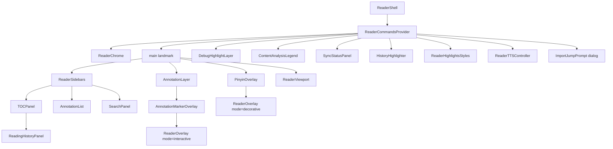
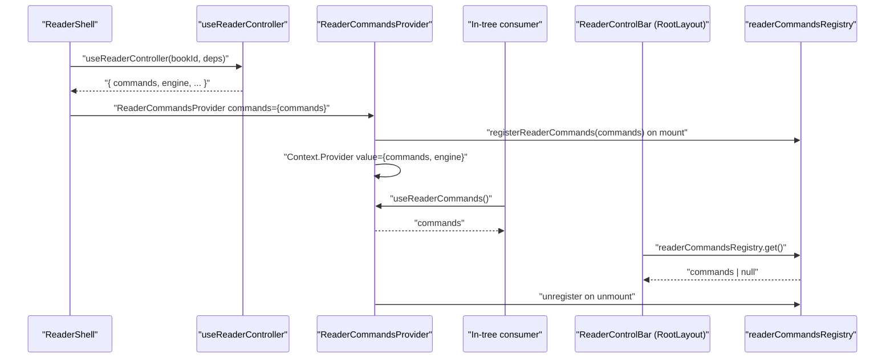
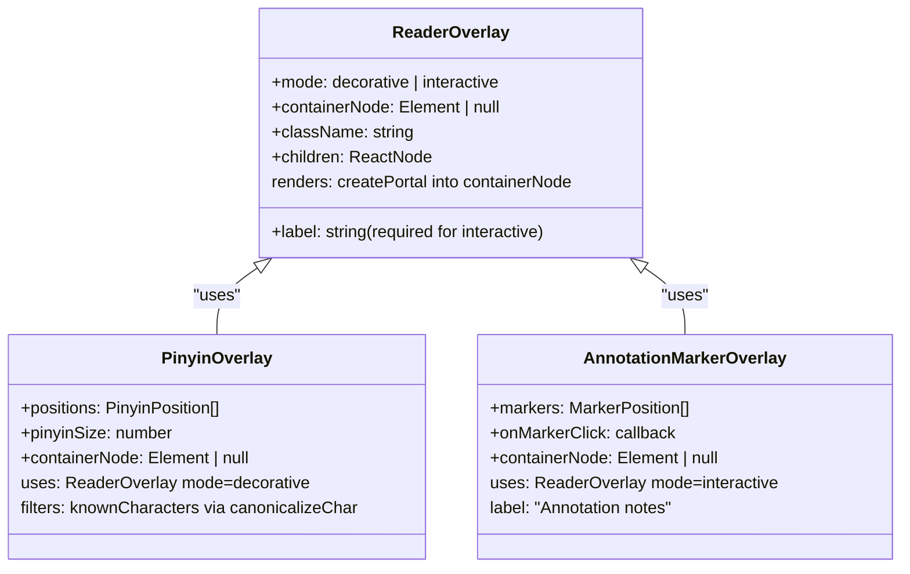
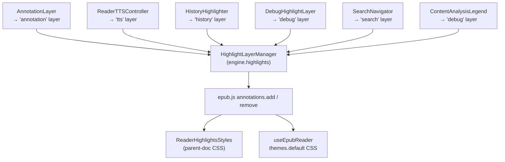
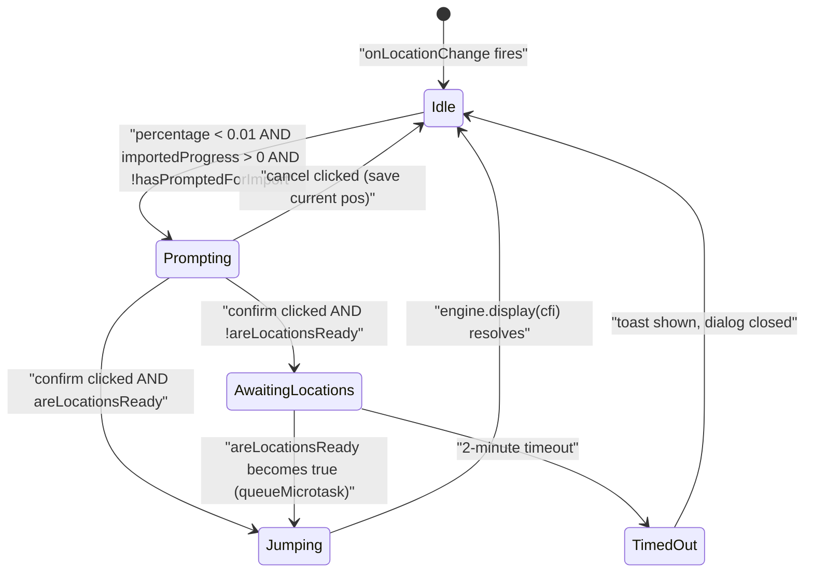
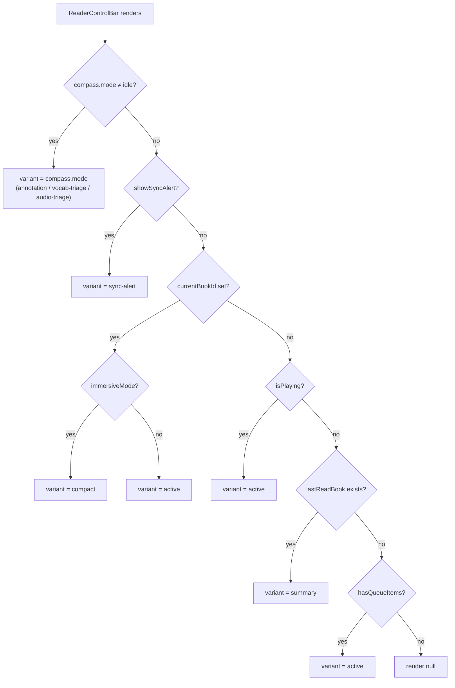
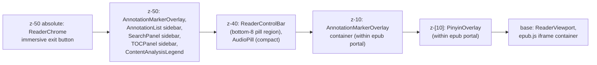
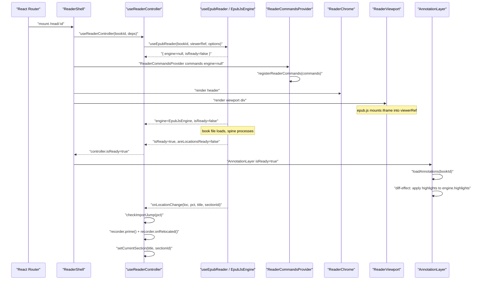

# Reader UI & Overlays

This document covers the reader UI surface in its entirety: the `ReaderShell` composition root, the decomposed shell concerns (`ReaderChrome`, `ReaderSidebars`, `ReaderViewport`, `AnnotationLayer`, `DebugHighlightLayer`), the geometry overlay system (`ReaderOverlay`, `PinyinOverlay`, `AnnotationMarkerOverlay`), the highlight layer architecture (`HighlightLayerManager`, `highlightStyles`), the `ReaderCommands` context and registry, navigation controls, the pill-variant control bar (`ReaderControlBar`), and the individual feature pills. It also covers how the controller (`useReaderController`) wires everything together.

Related documents: [Domain Reader Engine](30-domain-reader-engine.md), [TTS Engine](32-domain-audio-tts-engine.md), [TTS App Integration](51-tts-app-integration.md), [State Management / CRDT](13-state-management-crdt.md), [Domain Chinese](35-domain-chinese.md), [Architecture Overview](10-architecture-overview.md).

---

## Why the Reader UI Is Structured This Way

The original codebase had a single `ReaderView.tsx` file of approximately 1,400 lines that combined engine construction, lifecycle, all UI concerns, highlight management, and every overlay in one monolithic component. This made it impossible to isolate re-render hot paths (TTS sentence changes, history progress updates) from the expensive tree rooted at the epub.js `<div>`. It also blocked testability: you could not unit-test a highlight layer without mounting the entire reader.

Phase 6 of the Versicle overhaul (see [Overhaul History](80-overhaul-history.md)) decomposed this into the following design principles, all enforced by CI gates:

1. **Pure composition shell.** `ReaderShell.tsx` stays under 200 lines (enforced by `wc -l` gate in the phase exit criterion). It delegates every concern to a named module and composes them.
2. **App-layer controller.** All stateful plumbing that is not presentation — engine construction, command objects, session recording, search session lifecycle, Chinese reading registration — lives in `useReaderController`. The shell is then a simple spread of that controller's returned surface.
3. **One epub.js annotation caller.** Every `annotations.add` / `annotations.remove` call goes through the `HighlightLayerManager`, which is accessible exclusively via `engine.highlights`. No component calls epub.js annotations directly. This is enforced by a lint rule (Phase 6 §4 exit gate: grep-zero `annotations.add/remove` outside the manager module).
4. **Geometry overlays portal into the container.** Pinyin and note markers portal into the epub.js scroll container so they scroll at native frame rates in lockstep with the text. The `ReaderOverlay` contract enforces two modes (`decorative` / `interactive`) with distinct accessibility requirements.
5. **Render-isolated hot paths.** `ReaderTTSController` and `HistoryHighlighter` are separate components that subscribe to the high-frequency stores (`useTTSPlaybackStore`, `useReadingStateStore`) so TTS sentence changes and progress updates do not re-render the main shell or the epub.js viewport.
6. **ReaderCommands as the command bus.** Out-of-tree mounts (the control bar `ReaderControlBar` lives in `RootLayout`, outside the reader route) access commands through the `readerCommandsRegistry` module-level handle. In-tree components use the `useReaderCommands()` context hook. This replaced a mix of `window` CustomEvents, callbacks stored in Zustand, and dead prop chains.

---

## Component Tree



All components except `ReaderControlBar` live under `ReaderCommandsProvider`, which gives them access to `useReaderCommands()` and `useReaderEngine()`. `ReaderControlBar` is mounted in `RootLayout` (outside the reader route) and reaches commands via `readerCommandsRegistry.get()`.

---

## ReaderShell: The Composition Root

**Source:** [src/components/reader/ReaderShell.tsx](../../src/components/reader/ReaderShell.tsx)

`ReaderShell` is the component rendered by the `/read/:id` route. Its job is composition only — it constructs nothing except the `useImportJumpPrompt` cycle-breaker pattern and a local `syncPanelOpen` boolean.

### The Import-Jump Cycle Breaker

There is a subtle initialization dependency:

- `useImportJumpPrompt` needs the engine to jump to a percentage-based location.
- `useReaderController` needs the `checkImportJump` gate so its `onLocationChange` callback can suppress progress saves during the import-position relocation.

These two could form a circular dependency if either owned the other. The solution is a render-assigned ref:

```typescript
const checkImportJumpRef = useRef<(percentage: number) => boolean>(() => false);
const controller = useReaderController(bookId, {
    checkImportJump: (percentage) => checkImportJumpRef.current(percentage),
});
const importJump = useImportJumpPrompt({
    bookId,
    engine: controller.engine,
    areLocationsReady: controller.areLocationsReady,
    bookMetadata: controller.bookMetadata,
});
useEffect(() => {
    checkImportJumpRef.current = importJump.checkImportJump;
}, [importJump.checkImportJump]);
```

The controller receives a stable function that delegates to the ref. The ref is wired to the real implementation in a layout effect. This breaks the cycle without requiring an extra render pass.

### Compass Collapse on Sidebar Open

The shell has a global click handler that dispatches `{ type: 'OUTSIDE_TAP' }` to the compass machine, collapsing any in-flight interaction (annotation toolbar, vocab card, audio triage) when the user taps anywhere outside a pill. It also dispatches `CONTEXT_INVALIDATED` when any sidebar opens or immersive mode activates:

```typescript
useEffect(() => {
    if (activeSidebar !== 'none' || immersiveMode) {
        dispatchCompass({ type: 'CONTEXT_INVALIDATED' });
    }
}, [activeSidebar, immersiveMode, dispatchCompass]);
```

### TTS Session Wiring

`useTTS()` is called unconditionally from the shell. This hook builds the TTS queue for the current section and keeps it in sync with location changes. It is not a component — it has no render output — but it must live within the `ReaderCommandsProvider` tree because the TTS service needs access to the engine via the context.

---

## useReaderController: The App-Layer Controller

**Source:** [src/app/reader/useReaderController.ts](../../src/app/reader/useReaderController.ts)

This is the heart of the reader's stateful logic. It assembles and returns the `ReaderController` surface that the shell spreads across its children. Key responsibilities:

| Responsibility | Implementation |
|---|---|
| Engine construction | `useEpubReader(bookId, viewerRef, readerOptions)` |
| Reading session recording | `ReadingSessionRecorder` lifecycle per book |
| ReaderCommands object | Assembled via `useMemo`, registered by the provider |
| Search session | One `SearchSession` per open reader, worker-backed |
| Chinese reading | `registerChineseReading(engine, …)` for zh books |
| Version check | Redirect to `/` if `book.version < CURRENT_BOOK_VERSION` |
| Error/loading mirror | Sync `hookLoading` / `hookError` into UI store and toasts |
| Panic save | `recorder.flushSync()` on unmount |
| Compass hygiene | Reset on unmount; `CONTEXT_INVALIDATED` on Chinese pref changes; engine selection cleared when the compass leaves a selection-owning mode |
| TTS error handling | Surface `useTTSPlaybackStore.lastError` as toast + clear |

### EpubReaderOptions Assembly

The controller builds the `EpubReaderOptions` memo with every preference from `usePreferencesStore` that affects rendering: theme, font family, font size, line height, font profiles (per-language overrides), force-font flag, view mode, and initial location. It also wires four engine event callbacks:

- **`onLocationChange(location, percentage, title, sectionId)`** — runs the import-jump gate, primes the session recorder, calls the recorder's `onRelocated`, then `setCurrentSection`.
- **`onTocLoaded(toc)`** — calls `useReaderUIStore.getState().setToc(toc)`.
- **`onSelection(cfiRange, range, contents)`** — measures the selection rect relative to the iframe, dispatches `{ type: 'TEXT_SELECTED', selection }` to the compass machine (which ignores it during audio-bookmark triage — the triage flow owns the live selection).
- **`onClick(e)`** — dispatches `{ type: 'OUTSIDE_TAP' }` when the selection is collapsed.

### ReaderCommands Object

```typescript
const commands = useMemo<ReaderCommands>(() => ({
    jumpTo: (cfi) => engineRef.current?.display(cfi),
    nextPage: () => engineRef.current?.next(),
    prevPage: () => engineRef.current?.prev(),
    nextChapter: () => {
        // Pure audio transport (compass-pill rework Phase 1): skip a TTS
        // section while audio is live, no-op otherwise. The page-turn branch
        // was removed — page turns now live on the reading surface.
        if (useTTSPlaybackStore.getState().status !== 'stopped') audio.skipToNextSection();
    },
    prevChapter: () => {
        if (useTTSPlaybackStore.getState().status !== 'stopped') audio.skipToPreviousSection();
    },
    playFromSelection: (cfiRange) => handlePlayFromSelection(cfiRange),
    refineSelection: () => { /* reads iframe selection, returns {cfiRange, text} | null */ },
}), [audio, handlePlayFromSelection]);
```

`nextChapter` / `prevChapter` are the **compass-pill arrows** (the surface that replaced the old `reader:chapter-nav` CustomEvent). They used to flip meaning with TTS state — skip a section while audio played, but turn a single page while idle — which made one control do two different things depending on a hidden mode. The rework split the two metaphors: the pill arrows are now a **pure audio transport** (skip section / disabled when idle), and **page turns moved to the reading surface** — `nextPage`/`prevPage`, driven by the `ArrowLeft`/`ArrowRight` shortcuts and the new `PageTurnRails` (see ReaderViewport). The `refineSelection()` implementation reads the live iframe selection through `engine.getContentViews()[0]` — this is the D11 fix that made the audio-triage selection refinement reachable again (it previously rode a `rendition` prop that was never supplied).

### Return Surface

```typescript
return {
    engine,
    isReady,
    areLocationsReady,
    bookMetadata,
    highlights: engine?.highlights ?? null,       // HighlightLayerManager
    containerNode: engine?.getOverlayContainer() ?? null,
    commands,
    pinyinPositions,
    historyTick,
    viewerRef,
    scrollWrapperRef,
    readerViewMode,
    searchSession,
    navigateToSearchResult,
};
```

`highlights` and `containerNode` are derived from the engine and are null while the book loads. Every consumer that accepts them checks for null before use.

---

## ReaderCommands: The Command Bus

**Source:** [src/domains/reader/ui/ReaderCommands.tsx](../../src/domains/reader/ui/ReaderCommands.tsx)

This module provides two consumption modes for the same command surface:

### In-Tree Mode (React Context)

```typescript
export function useReaderCommands(): ReaderCommands
export function useReaderEngine(): ReaderEngine | null
```

Both throw if called outside `ReaderCommandsProvider`. Used by `ReaderSidebars`, `ReaderViewport`, and `ReaderTTSController`.

### Out-of-Tree Mode (Module-Level Registry)

```typescript
export const readerCommandsRegistry = {
    get(): ReaderCommands | null { return registered; }
};
export function registerReaderCommands(commands: ReaderCommands): () => void
```

The provider calls `registerReaderCommands(commands)` in a `useEffect` and returns the cleanup function to clear it. Out-of-tree callers (`AudioPill`, `AudioTriagePill`, `SyncAlertPill`, `ReaderControlBar`) call `readerCommandsRegistry.get()` and handle `null` for the case where no reader is open.



---

## ReaderChrome: The Header

**Source:** [src/components/reader/shell/ReaderChrome.tsx](../../src/components/reader/shell/ReaderChrome.tsx)

The chrome renders in two states:

**Normal mode:** A `<header>` with two button groups and a centered title. Left group: back/close, TOC, annotations, search. Right group: audio panel (Sheet), immersive-mode enter, visual settings (Popover), sync status, global settings.

**Immersive mode:** A single floating exit button (`position: absolute; top: 4; right: 4; z-50`) — the header disappears entirely.

### Sidebar Toggle Protocol

All sidebar/panel state flows through `useSidebarState()` which wraps `activeSidebar` in `useReaderUIStore`. The chrome does not manage this state — it reads `activeSidebar` and calls `setSidebar()`. The same pattern is used by the `<Sheet>` for the audio panel and the `<Popover>` for visual settings, both driven by `activeSidebar === 'audio-panel'` and `activeSidebar === 'visual-settings'` respectively.

### WebKit Navigation Workaround

The back button's click handler uses `navigate('/', { flushSync: true })`. The inline comment explains: React Router 7 wraps navigations in `startTransition` by default; on WebKit, that transition can starve when nothing else re-renders (e.g. TTS idle), causing the URL to update but the route to never re-render, wedging the reader-to-library transition. `flushSync: true` forces a synchronous navigation to guarantee completion.

---

## ReaderSidebars: Conditional Panel Mounts

**Source:** [src/components/reader/shell/ReaderSidebars.tsx](../../src/components/reader/shell/ReaderSidebars.tsx)

Three panels that mount conditionally based on `activeSidebar`:

| `activeSidebar` value | Panel mounted |
|---|---|
| `'toc'` | `TOCPanel` (with device markers) |
| `'annotations'` | `AnnotationList` inside a `w-64` sidebar div |
| `'search'` | `SearchPanel` |

`useTocController` and `useDeviceMarkers` are called unconditionally (hooks cannot be conditional) but `useDeviceMarkers` only fetches real data when `activeSidebar === 'toc'` (it receives `bookId` as `undefined` otherwise), keeping computation gated on TOC visibility.

### useTocController

**Source:** [src/components/reader/shell/useTocController.ts](../../src/components/reader/shell/useTocController.ts)

Manages the synthetic TOC toggle state machine with a Yjs observer race guard. The guard (`userHasExplicitlySetSyntheticToc` ref) prevents `bookMetadata` effect from overriding an explicit user toggle when Yjs fires an observer after `updateBook`. TOC metadata is loaded via `queueMicrotask` to avoid running synchronously inside an effect.

Active item resolution: `findTocItem(currentToc, currentSectionId)` — where `currentSectionId` is the spine href tracked in `useReaderUIStore`. On synthetic-TOC toggle, the title is re-synced by finding the resolved item in the new TOC and calling `setCurrentSection`.

### useDeviceMarkers

**Source:** [src/components/reader/shell/useDeviceMarkers.ts](../../src/components/reader/shell/useDeviceMarkers.ts)

Reads other devices' reading progress from `useReadingStateStore`, resolves each device's `currentCfi` to a spine `href` via `engine.resolveSection()`, and returns a `Record<href, DeviceMarker[]>` used by `TOCPanel` to show device badges on TOC items. The store subscription uses `useShallow` and deliberately excludes the current device to avoid re-renders on own-progress updates.

---

## ReaderViewport: The epub.js Mount Point

**Source:** [src/components/reader/shell/ReaderViewport.tsx](../../src/components/reader/shell/ReaderViewport.tsx)

Renders the `<div ref={viewerRef}>` that epub.js mounts its iframe into, plus a `<div ref={scrollWrapperRef}>` for scrolled-mode navigation. Layout:

```
div.flex-1 (scrollWrapperRef)
  div#reader-iframe-container (viewerRef, max-w-2xl, px-6 md:px-8)
    [epub.js injects iframe here]
```

The `height` style switches: `paginated` → `calc(100% - 100px)` (leaves room for the bottom control bar), `scrolled` → `100%`.

Navigation is wired by three hooks plus one affordance:
- `useReaderNavigation` — wheel and touch gestures for **scrolled** mode.
- `useReaderPageTurnShortcuts` — ArrowLeft / ArrowRight in `scope: 'reader'` (KeyboardShortcutService registrations; see Phase 8 §E).
- `useReaderEngineKeyBridge(engine)` — forwards keydown events from inside the epub.js iframe to the parent's KeyboardShortcutService, so keyboard shortcuts work when focus is inside the book text.
- `PageTurnRails` (`shell/PageTurnRails.tsx`) — **paginated**-only page-turn affordance: full-height tap rails at the left/right edges of the reading column, wired to `commands.prevPage`/`nextPage` and mirrored for RTL. Paginated mode has no swipe/tap-zone (those are scrolled-only), so before the compass-pill rework the pill's corner arrows were the *only* touch page-turn — which forced them to flip between "page" and "section". The rails give page-turning its own large, always-present home so the pill can be a pure audio transport. They render in the parent document (not the iframe), so only the outer edges turn pages; the central reading area keeps native selection and link taps.

---

## AnnotationLayer: Highlight Diffing and Note Markers

**Source:** [src/components/reader/shell/AnnotationLayer.tsx](../../src/components/reader/shell/AnnotationLayer.tsx)

This component owns the complete annotation rendering lifecycle for the open book:

### Highlight Diffing

A `useRef<Map<string, string>>(new Map())` (`addedAnnotations`) tracks which annotation IDs have been applied to the `'annotation'` highlight layer. On each render where `isReady` is true, the effect:

1. Computes `currentIds` from the store's annotation list.
2. Iterates `addedAnnotations` and calls `highlights.remove('annotation', cfi)` for any ID no longer in `currentIds`.
3. Iterates the store's annotation list and calls `highlights.add('annotation', cfi, opts)` for any ID not yet in `addedAnnotations`.

The fine-grained store selector (`useShallow` that iterates `state.annotations` and filters by `bookId`) ensures the effect only fires when annotations for the current book change, not any annotation in the library.

### Audio-Bookmark Click Flow

Audio-bookmark annotations (`type === 'audio-bookmark'`) use the `AUDIO_BOOKMARK_PENDING_CLASS` (the striped fill pattern). Their `onClick` handler:

1. Calls `engine.display(annotation.cfiRange)` to navigate to the location.
2. After 50 ms, calls `engine.selectRange(annotation.cfiRange)` to programmatically select the text.
3. Dispatches `{ type: 'AUDIO_BOOKMARK_TAPPED', annotation }` to the compass machine to morph the control bar pill into the `AudioTriagePill`. The dispatch happens synchronously after `selectRange`, so the machine is already in `audio-triage` (which ignores `TEXT_SELECTED`) when the debounced selection emit lands.

### Note Marker Geometry

Annotations with a `note` property have their CFI positions resolved to pixel coordinates via `useCfiCoordinates(engine, noteCfis, measureDeps)`. The `measureDeps` array passed from the shell is `[fontSize, readerViewMode]` — a font-size change or view-mode switch forces a re-measure. The computed coordinates are merged with annotation metadata and passed to `AnnotationMarkerOverlay`.

---

## The ReaderOverlay Contract

**Source:** [src/domains/reader/ui/ReaderOverlay.tsx](../../src/domains/reader/ui/ReaderOverlay.tsx)

All geometry overlays use this component to portal into the epub.js container node:

```typescript
type ReaderOverlayProps =
  | { mode: 'decorative'; label?: undefined; containerNode: Element | null; ... }
  | { mode: 'interactive'; label: string; containerNode: Element | null; ... };
```

**`mode: 'decorative'`** — the container div gets `aria-hidden="true"` and `pointer-events: none`. Used by `PinyinOverlay`. Children must be purely visual.

**`mode: 'interactive'`** — the container div gets `role="group"` and `aria-label={label}` (required). The container itself is `pointer-events: none`, but individual children opt into `pointer-events: auto`. Used by `AnnotationMarkerOverlay`. This was the fix for the a11y finding: focusable marker buttons must NOT live inside an `aria-hidden` container.

Both modes use `createPortal(content, containerNode)` — if `containerNode` is null (engine not yet initialized), the component renders nothing.



---

## PinyinOverlay

**Source:** [src/components/reader/PinyinOverlay.tsx](../../src/components/reader/PinyinOverlay.tsx)

Renders phonetic pinyin annotations above each Chinese character in the current section. Positions come from the controller's `pinyinPositions` array, which is populated by `registerChineseReading`'s `onPositions` callback in `useReaderController`.

**Known-character suppression:** Characters in `useVocabularyStore.knownCharacters` are filtered out before rendering. The comparison key is produced by `canonicalizeChar(pos.char)` — the canonical (simplified) form — so suppression works identically in Simplified and Traditional display modes regardless of how the character appears in the text (CRDT v7 invariant).

**Theme-aware shadow:** The overlay uses a `textShadow` whose color matches the reading background (`#ffffff` for light, `#f4ecd8` for sepia, `#1a1a1a` for dark, `customTheme.bg` for custom). This ensures crisp contrast for the pinyin text against any reading background.

Each pinyin span is absolutely positioned at `(pos.left, pos.top - 2)` with `transform: translate(-50%, -100%)` so it appears centered above the corresponding character.

---

## AnnotationMarkerOverlay

**Source:** [src/components/reader/AnnotationMarkerOverlay.tsx](../../src/components/reader/AnnotationMarkerOverlay.tsx)

Renders note-marker buttons (small yellow sticky-note icons) at the coordinates of annotations that have a `note` property. Each button:

- Is absolutely positioned at `(marker.left - 4, marker.top)` with `transform: translateY(-75%)`.
- Has `pointer-events: auto` (the parent overlay container is pointer-events-none).
- Has an extended click target via `before:content-[''] before:absolute before:-inset-3`.
- On click, calls `onMarkerClick(marker.left, marker.top + 20, marker.cfi, marker.text, marker.id)` which dispatches `{ type: 'ANNOTATION_TAPPED', annotation, x, y }` to the compass machine (morphing the control bar pill into the annotation toolbar with the tapped annotation as payload).

---

## Highlight Layer Architecture



### HighlightLayerManager

**Source:** [src/domains/reader/engine/HighlightLayerManager.ts](../../src/domains/reader/engine/HighlightLayerManager.ts)

The sole caller of `rendition.annotations.add/remove`. It maintains a `Map<HighlightLayerId, Map<cfi, HighlightHandle>>` for per-layer bookkeeping. Key behaviors:

- **Idempotent add:** Re-adding an existing `(layer, cfi)` is a no-op.
- **Orphaned SVG sweep:** Layers marked `sweepOrphans: true` (only `'tts'` today) call `sweepOrphans()` before add and after remove. This DOM sweep (`querySelectorAll('g.tts-highlight')` on each view pane, then `.remove()`) was triplicated across `ReaderTTSController` before Phase 6.
- **Call shape preservation:** The manager emits the 5-argument form (`annotations.add('highlight', cfi, data, cb, className)`) when `styles` is `undefined`, and the 6-argument form when a `styles` object is present — byte-identical to the pre-manager call sites so no epub.js behavior changed.
- **`detach()`:** Drops all bookkeeping without touching the DOM, for rendition teardown.
- **`count(layer)`:** Returns the tracked highlight count, feeding the `__versicleTest.reader.highlightCount` E2E handle.

### highlightStyles: The ONE Registry

**Source:** [src/domains/reader/engine/highlightStyles.ts](../../src/domains/reader/engine/highlightStyles.ts)

Defines `HighlightLayerId` (`'annotation' | 'tts' | 'history' | 'debug' | 'search'`), `HIGHLIGHT_LAYERS` configs, and two CSS generators.

**Why two CSS paths?** epub.js draws annotation SVGs in the **parent document** (not inside the iframe), via a marks-pane overlaid on the iframe. CSS rules in the parent document (from `ReaderHighlightsStyles`) win over SVG presentation attributes for `fill`, `fill-opacity`, and `mix-blend-mode`. The iframe `themes.default` CSS (from `iframeHighlightThemeCss`) reaches in-iframe elements but not the SVG layer — so it is largely dead for highlights, though it is kept byte-identical to avoid any unexpected epub.js internal behavior change.

**Effective rendering per layer:**

| Layer | Class / mechanism | Effective fill | Opacity |
|---|---|---|---|
| `annotation` (yellow) | `.highlight-yellow` parent CSS | `#fde047` | 0.8 light / 0.4 dark |
| `annotation` (green) | `.highlight-green` parent CSS | `#86efac` | 0.8 light / 0.4 dark |
| `annotation` (blue) | `.highlight-blue` parent CSS | `#93c5fd` | 0.8 light / 0.4 dark |
| `annotation` (red) | `.highlight-red` parent CSS | `#fca5a5` | 0.8 light / 0.4 dark |
| `annotation` (audio-bookmark) | `.versicle-audio-bookmark-pending` | striped SVG pattern | 0.8 light / 0.4 dark |
| `tts` | epub.js defaults (no CSS override) | yellow (#fde047) | 0.3 multiply |
| `history` | `styles.fill = 'gray'` attribute | gray | 0.3 (the `fillOpacity: '0.1'` key was dead camelCase — never applied) |
| `debug` | `styles` object per call site | orange / yellow | 0.3 (intended `fillOpacity: '1'` was dead camelCase) |
| `search` | epub.js defaults | yellow | 0.3 |

The blend mode switches: `multiply` in light/sepia themes, `screen` in dark theme, so highlights are legible against dark backgrounds.

### ReaderHighlightsStyles

**Source:** [src/components/reader/ReaderHighlightsStyles.tsx](../../src/components/reader/ReaderHighlightsStyles.tsx)

Injects two things into the parent document:

1. A hidden `<svg>` with the `<defs>` block containing the `striped-highlight` pattern (45-degree orange stripes, 8px wide, used for audio-bookmark pending highlights).
2. A `<style>` tag containing `parentHighlightCss(currentTheme)` — the theme-aware annotation class rules. Re-renders on theme change, updating blend mode and opacity.

---

## DebugHighlightLayer

**Source:** [src/components/reader/shell/DebugHighlightLayer.tsx](../../src/components/reader/shell/DebugHighlightLayer.tsx)

A render-null component (`return null`) that drives the `'debug'` highlight layer based on `useGenAIStore.isDebugModeEnabled`. When debug mode is on, it looks up the current section's content analysis from `contentAnalysisRepository.getContentAnalysis(bookId, section.href)` and applies a highlight at `analysis.referenceStartCfi` using the `TYPE_COLORS['reference']` color. When debug mode is off, it calls `highlights.clear('debug')`.

The blend mode adapts to the theme: `'screen'` for dark, `'multiply'` for light.

---

## ReaderTTSController

**Source:** [src/components/reader/ReaderTTSController.tsx](../../src/components/reader/ReaderTTSController.tsx)

A render-null component that isolates three high-frequency side effects:

**1. TTS Sentence Highlighting**

Subscribes to `useTTSPlaybackStore.activeCfi` and `status`. When an `activeCfi` arrives and `status !== 'stopped'`, the engine's `display(activeCfi)` is called (to page-turn if needed) and `highlights.add('tts', activeCfi, ...)` adds the sentence highlight. The cleanup function calls `highlights.remove('tts', activeCfi)` — no manual DOM tracking is needed because the manager handles it.

**2. Visibility Reconciliation**

A `visibilitychange` listener re-syncs the TTS highlight and navigation when the app returns to the foreground. It reads fresh state via `useTTSPlaybackStore.getState()` (to avoid stale closure), then calls `engine.display(freshCfi)` and does a remove-then-add on the `'tts'` layer (each side runs the orphan sweep, guaranteeing exactly one live SVG node after a background queue advance).

**3. Keyboard Navigation (Phase 8 §E)**

`useTtsPlaybackShortcuts({ play, pause, stop, jumpTo })` registers sentence-jump / space play-pause / Escape stop as `'tts-active'`-scope shortcuts on the `KeyboardShortcutService`. These are live while TTS status is `playing | paused`. The scope stacking means these shortcuts yield to the `'reader'`-scope shortcuts (page turns) when TTS is not active.

---

## HistoryHighlighter

**Source:** [src/components/reader/HistoryHighlighter.tsx](../../src/components/reader/HistoryHighlighter.tsx)
**Source:** [src/components/reader/useHistoryHighlights.ts](../../src/components/reader/useHistoryHighlights.ts)

Another render-null component that subscribes to `useReadingStateStore` for the current book's `lastPlayedCfi`. It only highlights the **last sentence read by TTS** (not all reading history) to avoid visual clutter.

The `useHistoryHighlights` hook implements a state machine to avoid updating the highlight during live TTS playback (which would cause flicker). The rule: update `displayedRanges` only on page turn (`currentCfi` change) or when `!isPlaying`. The render-time derivation (avoiding a second `useEffect`) uses a comparison of previous props against current values during the render body, then calls `setState` if they differ — React's safe-during-render pattern.

---

## ContentAnalysisLegend

**Source:** [src/components/reader/ContentAnalysisLegend.tsx](../../src/components/reader/ContentAnalysisLegend.tsx)

A developer/debug panel that renders only when `isDebugModeEnabled` is set in `useGenAIStore`. It is a fixed-position panel at `bottom-20 left-4 z-50` showing:

- Actions (reprocess book, view content analysis report).
- A CFI debugger input that calls `engine.display(cfi)` and `engine.selectRange(cfi)` on change.
- A table images carousel (loaded from `bookContent.getTableImages(currentBookId)`).
- A content type color legend.

It also drives the `'debug'` layer via `engine.highlights.add('debug', highlightedCfi, ...)` when the user jumps to a table. Blob URLs for table images are managed with a ref (`generatedUrls`) to avoid leaks across book switches.

---

## ImportJumpPrompt

**Source:** [src/components/reader/shell/ImportJumpPrompt.tsx](../../src/components/reader/shell/ImportJumpPrompt.tsx)

This hook manages the one-time "Resume from Reading List?" dialog for books imported with percentage progress but no saved CFI.



The `checkImportJump` function is the gate called from `onLocationChange`. It returns `true` (suppress progress save) only when: the book has `progress > 0` but no `currentCfi`, the current position is at the start (`percentage < 0.01`), and this is the first check in the session.

When locations are not yet ready (epub.js hasn't finished generating the locations index), the dialog enters `isWaitingForJump` state. A `useEffect` watches `areLocationsReady` and performs the jump via `queueMicrotask` to avoid synchronous state transitions inside the effect. A 120-second safety timeout clears the waiting state and shows an error toast.

---

## SyncStatusPanel

**Source:** [src/components/reader/SyncStatusPanel.tsx](../../src/components/reader/SyncStatusPanel.tsx)

A `Dialog` component opened by the sync-status header button (`Monitor` icon). Shows reading progress across all devices sorted by `lastRead` descending. Each entry shows device name, platform icon, percentage, last-read timestamp, and a "Jump to" button that calls `commands.jumpTo(cfi)`.

---

## SearchPanel and Search Navigation

**Source:** [src/components/reader/panels/SearchPanel.tsx](../../src/components/reader/panels/SearchPanel.tsx)
**Source:** [src/app/reader/searchNavigation.ts](../../src/app/reader/searchNavigation.ts)

The `SearchPanel` uses the `SearchSession` from `useReaderController.searchSession` — one session per open reader, worker-backed. On first open, it calls `session.index(bookId)`. If that returns `'no-text'` (a pre-corpus book), it runs one reprocess via `importController.reprocessBook(bookId)` and retries indexing.

Searching calls `session.search(bookId, query)` returning `{ results: DetailedSearchResult[], truncated: boolean }`. Results carry `charOffset`, `matchLength`, `href`, and `sectionTitle`. Clicking a result calls `onNavigate(result)` which routes through `controller.navigateToSearchResult(result)` → `searchNavigatorRef.current.navigate(result)`.

**Search navigation algorithm** (`createSearchNavigator`):

1. `engine.display(result.href)` — render the section (also the fallback landing position).
2. Find the rendered view matching `result.href` via `sameSection()`.
3. Call `resolveResultCfi(result, view.document.body, view.cfiFromRange)` — walks text nodes to find the exact character offset, produces a CFI.
4. If resolved: `engine.display(resolved.cfi)` to page to the exact match, then `highlights.add('search', resolved.cfi)` for a temporary highlight.
5. After `SEARCH_HIGHLIGHT_MS` (2500 ms), `highlights.clear('search')` auto-removes the highlight.

If CFI resolution fails (stale corpus vs re-rendered content), the section-level landing from step 1 is the fallback — the doc's sanctioned degraded behavior.

---

## ReaderControlBar: The Pill Router

**Source:** [src/components/reader/ReaderControlBar.tsx](../../src/components/reader/ReaderControlBar.tsx)

Mounted in `RootLayout` (outside the reader route), fixed at `bottom-8` with `z-40`. Which variant renders is decided by `resolvePillVariant` ([src/store/compassMachine.ts](../../src/store/compassMachine.ts)) from two layers:

1. **Interaction** — the compass machine's current mode (`annotation`, `vocab-triage`, `audio-triage`). A live interaction always wins; each mode carries its payload (selection or annotation), so a mode without the data it needs is unrepresentable.
2. **Ambient** — when the machine is `idle`, `deriveAmbientVariant` picks the resting pill from the surrounding conditions.



**Priority explanation:**
- Any compass interaction takes absolute priority — the user's in-flight gesture (selection toolbar, vocab card, bookmark review) is never preempted by ambient state.
- Sync alert leads the ambient tier (a time-sensitive nudge from another device).
- Reader active: a book is open, show the audio/navigation pill.
- Last-read book fallback: show the "continue reading" summary card.
- Queue with no last-read book (edge case).
- Null: nothing to show.

Interaction state changes flow exclusively through `dispatchCompass(event)` on `useReaderUIStore` — the transition table in `compassMachine.ts` decides what each event means in the current mode (e.g. `TEXT_SELECTED` opens the annotation toolbar from anywhere except `audio-triage`, which owns the live selection and ignores it). Completed actions dispatch `ACTION_COMMITTED`; explicit closes dispatch `DISMISSED`; taps outside the pill dispatch `OUTSIDE_TAP`; sidebar/immersive/book-close/settings churn dispatches `CONTEXT_INVALIDATED`. All four return the machine to `idle`.

### Focus Restoration on Variant Morph

The `key={variant}` remount anti-pattern was removed as part of the a11y overhaul (item 8). Instead, a focus restoration mechanism uses a `pillRegionRef` on the pill container:

```typescript
// onFocus: set pillHadFocusRef = true
// onBlur: clear if relatedTarget is outside the region (don't clear on unmount)
// useEffect on variant change: if pillHadFocusRef and active element is outside
//   the region, focus the first tabbable element in the new pill
```

When the variant morphs (e.g. from `annotation` to `active` after dismissing), if focus was inside the pill, it is moved to the first `button`, `[role="button"]`, `[tabindex="0"]`, or `textarea` in the new pill.

---

## Feature Pills

### AudioPill

**Source:** [src/components/reader/pills/AudioPill.tsx](../../src/components/reader/pills/AudioPill.tsx)

One component, two layouts: normal (`compact=false`) and immersive (`compact=true`). Both show prev/play-pause/next controls. The normal layout adds a centered section title and time-remaining display.

The prev/next arrows call `readerCommandsRegistry.get()?.prevChapter()` / `nextChapter()` and are a **pure audio transport** (compass-pill rework Phase 1): they skip a TTS section, carry one stable accessible name (`"Previous/Next chapter"` — no longer the page-vs-chapter lie), and are **disabled while TTS is idle** (`status === 'stopped'`). They are kept present-but-disabled rather than conditionally rendered, to avoid the layout shift and focus loss of a control that mounts/unmounts with playback state — and the control-bar's focus-restoration selector skips disabled controls so a morph never drops focus on the disabled arrow. Page turning is no longer one of the pill's jobs (it moved to `PageTurnRails` + the Arrow-key shortcuts). Progress fills the `PillShell` via the `progress` prop (a CSS custom property applied to the shell).

Time remaining is from `useSectionDuration()`, formatted as `-MM:SS`.

### AnnotationPill

**Source:** [src/components/reader/pills/AnnotationPill.tsx](../../src/components/reader/pills/AnnotationPill.tsx)

Handles two sub-states: the color/action toolbar (default) and the note editor (expanded). State transitions:

- Color swatch click → `onAction('color', color)`.
- Note button click → `setIsEditingNote(true)`.
- Vocab button (Chinese-only, shown when `HAN_RE.test(selection.text)`) → `dispatchCompass({ type: 'VOCAB_TRIAGE_REQUESTED' })` (the machine carries the selection into the vocab card).
- Play button → `onAction('play')` → `readerCommandsRegistry.get()?.playFromSelection(cfiRange)`.
- Delete button → `onAction('delete')`.
- Dismiss (X) → `onAction('dismiss')`.

The note-recall sync (pre-populating `noteText` from the annotation-mode payload's `annotation.note`) is done with render-time comparison of `prevAnnotationId` to avoid cascading renders from a `useEffect`.

### AudioTriagePill

**Source:** [src/components/reader/pills/AudioTriagePill.tsx](../../src/components/reader/pills/AudioTriagePill.tsx)

The dragnet audio bookmark review pill. Shows "Review Bookmark" label with Confirm / Discard buttons. On Confirm:

1. Calls `readerCommandsRegistry.get()?.refineSelection()` — if the user adjusted the selection, uses the refined CFI/text.
2. Calls `removeAnnotation(target.id)` to delete the pending dragnet annotation.
3. Calls `addAnnotation({ ...target, cfiRange: newCfiRange, text: newText, type: 'highlight' })` to persist the confirmed highlight.
4. Dispatches `{ type: 'ACTION_COMMITTED' }` to return to the ambient pill.

On Discard: simply `removeAnnotation(target.id)` and `dispatchCompass({ type: 'ACTION_COMMITTED' })`.

### SummaryPill

**Source:** [src/components/reader/pills/SummaryPill.tsx](../../src/components/reader/pills/SummaryPill.tsx)

Pure presentation. A card with book title, "Continue Reading" subtitle, percentage complete, and a progress bar strip at the bottom. Clicking navigates to `/read/${lastReadBook.id}`.

---

## TOCPanel

**Source:** [src/components/reader/panels/TOCPanel.tsx](../../src/components/reader/panels/TOCPanel.tsx)

A tabbed panel with two tabs: **Chapters** and **History**. The Chapters tab shows the TOC tree with:

- **Synthetic TOC toggle** (`Switch` + `Label`) — persisted via `updateBook(bookId, { useSyntheticToc: val })`.
- **"Enhance Titles with AI" button** — calls `onEnhanceTOC()` from `useSmartTOC`, shows progress `(current/total)` during enhancement.
- **TOC tree** — rendered recursively up to 2 levels deep (`level < 2`). Active item highlighted with `text-primary font-medium bg-accent/50`.
- **Device markers** — each TOC item checks `deviceMarkers[itemHref]` and renders `DeviceIcon` badges for other devices reading that section.
- **`lang` attribute** on labels — `contentLang` from `bookMetadata.language` is applied so browser text rendering uses the correct script (i18n ADR §3: book-sourced text carries the content language).

The History tab mounts `ReadingHistoryPanel` with `trigger={historyTick}` (bumped by the recorder's `onHistoryRecorded` callback) and an `onNavigate` that calls `commands.jumpTo(cfi)`.

---

## Z-Layer Map



All sidebars use `absolute inset-y-0 left-0` with a high z-index (50) to overlay the viewport. The control bar uses `fixed bottom-8` at z-40 — below sidebars but above the viewport content. The epub.js overlay portals are z-indexed within the epub container coordinate space (not the main document z-index stack).

---

## Controller ↔ UI Sequence: Opening a Book



---

## Render Isolation Strategy

The shell avoids re-rendering the expensive epub.js viewport tree on high-frequency store changes by keeping TTS and history subscriptions in isolated null-render components:

| Store subscription | Subscriber | Reason for isolation |
|---|---|---|
| `useTTSPlaybackStore.activeCfi` | `ReaderTTSController` | Changes on every TTS sentence (~1 Hz during playback) |
| `useTTSPlaybackStore.status` | `ReaderTTSController` | Frequent state machine transitions |
| `useReadingStateStore.currentCfi / lastPlayedCfi` | `HistoryHighlighter` | Updated on every page turn |
| `useReaderUIStore.currentSectionTitle / currentSectionId` | Subscribes in `useTocController` | Section changes require TOC item re-resolution |

The shell itself subscribes via `useShallow` to a small slice of `useReaderUIStore` and `usePreferencesStore`, ensuring it only re-renders when its own layout-affecting values change.

The `AnnotationLayer` uses a fine-grained `useShallow` selector that iterates `state.annotations` and filters by `bookId`, rather than subscribing to the full annotation map — so adding an annotation to a different book does not re-render the open book's layer.

---

## Testing

The `tests/` directory co-located with the reader components owns the test suites for this directory:

- [ReaderShell.test.tsx](../../src/components/reader/tests/ReaderShell.test.tsx) — integration tests with a fake engine.
- [ReaderShell.fakeEngine.smoke.test.tsx](../../src/components/reader/tests/ReaderShell.fakeEngine.smoke.test.tsx) — smoke test using `FakeReaderEngine`.
- [ReaderOverlays.characterization.test.tsx](../../src/components/reader/tests/ReaderOverlays.characterization.test.tsx) — pins the effective highlight rendering behavior (the "characterization baseline" referred to in `highlightStyles.ts`).
- [ReaderTTSController.test.tsx](../../src/components/reader/tests/ReaderTTSController.test.tsx) — TTS highlight and keyboard shortcut wiring.
- [AnnotationList.test.tsx](../../src/components/reader/tests/AnnotationList.test.tsx), [PinyinOverlay.test.tsx](../../src/components/reader/tests/PinyinOverlay.test.tsx), [ContentAnalysisLegend.test.tsx](../../src/components/reader/tests/ContentAnalysisLegend.test.tsx) — component-level.

The `FakeReaderEngine` ([src/domains/reader/engine/FakeReaderEngine.ts](../../src/domains/reader/engine/FakeReaderEngine.ts)) is the test double for the `ReaderEngine` port, allowing integration tests to run without the real epub.js. The `ReaderEngine.contract.test.ts` ensures `FakeReaderEngine` conforms to the engine contract.

---

## Common Extension Points

**Adding a new pill variant:** For an interaction variant, add a mode (with its payload) to `CompassInteraction` and the entering/exiting events to the transition table in `src/store/compassMachine.ts` (with machine tests); for an ambient variant, add a field to `CompassAmbient` and a branch in `deriveAmbientVariant`. Then create the pill component under `src/components/reader/pills/` and add a `case` in `ReaderControlBar`'s render switch.

**Adding a new highlight layer:** Add the layer ID to `HighlightLayerId` in [highlightStyles.ts](../../src/domains/reader/engine/highlightStyles.ts), add a `HighlightLayerConfig` entry in `HIGHLIGHT_LAYERS`, and use `engine.highlights.add('your-layer', cfi, opts)` from any component that has access to the controller's `highlights`.

**Adding a new overlay type:** Decide on `decorative` vs `interactive` mode, create a component that uses `ReaderOverlay` with the appropriate `mode` and `containerNode` from `controller.containerNode`, then mount it inside the `<main>` landmark in `ReaderShell` alongside the existing overlays.

**Adding a new sidebar panel:** Add a sidebar key to the `activeSidebar` union (in the `useSidebarState` hook / `useReaderUIStore`), add a header button in `ReaderChrome.tsx`, and add the conditional panel mount in `ReaderSidebars.tsx`.
