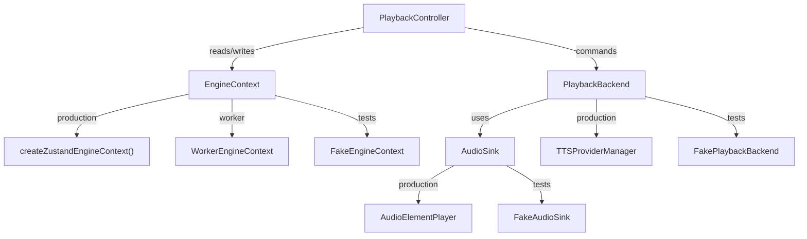
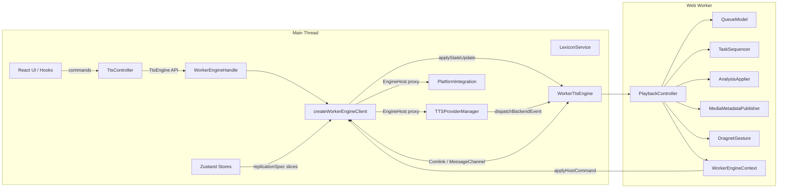
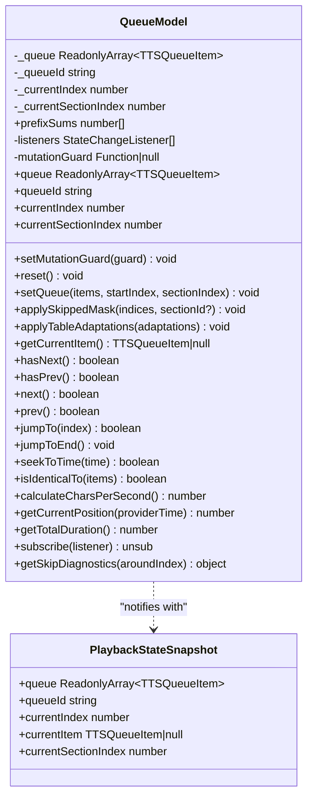
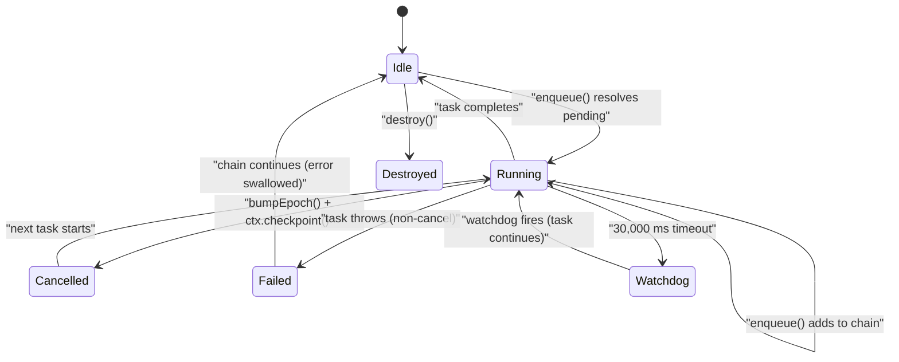
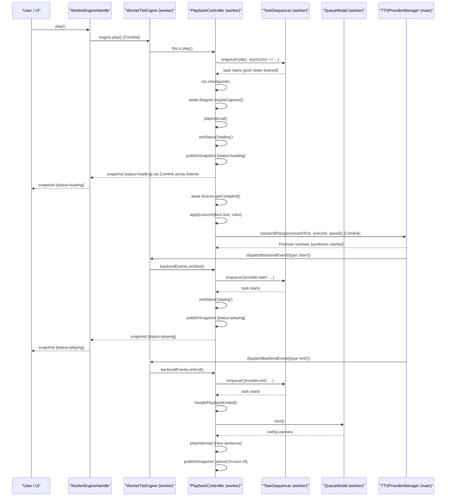
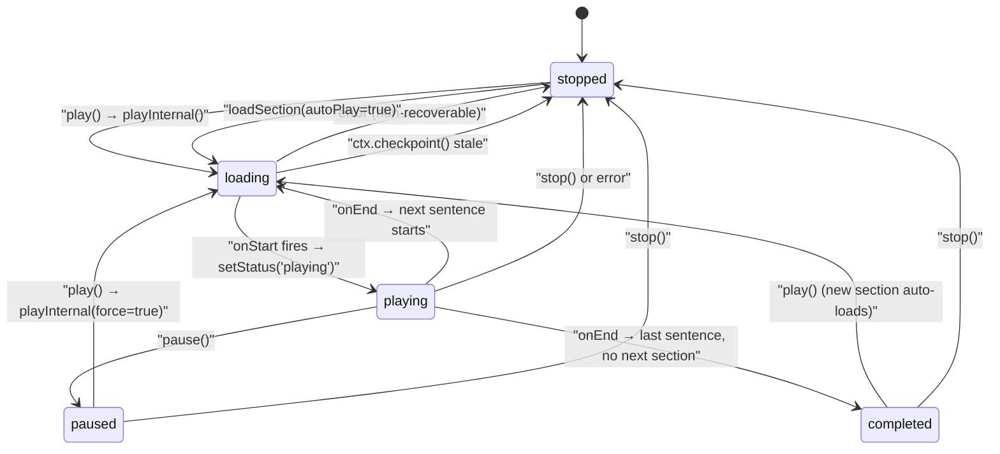
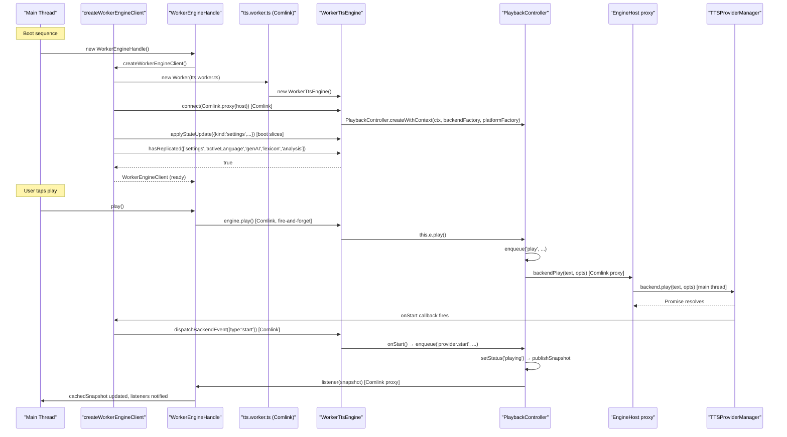
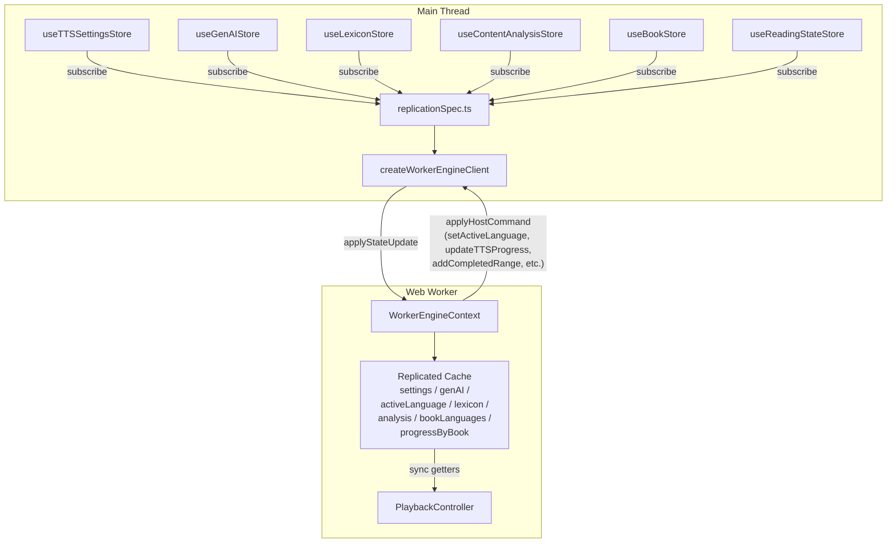
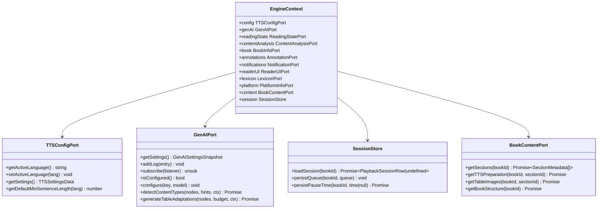
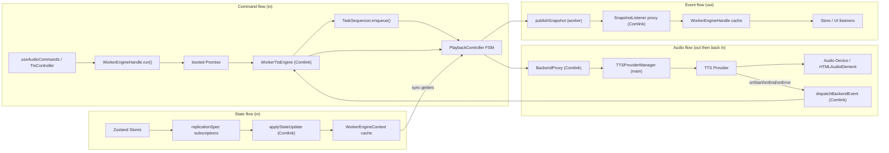

# Audio Domain: TTS Engine Core

This document covers the TTS engine core: the design intent behind injectable ports, the
`QueueModel` and `TaskSequencer`, the off-main-thread Web Worker engine via Comlink, the
command-in/event-out boundary, the play cycle (play → synthesis → provider start/end →
status broadcast → queue advance), and the state replication spec between main thread and
worker.

Cross-references: [33-tts-providers-and-platform.md](33-tts-providers-and-platform.md),
[34-tts-content-pipeline.md](34-tts-content-pipeline.md),
[51-tts-app-integration.md](51-tts-app-integration.md),
[13-state-management-crdt.md](13-state-management-crdt.md),
[63-testing-strategy.md](63-testing-strategy.md).

---

## 1. Why This Architecture Exists

### 1.1 The Problem

Versicle's audiobook feature — synthesizing text-to-speech for EPUB chapters — has demands
that pull in opposite directions:

- **Orchestration must be fast and responsive.** Book-switch, section-load, play, pause,
  seek, and error-recovery all interleave asynchronously. Any lost serialization guarantee
  produces audible glitches (double-synthesis), UI state corruption (stuck "playing"
  indicator), or silent data loss (skipped sentences never persisted).
- **Audio playback cannot move off the main thread.** `HTMLAudioElement`, Web Speech API,
  Capacitor native TTS, and `navigator.mediaSession` are all main-thread-only APIs. A
  service worker or web worker cannot hold an audio focus or talk to a Bluetooth headset
  directly.
- **Persistent state must survive across book switches.** Queue position, current sentence
  CFI, pause timestamps — all live in IndexedDB and Yjs CRDTs that both threads can read,
  but whose Zustand store mirrors live exclusively on the main thread.

These three facts lead to the primary architectural decision: **the orchestration brain runs
in a Web Worker; the audio output stays on the main thread**. The two halves communicate
over a structured, typed message channel (Comlink).

### 1.2 The Phase 5b Decomposition

Before Phase 5b, a single `AudioPlayerService` class of 1,300+ lines owned the playback
FSM, queue lifecycle, session restore, media metadata, dragnet capture, lexicon cache, and
GenAI analysis reapplication. The Phase 5b strangler refactoring (documented in
[plan/overhaul/prep/phase5-tts-strangler.md](../../plan/overhaul/prep/phase5-tts-strangler.md))
decomposed this god class along natural seams:

| Extracted Unit | Responsibility |
|---|---|
| `PlaybackController` | FSM + `TaskSequencer` + the sole status writer |
| `QueueModel` | Immutable queue/position model, no persistence |
| `AnalysisApplier` | GenAI mask/adaptation application (subscriptions, timestamp dedup, sequenced commands) |
| `MediaMetadataPublisher` | Single media-session metadata builder + deadbanded position pushes |
| `DragnetGesture` | Pause → play audio-bookmark capture with section-change invalidation |

The `PlaybackController` composes all of these. It lives entirely within the Web Worker. The
main thread sees it only through `WorkerEngineHandle`, which implements the same `TtsEngine`
interface.

### 1.3 The Three Ports

The engine core's only access to the outside world is through three interfaces, each
abstracting a class of main-thread-only resource:



| Port | Abstracts | Production | Worker | Tests |
|---|---|---|---|---|
| `EngineContext` | Zustand stores + Capacitor | `createZustandEngineContext()` | `WorkerEngineContext` | `FakeEngineContext` |
| `PlaybackBackend` | Audio synthesis (providers) | `TTSProviderManager` | Comlink proxy → main thread | `FakePlaybackBackend` |
| `AudioSink` | `HTMLAudioElement` + Web Audio | `AudioElementPlayer` | stays main-thread | `FakeAudioSink` |

Because `PlaybackController` depends on these interfaces — not concrete classes — the engine
code does not change when it moves into a worker. The composition root (who constructs what,
and with which implementations) is the only thing that changes between production and tests.

---

## 2. The `TtsEngine` Interface: Commands Are ACKs

The contract the app talks to is
[`TtsEngine`](../../src/lib/tts/engine/TtsEngine.ts), a standalone interface that both
`PlaybackController` (in-process) and `WorkerEngineHandle` (worker-backed) implement:

```typescript
// src/lib/tts/engine/TtsEngine.ts
export interface TtsEngine {
    readonly engineName: string;

    // Playback control
    play(): Promise<void>;
    pause(): Promise<void> | void;
    stop(): Promise<void> | void;
    preview(text: string): Promise<void>;
    setSpeed(speed: number): Promise<void> | void;
    setVoice(voiceId: string): Promise<void> | void;
    setLanguage(lang: string): void;
    setProviderById(providerId: string): Promise<void> | void;
    setPrerollEnabled(enabled: boolean): void;
    setBackgroundAudioMode(mode: 'silence' | 'noise' | 'off'): void;
    setBackgroundVolume(volume: number): void;

    // Navigation
    setBookId(bookId: string | null): Promise<void> | void;
    loadSection(sectionIndex: number, autoPlay?: boolean): Promise<boolean | void>;
    loadSectionBySectionId(sectionId: string, autoPlay?: boolean, title?: string): Promise<void>;
    jumpTo(index: number): Promise<void> | void;
    seek(offset: number): Promise<void> | void;
    skipToNextSection(): Promise<boolean>;
    skipToPreviousSection(): Promise<boolean>;

    // Voices / init
    init(): Promise<void>;
    getVoices(): Promise<TTSVoice[]>;
    downloadVoice(voiceId: string): Promise<void>;
    deleteVoice(voiceId: string): Promise<void>;
    isVoiceDownloaded(voiceId: string): Promise<boolean>;

    // Diagnostics
    exportDiagnostics(): Promise<FlightRecorderExport>;
    triggerDiagnosticsSnapshot(trigger: string, note?: string): Promise<string | null>;

    // Snapshot stream
    subscribe(listener: SnapshotListener): () => void;
    snapshot(): PlaybackSnapshot;
    whenReady(): Promise<void>;
}
```

**Critical design invariant:** a resolved promise from any command means "the command was
accepted", not "the command completed". Results flow exclusively through the snapshot stream.
This is how `WorkerEngineHandle` can fire commands without waiting for the worker — a
`play()` call returns `Promise<void>` immediately on the handle, while the actual synthesis
completes asynchronously and surfaces as a `PlaybackSnapshot` with `status: 'playing'`.

### 2.1 The `PlaybackSnapshot` — Single Output Channel

All engine output travels as one immutable object:

```typescript
// src/lib/tts/engine/TtsEngine.ts
export interface PlaybackSnapshot {
    readonly seq: number;          // monotonic; staleness detection across the boundary
    readonly status: TTSStatus;    // 'playing' | 'paused' | 'stopped' | 'loading' | 'completed'
    readonly queueId: string;      // changes iff queue content identity changed (P23)
    readonly queue?: ReadonlyArray<TTSQueueItem>; // omitted when queueId unchanged
    readonly index: number;
    readonly sectionIndex: number;
    readonly activeCfi: string | null;
    readonly error: PlaybackError | null;   // non-null exactly on the publish that surfaces a failure
    readonly download: DownloadInfo | null; // non-null exactly on download-progress publishes
}
```

The `queue` field is conditionally included only when `queueId` changes from the previous
snapshot (the "broadcast diet", P23). Consumers cache the last queue array and re-use it
when `queueId` is stable. This prevents re-cloning the entire queue on every per-sentence
status update across the worker boundary.

The `isAudiblePlayback` selector from this module is a tested utility that answers "should
the UI look like audio is active":

```typescript
export function isAudiblePlayback(status: TTSStatus): boolean {
    return status === 'playing' || status === 'loading' || status === 'completed';
}
```

`loading` counts as playing to prevent play/pause button flicker during synthesis latency.
`completed` counts as playing to keep background audio and the immersive UI active after the
final sentence finishes.

---

## 3. Architecture Diagram



The worker entry point ([`src/workers/tts.worker.ts`](../../src/workers/tts.worker.ts)) is
deliberately minimal:

```typescript
import * as Comlink from 'comlink';
import { WorkerTtsEngine } from '@lib/tts/engine/WorkerTtsEngine';

Comlink.expose(new WorkerTtsEngine());
```

Everything else — boot sequence, state replication, host wiring — happens in
[`createWorkerEngineClient.ts`](../../src/app/tts/createWorkerEngineClient.ts) on the main thread.

---

## 4. `QueueModel` — The Immutable Queue

[`src/lib/tts/QueueModel.ts`](../../src/lib/tts/QueueModel.ts)

`QueueModel` (previously `PlaybackStateManager`) is the immutable queue and position model
of the TTS playback session. It holds the sentence array, the current playback index,
the current section index, and prefix sums for time-based seeking.

### 4.1 Copy-on-Write Invariant

Every mutation replaces `_queue` with a new frozen array and stamps a fresh `queueId`:

```typescript
private replaceQueue(items: TTSQueueItem[]) {
    this._queue = QueueModel.seal(items); // Object.freeze in DEV
    this._queueId = QueueModel.newQueueId();
}
```

No published queue array is ever mutated after the fact. This matters for three consumers:
- **The snapshot channel**: `publishSnapshot` can include the queue in the emitted object by
  reference, knowing it will never change.
- **Persistence dedupe**: `persistQueue` is keyed on `queueId`, not on array reference
  identity, which was defeated by the legacy in-place mutation.
- **The worker boundary**: Comlink structured-clones the snapshot on each broadcast; because
  the queue is a fresh object on change and a cached reference (at the handle) on no-change,
  the boundary traffic is proportional to actual mutations, not to sentence count.

### 4.2 DEV Mutation Guard

In development builds, the model installs a mutation guard that throws unless a sequenced
task is currently running:

```typescript
// PlaybackController constructor
if (import.meta.env.DEV) {
    this.stateManager.setMutationGuard(
        (op) => this.assertSequencedMutation(`QueueModel.${op}`)
    );
}
```

Any queue mutation that happens outside a sequenced task crashes loudly in dev/test. This
is the C4 invariant from the Phase 5b design: "only sequenced tasks mutate the queue."

### 4.3 Skip Masks and Table Adaptations

`applySkippedMask(rawSkippedIndices, sectionId?)` and `applyTableAdaptations(adaptations)`
both operate copy-on-write. The skip mask marks items whose `sourceIndices` are all in the
raw skip set. Table adaptations replace the first matching item's text and mark subsequent
matching items as skipped. Both stamp a new `queueId` only if something actually changed.

### 4.4 Time-Based Seeking

The model maintains prefix sums over non-skipped item text lengths:

```typescript
private calculatePrefixSums() {
    this.prefixSums = new Array(this._queue.length + 1).fill(0);
    for (let i = 0; i < this._queue.length; i++) {
        const length = this._queue[i].isSkipped ? 0 : (this._queue[i].text?.length || 0);
        this.prefixSums[i + 1] = this.prefixSums[i] + length;
    }
}
```

`calculateCharsPerSecond()` returns 15 (90 WPM × 5 chars/word ÷ 60), independent of speed
(a known limitation). `seekToTime(time)` walks the prefix sums to find the right sentence.
`getCurrentPosition(providerTime)` and `getTotalDuration()` build on this heuristic to feed
the lock-screen scrubber.

### 4.5 QueueModel Class Diagram



---

## 5. `TaskSequencer` — Serial Execution with Epoch Cancellation

[`src/lib/tts/TaskSequencer.ts`](../../src/lib/tts/TaskSequencer.ts)

`TaskSequencer` implements the invariant the engine is built on: **all state-mutating
operations run one at a time, in FIFO order, with well-typed cancellation**.

### 5.1 Core Mechanism

The sequencer chains tasks onto a single `pendingPromise`. Each call to `enqueue` creates a
new link in the chain:

```typescript
enqueue<T>(label: string, task: (ctx: TaskContext) => Promise<T>): Promise<T | void> {
    const epoch = this.currentEpoch;
    const signal = this.abortController.signal;
    const ctx: TaskContext = {
        signal,
        epoch,
        stale: () => epoch !== this.currentEpoch,
        checkpoint: () => {
            if (epoch !== this.currentEpoch) throw new TaskCancelledError(label, epoch);
        },
    };
    const resultPromise = this.pendingPromise.then(async () => {
        // ... run task with watchdog
    });
    this.pendingPromise = resultPromise.then(() => {}).catch((err) => {
        console.error("TaskSequencer task failed safely:", err);
    });
    return resultPromise;
}
```

A failed task never poisons the chain for subsequent tasks; the chain always advances.

### 5.2 Epoch-Based Cancellation

Three context-switch commands — `stop`, `setBookId`, `loadSection` — call `bumpEpoch`
synchronously **before** enqueueing themselves:

```typescript
bumpEpoch(reason: string): void {
    this.currentEpoch++;
    this.abortController.abort(new TaskCancelledError(`epoch:${reason}`, this.currentEpoch - 1));
    this.abortController = new AbortController();
}
```

Every previously enqueued task captures the epoch at enqueue time. After a bump, those tasks
are "stale". Each task's `ctx.checkpoint()` throws `TaskCancelledError` if the epoch has
advanced. A cancelled task resolves void — the same semantics as the hand-rolled
`this.currentBookId !== bookId` guards it replaced.

`ctx.signal` is the `AbortSignal` for the epoch. Long-running work (cloud fetches) can wire
it to real fetch cancellation: `fetch(url, { signal: ctx.signal })`.

### 5.3 Watchdog

A task still running after `WATCHDOG_MS` (30,000 ms) records a `TSQ task.watchdog` event in
the flight recorder and triggers a diagnostic snapshot. A hung task blocks the entire
sequencer — this is the failure mode the WebKit-detached persistence policy exists to avoid.

### 5.4 `isInsideTask()` for the DEV Assert

`isInsideTask()` returns true while a task is executing (including at awaits). The
`PlaybackController` uses this to implement the C4 invariant: any `QueueModel` mutation
attempted outside a running sequenced task throws in dev/test.

### 5.5 TaskSequencer State Diagram



---

## 6. `PlaybackController` — The FSM Orchestration Core

[`src/lib/tts/engine/PlaybackController.ts`](../../src/lib/tts/engine/PlaybackController.ts)

`PlaybackController` is the TTS engine's orchestration core: the FSM, the sole status
writer, and the composition point for all decomposed units. It is constructed exclusively
through `PlaybackController.createWithContext(ctx, backendFactory, platformFactory)`.

### 6.1 Construction Dependencies

```typescript
static createWithContext(
    ctx: EngineContext,
    backendFactory: PlaybackBackendFactory,
    platformFactory: MediaPlatformFactory,
): PlaybackController
```

`backendFactory` receives the `TTSProviderEvents` object the controller uses to receive
audio lifecycle events (`onStart`, `onEnd`, `onError`, `onTimeUpdate`,
`onDownloadProgress`), and returns a `PlaybackBackend` wired to those callbacks. This is
how the same controller code works in-process (the factory returns a `TTSProviderManager`)
and in the worker (the factory returns a proxy whose methods post to the main thread).

### 6.2 Status is Private

`status: TTSStatus` is a private field. The only setter is `setStatus(status)`, which is
itself guarded by the C4 dev-assert. No external code can write the status; it can only be
observed through snapshots.

### 6.3 Context-Switch Commands

`stop`, `setBookId`, and `loadSection` are the three context-switch commands. They all
follow the same pattern:

1. `this.taskSequencer.bumpEpoch(reason)` — synchronously advance the epoch, making all
   previously queued and the currently running task stale.
2. Perform synchronous side effects that must happen immediately (e.g., `currentBookId`,
   `sessionRestored`, `activeLexicon = null`).
3. `this.enqueue(label, async (ctx) => { ... })` — enqueue the actual mutation (the
   stop/reset), protected by `ctx.checkpoint()` inside.

The `stop` command is the most important: it bumps the epoch so any in-flight `play` or
`loadSection` task sees its checkpoint throw, then enqueues `stopInternal()`. This prevents
the race where a `play` task is mid-synthesis when the user taps stop.

### 6.4 The Single Error-Recovery Path

When a cloud provider errors during synthesis, the controller recovers exactly once:

```typescript
private async recoverWithLocalProvider(): Promise<void> {
    if (this.currentProviderId === 'local') return; // already recovered
    this.currentProviderId = 'local';
    this.providerManager.setProviderById('local');
    await this.playInternal(true);
}
```

This runs inside the sequenced task that observed the failure (whether from `playInternal`'s
catch block or the `provider.error` handler's enqueued task). The id guard makes a
doubly-triggered recovery a no-op.

### 6.5 The `publishSnapshot` Emission Point

```typescript
private publishSnapshot(opts: {
    activeCfi?: string | null;
    error?: PlaybackError | null;
    download?: DownloadInfo | null;
} = {}) {
    const queueId = this.stateManager.queueId;
    const includeQueue = queueId !== this.lastPublishedQueueId;
    this.lastPublishedQueueId = queueId;

    const snapshot: PlaybackSnapshot = {
        seq: ++this.seq,
        status: this.status,
        queueId,
        ...(includeQueue ? { queue: this.stateManager.queue } : {}),
        index: this.stateManager.currentIndex,
        sectionIndex: this.stateManager.currentSectionIndex,
        activeCfi: opts.activeCfi !== undefined
            ? opts.activeCfi
            : (this.stateManager.getCurrentItem()?.cfi || null),
        error: opts.error ?? null,
        download: opts.download ?? null,
    };
    this.listeners.forEach(l => l(snapshot));
}
```

This is the **only** place snapshots are emitted. Both `setStatus` and the `QueueModel`
subscription trigger `publishSnapshot`. Errors and download progress are fields in the same
snapshot, not separate callbacks. The `seq` counter is monotonic per engine instance.

### 6.6 Session Persistence — Detached WebKit Discipline

The `savePlaybackState` call from both `pause()` and `stopInternal()` is deliberately
fire-and-forget:

```typescript
// From pause():
void this.savePlaybackState('paused').catch(() => {});
```

The `cache_session_state` IndexedDB write can hang indefinitely on WebKit. Awaiting it
inside the sequenced task would wedge the entire `TaskSequencer` — every subsequent
play/pause/skip call queues behind a never-settling IndexedDB transaction. The detach is
the preservation of a "protected keeper" decision carved from a multi-week WebKit
investigation; see the `SessionStore` port docs in
[`src/lib/tts/engine/EngineContext.ts`](../../src/lib/tts/engine/EngineContext.ts).

---

## 7. The Play Cycle

This is the most important execution path in the engine. Understanding it fully explains most
of the design decisions.

### 7.1 Play Cycle Sequence Diagram



### 7.2 Play Cycle State Diagram



### 7.3 The `playInternal` Logic in Detail

`playInternal(force = false)` is the heart of the play cycle:

1. **Resume check**: If status is `paused` and `force` is false, delegate to
   `resumeInternal()`.
2. **Session restore**: On first play after a book switch, read `book.lastPlayedCfi` and
   `book.lastPauseTime` from `EngineContext.book.getMetadata`. If `lastPauseTime` exists,
   resume from that position.
3. **Guard empty queue**: If `getCurrentItem()` is null, set status `stopped` and return.
4. **Engage background audio**: Call `metadata.engageBackgroundMode(item)`. On Android, if
   this fails (audio focus denied), set status `stopped` and notify error.
5. **Set status `loading`**: Emit snapshot.
6. **Fetch lexicon**: Lazily fetch via `ctx.lexicon.getCompiled(bookId, bookLang)`. The
   `activeLexicon` handle is cached and invalidated when the lexicon store changes.
7. **Apply lexicon rules**: `lexiconApplier.applyLexicon(item.text, rules)` transforms
   pronunciation (proper nouns, abbreviations, Bible terms).
8. **Call `providerManager.play(processedText, {voiceId, speed})`**: This is async. The
   `PlaybackBackend` proxy crosses the worker boundary to the real `TTSProviderManager` on
   the main thread.
9. **Preload next**: If `stateManager.hasNext()`, fire `providerManager.preload(...)` for
   the next sentence (fire-and-forget).
10. **Error handling**: Provider rejections either trigger recovery (cloud → local) or
    surface as error snapshots.

### 7.4 Provider Events → Sequenced Tasks

A key insight: `onStart`, `onEnd`, and `onError` are not called directly. They each
**enqueue** a task:

```typescript
const providerEvents: TTSProviderEvents = {
    onStart: () => {
        void this.enqueue('provider.start', async () => {
            this.setStatus('playing');
        });
    },
    onEnd: () => {
        void this.enqueue('provider.end', () => this.handlePlaybackEnded());
    },
    onError: (error) => {
        void this.enqueue('provider.error', async () => {
            if (this.currentProviderId !== 'local') {
                await this.recoverWithLocalProvider();
                return;
            }
            this.setStatus('stopped');
            this.notifyError("Playback Error: " + ...);
        });
    },
    // onTimeUpdate and onDownloadProgress are NOT sequenced — they are pure
    // telemetry passthroughs that mutate neither status nor queue.
    onTimeUpdate: (currentTime) => { this.metadata.updatePosition(currentTime); },
    onDownloadProgress: (voiceId, percent, status) => {
        this.notifyDownloadProgress(voiceId, percent, status);
    }
};
```

The rationale is explicit: `onStart`, `onEnd`, and `onError` mutate engine status or
trigger further synthesis. They must be serialized with other command tasks to prevent
interleaving. `onTimeUpdate` and `onDownloadProgress` are pure telemetry — sequencing
them would queue per-second time updates behind synthesis tasks for no benefit.

---

## 8. The Worker Boundary

### 8.1 `WorkerTtsEngine` — The Worker-Resident Host

[`src/lib/tts/engine/WorkerTtsEngine.ts`](../../src/lib/tts/engine/WorkerTtsEngine.ts)

`WorkerTtsEngine` is the class Comlink exposes. It:
1. Constructs `WorkerEngineContext` with the proxied host callbacks.
2. Registers a `backendFactory` that, when called by `PlaybackController`, returns a
   `PlaybackBackend` whose methods proxy through `EngineHost` to the main thread.
3. Constructs `PlaybackController` directly (no façade) via `createWithContext`.

The `EngineHost` interface is the main-thread surface the worker calls back into:

```typescript
export interface EngineHost {
    platformName(): string;

    // Playback backend (real TTSProviderManager on main thread)
    backendInit(): Promise<void>;
    backendPlay(text: string, options: { voiceId: string; speed: number }): Promise<void>;
    backendPreload(text: string, options: { voiceId: string; speed: number }): Promise<void>;
    backendPause(): Promise<void>;
    backendStop(): Promise<void>;
    backendGetVoices(): Promise<TTSVoice[]>;
    backendSetLocale(locale: string): Promise<void>;
    backendPlayEarcon(type: 'bookmark_captured' | 'bookmark_failed'): Promise<void>;
    backendDownloadVoice(voiceId: string): Promise<void>;
    backendDeleteVoice(voiceId: string): Promise<void>;
    backendIsVoiceDownloaded(voiceId: string): Promise<boolean>;
    backendSetProviderById(providerId: string): Promise<void>;

    // Media platform (lock-screen / background audio)
    platformUpdateMetadata(metadata: MediaSessionMetadata): void;
    platformUpdatePlaybackState(status: TTSStatus): void;
    platformSetPositionState(state: { duration: number; playbackRate: number; position: number }): void;
    platformSetBackgroundAudioMode(mode: BackgroundAudioMode, isPlaying: boolean): void;
    platformSetBackgroundVolume(volume: number): void;
    platformStop(): Promise<void>;

    // Lexicon reads (yjs-backed store on main thread)
    lexiconGetCompiled(bookId: string | undefined, language: string): Promise<CompiledLexicon>;
    lexiconGetBiblePreference(bookId: string): Promise<'on' | 'off' | 'default'>;

    // Content-analysis + book-metadata reads
    getContentAnalysis(bookId: string, sectionId: string): Promise<ContentAnalysis | undefined>;
    getBookMetadata(bookId: string): Promise<BookMetadata | undefined>;

    // GenAI model calls
    genAIIsConfigured(): Promise<boolean>;
    genAIConfigure(apiKey: string, model: string): void;
    genAIDetectContentTypes: GenAIPort['detectContentTypes'];
    genAIGenerateTableAdaptations: GenAIPort['generateTableAdaptations'];

    // Worker → main-thread store writes
    applyHostCommand(command: EngineHostCommand): void;
}
```

### 8.2 Backend Events Crossing the Boundary

Provider events originating on the main thread (audio start, audio end, error, time update,
download progress) cross into the worker through a single typed message:

```typescript
export type BackendEvent =
    | { type: 'start' }
    | { type: 'end' }
    | { type: 'error'; error: unknown }
    | { type: 'timeupdate'; currentTime: number }
    | { type: 'downloadProgress'; voiceId: string; percent: number; status: string };
```

`WorkerTtsEngine.dispatchBackendEvent(event)` dispatches to the private `backendEvents`
callbacks the `PlaybackController` installed:

```typescript
dispatchBackendEvent(event: BackendEvent): void {
    const ev = this.backendEvents;
    if (!ev) return;
    switch (event.type) {
        case 'start': ev.onStart(); break;
        case 'end': ev.onEnd(); break;
        case 'error': ev.onError(event.error); break;
        case 'timeupdate': ev.onTimeUpdate(event.currentTime); break;
        case 'downloadProgress':
            ev.onDownloadProgress(event.voiceId, event.percent, event.status);
            break;
    }
}
```

On the main-thread side, `createWorkerEngineClient` wires this to the real backend events:

```typescript
const backend = new TTSProviderManager({
    onStart: () => { void engine.dispatchBackendEvent({ type: 'start' }); },
    onEnd: () => { void engine.dispatchBackendEvent({ type: 'end' }); },
    onError: (error) => {
        const safe = error instanceof Error ? { message: error.message } : error;
        void engine.dispatchBackendEvent({ type: 'error', error: safe });
    },
    onTimeUpdate: (currentTime) => {
        void engine.dispatchBackendEvent({ type: 'timeupdate', currentTime });
    },
    onDownloadProgress: (voiceId, percent, status) => {
        void engine.dispatchBackendEvent({ type: 'downloadProgress', voiceId, percent, status });
    },
}, ...);
```

Note the `error` sanitization: `Error` instances are not structured-cloneable, so only the
`message` string crosses the boundary.

### 8.3 Worker Boundary Sequence — Full Round Trip



---

## 9. State Replication: Main Thread → Worker

### 9.1 The Problem

`EngineContext` exposes synchronous getters (`config.getSettings()`,
`config.getActiveLanguage()`, `readingState.getProgress()`, `contentAnalysis.getSnapshot()`,
`book.getBookLanguage()`). You cannot satisfy a synchronous getter with an on-demand call
across a worker boundary — `postMessage` is async. The solution is **state replication**: the
main thread pushes snapshots into the worker; the worker caches them and serves the
synchronous getters from the local cache.

### 9.2 The Declarative Spec

[`src/app/tts/replicationSpec.ts`](../../src/app/tts/replicationSpec.ts) is the single source of
truth for what gets replicated and when. It defines a table of `ReplicatedSliceSpec` objects:

```typescript
interface ReplicatedSliceSpec {
    kind: EngineStateUpdate['kind'];
    replication: 'boot' | 'per-book';
    snapshot(): EngineStateUpdate[];
    subscribe(push: (update: EngineStateUpdate) => void): () => void;
}
```

The compile-time exhaustiveness check is a `Record<EngineStateUpdate['kind'], builder>` —
adding a new `EngineStateUpdate` union member without an entry in `SLICE_BUILDERS` fails the
TypeScript compiler:

```typescript
const SLICE_BUILDERS: Record<
    EngineStateUpdate['kind'],
    (deps: ReplicationDeps) => ReplicatedSliceSpec
> = {
    settings: () => ({ ... }),
    activeLanguage: () => ({ ... }),
    genAI: () => ({ ... }),
    lexicon: () => ({ ... }),
    analysis: () => ({ ... }),
    bookLanguage: () => ({ ... }),
    progress: () => ({ ... }),
};
```

### 9.3 The Six Slices

| Kind | Replication | What it carries | Special behavior |
|---|---|---|---|
| `settings` | boot | `TTSSettingsData` (explicit data-only payload) | Pushes only the 6 fields the engine actually reads; never includes the queue mirror or action functions |
| `activeLanguage` | boot | current active language string | Equality-guarded: fires only when the language actually changes |
| `genAI` | boot | `GenAISettingsSnapshot` | Equality guard on the 6 fields the engine reads; filters out `addLog` host command echoes |
| `lexicon` | boot | incrementing version number | Only an invalidation ping; the engine pulls the assembled lexicon via the port |
| `analysis` | boot | `ContentAnalysisSnapshot` (all section analyses) | Full snapshot on every content-analysis store change |
| `bookLanguage` | per-book | language string for a specific book | Pre-pushed for the active book by `setBook`; live-updated by subscription |
| `progress` | per-book | reading progress for a specific book | Live-updated by subscription for the current book |

### 9.4 Boot Sequence

`createWorkerEngineClient` implements the boot sequence:

```typescript
// Push boot snapshots (awaited before resolving)
const slices = createReplicatedSlices({ getCurrentBookId: () => currentBookId });
for (const slice of slices) {
    for (const update of slice.snapshot()) {
        await engine.applyStateUpdate(update);
    }
}
// Wire live subscriptions
const sliceUnsubs = slices.map((slice) =>
    slice.subscribe((update) => { void engine.applyStateUpdate(update); }));

// Readiness gate: every boot slice must have been received
const bootKinds = slices.filter((s) => s.replication === 'boot').map((s) => s.kind);
if (!(await engine.hasReplicated(bootKinds))) {
    throw new Error(`TTS worker boot replication incomplete ...`);
}
```

This ensures that by the time `createWorkerEngineClient` resolves, every boot slice has been
replicated at least once. `WorkerEngineContext` tracks `receivedKinds` and throws if any
boot slice is read before being pushed.

### 9.5 Per-Book Data

When `setBook(bookId)` is called on the client, it pre-pushes the active book's per-book
slices before calling `engine.setBookId`:

```typescript
const setBook = async (bookId: string | null) => {
    currentBookId = bookId;
    if (bookId) {
        for (const update of bookSnapshotUpdates(bookId)) {
            await engine.applyStateUpdate(update);
        }
    }
    engine.setBookId(bookId);
};
```

`bookSnapshotUpdates(bookId)` reads `useBookStore` and `useReadingStateStore` synchronously
and returns the two per-book update objects.

### 9.6 Replication Architecture Diagram



### 9.7 `WorkerEngineContext` — Replicated State Cache

[`src/lib/tts/engine/WorkerEngineContext.ts`](../../src/lib/tts/engine/WorkerEngineContext.ts)

Boot-replicated slices start as `null`. The `replicated<T>` helper throws rather than
serving a silent default:

```typescript
private replicated<T>(value: T | null, kind: EngineStateUpdate['kind']): T {
    if (value === null) {
        throw new Error(
            `WorkerEngineContext: '${kind}' was never replicated — the host must push it ` +
            `before the engine reads it (see replicationSpec.ts)`,
        );
    }
    return value;
}
```

Writes from the engine to main-thread stores flow as `EngineHostCommand` messages through
the `post` callback:

```typescript
// Worker-side optimistic update + host command
config.setActiveLanguage = (lang: string) => {
    this.activeLanguage = lang;                    // optimistic local update
    this.post({ kind: 'setActiveLanguage', lang }); // main-thread store write
};
```

The `EngineHostCommand` union covers all worker → main-thread side effects:

```typescript
export type EngineHostCommand =
    | { kind: 'setActiveLanguage'; lang: string }
    | { kind: 'updateTTSProgress'; bookId: string; queueIndex: number; sectionIndex: number }
    | { kind: 'addCompletedRange'; bookId: string; cfiRange: string; type?: ReadingEventType }
    | { kind: 'updatePlaybackPosition'; bookId: string; lastPlayedCfi: string }
    | { kind: 'addAnnotation'; annotation: AnnotationInput }
    | { kind: 'showToast'; message: string; type?: ToastType }
    | { kind: 'addGenAILog'; entry: GenAILogEntry }
    | { kind: 'setCurrentSection'; title: string; sectionId: string }
    | { kind: 'saveReferenceStartCfi'; ... }
    | { kind: 'markAnalysisLoading'; ... }
    | { kind: 'markAnalysisError'; ... }
    | { kind: 'saveTableAdaptations'; ... };
```

`applyHostCommand` in `createWorkerEngineClient.ts` dispatches each command to the
appropriate real Zustand store or repository on the main thread.

---

## 10. `WorkerEngineHandle` — The Main-Thread Façade

[`src/app/tts/WorkerEngineHandle.ts`](../../src/app/tts/WorkerEngineHandle.ts)

`WorkerEngineHandle` implements `TtsEngine` for the main thread. It bridges the async
Comlink worker to the synchronous interface the app expects.

### 10.1 Boot Queue

Commands issued before the worker is ready are queued on the `booted` promise:

```typescript
private run(fn: (client: WorkerEngineClient) => unknown): void {
    if (this.disabled) return;
    this.booted.then(fn).catch((e) => {
        // Surface as a snapshot error — not a swallowed log line
        const failed: PlaybackSnapshot = {
            ...this.cachedSnapshot,
            error: { code: 'TTS_COMMAND_FAILED', message: e instanceof Error ? e.message : String(e) },
        };
        this.cachedSnapshot = failed;
        this.listeners.forEach((l) => l(failed));
    });
}
```

Command failures surface as `error.code = 'TTS_COMMAND_FAILED'` snapshots rather than being
silently swallowed (the S8 fix).

### 10.2 Snapshot Cache and Stale-Delivery Guard

The handle maintains a `cachedSnapshot` that is always the latest full snapshot (queue
always attached). When the worker omits `queue` from a broadcast (unchanged `queueId`), the
handle re-attaches the cached queue:

```typescript
const full: PlaybackSnapshot = snap.queue
    ? snap
    : { ...snap, queue: this.cachedSnapshot.queue };
this.cachedSnapshot = full;
```

Out-of-order Comlink deliveries are dropped:

```typescript
if (snap.seq <= this.cachedSnapshot.seq) return;
```

New subscribers receive the latest snapshot on the next tick (mirroring
`PlaybackController.subscribe`):

```typescript
subscribe(listener: SnapshotListener): () => void {
    this.listeners.add(listener);
    setTimeout(() => {
        if (this.listeners.has(listener)) {
            listener(this.cachedSnapshot);
        }
    }, 0);
    return () => { this.listeners.delete(listener); };
}
```

### 10.3 No-Op Degradation

When `Worker` is not available (jsdom unit tests, SSR), `disabled` is set to true. Commands
short-circuit, `whenReady()` resolves immediately, and `snapshot()` returns the frozen
`INITIAL_SNAPSHOT`. The engine handle is the single engine type everywhere — no runtime
branch.

---

## 11. `EngineContext` — The Full Port Inventory

[`src/lib/tts/engine/EngineContext.ts`](../../src/lib/tts/engine/EngineContext.ts)

`EngineContext` aggregates 12 sub-ports. The engine core reaches the outside world only
through these ports — including storage, since the 5b decomposition moved persistence behind
`BookContentPort` and `SessionStore`:



The `TTSSettingsData` interface is an explicit data-only payload (the D14 fix), rather than
`ReturnType<typeof useTTSStore.getState>` which included action functions that don't survive
structured cloning:

```typescript
export interface TTSSettingsData {
    profiles: Record<string, { voiceId: string | null; rate: number; minSentenceLength?: number }>;
    customAbbreviations: string[];
    alwaysMerge: string[];
    sentenceStarters: string[];
    sanitizationEnabled: boolean;
    isBibleLexiconEnabled: boolean;
}
```

The two production implementations are:
- `createZustandEngineContext()` in [`src/app/tts/createZustandEngineContext.ts`](../../src/app/tts/createZustandEngineContext.ts) — forwards every call to live Zustand stores.
- `WorkerEngineContext` — serves synchronous getters from the replicated cache;
  forwards writes as `EngineHostCommand`s.

Tests use `FakeEngineContext` from
[`src/lib/tts/engine/FakeEngineContext.ts`](../../src/lib/tts/engine/FakeEngineContext.ts),
which is why the engine-directory `vi.mock` allowlist is empty.

---

## 12. `AnalysisApplier` — GenAI Integration Inside the Engine

[`src/lib/tts/engine/AnalysisApplier.ts`](../../src/lib/tts/engine/AnalysisApplier.ts)

`AnalysisApplier` manages the reactive application of GenAI content analysis (skip masks and
table adaptations) to the live queue. It was extracted from `AudioPlayerService` in Phase 5b.

Its responsibilities:
1. **Subscribe to `contentAnalysis` changes** — when a section analysis becomes available
   (GenAI completed in the background), apply its mask and adaptations to the current queue.
2. **Subscribe to `genAI` settings changes** — when the user enables/disables GenAI or
   changes skip types, reset dedup and re-apply the cached analysis for the current section.
3. **Timestamp dedup (P16)**: rapid duplicate pushes enqueue at most one reapplication task.
   `lastAppliedAnalysisTimestamp` is updated synchronously before enqueueing, preventing
   concurrent enqueueing of identical work.
4. **Expose callbacks** for the pipeline: `maskCallback(bookId, sectionIndex, sectionId)`
   and `adaptationsCallback(bookId, sectionIndex)` return functions that enqueue sequenced
   queue mutations with the book/section guard evaluated inside the task.

All queue mutations (`applySkippedMask`, `applyTableAdaptations`) are submitted as sequenced
tasks through the controller's `enqueue` function — never called directly from the
subscription callback.

---

## 13. `DragnetGesture` — Pause-to-Play Audio Bookmark

[`src/lib/tts/engine/DragnetGesture.ts`](../../src/lib/tts/engine/DragnetGesture.ts)

The Dragnet gesture is the pause → play within 5 seconds detection that captures an audio
bookmark annotation. The gesture logic is internal to the engine since Phase 5b (eliminating
the `clearPauseGesture()` UI coupling that existed in `ReaderView.tsx`).

The gesture flow:
1. `armPause()` is called inside the `pause()` sequenced task — records the timestamp.
2. `clear(reason)` is called on section navigation (`loadSection`) and book switch
   (`setBookId`) — the bookmark is no longer valid if the position changed.
3. `noteSectionIndex(sectionIndex)` is called from the `QueueModel` subscription — allows
   the gesture to self-invalidate on section change internal to the engine.
4. `maybeCapture()` is awaited inside the `play` sequenced task — if the elapsed time since
   arm is under the threshold, captures the annotation and plays the earcon.

---

## 14. `TTSFlightRecorder` — Diagnostics

[`src/lib/tts/TTSFlightRecorder.ts`](../../src/lib/tts/TTSFlightRecorder.ts)

The flight recorder is a ring-buffer event tracer with IndexedDB snapshot persistence. It
has two threads of existence:

- **Worker instance**: The production engine runs in the worker, and all
  `flightRecorder.record(...)` calls happen in the worker's module instance. This is where
  the live buffer is.
- **Main thread instance**: Has an empty live buffer in production.

The S9 fix routes diagnostics through the engine handle. `TtsEngine` exposes:

```typescript
exportDiagnostics(): Promise<FlightRecorderExport>;
triggerDiagnosticsSnapshot(trigger: string, note?: string): Promise<string | null>;
```

`PlaybackController` delegates to the worker's `flightRecorder` instance. The Diagnostics
UI reads this through the handle, never the main-thread singleton.

The `FlightRecorderExport` type:

```typescript
export interface FlightRecorderExport {
    stats: { eventCount: number; capacity: number; oldestWall: number | null };
    events: FlightEvent[];
}
```

### 14.1 Anomaly Auto-Detection

The recorder has a TTS-specific heuristic: when a `playNext` event fires with `hasNext:
false` and the current index is less than 80% through the queue, it auto-triggers a snapshot
labelled `'anomaly:chapter_advance'`. The `onAnomalyDetected` callback on the flight
recorder lets the `PlaybackController` emit detailed queue diagnostics (skip counts, sample
items) before the snapshot is frozen.

The ring buffer core lives in
[`src/kernel/diagnostics/ringRecorder.ts`](../../src/kernel/diagnostics/ringRecorder.ts) (N7: zero
internal deps, further consumers arrive in P6/P7). The flight recorder wrapper owns the
TTS-specific heuristic and IDB persistence.

---

## 15. `PlaybackBackend` — Audio Synthesis Port

[`src/lib/tts/engine/PlaybackBackend.ts`](../../src/lib/tts/engine/PlaybackBackend.ts)

`PlaybackBackend` is the interface the `PlaybackController` uses to issue synthesis commands
and receive provider lifecycle events. Declared on the consumer side (not in the provider
directory), so there is no import cycle:

```typescript
export interface PlaybackBackend {
    init(): Promise<void>;
    play(text: string, options: { voiceId: string; speed: number }): Promise<void>;
    preload(text: string, options: { voiceId: string; speed: number }): void;
    pause(): void;
    stop(): void;
    getVoices(): Promise<TTSVoice[]>;
    setProviderById(providerId: string): void;
    setProvider?(provider: ITTSProvider): void;  // optional in-process seam
    setLocale(locale: string): void;
    playEarcon(type: 'bookmark_captured' | 'bookmark_failed'): void;
    downloadVoice(voiceId: string): Promise<void>;
    deleteVoice(voiceId: string): Promise<void>;
    isVoiceDownloaded(voiceId: string): Promise<boolean>;
}
```

`TTSProviderEvents` is the event-sink the backend fires into:

```typescript
export interface TTSProviderEvents {
    onStart: () => void;
    onEnd: () => void;
    onError: (error: unknown) => void;
    onTimeUpdate: (currentTime: number) => void;
    onDownloadProgress: (voiceId: string, percent: number, status: string) => void;
}
```

The `PlaybackBackendFactory` type — `(events: TTSProviderEvents) => PlaybackBackend` — is
how the controller receives both: it constructs its event handlers, then calls the factory
to get a backend wired to them.

`AudioSink` is the audio-device port (HTML5 `<audio>`, Web Audio):

```typescript
export interface AudioSink {
    playBlob(blob: Blob): Promise<void>;
    playUrl(url: string): Promise<void>;
    pause(): void;
    resume(): Promise<void>;
    stop(): void;
    setVolume(volume: number): void;
    setRate(rate: number): void;
    seek(time: number): void;
    getCurrentTime(): number;
    getDuration(): number;
    setOnTimeUpdate(callback: (time: number) => void): void;
    setOnEnded(callback: () => void): void;
    setOnError(callback: (error: MediaError | null) => void): void;
    playEarcon(type: 'bookmark_captured' | 'bookmark_failed'): void;
    destroy(): void;
}
```

`AudioSink` is used by `BaseCloudProvider` (all cloud providers share one) and stays on the
main thread in the worker topology. See [33-tts-providers-and-platform.md](33-tts-providers-and-platform.md).

---

## 16. Composition Root

[`src/app/tts/mainThreadAudioPlayer.ts`](../../src/app/tts/mainThreadAudioPlayer.ts)

There is exactly one production path to the TTS engine:

```typescript
let instance: TtsEngine | null = null;

export function getAudioPlayer(): TtsEngine {
    if (!instance) {
        instance = new WorkerEngineHandle();
    }
    return instance!;
}
```

There is no runtime engine-selection branch. `WorkerEngineHandle` itself degrades to a
no-op where `Worker` is unavailable (jsdom/SSR), so the single code path works everywhere.

For tests, the engine is constructed directly:

```typescript
PlaybackController.createWithContext(fakeCtx, backendFactory, platformFactory)
```

Both parity test suites (`engineParity.inprocess.test.ts` and
`engineParity.worker.test.ts`) use the same `engineParityScenarios.ts` test cases, run
against the in-process engine (fakes) and the worker engine (real Comlink + MessageChannel)
respectively.

---

## 17. Invariants, Failure Modes, and Edge Cases

### 17.1 Sequencer Invariants

- **Serial execution**: Only one task runs at a time. No two tasks can interleave.
- **FIFO order**: Tasks start in the order they were enqueued.
- **Epoch safety**: A task enqueued for epoch N that runs during epoch N+1 will see
  `ctx.stale() === true` and should call `ctx.checkpoint()` to bail.
- **No task poisons the chain**: A failing task's error is caught in the chain wrapper and
  logged; subsequent tasks always start.
- **Watchdog**: Tasks running longer than 30 seconds record a flight recorder anomaly.

### 17.2 Queue Invariants

- **Copy-on-write**: `_queue` is replaced (never mutated) on every mutation. Old references
  remain valid.
- **Frozen in DEV**: `Object.freeze` on the array catches accidental in-place mutations
  during development.
- **`queueId` identity**: Changes iff queue content identity changes. Two queues with
  identical content but from different `setQueue` calls will have different IDs — the ID
  tracks mutation events, not content equality (intentional: persistence dedupe keys on ID).
- **Skipped items are transparent**: `hasNext`, `next`, `prev`, `getNextVisibleIndex`, and
  `calculatePrefixSums` all skip items where `isSkipped` is true.

### 17.3 Snapshot Invariants

- **`seq` is monotonic**: Worker-side, strictly increasing. The handle drops deliveries with
  `seq <= cachedSnapshot.seq`.
- **`error` is one-shot**: It is non-null exactly on the snapshot that surfaces the failure,
  and null on the next publish. Consumers must not assume an error persists across snapshots.
- **`queue` is conditionally omitted**: Consumers must maintain their own queue cache,
  keyed on `queueId`. The handle does this; raw `subscribe` callers must do it themselves.
- **`download` is one-shot**: Same pattern as `error` — present only on download-progress
  publishes.

### 17.4 Replication Invariants

- **Boot slices must arrive before the engine is used**: `createWorkerEngineClient` awaits
  the `hasReplicated` check. A forgotten pusher throws at startup, not as stale reads later.
- **Writes flow out-of-band**: `EngineHostCommand`s are fire-and-forget. The engine never
  awaits a main-thread write inside a sequenced task (see WebKit discipline).
- **Lexicon is invalidation-only**: The `lexicon` replication slice carries only a version
  number, not the rules themselves. The engine pulls assembled rules via the async lexicon
  port when needed.
- **GenAI echo protection**: The `genAI` slice subscription has an equality guard on the 6
  engine-readable fields, filtering out `addLog` host command echoes that would otherwise
  re-trigger analysis.

### 17.5 Known Failure Modes

| Scenario | Behavior | Why |
|---|---|---|
| Cloud provider errors mid-sentence | `recoverWithLocalProvider()` swaps to local and replays the current sentence exactly once | The id guard in `recoverWithLocalProvider` prevents double-fire |
| Worker fails to load (bad import, WASM error) | `workerError` string captured; every Comlink call times out after 15 seconds with the error message | 15-second timeout in `withWorkerGuard` |
| IndexedDB write hangs (WebKit) | Persistence detached from the sequencer | `void savePlaybackState(...).catch(() => {})` |
| `loadSection` called after `setBookId(newBook)` for the old book | Task cancelled at `ctx.checkpoint()` | `setBookId` bumps epoch synchronously |
| `play` called while synthesis is already in-flight for the same position | The enqueued task waits its turn; `handlePlaybackEnded` will fire when the current synthesis ends | TaskSequencer serialization |
| Comlink snapshot delivery out of order | Dropped silently by `seq` check in the handle | Never observable by consumers |
| Analysis push arrives after section navigation | Book/section guard inside sequenced task bails | `getBookId() !== bookId` or `currentSectionIndex !== sectionIndex` |

---

## 18. Dual-Transport Parity Testing

The `engineParityScenarios.ts` test file defines scenarios that run on both transports.
This is the primary quality gate ensuring the worker and in-process engines behave
identically:

```
src/lib/tts/engine/
├── engineParityScenarios.ts      // shared behavioral contract (23 scenarios)
├── engineParity.inprocess.test.ts // drives scenarios against in-process PlaybackController
└── engineParity.worker.test.ts   // drives scenarios over real Comlink + MessageChannel
```

The in-process suite uses `FakeEngineContext`, `FakePlaybackBackend`. The worker suite uses
the real `WorkerTtsEngine` over a `MessageChannel` — the production Comlink path without
spawning an OS thread.

Key parity scenarios covering the engine core:
- **P12**: `setBookId` with seeded sections + persisted TTS state + progress → queue
  restored at saved index/section; stale `isSkipped` flags cleared.
- **P14**: `pushAnalysisSuccess` with genAI-enabled settings → mask applied, skipped items
  excluded from advance, new queue identity (fresh array in-process, re-broadcast in worker).
- **P16**: Rapid duplicate analysis pushes enqueue exactly one reapplication task.
- **P18**: `loadSectionBySectionId` enqueued for book A is a no-op after `setBookId(B)`.
- **P21**: Cloud provider `failNextPlay` → engine ends playing via the local provider;
  exactly one replay.
- **P23**: Repeated status broadcasts deliver the same `queueId`; a settings write produces
  zero engine-bound queue traffic.

---

## 19. End-to-End Command/Event Flow Summary



The three loops that make TTS work are visible in this diagram:
1. **Command loop** (top-left): UI → handle → worker → sequencer → FSM.
2. **Audio event loop** (top-right): FSM → backend proxy → provider → audio device → event
   → `dispatchBackendEvent` → `backendEvents.onStart/End/Error` → FSM.
3. **State replication loop** (bottom-left): Zustand stores → replicationSpec subscriptions
   → `applyStateUpdate` → worker cache → FSM synchronous reads.

The snapshot output channel (bottom-right) is the only way state flows back to the UI —
never through direct store writes from the worker.
