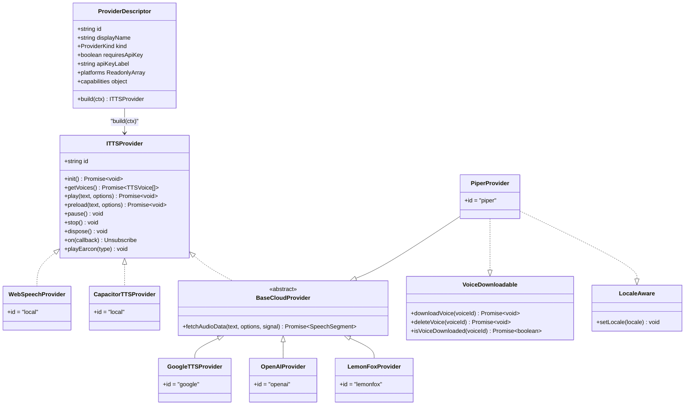
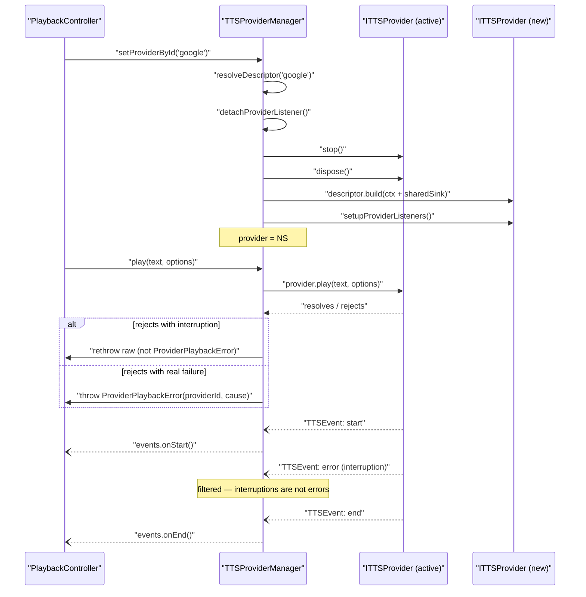
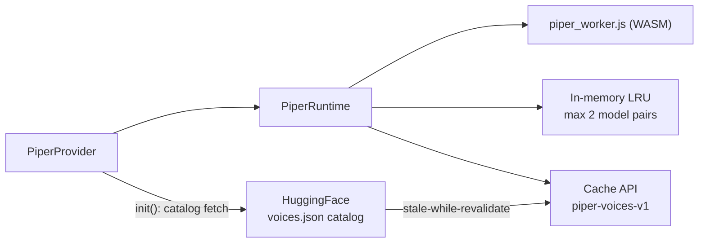
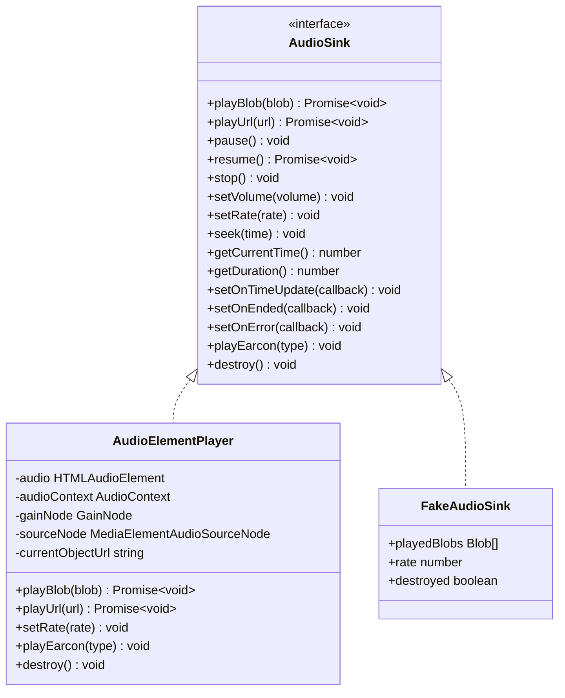
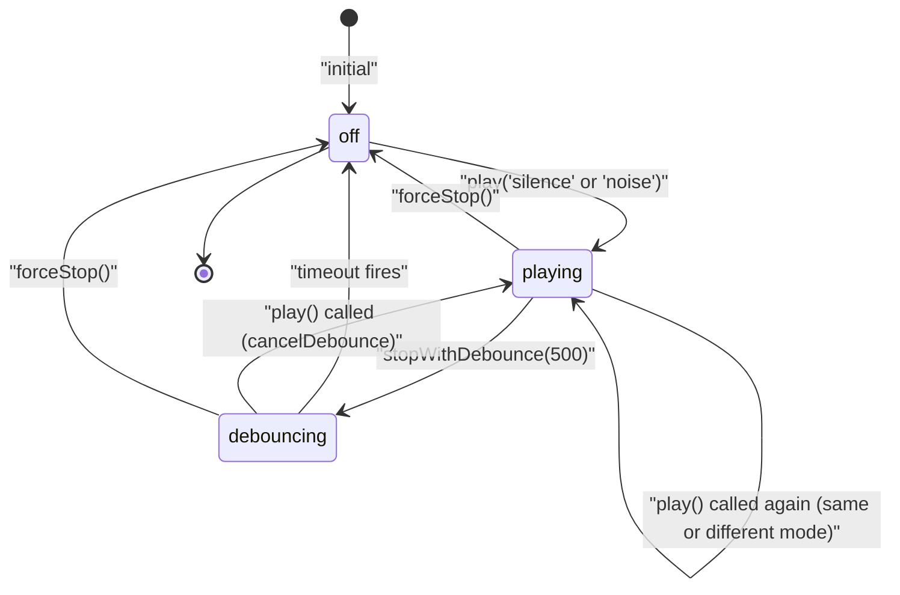
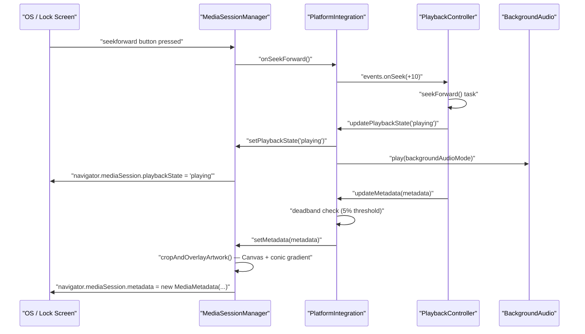
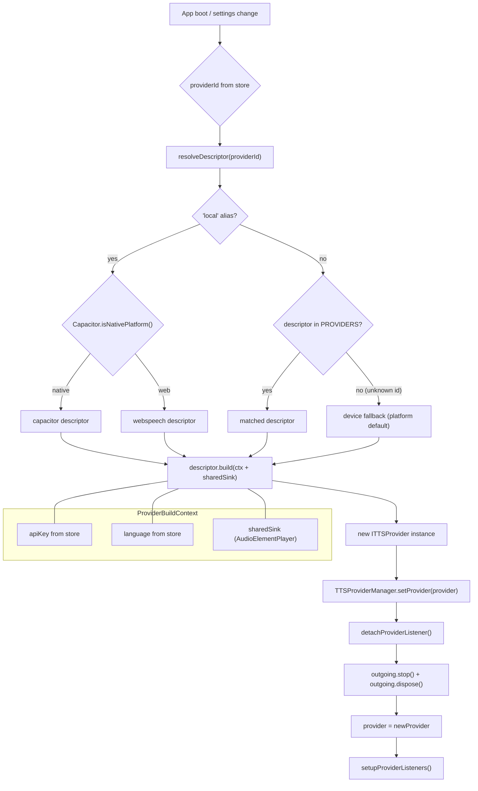

# TTS Providers & Platform Integration

This document covers the synthesis back-end of Versicle's audiobook playback system: the provider abstraction and how it is managed, the six concrete provider implementations, the audio sink that binds them together, earcon feedback, and the platform integration layer that surfaces playback state to the OS lock screen, hardware keys, and system notification centers. For the engine that *drives* providers (queueing, text segmentation, section navigation) see [TTS Engine](32-domain-audio-tts-engine.md). For the content pipeline (text chunking, lexicon) see [TTS Content Pipeline](34-tts-content-pipeline.md).

---

## 1. Design intent

Versicle targets every platform its users read on: a web browser tab, an Android app (via Capacitor), and potentially iOS. Each platform exposes speech synthesis in a fundamentally different way — the browser's `speechSynthesis` API, the native device TTS through a Capacitor plugin, a WASM neural network running in a Web Worker, and several HTTP REST APIs from cloud providers. The core question the provider layer answers is: **how do you give the engine a single, stable surface when the synthesis mechanism differs so radically?**

The answer is layered:

1. **A narrow `ITTSProvider` interface** in [src/lib/tts/providers/types.ts](../../src/lib/tts/providers/types.ts) defines the exact contract every provider must fulfill. It is intentionally narrowed over time (Phase 5a of the overhaul removed `resume()`, `volume`, and `SpeechSegment.isNative` as dead members; see [80-overhaul-history.md](80-overhaul-history.md)).
2. **A `ProviderDescriptor` registry** in [src/lib/tts/providers/registry.ts](../../src/lib/tts/providers/registry.ts) is the single source of truth for every registered provider: its ID, display name, kind, API-key requirement, platform availability, capability flags, and the factory function that builds an instance. Union types for provider IDs are derived from this registry with TypeScript's `as const satisfies` pattern — they are never hand-maintained.
3. **`TTSProviderManager`** in [src/lib/tts/TTSProviderManager.ts](../../src/lib/tts/TTSProviderManager.ts) is the live holder of the active provider. It bridges `ITTSProvider` events to the engine's `PlaybackBackend` callbacks, normalizes interruption events, wraps play failures as `ProviderPlaybackError`, and manages swap hygiene (detach, dispose, reinitialize) so the engine never observes stale providers.
4. **Platform integration** (`BackgroundAudio`, `MediaSessionManager`, `PlatformIntegration`) keeps the OS informed of playback state and keeps audio alive in the background without ever requiring the engine to know it is on iOS, Android, or the web.

The overarching speed policy — "synthesize at 1.0, apply rate at the audio sink" — is enforced everywhere without a capability flag. No provider may opt out. This keeps cached audio independent of playback speed (one cached MP3 serves any speed setting) and the cache key simple (`SHA-256(text|voiceId)`).

---

## 2. Provider abstraction

### 2.1 The `ITTSProvider` interface

Every synthesis back-end satisfies [`ITTSProvider`](../../src/lib/tts/providers/types.ts):

```typescript
export interface ITTSProvider {
  id: string;
  init(): Promise<void>;
  getVoices(): Promise<TTSVoice[]>;
  play(text: string, options: TTSOptions): Promise<void>;
  preload(text: string, options: TTSOptions): Promise<void>;
  pause(): void;
  stop(): void;
  dispose(): void;
  on(callback: (event: TTSEvent) => void): Unsubscribe;
  playEarcon?(type: 'bookmark_captured' | 'bookmark_failed'): void;
}
```

Key contractual points, pinned by `describeProviderContract` (see section 9):

- **`play()` resolves when audible playback has *started*** — not when it completes.
- **Single-shot failure signaling**: if `play()` fails to start, it rejects exactly once and never additionally emits an `error` event for the same failure. Error events are reserved for mid-playback failures (after `play()` has already resolved). The one exception is `CapacitorTTSProvider`, which uses `failureMode: 'event'` because the native speak promise only settles on completion, not start.
- **`preload()` must never start audible playback** and must not emit lifecycle events.
- **`dispose()` must never destroy an injected (shared) sink** — the manager injects one shared `AudioSink` and owns its lifecycle.
- **`on()` returns an `Unsubscribe` handle** — the manager detaches the outgoing provider's listener on swap.

### 2.2 Supporting types

```typescript
export interface TTSVoice {
  id: string;
  name: string;
  lang: string;
  provider: 'local' | 'google' | 'openai' | 'lemonfox' | 'piper';
}

export interface TTSOptions {
  voiceId: string;
  speed: number;  // playback-time only — never passed to synthesis APIs
}

export type TTSEvent =
  | { type: 'start' }
  | { type: 'end' }
  | { type: 'error'; error: TTSErrorPayload }
  | { type: 'timeupdate'; currentTime: number; duration: number }
  | { type: 'boundary'; charIndex: number }
  | { type: 'download-progress'; percent: number; status: string; voiceId: string };
```

`TTSErrorPayload` is either a real `Error` or a plain `{ message, error?, type? }` record — the latter form survives Comlink serialization across the worker boundary (real `Error` objects lose their prototype chain in structured clone). The helper `toTTSErrorPayload(e: unknown)` normalizes any thrown value into this union.

### 2.3 `ProviderPlaybackError` — the typed play rejection

When `TTSProviderManager.play()` catches a provider failure, it re-throws it as a `ProviderPlaybackError`:

```typescript
export class ProviderPlaybackError extends Error {
  override readonly name = 'ProviderPlaybackError';
  readonly providerId: string;
}
```

The `name` field (not `instanceof`) is used for the worker-boundary-safe check `isProviderPlaybackError(e)`, because Comlink re-creates errors preserving only `{message, name, stack}`. The engine's `PlaybackController` identifies this error type to decide whether to attempt local-provider fallback.

---

## 3. Provider registry



The [`PROVIDERS`](../../src/lib/tts/providers/registry.ts) constant is an `as const satisfies readonly ProviderDescriptor[]` array — TypeScript narrows it to a tuple and all union types derive from it:

| ID | Display name | Kind | Requires key | Platform | Downloadable voices | Locale-aware |
|----|-------------|------|-------------|----------|--------------------|----|
| `webspeech` | Web Speech (Local) | device | no | web only | no | no |
| `capacitor` | System Speech (Local) | device | no | native only | no | no |
| `piper` | Piper (High Quality Local) | wasm | no | all | **yes** | **yes** |
| `google` | Google Cloud TTS | cloud | **yes** | all | no | no |
| `openai` | OpenAI | cloud | **yes** | all | no | no |
| `lemonfox` | LemonFox.ai | cloud | **yes** | all | no | no |

### 3.1 The `'local'` alias

Both device providers (`WebSpeechProvider`, `CapacitorTTSProvider`) still report `id = 'local'` in their instances — this matches pre-5b persisted settings values. The registry exposes `resolveDescriptor(providerId)` which maps `'local'` to the platform-appropriate descriptor and falls back to the device provider for unknown IDs. The settings persistence migration (Phase 5b) will split `'local'` into `'webspeech'` and `'capacitor'` at the store level; until that migration lands the alias survives as a runtime-only mapping.

### 3.2 Capability guards

Capabilities (downloadable voices, locale-awareness) are declared on the descriptor, not discovered through duck-typing. Two type-guard functions operate on a live provider instance:

```typescript
export function asVoiceDownloadable(provider: ITTSProvider): (ITTSProvider & VoiceDownloadable) | null
export function asLocaleAware(provider: ITTSProvider): (ITTSProvider & LocaleAware) | null
```

Both functions look up the descriptor for the live provider (handling the `'local'` alias for device providers) and check `capabilities.downloadableVoices` / `capabilities.localeAware`. This eliminates `provider.id === 'piper' … as any` guards from the manager and the UI — wrong capability assumptions are caught at the descriptor, not scattered across the codebase.

### 3.3 Build context

Providers are constructed via `descriptor.build(ctx: ProviderBuildContext)` where:

```typescript
export interface ProviderBuildContext {
    apiKey?: string;       // for cloud providers
    language: string;      // normalized active language ('en', 'zh', …)
    sink?: AudioSink;      // the shared audio-output device
}
```

The context is **injected by the caller** (the manager or the composition root) — the registry module never reads a Zustand store. This broke the D14 import cycle where `providerFactory` previously imported `useTTSStore` for keys and language.

---

## 4. TTSProviderManager

[`TTSProviderManager`](../../src/lib/tts/TTSProviderManager.ts) implements `PlaybackBackend` — the interface `PlaybackController` uses to drive synthesis. It is a dumb holder: it holds one `ITTSProvider`, wires its events to the engine's callbacks, and handles swap hygiene.



### 4.1 Shared `AudioSink`

The manager lazily creates one `AudioElementPlayer` on first use and injects it into every provider it builds. This means provider swaps do not leak `HTMLAudioElement` instances — the prior architecture created one per `BaseCloudProvider` and never destroyed the outgoing ones.

```typescript
private getSharedSink(): AudioSink {
    if (!this.sharedSink) {
        this.sharedSink = new AudioElementPlayer();
    }
    return this.sharedSink;
}
```

Tests inject a `FakeAudioSink` through the constructor's optional `sink` parameter.

### 4.2 Event normalization

`setupProviderListeners()` attaches the manager's listener to the current provider and performs one normalization step: interruptions (`'interrupted'`, `'canceled'`, `AbortError`) are silently filtered before reaching the engine. They are deliberate stops (user action, provider swap), not errors. The `isPlaybackInterruption(e)` guard handles both DOMException names and the web-speech `SpeechSynthesisErrorCode` string values.

### 4.3 Capability delegation

Voice download and locale routing pass through capability guards:

```typescript
async downloadVoice(voiceId: string): Promise<void> {
    const downloadable = asVoiceDownloadable(this.provider);
    if (downloadable) await downloadable.downloadVoice(voiceId);
}

setLocale(locale: string) {
    asLocaleAware(this.provider)?.setLocale(locale);
}
```

Non-capable providers silently do nothing — `isVoiceDownloaded` returns `false` for non-Piper providers (the correct answer: device and cloud voices are not downloadable artifacts).

### 4.4 Earcon delegation

```typescript
playEarcon(type: 'bookmark_captured' | 'bookmark_failed'): void {
    if (typeof this.provider.playEarcon === 'function') {
        this.provider.playEarcon(type);
    }
}
```

`playEarcon` is optional on `ITTSProvider` — device providers implement it via a standalone `AudioContext`; cloud/WASM providers route it through the shared sink's Web Audio graph (which supports ducking the main TTS audio simultaneously).

---

## 5. Provider implementations

### 5.1 WebSpeechProvider (browser, device)

[`WebSpeechProvider`](../../src/lib/tts/providers/WebSpeechProvider.ts) wraps `window.speechSynthesis`. Initialization is non-trivial because Chrome, Firefox, and Safari all fire `voiceschanged` differently. The `init()` method handles three cases:

1. Voices already available synchronously (`synth.getVoices()` returns a non-empty array immediately on some browsers).
2. `voiceschanged` event fires after a short delay (the common async case).
3. Timeout fallback (1000 ms) — some contexts never fire `voiceschanged` (WebKit quirks, locked-down embedding).

The `play()` method creates a `SpeechSynthesisUtterance`, wires `onstart`/`onend`/`onerror`/`onboundary`, then calls `synth.speak()`. The single-shot contract is enforced in `onerror`:

```typescript
utterance.onerror = (e) => {
    const errorMsg = `SpeechSynthesisError: ${e.error}`;
    if (!started) {
        // Single-shot contract: a failure to START surfaces through the
        // rejection ONLY — never additionally as an 'error' event
        reject(new Error(errorMsg));
        return;
    }
    // Mid-playback failure (after play() resolved)
    this.emit({ type: 'error', error: { error: e.error, message: errorMsg, type: e.type } });
};
```

**Speed**: passed directly as `utterance.rate = options.speed` — the device speaks live at the requested rate, there is no synthesized artifact, so this is the legitimate use of a non-1.0 rate at synthesis time.

**Earcons**: use a separate `AudioContext` created on first earcon call. Volume ducking is not possible because `speechSynthesis` volume cannot be controlled through the Web Audio API graph.

### 5.2 CapacitorTTSProvider (native, device)

[`CapacitorTTSProvider`](../../src/lib/tts/providers/CapacitorTTSProvider.ts) uses `@capacitor-community/text-to-speech`. It implements a "Smart Handoff" gapless-playback mechanism for preloaded utterances.

#### Smart Handoff

When `preload(text, options)` is called, the provider immediately queues the text with the native TTS engine using `queueStrategy: 1` (Add/Queue), storing the resulting promise:

```typescript
this.nextUtterancePromise = TextToSpeech.speak({
    text, lang, rate: options.speed,
    category: 'playback',
    queueStrategy: 1  // Add (Queue)
});
```

When `play(text, options)` is subsequently called with the same text and the previous utterance has finished (`currentUtteranceFinished === true`), the provider adopts the already-running native promise instead of issuing a new speak call:

```typescript
const isContentMatch = text === this.nextText;
const isNaturalFlow = this.currentUtteranceFinished;

if (isContentMatch && isNaturalFlow && this.nextUtterancePromise) {
    // Native audio is already queued/playing. We just adopt the promise.
    this.emit({ type: 'start' });
    // Adopt the pre-queued promise...
}
```

This eliminates the inter-sentence gap on Android that would otherwise occur between each TTS utterance.

#### Utterance ID guard

Every `play()` call increments `activeUtteranceId`. Event handlers (`then`/`catch` on the speak promise) check `this.activeUtteranceId === myId` before emitting — stale callbacks from superseded utterances are silently dropped. This prevents the race where `stop()` or a provider swap triggers spurious `end`/`error` events from a previous utterance.

#### Pause is implemented as stop

```typescript
pause(): void {
    // Native pause not reliable, so we stop.
    this.activeUtteranceId++;
    TextToSpeech.stop().catch(e => ...);
}
```

Native TTS pause is not reliably supported on Android; the provider sacrifices mid-utterance resume in exchange for reliability.

#### Word boundary events

`init()` registers an `onRangeStart` listener (available on some Android builds) that translates native word-start callbacks into `boundary` events. A bounds check protects against stale callbacks from the previous (longer) utterance:

```typescript
if (info.start >= this.lastText.length) return;
this.emit({ type: 'boundary', charIndex: info.start });
```

#### Flight recorder instrumentation

`CapacitorTTSProvider` calls `flightRecorder.record('CAP', …)` on every significant operation (play flush, handoff, preload, stop, pause, event emission). This gives field diagnostics visibility into the native TTS lifecycle without affecting production behavior.

### 5.3 BaseCloudProvider (abstract, cloud/WASM base)

[`BaseCloudProvider`](../../src/lib/tts/providers/BaseCloudProvider.ts) is the abstract base for providers that synthesize audio as a blob artifact (Google, OpenAI, LemonFox, Piper). It provides:

- **Cache-first playback** via `TTSCache` (IndexedDB-backed, SHA-256 keyed)
- **In-flight request deduplication** via a `requestRegistry: Map<string, Promise<SpeechSegment>>`
- **Abort/timeout threading** from `stop()`/`dispose()` to active synthesis fetches
- **Shared `AudioSink` playback** with rate applied after source assignment
- **`dispose()` hygiene** that does not destroy an injected sink

#### `getOrFetch` flow

```
play(text, options)
  └─ getOrFetch(text, options)
        1. cache.get(cacheKey)          → hit: return cached blob
        2. requestRegistry.get(cacheKey) → hit: await existing in-flight promise
        3. synthesisLease()             → AbortController + 30 s timeout
           fetchAudioData(text, options, signal)
           cache.put(cacheKey, ...)
           requestRegistry.delete(cacheKey)
     └─ audioPlayer.playBlob(audio)
        audioPlayer.setRate(options.speed)   ← speed applied AFTER source load
        emit({ type: 'start' })
```

The cache key is `await cache.generateKey(text, voiceId)` — speed is deliberately excluded (see [34-tts-content-pipeline.md](34-tts-content-pipeline.md) for the key format). Cloud audio synthesized at 1.0 is reused at any playback speed.

#### Synthesis lease

Each synthesis request gets a per-request `AbortSignal` composed from:
- The provider-level `AbortController` (aborted by `stop()`/`dispose()` — fires as `AbortError`, treated as an interruption)
- A 30-second timeout (`SYNTHESIS_TIMEOUT_MS = 30_000`) that fires as `TimeoutError` — a real provider failure the engine may recover from

```typescript
private synthesisLease(): { signal: AbortSignal; release(): void } { … }
```

`AbortSignal.any` is not used because it is too new for older WebKit targets; the signals are composed manually.

#### Network routing

All `fetch` calls route through `egress(destinationId, url, opts)` from `@kernel/net` (Phase 7 §I) — a `NetworkGateway` facade that applies per-destination policy (timeout, offline mode, CORS headers). Destination IDs used by providers: `'google-tts'`, `'openai-tts'`, `'lemonfox-tts'`, `'hf-piper-catalog'`, `'hf-piper-models'`.

#### Speed policy in `play()`

```typescript
async play(text: string, options: TTSOptions): Promise<void> {
    const { audio } = await this.getOrFetch(text, options);
    if (audio) {
        await this.audioPlayer.playBlob(audio);
    }
    // Speed policy: audio is always synthesized at 1.0; rate applied after src load
    this.audioPlayer.setRate(options.speed);
    this.emit({ type: 'start' });
}
```

`setRate()` is called **after** `playBlob()` assigns a new `src`. The HTML media load algorithm would reset `playbackRate` to `defaultPlaybackRate` on source assignment, so `AudioElementPlayer.setRate()` pins both `defaultPlaybackRate` and `playbackRate` to make the rate survive the load.

### 5.4 GoogleTTSProvider

[`GoogleTTSProvider`](../../src/lib/tts/providers/GoogleTTSProvider.ts) targets `texttospeech.googleapis.com`. It dynamically fetches the voice list from `v1/voices` (authenticated with `X-Goog-Api-Key`) and synthesizes via `v1beta1/text:synthesize`, requesting `audioEncoding: 'MP3'`. The response is base64-encoded audio that is manually decoded with `window.atob()` and wrapped in a `Blob`.

The request body includes `enableTimePointing: ["SSML_MARK"]` with the intention of receiving word-level timestamps. However, the synthesis request sends plain text (not SSML with `<mark>` tags), so the returned timepoints have `charIndex: 0` and are not semantically useful. This remains a known limitation noted in the debt analysis.

### 5.5 OpenAIProvider

[`OpenAIProvider`](../../src/lib/tts/providers/OpenAIProvider.ts) targets `api.openai.com/v1/audio/speech`. Voices are static (six names: `alloy`, `echo`, `fable`, `onyx`, `nova`, `shimmer`) and hard-coded at construction. The model is fixed at `tts-1`. Synthesis requests are routed through `BaseCloudProvider.fetchAudio('openai-tts', …)`. OpenAI does not return alignment timestamps; `alignment` is always `undefined` in the returned `SpeechSegment`.

### 5.6 LemonFoxProvider

[`LemonFoxProvider`](../../src/lib/tts/providers/LemonFoxProvider.ts) targets `api.lemonfox.ai/v1/audio/speech` — an OpenAI-compatible endpoint. Twenty-eight voices are hard-coded (US English and UK English variants). The request body matches OpenAI's format (`input`, `voice`, `response_format: 'mp3'`). Like OpenAI, no alignment timestamps are returned.

### 5.7 PiperProvider

[`PiperProvider`](../../src/lib/tts/providers/PiperProvider.ts) is the most complex provider. It uses a WASM neural text-to-speech engine (the Piper project) running in a dedicated Web Worker, managed by [`PiperRuntime`](../../src/lib/tts/providers/PiperRuntime.ts).



#### Voice catalog (offline-capable)

`init()` uses a stale-while-revalidate pattern:
1. If a cached `voices.json` exists in `piper-voices-v1`, serve it immediately and refresh in the background.
2. If no cached entry, fetch from HuggingFace and cache the result.
3. If offline with no cached catalog, call `enumerateDownloadedVoices()` — which scans the Cache API for `.onnx` files and reconstructs voice entries from their URL paths. This ensures downloaded voices always appear in the voice list even without a network connection.

Only single-speaker `en_US` and `zh_CN` voices pass the `applyCatalog()` filter. Voice IDs use the prefix format `piper:en_US-ryan-high`.

#### CJK-aware text chunking

Piper's WASM runtime has OOM limits on long inputs. Before synthesis, `fetchAudioData()` splits text into chunks using `TextSegmenter`, with different limits for CJK text:

```typescript
const isCJK = /[一-鿿]/.test(text);
const MAX_CHARS = isCJK ? 100 : 500;
```

After sentence-level splitting with `TextSegmenter`, a second fallback `splitLongSentence()` function applies clause-boundary (`[,;:—–，；：、。！？]`) then word-boundary then hard-character-limit splitting to handle sentences that exceed `MAX_CHARS` individually.

Multiple WAV chunks are stitched by `stitchWavs()`, which parses real RIFF chunk headers rather than assuming a fixed 44-byte header.

#### Transactional voice download

`downloadVoice(voiceId)` follows a stage-verify-commit pattern:
1. Download `.onnx` and `.onnx.json` to memory (with `fetchWithBackoff`, 3 retries with exponential backoff).
2. Commit both to the Cache API (`runtime.saveModel`), now awaited (old code was fire-and-forget, which could race re-downloads).
3. Run a verification synthesis with empty text (`runtime.generate({ text: "" })`), which loads the ONNX model and exercises the whole inference path.
4. Emit `download-progress` at 100% on success. On failure: rollback (`runtime.deleteModel`), emit `error` and `download-progress: 0 / 'Failed'`, rethrow.

#### PiperRuntime internals

[`PiperRuntime`](../../src/lib/tts/providers/PiperRuntime.ts) owns:

- **One Worker** (`piper_worker.js`), created lazily, terminated and replaced on fatal error.
- **Request-ID protocol**: every `generate()` call increments `requestSeq` and embeds the ID in the `init` message. The worker echoes the ID on terminal messages (`output`/`error`); late messages with a stale ID are silently dropped. This eliminates the cross-talk hazard where a crashed task's late message would be consumed by the next request's handler.
- **Serialization**: `generate()` calls are serialized behind `queueTail`. A failed request resets the queue to a clean state rather than poisoning the chain (the old `piper-utils.ts` module-global promise chain swallowed errors with `.catch(() => {})`).
- **Two-tier model store**: an in-memory LRU (default capacity 2 model+config pairs) over the durable Cache API. `getModelPair()` promotes a hit to the LRU front (Map insertion-order recency) and evicts the oldest entry when over budget.
- **Same-origin asset serving**: all assets (`piper_worker.js`, `piper_phonemize.{js,wasm,data}`, local `onnxruntime-web` build) are served from `/piper/` — zero third-party network egress at synthesis time.

---

## 6. AudioElementPlayer and the AudioSink abstraction



[`AudioSink`](../../src/lib/tts/engine/AudioSink.ts) is the audio-output device abstraction. It exists because `HTMLAudioElement` and `AudioContext` do not exist inside a Web Worker. The production implementation is [`AudioElementPlayer`](../../src/lib/tts/AudioElementPlayer.ts); tests use `FakeAudioSink`, which records calls and lets tests fire lifecycle callbacks deterministically without jsdom media-element shims.

### 6.1 Object URL lifecycle

`playBlob()` creates an object URL from the blob, assigns it to the `<audio>` element's `src`, and plays:

```typescript
public playBlob(blob: Blob): Promise<void> {
    this.revokeCurrentUrl();  // releases previous blob URL
    const url = URL.createObjectURL(blob);
    this.currentObjectUrl = url;
    this.audio.src = url;
    return this.audio.play();
}
```

The URL is revoked in `revokeCurrentUrl()`, which is called both at the start of the next `playBlob()` call and in the `onended` handler. `stop()` also calls `revokeCurrentUrl()`.

### 6.2 Playback rate pinning

`setRate()` pins both `defaultPlaybackRate` and `playbackRate`:

```typescript
public setRate(rate: number) {
    this.audio.defaultPlaybackRate = rate;
    this.audio.playbackRate = rate;
}
```

The HTML spec resets `playbackRate` to `defaultPlaybackRate` when a new source is loaded. By pinning `defaultPlaybackRate`, subsequent `src` assignments automatically inherit the rate. This is the implementation of the "rate applied after source load" contract from `BaseCloudProvider.play()`.

### 6.3 Web Audio earcon ducking graph

`AudioElementPlayer` lazily creates a Web Audio API subgraph on the first `playEarcon()` call:

```
HTMLAudioElement
    └── MediaElementAudioSourceNode (sourceNode)
        └── GainNode (gainNode)
            └── AudioContext.destination
```

When `playEarcon()` fires, the gain is ramped down to 0.3 over 100 ms, the earcon oscillators play to `AudioContext.destination`, and the gain ramps back to 1.0 over 600 ms:

```typescript
this.gainNode.gain.cancelScheduledValues(now);
this.gainNode.gain.setValueAtTime(this.gainNode.gain.value, now);
this.gainNode.gain.linearRampToValueAtTime(0.3, now + 0.1);
this.gainNode.gain.linearRampToValueAtTime(1.0, now + 0.6);
playEarconOscillators(this.audioContext, type, this.audioContext.destination);
```

---

## 7. Earcons

[`earcons.ts`](../../src/lib/tts/earcons.ts) exports a single function `playEarconOscillators(audioContext, type, destinationNode?)` that generates brief tonal feedback using oscillator nodes.

Two earcon types:

| Type | Sound | Implementation |
|------|-------|---------------|
| `bookmark_captured` | Two-note ascending chime | Two sine oscillators: 440→880 Hz (0–100 ms) then 660→1100 Hz (150–300 ms), peak gain 0.5 |
| `bookmark_failed` | Descending square buzz | One square oscillator: 200→150 Hz (0–300 ms), peak gain 0.5 |

The oscillators are connected through a `GainNode` and start/stop at precisely scheduled `AudioContext` times — no `setTimeout` or `requestAnimationFrame` is involved. The optional `destinationNode` parameter lets `AudioElementPlayer` route earcons to a node downstream of the ducking `GainNode` (so the earcon itself is not ducked by its own trigger).

Device providers (`WebSpeechProvider`, `CapacitorTTSProvider`) maintain their own `AudioContext` for earcons because they do not use `AudioElementPlayer`. Volume ducking is not available on these providers since the native speech engine's audio cannot be routed through a Web Audio graph.

---

## 8. BackgroundAudio keep-alive

Mobile operating systems (Android, iOS) suspend audio playback when an app moves to the background if no audio session is active. [`BackgroundAudio`](../../src/lib/tts/BackgroundAudio.ts) keeps the audio session alive by playing a looping audio track while TTS is active.

### 8.1 Dual-element architecture

`BackgroundAudio` maintains two `HTMLAudioElement` instances (`audio1`, `audio2`). `audio1` starts immediately; `audio2` starts 5 seconds later as a redundancy measure:

```typescript
this.audio1.play().catch(e => console.warn("BackgroundAudio audio1 play failed", e));

this.secondaryTimeout = setTimeout(() => {
    this.audio2.play().catch(e => console.warn("BackgroundAudio audio2 play failed", e));
}, 5000);
```

### 8.2 Modes

```typescript
export type BackgroundAudioMode = 'silence' | 'noise' | 'off';
```

- **`silence`**: loops [`assets/silence.ogg`](../../src/assets/silence.ogg) at volume 1.0. Keeps the audio session active without any audible output.
- **`noise`**: loops [`assets/10s_8k_sub_bass_vbr_off.webm`](../../src/assets/10s_8k_sub_bass_vbr_off.webm) — a 10-second sub-bass white noise track at configurable volume. Some users prefer audible background noise; the volume is passed through a perceptual power curve (`Math.pow(linear, 3)`) so the slider feels linear to the ear.
- **`off`**: stops both elements immediately.

### 8.3 Debounced stop

`stopWithDebounce(delayMs)` pauses both elements after a delay. This prevents the background audio from stopping and restarting (causing OS audio session interruptions) during rapid pause/play cycles:

```typescript
stopWithDebounce(delayMs: number) {
    this.cancelDebounce();
    this.stopTimeout = setTimeout(() => {
        this.audio1.pause();
        this.audio2.pause();
        this.stopTimeout = null;
    }, delayMs);
}
```

`PlatformIntegration.updatePlaybackState()` calls `stopWithDebounce(500)` on `'paused'` status.



---

## 9. MediaSessionManager

[`MediaSessionManager`](../../src/lib/tts/MediaSessionManager.ts) bridges Versicle's playback events to the OS Media Session API, which powers lock-screen controls, notification area media controls, Bluetooth head unit buttons, and CarPlay/Android Auto integration.

It supports two environments:

- **Native (Capacitor)**: uses `@jofr/capacitor-media-session` which wraps the native `AVAudioSession` / `MediaSession` frameworks on iOS/Android.
- **Web**: uses `navigator.mediaSession` directly.

### 9.1 Action handlers

The constructor calls `setupActionHandlers()` which registers handlers for play, pause, stop, previoustrack, nexttrack, seekbackward, seekforward, and seekto. For native, each action is registered via `MediaSession.setActionHandler({ action }, handler)`. For web, the same set is registered via `navigator.mediaSession.setActionHandler(action, handler)`, with individual try/catch blocks to silently skip unsupported actions.

### 9.2 Metadata and artwork processing

`setMetadata(metadata: MediaSessionMetadata)` accepts:

```typescript
export interface MediaSessionMetadata {
  title: string;
  artist: string;
  album: string;
  artwork?: { src: string; sizes?: string; type?: string }[];
  sectionIndex?: number;
  totalSections?: number;
  progress?: number;       // 0.0 to 1.0
  coverPalette?: number[];
  perceptualPalette?: PerceptualPalette;
}
```

The artwork processing pipeline (`processArtwork` → `cropAndOverlayArtwork`) runs on a Canvas element:

1. **Center-crop to square** — the minimum of image width/height defines the square size, centered.
2. **Progress ring overlay** (if `progress` is defined) — a conic gradient drawn from the top (`-Math.PI / 2`) sweeps clockwise to `progress * 360°`.
3. **Perceptual blend mode** — if `perceptualPalette` is available (CIELAB K-Means extracted from the cover), the blend mode is chosen mathematically:
   - If background luminance (`bgL`) is above standout luminance (`stL`): `'multiply'` (darkens the covered region)
   - Otherwise: `'screen'` (lightens)
   - Exception: extreme luminance (`bgL < 10` or `bgL > 90`) combined with low `deltaE < 15` falls back to simple alpha blending to ensure the ring is always visible.
4. **JPEG output** at 0.8 quality via `canvas.toDataURL('image/jpeg', 0.8)`.

A 2-second safety timeout resolves with the original `src` if the image fails to load.

### 9.3 Position state

`setPositionState(state)` pushes `{ duration, playbackRate, position }` to the OS. This enables lock-screen scrubbers and CarPlay seek bars. On native it calls `MediaSession.setPositionState()`; on web it calls `navigator.mediaSession.setPositionState()` (with a try/catch since this method is not universally supported).

---

## 10. PlatformIntegration

[`PlatformIntegration`](../../src/lib/tts/PlatformIntegration.ts) is the facade that the engine's `PlaybackController` calls. It implements the `MediaPlatform` interface:

```typescript
export interface MediaPlatform {
    setBackgroundAudioMode(mode: BackgroundAudioMode, isPlaying: boolean): void;
    getBackgroundAudioMode(): BackgroundAudioMode;
    setBackgroundVolume(volume: number): void;
    updatePlaybackState(status: TTSStatus): void;
    updateMetadata(metadata: MediaSessionMetadata): void;
    setPositionState(state: { duration: number; playbackRate: number; position: number }): void;
    stop(): Promise<void>;
}
```

The engine depends only on `MediaPlatform`, not on `PlatformIntegration` directly. The worker-resident engine can inject a stub or a main-thread proxy — `navigator.mediaSession` and `HTMLAudioElement` do not exist in a Web Worker.

### 10.1 Status → background audio routing

```typescript
updatePlaybackState(status: TTSStatus) {
    this.mediaSessionManager.setPlaybackState(
        status === 'playing' ? 'playing' : (status === 'paused' ? 'paused' : 'none')
    );

    if (status === 'playing' || status === 'loading' || status === 'completed') {
        this.backgroundAudio.play(this.backgroundAudioMode);
    } else if (status === 'paused') {
        this.backgroundAudio.stopWithDebounce(500);
    } else {
        this.backgroundAudio.forceStop();
    }
}
```

`'loading'` and `'completed'` (transitional states) keep the background audio running to avoid OS session interruptions during sentence boundaries.

### 10.2 Metadata deadband

`updateMetadata()` implements a change-detection filter to avoid excessive Bluetooth head unit refreshes (which can cause UI flickering on some devices):

```typescript
const progressMovedSignificantly =
    metadata.progress !== undefined &&
    Math.abs(metadata.progress - (this.lastMetadata?.progress ?? -1)) >= 0.05;

if (!titleChanged && !artistChanged && !albumChanged && !artworkSrcChanged && !sectionChanged && !progressMovedSignificantly) {
    return;  // skip update
}
```

The progress threshold is 5% — artwork regeneration (which redraws the conic progress ring) only fires when the reader has moved at least 5% through the current section.

### 10.3 `PlatformEvents` → `MediaSessionCallbacks` mapping

`PlatformIntegration`'s constructor wraps the engine's `PlatformEvents` into `MediaSessionCallbacks`:

```typescript
this.mediaSessionManager = new MediaSessionManager({
    onSeekBackward: () => events.onSeek(-10),
    onSeekForward: () => events.onSeek(10),
    onSeekTo: (details) => {
        if (details.seekTime !== undefined) events.onSeekTo(details.seekTime);
    },
    // …play, pause, stop, prev, next passed through directly
});
```

`seekBackward`/`seekForward` are translated to ±10-second relative offsets.



---

## 11. Provider selection flow



The composition root injects a `ProviderBuildContextSource` — a function `(providerId: string) => { apiKey?, language }` — into `TTSProviderManager`. In production this is a closure over the settings store; in tests it is a stub returning `{ language: 'en' }`. The registry module itself never reads any store.

---

## 12. Provider contract test suite

[`describeProviderContract`](../../src/lib/tts/providers/describeProviderContract.ts) is a parameterized test harness run against all six providers in [`providerContract.test.ts`](../../src/lib/tts/providers/providerContract.test.ts). It pins seven contract cases:

1. `play()` resolves once playback has started and emits exactly one `'start'`.
2. `preload()` never starts playback and never emits lifecycle events.
3. A failure surfaces through exactly ONE channel (single-shot signaling).
4. `on()` returns a working unsubscribe handle.
5. `dispose()` detaches listeners and emits nothing afterwards.
6. **Speed policy**: a non-1.0 speed is playback-time only — synthesis requests carry no rate parameter.
7. **Cache key is speed-free**: replaying the same text at a different speed performs zero new synthesis.

`vi.mock` is banned in the `providers/` directory (enforced by ESLint); all harnesses inject fakes (`FakeAudioSink`, `InMemoryTTSCache`, stubbed `fetch`/`speechSynthesis`) instead of module-level mocking. This forces real behavioral coverage rather than testing implementation details.

The `ProviderContractHarness.failureMode` field distinguishes `'reject'` (cloud/WASM/WebSpeech — rejection is the only signal) from `'event'` (Capacitor — resolves optimistically, failure arrives as one `error` event). The test suite branches correctly for each mode.

---

## 13. Worker boundary and main-thread constraint

All provider code (synthesis APIs, audio elements, fetch) is **main-thread only**. The worker-resident `PlaybackController` talks to providers only through the `PlaybackBackend` interface, whose concrete implementation (`TTSProviderManager`) lives on the main thread. Provider IDs cross the worker boundary as plain strings.

This is why `TTSProviderManager` deliberately does not import any provider implementation directly in the worker bundle — the `setProviderById(id: string)` method takes a string, and the registry lookup and construction happen on the main thread when the method is called there.

For a full description of the worker topology and how `PlaybackBackend` events cross the boundary via Comlink see [32-domain-audio-tts-engine.md](32-domain-audio-tts-engine.md) and [51-tts-app-integration.md](51-tts-app-integration.md).

---

## 14. Observability

**TTSFlightRecorder** ([`TTSFlightRecorder.ts`](../../src/lib/tts/TTSFlightRecorder.ts)) is the audio domain's diagnostics ring buffer. `CapacitorTTSProvider` records every significant event (`play.flush`, `play.handoff`, `preload`, `stop`, `pause`, and all emitted event types) tagged with the current utterance ID and relevant numeric fields.

The recorder has a TTS-specific anomaly heuristic: if `playNext` fires when the current index is less than 80% through the queue, it auto-saves a snapshot to IndexedDB (via the `diagnostics` repo) with trigger `'anomaly:chapter_advance'`. This catches premature chapter advances without requiring the user to manually trigger a diagnostics export.

The `window.__ttsFlightRecorder` global exposes the live recorder to browser devtools for ad-hoc diagnosis.

---

## 15. Cross-cutting concerns

### Speed policy (P0 law)

Synthesis always happens at rate 1.0. Playback speed (`TTSOptions.speed`) is applied as a sink rate after the audio source is loaded. This policy has no capability flag and no opt-out. Consequences:

- Cloud cache keys are `SHA-256(text|voiceId)` — a speed change does not bust the cache.
- Changing speed mid-session does not re-synthesize any cached segments.
- `AudioElementPlayer.setRate()` sets both `defaultPlaybackRate` and `playbackRate` to survive `src` reassignment.
- Device providers (WebSpeech, Capacitor) pass speed as the live speech rate (`utterance.rate`, `TextToSpeech.speak({ rate })`) — they have no synthesized artifact, so this is the correct and only mechanism available to them.

### Disposal and lifecycle

The manager's `setProvider()` method enforces swap hygiene in order:
1. Detach the manager's listener from the outgoing provider (`detachProviderListener()`).
2. Call `outgoing.stop()` to halt any in-flight native speech.
3. Call `outgoing.dispose()`, which: aborts in-flight synthesis fetches, clears the event listener array, and destroys the `AudioSink` only if the provider constructed it for itself (not when the sink was injected by the manager).

A disposed provider must not emit events. The `disposed` flag in `BaseCloudProvider` and `WebSpeechProvider` gates `emit()` calls.

### API key handling

Cloud providers store the API key as a plain string member (`this.apiKey`). Key validation is deferred to the first `init()` call (which fails silently if the key is absent) or to the first synthesis request (which throws `"… API Key missing"`). No keystroke-by-keystroke re-initialization occurs at the provider level — that behavior is controlled at the settings layer.

---

## 16. Known limitations and debt

The [`plan/overhaul/analysis/tts-providers.md`](../../plan/overhaul/analysis/tts-providers.md) analysis document catalogues the full debt history. Items that remain after Phase 5a:

- **Piper catalog filter** (`en_US` and `zh_CN` only) is hard-coded in `applyCatalog()`. Other languages present in the HuggingFace catalog cannot be selected without a code change.
- **OpenAI voices and model** (`tts-1`) are hard-coded; `tts-1-hd` and newer voices are not accessible.
- **Google timepoints**: `enableTimePointing: ["SSML_MARK"]` is requested but plain text (not SSML) is sent, making the returned timepoints structurally meaningless.
- **TTS audio cache has no eviction** — `TTSCache.put()` writes indefinitely; there is no LRU prune in `MaintenanceService`.
- **`CapacitorTTSProvider.pause()` is implemented as stop** — mid-utterance position is lost; the engine resumes from the start of the current queue item.
- **Device provider IDs** (`'local'`) — both `WebSpeechProvider` and `CapacitorTTSProvider` still report `id = 'local'` until the Phase 5b settings migration renames them to `'webspeech'` and `'capacitor'` in persisted storage.

---

## Summary

The TTS provider layer is built around a narrow, precisely specified interface (`ITTSProvider`), a declarative registry (`PROVIDERS`) that is the single source of truth for IDs, capabilities, and construction, and a thin manager (`TTSProviderManager`) whose only jobs are to hold the active provider, forward events with interruption filtering, and enforce swap hygiene. Platform integration is cleanly separated into `PlatformIntegration` (the facade), `MediaSessionManager` (OS API calls), and `BackgroundAudio` (the keep-alive loop) — the engine sees only the `MediaPlatform` interface and is unaware of the platform details. The shared `AudioSink` (`AudioElementPlayer`) is owned by the manager and injected into every cloud/WASM provider, eliminating the audio-element leak that plagued the pre-5a architecture.
