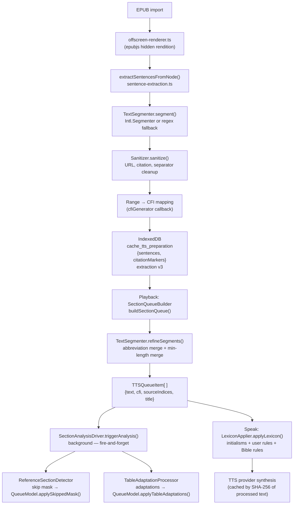
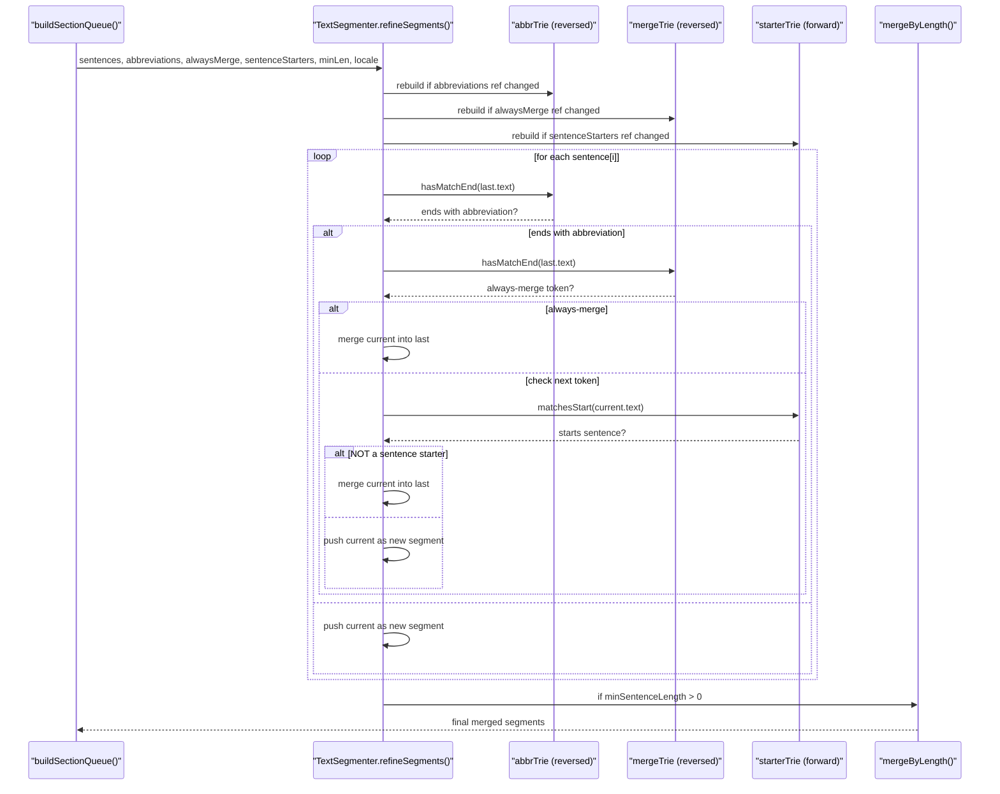
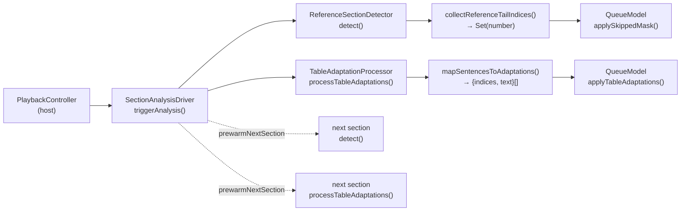
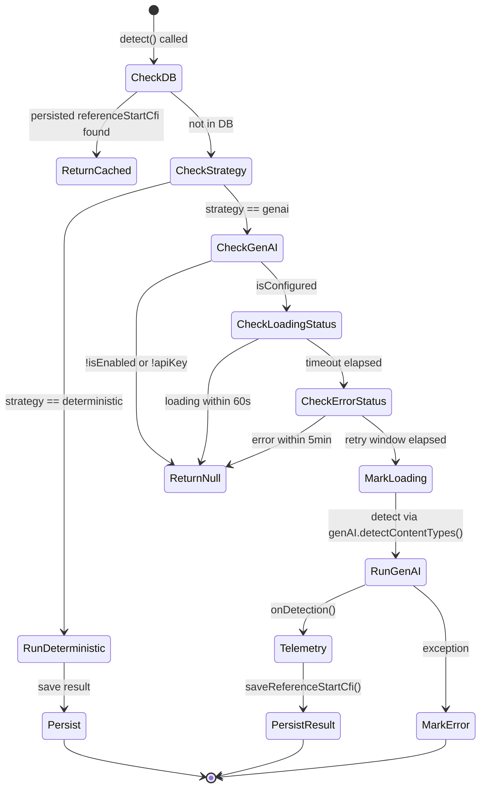
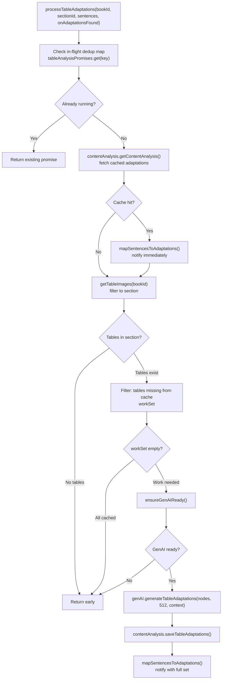
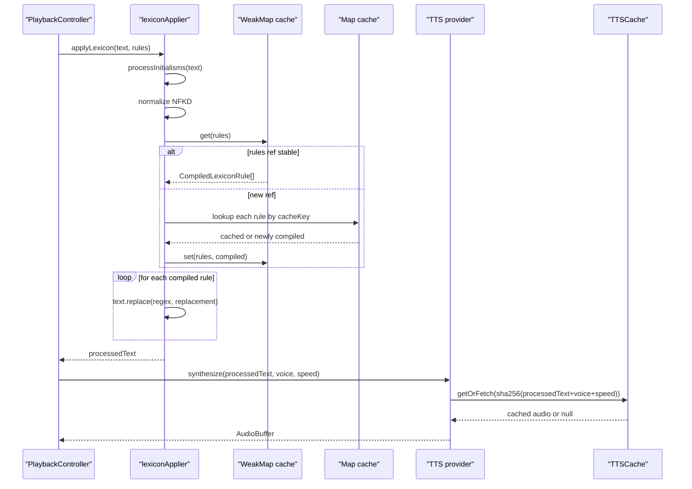
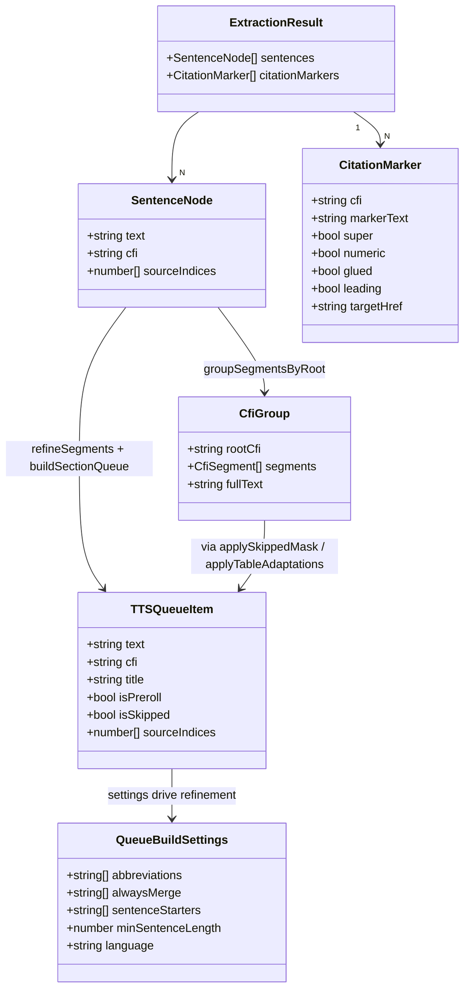

# TTS Content Pipeline

How book text becomes a speakable queue: the full path from raw EPUB HTML through sentence extraction, segmentation, sanitization, reference detection, table adaptation, and cue construction.

---

## Why this pipeline exists

The core problem TTS faces in a book reader is that EPUB content is structured for the eye, not the ear. A chapter HTML document contains tables, footnote anchors, citation superscripts, page-break markers, URL text, visual separators, and section headers — none of which a synthesis voice should read verbatim. At the same time, the app needs precise position tracking: every sentence the voice speaks must map back to the exact location in the document so the reader highlight can follow along and the user can tap a paragraph to resume.

The Versicle pipeline solves this with a two-phase architecture that deliberately separates *when* each concern fires:

- **Ingestion-time (once per book import):** DOM traversal, citation suppression, sentence segmentation, sanitization, and CFI mapping. Persistent storage writes raw sentence nodes with their book-position handles. This runs in a hidden offscreen rendering context through the same epubjs pipeline the reader uses, so generated CFIs are guaranteed to match what the reader produces.

- **Playback-time (per section, per settings change):** Dynamic re-refinement of the persisted sentences against the current user's abbreviation rules, background GenAI analysis (reference-section detection, table-to-narrative adaptation), queue construction, and — at speak time — lexicon application immediately before synthesis. Nothing here re-reads the EPUB; everything works from the persisted `{sentences, citationMarkers}` pair.

The separation matters for several reasons. Re-segmenting at playback allows abbreviation settings to take effect retroactively without requiring the user to re-import a book (the "dynamic refinement" invariant). Persisting raw sentences at rest (extraction version 3, "raw at rest") means the stored data is the most general representation; playback refines it. And firing GenAI analysis in the background means the user hears audio before the AI has finished — the skip-mask and table adaptations arrive asynchronously and are overlaid onto the live queue.

---

## Architecture overview



---

## Key types

### `SentenceNode`

Defined in [`src/types/tts-content.ts`](../../src/types/tts-content.ts), this is the atom of the entire pipeline:

```typescript
export interface SentenceNode {
    text: string;
    cfi: string;
    sourceIndices?: number[];
}
```

- `text` is NFKD-normalized (nbsp → space, accent decomposition) but the normalization is applied only to the *outbound* text value, not before offset calculation (extraction version 2+ invariant).
- `cfi` is the epubcfi range covering the sentence's location in the EPUB spine item.
- `sourceIndices` carries the raw extraction indices of sentences that were merged into this node. The skip-mask and table-adaptation systems use `sourceIndices` as their currency: a queue item is skipped only when *all* of its `sourceIndices` are in the skip set.

### `CitationMarker`

Also in [`src/types/tts-content.ts`](../../src/types/tts-content.ts):

```typescript
export interface CitationMarker {
    cfi: string;
    markerText: string;
    super: boolean;
    numeric: boolean;
    glued: boolean;
    leading: boolean;
    fontSizeRatio?: number;
    targetHref?: string;
}
```

- `leading` is the position-aware signal: a marker is `leading` when it is the first non-whitespace content of its block, which is characteristic of endnote anchors (they open the note entry). This flag is a stronger signal than a count-based measure for reference-section detection.
- `glued` means the marker immediately followed text without whitespace — a common in-text citation pattern.
- `super` covers `SUP`/`SUB` tags and CSS-superscript `SPAN` elements (detected via `getComputedStyle` `verticalAlign` or font-size ratio below 0.85).

### `TTSQueueItem`

Defined in [`src/types/tts.ts`](../../src/types/tts.ts):

```typescript
export interface TTSQueueItem {
    text: string;
    cfi: string | null;
    title?: string;
    isPreroll?: boolean;
    isSkipped?: boolean;
    sourceIndices?: number[];
}
```

`cfi` is `null` for preroll announcements and empty-section fillers (which have no book position). `isSkipped` drives the QueueModel's visible-navigation scan: `getNextVisibleIndex` and `getPrevVisibleIndex` skip over items where this flag is true.

---

## Phase 1: Ingestion-time extraction

### DOM traversal and block flushing

The entry point is `extractSentencesFromNode()` in [`src/lib/ingestion/sentence-extraction.ts`](../../src/lib/ingestion/sentence-extraction.ts). It takes a DOM `Node` (the chapter body rendered by epubjs), a `cfiGenerator` callback, and extraction options. The function does a depth-first walk accumulating text into a `textBuffer` alongside a parallel `textNodes` array of `{node, length}` pairs that track the raw byte lengths of the contributor text nodes.

When the traversal hits a block-level element boundary (any tag in the `BLOCK_TAGS` set: `P`, `DIV`, `H1-H6`, `LI`, `BLOCKQUOTE`, `TABLE`, `TD`, `TH`, and many more), it calls `flushBuffer()`. The buffer is segmented, each segment sanitized, and each segment's character offsets are mapped back through `textNodes` onto a DOM `Range`, which `cfiGenerator` converts to a CFI.

A critical implementation detail: `<PRE>` blocks bypass newline normalization. The buffer normally has `\n` and `\r` replaced with spaces before segmentation (so epubjs linebreaks don't create spurious sentence splits), but pre-formatted blocks preserve their literal content.

### Citation marker detection and suppression

Before text from inline elements is appended to the buffer, `detectCitationMarkerElement()` classifies each inline `SUP`, `SUB`, `A`, and `SPAN`. The classification logic is layered:

1. The element's text content must match `CITATION_TEXT_RE`: bare/bracketed numbers, parenthesized numbers, or symbol markers (`*`, `†`, `‡`, `§`, `¶`).
2. Elements inside MathML (`math`, `[role="math"]`, `.MathJax`, `.MathJax_Preview`) are always excluded — superscript numbers there are exponents.
3. `SUP`/`SUB` tags are unconditionally `isSuper = true`.
4. `A` tags are citations if they carry `epub:type="noteref"`, `role="doc-noteref"`, or their `href` starts with `#` or matches `/notes|endnote|footnote/i`.
5. Other inline elements (typically `SPAN`) require `getComputedStyle` to confirm `verticalAlign: super/sub` or a font-size ratio below 0.85 relative to their parent.

A qualifying citation element is **always suppressed** from the text buffer even if CFI generation fails; it is only recorded as a `CitationMarker` when a CFI can be computed. This keeps the suppression semantics independent from position tracking.

The `leading` field is computed by `isLeadingInBlock()`: it walks up the DOM tree checking for any non-whitespace siblings before the element at each level, stopping when it reaches a block-level ancestor. A citation with no non-whitespace siblings before it in its block hierarchy is `leading = true`.

### Segmentation

Once the text buffer is assembled (without citation text, without `\n` for non-pre blocks), it is passed to `TextSegmenter.segment(text)`. This produces an array of `TextSegment` objects:

```typescript
export interface TextSegment {
    text: string;   // NFKD-normalized
    index: number;  // start offset into the RAW (un-normalized) input
    length: number; // length in the RAW input
}
```

The critical invariant: `index` and `length` are offsets into the *raw* (un-normalized) text. Normalizing before segmentation would shift byte offsets for every composed character (e.g. `é` becomes `e + U+0301`, a two-unit sequence from one — CFIs derived from the normalized offsets would point to wrong locations). Only the outbound `text` value is NFKD-normalized. This offset-safety guarantee was introduced in extraction version 2.

`TextSegmenter` uses `Intl.Segmenter` (locale-aware sentence segmentation, cached per locale by `getCachedSegmenter`) with a regex fallback when `Intl.Segmenter` is unavailable:

```typescript
export const RE_SENTENCE_FALLBACK = /([^.!?。！？]+[.!?。！？]+)/g;
```

The fallback also handles CJK sentence terminators (`。！？`).

### Sanitization

Each raw segment's NFKD-normalized text is passed through `Sanitizer.sanitize()` in [`src/lib/tts/processors/Sanitizer.ts`](../../src/lib/tts/processors/Sanitizer.ts) before it becomes a `SentenceNode`. The sanitizer applies a series of filters in order:

| Step | Pattern | Action |
|------|---------|--------|
| Page number check | `PAGE_NUMBER`: `/^\s*(?:(?:page|pg\.?)\s*)?\d+\s*$/i` | Return `''` — entire segment discarded |
| URL replacement | `URL` with capture group 1 = domain | Replace full URL with domain name only; handles unbalanced trailing `)` |
| Numeric citations | `CITATION_NUMERIC`: `/\[\s*\d+(?:\s*,\s*\d+)*\s*\]/` | Remove (only when `[` present — optimization) |
| Author-year citations | `CITATION_AUTHOR_YEAR`: `/\([A-Z][a-zA-Z\s]+,?\s+\d{4}(?::\d+)?\)/` | Remove (only when `(` present) |
| Visual separator check | `SEPARATOR`: `/^\s*[-*_]{3,}\s*$/` | Return `''` |
| Multi-space cleanup | `MULTIPLE_SPACES`: `/\s{2,}/` | Collapse to single space |
| Space-before-punctuation | `/\s+([.,!?;:])/g` | Remove leading space before punctuation |

An optimization: the URL regex only runs when the string contains `http` or `www.`; the citation regexes only run when the string contains `[` or `(` respectively. This avoids expensive regex scans on the vast majority of sentences.

Segments that sanitize to empty strings are dropped. This means a "page 47" artifact in the EPUB HTML becomes no sentence node at all.

### CFI mapping and extraction version stamp

For each non-empty sanitized segment, `flushBuffer` walks the `textNodes` list using the segment's raw `index` and `length` to construct a DOM `Range` and calls `cfiGenerator(range)` to obtain the CFI string. The resulting `SentenceNode` gets `sourceIndices: [i]` where `i` is its raw position in the current section's extraction sequence.

No `refineSegments` pass runs at ingestion (extraction version 3, "raw at rest"). Previous versions (v1, v2) ran a first merge pass at ingest; v3 stores unrefined sentences so playback can merge against the current settings without being limited by ingest-time baked decisions. V1/v2 rows continue to work — they simply get re-refined at playback. The current extraction version is exported as `TTS_EXTRACTION_VERSION = 3` from `sentence-extraction.ts`.

The final result — `{sentences, citationMarkers}` as `ExtractionResult` — plus `<table>` element webp snapshots are persisted to IndexedDB.

---

## Phase 2: Playback-time queue construction

### `SectionQueueBuilder` — the pure transform

[`src/lib/tts/SectionQueueBuilder.ts`](../../src/lib/tts/SectionQueueBuilder.ts) contains a single exported function `buildSectionQueue()`. It is deliberately pure: same inputs produce the same queue with no side effects.

```typescript
export function buildSectionQueue(
    sentences: ReadonlyArray<SentenceNode>,
    settings: QueueBuildSettings,
    options: QueueBuildOptions,
): SectionQueue
```

**`QueueBuildSettings`** carries:
- `abbreviations`: the merged list of custom + (optionally) Bible abbreviations — an array whose reference identity is used as a cache key inside `TextSegmenter.refineSegments`.
- `alwaysMerge`: tokens like `Mr.`, `Mrs.`, `Ms.`, `Prof.` that always force a merge regardless of what follows.
- `sentenceStarters`: words like `He`, `She`, `The`, `A`, `But` that prevent a merge even when the previous segment ended with an ambiguous abbreviation.
- `minSentenceLength`: minimum character count; segments shorter than this are merged forward or backward.
- `language`: BCP-47 locale, drives CJK-aware separator insertion and the empty-section filler.

**`QueueBuildOptions`** carries:
- `sectionTitle`: already-resolved section title (from `resolveSectionTitle`); when absent a `Section N` fallback is generated.
- `sectionIndex`: zero-based position, drives the fallback label.
- `prerollEnabled`, `speed`, `characterCount`: drive the optional preroll announcement.

**Happy path (non-empty sentences):**

1. Call `TextSegmenter.refineSegments()` with the current settings.
2. If `prerollEnabled`, prepend a preroll item using `generatePreroll()`.
3. For each refined sentence that has a `cfi`, push a `TTSQueueItem` with `isSkipped: false`.

**Empty section path:**

When `sentences.length === 0`, push one item using `emptySectionMessage(language)`. The empty-section filler is deterministic and language-keyed (see below).

### Title resolution

Section title resolution is handled by `resolveSectionTitle()` in [`src/lib/tts/sectionTitle.ts`](../../src/lib/tts/sectionTitle.ts). It is called by the host (PlaybackController) before `buildSectionQueue`, not inside the pure builder. Priority chain:

1. AI-extracted title from `contentAnalysis.getContentAnalysis()` — only when `resolveSyntheticPreference(metadata)` returns true (the book's metadata prefers synthetic TOC).
2. Label from the stored TOC — either the synthetic TOC from `metadata.syntheticToc` or the real `structure.toc`, resolved via `findTocItem(toc, sectionId)`.
3. Spine-provided title (passed as `spineTitle` argument).
4. Generic fallback: `Section N` — generated inside `buildSectionQueue` itself when `options.sectionTitle` is undefined.

### Preroll generation

```typescript
export function generatePreroll(chapterTitle: string, wordCount: number, speed: number = 1.0): string {
    const WORDS_PER_MINUTE = 180;
    const adjustedWpm = WORDS_PER_MINUTE * speed;
    const minutes = Math.max(1, Math.round(wordCount / adjustedWpm));
    return `${chapterTitle}. Estimated reading time: ${minutes} minute${minutes === 1 ? '' : 's'}.`;
}
```

The word count estimate divides the section's `characterCount` by 5 (5 chars per word, the same heuristic used for seeking). The base WPM of 180 is divided by the current speed to give adjusted WPM; the minimum is 1 minute. The result is an `isPreroll: true` queue item with `cfi: null`.

### Empty-section filler

[`src/lib/tts/emptySectionMessages.ts`](../../src/lib/tts/emptySectionMessages.ts) implements a deterministic, language-keyed catalog:

```typescript
const CATALOG: Record<string, string> = {
    en: 'There is no text to read here.',
    zh: '此章節沒有可朗讀的內容。',
};

export function emptySectionMessage(language: string | undefined): string {
    const primary = (language || 'en').toLowerCase().split(/[-_]/)[0];
    return CATALOG[primary] ?? CATALOG.en;
}
```

The BCP-47 tag is stripped to its primary subtag (`en-US` → `en`, `zh-TW` → `zh`) before lookup. This replaces the legacy behavior of randomly selecting one of ten English strings regardless of book language; the old randomized pool produced different audio cache entries for each random selection and spoke English through Chinese voices.

---

## Segmentation deep-dive: `TextSegmenter`

[`src/lib/tts/TextSegmenter.ts`](../../src/lib/tts/TextSegmenter.ts) is the segmentation workhorse. It has two surfaces:

1. **`segment(text)`** — called at ingestion time to split a text block into raw sentences.
2. **`refineSegments(sentences, ...)`** — called at playback time to merge over-split sentences.

### `refineSegments` — abbreviation and length merging



The three trie caches (`abbrTrie`, `mergeTrie`, `starterTrie`) use **reference equality** on the input arrays as cache keys. When `buildSectionQueue` passes `settings.abbreviations` as an array, `refineSegments` rebuilds the trie only if the reference has changed. This means the `AbbreviationMerger` (see below) must return a **stable reference** for the same inputs — which it does via its memo cache. The trie caches are module-level static fields on `TextSegmenter`, so they persist across calls.

The `RE_SINGLE_LETTER_OR_ROMAN_NUMERAL` regex catches single letter and Roman numeral abbreviations (`A.`, `i.`, `IV.`) that are not in the trie: these also trigger a merge decision, checked via the same alwaysMerge/starterTrie logic.

When merging two segments, CFIs are merged using a two-path strategy:
- `tryFastMergeCfi(last.cfi, current.cfi)` — the optimistic fast path for CFIs that share a common prefix.
- `mergeCfiSlow(last.cfi, current.cfi)` — the full parse-and-reconstruct path.

`sourceIndices` from both segments are concatenated: `last.sourceIndices = (last.sourceIndices || []).concat(current.sourceIndices)`. This is how a merged segment retains all its raw extraction indices for mask lookup.

### `mergeByLength`

After abbreviation merging, if `minSentenceLength > 0`, `mergeByLength` makes a second pass. It uses a buffer-and-flush pattern: short segments are merged forward into the buffer; at the end, if the final buffer is still short and there is a preceding segment to absorb it, it is merged backward. CJK locales use `。` as the separator when merging text; other locales use `. ` (or just a space if the last character already carries punctuation).

### `TextScanningTrie`

[`src/lib/tts/TextScanningTrie.ts`](../../src/lib/tts/TextScanningTrie.ts) is a specialized allocation-free trie used to match abbreviations without string allocation on every check.

Key design points:

- **Reversed insertion** for suffix matching (`insert(text, reverse=true)`): abbreviations are stored in reverse character order so `hasMatchEnd("Dr.")` scans backward from the string end.
- **Forward insertion** for prefix matching (`insert(text, reverse=false)`): sentence starters are stored forward so `matchesStart("The")` scans forward from the string start.
- **ASCII case-fold fast path**: characters in `[A-Z]` have 32 added directly (no `String.toLowerCase()` call). Non-ASCII codes are looked up in a `caseFoldCache: Map<number, number>`.
- **Lookup-table classifiers**: `PUNCTUATION_FLAGS` and `WHITESPACE_FLAGS` are `Uint8Array(128)` / `Uint8Array(256)` initialized once in a static block. Whitespace matching covers NBSP (0x00A0), ideographic space (0x3000), and the full General Punctuation block (U+2000–U+200A).
- **Boundary verification**: a trie hit is only valid when bounded by whitespace, punctuation, or string start/end. This prevents false positives like matching `"Mr"` at the end of `"Homer"`.

---

## Abbreviation merging and the Bible lexicon

### `AbbreviationMerger`

[`src/lib/tts/abbreviationMerge.ts`](../../src/lib/tts/abbreviationMerge.ts) maintains a single-entry memo cache (last inputs → last result):

```typescript
async merge(customAbbreviations: string[], includeBible: boolean): Promise<string[]>
```

The result is a reference-stable array — the same `customAbbreviations` reference + same `includeBible` flag returns the identical array object, so `refineSegments`'s trie cache does not rebuild. Bible abbreviations are lazy-loaded via `loadBibleLexicon()` (a JSON fetch, cached after the first call).

### `resolveBiblePreference`

[`src/lib/tts/biblePreference.ts`](../../src/lib/tts/biblePreference.ts) provides the one canonical preference resolution:

```typescript
export function resolveBiblePreference(perBook: BiblePreference | undefined, globalEnabled: boolean): boolean {
    const pref = perBook ?? 'default';
    return pref === 'on' || (pref === 'default' && globalEnabled);
}
```

Per-book preference (`'on'` | `'off'` | `'default'`) wins; `'default'` defers to the global setting. This replaced two independent computations in the legacy `AudioContentPipeline` and `LexiconService` that could diverge.

---

## `SectionAnalysisDriver` — background analysis orchestration

[`src/lib/tts/SectionAnalysisDriver.ts`](../../src/lib/tts/SectionAnalysisDriver.ts) handles the non-pure, side-effectful analysis that runs after the queue is built.



### `triggerAnalysis`

Called after loading a section, with the already-fetched `SectionContent` if available. It fires two independent background analyses:

1. **Skip-mask detection**: if GenAI content analysis is enabled and `contentFilterSkipTypes` is non-empty, calls `detectContentSkipMask()` fire-and-forget. Results flow to an `onMaskFound` callback which routes through the `AnalysisApplier` into `QueueModel.applySkippedMask()`.

2. **Table adaptations**: if `isTableAdaptationEnabled`, calls `tableProcessor.processTableAdaptations()` fire-and-forget. The callback (`onAdaptationsFound`) flows through `AnalysisApplier` into `QueueModel.applyTableAdaptations()`.

Both run concurrently; errors are caught and logged as warnings.

### `SectionContent` — the D4 fix

```typescript
export interface SectionContent {
    sentences: SentenceNode[];
    citationMarkers: CitationMarker[];
}
```

This pair is always fetched together. The legacy `AudioContentPipeline` had a path-dependent bug (D4 in `plan/overhaul/analysis/tts-content.md`): when the main `loadSection` path supplied sentences without markers, the GenAI classification prompt lost its strongest signal (`leadsWithMarker`, `markerDropoffIndex`). `SectionContent` makes the co-fetch structurally enforced — there is no entry point that takes sentences without markers.

### `prewarmNextSection`

Fires GenAI analysis for section N+1 when section N begins playing, using `Promise.allSettled` so a failing detection does not block table adaptation pre-warming. This ensures classification data is in the database by the time auto-advance reaches the next section.

### `detectContentSkipMask`

```typescript
async detectContentSkipMask(
    bookId: string,
    sectionId: string,
    skipTypes: ContentType[],
    content?: SectionContent
): Promise<Set<number>>
```

Fetches content if not supplied, groups sentences by CFI root using `groupSegmentsByRoot()`, calls `detector.detect()`, and — when the result is a reference-start CFI and `'reference'` is in `skipTypes` — calls `collectReferenceTailIndices()` to collect all `sourceIndices` from that group onward. Returns a `Set<number>` of raw sentence indices.

### CFI grouping via the kernel

Before detection can run, sentences must be grouped by structural root. `SectionAnalysisDriver.buildGroups()` does this:

1. Fetch `tableImages` for the book; filter to the current section.
2. Call `preprocessBlockRoots(sectionTableImages.map(img => img.cfi))` — a kernel function that normalizes and sorts table root CFIs as anchors.
3. Call `groupSegmentsByRoot(sentences, preprocessedTableRoots)` — the kernel's `CfiGrouper`, which groups consecutive sentences that share a CFI ancestor. The `cfiContains` kernel function is the single authoritative containment check (separators: `/`, `!`, `[`, `,`, `:`).

---

## Reference section detection

[`src/lib/tts/ReferenceSectionDetector.ts`](../../src/lib/tts/ReferenceSectionDetector.ts) implements the "where does the endnote tail begin?" decision with two strategies.



### Deterministic detector

```typescript
export function runDeterministicDetector(groups: ReadonlyArray<{ fullText: string }>): number
```

Finds the longest consecutive run of groups matching the enumerator pattern:

```typescript
export const REFERENCE_ENUMERATOR_RE = /^\s*(?:\[(\d+)\]|(\d+)[.)]\s|(\d+)\s+[A-Z])/;
```

This catches `[1] Author`, `1. Author`, `1 Smith`. The run must start at or past 60% of the total group count (`bestRunStart >= groups.length * 0.6`) and have at least 2 consecutive matches. Returns the group index of the first entry in the run, or -1.

### GenAI strategy with deterministic shadow

When GenAI is available, the detector:

1. Computes `enumeratorCandidateIndex` via `runDeterministicDetector` (shadow run for telemetry).
2. Computes `markerDropoffIndex` via `computeMarkerDropoffIndex`: scans backward from the last group looking for the rightmost window (5 groups wide) with at least 2 superscript markers. Returns the index of that boundary group, or -1 when fewer than 3 total superscript markers exist.
3. Builds the `nodesToDetect` array for the GenAI prompt, with `leadsWithMarker` computed per-group from `attributeMarkersToGroups()`.
4. Calls `genAI.detectContentTypes(nodesToDetect, {enumeratorCandidate}, {bookId, bookTitle, sectionTitle})`.
5. Finds the first result with `type === 'reference'`, maps its `id` back to the group's `rootCfi`.
6. Fires the injected `DetectionTelemetry.onDetection()` observer with the full observation payload.
7. Persists the result.

### Concurrent request dedup

`detect()` stores in-flight promises in `this.detectionPromises: Map<string, Promise<...>>` keyed by `${bookId}:${sectionId}`. Concurrent callers for the same section share the same promise. The map entry is deleted in a `.finally()` handler.

### `collectReferenceTailIndices`

```typescript
export function collectReferenceTailIndices(
    groups: ReadonlyArray<CfiGroup>,
    referenceStartCfi: string | undefined | null
): Set<number>
```

Iterates groups in order; once `g.rootCfi === referenceStartCfi`, sets a flag and begins collecting `segment.sourceIndices` from that group and all subsequent groups. Returns the union as a `Set<number>`. This set is passed to `QueueModel.applySkippedMask()`.

### Detection telemetry

[`src/lib/tts/detectionTelemetry.ts`](../../src/lib/tts/detectionTelemetry.ts) implements the `DetectionTelemetry` interface as an injected observer (not hardwired into the detector). `createGenAILogTelemetry(genAI)` creates an observer that computes per-group features:

- `fractionFromEnd`: position relative to the last group — a float in (0, 1].
- `enumeratorType` / `enumeratorValue`: which branch of `REFERENCE_ENUMERATOR_RE` matched.
- Body (first 60% of groups) vs tail (last 40%) marker overlap: `bodyMarkerSet` ∩ `tailEnumeratorSet` measures how many numeric markers in the body correspond to enumerators in the tail, expressed as `setOverlapFraction`.
- `longestTailEnumeratorRun`: the longest consecutive run of enumerator-matched groups in the tail.

These computed features, along with the per-group and per-marker raw data, are written to the GenAI activity log via `genAI.addLog()` for offline threshold tuning.

---

## Table adaptation

[`src/lib/tts/TableAdaptationProcessor.ts`](../../src/lib/tts/TableAdaptationProcessor.ts) converts visual tables (captured as webp snapshots at ingestion) into spoken narrative via GenAI vision. It also manages an in-flight dedup map to avoid redundant analyses.



### `mapSentencesToAdaptations`

This is the core logic that bridges the adaptation result back to specific queue items. It takes the sentence array and a `Map<rootCfi, text>` of adaptations:

1. Sorts table roots by descending length (longest first) to handle nested tables — more specific match wins.
2. Pre-parses each table root CFI: if it is a range CFI, extract the parent path and the start/end point CFIs for range boundary checking; if it is a point CFI, use `stripCfiWrapper` directly.
3. For each sentence, strips the sentence CFI wrapper and uses `cfiContains(cleanRoot, cleanCfi)` to test prefix membership (the kernel's canonical implementation, with separator set `/`, `!`, `[`, `,`, `:`).
4. If the root is a range CFI, also verifies `cfiComparer.compare(sentenceCfi, rangeStart) >= 0` and `<= rangeEnd`. Unparseable sentence CFIs skip rather than risk swallowing an entire chapter.
5. Collects all sentence indices per table root, then returns `{indices: number[], text: string}[]`.

### `QueueModel.applyTableAdaptations`

Once `mapSentencesToAdaptations` returns, `QueueModel.applyTableAdaptations()` applies the result:

1. For each adaptation, finds queue items whose `sourceIndices` are fully contained in the adaptation's index set.
2. The first matching queue item becomes the **anchor**: its `text` is replaced with the adaptation text, `isSkipped: false`.
3. All other matching items are marked `isSkipped: true`.
4. This is copy-on-write: a new queue array is produced; the previously published array is untouched. A new `queueId` is stamped only if any item changed.

---

## The `QueueModel` — immutable queue state

[`src/lib/tts/QueueModel.ts`](../../src/lib/tts/QueueModel.ts) is the copy-on-write queue store. Every mutation method (except the private `calculatePrefixSums`) produces a new `_queue` array via `replaceQueue()`:

```typescript
private replaceQueue(items: TTSQueueItem[]) {
    this._queue = QueueModel.seal(items);
    this._queueId = QueueModel.newQueueId();
}
```

In DEV mode, `Object.freeze` is applied to the queue array (`QueueModel.seal`), making in-place mutation attempts throw immediately. A `mutationGuard` callback can be installed by the engine to enforce that mutations only happen inside sequenced tasks (the dev-assert "C4").

**Prefix sums** (`prefixSums: number[]`) track cumulative character counts of non-skipped items. These power `seekToTime(time: number)` and `getCurrentPosition(providerTime: number)`. The `calculateCharsPerSecond()` method returns a fixed `15` (900 chars/minute = 180 WPM × 5 chars/word ÷ 60 seconds).

**`applySkippedMask`** is copy-on-write. An item is skipped only when *all* of its `sourceIndices` are in the skip set — merged sentences are only skipped when the entire merged span falls in the reference tail.

---

## The `AnalysisApplier` — reactive overlay

[`src/lib/tts/engine/AnalysisApplier.ts`](../../src/lib/tts/engine/AnalysisApplier.ts) bridges the persistent analysis store to the live queue. It subscribes to `ctx.contentAnalysis` (the content analysis port) and `ctx.genAI` settings:

- When a new `SectionAnalysis` with `status === 'success'` arrives for the current section, it enqueues a sequenced `analysis.apply` task that re-runs `detectContentSkipMask` and `mapSentencesToAdaptations`, then applies both to the `QueueModel`.
- A timestamp dedup prevents rapid duplicate pushes from enqueueing more than one reapplication task (`lastAppliedAnalysisTimestamp`).
- When GenAI settings change (API key added, content analysis toggled), `reset()` clears the dedup state and `applyCachedAnalysis()` re-fires the handler against the current cached snapshot.

Masks and adaptations from the immediate `triggerAnalysis` callback path are handled separately: `maskCallback()` and `adaptationsCallback()` return closures that enqueue sequenced tasks with a book/section guard evaluated inside the task.

---

## Speak-time: LexiconApplier

At the moment a queue item is about to be synthesized, the host calls `lexiconApplier.applyLexicon(text, rules)` from [`src/lib/tts/LexiconApplier.ts`](../../src/lib/tts/LexiconApplier.ts).

The applier pipeline:

1. **Initialism processing** (unless `options.initialisms === false`): `processInitialisms(text)` transforms `A. W. Tozer` → `Eigh W Tozer` and strips periods between initialisms to prevent synthesis pause artifacts. The `INITIALISM_PHONETIC_MAP` currently maps only `'A' → 'Eigh'`; other initialism periods are stripped without phonetic substitution.

2. **NFKD normalization** of the result.

3. **Sequential regex substitution**: the compiled rule array is iterated; each rule's `RegExp.prototype.replace` is applied in order. The `getCompiledRules(rules)` method uses a `WeakMap<ReadonlyArray<LexiconRule>, CompiledLexiconRule[]>` for O(1) lookup when the rule array reference is stable. A secondary `Map<string, CompiledLexiconRule>` caches individual compiled regexes by a key `${id}\0${matchType}\0${original}\0${replacement}` — this survives rule array regeneration. The secondary cache is capped at 2000 entries with 10% eviction when exceeded.

Rule compilation respects three match types:
- `'regex'`: `new RegExp(pattern, 'gi')`.
- `'ignore_case'` (default): escaped literal with `\b` word boundaries, `'gi'` flags.
- `'match_case'`: same but `'g'` flags only.

Cloud providers compute the synthesis cache key as SHA-256 of the **processed text** (after lexicon application) plus voice and speed. This is the correct invalidation boundary: changing a lexicon rule produces different processed text, which produces a different cache key and forces re-synthesis.



---

## Processor chain: the `processors/` directory

The [`src/lib/tts/processors/`](../../src/lib/tts/processors/) directory contains text transformation logic that runs at ingestion time (inside `flushBuffer`). Currently two files:

### `RegexPatterns.ts`

A centralized constant object of regular expressions:

| Name | Pattern | Purpose |
|------|---------|---------|
| `PAGE_NUMBER` | `/^\s*(?:(?:page\|pg\.?)\s*)?\d+\s*$/i` | Whole-segment page numbers |
| `URL` | `/https?:\/\/.../` | URLs with domain capture group |
| `CITATION_NUMERIC` | `/\[\s*\d+(?:\s*,\s*\d+)*\s*\]/` | Bracket citations like `[1]`, `[1,2]` |
| `CITATION_AUTHOR_YEAR` | `/\([A-Z][a-zA-Z\s]+,?\s+\d{4}(?::\d+)?\)/` | Author-year citations |
| `SEPARATOR` | `/^\s*[-*_]{3,}\s*$/` | Visual dividers |
| `MULTIPLE_SPACES` | `/\s{2,}/` | Multi-space runs |

### `Sanitizer.ts`

The `Sanitizer.sanitize(text)` static method applies the patterns above in the sequence described earlier. Note that citation removal in the `Sanitizer` is a second-line defense — citations should already be structurally suppressed by `detectCitationMarkerElement` during DOM traversal. The `Sanitizer` catches any that slip through as raw text (e.g., when epubjs serializes the HTML before the DOM walk, or in legacy ingested content). Segments that sanitize to empty string are dropped.

---

## Data flow summary: ingestion to queue



---

## Extraction versioning

The `TTS_EXTRACTION_VERSION` constant in `sentence-extraction.ts` (currently `3`) is stamped onto each `CacheTtsPreparation` row written to IndexedDB. The version semantics:

| Version | Name | Key change |
|---------|------|-----------|
| 1 (implicit) | original | NFKD-normalized before segmentation; offsets into normalized string (CFI drift on non-ASCII) |
| 2 | offset-safe | Segmentation offsets computed against RAW text; NFKD only on outbound `text` |
| 3 | raw at rest | No ingest-time `refineSegments` pass; sentences stored unrefined |

V1/V2 rows continue to work at playback — they just carry one or two extra refinement passes that v3 rows no longer need. The planned background re-ingestion driver (Phase 7 scope) will upgrade rows opportunistically.

---

## Edge cases and failure modes

### Empty sections

A section with no readable text (e.g., an EPUB spine item that contains only an image) yields `sentences.length === 0`. `buildSectionQueue` handles this by inserting the deterministic language-keyed filler as an `isPreroll: true` item with `cfi: null`. This item uses the same synthesis infrastructure as real items and is cached by its text content.

### Unresolvable CFIs after merge

`tryFastMergeCfi` and `mergeCfiSlow` can both return `null` for pathological inputs. When both fail, the merged segment retains the last `cfi` value; no CFI update is applied. The item remains playable but the reader highlight may not advance correctly across the merged span.

### GenAI analysis failure

All GenAI paths are wrapped in try/catch with `console.warn` on failure. The persisted state machine tracks `status === 'error'` with a `lastAttempt` timestamp; the detector will not retry for 5 minutes (`RETRY_DELAY = 5 * 60 * 1000`). In-flight analyses have a 1-minute timeout (`LOADING_TIMEOUT = 60 * 1000`) before the detector considers them stale and retries.

### Table adaptation with range CFIs

Range CFIs (like `epubcfi(/6/4[chap1]!/4/2[body]/4[t1],/1:0,/3:6)`) are normalized to their parent point CFI before indexing, so `existingAdaptations` is keyed on the parent CFI. The `parseCfiRange` kernel function extracts `parent`, `fullStart`, and `fullEnd`. If the adaptation root is a range, `mapSentencesToAdaptations` uses `CfiComparator.compare` against the parsed start and end to verify the sentence is strictly within the table bounds.

### Concurrent section navigation

The `AnalysisApplier` stores `lastAppliedAnalysisSectionId` and `lastAppliedAnalysisTimestamp`. When the user navigates away before analysis completes, the `analysis.apply` and `analysis.maskCallback` tasks evaluate `this.deps.getBookId() === bookId && this.deps.queue.currentSectionIndex === sectionIndex` inside the enqueued task and bail out if the context has changed.

### Min-length merge at section tail

When the final sentence in a section is shorter than `minSentenceLength` and there is a preceding segment, `mergeByLength` merges it **backward** into the preceding segment. If it is the only segment, it is pushed as-is regardless of length.

---

## Cross-cutting concerns

### Lexicon service and Bible rules

`LexiconApplier` (worker-safe, pure) is separate from `LexiconService` (main-thread, Yjs-backed CRUD). The engine obtains rules through the `LexiconPort` on `EngineContext`, which on the main thread delegates to `LexiconService`. The Bible lexicon (403 pronunciation rules, ~280 abbreviations) is lazy-loaded via `loadBibleLexicon()` — a JSON fetch cached after the first call so the data does not bloat the initial bundle. See [TTS Providers and Platform](33-tts-providers-and-platform.md) for how rules interact with synthesis.

### CFI kernel

All CFI operations (containment, merging, parsing, grouping) go through `src/kernel/cfi/`. The separation between ingestion-side CFI generation (via epubjs `cfiFromRange`) and the kernel's structural operations (prefix containment, range generation) is maintained: the kernel never touches the DOM.

### Worker safety

The entire playback pipeline (SectionQueueBuilder, TextSegmenter, LexiconApplier, QueueModel) is worker-importable: no Zustand, no DOM, no IndexedDB direct access. `SectionAnalysisDriver` and `TableAdaptationProcessor` access storage only through the `EngineContext` ports (`content`, `contentAnalysis`, `genAI`, `book`), which have a `WorkerEngineContext` implementation that relays calls to the main thread via Comlink. See [TTS App Integration](51-tts-app-integration.md) for the bridge setup.

### `ensureGenAIReady`

[`src/lib/tts/genaiReady.ts`](../../src/lib/tts/genaiReady.ts) is the single availability gate used by both `ReferenceSectionDetector` and `TableAdaptationProcessor`. It checks `settings.isEnabled`, `genAI.isConfigured()`, and attempts to configure from a stored `apiKey` using the `FALLBACK_MODEL` (`'gemini-1.5-flash'`). The legacy `localStorage.getItem('mockGenAIResponse')` test hook was removed; E2E/dev mocks are now installed at the composition root via `window.__versicleTest.genai.setMock(...)`.

---

## Related documents

- [Domain: Reader Engine](30-domain-reader-engine.md) — epubjs rendering pipeline that ingestion hooks into.
- [Domain: Audio TTS Engine](32-domain-audio-tts-engine.md) — PlaybackController and TaskSequencer that host the pipeline.
- [TTS Providers and Platform](33-tts-providers-and-platform.md) — synthesis providers and the TTSCache that consumes the pipeline's output.
- [TTS App Integration](51-tts-app-integration.md) — composition root wiring: how `SectionAnalysisDriver`, `AnalysisApplier`, and `QueueModel` are assembled.
- [State Management](13-state-management-crdt.md) — Zustand stores that LexiconService reads and writes.
- [Glossary and Domain Model](02-glossary-and-domain-model.md) — CFI, SentenceNode, and other domain terms.
- [Architecture Overview](10-architecture-overview.md) — the overarching layering that this pipeline sits within.
