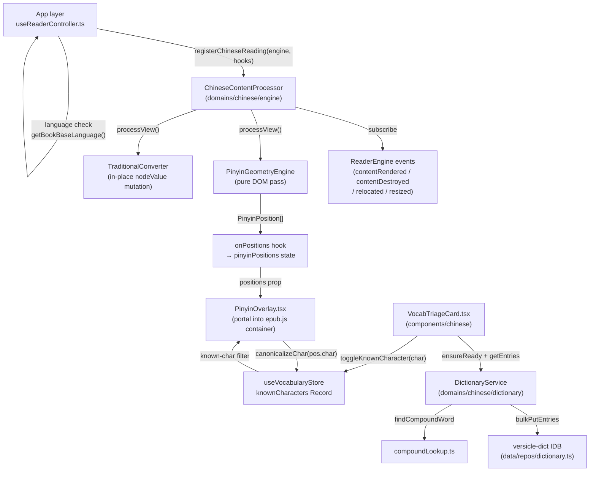
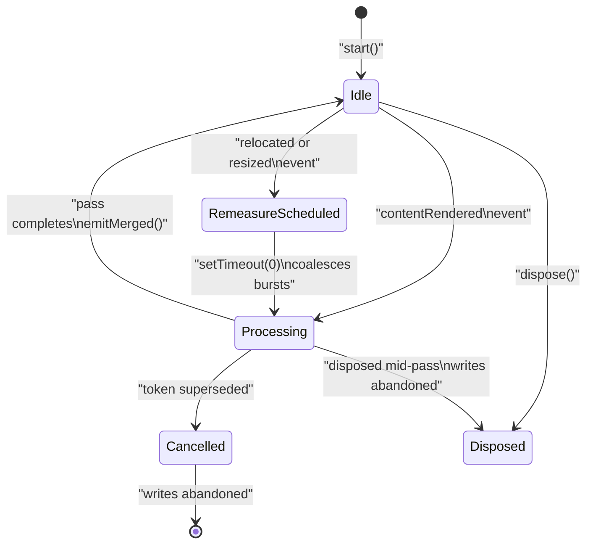
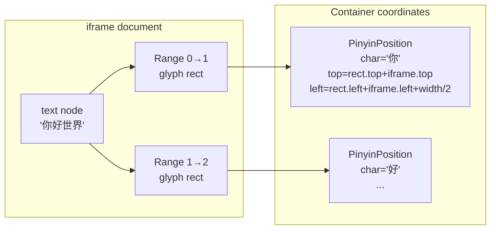
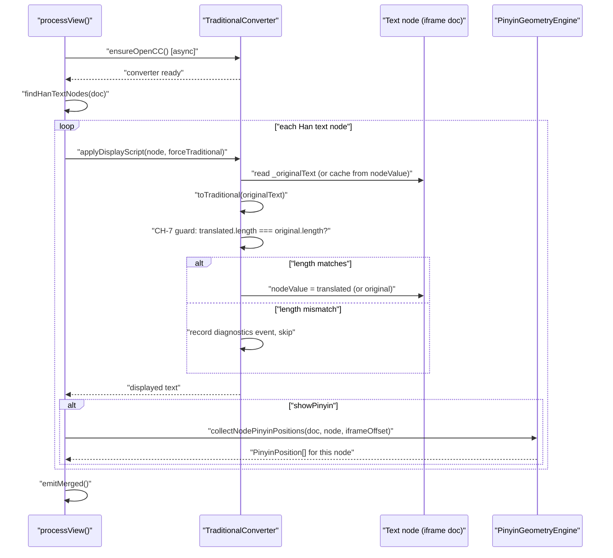
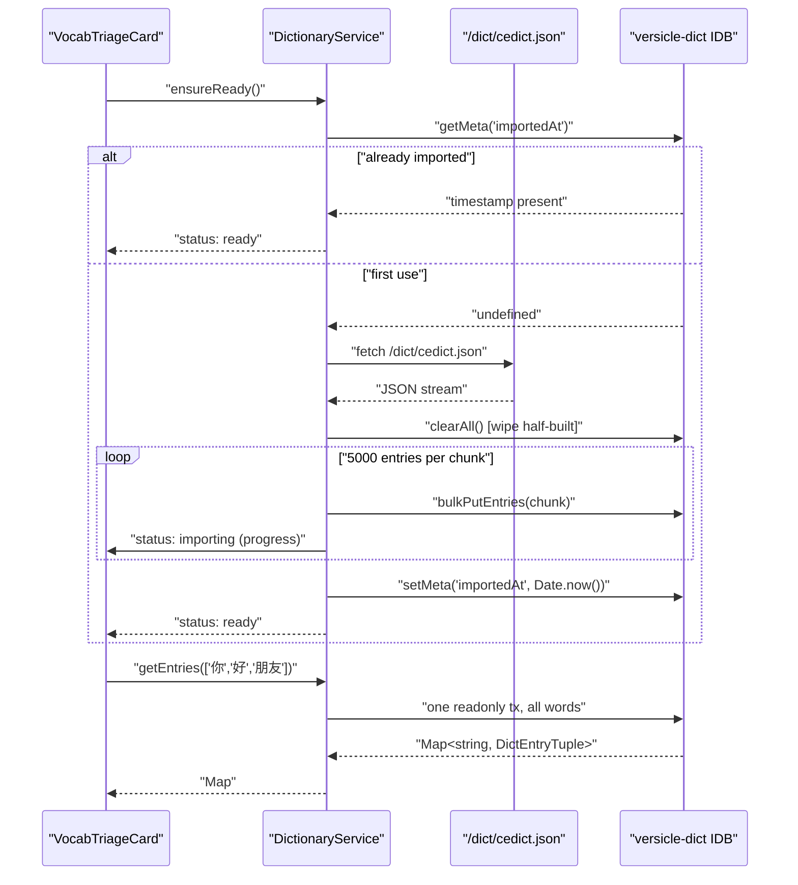
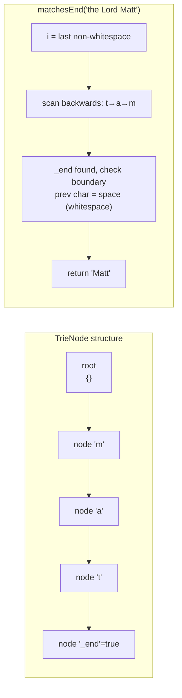
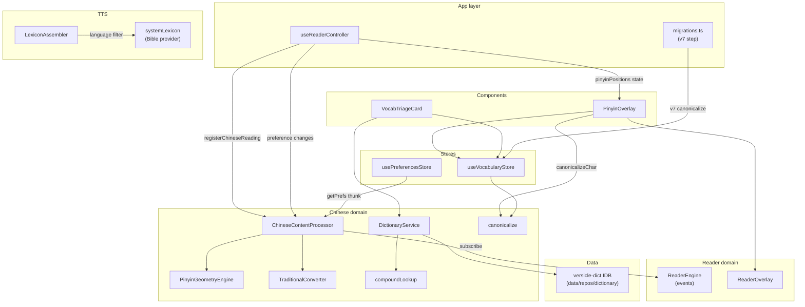

# Chinese Domain: Lexicon, Pinyin & Vocabulary

## Why this domain exists

Versicle is used as a Mandarin learning reader. Chinese EPUB books need three capabilities that no other language requires:

1. **Pinyin annotations** — per-character pronunciation guides rendered above glyph positions in the EPUB iframe, because learners who do not yet know a character need to see how it sounds.
2. **Script toggling** — on-the-fly Simplified→Traditional conversion, because readers may have a Simplified source EPUB but prefer Traditional script (or vice versa), and no re-processing should be needed.
3. **Vocabulary tracking ("Smart Pinyin")** — a synced "known characters" set that suppresses pinyin for characters the user has already mastered, so the overlay gradually recedes as fluency grows.

These three features interact at a single geometry measurement that must stay coherent across multi-section scrolled EPUB rendering, layout changes (resize, page turns), and script-toggle state. The domain also includes an offline CC-CEDICT dictionary and a compound-word lookup used by the vocabulary triage UI.

The scope is deliberately narrow: this domain does **not** own TTS pronunciation rules for Chinese text (those live in [`src/lib/tts/`](../../src/lib/tts/LexiconEngine.ts) and [`systemLexicon.ts`](../../src/lib/tts/systemLexicon.ts)), nor does it own language-activation routing (that happens in the app layer). The domain publishes a single integration seam and the app layer calls it only for Chinese books.

See also [Reader engine](30-domain-reader-engine.md), [State management](13-state-management-crdt.md), and [TTS content pipeline](34-tts-content-pipeline.md) for adjacent subsystems.

---

## Architecture overview



The module boundary is strict: `domains/chinese` exports only [`registerChineseReading`](../../src/domains/chinese/index.ts), [`getBookBaseLanguage`](../../src/domains/chinese/index.ts), `HAN_RE`, and the `PinyinPosition` type. The reader core (`domains/reader`, `hooks/useEpubReader`) has zero imports from this domain — the coupling is inverted through the `ReaderEngine`'s event stream.

---

## Module structure

| Path | Role |
|---|---|
| [`src/domains/chinese/index.ts`](../../src/domains/chinese/index.ts) | Public entry: `registerChineseReading`, `getBookBaseLanguage`, re-exports |
| [`src/domains/chinese/types.ts`](../../src/domains/chinese/types.ts) | `PinyinPosition` — the geometry contract between engine and overlay |
| [`src/domains/chinese/engine/ChineseContentProcessor.ts`](../../src/domains/chinese/engine/ChineseContentProcessor.ts) | Event-driven orchestrator; per-section position maps; cancellation tokens |
| [`src/domains/chinese/engine/PinyinGeometryEngine.ts`](../../src/domains/chinese/engine/PinyinGeometryEngine.ts) | Pure DOM pass: `findHanTextNodes`, `collectNodePinyinPositions`, `getPinyin` |
| [`src/domains/chinese/engine/TraditionalConverter.ts`](../../src/domains/chinese/engine/TraditionalConverter.ts) | `applyDisplayScript` — in-place `nodeValue` mutation with `_originalText` cache + CH-7 length guard |
| [`src/domains/chinese/dictionary/DictionaryService.ts`](../../src/domains/chinese/dictionary/DictionaryService.ts) | IDB-backed CC-CEDICT service; chunked import; status surface |
| [`src/domains/chinese/dictionary/compoundLookup.ts`](../../src/domains/chinese/dictionary/compoundLookup.ts) | `findCompoundWord` — batched ±4-char window lookup, longest hit wins |
| [`src/domains/chinese/vocabulary/canonicalize.ts`](../../src/domains/chinese/vocabulary/canonicalize.ts) | `canonicalizeChar` via committed `trad2simp.json`; `mergeCanonicalTimestamps` |
| [`src/domains/chinese/vocabulary/trad2simp.json`](../../src/domains/chinese/vocabulary/trad2simp.json) | 3,781-entry Trad→Simp lookup table, code-versioned |
| [`src/data/repos/dictionary.ts`](../../src/data/repos/dictionary.ts) | `versicle-dict` IDB database owner (`entries` + `meta` stores) |
| [`src/store/useVocabularyStore.ts`](../../src/store/useVocabularyStore.ts) | Yjs-synced `knownCharacters: Record<char, timestamp>`; all actions canonicalize |
| [`src/components/reader/PinyinOverlay.tsx`](../../src/components/reader/PinyinOverlay.tsx) | Portal overlay; known-char suppression at render time |
| [`src/components/chinese/VocabTriageCard.tsx`](../../src/components/chinese/VocabTriageCard.tsx) | Vocab-triage HUD; character tiles with dictionary data |

TTS-adjacent modules that reference Chinese but are owned by the TTS subsystem:

| Path | Role |
|---|---|
| [`src/lib/tts/LexiconEngine.ts`](../../src/lib/tts/LexiconEngine.ts) | `LexiconAssembler` — lexicon assembly with language scoping |
| [`src/lib/tts/systemLexicon.ts`](../../src/lib/tts/systemLexicon.ts) | Bible lexicon provider with `language` prefix-match filter |
| [`src/lib/tts/TextScanningTrie.ts`](../../src/lib/tts/TextScanningTrie.ts) | Suffix-tree structure used by TTS sentence-boundary detection |

---

## Feature activation

The Chinese reading feature activates per open book at the app composition layer, never inside the reader core.

```typescript
// src/app/reader/useReaderController.ts
import { registerChineseReading, getBookBaseLanguage } from '@domains/chinese';

useEffect(() => {
  if (!engine || getBookBaseLanguage(bookLanguage) !== 'zh') {
    setPinyinPositions(prev => (prev.length === 0 ? prev : []));
    return;
  }
  const registration = registerChineseReading(engine, {
    getPrefs: () => {
      const prefs = usePreferencesStore.getState();
      return {
        forceTraditionalChinese: prefs.forceTraditionalChinese,
        showPinyin: prefs.showPinyin,
      };
    },
    onPositions: (positions) => setPinyinPositions(positions),
  });
  const unsubscribePrefs = usePreferencesStore.subscribe((state, prev) => {
    if (
      state.forceTraditionalChinese !== prev.forceTraditionalChinese ||
      state.showPinyin !== prev.showPinyin ||
      state.pinyinSize !== prev.pinyinSize
    ) {
      registration.refresh();
    }
  });
  return () => {
    unsubscribePrefs();
    registration.dispose();
    setPinyinPositions(prev => (prev.length === 0 ? prev : []));
  };
}, [engine, bookLanguage]);
```

### Language normalization (CH-8 interim helper)

`getBookBaseLanguage` in [`index.ts`](../../src/domains/chinese/index.ts) extracts the BCP-47 base subtag and lowercases it:

```typescript
export function getBookBaseLanguage(language: string | null | undefined): string {
  return (language || 'en').trim().toLowerCase().split(/[-_]/)[0] || 'en';
}
```

This kills the legacy exact-match activation bug where `'zh-CN'` (a common EPUB metadata value) did not equal `'zh'`, leaving no pinyin for subtagged books. The function normalizes `'zh-CN'`, `'zh-TW'`, `'zh_TW'`, and `'ZH'` all to `'zh'`.

### Registration lifecycle

`registerChineseReading(engine, hooks)` constructs a `ChineseContentProcessor`, calls `start()`, and returns a `ChineseReadingRegistration`:

```typescript
export interface ChineseReadingRegistration {
  refresh(): void;   // Re-run the content pass (preference / language change)
  dispose(): void;   // Unsubscribe from engine and drop all positions
}
```

The app layer holds the registration for the lifetime of the open book. Preference changes — including `forceTraditionalChinese`, `showPinyin`, and `pinyinSize` — trigger `registration.refresh()` through a `usePreferencesStore.subscribe` callback.

---

## ChineseContentProcessor — event-driven orchestration

[`ChineseContentProcessor`](../../src/domains/chinese/engine/ChineseContentProcessor.ts) is the heart of the Chinese rendering pass. It was introduced to fix the legacy "god hook" design (CH-2, CH-3) where all Chinese processing ran as a closure inside `useEpubReader.ts` with no per-section keying and no relocation/resize recompute.

### Per-section position maps

The processor maintains:

```typescript
private views = new Map<string, ContentView>();
private positionsBySection = new Map<string, PinyinPosition[]>();
private tokens = new Map<string, number>();
```

When `contentRendered` fires, the view is stored under `view.sectionHref` and an async pass is launched. When the pass completes it writes to `positionsBySection.get(sectionHref)`. The merged overlay is the concatenation of all live sections' position arrays:

```typescript
private emitMerged(): void {
  const merged: PinyinPosition[] = [];
  for (const positions of this.positionsBySection.values()) {
    merged.push(...positions);
  }
  this.hooks.onPositions(merged);
}
```

This means scrolled mode — where several EPUB section iframes are stacked — produces a coherent single position array. When `contentDestroyed` fires for one section, only that section's entry is removed and the remaining sections' positions are re-merged and re-emitted.

### Per-section cancellation tokens

Each section has an integer token that increments on every new run:

```typescript
private nextToken(sectionHref: string): number {
  const next = (this.tokens.get(sectionHref) ?? 0) + 1;
  this.tokens.set(sectionHref, next);
  return next;
}
```

`processView` checks `token !== this.tokens.get(view.sectionHref)` after every `await`. A superseded run abandons its writes before they reach `positionsBySection`. Crucially, one section's token bump does not cancel a neighbor section's in-flight pass — only the stale run for the same section is abandoned.

### Event handling



`relocated` and `resized` events trigger `scheduleRemeasure()` which defers a `refresh()` call by one macrotask (`setTimeout(0)`). This coalesces bursts — epub.js can emit several `relocated` events per gesture — and lets the renderer settle its layout before geometry is re-measured.

### The content pass

`processView` is the async core:

1. Reads current prefs from `this.hooks.getPrefs()` (called at run time, never cached).
2. Pre-loads lazy dependencies: `ensureOpenCC()` if `forceTraditionalChinese`, `ensurePinyin()` if `showPinyin`. Both are idempotent.
3. Checks cancellation token after each `await`.
4. Reads iframe offsets fresh from `view.window?.frameElement` (in scrolled mode the offsets shift as neighbor sections load/unload).
5. Iterates `findHanTextNodes(doc)`.
6. For each Han text node: `applyDisplayScript(textNode, prefs.forceTraditionalChinese)` then, if `showPinyin`, `collectNodePinyinPositions(doc, textNode, iframeOffset)`.
7. Checks cancellation again before writing to `positionsBySection`.

---

## PinyinGeometryEngine — pure DOM measurement

[`PinyinGeometryEngine.ts`](../../src/domains/chinese/engine/PinyinGeometryEngine.ts) is a stateless module that takes DOM nodes and produces `PinyinPosition` objects. No store imports, no epub.js imports.

### The Han regex

```typescript
export const HAN_RE = /\p{Script=Han}/u;
```

This is the full Unicode script property, not the BMP block range `[一-鿿]`. The BMP-only version misses CJK Extension B+ characters (code points U+20000 and above), which appear in real EPUB books and are represented as surrogate pairs in UTF-16. The `u` flag enables Unicode property escapes.

### Lazy pinyin-pro loading

```typescript
let pinyinFn: PinyinFn | null = null;

export async function ensurePinyin(): Promise<void> {
  if (!pinyinFn) {
    pinyinFn = (await import('pinyin-pro')).pinyin;
  }
}

export function getPinyin(text: string): string[] {
  if (!pinyinFn) throw new Error('Pinyin module not loaded. Call ensurePinyin() first.');
  return pinyinFn(text, { type: 'array', toneType: 'symbol' });
}
```

`pinyin-pro` is a large dictionary package. The two-phase API (`ensureX` async / function sync) means the module is loaded once and thereafter all geometry calls are synchronous — important because `collectNodePinyinPositions` must not `await` between DOM Range reads.

`getPinyin` is typed against the real package types (fixing CH-11, where the legacy wrapper used `any`).

### Code-point safety (CH-1 fix)

The original implementation iterated `text` by UTF-16 code unit, while `pinyin-pro` with `{type:'array'}` returns one entry per Unicode code point. For text containing astral-plane Han (CJK Extension B, e.g. 𠀀 which is U+20000, encoded as two UTF-16 code units `[D840, DC00]`), the old loop produced misaligned pinyin starting from the first surrogate pair.

The fix: iterate code points with `Array.from(currentText)` and maintain a separate code-unit cursor for `Range.setStart`/`Range.setEnd`:

```typescript
export function collectNodePinyinPositions(
  doc: Document,
  textNode: Text,
  iframeOffset: { top: number; left: number },
): PinyinPosition[] {
  const positions: PinyinPosition[] = [];
  const currentText = textNode.nodeValue || '';
  const pinyinArray = getPinyin(currentText);
  const codePoints = Array.from(currentText); // one entry per code point

  let unit = 0; // UTF-16 code-unit cursor
  for (let cp = 0; cp < codePoints.length; cp++) {
    const char = codePoints[cp];
    if (HAN_RE.test(char) && pinyinArray[cp]) {
      try {
        const range = doc.createRange();
        range.setStart(textNode, unit);         // code-unit offset
        range.setEnd(textNode, unit + char.length); // char.length = 1 BMP, 2 astral
        const rect = range.getBoundingClientRect();
        if (rect.width > 0 && rect.height > 0) {
          positions.push({
            char,
            pinyin: pinyinArray[cp],
            top: rect.top + iframeOffset.top,
            left: rect.left + iframeOffset.left + rect.width / 2, // character center
            width: rect.width,
            height: rect.height,
          });
        }
      } catch {
        // Range errors can happen during rapid updates
      }
    }
    unit += char.length; // advance by code-unit width (1 or 2)
  }
  return positions;
}
```

`unit` advances by `char.length`, which is `2` for astral code points (surrogate pairs). This keeps the `Range` offsets perfectly aligned with their code-unit positions in the DOM while keeping `pinyinArray[cp]` aligned with the code-point index.

### PinyinPosition type

Defined in [`types.ts`](../../src/domains/chinese/types.ts):

```typescript
export interface PinyinPosition {
  char: string;     // The Han code point (may be 2 UTF-16 units for astral)
  pinyin: string;   // Tone-marked pinyin string, e.g. "nǐ"
  top: number;      // Container-relative top (iframe offset included)
  left: number;     // Character center x in container coordinates
  width: number;    // Glyph width in pixels
  height: number;   // Glyph height in pixels
}
```

`left` is the character center, not the left edge; the overlay renders each span with `transform: translate(-50%, -100%)` to center it above the glyph.



### Text node discovery

```typescript
export function findHanTextNodes(doc: Document): Text[] {
  const walker = doc.createTreeWalker(doc.body, NodeFilter.SHOW_TEXT);
  const textNodes: Text[] = [];
  let node: Text | null;
  while ((node = walker.nextNode() as Text)) {
    if (!node.textContent || !HAN_RE.test(node.textContent)) continue;
    const parent = node.parentElement;
    if (!parent || parent.tagName === 'RT' || parent.tagName === 'RUBY') continue;
    textNodes.push(node);
  }
  return textNodes;
}
```

The `<RT>` and `<RUBY>` exclusion is important: EPUB books that already carry ruby annotations embed the pronunciation in `<rt>` elements. Double-processing these would produce duplicate pinyin in a different format.

---

## TraditionalConverter — script toggling

[`TraditionalConverter.ts`](../../src/domains/chinese/engine/TraditionalConverter.ts) provides on-the-fly Simplified→Traditional conversion using [opencc-js](https://github.com/nk2028/opencc-js).

### Lazy loading

```typescript
let converter: OpenCCConverter | null = null;

export async function ensureOpenCC(): Promise<void> {
  if (!converter) {
    const OpenCC = await import('opencc-js');
    converter = OpenCC.Converter({ from: 'cn', to: 'tw' });
  }
}
```

The `cn→tw` direction is the precise pairing Versicle uses. The Traditional→Simplified table in [`trad2simp.json`](../../src/domains/chinese/vocabulary/trad2simp.json) inverts exactly this direction (see Vocabulary section below).

### In-place mutation with original-text cache

`applyDisplayScript` mutates `textNode.nodeValue` directly. This preserves DOM structure, and therefore every CFI address and TTS range computed against the document. The function caches the original text as an expando property `_originalText` on the text node so it can round-trip:

```typescript
interface CachedTextNode extends Text {
  _originalText?: string | null;
}

export function applyDisplayScript(textNode: Text, forceTraditional: boolean): string {
  const cached = textNode as CachedTextNode;
  if (!cached._originalText) {
    cached._originalText = textNode.nodeValue;
  }
  const originalText = cached._originalText || '';

  if (forceTraditional) {
    const translated = toTraditional(originalText);
    // CH-7 guard: skip if length changes
    if (translated.length !== originalText.length) {
      traditionalGuardRecorder.record('chinese', 'traditional-length-mismatch', { ... });
      if (textNode.nodeValue !== originalText) textNode.nodeValue = originalText;
      return originalText;
    }
    if (textNode.nodeValue !== translated) textNode.nodeValue = translated;
    return translated;
  }

  if (textNode.nodeValue !== originalText) textNode.nodeValue = originalText;
  return originalText;
}
```

### CH-7 length guard

The conversion is applied **only** when the result has the same number of code units as the original. The opencc `cn→tw` mode is single-character substitution by design, so length changes should not occur — but if a library upgrade or configuration change ever produced a length-changing result, every Range offset, CFI, and TTS word boundary computed against the displayed text would silently shift. The guard skips the node and records a `RingRecorder` event for diagnostics instead of corrupting offsets.

The length check is on `.length` (UTF-16 code-unit count), which is what `Range.setStart` offsets use, so the invariant is exactly the right one for protecting range arithmetic.

### Traditional conversion flow



---

## Dictionary Service — CC-CEDICT via IndexedDB

### Design intent

The legacy implementation (`useChineseDictionary.ts`) fetched `/dict/cedict.json` — a 14 MB JSON blob — into a module-level global on any selection containing a CJK character. The retained heap was approximately 80 MB, the fetch was not offline-capable, and errors were logged but never surfaced to the user (CH-5, CH-13).

The replacement ([`DictionaryService.ts`](../../src/domains/chinese/dictionary/DictionaryService.ts)) is an IDB-backed service:

- First use streams `/dict/cedict.json` into the `versicle-dict` IndexedDB database in chunked bulk-put transactions (`IMPORT_CHUNK_SIZE = 5000` entries per chunk).
- Subsequent sessions detect the `importedAt` meta stamp and skip the fetch entirely.
- The database is a separate IDB database (`versicle-dict`), not a new store in `EpubLibraryDB`, because the dictionary is rebuildable static content with no user-data coupling.
- Import progress is exposed as a typed status stream: `'empty' | 'importing' | 'ready' | 'error'`.
- A failed import resets `readyPromise` to `null` so a later call can retry.



### Database schema

[`src/data/repos/dictionary.ts`](../../src/data/repos/dictionary.ts) owns the `versicle-dict` IDB database:

```typescript
interface DictDB extends DBSchema {
  entries: { key: string; value: DictEntryTuple };
  meta:    { key: string; value: unknown };
}
export type DictEntryTuple = [string, string]; // [pinyin, definitions]
```

The `entries` object store is keyed by headword (simplified or traditional). The `meta` store holds provenance: `importedAt` (timestamp), `entryCount`, and optionally a `source` object from `/dict/cedict.meta.json`.

### Batch lookup

```typescript
async getEntries(words: readonly string[]): Promise<Map<string, DictEntryTuple>> {
  return dictionary.getEntries(words);
}
```

`dictionary.getEntries` opens a single readonly IDB transaction and fires all lookups in parallel via `Promise.all`. The result is a `Map` — absent words are simply not in the map.

### Compound word lookup

```typescript
async getCompound(text: string, charIndex: number): Promise<CompoundHit | null> {
  return findCompoundWord(text, charIndex, (words) => dictionary.getEntries(words));
}
```

This delegates to `compoundLookup.ts`, injecting the IDB lookup as a callback. The `DictionaryService` itself is accessible lazily:

```typescript
let singleton: DictionaryService | null = null;
export function getDictionaryService(): DictionaryService {
  singleton ??= new DictionaryService();
  return singleton;
}
```

No module-scope construction — the instance is created on first call (boundary rule: no side effects at import time).

---

## Compound Word Lookup

[`compoundLookup.ts`](../../src/domains/chinese/dictionary/compoundLookup.ts) resolves the longest dictionary compound covering a tapped character.

### Candidate generation

`compoundCandidates(text, charIndex)` generates all multi-character windows extending up to 4 code points left and 4 code points right of the focused character:

```typescript
export function compoundCandidates(text: string, charIndex: number): string[] {
  const chars = Array.from(text); // code-point array (CH-1 consistency)
  const candidates: string[] = [];
  for (let start = Math.max(0, charIndex - 4); start <= charIndex; start++) {
    for (let end = charIndex + 1; end <= Math.min(chars.length, charIndex + 5); end++) {
      const substring = chars.slice(start, end).join('');
      if (Array.from(substring).length > 1) {
        candidates.push(substring);
      }
    }
  }
  return candidates;
}
```

Windows are code-point windows (`Array.from`), consistent with the CH-1 fix throughout the domain. Astral Han or emoji in the selection never slices through surrogate pairs.

### Resolution

`findCompoundWord` issues a single batched lookup over the unique candidates, then picks the longest dictionary hit:

```typescript
export async function findCompoundWord(
  text: string,
  charIndex: number,
  lookup: (words: readonly string[]) => Promise<Map<string, DictEntryTuple>>,
): Promise<CompoundHit | null> {
  const candidates = compoundCandidates(text, charIndex);
  if (candidates.length === 0) return null;
  const entries = await lookup([...new Set(candidates)]);

  let best: CompoundHit | null = null;
  let bestLength = 1;
  for (const candidate of candidates) {
    const entry = entries.get(candidate);
    if (!entry) continue;
    const length = Array.from(candidate).length;
    if (length > bestLength) {
      bestLength = length;
      best = { word: candidate, pinyin: entry[0], definition: entry[1] };
    }
  }
  return best;
}
```

The tie-breaking rule is "earliest start": the candidate iteration order is `start asc, end asc`, so when two windows of equal length both have a dictionary entry, the one with the earlier start position wins. This is a deliberate preservation of the legacy `getCompoundWord` behavior.

---

## Vocabulary Store and Canonicalization

### Store shape

[`useVocabularyStore.ts`](../../src/store/useVocabularyStore.ts) is a Zustand store synchronized via Yjs CRDT:

```typescript
export interface VocabularyState {
  knownCharacters: Record<string, number>; // char → timestamp
  toggleKnownCharacter: (char: string) => void;
  markAsKnown: (char: string) => void;
  markAsUnknown: (char: string) => void;
  clearAll: () => void;
}
```

`knownCharacters` is a flat `Record<string, number>` where keys are **simplified** single characters and values are Unix timestamps. The shape enables O(1) lookup for the overlay filter and is conflict-free under Yjs CRDT merge (last-writer-wins on the same key).

### The CH-6 vocabulary key split problem

Before Phase 6, `knownCharacters` keys were whatever character was *displayed*. With `forceTraditionalChinese` on, triage stored traditional keys (`紅`); with it off, simplified keys (`红`). The overlay filter compared against the displayed character exactly. Toggling the script mode silently broke all suppression — the character was stored under one script's key and the overlay looked up the other. The same character could exist under two keys.

The fix operates at three layers:

1. **Write path**: every store action wraps the input in `canonicalizeChar(char)`.
2. **Read path**: `PinyinOverlay` and `VocabTriageCard` both call `canonicalizeChar(pos.char)` before the `knownCharacters` lookup.
3. **CRDT v7 migration**: rewrites all pre-existing keys to simplified form once, deterministically.

### The trad2simp table

[`trad2simp.json`](../../src/domains/chinese/vocabulary/trad2simp.json) is a committed, code-versioned artifact generated by `scripts/generate-trad2simp.mjs`. Its metadata:

```json
{
  "generator": "scripts/generate-trad2simp.mjs",
  "source": "opencc-js@1.0.5 bundled dictionaries (cn↔tw)",
  "license": "Apache-2.0 (OpenCC dictionary data)",
  "entryCount": 3781,
  "fromInverseOfDisplayMapping": 2741,
  "fromDirectTw2Cn": 1038,
  "chainResolved": 4,
  "displayClosureAdded": 1
}
```

The table is the inverse of the exact `cn→tw` mapping that `TraditionalConverter` uses for display. This is critical: `canonicalizeChar(toTraditional(simplified))` must return `simplified` for any character the reader might display. The test in `canonicalize.test.ts` verifies this round-trip over the full table with `displayPairs > 2000`.

Single-character scope is important: the triage UI shows and stores single characters, so a full async OpenCC converter is unnecessary at the store boundary.

```typescript
const TABLE = trad2simp as Record<string, string>;

export function canonicalizeChar(char: string): string {
  return TABLE[char] ?? char;
}
```

Non-Han characters, already-simplified characters, and characters not in the table are passed through as-is.

### CRDT v7 migration

[`src/app/migrations.ts`](../../src/app/migrations.ts) step `from: 6, to: 7` rewrites all traditional keys to simplified in the live Yjs document:

```typescript
const canonicalizeVocabularyKeys = (doc: Y.Doc): void => {
  const knownCharacters = doc.getMap('vocabulary').get('knownCharacters');
  if (!(knownCharacters instanceof Y.Map)) return;

  for (const key of [...knownCharacters.keys()].sort()) {
    const canonical = canonicalizeChar(key);
    if (canonical === key) continue;
    const merged = mergeCanonicalTimestamps(
      knownCharacters.get(canonical),
      knownCharacters.get(key),
    );
    if (merged !== undefined && knownCharacters.get(canonical) !== merged) {
      knownCharacters.set(canonical, merged);
    }
    knownCharacters.delete(key);
  }
};
```

When both `紅` (traditional) and `红` (simplified) exist — created by toggling scripts before the migration — they merge under the simplified key using `Math.min` of their timestamps ("earliest knowledge wins"). The migration is deterministic (sorted iteration, code-versioned table) and idempotent (canonical keys map to themselves), so concurrent migrations on two clients converge to the same result.

---

## Pinyin Overlay — rendering

[`PinyinOverlay.tsx`](../../src/components/reader/PinyinOverlay.tsx) renders the pinyin annotations as absolutely-positioned `<span>` elements portaled into the epub.js scroll container.

### Known-character suppression

The filter runs at render time, not at geometry-collection time:

```typescript
positions
  .filter(pos => !knownCharacters[canonicalizeChar(pos.char)])
  .map((pos, idx) => (
    <span
      key={`${pos.char}-${idx}`}
      className="absolute text-muted-foreground whitespace-nowrap font-pinyin"
      style={{
        top: pos.top - 2,
        left: pos.left,
        transform: 'translate(-50%, -100%)',
        fontSize: `${0.7 * (pinyinSize / 100)}rem`,
        lineHeight: 1,
        textShadow: `0 0 2px ${shadowColor}, 0 0 4px ${shadowColor}`,
      }}
    >
      {pos.pinyin}
    </span>
  ))
```

This is the "genuinely elegant design" noted in the analysis: vocabulary toggles are instant (just a React re-render of the filter result) and never trigger geometry recomputation or any interaction with the EPUB iframe.

The `canonicalizeChar(pos.char)` call on the read path handles the case where Traditional display mode has mutated the character in the DOM — the pinyin position's `char` field reflects the displayed character, which may be traditional, but the vocabulary key is always simplified.

### Portal target

The overlay uses `ReaderOverlay` from [`src/domains/reader/ui/ReaderOverlay`](../../src/domains/reader/ui/ReaderOverlay.tsx) with `mode="decorative"`, portaling into the `containerNode` — the epub.js rendition manager's scroll container. This ensures pinyin scrolls in lockstep with the text at native frame rates without interfering with text selection, CFI computation, or TTS highlighting.

### Theme-aware shadow

The text-shadow color is derived from the current reader theme to ensure readability on any background:

| Theme | Shadow color |
|---|---|
| `light` (default) | `#ffffff` |
| `dark` | `#1a1a1a` |
| `sepia` | `#f4ecd8` |
| `custom` | `customTheme.bg` |

---

## VocabTriageCard — vocabulary management UI

[`VocabTriageCard.tsx`](../../src/components/chinese/VocabTriageCard.tsx) is the vocabulary triage HUD, extracted from `CompassPill.tsx` in Phase 6 (CH-4).

It lives under `src/components/` (not `src/domains/chinese/`) because it reads/writes `useVocabularyStore` and `useReaderUIStore` — direct store access that the `domains-no-store` boundary forbids inside the domain.

### Dictionary load trigger

The dictionary import is gated on triage open (the `VocabTriageCard` mount), not on any CJK selection:

```typescript
useEffect(() => {
  let cancelled = false;
  const service = getDictionaryService();
  const unsubscribe = service.subscribe((progress) => {
    if (!cancelled) setDictStatus(progress.status);
  });

  (async () => {
    try {
      await service.ensureReady();
      // ... batched lookup
    } catch (error) {
      logger.warn('Dictionary unavailable for triage', error);
    }
  })();

  return () => { cancelled = true; unsubscribe(); };
}, [text]);
```

The status surface is visible to the user:

- `importing`: shows "Preparing dictionary…"
- `error`: shows "Dictionary unavailable — definitions are hidden, toggling still works."

This kills CH-13 (silent failure): vocabulary toggling is always functional even if the dictionary fetch fails, and the user knows why definitions are absent.

### Batched lookup and compound resolution

On mount, the card:
1. Calls `service.ensureReady()` to gate on dictionary availability.
2. Collects unique Han characters from the selected text.
3. Calls `service.getEntries(hanChars)` — one IDB transaction.
4. For each character position, calls `service.getCompound(text, index)` to find the best multi-character dictionary entry covering that character.

The compound lookup is per-position, which means multiple `getCompound` calls. Each issues its own batched IDB read (a single `getEntries` over all candidates in the ±4 window), so the total IDB traffic is bounded by `O(hanCharCount * windowSize)`.

### VocabTile

Each Chinese character in the selection gets a `VocabTile`: a button showing the character and its pinyin. Tapping toggles `useVocabularyStore.toggleKnownCharacter(char)`. A checkmark badge appears on known tiles. An `[i]` button opens a `Popover` with the standalone definition and the best compound hit.

The `isKnown` check canonicalizes before lookup:

```typescript
const isKnown = !!knownCharacters[canonicalizeChar(char)];
```

Non-Han characters (punctuation, spaces) render as flat grey spans, preserving the selection's visual shape.

---

## Preferences for Chinese reading

Device-scoped Chinese preferences live in [`usePreferencesStore.ts`](../../src/store/usePreferencesStore.ts):

| Key | Type | Default | Description |
|---|---|---|---|
| `forceTraditionalChinese` | `boolean` | `false` | Trigger TraditionalConverter for all Han text nodes |
| `showPinyin` | `boolean` | `false` | Enable pinyin geometry collection and overlay |
| `pinyinSize` | `number` | `100` | Overlay font size as a percentage of base |
| `fontProfiles.zh` | `FontProfile` | `{ fontSize: 120, lineHeight: 1.8 }` | Per-language font profile; `zh` default applies 120% size and 1.8 line height |

The `fontProfiles.zh` default (`lineHeight: 1.8`) reserves vertical space for the pinyin spans. All three Chinese prefs are synced via Yjs CRDT to `preferences/<deviceId>` (device-scoped: different devices may have different script preferences).

Changes to `forceTraditionalChinese`, `showPinyin`, and `pinyinSize` trigger `registration.refresh()` via the `usePreferencesStore.subscribe` callback in `useReaderController`.

---

## LexiconEngine and Bible Lexicon — TTS integration

The Chinese domain's vocabulary concerns only visual rendering. TTS pronunciation for Chinese is handled by the adjacent TTS subsystem through language-scoped lexicon rules.

### LexiconAssembler

[`LexiconEngine.ts`](../../src/lib/tts/LexiconEngine.ts) assembles the rule set for a `(bookId, language)` pair. Assembly order is fixed:

1. High-priority book rules (`applyBeforeGlobal === true`)
2. Global rules (sorted by `order`)
3. System rules (Bible lexicon, if applicable)
4. Standard book rules

```typescript
private async assemble(bookId, language, version): Promise<CompiledLexicon> {
  // ...
  const rules = Object.freeze([...highPriority, ...globalRules, ...systemRules, ...lowPriority]);
  return { rules, version, language };
}
```

Language filtering uses the expression:

```typescript
const byLanguage = (r: LexiconRule) =>
  !r.language || !language || r.language === language;
```

A rule without a `language` field always applies. A request without a language matches everything. Otherwise an exact match is required. For Chinese books (`language: 'zh'`), only rules with `language: 'zh'` (or no language) are included.

### Bible lexicon and Chinese books

[`systemLexicon.ts`](../../src/lib/tts/systemLexicon.ts) provides the Bible lexicon with a prefix-match filter:

```typescript
.filter(r => !r.language || !language ||
  language.toLowerCase().startsWith(r.language.toLowerCase()))
```

A Bible rule with `language: 'zh'` applies to `'zh'`, `'zh-TW'`, `'zh-CN'`, etc. Rules with no language apply to all books, including Chinese ones. The `BiblePreference` per-book flag (`'on' | 'off' | 'default'`) lets users opt Chinese EPUB bibles into or out of the Bible lexicon. Many Chinese Christian EPUBs have embedded book-name abbreviations that need TTS expansion — this is exactly the use case.

### TextScanningTrie

[`TextScanningTrie.ts`](../../src/lib/tts/TextScanningTrie.ts) is a specialized trie for fast case-insensitive suffix/prefix matching without string allocations. It is used by the TTS sentence segmentation pipeline for Bible book-name abbreviation detection (e.g. recognizing that a sentence ends with "Matt" and should not be split there).

The trie operates on UTF-16 code units (via `charCodeAt`) with manual ASCII case-folding and a Map-based cache for non-ASCII folding. It does not claim to handle Han characters specially — it is designed for Latin abbreviations in the Bible lexicon context. The static punctuation lookup table (`Uint8Array(128)`) covers ASCII punctuation including `()[]<>{}"';:.-,!?/`.



---

## Testing strategy

The Chinese domain has full unit test coverage for every component:

| Test file | What it covers |
|---|---|
| [`PinyinGeometryEngine.test.ts`](../../src/domains/chinese/engine/PinyinGeometryEngine.test.ts) | BMP alignment, CH-1 astral-Han fix, emoji non-interference, `HAN_RE` coverage, ruby node exclusion |
| [`TraditionalConverter.test.ts`](../../src/domains/chinese/engine/TraditionalConverter.test.ts) | `_originalText` round-trip, CH-7 length guard, guard + restore, throw-before-load |
| [`ChineseContentProcessor.test.ts`](../../src/domains/chinese/engine/ChineseContentProcessor.test.ts) | CH-2 matrix: multi-section merge, `contentDestroyed` invalidation, resize/relocated recompute, preference refresh, cancellation token, dispose cleanup |
| [`compoundLookup.test.ts`](../../src/domains/chinese/dictionary/compoundLookup.test.ts) | Window generation, code-point safety, longest hit, batched lookup, legacy tie-break |
| [`DictionaryService.test.ts`](../../src/domains/chinese/dictionary/DictionaryService.test.ts) | IDB import, idempotency, retryable error, batched `getEntries`, compound resolution |
| [`canonicalize.test.ts`](../../src/domains/chinese/vocabulary/canonicalize.test.ts) | `canonicalizeChar` correctness, table invariants (single-code-point keys/values), display round-trip invariant, `mergeCanonicalTimestamps`, store write-path integration |
| [`index.test.ts`](../../src/domains/chinese/index.test.ts) | `getBookBaseLanguage` normalization |

The geometry engine tests use a synthetic jsdom Range fixture (real layout is unavailable in jsdom) where each UTF-16 code unit advances 10 pixels. This allows exact offset arithmetic to be pinned as assertions.

---

## Key invariants and edge cases

### Invariant 1: Length-preserving Traditional conversion

OpenCC `cn→tw` in single-character mode must not change the code-unit length of any converted string. `TraditionalConverter` enforces this at runtime via the CH-7 guard. The `trad2simp.json` table enforces it statically: every entry is a single code point to a single code point, verified by `canonicalize.test.ts`:

```typescript
it('every key and value is exactly ONE code point', () => {
  for (const [trad, simp] of Object.entries(table)) {
    expect(Array.from(trad).length).toBe(1);
    expect(Array.from(simp).length).toBe(1);
  }
});
```

### Invariant 2: Suppression round-trip

For any simplified character in the vocabulary store, the overlay must suppress it whether displayed in Simplified or Traditional mode. The round-trip invariant:

`canonicalizeChar(toTraditional(simplified)) === simplified`

This is verified by `canonicalize.test.ts`'s display-round-trip test over more than 2,000 character pairs.

### Invariant 3: Single batched IDB lookup per compound resolution

`findCompoundWord` deduplicates candidates and issues exactly one `lookup` call:

```typescript
const entries = await lookup([...new Set(candidates)]);
```

The test pins this:

```typescript
it('issues ONE batched lookup over unique candidates', async () => {
  let calls = 0;
  const lookup = async (words) => { calls += 1; return ... };
  await findCompoundWord('我们是朋友', 3, lookup);
  expect(calls).toBe(1);
});
```

### Invariant 4: Per-section cancellation does not cross sections

Token bumps for one section never cancel a neighbor section's in-flight pass. The token map is `Map<sectionHref, number>` and each section has an independent counter.

### Invariant 5: Positions are stable-identity if empty

`useReaderController` guards against churn when positions are already empty:

```typescript
setPinyinPositions(prev => (prev.length === 0 ? prev : []));
```

This prevents unnecessary re-renders of `PinyinOverlay` when a non-Chinese book is open.

### Edge case: Disposal mid-pass

`processView` checks `this.disposed` after every `await`. If `dispose()` is called before an async pass completes, the pass's writes are abandoned and `onPositions` is never called with stale data.

### Edge case: Sections rendered before registration

`start()` calls `engine.getContentViews()` to process views already rendered before the processor subscribed. This handles the case where the Chinese feature is registered after the reader has already loaded the first section.

```typescript
start(): void {
  // ...
  for (const view of this.engine.getContentViews()) {
    this.adoptView(view);
  }
  this.refresh();
}
```

---

## Failure modes and diagnostics

### Dictionary import failure

`DictionaryService` sets `status: 'error'` and exposes the error message in `DictionaryProgress.error`. The component shows a fallback notice. The `readyPromise` is reset to `null` so subsequent calls can retry.

A half-built import (crash mid-stream) is cleaned up by `dictionary.clearAll()` before the fresh import begins.

### Traditional conversion guard violations

The `traditionalGuardRecorder` is a `RingRecorder<'chinese'>` with capacity 100. Violations are visible in the diagnostics ring at namespace `'chinese'`. The event shape is:

```typescript
traditionalGuardRecorder.record('chinese', 'traditional-length-mismatch', {
  originalLength: number,
  translatedLength: number,
});
```

### Pinyin module not loaded

If `getPinyin` or `toTraditional` is called before their respective `ensure*` functions resolve, they throw immediately:

```
Error: Pinyin module not loaded. Call ensurePinyin() first.
Error: OpenCC module not loaded. Call ensureOpenCC() first.
```

These are programming errors (the content pass always calls `ensureX` before the DOM loop). The error message includes the correct fix.

### Range errors during rapid updates

`collectNodePinyinPositions` catches all Range exceptions silently:

```typescript
try {
  const range = doc.createRange();
  // ...
} catch {
  // Range errors can happen during rapid updates
}
```

Rapid preference changes, navigations, or iframe teardowns can produce stale text node references. The outer cancellation token ensures that stale results are abandoned anyway.

---

## Cross-domain integration map



The Chinese domain depends on:
- `@domains/reader/engine/ReaderEngine` (event types and `ContentView` shape) — read-only dependency through the event bus
- `@data/repos/dictionary` — the IDB database repo
- `@kernel/diagnostics/ringRecorder` — diagnostics ring for CH-7 events
- `@lib/logger` — structured logging
- `opencc-js` and `pinyin-pro` — loaded lazily via dynamic `import()`

The Chinese domain is **not depended on** by `domains/reader` or `hooks/useEpubReader`. All coupling flows from the app layer downward.

---

## Phase history and issue ledger

The current implementation is the result of Phase 6 §7 of the overhaul program (prep doc: `prep/phase6-reader-engine.md`, PRs PR-10 through PR-13). Each PR resolved one or more numbered issues from the pre-overhaul analysis (`plan/overhaul/analysis/chinese.md`):

| Issue | Severity | Status | Fix |
|---|---|---|---|
| CH-1: Pinyin misalignment for astral Han | High | Fixed (PR-10) | Code-point iteration + parallel unit cursor in `PinyinGeometryEngine` |
| CH-2: Overlay lifecycle incidental | High | Fixed (PR-10) | Per-section `Map`; `relocated`/`resized` recompute; coalesced via `scheduleRemeasure` |
| CH-3: Engine welded inside god hook | High | Fixed (PR-10) | `ChineseContentProcessor` extracted; reader has zero imports from domain |
| CH-4: Vocab-triage inside CompassPill | High | Fixed (PR-11) | `VocabTriageCard` extracted to `components/chinese/` |
| CH-5: 14 MB JSON in git, ~80 MB heap | High | Fixed (PR-11) | `DictionaryService` with IDB import; SW-cached; triggered on triage open only |
| CH-6: Traditional/simplified key split | Medium | Fixed (PR-13) | `canonicalizeChar` at write + read; CRDT v7 migration |
| CH-7: Length-changing conversion hazard | Medium | Fixed (PR-10) | `translated.length === originalText.length` guard + diagnostics |
| CH-8: Language normalization split | Medium | Fixed (PR-10) | `getBookBaseLanguage` helper; registration gated on base subtag `'zh'` |
| CH-9: Zero behavioral tests | Medium | Fixed (PR-10–13) | Full unit suites for every extracted component |
| CH-11: `any`-typed seams | Low | Fixed (PR-10) | `pinyin-pro` typed against real package types; `PinyinPosition` shared type |
| CH-13: Silent dictionary failure | Low | Fixed (PR-11) | `status` surface; error toast in `VocabTriageCard` |

Issues CH-10 (dead code `script-loader.ts`, unshipped Character Vault) and CH-12 (build pipeline hygiene) were noted but left to later phases.

For the full overhaul context, see [Overhaul history](80-overhaul-history.md) and the plan at [`plan/overhaul/README.md`](../../plan/overhaul/README.md).
