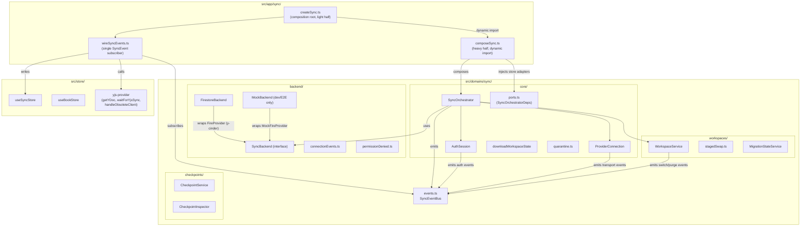
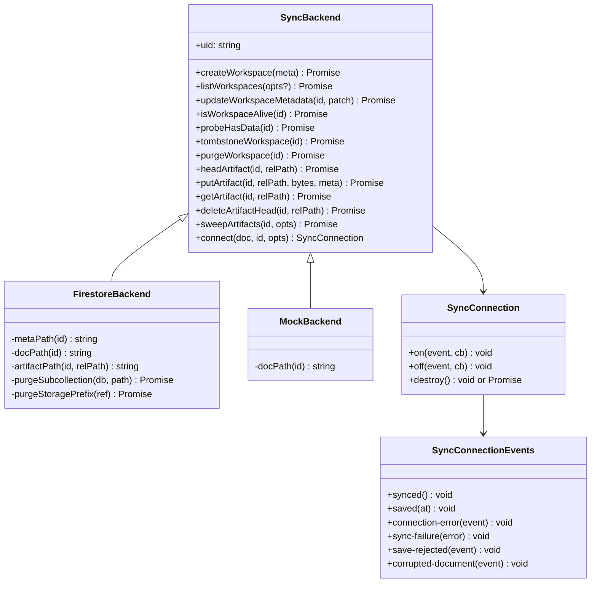
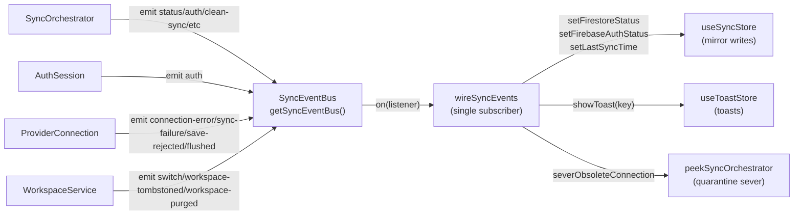
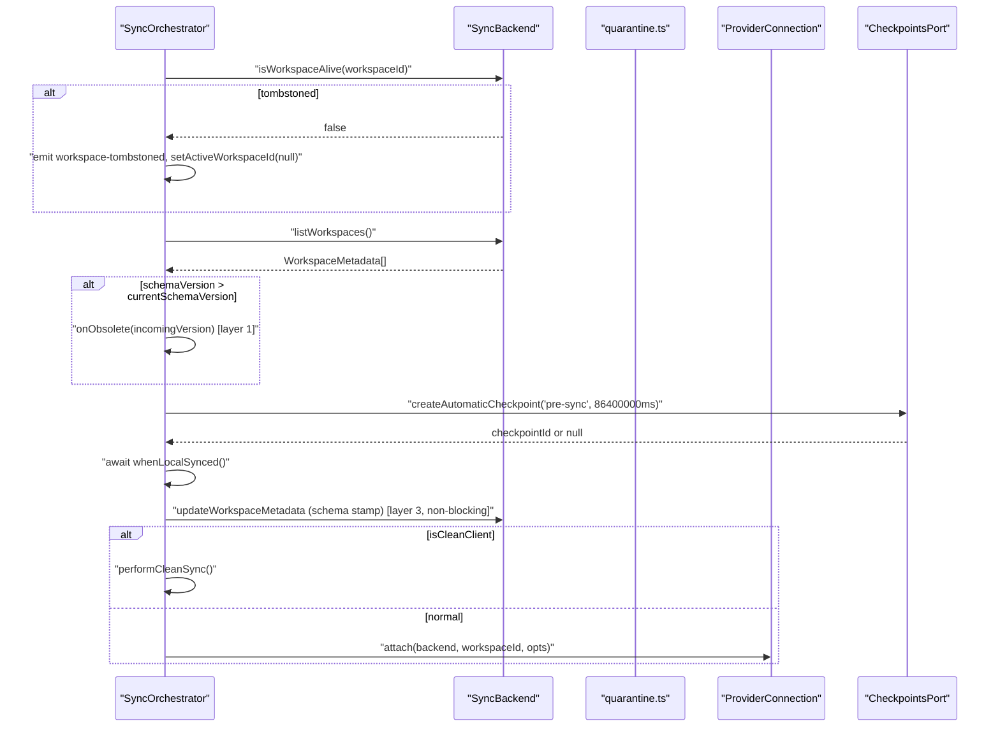
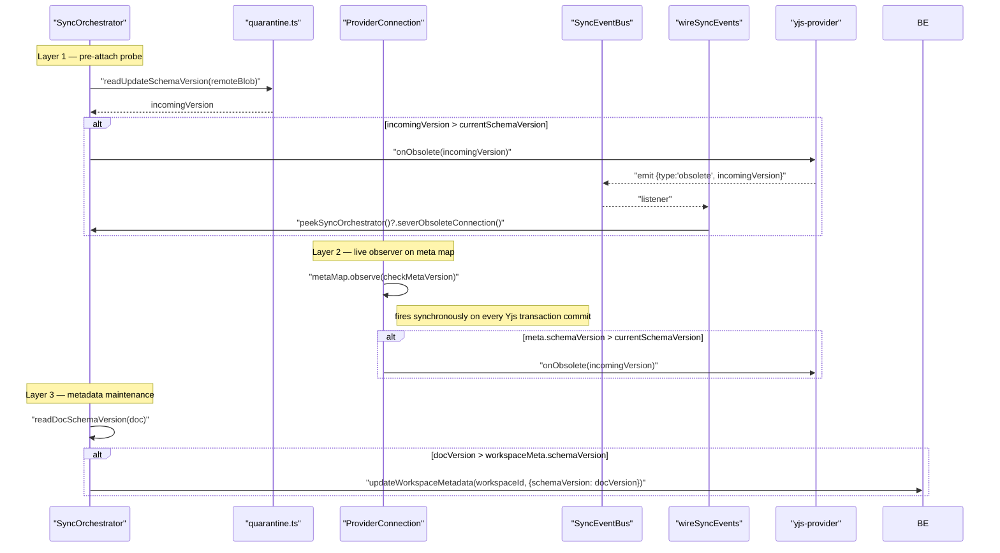
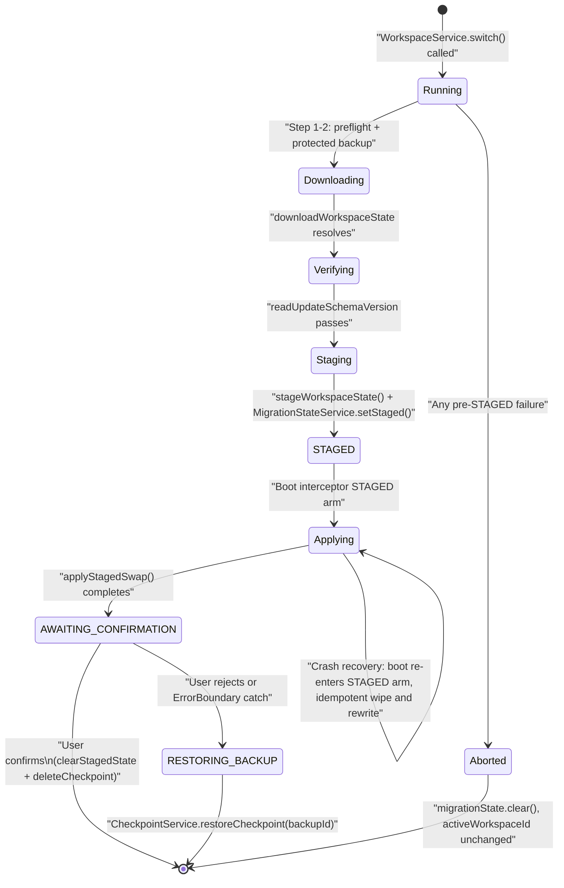
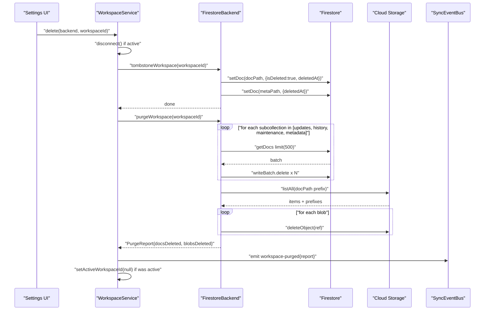
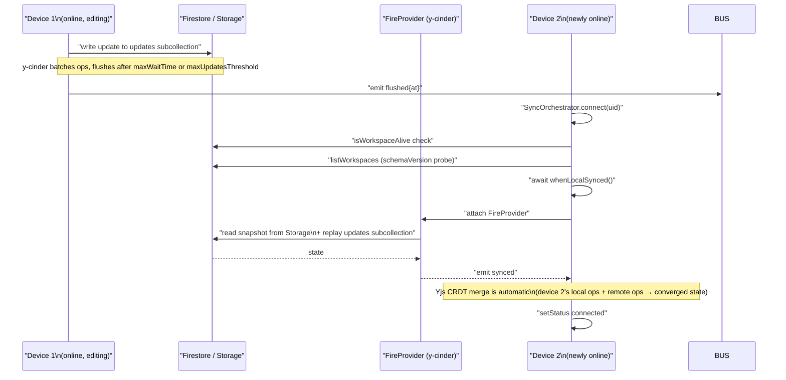
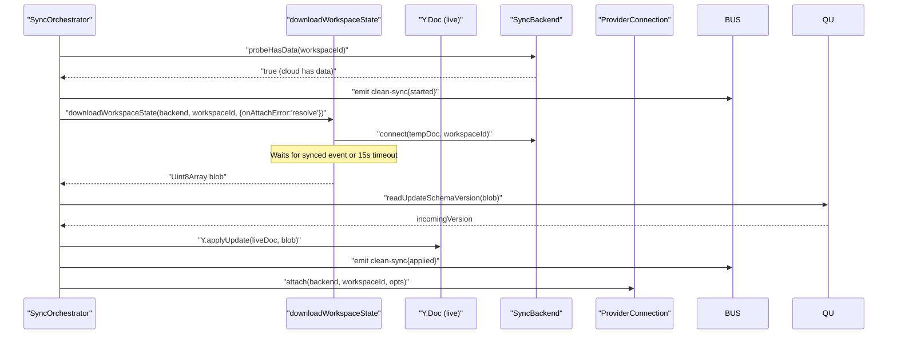

# Sync Domain: Firestore Multi-Device

The sync domain is Versicle's cross-device replication layer. It connects a local-first
IndexedDB-backed Yjs CRDT document to the user's own Firebase project over the `y-cinder`
FireProvider, enabling multiple devices to converge on a single shared library without a
proprietary cloud. This document covers everything from design intent through the innermost
implementation details: the port-injected orchestrator, the `SyncBackend` seam separating
Firestore from the mock transport, the typed `SyncEvent` bus and its single presentation
subscriber, the three-layer doc-level quarantine that keeps stale clients out, the
crash-resumable staged workspace swap, and the additive Artifact Lane that mirrors expensive
embedding blobs into the user's own cloud so they can be reused across their devices.

Related documents: [State management (CRDT)](13-state-management-crdt.md),
[Bootstrap and lifecycle](14-bootstrap-and-lifecycle.md),
[Storage gateway](20-storage-gateway.md), [Backup and restore](23-backup-and-restore.md),
[Search domain](38-domain-search.md) (the Artifact-Lane consumers),
[Composition root](50-composition-root.md).

---

## 1. Design Intent and History

### 1.1 Why BYO-Firebase?

Versicle is a local-first EPUB reader. The local Yjs document is always the primary source of
truth; the cloud is an optional overlay. The decision to make the user supply their own Firebase
project rather than host a shared backend flows from this: every reader's library is private by
default, there is no shared infrastructure to attack or bill for, and users who do not configure
sync get a fully functional offline reader without any cloud dependency.

The sync feature turns on only when the user pastes a Firebase config, signs in with Google, and
has `firebaseEnabled` set in the persisted sync store. This flag is stamped `true` by the
orchestrator the first time a successful sign-in resolves — it is never written by the settings
form alone.

### 1.2 The God-Object Problem

Before Phase 4 of the overhaul (see [80-overhaul-history.md](80-overhaul-history.md) for the
full history), all sync logic lived in a single 1,046-line class
`FirestoreSyncManager` (`src/lib/sync/FirestoreSyncManager.ts` @ `fb3dcd3f`). That class owned
Firebase auth, the y-cinder provider lifecycle, workspace CRUD, clean-client first-sync,
tombstone pre-flights, status fan-out to the UI, toast strings, and roughly twelve
`isMockFirestoreEnabled()` branches interleaved throughout. The mock transport was statically
imported and shipped in production bundles. Every workspace flow was duplicated between real and
mock branches. The `deleteWorkspace` path only swept the `updates` subcollection, leaving
`history`, `maintenance`, `metadata`, and Cloud Storage blobs alive after "deletion".

The [sync analysis](../../plan/overhaul/analysis/sync.md) catalogued sixteen debt items; six were
rated critical or high-severity correctness bugs. The most dangerous: a workspace switch first
wiped local IndexedDB, then wrote the remote blob — a crash in the write left the user with an
empty library and no automatic recovery.

### 1.3 Phase 4 Resolution

Phase 4 (`plan/overhaul/prep/phase4-sync-strangler.md`) decomposed the manager into
`src/domains/sync/` and resolved each item:

- **God object** decomposed into `AuthSession`, `ProviderConnection`, `WorkspaceService`, and
  `SyncOrchestrator`, all injected via typed ports so the domain contains no store imports.
- **Mock interleaving** replaced by the `SyncBackend` seam; `MockBackend` reaches production
  bundles only through a dynamic import in a dead-in-production branch.
- **Toast coupling** replaced by the `SyncEvent` bus; `wireSyncEvents` is the single
  presentation subscriber (toast-import lint ban enforced at error in `domains/sync/**`).
- **Data-loss window** replaced by the crash-resumable staged swap (download → verify → durable
  staging → STAGED commit → idempotent boot-time apply).
- **Incomplete delete** replaced by the honest `deleteWorkspace` purge (tombstone-first, full
  subcollection sweep, Cloud Storage blob deletion, conditional sever, maintenance action for
  pre-P4 residuals).
- **Label-only quarantine** replaced by three enforcement layers covering pre-attach, pre-apply,
  and live-observer scenarios.

---

## 2. Domain Architecture



The key architectural invariant is the **boundary rule**: `src/domains/sync/` holds no direct
store imports (enforced by the `domains-no-store` depcruise rule). Everything the orchestrator
needs from the store layer arrives through the `SyncOrchestratorDeps` interface defined in
[ports.ts](../../src/domains/sync/core/ports.ts) and wired in
[composeSync.ts](../../src/app/sync/composeSync.ts).

### 2.1 Module Ownership

| Module | Responsibility |
|--------|---------------|
| [src/app/sync/createSync.ts](../../src/app/sync/createSync.ts) | Singleton management, enablement gate, `isSyncEnabled()`, `stopSyncForWipe()`, `peekSyncOrchestrator()` |
| [src/app/sync/composeSync.ts](../../src/app/sync/composeSync.ts) | Port-adapter wiring (store → ports), `FirestoreBackend` selection, heavy firebase imports |
| [src/app/sync/wireSyncEvents.ts](../../src/app/sync/wireSyncEvents.ts) | The ONE `SyncEventBus` subscriber: store mirror writes + toasts |
| [src/domains/sync/core/SyncOrchestrator.ts](../../src/domains/sync/core/SyncOrchestrator.ts) | Auth→connect sequencing, clean-sync routing, quarantine layers 1+3, status fan-out |
| [src/domains/sync/core/AuthSession.ts](../../src/domains/sync/core/AuthSession.ts) | `onAuthStateChanged` lifecycle, mock-session synthesis, sign-in/out |
| [src/domains/sync/core/ProviderConnection.ts](../../src/domains/sync/core/ProviderConnection.ts) | Provider attach/detach, transport event normalization, live quarantine observer (layer 2) |
| [src/domains/sync/core/downloadWorkspaceState.ts](../../src/domains/sync/core/downloadWorkspaceState.ts) | Single temp-doc hydration utility replacing three copy-pasted dances |
| [src/domains/sync/core/quarantine.ts](../../src/domains/sync/core/quarantine.ts) | `readDocSchemaVersion`, `readUpdateSchemaVersion` primitives |
| [src/domains/sync/backend/SyncBackend.ts](../../src/domains/sync/backend/SyncBackend.ts) | `SyncBackend` interface (C3 contract), `WorkspaceMetadata` zod schema, OBSERVE-mode validator, Artifact-Lane `ArtifactHead` + `artifactHeadTail` |
| [src/domains/sync/backend/FirestoreBackend.ts](../../src/domains/sync/backend/FirestoreBackend.ts) | Only module in sync importing `firebase/firestore` + `firebase/storage` (read/write since the Artifact Lane added `uploadBytes`/`getBytes`) |
| [src/domains/sync/backend/MockBackend.ts](../../src/domains/sync/backend/MockBackend.ts) | localStorage-backed test transport; never in production bundles |
| [src/domains/sync/workspaces/WorkspaceService.ts](../../src/domains/sync/workspaces/WorkspaceService.ts) | create/switch/delete/list over `SyncBackend`; staged swap orchestration |
| [src/domains/sync/workspaces/stagedSwap.ts](../../src/domains/sync/workspaces/stagedSwap.ts) | Durable staging, apply, swap lock, test-harness pause points |
| [src/domains/sync/workspaces/MigrationStateService.ts](../../src/domains/sync/workspaces/MigrationStateService.ts) | localStorage state machine: `STAGED | AWAITING_CONFIRMATION | RESTORING_BACKUP` |
| [src/domains/sync/checkpoints/CheckpointService.ts](../../src/domains/sync/checkpoints/CheckpointService.ts) | Checkpoint create/restore/prune with protected-flag pinning |
| [src/domains/sync/checkpoints/CheckpointInspector.ts](../../src/domains/sync/checkpoints/CheckpointInspector.ts) | Live vs checkpoint diff for the restore-preview UI |
| [src/domains/sync/events.ts](../../src/domains/sync/events.ts) | `SyncEventBus` factory, `SyncEvent` union type |

---

## 3. The SyncBackend Seam (C3 Contract)

The `SyncBackend` interface is the C3 contract in the registry
([12-contract-first-registry.md](12-contract-first-registry.md)). It was grown from the P0
contract-suite skeleton and is the only boundary crossing between the sync domain and the
Firebase SDK.

### 3.1 Interface Definition

```typescript
// src/domains/sync/backend/SyncBackend.ts
export interface SyncBackend {
  readonly uid: string;
  createWorkspace(meta: WorkspaceMetadata): Promise<void>;
  listWorkspaces(opts?: { includeDeleted?: boolean }): Promise<WorkspaceMetadata[]>;
  updateWorkspaceMetadata(workspaceId: string, patch: Partial<WorkspaceMetadata>): Promise<void>;
  isWorkspaceAlive(workspaceId: string): Promise<boolean>;
  probeHasData(workspaceId: string): Promise<boolean>;
  tombstoneWorkspace(workspaceId: string): Promise<void>;
  purgeWorkspace(workspaceId: string): Promise<PurgeReport>;
  // Artifact Lane (shared embedding cache) — see Section 3.6
  headArtifact(workspaceId: string, relPath: string): Promise<ArtifactHead | null>;
  putArtifact(workspaceId: string, relPath: string, bytes: ArrayBuffer | Uint8Array,
              meta: { stamp: string; size: number }): Promise<void>;
  getArtifact(workspaceId: string, relPath: string): Promise<ArrayBuffer | null>;
  deleteArtifactHead(workspaceId: string, relPath: string): Promise<void>;
  sweepArtifacts(workspaceId: string,
                 opts: { ttlMs: number; now: number; budgetBytes?: number }
                ): Promise<{ headsDeleted: number; blobsDeleted: number }>;
  connect(doc: Y.Doc, workspaceId: string, opts: ConnectOptions): SyncConnection;
}

export type SyncBackendFactory = (uid: string) => SyncBackend;
```

The five `*Artifact*` methods are the C3 surface for the shared AI-cache feature (the "Artifact
Lane"). They were originally designed as a three-method `head`/`put`/`get` trio
(`plan/shared-ai-cache-design.md` §4) but grew to **five** once the lifecycle phase landed:
`deleteArtifactHead` and `sweepArtifacts` were added for garbage collection. They are documented
in full in Section 3.6 and their cloud round-trips in Section 8.5.

### 3.2 FirestoreBackend

[FirestoreBackend](../../src/domains/sync/backend/FirestoreBackend.ts) is the only sync module
allowed to import `firebase/firestore` or `firebase/storage`. It remains the *sole*
`firebase/storage` importer, but the Artifact Lane **widened that import from delete-only to
read/write**: the storage import was previously only `getStorage`/`ref`/`listAll`/`deleteObject`
(the P4-6 blob purge), and the shared embedding cache added `uploadBytes` + `getBytes` for
`putArtifact`/`getArtifact`. No other sync module gains a storage import. Firestore document
paths:

- Workspace metadata directory: `users/{uid}/workspaces/{workspaceId}`
- Replicated CRDT document root: `users/{uid}/versicle/{workspaceId}`
- y-cinder subcollections: `.../updates`, `.../history`, `.../maintenance`, `.../metadata`
- Cached-embedding blob (Cloud Storage): `.../versicle/{workspaceId}/embeddings/{key}.bin`
- Cached-embedding HEAD record (Firestore): `.../versicle/{workspaceId}/embedCache/{key}`

The two cached-embedding siblings deliberately live *inside* the workspace prefix so the blob is
swept by the existing `purgeStoragePrefix` on workspace delete, and the HEAD record is swept by
the `embedCache` entry now in `PURGE_SUBCOLLECTIONS` (Section 8.3).

The `connect()` method instantiates a `FireProvider` from `y-cinder` and adapts its
ObservableV2 events onto the typed `SyncConnectionEvents` surface:

```typescript
const provider = new FireProvider({
  firebaseApp: app,
  ydoc,
  path: this.docPath(workspaceId),
  maxWaitTime: opts.maxWaitTimeMs,
  maxUpdatesThreshold: opts.maxUpdatesThreshold,
});
// ...adapt provider events onto emitter...
p.on('saved', ((at: number) => emitter.emit('saved', at)) as never);
```

The `saved` event is a fork delta added to `packages/y-cinder` in P9 (Surgery 1, documented in
`packages/y-cinder/PROVENANCE.md`). It fires after every committed save and drives
`lastSyncTime` in the sync store — the old behavior was to stamp `lastSyncTime` on the
`connected` state transition, which reported connection time rather than save time.

`isWorkspaceAlive` is fail-safe: if the doc is missing or the read fails (offline), it returns
`true` so an offline client can continue queuing writes. Only a positive `isDeleted: true` on
the root document returns `false`.

The `purgeWorkspace` method is discussed in detail in Section 8.

### 3.3 MockBackend

[MockBackend](../../src/domains/sync/backend/MockBackend.ts) implements the same `SyncBackend`
interface over `localStorage`:

- `__VERSICLE_WORKSPACES__`: JSON-serialized `WorkspaceMetadata[]` directory
- `versicle_mock_firestore_snapshot`: per-path `{ snapshotBase64?, isDeleted?, deletedAt? }`

It reaches production bundles exclusively through a dynamic import in
[createSync.ts](../../src/app/sync/createSync.ts) inside a branch that is statically dead in
production (`import.meta.env.DEV || import.meta.env.VITE_E2E`). Rollup eliminates the branch,
and `scripts/check-worker-chunk.mjs` asserts no `MockFireProvider`/`MockBackend` string appears
in the emitted production chunks.

The Playwright E2E suite arms the mock by setting `window.__VERSICLE_MOCK_FIRESTORE__` before
the app loads; the single flag reader in [src/test-flags.ts](../../src/test-flags.ts) exposes
`isMockFirestoreEnabled()` and `getMockFirestoreUserId()` to the composition root.

`MockBackend` also carries an in-memory implementation of the five Artifact-Lane methods: a
single `Map` keyed by the HEAD-record path collapses the head record and the blob bytes into one
entry, so `head`/`put`/`get`/`delete`/`sweep` all resolve to one canonical entry. Because the
mock has no separate Storage tier, the "delete the HEAD record but KEEP the shared blob" invariant
(Section 3.6) **cannot** be proven on the mock — that guarantee is pinned only on the
FirestoreBackend/emulator path. The cross-device savings flow is otherwise verified entirely
against `MockBackend`; the cloud round-trips themselves are CI-pending (Section 8.5).

### 3.4 WorkspaceMetadata Schema and OBSERVE Mode

```typescript
// src/domains/sync/backend/SyncBackend.ts
export const workspaceMetadataSchema: z.ZodType<WorkspaceMetadata> = z.looseObject({
  workspaceId: z.string().min(1),
  name: z.string(),
  createdAt: z.number(),
  schemaVersion: z.number(),
  deletedAt: z.number().optional(),
});
```

The schema uses `z.looseObject` (forward-compatible: unknown extra fields are tolerated) and is
applied in OBSERVE mode: `observeWorkspaceMetadata` logs schema violations but passes every row
through unmodified. The flip to rejection is gated on reviewing telemetry (search key:
`workspace-metadata-observe` in logs). This follows the program rule that runtime-validated
boundaries must not silently reject live data until field-confirmed.

### 3.5 Connection Events Emitter

```typescript
// src/domains/sync/backend/connectionEvents.ts
export function createSyncConnectionEmitter(): SyncConnectionEmitter
```

Both `FirestoreBackend` and `MockBackend` use this shared typed emitter. It copies the listener
set before dispatch so a listener removing itself mid-iteration cannot skip peers.



### 3.6 The Artifact Lane (Shared Embedding Cache)

The five `*Artifact*` methods are the sync-domain half of the shared AI-cache feature, designed in
[plan/shared-ai-cache-design.md](../../plan/shared-ai-cache-design.md) and implemented in Phases
A–D. Embeddings (see [the search domain doc](38-domain-search.md)) are expensive to compute, so a
book embedded once on one device is mirrored into the user's **own** BYO Cloud Storage and reused
by their other devices instead of re-spending Gemini quota. The lane is a cold-miss refill behind
the device-local IDB cache: the hot read path never touches it.

Each cached embedding set is stored as two siblings keyed by the same content `{key}` (a SHA-256
over the book content hash + embedding-space stamp):

| Tier | Path | Role |
|------|------|------|
| Payload blob (~251 KB int8 vectors) | `users/{uid}/versicle/{workspaceId}/embeddings/{key}.bin` (Cloud Storage) | The bytes themselves; too large for the CRDT, never touches Yjs |
| HEAD record (`stamp`, `size`, `createdAt`) | `users/{uid}/versicle/{workspaceId}/embedCache/{key}` (Firestore) | A cheap `getDoc` existence/stamp probe — never a Storage `list` |

The `artifactHeadTail(blobRelPath)` helper in `SyncBackend.ts` derives the HEAD-record tail
(`embedCache/{key}`) from the blob tail (`embeddings/{key}.bin`); both backends use it so they
derive the sibling tail identically. The methods (full JSDoc in
[SyncBackend.ts](../../src/domains/sync/backend/SyncBackend.ts)):

| Method | Behavior |
|--------|----------|
| `headArtifact(workspaceId, relPath)` | Probe: one `getDoc` on the HEAD record. Returns `ArtifactHead` (`exists: true`, `stamp`, `size`) or `null` on a miss. A head hit **implies the bytes are present** (`putArtifact` writes the blob first). |
| `putArtifact(workspaceId, relPath, bytes, meta)` | Upload. **Skip-if-present** (idempotent: checks the HEAD first, no-op if it exists). **Blob first, head second** — `uploadBytes` to Storage THEN `setDoc` the HEAD, so a crash between leaves a recoverable blob with no head, never a head pointing at absent bytes. |
| `getArtifact(workspaceId, relPath)` | Download the blob bytes. **Miss vs error is OPPOSITE polarity to `isWorkspaceAlive`'s fail-safe**: a definitive `storage/object-not-found` returns `null` (caller recomputes); a transient/permission error **throws** (an offline blip must never be mistaken for a miss and pay to re-embed). |
| `deleteArtifactHead(workspaceId, relPath)` | Best-effort delete of the HEAD record **only**. The shared blob is **deliberately left in place** — a sibling device may still need those bytes, and because the blob is content-keyed it is safe and re-derivable. Reclaiming the orphaned blob is the sweeper's job. An already-gone record is a clean no-op. |
| `sweepArtifacts(workspaceId, opts)` | The cloud garbage collector (Section 8.5). For each HEAD record past `now - ttlMs` (and, when `budgetBytes` is set, oldest-first by `createdAt` until under budget), deletes BOTH the HEAD record and its sibling blob. Idempotent and re-runnable. |

The orchestrator exposes `getConnectedArtifactBackend()` — a null-gated accessor returning
`{ backend, workspaceId }` only when sync is connected AND signed in AND an active workspace is
selected. The null-gate ensures the returned backend is bound to the right uid and the path is
scoped to the right workspace, so a lookup can never read a cached embedding under the wrong
account. It adds **no** new backend method (the three sync contract suites stay green) — it
re-exposes the existing `getBackend` + `getActiveWorkspaceId` the connect path already uses.

The app-layer consumers (the consult/hydrate adapter, the upload publisher, and the per-book
cloud delete in the library domain) live outside the sync domain and are documented in
[the search domain doc](38-domain-search.md); they are gated by a default-OFF "Share AI caches
across my devices" opt-in. This document covers only the C3 transport surface and its cloud
round-trips.

---

## 4. The SyncEvent Bus

[src/domains/sync/events.ts](../../src/domains/sync/events.ts) defines the process-wide typed event
bus that decouples the transport domain from the presentation layer.

### 4.1 The SyncEvent Union

```typescript
export type SyncEvent =
  | { type: 'status'; status: FirestoreSyncStatus }
  | { type: 'auth'; status: FirebaseAuthStatus; email: string | null }
  | { type: 'flushed'; at: number }
  | { type: 'clean-sync'; phase: 'started' | 'applied' | 'failed' }
  | { type: 'switch'; phase: 'downloading' | 'verifying' | 'staged' | 'applying'
                            | 'failed-rolling-back' | 'failed-aborted' }
  | { type: 'save-rejected'; code: 'permission-denied' | 'document-too-large'
                                  | 'max-retries-exceeded';
      sizeBytes?: number; permissionDenied: boolean }
  | { type: 'connection-error'; permissionDenied: boolean }
  | { type: 'sync-failure'; permissionDenied: boolean }
  | { type: 'workspace-tombstoned'; workspaceId: string; context: 'connect' | 'switch' }
  | { type: 'workspace-purged'; report: { docsDeleted: number; blobsDeleted: number } }
  | { type: 'obsolete'; incomingVersion: number }
  | { type: 'local-persistence-unavailable' };
```

The `switch` event is notable: `'failed-aborted'` represents the non-destructive pre-apply
failure path (the state machine was never engaged, the old workspace is untouched), while
`'failed-rolling-back'` means destructive steps ran and the P0 rollback path is now active.
This distinction matters because `wireSyncEvents` shows different toast copy for each.

### 4.2 Bus Implementation

```typescript
function createSyncEventBus(): SyncEventBus {
  const listeners = new Set<(event: SyncEvent) => void>();
  return {
    emit: (event) => {
      for (const listener of [...listeners]) {
        try { listener(event); }
        catch (e) {
          // A presentation bug must never take down the transport.
          logger.error('Sync event listener threw:', e);
        }
      }
    },
    on: (listener) => {
      listeners.add(listener);
      return () => listeners.delete(listener);
    },
  };
}

let bus: SyncEventBus | null = null;
export function getSyncEventBus(): SyncEventBus {
  if (!bus) bus = createSyncEventBus();
  return bus;
}
```

Key properties:
- **Process singleton**: `getSyncEventBus()` returns the same bus for the app's lifetime.
- **Isolation**: exceptions in listeners are caught and logged; a presentation bug cannot crash
  the transport.
- **Listener-set copy**: the `[...listeners]` copy before dispatch is safe when listeners
  unsubscribe inside their own handler.
- **No `signed-in-via-redirect`**: this event existed in earlier versions but was deleted in P9
  when the dead `getRedirectResult` web-redirect flow was removed (the live sign-in path is
  `SocialLogin → signInWithCredential` on all platforms).

### 4.3 The Single Subscriber Rule

Producers (the orchestrator, ProviderConnection, WorkspaceService) emit events.
Exactly **one** subscriber exists: `wireSyncEvents` in
[src/app/sync/wireSyncEvents.ts](../../src/app/sync/wireSyncEvents.ts). It owns:

- All `useSyncStore` mirror writes (`setFirestoreStatus`, `setFirebaseAuthStatus`,
  `setFirebaseUserEmail`, `setLastSyncTime`)
- All toast calls (every user-visible sync string is keyed in the typed message catalog)
- The quarantine sever (calls `peekSyncOrchestrator()?.severObsoleteConnection()` and
  `stopDeviceHeartbeat()` on `'obsolete'`)

This is enforced structurally: the toast-import lint rule bans `useToastStore` in
`src/domains/sync/**` and `src/lib/sync/**` at error severity.



`wireSyncEvents` is registered by the `syncInit` boot task with `ctx.addCleanup` so the
listener is detached on a full sync teardown (e.g., wipe-all-data).

---

## 5. The Orchestrator and Its Sub-Components

### 5.1 Dependency Injection via Ports

The `SyncOrchestratorDeps` interface in
[src/domains/sync/core/ports.ts](../../src/domains/sync/core/ports.ts) lists everything the
orchestrator needs from outside:

```typescript
export interface SyncOrchestratorDeps {
  backendSelection: SyncBackendSelection;
  events: SyncEventBus;
  doc: () => Y.Doc;
  whenLocalSynced: () => Promise<void>;
  onObsolete: (incomingVersion: number) => void;
  currentSchemaVersion: number;
  isCleanClient: () => boolean;
  isEnabled: () => boolean;
  debounceOverrideMs: () => number;
  syncState: SyncStatePort;
  checkpoints: CheckpointsPort;
  migrationState: MigrationStatePort;
  config?: SyncOrchestratorConfig;
}
```

The composition root in [composeSync.ts](../../src/app/sync/composeSync.ts) wires each slot:

| Dep | Wire |
|-----|------|
| `doc` | `getYDoc` from `@store/yjs-provider` |
| `whenLocalSynced` | `() => waitForYjsSync()` from `@store/yjs-provider` |
| `onObsolete` | `handleObsoleteClient` from `@store/yjs-provider` |
| `currentSchemaVersion` | `CURRENT_SCHEMA_VERSION` from `@store/yjs-provider` |
| `isCleanClient` | `() => Object.keys(useBookStore.getState().books).length === 0` |
| `syncState.getActiveWorkspaceId` | `() => useSyncStore.getState().activeWorkspaceId` |
| `syncState.setFirebaseEnabled` | `(enabled) => useSyncStore.getState().setFirebaseEnabled(enabled)` |
| `checkpoints.createCheckpoint` | `CheckpointService.createCheckpoint` |
| `migrationState.setStaged` | `MigrationStateService.setStaged` |

### 5.2 The Single Enablement Gate

```typescript
// src/app/sync/createSync.ts
export function isSyncEnabled(): boolean {
  return (
    Boolean(selection?.mockSession) ||
    (useSyncStore.getState().firebaseEnabled && isFirebaseConfigured())
  );
}
```

`SyncOrchestrator.start()` evaluates this before doing anything:

```typescript
async start(opts?: { bypassEnabledGate?: boolean }): Promise<void> {
  if (!opts?.bypassEnabledGate && !this.deps.isEnabled()) {
    logger.info('Sync disabled (firebaseEnabled flag off or not configured). Not starting.');
    this.auth.setAuthStatus('signed-out');
    return;
  }
  // ...
}
```

`bypassEnabledGate` exists for an explicit sign-in click on a client where `firebaseEnabled` is
still `false` — the click is the enabling act, and success will stamp the flag via
`handleAuthStateChange`. The legacy boot path called `initialize()` unconditionally, ignoring
`firebaseEnabled`; this gate is the fix.

### 5.3 AuthSession

[AuthSession](../../src/domains/sync/core/AuthSession.ts) owns the Firebase auth lifecycle:

1. If a `mockSession` is provided (composition root injected it), synthesizes a fake `User`
   object and calls `onUser(mockUser)` immediately (not awaited — legacy parity).
2. Otherwise, checks `isFirebaseConfigured()` → calls `initializeFirebase()` → gets the auth
   instance → registers `onAuthStateChanged`.
3. `setAuthStatus(status)` fans out to registered callbacks AND emits an `auth` SyncEvent, so
   the auth status reaches `useSyncStore` through `wireSyncEvents` (single-writer rule).
4. `signIn()` calls `signInWithGoogle()` from `@lib/sync/auth-helper` (the
   `SocialLogin → signInWithCredential` flow that works on both native and web).
5. `stop()` detaches the auth listener and clears subscriber callbacks.

The `getRedirectResult` block that existed in the pre-P4 manager has been deleted. No module in
the production graph ever calls `signInWithRedirect`, and `getRedirectResult` resolves `null`
unless the app itself initiated a redirect — the flow was dead code.

### 5.4 ProviderConnection

[ProviderConnection](../../src/domains/sync/core/ProviderConnection.ts) owns the live attachment of
one `SyncConnection` to the replicated document. It holds:

- `this.connection: SyncConnection | null` — the active transport
- `this.metaQuarantineCleanup: (() => void) | null` — the `meta` map observer handle

`attach(backend, workspaceId, opts)`:

1. Calls `deps.setStatus('connecting')`.
2. Calls `backend.connect(deps.doc(), workspaceId, opts)` to obtain a `SyncConnection`.
3. Wires all transport events onto the `SyncEventBus` (no UX here — wireSyncEvents presents).
4. Installs the live quarantine observer on `doc.getMap('meta')` (layer 2, Section 6.3).
5. Runs the synchronous version check before reporting `'connected'`.

`detach()` unobserves the `meta` map, destroys the connection, and sets status to
`'disconnected'`.

The `'saved'` connection event triggers `events.emit({ type: 'flushed', at })`, which drives
`setLastSyncTime` through `wireSyncEvents`. This is the correct semantics: `lastSyncTime`
reports when the last save committed, not when the provider connected.

### 5.5 The Connect Sequence

`SyncOrchestrator.connect(uid)` is the core auth→attach sequence:



The pre-sync checkpoint is throttled to once per 24 hours (86,400,000 ms). Failure is
non-blocking: the connect sequence proceeds even if the checkpoint write fails. The metadata
stamp (layer 3) is also non-blocking: a failed offline stamp retries on the next connect.

### 5.6 Clean-Sync Flow

`performCleanSync` handles the first device joining an existing library:

1. `backend.probeHasData(workspaceId)` — fast check for existing cloud data.
2. If empty: the client is the first device; attach the real provider directly.
3. If data exists: download into a temp doc via `downloadWorkspaceState`, run the
   pre-apply quarantine check (layer 1, Section 6.2), apply the verified update to the live
   doc with `Y.applyUpdate`, then attach the real provider.

The timeout on `downloadWorkspaceState` resolves with whatever synced so far (not an error) —
an unreachable or empty remote yields an empty update, which the clean client treats as
"first device".

---

## 6. Doc-Level Quarantine

The quarantine machinery prevents a stale client (running an older schema version than the cloud
fleet) from writing old-schema data into a migrated CRDT document.



### 6.1 The Version Read

```typescript
// src/domains/sync/core/quarantine.ts
export function readDocSchemaVersion(doc: Y.Doc): number {
  const metaVersion = doc.getMap('meta').get('schemaVersion');
  const libraryVersion = doc.getMap('library').get('__schemaVersion');
  return (
    Math.max(
      typeof metaVersion === 'number' ? metaVersion : 0,
      typeof libraryVersion === 'number' ? libraryVersion : 0,
    ) || 1
  );
}
```

`max(meta.schemaVersion, library.__schemaVersion) || 1`. The `max` over both keys tolerates
partial dual-writes (N+1 staging, program rule 5): a doc that has been partially migrated and
carries one version in `meta` and another in `library` reads as the higher version, preventing
false-negative quarantine. A doc carrying neither key reads as v1 (the pre-versioning era).

### 6.2 Layer 1: Pre-Attach and Pre-Apply Gates

Two situations trigger the synchronous scratch-doc version check:

**Pre-attach probe** (clean-sync and workspace switch): the workspace metadata directory
carries a `schemaVersion` field. If it exceeds `CURRENT_SCHEMA_VERSION`, the orchestrator calls
`onObsolete` before connecting — an offline-during-fleet-migration client is locked before any
remote bytes can reach the live doc.

**Pre-apply scratch check** (clean-sync + switch): before any byte of a downloaded update
touches the live doc, `readUpdateSchemaVersion` applies it to a throwaway `Y.Doc`:

```typescript
export function readUpdateSchemaVersion(update: Uint8Array): number {
  const scratch = new Y.Doc();
  try {
    Y.applyUpdate(scratch, update);
    return readDocSchemaVersion(scratch);
  } finally {
    scratch.destroy();
  }
}
```

If the scratch version exceeds the supported schema, the update is discarded and `onObsolete` is
called. The live doc is never touched; nothing is staged. This is the "validate before
anything destructive" discipline applied at the schema level.

### 6.3 Layer 2: Live Observer

`ProviderConnection.attach` installs a synchronous observer on `doc.getMap('meta')`:

```typescript
const metaMap = deps.doc().getMap('meta');
const checkMetaVersion = (): void => {
  const incoming = metaMap.get('schemaVersion');
  if (typeof incoming === 'number' && incoming > deps.currentSchemaVersion) {
    deps.onObsolete(incoming);
  }
};
metaMap.observe(checkMetaVersion);
```

This fires synchronously on every transaction commit that touches the `meta` map. y-cinder
applies remote updates to the doc internally before surfacing events, so the one transaction
that imported the future-version stamp has already merged into the local doc (accepted residual,
pinned by the F.2 contract test). The observer then destroys the provider so no further
operations flow in either direction.

### 6.4 Layer 3: Metadata Stamp

After `whenLocalSynced()` resolves and before connecting, the orchestrator reads the doc's
current schema version and compares it to the workspace metadata's `schemaVersion`:

```typescript
const docVersion = readDocSchemaVersion(this.deps.doc());
if (workspaceMeta && docVersion > workspaceMeta.schemaVersion) {
  backend.updateWorkspaceMetadata(workspaceId, { schemaVersion: docVersion })
    .catch((error) => { logger.warn('Failed to stamp workspace metadata schemaVersion', error); });
}
```

This keeps the directory's `schemaVersion` field honest after local migrations. Layer 1 reads
from this directory; without this stamp, a freshly-migrated client would pass layer 1's gate
forever because the directory still shows the creation-time version.

### 6.5 Quarantine Enforcement

`onObsolete` is wired to `handleObsoleteClient` in `@store/yjs-provider`, which:

1. Sets `useUIStore.obsoleteLock = true`, causing the app to render `ObsoleteLockView` (a
   non-dismissible full-screen overlay).
2. Emits the `obsolete` SyncEvent on the bus.

`wireSyncEvents` receives the `obsolete` event and:

```typescript
case 'obsolete':
  peekSyncOrchestrator()?.severObsoleteConnection();
  stopDeviceHeartbeat();
  break;
```

`severObsoleteConnection()` calls `this.provider.detach()` — a real destroy of the FireProvider,
not a status label flip. After this, zero outbound writes can occur. The device heartbeat is
also stopped so the 5-minute tick cannot generate updates.

---

## 7. The Staged Workspace Swap

The workspace switch is the most complex and historically most dangerous flow. The legacy
implementation wiped IndexedDB before writing the remote blob — a crash in the write left an
empty library. The Phase 4 solution is a crash-resumable staged swap.

### 7.1 State Machine

The migration state is persisted to `localStorage` under key `__VERSICLE_MIGRATION_STATE__` by
[MigrationStateService](../../src/domains/sync/workspaces/MigrationStateService.ts). The state union
(defined in `~types/workspace.ts`) is exactly:

```typescript
type SyncMigrationState =
  | { status: 'STAGED'; targetWorkspaceId: string; backupCheckpointId: number;
      previousWorkspaceId?: string }
  | { status: 'AWAITING_CONFIRMATION'; targetWorkspaceId: string; backupCheckpointId: number;
      previousWorkspaceId?: string }
  | { status: 'RESTORING_BACKUP'; targetWorkspaceId: string; backupCheckpointId: number;
      previousWorkspaceId?: string };
```

`IDLE` and `getDanglingBackupId` were deleted in P1 (dead code). The `previousWorkspaceId`
field is new in P4 — it records the pre-switch workspace so a boot-time rollback can revert
`activeWorkspaceId` correctly.



### 7.2 The Switch Path

`WorkspaceService.switch(backend, targetWorkspaceId)` in
[src/domains/sync/workspaces/WorkspaceService.ts](../../src/domains/sync/workspaces/WorkspaceService.ts):

**Step 1 — Preflight validation**: `backend.isWorkspaceAlive(targetWorkspaceId)`. If tombstoned,
emits `workspace-tombstoned` with `context: 'switch'` and throws `WorkspaceDeletedError`.

**Step 2 — Protected backup**: `checkpoints.createCheckpoint('pre-migration', { protected: true })`.
The `protected: true` flag pins the checkpoint against the rolling 10-checkpoint prune (see
[23-backup-and-restore.md](23-backup-and-restore.md)). Only the newest protected checkpoint
stays pinned; creating a new one releases older ones back to the normal rotation.

**Step 3 — Download**: `downloadWorkspaceState(backend, targetWorkspaceId, { onAttachError: 'reject', ... })`.
A temp doc is hydrated, a 15-second timeout resolves with whatever synced, and the temp doc is
destroyed. This is a pure read — no state machine, no `activeWorkspaceId` write, nothing
destructive.

**Step 4 — Verify**: `readUpdateSchemaVersion(remoteBlob)`. Runs the quarantine layer 1 scratch
check. If the remote schema exceeds the local schema, calls `onObsolete` and throws. The catch
block below never ran any destructive step, so the abort is clean.

**Step 5 — Stage**: `stageWorkspaceState(remoteBlob)`:

```typescript
export async function stageWorkspaceState(blob: Uint8Array): Promise<void> {
  validateSnapshot(blob);
  await deleteYjsDatabase({ dbName: YJS_STAGING_DB_NAME });
  await applySnapshot(blob, { dbName: YJS_STAGING_DB_NAME });
}
```

`YJS_STAGING_DB_NAME` is `'versicle-yjs-staging'`. The staging database is the durable
scratch space: it is cleared at the start of each stage write (clearing junk from any
previously-abandoned switch), written commit-awaited (durable after `applySnapshot` resolves),
and never touched during the apply. Crashes during staging leave stale data in the staging DB
but do not touch main or the state machine — the next successful switch clears them.

**Step 6 — THE commit point**: `migrationState.setStaged(...)` then
`syncState.setActiveWorkspaceId(targetWorkspaceId)`. This ordering is intentional: if a kill
occurs between these two writes, `activeWorkspaceId` may still point to the old workspace, but
the boot interceptor's STAGED arm reconciles it via `hooks.setActiveWorkspaceId(target)` during
the idempotent apply. No crash row can strand the user.

```typescript
migrationState.setStaged(targetWorkspaceId, backupId, currentWorkspaceId ?? undefined);
syncState.setActiveWorkspaceId(targetWorkspaceId);

await pauseIfArmed('swap:staged');
window.location.reload();
```

`pauseIfArmed` is a test-harness pause point (Section 7.5). In production it resolves
immediately.

**Catch path**: If any step from preflight through staging throws:

```typescript
} catch (error) {
  migrationState.clear();
  syncState.setActiveWorkspaceId(currentWorkspaceId);
  events.emit({ type: 'switch', phase: 'failed-aborted' });
  throw error;
}
```

Because the STAGED commit is the last fallible step, the catch branch is safe: no destructive
steps have run, the state machine was never engaged. The user remains exactly where they were.

### 7.3 The Boot-Time Apply

`applyStagedSwap(state, hooks)` in
[src/domains/sync/workspaces/stagedSwap.ts](../../src/domains/sync/workspaces/stagedSwap.ts) is
called by the boot interceptor's STAGED arm:

```typescript
export async function applyStagedSwap(
  state: SyncMigrationState,
  hooks: ApplyStagedSwapHooks
): Promise<void> {
  // Precondition: state.status === 'STAGED'
  await withSwapLock(async () => {
    await hooks.pauseSync?.();
    await pauseIfArmed('swap:before-apply');

    const blob = await readSnapshot({ dbName: YJS_STAGING_DB_NAME });
    if (!blob) throw new Error('Staged workspace state is missing...');
    validateSnapshot(blob);  // prove before destroy

    await deleteYjsDatabase();  // wipe main

    await pauseIfArmed('swap:mid-apply');

    await applySnapshot(blob);  // rewrite main, commit-awaited

    hooks.setActiveWorkspaceId(target);
    MigrationStateService.setAwaitingConfirmation(target, backupId);
  });
  window.location.reload();
}
```

**Validate-before-destroy discipline**: `validateSnapshot(blob)` (a scratch-doc dry-run) runs
BEFORE `deleteYjsDatabase()`. A corrupted staging blob throws here; the main database is never
touched; the catch routes to `RESTORING_BACKUP` (the protected pre-migration checkpoint always
exists).

**Idempotency**: every step is re-runnable. `deleteYjsDatabase()` succeeds on a missing DB.
`applySnapshot(blob)` is commit-awaited. A crash anywhere re-enters the STAGED arm and
completes. The staging database is never altered during apply.

**Cross-tab swap lock**: the entire apply runs under:

```typescript
const SWAP_LOCK_NAME = 'versicle-yjs-swap';
export function withSwapLock<T>(work: () => Promise<T>): Promise<T> {
  const locks = globalThis.navigator?.locks;
  if (locks) {
    return locks.request(SWAP_LOCK_NAME, { mode: 'exclusive' }, work) as Promise<T>;
  }
  // jsdom fallback: serial promise chain
  // ...
}
```

Web Locks are cross-tab and release automatically when the holding context dies — exactly the
crash semantics the staged apply needs.

**Precondition**: the boot interceptor runs at `interceptMigration` phase, before
`startYjsPersistence`. No live y-idb binding exists when `applyStagedSwap` is called, making
the database wipe a plain delete (no live handle to close first).

### 7.4 The Full Failure Table

| Crash point | Storage state | Boot outcome |
|-------------|---------------|--------------|
| During download / verify / stage | No state machine, `activeWorkspaceId` = old | Old workspace boots untouched; staging junk cleared on next switch |
| After STAGED commit, before/during apply | State machine = STAGED, staging DB has verified blob | Boot interceptor re-runs `applyStagedSwap`; switch completes |
| After apply, before user confirms | State machine = AWAITING_CONFIRMATION, main DB = target | P0 confirm modal; user can finalize or roll back |
| User rejects / `applyStagedSwap` throws | State machine = RESTORING_BACKUP | Boot interceptor runs `CheckpointService.restoreCheckpoint(backupId)` |

### 7.5 Kill-Mid-Switch Test Points

`pauseIfArmed(point)` reads `getSwapPausePoint()` from `src/test-flags.ts`. When the
Playwright suite sets `window.__VERSICLE_SWAP_PAUSE__` to a specific pause point, `pauseIfArmed`
parks indefinitely with an unresolvable promise. The test then calls `page.close()`, modelling
process death at exactly that boundary. The function is inert in production.

Pause points:
- `'swap:staged'` — after STAGED commit, before reload
- `'swap:before-apply'` — inside the swap lock, before the staging blob read
- `'swap:mid-apply'` — after `deleteYjsDatabase()`, before `applySnapshot()`

---

## 8. The Honest deleteWorkspace Purge

### 8.1 The Legacy Bug

The pre-P4 `deleteWorkspace` path only swept the `updates` subcollection. The `history`,
`maintenance`, and `metadata` subcollections, and all Cloud Storage blobs uploaded by y-cinder's
compaction (e.g., `snapshot_vN.bin`, `large_updates/*.bin`), survived. The settings UI claimed
"permanently reclaim cloud storage" — this was false. Additionally, the legacy path called full
manager `destroy()` even when deleting a non-active workspace, severing sync for the workspace
the user was currently reading.

### 8.2 The P4 Solution: Tombstone-First

The `delete` method in `WorkspaceService` follows a strict ordering:

```typescript
async delete(backend: SyncBackend, workspaceId: string): Promise<void> {
  const wasActive = this.deps.syncState.getActiveWorkspaceId() === workspaceId;

  if (wasActive) {
    // Scoped sever — NOT the legacy full destroy
    this.deps.disconnect();
  }

  await backend.tombstoneWorkspace(workspaceId);
  const report = await backend.purgeWorkspace(workspaceId);
  this.deps.events.emit({ type: 'workspace-purged', report });

  if (wasActive) {
    this.deps.syncState.setActiveWorkspaceId(null);
  }
}
```

**Tombstone-first invariant**: `tombstoneWorkspace` plants `isDeleted: true` on the root doc
and `deletedAt` on the metadata directory before any purge begins. Firestore security rules then
deny new data writes into the workspace from any client. A crash between the tombstone and the
purge leaves a "tombstoned husk" — a re-runnable state with no new writes possible.

**Conditional sever**: only the active workspace's provider is detached before deletion. Deleting
a non-active workspace leaves the active provider connected throughout.

### 8.3 FirestoreBackend.purgeWorkspace

```typescript
const PURGE_SUBCOLLECTIONS = [
  'updates', 'history', 'maintenance', 'metadata', 'embedCache',
] as const;

async purgeWorkspace(workspaceId: string): Promise<PurgeReport> {
  // 1. Sweep subcollection docs in batches of ≤500
  let docsDeleted = 0;
  for (const sub of PURGE_SUBCOLLECTIONS) {
    docsDeleted += await this.purgeSubcollection(db, `${this.docPath(workspaceId)}/${sub}`);
  }

  // 2. Sweep Cloud Storage blobs under exactly this workspace's prefix
  let blobsDeleted = 0;
  try {
    const storage = getStorage(getFirebaseApp());
    blobsDeleted = await this.purgeStoragePrefix(
      ref(storage, this.docPath(workspaceId))
    );
  } catch (error) {
    logger.warn('Storage purge failed (project without Storage?). Re-run maintenance action to retry.');
  }

  return { docsDeleted, blobsDeleted };
}
```

The `embedCache` entry in `PURGE_SUBCOLLECTIONS` is the Artifact-Lane addition. The Storage sweep
(`purgeStoragePrefix` under the workspace prefix) collects the cached-embedding `embeddings/*.bin`
blobs "for free" — but the Firestore `embedCache/{key}` HEAD records are **not** swept for free
(`purgeStoragePrefix` is Storage-only), so they need this explicit entry or a workspace delete
would leave orphaned HEAD records. The design (`plan/shared-ai-cache-design.md` §2.7) originally
scheduled this `PURGE_SUBCOLLECTIONS` add for the lifecycle phase (Phase D); in implementation it
landed earlier, in **Phase A** alongside the C3 method skeleton, with a contract case seeding and
counting an `embedCache` residual.

`purgeSubcollection` loops in batches of 500 (the Firestore `writeBatch` limit):

```typescript
private async purgeSubcollection(db: Firestore, path: string): Promise<number> {
  const subRef = collection(db, path);
  let deleted = 0;
  for (;;) {
    const snapshot = await getDocs(query(subRef, limit(500)));
    if (snapshot.size === 0) break;
    const batch = writeBatch(db);
    snapshot.docs.forEach((docSnap) => { batch.delete(docSnap.ref); });
    await batch.commit();
    deleted += snapshot.size;
  }
  return deleted;
}
```

`purgeStoragePrefix` uses `listAll` for recursive traversal (handles the `large_updates/`
sub-prefix) and silently skips `storage/object-not-found` errors (idempotency):

```typescript
private async purgeStoragePrefix(prefix: StorageReference): Promise<number> {
  const listing = await listAll(prefix);
  let deleted = 0;
  for (const item of listing.items) {
    try { await deleteObject(item); deleted++; }
    catch (error) {
      if ((error as { code?: string })?.code === 'storage/object-not-found') continue;
      throw error;
    }
  }
  for (const sub of listing.prefixes) {
    deleted += await this.purgeStoragePrefix(sub);
  }
  return deleted;
}
```

Storage failures are non-blocking: BYO Firebase projects that deploy only Firestore rules
without a Storage bucket have nothing to purge. The error is logged and `blobsDeleted` is 0;
the Firestore subcollections were still purged. The "Purge deleted workspaces" maintenance
action can be re-run to retry the Storage sweep.



### 8.4 The Purge Maintenance Action

`WorkspaceService.purgeDeleted(backend)` is the "Purge deleted workspaces" maintenance action,
surfaced in the settings UI:

```typescript
async purgeDeleted(backend: SyncBackend): Promise<PurgeReport> {
  const all = await backend.listWorkspaces({ includeDeleted: true });
  const deleted = all.filter((ws) => ws.deletedAt);
  const total: PurgeReport = { docsDeleted: 0, blobsDeleted: 0 };

  for (const ws of deleted) {
    await backend.tombstoneWorkspace(ws.workspaceId);  // idempotent re-assert
    const report = await backend.purgeWorkspace(ws.workspaceId);
    total.docsDeleted += report.docsDeleted;
    total.blobsDeleted += report.blobsDeleted;
  }

  this.deps.events.emit({ type: 'workspace-purged', report: total });
  return total;
}
```

It re-asserts each tombstone before sweeping (idempotent per the rules; closes any
crash-mid-delete husk). Safe to run repeatedly. This is how pre-P4 deletions — which left
`history`/`maintenance`/`metadata` and Storage blobs — are retroactively cleaned up.

### 8.5 The Cloud Artifact Sweeper

`purgeWorkspace` reclaims the cached-embedding siblings only on a *workspace* delete. The shared
embedding cache also needs a steady-state garbage collector so it never grows without limit, and
so the orphaned blobs that `deleteArtifactHead` deliberately leaves behind (Section 3.6) are
eventually reclaimed. That is `FirestoreBackend.sweepArtifacts`, driven by a separate boot task.

`sweepArtifacts(workspaceId, { ttlMs, now, budgetBytes? })` lists the `embedCache` HEAD records
(keeping each record's `createdAt`/`size` rather than blanket-deleting), then chooses victims:

1. **Past-TTL**: every HEAD whose `createdAt < now - ttlMs`.
2. **Over-budget** (when `budgetBytes` is set): oldest-first by `createdAt` until the surviving
   total `size` is under budget.

For each victim it deletes BOTH the HEAD record AND its sibling `embeddings/{key}.bin` blob,
reusing the `deleteObject` + `storage/object-not-found`-tolerant shape from `purgeStoragePrefix`,
under the same `getFirebaseApp()` guard as `purgeWorkspace` (projects without a Storage bucket
degrade — the HEAD records still go). It returns `{ headsDeleted, blobsDeleted }` and is
idempotent: a re-run after a crash mid-sweep reports smaller numbers, never an error.

The boot task is [src/app/boot/artifactSweeper.ts](../../src/app/boot/artifactSweeper.ts),
registered in the `backgroundTasks` phase after the upload publisher. Its core `runArtifactSweep`
is pure/injectable — every backend/clock/budget edge arrives as a dep — so the suite drives it
with fakes. Posture:

- **Silent no-op** when `getConnectedArtifactBackend()` returns `null` (sync off / not connected /
  no active workspace) — the backend handle is read FRESH per call so a connect/disconnect takes
  effect immediately;
- **Best-effort**: a thrown `sweepArtifacts` is logged and swallowed (the next boot retries; the
  sweep is idempotent);
- **Idle-scheduled** on `requestIdleCallback` (`setTimeout` fallback) so it never competes with
  the boot path or interactive work, cancelling itself on boot cleanup.

The TTL is `ARTIFACT_TTL_MS` = 30 days (a deliberately conservative policy guess — because the
blob is content-addressed and re-derivable, an over-aggressive sweep only costs a re-embed). The
budget reuses `EMBEDDING_CACHE_BUDGET_BYTES`. This is the *cloud* GC; the device-local IDB cache
eviction (`runEviction`) is a separate sweep that never touches the cloud mirror.

> **CI-PENDING — the Artifact-Lane cloud paths are MockBackend-verified, not yet proven against
> real Firebase.** Every cloud round-trip — the Firestore+Storage emulator
> `put`/`head`/`get`/`delete`/`sweep` cases, the blob-first/head-second HEAD-after-Storage
> ordering, and the `storage.rules` security-rules suite — lives in test suites that
> **auto-skip when the local Firebase emulators are unreachable** (`describe.skipIf(!emulatorUp)`
> in [syncBackendContract.emulator.test.ts](../../src/lib/sync/syncBackendContract.emulator.test.ts)
> and [security-rules.test.ts](../../src/lib/sync/security-rules.test.ts)). On the default
> `vitest run` these are skipped, so the cross-device savings flow is verified end-to-end only
> against `MockBackend` (which has no Storage tier). The cloud paths are **code-complete and
> unit-verified** but the emulator suite must run in CI for the Section 3.6 ordering/idempotency
> guarantees to be proven against the real Firebase SDK.

---

## 9. The Composition Root: Two-Module Split

Phase 8 split the composition root into a light and heavy half to avoid loading the Firebase SDK
for users who have not configured sync.

### 9.1 createSync.ts (Light Half)

[src/app/sync/createSync.ts](../../src/app/sync/createSync.ts) contains:
- The orchestrator singleton (`instance`, `instancePromise`)
- `isSyncEnabled()` — reads only the persisted `firebaseEnabled` flag and calls
  `isFirebaseConfigured()` from `@lib/sync/firebase-config-presence` (no Firebase SDK import)
- `getSyncOrchestratorAsync()` — the accessor that triggers the dynamic import of the heavy half
  on first use
- `peekSyncOrchestrator()` — synchronous view for callers that must not CREATE the orchestrator
  (the quarantine sever in `wireSyncEvents` uses this)
- `stopSyncConnections()`, `stopSyncForWipe()` — teardown handles
- `configureSyncBackendSelection()` — reads `isMockFirestoreEnabled()` and, if set, dynamically
  imports `MockBackend`

```typescript
export async function getSyncOrchestratorAsync(): Promise<SyncOrchestrator> {
  if (instance) return instance;
  if (!instancePromise) {
    const p: Promise<SyncOrchestrator> = import('./composeSync').then(
      ({ composeSyncOrchestrator }) => {
        const composed = composeSyncOrchestrator({ selection, isEnabled: isSyncEnabled });
        if (instancePromise === p) {
          selection = composed.selection;
          instance = composed.orchestrator;
        }
        return instance ?? composed.orchestrator;
      },
    );
    instancePromise = p;
  }
  return instancePromise;
}
```

Check 4 of `scripts/check-worker-chunk.mjs` asserts the emitted entry chunk is free of Firebase
SDK strings. Un-configured users never download the firebase chunk.

### 9.2 composeSync.ts (Heavy Half)

[src/app/sync/composeSync.ts](../../src/app/sync/composeSync.ts) contains the full port-adapter
wiring and is reachable only via the dynamic import above. It statically imports:
- `SyncOrchestrator` and `createSyncOrchestrator`
- `FirestoreBackend`
- `getSyncEventBus`
- `CheckpointService`, `MigrationStateService`
- `getYDoc`, `waitForYjsSync`, `handleObsoleteClient`, `CURRENT_SCHEMA_VERSION` from
  `@store/yjs-provider`
- `useSyncStore`, `useBookStore`

The `composeSyncOrchestrator` function:
1. Selects the backend: uses the pre-configured `MockBackend` selection (if set), else constructs
   a `FirestoreBackend` factory.
2. Calls `createSyncOrchestrator(deps)` with all port adapters wired.
3. Returns `{ orchestrator, selection }`.

---

## 10. Multi-Device Merge Flow

Versicle uses Yjs CRDTs for the actual data merge — there is no custom conflict-resolution code
in the sync domain. The `y-cinder` provider handles:

1. Initial state download (snapshot + updates from Firestore subcollections).
2. Live update streaming (new ops pushed to `updates` subcollection).
3. Background compaction: a lock doc (`metadata/lock_compaction`) guards concurrent compactors;
   the winner merges history segments into a compacted snapshot blob in Cloud Storage.

The sync domain's role is to attach and detach the provider at the right moments, not to
perform merges.



For the first device joining an existing library (clean client path):



---

## 11. downloadWorkspaceState

[src/domains/sync/core/downloadWorkspaceState.ts](../../src/domains/sync/core/downloadWorkspaceState.ts)
replaced three copy-pasted temp-provider dances from the old manager. It has clear semantics:

- **`onAttachError: 'resolve'`** (clean-sync): a synchronous connect failure resolves with
  whatever synced (likely an empty update). The remote is treated as empty.
- **`onAttachError: 'reject'`** (workspace switch): a connect failure propagates, routing to the
  non-destructive catch in `WorkspaceService.switch`.
- **Timeout**: 15 seconds. On expiry, resolves with `Y.encodeStateAsUpdate(tempDoc)` — whatever
  has synced. An unreachable remote yields an empty update.
- The temp doc and temp connection are **always** destroyed in the `finally` block.

```typescript
export async function downloadWorkspaceState(
  backend: SyncBackend,
  workspaceId: string,
  options: DownloadWorkspaceStateOptions
): Promise<Uint8Array> {
  const tempDoc = new Y.Doc();
  let connection: SyncConnection | null = null;
  try {
    return await new Promise<Uint8Array>((resolve, reject) => {
      // timer + synced handler
      connection = backend.connect(tempDoc, workspaceId, { ... });
      connection.on('synced', () => { if (!resolved) finish(); });
    });
  } finally {
    connection?.destroy();
    tempDoc.destroy();
  }
}
```

---

## 12. Checkpoints and Recovery

[CheckpointService](../../src/domains/sync/checkpoints/CheckpointService.ts) creates, lists, and
restores point-in-time Yjs snapshots in the `checkpoints` IndexedDB object store (see
[23-backup-and-restore.md](23-backup-and-restore.md) for the full recovery flow).

Key integration with the sync domain:

- `createCheckpoint('pre-sync', ...)` — throttled to once per 24 hours by
  `createAutomaticCheckpoint`, called at the start of every `connect()`.
- `createCheckpoint('pre-migration', { protected: true })` — called at the start of every
  workspace switch. The `protected: true` flag prevents the 10-checkpoint rolling prune from
  deleting the rollback target while the state machine is unresolved.
- `restoreCheckpoint(id, opts)` runs under the swap lock, validates the blob before any
  destructive step, wipes main IDB, rewrites from the blob commit-awaited, reverts
  `activeWorkspaceId` from `migrationState.previousWorkspaceId` (the P4 fix for boot-time
  rollbacks that silently booted into the target workspace), and clears the migration state only
  after the snapshot is fully written.

[CheckpointInspector](../../src/domains/sync/checkpoints/CheckpointInspector.ts) provides
`diffCheckpoint(blob)` for the settings UI's restore-preview: it hydrates the blob into an
ephemeral doc, converts both live and checkpoint docs to JSON via `toJSON()` on each shared
type, and diffs each store independently.

---

## 13. Permission-Denied Detection

[src/domains/sync/backend/permissionDenied.ts](../../src/domains/sync/backend/permissionDenied.ts)
provides `isPermissionDeniedEvent(event)`, which walks up to 5 levels of
`event.error / event.cause` nesting checking for:

- `code === 'permission-denied'`
- `code === 'storage/unauthorized'`
- `message.includes('permission-denied')`
- `message.includes('Missing or insufficient permissions')`

This is needed because the BYO-Firebase model means users deploy their own Firestore and Storage
rules. When rules are out of date (the new tombstone enforcement rules were added in P0),
permission-denied errors appear on writes. `wireSyncEvents` shows the `sync.rulesOutOfDate`
toast (10-second duration) when `permissionDenied: true` arrives on `connection-error`,
`sync-failure`, or `save-rejected` events.

---

## 14. Config-Gated Firebase Initialization

Firebase initialization follows a lazy, config-hash-based pattern in
`@lib/sync/firebase-config`:

- `isFirebaseConfigured()` checks that the stored config is present (fast, SDK-free — the
  `firebase-config-presence` module is the SDK-free variant used by the light half).
- `initializeFirebase()` initializes the Firebase app from the stored config; if the config hash
  has changed since last init (user updated their Firebase project), it re-initializes.
- `getFirebaseAuth()`, `getFirestoreDb()` are lazy accessors.

A dev auth-domain proxy allows local development without deploying to the Firebase project.

---

## 15. Invariants and Failure Modes

### 15.1 Key Invariants

| Invariant | Enforcement |
|-----------|-------------|
| No store imports in `domains/sync/**` | `domains-no-store` depcruise rule at error |
| No `useToastStore` in `domains/sync/**` or `lib/sync/**` | toast-import lint ban at error |
| `MockBackend` never in production bundles | `scripts/check-worker-chunk.mjs` check 4 |
| Single `SyncEventBus` subscriber | Architecture (one `wireSyncEvents`); no enforcement other than code review |
| Tombstone before purge | `WorkspaceService.delete` ordering (code); tested in contract suite |
| Protected checkpoint before switch | `WorkspaceService.switch` step 2 |
| Validate before destroy | `applyStagedSwap` and `restoreCheckpoint` both call `validateSnapshot` before any wipe |
| Swap lock around destructive operations | `withSwapLock` wrapping in `applyStagedSwap` and `restoreCheckpoint` |
| `firebaseEnabled` gate | `isSyncEnabled()` in `createSync.ts`; checked at `start()` |
| `FirestoreBackend` is the sole `firebase/storage` importer | Boundary rule; the Artifact Lane widened it to read/write but added no new importer |
| Artifact blob written before HEAD record | `putArtifact` ordering (code); pinned only by the CI-pending emulator suite |
| `getArtifact` miss vs error polarity (miss ⇒ null, transient ⇒ throw) | `getArtifact` code; opposite of `isWorkspaceAlive`'s fail-safe |

### 15.2 Failure Modes

**Offline connect**: `isWorkspaceAlive` returns `true` (fail-safe). The tombstone pre-flight is
a network call; offline clients cannot verify tombstones. This is a deliberate fail-safe: an
offline client must still be able to queue writes.

**Storage unavailable**: `purgeWorkspace` catches Storage errors and logs them. The Firestore
subcollections are still swept. A "Purge deleted workspaces" re-run later retries the Storage
sweep.

**Staging DB missing at apply time**: `applyStagedSwap` throws (`'Staged workspace state is
missing'`), which routes to `RESTORING_BACKUP`. The protected pre-migration checkpoint is always
present (it was written before any staging).

**Schema-version race**: if two clients simultaneously migrate to different schema versions,
whichever version the local client did not support triggers the quarantine when their update
arrives in the `meta` map. The quarantine destroys the provider; the user must update the app.
This is the intended behavior.

**Corrupted staging blob**: `validateSnapshot` (a scratch-doc `Y.applyUpdate`) throws. The main
database is never touched. The catch routes to rollback.

**Artifact HEAD present but blob absent (drift)**: a HEAD record can outlive its blob (e.g. a
crash after `deleteObject` of the blob but before the HEAD delete, or a partial sweep). `getArtifact`
returns `null` for `storage/object-not-found`, so the consumer treats it as a definitive miss and
re-embeds; the app-layer consult adapter records this as a drift metric (stable search key
`artifact-head-object-drift`) and opportunistically deletes the stale HEAD, so the drift is
transient. Because the cloud round-trips are CI-pending (Section 8.5), this drift path is exercised
only against `MockBackend`, not the real Firebase SDK.

---

## 16. File Map and Test Coverage

```
src/domains/sync/
├── backend/
│   ├── SyncBackend.ts            # C3 interface + WorkspaceMetadata schema + Artifact-Lane types
│   ├── FirestoreBackend.ts       # Production: firebase/firestore + firebase/storage (read/write)
│   ├── MockBackend.ts            # E2E/dev: localStorage (+ in-memory artifact cache)
│   ├── MockFireProvider.ts       # localStorage-backed provider transport
│   ├── MockFireProvider.test.ts
│   ├── FirestoreBackend.purge.test.ts
│   ├── connectionEvents.ts       # Typed SyncConnectionEmitter factory
│   └── permissionDenied.ts       # isPermissionDeniedEvent()
├── core/
│   ├── SyncOrchestrator.ts       # Lifecycle owner
│   ├── SyncOrchestrator.test.ts
│   ├── SyncOrchestrator.characterization.test.ts
│   ├── SyncOrchestrator.quarantine.test.ts
│   ├── AuthSession.ts
│   ├── ProviderConnection.ts
│   ├── downloadWorkspaceState.ts
│   ├── ports.ts                  # SyncOrchestratorDeps + port interfaces
│   ├── quarantine.ts             # readDocSchemaVersion, readUpdateSchemaVersion
│   └── quarantine.test.ts
├── workspaces/
│   ├── WorkspaceService.ts
│   ├── stagedSwap.ts
│   ├── stagedSwap.test.ts        # Failure table pinned here
│   ├── MigrationStateService.ts
│   └── MigrationStateService.test.ts
├── checkpoints/
│   ├── CheckpointService.ts
│   ├── CheckpointService.test.ts
│   ├── CheckpointInspector.ts
│   └── CheckpointInspector.test.ts
├── events.ts                     # SyncEventBus + SyncEvent union
└── index.ts                      # Domain published surface

src/app/sync/
├── createSync.ts                 # Light half: singleton, gate, accessors
├── composeSync.ts                # Heavy half: port wiring (dynamic import only)
├── wireSyncEvents.ts             # Single SyncEvent subscriber
└── wireSyncEvents.test.ts

src/app/boot/
├── artifactSweeper.ts            # Cloud Artifact-Lane TTL/quota GC boot task (Section 8.5)
└── artifactSweeper.test.ts       # Drives the pure runArtifactSweep with fakes

src/lib/sync/
├── syncBackendContract.ts        # Shared C3 contract spec (incl. artifact round-trip cases)
├── syncBackendContract.mock.test.ts      # Runs the spec against MockBackend
├── syncBackendContract.emulator.test.ts  # Runs it against real FirestoreBackend + y-cinder (CI-pending; auto-skips)
└── security-rules.test.ts        # firestore.rules + storage.rules (CI-pending; auto-skips)
```

The `SyncOrchestrator.characterization.test.ts` pins the auth→connect sequencing and
clean-sync routing against `MockBackend`. `SyncOrchestrator.quarantine.test.ts` pins all three
quarantine layers. `stagedSwap.test.ts` pins every row of the crash failure table using real
`fake-indexeddb` + real `localStorage`, constructing each crash state literally and asserting
the resume path. `wireSyncEvents.test.ts` asserts each `SyncEvent` type produces the correct
store write or toast call. The `syncBackendContract` spec runs against both backends — the
artifact round-trip, HEAD-after-Storage ordering, and `embedCache` purge cases are pinned on the
emulator path, which **auto-skips when local Firebase emulators are unreachable**, so on a default
`vitest run` they are skipped and the Artifact-Lane cloud paths remain MockBackend-verified only
(Section 8.5).
