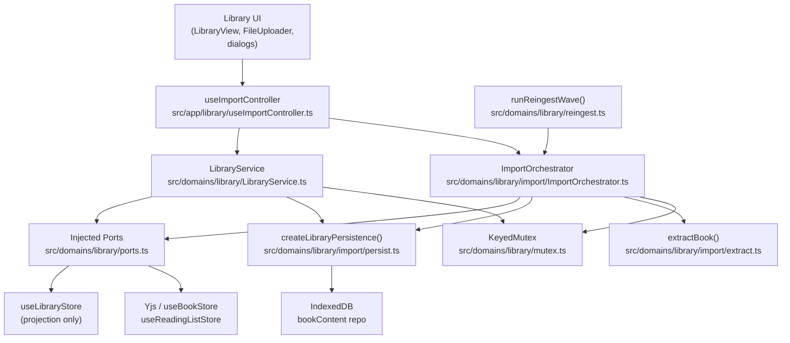
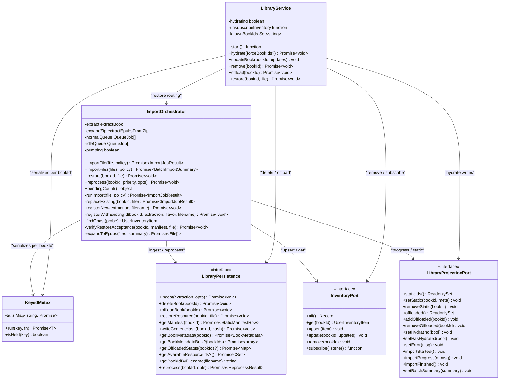
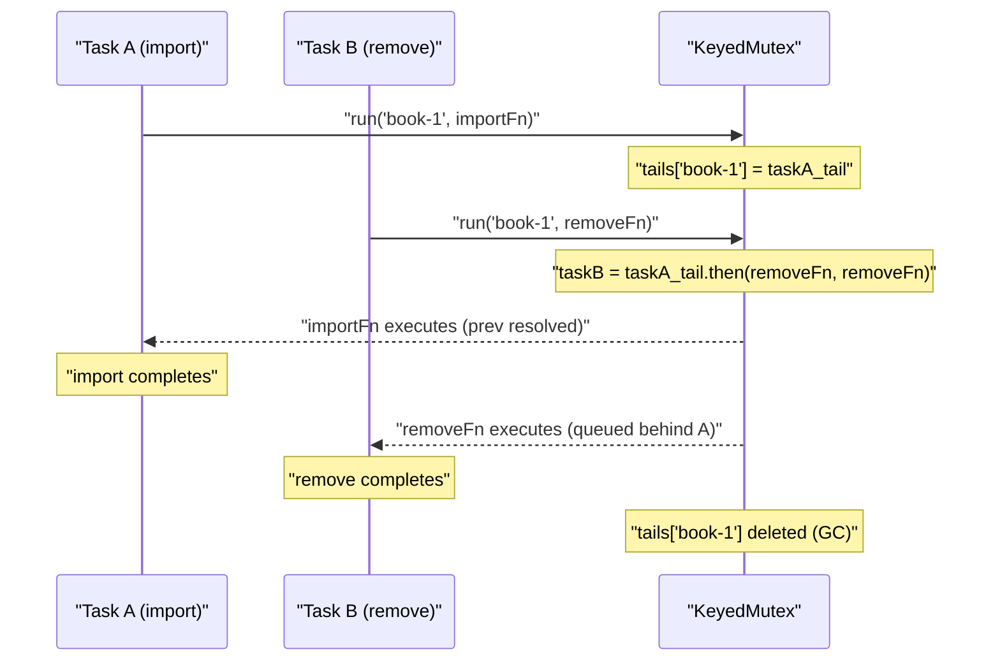
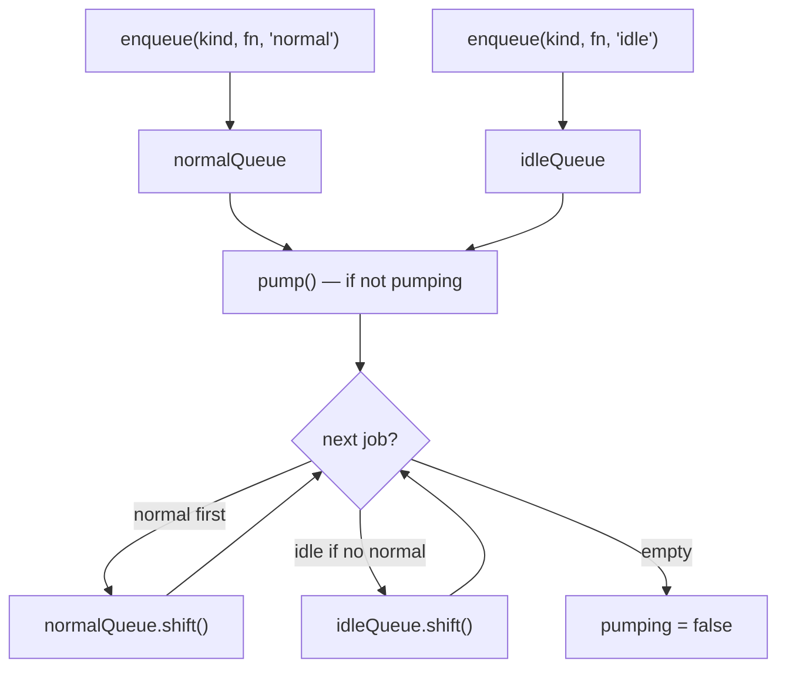
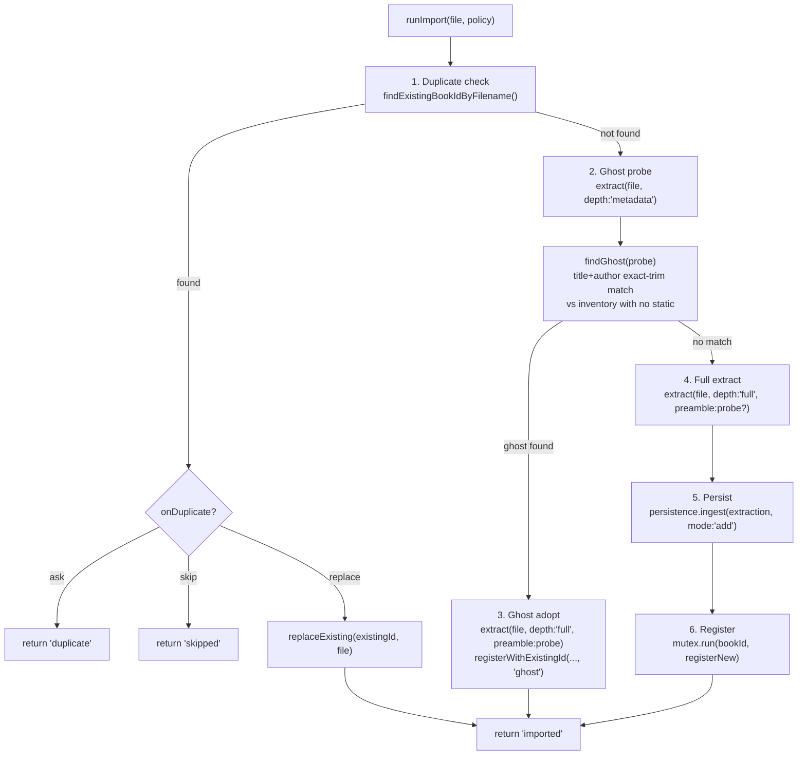
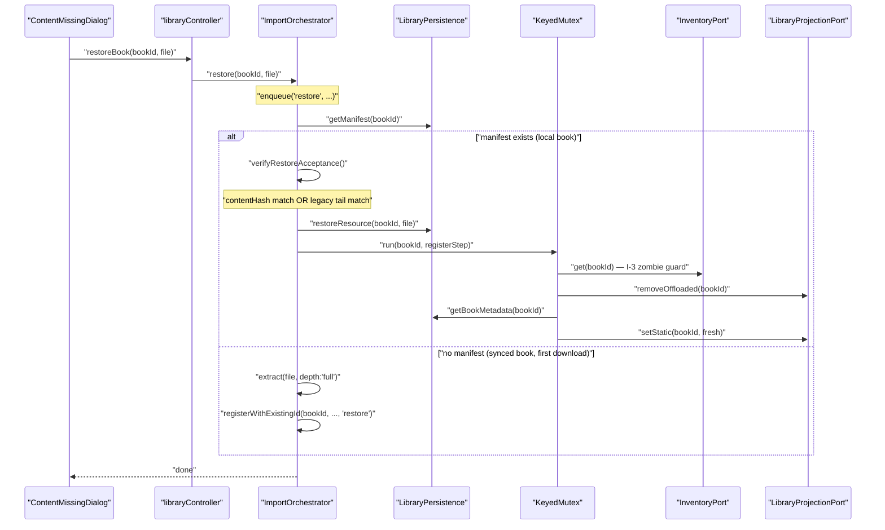
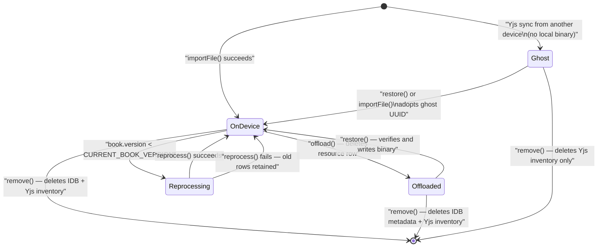

# Library Domain: Import & Management

The library domain is Versicle's book-lifecycle engine. It takes an EPUB (or ZIP of EPUBs) supplied by the user and produces a fully indexed library entry — parsed metadata, a compressed cover thumbnail with two color palettes, per-chapter TTS sentence/CFI batches, table screenshots, a synthetic fallback TOC, and the IndexedDB + Yjs records that the library UI renders. It also manages the ongoing lifecycle: offloading the binary to free space (keeping metadata), restoring it on demand, replacing/reprocessing a book in place, and running a background re-ingestion wave to upgrade legacy extraction-version stamps.

This document covers the architecture and implementation of `src/domains/library`, the composition root in `src/app/library`, the UI projection store `useLibraryStore`, and the related components in `src/components/library`. For the storage layer those writes land in, see [Storage gateway](20-storage-gateway.md). For the Yjs-synced inventory that this domain reads and writes, see [State management & CRDT](13-state-management-crdt.md). For TTS content-pipeline details, see [TTS content pipeline](34-tts-content-pipeline.md).

---

## Design Intent

### Why a Dedicated Domain

Before Phase 7 of the overhaul, book ingestion was implemented three times in `src/lib/ingestion.ts` (`extractBookData`, `extractBookMetadata`, `reprocessBook`), orchestrated from an 841-line store action (`useLibraryStore.addBook`) that mixed duplicate detection, ghost matching, extraction, persistence, reading-list reconciliation, and five distinct race guards in one closure. A batch import path bypassed the duplicate and ghost logic entirely, silently dropped failures, and never wrote reading-list entries (debt items D1–D3 in [plan/overhaul/analysis/ingestion-library.md](../../plan/overhaul/analysis/ingestion-library.md)).

The library domain (Phase 7 §A–§E) replaces all of that with three collaborating services:

- **`ImportOrchestrator`** — the single entry point for every import, restore, reprocess, and re-ingest job; queues jobs in FIFO with a normal/idle priority split.
- **`LibraryService`** — owns delete, offload, restore routing, and the hydration lifecycle; proves five named invariants against concurrent access.
- **`KeyedMutex`** — per-book serialization that makes the historical races (delete-vs-restore, concurrent reprocess runs) structurally impossible.

### The Ghost Book Model

A "ghost book" is a Yjs inventory entry with no local static metadata — the binary was never downloaded on this device, or was offloaded. Ghost books render with a placeholder cover but retain full reading-progress sync and metadata visibility across devices. The import pipeline detects ghosts during import (title + author exact-trim match against inventory entries that have no `staticIds` membership) and "adopts" them, linking the new binary to the existing UUID instead of creating a duplicate.

### Content Identity: Two Generations

Pre-Phase 7 restore used a legacy fingerprint embedding the filename, making restore of a renamed file spuriously fail (debt D7). The domain now maintains two identity tokens simultaneously:

| Token | How computed | When used |
|---|---|---|
| `contentHash` | SHA-256 (hex) over the full file bytes via `crypto.subtle` | Preferred restore acceptance (P7+ manifests) |
| `legacyFingerprint` (`fileHash`) | `${filename}-${title}-${author}-djb2(head4KB)-djb2(tail4KB)` | Still written; restore falls back to content-tail suffix match on pre-P7 manifests |

A successful legacy-tail accept triggers a lazy `contentHash` manifest upgrade so subsequent restores use the stronger check.

---

## Architecture Overview



The domain boundary is enforced by a depcruise rule: nothing inside `src/domains/library` may import from `src/store` or `src/app`. Instead, every store dependency is injected at construction time through the port interfaces defined in [ports.ts](../../src/domains/library/ports.ts). The composition root at [createLibrary.ts](../../src/app/library/createLibrary.ts) wires them.

---

## Class Structure



---

## The Composition Root

[src/app/library/createLibrary.ts](../../src/app/library/createLibrary.ts) is the one place where the domain classes are instantiated and wired to the real stores. It is lazily constructed (module-level singleton `instance`) and accessed via `getLibrary()`.

```typescript
// Simplified from createLibrary.ts
export function getLibrary(): LibraryComposition {
  if (instance) return instance;

  const mutex = new KeyedMutex();
  const inventory = buildInventoryPort();   // wraps useBookStore
  const readingList = buildReadingListPort(); // wraps useReadingListStore
  const projection = buildProjectionPort(); // wraps useLibraryStore
  const persistence = createLibraryPersistence({
    getBookMetadata: (id) => bookRepository.getBookMetadata(id),
    getBookMetadataBulk: (ids) => bookRepository.getBookMetadataBulk(ids),
    getBookIdByFilename: (name) => bookRepository.getBookIdByFilename(name),
  });

  const orchestrator = new ImportOrchestrator({
    mutex, inventory, readingList, projection, persistence,
    extractionOptions: () => ({
      sanitizationEnabled: useTTSSettingsStore.getState().sanitizationEnabled,
    }),
  });

  const service = new LibraryService({ mutex, inventory, projection, persistence, orchestrator });
  instance = { mutex, orchestrator, service };
  return instance;
}
```

The `extractionOptions` lambda captures TTS settings **per job** rather than at construction time, severing the `useTTSSettingsStore.getState()` reach-ins that previously lived inside `lib/ingestion.ts` (coupling #2 in the analysis).

The controller hook [src/app/library/useImportController.ts](../../src/app/library/useImportController.ts) provides the stable surface that all components call. It re-maps the orchestrator's `'duplicate'` result into a `DuplicateBookError` throw to preserve the pre-P7 signal that `ReplaceBookDialog` flows are built around.

---

## The KeyedMutex

[src/domains/library/mutex.ts](../../src/domains/library/mutex.ts) implements a per-book FIFO serialization queue. One instance is shared by both `ImportOrchestrator` and `LibraryService`, so every mutation of a given book ID — import, register, delete, offload, restore, reprocess — runs inside `mutex.run(bookId, fn)`.

```typescript
async run<T>(key: string, fn: () => Promise<T> | T): Promise<T> {
  const prev = this.tails.get(key) ?? Promise.resolve();
  const task = prev.then(fn, fn);         // fn regardless of prev outcome
  const tail = task.then(() => undefined, () => undefined);  // no unhandled rejections
  this.tails.set(key, tail);
  void tail.then(() => {
    if (this.tails.get(key) === tail) this.tails.delete(key); // GC
  });
  return task;
}
```

Key properties:
- **FIFO ordering**: task B for key K always runs after task A if A was enqueued first.
- **Failure isolation**: a predecessor's rejection does NOT block successors — `prev.then(fn, fn)` passes `fn` as both the fulfilment and rejection callback, so it always runs.
- **No unhandled rejection leakage**: the tail promise is always settled to `undefined`, keeping the stored tail non-rejected even when `fn` throws.
- **Automatic GC**: the tail self-deletes when it is still the current tail at settlement time, preventing unbounded growth on keys that are never touched again.



This makes the five historical races from `useLibraryStore` (documented in `LibraryService.invariants.test.ts`) structurally impossible rather than patched with copy-pasted zombie checks.

---

## Import Pipeline

### Entry Points

All import entry points converge on `useImportController` (the `libraryController` singleton):

| Entry point | File | Method |
|---|---|---|
| LibraryView file input / drag-drop | `src/components/library/LibraryView.tsx` | `controller.importFile` / `controller.importFiles` |
| FileUploader (multi-file + ZIP) | `src/components/library/FileUploader.tsx` | `controller.importFiles` |
| Replace dialog confirmation | `src/components/library/ReplaceBookDialog.tsx` | `controller.replaceFile` |
| ContentMissing restore | `src/components/library/ContentMissingDialog.tsx` | `controller.restoreBook` |
| ReprocessingInterstitial | `src/components/library/ReprocessingInterstitial.tsx` | `controller.reprocessBook` |
| Google Drive import | `src/domains/google` drive sync | orchestrator directly |

None of these entry points may hold onto the `orchestrator` or `service` directly — they all go through `useImportController`, which provides the `DuplicateBookError` translation layer.

### The FIFO Job Queue

`ImportOrchestrator` maintains two internal queues:

```typescript
private normalQueue: QueueJob[] = [];
private idleQueue: QueueJob[] = [];
private pumping = false;
```

`pump()` drains `normalQueue` first, then `idleQueue` — idle jobs (the §E re-ingest wave) only run while no user-initiated job is waiting. Each call to `enqueue()` appends to the appropriate queue and triggers a single `pump()`. The pump flag prevents concurrent drain cycles; the drain is sequential (no parallelism between jobs).



### Single-File Import Flow

The `runImport(file, policy)` private method implements the six-stage pipeline:



**Duplicate detection** runs synchronously against the in-memory Yjs inventory (`inventory.all()`) by `sourceFilename`, then falls back to `persistence.getBookIdByFilename(filename)` (the IDB index) to catch books whose inventory entry hasn't synced yet.

**Ghost probe** performs a `depth: 'metadata'` extraction (opens epubjs once, fetches cover, computes both palettes and hashes, reads publisher TOC) and matches against inventory items that have no entry in `projection.staticIds()`. The match is exact-trim on `title` and `author`; if either is empty the probe is skipped. A ghost match triggers `registerWithExistingId` with `flavor: 'ghost'`, which persists under the existing UUID and backfills the reading-list `bookId` FK if absent.

**The preamble reuse optimization**: when a probe was already performed, the full `extract()` call receives it as `preamble`. The extractor skips the ZIP-signature check, epubjs open, cover fetch, compression, palette extraction, and hash computation entirely — the second epubjs open goes straight to the offscreen chapter loop. This eliminates the double-extraction cost that affected every non-ghost import in the pre-P7 codebase (debt D2).

### Batch Import

`importFiles(files, policy)` wraps a single `enqueue('import', ...)` call. Inside that job:

1. `expandToEpubs(files, summary)` iterates the input, calling `extractEpubsFromZip` for `.zip` entries (up to 5 entries decompressed in parallel per chunk with a main-thread yield between chunks) and passing `.epub` files through directly. Unsupported types and ZIP extraction failures land in `summary.failed`.
2. A `seen` set deduplicates same-filename entries within the batch.
3. Each EPUB is processed via `runImport(epub, { onDuplicate: 'skip', adoptGhosts: true })` — duplicate files skip rather than surface the Replace dialog (which would block a batch).
4. Progress is emitted via `projection.importProgress(i/n * 100, message)` on each iteration.
5. The accumulated `BatchImportSummary` (`{ imported, skipped, failed }`) is written to the projection via `projection.setBatchSummary(summary)`.

This is a direct fix for debt D1: the old batch path bypassed duplicate detection, never wrote reading-list entries, and silently swallowed failures.

---

## The Extraction Pipeline

[src/domains/library/import/extract.ts](../../src/domains/library/import/extract.ts) is the single extraction pipeline, replacing three copies that previously lived in `src/lib/ingestion.ts`.

### `extractPreamble(file, options)`

Opens epubjs once to produce the shared metadata/cover/palette/TOC result:

1. Lazy-imports `epubjs` (Phase 8 §A first-use splitting — keeps it out of the entry chunk).
2. Awaits `book.ready`, reads `book.loaded.metadata` for raw title/author/description/language.
3. Fetches the cover via `book.coverUrl()` + `localFetch`, then optionally compresses it with `browser-image-compression` (maxSizeMB 0.1, maxWidthOrHeight 600, webp) for `cover: 'thumbnail'` mode; import uses thumbnail, reprocess uses `cover: 'raw'` for palette parity with the legacy implementation.
4. Extracts two palettes from the thumbnail (or raw cover): `coverPalette` (5×16-bit packed K-means) and `perceptualPalette` (CIELAB 50×50 grid). Palette failure is non-fatal — the field is omitted.
5. Reads `book.loaded.navigation.toc` for the publisher TOC.
6. Destroys the epubjs instance.

### `validateZipSignature(file)`

[src/domains/library/import/validate.ts](../../src/domains/library/import/validate.ts) reads the first 4 bytes and checks for the ZIP local-file-header magic (`50 4B 03 04`). EPUBs are ZIP archives; this check rejects plaintext files masquerading as EPUBs before epubjs opens them.

### `extractBook(file, opts)` — The Main Entry Point

Overloaded: `depth: 'metadata'` returns `BookMetadataExtraction`, `depth: 'full'` returns `FullBookExtraction`.

**Metadata depth** (the ghost probe):
1. Validates ZIP signature.
2. Calls `extractPreamble(file, { cover: 'thumbnail' })`.
3. Computes `legacyFingerprint` via `computeLegacyFingerprint` (using the **unsanitized** raw title/author — pre-P7 manifests were written this way).
4. Computes `contentHash` via `computeContentHash` (SHA-256 over full file bytes).
5. Sanitizes title/author/description via `getSanitizedBookMetadata` (DOMPurify-backed, max lengths 500/255/2000 characters).
6. Returns `BookMetadataExtraction` with `depth: 'metadata'`.

**Full depth** (re-uses preamble if supplied):
1. Builds `optionsWithLocale` from the extraction options + detected language.
2. Lazy-imports `extractContentOffscreen` from the offscreen renderer.
3. Calls `extractContentOffscreen(file, options, onProgress, signal)` — renders every spine item in a hidden epubjs iframe and extracts sentences/CFIs, chapter titles, dominant font metrics, and table screenshots.
4. Generates `bookId = uuidv4()`.
5. Calls `mapChapters(bookId, chapters)` to map the rendered chapters to all output shapes.
6. Assembles and returns `FullBookExtraction`.

### `mapChapters(bookId, chapters)`

[src/domains/library/import/extract.ts](../../src/domains/library/import/extract.ts) — formerly duplicated verbatim between `extractBookData` and `reprocessBook`. Now a shared pure function:

```typescript
export function mapChapters(bookId: string, chapters: ProcessedChapter[]): ChapterMapping {
  // For each chapter:
  //  - synthetic TOC entry (fallback when publisher TOC is absent)
  //  - SectionMetadata (characterCount, playOrder, title, id)
  //  - CacheTtsPreparation (sentences + CFIs)
  //  - TableImage batches
  //  - SearchTextSection (plain text corpus)
  // Returns totalChars as well (written to manifest)
}
```

The `id` for each section, TTS prep batch, and table image follows the convention `${bookId}-${chapter.href}`. When `retargetExtraction` rewrites a UUID later (ghost adopt, replace, synced restore), it replaces the old bookId prefix in all these IDs.

### `FullBookExtraction` Shape

```typescript
interface FullBookExtraction {
  depth: 'full';
  bookId: string;            // uuid
  title: string;             // sanitized
  author: string;            // sanitized
  description: string;
  language: string;          // normalized ISO 639-1
  coverBlob?: Blob;          // webp thumbnail
  coverPalette?: number[];   // 5×16-bit K-means
  perceptualPalette?: PerceptualPalette; // CIELAB
  contentHash: string;       // SHA-256 hex
  legacyFingerprint: string; // legacy fileHash
  toc: NavigationItem[];     // publisher TOC (may be [])
  manifest: StaticBookManifest;
  resource: StaticResource;  // { bookId, epubBlob }
  structure: { bookId, toc, spineItems };
  sections: SectionMetadata[];
  inventory: UserInventoryItem;  // THE ONE inventory producer (D4 fix)
  progress: UserProgress;
  overrides: UserOverrides;
  readingListEntry: ReadingListEntry;
  ttsContentBatches: CacheTtsPreparation[];
  tableBatches: TableImage[];
  searchText: BookSearchText;
}
```

The `inventory` field is the single authoritative producer for the `UserInventoryItem` that gets upserted into the Yjs store. This fixes debt D4: the pre-P7 code hand-built inventory items in three places in `useLibraryStore.ts`, none of which copied `perceptualPalette` or `language`, losing those fields for ghost books on other devices.

---

## Content Identity

[src/domains/library/import/identity.ts](../../src/domains/library/import/identity.ts)

### `computeContentHash(file)`

```typescript
export async function computeContentHash(file: Blob): Promise<string> {
  const buffer = await file.arrayBuffer();
  const digest = await crypto.subtle.digest('SHA-256', buffer);
  return Array.from(new Uint8Array(digest))
    .map((b) => b.toString(16).padStart(2, '0'))
    .join('');
}
```

Reads the entire file, computes SHA-256 via `crypto.subtle`, hex-encodes. Filename-independent. Used for restore acceptance on P7+ manifests and stored as `manifest.contentHash`.

### `computeLegacyFingerprint(file, metadata)`

Computes `${filename}-${title}-${author}-${cheapHash(head4KB)}-${cheapHash(tail4KB)}` where `cheapHash` is djb2. The title and author here must be the **unsanitized** raw values (as read from the OPF), since pre-P7 manifests were written that way.

### `matchesLegacyFingerprint(storedFileHash, file)`

For pre-P7 restore acceptance. Instead of recomputing the full fingerprint (which would need the old filename and unsanitized metadata), it compares only the content-dependent **suffix** — the two djb2 hex tokens — to the stored fingerprint's suffix. This allows a renamed file to restore successfully against a pre-P7 manifest.

```typescript
export async function matchesLegacyFingerprint(storedFileHash: string, file: Blob): Promise<boolean> {
  if (!storedFileHash) return false;
  const tail = await legacyContentTail(file);
  return storedFileHash.endsWith(`-${tail}`);
}
```

A successful legacy match triggers `persistence.writeContentHash(bookId, ...)` to lazily upgrade the manifest.

---

## Persistence Seam

[src/domains/library/import/persist.ts](../../src/domains/library/import/persist.ts) implements the `LibraryPersistence` port by delegating to the `bookContent` repository (IDB) and `searchTextRepo`.

### `createLibraryPersistence(merged)`

The factory takes a `MergedReadDeps` (injected by the composition root from `BookRepository`) and returns the full `LibraryPersistence` implementation:

```typescript
async ingest(extraction, opts) {
  await bookContent.ingest(
    { bookId, manifest, resource, structure, ttsContentBatches, tableBatches },
    opts.mode,  // 'add' or 'overwrite'
  );
  // Search corpus — non-fatal failure
  try {
    await searchTextRepo.put({ bookId, extractionVersion, sections });
  } catch (e) {
    logger.warn('searchText write failed (corpus will rebuild lazily):', e);
  }
},
```

The search corpus write is intentionally non-fatal: if it fails the row is rebuildable on first search. The binary write (`bookContent.ingest`) is transactional and goes through the data layer which handles the WebKit IndexedDB constraints (Blob-to-ArrayBuffer before the transaction; reads hoisted out of readwrite transactions — inherited from the Phase 3 D5.3 work).

### `retargetExtraction(extraction, bookId)`

When adopting a ghost, replacing an existing book, or restoring a synced-book download, the extractor produces a fresh UUID but the book must be stored under the existing one. `retargetExtraction` does a consistent ID rewrite across every field:

- `extraction.bookId`
- `manifest.bookId`
- `resource.bookId`
- `structure.bookId` and each `spineItems[i].id` (prefix replace)
- Each `sections[i].bookId` and `sections[i].id`
- Each `ttsContentBatches[i].bookId` and `ttsContentBatches[i].id`
- Each `tableBatches[i].bookId` and `tableBatches[i].id`
- `inventory.bookId`, `progress.bookId`, `overrides.bookId`

This absorbs the former `BookImportService.importBookWithId` id-rewrite (ledger row 10).

---

## ZIP Expansion

[src/domains/library/import/zip.ts](../../src/domains/library/import/zip.ts) uses JSZip to expand a ZIP archive into a list of `File` objects for EPUBs found within:

- Uses `FileReader.onprogress` to emit byte-level progress when a callback is provided.
- Iterates `validEntries` (non-directory `.epub` entries) in chunks of 5, calling `zipEntry.async('blob')` per entry and yielding to the main thread between chunks (`setTimeout(resolve, 0)`).
- Nested paths are flattened to basenames; downstream duplicate detection catches any basename collisions.
- Abort signal checks between chunks via `CancellationError`.

---

## Metadata Sanitization

[src/domains/library/import/metadata.ts](../../src/domains/library/import/metadata.ts) provides `getSanitizedBookMetadata`, moved verbatim from `src/lib/ingestion.ts` (previously from `src/db/validators.ts`). It applies DOMPurify-backed sanitization to raw OPF metadata:

| Field | Max length | Sanitization |
|---|---|---|
| `title` | 500 characters | DOMPurify strip + trim |
| `author` | 255 characters | DOMPurify strip + trim |
| `description` | 2000 characters | DOMPurify strip + trim |

`getSanitizedBookMetadata` returns a `SanitizationResult | null`, logging any modifications. The sanitize-at-ingest boundary is respected: sanitization happens on the raw metadata before the `shared` object is assembled in `extractBook`, so the stored and synced values are always sanitized.

---

## The LibraryService and Its Invariants

[src/domains/library/LibraryService.ts](../../src/domains/library/LibraryService.ts) owns the non-import book lifecycle: `start` (inventory subscription), `hydrate`, `updateBook`, `remove`, `offload`, and `restore` routing.

### `start()` — Delta Subscription (D16 Fix)

```typescript
start(): () => void {
  this.knownBookIds = new Set(Object.keys(this.deps.inventory.all()));
  const unsubscribe = this.deps.inventory.subscribe((books) => {
    const ids = Object.keys(books);
    const hasNew = ids.some((id) => !this.knownBookIds.has(id));
    this.knownBookIds = new Set(ids);
    if (hasNew) {
      void this.hydrate().catch((e) => logger.error('Delta hydration failed:', e));
    }
  });
  // ...
}
```

This replaces the `prevBookCountRef` heuristic that previously lived in `LibraryView.tsx` (debt D16). The service subscribes to inventory changes at boot and triggers hydration whenever a new book ID appears — independent of which route is mounted.

### `hydrate(forceBookIds?)`

Reads static metadata from IDB for every inventoried book and merges it into the projection:

1. **Snapshot offloaded set** before any async work (captures the pre-read state for the concurrent-restore detection in step 5).
2. **Bulk fetch**: prefers `persistence.getBookMetadataBulk(bookIds)` if available (one IDB transaction for all keys); falls back to `Promise.all(bookIds.map(id => getBookMetadata(id)))`.
3. **Per-key merge (I-1)**: for each manifest, skip if `staticIds.has(manifest.id)` and the ID is not in `forceBookIds`. This preserves writes that arrived concurrently (e.g. an import that completed during the DB read).
4. **Never-resurrect check (I-2)**: skip if `!inventory.get(manifest.id)` — a book concurrently removed from the Yjs store is not re-added to the projection.
5. **Offloaded status**: prefers `persistence.getAvailableResourceIds()` (a Set of IDs with a local binary); falls back to `persistence.getOffloadedStatus(bookIds)`. Applies per-key (I-5): a concurrently cleared offloaded flag (restore was concurrently completed) is detected by comparing `offloadedBefore.has(id) && !current.has(id)` — if so, the stale "offloaded" result from the DB is not re-applied.

### The Five Invariants

The invariant suite is in [src/domains/library/LibraryService.invariants.test.ts](../../src/domains/library/LibraryService.invariants.test.ts), which was written at the Phase 7 entry gate against a `LibraryWorkflows` adapter interface, then swapped to exercise the real `LibraryService`/`ImportOrchestrator` at the PR-L4 cutover with assertions unchanged.

| Invariant | What it prevents | Where enforced |
|---|---|---|
| **I-1** hydrate is a per-key merge | Overwriting concurrent additions during a slow DB read | `staticIds.has(id) && !force.has(id)` skip in `hydrate` |
| **I-2** hydration never resurrects | Re-adding a concurrently-removed book to the projection | `!inventory.get(manifest.id)` guard at write time |
| **I-3** restore re-validates existence | Resurrecting a zombie book if remove and restore race | `!inventory.get(bookId)` early return inside the mutex in `registerWithExistingId` |
| **I-4** failure paths restore captured prior state | Clearing the offloaded flag when a redundant offload fails | `wasAlreadyOffloaded` snapshot before optimistic write; conditional revert |
| **I-5** offloaded set updated per-key | Overwriting a concurrent restore with a stale DB snapshot | `offloadedBefore.has(id) && !current.has(id)` skip in `hydrate` |

The invariants were previously enforced by five ad-hoc regression tests (`useLibraryStore.race.test.ts`, `removeRace`, `restoreRace`, `offloadRevert`, `offloadedRace`). Those files were deleted at the PR-L4 cutover (plan/overhaul/prep/phase7-absorption-ledger.md rows 5–9); the invariant suite replaces them.

The suite also includes a **property-style test** that enumerates all sequentially-reachable terminal states for `hydrate ∥ remove` and `hydrate ∥ offload` with 16 seeded random latency profiles, verifying that every concurrent interleaving terminates in a state reachable by some sequential ordering.

### `remove(bookId)`

```typescript
async remove(bookId: string): Promise<void> {
  await this.deps.mutex.run(bookId, async () => {
    inventory.remove(bookId);         // Yjs
    projection.removeStatic(bookId);
    projection.removeOffloaded(bookId);
    await persistence.deleteBook(bookId);  // IDB
  });
  // On failure: setError + re-hydrate
}
```

Runs under the book's mutex, so an in-flight restore or import for the same ID is guaranteed to complete before the delete starts. On failure it re-hydrates to restore the projection to a consistent state.

### `offload(bookId)` — Optimistic with I-4 Revert

```typescript
async offload(bookId: string): Promise<void> {
  await this.deps.mutex.run(bookId, async () => {
    const wasAlreadyOffloaded = projection.offloaded().has(bookId);
    projection.addOffloaded(bookId);  // optimistic
    try {
      await persistence.offloadBook(bookId);
    } catch (err) {
      projection.setError('Failed to offload book.');
      if (!wasAlreadyOffloaded) projection.removeOffloaded(bookId);  // I-4 revert
    }
  });
}
```

The `wasAlreadyOffloaded` snapshot is taken before the optimistic write. If the persistence call fails and the book was **not** already offloaded, the flag is reverted. If it was already offloaded (redundant call), the flag stays — the captured prior state was "offloaded", not "not offloaded".

### `restore(bookId, file)`

Delegates directly to `orchestrator.restore(bookId, file)`, which runs as a job in the `ImportOrchestrator` queue. This serialization via the queue (and the mutex inside the register step) is what implements I-3.

---

## Restore Flow

`ImportOrchestrator.restore(bookId, file)` branches on whether a local manifest exists:



**Restore acceptance** (`verifyRestoreAcceptance`):
1. If `manifest.contentHash` exists: compute SHA-256 of the supplied file and compare — exact match required.
2. Else (pre-P7 manifest, `manifest.fileHash` only): call `matchesLegacyFingerprint` (content tail suffix comparison). On success, lazily write `contentHash` back to the manifest.

**No-manifest path** (synced book never downloaded): runs a full `extract(file, depth: 'full')` and calls `registerWithExistingId(bookId, extraction, 'restore', file.name)`. The ghost/restore flavor of `registerWithExistingId` updates the reading-list entry's `bookId` FK if absent but does not overwrite `title`/`author`/`status`/`tags`/`rating` — those belong to the user's Yjs inventory.

---

## Book Lifecycle State Machine



A "ghost" book has a Yjs inventory entry (`useBookStore`) but no row in `staticMetadata` (checked via `projection.staticIds()`). The `ContentMissingDialog` is shown when the user tries to open a ghost or offloaded book. The offloaded state is tracked in `useLibraryStore.offloadedBookIds` (a `Set<string>`), which is authoritative for the current session and re-hydrated from IDB on startup and on inventory changes.

---

## The Re-Ingest Wave

[src/domains/library/reingest.ts](../../src/domains/library/reingest.ts) implements a background wave that upgrades legacy TTS extraction-version stamps.

### The Problem

Pre-P7 TTS sentence extraction used NFKD-normalized text before sentence segmentation. CFI offsets are computed against the rendered DOM text. For books with decomposable characters (é → e + combining accent, fi → f + i ligature), NFKD normalization could cause CFI drift — TTS playback jumps to slightly wrong positions.

Three generations of rows exist:
- **v1 (implicit)**: NFKD-normalized segmentation; CFIs may have drifted for books with decomposable characters.
- **v2**: raw-text segmentation (correct offsets); baked ingest-time refinement.
- **v3 ("raw at rest")**: raw-text storage; playback re-refines tolerantly. v2 rows keep working under v3 playback.

### Detection and Dispatch

```typescript
export async function runReingestWave(deps: ReingestWaveDeps): Promise<ReingestWaveReport> {
  const versions = await deps.listVersions(); // bookId → min stamped version
  for (const [bookId, version] of versions) {
    if (version >= TTS_EXTRACTION_VERSION) continue;
    if (version <= 1) {
      // Fast path: is this v1 book NFKD-invariant?
      const rows = await deps.listRows(bookId);
      if (rowsAreNfkdInvariant(rows)) {
        await deps.restamp(bookId, 2);
        report.restamped.push(bookId);
        continue; // no re-extraction needed
      }
      drifted.push(bookId); // needs full re-extract
    } else {
      convergence.push(bookId); // v2 → v3 upgrade
    }
  }
  // Process drifted before convergence (user-visible fix first)
  for (const bookId of [...drifted, ...convergence]) {
    if (!(await deps.hasLocalBinary(bookId))) { report.skipped.push(bookId); continue; }
    await deps.reingest(bookId); // idle-priority job in the orchestrator
  }
}
```

### The NFKD Restamp Fast Path

`rowsAreNfkdInvariant(rows)` checks whether every sentence in every stored row satisfies `s.text === s.text.normalize('NFKD')`. If so, the v1 rows are byte-identical to what v2 extraction would produce (no decomposable characters were present, so no offset drift was possible). The function stamps them to v2 in-place with no re-extraction — purely a row scan, no EPUB open.

### The R4 Alignment Self-Check

To prevent a faulty re-extraction from replacing good rows with broken ones, `derivedContentSane` is called before persisting:

```typescript
export function derivedContentSane(
  oldRows: CacheTtsPreparationRow[],
  next: ChapterMapping,
): boolean {
  const oldSentences = oldRows.reduce((acc, r) => acc + r.sentences.length, 0);
  const newSentences = next.ttsContentBatches.reduce((acc, r) => acc + r.sentences.length, 0);
  if (oldSentences === 0) return true;
  if (newSentences === 0) return false;
  return newSentences >= oldSentences * 0.5; // collapse threshold
}
```

A re-extraction that produces fewer than 50% of the old sentence count is rejected: the old rows are retained and the book is marked `failed` in the wave report. The threshold is generous (raw-at-rest v3 may legitimately segment differently than refined v1/v2), but it rejects catastrophic loss.

### Resumability

The per-book extraction version stamp IS the durable resume marker. A killed wave (app close, crash, shutdown) continues where it stopped on the next boot: books that reached the current `TTS_EXTRACTION_VERSION` are skipped, books still below it are retried.

Offloaded and ghost books are skipped (`hasLocalBinary(bookId)` returns false); they heal automatically when the binary is restored or imported.

---

## The Projection Store

[src/store/useLibraryStore.ts](../../src/store/useLibraryStore.ts) is the UI projection for the library domain — purely transient, local state that components render. It was reduced from an 841-line workflow store to a focused projection layer in Phase 7 §D.

```typescript
interface LibraryState {
  staticMetadata: Record<string, BookMetadata>;  // title/author/cover — from IDB
  offloadedBookIds: Set<string>;                 // per-key add/remove only (I-5)
  isHydrating: boolean;
  hasHydrated: boolean;
  isLoading: boolean;
  isImporting: boolean;
  importProgress: number;          // 0–100, per active job
  importStatus: string;
  uploadProgress: number;          // ZIP expansion progress
  uploadStatus: string;
  batchImportSummary: BatchImportSummary | null;
  error: string | null;
  // ... projection primitive actions
}
```

The I-5 discipline is **structural**: the store exposes `markOffloaded(id)` and `unmarkOffloaded(id)` per-key actions but no `setOffloadedBookIds(Set)` wholesale setter. A port implementation cannot express wholesale replacement.

Components read from this store but never call its actions directly — all mutations flow through `libraryController` → domain services → projection port.

---

## UI Components

### LibraryView

[src/components/library/LibraryView.tsx](../../src/components/library/LibraryView.tsx) renders the library grid/list and coordinates dialogs. It holds no import logic of its own after Phase 7 — it calls `useImportController()` and routes user actions to the controller:

```typescript
const controller = useImportController();
// ...
// Drop handler:
await controller.importFiles(droppedFiles);
// Delete:
await controller.removeBook(book.id);
// Offload:
await controller.offloadBook(book.id);
// Restore:
await controller.restoreBook(book.id, file);
```

Books are rendered via `useAllBooks()` (from `@store/libraryViewStore`) which performs the 5-store merge (inventory + static metadata + offload set + progress + reading-list).

### ReprocessingInterstitial

[src/components/library/ReprocessingInterstitial.tsx](../../src/components/library/ReprocessingInterstitial.tsx) shows a blocking overlay when a book's schema version is below `CURRENT_BOOK_VERSION`. It calls `libraryController.reprocessBook(bookId)`, which routes through the `ImportOrchestrator` queue under the book's mutex — making concurrent reprocess runs (debt D6) impossible by construction, without needing any additional in-flight guard in the component.

### ContentMissingDialog

[src/components/library/ContentMissingDialog.tsx](../../src/components/library/ContentMissingDialog.tsx) handles both local file restore (hidden `<input type="file">`) and Google Drive restore. The Drive path calls `getDriveLibrarySync().importFile(driveFileId, name, { overwrite: true }, { interactive: true })` directly via the Google domain, which routes into the orchestrator. The local path calls `onRestore(file)` — a prop supplied by `LibraryView` that calls `controller.restoreBook(bookId, file)`.

The dialog probes the Drive file index on open (`findFile(book.title, book.filename)`) to show a "Restore from Cloud" button when a matching file exists, including offline Drive-disconnected reconnect handling.

### OffloadBookDialog and DeleteBookDialog

Both follow the same pattern: receive the book as a prop, call the relevant controller method, show a spinner, and close on success. They rely on the controller's error projection (`useLibraryStore.error`) and toast store for failure feedback.

---

## Ports Reference

[src/domains/library/ports.ts](../../src/domains/library/ports.ts) defines the full injected-port surface:

| Port | Interface | Backed by |
|---|---|---|
| `InventoryPort` | `all / get / upsert / upsertMany / update / remove / subscribe` | `useBookStore` (Yjs) |
| `ReadingListPort` | `get / upsert / update` | `useReadingListStore` (Yjs) |
| `LibraryProjectionPort` | per-key static/offloaded writes, progress, error | `useLibraryStore` |
| `LibraryPersistence` | ingest / delete / offload / restore / manifest / hash / metadata / reprocess | `bookContent` repo + `searchTextRepo` |
| `ExtractionOptionsProvider` | `() => ExtractionOptions` | `() => useTTSSettingsStore.getState()` |

The `LibraryPersistence` interface deliberately omits `getBookIdByFilename` from the bulk-read group because it is synchronous (IDB index kept in memory by the repository), while the rest are async. The optional methods (`getBookMetadataBulk`, `getAvailableResourceIds`) allow the persistence implementation to provide more efficient paths when available, with the service falling back gracefully if absent.

`BatchImportSummary` is also defined here for symmetry, even though it is an output type rather than a port:

```typescript
export interface BatchImportSummary {
  imported: number;
  skipped: string[];         // filenames
  failed: { filename: string; reason: string }[];
}
```

---

## Domain Boundary and Coupling Rules

The domain must never import from `src/store`, `src/app`, or `src/components`. The only direction permitted is:

```
src/components → src/app → src/domains → src/data / src/lib (pure)
```

The composition root (`createLibrary.ts`) is the one seam where store references are converted into port implementations. This is enforced by a depcruise rule (`domains-no-store`) that exits non-zero at CI time.

The `ExtractionOptionsProvider` lambda (captured per job in `extractionOptions: () => (...)`) is how TTS settings reach the extraction pipeline without the pipeline importing `useTTSSettingsStore`. The options are snapshotted at the moment each job starts executing, not at enqueue time.

---

## Testing Coverage

| File | What it covers |
|---|---|
| [LibraryService.invariants.test.ts](../../src/domains/library/LibraryService.invariants.test.ts) | I-1..I-5 property and regression proofs; property test with 16 seeds |
| [importFlows.characterization.test.ts](../../src/domains/library/importFlows.characterization.test.ts) | Full import pipeline characterization: single, batch, ghost, replace, restore, ZIP; reading-list entry creation |
| [reingest.test.ts](../../src/domains/library/reingest.test.ts) | NFKD restamp fast path; R4 self-check; idle skipping; no-binary skip |
| [mutex.test.ts](../../src/domains/library/mutex.test.ts) | FIFO order; cross-key concurrency; failure isolation; GC |
| [import/extract.test.ts](../../src/domains/library/import/extract.test.ts) | Identity functions; ZIP signature validation |
| [import/identity.test.ts](../../src/domains/library/import/identity.test.ts) | Legacy fingerprint tail matching; SHA-256 hash stability |
| [import/persist.test.ts](../../src/domains/library/import/persist.test.ts) | ID rewrite consistency in `retargetExtraction` |

Test infrastructure uses `makeTestLibrary`, `makeLibraryPersistenceDouble`, `makeFullExtraction`, `makeBookMetadata`, and `makeInventoryItem` from `@test/harness`, allowing tests to exercise the real `LibraryService` and `ImportOrchestrator` with an in-memory persistence double.

---

## Cross-Cutting Concerns

### StorageFullError

The orchestrator catches `StorageFullError` specially in `runImport`:

```typescript
const message =
  error instanceof StorageFullError
    ? 'Device storage full. Please delete some books.'
    : 'Failed to import book.';
```

`StorageFullError` is thrown by `bookContent.ingest` when the IDB quota is exceeded on the persistence write.

### CancellationError

`extractBook` accepts an `AbortSignal` and calls `throwIfAborted(signal)` between chapters during the offscreen render loop. `extractEpubsFromZip` also checks the signal between entry chunks. Cancellation surfaces as `CancellationError` (from `@lib/cancellable-task-runner`). The orchestrator does not currently wire `AbortSignal` through to jobs, but the seam is in place for future cancellation support.

### WebKit IDB Discipline

All Blob-to-ArrayBuffer conversions for binary data happen before any IDB readwrite transaction opens. Reads are never issued inside a readwrite transaction. This discipline was established in Phase 3 D5.3 and is maintained by the data layer (`bookContent.ingest`, `bookContent.replaceDerivedContent`) — the library domain adds no transaction logic of its own.

### Search Corpus

Every `ingest` and `reprocess` call writes a `BookSearchText` row to `searchTextRepo`:

```typescript
{ bookId, extractionVersion: TTS_EXTRACTION_VERSION, sections: SearchTextSection[] }
```

Each `SearchTextSection` is `{ href, title, text }` where `text` is the chapter's full plain-text content. This is the persisted corpus for full-text search. Failures are non-fatal (the row rebuilds on first search). See [Domain: search](38-domain-search.md) for how the corpus is queried.

---

## Key Invariants Summary

1. **One pipeline**: `extractBook` is the only extraction path. Reprocess, restore, ghost-adopt, and re-ingest all invoke the same `extractPreamble` + `mapChapters` combination.
2. **One entry point**: `ImportOrchestrator` is the only entity that writes new book content to IDB. Components call the controller; the controller calls the orchestrator.
3. **One inventory producer**: `extraction.inventory` (built inside `extractBook`) is the authoritative source for new `UserInventoryItem` objects. Registration stages consume it; they do not re-derive it.
4. **Per-key serialization**: every mutation on a given book ID runs inside `mutex.run(bookId, fn)`, shared between the orchestrator and the service.
5. **Never resurrect**: `registerWithExistingId` and `hydrate` both re-validate `inventory.get(bookId)` inside the mutex before writing to the projection.
6. **Per-key offloaded deltas**: `LibraryProjectionPort` has no wholesale setter; the `I-5` discipline is structural.
7. **Captured prior state on failure**: offload reverts to the snapshot taken before the optimistic write, not an assumed "not offloaded" default.
