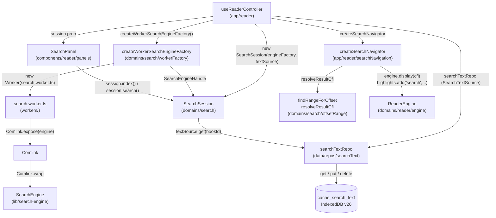
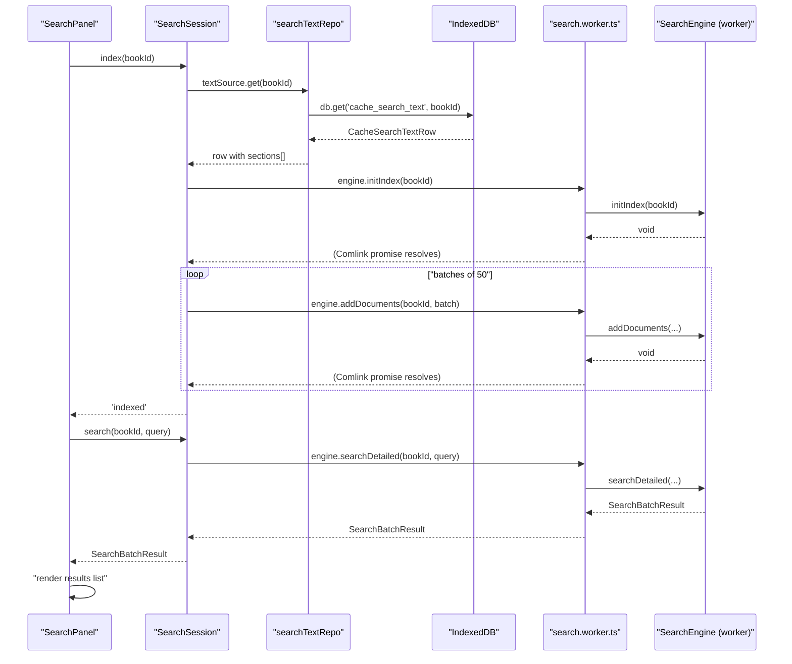
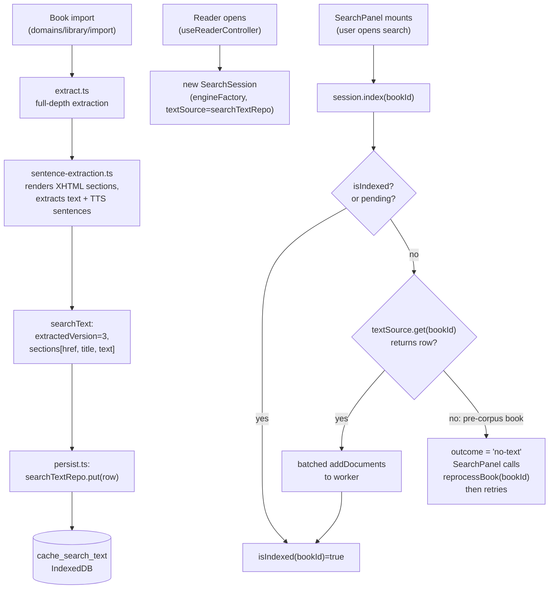
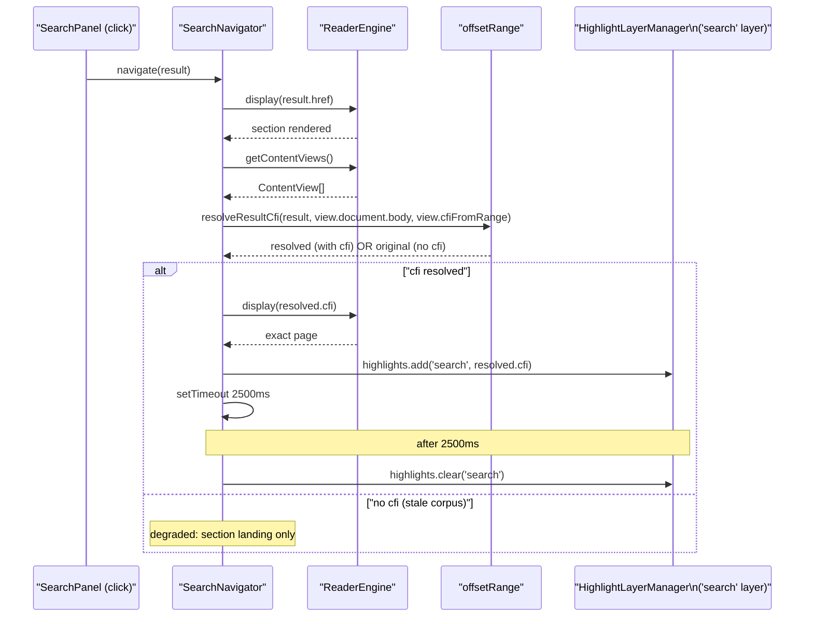
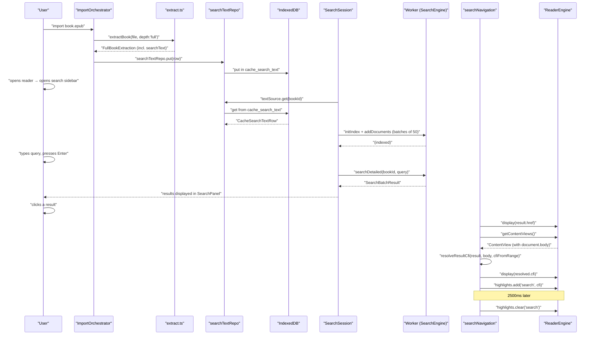

# Search Domain

In-book full-text search: `SearchSession`, the persisted text corpus, the `SearchEngine` worker, offset-to-range resolution, and CFI-based exact-occurrence navigation. Plus the **semantic-search subsystem** layered on top: the `EmbeddingIndexer`, the chunker, int8-quantized cosine ranking in the worker, reciprocal-rank fusion of meaning-based hits into the regex results, and the search-side of the shared-AI-cache "Artifact Lane".

Related documents: [Architecture overview](10-architecture-overview.md) · [Reader engine](30-domain-reader-engine.md) · [Reader UI and overlays](31-reader-ui-and-overlays.md) · [Storage gateway](20-storage-gateway.md) · [Schema and migrations](21-schema-and-migrations-idb.md) · [Domain library](37-domain-library.md) · [Bootstrap and lifecycle](14-bootstrap-and-lifecycle.md) · [Domain Google / GenAI](40-domain-google-genai.md) · [Domain sync](36-domain-sync.md)

---

## Why this domain exists

When a user opens the search sidebar inside the reader they need to locate a word or phrase anywhere in the book's text, then jump to the exact occurrence. The EPUB format stores content as a collection of XHTML spine items — there is no global text index. The search domain's job is to:

1. Hold a per-session in-memory scan index populated from a **persisted plain-text corpus** (so the extraction cost is paid once per book, not once per reading session).
2. Run case-insensitive queries that return **per-occurrence results** with enough position data to navigate to the exact match — not just the chapter.
3. Own the **worker lifecycle** cleanly: one `SearchSession` per open reader, created by the reader controller, disposed on reader unmount.
4. Degrade gracefully: if the worker crashes, if the corpus has not yet been extracted, or if CFI resolution fails, the system falls back to a sensible lesser capability without throwing.

The search domain is deliberately narrow. It does not index across multiple books, does not persist query history, and does not share anything with library metadata search (which is a plain `Array.filter` in the library view) or notes search (a separate controlled input). Cross-linking those features is listed as a future follow-on once the persisted corpus makes it cheap.

### Semantic search (the embeddings subsystem)

On top of that exact-literal regex engine, the domain hosts an **opt-in semantic ("meaning-based") search**: the same `cache_search_text` corpus is sub-chunked, each chunk is embedded with Gemini Embedding 2, the vectors are stored int8-quantized in a new `cache_embeddings` store, and a query is ranked by int8 cosine. The semantic hits are **fused into** the regex results via reciprocal-rank fusion (RRF) — they never *replace* full-text search. Regex full-text remains the graceful **default** path whenever semantic is off, unconfigured, quota-exhausted, or the book is not yet embedded, so the privacy/cost-free baseline is always available and nothing leaves the device unless semantic search is explicitly enabled. The full design (chunk sizing, int8@768 quantization, the cross-provider quota governor, the consent model, and the shared-AI-cache "Artifact Lane") lives in [plan/semantic-search-design.md](../../plan/semantic-search-design.md) and [plan/shared-ai-cache-design.md](../../plan/shared-ai-cache-design.md).

The expensive part of semantic search is the embedding API spend. To avoid re-paying it, the **Artifact Lane** mirrors a book's embedding blob into the user's own BYO cloud and lets the user's *other* devices download it instead of re-embedding (this domain owns the pure blob codec and the int8 vectors; the cloud round-trips themselves live in the [sync domain](36-domain-sync.md) and the app layer). The cross-provider **quota governor** that paces all embedding (and other GenAI) traffic lives in the kernel — see [Domain Google / GenAI](40-domain-google-genai.md); this document covers only the search-side consumers of those subsystems.

---

## Architecture



### Layers

| Layer | Module | Responsibility |
|---|---|---|
| Domain | `src/domains/search/` | `SearchSession`, `workerFactory`, `offsetRange`, `protocol` — no store imports, no React |
| Domain (semantic) | `src/domains/search/` | `EmbeddingIndexer`, `chunker`, `semanticRank`, `rrf`, `queryEmbeddingCache`, `embeddingPort`, `artifactBlob` — injected ports only; no store, no `google/`, no React |
| Engine (worker-side) | `src/lib/search-engine.ts` | `SearchEngine` class: in-memory store, escaped-literal scan, excerpt generation, **int8 quantize + cosine + `rankInt8`** |
| Worker entry | `src/workers/search.worker.ts` | 5-line file: `Comlink.expose(new SearchEngine())` (now also proxies `rankInt8`) |
| Data | `src/data/repos/searchText.ts` | `SearchTextRepo`: IDB CRUD for `cache_search_text` |
| Data (semantic) | `src/data/repos/embeddings.ts` | `EmbeddingsRepo`: IDB CRUD for `cache_embeddings` + `cache_embed_jobs`; `putHydrated`, `runEviction` |
| App layer | `src/app/reader/useReaderController.ts` | Wires `SearchSession` + `SearchNavigator` + the `EmbeddingIndexer` + the semantic query ports; reader controller owns the lifecycle |
| App layer | `src/app/reader/searchNavigation.ts` | `createSearchNavigator`: CFI resolve → display → highlight |
| App layer (semantic) | `src/app/google/artifactConsult.ts` | `ArtifactConsult`: probe/hydrate the shared embedding cache before the quota gate (the store/manifest/backend edges the codec can't reach) |
| App layer (semantic) | `src/app/boot/embeddingBackfill.ts`, `artifactPublisher.ts`, `artifactSweeper.ts` | Background backfill, upload publisher, cloud TTL/quota sweeper boot tasks |
| UI | `src/components/reader/panels/SearchPanel.tsx` | React panel; drives indexing, querying, result display |
| Types | `src/types/search.ts` | `DetailedSearchResult`, `SearchBatchResult`, `SearchSection` |

The domain boundary is enforced by `depcruise domains-no-store`: nothing inside `src/domains/search/` may import stores, React, or `app/`. The reader controller (`app/`) bridges those layers by passing injected collaborators (`textSource`, `engineFactory`, and — for semantic — `embeddingClient`, `embeddingsSource`, `quantize`, `getSemanticConfig`, the `EmbeddingIndexer`, and the consult adapter) into the session. The same rule keeps the search domain from deep-importing `@domains/google`: the embedding client arrives as an injected port (`EmbeddingClientPort`), never a concrete dependency, so the GenAI impl stays out of the entry chunk.

---

## Data shapes

### `SearchSection` — the indexing unit

```typescript
// src/types/search.ts
export interface SearchSection {
  id: string;
  href: string;      // spine item path, e.g. "OEBPS/ch01.xhtml"
  text?: string;     // plain text (textContent of the rendered section)
  title?: string;    // display title carried through to results
}
```

`SearchSection` is fed to the engine in batches via `addDocuments`. The `title` field flows through to every per-occurrence result so the UI can show "Chapter 3 · Result 2" rather than a raw href.

### `DetailedSearchResult` — one hit

```typescript
// src/types/search.ts
export interface DetailedSearchResult {
  href: string;
  sectionTitle?: string;
  excerpt: string;        // ±40 chars around the match from the ORIGINAL string
  charOffset: number;     // code-unit offset of the match start in the indexed text
  matchLength: number;    // code-unit length of the matched text
  occurrence: number;     // 1-based ordinal within this section
  cfi?: string;           // NEVER set by the engine; resolved lazily via resolveResultCfi
}
```

`charOffset` and `matchLength` together define an exact position in the section's plain-text stream (the same stream that `findRangeForOffset` walks node-by-node). The engine never touches the DOM; CFI resolution happens on the main thread after the section is rendered.

### `SearchBatchResult` — the query response

```typescript
// src/types/search.ts
export interface SearchBatchResult {
  results: DetailedSearchResult[];
  truncated: boolean;   // true when more matches existed beyond the cap
}
```

The `truncated` flag replaces the old silent 50-result cap: the UI surfaces "Showing the first N matches" when it is set. `DEFAULT_LIMIT = 50` is `SearchEngine.DEFAULT_LIMIT`; callers may override via `opts.limit`.

### `CacheSearchTextRow` — the persisted corpus

```typescript
// src/data/rows/cache.ts
export type CacheSearchTextRow = {
  bookId: string;
  extractionVersion: number;   // TTS_EXTRACTION_VERSION (currently 3)
  sections: { href: string; title: string; text: string; sectionTextHash?: string }[];
};
```

One row per book, keyed by `bookId` in the `cache_search_text` IDB object store (v26 migration, see [Schema and migrations](21-schema-and-migrations-idb.md)). The row is written at import time by the library persistence layer and deleted atomically with the book's other rows. `extractionVersion` is the invalidation stamp; rows below the current extraction version cause re-extraction.

`sectionTextHash` is an **additive** per-section field stamped at import (a `cheapHash` over the section's text bytes — computed in the app/import layer, not in the store-free domain). It is the embedding indexer's fine-grained re-embed key: a section whose `{href, sectionTextHash}` is unchanged is resume-skipped, so the two `extractionVersion` bumps in project history (both segmenter/CFI changes that left section *body text* untouched) re-embed nothing. Rows written before this field existed simply lack it and fall back to re-extraction/re-embed — no migration, no `DB_VERSION` bump.

### The embedding rows — `CacheEmbeddingsRow` and `CacheEmbedJobsRow`

```typescript
// src/data/rows/cache.ts
export type CacheEmbeddingsRow = {
  bookId: string;
  model: string;            // 'gemini-embedding-2' (the embedding-space stamp …)
  dims: number;             // 768
  quant: 'int8-pervec';     // … with quant and extractionVersion
  extractionVersion: number;
  sections: {
    href: string;
    sectionTextHash: string;
    chunks: {
      cfiStart: string;     // always '' — CFIs are resolved lazily at click time
      cfiEnd: string;       // always ''
      tokenCount: number;
      charStart?: number;   // additive: char offsets the read path recovers
      charEnd?: number;
    }[];
    vectors: ArrayBuffer;   // packed int8: chunks.length * dims, row-major
    scales: ArrayBuffer;    // packed float32: one per-vector scale per chunk
  }[];
};

export type CacheEmbedJobsRow = {
  bookId: string;
  extractionVersion: number;
  sections: { href: string; embeddedThroughChunk: number; sectionTextHash?: string }[];
  updatedAt: number;
};
```

`cache_embeddings` is **one row per book**, each spine section carrying its packed int8 vectors plus the per-vector float32 scales needed to dequantize them. The `{model, dims, quant, extractionVersion}` stamp is the embedding-space identity: spaces are incompatible across `{model, dims}`, so a stamp mismatch on read **invalidates and re-embeds the whole book** — vectors are never converted between spaces. At the int8@768 default a ~130K-token novel is ~251 KB (≈43% of the text corpus it indexes); see the size budget in [plan/semantic-search-design.md §2.4](../../plan/semantic-search-design.md).

`cache_embed_jobs` is the **resume journal**: `embeddedThroughChunk` records how far each section got, keyed by `{href, sectionTextHash}`, so an interrupted indexing pass resumes mid-book instead of restarting. The binaries are persisted as raw `ArrayBuffer` (a `z.custom<ArrayBuffer>` guard, the dominant blob convention) and re-wrapped as `Int8Array`/`Float32Array` views on read (`embeddings.ts` `CacheEmbeddingsView`).

Both stores live in the regenerable **CACHE** domain — device-local, never synced, evictable under storage pressure (LRU budget `EMBEDDING_CACHE_BUDGET_BYTES = 256 MiB`), re-derivable from `cache_search_text` + the API at any time. They were created by the **v27** IDB migration (`migrateToV27`, additive, `contains()`-guarded). Note the deviation from the design as written: the design reserved v27 for retiring old surface (a `sync_log` drop / SW legacy-cover cleanup) and scheduled the embedding stores for a later bump — but that cleanup was never done, so the embedding stores *are* the v27 bump and the `sync_log`/SW cleanup is now the *next* (v28) bump. See [Schema and migrations](21-schema-and-migrations-idb.md).

### The Artifact-Lane blob — `SerializableEmbeddingRow` and the header

`src/domains/search/artifactBlob.ts` is the pure, store-free codec for the cloud blob that ships a book's embeddings between the user's own devices:

```typescript
// src/domains/search/artifactBlob.ts
contentKey = sha256hex( contentHash | model | dims | quant | extractionVersion )
// byte layout: [headerLen: u32 LE][header JSON: UTF-8][packed body]
```

`contentKey` content-addresses the whole-book bundle: `contentHash` is the EPUB's content identity (from the `static_manifests` row), folded with the embedding-space stamp. A change in any field yields a different key, so a blob from a different model/dimensionality is a clean *miss*, never silently reinterpreted. The body concatenates each section's int8 vectors (first) then float32 scales (second), 4-byte aligned; the JSON header carries the stamp plus a per-section index (`href`, `sectionTextHash`, `byteOffset`, `byteLen`, `vectorsByteLen`) so a partially re-extracted book reconciles section-by-section on download. `parseArtifactBlob` throws on a structurally invalid blob (so a corrupt download is treated as a miss), and `serializeArtifactBlob` accepts both the persisted `CacheEmbeddingsRow` shape and the repo's re-wrapped typed-array view. `ARTIFACT_HEADER_VERSION` (currently `1`) stamps the on-the-wire format; v1 blobs do not carry per-chunk CFI/char offsets, so a hydrated row's `chunks` is empty and the ranker re-segments from the local corpus (see [`semanticRank`](#semanticrankts--meaning-based-ranking)).

---

## The `SearchEngine` (worker-side)

[src/lib/search-engine.ts](../../src/lib/search-engine.ts)

`SearchEngine` is a plain TypeScript class with no DOM dependencies. It can be instantiated in the worker (`Comlink.expose(new SearchEngine())`) or directly in tests. Its internal store is:

```typescript
private books = new Map<string, Map<string, { text: string; title?: string }>>();
// outer key: bookId; inner key: href; value: section text + optional title
```

### Index construction

Two entry points:

- `initIndex(bookId)` — clears any existing data for the book, inserts an empty inner `Map`.
- `addDocuments(bookId, sections[])` — appends sections to the inner map; skips sections with no `text`. Logs a `console.warn` at >2 000 sections (the `LARGE_INDEX_THRESHOLD`).
- `indexBook(bookId, sections[])` — convenience wrapper: `initIndex` then `addDocuments`.

`SearchSession` drives `initIndex` followed by batched `addDocuments` calls so the worker is not handed the entire corpus in one postMessage payload.

### The scan algorithm

```typescript
// src/lib/search-engine.ts – searchDetailed (simplified)
const escaped = trimmed.replace(/[.*+?^${}()|[\]\\]/g, '\\$&');
const pattern = new RegExp(escaped, 'giu');

for (const [href, section] of bookStore.entries()) {
  pattern.lastIndex = 0;
  let match: RegExpExecArray | null;
  while ((match = pattern.exec(section.text)) !== null) {
    if (match[0].length === 0) { pattern.lastIndex += 1; continue; }
    // emit DetailedSearchResult …
  }
}
```

Key properties of this approach:

- **Escaped literal, never a user-pattern.** Every special regex character in the query is backslash-escaped before the `RegExp` is constructed. This eliminates the ReDoS surface that caused two earlier engine revisions (FlexSearch → escaped-RegExp with ReDoS bugs → plain `indexOf` → current escaped-literal regex). An escaped literal cannot backtrack.
- **Unicode-aware case folding (`giu` flags).** The `u` flag enables Unicode mode and the `i` flag performs case-insensitive matching against the *original* string. This is the fix for the Turkish-İ bug present in the previous `toLowerCase()`-then-`indexOf` approach: lowercasing `'İ'` yields `'i̇'` (one code unit → two), causing index misalignment. The current engine matches and slices from the original string at the original offsets, so excerpts and `charOffset` values stay aligned regardless of casing.
- **Zero-width guard.** A zero-width match from an escaped literal is structurally impossible, but the guard (`if (match[0].length === 0) { pattern.lastIndex += 1; continue; }`) keeps the loop safe against any future change.
- **Per-occurrence results.** Each match gets its own `DetailedSearchResult` with a 1-based `occurrence` ordinal within its section. This is what allows "Result 7 in Chapter 3" navigation later.
- **Honest truncation.** The outer loop breaks as soon as `results.length >= limit` and sets `truncated = true`, then returns both fields. Callers know when the result set is incomplete.

### Excerpt generation

```typescript
private getExcerpt(text: string, index: number, length: number): string {
  const start = Math.max(0, index - 40);
  const end = Math.min(text.length, index + length + 40);
  return (start > 0 ? '...' : '') + text.substring(start, end) + (end < text.length ? '...' : '');
}
```

±40 characters around the match in the **original** string at the **original** `match.index`. Leading/trailing ellipses are added only when the window is not at the document boundary. No whitespace normalization is applied (see [Known limitations](#known-limitations)).

`getExcerpt` is a free function (not a method), exported from `search-engine.ts` so the semantic ranker — which runs in the domain, not the worker — reuses the *exact same* excerpt window when it maps a chunk hit back to a `DetailedSearchResult`. This is the one `domains → lib` edge `semanticRank.ts` takes, the same edge `workerFactory.ts` already uses.

### int8 quantization and cosine ranking (semantic)

The same `SearchEngine` class carries the pure numeric kernel of semantic search — three methods that operate only on transferred typed arrays, no DOM, no IDB, so they cross the worker seam exactly like `searchDetailed`:

```typescript
// src/lib/search-engine.ts
quantizeInt8PerVector(vec: Float32Array): { vectors: Int8Array; scale: number };
int8Cosine(aVecs, aScale, bVec, bScale, dims): number;       // best cosine across packed rows
rankInt8(packedVecs, scales, queryVec, queryScale, dims, limit): { row; cosine }[];
```

- **`quantizeInt8PerVector`** — per-vector *symmetric* scale: `scale = max(|v|) / 127`, `q[i] = round(v[i] / scale)`, clamped to the signed-int8 range. One `float32` scale per vector (+4 bytes), no calibration corpus, fully incremental. An all-zero vector yields a zero row and `scale === 0`. EM2 auto-normalizes its output, so the values sit in a narrow band and per-vector scaling is near-lossless. This is the `QuantizePort` the indexer and the read path both inject.
- **`int8Cosine`** — cosine as an **integer dot product** (`int8·int8` accumulated in a JS number that stays exact well within ±2⁵³), with the two float32 scales applied **once** at the end, never per element. No float vectors are stored and nothing is dequantized per comparison. A zero-scale row contributes a cosine of 0.
- **`rankInt8`** — ranks the packed corpus rows for one section against an int8 query vector, returning the top-`limit` rows as `{ row, cosine }` descending. Each row is scored through a single-row `subarray` view of `int8Cosine`, so the per-row and batch paths can never drift. This is the method `semanticRank` proxies across the worker seam (`SearchEngineProtocol.rankInt8`).

The worker-side numeric suite (`search-engine.test.ts`) asserts int8 cosine ≈ reference float cosine within recall tolerance and round-trips quantize/dequantize.

---

## The Comlink worker

[src/workers/search.worker.ts](../../src/workers/search.worker.ts)

```typescript
import * as Comlink from 'comlink';
import { SearchEngine } from '@lib/search-engine';

const engine = new SearchEngine();
Comlink.expose(engine);
```

The entire worker is five lines. One `SearchEngine` instance lives for the worker's lifetime. All methods (`initIndex`, `addDocuments`, `searchDetailed`, and the semantic `rankInt8`) are transparently proxied by Comlink — the caller on the main thread receives promises for every method call. This is the same Comlink transport used by the TTS worker; the patterns are intentionally uniform across both subsystems. The structural worker-boundary guard for the search worker is the `worker-no-state-typegraph` depcruise ratchet (no edge to `store`/`zustand`/`yjs`); the semantic additions keep it under its baseline.

---

## `workerFactory.ts` — production `SearchEngineHandle`

[src/domains/search/workerFactory.ts](../../src/domains/search/workerFactory.ts)

```typescript
export function createWorkerSearchEngineFactory(): () => SearchEngineHandle {
  return () => {
    const worker = new Worker(new URL('../../workers/search.worker.ts', import.meta.url), {
      type: 'module',
    });
    const remote = Comlink.wrap<SearchEngine>(worker);
    const listeners = new Set<(error: unknown) => void>();

    worker.onerror = (event) => {
      for (const listener of listeners) listener(event.error ?? event);
    };

    return {
      engine: remote,
      dispose() { worker.terminate(); },
      onError(listener) {
        listeners.add(listener);
        return () => listeners.delete(listener);
      },
    };
  };
}
```

The factory returns a *factory function* (the outer call produces a factory; the inner call produces a handle). This level of indirection means `SearchSession` can call the factory to create a fresh handle after an engine failure — the replacement worker is a new `Worker` allocation, not a reuse of the crashed one.

`worker.onerror` is wired to a multi-listener set: this is the crash-detection mechanism that was absent in the old `searchClient` singleton, which left `isIndexed: true` and Comlink promises pending forever after a worker died.

---

## `SearchSession` — the session object

[src/domains/search/SearchSession.ts](../../src/domains/search/SearchSession.ts)

`SearchSession` replaces the old `searchClient` module-level singleton. One instance is created per open reader session (in `useReaderController`) and disposed on reader unmount.

### Constructor injection

```typescript
export class SearchSession {
  constructor(
    private readonly opts: {
      engineFactory: SearchEngineFactory;
      textSource?: SearchTextSource;
      onError?: (error: unknown) => void;
    },
  ) {}
```

- `engineFactory` — in production: the result of `createWorkerSearchEngineFactory()`. In tests: a factory that returns a real `SearchEngine` running in-process, with no worker.
- `textSource` — in production: `searchTextRepo` (the IDB repo). Tests inject a mock `SearchTextSource` with `get` returning fixture data or `undefined`.
- `onError` — in production: a callback that logs and shows a toast. Tests inject a `vi.fn()` to assert crash recovery.

The remaining options are the **semantic ports — all optional** so the regex-only and test constructions are untouched (when absent, `enqueueEmbedding` is a no-op and `search` returns the pure regex result):

- `embeddingIndexer` — the `EmbeddingIndexer` the reader controller wires from the embedding facade + repos. `enqueueEmbedding(bookId, currentCfi)` delegates to it; `bookId`/CFI flow as arguments, never read from a store.
- `embeddingClient`, `embeddingsSource`, `quantize`, `getSemanticConfig` — the hybrid-query ports. `embeddingClient` is the `EmbeddingClientPort` (the injected `@domains/google` facade), `embeddingsSource` is the `embeddings` repo's read view, `quantize` is the worker's `quantizeInt8PerVector`, and `getSemanticConfig` is a thunk reading the GenAI store (`{ enabled, model, dims }`) per call. Only when **all four** are present *and* semantic is on, configured, and the book is embedded does `search` fuse a semantic ranking into the regex result.

The `SearchTextSource` interface is minimal:

```typescript
export interface SearchTextSource {
  get(bookId: string): Promise<
    | { extractionVersion: number; sections: { href: string; title: string; text: string }[] }
    | undefined
  >;
}
```

`searchTextRepo` satisfies this interface structurally (it returns `CacheSearchTextRow | undefined`).

### Generation counter

Every `dispose()` call or engine failure increments `this.generation`. Every `await` inside `indexInternal` is followed by `this.assertLive(generation)`:

```typescript
private assertLive(generation: number): void {
  if (this.generation !== generation) {
    throw new AppError('Search session disposed during indexing', {
      code: 'SEARCH_SESSION_DISPOSED',
    });
  }
}
```

This is the mechanism that prevents stale in-flight work from committing results into a reset session. If the reader is closed during a long indexing run (e.g. a 600-chapter book), every awaited batch boundary throws `SEARCH_SESSION_DISPOSED` and the pending `index()` promise rejects cleanly — it does not hang, and the disposed session's caches are never populated.

### Single-flight dedup

```typescript
index(bookId: string, sections?: SearchSection[]): Promise<IndexOutcome> {
  if (this.indexedBooks.has(bookId)) return Promise.resolve('indexed');

  const pending = this.pendingIndexes.get(bookId);
  if (pending) return pending;

  const generation = this.generation;
  const task = this.indexInternal(bookId, generation, sections).finally(() => {
    if (this.generation === generation) this.pendingIndexes.delete(bookId);
  });
  this.pendingIndexes.set(bookId, task);
  return task;
}
```

Concurrent callers for the same `bookId` share one `Promise` from `pendingIndexes`. When `SearchPanel` mounts while an index is already running (e.g. the user closes and reopens the search sidebar mid-index), the second call gets the existing promise — there is no second extraction or second `initIndex` call.

The `finally` only clears the pending entry when `this.generation` matches (i.e., no reset happened since the task started). A reset from a crash already called `pendingIndexes.clear()` — the `finally` check prevents the clearing from the old task from incorrectly re-clearing a new pending entry for the same book after recovery.

### Fallback to persisted corpus

```typescript
private async indexInternal(
  bookId: string, generation: number, sections?: SearchSection[],
): Promise<IndexOutcome> {
  let docs = sections;
  if (!docs) {
    const row = await this.opts.textSource?.get(bookId);
    this.assertLive(generation);
    if (!row) return 'no-text';
    docs = row.sections.map((s, i) => ({
      id: `${bookId}-${i}`, href: s.href, title: s.title, text: s.text,
    }));
  }
  // … initIndex + batched addDocuments …
}
```

When `index()` is called without explicit `sections` (the normal `SearchPanel` path), the session reads from `textSource`. If the text source returns `undefined` — meaning the book was imported before the `cache_search_text` store existed — the outcome is `'no-text'`. The `SearchPanel` handles this by triggering one reprocess via `importController.reprocessBook(bookId)`, then retrying `session.index(bookId)`.

### Batch size

`BATCH_SIZE = 50` sections per `addDocuments` call. This bounds the size of each Comlink postMessage payload. For a typical novel (300–500 sections), the indexing loop makes 6–10 round-trips to the worker.

### Reset on failure

```typescript
private reset(): void {
  this.generation += 1;
  this.unsubscribeError?.();
  this.unsubscribeError = null;
  this.handle?.dispose();
  this.handle = null;
  this.indexedBooks.clear();
  this.pendingIndexes.clear();
}
```

`reset()` is called by both `dispose()` and `handleEngineFailure()`. It is unconditional: caches are cleared even if `this.handle` is null (the engine was never actually created). This avoids the old singleton bug where `indexedBooks` survived a `terminate()` call on an injected handle. After reset, the next `index()` or `search()` call triggers `this.engine()` which calls `this.opts.engineFactory()` — a fresh worker allocation. `reset()` also clears the per-session query-embedding cache and corpus cache (below).

### Hybrid search: regex default, semantic fused

`search(bookId, query)` always runs the regex `searchDetailed` first — **regex full-text is the default and can never disappear**. The semantic branch is entered *only* when all four semantic ports were injected, `getSemanticConfig().enabled` is true, the embedding client reports `isConfigured()`, and the trimmed query is non-empty. When it runs, [`semanticRank`](#semanticrankts--meaning-based-ranking) returns a per-section cosine ranking, which is **fused into** the regex result via [`fuseRrf`](#rrfts--reciprocal-rank-fusion). On any miss (off / unconfigured / not-embedded / no hits) the pure regex result is returned unchanged.

Error handling is deliberately asymmetric. Only **expected** quota/network errors fall back to regex — a pre-network `NetRateLimitedError` (`code === 'NET_RATE_LIMITED'`, the governor's backpressure signal), a GenAI HTTP `AppError` (`code === 'GENAI_UNKNOWN'` or `retryable`), or a raw `AbortError`/fetch `TypeError`. These are matched **structurally** (`isExpectedSearchFallbackError`), never by importing the `google` error class (which would trip the domains barrier). Anything else — a genuine bug in the semantic path — is rethrown, so it surfaces instead of being silently swallowed. Semantic search is purely additive: it can never break or regress full-text.

### Per-session caches (query embedding + corpus)

Two small, bounded in-memory caches protect against repeated work in one reading session and are cleared on `reset()`:

- **`QueryEmbeddingCache`** (`queryEmbeddingCache.ts`) — memoizes the query *embedding* so a repeated search reuses the cached float32 vector with **no second `embed` call**. Because every query embedding draws on the same shared daily RPD budget, query caching is *budget protection, not polish*. Keyed by `model | dims | profile | bookId | query` (query trimmed + lowercased); the *promise* is memoized so concurrent identical queries share one in-flight call, and a rejected computation is evicted so a retry recomputes. FIFO-capped at 64 entries.
- **The corpus cache** (`SearchSession.memoizingTextSource`) — promise-memoizes the full-corpus `textSource.get(bookId)` read so a stream of semantic queries in one session doesn't re-load the entire book text on every keystroke. FIFO-capped at 8 books; a rejected read is evicted. The `extractionVersion` stamp guard inside `semanticRank` still invalidates on corpus drift, so this never serves a semantically stale corpus past a re-extraction.

### `enqueueEmbedding` — the foreground indexing trigger

```typescript
async enqueueEmbedding(bookId: string, currentCfi?: string): Promise<void> {
  await this.opts.embeddingIndexer?.enqueue(bookId, currentCfi);
}
```

A thin delegate to the injected `EmbeddingIndexer` (no-op when none was injected). `bookId` and the reading-position CFI are **arguments** — the trigger context comes from the app reader controller (which fires it once per reader-open per `bookId`), never from a store inside the domain. See [`EmbeddingIndexer`](#embeddingindexerts--foreground-document-embedding).

---

## Sequence: query → results



---

## Index build flow



---

## `offsetRange.ts` — offset to DOM Range

[src/domains/search/offsetRange.ts](../../src/domains/search/offsetRange.ts)

The `SearchEngine` records `charOffset` and `matchLength` for every hit. These are offsets into the **plain-text stream** produced by concatenating the section's text nodes in document order. `findRangeForOffset` reconstructs a DOM `Range` from that offset by walking the same node sequence:

```typescript
export function findRangeForOffset(
  root: Node, charOffset: number, length: number,
): Range | null {
  const walker = doc.createTreeWalker(root, NodeFilter.SHOW_TEXT);
  const endOffset = charOffset + length;

  let consumed = 0;
  let startNode: Text | null = null;
  // ...
  for (let node = walker.nextNode() as Text | null; node; …) {
    const len = node.data.length;
    if (startNode === null && charOffset < consumed + len) {
      startNode = node;
      startInNode = charOffset - consumed;
    }
    if (endOffset <= consumed + len) {
      endNode = node; endInNode = endOffset - consumed; break;
    }
    consumed += len;
  }
  // ...
  const range = doc.createRange();
  range.setStart(startNode, startInNode);
  range.setEnd(endNode, endInNode);
  return range;
}
```

This correctly handles matches that span element boundaries (e.g. `<p>white <em>wha</em>le</p>` — the word "whale" spans two text nodes). The function returns `null` when offsets are out of bounds (stale corpus vs. re-rendered content) so callers can degrade gracefully.

`resolveResultCfi` wraps the Range resolution and CFI generation in a single try/catch:

```typescript
export function resolveResultCfi(
  result: DetailedSearchResult,
  sectionRoot: Node,
  cfiFromRange: (range: Range) => string | null,
): DetailedSearchResult {
  try {
    const range = findRangeForOffset(sectionRoot, result.charOffset, result.matchLength);
    if (!range) return result;
    const cfi = cfiFromRange(range);
    return cfi ? { ...result, cfi } : result;
  } catch {
    return result;
  }
}
```

If anything fails (null range, null CFI, thrown exception), the original `result` object is returned unchanged — the caller can inspect `result.cfi` being `undefined` and fall back to section-level navigation. The module never imports epubjs; the `cfiFromRange` function is injected by the reader layer.

---

## `searchNavigation.ts` — exact-occurrence navigation

[src/app/reader/searchNavigation.ts](../../src/app/reader/searchNavigation.ts)

`createSearchNavigator` returns a `SearchNavigator` with two methods: `navigate(result)` and `dispose()`.

### Navigation sequence



The `'search'` layer is one of five reserved `HighlightLayerId` values in `highlightStyles.ts` (`'annotation' | 'tts' | 'history' | 'debug' | 'search'`). Its default class is `'search-highlight'` with `sweepOrphans: false`. The `SEARCH_HIGHLIGHT_MS = 2500` constant controls the flash duration.

`dispose()` cancels the pending timer and clears the search highlight immediately — this is called on reader unmount and on re-navigation (only one flash active at a time).

The `sameSection` helper normalises hrefs before comparing:

```typescript
const sameSection = (viewHref: string, resultHref: string): boolean => {
  const a = viewHref.split('#')[0];
  const b = resultHref.split('#')[0];
  return a === b || a.endsWith(`/${b}`) || b.endsWith(`/${a}`);
};
```

This handles EPUB paths where the view's href includes a directory prefix that the result's href omits, or vice versa.

---

## `chunker.ts` — sentence-snapped windows

[src/domains/search/chunker.ts](../../src/domains/search/chunker.ts)

`chunkSection` splits a section's plain text into the windows that become individual embedding vectors. It is **pure** — no store, no token estimator import beyond the chars-per-token heuristic, no CFI:

- **~320-token windows, ~15% overlap, snapped to sentence boundaries.** Window size uses a ~4-chars/token heuristic (the same estimate the chat client uses); sentence spans come from the locale segmenter (`@kernel/locale/segmenterCache`), with each span's `end` trimmed of trailing whitespace so a boundary lands right after the terminator. When `Intl.Segmenter` is unavailable the whole text is one span.
- **Char offsets round-trip the source.** Each `SectionChunk` carries `{ text, charStart, charEnd, tokenCount }`, and `text === text.slice(charStart, charEnd)` exactly. Those offsets are the contract between index time and query time: the read path recovers a chunk's position from `charStart/charEnd` without re-segmenting.
- **Oversized-sentence handling.** When a single sentence exceeds the target window (so a sentence-snapped overlap is impossible), the next window continues from a *mid-sentence* offset inside the overlap zone, preserving ~`overlapChars` of shared context while still guaranteeing forward progress.

The chunker shipped in the indexer increment (not the data increment) because a CFI cannot be derived from plain text — it had no consumer until the indexer existed.

---

## `EmbeddingIndexer.ts` — foreground document embedding

[src/domains/search/EmbeddingIndexer.ts](../../src/domains/search/EmbeddingIndexer.ts)

The `EmbeddingIndexer` is the foreground pass that turns a book's text into the vectors semantic search ranks over. It takes **constructor-injected ports only** — an `EmbeddingClientPort`, the corpus `SearchTextSource`, an `EmbeddingsRepoPort`, the `QuantizePort`, a `getConfig` thunk, and an optional `EmbeddingConsultPort` — so the domain never deep-imports the worker, the GenAI impl, or a store.

### `enqueue(bookId, currentCfi?, opts?)`

The default posture is `{ interactive: true, lane: 'fgd' }` (the foreground reader). `'fgd'` is the **foreground-document** quota tier: the book being read embeds at foreground speed (unlike `'bg'`, it is *not* throttled by `bgThrottlePercent`) but it still **respects the `fgRpdHeadroom`** reserved for interactive search — so automatically embedding the open book can never exhaust the daily budget a search would need (which the plain `'fg'` lane, shared with search, previously did). The background backfill passes `{ interactive: false, lane: 'bg' }` for *other* books. The pass:

1. **No-ops** when the embedding client is unconfigured or the book has no persisted corpus.
2. **Consults the shared cache first.** When a `consult` port is injected and `probe(bookId)` reports a hit, `hydrate(bookId)` downloads another device's vectors and, on a full hit, **returns without ever calling `embed()`** — spending zero Gemini quota. The consult adapter owns the consent gate and short-circuits cheaply when no cloud backend is connected, so the common no-sync case adds no latency. (This is the FG-reader leg of the Artifact Lane; the background leg lives in the backfill loop — see [the Artifact Lane](#the-artifact-lane-search-side).)
3. **Orders sections outward from the reading position.** `orderOutward(count, center)` fans out `center, center+1, center-1, center+2, …`, where `center` is the spine ordinal derived from `currentCfi` (`spineOrdinalFrom`: the last `/N` step before the first `!` indirection → `(N-2)/2`, clamped). So the page the reader is on becomes searchable first, then coverage fans out. Falls back to section-0-first when the CFI is absent or unparseable.
4. **Stamp-mismatch guard.** When the persisted row's `{model, dims, quant}` no longer matches the live config, the prior resume journal is discarded so *every* section re-embeds — vectors in an incompatible space are never resume-skipped.
5. **Per section:** resume-skip when the journal records this `{href, sectionTextHash}` complete **and** its vectors are actually present in the persisted row (a section the journal marks done but whose vectors are absent — a crash between the two writes, or a partial download — is treated as a miss and re-embedded, never skipped forever). Otherwise chunk the text, `embed` the chunks (threading `consent: { bookId, interactive }` + the quota `lane` through the client to the gateway), quantize each returned float32 vector to int8 + a per-vector scale, pack the int8 rows and float32 scales, and persist.
6. **Resumable + read-modify-write.** Progress is persisted **incrementally per section** (`embeddings.put` + `embeddings.putJob`) so a mid-pass abort leaves resumable progress. The embeddings accumulator is *seeded* from the prior persisted row so a resumed pass carries forward already-embedded sections' vectors rather than overwriting the row with only this pass's sections.

### CFIs are deferred

Chunk CFIs are persisted as empty strings: the chunker works on plain text and cannot produce a CFI without the live reader view. The **char offsets** (`charStart/charEnd`) *are* persisted, and the read path resolves the EPUB CFI jump-target lazily at click time (via `resolveResultCfi`, exactly as the regex path does). This was an intentional deviation from the design's `cfiStart/cfiEnd` fields — they stay empty, char offsets carry the position.

---

## `semanticRank.ts` — meaning-based ranking

[src/domains/search/semanticRank.ts](../../src/domains/search/semanticRank.ts)

`semanticRank` is the read-side cosine ranking that `SearchSession.search` fuses into the regex result. It embeds the query **once** (memoized by the `QueryEmbeddingCache`), quantizes it, loads the book's packed int8 vectors, and ranks each section's rows via `engine.rankInt8` across the worker seam. The per-section `rankInt8` calls run **concurrently** (`Promise.all`), but results are assembled in embedded-section order, so the fused ordering is byte-identical to a sequential pass.

Each `{ href, row, cosine }` hit becomes a `DetailedSearchResult`:

- **Position recovery — persisted offsets first.** When every chunk row carries `charStart/charEnd` (rows the indexer wrote with offsets) they are read directly — no re-segmentation. Presence is checked with `typeof === 'number'` (not truthiness, since `charStart = 0` is valid). Older rows lacking offsets fall back to **re-running the deterministic `chunkSection`** on the section's text with the same defaults the indexer used, so row `r` ↔ chunk `r` aligns.
- **`charOffset`/`matchLength`/`excerpt`** are derived from those offsets via the shared `getExcerpt` helper; `occurrence` is the 1-based chunk-row ordinal. CFI is left **unset** — resolved lazily at click time by `searchNavigation`, identical to the regex path, so no live-reader plumbing enters the session.

`semanticRank` returns `[]` (and the caller degrades to regex-only) on any drift: the book is not embedded, the corpus is missing, the embedded `extractionVersion` differs from the live corpus, the `{model, dims, quant}` stamp differs from the live config, or a section's re-chunk count no longer matches its persisted row count. The module imports only sibling search modules + `~types` + the `@lib/search-engine` excerpt helper — no store/kernel-state edge.

---

## `rrf.ts` — reciprocal-rank fusion

[src/domains/search/rrf.ts](../../src/domains/search/rrf.ts)

`fuseRrf(regex, semantic)` combines the two ranked lists into one. Each list contributes `1 / (k + rank)` per result (rank 1-based, `k = 60` — the standard RRF constant that damps the head so a #1 in one list doesn't dwarf a strong #2/#3 in the other), summed across both lists for results that appear in both. The dedup key is `${href}|${charOffset}`, so the same occurrence found by both paths fuses into one hit. **Regex accumulates first**, so on a dedup tie the regex hit's richer fields (its per-section `occurrence`) win. The result is exact-match regex wins (names, quotes) surviving while "find the passage about X" semantic hits join — never displacing the exact matches. `truncated` is carried through from the regex scan's honest cap. The module is pure: it imports only `~types/search`.

---

## The Artifact Lane (search side)

The Artifact Lane mirrors a book's expensive embedding blob into the user's own BYO Cloud Storage so a book embedded once on one device is *downloaded* by the user's other devices instead of re-spending Gemini quota. The search domain owns the **pure blob codec** ([`artifactBlob.ts`](#the-artifact-lane-blob--serializableembeddingrow-and-the-header), above); the cloud round-trips live in the [sync domain](36-domain-sync.md) and the orchestration in the app layer. This section covers the read (consult/hydrate) path because it is the one that protects the search budget; the upload, lifecycle, and cloud GC are summarized in [Domain sync](36-domain-sync.md) and the design docs.

### `ArtifactConsult` — probe + hydrate before the quota gate

[src/app/google/artifactConsult.ts](../../src/app/google/artifactConsult.ts)

`ArtifactConsult` holds the store/manifest/backend edges the store-free codec and the injected backend cannot reach. It exposes two operations the FG indexer and the BG backfill loop call **before** spending quota:

- **`probeArtifact(bookId, { interactive })`** — resolve `bookId → contentHash` via the manifest, derive the content-addressed `contentKey`, and `headArtifact` (a cheap Firestore HEAD-doc `getDoc`) to check existence. Never spends quota; returns `false` on any clean degrade (consent denied, absent `contentHash`, no backend).
- **`hydrateFromArtifact(bookId, { interactive })`** — `getArtifact` the blob, parse its header, **re-derive the content key from the blob's own stamp and assert it matches** (a swap/bit-rot guard), reconcile each section's `sectionTextHash` against the live corpus (drop diverged sections — they re-embed next pass), and write the local rows in one **atomic** `putHydrated` cross-store transaction (so a crash can never leave a section marked complete in the job row but with no vectors).

**Why a full hit provably spends zero quota:** `QuotaGovernor.acquire` debits *inside* `NetworkGateway.egress`, downstream of `embeddingClient.embed()`; skipping `embed` never reaches `acquire`. The `headArtifact`/`getArtifact` calls are firebase-SDK-owned and cannot route through `egress()` (which throws for non-gateway traffic), so they carry zero gateway accounting.

**Consent is a hard requirement on the read path.** Both operations are gated in the app layer by the **same predicate** `makeAiConsentResolver` applies to the embed they replace: per-book `aiConsent` bit, OR the library `preEmbedLibrary` opt-in (bg lane), OR an interactive gesture (fg) — *all* ANDed under the default-OFF "Share AI caches across my devices" master switch (`makeArtifactConsentGate`). The firebase download is `consent: 'oauth'`/`via: 'sdk'`, so the gateway's per-book gate is structurally unreachable; gating in the app layer closes the leak. Without it, a background consult could materialize the full derived index for an unopened, never-consented book — inverting "books are never background-embedded merely by being in the library."

### Where the consult runs

| Path | Trigger | Consult site |
|---|---|---|
| Foreground reader | reader-open per `bookId` | inside `EmbeddingIndexer.enqueue` (the FG path has no per-book quota gate to precede), via the injected `consult` port — `interactive: true` |
| Background backfill | idle, leftover-budget trickle | hoisted into `embeddingBackfill.ts` **before** the cross-device admission gate, so a saturated-quota device still hydrates a peer-embedded book for free — `interactive: false` |

### Read-path drift metric

`hydrateFromArtifact` tracks a **HEAD-hit-but-object-missing** drift count: the blob is always written before its HEAD doc, so a HEAD hit should imply the bytes exist. A `getArtifact` returning `null` after a HEAD hit means a stale HEAD doc was observed; each occurrence self-heals (delete the stale HEAD doc, treat as a miss and re-embed) and increments the count (`getArtifactDriftCount`, for tests/metrics). A *transient* or *permission* error from `getArtifact` is **rethrown** — never mistaken for a miss — so an offline blip never wastes quota re-embedding.

> [!NOTE]
> **CI-PENDING caveat.** The Artifact Lane is code-complete and unit-verified, but its cloud round-trips are verified only against the in-memory `MockBackend`. The Firestore+Storage emulator suite (put/head/get/delete/sweep, HEAD-after-Storage ordering) and the `storage.rules` security-rules suite **auto-skip without local emulators**, so the cloud paths are **not yet proven end-to-end against real Firebase**. The full-suite verification (3296 tests green) covers the codec, the consult adapter, and the consent gating against the mock — not the live cloud. See [plan/shared-ai-cache-design.md](../../plan/shared-ai-cache-design.md).

The C3 `SyncBackend` artifact surface grew from the originally-planned **method trio** to **five** additive methods — `headArtifact` / `putArtifact` / `getArtifact` (probe / write / read) plus `deleteArtifactHead` / `sweepArtifacts` (GC) — and `embedCache` was wired into `PURGE_SUBCOLLECTIONS` in Phase A (earlier than the design scheduled). Details live in [Domain sync](36-domain-sync.md).

---

## Persistence: the `cache_search_text` store

[src/data/repos/searchText.ts](../../src/data/repos/searchText.ts) · [src/data/rows/cache.ts](../../src/data/rows/cache.ts)

### IDB schema (v26)

```
cache_search_text
  keyPath: 'bookId'
  (no indexes)
```

Created by the v26 migration step in `src/data/schema.ts`. Absence of a row is valid — it triggers re-extraction rather than an error.

### Lifecycle

| Event | Effect on `cache_search_text` |
|---|---|
| Book imported (`persist.ts`) | `searchTextRepo.put(row)` — written as part of the import flow |
| Book reprocessed (`reprocess.ts`) | `searchTextRepo.put(row)` — corpus refreshed |
| Book deleted (`bookContent.deleteBook`) | Row deleted in the same gated write transaction |
| Pre-corpus book (first search) | `session.index()` returns `'no-text'`; `SearchPanel` calls `importController.reprocessBook(bookId)`; then retries |

Deletion is co-located with the book deletion transaction (in `bookContent.ts`) so the corpus row cannot survive a deleted book — there is no orphan-cleanup job needed. The same gated transaction also deletes the book's `cache_embeddings` and `cache_embed_jobs` rows, so the local embeddings never leak past a deleted book. The book's **cloud** mirror (the Artifact-Lane blob + HEAD doc) is a separate, app-layer concern — `deleteBook` is worker-safe, store-free, and holds no backend handle, so per-book cloud delete lives in `LibraryService.remove`, which deletes the HEAD doc and leaves the content-addressed blob for the sweeper (a sibling device may still need it). The cloud paths are `MockBackend`-verified / CI-pending against real Firebase; see [Domain sync](36-domain-sync.md).

### Write path (import)

The extractor (`src/domains/library/import/extract.ts`) produces a `BookSearchText` as part of `FullBookExtraction`:

```typescript
searchText: {
  extractionVersion: TTS_EXTRACTION_VERSION,  // currently 3
  sections: mapping.searchSections,           // [{href, title, text}]
}
```

`TTS_EXTRACTION_VERSION` (= `3`) is imported from `src/lib/ingestion/sentence-extraction.ts`. The search corpus and TTS preparation share the same extraction version stamp, because both are produced by the same rendering pass over the EPUB spine. When the extractor version bumps, existing cached rows are considered stale.

### Zod schema and drift guard

`src/data/rows/cache.ts` defines `cacheSearchTextRowSchema` using `z.looseObject` (tolerates extra fields from future schema additions). A compile-time drift guard ensures the inferred type matches the hand-written `CacheSearchTextRow`:

```typescript
type _SearchTextSchemaMatches =
  z.infer<typeof cacheSearchTextRowSchema> extends CacheSearchTextRow ? true : never;
```

---

## `SearchPanel` — the React UI

[src/components/reader/panels/SearchPanel.tsx](../../src/components/reader/panels/SearchPanel.tsx)

`SearchPanel` receives the `SearchSession` as a prop (`session: SearchSession`). It does not import `searchTextRepo` or `createWorkerSearchEngineFactory` — those are owned by the reader controller.

### Props

```typescript
export interface SearchPanelProps {
  bookId: string | undefined;
  session: SearchSession;
  onNavigate: (result: DetailedSearchResult) => void;
}
```

`onNavigate` is `navigateToSearchResult` from the reader controller, which delegates to `createSearchNavigator`.

### Indexing effect

```typescript
useEffect(() => {
  if (!bookId || session.isIndexed(bookId)) return;
  let mounted = true;
  setIsIndexing(true);

  const prepare = async () => {
    try {
      let outcome = await session.index(bookId);
      if (outcome === 'no-text') {
        await importController.reprocessBook(bookId);
        outcome = await session.index(bookId);
      }
      if (outcome === 'no-text' && mounted) {
        showToast('Search is unavailable for this book', 'error');
      }
    } catch (e) {
      logger.error('Indexing failed', e);
    } finally {
      if (mounted) setIsIndexing(false);
    }
  };

  void prepare();
  return () => { mounted = false; };
}, [bookId, session, importController, showToast]);
```

Key invariants:
- The mounted flag prevents `setIsIndexing(false)` from firing on an unmounted panel.
- `session.index(bookId)` is idempotent (returns `'indexed'` immediately if already done, shares the pending promise if in flight).
- The `'no-text'` path calls reprocess exactly once; if the second attempt still returns `'no-text'`, the user sees a toast and the indexing spinner stops.

### Stale-request guard

```typescript
const requestCounter = React.useRef(0);

const handleSearch = useCallback(async () => {
  const currentReq = ++requestCounter.current;
  // ...
  const batch = await session.search(bookId, capturedQuery);
  if (currentReq === requestCounter.current) {
    setSearchResults(batch.results);
    setTruncated(batch.truncated);
  }
}, [searchQuery, bookId, session, showToast]);
```

The counter is incremented on every search invocation. After the `await`, if a newer request has been started, the stale result is discarded. This prevents a slow search response from overwriting results from a more recent query.

### Result rendering

Results are keyed by `${result.href}-${result.charOffset}-${idx}` — a stable compound key that incorporates position rather than just array index. Each result card shows:

- Section title + "Result N" label (`result.sectionTitle ? '${sectionTitle} · ' : ''`)
- The excerpt (3-line clamp, whitespace-wrapped)
- Truncation notice at the bottom when `truncated === true`

The indeterminate progress bar during indexing replaced the old percentage bar (which tracked per-section DOM parsing progress). Corpus-fed indexing — reading rows from IDB and posting batches to the worker — is fast enough that a pulse animation is sufficient.

---

## Reader controller wiring

[src/app/reader/useReaderController.ts](../../src/app/reader/useReaderController.ts)

```typescript
// SearchSession per open reader — worker lifecycle owned here. The semantic
// ports are wired from the lazy @domains/google embedding facade + the
// searchText/embeddings repos + the worker's int8 quantizer, plus the
// foreground EmbeddingIndexer (which consults the Artifact Lane before embedding).
const searchSessionRef = useRef<SearchSession | null>(null);
if (!searchSessionRef.current) {
  const embeddingClient = getEmbeddingClient();
  const embeddingIndexer = new EmbeddingIndexer({
    embeddingClient,
    textSource: searchTextRepo,
    embeddingsRepo,
    quantize: (vec) => embeddingQuantizer.quantizeInt8PerVector(vec),
    getConfig: () => {
      const s = useGenAIStore.getState();
      return { model: s.embeddingModel, dims: s.embeddingDims };
    },
    consult: {
      probe: (bookId) =>
        getArtifactConsult()?.probeArtifact(bookId, { interactive: true })
          ?? Promise.resolve(false),
      hydrate: async (bookId) =>
        (await getArtifactConsult()?.hydrateFromArtifact(bookId, { interactive: true })) != null,
    },
  });
  searchSessionRef.current = new SearchSession({
    engineFactory: createWorkerSearchEngineFactory(),
    textSource: searchTextRepo,
    embeddingIndexer,
    embeddingClient,
    embeddingsSource: embeddingsRepo,
    quantize: (vec) => embeddingQuantizer.quantizeInt8PerVector(vec),
    getSemanticConfig: () => {
      const s = useGenAIStore.getState();
      return { enabled: s.isEnabled, model: s.embeddingModel, dims: s.embeddingDims };
    },
    onError: (error) => {
      logger.error('Search engine failed; session reset', error);
      useToastStore.getState().showToast('Search failed', 'error');
    },
  });
}
const searchSession = searchSessionRef.current;

const searchNavigatorRef = useRef<SearchNavigator | null>(null);
if (!searchNavigatorRef.current) {
  searchNavigatorRef.current = createSearchNavigator(() => engineRef.current);
}
```

The `embeddingClient` is shared between the indexer (document profile) and the session's semantic-query ports (query profile). `getConfig`/`getSemanticConfig` read the GenAI store *per call*, so a settings edit takes effect on the next embed/search with no stale snapshot. A separate effect fires `searchSession.enqueueEmbedding(bookId, currentCfi)` once per reader-open per `bookId` — the CFI is captured at run time, so a section change doesn't re-run it (the resume-skip would only re-walk already-embedded sections). The `embeddingQuantizer` is a module-level `new SearchEngine()` used purely as a pure-function quantizer (no worker), so the indexer's main-thread quantize step doesn't round-trip the worker.

Both refs are initialised on first render and never replaced (they are stable for the reader's lifetime). Cleanup runs on unmount:

```typescript
searchNavigatorRef.current?.dispose();
searchSessionRef.current?.dispose();
```

`searchSession` is passed to `SearchPanel` via the `ReaderShell` prop chain. `navigateToSearchResult` is the bridge between the UI callback and the navigator:

```typescript
const navigateToSearchResult = useCallback(async (result: DetailedSearchResult) => {
  try {
    await searchNavigatorRef.current?.navigate(result);
  } catch (e) {
    logger.error('Search navigation failed', e);
  }
}, []);
```

---

## Testing

### `SearchSession.test.ts`

[src/domains/search/SearchSession.test.ts](../../src/domains/search/SearchSession.test.ts)

Uses a `makeFactory()` helper that returns a real in-process `SearchEngine` (no worker, no Comlink). This follows the pattern established in `WorkerTtsEngine.test.ts`. The test helpers expose a `crash(error)` function that fires the engine error listener to simulate a worker OOM kill.

Cases covered:

| Test | What it proves |
|---|---|
| Index + search per-occurrence | Correct results with `occurrence` ordinal |
| Persisted corpus fallback | `textSource.get` is called; `'no-text'` when absent |
| Concurrent `index()` dedup | `textSource.get` called exactly once for two concurrent callers |
| `dispose()` rejects in-flight | Pending `index()` rejects with `SEARCH_SESSION_DISPOSED` |
| `dispose()` idempotent | Second `dispose()` is a no-op; engine `dispose` called once |
| Engine crash reset | `onError` called; `isIndexed` false; next `index()` creates fresh engine |

### `offsetRange.test.ts`

[src/domains/search/offsetRange.test.ts](../../src/domains/search/offsetRange.test.ts)

Exercises `findRangeForOffset` and `resolveResultCfi` with a JSDOM-backed `document`. Key cases: single-node match, cross-element-boundary match (the `<em>wha</em>le` case), accumulated-offset match in a later sibling, out-of-bounds inputs, null CFI from injected generator, thrown exception from injected generator.

### `search-engine.test.ts` and fuzz suite

[src/lib/search-engine.test.ts](../../src/lib/search-engine.test.ts) · [src/lib/search-engine.fuzz.test.ts](../../src/lib/search-engine.fuzz.test.ts)

Core engine behavior, edge cases (empty query, unknown book, multi-occurrence, regex special chars in query), and seeded fuzzing. The fuzz suite uses `src/test/fuzz-utils.ts` for deterministic seeded random inputs (regex chars, Unicode, malformed XML). The historical zero-width RegExp mock test has been removed; the current engine does not construct a pattern from user input in a way that would permit zero-width matches, so the guard is structural. The semantic numeric kernel is also pinned here: int8 cosine ≈ reference float cosine within recall tolerance, and the quantize/dequantize round-trip.

### `searchNavigation.test.ts`

[src/app/reader/searchNavigation.test.ts](../../src/app/reader/searchNavigation.test.ts)

Runs against `FakeReaderEngine` — a test double that tracks `display()` calls, content views, and annotation operations. Tests: exact-occurrence highlight, degraded section-level landing when no view resolves, highlight replacement on re-navigation, `dispose()` clears pending highlight and timer.

### Semantic-search suites

| Suite | What it pins |
|---|---|
| [`chunker.test.ts`](../../src/domains/search/chunker.test.ts) | char offsets reconstruct the source slice exactly; ~320-token windows snapped to sentence ends; ~15% overlap; oversized-sentence overlap continuation; whole-section coverage |
| [`EmbeddingIndexer.test.ts`](../../src/domains/search/EmbeddingIndexer.test.ts) | outward CFI ordering (`orderOutward`); section-0 fallback; `{href, sectionTextHash}` resume-skip; the skip-but-empty self-heal; re-extracted-section re-embed; read-modify-write of prior sections; whole-row stamp-mismatch re-embed; consent `{bookId, interactive}` + document profile threading; `bg` lane never claims `interactive: true`; int8 pack/scale round-trip; the **Artifact-Lane consult full-hit returns without calling `embed()`** |
| [`semanticRank.test.ts`](../../src/domains/search/semanticRank.test.ts) | stamp-mismatch / dims / extractionVersion drift → `[]` (degrade to regex); persisted char-offset read path with no re-segmentation; legacy-row re-segmentation fallback |
| [`rrf.test.ts`](../../src/domains/search/rrf.test.ts) | summed reciprocal-rank fusion; `href + charOffset` dedup keeps the regex occurrence; distinct occurrences stay separate; truncation propagation |
| [`artifactBlob.test.ts`](../../src/domains/search/artifactBlob.test.ts) | serialize/parse round-trip; content-key stamping; corrupt-blob throws (treated as a miss); section-byte slicing |
| [`artifactConsult.test.ts`](../../src/app/google/artifactConsult.test.ts) | consent-gated probe/hydrate; HEAD-then-blob ordering; stamp re-derivation guard; section-hash reconciliation; HEAD-hit-but-object-missing drift + self-heal; transient-error rethrow |

`SearchSession.test.ts` additionally covers the hybrid path: regex-is-the-default when semantic is off/unconfigured, RRF fusion when on, and the expected-error fallback (quota/network → regex, unexpected → rethrow).

> Everything above is unit- and full-suite-verified (3296 tests green). The **Artifact Lane cloud round-trips** (the Firestore+Storage emulator put/head/get/delete/sweep + HEAD-after-Storage ordering) and the **security-rules suite** are **CI-PENDING** — they auto-skip without local emulators, so the cloud paths are `MockBackend`-verified and code-complete but not yet proven against real Firebase.

---

## Failure modes and fallback ladder

```mermaid
stateDiagram-v2
    [*] --> UNINDEXED: "SearchPanel mounts"
    UNINDEXED --> INDEXING: "session.index(bookId)"
    INDEXING --> INDEXED: "outcome = 'indexed'"
    INDEXING --> NO_TEXT: "outcome = 'no-text'"
    NO_TEXT --> REPROCESSING: "reprocessBook(bookId)"
    REPROCESSING --> INDEXING: "session.index(bookId) retry"
    NO_TEXT --> ERROR_TOAST: "still no-text after retry"
    ERROR_TOAST --> UNINDEXED
    INDEXED --> SEARCHING: "handleSearch()"
    SEARCHING --> RESULTS: "SearchBatchResult"
    RESULTS --> NAV_SECTION: "onNavigate(result)"
    NAV_SECTION --> NAV_CFI: "resolveResultCfi succeeds"
    NAV_SECTION --> NAV_DEGRADED: "resolveResultCfi returns null/no-cfi"
    NAV_CFI --> HIGHLIGHTED: "display(cfi) + search highlight"
    HIGHLIGHTED --> RESULTS: "highlight removed after 2500ms"
    INDEXED --> CRASHED: "worker onerror fires"
    SEARCHING --> CRASHED: "Comlink call throws"
    CRASHED --> UNINDEXED: "session.reset(); onError toast"
```



| Failure | Detection | Response |
|---|---|---|
| Worker crashes (OOM, SIGKILL) | `worker.onerror` in `workerFactory.ts` | `SearchSession.reset()`: caches cleared, handle disposed, `onError` toast shown |
| Corpus absent (pre-v26 install or deleted book) | `textSource.get()` returns `undefined` → `'no-text'` | `SearchPanel` triggers `reprocessBook`, retries once |
| CFI resolution fails (stale corpus vs. re-render) | `findRangeForOffset` returns `null` or `cfiFromRange` returns `null` | `resolveResultCfi` returns original result; navigator uses section-level landing |
| `dispose()` during in-flight index | `assertLive(generation)` throws `SEARCH_SESSION_DISPOSED` | Pending `index()` promise rejects; `SearchPanel` mounted flag suppresses UI updates |
| Query returns truncated results | `SearchBatchResult.truncated === true` | Panel shows "Showing the first N matches" notice |
| Search fails (engine error mid-query) | Comlink promise rejects | `SearchPanel.handleSearch` catches, shows error toast |
| Semantic off / unconfigured / not embedded | port guard / `getSemanticConfig().enabled` / empty embedded row | `search` returns the pure regex result (regex is the default) |
| Embedding-space drift (model/dims/quant/extractionVersion mismatch) | stamp guard in `semanticRank` (read) / `EmbeddingIndexer` (write) | `semanticRank` returns `[]` → regex-only; the index path re-embeds the whole book |
| Quota exhausted / network failure mid-semantic-query | `NetRateLimitedError`, GenAI `AppError`, `AbortError`/`TypeError` | `isExpectedSearchFallbackError` → regex result returned unchanged (unexpected errors rethrow) |
| Artifact cache: HEAD hit but blob missing | `getArtifact` returns `null` after a HEAD hit | drift counter++, stale HEAD doc self-healed, treat as miss + re-embed |
| Artifact cache: transient/permission download error | `getArtifact` throws | rethrown — never mistaken for a miss; no quota wasted re-embedding |

---

## The `SearchEngineProtocol` interface

```typescript
// src/domains/search/protocol.ts (re-exported from SearchSession.ts)
export interface SearchEngineProtocol {
  initIndex(bookId: string): void | Promise<void>;
  addDocuments(bookId: string, sections: SearchSection[]): void | Promise<void>;
  searchDetailed(
    bookId: string,
    query: string,
    opts?: { limit?: number },
  ): SearchBatchResult | Promise<SearchBatchResult>;
  rankInt8(
    packedVecs: Int8Array, scales: Float32Array,
    queryVec: Int8Array, queryScale: number,
    dims: number, limit: number,
  ): { row: number; cosine: number }[] | Promise<{ row: number; cosine: number }[]>;
}
```

`SearchSession` and `semanticRank` call these four methods. The real Comlink remote satisfies this interface because Comlink wraps every method to return a `Promise`. The in-process `SearchEngine` also satisfies it (its methods return synchronously but TypeScript accepts synchronous returns where `void | Promise<void>` is expected). This dual satisfaction is what makes the test factory (no Comlink, no worker) behaviorally identical to production. `rankInt8` returns `{ row, cosine }[]` like `searchDetailed` returns `SearchBatchResult`, so it crosses the worker seam the same way.

The protocol declarations live in their own module (`protocol.ts`) and are re-exported from `SearchSession.ts` so the published `index.ts` surface is unchanged — splitting them out broke the `SearchSession ↔ semanticRank` import cycle (both depend on the port types without depending on each other).

The `SearchEngineHandle` interface adds lifecycle:

```typescript
export interface SearchEngineHandle {
  engine: SearchEngineProtocol;
  dispose(): void;
  onError?(listener: (error: unknown) => void): () => void;
}
```

`onError` is optional so the in-process test handle can omit it (the real engine does not crash, so there is nothing to subscribe to). The return type of `onError` is an unsubscribe function, following the standard event-listener pattern.

---

## Data flow: book import to search result



---

## Public surface (`index.ts`)

[src/domains/search/index.ts](../../src/domains/search/index.ts)

```typescript
export { SearchSession, type SearchEngineProtocol } from './SearchSession';
export { createWorkerSearchEngineFactory } from './workerFactory';
export { resolveResultCfi } from './offsetRange';
// Semantic / Artifact-Lane additions:
export { EmbeddingIndexer } from './EmbeddingIndexer';
export { chunkSection } from './chunker';
export {
  contentKey, parseArtifactBlob, serializeArtifactBlob, ARTIFACT_HEADER_VERSION,
} from './artifactBlob';
export type {
  ArtifactStamp, ArtifactBlobHeader, SerializableEmbeddingRow,
} from './artifactBlob';
export { CURRENT_QUANT } from './embeddingPort';
```

The original three exports are joined by the semantic surface: the `EmbeddingIndexer` (so `app/` can construct it) and `chunkSection` (reached via the published barrier), the pure `artifactBlob` codec (so `app/` can both serialize a blob for upload and parse a downloaded one — the search domain owns the codec; the app layer injects the bytes), and `CURRENT_QUANT` (so `app/` can fold the quantization stamp into the content key it builds from the live `{model, dims}` config). `findRangeForOffset` is still not re-exported (it is an implementation detail of `offsetRange.ts`). `SearchEngineHandle`, `SearchEngineFactory`, `SearchTextSource`, `IndexOutcome`, and the `embeddingPort` types (`EmbeddingClientPort`, `EmbeddingsSourcePort`, `QuantizePort`, `SemanticConfigPort`) are exported from their modules directly but not from the barrel; they are consumed by `useReaderController.ts` via named imports from the domain path. `semanticRank`, `fuseRrf`, and `QueryEmbeddingCache` are domain-internal — only `SearchSession` calls them.

---

## Known limitations

The following limitations are documented in [plan/overhaul/analysis/search.md](../../plan/overhaul/analysis/search.md) and are carried forward as known debt on the current branch:

**Whitespace in excerpts.** Extracted text is the raw `textContent` of pretty-printed XHTML, which can include newline runs between block elements. Excerpts inherit this whitespace. The fix (collapse whitespace during extraction) is noted as a follow-on.

**Result count label.** The panel shows "Result N" with a sequential index, not the `occurrence` ordinal within the section. When the same section has multiple matches, labels read "Result 1", "Result 2" even if those are the 4th and 7th occurrences in that chapter. The fix requires switching the label source from `idx` to `result.occurrence` plus the section title.

**No cross-book search.** Library metadata search (title/author `includes`) and in-book full-text search share no infrastructure. Cross-book search over `cache_search_text` rows would be straightforward once the corpus is reliable, but is not planned.

**`LARGE_INDEX_THRESHOLD` warning.** The 2 000-section threshold console-warn in the worker fires where no user-visible tooling watches. A production book reaching this would log silently. This is low priority because a 2 000-section EPUB would be pathological.

**Indeterminate progress.** The indexing progress bar in `SearchPanel` is indeterminate (pulsing). The old per-section progress callback was removed when the corpus-fed path eliminated per-section DOM parsing in the panel. Restoring per-section progress would require the session to expose a progress stream, which adds complexity for a typically sub-second operation.

The semantic subsystem carries its own carried-forward deferrals (full designs in [plan/semantic-search-design.md](../../plan/semantic-search-design.md) / [plan/shared-ai-cache-design.md](../../plan/shared-ai-cache-design.md)):

**Artifact Lane cloud paths are CI-PENDING.** The Firestore+Storage emulator round-trips and the security-rules suite auto-skip without local emulators, so the cloud paths are `MockBackend`-verified and code-complete but not yet proven end-to-end against real Firebase.

**`batchEmbedContents` batching is set aside.** The free path ships one `embedContent` per chunk; only a default-OFF `useBatchEmbedding` flag/scaffold shipped. Whether N contents in one call debit the request counter by 1 or N is unconfirmed, so the throughput unlock is gated behind a one-off empirical probe (and the live counting probe + `usageMetadata` token reconcile are deferred).

**Cross-user sharing and TTS-cache sharing are deferred.** The Artifact Lane is embeddings-only and cross-*device* only. A cross-*user* commons (VEC) was evaluated and killed on privacy/poisoning/licensing; TTS-audio cache sharing is blocked on its provider-blind cache key. Per-blob HMAC is also accept-risk-deferred.

---

## Historical context (overhaul Phase 7 §F)

The search subsystem underwent a complete redesign in Phase 7 §F (PR-S1 through PR-S4). The old architecture had:

- A **module-level `searchClient` singleton** (`src/lib/search.ts`, now deleted) with split-brain lifecycle: `SearchPanel` created the index, `ReaderView` terminated the worker.
- **No worker error handling**: `worker.onerror` was unset; a crashed worker left `isIndexed: true` and pending Comlink promises that never settled.
- **`scrollToText` navigation**: a 500 ms timer fired `window.find()` inside the epubjs iframe after navigation — non-standard API, missed cross-element matches, missed when the chapter took >500ms to render.
- **Inline epubjs extraction**: the panel triggered spine-walking + main-thread DOMParser parsing on every session open. For large books this caused multi-second jank.
- **A dead worker-side XML-parsing path**: `supportsXmlParsing()` checked `typeof DOMParser !== 'undefined'`, which is always false in a dedicated Web Worker in production browsers. The XML offload optimization never fired; it only appeared to work under JSDOM (which adds `DOMParser` to the worker global).
- **`charOffset` misalignment**: matching was done on `text.toLowerCase()` but slices were taken from the original string. For Turkish/Lithuanian/Greek text where lowercasing changes string length (e.g. `'İ'.toLowerCase() === 'i̇'`), offsets diverged.

The redesign addressed all of these:

- `SearchSession` (PR-S1): session-scoped object, injectable factory, generation counter, unconditional cache clear.
- Escaped-literal regex engine (PR-S2): original-string offsets, Unicode-aware case fold, honest truncation flag.
- `searchTextRepo` + IDB persistence (PR-S3): corpus written at import, read on first search, deleted with book.
- `offsetRange` + `searchNavigation` (PR-S4): CFI-based exact-occurrence navigation, `'search'` highlight layer, graceful fallback.

See [80-overhaul-history.md](80-overhaul-history.md) for the full Phase 7 narrative.
