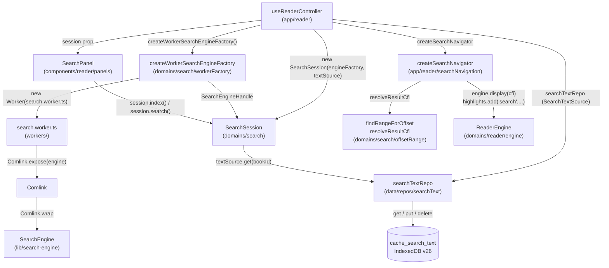
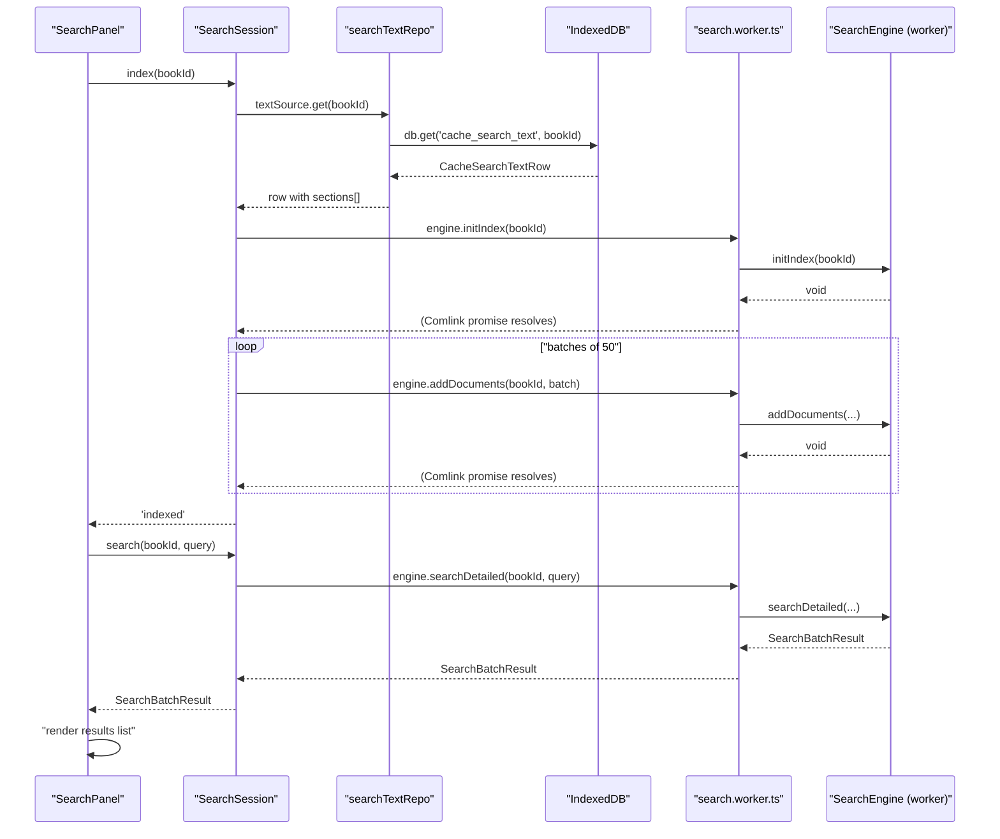
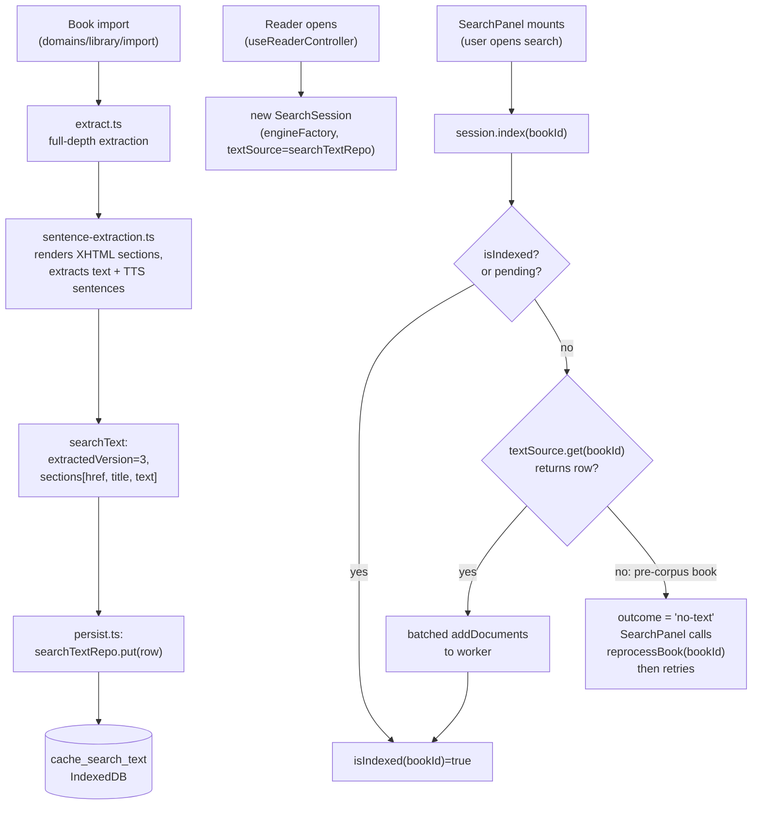
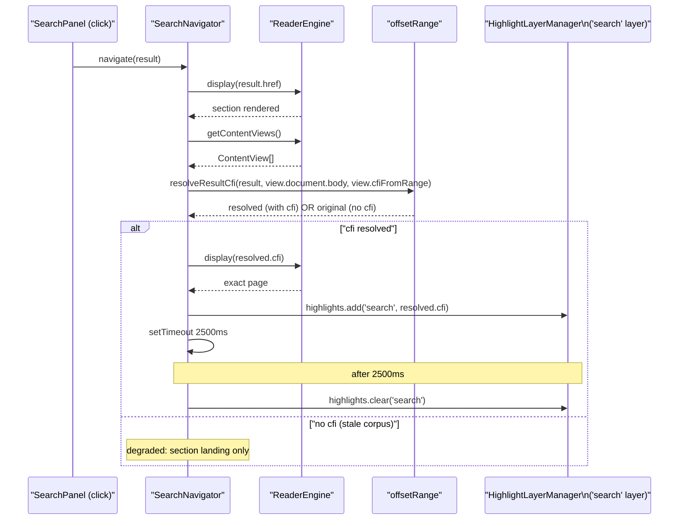
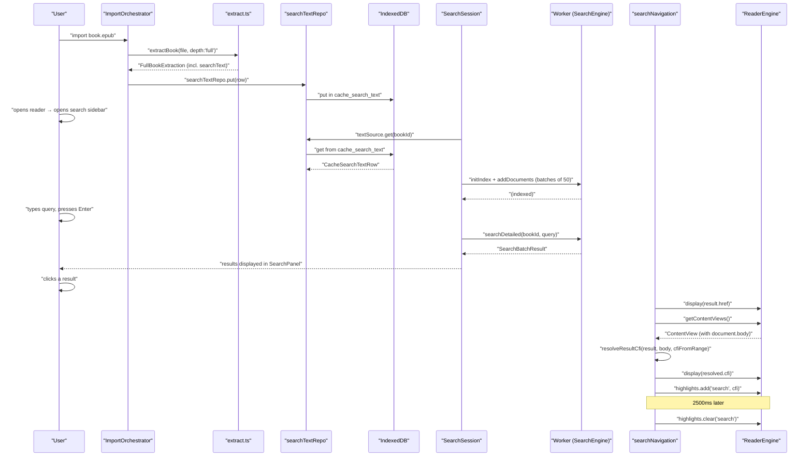

# Search Domain

In-book full-text search: `SearchSession`, the persisted text corpus, the `SearchEngine` worker, offset-to-range resolution, and CFI-based exact-occurrence navigation.

Related documents: [Architecture overview](10-architecture-overview.md) · [Reader engine](30-domain-reader-engine.md) · [Reader UI and overlays](31-reader-ui-and-overlays.md) · [Storage gateway](20-storage-gateway.md) · [Schema and migrations](21-schema-and-migrations-idb.md) · [Domain library](37-domain-library.md) · [Bootstrap and lifecycle](14-bootstrap-and-lifecycle.md)

---

## Why this domain exists

When a user opens the search sidebar inside the reader they need to locate a word or phrase anywhere in the book's text, then jump to the exact occurrence. The EPUB format stores content as a collection of XHTML spine items — there is no global text index. The search domain's job is to:

1. Hold a per-session in-memory scan index populated from a **persisted plain-text corpus** (so the extraction cost is paid once per book, not once per reading session).
2. Run case-insensitive queries that return **per-occurrence results** with enough position data to navigate to the exact match — not just the chapter.
3. Own the **worker lifecycle** cleanly: one `SearchSession` per open reader, created by the reader controller, disposed on reader unmount.
4. Degrade gracefully: if the worker crashes, if the corpus has not yet been extracted, or if CFI resolution fails, the system falls back to a sensible lesser capability without throwing.

The search domain is deliberately narrow. It does not index across multiple books, does not persist query history, and does not share anything with library metadata search (which is a plain `Array.filter` in the library view) or notes search (a separate controlled input). Cross-linking those features is listed as a future follow-on once the persisted corpus makes it cheap.

---

## Architecture



### Layers

| Layer | Module | Responsibility |
|---|---|---|
| Domain | `src/domains/search/` | `SearchSession`, `workerFactory`, `offsetRange` — no store imports, no React |
| Engine (worker-side) | `src/lib/search-engine.ts` | `SearchEngine` class: in-memory store, escaped-literal scan, excerpt generation |
| Worker entry | `src/workers/search.worker.ts` | 5-line file: `Comlink.expose(new SearchEngine())` |
| Data | `src/data/repos/searchText.ts` | `SearchTextRepo`: IDB CRUD for `cache_search_text` |
| App layer | `src/app/reader/useReaderController.ts` | Wires `SearchSession` + `SearchNavigator`; reader controller owns the lifecycle |
| App layer | `src/app/reader/searchNavigation.ts` | `createSearchNavigator`: CFI resolve → display → highlight |
| UI | `src/components/reader/panels/SearchPanel.tsx` | React panel; drives indexing, querying, result display |
| Types | `src/types/search.ts` | `DetailedSearchResult`, `SearchBatchResult`, `SearchSection` |

The domain boundary is enforced by `depcruise domains-no-store`: nothing inside `src/domains/search/` may import stores, React, or `app/`. The reader controller (`app/`) bridges those layers by passing injected collaborators (`textSource`, `engineFactory`) into the session.

---

## Data shapes

### `SearchSection` — the indexing unit

```typescript
// src/types/search.ts
export interface SearchSection {
  id: string;
  href: string;      // spine item path, e.g. "OEBPS/ch01.xhtml"
  text?: string;     // plain text (textContent of the rendered section)
  title?: string;    // display title carried through to results
}
```

`SearchSection` is fed to the engine in batches via `addDocuments`. The `title` field flows through to every per-occurrence result so the UI can show "Chapter 3 · Result 2" rather than a raw href.

### `DetailedSearchResult` — one hit

```typescript
// src/types/search.ts
export interface DetailedSearchResult {
  href: string;
  sectionTitle?: string;
  excerpt: string;        // ±40 chars around the match from the ORIGINAL string
  charOffset: number;     // code-unit offset of the match start in the indexed text
  matchLength: number;    // code-unit length of the matched text
  occurrence: number;     // 1-based ordinal within this section
  cfi?: string;           // NEVER set by the engine; resolved lazily via resolveResultCfi
}
```

`charOffset` and `matchLength` together define an exact position in the section's plain-text stream (the same stream that `findRangeForOffset` walks node-by-node). The engine never touches the DOM; CFI resolution happens on the main thread after the section is rendered.

### `SearchBatchResult` — the query response

```typescript
// src/types/search.ts
export interface SearchBatchResult {
  results: DetailedSearchResult[];
  truncated: boolean;   // true when more matches existed beyond the cap
}
```

The `truncated` flag replaces the old silent 50-result cap: the UI surfaces "Showing the first N matches" when it is set. `DEFAULT_LIMIT = 50` is `SearchEngine.DEFAULT_LIMIT`; callers may override via `opts.limit`.

### `CacheSearchTextRow` — the persisted corpus

```typescript
// src/data/rows/cache.ts
export type CacheSearchTextRow = {
  bookId: string;
  extractionVersion: number;   // TTS_EXTRACTION_VERSION (currently 3)
  sections: { href: string; title: string; text: string }[];
};
```

One row per book, keyed by `bookId` in the `cache_search_text` IDB object store (v26 migration, see [Schema and migrations](21-schema-and-migrations-idb.md)). The row is written at import time by the library persistence layer and deleted atomically with the book's other rows. `extractionVersion` is the invalidation stamp; rows below the current extraction version cause re-extraction.

---

## The `SearchEngine` (worker-side)

[src/lib/search-engine.ts](../../src/lib/search-engine.ts)

`SearchEngine` is a plain TypeScript class with no DOM dependencies. It can be instantiated in the worker (`Comlink.expose(new SearchEngine())`) or directly in tests. Its internal store is:

```typescript
private books = new Map<string, Map<string, { text: string; title?: string }>>();
// outer key: bookId; inner key: href; value: section text + optional title
```

### Index construction

Two entry points:

- `initIndex(bookId)` — clears any existing data for the book, inserts an empty inner `Map`.
- `addDocuments(bookId, sections[])` — appends sections to the inner map; skips sections with no `text`. Logs a `console.warn` at >2 000 sections (the `LARGE_INDEX_THRESHOLD`).
- `indexBook(bookId, sections[])` — convenience wrapper: `initIndex` then `addDocuments`.

`SearchSession` drives `initIndex` followed by batched `addDocuments` calls so the worker is not handed the entire corpus in one postMessage payload.

### The scan algorithm

```typescript
// src/lib/search-engine.ts – searchDetailed (simplified)
const escaped = trimmed.replace(/[.*+?^${}()|[\]\\]/g, '\\$&');
const pattern = new RegExp(escaped, 'giu');

for (const [href, section] of bookStore.entries()) {
  pattern.lastIndex = 0;
  let match: RegExpExecArray | null;
  while ((match = pattern.exec(section.text)) !== null) {
    if (match[0].length === 0) { pattern.lastIndex += 1; continue; }
    // emit DetailedSearchResult …
  }
}
```

Key properties of this approach:

- **Escaped literal, never a user-pattern.** Every special regex character in the query is backslash-escaped before the `RegExp` is constructed. This eliminates the ReDoS surface that caused two earlier engine revisions (FlexSearch → escaped-RegExp with ReDoS bugs → plain `indexOf` → current escaped-literal regex). An escaped literal cannot backtrack.
- **Unicode-aware case folding (`giu` flags).** The `u` flag enables Unicode mode and the `i` flag performs case-insensitive matching against the *original* string. This is the fix for the Turkish-İ bug present in the previous `toLowerCase()`-then-`indexOf` approach: lowercasing `'İ'` yields `'i̇'` (one code unit → two), causing index misalignment. The current engine matches and slices from the original string at the original offsets, so excerpts and `charOffset` values stay aligned regardless of casing.
- **Zero-width guard.** A zero-width match from an escaped literal is structurally impossible, but the guard (`if (match[0].length === 0) { pattern.lastIndex += 1; continue; }`) keeps the loop safe against any future change.
- **Per-occurrence results.** Each match gets its own `DetailedSearchResult` with a 1-based `occurrence` ordinal within its section. This is what allows "Result 7 in Chapter 3" navigation later.
- **Honest truncation.** The outer loop breaks as soon as `results.length >= limit` and sets `truncated = true`, then returns both fields. Callers know when the result set is incomplete.

### Excerpt generation

```typescript
private getExcerpt(text: string, index: number, length: number): string {
  const start = Math.max(0, index - 40);
  const end = Math.min(text.length, index + length + 40);
  return (start > 0 ? '...' : '') + text.substring(start, end) + (end < text.length ? '...' : '');
}
```

±40 characters around the match in the **original** string at the **original** `match.index`. Leading/trailing ellipses are added only when the window is not at the document boundary. No whitespace normalization is applied (see [Known limitations](#known-limitations)).

---

## The Comlink worker

[src/workers/search.worker.ts](../../src/workers/search.worker.ts)

```typescript
import * as Comlink from 'comlink';
import { SearchEngine } from '@lib/search-engine';

const engine = new SearchEngine();
Comlink.expose(engine);
```

The entire worker is five lines. One `SearchEngine` instance lives for the worker's lifetime. All methods (`initIndex`, `addDocuments`, `searchDetailed`) are transparently proxied by Comlink — the caller on the main thread receives promises for every method call. This is the same Comlink transport used by the TTS worker; the patterns are intentionally uniform across both subsystems.

---

## `workerFactory.ts` — production `SearchEngineHandle`

[src/domains/search/workerFactory.ts](../../src/domains/search/workerFactory.ts)

```typescript
export function createWorkerSearchEngineFactory(): () => SearchEngineHandle {
  return () => {
    const worker = new Worker(new URL('../../workers/search.worker.ts', import.meta.url), {
      type: 'module',
    });
    const remote = Comlink.wrap<SearchEngine>(worker);
    const listeners = new Set<(error: unknown) => void>();

    worker.onerror = (event) => {
      for (const listener of listeners) listener(event.error ?? event);
    };

    return {
      engine: remote,
      dispose() { worker.terminate(); },
      onError(listener) {
        listeners.add(listener);
        return () => listeners.delete(listener);
      },
    };
  };
}
```

The factory returns a *factory function* (the outer call produces a factory; the inner call produces a handle). This level of indirection means `SearchSession` can call the factory to create a fresh handle after an engine failure — the replacement worker is a new `Worker` allocation, not a reuse of the crashed one.

`worker.onerror` is wired to a multi-listener set: this is the crash-detection mechanism that was absent in the old `searchClient` singleton, which left `isIndexed: true` and Comlink promises pending forever after a worker died.

---

## `SearchSession` — the session object

[src/domains/search/SearchSession.ts](../../src/domains/search/SearchSession.ts)

`SearchSession` replaces the old `searchClient` module-level singleton. One instance is created per open reader session (in `useReaderController`) and disposed on reader unmount.

### Constructor injection

```typescript
export class SearchSession {
  constructor(
    private readonly opts: {
      engineFactory: SearchEngineFactory;
      textSource?: SearchTextSource;
      onError?: (error: unknown) => void;
    },
  ) {}
```

- `engineFactory` — in production: the result of `createWorkerSearchEngineFactory()`. In tests: a factory that returns a real `SearchEngine` running in-process, with no worker.
- `textSource` — in production: `searchTextRepo` (the IDB repo). Tests inject a mock `SearchTextSource` with `get` returning fixture data or `undefined`.
- `onError` — in production: a callback that logs and shows a toast. Tests inject a `vi.fn()` to assert crash recovery.

The `SearchTextSource` interface is minimal:

```typescript
export interface SearchTextSource {
  get(bookId: string): Promise<
    | { extractionVersion: number; sections: { href: string; title: string; text: string }[] }
    | undefined
  >;
}
```

`searchTextRepo` satisfies this interface structurally (it returns `CacheSearchTextRow | undefined`).

### Generation counter

Every `dispose()` call or engine failure increments `this.generation`. Every `await` inside `indexInternal` is followed by `this.assertLive(generation)`:

```typescript
private assertLive(generation: number): void {
  if (this.generation !== generation) {
    throw new AppError('Search session disposed during indexing', {
      code: 'SEARCH_SESSION_DISPOSED',
    });
  }
}
```

This is the mechanism that prevents stale in-flight work from committing results into a reset session. If the reader is closed during a long indexing run (e.g. a 600-chapter book), every awaited batch boundary throws `SEARCH_SESSION_DISPOSED` and the pending `index()` promise rejects cleanly — it does not hang, and the disposed session's caches are never populated.

### Single-flight dedup

```typescript
index(bookId: string, sections?: SearchSection[]): Promise<IndexOutcome> {
  if (this.indexedBooks.has(bookId)) return Promise.resolve('indexed');

  const pending = this.pendingIndexes.get(bookId);
  if (pending) return pending;

  const generation = this.generation;
  const task = this.indexInternal(bookId, generation, sections).finally(() => {
    if (this.generation === generation) this.pendingIndexes.delete(bookId);
  });
  this.pendingIndexes.set(bookId, task);
  return task;
}
```

Concurrent callers for the same `bookId` share one `Promise` from `pendingIndexes`. When `SearchPanel` mounts while an index is already running (e.g. the user closes and reopens the search sidebar mid-index), the second call gets the existing promise — there is no second extraction or second `initIndex` call.

The `finally` only clears the pending entry when `this.generation` matches (i.e., no reset happened since the task started). A reset from a crash already called `pendingIndexes.clear()` — the `finally` check prevents the clearing from the old task from incorrectly re-clearing a new pending entry for the same book after recovery.

### Fallback to persisted corpus

```typescript
private async indexInternal(
  bookId: string, generation: number, sections?: SearchSection[],
): Promise<IndexOutcome> {
  let docs = sections;
  if (!docs) {
    const row = await this.opts.textSource?.get(bookId);
    this.assertLive(generation);
    if (!row) return 'no-text';
    docs = row.sections.map((s, i) => ({
      id: `${bookId}-${i}`, href: s.href, title: s.title, text: s.text,
    }));
  }
  // … initIndex + batched addDocuments …
}
```

When `index()` is called without explicit `sections` (the normal `SearchPanel` path), the session reads from `textSource`. If the text source returns `undefined` — meaning the book was imported before the `cache_search_text` store existed — the outcome is `'no-text'`. The `SearchPanel` handles this by triggering one reprocess via `importController.reprocessBook(bookId)`, then retrying `session.index(bookId)`.

### Batch size

`BATCH_SIZE = 50` sections per `addDocuments` call. This bounds the size of each Comlink postMessage payload. For a typical novel (300–500 sections), the indexing loop makes 6–10 round-trips to the worker.

### Reset on failure

```typescript
private reset(): void {
  this.generation += 1;
  this.unsubscribeError?.();
  this.unsubscribeError = null;
  this.handle?.dispose();
  this.handle = null;
  this.indexedBooks.clear();
  this.pendingIndexes.clear();
}
```

`reset()` is called by both `dispose()` and `handleEngineFailure()`. It is unconditional: caches are cleared even if `this.handle` is null (the engine was never actually created). This avoids the old singleton bug where `indexedBooks` survived a `terminate()` call on an injected handle. After reset, the next `index()` or `search()` call triggers `this.engine()` which calls `this.opts.engineFactory()` — a fresh worker allocation.

---

## Sequence: query → results



---

## Index build flow



---

## `offsetRange.ts` — offset to DOM Range

[src/domains/search/offsetRange.ts](../../src/domains/search/offsetRange.ts)

The `SearchEngine` records `charOffset` and `matchLength` for every hit. These are offsets into the **plain-text stream** produced by concatenating the section's text nodes in document order. `findRangeForOffset` reconstructs a DOM `Range` from that offset by walking the same node sequence:

```typescript
export function findRangeForOffset(
  root: Node, charOffset: number, length: number,
): Range | null {
  const walker = doc.createTreeWalker(root, NodeFilter.SHOW_TEXT);
  const endOffset = charOffset + length;

  let consumed = 0;
  let startNode: Text | null = null;
  // ...
  for (let node = walker.nextNode() as Text | null; node; …) {
    const len = node.data.length;
    if (startNode === null && charOffset < consumed + len) {
      startNode = node;
      startInNode = charOffset - consumed;
    }
    if (endOffset <= consumed + len) {
      endNode = node; endInNode = endOffset - consumed; break;
    }
    consumed += len;
  }
  // ...
  const range = doc.createRange();
  range.setStart(startNode, startInNode);
  range.setEnd(endNode, endInNode);
  return range;
}
```

This correctly handles matches that span element boundaries (e.g. `<p>white <em>wha</em>le</p>` — the word "whale" spans two text nodes). The function returns `null` when offsets are out of bounds (stale corpus vs. re-rendered content) so callers can degrade gracefully.

`resolveResultCfi` wraps the Range resolution and CFI generation in a single try/catch:

```typescript
export function resolveResultCfi(
  result: DetailedSearchResult,
  sectionRoot: Node,
  cfiFromRange: (range: Range) => string | null,
): DetailedSearchResult {
  try {
    const range = findRangeForOffset(sectionRoot, result.charOffset, result.matchLength);
    if (!range) return result;
    const cfi = cfiFromRange(range);
    return cfi ? { ...result, cfi } : result;
  } catch {
    return result;
  }
}
```

If anything fails (null range, null CFI, thrown exception), the original `result` object is returned unchanged — the caller can inspect `result.cfi` being `undefined` and fall back to section-level navigation. The module never imports epubjs; the `cfiFromRange` function is injected by the reader layer.

---

## `searchNavigation.ts` — exact-occurrence navigation

[src/app/reader/searchNavigation.ts](../../src/app/reader/searchNavigation.ts)

`createSearchNavigator` returns a `SearchNavigator` with two methods: `navigate(result)` and `dispose()`.

### Navigation sequence



The `'search'` layer is one of five reserved `HighlightLayerId` values in `highlightStyles.ts` (`'annotation' | 'tts' | 'history' | 'debug' | 'search'`). Its default class is `'search-highlight'` with `sweepOrphans: false`. The `SEARCH_HIGHLIGHT_MS = 2500` constant controls the flash duration.

`dispose()` cancels the pending timer and clears the search highlight immediately — this is called on reader unmount and on re-navigation (only one flash active at a time).

The `sameSection` helper normalises hrefs before comparing:

```typescript
const sameSection = (viewHref: string, resultHref: string): boolean => {
  const a = viewHref.split('#')[0];
  const b = resultHref.split('#')[0];
  return a === b || a.endsWith(`/${b}`) || b.endsWith(`/${a}`);
};
```

This handles EPUB paths where the view's href includes a directory prefix that the result's href omits, or vice versa.

---

## Persistence: the `cache_search_text` store

[src/data/repos/searchText.ts](../../src/data/repos/searchText.ts) · [src/data/rows/cache.ts](../../src/data/rows/cache.ts)

### IDB schema (v26)

```
cache_search_text
  keyPath: 'bookId'
  (no indexes)
```

Created by the v26 migration step in `src/data/schema.ts`. Absence of a row is valid — it triggers re-extraction rather than an error.

### Lifecycle

| Event | Effect on `cache_search_text` |
|---|---|
| Book imported (`persist.ts`) | `searchTextRepo.put(row)` — written as part of the import flow |
| Book reprocessed (`reprocess.ts`) | `searchTextRepo.put(row)` — corpus refreshed |
| Book deleted (`bookContent.deleteBook`) | Row deleted in the same gated write transaction |
| Pre-corpus book (first search) | `session.index()` returns `'no-text'`; `SearchPanel` calls `importController.reprocessBook(bookId)`; then retries |

Deletion is co-located with the book deletion transaction (in `bookContent.ts`) so the corpus row cannot survive a deleted book — there is no orphan-cleanup job needed.

### Write path (import)

The extractor (`src/domains/library/import/extract.ts`) produces a `BookSearchText` as part of `FullBookExtraction`:

```typescript
searchText: {
  extractionVersion: TTS_EXTRACTION_VERSION,  // currently 3
  sections: mapping.searchSections,           // [{href, title, text}]
}
```

`TTS_EXTRACTION_VERSION` (= `3`) is imported from `src/lib/ingestion/sentence-extraction.ts`. The search corpus and TTS preparation share the same extraction version stamp, because both are produced by the same rendering pass over the EPUB spine. When the extractor version bumps, existing cached rows are considered stale.

### Zod schema and drift guard

`src/data/rows/cache.ts` defines `cacheSearchTextRowSchema` using `z.looseObject` (tolerates extra fields from future schema additions). A compile-time drift guard ensures the inferred type matches the hand-written `CacheSearchTextRow`:

```typescript
type _SearchTextSchemaMatches =
  z.infer<typeof cacheSearchTextRowSchema> extends CacheSearchTextRow ? true : never;
```

---

## `SearchPanel` — the React UI

[src/components/reader/panels/SearchPanel.tsx](../../src/components/reader/panels/SearchPanel.tsx)

`SearchPanel` receives the `SearchSession` as a prop (`session: SearchSession`). It does not import `searchTextRepo` or `createWorkerSearchEngineFactory` — those are owned by the reader controller.

### Props

```typescript
export interface SearchPanelProps {
  bookId: string | undefined;
  session: SearchSession;
  onNavigate: (result: DetailedSearchResult) => void;
}
```

`onNavigate` is `navigateToSearchResult` from the reader controller, which delegates to `createSearchNavigator`.

### Indexing effect

```typescript
useEffect(() => {
  if (!bookId || session.isIndexed(bookId)) return;
  let mounted = true;
  setIsIndexing(true);

  const prepare = async () => {
    try {
      let outcome = await session.index(bookId);
      if (outcome === 'no-text') {
        await importController.reprocessBook(bookId);
        outcome = await session.index(bookId);
      }
      if (outcome === 'no-text' && mounted) {
        showToast('Search is unavailable for this book', 'error');
      }
    } catch (e) {
      logger.error('Indexing failed', e);
    } finally {
      if (mounted) setIsIndexing(false);
    }
  };

  void prepare();
  return () => { mounted = false; };
}, [bookId, session, importController, showToast]);
```

Key invariants:
- The mounted flag prevents `setIsIndexing(false)` from firing on an unmounted panel.
- `session.index(bookId)` is idempotent (returns `'indexed'` immediately if already done, shares the pending promise if in flight).
- The `'no-text'` path calls reprocess exactly once; if the second attempt still returns `'no-text'`, the user sees a toast and the indexing spinner stops.

### Stale-request guard

```typescript
const requestCounter = React.useRef(0);

const handleSearch = useCallback(async () => {
  const currentReq = ++requestCounter.current;
  // ...
  const batch = await session.search(bookId, capturedQuery);
  if (currentReq === requestCounter.current) {
    setSearchResults(batch.results);
    setTruncated(batch.truncated);
  }
}, [searchQuery, bookId, session, showToast]);
```

The counter is incremented on every search invocation. After the `await`, if a newer request has been started, the stale result is discarded. This prevents a slow search response from overwriting results from a more recent query.

### Result rendering

Results are keyed by `${result.href}-${result.charOffset}-${idx}` — a stable compound key that incorporates position rather than just array index. Each result card shows:

- Section title + "Result N" label (`result.sectionTitle ? '${sectionTitle} · ' : ''`)
- The excerpt (3-line clamp, whitespace-wrapped)
- Truncation notice at the bottom when `truncated === true`

The indeterminate progress bar during indexing replaced the old percentage bar (which tracked per-section DOM parsing progress). Corpus-fed indexing — reading rows from IDB and posting batches to the worker — is fast enough that a pulse animation is sufficient.

---

## Reader controller wiring

[src/app/reader/useReaderController.ts](../../src/app/reader/useReaderController.ts)

```typescript
// SearchSession per open reader — worker lifecycle owned here
const searchSessionRef = useRef<SearchSession | null>(null);
if (!searchSessionRef.current) {
  searchSessionRef.current = new SearchSession({
    engineFactory: createWorkerSearchEngineFactory(),
    textSource: searchTextRepo,
    onError: (error) => {
      logger.error('Search engine failed; session reset', error);
      useToastStore.getState().showToast('Search failed', 'error');
    },
  });
}
const searchSession = searchSessionRef.current;

const searchNavigatorRef = useRef<SearchNavigator | null>(null);
if (!searchNavigatorRef.current) {
  searchNavigatorRef.current = createSearchNavigator(() => engineRef.current);
}
```

Both refs are initialised on first render and never replaced (they are stable for the reader's lifetime). Cleanup runs on unmount:

```typescript
searchNavigatorRef.current?.dispose();
searchSessionRef.current?.dispose();
```

`searchSession` is passed to `SearchPanel` via the `ReaderShell` prop chain. `navigateToSearchResult` is the bridge between the UI callback and the navigator:

```typescript
const navigateToSearchResult = useCallback(async (result: DetailedSearchResult) => {
  try {
    await searchNavigatorRef.current?.navigate(result);
  } catch (e) {
    logger.error('Search navigation failed', e);
  }
}, []);
```

---

## Testing

### `SearchSession.test.ts`

[src/domains/search/SearchSession.test.ts](../../src/domains/search/SearchSession.test.ts)

Uses a `makeFactory()` helper that returns a real in-process `SearchEngine` (no worker, no Comlink). This follows the pattern established in `WorkerTtsEngine.test.ts`. The test helpers expose a `crash(error)` function that fires the engine error listener to simulate a worker OOM kill.

Cases covered:

| Test | What it proves |
|---|---|
| Index + search per-occurrence | Correct results with `occurrence` ordinal |
| Persisted corpus fallback | `textSource.get` is called; `'no-text'` when absent |
| Concurrent `index()` dedup | `textSource.get` called exactly once for two concurrent callers |
| `dispose()` rejects in-flight | Pending `index()` rejects with `SEARCH_SESSION_DISPOSED` |
| `dispose()` idempotent | Second `dispose()` is a no-op; engine `dispose` called once |
| Engine crash reset | `onError` called; `isIndexed` false; next `index()` creates fresh engine |

### `offsetRange.test.ts`

[src/domains/search/offsetRange.test.ts](../../src/domains/search/offsetRange.test.ts)

Exercises `findRangeForOffset` and `resolveResultCfi` with a JSDOM-backed `document`. Key cases: single-node match, cross-element-boundary match (the `<em>wha</em>le` case), accumulated-offset match in a later sibling, out-of-bounds inputs, null CFI from injected generator, thrown exception from injected generator.

### `search-engine.test.ts` and fuzz suite

[src/lib/search-engine.test.ts](../../src/lib/search-engine.test.ts) · [src/lib/search-engine.fuzz.test.ts](../../src/lib/search-engine.fuzz.test.ts)

Core engine behavior, edge cases (empty query, unknown book, multi-occurrence, regex special chars in query), and seeded fuzzing. The fuzz suite uses `src/test/fuzz-utils.ts` for deterministic seeded random inputs (regex chars, Unicode, malformed XML). The historical zero-width RegExp mock test has been removed; the current engine does not construct a pattern from user input in a way that would permit zero-width matches, so the guard is structural.

### `searchNavigation.test.ts`

[src/app/reader/searchNavigation.test.ts](../../src/app/reader/searchNavigation.test.ts)

Runs against `FakeReaderEngine` — a test double that tracks `display()` calls, content views, and annotation operations. Tests: exact-occurrence highlight, degraded section-level landing when no view resolves, highlight replacement on re-navigation, `dispose()` clears pending highlight and timer.

---

## Failure modes and fallback ladder

```mermaid
stateDiagram-v2
    [*] --> UNINDEXED: "SearchPanel mounts"
    UNINDEXED --> INDEXING: "session.index(bookId)"
    INDEXING --> INDEXED: "outcome = 'indexed'"
    INDEXING --> NO_TEXT: "outcome = 'no-text'"
    NO_TEXT --> REPROCESSING: "reprocessBook(bookId)"
    REPROCESSING --> INDEXING: "session.index(bookId) retry"
    NO_TEXT --> ERROR_TOAST: "still no-text after retry"
    ERROR_TOAST --> UNINDEXED
    INDEXED --> SEARCHING: "handleSearch()"
    SEARCHING --> RESULTS: "SearchBatchResult"
    RESULTS --> NAV_SECTION: "onNavigate(result)"
    NAV_SECTION --> NAV_CFI: "resolveResultCfi succeeds"
    NAV_SECTION --> NAV_DEGRADED: "resolveResultCfi returns null/no-cfi"
    NAV_CFI --> HIGHLIGHTED: "display(cfi) + search highlight"
    HIGHLIGHTED --> RESULTS: "highlight removed after 2500ms"
    INDEXED --> CRASHED: "worker onerror fires"
    SEARCHING --> CRASHED: "Comlink call throws"
    CRASHED --> UNINDEXED: "session.reset(); onError toast"
```



| Failure | Detection | Response |
|---|---|---|
| Worker crashes (OOM, SIGKILL) | `worker.onerror` in `workerFactory.ts` | `SearchSession.reset()`: caches cleared, handle disposed, `onError` toast shown |
| Corpus absent (pre-v26 install or deleted book) | `textSource.get()` returns `undefined` → `'no-text'` | `SearchPanel` triggers `reprocessBook`, retries once |
| CFI resolution fails (stale corpus vs. re-render) | `findRangeForOffset` returns `null` or `cfiFromRange` returns `null` | `resolveResultCfi` returns original result; navigator uses section-level landing |
| `dispose()` during in-flight index | `assertLive(generation)` throws `SEARCH_SESSION_DISPOSED` | Pending `index()` promise rejects; `SearchPanel` mounted flag suppresses UI updates |
| Query returns truncated results | `SearchBatchResult.truncated === true` | Panel shows "Showing the first N matches" notice |
| Search fails (engine error mid-query) | Comlink promise rejects | `SearchPanel.handleSearch` catches, shows error toast |

---

## The `SearchEngineProtocol` interface

```typescript
// src/domains/search/SearchSession.ts
export interface SearchEngineProtocol {
  initIndex(bookId: string): void | Promise<void>;
  addDocuments(bookId: string, sections: SearchSection[]): void | Promise<void>;
  searchDetailed(
    bookId: string,
    query: string,
    opts?: { limit?: number },
  ): SearchBatchResult | Promise<SearchBatchResult>;
}
```

`SearchSession` only calls these three methods. The real Comlink remote satisfies this interface because Comlink wraps every method to return a `Promise`. The in-process `SearchEngine` also satisfies it (its methods return synchronously but TypeScript accepts synchronous returns where `void | Promise<void>` is expected). This dual satisfaction is what makes the test factory (no Comlink, no worker) behaviorally identical to production.

The `SearchEngineHandle` interface adds lifecycle:

```typescript
export interface SearchEngineHandle {
  engine: SearchEngineProtocol;
  dispose(): void;
  onError?(listener: (error: unknown) => void): () => void;
}
```

`onError` is optional so the in-process test handle can omit it (the real engine does not crash, so there is nothing to subscribe to). The return type of `onError` is an unsubscribe function, following the standard event-listener pattern.

---

## Data flow: book import to search result



---

## Public surface (`index.ts`)

[src/domains/search/index.ts](../../src/domains/search/index.ts)

```typescript
export { SearchSession, type SearchEngineProtocol } from './SearchSession';
export { createWorkerSearchEngineFactory } from './workerFactory';
export { resolveResultCfi } from './offsetRange';
```

Consumers outside the domain import only these three exports. `findRangeForOffset` is not re-exported (it is an implementation detail of `offsetRange.ts` consumed by `resolveResultCfi` and tested directly in `offsetRange.test.ts`). `SearchEngineHandle`, `SearchEngineFactory`, `SearchTextSource`, and `IndexOutcome` are exported from `SearchSession.ts` directly but not from the barrel; they are consumed by `useReaderController.ts` via named imports from the domain path.

---

## Known limitations

The following limitations are documented in [plan/overhaul/analysis/search.md](../../plan/overhaul/analysis/search.md) and are carried forward as known debt on the current branch:

**Whitespace in excerpts.** Extracted text is the raw `textContent` of pretty-printed XHTML, which can include newline runs between block elements. Excerpts inherit this whitespace. The fix (collapse whitespace during extraction) is noted as a follow-on.

**Result count label.** The panel shows "Result N" with a sequential index, not the `occurrence` ordinal within the section. When the same section has multiple matches, labels read "Result 1", "Result 2" even if those are the 4th and 7th occurrences in that chapter. The fix requires switching the label source from `idx` to `result.occurrence` plus the section title.

**No cross-book search.** Library metadata search (title/author `includes`) and in-book full-text search share no infrastructure. Cross-book search over `cache_search_text` rows would be straightforward once the corpus is reliable, but is not planned.

**`LARGE_INDEX_THRESHOLD` warning.** The 2 000-section threshold console-warn in the worker fires where no user-visible tooling watches. A production book reaching this would log silently. This is low priority because a 2 000-section EPUB would be pathological.

**Indeterminate progress.** The indexing progress bar in `SearchPanel` is indeterminate (pulsing). The old per-section progress callback was removed when the corpus-fed path eliminated per-section DOM parsing in the panel. Restoring per-section progress would require the session to expose a progress stream, which adds complexity for a typically sub-second operation.

---

## Historical context (overhaul Phase 7 §F)

The search subsystem underwent a complete redesign in Phase 7 §F (PR-S1 through PR-S4). The old architecture had:

- A **module-level `searchClient` singleton** (`src/lib/search.ts`, now deleted) with split-brain lifecycle: `SearchPanel` created the index, `ReaderView` terminated the worker.
- **No worker error handling**: `worker.onerror` was unset; a crashed worker left `isIndexed: true` and pending Comlink promises that never settled.
- **`scrollToText` navigation**: a 500 ms timer fired `window.find()` inside the epubjs iframe after navigation — non-standard API, missed cross-element matches, missed when the chapter took >500ms to render.
- **Inline epubjs extraction**: the panel triggered spine-walking + main-thread DOMParser parsing on every session open. For large books this caused multi-second jank.
- **A dead worker-side XML-parsing path**: `supportsXmlParsing()` checked `typeof DOMParser !== 'undefined'`, which is always false in a dedicated Web Worker in production browsers. The XML offload optimization never fired; it only appeared to work under JSDOM (which adds `DOMParser` to the worker global).
- **`charOffset` misalignment**: matching was done on `text.toLowerCase()` but slices were taken from the original string. For Turkish/Lithuanian/Greek text where lowercasing changes string length (e.g. `'İ'.toLowerCase() === 'i̇'`), offsets diverged.

The redesign addressed all of these:

- `SearchSession` (PR-S1): session-scoped object, injectable factory, generation counter, unconditional cache clear.
- Escaped-literal regex engine (PR-S2): original-string offsets, Unicode-aware case fold, honest truncation flag.
- `searchTextRepo` + IDB persistence (PR-S3): corpus written at import, read on first search, deleted with book.
- `offsetRange` + `searchNavigation` (PR-S4): CFI-based exact-occurrence navigation, `'search'` highlight layer, graceful fallback.

See [80-overhaul-history.md](80-overhaul-history.md) for the full Phase 7 narrative.
