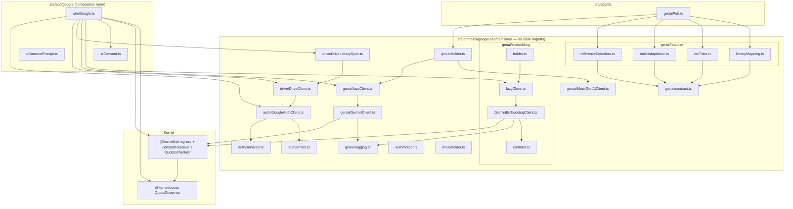
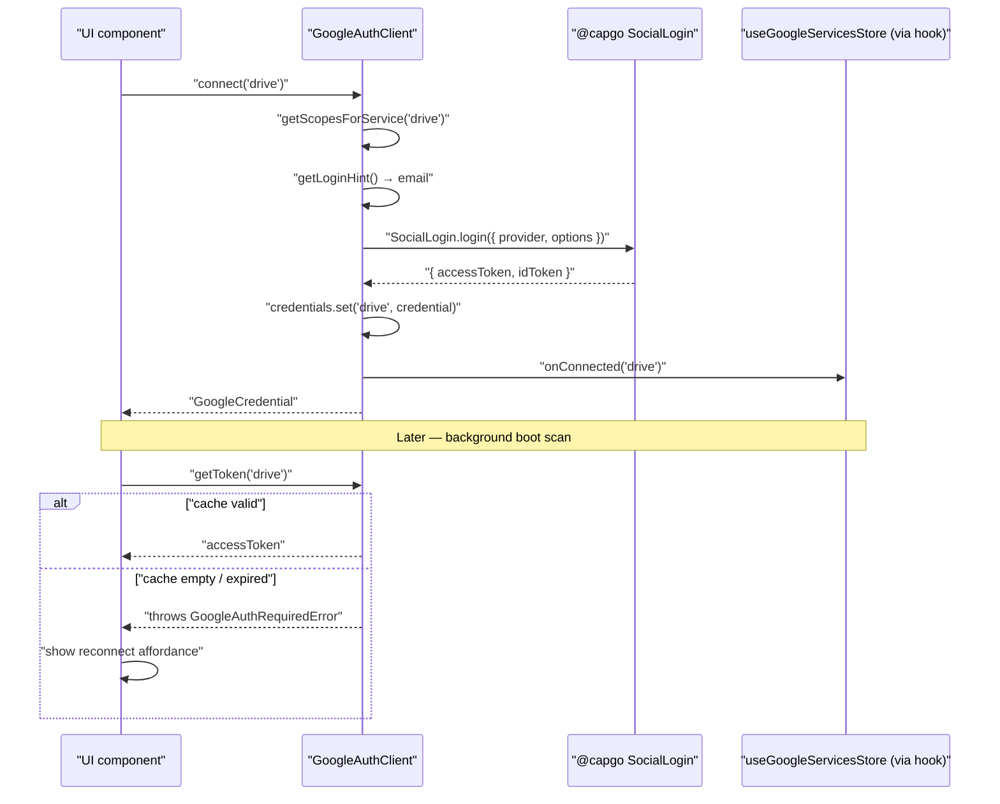
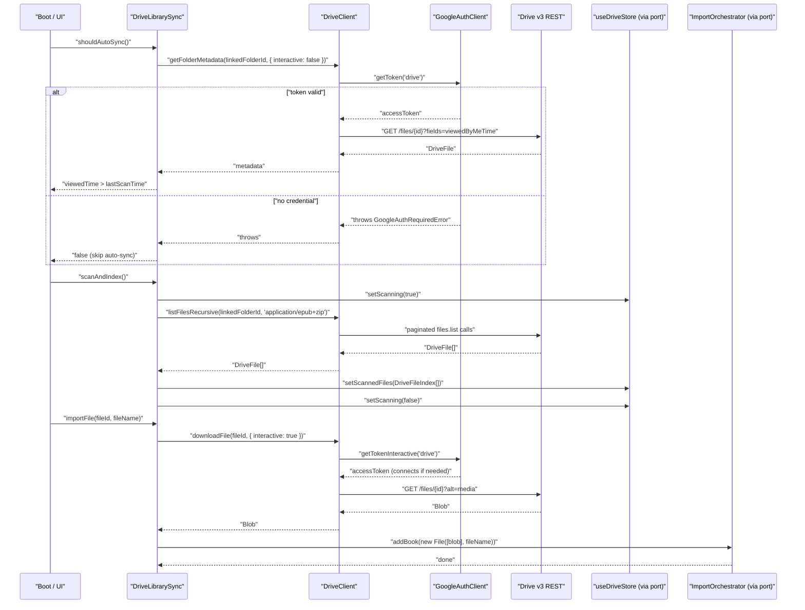
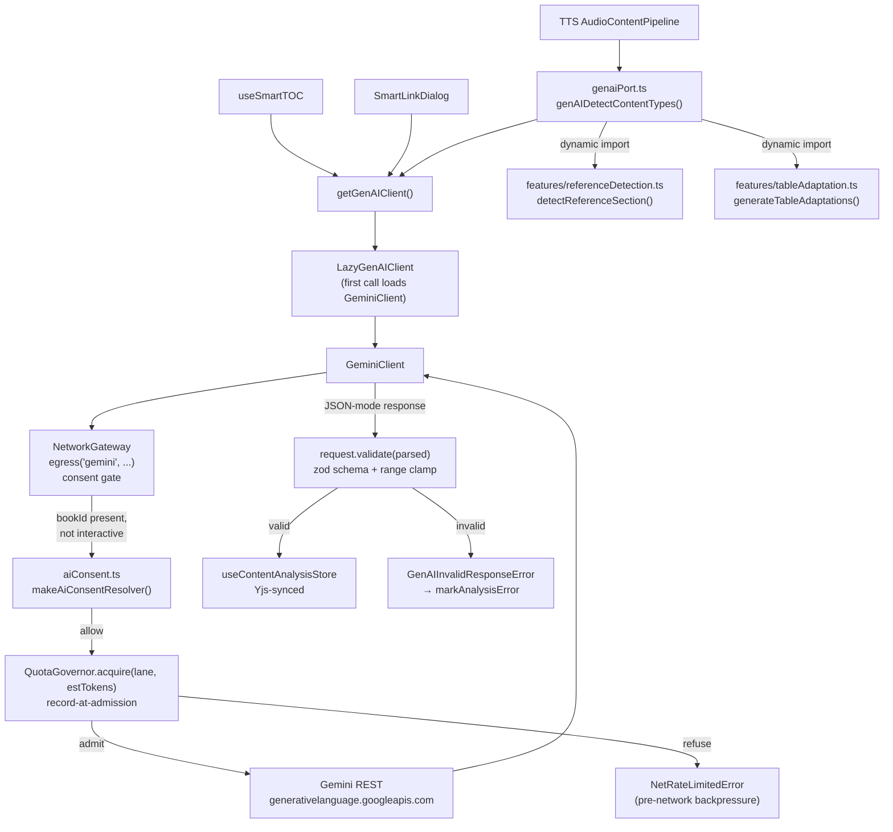
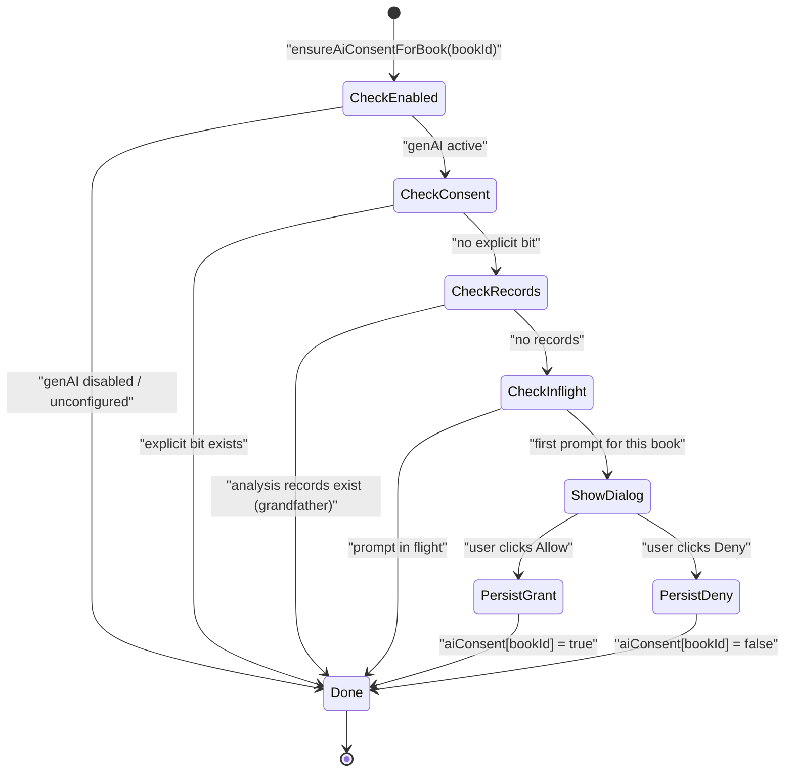
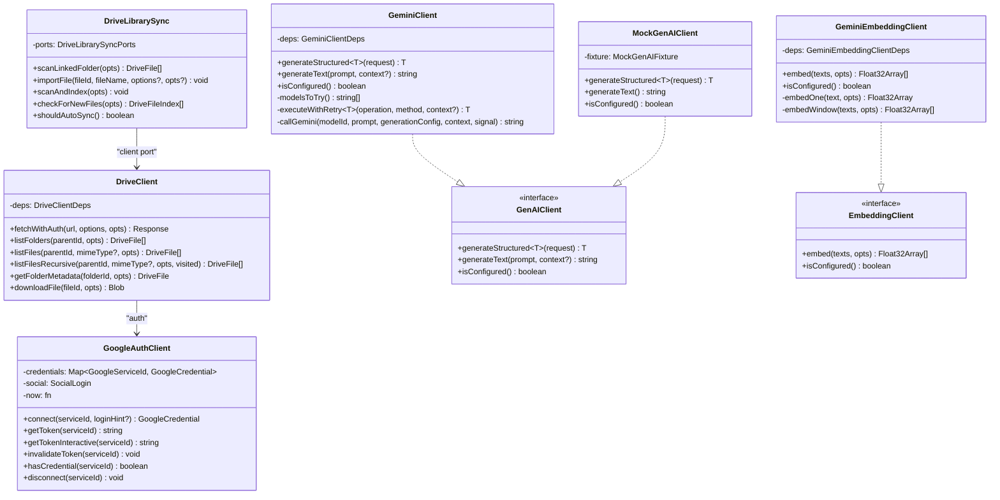

# Google Services: Auth, Drive & GenAI

Versicle integrates three distinct Google APIs — OAuth/social login, Drive v3 REST, and the Gemini generative AI REST endpoint — through a unified domain layer introduced in Phase 7 (§G and §H of the overhaul program). Each integration has a precisely scoped responsibility: authentication manages token lifetimes per service, Drive manages EPUB library sync from user-chosen folders, and GenAI powers content analysis features (smart table-of-contents titles, end-of-chapter reference detection, table-to-narration adaptation, and reading-list mapping). The GenAI subsystem also exposes a sibling **text-embedding** capability (a separate `EmbeddingClient` family over Gemini's `:embedContent` endpoint) that feeds the semantic-search index; both the chat and embedding egress are now governed by a cross-provider **quota governor** at the kernel gateway.

This document covers the design intent, full architecture, concrete implementation details, edge cases, and privacy posture for all three subsystems. See also [Architecture overview](10-architecture-overview.md) for the layering context, [Bootstrap and lifecycle](14-bootstrap-and-lifecycle.md) for how wiring fires at startup, and [TTS app integration](51-tts-app-integration.md) for how the GenAI port feeds the TTS content pipeline.

---

## Design intent

### Why a dedicated domain?

Prior to Phase 7, Google integration was implemented as a cluster of `src/lib/google/`, `src/lib/drive/`, and `src/lib/genai/` modules with direct store imports, a duplicated strategy pattern for auth, mutable singleton configuration, localStorage-persisted logs (including base64 table images), and E2E mock seams baked into production code paths. The analysis document at [plan/overhaul/analysis/google-genai.md](../../plan/overhaul/analysis/google-genai.md) catalogued fifteen findings (GG-1 through GG-15), several rated critical.

The Phase 7 redesign moves this code into `src/domains/google/` and imposes four constraints derived from the overhaul's layering rules:

1. **No store imports inside the domain.** Every store reference is injected as a typed port at the composition root (`src/app/google/wireGoogle.ts`). This eliminates the inverted dependency where auth reached into the sync store for a login hint (GG-12) and where the Drive scanner imported library and book stores directly.

2. **Typed errors, not message substrings.** All error conditions that cross a boundary become `AppError` subclasses with structured `code`/`context` fields. The four `error.message.includes('is not connected')` sites and the `error.message?.includes('429')` quota sniff are replaced by `instanceof` guards (GG-7).

3. **Interactive/silent split enforced structurally.** `getToken()` never opens UI; `connect()` is the only interactive path. Background flows (boot auto-scan, TTS pipeline analysis) call the silent path — they receive a typed `GoogleAuthRequiredError` and surface a reconnect affordance instead of popping blocked login UI or, worse, silently force-disconnecting the user (GG-2).

4. **No persisted mock seams.** The three `localStorage.getItem('mockGenAIResponse')` production code paths are replaced by a `MockGenAIClient` class reachable only from `installTestApi()` in DEV/`VITE_E2E` builds (GG-4).

---

## Overall architecture



The barrel [src/domains/google/index.ts](../../src/domains/google/index.ts) exports only the consumed public surface. Internal modules import each other directly; consumers outside the domain import through the barrel (boundary rule 3 from the overhaul README).

---

## Auth subsystem

### Service registry

[src/domains/google/auth/services.ts](../../src/domains/google/auth/services.ts) defines the two OAuth services the app currently uses:

| Service ID | Name | Scopes |
|---|---|---|
| `drive` | Google Drive | `https://www.googleapis.com/auth/drive.readonly` |
| `identity` | Sign In | `email`, `profile`, `openid` |

`getScopesForService(serviceId)` **throws `GoogleUnknownServiceError`** for any unknown identifier, failing locally before touching Google's servers (GG-6 fix). Previously the legacy `config.ts` returned `[]` silently, which caused Google to issue a token with no scopes — an opaque 403 when Drive was later called.

### GoogleAuthClient

[src/domains/google/auth/GoogleAuthClient.ts](../../src/domains/google/auth/GoogleAuthClient.ts) is the single class wrapping `@capgo/capacitor-social-login`. It supersedes the two-strategy pattern (`WebGoogleAuthStrategy` + `AndroidGoogleAuthStrategy`) that were ~95% identical with signature drift.

#### Token cache

```typescript
private readonly credentials = new Map<GoogleServiceId, GoogleCredential>();
```

Each service ID maps to its own `GoogleCredential`:

```typescript
export interface GoogleCredential {
  accessToken: string;
  idToken?: string;       // present when provider returns one
  expiresAt: number;
  scopes: readonly string[];
}
```

Token TTL is 50 minutes (`TOKEN_TTL_MS = 50 * 60 * 1000`), matching the 3600-second Google access token lifetime with a 10-minute safety margin. The cache is keyed by service — a drive credential can never accidentally serve an identity request (GG-1 fix).

Cache validity checks include a scope superset test:

```typescript
function scopesSuperset(have: readonly string[], need: readonly string[]): boolean {
  const haveSet = new Set(have);
  return need.every((scope) => haveSet.has(scope));
}
```

If the registry adds a scope to a service between when a token was minted and when it is next used, `getToken()` throws `GoogleAuthRequiredError` with reason `'insufficient-scopes'` rather than silently serving a token that would get a 403.

#### Interactive vs. silent split

```typescript
// Interactive — may open login UI. Call only from a user gesture.
async connect(serviceId: GoogleServiceId, loginHint?: string): Promise<GoogleCredential>

// Silent — never opens UI. Throws GoogleAuthRequiredError when no valid credential.
async getToken(serviceId: GoogleServiceId): Promise<string>

// Convenience for user-gesture call sites.
async getTokenInteractive(serviceId: GoogleServiceId): Promise<string>
```

`getToken()` will never call `SocialLogin.login()`. If the cache is empty, expired, or scope-insufficient, it throws immediately. Background flows (boot scan, TTS pipeline analysis) call `getToken()` and catch `GoogleAuthRequiredError` to surface a reconnect affordance without touching the login plugin.

`getTokenInteractive()` composes the two paths: it tries `getToken()` first, falling through to `connect()` only on `GoogleAuthRequiredError`. This is the pattern for user-gesture call sites that want "use cache when valid, connect otherwise" without duplicating the try/catch.

#### Revocation policy

Only `disconnect()` clears persisted connection state. Token failures — network errors, server 401s, popup-blocked login attempts — do **not** call `onDisconnected`. This is a deliberate reversal of the legacy `GoogleIntegrationManager` which force-disconnected on any error (GG-2 fix). The consequence is:

- A user who reloads the page (clearing the in-memory token cache) remains "has connected before" — the app shows a reconnect affordance instead of behaving as if they never signed in.
- A transient network failure during the boot scan leaves the connection hint intact.
- Only an explicit "Disconnect" button in settings triggers `disconnect()`.

The `onConnected`/`onDisconnected` hooks are injected at the composition root. The domain itself never imports a store.

#### Platform options

On Android, `Capacitor.getPlatform() === 'android'` causes `defaultPlatformOptions()` in [src/domains/google/auth/holder.ts](../../src/domains/google/auth/holder.ts) to return `{ style: 'bottom', autoSelectEnabled: true }`. On web the options bag is empty. These are passed as constructor options, eliminating the platform-branching that required two strategy classes.

### Auth error taxonomy

[src/domains/google/auth/errors.ts](../../src/domains/google/auth/errors.ts):

| Class | Code | When |
|---|---|---|
| `GoogleAuthRequiredError` | `GOOGLE_AUTH_REQUIRED` | Silent token needed; cache empty, expired, or insufficient scopes |
| `GoogleUnknownServiceError` | `GOOGLE_UNKNOWN_SERVICE` | Unknown service ID passed to `getScopesForService` |

Both extend `AppError` from `~types/errors`. The `reason` field on `GoogleAuthRequiredError` (`'no-credential' | 'expired' | 'insufficient-scopes'`) lets callers distinguish why interaction is needed (e.g. different copy for "connect for the first time" vs. "your session expired").

### Auth flow sequence



---

## Drive subsystem

### DriveClient

[src/domains/google/drive/DriveClient.ts](../../src/domains/google/drive/DriveClient.ts) is the Drive v3 REST client. All HTTP flows through `NetworkGateway.egress('drive', …)` (the kernel boundary from [Architecture overview](10-architecture-overview.md)). Constructor:

```typescript
constructor(
  private readonly deps: {
    auth: GoogleAuthClient;
    egress?: EgressFn;   // injected for tests; production uses kernel gateway
  },
) {}
```

#### Authentication retry policy

`fetchWithAuth()` implements the documented retry:

1. Acquire token (silent or interactive depending on `opts.interactive`).
2. Make the request.
3. If the response is **401**, or **403 with `insufficientPermissions`** reason, invalidate the cached token, re-acquire, and retry **once**.
4. If re-acquisition fails (throws `GoogleAuthRequiredError`), the error propagates — the caller decides.

The 403-scope retry path is new relative to the legacy `DriveService` which only handled 401 (GG-1 fix). The 403 body is inspected for `reasons.includes('insufficientPermissions')` or the message containing `'insufficient'`.

```typescript
if (response.status === 401 ||
    (response.status === 403 && (await this.isInsufficientScope(response)))) {
  this.deps.auth.invalidateToken('drive');
  token = await this.acquireToken(opts);
  response = await makeRequest(token);
}
```

The retry never calls `onDisconnected` — only re-acquires the token.

#### Drive query escaping

Single-quote values for `q` parameters are escaped via `escapeDriveQueryValue()` (GG-11 fix):

```typescript
export function escapeDriveQueryValue(value: string): string {
  return value.replace(/\\/g, '\\\\').replace(/'/g, "\\'");
}
```

This is applied to all parent IDs and mime type values before embedding in the query string.

#### Core API methods

| Method | Description |
|---|---|
| `listFolders(parentId, opts)` | Folders in a parent; paginated 1000/page; ordered `folder,name_natural` |
| `listFiles(parentId, mimeType?, opts)` | Files in a parent; paginated 1000/page; ordered `viewedByMeTime desc` |
| `listFilesRecursive(parentId, mimeType?, opts, visited)` | DFS file walk; cycle-guarded via `visited` Set |
| `getFolderMetadata(folderId, opts)` | Single file/folder metadata including `viewedByMeTime` |
| `downloadFile(fileId, opts)` | Download as `Blob` |

All methods funnel errors through `handleDriveError()` from [src/domains/google/drive/errors.ts](../../src/domains/google/drive/errors.ts), which re-throws `AppError` instances (including `GoogleAuthRequiredError`) and wraps unknown errors as `DRIVE_UNKNOWN`.

#### Drive data types

[src/domains/google/drive/types.ts](../../src/domains/google/drive/types.ts) defines two shapes:

```typescript
interface DriveFile {
  id: string;
  name: string;
  mimeType: string;
  parents?: string[];
  size?: string;          // string from API
  md5Checksum?: string;
  modifiedTime?: string;
  viewedByMeTime?: string;
}

interface DriveFileIndex {
  id: string;
  name: string;
  size: number;           // parsed integer
  modifiedTime: string;
  mimeType: string;
}
```

`DriveFile` is the API response shape; `DriveFileIndex` is the lightweight persisted index entry stored in `useDriveStore`. Keeping the index type in the domain means the domain never needs to import the store to know the shape.

### DriveLibrarySync

[src/domains/google/drive/DriveLibrarySync.ts](../../src/domains/google/drive/DriveLibrarySync.ts) is the orchestrator for scan/index/diff/import. It is the evolution of the legacy `DriveScannerService` static class, redesigned as a class with injected ports:

```typescript
interface DriveLibrarySyncPorts {
  client: Pick<DriveClient, 'listFilesRecursive' | 'getFolderMetadata' | 'downloadFile'>;
  driveIndex: {
    getLinkedFolderId(): string | null;
    getLastScanTime(): number | null;
    getIndex(): DriveFileIndex[];
    setScanning(isScanning: boolean): void;
    setScannedFiles(files: DriveFileIndex[]): void;
  };
  library: {
    addBook(file: File, options?: { overwrite?: boolean }): Promise<unknown>;
    getLibraryFilenames(): Set<string | undefined>;
  };
  hasConnectedBefore(): boolean;
  log?: { info(...args: unknown[]): void; warn(...args: unknown[]): void; error(...args: unknown[]): void; };
}
```

All store adapters are injected by `wireGoogle.ts`. The orchestrator itself has zero store imports.

#### Key operations

**`scanLinkedFolder(opts)`** — Lists all EPUB files (`mimeType = 'application/epub+zip'`) under the linked folder recursively. Catches `GoogleAuthRequiredError` with a `warn` log (expected in background flows); other errors are `error`-logged before rethrowing.

**`scanAndIndex(opts)`** — Full scan; sets `isScanning: true` in the port before the scan and `false` in a `finally` block regardless of outcome. Maps `DriveFile[]` to `DriveFileIndex[]` via `mapToDriveFileIndex` (parses `size` from string to integer, sets `modifiedTime` to `new Date().toISOString()` if absent).

**`checkForNewFiles(opts)`** — Diffs the persisted index against the local library's filenames (`getLibraryFilenames()`). Triggers a `scanAndIndex` first if the index is empty. Returns the subset of index entries whose `name` does not appear in the library.

**`importFile(fileId, fileName, options?, opts?)`** — Downloads a Drive file as a `Blob`, constructs a `File` object with `type: 'application/epub+zip'`, and calls `library.addBook`. The default `opts` has `interactive: true` because import is always user-initiated. The library port in `wireGoogle.ts` routes through `libraryController.importFile()` (or `replaceFile()` for overwrites), so Drive imports go through the same `ImportOrchestrator` queue as all other import entry points.

**`shouldAutoSync()`** — The auto-sync heuristic, moved here from `App.tsx`. Always calls the Drive API silently (`interactive: false`). Returns `false` (no sync) on `GoogleAuthRequiredError` — the background heuristic must never pop login UI. Falls back to `true` on unknown errors (legacy behavior) to err toward scanning.

Logic:
```
linked folder present?  → no  → false
hasConnectedBefore()?   → no  → false
lastScanTime missing?        → true
viewedByMeTime > lastScanTime? → true/false
```

### Drive error taxonomy

[src/domains/google/drive/errors.ts](../../src/domains/google/drive/errors.ts):

| Class | Code | `retryable` | When |
|---|---|---|---|
| `DriveApiError` | `DRIVE_API_ERROR` | `status === 429 \|\| status >= 500` | HTTP error after retry policy |
| (via `handleDriveError`) | `DRIVE_UNKNOWN` | false | Non-AppError caught at Drive boundary |

`DriveApiError` carries `.status` and an optional `.reason` from the Drive error body's `errors[0].reason` field.

### Drive sync flow



---

## GenAI subsystem

The GenAI subsystem provides Gemini-powered content analysis. The key design constraint is that GenAI processing always happens on the **main thread** (never in the TTS Web Worker) — the worker communicates through the `EngineContext` port system, and results are stored in the Yjs-synced `useContentAnalysisStore`.

### Contract

[src/domains/genai/contract.ts](../../src/domains/genai/contract.ts) defines the interface and all shared types:

```typescript
export interface GenAIClient {
  generateStructured<T>(request: GenAIRequest<T>): Promise<T>;
  generateText(prompt: string, context?: GenAIRequestContext): Promise<string>;
  isConfigured(): boolean;
}

export interface GenAIRequest<T> {
  method: string;
  prompt: GenAIPrompt;
  responseSchema: object;
  validate: (raw: unknown) => T;   // REQUIRED semantic validation (GG-5)
  generationConfig?: Record<string, unknown>;
  context?: GenAIRequestContext;
  signal?: AbortSignal;
}
```

The `validate` field is required on every structured request. This is the central GG-5 fix: bad model output throws `GenAIInvalidResponseError` before reaching any persisted state. Previously, `generateStructured` did `JSON.parse(text) as T` with no semantic validation, and a model returning `referenceStartIndex: -2` flagged every group as a reference section, poisoning the Yjs-synced `useContentAnalysisStore`.

`GenAIPrompt` supports both plain strings and multi-part structured prompts (for table image adaptation):

```typescript
export type GenAIPrompt =
  | string
  | { contents: { role: string; parts: GenAIPromptPart[] }[] };

export type GenAIPromptPart =
  | { text: string }
  | { inlineData: { data: string; mimeType: string } };
```

`GenAIRequestContext` carries optional `bookId`, `bookTitle`, `sectionTitle`, `language`, `correlationId`, and `interactive`. The `bookId` flows into the kernel gateway's per-book consent gate (see Privacy section below).

### GeminiClient

[src/domains/genai/GeminiClient.ts](../../src/domains/genai/GeminiClient.ts) is the production implementation. It uses the Gemini REST API directly (`https://generativelanguage.googleapis.com/v1beta`) rather than the `@google/generative-ai` SDK, because the SDK does not accept a fetch injection and could not route through the kernel `NetworkGateway.egress('gemini', …)`.

#### Config read per call

Config is never stored in instance fields (GG-8 fix). Instead, `getConfig()` is called on every request:

```typescript
export interface GeminiClientDeps {
  getConfig: GenAIConfigProvider;   // called per request, never cached
  egress?: EgressFn;
  onLog?: GenAILogSink;
}
```

At the composition root, `getConfig` is `() => useGenAIStore.getState()` — a live read. This makes it structurally impossible for the TTS pipeline's legacy `configure(apiKey, model)` call to clobber another caller's model choice.

#### Rotation models

```typescript
export const GENAI_ROTATION_MODELS = ['gemini-2.5-flash-lite', 'gemini-2.5-flash'] as const;
```

When `rotationEnabled` is true in the config, `modelsToTry()` runs a Fisher-Yates shuffle over this array and tries each model in turn, continuing on `GenAIHttpError` with `status === 429` (GG-15 fix — the legacy used a biased `sort(() => Math.random() - 0.5)`).

#### Request flow

```typescript
private async executeWithRetry<T>(
  operation: (modelId: string) => Promise<T>,
  method: string,
  context?: GenAIRequestContext,
): Promise<T>
```

For each model in `modelsToTry()`:
1. Call `operation(modelId)`.
2. If `isResourceExhausted(error)` and rotation is enabled, log the 429 and try the next model.
3. Otherwise rethrow immediately.
4. If all models are exhausted, throw the last error.

`generateStructured<T>()` additionally:
- Logs the request (pre-redacted) via `onLog`.
- Calls `callGemini()` with `responseMimeType: 'application/json'` and the request's `responseSchema`.
- JSON-parses the returned text, throwing `GenAIInvalidResponseError` on parse failure.
- Calls `request.validate(parsed)`, which is the feature module's zod-backed validator. Validation errors propagate — callers mark `status: 'error'` so the analysis machinery handles it.
- Logs the response.

#### Log redaction

[src/domains/genai/logging.ts](../../src/domains/genai/logging.ts) provides `redactPayload()`, which deep-copies a payload replacing every `inlineData: { data: <base64> }` node with `{ byteCount, hash, mimeType, redacted: true }`. The hash is FNV-1a hex, providing a stable correlation token without storing any bytes.

This runs before the `onLog` sink receives the entry, ensuring base64 table screenshot images never enter the activity log (GG-3 fix). The store's `partialize` allowlist explicitly excludes `logs`, so activity log entries never reach `localStorage`.

### MockGenAIClient

[src/domains/genai/MockGenAIClient.ts](../../src/domains/genai/MockGenAIClient.ts) is the test double. It lives in the domain tree but is reachable from production graphs only via `window.__versicleTest.genai.setMock(...)`, which is itself guarded by `import.meta.env.DEV || VITE_E2E`.

```typescript
export interface MockGenAIFixture {
  response?: unknown;     // fed through the same validate as the real client
  error?: string;         // every call rejects with this message
  delayMs?: number;       // simulated latency; defaults to 500ms
}
```

The critical invariant: `generateStructured<T>()` calls `request.validate(this.fixture.response)`. A fixture that violates the feature contract fails the test with the same `GenAIInvalidResponseError` a hallucinating model would produce. This keeps E2E journeys honest.

### Lazy client and bundle discipline

[src/domains/genai/lazyClient.ts](../../src/domains/genai/lazyClient.ts) implements a one-time dynamic-import facade:

```typescript
export function makeLazyGenAIClient(deps: GeminiClientDeps): GenAIClient {
  let clientPromise: Promise<GenAIClient> | null = null;
  const load = (): Promise<GenAIClient> =>
    (clientPromise ??= import('./GeminiClient').then((m) => new m.GeminiClient(deps)));
  // ...
}
```

This is the Phase 8 §A first-use splitting discipline. The composition root installs the lazy facade at boot without pulling `GeminiClient` (and the `@google/generative-ai`-derived request plumbing) into the entry chunk. `GeminiClient` loads on the first actual generate call. `scripts/check-worker-chunk.mjs` check 4 asserts this invariant on the emitted artifacts.

`isConfigured()` is answered synchronously from `deps.getConfig().apiKey` without waiting for the chunk, since `isConfigured` is a synchronous contract method.

### Holder

[src/domains/genai/holder.ts](../../src/domains/genai/holder.ts) provides a fallback `notConfiguredClient` that throws `GenAINotConfiguredError` on every call. The composition root replaces this with the lazy facade via `setGenAIClient()`. In the E2E test harness, `installTestApi()` calls `setGenAIClient(new MockGenAIClient(fixture))`.

The holder deliberately does not statically import `GeminiClient` — doing so would defeat the Phase 8 §A chunk splitting.

### GenAI error taxonomy

[src/domains/genai/errors.ts](../../src/domains/genai/errors.ts):

| Class | Code | `retryable` | When |
|---|---|---|---|
| `GenAINotConfiguredError` | `GENAI_NOT_CONFIGURED` | false | `apiKey` is empty |
| `GenAIInvalidResponseError` | `GENAI_INVALID_RESPONSE` | false | JSON parse fails or `validate()` throws |
| `GenAIHttpError` | `GENAI_UNKNOWN` | `status === 429 \|\| status >= 500` | HTTP-level failure from Gemini endpoint (chat **and** embedding) |
| `EmbeddingNotConfiguredError` | `GENAI_EMBEDDING_NOT_CONFIGURED` | false | `embed()` called on the NOT-CONFIGURED holder default ([embedding/errors.ts](../../src/domains/genai/embedding/errors.ts)) |

`isResourceExhausted(error)` tests `error instanceof GenAIHttpError && error.status === 429` — typed detection replacing the legacy `error.message?.includes('429') || error.toString().includes('RESOURCE_EXHAUSTED')` substring check.

### Quota governance at the gateway

All GenAI egress — both `GeminiClient` (chat) and the embedding client (below) — is now metered by a cross-provider **quota governor** living in the kernel: [src/kernel/quota/QuotaGovernor.ts](../../src/kernel/quota/QuotaGovernor.ts), exported as `@kernel/quota` (with the `ptDay` midnight-Pacific day-key helper and an `index.ts` barrel). The governor is dependency-free (`~types` only) and shared by the GenAI lane and the cloud-TTS lane, so a single budget covers every Gemini-family request.

The governor tracks three budgets **per lane** (foreground / background):

| Budget | Window | Where held |
|---|---|---|
| requests-per-minute (`rpm`) | sliding 60 s | in-memory (resets on process restart) |
| tokens-per-minute (`tpm`) | sliding 60 s | in-memory |
| requests-per-day (`rpd`) | midnight-Pacific calendar day | persisted via an injected `QuotaStore` port |

The decisive design point is **where the spend is recorded**: the governor is wired into the gateway as a `QuotaScheduler` (`acquire`/`release`), and `acquire()` runs at **admission — before any network call — inside `NetworkGateway.egress`**, so throttling cannot be bypassed by a client that forgets to report its cost. `acquire(lane, estTokens)` checks the estimate against the budget and, once admitted, records the rolling minute-window event and bumps + persists the daily counter — the single recorder. `commit(actualTokens)` only **reconciles** that already-recorded event's token estimate to the actual cost (`GeminiClient` calls it with `usageMetadata.totalTokenCount`); `release()` only frees the foreground claim. The split means a request that never commits — every embedding call has no governor wired — still counts toward every budget purely from the admission record.

When `acquire()` refuses (a prior 429 set a cooldown via `recordCooldown`, the daily request budget is exhausted, or the rolling minute budget cannot fit the request), it throws the new typed `NetRateLimitedError` (code `NET_RATE_LIMITED`, in [src/types/errors.ts](../../src/types/errors.ts)) — `retryable: true`, carrying `retryAfterMs`. This is **pre-network backpressure**, structurally distinct from a server-sent 429 (the `GenAIHttpError` / `isResourceExhausted` path): one means we throttled ourselves first, the other means Google pushed back. Foreground preempts background — a background acquire is refused while any foreground claim is in flight or once background work has spent its capped fraction (`BG_FRACTION = 0.5`) of the minute budget — so interactive work is never starved by automatic embedding/prefetch spend.

Persistence flows through an injected `QuotaStore` port (the governor never touches IndexedDB itself). The composition root wires it to [src/data/repos/quotaCounter.ts](../../src/data/repos/quotaCounter.ts), which writes a single key into the **existing `app_metadata` store** — no new store. Because the free-tier quota is per-Google-Cloud-**project** (not per-device), the daily counter is reconciled across the synced device mesh via an additive `embedSpend` field on the `DeviceInfo` record (no CRDT format change): `saveDailyUsage` publishes this device's own spend, and the **background** lane reads a reduced daily ceiling — the base limit minus what other devices active today already spent — so the shared project quota is divided across devices. The foreground/query lane keeps the full limit.

Limits are read **fresh on every acquire** from the user-editable GenAI settings (`useGenAIStore.quotaLimits`); a `pauseAllGenAI` master switch collapses the limits to `{ rpm: 0, tpm: 0, rpd: 0 }` so every acquire throws `NetRateLimitedError` before any network call — a kernel-free master pause. The GenAI settings tab surfaces editable per-lane limits, the pause-all switch, and live used-vs-limit meters fed by `governor.snapshot()` (re-exposed to the store via a snapshot provider, never a kernel→store edge).

> **Caveat — deferred.** The live `batchEmbedContents` daily-request counting probe and the `usageMetadata`-driven token reconcile for embeddings are deferred; embeddings keep their acquire-time estimate (the admission record is what makes them count). Per-blob HMAC is likewise deferred (see the Artifact Lane caveat in [Domain: sync](36-domain-sync.md)).

### Embedding client (semantic search)

[src/domains/genai/embedding/](../../src/domains/genai/embedding/) is a **four-part** sibling of the `GenAIClient` chat family, added for semantic search. It produces text-embedding vectors over Gemini's `:embedContent` endpoint; it is barrel-exported from [src/domains/google/index.ts](../../src/domains/google/index.ts). The four parts mirror the chat client's seams exactly:

| Part | File | Role |
|---|---|---|
| Contract | `embedding/contract.ts` | `EmbeddingClient` interface (`embed`, `isConfigured`), `EmbeddingProfile`, `EmbeddingConfig` + per-call `EmbeddingConfigProvider` |
| Impl | `embedding/GeminiEmbeddingClient.ts` | Production REST client over `:embedContent`, routed through `NetworkGateway.egress('gemini', …)` |
| Holder | `embedding/holder.ts` | Singleton holder; default is a **NOT-CONFIGURED** client (`isConfigured() === false`, `embed()` throws `EmbeddingNotConfiguredError`) |
| Lazy facade | `embedding/lazyClient.ts` | One-time dynamic-import facade so the impl stays out of the entry chunk |

`MockEmbeddingClient.ts` (hash-seeded deterministic unit vectors keyed by `(text, profile)`) is the test double, barrel-exported but reachable only from test builds — the same boundary discipline as `MockGenAIClient`.

#### Contract

```typescript
export interface EmbeddingClient {
  embed(
    texts: string[],
    opts: {
      profile: EmbeddingProfile;   // 'document' (corpus) | 'query' (search-time)
      bookId?: string;
      interactive?: boolean;
      lane?: 'fg' | 'bg';          // gateway quota lane; default 'fg'
      signal?: AbortSignal;
    },
  ): Promise<{ vectors: Float32Array[] }>;
  isConfigured(): boolean;
}
```

The client returns **float32** vectors; int8 quantization is the indexer/worker's concern, never the client's, so the wire format stays a single responsibility of the storage layer. The `profile` is the asymmetric-retrieval task hint — the matched `document`/`query` pair is what makes the cosine meaningful. For `gemini-embedding-001` this is sent as a `taskType` field (`RETRIEVAL_DOCUMENT` vs `RETRIEVAL_QUERY`); for `gemini-embedding-2` it is a prepended profile instruction on the text. `outputDimensionality: dims` requests a truncated embedding.

#### GeminiEmbeddingClient

The production impl narrows `GeminiClient`'s shape to the embedding case. Like the chat client, **config is read per call** from the injected provider (model, dims, API key) — never cached — so a settings edit takes effect on the very next embed. By default it issues **one `:embedContent` POST per text**; a `useBatchEmbedding` flag (read per call, **default-off**) packs up to 100 texts into one `:batchEmbedContents` call. The flag is off because it is unconfirmed whether Google's daily-request quota counts a batch as one request or one per content — enabling it before that is verified could silently blow the quota (the live counting probe is the deferred item noted above).

Every request goes through `NetworkGateway.egress('gemini', …)` with `consent: { bookId, interactive }`, `lane` (default `'fg'`), and an `estTokens` estimate — so it passes the **same consent + quota-lane + token-estimate admission checks as the chat client**. The background backfill passes `lane: 'bg'` + `interactive: false` so it uses the slow background quota lane and never claims a user gesture; the query embed runs on `'fg'`.

#### Redacted logging and per-book consent threading

The embedding client shares the chat client's `logging.ts` redaction: every log payload runs through `redactPayload()` before reaching the injected `onLog` sink, so **book text never lands in the activity log** (entries record only `{ model, profile, dims, … }`, with any `inlineData` bytes stripped). The composition root wires the sink to the same in-memory log buffer as the chat client (never persisted — the `partialize` allowlist excludes `logs`).

Consent is threaded the same way as chat: the `bookId`/`interactive` pair flows into the gateway's per-book consent gate. Two new grant paths feed the embedding case (see [Per-book AI consent gate](#per-book-ai-consent-gate)): the foreground query/indexer rides the interactive bypass, while the **background backfill** of unread books is granted by the library-wide **default-OFF** "pre-embed my library" opt-in (`useGenAIStore.preEmbedLibrary`), which the resolver checks before the per-book default-deny. With the opt-in off, an un-prompted unread book is refused at the egress boundary with `NET_CONSENT_REQUIRED`, exactly as a chat call would be.

The vector pipeline, int8 quantization, reciprocal-rank fusion with regex search, and the foreground/background indexers live in the search domain — see [Domain: search](38-domain-search.md) for the ranking detail, and [Domain: sync](36-domain-sync.md) for the **Artifact Lane** (the shared embedding cache that lets one device's embeddings be reused on another instead of re-spending Gemini quota).

### GenAI content analysis flow



---

## Feature modules

### Reference section detection

[src/domains/genai/features/referenceDetection.ts](../../src/domains/genai/features/referenceDetection.ts) classifies text groups within a book section as `'main'` or `'reference'` content. The key output is a single `referenceStartIndex` — the first group that begins the end-of-chapter reference section.

#### Prompt engineering

The prompt uses asymmetric truncation (a named keeper from the legacy `GenAIService`):

- Groups in the **first 60%** of the sequence are truncated to ~8 words (front-loaded)
- Groups in the **tail 40%** are truncated to ~120 characters

This minimizes token usage while retaining the information most relevant to detecting where references begin. A `leadsWithMarker: true` flag is included for groups that start with a citation anchor (e.g. `[1]`, `*`), providing a strong signal for endnote blocks.

The prompt also includes a deterministic heuristic hint with an `enumeratorCandidate` index:

```
HINT A (enumerated bibliography): Group N starts a consecutive run of numbered
entries (e.g. "[1] Author…"). This pattern suggests a bibliography-style
reference section starting there.
In your justification, explicitly state whether you agree or disagree with
each hint and why.
```

This forced agree/disagree justification was a named keeper from the legacy analysis.

#### Validation (GG-5 fix)

```typescript
function validateReferenceDetection(
  raw: unknown,
  nodeCount: number,
): z.infer<typeof responseZod> {
  const parsed = responseZod.safeParse(raw);
  if (!parsed.success) {
    throw new GenAIInvalidResponseError(
      'Reference-detection response failed schema validation', ...
    );
  }
  const index = parsed.data.referenceStartIndex;
  if (!Number.isInteger(index) || index < -1 || index >= nodeCount) {
    throw new GenAIInvalidResponseError(
      `referenceStartIndex ${index} is outside [-1, ${nodeCount - 1}]`, ...
    );
  }
  return parsed.data;
}
```

The range clamp `[-1, nodeCount - 1]` is the regression fix for the GG-5 critical: the legacy code treated any non-(-1) value as a valid start, so a model returning `-2` classified every group as reference and poisoned the synced `contentAnalysis` map. The fuzz test suite in [src/domains/genai/features/features.fuzz.test.ts](../../src/domains/genai/features/features.fuzz.test.ts) pins this regression with a named test.

### TOC title generation

[src/domains/genai/features/tocTitles.ts](../../src/domains/genai/features/tocTitles.ts) generates concise titles for sections that lack them in the EPUB's table of contents.

For non-English books (language code not starting with `en`), the prompt includes a bilingual title constraint:

```
Format the string exactly as: "English Inferred Title (Original Language Inferred Title)"
```

Example from the source:
```
Input text: "7\n被遺忘的廢墟\n當探險隊踏入這片荒蕪的土地時..."
Expected output: "7 Forgotten Ruins (7 被遺忘的廢墟)"
```

The membership clamp drops any echoed id not in the input set before returning results. This is a tolerance fix: instead of throwing on hallucinated IDs, they are silently filtered (the legacy `Map` lookup behavior was already tolerant — this makes it explicit and universal).

### Table adaptation

[src/domains/genai/features/tableAdaptation.ts](../../src/domains/genai/features/tableAdaptation.ts) converts table images into narration-ready text for TTS playback.

Each table is sent as a `GenAIPromptPart` with `inlineData: { data: base64, mimeType }`. The multi-part prompt anchors each image to its unique CFI key before appending the instruction.

The `thinkingBudget` parameter (default 512 tokens) is passed to Gemini's `thinkingConfig` to trade off reasoning depth vs. latency.

**Important privacy note**: these prompts embed full-resolution table screenshots as base64. The `redactPayload()` function in `logging.ts` strips all `inlineData` from log entries before they reach the sink. The activity log thus records `{ byteCount, hash, mimeType, redacted: true }` — enough for debugging correlation without storing image content.

### Library mapping

[src/domains/genai/features/libraryMapping.ts](../../src/domains/genai/features/libraryMapping.ts) maps orphan reading-list entries to library books by fuzzy title/author matching. Used by `SmartLinkDialog`.

The membership clamp here is an anti-hallucination gate: every returned pair must have both a `readingListFilename` in the input entry set AND a `libraryBookId` in the input book set. Hallucinated IDs are filtered before reaching the dialog.

Legacy tolerance: a response missing the `mappings` array is treated as "no matches" rather than an error, documented as `Legacy tolerance: a missing mappings array means "no matches"`.

---

## Composition root wiring

[src/app/google/wireGoogle.ts](../../src/app/google/wireGoogle.ts) is the single file that constructs all Google singletons and installs them into their holders. It is called synchronously from `registerAppBootTasks()` before any boot task or component can touch the holders. It is idempotent (`let wired = false` guard).

### Auth wiring

```typescript
const auth = new GoogleAuthClient({
  platform: defaultPlatformOptions(),
  getLoginHint: () => useSyncStore.getState().firebaseUserEmail || undefined,
  hooks: {
    onConnected: (serviceId) => useGoogleServicesStore.getState().connectService(serviceId),
    onDisconnected: (serviceId) => useGoogleServicesStore.getState().disconnectService(serviceId),
  },
});
```

The login hint is injected as a lambda over `useSyncStore.getState()` — not a stored value. This keeps the domain decoupled from the sync store (GG-12 fix).

The `useGoogleServicesStore` connection hooks are demoted to a "has connected before" HINT. They are updated only on explicit `connect()`/`disconnect()` — never on token failures.

### Drive wiring

The `DriveLibrarySync` ports are wired to store adapters:

```typescript
library: {
  addBook: (file, options) =>
    options?.overwrite
      ? libraryController.replaceFile(file)
      : libraryController.importFile(file),
  getLibraryFilenames: () =>
    new Set(Object.values(useBookStore.getState().books).map((b) => b.sourceFilename)),
},
```

Drive imports go through `libraryController` (the `ImportOrchestrator`), giving them ghost matching, reading-list registration, and deduplication — the same path as file uploads. The `DuplicateBookError` the legacy `addBook` contract expected is preserved.

### GenAI wiring

```typescript
setGenAIClient(
  makeLazyGenAIClient({
    getConfig: () => {
      const s = useGenAIStore.getState();
      return {
        apiKey: s.apiKey,
        model: s.model,
        rotationEnabled: s.isModelRotationEnabled,
      };
    },
    onLog: (entry) => useGenAIStore.getState().addLog(entry),
  }),
);
```

The config is read live on every request from the store. Adding the lazy facade here (rather than a `GeminiClient` directly) keeps the GenAI implementation out of the entry chunk. The same `governor` instance constructed earlier in `wireGoogle.ts` is passed in so `GeminiClient.commit()`/`recordCooldown()` reconcile the gateway-recorded spend.

### Quota wiring

`wireGoogle.ts` constructs **one** `QuotaGovernor` and installs it as both the gateway's `QuotaScheduler` (`setQuotaScheduler(governor)` — admission `acquire`/`release`) and the cloud-TTS governor (`setTtsQuotaGovernor(governor)`):

```typescript
const getQuotaLimits = (): QuotaLimits => {
  const s = useGenAIStore.getState();
  return s.pauseAllGenAI ? { rpm: 0, tpm: 0, rpd: 0 } : s.quotaLimits;
};
setQuotaStore(
  makeQuotaStore(quotaCounterRepo, (usage) =>
    useDeviceStore.getState().publishEmbedSpend(getDeviceId(), usage),
  ),
);
const governor = new QuotaGovernor(getQuotaLimits);
setQuotaScheduler(governor);
setTtsQuotaGovernor(governor);
```

`getQuotaLimits` is the live read (limits + master pause). `setQuotaStore` persists the daily counter onto `quotaCounter` (the single IDB touch) and, at the same chokepoint, publishes this device's spend onto its `DeviceInfo` record for cross-device reconciliation. The background lane reads a reduced provider (`makeBackgroundQuotaLimits`) that subtracts other devices' same-day spend; the foreground/query lane keeps the full limit.

### Embedding wiring

The embedding client is installed as the lazy facade, with config read live from the store (`embeddingModel`, `embeddingDims`, `useBatchEmbedding`) and the redacting `onLog` sink pointed at the same in-memory log buffer as the chat client:

```typescript
setEmbeddingClient(
  makeLazyEmbeddingClient({
    getConfig: (): EmbeddingConfig => {
      const s = useGenAIStore.getState();
      return { apiKey: s.apiKey, model: s.embeddingModel, dims: s.embeddingDims,
               useBatchEmbedding: s.useBatchEmbedding };
    },
    onLog: (entry) => useGenAIStore.getState().addLog(entry),
  }),
);
```

No `governor` is passed to the embedding client — the foreground-lane `acquire` at the gateway already throttles and **records** each embed (an embedding never commits; the admission record is what counts).

### Consent resolver wiring

```typescript
setConsentResolver(
  makeAiConsentResolver({
    getConsent: (bookId) => usePreferencesStore.getState().aiConsent[bookId],
    hasAnalysisRecords: (bookId) =>
      Object.keys(useContentAnalysisStore.getState().sections).some((key) =>
        key.startsWith(`${bookId}/`),
      ),
    // The library-wide opt-in is the user's consent for bulk BACKGROUND embedding.
    isLibraryPreEmbedEnabled: () => useGenAIStore.getState().preEmbedLibrary,
  }),
);
```

This installs the per-book AI consent gate into the kernel `NetworkGateway`. All `egress('gemini', …)` calls — chat **and** embedding — now go through this resolver for non-interactive calls carrying a `bookId`. The third dep, `isLibraryPreEmbedEnabled`, threads the default-OFF library-wide pre-embed opt-in so the background embedding backfill can be granted (see the consent gate's resolution order below).

---

## Privacy and consent

### Per-book AI consent gate

[src/app/google/aiConsent.ts](../../src/app/google/aiConsent.ts) implements `makeAiConsentResolver()`, which the kernel `NetworkGateway` consults before routing any non-interactive request to `'gemini'`.

Resolution order:

1. **`interactive === true`**: allow (belt-and-braces; the gateway already bypasses interactive calls).
2. **No `bookId`**: allow (legacy posture for smart TOC / smart link, which are user-initiated and don't yet thread `bookId`).
3. **Library-wide pre-embed opt-in on** (`useGenAIStore.preEmbedLibrary`): allow. This is the §8.4.1 **background grant** — checked *before* the per-book default-deny so the background embedding backfill can pre-embed an unread book that was never prompted. Because interactive calls are already short-circuited above, this only ever grants **background** calls; the opt-in does not widen any foreground grant.
4. **Explicit per-book bit** (`usePreferencesStore.aiConsent[bookId]`): return it (true = allow, false = deny).
5. **Existing analysis records**: if `useContentAnalysisStore` has any key starting with `${bookId}/`, allow (grandfathering — books that received analysis before the consent gate exists keep working).
6. **Default-deny**: return false. The egress blocks with `NET_CONSENT_REQUIRED`.

This policy means that a book whose text the model has never seen, and which the user hasn't explicitly consented to (and which the user hasn't opted into bulk pre-embedding), will not have its content sent to Google. The consent prompt (below) is the affordance to grant permission for the foreground (TTS analysis) path; the default-OFF library-wide opt-in is the affordance for bulk background embedding.

### Per-book consent prompt

[src/app/google/aiConsentPrompt.ts](../../src/app/google/aiConsentPrompt.ts) implements `ensureAiConsentForBook(bookId)`, called from the TTS controller's play path before analysis runs.

Short-circuit conditions (no dialog shown):

- GenAI feature disabled or unconfigured.
- `usePreferencesStore.aiConsent[bookId]` is already set.
- The book has existing analysis records (grandfathering).
- Another in-flight prompt for the same book (`promptInFlight` Set prevents dialog stacking).

When the dialog is shown, the result is persisted via `setAiConsent(bookId, granted)`. Both grants and denials are persisted — a book is asked exactly once. A refusal does not block playback; it only prevents content egress to Gemini.



### Activity log privacy

Activity log entries (`GenAILogEntry`) are:

- **Stored in-memory only**: `useGenAIStore`'s `partialize` allowlist excludes `logs`.
- **Redacted before writing**: `redactPayload()` strips `inlineData` base64 bytes before the entry reaches the sink.
- **Not persisted across reloads**: rehydrating the store starts with an empty log array.

This addresses GG-3, where the legacy system persisted up to 500 log entries (including full table screenshots as base64) in `localStorage` — causing quota exhaustion and exposing book content in plaintext storage.

The API key itself is stored in `useGenAIStore.apiKey` (persisted to `localStorage`). The settings UI informs users it is "stored locally on this device." On Android, using Capacitor SecureStorage is a documented follow-up.

### Network egress labeling

All Google network calls are labeled for the kernel gateway:

- `egress('drive', url, ...)` — Drive v3 calls
- `egress('gemini', url, ..., { consent: { bookId, interactive }, lane, estTokens })` — Gemini calls (both chat generation and `:embedContent`)

The consent object on Gemini calls provides the `bookId` the consent resolver reads, and the `interactive` flag that bypasses per-book consent for user-initiated calls (e.g. smart TOC title generation, smart link mapping). The `lane` (`'fg'`/`'bg'`) and `estTokens` fields drive the quota governor's admission check (the background embedding backfill passes `lane: 'bg'`); the gateway debits the estimate at `acquire` and the chat client reconciles it at `commit`.

---

## The genaiPort bridge

[src/app/tts/genaiPort.ts](../../src/app/tts/genaiPort.ts) is the single app-layer implementation of the TTS engine's `GenAIPort` call surface. It connects the TTS domain's `EngineContext` to the `domains/google` GenAI client.

```typescript
export function genAIIsConfigured(): boolean {
  return getGenAIClient().isConfigured();
}

export async function genAIDetectContentTypes(nodes, hints, context?): Promise<...> {
  const { detectReferenceSection } = await import(
    '@domains/genai/features/referenceDetection'
  );
  return detectReferenceSection(getGenAIClient(), nodes, hints, context);
}

export async function genAIGenerateTableAdaptations(nodes, thinkingBudget, context?): Promise<...> {
  const { generateTableAdaptations } = await import(
    '@domains/genai/features/tableAdaptation'
  );
  return generateTableAdaptations(getGenAIClient(), nodes, thinkingBudget, context);
}
```

The feature modules are dynamically imported on first call (deep module paths, not the domain barrel index), keeping them out of the TTS engine's static import graph. Check 4 of `scripts/check-worker-chunk.mjs` asserts this discipline on emitted artifacts.

The `genAIConfigure` export is a no-op kept for compatibility while the `EngineContext` port still declares it:

```typescript
/** @deprecated No-op — config is read per call from the composition-root provider. */
export function genAIConfigure(apiKey: string, model: string): void {
  void apiKey;
  void model;
}
```

The P9 deletion-audit item is to narrow the `EngineContext` port to remove this export.

The `context` parameter threads `bookId` from both TTS analysis callers into the `GeminiClient` request, where the `NetworkGateway`'s per-book consent gate reads it. This is the "threading" item from Phase 7 §Follow-ups.

---

## Class relationships



---

## Testing

### Auth contract tests

[src/domains/google/auth/GoogleAuthClient.contract.test.ts](../../src/domains/google/auth/GoogleAuthClient.contract.test.ts) is the Phase 7 entry-gate contract suite (PR-A1). It absorbs the assertions from the deleted characterization files for `AndroidGoogleAuthStrategy` and `GoogleIntegrationManager`.

Key test groups:

- **connect**: registry scopes sent, idToken returned, platform options passed, login hint injected, failure does NOT mirror connection hint.
- **getToken (silent)**: cached token served without re-login, empty cache throws immediately (never calls `SocialLogin.login`), 50-minute TTL enforced, per-service isolation (drive credential cannot serve identity — GG-1 regression), scope-superset validation.
- **getTokenInteractive**: cache served first, `invalidateToken()` forces re-login.
- **Revocation matrix** (GG-2 fix): token failures do NOT call `onDisconnected`; only explicit `disconnect()` clears both cache and hint; plugin logout failure is tolerated but state is still cleared.

### GenAI fuzz tests

[src/domains/genai/features/features.fuzz.test.ts](../../src/domains/genai/features/features.fuzz.test.ts) is the Phase 7 entry-gate fuzz suite (PR-A3). Seeded random malformed payloads verify that every feature's validator rejects out-of-contract model output.

Named GG-5 regression:

```typescript
it('regression (GG-5): -2 and other out-of-range indices throw instead of flagging every group', async () => {
  for (const bad of [-2, -100, 5, 99]) {
    expect(() => validateReferenceDetection({ ...base, referenceStartIndex: bad }, 5))
      .toThrow(GenAIInvalidResponseError);
  }
  const client = new MockGenAIClient({ response: { ...base, referenceStartIndex: -2 }, delayMs: 0 });
  await expect(detectReferenceSection(client, nodes, { enumeratorCandidate: -1 }))
    .rejects.toBeInstanceOf(GenAIInvalidResponseError);
});
```

The `MockGenAIClient` feeds the bad response through the same `validate` function the real client calls, so the test proves end-to-end that the poisoning path is closed.

### Embedding and quota tests

- [src/domains/genai/embedding/GeminiEmbeddingClient.test.ts](../../src/domains/genai/embedding/GeminiEmbeddingClient.test.ts) — per-text vs batch path, profile mapping (taskType vs EM2 instruction), per-call config read, log redaction, `lane`/`estTokens` threaded into the egress.
- [src/kernel/quota/QuotaGovernor.test.ts](../../src/kernel/quota/QuotaGovernor.test.ts) — admission/record-at-acquire, commit reconcile, fg-preempts-bg, daily rollover, cooldown, `NetRateLimitedError`.
- [src/kernel/net/NetworkGateway.test.ts](../../src/kernel/net/NetworkGateway.test.ts) — `acquire` runs before fetch, the single-owner `release`, and a pre-network `NetRateLimitedError` is not counted.

### Drive tests

- [src/domains/google/drive/DriveClient.test.ts](../../src/domains/google/drive/DriveClient.test.ts) — pagination, 401 retry, 403-scope retry, `escapeDriveQueryValue`.
- [src/domains/google/drive/DriveLibrarySync.test.ts](../../src/domains/google/drive/DriveLibrarySync.test.ts) — `shouldAutoSync` heuristic, `checkForNewFiles` diff logic, `importFile` routing.

---

## Holder pattern and singleton lifecycle

All three subsystems follow the same holder pattern:

```
domain/xxx/holder.ts
  - let instance: XxxClient | null = null
  - setXxxClient(instance): void     ← called by app/google/wireGoogle.ts
  - getXxxClient(): XxxClient        ← called by domain consumers
```

Lazy fallbacks:
- **`GoogleAuthClient`**: constructed without store-backed hooks (safe for unit tests that import the holder).
- **`DriveClient`**: constructed with the auth holder's lazy client.
- **`DriveLibrarySync`**: **throws** if accessed before wiring — it needs store-backed ports that do not have meaningful defaults.
- **`GenAIClient`**: `notConfiguredClient` that throws `GenAINotConfiguredError` on every call.
- **`EmbeddingClient`**: an inline NOT-CONFIGURED client (`isConfigured() === false`, `embed()` throws `EmbeddingNotConfiguredError`) — a stray import degrades exactly like a missing API key. Like the GenAI holder, it deliberately does **not** statically import `GeminiEmbeddingClient` (that would defeat the first-use chunk split, check 4).

The DriveLibrarySync throw-on-access pattern is intentional: the orchestrator's store ports have no safe no-op fallback, so accessing it before `wireGoogle.ts` runs is a programming error that should fail loudly in development.

---

## Residual legacy surface

The Phase 7 overhaul left several elements in place for the P9 deletion-audit:

- **`genAIConfigure()`** in `genaiPort.ts` — no-op shim for the EngineContext port that still declares `configure`. The port narrowing is a P9 item.
- **`src/lib/google/GoogleIntegrationManager.ts`** — deprecated façade still referenced by some components during migration; marked for deletion at P9 once all call sites migrate to the domain.
- **`src/lib/drive/DriveService.ts`** — deprecated façade until P9 deletion.
- **`src/lib/drive/DriveScannerService.ts`** — deprecated façade; consumers migrate to `getDriveLibrarySync()` from the domain holder.
- **`ContentType = 'reference'`** — single-variant union in `~types/content-analysis.ts`. The generalized `TYPE_COLORS` map and legend loop exist for a type with one value; either collapse to the real variant or add a second (GG-9).

---

## Cross-references

- [State management — CRDT](13-state-management-crdt.md) — `useContentAnalysisStore` is Yjs-synced; analysis results persist cross-device.
- [Bootstrap and lifecycle](14-bootstrap-and-lifecycle.md) — `wireGoogle.ts` is called from `registerAppBootTasks()`; the `shouldAutoSync` boot policy runs in the Drive boot task.
- [TTS content pipeline](34-tts-content-pipeline.md) — reference detection and table adaptation feed the `AudioContentPipeline` via the `EngineContext` GenAI port.
- [TTS app integration](51-tts-app-integration.md) — `genaiPort.ts` is the app-layer bridge between the TTS engine and the GenAI domain.
- [Security and privacy](70-security-and-privacy.md) — per-book consent, log redaction, API key storage.
- [Error handling and recovery](15-error-handling-and-recovery.md) — `GoogleAuthRequiredError`, `DriveApiError`, `GenAIInvalidResponseError`, `EmbeddingNotConfiguredError`, and the kernel `NetRateLimitedError` all extend `AppError`.
- [Architecture overview](10-architecture-overview.md) — the kernel `NetworkGateway.egress()` boundary that routes Drive and Gemini HTTP, and the `QuotaScheduler` admission seam.
- [Composition root](50-composition-root.md) — where `wireGoogle.ts` fits in the boot sequence (auth, Drive, GenAI, embedding, quota governor, and Artifact Lane consult wiring).
- [Domain: search](38-domain-search.md) — consumes the `EmbeddingClient`'s float32 vectors: int8 quantization, cosine ranking, reciprocal-rank fusion with the regex engine, and the foreground/background indexers.
- [Domain: sync](36-domain-sync.md) — `useSyncStore.firebaseUserEmail` is the login hint source injected into `GoogleAuthClient`; also the **Artifact Lane** (the shared AI-cache that downloads another device's embeddings rather than re-spending Gemini quota) and the C3 `SyncBackend` artifact methods. The cloud round-trips there are MockBackend-verified but CI-pending against real Firebase emulators.
