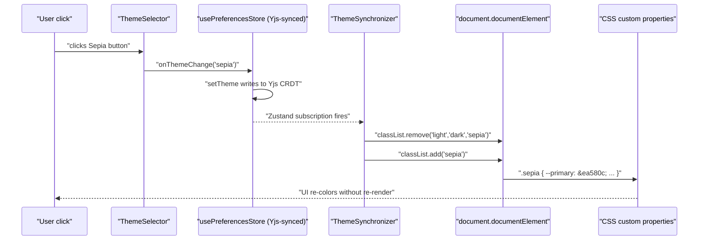
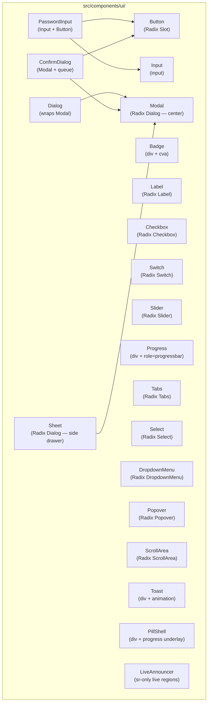
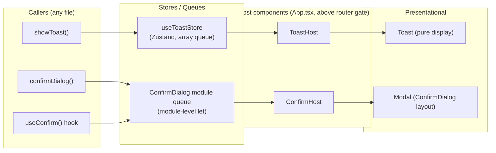
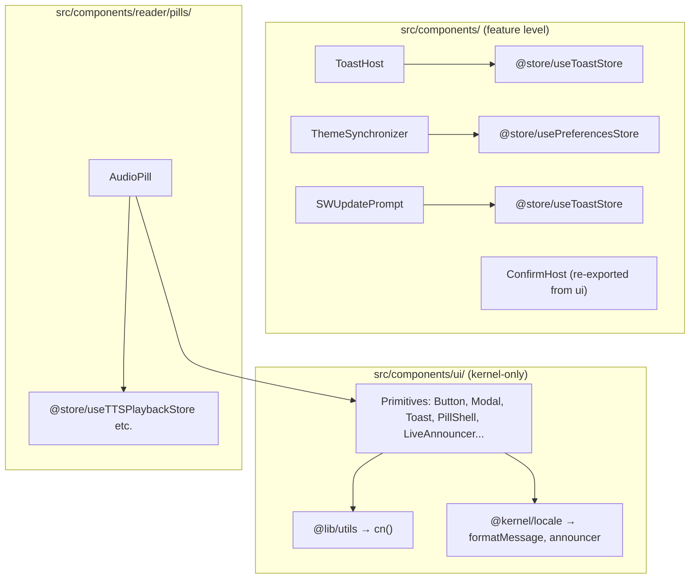

# UI Design System

The Versicle design system is a deliberate simplification: a thin, accessible, CSS-variable-themed layer over Radix UI primitives, stitched together by class-variance-authority (CVA) and tailwind-merge, living exclusively in [`src/components/ui/`](../../src/components/ui/). Every component there is kernel-level — it may only import from `@lib/utils` or `@kernel/` — so the system can be composed freely across every feature domain without circular dependencies. Feature-level state, stores, and domain logic live one layer up in `src/components/`.

This document covers the full stack: why the design choices were made, how CSS variables and theming work, what each primitive provides, the two overlay host systems (ToastHost and ConfirmHost), the accessibility infrastructure woven through all of it, and the boundary rules that keep it clean going forward.

---

## Table of Contents

1. [Design Intent](#design-intent)
2. [Technology Stack and Boundaries](#technology-stack-and-boundaries)
3. [Token System and CSS Variables](#token-system-and-css-variables)
4. [Theming Architecture](#theming-architecture)
5. [Component Library](#component-library)
6. [Overlay Architecture: Toast and Confirm](#overlay-architecture-toast-and-confirm)
7. [Accessibility Infrastructure](#accessibility-infrastructure)
8. [Animation and Motion Policy](#animation-and-motion-policy)
9. [The ui/ Import Boundary](#the-ui-import-boundary)
10. [Phase 8 Evolution Notes](#phase-8-evolution-notes)
11. [Testing](#testing)

---

## Design Intent

Versicle targets two very different rendering surfaces simultaneously: a React PWA running in Chromium on desktop and a Capacitor-wrapped native app on iOS and Android. The design system serves both without platform-conditional rendering because native surfaces get the same web view as the PWA — the system's job is to look and feel right in all contexts.

Three goals drive every decision in the system:

**Accessibility first.** Every interactive primitive is built on Radix UI, which handles WAI-ARIA roles, keyboard navigation, focus management, and escape-key dismissal at the primitive level. Versicle adds explicit focus-ring styling (via `focus-visible:ring-*` Tailwind classes) on top of that, and the two overlay host components (ToastHost, ConfirmHost) implement live-region semantics the way the ARIA specification requires — persistent regions, not regions created together with their content.

**Single source of truth for color.** All colors in the system flow through CSS custom properties. There is no hardcoded hex value inside a component (with one intentional exception noted in `ThemeSelector.tsx` below). This means a theme switch is a single class change on `<html>` — zero React re-renders needed for color propagation.

**Strict layering.** The `ui/` directory is bounded: it may not import from stores, domains, or feature code. This lets any feature use any primitive without worrying about circular dependencies. The boundary is enforced by ESLint rules (described in [The ui/ Import Boundary](#the-ui-import-boundary)).

---

## Technology Stack and Boundaries

### Core libraries

| Library | Version | Role |
|---|---|---|
| `@radix-ui/react-*` | Various ^1–2 | Headless accessible primitives (Dialog, Select, Slider, etc.) |
| `class-variance-authority` | ^0.7.1 | Variant-safe class composition (`cva()`) |
| `tailwind-merge` | ^3.4.0 | De-duplicates and resolves conflicting Tailwind classes |
| `clsx` | ^2.1.1 | Conditional class names |
| `lucide-react` | ^0.562.0 | Icon set (SVG icons used throughout) |
| `tw-animate-css` | ^1.4.0 | Tailwind v4 animation utilities (replaces dropped `tailwindcss-animate`) |

### The `cn()` utility

Every component in `ui/` uses the single helper from [`src/lib/utils.ts`](../../src/lib/utils.ts):

```typescript
import { type ClassValue, clsx } from 'clsx';
import { twMerge } from 'tailwind-merge';

export function cn(...inputs: ClassValue[]) {
  return twMerge(clsx(inputs));
}
```

`clsx` handles conditional objects and arrays; `twMerge` resolves conflicting Tailwind utilities (e.g., a caller passing `className="h-8"` to a Button that defaults to `h-10` — the caller's value wins). Every forwardRef component passes `cn(baseClasses, className)` to the underlying element.

### Radix slot pattern

`Button` uses Radix's `Slot` primitive via the `asChild` prop:

```typescript
const Comp = asChild ? Slot : "button"
return <Comp className={cn(buttonVariants({ variant, size, className }))} ref={ref} {...props} />
```

When `asChild` is true, the button's classes are merged onto the single child element instead of wrapping it in a `<button>`. This is how `<Button asChild><a href="/...">...</a></Button>` produces an anchor with button styling rather than an anchor inside a button — used in the library and reader for navigation elements that look like buttons but must be links for correct semantics.

---

## Token System and CSS Variables

### Variable declarations

[`src/index.css`](../../src/index.css) is the single source of the color token system. It declares CSS custom properties under `:root` for the light theme, then overrides them under the `.dark` and `.sepia` classes. Tailwind v4's `@theme` block bridges the CSS variables into the Tailwind utility namespace so that `bg-primary` maps to `var(--primary)` at build time.

```css
@theme {
  --color-background: var(--background);
  --color-foreground: var(--foreground);
  --color-primary: var(--primary);
  --color-primary-foreground: var(--primary-foreground);
  /* ... surface, muted, accent, destructive, success, warning, border, input, ring, popover, card */
}
```

### Token palette

| Token | Light | Dark | Sepia |
|---|---|---|---|
| `--primary` | `#2563eb` (Blue 600) | `#3b82f6` (Blue 500) | `#ea580c` (Orange 600) |
| `--background` | `#ffffff` | `#020617` (Slate 950) | `#fffbeb` (Amber 50) |
| `--foreground` | `#0f172a` (Slate 900) | `#f8fafc` (Slate 50) | `#78350f` (Amber 900) |
| `--surface` | `#f8fafc` (Slate 50) | `#0f172a` (Slate 900) | `#fef3c7` (Amber 100) |
| `--border` | `#e2e8f0` (Slate 200) | `#1e293b` (Slate 800) | `#fcd34d` (Amber 300) |
| `--destructive` | `#dc2626` (Red 600) | `#ef4444` (Red 500) | `#b91c1c` (Red 700) |
| `--success` | `#16a34a` (Green 600) | `#22c55e` (Green 500) | `#15803d` (Green 700) |
| `--warning` | `#ca8a04` (Yellow 600) | `#eab308` (Yellow 500) | `#b45309` (Amber 700) |
| `--muted` | `#f1f5f9` (Slate 100) | `#1e293b` (Slate 800) | `#fde68a` (Amber 200) |
| `--ring` | `#2563eb` | `#3b82f6` | `#ea580c` |

Every theme carries matching `-foreground` counterparts for proper contrast. The `--ring` value tracks `--primary` so focus rings are always on-brand.

### Extended semantic tokens

Beyond the standard shadcn token set, Versicle adds `--surface` (a step lighter than `--background`, used for card insets and pill backgrounds) and separate `--success` / `--warning` families (not present in default shadcn). These let `Toast.tsx` reference `bg-destructive` / `text-destructive-foreground` without hardcoding red.

### Body transitions

```css
body {
  transition: background-color 0.3s ease, color 0.3s ease;
}
```

The 300ms transition is the only animation that applies unconditionally regardless of `prefers-reduced-motion` — and it still fires with `transition-duration: .01ms` when reduced-motion is active (effectively imperceptible but not 0ms, so `transitionend` still fires for any listeners).

---

## Theming Architecture

Theme selection is a two-component pipeline: **ThemeSelector** presents the UI; **ThemeSynchronizer** applies it to the DOM.



### ThemeSelector

[`src/components/ThemeSelector.tsx`](../../src/components/ThemeSelector.tsx) is a presentational component that accepts `currentTheme` and `onThemeChange` as props. It renders three `Button` elements (ghost variant) with hardcoded background colors to preview each theme — deliberately not using CSS variables here since the preview buttons must show the target theme's color, not the current theme's.

```tsx
<Button
  variant="ghost"
  onClick={() => onThemeChange('sepia')}
  className={cn(
    "flex-1 h-auto px-3 py-2 border transition-all",
    "bg-[#F5E6D3] text-[#5C4B37] border-transparent hover:bg-[#EBDCC9]",
    currentTheme === 'sepia' && "ring-2 ring-primary ring-offset-2"
  )}
  aria-label="Select Sepia theme"
  aria-pressed={currentTheme === 'sepia'}
>
  Sepia
</Button>
```

The `aria-pressed` attribute makes each button a toggle button in the accessibility tree — screen readers announce "Sepia, toggle button, pressed" or "not pressed" correctly.

### ThemeSynchronizer

[`src/components/ThemeSynchronizer.tsx`](../../src/components/ThemeSynchronizer.tsx) is a headless component (renders `null`) mounted unconditionally in `RootLayout`. It subscribes to `usePreferencesStore.currentTheme` and applies the corresponding class to `document.documentElement` via `useEffect`:

```typescript
const currentTheme = usePreferencesStore(state => state.currentTheme) || 'light';

useEffect(() => {
  const root = window.document.documentElement;
  root.classList.remove('light', 'dark', 'sepia');
  if (currentTheme === 'light') root.classList.add('light');
  else if (currentTheme === 'dark') root.classList.add('dark');
  else if (currentTheme === 'sepia') root.classList.add('sepia');
  else if (currentTheme === 'custom') root.classList.add('light'); // dead branch
}, [currentTheme]);
```

The `'custom'` branch is dead code — `usePreferencesStore`'s type is `'light' | 'dark' | 'sepia'` and there is no `'custom'` in the Yjs document. The `|| 'light'` fallback handles the case where `currentTheme` is `null` or `undefined` during boot before the Yjs store has hydrated.

Because `currentTheme` lives in the Yjs-synced portion of `usePreferencesStore`, a theme change on a phone propagates via Firestore CRDT sync to all other devices — the desktop's `ThemeSynchronizer` re-fires its effect and updates `<html>`.

### The preferences store type

The canonical theme type is defined in [`src/store/usePreferencesStore.ts`](../../src/store/usePreferencesStore.ts):

```typescript
currentTheme: 'light' | 'dark' | 'sepia';
```

This union is re-declared in `ThemeSelector.tsx`'s prop interface as `'light' | 'dark' | 'sepia'` — a known duplication tracked as debt D14 in the analysis document.

---

## Component Library

The diagram below shows the component hierarchy and which Radix primitives each piece wraps.



### Button

[`src/components/ui/Button.tsx`](../../src/components/ui/Button.tsx) — The primary interactive element, built with `React.forwardRef` and CVA. Six variants and four sizes:

```typescript
const buttonVariants = cva(
  "inline-flex items-center justify-center whitespace-nowrap rounded-md text-sm font-medium " +
  "ring-offset-background transition-colors " +
  "focus-visible:outline-none focus-visible:ring-2 focus-visible:ring-ring focus-visible:ring-offset-2 " +
  "disabled:pointer-events-none disabled:opacity-50",
  {
    variants: {
      variant: {
        default:     "bg-primary text-primary-foreground hover:bg-primary/90",
        destructive: "bg-destructive text-destructive-foreground hover:bg-destructive/90",
        outline:     "border border-input bg-background hover:bg-accent hover:text-accent-foreground",
        secondary:   "bg-secondary text-secondary-foreground hover:bg-secondary/80",
        ghost:       "hover:bg-accent hover:text-accent-foreground",
        link:        "text-primary underline-offset-4 hover:underline",
      },
      size: {
        default: "h-10 px-4 py-2",
        sm:      "h-9 rounded-md px-3",
        lg:      "h-11 rounded-md px-8",
        icon:    "h-10 w-10",
      },
    },
    defaultVariants: { variant: "default", size: "default" },
  }
)
```

The `disabled:pointer-events-none disabled:opacity-50` base classes ensure that disabled buttons neither respond to clicks (important — prevents accidental double-submission) nor receive focus (they are removed from tab order by `disabled`). The `focus-visible:ring-*` classes follow the `:focus-visible` convention: focus rings appear only for keyboard focus, not mouse click.

The `asChild` prop delegates rendering to the child element, enabling accessible anchor-styled-as-button patterns.

### Badge

[`src/components/ui/Badge.tsx`](../../src/components/ui/Badge.tsx) — A small status tag using CVA. Four variants: `default` (primary background), `secondary`, `destructive`, `outline`. Rendered as a `<div>` because it is purely informational — no interactive role, no tabindex.

### Input and PasswordInput

[`src/components/ui/Input.tsx`](../../src/components/ui/Input.tsx) — A direct `<input>` wrapper. Uses `border-input bg-transparent` to pick up the theme's input border color. The `focus-visible:ring-1` (not `ring-2`) is intentionally lighter than Button's ring — inputs already have a border for affordance, so a single-pixel ring is sufficient.

[`src/components/ui/PasswordInput.tsx`](../../src/components/ui/PasswordInput.tsx) — Composes `Input` with an absolutely-positioned `Button` (ghost, icon-like) that toggles password visibility. The toggle button carries `aria-label={showPassword ? "Hide password" : "Show password"}` and the eye icon has `aria-hidden="true"` — the label alone conveys meaning to screen readers.

```tsx
<Eye className="h-4 w-4 text-muted-foreground" aria-hidden="true" />
```

### Label

[`src/components/ui/Label.tsx`](../../src/components/ui/Label.tsx) — Radix Label root. Importantly, Radix Label's `htmlFor` implementation correctly handles native `<input>` elements and Radix form controls alike. The `peer-disabled:cursor-not-allowed peer-disabled:opacity-70` classes use Tailwind's peer modifier to visually grey out a label when its associated input is disabled — requires the input to precede the label in DOM order or the `peer` relationship won't work.

### Checkbox and Switch

[`src/components/ui/Checkbox.tsx`](../../src/components/ui/Checkbox.tsx) — Radix Checkbox with a `Check` icon indicator. Uses `data-[state=checked]:bg-primary` to style the checked state via Radix's data attribute.

[`src/components/ui/Switch.tsx`](../../src/components/ui/Switch.tsx) — Radix Switch. The thumb translates from `translate-x-0` to `translate-x-5` on check — a CSS transform, not layout, so the transition is GPU-accelerated. `data-[state=checked]:bg-primary data-[state=unchecked]:bg-input` for the track color.

### Slider

[`src/components/ui/Slider.tsx`](../../src/components/ui/Slider.tsx) — Radix Slider. The component has a notable accessibility plumbing decision: ARIA attributes (`aria-label`, `aria-labelledby`, `aria-valuetext`, `aria-describedby`) are extracted from the root props and forwarded to the `Thumb` element because `role="slider"` lives on the Thumb, not the Root, in Radix's implementation. Passing them to Root alone would attach them to a container `div` that carries no interactive role.

```typescript
const { "aria-label": ariaLabel, "aria-labelledby": ariaLabelledBy, ... } = props;
// ... pass to <SliderPrimitive.Thumb aria-label={ariaLabel} ... />
```

### Progress

[`src/components/ui/Progress.tsx`](../../src/components/ui/Progress.tsx) — A custom progressbar (not Radix). Uses `role="progressbar"` with `aria-valuemin={0}`, `aria-valuemax={max}`, and `aria-valuenow={value}`. The fill uses a CSS transform instead of changing `width` directly:

```typescript
const percentage = Math.min(max, Math.max(0, value || 0)) / max * 100
// fill element:
style={{ transform: `translateX(-${100 - percentage}%)` }}
```

This approach is more performant than animating width (which triggers layout reflow) — only `transform` and `opacity` are composited by the GPU without re-layout.

### Select

[`src/components/ui/Select.tsx`](../../src/components/ui/Select.tsx) — Full Radix Select decomposition: `Select` (Root), `SelectValue`, `SelectTrigger`, `SelectContent`, `SelectItem`, plus scroll up/down buttons. Content renders in a `Portal` so it escapes any `overflow:hidden` ancestors. The `popper` position mode (default) adjusts to available viewport space automatically.

### DropdownMenu

[`src/components/ui/DropdownMenu.tsx`](../../src/components/ui/DropdownMenu.tsx) — Radix DropdownMenu with sub-menu support via `DropdownMenuSub` / `DropdownMenuSubTrigger` / `DropdownMenuSubContent`. All content renders in a `Portal`.

### Popover

[`src/components/ui/Popover.tsx`](../../src/components/ui/Popover.tsx) — Radix Popover. Default dimensions: `w-72 p-4`. The `PopoverClose` export allows calling sites to include explicit close buttons inside complex popover content.

### ScrollArea

[`src/components/ui/ScrollArea.tsx`](../../src/components/ui/ScrollArea.tsx) — Radix ScrollArea, which provides a cross-browser custom scrollbar that matches the theme. Uses `bg-border` for the scrollbar thumb — adapts with the theme token. The custom scrollbar in `src/index.css` (`.custom-scrollbar`) is a parallel implementation for contexts where Radix ScrollArea is not used (e.g., native `<div>` overflow regions).

### Tabs

[`src/components/ui/Tabs.tsx`](../../src/components/ui/Tabs.tsx) — Radix Tabs. `TabsList` uses `bg-muted` background; the active `TabsTrigger` gets `data-[state=active]:bg-background data-[state=active]:shadow-sm` to create a "pill inside a track" appearance.

### Sheet

[`src/components/ui/Sheet.tsx`](../../src/components/ui/Sheet.tsx) — A side drawer built on Radix Dialog (same primitive as Modal). Uses CVA to select the slide direction:

```typescript
const sheetVariants = cva(
  "fixed z-50 gap-4 bg-background p-6 shadow-lg transition ease-in-out ...",
  {
    variants: {
      side: {
        top:    "inset-x-0 top-0 border-b data-[state=closed]:slide-out-to-top ...",
        bottom: "inset-x-0 bottom-0 border-t ...",
        left:   "inset-y-0 left-0 h-full w-3/4 border-r ... sm:max-w-sm",
        right:  "inset-y-0 right-0 h-full w-3/4 border-l ... sm:max-w-sm",
      },
    },
    defaultVariants: { side: "right" },
  }
)
```

Open duration is 500ms, close duration is 300ms — a deliberate asymmetry (slower open feels smoother; faster close feels snappy). Sheet is used for the audio panel and table of contents in the reader.

### Modal

[`src/components/ui/Modal.tsx`](../../src/components/ui/Modal.tsx) — The foundational modal primitive. Built directly on `@radix-ui/react-dialog` parts: `Modal` = `DialogPrimitive.Root`, `ModalPortal` = `DialogPrimitive.Portal`, `ModalOverlay` (backdrop), `ModalContent` (centered panel), `ModalHeader`, `ModalTitle`, `ModalDescription`.

Key implementation details:
- `ModalOverlay`: `bg-black/50 backdrop-blur-sm` — the backdrop blurs the content behind it.
- `ModalContent`: `fixed left-[50%] top-[50%] translate-x-[-50%] translate-y-[-50%]` — CSS centering, independent of viewport size.
- Close button (`DialogPrimitive.Close`): hidden with `hideCloseButton` prop. Carries `<span className="sr-only">Close</span>` for screen readers.
- Entry animation: `data-[state=open]:animate-in data-[state=open]:fade-in-0 data-[state=open]:zoom-in-95 data-[state=open]:slide-in-from-top-[48%]` — a combined fade+zoom+slide.
- Exit animation: reversed via `data-[state=closed]:*` variants.

`ModalTitle` and `ModalDescription` map to `DialogPrimitive.Title` and `DialogPrimitive.Description` which Radix automatically associates with the dialog via `aria-labelledby` and `aria-describedby`.

### Dialog

[`src/components/ui/Dialog.tsx`](../../src/components/ui/Dialog.tsx) — A convenience wrapper around `Modal` that accepts a flat prop API (`isOpen`, `onClose`, `title`, `description`, `children`, `footer`, `hideCloseButton`) instead of the compound-components pattern. Used by call sites that need a simple modal and don't need to customize layout.

```typescript
// Always provides a ModalDescription — falls back to sr-only "Dialog Content" when
// no description is passed, ensuring the dialog always has an accessible description.
<ModalDescription className={description ? "" : "sr-only"}>
  {description || "Dialog Content"}
</ModalDescription>
```

### PillShell

[`src/components/ui/PillShell.tsx`](../../src/components/ui/PillShell.tsx) — The residual layout primitive from the Phase 8 §C CompassPill dissolution. Before the dissolution, a single 828-line `CompassPill` component lived in `ui/` and imported five feature stores directly (breaking the kernel-only boundary). Phase 8 split it: the shared chrome moved here; feature pills moved to `src/components/reader/pills/`, `src/components/sync/`, and `src/components/chinese/`.

`PillShell` is deliberately dumb — no store imports, no variant logic, no state:

```typescript
export interface PillShellProps extends React.HTMLAttributes<HTMLDivElement> {
  shape?: 'bar' | 'card';          // rounded-full vs rounded-2xl
  emphasis?: 'default' | 'strong'; // bg-background/75 vs bg-background/90
  progress?: number;               // 0–100: left-anchored progress underlay
  progressTestId?: string;
}
```

The `progress` prop renders an absolutely-positioned `bg-primary/10` underlay div behind the pill's content — the audio pill uses this to show playback progress without interfering with layout. The `-z-10` z-index keeps the underlay behind all pill content.

Example consumer from `AudioPill`:

```tsx
import { PillShell } from '../../ui/PillShell';

<PillShell shape="bar" emphasis="default" progress={playbackProgress}>
  {/* AudioPill controls */}
</PillShell>
```

---

## Overlay Architecture: Toast and Confirm

Two persistent overlay systems share a common pattern: a module-level queue, a host component that renders the queue head, and an imperative API callable from anywhere (React or non-React code).



### ToastHost

[`src/components/ToastHost.tsx`](../../src/components/ToastHost.tsx) is mounted in `App.tsx` **above the router gate** — critically, not inside `RootLayout` (which is only rendered when the route tree is active). This placement means toasts fired during boot (before `dbStatus === 'ready'`) are not dropped; they sit in `useToastStore` and render the moment `ToastHost` mounts.

The host separates error toasts from non-error toasts into two ARIA live regions:

```tsx
<div role="status" aria-live="polite" className="...">
  {/* info + success toasts */}
</div>
<div role="alert" aria-live="assertive" className="...">
  {/* error toasts */}
</div>
```

Both regions are **always in the DOM, even when empty** — this is the standard ARIA live-region practice. A region created simultaneously with its content is unreliable across screen readers; the region must exist before the content is inserted.

Position: `fixed bottom-20 left-1/2 -translate-x-1/2 z-[100]`. The `bottom-20` (80px) clearance keeps toasts above the reader control bar pill.

### useToastStore

[`src/store/useToastStore.ts`](../../src/store/useToastStore.ts) is a Zustand queue store (migrated from single-slot in Phase 8 §D). Key behaviors:

- **Queue cap**: `MAX_TOASTS = 5`. When more than 5 toasts exist, the oldest are dropped.
- **Deduplication**: A new toast with the same `message` and `type` as an existing visible toast replaces (refreshes) the existing entry with a new `id`, restarting its timer and re-triggering live-region announcement.
- **Duration defaults**: `type === 'error'` defaults to 5000ms; all others default to 3000ms. `duration <= 0` or `Infinity` = persistent (no auto-dismiss).
- **i18n integration**: `content` may be a `MessageKey` string, a `{key, params}` object, or deprecated raw prose. `resolveMessage()` is called at enqueue time so the rendered `message` is always a plain string.

```typescript
showToast: (content, type = 'info', duration, action) => {
  const message = resolveMessage(content);
  set((state) => {
    const kept = state.toasts.filter(
      (t) => !(t.message === message && t.type === type) // dedupe
    );
    const next = [...kept, { id: nextToastId++, message, ... }];
    return { toasts: next.slice(-MAX_TOASTS) }; // cap
  });
},
```

### Toast component

[`src/components/ui/Toast.tsx`](../../src/components/ui/Toast.tsx) is a pure presentational component with no store imports. Its key accessibility behavior is **pause-on-hover and pause-on-focus-within**:

```tsx
onMouseEnter={() => setIsPaused(true)}
onMouseLeave={() => setIsPaused(false)}
onFocus={() => setIsPaused(true)}
onBlur={(e) => {
  // Resume only when focus leaves the toast entirely (focus-within behavior)
  if (!e.currentTarget.contains(e.relatedTarget as Node | null)) {
    setIsPaused(false);
  }
}}
```

This ensures keyboard users who tab into a toast to activate an action button get the same read-time grace as mouse users who hover. The timer pauses on focus-enter, and resumes (restarting the full duration) only when focus leaves the entire toast — so tabbing between the action button and the dismiss button inside the toast does not restart the timer multiple times.

The dismiss timer restarts in full on resume — it does not resume from where it was paused. This is intentional: if a user pauses and resumes a 3-second toast, they get another full 3 seconds.

### SW Update Prompt

[`src/components/SWUpdatePrompt.tsx`](../../src/components/SWUpdatePrompt.tsx) uses the toast system for its persistent update notification, mounted alongside `ToastHost` above the router gate:

```typescript
useToastStore.getState().showToast('app.updateReady', 'info', Infinity, {
  label: 'common.reload',
  onAction: () => { void updateServiceWorker(true); },
});
```

`duration: Infinity` makes the toast persistent until the user acts. The deduplication logic in the store ensures that if `needRefresh` flips back and forth, no stack of update toasts accumulates.

### ConfirmHost and confirmDialog

[`src/components/ui/ConfirmDialog.tsx`](../../src/components/ui/ConfirmDialog.tsx) replaces all native `confirm()` and `alert()` calls (banned by ESLint `no-alert` at error level since Phase 8 §D).

The architecture is a module-level queue with React's `useSyncExternalStore` as the bridge:

```typescript
let queue: readonly PendingConfirm[] = [];
const subscribers = new Set<() => void>();

function setQueue(next: readonly PendingConfirm[]): void {
  queue = next;
  for (const notify of subscribers) notify();
}

export function confirmDialog(request: ConfirmRequest): Promise<boolean> {
  return new Promise<boolean>((resolve) => {
    setQueue([...queue, { request, resolve }]);
  });
}
```

`ConfirmHost` subscribes to the queue with `useSyncExternalStore(subscribe, getSnapshot, getSnapshot)` and renders only the head entry:

```typescript
const pending = useSyncExternalStore(subscribe, getSnapshot, getSnapshot);
const active = pending[0];
if (!active) return null;
```

Queue semantics: requests are processed one at a time (FIFO). A second `confirmDialog()` call while the first is visible enqueues the second — the second dialog appears only after the first is settled. This is the correct UX for cascaded destructive confirmations (e.g., "Delete book?" → "Also delete notes?").

The `ConfirmHost` is mounted in `App.tsx` above the router gate, so even the `SafeModeView` reset path gets the dialog. Requests made with no host mounted stay queued until a host appears.

### ConfirmRequest shape

```typescript
export interface ConfirmRequest {
  titleKey: MessageKey;          // Required — dialog title (i18n key)
  bodyKey?: MessageKey;          // Optional — dialog body text
  params?: MessageParams;        // Applied to both title and body templates
  danger?: boolean;              // Destructive styling; defaults confirm label to 'Delete'
  confirmKey?: MessageKey;       // Override confirm button label
  cancelKey?: MessageKey;        // Override cancel button label
}
```

All text comes from i18n message keys — free-form prose is not accepted. This enforces the i18n ADR at the type level.

The `danger` flag applies two changes: the confirm button gets `variant="destructive"` (red), and the default confirm label becomes `common.delete` instead of `common.confirm`. A `confirmKey` override can change the label to something more specific ("Remove" instead of "Delete").

### ESLint ban

The ESLint config enforces the no-native-confirm rule at error severity:

```javascript
'no-alert': 'error',
'no-restricted-globals': [
  'error',
  { name: 'confirm',
    message: 'Native confirm() is banned (Phase 8 §D) — use useConfirm() / ' +
             'confirmDialog from @components/ui/ConfirmDialog ...' },
  // alert is covered by no-alert
]
```

---

## Accessibility Infrastructure

### Focus rings everywhere

Every interactive primitive in the design system carries `focus-visible:outline-none focus-visible:ring-2 focus-visible:ring-ring focus-visible:ring-offset-2`. The `focus-visible:` pseudo-class means rings appear only for keyboard navigation, not mouse clicks — following the W3C WICAG 2.5.3 recommendation for visible focus indicators without visual noise for pointer users.

### LiveAnnouncer

[`src/components/ui/LiveAnnouncer.tsx`](../../src/components/ui/LiveAnnouncer.tsx) provides two persistent screen-reader live regions, mounted once in `RootLayout`:

```tsx
<div role="status" aria-live="polite" className="sr-only">{polite}</div>
<div role="alert" aria-live="assertive" className="sr-only">{assertive}</div>
```

The `sr-only` class visually hides the elements (positioned off-screen, width/height 1px, overflow hidden) while keeping them in the accessibility tree.

**Re-announcement of identical text** is handled by a clear-then-write pattern:

```typescript
const unsubscribe = subscribeAnnouncements((announcement) => {
  const set = announcement.assertive ? setAssertive : setPolite;
  set('');              // clear first
  cancelAnimationFrame(raf);
  raf = requestAnimationFrame(() => {
    set(announcement.text);  // write next frame
    clearTimer.current = setTimeout(() => set(''), 10_000); // prune after 10s
  });
});
```

Most screen readers ignore a mutation that leaves a live region's text unchanged. The clear-then-write on the next animation frame forces a real DOM text node change even when the content is the same string. The 10-second cleanup prevents stale text from being re-read if a user navigates the accessibility tree later.

### The announce() API

Non-React code (stores, service modules, the TTS worker bridge) announces through the module-level `announce()` function in [`src/kernel/locale/announcer.ts`](../../src/kernel/locale/announcer.ts):

```typescript
export function announce(
  content: MessageInput | string,
  opts: { assertive?: boolean } = {},
): void {
  const announcement = {
    id: nextId++,
    text: resolveMessage(content),
    assertive: !!opts.assertive,
  };
  for (const listener of listeners) listener(announcement);
}
```

If no `LiveAnnouncer` is mounted (e.g., during server rendering or a test without the announcer), calls are fire-and-forget no-ops. This makes announcement calls safe everywhere without defensive checks.

### TTS Announcements

[`src/components/TtsAnnouncements.tsx`](../../src/components/TtsAnnouncements.tsx) is a headless adapter in `RootLayout` that bridges the TTS playback store to `announce()`. It subscribes to `useTTSPlaybackStore.status` and announces state transitions ("Playing — Chapter 3", "Paused", "Stopped") using the polite or assertive region as appropriate. Critically, it never announces per-sentence progress — only state transitions and debounced section changes — preventing spam to screen-reader users.

### Axe integration

A smoke test file at [`src/components/ui/axe-smoke.test.tsx`](../../src/components/ui/axe-smoke.test.tsx) runs axe-core against Button (two variants), Toast, and Progress with a labeled `<progress>` element. The `runAxe()` helper comes from the shared test harness. The `ConfirmDialog.test.tsx` includes a full axe scan of a live dialog. These tests ensure accessibility regressions don't slip in silently.

### aria-label conventions

Throughout the system, icon-only interactive elements carry explicit `aria-label`:

- `PasswordInput` toggle: `aria-label={showPassword ? "Hide password" : "Show password"}`
- Toast dismiss: `aria-label="Dismiss notification"`
- Modal close button: `<span className="sr-only">Close</span>` (using sr-only text instead of aria-label on the Radix Close element)
- ThemeSelector buttons: `aria-label="Select Light theme"` + `aria-pressed={currentTheme === 'light'}`

---

## Animation and Motion Policy

### tw-animate-css (Phase 8 §K)

`src/index.css` imports `tw-animate-css` alongside `tailwindcss`:

```css
@import "tailwindcss";
@import "tw-animate-css";
```

This library provides the `animate-in`, `fade-in`, `slide-in-from-bottom-5`, `zoom-in-95`, and similar classes used throughout modals, sheets, popovers, dropdowns, and toasts. Before Phase 8 §K, these classes were silent no-ops — the Tailwind v4 migration dropped `tailwindcss-animate` (the v3 plugin that provided them) and no replacement was installed. The `tw-animate-css` install restored all entrance/exit animations.

### Reduced motion policy

A single global rule in `src/index.css` covers all CSS animations and transitions:

```css
@media (prefers-reduced-motion: reduce) {
  *, *::before, *::after {
    animation-duration: .01ms !important;
    animation-iteration-count: 1 !important;
    transition-duration: .01ms !important;
    scroll-behavior: auto !important;
  }
}
```

The duration is `.01ms`, **not** `0ms`. This is intentional: `animationend` and `transitionend` events still fire, which is required for any JavaScript that waits on an animation to complete before unmounting an element or changing state. Setting to `0ms` can cause those events to be skipped in some browsers.

JavaScript-driven motion (e.g., scroll animations, any imperative animation) consumes a corresponding `useReducedMotion()` hook in `src/hooks/` — the CSS rule covers only declarative CSS animations.

### ping-slow animation

The `@theme` block in `src/index.css` declares a `--animate-ping-slow` custom animation:

```css
--animate-ping-slow: ping 10s cubic-bezier(0, 0, 0.2, 1) infinite;
@keyframes ping {
  10%, 100% { transform: scale(2); opacity: 0; }
}
```

This is used for the sync status indicator's pulsing ring — a very slow ping that suggests active background activity without being distracting.

---

## The ui/ Import Boundary

The README for `src/components/ui/` states the constraint clearly: "No store imports (the `ui-imports-kernel-only` boundary holds this directory to kernel-level deps)."

In practice, this means the only non-Radix/non-Lucide imports allowed from `src/components/ui/` are:
- `@lib/utils` (the `cn()` helper and CJK utilities)
- `@kernel/locale/messages` (for `formatMessage`, `MessageKey`, `MessageParams` — used only in `ConfirmDialog.tsx`)
- `@kernel/locale/announcer` (for `subscribeAnnouncements` — used only in `LiveAnnouncer.tsx`)

Inspecting all non-test files confirms this holds in the current tree — no `@store/`, `@data/`, `@domains/`, or `@app/` imports appear in any `src/components/ui/*.tsx` file.

This boundary is enforced by ESLint in `eslint.config.js` at zero warnings (the ratchet). Feature components that need both primitive UI and store access live in `src/components/` (one level up) — for example, `ToastHost.tsx` is in `src/components/` rather than `src/components/ui/` precisely because it imports `useToastStore`.



Note that `ConfirmDialog.tsx` lives inside `src/components/ui/` and imports from `@kernel/locale/messages` — this is permitted by the boundary since `@kernel/` is a allowed dependency. The `ConfirmHost` export makes it appear to live at the feature level, but the file itself stays within `ui/` because all its direct dependencies are kernel-level.

---

## Phase 8 Evolution Notes

The current design system is the result of systematic refactoring in Phase 8 of the Versicle overhaul program. Understanding what changed helps explain why some things look the way they do.

### Phase 8 §C: CompassPill dissolution

Before §C, a single 828-line `CompassPill.tsx` lived in `src/components/ui/` with seven variants (`active|summary|compact|annotation|sync-alert|audio-triage|vocab-triage`) and direct imports of five feature stores plus the epubjs `rendition` object. This inverted the layering: the design system depended on feature domains.

§C split the component:
- Shared chrome (geometry, blur, border, progress underlay) → `PillShell` in `ui/`
- Feature pills → `src/components/reader/pills/` (AudioPill, AnnotationPill, SummaryPill, AudioTriagePill)
- Sync alert pill → `src/components/sync/`
- Vocab triage → `src/components/chinese/`
- Variant priority selection → `ReaderControlBar`

### Phase 8 §D: Overlay host system

Before §D:
- `useToastStore` held a single `{message, type, isVisible}` slot — concurrent toasts overwrote each other
- `ToastContainer` lived inside `RootLayout` (below the router gate) — boot-time toasts dropped silently
- 18 sites called native `confirm()` / 7 called `alert()` — untestable, unthemeable, broke on some WebViews

§D introduced:
- Queue-based `useToastStore` with deduplication and `MAX_TOASTS = 5` cap
- `ToastHost` mounted above the router gate in `App.tsx`
- `ConfirmHost` + `confirmDialog()` as the unified confirmation system
- `LiveAnnouncer` with persistent live regions
- `no-alert` ESLint rule at error severity

### Phase 8 §G: SW update prompt

The Service Worker's `registerType` changed from `'autoUpdate'` (SW silently takes over mid-session) to `'prompt'` (waits until user acknowledges). `SWUpdatePrompt` was introduced to surface this via the toast system with a persistent "Reload" action toast.

### Phase 8 §I: Versicle Sans Narrow font

A custom font for pinyin overlays (Chinese reading mode) was introduced. The font is served from `/fonts/` and registered in `src/index.css`. The CSS utility class `.font-pinyin` applies it. See [35-domain-chinese.md](35-domain-chinese.md) for the Chinese reading domain context.

### Phase 8 §K: Animation restoration

The Tailwind v4 migration silently dropped `tailwindcss-animate`, making all `animate-in/slide-in-from-*/fade-in` classes no-ops. `tw-animate-css` was installed as the Tailwind v4-native replacement. The `@media (prefers-reduced-motion)` global rule was added at the same time to give the restored animations a single governance point.

---

## Testing

### Unit tests for primitives

Each interactive primitive has a `*.test.tsx` file exercising its core behaviors:

| File | What it tests |
|---|---|
| [`Button.test.tsx`](../../src/components/ui/Button.test.tsx) | Rendering, click handling, disabled state, ref forwarding, variant/size classes, `asChild` |
| [`Input.test.tsx`](../../src/components/ui/Input.test.tsx) | Value binding, placeholder, disabled |
| [`PasswordInput.test.tsx`](../../src/components/ui/PasswordInput.test.tsx) | Show/hide toggle, aria-label changes |
| [`Slider.test.tsx`](../../src/components/ui/Slider.test.tsx) | Value changes, aria attributes on thumb |
| [`Progress.test.tsx`](../../src/components/ui/Progress.test.tsx) | `aria-valuenow` accuracy, bounds clamping |
| [`Dialog.test.tsx`](../../src/components/ui/Dialog.test.tsx) | Open/close, title rendering |
| [`Toast.test.tsx`](../../src/components/ui/Toast.test.tsx) | Auto-dismiss, pause on hover, focus-within, action button |
| [`ConfirmDialog.test.tsx`](../../src/components/ui/ConfirmDialog.test.tsx) | Resolve true/cancel, queue ordering, pre-host enqueue, axe |
| [`axe-smoke.test.tsx`](../../src/components/ui/axe-smoke.test.tsx) | axe-core scan on Button, Toast, Progress |

### ThemeSynchronizer tests

[`src/components/ThemeSynchronizer.test.tsx`](../../src/components/ThemeSynchronizer.test.tsx) covers all three themes, the null fallback to light, and the class removal behavior when theme changes. It mocks `usePreferencesStore` — the only test file in `src/components/` that needs to.

### ThemeSelector tests

[`src/components/ThemeSelector.test.tsx`](../../src/components/ThemeSelector.test.tsx) tests button rendering and callback invocation.

### Test seam: resetConfirmQueueForTests

`ConfirmDialog.tsx` exports:

```typescript
export function resetConfirmQueueForTests(): void {
  for (const entry of queue) entry.resolve(false);
  setQueue([]);
}
```

Because the queue is module-level (not per-React-tree), tests that call `confirmDialog()` must reset between runs to prevent state leakage. `afterEach(() => resetConfirmQueueForTests())` is the required teardown pattern.

---

## Cross-references

- [Architecture overview](10-architecture-overview.md) — layering context for where `src/components/ui/` sits in the codebase
- [App shell and routing](42-app-shell-and-routing.md) — where `ToastHost`, `ConfirmHost`, and `SWUpdatePrompt` are mounted in `App.tsx`
- [Settings shell](41-settings-shell.md) — uses `Modal`, `Dialog`, `Sheet`, `Tabs`, `Select`, `Slider`, `Switch`, `Button` throughout
- [Reader UI and overlays](31-reader-ui-and-overlays.md) — `Sheet` for the audio panel and TOC; `PillShell` composition in feature pills
- [Accessibility](72-accessibility.md) — full accessibility audit context; `LiveAnnouncer` and `TtsAnnouncements` detail
- [Domain: Chinese](35-domain-chinese.md) — Versicle Sans Narrow font usage for pinyin
- [Internationalization](71-internationalization.md) — `MessageKey` / `formatMessage` used in `ConfirmDialog`; i18n ADR that bans prose in confirmations
- [Overhaul history](80-overhaul-history.md) — Phase 8 §C, §D, §G, §I, §K change log
