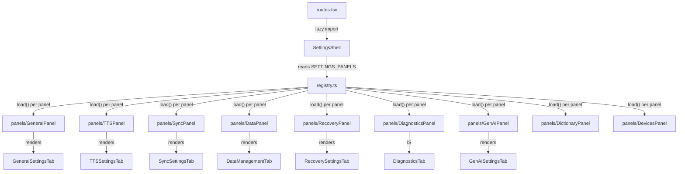
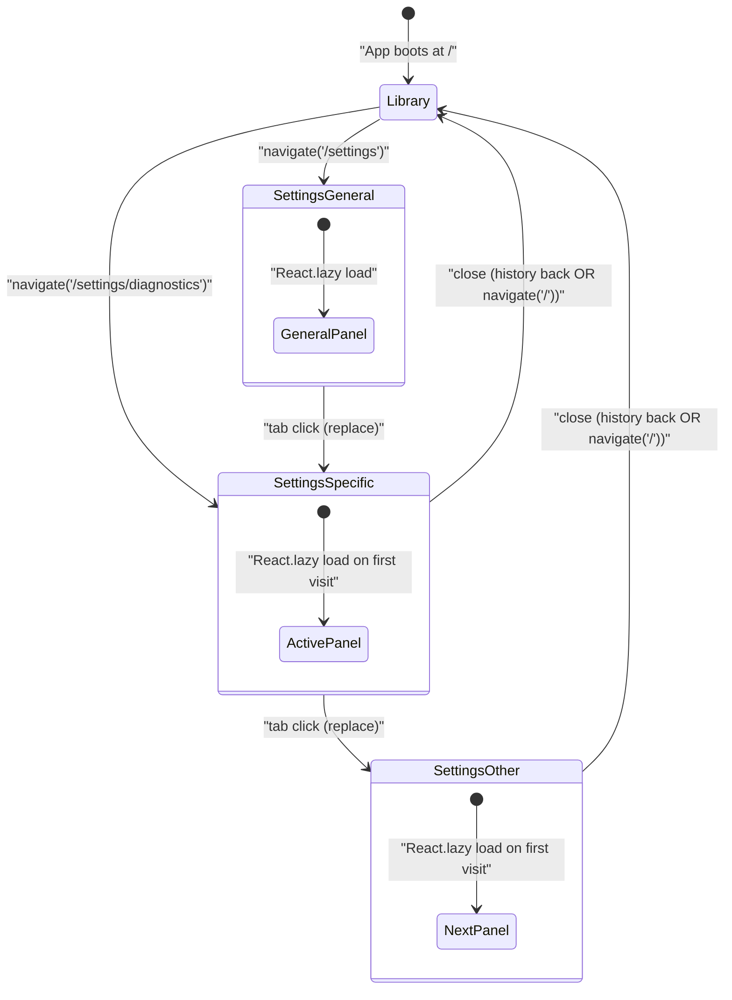
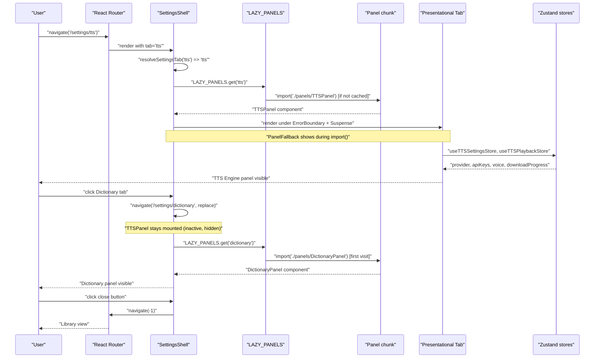
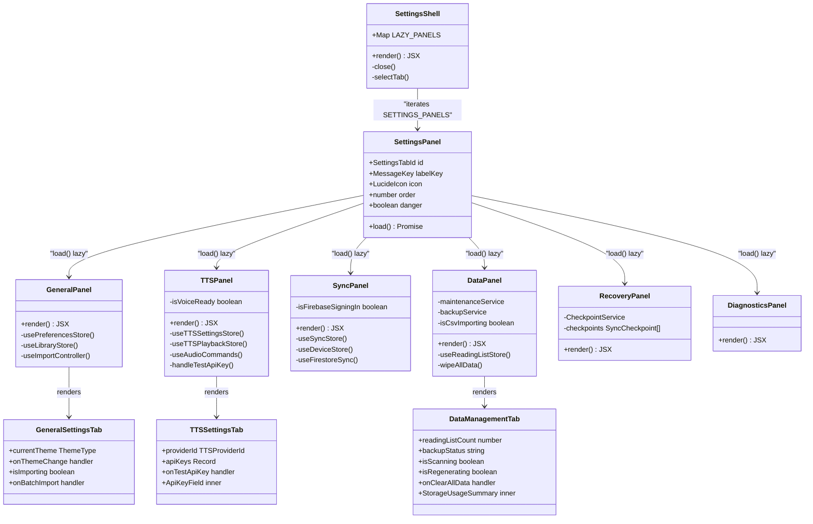

# Settings Shell & Panels

## Why a Settings Shell Exists

Before Phase 8, Versicle's settings lived inside a single 738-line `GlobalSettingsDialog.tsx` that accumulated every setting handler the app had ever needed: backup flows, CSV import logic, API key probes, checkpoint management, Firebase sign-in, DB repair — all wired together through dozens of props passed down into nine conditional rendering branches. It was a classic god component.

Three concrete problems drove the replacement:

1. **Always mounted, always subscribed.** The dialog subscribed to ten or more Zustand stores even while closed. Every store write triggered re-render evaluation in the dialog, which then decided it had nothing to show. At scale this is gratuitous compute.

2. **Not deep-linkable.** Settings could not be linked to directly. You could not share `/settings/diagnostics` with someone reporting a TTS bug, or open the Recovery tab programmatically from an error banner. Settings were UI state, not route state.

3. **Inaccessible tab navigation.** The "sidebar" was nine `<button>` elements rendered as a vertical list. They styled like tabs but carried no `role="tablist"` or `role="tab"` semantics. Screen readers could not identify the structure; keyboard navigation worked by accident. This was accessibility item 7 in the Phase 8 gap analysis.

Phase 8 §B dissolved the god file and replaced it with a registry-driven shell under `/settings/:tab`. The shell is under 155 lines. Each panel is self-contained. The tab list is a real Radix `Tabs` component with `orientation="vertical"`.

## Where the Code Lives

| Purpose | Path |
|---|---|
| Shell component | [src/app/settings/SettingsShell.tsx](../../src/app/settings/SettingsShell.tsx) |
| Panel registry | [src/app/settings/registry.ts](../../src/app/settings/registry.ts) |
| Panel modules | [src/app/settings/panels/](../../src/app/settings/panels/) |
| Presentational tab components | [src/components/settings/](../../src/components/settings/) |
| Shell test suite | [src/app/settings/SettingsShell.test.tsx](../../src/app/settings/SettingsShell.test.tsx) |
| Route wiring | [src/app/routes.tsx](../../src/app/routes.tsx) |

## Architecture Overview

The settings system has three layers:



**Registry layer** (`registry.ts`): A declarative array of `SettingsPanel` descriptors. Each descriptor carries a route id, an i18n label key, a Lucide icon, a `load()` factory for `React.lazy`, an ordering integer, and an optional `danger` flag. The registry owns the complete list of tabs; nothing else does.

**Shell layer** (`SettingsShell.tsx`): Reads `SETTINGS_PANELS`, converts each to a `React.lazy` component at module scope (once, not per render), renders Radix `Tabs` with the real tablist semantics, and wraps each panel in an `ErrorBoundary` + `Suspense`. It is route-aware through `useParams` and `useNavigate`.

**Panel layer** (`panels/*.tsx`): Self-contained wiring components. They import Zustand stores, compose async handlers, and pass everything down to a pure presentational tab component in `src/components/settings/`. The presentational components have no store access — they are fully prop-driven.

This split (wiring container + presentational leaf) is the [DiagnosticsTab model](#the-diagnosticstab-exception) described in the Phase 8 design doc. `DiagnosticsTab` was already self-contained before Phase 8 shipped, so its panel is one line:

```typescript
// src/app/settings/panels/DiagnosticsPanel.tsx
export default DiagnosticsTab;
```

All other panels follow the container/presentational pattern.

## The Panel Registry

[src/app/settings/registry.ts](../../src/app/settings/registry.ts) defines the `SettingsPanel` interface and the `SETTINGS_PANELS` array:

```typescript
export interface SettingsPanel {
  id: SettingsTabId;
  labelKey: MessageKey;
  icon: LucideIcon;
  load: () => Promise<{ default: ComponentType }>;
  order: number;
  danger?: boolean;
}
```

Each field serves a specific purpose:

| Field | Purpose |
|---|---|
| `id` | Route parameter value (`/settings/:tab`) and Radix Tabs `value`. Must be URL-safe, lowercase, hyphenated. |
| `labelKey` | Typed i18n key from `src/kernel/locale/messages.ts`. The shell resolves it through `formatMessage(labelKey)` — adding a locale touches the catalog, not this registry. |
| `icon` | Lucide icon for possible future use; currently not rendered in the sidebar (sidebar shows text labels only). |
| `load` | Factory returning `Promise<{ default: ComponentType }>`, the shape `React.lazy` expects. Points at the panel module under `./panels/`. |
| `order` | Sidebar position. The array is rendered in declaration order, which matches ascending `order` values. The test suite asserts this invariant. |
| `danger` | When `true`, the `TabsTrigger` receives destructive color styling. Currently only the `data` panel sets this. |

The nine registered panels, in sidebar order:

| id | order | label key | danger | icon |
|---|---|---|---|---|
| `general` | 10 | `settings.tab.general` | — | `Settings` |
| `tts` | 20 | `settings.tab.tts` | — | `Volume2` |
| `genai` | 30 | `settings.tab.genai` | — | `Sparkles` |
| `sync` | 40 | `settings.tab.sync` | — | `Cloud` |
| `devices` | 50 | `settings.tab.devices` | — | `Smartphone` |
| `dictionary` | 60 | `settings.tab.dictionary` | — | `BookOpen` |
| `recovery` | 70 | `settings.tab.recovery` | — | `LifeBuoy` |
| `diagnostics` | 80 | `settings.tab.diagnostics` | — | `Activity` |
| `data` | 90 | `settings.tab.data` | `true` | `Database` |

The test `'declares nine ordered panels with unique route ids'` pins this count. Any attempt to add a panel without adding a registry row will break the test before the panel appears in the shell.

### Tab Resolution

The exported `resolveSettingsTab` function handles unknown and missing route parameters gracefully:

```typescript
const PANEL_IDS = new Set<string>(SETTINGS_PANELS.map((p) => p.id));
const DEFAULT_SETTINGS_TAB: SettingsTabId = 'general';

export function resolveSettingsTab(param: string | undefined): SettingsTabId {
  return param && PANEL_IDS.has(param) ? (param as SettingsTabId) : DEFAULT_SETTINGS_TAB;
}
```

Cold-loading `/settings/bogus` renders the General panel. Cold-loading `/settings` (no tab segment) also renders General. The test `'resolves route params (unknown → general)'` pins this behavior.

## SettingsShell Component

[src/app/settings/SettingsShell.tsx](../../src/app/settings/SettingsShell.tsx)

The shell is 155 lines and handles five concerns:

### 1. Lazy Panel Map

```typescript
const LAZY_PANELS = new Map(
  SETTINGS_PANELS.map((panel) => [panel.id, React.lazy(panel.load)] as const),
);
```

This runs once at module scope, not per render. Every panel gets exactly one `React.lazy` wrapper. Subsequent renders of `SettingsShell` never recreate `React.lazy` components, which would unmount and remount the panel, losing its local state.

### 2. Close Semantics

```typescript
const close = useCallback(() => {
  const historyIdx = (window.history.state as { idx?: number } | null)?.idx ?? 0;
  if (historyIdx > 0) {
    navigate(-1);
  } else {
    navigate('/', { replace: true });
  }
}, [navigate]);
```

The close button inspects `window.history.state.idx` — the React Router v6 internal history index. If the user navigated to settings from within the app (index > 0), pressing close pops the history entry, which returns them to wherever they were (library, reader, notes). If they cold-loaded onto `/settings/diagnostics` directly (index is 0), there is no previous page to pop to; the fallback navigates to `/` with `replace: true` so the browser back button does not return to settings.

### 3. Tab Switching as Replace Navigation

```typescript
const selectTab = useCallback(
  (value: string) => {
    navigate(`/settings/${value as SettingsTabId}`, { replace: true });
  },
  [navigate],
);
```

Tab hops use `replace` rather than `push`. The intent: within a settings session, the user should need only ONE back gesture to close the dialog, not N gestures for the N panels they visited. The session is treated as a single history entry. The test `'tab activation navigates to /settings/<id> as a replace'` verifies this by confirming that after visiting Dictionary from Diagnostics, a single `router.navigate(-1)` lands at `/`.

### 4. Radix Tabs with Real Accessibility Semantics

```tsx
<Tabs
  value={activeTab}
  onValueChange={selectTab}
  orientation="vertical"
  className="flex flex-col sm:flex-row w-full h-full min-h-0"
>
  <TabsList
    aria-label="Settings sections"
    className="..."
  >
    {SETTINGS_PANELS.map(({ id, labelKey, danger }) => (
      <TabsTrigger
        key={id}
        value={id}
        data-testid={`settings-tab-${id}`}
        className={cn('...', danger && 'text-destructive ...')}
      >
        {formatMessage(labelKey)}
      </TabsTrigger>
    ))}
  </TabsList>
  ...
</Tabs>
```

Radix `Tabs` with `orientation="vertical"` renders a `role="tablist"` with `aria-orientation="vertical"`. Each trigger is `role="tab"` with `aria-selected` managed by Radix. The test asserts `tablist` with `aria-label="Settings sections"` and `aria-orientation="vertical"`, and that all nine `role="tab"` elements are present.

The `data-testid="settings-tab-{id}"` attributes give E2E tests stable selectors that survive text label changes.

### 5. Per-Panel ErrorBoundary + Suspense + Inactive-Panel Hiding

```tsx
{SETTINGS_PANELS.map(({ id }) => {
  const LazyPanel = LAZY_PANELS.get(id)!;
  return (
    <TabsContent
      key={id}
      value={id}
      className="... data-[state=inactive]:hidden"
    >
      <ErrorBoundary>
        <Suspense fallback={<PanelFallback />}>
          <LazyPanel />
        </Suspense>
      </ErrorBoundary>
    </TabsContent>
  );
})}
```

`TabsContent` for inactive panels renders in the DOM (Radix default) but is hidden with `data-[state=inactive]:hidden`. This means Radix does not unmount panels when switching tabs — local panel state is preserved across tab hops within a session. The lazy `import()` for a panel fires only on the first activation, after which the chunk is cached.

Each panel gets its own `ErrorBoundary`. A crash in the Data panel does not take down General or TTS.

The `PanelFallback` spinner renders with `role="status"` and an `aria-label`:

```tsx
function PanelFallback() {
  return (
    <div className="flex items-center justify-center py-12" role="status" aria-label="Loading settings panel">
      <Loader2 className="h-8 w-8 animate-spin text-primary" aria-hidden="true" />
    </div>
  );
}
```

## Routing

The settings overlay is a child route under the root layout in [src/app/routes.tsx](../../src/app/routes.tsx):

```typescript
{
  path: "settings/:tab?",
  element: (
    <ErrorBoundary>
      <LibraryView />
      <Suspense fallback={null}>
        <SettingsShellLazy />
      </Suspense>
    </ErrorBoundary>
  ),
},
```

The key architectural choice: the `/settings/:tab?` route renders **both** `LibraryView` and `SettingsShellLazy` as siblings. The library is the background behind the modal overlay. This achieves two goals simultaneously:

- A cold deep-link to `/settings/diagnostics` shows the full Diagnostics panel immediately, with the library visible in the background underneath the modal.
- The route's `Suspense fallback={null}` means if the shell chunk has not loaded yet, the library is still visible — no blank screen.

`SettingsShellLazy` is itself lazily loaded at the route level:

```typescript
const SettingsShellLazy = lazy(() =>
  import('./settings/SettingsShell').then((m) => ({ default: m.SettingsShell })),
);
```

The shell chunk (which imports the registry but not any panel code) loads on first visit to any `/settings/*` URL. Individual panel chunks load on first activation of that specific panel.

## Settings Navigation State Diagram



**Invariant**: Regardless of how many tabs the user visits in a session, one back gesture (browser back, hardware back, or close button) returns to the previous non-settings route. Tab hops use `replace` navigation so they do not accumulate history entries.

## Lazy Panel Load Sequence



## Back-Button Safety

The settings overlay does not register a `useNavigationGuard` handler. The Phase 8 design made a deliberate choice: closing the settings dialog is pure history navigation. The `BackNavigationManager` (which runs the priority-ordered guard stack for overlays) does not need a settings-specific entry because there is nothing to intercept — the browser or hardware back button pops the `/settings/*` route entry naturally, which closes the `Modal`.

Panels that open their own inner overlays *do* register guards. The `DataPanel` opens a `ReadingListDialog` and registers a guard to close that inner dialog before the settings overlay closes:

```typescript
// src/app/settings/panels/DataPanel.tsx
useNavigationGuard(() => {
  setIsReadingListOpen(false);
}, BackButtonPriority.OVERLAY, isReadingListOpen);
```

The `OVERLAY` priority is higher than the implicit close-settings action (which is just history pop), so hardware back closes the reading list first, then a second back closes settings. This is the composable back-navigation design documented in [State management](13-state-management-crdt.md).

## Panel Reference

### General Panel

**Wiring**: [src/app/settings/panels/GeneralPanel.tsx](../../src/app/settings/panels/GeneralPanel.tsx)  
**Presentational**: [src/components/settings/GeneralSettingsTab.tsx](../../src/components/settings/GeneralSettingsTab.tsx)

Connects three concerns:

**Theme selection** — reads `currentTheme` and `setTheme` from `usePreferencesStore`. The presentational component renders a `ThemeSelector` supporting `'light' | 'dark' | 'sepia'`.

**Batch import** — reads `isImporting` from `useLibraryStore` and obtains `importFiles` from `useImportController`. Two file inputs are exposed: ZIP archives and folder selection (using the non-standard `webkitdirectory` attribute). On import, the panel calls `importFiles(Array.from(files))` and then `navigate('/')` to close settings — so the library's import progress UI is visible while the import runs.

**Credits** — The general tab includes a static Credits & Licenses section listing CC-CEDICT, Piper WASM, OpenCC (opencc-js), and epub.js with their respective licenses.

```tsx
const GeneralPanel: React.FC = () => {
  const navigate = useNavigate();
  const isImporting = useLibraryStore((state) => state.isImporting);
  const { importFiles } = useImportController();
  const { currentTheme, setTheme } = usePreferencesStore(
    useShallow((state) => ({ currentTheme: state.currentTheme, setTheme: state.setTheme })),
  );

  return (
    <GeneralSettingsTab
      currentTheme={currentTheme}
      onThemeChange={setTheme}
      isImporting={isImporting}
      onBatchImport={(files) => {
        void importFiles(Array.from(files));
        navigate('/');
      }}
    />
  );
};
```

### TTS Engine Panel

**Wiring**: [src/app/settings/panels/TTSPanel.tsx](../../src/app/settings/panels/TTSPanel.tsx)  
**Presentational**: [src/components/settings/TTSSettingsTab.tsx](../../src/components/settings/TTSSettingsTab.tsx)

The most complex wiring panel, bridging two stores and the audio command facade.

**Settings store** (`useTTSSettingsStore`): `profiles`, `providerId`, `apiKeys`, `backgroundAudioMode`, `whiteNoiseVolume`, and their setters. The `useShallow` selector prevents re-renders when unrelated settings change.

**Playback store** (`useTTSPlaybackStore`): `voice`, `voices`, `downloadProgress`, `downloadStatus`, `isDownloading`. These are ephemeral runtime values (what the TTS worker currently has loaded) separated from persisted settings in the Phase 5b store split.

**Audio commands** (`useAudioCommands`): `downloadVoice`, `deleteVoice`, `checkVoiceDownloaded`. These cross the Comlink bridge to the TTS worker.

**API key test flow**: The panel's `handleTestApiKey` function builds a throwaway provider instance using the `resolveDescriptor` registry, calls `probe.init()` and `probe.getVoices()` to validate the key, and shows a toast with the result — without touching or rebuilding the active provider. This is the Phase 5a "buffered API key edits" design: keystrokes only update local draft state; the provider is rebuilt only on blur or explicit Test action.

```typescript
const handleTestApiKey = async (provider: TTSApiKeyProviderId, key: string) => {
  const descriptor = resolveDescriptor(provider);
  const probe = descriptor.build({ apiKey: key, language: activeLanguage || 'en' });
  try {
    await probe.init();
    const probeVoices = await probe.getVoices();
    // ... show success toast with voice count
  } catch (e) {
    // ... show error toast
  } finally {
    probe.dispose();
  }
};
```

**Piper voice readiness**: An `ignoreFlag` pattern ensures the async `checkVoiceDownloaded` call does not update state after the panel unmounts:

```typescript
useEffect(() => {
  let ignore = false;
  if (providerId === 'piper' && voice) {
    checkVoiceDownloaded(voice.id).then(isReady => {
      if (!ignore) setIsVoiceReady(isReady);
    });
  } else {
    setIsVoiceReady(false);
  }
  return () => { ignore = true; };
}, [providerId, voice, checkVoiceDownloaded, isDownloading]);
```

The test `'TTSPanel: checkVoiceDownloaded resolving after unmount does not throw'` pins this: a pending probe that resolves after unmount must not throw a React state-update warning.

**Presentational sub-components in TTSSettingsTab**:

`ApiKeyField` is an inner component implementing buffered editing for API key inputs — keystrokes go to local `draft` state, the key is committed via `onCommit` only on blur or when the "Test Key" button is clicked:

```typescript
const ApiKeyField: React.FC<{ option; value; onCommit; onTest }> = ({ option, value, onCommit, onTest }) => {
  const [draft, setDraft] = useState(value);
  const commit = () => {
    if (draft !== value) onCommit(option.id, draft);
  };
  // ... renders PasswordInput + "Test Key" button
};
```

Provider choices are rendered from `selectableProviders()` (the Phase 5a provider descriptor registry) — the TTS settings panel adds no hardcoded provider list.

Voice download controls (the `downloadableVoices` capability) show a `Progress` bar during download, and a delete confirmation `Dialog` before removing cached voice data.

### Generative AI Panel

**Wiring**: [src/app/settings/panels/GenAIPanel.tsx](../../src/app/settings/panels/GenAIPanel.tsx)  
**Presentational**: [src/components/settings/GenAISettingsTab.tsx](../../src/components/settings/GenAISettingsTab.tsx)

Connects `useGenAIStore` for all configuration. Handler concerns:

**Content analysis cache clear**: Calls `contentAnalysisRepository.clearAll()` after a confirmation dialog. Uses `useConfirm` — not `window.confirm` (the native-dialog ban landed in Phase 8).

**Log download**: Formats `GenAILog[]` records to a timestamped plain-text file and exports via `exportFile`. Each log entry is formatted as `[ISO timestamp] TYPE (method) \n {JSON payload}`.

**Live quota meters**: The panel composes `useQuotaMeters` ([src/app/settings/panels/useQuotaMeters.ts](../../src/app/settings/panels/useQuotaMeters.ts)) and passes the result down as the `meters` prop. The hook polls the store-injected `getQuotaSnapshot` (a live mirror of `governor.snapshot()` installed by `wireGoogle`) on a 1-second interval — the same poll pattern `DiagnosticsTab` uses for `exportDiagnostics`. The project-wide "today's spend" figure is this device's background RPD plus the cross-device sibling sum from `sumActiveDeviceSpend` (the reconciler excludes this device, so there is no double-count). Every number it renders is derived from the snapshot; nothing is fabricated. The hook is co-located with the panel (not inlined) so the panel module's only export stays the component, keeping fast-refresh clean in the error-level `app/settings/` directory.

The presentational component exposes: enable/disable toggle, Gemini API key, model selection (Gemini Flash-Lite Latest, 2.5 Flash-Lite, 2.0 Flash, 1.5 Flash, 1.5 Pro), free-tier model rotation toggle (randomly alternates between flash models to spread quota usage), content type detection with skip-type checkboxes, table teleprompter toggle, debug mode toggle, a scrollable debug log viewer with max-log control and download/clear buttons, plus the Quota & Usage and Semantic Search sections described below.

**Quota & Usage section**: This block is the settings face of the cross-provider Quota Governor (kernel subsystem [src/kernel/quota/](../../src/kernel/quota/) — `QuotaGovernor` + the midnight-Pacific `ptDay` helper + an `index` barrel). The governor tracks requests-per-minute, tokens-per-minute, and requests-per-day per lane (foreground / background), recorded at *admission* inside `NetworkGateway.egress` so throttling cannot be bypassed; a pre-network refusal surfaces as the typed `NetRateLimitedError` (`AppError` code `NET_RATE_LIMITED`, in `src/types/errors.ts`). Its consumers are `GeminiClient`, the cloud TTS providers, and the new embedding client; model rotation stays inside `GeminiClient`. The plain-data quota fields persist through the `useGenAIStore` allowlist; the live snapshot is an in-memory read-back and is never persisted (a function does not serialize).

The controls, all rendered only while AI features are enabled:

| Control | Store field | Notes |
|---|---|---|
| Pause All AI Requests | `pauseAllGenAI` | A switch. "Stops every outgoing AI request before it leaves this device." Default off. |
| Requests / min, Tokens / min, Requests / day | `quotaLimits.{rpm,tpm,rpd}` | Editable per-lane limits, read *fresh* by the governor on every acquire (defaults `{ rpm: 100, tpm: 30000, rpd: 1000 }`). |
| Background Throttle (%) | `bgThrottlePercent` | "Share of the budget background work may use before it yields to foreground." Default 50. |
| Foreground RPD Headroom | `fgRpdHeadroom` | "Daily requests reserved for interactive use." Default 0. |

Below the inputs, a **Live Usage** block renders one `UsageBar` per metered figure — foreground RPM/TPM/RPD and background RPM/TPM — each a `role="progressbar"` carrying `aria-valuenow/min/max` (jsx-a11y clean) with a `used / limit` label. A separate "Today's spend (this project, all devices)" row (`data-testid="genai-project-rpd"`) shows the reconciled project-wide RPD against the daily limit, because the free-tier quota is per-Google-Cloud-*project* and is reconciled across the synced device mesh via an additive `embedSpend` field on the `DeviceInfo` record (no CRDT format change). Three time-to-exhaustion hints ("RPM/TPM/RPD exhausts: ~N min") are computed from the window fill rate, rendered as a dash when a lane is idle.

**Semantic Search section**: Two default-OFF opt-ins gate the embeddings and shared-cache features. Both are switches with long disclosure copy:

| Opt-in | Store field | Disclosure substance |
|---|---|---|
| Pre-embed my library for semantic search | `preEmbedLibrary` | When ON, the *full text* of loaded-but-unread books is sent to Google during idle time to build search embeddings, and *search query terms* leave the device whenever a semantic search runs. The copy explicitly contrasts this with the narrower per-book TTS consent (short excerpts only). |
| Share AI caches across my devices | `shareAiCaches` | When ON, the *whole-book embeddings* a device builds (~251 KB per book, far heavier than normal annotation/progress sync) upload to the user's *own* cloud so their other devices hydrate them without re-spending Gemini quota. The copy stresses nothing is shared with anyone else — the cache lands only in the user's own Firebase project, content-addressed by book and embedding stamp. |

`preEmbedLibrary` is the library-wide background-grant consent wired into the AI consent resolver ([src/app/google/aiConsent.ts](../../src/app/google/aiConsent.ts)): a background, bookId-carrying egress is granted when this opt-in is ON, checked *before* the per-book default-deny so an un-prompted unread book can be backfilled (it never widens a foreground grant). `shareAiCaches` is the consent predicate shared by *both* the cache read path (`ArtifactConsult`, which probes/hydrates a peer's blob before the quota gate) and the upload path (the `ArtifactPublisher` boot task) — one predicate, so reusing another device's embeddings and uploading your own are governed identically.

> **Caveat (CI-pending).** The "Share AI caches" cloud round-trips — the Firestore + Storage `head`/`put`/`get`/`delete`/`sweep` paths behind this opt-in — are currently MockBackend-verified and code-complete but **not yet proven end-to-end against real Firebase** (the emulator and security-rules suites auto-skip without local emulators). The toggle and its disclosure copy are shipped; the cloud transport behind it is the deferred-to-CI surface. Cross-*user* cache sharing and TTS-audio cache sharing are explicitly out of scope.

### Sync & Cloud Panel

**Wiring**: [src/app/settings/panels/SyncPanel.tsx](../../src/app/settings/panels/SyncPanel.tsx)  
**Presentational**: [src/components/settings/SyncSettingsTab.tsx](../../src/components/settings/SyncSettingsTab.tsx)

This is the most UI-dense presentational component, managing two distinct integration surfaces.

**Firebase / App Sync subsection** — Three UI states based on `isFirebaseAvailable` and `firebaseAuthStatus`:

1. *Unconfigured*: Paste-box that parses a Firebase config object (supports both `{key: "value"}` and `key: "value"` syntaxes via regex extraction), plus individual field inputs for API key and project ID.
2. *Configured, not signed in*: "Sign in with Google" button.
3. *Signed in*: Connected status with email, sign-out button, and workspace management.

**Workspace management** (visible when signed in): Lists existing workspaces from `getSyncOrchestratorAsync().listWorkspaces()`. The active workspace shows a "● Active" indicator. Workspaces with `schemaVersion > CURRENT_SCHEMA_VERSION` show "Update App to Connect" (read-only until the app upgrades). A halt-warning banner appears when signed in but no workspace is selected (`activeWorkspaceId === null`). Actions: switch, delete (with confirmation), create new. A maintenance button purges deleted workspace residuals left by older app versions (P4-6 fix).

**Device identity subsection** — Local state tracks the draft device name; Save/Cancel buttons appear only when the name has changed. If `renameDevice` is called for a device ID that is not yet in the device mesh, the panel self-heals by calling `registerCurrentDevice` with the current theme/font size/TTS profile as the initial device profile.

**Google Drive subsection** — Connect/disconnect buttons that call `getGoogleAuthClient().connect/disconnect('drive')`. When connected, a Drive folder picker modal (`DriveFolderPicker`) links a library folder, and a Scan button calls `getDriveLibrarySync().checkForNewFiles({ interactive: true })`. Google client ID and iOS client ID inputs are shown only when Drive is not connected, supporting custom deployment overrides.

**Config clear**: Uses `useConfirm` with the `danger: true` flag to wipe all Firebase config fields and disable sync.

### Devices Panel

**Wiring**: [src/app/settings/panels/DevicesPanel.tsx](../../src/app/settings/panels/DevicesPanel.tsx)

Minimal panel — a thin adapter wrapping the `DeviceManager` component:

```typescript
const DevicesPanel: React.FC = () => (
  <div className="space-y-6">
    <DeviceManager />
  </div>
);
```

`DeviceManager` owns its own store subscriptions and device mesh display logic. The panel does not duplicate that wiring.

### Dictionary Panel

**Wiring**: [src/app/settings/panels/DictionaryPanel.tsx](../../src/app/settings/panels/DictionaryPanel.tsx)

Renders two sub-components directly (no separate presentational tab component):

- `LexiconManager` (triggered via a "Manage Rules" button that opens it as a dialog) — manages global and per-book pronunciation rules.
- `TTSAbbreviationSettings` — inline component for defining abbreviations that should not break sentences (e.g., "Mr.", "Dr.") and enabling built-in lexicon packs.

The panel owns one piece of local state: `isLexiconOpen` boolean that controls the `LexiconManager` dialog.

### Recovery Panel

**Wiring**: [src/app/settings/panels/RecoveryPanel.tsx](../../src/app/settings/panels/RecoveryPanel.tsx)  
**Presentational**: [src/components/settings/RecoverySettingsTab.tsx](../../src/components/settings/RecoverySettingsTab.tsx)

The panel mounts with an `ignoreFlag` effect that lists available checkpoints from `CheckpointService.listCheckpoints()`:

```typescript
useEffect(() => {
  let ignore = false;
  CheckpointService.listCheckpoints().then(list => {
    if (!ignore) setCheckpoints(list);
  });
  return () => { ignore = true; };
}, []);
```

The ignore flag is identical in structure to the TTS panel's voice-readiness probe. Both were regression-tested after a predictability bug where async work completed after unmount threw state-update warnings. The test `'RecoveryPanel: listCheckpoints resolving after unmount does not throw'` pins this for the recovery panel.

**Creating a snapshot**: `handleCreateCheckpoint` calls `CheckpointService.createCheckpoint('manual')`, then refreshes the list. Shows a success toast on completion.

**Presentational component behaviors**:

*Checkpoint list view* — Each `SyncCheckpoint` entry shows a formatted timestamp (via `formatDateTime`), a trigger badge (`capitalize` CSS applied to the `trigger` string), and a size in KB. The "Inspect" button opens the diff view.

*Checkpoint diff view* (`CheckpointDiffView`) — When a checkpoint is selected for inspection, `CheckpointInspector.diffCheckpoint(checkpoint.blob)` computes a diff of each store's data against the current state. The result is a `Record<string, DiffResult>` where each `DiffResult` has `added`, `removed`, and `modified` maps. The UI renders this as an accordion of per-store sections with color-coded +/- counts and expandable detail panels. A "View detailed diff" button opens a `JsonDiffViewer` modal for deep inspection of individual modified fields. Before confirming restore, a "Backup Current State" button is offered. Restore calls `CheckpointService.restoreCheckpoint(id, { pauseSync: stopSyncConnections })` — the `pauseSync` inversion severs live cloud sync before the wipe to avoid race conditions.

*Advanced recovery* — A separate "Open Data Recovery Tool" button opens `DataRecoveryView` in a large modal, providing direct access to raw IndexedDB contents for cases where the Yjs CRDT state is unrecoverable.

### Diagnostics Panel

**Wiring**: [src/app/settings/panels/DiagnosticsPanel.tsx](../../src/app/settings/panels/DiagnosticsPanel.tsx)  
**Presentational**: [src/components/settings/DiagnosticsTab.tsx](../../src/components/settings/DiagnosticsTab.tsx)

`DiagnosticsPanel` is the only panel with no wiring layer — it re-exports `DiagnosticsTab` directly as the default export. `DiagnosticsTab` was already self-contained before the Phase 8 refactor and was the design model for all other panels.

`DiagnosticsTab` reads TTS engine state through `useAudioCommands()` (the Comlink bridge facade), not by reading the flight recorder singleton directly. The comment in the component explains why:

> The engine runs in the worker, whose flight recorder is a DIFFERENT module instance than the main thread's — reading the local singleton showed an empty buffer.

**On mount**, the component calls `audio.exportDiagnostics()` (which crosses to the worker to read the ring buffer stats) and `audio.listDiagnosticSnapshots()` (reads persisted snapshots from IndexedDB) in parallel.

**Active flight buffer header** shows event count, capacity, and age of the oldest buffered event (from `stats.oldestWall`).

**Snapshot list** renders each `FlightSnapshot` with:
- A trigger badge (ANOMALY in red, MANUAL in blue/primary)
- 8-character truncated ID
- `formatDateTime(snap.createdAt)`
- `formatBytes(snap.sizeBytes)` and event count
- A context preview grid showing bookId, sectionIndex, currentIndex, and status
- Share button (exports JSON) and delete button (individual snapshot)

**Actions**: Capture Snapshot (manual trigger), Refresh (reload from worker), Clear All (with confirmation), per-snapshot Share and Delete.

The `handleShare` action calls `audio.shareDiagnosticSnapshot(id)` which handles the platform-appropriate export (share sheet on mobile via Capacitor, download on web).

### Data Management Panel

**Wiring**: [src/app/settings/panels/DataPanel.tsx](../../src/app/settings/panels/DataPanel.tsx)  
**Presentational**: [src/components/settings/DataManagementTab.tsx](../../src/components/settings/DataManagementTab.tsx)

The Data panel is the `danger: true` entry at the end of the sidebar. It is the most handler-rich panel, concentrated with destructive operations.

**Reading list management**:
- View list: opens `ReadingListDialog` with a back-navigation guard (`BackButtonPriority.OVERLAY`)
- Export CSV: `exportReadingListToCSV(entries)` → `exportFile`
- Import CSV: Reads file via `FileReader`, calls `parseReadingListCSV`, shows an overlay progress UI during import. Upserts each entry into `useReadingListStore`, and also calls `rsStore.updateLocation` with the `percentage` field if present. The import pre-builds a `filename → bookId` map over `useBookStore.getState().books` to avoid O(N×M) lookup complexity.

During CSV import, the panel renders an absolute-positioned overlay (covering the entire settings modal) with spinner and status message. When import is complete, a "Return to Library" button calls `navigate('/')`.

**Backup & Restore**:
- Full ZIP export: `backupService.createFullBackup(progressCallback)` — reports `(percent, msg)` progress to `backupStatus` state.
- Quick JSON export: `backupService.createLightBackup()` — faster, metadata-only.
- Restore: Reads `.zip/.json/.vbackup` file, confirms via `useConfirm`, calls `backupService.restoreBackup(file, progressCallback)`, then `window.location.reload()`.

**Maintenance**:
- Check & Repair DB: `maintenanceService.scanForOrphans()` returns `{ files, locations, tts_prep }` counts. If any orphans are found, shows a confirmation dialog with counts before calling `maintenanceService.pruneOrphans()`.
- Regenerate All Metadata: Confirms first, then calls `maintenanceService.regenerateAllMetadata(progressCallback)` which reports `(current, total, message)` triples. Renders a `Progress` bar during the operation.
- Storage usage: The `StorageUsageSummary` component (inline in the presentational layer) calls `navigator.storage.estimate()` and displays `formatBytes(usage) of formatBytes(quota) (formatPercent(...))`. Renders nothing in environments where `storage.estimate` is unavailable (older WebViews, jsdom).

**Danger Zone**: "Clear All Data" button calls `wipeAllData()` after confirming through `useConfirm`. The test `'calls wipeAllData when the user confirms'` specifically asserts that the implementation goes through `wipeAllData` — not any hand-enumerated IndexedDB clearing — because a previous version of this handler had silently left the entire `versicle-yjs` database behind. This regression test is absorbed from `GlobalSettingsDialog.test.tsx`.

## i18n Integration

All sidebar labels are resolved through the typed message catalog. Registry descriptors carry `labelKey: MessageKey` rather than prose strings. The shell resolves labels at render time:

```tsx
{formatMessage(labelKey)}
```

The nine settings tab keys in `src/kernel/locale/messages.ts`:

```typescript
'settings.tab.general': 'General',
'settings.tab.tts': 'TTS Engine',
'settings.tab.genai': 'Generative AI',
'settings.tab.sync': 'Sync & Cloud',
'settings.tab.devices': 'Devices',
'settings.tab.dictionary': 'Dictionary',
'settings.tab.recovery': 'Recovery',
'settings.tab.diagnostics': 'Diagnostics',
'settings.tab.data': 'Data Management',
```

Adding a locale means adding a parallel record in the catalog — the registry and the shell are untouched. See [App shell and routing](42-app-shell-and-routing.md) for the full i18n architecture.

## Panel Class Diagram



## Adding a New Settings Panel

The registry pattern means extending settings is mechanical:

1. **Add the panel module** under `src/app/settings/panels/NewFeaturePanel.tsx`. The module must have a default export of a React component. Wiring should follow the container/presentational pattern: subscribe to stores here, pass props to a presentational component in `src/components/settings/`.

2. **Add a registry entry** in [src/app/settings/registry.ts](../../src/app/settings/registry.ts):

```typescript
{
  id: 'newfeature',            // becomes /settings/newfeature
  labelKey: 'settings.tab.newfeature',   // must exist in messages.ts
  icon: SomeLucideIcon,
  load: () => import('./panels/NewFeaturePanel'),
  order: 85,                   // between diagnostics (80) and data (90)
},
```

3. **Add the message key** to `src/kernel/locale/messages.ts`:

```typescript
'settings.tab.newfeature': 'New Feature',
```

4. **Update `SettingsTabId`** in the registry:

```typescript
export type SettingsTabId =
  | 'general' | 'tts' | 'genai' | 'sync' | 'devices'
  | 'dictionary' | 'recovery' | 'diagnostics' | 'data'
  | 'newfeature';  // add here
```

5. **Update the test assertion** in `SettingsShell.test.tsx`:

```typescript
expect(SETTINGS_PANELS).toHaveLength(10);  // was 9
```

No changes are needed to `SettingsShell.tsx` itself. The shell renders all `SETTINGS_PANELS` entries.

## Test Coverage

The `SettingsShell.test.tsx` suite covers:

| Test group | What it pins |
|---|---|
| `settings registry` | Nine panels with unique IDs, ascending order, and `resolveSettingsTab` fallback |
| `SettingsShell` | Deep-link tab selection, replace-navigation semantics, unknown-tab fallback to General, close button behavior |
| `TTSPanel` | Piper voice readiness UI, download progress display, download trigger |
| `regression: settings panels are unmount-safe` | `checkVoiceDownloaded` and `listCheckpoints` resolving after unmount do not throw |
| `regression: wipe-all-data` | Clear All Data calls `wipeAllData()` (not hand-enumerated store clearing), confirmation required |

The unmount-safety and wipe-all-data tests are absorbed from the deleted `GlobalSettingsDialog.predictability.test.tsx` and `GlobalSettingsDialog.test.tsx` respectively. They are pinned here because those behaviors are easy to regress and caused real bugs.

See also [Testing strategy](63-testing-strategy.md) for the absorption ledger pattern and the rule that each regression test lives in the file closest to its subject.

## Edge Cases and Failure Modes

**Panel chunk load failure**: If `import('./panels/SyncPanel')` fails (network error, bad deploy), the `ErrorBoundary` wrapping that `TabsContent` catches the error and renders its fallback UI. Other panels are unaffected; the shell remains navigable. The user can switch to a working panel.

**Unknown route parameter**: `resolveSettingsTab('not-a-tab')` returns `'general'`. The URL stays as typed (`/settings/not-a-tab`) — the shell does not redirect; it just activates the General tab. This is intentional: a redirect would cause a history entry replacement that could interfere with in-app navigation history.

**Cold load with no history**: `window.history.state?.idx ?? 0` being `0` means the close button calls `navigate('/', { replace: true })`. The library renders without creating a dead back-navigation entry pointing to settings.

**ReadingListDialog and hardware back**: The `DataPanel` registers a `useNavigationGuard` at `BackButtonPriority.OVERLAY` when `isReadingListOpen` is true. The `BackNavigationManager` runs the highest-priority handler first, so hardware back closes the reading list before the settings modal sees it.

**Sync panel self-healing device registration**: If `renameDevice` is called and the current device ID is not in `useDeviceStore.devices`, the panel detects this and calls `registerCurrentDevice` with a freshly assembled profile (current theme, font size, and active TTS voice). This handles the edge case where a device was never properly registered to the mesh (e.g., it was set up before the device mesh feature existed).

**Piper voice readiness and panel unmount**: The `isVoiceReady` effect runs whenever `providerId`, `voice`, or `isDownloading` changes. The `ignore` flag prevents the async `checkVoiceDownloaded` call from setting state after the panel unmounts — a particularly common race because the panel may be hidden (tab switch) while a download completes.

## Relationship to Other Systems

- **[State management](13-state-management-crdt.md)**: Each panel reads from specific Zustand stores. `useShallow` is used in TTSPanel and SyncPanel to prevent unnecessary re-renders from unrelated store changes.
- **[TTS providers](33-tts-providers-and-platform.md)**: TTSPanel and TTSSettingsTab render the provider selector from `selectableProviders()` — the registry from Phase 5a. Adding a provider to the registry automatically adds it to the TTS settings UI.
- **[Domain sync](36-domain-sync.md)**: RecoveryPanel calls `CheckpointService` and the presentational component calls `CheckpointInspector.diffCheckpoint` and `stopSyncConnections` (pauses sync before restore).
- **[Error handling](15-error-handling-and-recovery.md)**: DataPanel uses `useConfirm` for all destructive confirmations — consistent with the Phase 8 native-dialog ban (no `window.confirm`).
- **[Observability](74-observability-and-diagnostics.md)**: DiagnosticsTab reads TTS flight recorder data through `useAudioCommands` to avoid the module-instance problem (worker vs. main thread singleton).
- **[Domain: Google](39-domain-google.md)**: The GenAIPanel Quota & Usage section is the settings face of the `src/kernel/quota/` governor enforced inside `NetworkGateway.egress`; the `Pre-embed my library` and `Share AI caches` opt-ins gate the embedding/artifact paths in [Domain: search](38-domain-search.md).
- **[App shell](42-app-shell-and-routing.md)**: The `/settings/:tab?` route in `routes.tsx` renders `LibraryView` as the background with the `SettingsShell` modal on top.
- **[UI design system](40-ui-design-system.md)**: All panels use `Modal`, `Tabs`, `TabsList`, `TabsTrigger`, `TabsContent`, `Button`, `Select`, `Input`, `PasswordInput`, `Switch`, `Checkbox`, `Slider`, `Progress`, and `ScrollArea` from `src/components/ui/`.
