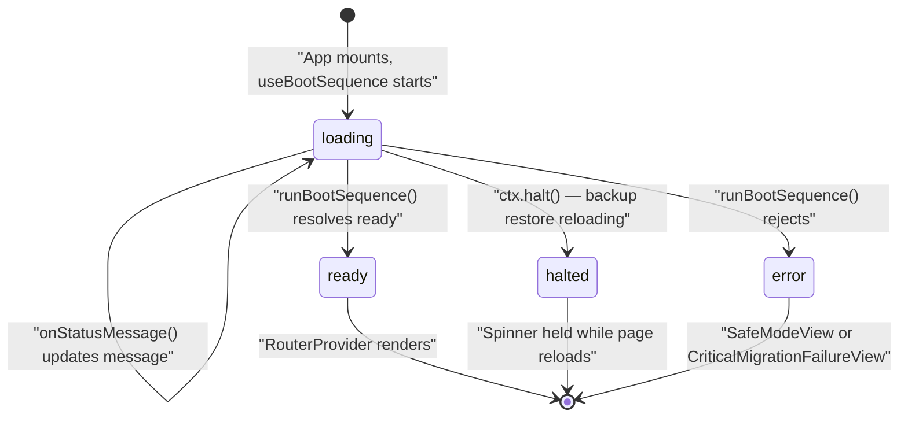
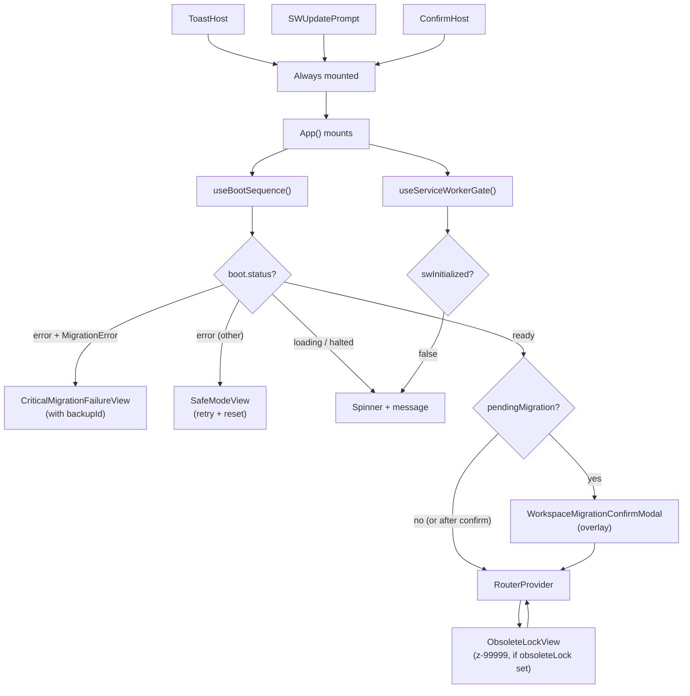
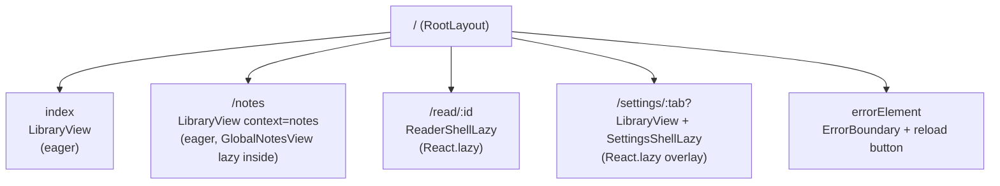
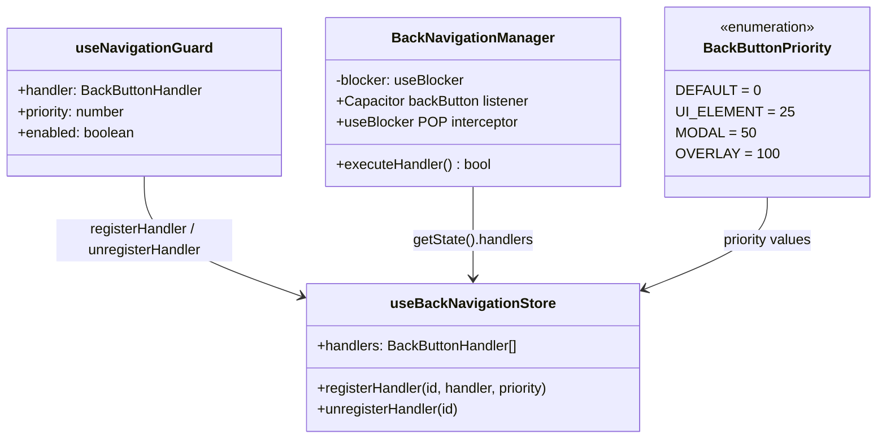
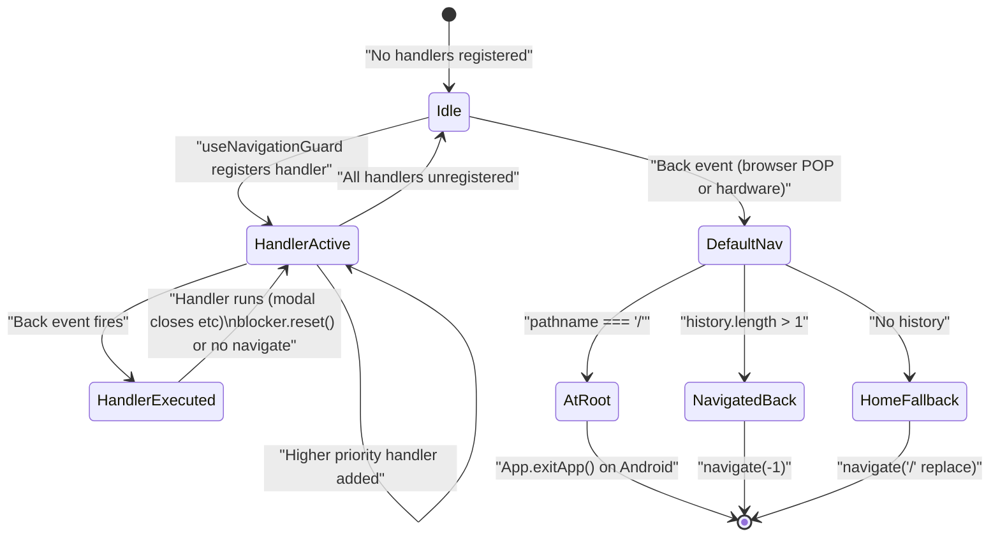
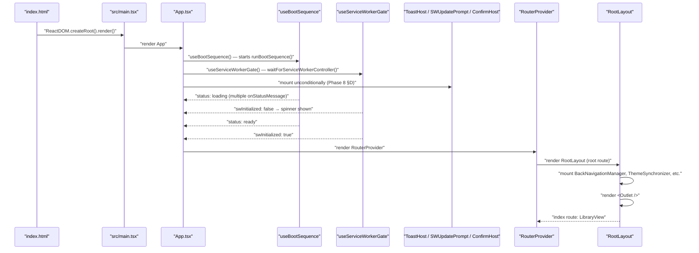

# App Shell & Routing

The app shell is the outermost React layer that sits between the raw HTML entry point and every feature component. It controls what the user sees during boot, after catastrophic failure, and throughout normal navigation. Understanding the shell means understanding two distinct planes: the **gate layer** (everything that renders before a router exists) and the **shell-within-the-router** (the persistent layout that wraps each route's content).

This document covers both planes exhaustively: the design intent behind their separation, the boot-state machine that drives the gate, the route tree itself, the `RootLayout` that composes persistent shell elements, and the back-navigation system that makes browser-back and Android hardware-back behave identically.

---

## Design Intent: Why Two Render Layers?

A naive PWA shells routes first and handles errors inside those routes. Versicle inverts this for a concrete reason: **during boot, the app may need to show a toast, surface a service-worker update prompt, or display a fatal error — all before any route can possibly render**. If `ToastHost`, `SWUpdatePrompt`, and `ConfirmHost` lived inside the router tree, a boot-time error or a blocking SW check would silently drop those notifications.

Phase 8 §D of the overhaul program resolved this by hoisting three "host" components above the router gate in [App.tsx](../../src/App.tsx). From the source file's JSDoc:

> `ToastHost + ConfirmHost mount HERE, above the router gate (Phase 8 §D): a toast fired during boot renders instead of being dropped, and the SafeMode reset path gets the accessible confirm dialog (native confirm/alert are banned at lint ERROR). SWUpdatePrompt mounts beside them (Phase 8 §G) so even a boot-blocked client can accept an update — the recovery channel for a bad deploy.`

The second design motivation is **concern separation by layer**. Boot ordering is entirely owned by the bootstrap sequencer (`src/app/bootstrap.ts`); `App.tsx` does not orchestrate phases — it only observes `useBootSequence()`'s output union and picks the right view. Route definitions are entirely owned by `src/app/routes.tsx`, defined once at module scope so the router object is never recreated. The persistent per-route shell (theme, accessibility, keyboard shortcuts, back-navigation, sync toasts) lives in `RootLayout.tsx`. This gives each concern a single file with a clear seam.

---

## Boot State Machine



[`useBootSequence`](../../src/app/boot/useBootSequence.ts) is the React owner of the boot sequence. It calls `runBootSequence()` once on mount and projects the result into a four-variant discriminated union:

```typescript
export type AppBootState =
  | { status: 'loading'; message: string }
  | { status: 'ready'; pendingMigration: PendingWorkspaceMigration | null }
  | { status: 'halted'; reason: BootHaltReason; message: string }
  | { status: 'error'; error: unknown };
```

A second gate, [`useServiceWorkerGate`](../../src/app/boot/useServiceWorkerGate.ts), runs in parallel. It waits for a SW controller (up to 3 seconds, via `waitForServiceWorkerController`) then sets `swInitialized = true`. It never rejects. If the wait exhausts without a controller (degraded mode), it fires a keyed toast `app.swDegraded` — but only in production builds (the E2E lane blocks SWs by design, and the toast would pollute test output).

[`App.tsx`](../../src/App.tsx) renders the body by checking **both** gates:

```typescript
if (boot.status === 'loading' || boot.status === 'halted' || !swInitialized) {
  const message = boot.status === 'ready' ? 'Starting...' : boot.message;
  return <div ...><Spinner /><p>{message}</p></div>;
}
```

The `halted` state deserves attention: it appears when the migration interceptor calls `ctx.halt()` because a backup-restore reload is already in flight. The spinner stays visible while the page reloads — it is not a displayable "done" state. The `ready` branch's message `'Starting...'` is shown when the boot resolved but the SW gate hasn't yet (a brief window before `swInitialized` flips).

---

## App Shell Render Branch Flowchart



### The Four Error Views

**`SafeModeView`** ([src/components/SafeModeView.tsx](../../src/components/SafeModeView.tsx)) — rendered for any non-migration `boot.error`. Shows the error message and stack, plus two buttons: "Try Again" (calls `window.location.reload()`) and "Reset Database (Data Loss)". The reset path calls `handleReset()` in `App.tsx`, which first calls `confirmDialog()` (the accessible modal confirm — native `confirm()` is banned by lint at ERROR), then `wipeAllData()` on confirmation. `wipeAllData()` stops the sync orchestrator and Yjs persistence, deletes all four IndexedDB databases (`versicle-yjs`, `versicle-yjs-staging`, `EpubLibraryDB`, `versicle-dict`), clears owned localStorage keys, and reloads.

**`CriticalMigrationFailureView`** ([src/components/sync/CriticalMigrationFailureView.tsx](../../src/components/sync/CriticalMigrationFailureView.tsx)) — rendered when `boot.error instanceof MigrationError`. A `MigrationError` carries `checkpointId`, the protected IndexedDB checkpoint taken before the first transform. The view's "Restore Previous Data" button writes `MigrationStateService.setState({ status: 'RESTORING_BACKUP', backupCheckpointId })` and reloads the page, triggering the existing checkpoint-restore flow on next boot.

**`ObsoleteLockView`** ([src/components/ObsoleteLockView.tsx](../../src/components/ObsoleteLockView.tsx)) — a fixed-position, `z-index: 99999` full-screen overlay mounted inside the `ready` branch, rendered only when `useUIStore(state => state.obsoleteLock)` is truthy. This flag is set by the sync middleware when the Yjs schema version from the cloud exceeds `CURRENT_SCHEMA_VERSION`. The lock is non-dismissible; the only action is "Reload After Updating", which calls `window.location.reload()`. No router navigation happens — this overlay sits above the entire router tree.

**`WorkspaceMigrationConfirmModal`** ([src/components/sync/WorkspaceMigrationConfirmModal.tsx](../../src/components/sync/WorkspaceMigrationConfirmModal.tsx)) — a `z-[100]` modal shown when `boot.pendingMigration` is set (the migration interceptor identified a pending workspace switch). The user sees the target workspace ID and chooses "Yes, Finalize" (clears migration state, deletes backup checkpoint, clears the staging database, starts sync) or "Roll Back" (calls `MigrationStateService.setRestoringBackup()` and reloads). On resolve, `App.tsx` calls `window.location.reload()`.

---

## The Gate-Level Host Triplet

Three null-rendering components are mounted **unconditionally** in the outermost `<>` fragment of `App.tsx`, above the boot-state body:

```tsx
return (
  <>
    <ToastHost />
    <SWUpdatePrompt />
    <ConfirmHost />
    {body}
  </>
);
```

### ToastHost

[`ToastHost`](../../src/components/ToastHost.tsx) subscribes to `useToastStore` and renders all current toasts. It splits the toast list into errors vs. others and routes them into two separate `role="alert"` / `role="status"` live regions:

- `role="status" aria-live="polite"` for info and success toasts.
- `role="alert" aria-live="assertive"` for error toasts.

These regions are **always present in the DOM** even when no toasts are active. This is required for screen-reader reliability: live regions created together with their content are unreliable across assistive technologies. The regions are positioned `fixed bottom-20 left-1/2 -translate-x-1/2 z-[100]`.

The store itself (`useToastStore`) deduplicates toasts by message key, so the repeated `SWUpdatePrompt` flip is idempotent. Toasts with `duration: Infinity` persist until explicitly dismissed or until an action is taken.

### SWUpdatePrompt

[`SWUpdatePrompt`](../../src/components/SWUpdatePrompt.tsx) uses `useRegisterSW` from `virtual:pwa-register/react` (the vite-plugin-pwa virtual module). With `registerType: 'prompt'` configured in `vite.config.ts`, a newly installed service worker **waits** instead of calling `skipWaiting()` mid-session. When `needRefresh` becomes true (a new build is sitting in the waiting state), `SWUpdatePrompt` fires a persistent keyed toast `app.updateReady` with action label `common.reload`. Clicking Reload calls `updateServiceWorker(true)`, which posts `SKIP_WAITING` to the waiting worker (handled in `src/sw.ts`) and reloads the page once the new worker takes control.

The critical design point: mounting this **above the router gate** means a client stuck in `SafeModeView` or any boot-error state can still accept a service worker update. This is the recovery channel for a bad deploy (Phase 8 §G calls it "prep risk #1 mitigation").

### ConfirmHost

[`ConfirmHost`](../../src/components/ui/ConfirmDialog.tsx) renders the front of a module-level pending-confirm queue using `useSyncExternalStore`. Non-React code can call `confirmDialog(request)` and get back a `Promise<boolean>`. React components call `useConfirm()` for the hook flavor. Both funnel through the same queue. The host renders the queue head as a `Modal`; settling (confirm or cancel) pops the head and resolves the promise.

The i18n ADR requirement is enforced at the type level: `ConfirmRequest` takes `titleKey: MessageKey`, not prose strings. Every call site passes catalog keys:

```typescript
const confirmed = await confirmDialog({
  titleKey: 'app.resetAll.title',
  bodyKey: 'app.resetAll.body',
  confirmKey: 'app.resetAll.confirm',
  danger: true,
});
```

Native `confirm()` and `alert()` are banned by `eslint` (`no-alert` + `no-restricted-globals` at ERROR). The `ConfirmHost` in `App.tsx` is the only mount point — every call site relies on it being present, including `SafeModeView`.

---

## The Route Tree

[`src/app/routes.tsx`](../../src/app/routes.tsx) exports a single `router` object created at module scope via `createBrowserRouter`. Module-scope creation is intentional: the router is never recreated on re-render, which avoids the subtle React Router behavior where re-creating the router mid-session loses navigation history.



### Route Map Detail

| Path | Element | Loading strategy | Notes |
|------|---------|-----------------|-------|
| `/` (index) | `LibraryView` | Eager — boot surface | The first screen after boot; must be in the entry chunk |
| `/notes` | `LibraryView context="notes"` | Eager shell; `GlobalNotesView` inside is `React.lazy` | Phase 8 §J moved the library/notes switch from a synced CRDT preference to a URL route |
| `/read/:id` | `ReaderShellLazy` | `React.lazy` | Pulls `epubjs` out of the entry chunk; asserted by `scripts/check-worker-chunk.mjs` check 4 |
| `/settings/:tab?` | `LibraryView` + `SettingsShellLazy` | `SettingsShell` is `React.lazy`; panel modules are lazy inside the shell | Overlay over the library; deep-linkable |

Every route child is wrapped in an `ErrorBoundary` component so a crash in one route doesn't propagate upward to `RootLayout`'s own error element. The root's `errorElement` itself is a minimal inline error display with a reload button.

### The Settings Route as Overlay

`/settings/:tab?` renders **two elements simultaneously**: `LibraryView` (still visible in the background) and `SettingsShellLazy` (the modal overlay on top). This structure means:

- Deep-linking to `/settings/diagnostics` cold-loads the app, shows the library in the background, and opens the Diagnostics tab in the settings modal — no additional navigation needed.
- Navigating to settings from the library pushes a history entry, so the browser/hardware back button "closes" the settings overlay by popping the URL.
- Tab-switching inside settings uses `navigate('/settings/${tabId}', { replace: true })` so tab hops collapse into a single history entry — back closes the whole overlay, not the tab tour.

The `close()` function in `SettingsShell` inspects `window.history.state.idx` to distinguish a deep-link cold load (idx = 0, navigate `'/'` with replace) from an in-app open (idx > 0, navigate `-1`).

### Lazy Route Fallback

The shared `RouteFallback` component used by both lazy routes is the same spinner as the boot loading screen (a styled `h-8 w-8` border spinner with `role="status" aria-label="Loading"`). Reusing the same visual keeps the transition smooth and avoids a flash of differently styled content between boot and route-chunk load.

---

## RootLayout: The Persistent Shell

[`src/layouts/RootLayout.tsx`](../../src/layouts/RootLayout.tsx) is the layout element for the root route — it renders once and stays mounted across all route transitions. It renders the `<Outlet />` (where child routes inject their content) plus a set of null-rendering or low-footprint components that must persist across navigation:

```tsx
export function RootLayout() {
  return (
    <>
      <BackNavigationManager />
      <SyncToastPropagator />
      <ThemeSynchronizer />
      <LiveAnnouncer />
      <TtsAnnouncements />
      <KeyboardShortcutHost />
      <ReaderControlBar />
      <div className="min-h-screen bg-background text-foreground main_layout">
        <Outlet />
      </div>
    </>
  );
}
```

Each component in this layout has a specific responsibility:

| Component | File | Responsibility |
|-----------|------|---------------|
| `BackNavigationManager` | [src/components/BackNavigationManager.tsx](../../src/components/BackNavigationManager.tsx) | Hardware back (Capacitor) + browser back (useBlocker) intercept |
| `SyncToastPropagator` | [src/components/sync/SyncToastPropagator.tsx](../../src/components/sync/SyncToastPropagator.tsx) | Activates `useSyncToasts()` to propagate sync status as toasts |
| `ThemeSynchronizer` | [src/components/ThemeSynchronizer.tsx](../../src/components/ThemeSynchronizer.tsx) | Syncs `usePreferencesStore.currentTheme` to `documentElement.classList` |
| `LiveAnnouncer` | [src/components/ui/LiveAnnouncer.tsx](../../src/components/ui/LiveAnnouncer.tsx) | Persistent visually-hidden `role="status"` / `role="alert"` live regions |
| `TtsAnnouncements` | [src/components/TtsAnnouncements.tsx](../../src/components/TtsAnnouncements.tsx) | Announces TTS state transitions (playing/paused/stopped) via `LiveAnnouncer` |
| `KeyboardShortcutHost` | [src/app/shortcuts/KeyboardShortcutHost.tsx](../../src/app/shortcuts/KeyboardShortcutHost.tsx) | Single `window keydown` listener; `?` global help sheet |
| `ReaderControlBar` | [src/components/reader/ReaderControlBar.tsx](../../src/components/reader/ReaderControlBar.tsx) | Floating context pill that changes variant based on reader/TTS state |

**Why `GlobalSettingsDialog` is absent from this list**: Phase 8 §B replaced the 738-line `GlobalSettingsDialog` god component (which subscribed to ten stores even while settings were closed) with the `/settings/:tab` route. As the layout comment says: "The shell no longer subscribes to ten stores while settings are closed."

**Why `ToastHost` is absent**: Phase 8 §D moved it above the router gate into `App.tsx` so boot-time toasts aren't dropped. The legacy container lived in `RootLayout` and was unreachable during boot.

### ThemeSynchronizer

[`ThemeSynchronizer`](../../src/components/ThemeSynchronizer.tsx) subscribes to `usePreferencesStore(state => state.currentTheme)` and toggles the `'light'`, `'dark'`, or `'sepia'` class on `document.documentElement`. This is the Tailwind dark-mode mechanism (class-based, not media-query). The `'custom'` theme currently falls through to `'light'` — per the inline comment, custom theme support for the reader view changes epub colors independently.

### LiveAnnouncer and TtsAnnouncements

The [`LiveAnnouncer`](../../src/components/ui/LiveAnnouncer.tsx) renders two visually-hidden (`sr-only`) divs — one `role="status" aria-live="polite"` and one `role="alert" aria-live="assertive"` — and subscribes to announcements from `src/kernel/locale/announcer.ts`. The regions are persistent in the DOM (even with empty content) because creating a live region and immediately inserting content into it in the same render cycle is unreliable across screen readers.

To re-announce identical text, the component clears the region on the first frame and writes the new text on the next frame (the standard "nudge" pattern). Content auto-empties after 10 seconds so stale text isn't re-read by a user walking the accessibility tree.

[`TtsAnnouncements`](../../src/components/TtsAnnouncements.tsx) is the adapter that feeds `LiveAnnouncer`. It subscribes (via `useTTSPlaybackStore.subscribe`) to the TTS status field only — it deliberately does **not** observe `currentIndex` or `activeCfi`, so it never announces per-sentence. Section changes during playback are debounced by 1000 ms. The full transition map:

- `→ 'playing'`: announces `announce.tts.playing` with the current section title
- `→ 'paused'`: announces `announce.tts.paused`
- `→ 'stopped'` from playing/paused: announces `announce.tts.stopped`
- Section title changes while playing (debounced): re-announces `announce.tts.playing`

### KeyboardShortcutHost

[`KeyboardShortcutHost`](../../src/app/shortcuts/KeyboardShortcutHost.tsx) installs the **single** `window.addEventListener('keydown')` listener allowed by the codebase (an eslint rule bans `addEventListener('keydown')` everywhere outside `src/app/shortcuts/`). The listener delegates to `keyboardShortcutService.handleKeyEvent(event)`. The host also registers the global `?` shortcut that opens the `ShortcutHelpSheet`.

---

## Back Navigation System

The back-navigation system unifies two surfaces — browser back and Android hardware back — behind a single priority-sorted handler queue, enabling any component to intercept "back" to close a modal instead of navigating away.

### Architecture Overview



### `useBackNavigationStore`

[`src/store/useBackNavigationStore.ts`](../../src/store/useBackNavigationStore.ts) is a Zustand store holding a sorted array of `{ id: string; handler: BackButtonHandler; priority: number }`. Handlers are kept sorted descending by priority so `handlers[0]` is always the highest-priority active handler. The sort happens on every `registerHandler` call:

```typescript
handlers: [...state.handlers, { id, handler, priority }].sort((a, b) => b.priority - a.priority),
```

`BackButtonPriority` is an enum with four levels:

| Name | Value | Intended users |
|------|-------|---------------|
| `DEFAULT` | 0 | Baseline; effectively unused — the manager falls through to default behavior when no handlers are registered |
| `UI_ELEMENT` | 25 | Open sidebars, minor panels (e.g., `useSidebarState` in the reader) |
| `MODAL` | 50 | Modals, dialogs, bottom sheets (e.g., `LibraryView` dialogs) |
| `OVERLAY` | 100 | Full-screen overlays, critical alerts |

### `useNavigationGuard`

[`src/hooks/useNavigationGuard.ts`](../../src/hooks/useNavigationGuard.ts) is the component-side hook. It uses `useId()` for a stable ID and registers/unregisters on mount/unmount and when `enabled` changes:

```typescript
export const useNavigationGuard = (handler: BackButtonHandler, priority: number, enabled: boolean = true) => {
  const id = useId();
  // ...
  useEffect(() => {
    if (enabled) register(id, handler, priority);
    return () => unregister(id);
  }, [id, handler, priority, enabled, register, unregister]);
};
```

Real usages in the codebase:

- **`useSidebarState`** (reader sidebars): `BackButtonPriority.UI_ELEMENT`, enabled while `activeSidebar !== 'none'` — closes the sidebar instead of leaving the reader.
- **`LibraryView`**: `BackButtonPriority.MODAL` (×2), enabled while `activeModal` is set or `duplicateQueue.length > 0` — closes import/delete dialogs.

### `BackNavigationManager`

[`src/components/BackNavigationManager.tsx`](../../src/components/BackNavigationManager.tsx) is mounted in `RootLayout` (inside the router, so it has access to `useNavigate`, `useLocation`, and `useBlocker`). It handles two event sources:

**1. Browser POP navigation (useBlocker)**

`useBlocker` receives a `shouldBlock` predicate. The predicate returns `true` only when:
- The history action is `'POP'` (back/forward button — not `PUSH` or `REPLACE`)
- The next location key is different from the current key
- There is at least one handler registered in the store

When the blocker fires (`blocker.state === 'blocked'`):

```
executeHandler() returns true  →  blocker.reset() (stays on current URL)
executeHandler() returns false →  blocker.proceed() (allows the navigation)
```

`executeHandler()` reads `getState().handlers[0]` (the highest priority handler), calls it, and returns `true` if any handler ran.

**2. Android hardware back button (Capacitor)**

`App.addListener('backButton', ...)` from `@capacitor/app` fires the Capacitor back button event. The listener:

1. Calls `executeHandler()`.
2. If handled: does nothing (the handler already took care of it, e.g., modal closed).
3. If not handled:
   - At `/`: calls `App.exitApp()` (exits the Android app)
   - History length > 1: calls `navigate(-1)` (standard back)
   - No history: calls `navigate('/', { replace: true })` (go home)

The current location is tracked in a `useRef<Location>` (updated by a `useEffect` on the `location` object) so the closure inside the Capacitor listener always reads the latest location even though the listener is registered once on mount.

### Back Navigation State Diagram



### Priority Stack Example

Consider a reader session where the user has opened the annotation sidebar AND a delete confirmation modal:

1. `useSidebarState` registers handler A at priority `UI_ELEMENT` (25) when sidebar opens.
2. `LibraryView`/delete modal registers handler B at priority `MODAL` (50) when modal opens.
3. Store's `handlers` array: `[B (50), A (25)]` — B at index 0 (highest priority).
4. Hardware back → `executeHandler()` calls B (closes modal). Returns true.
5. Hardware back again → handler B is unregistered (modal closed). `executeHandler()` calls A (closes sidebar). Returns true.
6. Hardware back again → no handlers. Falls through to default: `navigate(-1)` → returns to library.

---

## Settings Shell: The Overlay Route

[`src/app/settings/SettingsShell.tsx`](../../src/app/settings/SettingsShell.tsx) is the lazy component mounted at `/settings/:tab?`. It replaces the 738-line `GlobalSettingsDialog` that lived in `RootLayout` and subscribed to multiple stores while closed.

### Tab Registry

[`src/app/settings/registry.ts`](../../src/app/settings/registry.ts) is the declarative panel registry. Each entry is a `SettingsPanel`:

```typescript
export interface SettingsPanel {
  id: SettingsTabId;
  labelKey: MessageKey;
  icon: LucideIcon;
  load: () => Promise<{ default: ComponentType }>;
  order: number;
  danger?: boolean;
}
```

The nine registered panels and their tab IDs:

| `id` | Label key | `danger` | Panel module |
|------|-----------|----------|-------------|
| `general` | `settings.tab.general` | — | `./panels/GeneralPanel` |
| `tts` | `settings.tab.tts` | — | `./panels/TTSPanel` |
| `genai` | `settings.tab.genai` | — | `./panels/GenAIPanel` |
| `sync` | `settings.tab.sync` | — | `./panels/SyncPanel` |
| `devices` | `settings.tab.devices` | — | `./panels/DevicesPanel` |
| `dictionary` | `settings.tab.dictionary` | — | `./panels/DictionaryPanel` |
| `recovery` | `settings.tab.recovery` | — | `./panels/RecoveryPanel` |
| `diagnostics` | `settings.tab.diagnostics` | — | `./panels/DiagnosticsPanel` |
| `data` | `settings.tab.data` | `true` | `./panels/DataPanel` |

Unknown or absent `:tab` params resolve to `'general'` via `resolveSettingsTab(param)`. The `PANEL_IDS` set is checked at runtime, not in TypeScript types, so deep-linking to `/settings/nonexistent` silently falls back to General.

`LAZY_PANELS` is created once at module scope (not per render) as a `Map<SettingsTabId, React.LazyExoticComponent>`. Only the active panel loads/mounts — Radix Tabs' `data-[state=inactive]:hidden` hides inactive `TabsContent` but the panel itself doesn't re-render while hidden.

### Tab Navigation Pattern

Tab switches call:
```typescript
navigate(`/settings/${value}`, { replace: true });
```

`replace: true` collapses all tab hops into a single history entry. The consequence: pressing back from settings always closes the settings overlay — it never replays tab history. This matches the UX model of the old `GlobalSettingsDialog` where tab state was local (not navigable).

### Closing Logic

The `close()` callback:
```typescript
const historyIdx = (window.history.state as { idx?: number } | null)?.idx ?? 0;
if (historyIdx > 0) {
  navigate(-1);  // in-app open: go back
} else {
  navigate('/', { replace: true });  // cold deep-link: go to library
}
```

React Router injects `idx` into `window.history.state` to track the position in the session history stack. A cold deep-link to `/settings/diagnostics` starts the session with `idx = 0`, so closing navigates `replace: '/'` rather than back (which would exit the app or go to a blank history).

### Accessibility

The settings sidebar uses Radix Tabs with `orientation="vertical"` — a real `tablist` with `role="tab"` elements (Phase 8 a11y item 7). The fake-button sidebar of the old dialog is gone. The close button is a `<button type="button">` with `<span className="sr-only">Close</span>`. The modal has `ModalTitle` and `ModalDescription` in `VisuallyHidden` to satisfy `aria-labelledby`/`aria-describedby` requirements without visible duplication.

---

## Module Dependency and Component Mount Order



---

## Edge Cases and Failure Modes

### Boot Error During Migration

When `runBootSequence()` rejects with a `MigrationError`, `useBootSequence` sets `status: 'error', error: MigrationError`. `App.tsx` inspects `boot.error instanceof MigrationError` and routes to `CriticalMigrationFailureView` with `backupId={boot.error.checkpointId}`. If the checkpoint was never taken (the `MigrationError` was thrown at the checkpoint creation step), `checkpointId` is `undefined` and the restore view falls back to clearing migration state and reloading without restoring.

### SW Gate Degraded (No Controller After 3s)

`waitForServiceWorkerController()` resolves after 3 seconds even without a controller. `notifyServiceWorkerDegradedOnce()` fires the `app.swDegraded` toast once per page load (module-level `degradedNoticed` flag). Cover images will 404 this session because covers are served through the SW fetch handler. In DEV and E2E builds, the toast is suppressed (SWs are blocked by design).

### Back Handler Race Condition

If `blocker.state === 'blocked'` fires but `executeHandler()` returns `false` (race: handler was unregistered between the `shouldBlock` check and the async handler execution), `BackNavigationManager` calls `blocker.proceed()` to allow the navigation rather than silently stranding the user with a blocked URL transition.

### Settings Deep-Link on Cold Load

`/settings/:tab?` at cold load renders `LibraryView` (fully initialized) + `SettingsShellLazy` (in Suspense with `fallback={null}`). The library is visible in the background while the settings panel chunk loads. If the `:tab` param is unknown, `resolveSettingsTab` returns `'general'` silently — no 404. The settings `close()` detects `history.state.idx === 0` and replaces with `/` instead of going back (which would navigate out of the app).

### ObsoleteLockView as Last Resort

`ObsoleteLockView` mounts inside the `ready` branch — it has access to the router tree but renders above everything at `z-index: 99999` using inline styles (not Tailwind z-index utilities, to avoid class name conflicts). The inline styles include hard-coded background/foreground colors with CSS variable fallbacks (`var(--background, #111)`) so the lock view is legible even if Tailwind's CSS variable injection fails.

---

## Cross-Cutting Concerns

For context on how the boot sequence itself is structured and what the C11 boot phases contain, see [Bootstrap and Lifecycle](14-bootstrap-and-lifecycle.md). The CRDT migration coordinator that can throw `MigrationError` is documented in [State Management and CRDT](13-state-management-crdt.md). The service worker registration and PWA shell are covered in [PWA and Service Worker](61-pwa-and-service-worker.md). Settings panels use the same `ui/` component primitives described in [UI Design System](40-ui-design-system.md). For the TTS playback store that `TtsAnnouncements` subscribes to, see [TTS App Integration](51-tts-app-integration.md). The full `wipeAllData` implementation including wipe hook registration is part of [Storage Gateway](20-storage-gateway.md).

---

## File Index

| File | Role in this document |
|------|-----------------------|
| [src/App.tsx](../../src/App.tsx) | Boot-state branch, gate-level host mounting |
| [src/app/routes.tsx](../../src/app/routes.tsx) | Route tree definition |
| [src/layouts/RootLayout.tsx](../../src/layouts/RootLayout.tsx) | Persistent shell composition |
| [src/app/boot/useBootSequence.ts](../../src/app/boot/useBootSequence.ts) | Boot state machine / React owner |
| [src/app/boot/useServiceWorkerGate.ts](../../src/app/boot/useServiceWorkerGate.ts) | SW controller gate (soft) |
| [src/components/ToastHost.tsx](../../src/components/ToastHost.tsx) | Gate-level toast stack |
| [src/components/SWUpdatePrompt.tsx](../../src/components/SWUpdatePrompt.tsx) | SW update toast / `useRegisterSW` |
| [src/components/ui/ConfirmDialog.tsx](../../src/components/ui/ConfirmDialog.tsx) | Accessible `confirmDialog()` / `ConfirmHost` |
| [src/components/SafeModeView.tsx](../../src/components/SafeModeView.tsx) | Fatal boot error view |
| [src/components/ObsoleteLockView.tsx](../../src/components/ObsoleteLockView.tsx) | Schema version mismatch lock |
| [src/components/sync/CriticalMigrationFailureView.tsx](../../src/components/sync/CriticalMigrationFailureView.tsx) | CRDT migration crash + restore |
| [src/components/sync/WorkspaceMigrationConfirmModal.tsx](../../src/components/sync/WorkspaceMigrationConfirmModal.tsx) | Workspace switch confirm/rollback |
| [src/components/BackNavigationManager.tsx](../../src/components/BackNavigationManager.tsx) | Back event interception |
| [src/store/useBackNavigationStore.ts](../../src/store/useBackNavigationStore.ts) | Handler priority queue |
| [src/hooks/useNavigationGuard.ts](../../src/hooks/useNavigationGuard.ts) | Component back-guard registration |
| [src/app/settings/SettingsShell.tsx](../../src/app/settings/SettingsShell.tsx) | Registry-driven settings overlay |
| [src/app/settings/registry.ts](../../src/app/settings/registry.ts) | Settings panel descriptors |
| [src/components/ThemeSynchronizer.tsx](../../src/components/ThemeSynchronizer.tsx) | `documentElement` class sync |
| [src/components/ui/LiveAnnouncer.tsx](../../src/components/ui/LiveAnnouncer.tsx) | Persistent SR live regions |
| [src/components/TtsAnnouncements.tsx](../../src/components/TtsAnnouncements.tsx) | TTS → SR transition adapter |
| [src/app/shortcuts/KeyboardShortcutHost.tsx](../../src/app/shortcuts/KeyboardShortcutHost.tsx) | Single global keydown listener |
| [src/app/boot/registerBootTasks.ts](../../src/app/boot/registerBootTasks.ts) | Composition manifest / boot task registration |
| [src/data/wipe.ts](../../src/data/wipe.ts) | Full data wipe (all four databases) |
