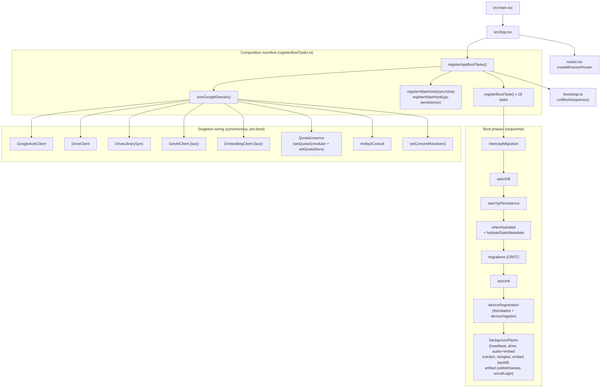
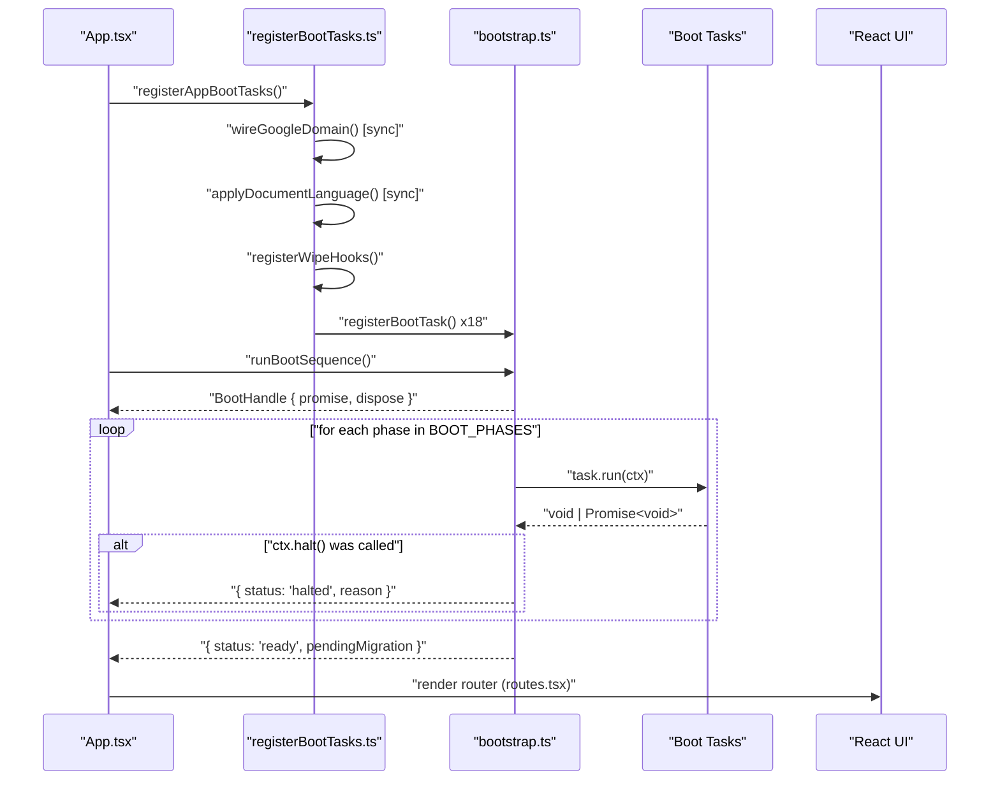
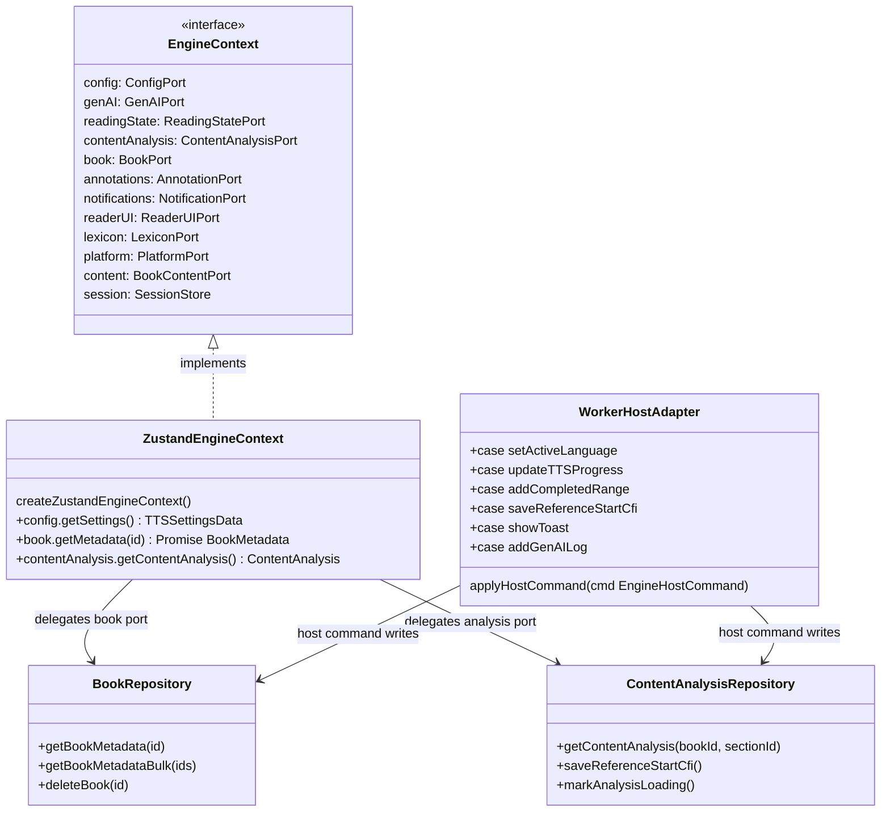
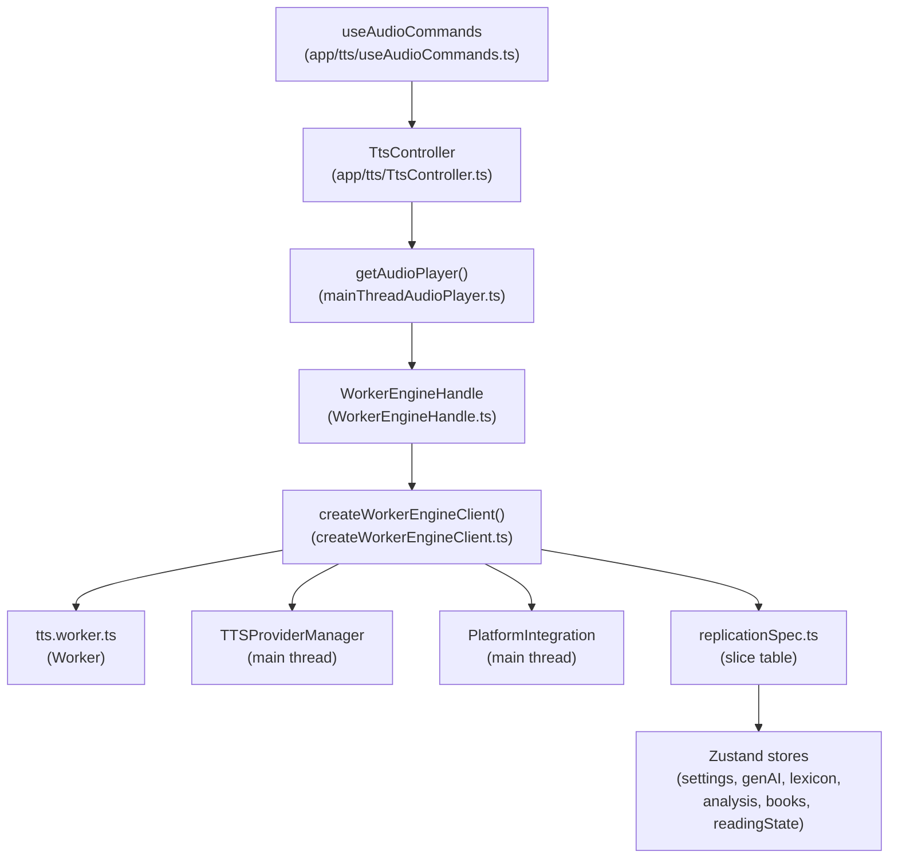
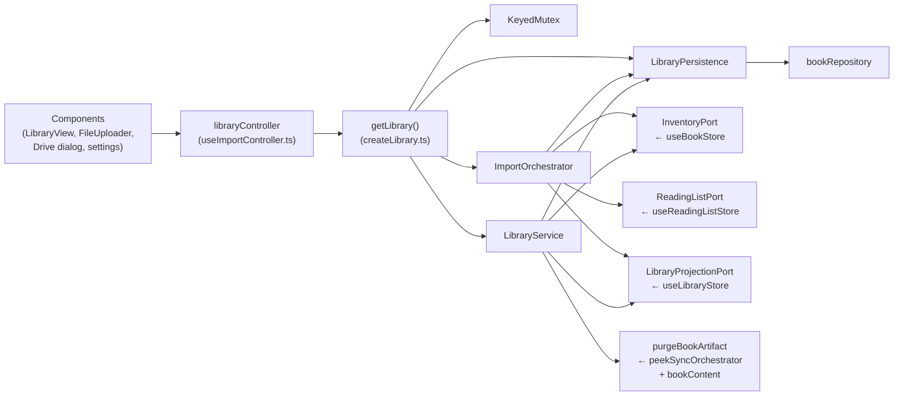
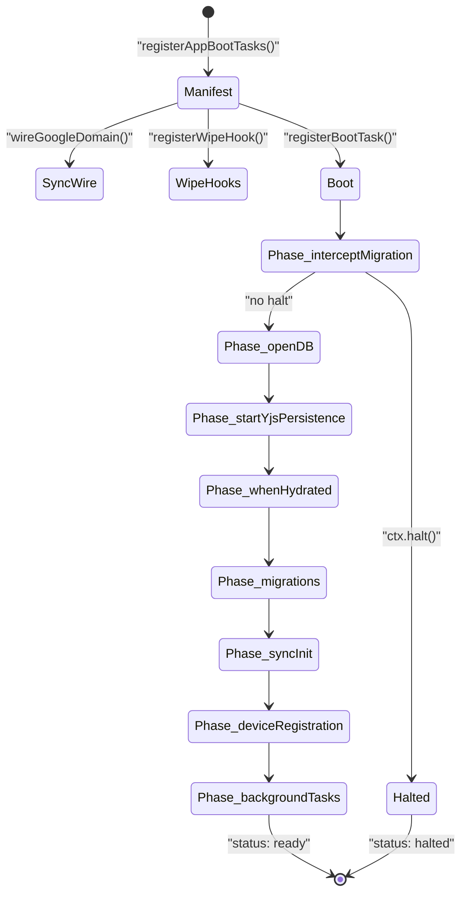

# Composition Root (src/app)

`src/app/` is the L4 composition layer — the highest layer of the Versicle
modular monolith. It is where domains, stores, repositories, and boot
tasks are wired together into one coherent application. The single governing
principle is stated in the generated `architecture.md`:

> **L4 — composition root: bootstrap + boot tasks, CRDT migration coordinator,
> routes, settings registry, controllers, port adapters, repositories.**

Everything below L4 — `src/domains/`, `src/store/`, `src/data/`, `src/kernel/`
— is store-free, injected-dependency code that publishes ports and expects the
composition root to fill them. `src/app/` is the ONE place permitted to know
which concrete stores and services exist, and to bind them to the ports those
layers declare. See [Layering and boundaries](11-layering-and-boundaries.md)
for the full layer contract and [Architecture overview](10-architecture-overview.md)
for the module map.

---

## 1. Design intent — why a dedicated composition layer exists

Early Versicle had domain logic (sync, TTS, library import) scattered across
React components, Zustand store setters, and app-level effects. That made
three problems difficult to solve:

1. **Import cycles.** A store that constructed its own sync orchestrator had to
   import firebase and Yjs — then any module that imported the store dragged in
   the whole SDK tree, bloating every chunk including the TTS worker.
2. **Testability.** An orchestrator that reached directly into
   `useTTSSettingsStore.getState()` inside its methods could not be tested
   without the live Zustand environment.
3. **Boot ordering.** Side effects at module scope caused non-deterministic
   startup. The IDB connection could open before the migration interceptor had
   decided whether the migration state machine required halting boot entirely.

The 2026 overhaul (see [Overhaul history](80-overhaul-history.md)) resolved all
three by establishing a strict protocol: subsystems declare *ports*, `app/`
injects *adapters*, and `app/boot/registerBootTasks.ts` is the single file
that wires everything in the right order. The rule is enforced by
`depcruise domains-no-store` (error at 0 violations): no domain or lib module
may import `src/store/`.

The result is what the overhaul calls the **EngineContext pattern**: the
composition root constructs a context object that satisfies the subsystem's
port interface, closing over the real Zustand stores and Capacitor APIs inside
adapter thunks. The subsystem receives only the interface — no stores, no
framework, no circular dependency.

---

## 2. High-level composition wiring graph



---

## 3. The composition manifest: `registerAppBootTasks.ts`

[src/app/boot/registerBootTasks.ts](../../src/app/boot/registerBootTasks.ts) is **the
one file** that may import subsystem boot modules and register them into the
bootstrap registry. Its comment says it all:

> "This module (not app/bootstrap.ts) is the one place that may import
> subsystem boot modules — the sequencer stays subsystem-free (plan/overhaul/
> README.md §4 rule 9)."

`registerAppBootTasks()` is called once, from `src/App.tsx`, before any React
render. It is idempotent: a `registered` flag guards against re-entry. The
function does three things in order:

1. **Pre-boot synchronous wiring** — calls `wireGoogleDomain()` and
   `applyDocumentLanguage()`. These are not boot tasks (they are synchronous
   and side-effect-free); they must run before any component mounts so even
   SafeMode renders carry the correct language and have the Google singletons
   installed.

2. **Wipe-hook registration** — registers `sync/stop` and
   `state/stop-yjs-persistence` into `src/data/wipe.ts`'s hook registry.
   `wipeAllData()` needs to stop the Firestore sync writer and the y-idb
   persistence writer before deleting storage, but `src/data` cannot import
   them (that would be a downward layering violation). The hook registry inverts
   the dependency: `data/wipe.ts` declares the registry, `app/` fills it.
   Crucially the hooks are registered **at manifest load time, not at boot
   success**, so if the app crashes before boot completes, neither writer was
   ever started, and missing a hook stops nothing that actually ran.

3. **Boot task registration** — calls `registerBootTask(phase, task)` for each
   of the eighteen boot tasks across the seven phases (nine of them in the final
   `backgroundTasks` phase, which the semantic-search and shared-AI-cache work
   grew with the embedding backfill, the artifact publisher, and the artifact
   sweeper).

### Why the sequencer stays subsystem-free

`src/app/bootstrap.ts` owns ONLY the phase registry and the sequencer loop. It
imports nothing from `sync/`, `tts/`, `library/`, or `google/`. This is
boundary rule 9 from `plan/overhaul/README.md`:

> "Singletons only in app/; no module-scope side effects outside bootstrap."

If the sequencer imported firebase directly, the firebase SDK would land in the
entry chunk even for users who have never configured sync. The
Phase 8 first-use splitting work (see [Bootstrap and lifecycle](14-bootstrap-and-lifecycle.md))
keeps the firebase chunk behind a dynamic import inside `createSync.ts`, which
is itself only reached through the `syncInit` boot task body. The bundle-chunk
check (`npm run check:worker-chunk`, check 4) asserts the emitted entry chunk
stays firebase-free.

---

## 4. The boot sequence in depth



### Phase details

The seven phases run **strictly in order**; tasks within a phase run
**sequentially in registration order**. A task throw aborts boot and routes
to `SafeModeView`. `ctx.halt(reason)` stops the sequence after the current
phase (used by the migration interceptor while a backup restore reloads the
page).

| # | Phase | What runs |
|---|-------|-----------|
| 1 | `interceptMigration` | Reads the workspace-migration state machine. STAGED → runs the idempotent staged apply and halts; RESTORING_BACKUP → executes rollback and halts; AWAITING_CONFIRMATION → blocks sync init, surfaces the confirmation modal, continues boot. Standard boot → prunes zombie pre-migration backups. |
| 2 | `openDB` | Opens `EpubLibraryDB` through the versioned migration registry; wires connection-lifecycle events (blocked/blocking/terminated) to toast notifications; runs the one-time cover-blob repair. |
| 3 | `startYjsPersistence` | Calls `startYjsPersistence()` explicitly. Until Phase 1b this was a module-scope side effect; construction now lives behind an explicit call (LD-6). |
| 4 | `whenHydrated` + `hydrateStaticMetadata` | Awaits `waitForYjsSync()` (IDB load), marks empty Y.Maps hydrated via the fork middleware, then awaits all store hydration handles. The `hydrateStaticMetadata` sub-task calls `LibraryService.start()` and `service.hydrate()` — the ONE owner of static-metadata hydration (D16 paid in full). |
| 5 | `migrations` | Runs `runCrdtMigrations()` (the coordinator in `src/app/migrations.ts`): reads doc schema version, checkpoints before any transform, runs steps sequentially, bumps version atomically inside the same `doc.transact` as the transform. |
| 6 | `syncInit` | Calls `configureSyncBackendSelection()` (idempotent), registers `wireSyncEvents()` as a cleanup, then — if `ctx.syncAllowed` and `isSyncEnabled()` — fires `getSyncOrchestratorAsync().then(o => o.start())` intentionally unawaited (boot must never block on network). |
| 7 | `deviceRegistration` | Two tasks: `tts/initialize` calls `getTtsController().initialize()` (engine→store mirror, store→engine settings sync, rehydrated-settings replay); `device/register` assembles the device profile and calls `deviceStore.registerCurrentDevice()`. |
| 8 | `backgroundTasks` | Nine tasks: device heartbeat interval (every 5 min); Drive auto-scan (weekly policy); audio-cache LRU eviction sweep (fire-and-forget, with v25 size backfill); embedding-cache eviction (persist-on-evict, never-evict-an-unconfirmed-upload rule); re-ingest wave (10 s idle delay, stamp-based candidacy); embedding backfill (pre-embeds loaded-but-unread books outward, gated by the default-OFF library opt-in and the cross-device background budget); artifact publisher (idempotent head-before-put upload of embedding blobs when Share AI caches is on); artifact sweeper (cloud TTL/quota GC of orphaned blobs); social login renewal. |

### The `BootContext` interface

Every task receives a `BootContext` object:

```typescript
interface BootContext {
  setStatusMessage(message: string): void;
  syncAllowed: boolean;            // cleared by migration interceptor
  pendingMigration: PendingWorkspaceMigration | null;
  halt(reason: BootHaltReason): void;
  addCleanup(cleanup: () => void): void; // registered teardown, runs on dispose()
}
```

`addCleanup` is the mechanism for long-lived resources (the heartbeat interval,
the sync event bus subscription). The boot handle's `dispose()` method drains
the cleanup queue — called on React unmount so tests and hot-reload do not leak
these resources across boot cycles.

---

## 5. The repository layer

`src/app/repositories/` contains two repository classes that act as
**host-side adapters** bridging the Yjs-backed stores (CRDT user data) with
the IndexedDB-backed repos (`src/data/repos/`) for the two main categories of
book data that cross the worker boundary.

### Why repositories exist

The TTS engine runs in a Web Worker. The worker can reach IndexedDB through the
`src/data/repos/` layer (which is store-free), but it cannot reach Zustand
stores (which would violate the worker-purity contract — boundary rule 6 in
`architecture.md`, enforced by the worker-chunk check). When the worker engine
needs merged book metadata — static fields from IDB plus user-supplied
customizations from the Yjs-backed `useBookStore` — the only safe path is
through a **main-thread port call** whose host implementation merges the two
sources and returns plain data across the Comlink boundary.

The repositories provide that merge. Both classes are singletons exported as
`bookRepository` and `contentAnalysisRepository`.

### `BookRepository`

[src/app/repositories/BookRepository.ts](../../src/app/repositories/BookRepository.ts)

Merges `ManifestBundle` rows from `@data/repos/bookContent` (static: title,
author, hash, structure, covers, total chars, base font metrics) with
`UserInventoryItem` entries from `useBookStore` (user-supplied: custom title,
custom author, added-at timestamp, source filename, cover palette,
offload-state).

```typescript
class BookRepository {
  async getBookMetadata(id: string): Promise<BookMetadata | undefined>
  async getBookMetadataBulk(ids: string[]): Promise<(BookMetadata | undefined)[]>
  getBookIdByFilename(filename: string): string | undefined
  async deleteBook(id: string): Promise<void>
}
export const bookRepository = new BookRepository();
```

`getBookMetadataBulk` preserves the exact index mapping of the input array —
callers can rely on `result[i]` corresponding to `ids[i]` even when some books
are absent from IDB. `deleteBook` cleans up both the CRDT analysis state (via
`useContentAnalysisStore.getState().deleteBookAnalysis(id)`) and the static IDB
rows (via `bookContent.deleteBook(id)`).

A subtle WebKit compatibility detail: the `coverBlob` field is stored as
`ArrayBuffer` in IDB on WebKit (WebKit cannot store `Blob` objects across the
IDB boundary). `toBookMetadata` normalizes `ArrayBuffer → Blob` transparently
so callers always receive a `Blob`.

### `ContentAnalysisRepository`

[src/app/repositories/ContentAnalysisRepository.ts](../../src/app/repositories/ContentAnalysisRepository.ts)

A thin adapter over `useContentAnalysisStore` — the Yjs-backed store that
holds AI content-analysis results (reference section detection, table
adaptations, CFI anchors). It translates between the store's internal shape and
the `ContentAnalysis` type the TTS engine pipeline consumes:

```typescript
class ContentAnalysisRepository {
  getContentAnalysis(bookId: string, sectionId: string): ContentAnalysis | undefined
  saveReferenceStartCfi(bookId: string, sectionId: string, cfi: string | undefined): void
  markAnalysisLoading(bookId: string, sectionId: string): void
  markAnalysisError(bookId: string, sectionId: string, error: string): void
  saveTableAdaptations(bookId, sectionId, adaptations): void
  clearAll(): void
}
export const contentAnalysisRepository = new ContentAnalysisRepository();
```

Both repositories are consumed by `createWorkerEngineClient` (the worker-side
host object) and `createZustandEngineContext` (the main-thread engine context).

---

## 6. The host-adapter pattern (EngineContext)



There are two concrete implementations of the `EngineContext` pattern:

**`createZustandEngineContext()`** ([src/app/tts/createZustandEngineContext.ts](../../src/app/tts/createZustandEngineContext.ts)) builds the
production context for the in-process (main-thread) engine path. Every port
method is a thunk that reads from the live Zustand stores and calls the
repositories at call time — never at construction time, which would freeze the
values and break reactivity.

**`applyHostCommand()`** ([src/app/tts/createWorkerEngineClient.ts](../../src/app/tts/createWorkerEngineClient.ts)) handles the **reverse** channel: write
commands the worker engine sends back to the main thread. The worker cannot
call Zustand directly (worker-purity rule), so the engine emits typed
`EngineHostCommand` values that the main thread dispatches via a large switch
statement covering 12 command kinds:

```typescript
export function applyHostCommand(command: EngineHostCommand): void {
  switch (command.kind) {
    case 'setActiveLanguage':    useTTSSettingsStore.getState().setActiveLanguage(command.lang); break;
    case 'updateTTSProgress':    useReadingStateStore.getState().updateTTSProgress(...); break;
    case 'addCompletedRange':    useReadingStateStore.getState().addCompletedRange(...); break;
    case 'updatePlaybackPosition': useReadingStateStore.getState().updatePlaybackPosition(...); break;
    case 'addAnnotation':        useAnnotationStore.getState().add(command.annotation); break;
    case 'showToast':            useToastStore.getState().showToast(...); break;
    case 'addGenAILog':          useGenAIStore.getState().addLog(command.entry); break;
    case 'setCurrentSection':    useReaderUIStore.getState().setCurrentSection(...); break;
    case 'saveReferenceStartCfi': contentAnalysisRepository.saveReferenceStartCfi(...); break;
    case 'markAnalysisLoading':  contentAnalysisRepository.markAnalysisLoading(...); break;
    case 'markAnalysisError':    contentAnalysisRepository.markAnalysisError(...); break;
    case 'saveTableAdaptations': contentAnalysisRepository.saveTableAdaptations(...); break;
  }
}
```

This function is exported separately so
[`createWorkerEngineClient.hostCommands.test.ts`](../../src/app/tts/createWorkerEngineClient.hostCommands.test.ts)
can enumerate every `EngineHostCommand` kind and assert that each maps to the
correct store or repository call.

---

## 7. TTS composition: from `getAudioPlayer()` to `WorkerEngineClient`

The TTS subsystem has the deepest composition stack in the app. Here is the
full chain:



**`getAudioPlayer()`** is a module-level singleton factory in
[`mainThreadAudioPlayer.ts`](../../src/app/tts/mainThreadAudioPlayer.ts). In production it returns a
`WorkerEngineHandle`. In jsdom (unit tests, SSR) `Worker` is undefined and the
handle degrades to a benign no-op stub — there is no runtime engine-selection
branch.

**`WorkerEngineHandle`** ([`WorkerEngineHandle.ts`](../../src/app/tts/WorkerEngineHandle.ts)) adapts the async Comlink engine
to the synchronous `TtsEngine` interface that `TtsController` and
`useAudioCommands` expect. Calls before the worker is ready are queued on the
boot promise. Snapshot semantics: the handle keeps a `cachedSnapshot` (always
with queue attached) and drops out-of-order deliveries via the monotonic `seq`
field. A rejected fire-and-forget command surfaces as a snapshot with
`error.code = 'TTS_COMMAND_FAILED'` rather than being swallowed.

**`createWorkerEngineClient()`** ([`createWorkerEngineClient.ts`](../../src/app/tts/createWorkerEngineClient.ts)) is the true
composition root for the worker engine. It:

1. Spawns the worker: `new Worker(new URL('../../workers/tts.worker.ts', ...))`
2. Wraps it with Comlink: `Comlink.wrap<WorkerTtsEngine>(worker)`
3. Constructs the `TTSProviderManager` and `PlatformIntegration` on the main
   thread (audio hardware and lock-screen integration cannot live in a worker)
4. Builds the `EngineHost` object — the bidirectional port — from the real
   backends, repositories, and `applyHostCommand`
5. Calls `engine.connect(Comlink.proxy(host))` to hand the host to the worker
6. Applies all boot-replication snapshots from `replicationSpec.ts` and
   verifies completeness via `engine.hasReplicated(bootKinds)`

A 15-second timeout guard (`withWorkerGuard`) wraps the connect call so a
silent worker module-init failure surfaces as a timeout error rather than
a permanently-hung promise.

**`TtsController`** ([`TtsController.ts`](../../src/app/tts/TtsController.ts)) is the app-layer command facade.
Its `initialize()` method (called as the `tts/initialize` boot task) does three
things:
- Replays the rehydrated persisted settings into the engine (the `onRehydrateStorage` replacement)
- Subscribes to the engine's `PlaybackSnapshot` stream and mirrors it into the ephemeral `useTTSPlaybackStore`
- Subscribes to `useTTSSettingsStore` and pushes changed settings into the engine

The playback mirror lives in a store that is never persisted and never replicated,
so an engine broadcast cannot re-enter the settings replication slice. The
S6 echo loop (per-sentence replication feedback) is structurally dead by
construction, and this is pinned by `replication.test.ts`.

### State replication: `replicationSpec.ts`

[`src/app/tts/replicationSpec.ts`](../../src/app/tts/replicationSpec.ts) is a
declarative table of every store slice replicated from the main thread into the
worker engine. The table is driven by a `Record<EngineStateUpdate['kind'], ...]>`
so the TypeScript compiler enforces completeness — adding a new
`EngineStateUpdate` member without a table entry is a compile error.

Each `ReplicatedSliceSpec` entry declares:
- `kind`: the update type name
- `replication`: `'boot'` (replicated before engine ready) or `'per-book'` (replicated on `setBook`)
- `snapshot()`: returns the current state as an array of updates
- `subscribe(push)`: wires live updates; returns an unsubscribe

The six slice kinds:

| Kind | Replication | Store source |
|------|-------------|--------------|
| `settings` | boot | `useTTSSettingsStore` (explicit `TTSSettingsData` payload, not full state) |
| `activeLanguage` | boot | `useTTSSettingsStore.activeLanguage` |
| `genAI` | boot | `useGenAIStore` (equality-guarded to exclude log-entry echo) |
| `lexicon` | boot | `useLexiconStore` + `isBibleLexiconEnabled` flag (invalidation ping only) |
| `analysis` | boot | `useContentAnalysisStore.sections` |
| `bookLanguage` | per-book | `useBookStore.books[id].language` |
| `progress` | per-book | `useReadingStateStore.getProgress(bookId)` |

The `settings` slice pushes an **explicit** `TTSSettingsData` payload — a
hand-picked set of fields from `toTTSSettingsData()` — rather than the full
store state. This was a deliberate Phase 5b change: the old full-store push
shipped the playback mirror, the queue, and every action-shaped key to the
worker, and the per-sentence replication echo rode on that shape.

---

## 8. Library composition



[`createLibrary.ts`](../../src/app/library/createLibrary.ts) is the **lazy library composition
root**. It constructs a single `{ mutex, orchestrator, service }` trio on first
call and returns the cached instance thereafter. Three port adapters close over
the real Zustand stores:

**`buildInventoryPort()`** — maps `useBookStore` methods to the `InventoryPort`
interface (`all`, `get`, `upsert`, `upsertMany`, `update`, `remove`, `subscribe`).

**`buildReadingListPort()`** — maps `useReadingListStore` to `ReadingListPort`
(`get`, `upsert`, `update`).

**`buildProjectionPort()`** — maps `useLibraryStore` to `LibraryProjectionPort`
(the projection store that holds import progress, static metadata, and offload
state). The projection store is write-only from the composition root's
perspective; components read it directly.

**`createLibraryPersistence()`** wraps the three `BookRepository` methods
(`getBookMetadata`, `getBookMetadataBulk`, `getBookIdByFilename`) so the
domain-layer persistence object has no store dependency.

**`purgeBookArtifact()`** is the shared-AI-cache lifecycle edge, injected into
`LibraryService` as its `purgeBookArtifact` port because the store-free service
cannot reach the backend/manifest edges it needs. When a book is removed it: reads
the connected cloud backend (`peekSyncOrchestrator()?.getConnectedArtifactBackend()`
— `null` is a clean no-op); reads the book's manifest for its `contentHash`
**before** the service deletes the row (absent hash → no-op); derives the cache key
from the *same* live embedding stamp the read adapter uses (`{model, dims}` +
`CURRENT_QUANT` + `TTS_EXTRACTION_VERSION`); and does a best-effort
`backend.deleteArtifactHead(workspaceId, embedCache/{key})` — deleting **only**
this device's HEAD record. The content-addressed blob is deliberately left for the
cloud sweeper to reclaim, since a sibling device may still need it. The
`shareAiCaches` switch is irrelevant here — dropping your own pointer to a book you
deleted is always safe — and a backend error is logged, not thrown (the service
degrades the same way). Like the consult read path, this cloud round-trip is
MockBackend-verified but the emulator suite is CI-pending.

One subtlety in the `ImportOrchestrator` construction:
```typescript
extractionOptions: () => ({
  sanitizationEnabled: useTTSSettingsStore.getState().sanitizationEnabled,
}),
```
This thunk is captured **per job**, not at construction time. It severs the old
reach-in coupling where `lib/` read the settings store directly inside the
extraction pipeline (coupling item #2 in the overhaul analysis).

[`useImportController.ts`](../../src/app/library/useImportController.ts) exposes
`libraryController` — a plain object (not a class) with methods that delegate
to `getLibrary().orchestrator` and `getLibrary().service`. The `unwrap()` helper
converts the `status: 'duplicate'` outcome into `DuplicateBookError`, preserving
the pre-Phase-7 contract that every Replace-dialog flow was built around. A
hook-shaped `useImportController()` accessor returns the stable singleton for
components that want a named hook.

---

## 9. Sync composition

The sync composition root is split into a light half and a heavy half:

**Light half: `createSync.ts`** ([src/app/sync/createSync.ts](../../src/app/sync/createSync.ts)) holds the singleton
state (`instance`, `instancePromise`, `selection`) and the public accessors
(`isSyncEnabled()`, `getSyncOrchestratorAsync()`, `peekSyncOrchestrator()`,
`stopSyncConnections()`, `stopSyncForWipe()`, `configureSyncBackendSelection()`).
It imports no firebase code — its static graph is firebase-free, which the
worker-chunk check (check 4) asserts on the emitted artifact.

**Heavy half: `composeSync.ts`** ([src/app/sync/composeSync.ts](../../src/app/sync/composeSync.ts)) statically imports
`SyncOrchestrator`, `FirestoreBackend`, `CheckpointService`, and
`MigrationStateService`. It is reachable **only** through the dynamic import
inside `getSyncOrchestratorAsync()`. Un-configured users (sync off) never fetch
this chunk.

The single enablement gate (`isSyncEnabled()`) lives in the light half and
checks `(firebaseEnabled && isFirebaseConfigured()) || selection?.mockSession`.
The orchestrator re-checks it internally (injected as the `isEnabled` dep), so
calling `start()` remains safe either way.

`composeSync.ts` injects the full port adapter set into `createSyncOrchestrator()`:
- `doc: getYDoc` — the Y.Doc accessor
- `whenLocalSynced: () => waitForYjsSync()` — IDB-sync gate
- `isCleanClient: () => Object.keys(useBookStore.getState().books).length === 0`
- `syncState.getActiveWorkspaceId/setActiveWorkspaceId/setFirebaseEnabled` — three
  `useSyncStore` accessors
- `checkpoints.*` — `CheckpointService` methods
- `migrationState.*` — `MigrationStateService` methods

In DEV/E2E mode, `configureSyncBackendSelection()` detects `window.__VERSICLE_MOCK_FIRESTORE__`
(through `src/test-flags.ts`, the single flag reader) and swaps in `MockBackend`
plus a synthesized auth session. The mock backend chunk is statically dead in
production builds (`import.meta.env.DEV` / `VITE_E2E` are build-time constants
Rollup tree-shakes), and check 2 of the worker-chunk gate asserts no
`MockBackend` source appears in any production chunk.

**`wireSyncEvents.ts`** ([src/app/sync/wireSyncEvents.ts](../../src/app/sync/wireSyncEvents.ts)) is the **single
`SyncEvent` subscriber** in the application. It wires presentation (toast keys)
and store mirroring (`useSyncStore` writes) to the typed event bus from
`@domains/sync/events`. Key behaviors:
- `flushed` → updates `lastSyncTime` (and ONLY `flushed` — the
  connected-transition floor that previously also drove lastSyncTime is deleted,
  per Phase 4 §Follow-ups)
- `obsolete` → calls `peekSyncOrchestrator()?.severObsoleteConnection()` and
  `stopDeviceHeartbeat()` (the Phase 4 quarantine: zero outbound writes after
  the lock, `peek` rather than `get` so composing the firebase chunk just to
  sever it would never happen)

`wireSyncEvents` is registered with `ctx.addCleanup()` in the `syncInit` boot
task, so it is automatically torn down on unmount.

---

## 10. Google domain wiring

`wireGoogleDomain()` ([src/app/google/wireGoogle.ts](../../src/app/google/wireGoogle.ts)) runs
synchronously in `registerAppBootTasks()` before any boot phase. It constructs
and installs the domain singletons in `src/domains/google` (and, with the
semantic-search and shared-AI-cache work, two kernel/cross-domain singletons too):

| Singleton | Injected dependencies |
|-----------|----------------------|
| `GoogleAuthClient` | `getLoginHint` ← `useSyncStore.firebaseUserEmail`; `onConnected/onDisconnected` hooks ← `useGoogleServicesStore` |
| `DriveClient` | `auth: GoogleAuthClient` |
| `DriveLibrarySync` | `driveIndex` ← `useDriveStore`; `library.addBook/replaceFile` ← `libraryController` |
| `GenAIClient` (lazy) | `getConfig` ← `useGenAIStore`; `onLog` ← `useGenAIStore.addLog`; `governor` ← the shared `QuotaGovernor` |
| `EmbeddingClient` (lazy) | `getConfig` ← `useGenAIStore` (`embeddingModel`/`embeddingDims`/`useBatchEmbedding`); `onLog` ← `useGenAIStore.addLog` |
| `QuotaGovernor` | `getLimits` ← `useGenAIStore.quotaLimits` (collapsed to zero when `pauseAllGenAI`); `QuotaStore` ← `quotaCounterRepo` via `makeQuotaStore`; cross-device spend ← `useDeviceStore.publishEmbedSpend` |
| `ArtifactConsult` | `getBackend` ← `peekSyncOrchestrator().getConnectedArtifactBackend()`; `getManifest` ← `bookContent`; `getStamp`/`isConsented` ← `useGenAIStore` + `usePreferencesStore`; `putHydrated` ← `embeddingsRepo` |

The GenAI client is installed as a **lazy facade** via `makeLazyGenAIClient()`.
The real `GeminiClient` and its egress plumbing load on the first `generate`
call — keeping the GenAI implementation out of the entry chunk (check 4).

The consent resolver is installed via `setConsentResolver(makeAiConsentResolver({...}))`.
The resolver checks `usePreferencesStore.aiConsent[bookId]` and
`useContentAnalysisStore.sections` to gate AI calls on per-book user consent.
A third predicate, `isLibraryPreEmbedEnabled() ← useGenAIStore.preEmbedLibrary`,
grants egress for an unread book that has no per-book consent of its own — the
default-OFF library opt-in that lets the background backfill (the
`embeddingBackfill` task in Phase 8) pre-embed the rest of the library. Each
predicate is read fresh, so a settings flip takes effect on the next egress.

### The cross-provider quota governor

The semantic-search work introduced a **single kernel quota subsystem**,
`src/kernel/quota/` ([`QuotaGovernor.ts`](../../src/kernel/quota/QuotaGovernor.ts),
the `ptDay` midnight-Pacific day-key helper, and an `index.ts` barrel imported as
`@kernel/quota`). It tracks three budgets — requests-per-minute, tokens-per-minute,
and requests-per-day — **per lane** (`fg` foreground / `bg` background), and is
shared across every paid Google egress path: `GeminiClient`, the cloud-TTS
providers (via `setTtsQuotaGovernor`), and the new embedding client.

`wireGoogleDomain()` constructs **one** `QuotaGovernor` and installs it three ways:

1. **As the gateway's `QuotaScheduler`** via `setQuotaScheduler(governor)`. The
   governor's `acquire()`/`release()` run inside `NetworkGateway.egress` at
   **admission** — before any bytes leave — so throttling cannot be bypassed (the
   same dependency-inversion seam as `setConsentResolver`; see §9 and
   [Layering and boundaries](11-layering-and-boundaries.md)). `acquire()` is the
   **single recorder**: it both checks the estimate against the budget and records
   the spend, so a request that never `commit()`s (every embedding — the embedding
   client carries no governor reference) still counts toward every budget.
   `commit()` only reconciles the acquire-time token estimate to the actual.
2. **As the cloud-TTS lane's governor** via `setTtsQuotaGovernor(governor)`, so
   the audio domain's `BaseCloudProvider` shares the same per-lane budget.
3. **As the persistence + reconcile owner.** `setQuotaStore(makeQuotaStore(...))`
   wires the daily (RPD) counter — the only budget that must survive a restart —
   to `src/data/repos/quotaCounter.ts`, which writes a single key in the
   **existing `app_metadata` store** (no new IDB store; the per-minute windows
   stay in-memory in the governor). The same `saveDailyUsage` chokepoint also
   calls `useDeviceStore.publishEmbedSpend(getDeviceId(), usage)`, publishing this
   device's spend onto its synced `DeviceInfo` record via an **additive
   `embedSpend` field** (no CRDT format change). Because the free-tier quota is
   per-Google-Cloud-**project**, the background lane's effective daily ceiling is
   reduced by the sum of what the user's *other* devices spent today
   (`makeBackgroundQuotaLimits` in `@app/quota/embedSpendReconciler`), dividing
   the shared quota across the device mesh. Foreground and query embeds use the
   full limit and are never divided.

When `getQuotaLimits()` reads `pauseAllGenAI`, it collapses the limits to
`{ rpm: 0, tpm: 0, rpd: 0 }`, so `acquire()` throws `NetRateLimitedError` (the
new typed `AppError NET_RATE_LIMITED` in [`src/types/errors.ts`](../../src/types/errors.ts),
signalling pre-network backpressure) — a master pause-all switch with no kernel
change. Editable per-lane limits, the pause-all switch, and live used-vs-limit
meters live in the GenAI settings tab; the governor stays the single source of
truth, re-exposing its `snapshot()` to the UI through
`useGenAIStore.setQuotaSnapshotProvider` and `setBgBudgetProvider` (no kernel→store
edge). Model rotation stays inside `GeminiClient` — the governor governs spend,
not model selection.

### The embedding client

The embedding client is installed exactly like the GenAI client — a **lazy
facade** (`makeLazyEmbeddingClient()`) over a one-time dynamic import of
`GeminiEmbeddingClient`, so the implementation stays out of the entry chunk
(check 4). Config (`embeddingModel`, `embeddingDims`, the opt-in batch-embedding
probe flag) is read per call from `useGenAIStore`; log entries land pre-redacted
in the same in-memory ring buffer as the GenAI client. No `governor` is wired
into it: the foreground-lane `acquire()` at the gateway already records its spend,
and an embedding never commits. The domain side is a four-part module
(`src/domains/google/genai/embedding/`: `contract`, the `GeminiEmbeddingClient`
impl, a `holder` whose fallback is an inline NOT-CONFIGURED client — `embed()`
throws `GENAI_EMBEDDING_NOT_CONFIGURED` so stray imports degrade like a missing
API key, and the lazy facade), barrel-exported from `@domains/google`. See
[Domain: Search](38-domain-search.md) for how vectors are quantized and ranked.

The two regenerable cache stores the embedding path writes (`cache_embeddings`
and `cache_embed_jobs`) ship as an additive `migrateToV27` step in the data
layer's versioned migration registry that the `openDB` phase (§4 Phase 2) opens
through. A deviation worth recording: the embeddings took **IDB v27**, the slot
that was originally reserved for the `sync_log`-drop / service-worker-cover
cleanup. That cleanup was never done, so it is now the *next* (v28) bump. The IDB
schema itself remains data-layer-owned — see
[CRDT format and migrations](22-crdt-format-and-migrations.md) and `src/data/`.

### The shared AI-cache read adapter (ArtifactConsult)

`setArtifactConsult(makeArtifactConsult({...}))` installs the **read side** of the
shared embedding cache (the Artifact Lane). Before a device spends Gemini quota to
embed a book, `ArtifactConsult` ([src/app/google/artifactConsult.ts](../../src/app/google/artifactConsult.ts))
probes the user's *own* BYO Cloud Storage and, on a hit, downloads another
device's embeddings instead of re-spending quota — a cache hit hydrates ~251 KB
and spends **zero** Gemini quota. The store/manifest/backend edges live in
`wireGoogle`; the boot loop and reader controller inject the installed singleton's
port (the holder mirrors the embedding-client holder). The injected deps:

- `getBackend` ← `peekSyncOrchestrator()?.getConnectedArtifactBackend() ?? null` —
  read fresh, and `peek` (never `get`) so the no-sync case is a cheap no-network
  `null` short-circuit and never composes the firebase chunk just to look.
- `getManifest` ← `bookContent.getManifest` (for the `contentHash` that addresses
  the cache key) and `getLiveCorpus` ← `searchTextRepo.get` (to reconcile each
  section's `sectionTextHash` against the live corpus on hydrate).
- `getStamp` ← the live embedding-space stamp (`{model, dims}` from settings, the
  int8 `CURRENT_QUANT` literal, and `TTS_EXTRACTION_VERSION`), so the derived
  content key matches the one the publisher wrote.
- `putHydrated` ← `embeddingsRepo.putHydrated` (one atomic cross-store write of the
  embedding row + its job row).
- `isConsented` ← `makeArtifactConsentGate({...})`, which ANDs the default-OFF
  **Share AI caches across my devices** master switch (`useGenAIStore.shareAiCaches`)
  into the per-book consent predicate. With sharing OFF every book is DENIED even
  when the user just opened it. The upload (publisher) boot task is built from this
  **same** helper, so consult and upload share one gating rule.

The consult adapter probes + hydrates **before** the quota gate, so a cache hit
never reaches `acquire()`. Lifecycle (delete, persist-on-evict, the cloud TTL
sweeper, the HEAD-hit-but-object-missing drift metric) lives in the boot tasks and
in `createLibrary`'s `purgeBookArtifact` port (§8). The C3 `SyncBackend` surface
the adapter calls — `headArtifact` / `getArtifact` for read, plus
`deleteArtifactHead` for the stale-HEAD self-heal — is documented in
[Domain: Sync](36-domain-sync.md). A deviation worth recording: the C3 artifact
surface landed as **five** additive methods, not the originally-planned trio —
`headArtifact` / `putArtifact` / `getArtifact` (probe / write / read) plus
`deleteArtifactHead` / `sweepArtifacts` (the GC pair). Those cloud round-trips are
MockBackend-verified and code-complete, but the Firestore+Storage emulator suite
(put/head/get/delete/sweep + HEAD-after-Storage ordering) and the security-rules
suite are **CI-pending** (they auto-skip without local emulators), so the cloud
paths are **not yet proven end-to-end against real Firebase**.

Drive imports flow through the **same `ImportOrchestrator` queue** as every
other entry point — ghost matching and reading-list registration included.
`DriveLibrarySync` receives `libraryController.importFile` / `replaceFile`
directly, not a lower-level IDB write, so the full import pipeline runs for
Drive-sourced files.

**The GG-2 reversal**: prior to Phase 7, a Drive authentication token failure
would `disconnectService()` from `useGoogleServicesStore`, forcing the user to
reconnect from scratch. Post-Phase 7, token failures are silent (no
force-disconnect); the user reconnects from settings. `onConnected` and
`onDisconnected` hooks now mirror connection state only on explicit
connect/disconnect, not on token failure. `useGoogleServicesStore` is therefore
a "has connected before" hint, not an authoritative connection state.

---

## 11. CRDT migration coordinator

[`src/app/migrations.ts`](../../src/app/migrations.ts) is the CRDT migration coordinator.
It owns eight migration steps, from doc schema v1 to v9. Key design invariants:

- **Static imports, single call site**: invoked exactly once per boot from the
  `migrations` phase. An in-tab re-entry guard (`inFlight`) ensures repeated
  calls share the same promise.
- **Reads the doc, not store state**: `readDocSchemaVersion` takes
  `max(meta.schemaVersion, library.__schemaVersion)` — tolerating partial
  dual-writes from the pre-v9 era.
- **One transaction per step**: the version bump executes inside the same
  `doc.transact()` as the step's transform. Observers (other clients, y-idb)
  never see transformed-but-unversioned data.
- **DOC transforms, not store setState**: steps mutate Y types directly; the
  middleware receives the migration as ordinary inbound traffic
  (`MIGRATION_ORIGIN` symbol ≠ any store api) and patches stores normally.
- **Loud failure**: any throw produces a `MigrationError` carrying the
  pre-migration checkpoint id. Boot routes this to `CriticalMigrationFailureView`
  with the checkpoint-restore flow.
- **Pre-migration checkpoint**: if the doc has data, `CheckpointService.createCheckpoint`
  is called before the first transform. Checkpoint failure aborts the migration.

The migration table:

| Step | Transform |
|------|-----------|
| v1 → v2 | `pruneInvalidReadingSessions` — removes corrupted sessions |
| v2 → v4 | pure version bump (v4 = the `disableYText` flip) |
| v3 → v4 | pure version bump (v3 was itself a pure bump) |
| v4 → v5 | `backfillFontProfiles` — initializes fontProfiles on all devices |
| v5 → v6 | `migrateV5toV6` — folds per-device preference maps, prunes popover leak |
| v6 → v7 | `canonicalizeVocabularyKeys` — trad→simp vocabulary key normalization |
| v7 → v8 | `linkReadingListEntries` — reading-list bookId FK linker |
| v8 → v9 | `clearHusksAndRetireDualWrite` — husk clearing, dual-write retirement, `activeContext` pruning |

The dual-write retirement at v9 is notable: steps up to and including v8 write
both `meta.schemaVersion` and `library.__schemaVersion`. Steps v9 and beyond
write only `meta.schemaVersion`. The stale `library.__schemaVersion = 8` key is
deliberately kept (never deleted) because it is the only quarantine layer
pre-Phase-4 builds possess.

---

## 12. Reader controller

[`src/app/reader/useReaderController.ts`](../../src/app/reader/useReaderController.ts) is the
app-layer reader controller (Phase 6 §5, PR-9). It owns everything about an
open reader that is not presentation:

- **Engine construction** via `useEpubReader()` (options assembled from
  preferences + book metadata, initial location, event callbacks)
- **`ReadingSessionRecorder` lifecycle** (Phase 6 §6): one recorder per `bookId`,
  wired to `useReadingStateStore` via an injected port object; `flushSync` on
  unmount for the panic-save
- **`ReaderCommands`** (Phase 6 §5a): stable-identity callbacks for page/chapter
  navigation and play-from-selection; TTS-aware routing (if TTS is playing,
  `nextChapter` routes through `audio.skipToNextSection()`)
- **`SearchSession`** (Phase 7 §F): one `SearchSession` per open reader,
  worker-backed, fed by `searchTextRepo`; lifecycle owned here
- **Chinese reading registration** (Phase 6 §7, PR-10): registers with the
  engine's content seam only for books whose base language is `zh`
- **Audio + UI context**: calls `audio.setBookId(bookId)` and
  `setCurrentBookId(bookId)` when the book changes
- **TTS error toasts**: subscribes to `useTTSPlaybackStore.lastError` and
  surfaces errors as toasts

The hook returns a `ReaderController` interface consumed by `ReaderShell.tsx`.

---

## 13. Settings registry

[`src/app/settings/registry.ts`](../../src/app/settings/registry.ts) applies the
store-registry pattern to the settings surface. `SETTINGS_PANELS` is an array
of `SettingsPanel` descriptors, each with:
- `id: SettingsTabId` — the URL segment (`/settings/:tab`)
- `labelKey: MessageKey` — i18n catalog key (never a raw string)
- `icon: LucideIcon`
- `load: () => Promise<{ default: ComponentType }>` — React.lazy source; panel
  chunks load on first activation
- `order: number` — sidebar position
- `danger?: boolean` — destructive-area styling (the Data panel)

Nine panels are registered: `general`, `tts`, `genai`, `sync`, `devices`,
`dictionary`, `recovery`, `diagnostics`, `data`. The settings surface is
URL-addressable: `/settings/diagnostics` cold-loads into the Diagnostics tab
over the library. Closing the settings overlay navigates back (or to `/` on
cold load) — no dedicated close guard.

`resolveSettingsTab(param)` maps an unknown route param to `'general'`
(the default). `SettingsShell` renders the whole surface from `SETTINGS_PANELS`
without knowing panel implementations; `architecture.md` §7 is generated from
this registry.

---

## 14. Route tree

[`src/app/routes.tsx`](../../src/app/routes.tsx) defines the route tree at module scope
(created once, never per render):

| Path | Component | Load |
|------|-----------|------|
| `/` | `LibraryView` | Eager — the boot surface |
| `/notes` | `LibraryView context="notes"` | Eager |
| `/read/:id` | `ReaderShellLazy` | `React.lazy` — pulls epubjs out of the entry chunk |
| `/settings/:tab?` | `LibraryView + SettingsShellLazy` | Library eager, settings lazy |

The settings overlay renders **over** the library so `/settings/diagnostics`
on a cold load shows the Diagnostics tab over a hydrated library, not a blank
page. `ReaderShell` being lazy is asserted by check 4 of the worker-chunk
script: epubjs must not appear in the entry chunk.

---

## 15. The GenAI port

[`src/app/tts/genaiPort.ts`](../../src/app/tts/genaiPort.ts) is the **one** app-layer
implementation of the `EngineContext GenAIPort` call surface. Both engine
transport paths (the main-thread `createZustandEngineContext` and the
worker's host commands in `createWorkerEngineClient`) consume this module
rather than calling the domain client directly.

The `@deprecated genAIConfigure()` function is now a no-op: config is read per
call from `useGenAIStore` via the composition-root provider, so the hardcoded
model clobber that the legacy pipeline triggered is structurally impossible.

Feature modules load on first call via deep dynamic imports (not via the domain
index barrel), keeping them out of the entry chunk:

```typescript
const { detectReferenceSection } = await import('@domains/google/genai/features/referenceDetection');
const { generateTableAdaptations } = await import('@domains/google/genai/features/tableAdaptation');
```

This preserves the Phase 8 §A first-use splitting discipline for the GenAI
feature tree.

---

## 16. Provider build context

[`src/app/tts/providerBuildContext.ts`](../../src/app/tts/providerBuildContext.ts) is
a single exported function:

```typescript
export function storeProviderBuildContext(providerId: string): Omit<ProviderBuildContext, 'sink'> {
  const { apiKeys, activeLanguage } = useTTSSettingsStore.getState();
  return {
    apiKey: (apiKeys as Record<string, string | undefined>)[providerId],
    language: activeLanguage || 'en',
  };
}
```

This is the resolution of the S11 lib→store cycle edge: `lib/tts` previously
read `useTTSSettingsStore` directly inside provider construction (inside the
`providerFactory.ts` that is now deleted). The factory inversion moves the read
into this app-layer module and injects it as a supplier into
`TTSProviderManager`. The manager itself carries no store import.

---

## 17. Responsibility map and invariants



**What `src/app/` OWNS:**
- The ordering and wiring of every subsystem (not the behavior)
- Port adapter construction: the thunks that close over real stores
- The single call to every singleton constructor (`GoogleAuthClient`,
  `DriveClient`, `DriveLibrarySync`, `QuotaGovernor`, `ArtifactConsult`,
  `KeyedMutex`, `ImportOrchestrator`, `LibraryService`, `TtsController`,
  `WorkerEngineHandle`) and the install of every kernel/domain port the
  composition fills (`setQuotaScheduler`, `setQuotaStore`, `setEmbeddingClient`,
  `setArtifactConsult`, `setConsentResolver`)
- The CRDT migration coordinator (business rules for the chain, ordering,
  checkpointing, atomic bump) — but NOT the Y.Doc schema itself (that is
  `src/store/registry.ts`)
- The settings surface registry and route tree
- The reader controller (engine construction, session recorder lifecycle,
  ReaderCommands, search session ownership)

**What `src/app/` does NOT OWN:**
- Transport behavior (sync orchestration, Firestore backend, epub rendering)
- Engine algorithms (TTS playback, provider synthesis, sentence extraction)
- Store shape and persistence tiers (store registry)
- IDB schema and migrations (data layer)
- Component rendering

**Key invariants (from boundary rules and tests):**
1. `src/app/boot/bootstrap.ts` imports no subsystem — enforced by review (the
   comment in `registerBootTasks.ts` states the rule explicitly).
2. No domain or lib module imports `src/store/` — enforced by `depcruise
   domains-no-store` at error/0.
3. No module-scope side effects outside bootstrap — singleton construction
   happens either in `wireGoogleDomain()` (synchronous pre-boot) or inside boot
   task `run()` bodies.
4. Mock seams are reachable only from `createSync.ts` behind `DEV/VITE_E2E`
   (check 2 of the worker-chunk gate).
5. The TTS worker import closure is free of zustand/yjs/store — `check:worker-chunk`
   check 1 asserts the emitted chunk.
6. Every `EngineStateUpdate` kind has exactly one entry in `replicationSpec.ts` —
   enforced at compile time by `Record<EngineStateUpdate['kind'], ...]>`.
7. One `QuotaGovernor` instance gates every paid Google egress lane. It is
   installed at the `NetworkGateway` admission seam (`setQuotaScheduler`), so the
   throttle cannot be bypassed — the same unbypassable-at-the-gate property as the
   consent resolver. The kernel stays store-free: its only persistence and
   cross-device edges are the injected `QuotaStore` and the
   `setQuotaSnapshotProvider`/`setBgBudgetProvider` re-exposure (no kernel→store
   import).

---

## 18. Cross-document references

- [Bootstrap and lifecycle](14-bootstrap-and-lifecycle.md) — the C11 boot contract
  in depth, `useBootSequence`, service worker gate, SafeMode routing
- [Layering and boundaries](11-layering-and-boundaries.md) — the full boundary
  rule set and enforcement mechanisms
- [State management / CRDT](13-state-management-crdt.md) — Yjs store registry,
  three-tier model, hydration mechanics
- [Domain: Sync](36-domain-sync.md) — `SyncOrchestrator`, `SyncBackend` port,
  workspace migration state machine
- [Domain: Library](37-domain-library.md) — `ImportOrchestrator`, `LibraryService`,
  `KeyedMutex`
- [TTS: App integration](51-tts-app-integration.md) — `TtsController`, `WorkerEngineHandle`,
  replication spec in depth
- [Domain: Audio TTS engine](32-domain-audio-tts-engine.md) — the worker-resident
  `PlaybackController` and `WorkerTtsEngine`
- [Domain: Google](39-domain-google.md) — `GoogleAuthClient`, `DriveClient`,
  `DriveLibrarySync`, `GenAIClient`, `EmbeddingClient`
- [Domain: Search](38-domain-search.md) — int8 quantization, `SearchEngine.rankInt8`,
  reciprocal-rank fusion, the artifact blob codec, the cross-provider quota governor
- [Domain: Reader engine](30-domain-reader-engine.md) — `ReaderEngine` port,
  `EpubJsEngine`, `useEpubReader`
- [CRDT format and migrations](22-crdt-format-and-migrations.md) — the Y.Doc
  schema, `CURRENT_SCHEMA_VERSION`, migration contract
- [Architecture overview](10-architecture-overview.md) — the full module map,
  contract registry C1–C12
