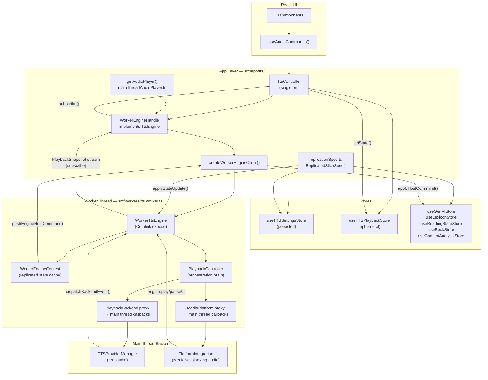
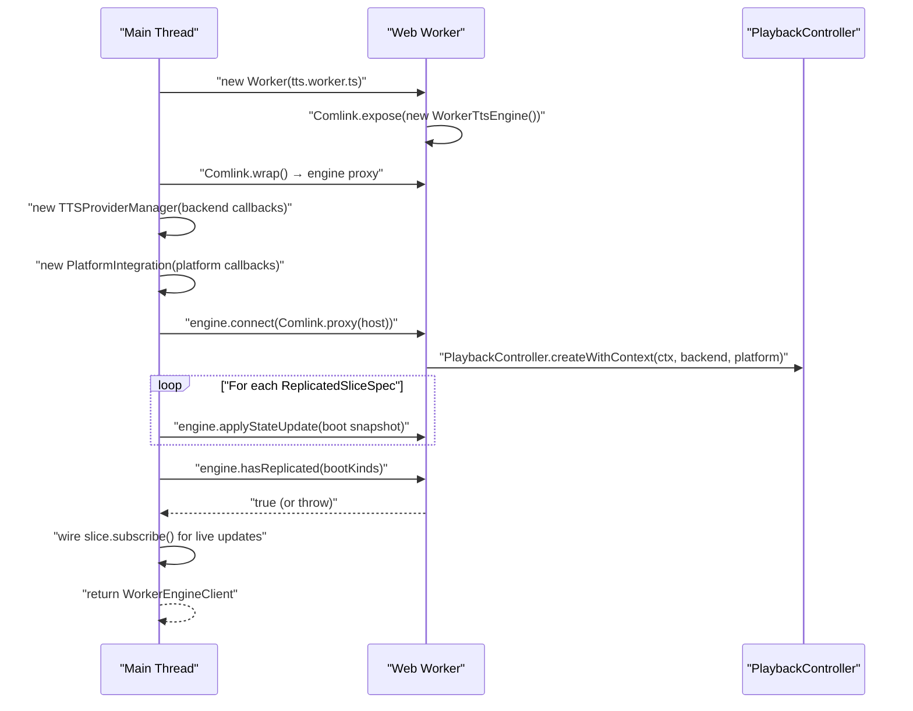
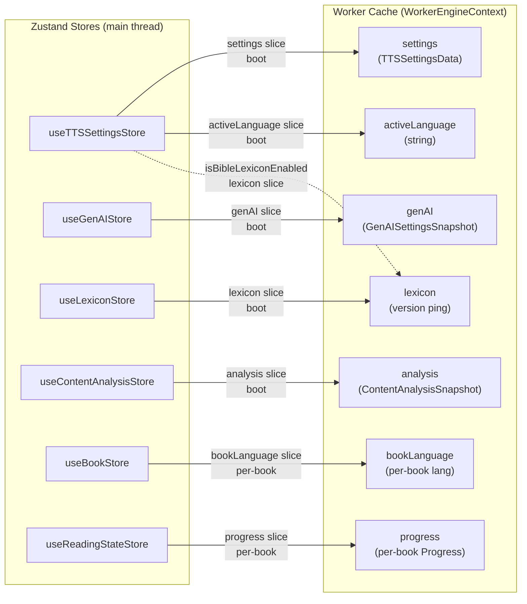
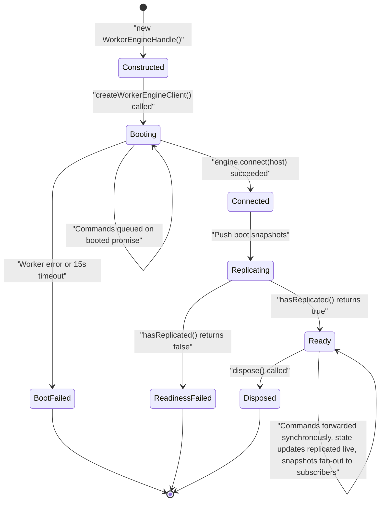
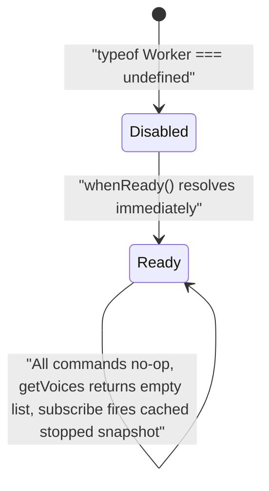
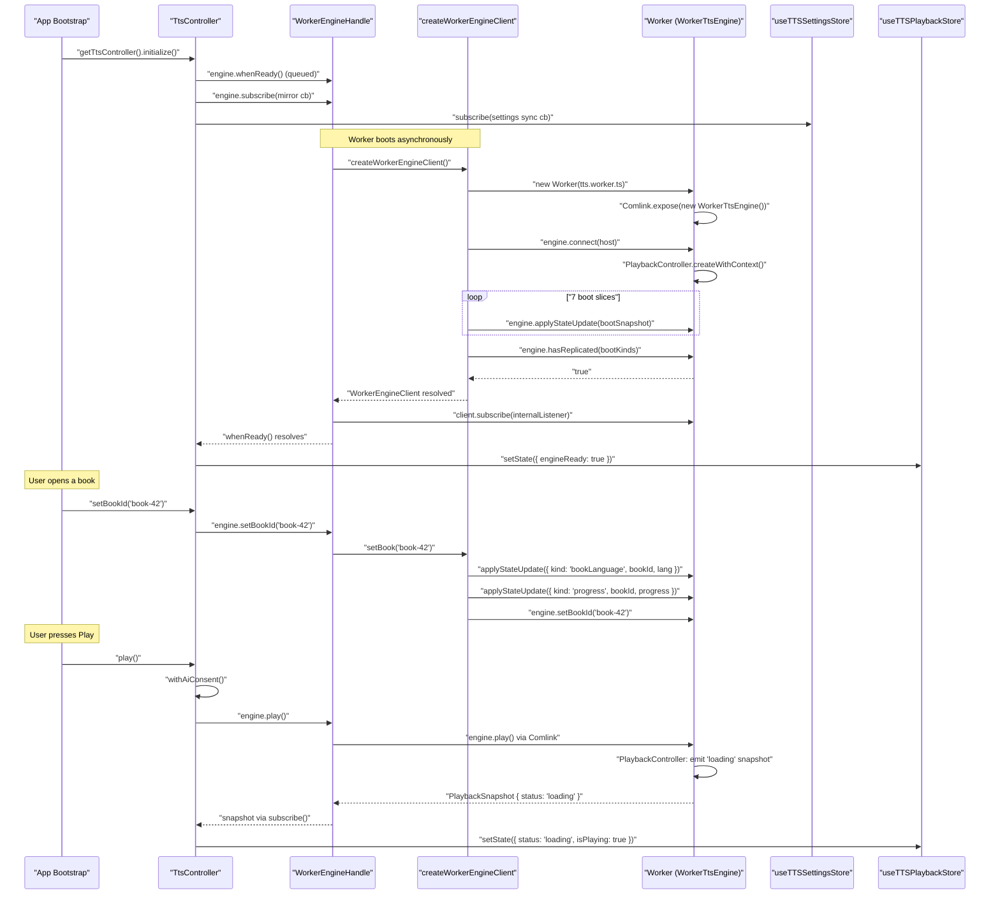

# TTS Application Integration

This document covers the integration layer that connects the worker-resident TTS engine to the rest
of the application. It is the bridge between the pure engine domain (covered in
[32-domain-audio-tts-engine.md](32-domain-audio-tts-engine.md) and
[34-tts-content-pipeline.md](34-tts-content-pipeline.md)) and the UI stores, React components, and
boot sequence described in [14-bootstrap-and-lifecycle.md](14-bootstrap-and-lifecycle.md) and
[13-state-management-crdt.md](13-state-management-crdt.md).

---

## 1. Why This Layer Exists

### The Problem

The TTS engine — a `PlaybackController` with all of its providers, voice management, queue
orchestration, and content pipeline — used to run in-process on the main thread with its commands
scattered across Zustand store action setters. Engine commands lived in `useTTSStore` actions that
called `getAudioPlayer()` directly. That created a tangle where:

- Settings stores had side effects (they drove the engine when their own state changed).
- The engine communicated back to stores through loose callbacks that were difficult to test in
  isolation.
- Playback status, queue state, and voice lists were mixed into persisted settings.
- The engine's internal `PlaybackListener` delivered separate callbacks for status, errors, and
  downloads — four different notification paths.

### The Solution: A Layered Integration Stack

Phase 5b of the Versicle overhaul program (documented in `plan/overhaul/prep/phase5-tts-strangler.md`)
drew clean boundaries:

1. The engine was moved into a **Web Worker** and exposed over Comlink.
2. A single **`PlaybackSnapshot` stream** replaced the four old notification paths.
3. **`TtsController`** became the one application-layer command facade — UI components no longer
   touch the engine directly.
4. The Zustand settings store was split into a **persisted settings slice** (`useTTSSettingsStore`)
   and an **ephemeral playback slice** (`useTTSPlaybackStore`) that is written only by the
   controller's engine mirror and never persisted or replicated.
5. A **declarative replication spec** drives all state from the main thread into the worker, so the
   engine core can satisfy its synchronous `EngineContext` getters without ever touching Zustand or
   crossing the thread boundary at runtime.

The result is a strict one-way data flow: stores own settings state; the controller forwards
commands to the engine; the engine broadcasts snapshots back; the controller writes snapshots into
the ephemeral playback store; UI components read from that store reactively and issue new commands
through the `useAudioCommands` hook.

---

## 2. Architectural Overview



The arrows show data direction: left-to-right is commands flowing into the engine; right-to-left is
state flowing back to the stores. The worker boundary is clearly visible — only two channels cross
it: the `applyStateUpdate` replication path (main → worker) and the `PlaybackSnapshot` subscription
stream (worker → main).

---

## 3. The Files at a Glance

| File | Role |
|---|---|
| [`src/app/tts/mainThreadAudioPlayer.ts`](../../src/app/tts/mainThreadAudioPlayer.ts) | Singleton factory: creates and returns the `WorkerEngineHandle`. The only production code that constructs the engine. |
| [`src/app/tts/WorkerEngineHandle.ts`](../../src/app/tts/WorkerEngineHandle.ts) | Adapts the async Comlink-backed worker client to the synchronous `TtsEngine` interface. Handles boot buffering, `seq` ordering, queue re-attachment, and error surfacing. |
| [`src/app/tts/createWorkerEngineClient.ts`](../../src/app/tts/createWorkerEngineClient.ts) | Spins up the Worker, constructs the main-thread backend and platform, wires the `EngineHost`, runs the boot replication, and returns a `WorkerEngineClient`. |
| [`src/app/tts/replicationSpec.ts`](../../src/app/tts/replicationSpec.ts) | The single declarative table of every store slice replicated into the worker. One record entry per `EngineStateUpdate` kind. |
| [`src/app/tts/TtsController.ts`](../../src/app/tts/TtsController.ts) | The command facade: exposes all engine commands as bound methods, runs the engine-to-store mirror, manages voice resolution, and runs the settings-to-engine sync. |
| [`src/app/tts/useAudioCommands.ts`](../../src/app/tts/useAudioCommands.ts) | The one React hook through which all UI components issue engine commands. Returns the `TtsController` singleton as `AudioCommands`. |
| [`src/app/tts/providerBuildContext.ts`](../../src/app/tts/providerBuildContext.ts) | The one place provider construction inputs are read from the settings store, injected into `TTSProviderManager` at composition time. |
| [`src/app/tts/genaiPort.ts`](../../src/app/tts/genaiPort.ts) | Bridges the engine's `GenAIPort` interface to the Phase 7 domain client, using deep dynamic imports to keep the GenAI features out of the TTS worker chunk. |
| [`src/app/tts/createZustandEngineContext.ts`](../../src/app/tts/createZustandEngineContext.ts) | The production `EngineContext` for the main-thread (non-worker) code path, forwarding every call to the real Zustand stores. |
| [`src/workers/tts.worker.ts`](../../src/workers/tts.worker.ts) | The worker entry: constructs `WorkerTtsEngine` and exposes it over Comlink. Three lines of code. |
| [`src/lib/tts/engine/WorkerTtsEngine.ts`](../../src/lib/tts/engine/WorkerTtsEngine.ts) | The worker-resident host: owns the `PlaybackController`, builds proxy backends/platforms, applies state updates and backend events. |
| [`src/lib/tts/engine/WorkerEngineContext.ts`](../../src/lib/tts/engine/WorkerEngineContext.ts) | The replicated-cache implementation of `EngineContext`: receives `EngineStateUpdate`s, serves synchronous getters from its cache, sends `EngineHostCommand`s out. |

---

## 4. The `TtsEngine` Interface

Everything in this layer is unified by a single interface defined in
[`src/lib/tts/engine/TtsEngine.ts`](../../src/lib/tts/engine/TtsEngine.ts). Both `WorkerEngineHandle`
(the worker-backed production path) and `PlaybackController` (the in-process path used in unit
tests) implement it:

```typescript
export interface TtsEngine {
    readonly engineName: string;
    // Playback control
    play(): Promise<void>;
    pause(): Promise<void> | void;
    stop(): Promise<void> | void;
    preview(text: string): Promise<void>;
    setSpeed(speed: number): Promise<void> | void;
    setVoice(voiceId: string): Promise<void> | void;
    setLanguage(lang: string): void;
    setProviderById(providerId: string): Promise<void> | void;
    setPrerollEnabled(enabled: boolean): void;
    setBackgroundAudioMode(mode: 'silence' | 'noise' | 'off'): void;
    setBackgroundVolume(volume: number): void;
    // Navigation
    setBookId(bookId: string | null): Promise<void> | void;
    loadSection(sectionIndex: number, autoPlay?: boolean): Promise<boolean | void>;
    loadSectionBySectionId(sectionId: string, autoPlay?: boolean, title?: string): Promise<void>;
    jumpTo(index: number): Promise<void> | void;
    seek(offset: number): Promise<void> | void;
    skipToNextSection(): Promise<boolean>;
    skipToPreviousSection(): Promise<boolean>;
    // Voices / init
    init(): Promise<void>;
    getVoices(): Promise<TTSVoice[]>;
    downloadVoice(voiceId: string): Promise<void>;
    deleteVoice(voiceId: string): Promise<void>;
    isVoiceDownloaded(voiceId: string): Promise<boolean>;
    // Diagnostics
    exportDiagnostics(): Promise<FlightRecorderExport>;
    triggerDiagnosticsSnapshot(trigger: string, note?: string): Promise<string | null>;
    // The snapshot stream
    subscribe(listener: SnapshotListener): () => void;
    snapshot(): PlaybackSnapshot;
    whenReady(): Promise<void>;
}
```

**Design note on commands as ACKs:** A resolved promise from `play()`, `setVoice()`, or
`loadSectionBySectionId()` means the command was accepted and enqueued. Completion, status
transitions, and errors flow exclusively through the `PlaybackSnapshot` subscription stream —
the caller never polls or awaits a "done" promise from a command.

### The `PlaybackSnapshot` Type

The single immutable broadcast shape of the engine (introduced in Phase 5b-PR2 as a replacement
for the old 6-argument `PlaybackListener` tuple):

```typescript
export interface PlaybackSnapshot {
    readonly seq: number;        // Monotonic, engine-side; stale drops at the boundary
    readonly status: TTSStatus;  // 'playing' | 'paused' | 'stopped' | 'loading' | 'completed'
    readonly queueId: string;    // Changes iff queue content identity changes (P23 broadcast diet)
    readonly queue?: ReadonlyArray<TTSQueueItem>;  // Omitted when queueId unchanged
    readonly index: number;
    readonly sectionIndex: number;
    readonly activeCfi: string | null;
    readonly error: PlaybackError | null;   // Non-null exactly on the snapshot that surfaces a failure
    readonly download: DownloadInfo | null; // Non-null on download-progress publishes
}
```

The `queue` field implements a "broadcast diet" (P23): when status updates arrive at high
frequency — such as every sentence — re-cloning the entire queue across the worker boundary would
be wasteful. The engine omits `queue` when `queueId` has not changed. The `WorkerEngineHandle`
re-attaches the cached queue, so its subscribers always see full snapshots.

### The `isAudiblePlayback` Selector

```typescript
export function isAudiblePlayback(status: TTSStatus): boolean {
    return status === 'playing' || status === 'loading' || status === 'completed';
}
```

This is the single tested derivation of "the UI should look like audio is active." Both `loading`
(between sentences, during buffering) and `completed` (after the final sentence, while background
audio may still run) count as playing to prevent play/pause button flicker and premature UI
teardown. The `TtsController` calls this function to set `isPlaying` in `useTTSPlaybackStore`.

---

## 5. `mainThreadAudioPlayer` — The Production Engine Factory

[`src/app/tts/mainThreadAudioPlayer.ts`](../../src/app/tts/mainThreadAudioPlayer.ts) is a seven-line
file with outsized structural importance:

```typescript
let instance: TtsEngine | null = null;

export function getAudioPlayer(): TtsEngine {
    if (!instance) {
        instance = new WorkerEngineHandle();
    }
    return instance!;
}
```

This is the **only production path** to the engine. The `TtsController` constructor defaults to
`getAudioPlayer()`, and `getAudioPlayer()` returns exactly one `WorkerEngineHandle`. The handle
itself degrades to a benign no-op stub where `typeof Worker === 'undefined'` (jsdom unit tests,
SSR) — so this single code path serves all environments.

There is no runtime engine-selection branch; no "use in-process if worker is slow" fallback. The
old in-process builder that lived here for unit tests was removed in the P9 knip sweep: engine
suites now construct `PlaybackController` directly through `FakeEngineContext` / `parityHostDb`
ports.

---

## 6. `WorkerEngineHandle` — The Adaptation Layer

[`src/app/tts/WorkerEngineHandle.ts`](../../src/app/tts/WorkerEngineHandle.ts) implements `TtsEngine`
and bridges the gap between the synchronous, fire-and-forget API that `TtsController` expects and
the inherently async Comlink-backed worker.

### Boot Buffering

The `WorkerEngineHandle` constructor calls `createWorkerEngineClient()` and stores the promise as
`private booted: Promise<WorkerEngineClient>`. Every fire-and-forget command goes through the
private `run()` helper:

```typescript
private run(fn: (client: WorkerEngineClient) => unknown): void {
    if (this.disabled) return;
    this.booted.then(fn).catch((e) => {
        logger.error('worker engine call failed', e);
        const failed: PlaybackSnapshot = {
            ...this.cachedSnapshot,
            error: { code: 'TTS_COMMAND_FAILED', message: e instanceof Error ? e.message : String(e) },
        };
        this.cachedSnapshot = failed;
        this.listeners.forEach((l) => l(failed));
    });
}
```

Calls issued before the worker finishes booting are automatically queued on the `booted` promise
chain and flushed in the order they were issued once the worker is ready. This is a principled
startup state: `play()` called during boot will execute before `pause()` called immediately after,
because both are chained onto the same promise. The test suite verifies invocation order:

```typescript
void handle.play();
void handle.setVoice('voice-1');
void handle.pause();
// ... resolve the worker ...
expect(client.engine.play.mock.invocationCallOrder[0])
    .toBeLessThan(client.engine.setVoice.mock.invocationCallOrder[0]);
```

### Error Surfacing as Snapshots (S8 fix)

When a fire-and-forget command rejects, the error is not silently swallowed into a log line. It
surfaces on the snapshot channel as a `PlaybackSnapshot` with `error.code = 'TTS_COMMAND_FAILED'`.
This means the error reaches `TtsController`'s mirror and lands in `useTTSPlaybackStore.lastError`
where the UI can display it, the same way a playback error from the engine would.

### Sequence-Number Guard

Comlink deliveries can arrive out of order due to microtask scheduling. The handle drops snapshots
whose `seq` is less than or equal to the cached snapshot's `seq`:

```typescript
await client.subscribe((snap) => {
    if (snap.seq <= this.cachedSnapshot.seq) return;
    const full: PlaybackSnapshot = snap.queue
        ? snap
        : { ...snap, queue: this.cachedSnapshot.queue };
    this.cachedSnapshot = full;
    this.listeners.forEach((l) => l(full));
});
```

### Subscribe Semantics

`WorkerEngineHandle.subscribe()` mirrors `PlaybackController.subscribe()` semantics: delivering the
latest cached snapshot on the next tick after subscription. This means a subscriber added at any
point after boot receives immediate state — it does not have to wait for the next engine event.

### The `disabled` Mode

When `typeof Worker === 'undefined'` (jsdom, SSR), the handle sets `this.disabled = true`. The
`booted` promise is set to one that never resolves. All `run()` calls short-circuit immediately.
All `call()` calls return the supplied fallback value. `subscribe()` fires the cached `'stopped'`
snapshot, and `whenReady()` resolves immediately. Tests for the disabled mode appear in
`WorkerEngineHandle.test.ts` under the "no Worker: jsdom/SSR disabled mode" suite.

---

## 7. `createWorkerEngineClient` — Worker Setup and Wiring

[`src/app/tts/createWorkerEngineClient.ts`](../../src/app/tts/createWorkerEngineClient.ts) is the
composition root for the worker side. It performs eight distinct setup steps:



### Step 1: Spawn and Guard the Worker

```typescript
const worker = new Worker(
    new URL('../../workers/tts.worker.ts', import.meta.url),
    { type: 'module' }
);
worker.addEventListener('error', (e: ErrorEvent) => {
    workerError = `${e.message}${e.filename ? ` (${e.filename}:${e.lineno})` : ''}`;
    logger.error('TTS worker error', workerError);
});
const engine = Comlink.wrap<WorkerTtsEngine>(worker);
```

A `withWorkerGuard` utility wraps sensitive operations in a 15-second timeout race. If the worker
fails to connect — for example because a module-init error prevents `Comlink.expose()` from running
— every Comlink call would otherwise hang forever. The guard rejects with the captured worker error
message so the failure surfaces immediately.

### Step 2: Construct the Main-Thread Backend

```typescript
const backend = new TTSProviderManager({
    onStart: () => { void engine.dispatchBackendEvent({ type: 'start' }); },
    onEnd: () => { void engine.dispatchBackendEvent({ type: 'end' }); },
    onError: (error) => { void engine.dispatchBackendEvent({ type: 'error', error: safe }); },
    onTimeUpdate: (currentTime) => { void engine.dispatchBackendEvent({ type: 'timeupdate', currentTime }); },
    onDownloadProgress: (voiceId, percent, status) => {
        void engine.dispatchBackendEvent({ type: 'downloadProgress', voiceId, percent, status });
    },
}, undefined, storeProviderBuildContext);
```

The `TTSProviderManager` lives on the main thread where `HTMLAudioElement` and the native TTS
providers are available. Its event callbacks forward into the worker via `engine.dispatchBackendEvent()`.
The provider build context (`storeProviderBuildContext`) is injected from the composition root so
that `src/lib/tts` never imports from a store (the S11 lib-to-store cycle edge is closed).

### Step 3: Construct the Main-Thread Platform

```typescript
const platform = new PlatformIntegration({
    onPlay: () => { void engine.play(); },
    onPause: () => { engine.pause(); },
    onStop: () => { engine.stop(); },
    onPrev: () => { engine.seek(-1); },  // sentence step, NOT a chapter skip
    onNext: () => { engine.seek(1); },
    onSeek: (offset) => { engine.seek(offset); },
    onSeekTo: () => { /* seekTo is internal */ },
});
```

`PlatformIntegration` handles lock-screen controls (MediaSession on web, `NowPlayingPlugin` on
native). When the user presses Play on their lock screen, the event enters via `onPlay` and routes
to `engine.play()` — which goes back into the worker.

The prev/next transport actions (`previoustrack`/`nexttrack`: car steering-wheel buttons, headset
buttons, the lock-screen skip buttons) intentionally map to `engine.seek(±1)` — a one-sentence
step — rather than `skipTo*Section`. On eyes-free surfaces the dominant use is "rewind the
sentence I just missed"; whole-chapter jumps live only on the in-app audio pill, which calls
`skipToNextSection`/`skipToPreviousSection` directly.

### Step 4: Build the `EngineHost` and Connect

```typescript
const host: EngineHost = {
    platformName: () => Capacitor.getPlatform(),
    backendInit: () => backend.init(),
    backendPlay: (text, options) => backend.play(text, options) as Promise<void>,
    // ... all backend and platform methods ...
    applyHostCommand,  // worker → main-thread store writes
};
await withWorkerGuard('connect', engine.connect(Comlink.proxy(host)));
```

The `EngineHost` interface is the full main-thread surface the worker calls back into. Every method
that the worker's `WorkerTtsEngine` calls — backend operations, platform updates, lexicon fetches,
GenAI calls, and store writes — is listed here as a callable function passed over Comlink as a
proxy. The `connect()` call is the handshake that wires the worker to its host; everything before
this is setup, and everything after is operation.

### Step 5: State Replication Boot

```typescript
const slices = createReplicatedSlices({ getCurrentBookId: () => currentBookId });
for (const slice of slices) {
    for (const update of slice.snapshot()) {
        await engine.applyStateUpdate(update);
    }
}
```

The entire replication table is iterated, each slice's current state snapshot is pushed to the
worker, and `hasReplicated(bootKinds)` is checked before returning:

```typescript
const bootKinds = slices.filter((s) => s.replication === 'boot').map((s) => s.kind);
if (!(await engine.hasReplicated(bootKinds))) {
    throw new Error(`TTS worker boot replication incomplete (expected: ${bootKinds.join(', ')})`);
}
```

This is a readiness gate: if any boot slice's `applyStateUpdate()` was dropped or a pusher was
forgotten, the boot fails loudly at startup rather than silently serving stale data later.

### Step 6: Wire Live Replication Subscriptions

```typescript
const sliceUnsubs = slices.map((slice) =>
    slice.subscribe((update) => { void engine.applyStateUpdate(update); }));
```

Each slice's `subscribe()` is connected. From this point, any change in the relevant Zustand store
triggers an immediate push to the worker.

### Step 7: The `setBook` Pre-Push Protocol

```typescript
const setBook = async (bookId: string | null) => {
    currentBookId = bookId;
    if (bookId) {
        for (const update of bookSnapshotUpdates(bookId)) {
            await engine.applyStateUpdate(update);
        }
    }
    engine.setBookId(bookId);
};
```

Per-book slices (`bookLanguage`, `progress`) are not pre-pushed during boot because they depend on
a specific book. When the app switches books, `setBook` pre-pushes those book-specific entries
before calling `setBookId` on the engine. The engine performs a synchronous context switch inside
`setBookId` and reads `bookLanguage` and `progress` from the context immediately — so the data must
already be in the worker's cache when the call lands.

---

## 8. `replicationSpec.ts` — The Declarative Replication Table

[`src/app/tts/replicationSpec.ts`](../../src/app/tts/replicationSpec.ts) is the single source of truth
for what crosses the main-thread/worker boundary.

### Structure

Every `EngineStateUpdate` kind has one entry in `SLICE_BUILDERS`, a `Record` whose key type is
`EngineStateUpdate['kind']`. A union member added to `EngineStateUpdate` without a spec entry is a
compile-time error:

```typescript
const SLICE_BUILDERS: Record<
    EngineStateUpdate['kind'],
    (deps: ReplicationDeps) => ReplicatedSliceSpec
> = {
    settings: () => ({ ... }),
    activeLanguage: () => ({ ... }),
    genAI: () => ({ ... }),
    lexicon: () => ({ ... }),
    analysis: () => ({ ... }),
    bookLanguage: () => ({ ... }),
    progress: (deps) => ({ ... }),
};
```

Each `ReplicatedSliceSpec` has:

| Field | Type | Purpose |
|---|---|---|
| `kind` | `EngineStateUpdate['kind']` | The update kind this slice produces |
| `replication` | `'boot'` or `'per-book'` | Whether snapshot is pushed at boot or per-book |
| `snapshot()` | `() => EngineStateUpdate[]` | The full current state of this slice |
| `subscribe(push)` | `(push: ...) => () => void` | Wire live updates; returns unsubscribe |

### The Seven Slices



**`settings`** (boot): Pushes the explicit `TTSSettingsData` payload — only the fields the engine
actually reads: `profiles`, `customAbbreviations`, `alwaysMerge`, `sentenceStarters`,
`sanitizationEnabled`, `isBibleLexiconEnabled`. The old `plain(getState())` approach shipped the
entire store including the playback mirror, the queue, every action function key, and API keys. The
explicit payload (introduced in 5b-PR3) closes the S6 echo loop: the engine cannot mirror its own
broadcast back as a settings push because nothing in the playback store is replicated.

**`activeLanguage`** (boot): De-duplicated push — carries an equality guard so the slice only fires
when the language actually changes, not on every store update:

```typescript
let last = useTTSSettingsStore.getState().activeLanguage;
return useTTSSettingsStore.subscribe((state) => {
    if (state.activeLanguage !== last) {
        last = state.activeLanguage;
        push({ kind: 'activeLanguage', lang: state.activeLanguage });
    }
});
```

**`genAI`** (boot): The echo guard on the genAI slice is the second critical anti-echo measure.
The `addGenAILog` host command writes log entries back into `useGenAIStore`. Without the guard, a
GenAI log append would trigger a fresh genAI push that crosses the worker boundary. The guard
compares the fields the engine actually reads:

```typescript
function genAIEngineView(s) {
    return {
        isEnabled: s.isEnabled,
        isContentAnalysisEnabled: s.isContentAnalysisEnabled,
        isTableAdaptationEnabled: s.isTableAdaptationEnabled,
        contentFilterSkipTypes: s.contentFilterSkipTypes,
        apiKey: s.apiKey,
        referenceDetectionStrategy: s.referenceDetectionStrategy,
    };
}
```

A log append leaves this view unchanged — no push. An actual config change changes the view — one
push fires.

**`lexicon`** (boot): Lexicon data is not replicated — it would be large. Instead, the worker
PULLS the compiled rules through the `lexiconGetCompiled` host port whenever its internal lexicon
listeners fire. This slice sends only a monotonically incrementing `version` integer, which acts as
a staleness ping. Both the lexicon rule store and the `isBibleLexiconEnabled` flag are tracked:

```typescript
const unsubStore = useLexiconStore.subscribe(() =>
    push({ kind: 'lexicon', version: ++version }));
const unsubFlag = useTTSSettingsStore.subscribe((state) => {
    if (state.isBibleLexiconEnabled !== lastFlag) {
        lastFlag = state.isBibleLexiconEnabled;
        push({ kind: 'lexicon', version: ++version });
    }
});
```

**`analysis`** (boot): The full `ContentAnalysisSnapshot` (all section analyses by `bookId/sectionId`
key) is replicated and re-pushed on any store change.

**`bookLanguage`** (per-book): Scans all books in `useBookStore` and pushes a `bookLanguage` update
for each one whenever the store changes.

**`progress`** (per-book): Pushes the active book's progress when the reading state store changes,
but only if `currentBookId` is set:

```typescript
subscribe: (push) =>
    useReadingStateStore.subscribe(() => {
        const bookId = deps.getCurrentBookId();
        if (!bookId) return;
        const progress = useReadingStateStore.getState().getProgress(bookId);
        push({ kind: 'progress', bookId, progress: plain(progress) });
    }),
```

### The `plain()` Helper

All state crossing the worker boundary is passed through `plain()`:

```typescript
function plain<T>(value: T): T {
    return JSON.parse(JSON.stringify(value));
}
```

Zustand `getState()` snapshots include action functions. Comlink uses the structured clone algorithm,
which cannot transfer functions. A JSON round-trip strips them, leaving only the plain data the
engine reads. This also makes the serialized shape explicit and testable.

### The `toTTSSettingsData` Function

```typescript
export function toTTSSettingsData(s: Pick<TTSSettingsStoreState,
    | 'profiles' | 'customAbbreviations' | 'alwaysMerge' | 'sentenceStarters'
    | 'sanitizationEnabled' | 'isBibleLexiconEnabled'
>): TTSSettingsData {
    return {
        profiles: s.profiles,
        customAbbreviations: s.customAbbreviations,
        alwaysMerge: s.alwaysMerge,
        sentenceStarters: s.sentenceStarters,
        sanitizationEnabled: s.sanitizationEnabled,
        isBibleLexiconEnabled: s.isBibleLexiconEnabled,
    };
}
```

This function is exported and used by both `replicationSpec.ts` (for the worker push) and
`createZustandEngineContext.ts` (for the in-process main-thread path), keeping the two engine
wiring paths in sync. The `Pick` type on the parameter means the compiler will flag if the function
is called with a store state that lacks any field it projects.

---

## 9. `WorkerEngineContext` — The Worker-Side Cache

[`src/lib/tts/engine/WorkerEngineContext.ts`](../../src/lib/tts/engine/WorkerEngineContext.ts) is the
worker-resident implementation of `EngineContext`. It receives `EngineStateUpdate` messages and
caches them, satisfying the engine core's synchronous getters from the cache.

### The Problem It Solves

`EngineContext` exposes synchronous getters like `config.getSettings()`, `config.getActiveLanguage()`,
`readingState.getProgress()`. You cannot satisfy a synchronous getter with an on-demand call across
a worker boundary — `postMessage` is always asynchronous. The only viable approach is pre-replication:
push state into the worker before it is needed.

```
main thread                              worker
───────────                              ──────
store.subscribe(push) → applyUpdate() → [cache] → getSettings()/getProgress()/… → engine
dispatch(cmd)  ←   post()  ←──────────  writes (updateTTSProgress, addAnnotation, …)
```

### Loud Failures for Unreplicated Slices

Boot-replicated slices start as `null` — "never replicated." Their getters throw rather than return
a silent default:

```typescript
private replicated<T>(value: T | null, kind: EngineStateUpdate['kind']): T {
    if (value === null) {
        throw new Error(
            `WorkerEngineContext: '${kind}' was never replicated — ` +
            `the host must push it before the engine reads it (see replicationSpec.ts)`,
        );
    }
    return value;
}
```

```typescript
config = {
    getSettings: () => this.replicated(this.settings, 'settings'),
    getActiveLanguage: () => this.replicated(this.activeLanguage, 'activeLanguage'),
    ...
};
```

The readiness gate in `createWorkerEngineClient` (the `hasReplicated(bootKinds)` check after
pushing boot snapshots) ensures these are always populated before the engine processes its first
command. The `replication.test.ts` suite verifies these throws occur before replication and are
resolved after.

### The `EngineStateUpdate` Union

```typescript
export type EngineStateUpdate =
    | { kind: 'settings'; settings: TTSSettingsData }
    | { kind: 'genAI'; settings: GenAISettingsSnapshot }
    | { kind: 'activeLanguage'; lang: string }
    | { kind: 'bookLanguage'; bookId: string; lang: string }
    | { kind: 'analysis'; snapshot: ContentAnalysisSnapshot }
    | { kind: 'progress'; bookId: string; progress: Progress }
    | { kind: 'lexicon'; version: number };
```

The `applyUpdate` switch in `WorkerEngineContext` handles all seven members. A new member without a
handler in the switch is a compile-time `never` exhaustiveness error — missing a push is impossible
if the type system is satisfied.

### The `EngineHostCommand` Union (Worker → Main Thread)

```typescript
export type EngineHostCommand =
    | { kind: 'setActiveLanguage'; lang: string }
    | { kind: 'updateTTSProgress'; bookId: string; queueIndex: number; sectionIndex: number }
    | { kind: 'addCompletedRange'; bookId: string; cfiRange: string; type?: ReadingEventType }
    | { kind: 'updatePlaybackPosition'; bookId: string; lastPlayedCfi: string }
    | { kind: 'addAnnotation'; annotation: AnnotationInput }
    | { kind: 'showToast'; message: string; type?: ToastType }
    | { kind: 'addGenAILog'; entry: GenAILogEntry }
    | { kind: 'setCurrentSection'; title: string; sectionId: string }
    | { kind: 'saveReferenceStartCfi'; ... }
    | { kind: 'markAnalysisLoading'; ... }
    | { kind: 'markAnalysisError'; ... }
    | { kind: 'saveTableAdaptations'; ... };
```

These are write operations that the worker can request but only the main thread can perform (because
they write to Zustand stores or repositories that own Yjs-backed state). The `post()` callback in
`WorkerEngineContext` sends them outbound; `applyHostCommand` in `createWorkerEngineClient.ts`
applies them to the real stores:

```typescript
export function applyHostCommand(command: EngineHostCommand): void {
    switch (command.kind) {
        case 'setActiveLanguage':
            useTTSSettingsStore.getState().setActiveLanguage(command.lang);
            break;
        case 'updateTTSProgress':
            useReadingStateStore.getState().updateTTSProgress(command.bookId, command.queueIndex, command.sectionIndex);
            break;
        case 'addAnnotation':
            useAnnotationStore.getState().add(command.annotation);
            break;
        case 'showToast':
            useToastStore.getState().showToast(command.message, command.type);
            break;
        // ... 8 more cases
    }
}
```

---

## 10. `WorkerTtsEngine` — The Worker Resident

[`src/lib/tts/engine/WorkerTtsEngine.ts`](../../src/lib/tts/engine/WorkerTtsEngine.ts) is the class
exposed over Comlink from the worker entry (`src/workers/tts.worker.ts`). It owns the
`PlaybackController` and serves as the dispatch layer between Comlink calls and the controller.

### The Worker Entry

```typescript
// src/workers/tts.worker.ts
import * as Comlink from 'comlink';
import { WorkerTtsEngine } from '@lib/tts/engine/WorkerTtsEngine';
Comlink.expose(new WorkerTtsEngine());
```

The worker is constructed without arguments. The optional `ports` parameter (storage port injection
for tests) defaults to the real repo-backed implementations.

### `connect(host)` — The Handshake

`connect()` must be called before any other method. It constructs the `WorkerEngineContext` (wired
to the `post` channel via `host.applyHostCommand`), builds proxy backend and platform objects that
delegate every call to the main thread via `host.*` methods, and then calls
`PlaybackController.createWithContext(ctx, backendFactory, platformFactory)`:

```typescript
async connect(host: EngineHost): Promise<void> {
    this.ctx = new WorkerEngineContext({
        post: (cmd) => host.applyHostCommand(cmd),
        platformName: host.platformName(),
        getCompiledLexicon: (bookId, language) => host.lexiconGetCompiled(bookId, language),
        // ... other proxied async reads
    });
    const backendFactory = (events: TTSProviderEvents): PlaybackBackend => {
        this.backendEvents = events;
        return {
            play: (text, options) => host.backendPlay(text, options),
            pause: () => { void host.backendPause(); },
            // ...
        };
    };
    this.engine = PlaybackController.createWithContext(this.ctx, backendFactory, platformFactory);
}
```

The proxy backend and platform keep the `PlaybackController` identical in all environments — it
always calls the same interface methods; only the implementation behind those methods changes
depending on whether they resolve to in-process code or Comlink callbacks.

### `applyStateUpdate` and `dispatchBackendEvent`

These are the two inbound channels from the main thread to the worker:

- **`applyStateUpdate(update)`**: Forwards to `ctx.applyUpdate(update)`, which populates the
  replicated cache and fires the context's internal listeners.
- **`dispatchBackendEvent(event)`**: Routes the structured backend events (start, end, error,
  timeupdate, downloadProgress) into the `TTSProviderEvents` callbacks the `PlaybackController`
  registered when it built the backend proxy.

### `subscribe()` and Comlink Proxy Wrapping

```typescript
subscribe(listener: SnapshotListener): () => void {
    return Comlink.proxy(this.e.subscribe(listener));
}
```

The unsubscribe function returned by `PlaybackController.subscribe()` must cross the boundary as a
Comlink proxy function, not a plain function — plain functions are not transferable. `Comlink.proxy()`
wraps it so the main thread can call `remoteUnsub()` to unsubscribe. The `WorkerEngineHandle` does
this transparently when wiring its internal subscription during `createWorkerEngineClient()`.

---

## 11. `TtsController` — The Command Facade

[`src/app/tts/TtsController.ts`](../../src/app/tts/TtsController.ts) is the single app-layer command
surface. It is instantiated once (a lazy singleton via `getTtsController()`), injected with the
engine from `getAudioPlayer()`, and initialized during the boot sequence.

### Lifecycle: `initialize()`

`initialize()` is the `tts/initialize` boot task, run from
[`src/app/boot/deviceRegistration.ts`](../../src/app/boot/deviceRegistration.ts):

```typescript
export const ttsInitializeTask: BootTask = {
    name: 'tts/initialize',
    run: () => { getTtsController().initialize(); },
};
```

It is idempotent: a second call is a no-op (guarded by `this.initialized`).

Inside `initialize()`, four things happen in sequence:

**1. Replay persisted settings into the engine.** This is the direct replacement for the
`onRehydrateStorage` side effects the legacy settings store used to run:

```typescript
this.engine.setBackgroundAudioMode(settings.backgroundAudioMode);
this.engine.setBackgroundVolume(settings.whiteNoiseVolume);
this.engine.setPrerollEnabled(settings.prerollEnabled);
void this.engine.setSpeed(selectActiveRate(settings));
const voiceId = selectActiveVoiceId(settings);
if (voiceId) { void this.engine.setVoice(voiceId); }
LexiconService.getInstance().setGlobalBibleLexiconEnabled(settings.isBibleLexiconEnabled);
```

**2. Mark engine readiness.** The `whenReady()` promise resolves once the worker has booted and
subscribed. The controller gates `useTTSPlaybackStore.engineReady` on it:

```typescript
void this.engine.whenReady().then(() =>
    useTTSPlaybackStore.setState({ engineReady: true }));
```

**3. Wire the engine-to-store mirror.** The single `subscribe()` callback writes every incoming
`PlaybackSnapshot` into `useTTSPlaybackStore`:

```typescript
this.engine.subscribe((snap) => {
    useTTSPlaybackStore.setState({
        status: snap.status,
        isPlaying: isAudiblePlayback(snap.status),
        activeCfi: snap.activeCfi,
        currentIndex: snap.index,
        ...(snap.queue ? { queue: snap.queue } : {}),
        lastError: snap.error?.message ?? null,
        ...(snap.download ? {
            downloadProgress: snap.download.percent,
            downloadStatus: snap.download.status,
            downloadingVoiceId: snap.download.voiceId,
            isDownloading: snap.download.percent < 100
        } : {})
    });
});
```

The `download` spread only updates download fields when a download update is present — a regular
playback broadcast does not clobber `downloadProgress` back to zero.

**4. Wire the settings-to-engine sync.** A `useTTSSettingsStore.subscribe()` watcher runs per-field
comparisons and pushes changes to the engine. Each push fires only when its field actually changed:

```typescript
useTTSSettingsStore.subscribe((s, prev) => {
    if (s.activeLanguage !== prev.activeLanguage) {
        this.engine.setLanguage(s.activeLanguage);
        this.resolveActiveVoice();
    }
    const rate = selectActiveRate(s);
    if (rate !== selectActiveRate(prev)) { void this.engine.setSpeed(rate); }
    const voiceId = selectActiveVoiceId(s);
    if (voiceId !== selectActiveVoiceId(prev)) {
        if (voiceId) void this.engine.setVoice(voiceId);
        // Keep the resolved voice object in the playback store current.
        const voices = useTTSPlaybackStore.getState().voices;
        useTTSPlaybackStore.setState({ voice: voices.find((v) => v.id === voiceId) ?? null });
    }
    // ... preroll, background audio, volume, lexicon flag, provider/api-key changes
});
```

### The Echo-Loop Invariant (S6)

Engine broadcasts land in `useTTSPlaybackStore`. The settings-to-engine sync watches
`useTTSSettingsStore`. Because these are different stores, an engine broadcast cannot re-enter the
settings sync watcher, and the replication spec does not subscribe to `useTTSPlaybackStore` at all.
The S6 per-sentence echo loop (engine broadcast → settings push → worker echo) is structurally dead.
`replication.test.ts` pins this:

```typescript
expect(fakeStores.playback.listenerCount(),
    'no slice may subscribe to the playback store').toBe(0);
fakeStores.playback.emit({ status: 'playing', queue: [{ text: 'x' }], currentIndex: 1 });
expect(pushed).toHaveLength(0);
```

### The AI Consent Gate

`play()` and any `loadSectionBySectionId()` call with `autoPlay = true` run through
`withAiConsent()` before forwarding to the engine:

```typescript
play = (): void => {
    void this.withAiConsent(() => void this.engine.play());
};

private async withAiConsent(run: () => void): Promise<void> {
    try {
        await ensureAiConsentForBook(this.currentBookId);
    } catch (e) {
        logger.warn('AI consent prompt failed; continuing without an answer', e);
    }
    run();
}
```

A failing consent prompt (dialog torn down, network error) never blocks playback. The gate runs the
engine command regardless. This is documented as "failures never block" in the Phase 5b PR and
tested in `TtsController.test.ts`:

```typescript
it('a failing consent prompt never blocks playback (P9)', async () => {
    vi.mocked(ensureAiConsentForBook).mockRejectedValueOnce(new Error('dialog torn down'));
    c.play();
    await vi.waitFor(() => expect(raw.play).toHaveBeenCalled());
});
```

### Voice Resolution Algorithm

`resolveActiveVoice()` implements the fallback priority for selecting a voice when the active
language changes:

1. The profile's saved `voiceId` for the active language, if it exists in the loaded voice list.
2. The first voice in the loaded list whose `lang` starts with the active language.
3. Nothing (if the voice list is empty — the saved profile `voiceId` is retained untouched).

This retains the saved `voiceId` when voices are not yet loaded (the "voice recall" regression),
preventing the profile from being wiped mid-session.

### `loadVoices` — The Full Voice Bootstrap Sequence

```typescript
loadVoices = async (): Promise<void> => {
    const { providerId } = useTTSSettingsStore.getState();
    await this.engine.setProviderById(providerId);
    await this.engine.init();
    const voices = await this.engine.getVoices();
    useTTSPlaybackStore.setState({ voices });

    // Priority cascade: current active voice → profile saved voice → lang match → English → first
    // ... (see source for full cascade logic)
    if (targetVoice) {
        void this.engine.setVoice(targetVoice.id);
        useTTSPlaybackStore.setState({ voice: targetVoice });
        settings.setVoiceId(targetVoice.id, activeLang);
    }
};
```

This is called on `initialize()` (not directly but via the provider watcher when `initialize()`
pushes the first settings state), on provider switch, and on API key commit for the active provider.

---

## 12. `useAudioCommands` — The UI Hook

[`src/app/tts/useAudioCommands.ts`](../../src/app/tts/useAudioCommands.ts) is the only React hook
through which UI components may issue TTS engine commands. It is intentionally minimal:

```typescript
export type AudioCommands = Pick<TtsController,
    | 'play' | 'pause' | 'stop' | 'jumpTo' | 'seek' | 'preview'
    | 'setBookId' | 'loadSectionBySectionId'
    | 'skipToNextSection' | 'skipToPreviousSection'
    | 'loadVoices' | 'downloadVoice' | 'deleteVoice' | 'checkVoiceDownloaded'
    | 'exportDiagnostics' | 'triggerDiagnosticsSnapshot'
    | 'listDiagnosticSnapshots' | 'deleteDiagnosticSnapshot'
    | 'clearDiagnosticSnapshots' | 'shareDiagnosticSnapshot'
>;

export function useAudioCommands(): AudioCommands {
    return getTtsController();
}
```

Key design properties:

- **Stable reference**: The `TtsController` is a singleton with bound command methods. The returned
  object is stable for the application lifetime and safe in React dependency arrays.
- **No engine import outside `src/app/tts/`**: `mainThreadAudioPlayer.ts` is `eslint` import-banned
  outside `src/app/tts/`. Component tests mock `@app/tts/useAudioCommands` at the module level
  without touching the engine composition root.
- **Type-narrowed surface**: The `AudioCommands` type (a `Pick`) exposes only the commands, not
  internal controller state or methods like `initialize()`. Components cannot accidentally call
  lifecycle methods.

---

## 13. Worker Client Lifecycle State Diagram



In the `disabled` mode (no `Worker` global):



---

## 14. Full Boot-to-Play Sequence



---

## 15. Provider and Platform Wiring

### The `storeProviderBuildContext`

[`src/app/tts/providerBuildContext.ts`](../../src/app/tts/providerBuildContext.ts) closes the S11
lib-to-store cycle. The old `lib/tts/providerFactory.ts` read from `useTTSSettingsStore` directly,
creating a dependency from the TTS library layer into the app store layer. The refactored approach
injects the build context as a factory function at the composition root:

```typescript
export function storeProviderBuildContext(providerId: string): Omit<ProviderBuildContext, 'sink'> {
    const { apiKeys, activeLanguage } = useTTSSettingsStore.getState();
    return {
        apiKey: (apiKeys as Record<string, string | undefined>)[providerId],
        language: activeLanguage || 'en',
    };
}
```

This is passed to `TTSProviderManager` in `createWorkerEngineClient()` so the manager itself never
imports a store module.

### The `genaiPort.ts` First-Use Splitting Discipline

[`src/app/tts/genaiPort.ts`](../../src/app/tts/genaiPort.ts) bridges the engine's `GenAIPort` interface
to the Phase 7 domain client. It uses deep dynamic imports to keep GenAI feature modules out of the
TTS worker chunk:

```typescript
export async function genAIDetectContentTypes(...): Promise<...> {
    const { detectReferenceSection } = await import(
        '@domains/google/genai/features/referenceDetection'
    );
    // ...
}
```

A build check (`scripts/check-worker-chunk.mjs`) asserts that the GenAI feature layer stays out of
the TTS worker bundle. If `genaiPort.ts` used static imports, the entire GenAI stack would be
bundled into the TTS worker entry chunk.

---

## 16. Diagnostics Integration

The diagnostics path (S9 fix) routes through the engine handle, not the main-thread module
singleton. This is essential: the worker's `PlaybackController` has its own `TTSFlightRecorder`
instance distinct from any main-thread instance. Reading the main-thread singleton would show an
empty ring buffer.

`TtsController` exposes:

```typescript
exportDiagnostics = (): Promise<FlightRecorderExport> => {
    return this.engine.exportDiagnostics();
};
triggerDiagnosticsSnapshot = (trigger: string, note?: string): Promise<string | null> => {
    return this.engine.triggerDiagnosticsSnapshot(trigger, note);
};
listDiagnosticSnapshots = async (): Promise<Omit<FlightSnapshot, 'eventsJSON'>[]> => {
    return diagnostics.listSnapshots();
};
```

The LIVE buffer (`exportDiagnostics`, `triggerDiagnosticsSnapshot`) routes through the worker
handle — these read the worker-side ring buffer via Comlink. The PERSISTED snapshots
(`listDiagnosticSnapshots`, `deleteDiagnosticSnapshot`, `clearDiagnosticSnapshots`,
`shareDiagnosticSnapshot`) are read from the `diagnostics` repository (IndexedDB), which is shared
by both threads.

---

## 17. Testing the Integration Layer

### `TtsController.test.ts`

The controller is tested by injecting a `makeFakeEngine()` — a `TtsEngine` interface stub with
Vitest mock functions — directly into the `TtsController` constructor. This avoids any import of
the engine composition root. The test suite covers:

- **Settings replay**: that `initialize()` pushes all persisted settings to the engine.
- **Engine-to-store mirror**: that `PlaybackSnapshot` broadcasts land in `useTTSPlaybackStore` with
  the `isAudiblePlayback` flicker derivation.
- **Settings-to-engine sync**: that every settings store field change triggers the correct engine
  command.
- **Echo-loop guard**: that engine broadcasts do not cause `useTTSSettingsStore` to emit (no
  re-entrancy into the settings sync watcher).
- **Voice recall regression**: that voice resolution preserves the saved profile voice when the
  voice list is empty.
- **AI consent pre-flight**: that `play()` and autoplay loads run through `ensureAiConsentForBook`
  and that a failing prompt never blocks playback.

### `WorkerEngineHandle.test.ts`

The handle is tested by mocking `createWorkerEngineClient` to return a controllable promise. A
fake client (`makeFakeClient()`) is resolved at test-controlled times to verify:

- Boot buffering: commands queued before resolution execute in order after resolution.
- `whenReady()`: resolves only after the client is booted AND the internal subscription is live.
- Snapshot fan-out and replay: new subscribers receive the cached snapshot on the next tick.
- `seq` ordering: stale deliveries are dropped.
- Queue re-attachment: omitted-queue broadcasts deliver the cached array (identity-preserving).
- `TTS_COMMAND_FAILED`: rejected fire-and-forget commands surface on the snapshot channel.
- `disabled` mode: the no-op engine reports ready, returns empty arrays, and fires the cached
  `'stopped'` snapshot.

### `replication.test.ts`

The replication spec is tested against the full `EngineStateUpdate` type union and against a
`WorkerEngineContext` instance. Key assertions:

- Every `EngineStateUpdate['kind']` appears in `createReplicatedSlices()` exactly once.
- Every boot slice produces a non-empty snapshot.
- Every slice pushes updates of its declared kind when its store emits.
- Per-book slices are covered by `bookSnapshotUpdates()`.
- The settings slice payload contains exactly the `TTSSettingsData` fields and nothing else.
- `useTTSPlaybackStore` has zero listeners (no replication slice subscribes to it).
- `WorkerEngineContext` throws on pre-replication sync reads.
- `WorkerEngineContext` serves data correctly after replication.

### `createWorkerEngineClient.hostCommands.test.ts`

Tests that every `EngineHostCommand` kind maps correctly to the right store or repository call in
`applyHostCommand`. This ensures a new command kind added to the union but not handled in the
switch is caught by the test suite before reaching production.

---

## 18. Edge Cases and Failure Modes

### Worker Load Failure

If the worker module fails to initialize (syntax error, missing import, Vite build issue), the
`worker.error` event fires. The `workerError` variable is populated. The next Comlink call that
`withWorkerGuard` races against the 15-second timeout will reject with a message including the
captured error text. The `WorkerEngineHandle.booted` promise rejects, causing all subsequent
`run()` calls to emit `TTS_COMMAND_FAILED` snapshots.

### Comlink Call Reordering

Comlink delivers callbacks in microtask order. Under heavy load, a slow microtask can allow a later
Comlink message to be processed first. The `seq` guard in `WorkerEngineHandle` drops any snapshot
whose `seq` is not greater than the cached snapshot's `seq`. Consumers observe a strictly advancing
sequence.

### `setBook` with Unreplicated Language

If `setBook('new-book-id')` is called with a book whose language was never replicated (because it
was not in `useBookStore` at boot and the per-book pre-push was somehow skipped), the worker's
`book.getBookLanguage('new-book-id')` will `console.warn` and return `'en'` as a fallback.

### `providerId` Switch During Active Playback

When the user switches providers, the `TtsController` settings watcher detects `s.providerId !== prev.providerId`
and calls `loadVoices()`. This calls `engine.setProviderById(providerId)`, which queues behind any
in-flight commands via the `run()` boot promise chain. If playback is active, the active sentence
may finish before the provider swap completes. The controller does not issue an explicit `stop()`
before `setProviderById` — the engine's `setProviderById` implementation handles the transition.

### API Key Commit Guard

Only an API key change for the currently active provider triggers re-initialization. An inactive
provider's key change is silently recorded in `apiKeys` but does not re-init:

```typescript
} else if (s.apiKeys !== prev.apiKeys
    && s.providerId in s.apiKeys
    && s.apiKeys[s.providerId as keyof typeof s.apiKeys] !== prev.apiKeys[s.providerId as keyof typeof prev.apiKeys]) {
    void this.loadVoices();
}
```

This prevents spurious provider re-initializations when the user saves keys for multiple providers
in the settings screen.

---

## 19. Cross-Links

- [Architecture overview](10-architecture-overview.md) — the overall layer model and data flow.
- [State management and CRDT](13-state-management-crdt.md) — how `useTTSSettingsStore` and
  `useTTSPlaybackStore` are structured and persisted.
- [Bootstrap and lifecycle](14-bootstrap-and-lifecycle.md) — the `tts/initialize` boot task
  ordering and the full boot sequence.
- [Domain audio TTS engine](32-domain-audio-tts-engine.md) — `PlaybackController`, the queue,
  `AudioSink`, and the engine core that this integration layer wraps.
- [TTS providers and platform](33-tts-providers-and-platform.md) — `TTSProviderManager`,
  `PlatformIntegration`, and how the real audio backend is assembled.
- [TTS content pipeline](34-tts-content-pipeline.md) — section loading, queue building, and
  sentence segmentation that the engine orchestrates.
- [Composition root](50-composition-root.md) — the full wiring picture across all domains.
- [Build and bundling](60-build-and-bundling.md) — the worker chunk split and the
  `check-worker-chunk.mjs` assertion that keeps GenAI out of the TTS worker bundle.
- [Error handling and recovery](15-error-handling-and-recovery.md) — `TTS_COMMAND_FAILED` error
  surfacing and the broader error taxonomy.
- [Testing strategy](63-testing-strategy.md) — where the injection-based engine testing approach
  fits in the overall test pyramid.
