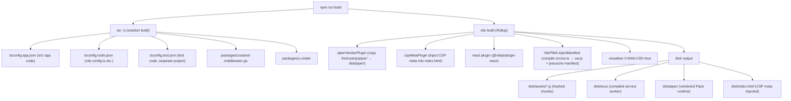
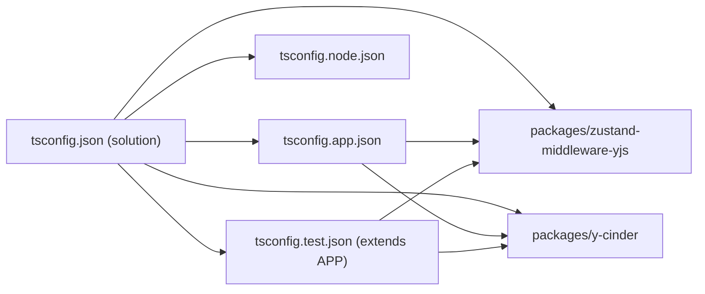
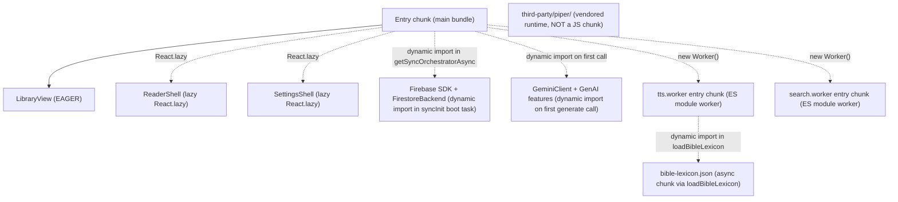
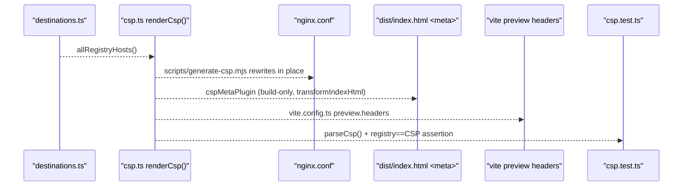
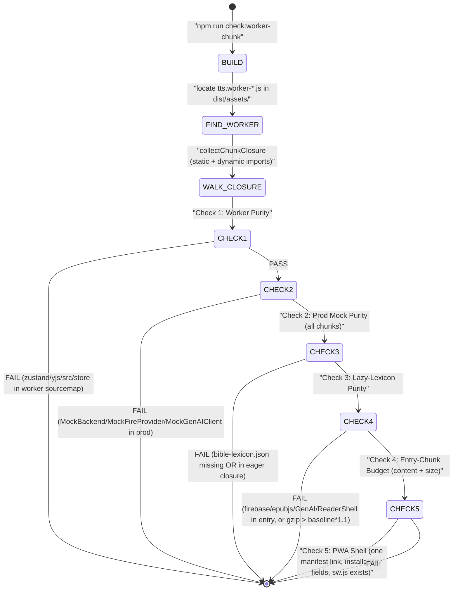
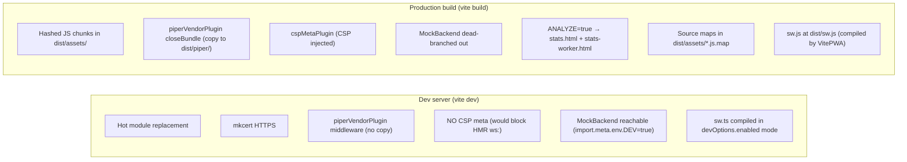

# Build & Bundling

Versicle is a local-first PWA + Capacitor app whose build pipeline is designed to answer one hard question: _how do you ship a full EPUB reader, a multi-provider TTS system, a Yjs CRDT layer, and a Firebase sync client without paying for all of them on every page load?_ The answer is aggressive code splitting combined with a battery of post-build artifact checks that prevent any of those heavy subsystems from creeping back into the entry chunk.

This document covers the Vite build configuration, the TypeScript project-reference build, vendored workspace packages, code-splitting and the chunk graph, the Piper vendor plugin, the CSP generation pipeline, and the suite of build-artifact purity checks that enforce bundle correctness as a CI invariant.

---

## Design intent

The primary goals, in priority order:

1. **Keep the entry chunk lean.** The library view is the boot surface. Firebase, epubjs, and GenAI are first-use imports; the entry chunk must not pay for them. The baseline is recorded in [`bundle-baseline.json`](../../bundle-baseline.json) and enforced ±10 % by the build gate.

2. **Keep the TTS worker stateless.** The TTS engine runs off-thread in an ES-module Web Worker. It must never bundle zustand, yjs, or any `src/store/` module — a second Y.Doc + IndexedDB persistence inside the worker is the data-corruption scenario the Phase 2 fork surgery was designed to prevent. This is checked on the emitted artifact, not just the source graph.

3. **Ship exactly one instance of yjs, zustand, lib0, and firebase.** The three vendored workspace packages (`packages/zustand-middleware-yjs`, `packages/y-idb`, `packages/y-cinder`) declare their shared runtime deps as peer dependencies precisely so npm structurally deduplicates them. Vite/vitest reinforce this with `resolve.dedupe`. A CI script asserts exactly one physical copy of each in the tree.

4. **Generate the CSP from the egress registry, not from hand-edits.** The four copies of the policy (nginx.conf, vite preview headers, the build-time `<meta>` injected into index.html, and the unit test assertion) are all derived from a single `renderCsp()` renderer backed by a typed destination registry.

5. **Never store dev-only code in the prod bundle.** `MockBackend`, `MockFireProvider`, and `MockGenAIClient` must be absent from every production chunk; the mock path is gated behind a build-time-dead `import.meta.env.DEV || VITE_E2E` branch, and the artifact check verifies this.

---

## Build pipeline overview



The `build` script in [`package.json`](../../package.json) is:

```json
"build": "tsc -b && vite build"
```

`tsc -b` runs the TypeScript solution build first (type-checking only; no emit, because `tsconfig.app.json` sets `"noEmit": true`). Vite then runs Rollup to emit the actual JS chunks.

---

## TypeScript project references

[`tsconfig.json`](../../tsconfig.json) is the solution file. It references:

| Config file | What it typechecks | Notes |
|---|---|---|
| [`tsconfig.app.json`](../../tsconfig.app.json) | `src/` (excluding tests) | Strict, `verbatimModuleSyntax: true`, `bundler` module resolution, `ES2022` target |
| [`tsconfig.node.json`](../../tsconfig.node.json) | `vite.config.ts`, `vitest.config.ts`, `scripts/capture-ydoc-fixture.ts` | `ES2023` target, `node` types |
| [`tsconfig.test.json`](../../tsconfig.test.json) | All `src/**/*.test.*` and `src/test/` harness (excluded by tsconfig.app.json) | Extends tsconfig.app.json, adds `vitest/globals` types |
| [`packages/zustand-middleware-yjs`](../../packages/zustand-middleware-yjs/package.json) | vendored fork | Referenced by app + test; consumed as TS source |
| [`packages/y-cinder`](../../packages/y-cinder/package.json) | vendored fork | Referenced by app + test; consumed as TS source |

The test config is a deliberate separate project: `tsconfig.app.json` excludes test files (`"exclude": ["src/**/*.test.ts", "src/**/*.test.tsx", ...]`) so the app compilation is never polluted with test-only globals. `tsconfig.test.json` overrides that exclusion to typecheck exactly those files. Both projects repeat the `references` list because `references` are not inherited through `extends`.

Key compiler options in `tsconfig.app.json`:

- `verbatimModuleSyntax: true` — every `import` that does not survive to runtime must be `import type`. This is the source-level enforcement that prevents a missing `type` keyword from pulling state-management code into the TTS worker bundle. The worker-chunk check verifies the _emitted artifact_ as a secondary belt-and-braces.
- `moduleResolution: "bundler"` — allows `.ts` extension imports and aligns with Vite's resolution semantics.
- `strict: true`, `noUnusedLocals: true`, `noUnusedParameters: true` — enforced across all production sources.
- `paths` — the path alias map; kept in sync with `resolve.alias` in both `vite.config.ts` and `vitest.config.ts` (the vitest config does not inherit from vite, so both files maintain a copy with an explicit comment).



---

## Vite configuration

[`vite.config.ts`](../../vite.config.ts) is the authoritative source for all build, dev-server, and plugin settings. Key sections follow.

### Path aliases

```typescript
const srcAlias = (dir: string) => fileURLToPath(new URL(`./src/${dir}`, import.meta.url))
const aliases = {
  '@app': srcAlias('app'),
  '@components': srcAlias('components'),
  '@data': srcAlias('data'),
  '@domains': srcAlias('domains'),
  '@hooks': srcAlias('hooks'),
  '@kernel': srcAlias('kernel'),
  '@lib': srcAlias('lib'),
  '@store': srcAlias('store'),
  '~types': srcAlias('types'),
  '@test': srcAlias('test'),
  '@workers': srcAlias('workers'),
}
```

These aliases were introduced in Phase 1 by a repo-wide codemod (1,069 imports rewritten). They are enforced by ESLint's `no-restricted-imports` rule. Note `~types` instead of `@types` — TypeScript hard-rejects `@types/...` specifiers (TS6137, reserved for declaration packages), so the one root that cannot follow the `@` convention uses a tilde prefix.

The aliases apply equally to the main bundle, to the ES-module worker bundles (Vite propagates `resolve.alias` to worker builds), and to the service worker (compiled by VitePWA with the same aliases injected).

### Deduplication guard

```typescript
resolve: {
  alias: aliases,
  dedupe: ['yjs', 'zustand'],
},
```

`resolve.dedupe` is the bundler-level enforcement that Rollup can only ever see one physical instance of `yjs` and `zustand`. This is documented as the "belt-and-braces" on top of the peer-dependency structure in the vendored forks. The same option is copied into `vitest.config.ts`.

### Worker format

```typescript
worker: {
  format: 'es',
  plugins: () => (analyze
    ? [visualizer({ filename: 'stats-worker.html', gzipSize: true, brotliSize: true })]
    : []),
},
```

ES-module workers are required because the TTS engine is a large, code-split module graph. The default `'iife'` format would reject code-splitting. Workers are loaded with `{ type: 'module' }` in the caller, matching this format.

### Build sourcemaps

```typescript
build: {
  sourcemap: true,
},
```

Source maps are always enabled in the production build. The post-build artifact checks (`scripts/check-worker-chunk.mjs`) depend on sourcemaps to correlate chunk bytes back to original source files. Disabling sourcemaps would break the purity checks.

### ANALYZE mode

```typescript
const analyze = env.ANALYZE === 'true';
```

`ANALYZE=true vite build` activates `rollup-plugin-visualizer` twice:

- `stats.html` — per-module treemap for the main bundle
- `stats-worker.html` — per-module treemap for the TTS worker bundle

Both files write gzip _and_ brotli sizes. This is the spelunking tool referenced in error messages from the build gate: "inspect with `ANALYZE=true vite build` → stats.html."

### Dev server

The dev server configures an HTTPS proxy for Firebase Auth:

```typescript
server: {
  proxy: {
    '/__/auth': {
      target: `https://${env.VITE_FIREBASE_AUTH_DOMAIN}`,
      changeOrigin: true,
      configure: (proxy) => {
        proxy.on('proxyRes', (proxyRes) => {
          // Manually strip the Domain attribute to allow cookies on localhost
          const cookies = proxyRes.headers['set-cookie'];
          if (cookies && Array.isArray(cookies)) {
            proxyRes.headers['set-cookie'] = cookies.map((cookie) =>
              cookie.replace(/Domain=[^;]+;/gi, '')
            );
          }
        });
      },
    },
  },
},
```

The cookie-domain stripping is required because the Firebase auth popup sets cookies with a production domain that the browser would reject on `localhost`. Nginx mirrors this proxy in production (`nginx.conf`, `/__/auth/` block).

HTTPS is enabled by default via `vite-plugin-mkcert` (a locally-trusted certificate). It can be disabled with `VITE_HTTPS=false`.

---

## Code splitting and chunk graph

The Phase 8 code splitting moved the heaviest subsystems behind `React.lazy` and dynamic imports, keeping the entry chunk lean. The current split is:



Solid arrows are static (eager) imports; dashed arrows are dynamic (lazy) imports that produce separate async chunks.

### Route-level code splitting

[`src/app/routes.tsx`](../../src/app/routes.tsx) defines the route tree:

| Route | Component | Loading | Reason |
|---|---|---|---|
| `/` | `LibraryView` | Eager | The boot surface; must render without any dynamic import |
| `/notes` | `LibraryView` with notes context | Eager | Same component, different prop |
| `/read/:id` | `ReaderShellLazy` | `React.lazy` | epubjs (including its Book/Rendition/view managers) only loads when the user opens a book |
| `/settings/:tab?` | `SettingsShellLazy` | `React.lazy` | Settings panel content loads on first navigation |

```typescript
const ReaderShellLazy = lazy(() =>
  import('@components/reader/ReaderShell').then((m) => ({ default: m.ReaderShell })),
);
const SettingsShellLazy = lazy(() =>
  import('./settings/SettingsShell').then((m) => ({ default: m.SettingsShell })),
);
```

The `epubjs` content assertion in the build gate (`ENTRY_FORBIDDEN` in `check-worker-chunk.mjs`) verifies that `epubjs/src/epub.js`, `epubjs/src/book.js`, `epubjs/src/rendition.js`, and `epubjs/src/managers/` never appear in the entry chunk's static closure. Note that the kernel CFI shim (`src/kernel/cfi/epubcfiShim.ts`) is _sanctioned_ to import `epubjs/src/epubcfi` (a lean sub-module: just `epubcfi.js` + `utils/core.js`), so the assertions name the full-engine entry points rather than the entire package prefix.

### Firebase split

[`src/app/sync/createSync.ts`](../../src/app/sync/createSync.ts) is the sync composition root. It is split into two halves:

- **`createSync.ts`** (light half) — holds state, gates, public accessors, and the `getSyncOrchestratorAsync` function. Zero firebase in its static import graph.
- **`composeSync.ts`** (heavy half) — contains the orchestrator construction, `FirestoreBackend`, and the firebase SDK imports. Only reachable through a dynamic import inside `getSyncOrchestratorAsync`, which the `syncInit` boot task calls.

The dynamic import is inside a branch that is statically dead in production builds:

```typescript
if (import.meta.env.DEV || isMockFirestoreEnabled()) {
  // Dynamic import of MockBackend — Rollup dead-branches this in prod
  ...
} else {
  // Dynamic import of composeSync (Firebase chunk)
  const { composeSyncOrchestrator } = await import('./composeSync');
  ...
}
```

### Bible lexicon split

The Bible pronunciation lexicon (`src/lib/tts/bible-lexicon.json`, ~85 KB) was historically a 2,899-line TypeScript data module sitting eagerly in the entry graph. Phase 5c converted it to lazy JSON loaded through a dynamic import in `src/lib/tts/bible-lexicon.ts` (`loadBibleLexicon`). It must exist as an async chunk and must NOT be inlined into the main entry chunk or the TTS worker's static closure. Check 3 of the build gate verifies this using a data marker (the Chinese string "約翰三書" that only appears in the Bible lexicon).

### TTS worker and search worker

Both workers are ES-module workers registered at runtime:

- `src/workers/tts.worker.ts` — exposes `new WorkerTtsEngine()` over Comlink
- `src/workers/search.worker.ts` — exposes `new SearchEngine()` over Comlink

Vite identifies these as worker entry points because their consumer code uses the `new Worker(new URL(..., import.meta.url), { type: 'module' })` pattern. Each gets its own Rollup output graph, producing `dist/assets/tts.worker-*.js` and the search worker equivalent.

---

## Vendored workspace packages

Three packages are vendored as npm workspaces under `packages/`:

| Package | Origin | Purpose |
|---|---|---|
| [`packages/zustand-middleware-yjs`](../../packages/zustand-middleware-yjs/package.json) | Fork of `vrwarp/zustand-middleware-yjs` | Zustand middleware for Yjs sync; declares `yjs`/`zustand` as peer deps |
| [`packages/y-idb`](../../packages/y-idb/package.json) | Fork of `vrwarp/y-idb` (upstream: y-indexeddb) | IndexedDB Yjs persistence; peer deps on `yjs`/`lib0` |
| [`packages/y-cinder`](../../packages/y-cinder/package.json) | Fork of `vrwarp/y-cinder` (upstream: y-fire) | Firestore Yjs provider; peer deps on `firebase`/`yjs`/`lib0` |

All three are `"private": true` in their `package.json` and are excluded from the license gate's npm scan (they are covered by `third-party/inventory.json` entries instead).

The packages were vendored to replace floating `github:vrwarp/*#branch` references with source-in-repo paths, eliminating the risk that a CI run using `npm install` (rather than `npm ci`) would re-resolve to a different commit. With vendoring, the fork source is pinned in the working tree.

**Peer dependency structure:** Each vendored fork declares its shared runtime dependencies as `peerDependencies`. This means npm structurally resolves exactly one copy of `yjs`, `zustand`, etc. at the repo root — a second nested copy can never be installed. The `assert-single-instance.cjs` CI script verifies this invariant by querying `npm query '#<name>'` for each critical singleton.

---

## Piper vendor plugin

The Piper TTS runtime (ONNX runtime WASM, phonemizer WASM, patched worker) is committed as source in `third-party/piper/` and served outside Vite's module graph. The inline `piperVendorPlugin()` in `vite.config.ts` handles this:

```typescript
function piperVendorPlugin(): Plugin {
  const vendorRoot = fileURLToPath(new URL('./third-party/piper', import.meta.url))
  // ...
  return {
    name: 'versicle:piper-vendor',
    configureServer(server) {
      server.middlewares.use(middleware)  // dev: serve /piper/** from vendor dir
    },
    configurePreviewServer(server) {
      server.middlewares.use(middleware)  // vite preview: same
    },
    closeBundle() {
      copyDir(vendorRoot, path.join(outDir, 'piper'))  // build: copy to dist/piper/
    },
  }
}
```

The middleware strips any `?` query suffix from the URL and path-normalizes to prevent directory traversal. Content types are served explicitly (`.wasm` → `application/wasm`, `.js` → `text/javascript`, etc.). The copy in `closeBundle()` runs once per Rollup build (there are two invocations: main + worker), but `copyDir` is idempotent so the double-run is harmless.

The runtime URL layout is `/piper/piper_worker.js`, `/piper/onnxruntime/ort.min.js`, etc. — unchanged from the previous install-time pipeline, so existing user caches survive the migration. The ONNX wasm files (`/piper/onnxruntime/*.wasm`, ~10 MB each) are excluded from the SW precache via `globIgnores: ['**/piper/onnxruntime/*.wasm']` in the VitePWA config; they are covered instead by the `/piper/*` CacheFirst route in `src/sw.ts`.

`third-party/piper/PROVENANCE.md` documents SHA-256 hashes of the upstream artifacts and a full patch list for `piper_worker.js`. This file is the GPL §6 provenance record for the shipped blobs and is included in the copy to `dist/piper/`.

---

## CSP generation pipeline

The Content Security Policy is generated from a typed egress destination registry ([`src/kernel/net/destinations.ts`](../../src/kernel/net/destinations.ts)) rather than hand-maintained strings. This was introduced in Phase 7 §I to replace four hand-maintained CSP copies that had drifted from each other.

### The registry

`EGRESS_DESTINATIONS` is a typed array of `EgressDestination` objects, each with:
- `id` — stable `DestinationId` union (`'gemini' | 'google-tts' | 'openai-tts' | ...`)
- `hosts` — exact hostnames or `*.suffix` wildcards
- `via` — `'gateway'` (routed through `NetworkGateway.egress()`) or `'sdk'` (SDK owns the HTTP, hosts still feed the CSP)
- `dataClass`, `consent`, `timeoutMs`, `offline` — privacy and operational metadata

The registry is **import-free** (no path aliases, no internal imports). This is a load-bearing constraint: `scripts/generate-csp.mjs` imports this file directly under Node's type stripping, and `vite.config.ts` imports it at build startup — both need it to run without a build step.

### The renderer

[`src/kernel/net/csp.ts`](../../src/kernel/net/csp.ts) exports `renderCsp()`, which assembles the full policy string:

```typescript
export function renderCsp(): string {
  const directives: (readonly [string, string])[] = [
    ...STATIC_DIRECTIVES,     // default-src, script-src, style-src, img-src, font-src
    ['connect-src', connectSrcSources().join(' ')],  // derived from allRegistryHosts()
  ];
  return directives.map(([name, value]) => `${name} ${value}`).join('; ') + ';';
}
```

`connect-src` includes `'self'`, `blob:`, and `https://<host>` for every host in the registry (sorted for stability). The legacy `https:` scheme wildcard was removed at the Phase 8 §H strict flip: from that point, the registry is _enforced_ — only enumerated hosts can be contacted.

### Delivery to all four copies



- **`nginx.conf`** — written by `npm run generate:csp` (`scripts/generate-csp.mjs`). The `--check` flag exits 1 if the file is stale. The `csp.test.ts` unit test also parses the committed nginx.conf and asserts it matches `renderCsp()` on every vitest run.
- **`dist/index.html` `<meta>`** — injected by `cspMetaPlugin()` at build time only. The meta tag is what gives the Capacitor Android WebView a CSP (it serves `dist/` directly without nginx). It is NOT in the committed `index.html` source because the dev server needs the HMR websocket (`ws:`) which a committed meta would block.
- **Vite preview** — `vite.config.ts` `preview.headers` uses `renderCsp()` directly.

---

## Build artifact purity checks

[`scripts/check-worker-chunk.mjs`](../../scripts/check-worker-chunk.mjs) is a post-build script that asserts five properties of the emitted `dist/` artifacts. It is run as `npm run check:worker-chunk` and blocks CI on failure.



### Check 1: Worker purity

Pattern: find all chunks in the TTS worker's static + dynamic import closure (identified by the `tts.worker-*.js` filename pattern), read their sourcemaps, and fail if any `sources` entry contains:

| Forbidden pattern | Label |
|---|---|
| `node_modules/zustand` | zustand (incl. zustand-middleware-yjs) |
| `node_modules/yjs/` | yjs |
| `src/store/` | src/store |
| `packages/zustand-middleware-yjs/` | zustand-middleware-yjs (vendored) |
| `packages/y-idb/` | y-idb (vendored) |

This is the artifact-level ground truth that overrides any source-level analysis. The source guards (`import type` discipline, `@typescript-eslint/consistent-type-imports` at error, dependency-cruiser `worker-no-state-typegraph` rule) can be bypassed by a missing `type` keyword when `verbatimModuleSyntax` is on; the artifact check cannot be bypassed.

The closure walk uses a regex over the emitted chunk source to find both `from "..."` and `import(...)` relative paths, traversing both static and dynamic edges. For size-ratchet purposes (Check 4), a separate `collectStaticClosure()` that neutralizes dynamic imports is used to exclude async chunks from the entry budget.

### Check 2: Prod mock purity

Every `.js` file in `dist/assets/` is scanned (not just the worker closure). Forbidden patterns:

- `src/domains/sync/backend/MockBackend`
- `src/domains/sync/backend/MockFireProvider`
- `src/domains/google/genai/MockGenAIClient`

These are reachable only through a `DEV || VITE_E2E` branch that Rollup dead-codes out of production builds. This check is "the GATE that the dead branch actually got eliminated (Rollup inlining surprises — risk R7 — fail here, not in the field)."

### Check 3: Lazy-lexicon purity

The Bible lexicon is detected by a data marker (Unicode codepoints for "約翰三書", the Chinese name for 3 John) rather than by sourcemap, because JSON chunks carry no `sources`. The check verifies:
1. At least one chunk contains the marker (the lexicon was emitted somewhere).
2. None of those chunks appear in the static import closure of the entry chunk or the worker entry chunks (it is not eagerly bundled).

### Check 4: Entry-chunk budget

Two sub-checks:

**4a. Content assertion.** The entry chunk's _static_ import closure must not contain:

| Forbidden pattern | Label |
|---|---|
| `node_modules/firebase/` | firebase |
| `node_modules/@firebase/` | @firebase |
| `packages/y-cinder/` | y-cinder (vendored sync provider) |
| `node_modules/epubjs/src/epub.js` | epubjs engine entry |
| `node_modules/epubjs/src/book.js` | epubjs Book |
| `node_modules/epubjs/src/rendition.js` | epubjs Rendition |
| `node_modules/epubjs/src/managers/` | epubjs view managers |
| `src/domains/sync/backend/FirestoreBackend` | FirestoreBackend |
| `src/app/sync/composeSync` | sync composition heavy half |
| `src/domains/google/genai/GeminiClient` | GeminiClient |
| `src/domains/google/genai/features/` | GenAI feature modules |
| `src/components/reader/ReaderShell` | ReaderShell (reader surface) |

**4b. Size ratchet.** The total gzip size of all entry-closure chunks is computed and compared against [`bundle-baseline.json`](../../bundle-baseline.json):

```json
{ "entryGzipBytes": 441686 }
```

The limit is `baseline * 1.1` (10 % headroom). If the entry grows past that, the check fails. To intentionally grow the entry (rare), regenerate the baseline with `--update-entry-baseline` and justify the growth in the PR.

### Check 5: PWA shell

Verifies the locally-checkable installability invariants:
1. `dist/index.html` links exactly one `<link rel="manifest">`.
2. The manifest file exists and contains all required installability fields: `id`, `start_url`, `scope`, `display`, `lang`, `dir`, `name`, `short_name`, icons at `192x192` and `512x512`.
3. `dist/sw.js` exists (the service worker was emitted).

The interactive halves (offline smoke test, two-build update-prompt journey) run in the Docker/nightly Playwright lane.

---

## Single-instance assertion

[`scripts/assert-single-instance.cjs`](../../scripts/assert-single-instance.cjs) is a separate CI check (`npm run check:single-instance`) that verifies npm's physical install tree has exactly one copy of each singleton:

```javascript
const TARGETS = [
  'yjs',
  'zustand',
  'lib0',
  'firebase',
  '@firebase/app',
  '@firebase/firestore',
  '@firebase/storage',
];
```

The check uses `npm query '#<name>'` (returns one node per physical directory) rather than `npm ls --json` (whose deduped peer-link entries have no stable identity to count). A second physical `yjs` breaks every `instanceof Y.Map` branch in the CRDT middleware and produces silent sync corruption; a second `@firebase/app` splits the y-cinder Firestore handle from the app's auth session.

---

## The vitest configuration

[`vitest.config.ts`](../../vitest.config.ts) is the single vitest configuration. The `test` block inside `vite.config.ts` is intentionally absent from the vitest config: when a root `vitest.config.ts` exists, vitest ignores the `test` field of `vite.config.ts` entirely. This was a documented prior failure: the `.claude` worktree excludes were once added to the dead block in `vite.config.ts` and never took effect.

Key vitest settings:

| Setting | Value | Reason |
|---|---|---|
| `environment` | `'jsdom'` | DOM APIs for component tests |
| `globals` | `true` | `describe`/`it`/`expect` without imports; matched by `tsconfig.test.json`'s `"types": ["vitest/globals"]` |
| `setupFiles` | `'./src/test/setup.ts'` | `@testing-library/jest-dom` matchers, fake-indexeddb, etc. |
| `testTimeout` | `60000` | Long timeout for indexeddb + emulator tests |
| `include` | `src/**/*.{test,spec}.*`, `packages/*/{src,test}/**/*.{test,spec}.*` | Covers both app tests and vendored-fork contract suites |
| `exclude` | default + `'verification/**'`, `'.claude/**'`, `'**/.claude/**'` | Prevent Playwright suite and agent worktrees from being discovered |

The `virtual:pwa-register/react` alias is also defined here (pointing at a typed inert stub), because the real virtual module only exists inside a Vite build with vite-plugin-pwa active.

The coverage config collects from all `src/**/*.{ts,tsx}` files (not just those imported by a test) to keep the denominator stable — deleting a test cannot inflate coverage percentages.

---

## VitePWA and service worker compilation

The service worker ([`src/sw.ts`](../../src/sw.ts)) is compiled by VitePWA using `strategies: 'injectManifest'`. This means Versicle provides the SW source; VitePWA injects the precache manifest (`self.__WB_MANIFEST`) into the compiled output.

```typescript
VitePWA({
  strategies: 'injectManifest',
  srcDir: 'src',
  filename: 'sw.ts',
  registerType: 'prompt',       // Phase 8 §G: user must accept the update toast
  injectManifest: {
    maximumFileSizeToCacheInBytes: 4 * 1024 * 1024,  // 4 MB
    globIgnores: ['**/piper/onnxruntime/*.wasm'],      // ~10 MB WASM excluded
  },
  includeAssets: ['favicon.ico', 'apple-touch-icon.png'],
  manifest: {
    id: '/',
    start_url: '/',
    scope: '/',
    display: 'standalone',
    lang: 'en',
    dir: 'ltr',
    name: 'Versicle Reader',
    short_name: 'Versicle',
    // ... icons at 192x192 and 512x512
  }
})
```

`registerType: 'prompt'` means the service worker does NOT auto-skipWaiting. The update flow requires the user to accept the in-app update toast (`src/components/SWUpdatePrompt.tsx` → `updateServiceWorker()` → posts `SKIP_WAITING` to the waiting worker). The service worker's `message` listener handles it:

```typescript
self.addEventListener('message', (event) => {
  if (event.data && event.data.type === 'SKIP_WAITING') {
    void self.skipWaiting()
  }
})
```

`clientsClaim()` stays because on first install the fresh SW must take control of the already-open page without a reload (covers are served through the SW's fetch handler; an uncontrolled first session would show no covers).

The SW also registers Workbox runtime caching routes for assets beyond the precache budget:

| Route | Strategy | Cache name |
|---|---|---|
| `/dict/*` | CacheFirst (maxEntries 4) | `versicle-dict-assets` |
| `/fonts/*` | CacheFirst | `versicle-font-assets` |
| `/piper/*` (excluding WASM) | CacheFirst | `versicle-piper-assets` |

---

## Dev vs production build differences



The `apply: 'build'` constraint on `cspMetaPlugin` is the gate: it only runs during production builds, not dev. The mock backend guard is a build-time constant: `import.meta.env.DEV` evaluates to `false` and `VITE_E2E` is undefined in prod builds, so Rollup statically eliminates the MockBackend import.

---

## npm scripts reference

| Script | Command | Purpose |
|---|---|---|
| `dev` | `vite` | Dev server with HMR and HTTPS |
| `build` | `tsc -b && vite build` | Full production build |
| `preview` | `vite preview` | Serve `dist/` with preview CSP headers |
| `check:worker-chunk` | `node scripts/check-worker-chunk.mjs` | Full production build + 5 artifact checks |
| `check:single-instance` | `node scripts/assert-single-instance.cjs` | Verify single physical copy of yjs/zustand/etc. |
| `generate:csp` | `node scripts/generate-csp.mjs` | Rewrite nginx.conf from the registry |
| `generate:csp:check` | `node scripts/generate-csp.mjs --check` | Exit 1 if nginx.conf is stale |
| `depcruise` | `depcruise src --config .dependency-cruiser.cjs` | Run boundary checks |
| `depcruise:check` | `node scripts/depcruise-baseline.mjs --check` | CI gate: violation counts must not increase |
| `lintdebt:check` | `node scripts/lint-debt-ratchet.mjs --check` | CI gate: `as any` and eslint-disable counts must not increase |
| `licenses:check` | `node scripts/license-gate.mjs` | CI gate: no forbidden licenses in prod deps |
| `licenses:generate` | `node scripts/generate-third-party-notices.mjs` | Regenerate THIRD-PARTY-NOTICES.md |
| `knip` | `knip` | Dead-export / unused-file detection |
| `lint` | `eslint .` | ESLint flat config |
| `test` / `tests` | `vitest run` | All unit tests (vitest.config.ts) |
| `coverage` | `vitest run --coverage` | Tests + v8 coverage |
| `docs:generate` | `REGEN_DOCS=1 vitest run ...` | Regenerate architecture.md + store registry README from live code |
| `postinstall` | `patch-package` | Apply `patches/@capgo+capacitor-social-login+7.20.0.patch` |

---

## Lint debt and coverage ratchets

Two "ratchet" scripts enforce that the codebase only improves over time:

**`scripts/lint-debt-ratchet.mjs`** counts `as any` / `: any` occurrences and `eslint-disable` directives in all production source files (`src/**/*.{ts,tsx}` minus tests), then compares against `lint-debt-allowlist.json`. Both over-count and under-count are failures: a decrease locks in the improvement; an undocumented increase blocks the PR. The Phase 0 baseline was 138 `as any` sites and 245 disables; at Phase 9 close these stand at 20 and 25 respectively, each entry justified in the allowlist.

**`scripts/depcruise-baseline.mjs`** runs dependency-cruiser and compares violation counts per rule against `.dependency-cruiser-baseline.json`. Rules are severity "warn" while violations exist; a rule can only be flipped to severity "error" once its baseline count reaches 0. At Phase 9 close, two rules remain in the baseline: `lib-not-to-store` (19) and `worker-no-state-typegraph` (16).

**`coverage-baseline.json`** (separate file) pins the v8 coverage floor. Running `npm run coverage` produces coverage totals; they must not fall below the pinned floor. The baseline is re-pinned whenever coverage genuinely improves.

---

## Dependency management and overrides

The root `package.json` sets `"engines": { "node": ">=25 <26" }`. The `npm overrides` field enforces security fixes on transitive dependencies:

```json
"overrides": {
  "@jofr/capacitor-media-session": {
    "@capacitor/core": "^7.0.0"
  },
  "brace-expansion@1": "^1.1.13",
  "epubjs": {
    "@xmldom/xmldom": "^0.8.13"
  }
}
```

- `brace-expansion@1` — security pin (CVE)
- `epubjs` → `@xmldom/xmldom@^0.8.13` — security override; epubjs is unmaintained upstream and uses a vulnerable xmldom version

The `patch-package` postinstall applies `patches/@capgo+capacitor-social-login+7.20.0.patch`, which adds `login_hint` passthrough to the Google OAuth ESM dist. This is the only remaining `patches/` entry; the Piper worker patching was eliminated when `third-party/piper/` became the committed source.

---

## Related documents

- [Architecture overview](10-architecture-overview.md) — how the bundle boundaries map to architectural layers
- [PWA and service worker](61-pwa-and-service-worker.md) — runtime caching routes, update flow, SW boot gate in depth
- [Capacitor native](62-capacitor-native.md) — how `dist/` is served in the Android WebView and why the CSP meta tag matters there
- [Testing strategy](63-testing-strategy.md) — vitest configuration, test project layout, coverage ratchet
- [CI and quality gates](65-ci-and-quality-gates.md) — which scripts run in CI and their failure modes
- [State management / CRDT](13-state-management-crdt.md) — why single-instance enforcement for yjs/zustand is a data-integrity requirement, not just a hygiene concern
- [TTS app integration](51-tts-app-integration.md) — how the TTS worker is instantiated and why it must be store-free
- [Security and privacy](70-security-and-privacy.md) — the egress destination registry, NetworkGateway, and the CSP strict flip in depth
- [Vendored forks](66-vendored-forks.md) — provenance, patch list, and upgrade policy for each workspace package
