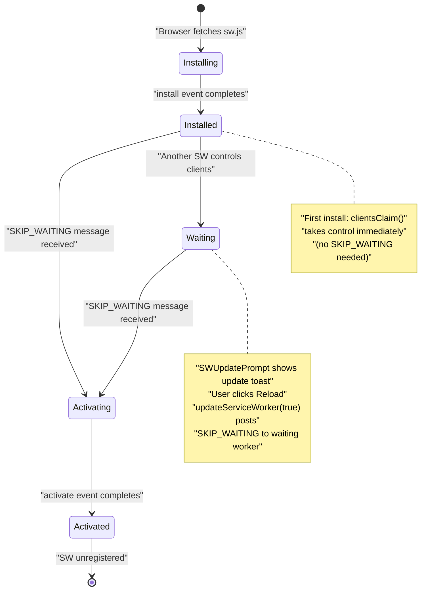
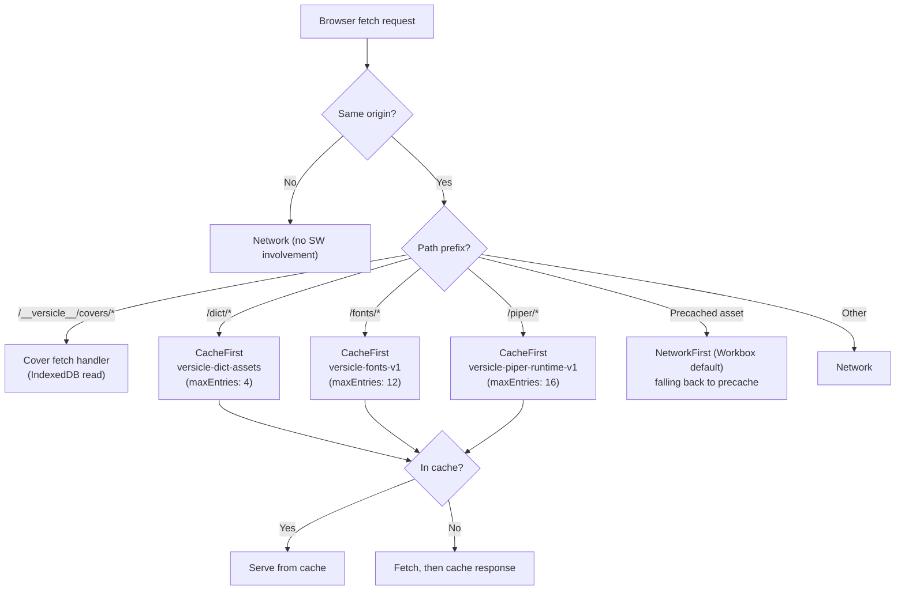
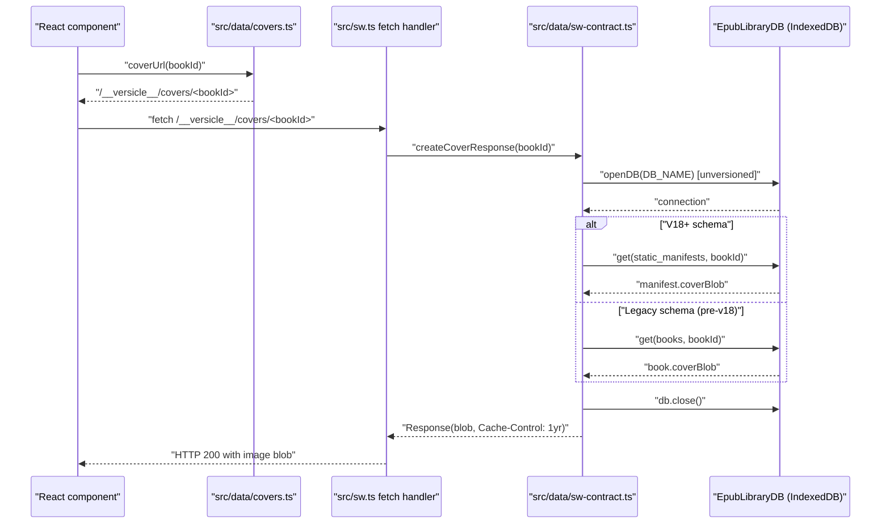
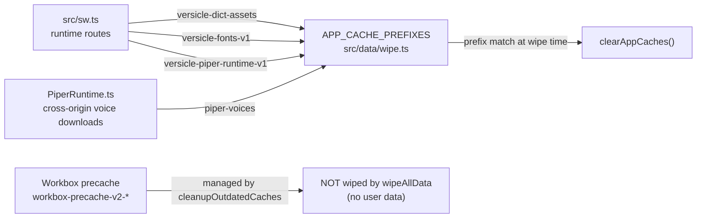
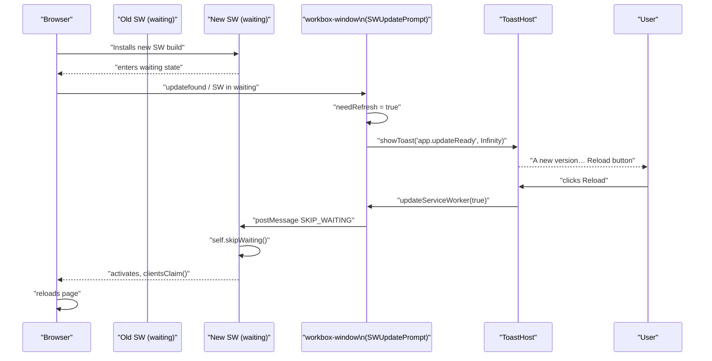
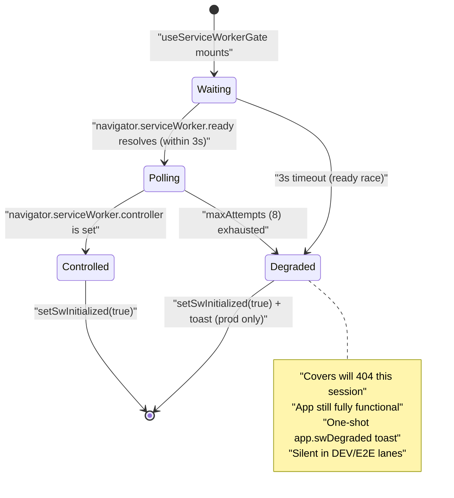
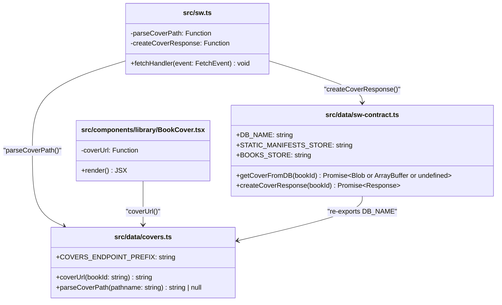
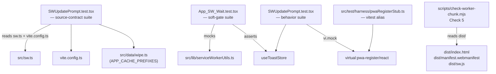

# PWA & Service Worker

Versicle is distributed as a Progressive Web App (PWA). A service worker sits
between the browser and the network, serving the application shell from a
precache, runtime-caching large static assets, and intercepting the
`/__versicle__/covers/` virtual endpoint to serve cover images straight out
of IndexedDB — all without any external CDN dependency at runtime.

This document covers the full PWA stack from build configuration through
runtime behavior: how `vite-plugin-pwa` compiles [`src/sw.ts`](../../src/sw.ts)
with Workbox, what each cache strategy covers and why, how the prompt-style
update flow was designed (the riskiest transition in Phase 8), how the boot
gate guards cover rendering, and how the wipe subsystem cleans up caches on a
full data reset. Cross-links into related areas: [Build & bundling](60-build-and-bundling.md),
[Bootstrap & lifecycle](14-bootstrap-and-lifecycle.md),
[Storage gateway](20-storage-gateway.md), and
[Architecture overview](10-architecture-overview.md).

---

## Why a service worker?

The core product requirement is **local-first**: a user's EPUB library, reading
progress, annotations, and TTS audio queue must survive complete loss of
network connectivity. A service worker is the only browser primitive that
intercepts `fetch` events on behalf of a page; without one there is no way to
serve cached assets offline.

There is a second, lower-profile reason: **cover images**. Covers are large
blobs stored in IndexedDB under the `static_manifests` store. Browsers cannot
render an `` that resolves to an IndexedDB read. The traditional
workaround — `URL.createObjectURL(blob)` — leaks memory (every created object
URL must be revoked), requires the calling component to hold the blob in JS
memory, and does not survive page reloads. The service worker solves this by
intercepting requests to a synthetic same-origin path
(`/__versicle__/covers/<bookId>`) and responding with the blob read directly
from IDB. The virtual URL is stable, cacheable by `Cache-Control` headers, and
requires zero JS memory outside the fetch handler.

The design therefore has two non-negotiable SW duties:

1. **Serve the app shell offline** via Workbox precaching.
2. **Serve book covers** by bridging the synthetic URL to IndexedDB.

Everything else — runtime caching of fonts, the Chinese dictionary, and the
Piper TTS runtime — is additive, but was delivered in the same Phase 8 build
(§G of [`plan/overhaul/prep/phase8-shell-pwa.md`](../../plan/overhaul/prep/phase8-shell-pwa.md)).

---

## Build configuration: `vite-plugin-pwa` with `injectManifest`

The PWA build is configured in [`vite.config.ts`](../../vite.config.ts) via the
`VitePWA` plugin. The critical strategic choice is `strategies: 'injectManifest'`
rather than `generateSW`:

```ts
VitePWA({
  devOptions: { enabled: true, type: 'module' },
  strategies: 'injectManifest',
  srcDir: 'src',
  filename: 'sw.ts',
  registerType: 'prompt',
  injectManifest: {
    maximumFileSizeToCacheInBytes: 4 * 1024 * 1024, // 4 MB
    globIgnores: ['**/piper/onnxruntime/*.wasm'],
  },
  includeAssets: ['favicon.ico', 'apple-touch-icon.png'],
  manifest: { ... },
})
```

### Why `injectManifest`?

`injectManifest` compiles [`src/sw.ts`](../../src/sw.ts) as a TypeScript Vite module
and injects the Workbox precache manifest into the `self.__WB_MANIFEST` token.
This gives full control over caching strategy code — the cover fetch handler,
the runtime cache routes, and the prompt update listener all require hand-written
logic that `generateSW` (a configuration-driven approach) cannot express.

The plugin resolves the `@data/sw-contract` and `@data/covers` path aliases
inside the SW bundle because Vite's `resolve.alias` is applied to the SW build
as well (noted in [`vite.config.ts`](../../vite.config.ts) line comment: "Vite applies
`resolve.alias` to worker bundles… and the vite-plugin-pwa sw.ts build").

### The 4 MB precache cap and `globIgnores`

The default Workbox precache picks up all build outputs. Two categories are
explicitly excluded:

| Excluded | Reason | Alternative |
|---|---|---|
| `**/piper/onnxruntime/*.wasm` | ~10 MB each — far beyond any sane precache budget | `CacheFirst` runtime route at `/piper/*` |
| Dictionary JSON (`/dict/cedict.json`) | ~15 MB — over the 4 MB cap even if globbed | `CacheFirst` runtime route at `/dict/*` |

Everything under `maximumFileSizeToCacheInBytes: 4194304` (4 MB) that matches
`**/*.{js,css,html}` is precached. This covers the entire application shell —
all route chunks, CSS, and `index.html` — so the app opens offline from the
second visit.

### Manifest fields

The web app manifest embedded in the plugin configuration satisfies the
Lighthouse PWA installability checklist:

```json
{
  "id": "/",
  "start_url": "/",
  "scope": "/",
  "display": "standalone",
  "lang": "en",
  "dir": "ltr",
  "name": "Versicle Reader",
  "short_name": "Versicle",
  "description": "Local-first EPUB reader and manager.",
  "theme_color": "#ffffff",
  "background_color": "#ffffff",
  "icons": [
    { "src": "pwa-192x192.png", "sizes": "192x192", "type": "image/png" },
    { "src": "pwa-512x512.png", "sizes": "512x512", "type": "image/png" }
  ]
}
```

The `id` field pins app identity across `start_url` changes. `lang` and `dir`
feed the OS shell. `mask-icon.svg` was intentionally omitted from `includeAssets`
— no such asset exists in `public/` and a Safari pinned-tab monochrome SVG
cannot be mechanically derived from the raster logo (Phase 8 RC-11 deviation,
recorded in the phase doc follow-ups).

### Build-time CI check (Check 5)

[`scripts/check-worker-chunk.mjs`](../../scripts/check-worker-chunk.mjs) runs Check 5
after every production build to verify the locally-testable half of Lighthouse
installability:

- Exactly **one** `<link rel="manifest">` in built `index.html`.
- Manifest carries: `id`, `start_url`, `scope`, `display`, `lang`, `dir`,
  `name`, `short_name`, 192×192 icon, 512×512 icon.
- `dist/sw.js` exists at the root scope.

The interactive halves — offline smoke test, two-build update-prompt journey —
require the Docker/nightly Playwright lane (cannot be run locally without a
server that swaps `dist/` mid-session).

---

## The service worker: `src/sw.ts`



### Lifecycle bootstrap calls

Two Workbox bootstrap calls run at module scope in [`src/sw.ts`](../../src/sw.ts):

```ts
cleanupOutdatedCaches()
clientsClaim()
precacheAndRoute(self.__WB_MANIFEST)
```

**`cleanupOutdatedCaches()`** removes stale Workbox-managed precache entries
from previous builds — specifically the `workbox-precache-v2-*` named caches
that the current version no longer manages. It touches only the Workbox
precache namespace, not the app's own runtime caches (`versicle-*` prefix) or
the Piper voice model cache (`piper-voices-v1`), so it is safe to call
unconditionally.

**`clientsClaim()`** causes the newly activated SW to take control of all
open pages immediately, without requiring those pages to reload. This is
critical for the cover-serving use case: on the very first install, the user
already has a page open. Without `clientsClaim()` that open page remains
"uncontrolled" — `navigator.serviceWorker.controller` is `null` — and the
fetch handler never fires, so cover images 404. The `useServiceWorkerGate`
hook (see [Boot gate section](#the-sw-boot-gate-useserviceworkergate)) polls
for a controller to become available precisely because of this race.

**`precacheAndRoute(self.__WB_MANIFEST)`** wires all precached assets into the
fetch routing so they are served from cache on offline requests.

### The prompt-style update listener

The old autoUpdate flow — `self.skipWaiting()` unconditionally in the `install`
event — has been replaced. The unconditional call is gone; in its place is a
`message` listener:

```ts
self.addEventListener('message', (event) => {
  if (event.data && event.data.type === 'SKIP_WAITING') {
    void self.skipWaiting()
  }
})
```

A new SW build now sits in the `waiting` state until `workbox-window` posts
`SKIP_WAITING`. That message is sent by `SWUpdatePrompt` via
`updateServiceWorker(true)`. The `SWUpdatePrompt.test.tsx` source-contract test
asserts that exactly one `self.skipWaiting()` call exists in the file's code
(comments stripped), that it is inside the `SKIP_WAITING` handler, and that
`vite.config.ts` carries `registerType: 'prompt'`. This prevents accidental
reversion to the old abrupt channel.

The transition from the previously deployed `autoUpdate` build is one-way safe:
the old SW still runs `skipWaiting()` unconditionally, so it activates the first
`prompt`-build immediately. Every subsequent update then goes through the user
prompt.

---

## Runtime cache strategies



All four `registerRoute` calls and the manual fetch handler in
[`src/sw.ts`](../../src/sw.ts) share a single invariant: **same-origin only**. Every
matcher checks `url.origin === self.location.origin`. This ensures that
Workbox never intercepts cross-origin requests such as the Hugging Face voice
model downloads (`hf-piper-models` egress destination) or Firebase calls.

### Dictionary assets: `versicle-dict-assets`

```ts
registerRoute(
  ({ url }) => url.origin === self.location.origin
    && url.pathname.startsWith('/dict/'),
  new CacheFirst({
    cacheName: 'versicle-dict-assets',
    plugins: [new ExpirationPlugin({ maxEntries: 4 })],
  }),
)
```

The CC-CEDICT compiled JSON (`/dict/cedict.json`, approximately 15 MB) far
exceeds the 4 MB precache budget. A single online fetch after the first
dictionary import caches it; all subsequent lookups — including offline sessions
— hit the cache. `maxEntries: 4` is an LRU upper bound (the dictionary is
effectively a single file, so this allows for future dictionary variants without
unbounded growth).

Note: the cache name `versicle-dict-assets` was kept from the name that
existed in the field before Phase 8, specifically to avoid orphaning existing
user caches. The Phase 8 plan sketched `versicle-dict-v1` but the deviation
was recorded (follow-ups in phase8-shell-pwa.md, §p8-pwa-and-close).

### Fonts: `versicle-fonts-v1`

```ts
registerRoute(
  ({ url }) => url.origin === self.location.origin
    && url.pathname.startsWith('/fonts/'),
  new CacheFirst({
    cacheName: 'versicle-fonts-v1',
    plugins: [new ExpirationPlugin({ maxEntries: 12 })],
  }),
)
```

The pinyin overlay TTFs ("Versicle Sans Narrow" — renamed from PT Sans Narrow
in Phase 8 §I to clear an OFL Reserved Font Name violation) live at
`/fonts/VersicleSansNarrow-Regular.ttf` and `VersicleSansNarrow-Bold.ttf`,
approximately 0.9 MB total. The route matches by path prefix so any future
font file is automatically included.

### Piper runtime: `versicle-piper-runtime-v1`

```ts
registerRoute(
  ({ url }) => url.origin === self.location.origin
    && url.pathname.startsWith('/piper/'),
  new CacheFirst({
    cacheName: 'versicle-piper-runtime-v1',
    plugins: [new ExpirationPlugin({ maxEntries: 16 })],
  }),
)
```

The vendored Piper runtime (in `third-party/piper/`, served at `/piper/**`
by the `piperVendorPlugin` in [`vite.config.ts`](../../vite.config.ts)) includes the
onnxruntime WASM builds (~10 MB each), `.data` phonemizer blobs, and the
`piper_worker.js` shim. The `.js` files are already covered by the precache;
this route catches the large binary assets that are excluded via `globIgnores`.

Important: Piper voice models downloaded from Hugging Face are cached by
`PiperRuntime` itself in a separate cache named `piper-voices-v1`. These are
cross-origin requests and will never match the same-origin `/piper/` route,
so there is no double-caching risk.

### Cover images: the IDB fetch handler

The fourth interception point is different in character — it is a manual
`addEventListener('fetch', ...)` handler, not a Workbox `registerRoute`:

```ts
self.addEventListener('fetch', (event) => {
  const url = new URL(event.request.url);
  if (url.origin === self.location.origin) {
    const bookId = parseCoverPath(url.pathname);
    if (bookId) {
      event.respondWith(createCoverResponse(bookId));
    }
  }
});
```

`parseCoverPath` comes from [`src/data/covers.ts`](../../src/data/covers.ts):

```ts
export const COVERS_ENDPOINT_PREFIX = '/__versicle__/covers/';

export function parseCoverPath(pathname: string): string | null {
  if (!pathname.startsWith(COVERS_ENDPOINT_PREFIX)) return null;
  const bookId = pathname.slice(COVERS_ENDPOINT_PREFIX.length);
  return bookId.length > 0 ? bookId : null;
}
```

The `createCoverResponse` function lives in
[`src/data/sw-contract.ts`](../../src/data/sw-contract.ts) and performs the
IndexedDB read (see [SW–IDB contract section](#the-sw-idb-contract-sw-contractts)
below).

---

## The SW–IDB contract: `sw-contract.ts`



### Why a separate IDB connection?

The service worker runs in its own JS context. It cannot share the `EpubLibraryDB`
connection that the main thread holds (`src/data/connection.ts`). The contract
module therefore opens its own short-lived connection:

```ts
const db = await openDB(DB_NAME); // opens at whatever version is current
```

The unversioned `openDB` call (no version argument) is deliberate. The SW must
**never** trigger or block a schema upgrade — upgrades are the main thread's
responsibility. An unversioned open returns the database at its current version
without going through `onupgradeneeded`. After the read, the connection is
closed in a `finally` block to avoid holding the connection open and blocking
any upgrade the main thread may be about to perform.

### Schema version fallback

The contract maintains backward compatibility through a legacy fallback:

```ts
// V18 Architecture
if (db.objectStoreNames.contains(STATIC_MANIFESTS_STORE)) {
  const manifest = await db.get(STATIC_MANIFESTS_STORE, bookId);
  return manifest?.coverBlob;
}

// Legacy Architecture (Fallback)
if (db.objectStoreNames.contains(BOOKS_STORE)) {
  const book = await db.get(BOOKS_STORE, bookId);
  return book?.coverBlob;
}
```

The `static_manifests` store exists in all V18+ databases (Phase 3 schema
baseline). A pre-v18 "straggler" database still has the old `books` store; the
SW reads from it so covers render before the user's first main-app upgrade.
This fallback survives until Phase 9.

### The `DB_NAME` single source of truth

The contract imports `DB_NAME` from [`src/data/schema.ts`](../../src/data/schema.ts)
(`'EpubLibraryDB'`) rather than re-declaring its own string constant. Before
Phase 3, a now-deleted `sw-utils.ts` file kept its own copy of the name and
could drift from the main schema. The import eliminates this category of bug.

### Cover URL stability and the no-encoding invariant

The `coverUrl` function in [`src/data/covers.ts`](../../src/data/covers.ts) does
**not** URL-encode the book id:

```ts
export function coverUrl(bookId: string): string {
  return `${COVERS_ENDPOINT_PREFIX}${bookId}`;
}
```

Book IDs are UUIDs (e.g. `3fa85f64-5717-4562-b3fc-2c963f66afa6`). UUIDs
contain only hex digits and hyphens — safe URL characters — so encoding is
harmless. The constraint is that `parseCoverPath` slices the pathname without
decoding; if encoding were applied here, the round-trip would break. This
no-encoding contract is documented in the function's JSDoc.

---

## Cache naming and the wipe contract



The `APP_CACHE_PREFIXES` array in [`src/data/wipe.ts`](../../src/data/wipe.ts)
enumerates every CacheStorage cache that contains app-owned data:

```ts
export const APP_CACHE_PREFIXES: readonly string[] = [
  'piper-voices',
  'versicle-dict-assets',
  'versicle-fonts',
  'versicle-piper-runtime',
];
```

The `clearAppCaches` function iterates `caches.keys()` and deletes any cache
whose name starts with one of these prefixes. This prefix-match design means
that versioned names like `versicle-fonts-v1` or `versicle-fonts-v2` are
automatically covered without updating the wipe code.

The Workbox precache (`workbox-precache-v2-*`) is intentionally **excluded** from
`APP_CACHE_PREFIXES`. It contains no user data — only hashed build assets — and
is managed by the SW lifecycle itself (`cleanupOutdatedCaches()` handles stale
precache cleanup). Deleting it from user data wipes would force a full re-download
of the application shell on the next load, which is unnecessary and
destructive.

The `SWUpdatePrompt.test.tsx` source-contract test enforces the wipe
enumeration:

```ts
it('every runtime cacheName in sw.ts is wipe-enumerated by prefix (@data/wipe)', () => {
  const names = [...swSource.matchAll(/cacheName:\s*'([^']+)'/g)].map((m) => m[1]);
  for (const name of names) {
    expect(
      APP_CACHE_PREFIXES.some((prefix) => name.startsWith(prefix)),
      `runtime cache '${name}' missing from APP_CACHE_PREFIXES`,
    ).toBe(true);
  }
});
```

Any future cache added to `sw.ts` without a corresponding prefix in `wipe.ts`
will cause this test to fail.

---

## The prompt-style update flow



### `SWUpdatePrompt`: the user-facing half

[`src/components/SWUpdatePrompt.tsx`](../../src/components/SWUpdatePrompt.tsx) is a
render-less component (returns `null`) that owns the connection to
`virtual:pwa-register/react`:

```ts
const {
  needRefresh: [needRefresh],
  updateServiceWorker,
} = useRegisterSW({
  onRegisterError(error: unknown) {
    logger.warn('Service worker registration failed:', error);
  },
});

useEffect(() => {
  if (!needRefresh) return;
  useToastStore.getState().showToast('app.updateReady', 'info', Infinity, {
    label: 'common.reload',
    onAction: () => { void updateServiceWorker(true); },
  });
}, [needRefresh, updateServiceWorker]);
```

Key design decisions:

**Duration `Infinity`** — the toast never auto-dismisses. An update notification
that disappears before the user sees it defeats the purpose. The user explicitly
chooses when (or whether) to reload.

**Keyed toast** — the toast message key `'app.updateReady'` deduplicates via
the toast queue store. Re-renders (or remounts) that re-fire the effect cannot
stack multiple identical toasts.

**Mounted above the router gate** — `SWUpdatePrompt` is placed in
[`src/App.tsx`](../../src/App.tsx) above the `swInitialized` check, beside `ToastHost`
and `ConfirmHost`. This ensures that even a client stuck on the boot screen
(because of a bad deploy) can receive the update notification and reload to
the fixed build. This placement is Phase 8's primary mitigation for risk #1:
*"the recovery channel for a bad deploy is exactly this prompt."*

### Registration failure degradation

`onRegisterError` logs a warning but takes no further action. A registration
failure causes the SW to remain absent for the session; the boot gate's
degraded-mode notice (`app.swDegraded` toast, see below) is the user-facing
signal. There is no hard error screen — the app still functions; only cover
images and offline caching are unavailable.

### Testing with the virtual module stub

`virtual:pwa-register/react` only exists inside a Vite build with the plugin
active. Vitest would fail to resolve it. The solution is a two-layer approach:

1. [`vitest.config.ts`](../../vitest.config.ts) aliases the specifier to
   [`src/test/harness/pwaRegisterStub.ts`](../../src/test/harness/pwaRegisterStub.ts)
   — a real module that exports a `useRegisterSW` hook returning inert state.
2. [`SWUpdatePrompt.test.tsx`](../../src/components/SWUpdatePrompt.test.tsx) uses
   `vi.mock('virtual:pwa-register/react', ...)` to replace the stub with a
   controllable double that can set `needRefresh = true` and assert that
   `updateServiceWorker(true)` was called.

---

## The SW boot gate: `useServiceWorkerGate`



### `waitForServiceWorkerController`

[`src/lib/serviceWorkerUtils.ts`](../../src/lib/serviceWorkerUtils.ts) implements the
polling logic:

```ts
export async function waitForServiceWorkerController(
  navigatorArg: Navigator = navigator,
  maxAttempts = 8,
  initialDelay = 5,
): Promise<void> {
  // 1. Race the `ready` promise against a 3-second timeout
  const timeout = new Promise<'timeout'>((resolve) =>
    setTimeout(() => resolve('timeout'), 3000));
  const result = await Promise.race([
    navigatorArg.serviceWorker.ready.then(() => 'ready' as const),
    timeout,
  ]);
  if (result === 'timeout') return;

  // 2. Exponential-backoff poll for a controller
  let attempt = 0, delay = initialDelay;
  while (!navigatorArg.serviceWorker.controller) {
    if (attempt >= maxAttempts) return;
    await new Promise((resolve) => setTimeout(resolve, delay));
    delay *= 2;
    attempt++;
  }
}
```

The function **never rejects** — it resolves on a controller, on a 3-second
timeout, or on poll exhaustion. This is the "honestly soft" gate behavior
introduced in Phase 8: the previous code had unreachable error states (`swError`
and a dead "Critical Error" screen in `App.tsx`) because the promise genuinely
could not reject. Phase 8 deleted the dead screen and documented the softness.

The 3-second timeout exists because WebKit environments and Playwright tests
with `serviceWorkers: 'block'` never resolve `navigator.serviceWorker.ready`.
Without the timeout, the boot screen would hang forever in those environments.

### `useServiceWorkerGate`: the React hook

[`src/app/boot/useServiceWorkerGate.ts`](../../src/app/boot/useServiceWorkerGate.ts)
wraps the utility in a React effect and fires the degraded notice:

```ts
export function useServiceWorkerGate(): { swInitialized: boolean } {
  const [swInitialized, setSwInitialized] = useState(false);

  useEffect(() => {
    let cancelled = false;
    const initSW = async () => {
      await waitForServiceWorkerController();
      if (cancelled) return;
      notifyServiceWorkerDegradedOnce();
      setSwInitialized(true);
    };
    void initSW();
    return () => { cancelled = true; };
  }, []);

  return { swInitialized };
}
```

`swInitialized` gates the render in `App.tsx`:

```ts
if (boot.status === 'loading' || boot.status === 'halted' || !swInitialized) {
  // show boot spinner
}
```

This means the boot spinner stays visible until both the boot sequence AND the
SW wait complete. The SW wait typically completes first (a few milliseconds for
a controlled SW, up to ~3 seconds for the timeout). Rendering is blocked to
avoid a flash of broken cover images.

### Degraded-mode notice

```ts
export function notifyServiceWorkerDegradedOnce(
  nav: Pick<Navigator, 'serviceWorker'> = navigator,
  env: SwGateEnv = buildEnv(),
): void {
  if (degradedNotified) return;
  if (nav.serviceWorker?.controller) return;
  degradedNotified = true;
  logger.warn('No service worker controller after boot wait — covers/offline assets degraded.');
  if (env.dev || env.e2e) return;
  useToastStore.getState().showToast('app.swDegraded', 'info', 8000);
}
```

The module-level `degradedNotified` flag makes the notice one-shot per page
lifetime. The function is suppressed in `DEV` and `VITE_E2E` builds —
Playwright runs with `serviceWorkers: 'block'`, so every E2E session would
see the toast without this guard. The `resetServiceWorkerDegradedNoticeForTests()`
function resets the flag between test cases.

The `App_SW_Wait.test.tsx` test suite pins this behavior with three dedicated
assertions:

```ts
it('fires app.swDegraded exactly ONCE when no controller took over (prod)', ...)
it('stays silent when a controller is present', ...)
it('stays silent in DEV/E2E lanes (Playwright blocks service workers by design)', ...)
```

---

## Cover routing: end-to-end data flow



**App side:** `BookCover` and `BookListItem` call `coverUrl(book.id)` from
[`src/data/covers.ts`](../../src/data/covers.ts) to construct the image URL when the
book has a stored cover blob. The `` attribute is set to the synthetic
path; the browser then issues a fetch that the SW intercepts.

**SW side:** the manual fetch handler (not a Workbox route — it predates Phase 8
and serves a different purpose) calls `parseCoverPath` on the requested pathname.
If a book ID is found, it calls `createCoverResponse` which opens IndexedDB,
reads the blob, closes the connection, and constructs an HTTP response with a
`Cache-Control: public, max-age=31536000` header (1-year cache). This header
allows the browser's HTTP cache to serve subsequent requests for the same cover
without going through the SW fetch handler again.

The response's `Content-Type` falls back to `'image/jpeg'` if the blob has no
type. A missing cover returns HTTP 404; an IDB error returns HTTP 500.

---

## Offline behavior: what works and what does not

After one complete online session:

| Asset | Status | Cache |
|---|---|---|
| App shell (JS, CSS, HTML) | **Fully offline** | Workbox precache |
| Route chunks (reader, notes, settings) | **Fully offline** | Workbox precache (chunks are JS) |
| Book cover images | **Fully offline** | SW fetch handler (IDB) |
| Pinyin overlay fonts | **Offline after first font load** | `versicle-fonts-v1` |
| CC-CEDICT dictionary | **Offline after first lookup** | `versicle-dict-assets` |
| Piper WASM runtime | **Offline after first TTS synthesis** | `versicle-piper-runtime-v1` |
| Piper voice models | **Offline after first voice download** | `piper-voices-v1` (PiperRuntime) |
| Firebase / Firestore sync | **Requires network** | Not cached (cross-origin) |
| Google Drive import | **Requires network** | Not cached (cross-origin) |
| GenAI features | **Require network** | Not cached (cross-origin) |

The "offline Piper" capability closes a known gap from Phase 5
(`phase5-tts-strangler.md` §Follow-ups P8 row). Before Phase 8, the onnxruntime
WASM builds had to be re-fetched every session after a cache clear. Now they
are cached on first synthesis and survive offline.

Note: the Piper WASM files are listed in `globIgnores` and therefore not in the
Workbox precache. They only enter `versicle-piper-runtime-v1` when the `/piper/`
route fires — that is, on the first real synthesis attempt, not at install time.
A user who never uses Piper TTS will never download the WASM.

---

## The `piperVendorPlugin` and how assets reach the SW

[`vite.config.ts`](../../vite.config.ts) defines a custom `piperVendorPlugin` that
serves the vendored Piper runtime:

- **Dev/preview**: a Connect middleware intercepts `/piper/**` requests and
  serves files from `third-party/piper/` on disk, with correct MIME types
  (`application/wasm`, `application/octet-stream`, etc.).
- **Build**: a `closeBundle` hook copies the entire `third-party/piper/`
  directory into `dist/piper/`, including `PROVENANCE.md` (the GPL §6 record
  for the shipped binaries). This copy runs once per Rollup build.

The URL layout (`/piper/piper_worker.js`, `/piper/onnxruntime/...`) is
**unchanged** from the pre-vendor install-time layout, preserving existing
user caches and preventing the need to bust the `versicle-piper-runtime-v1`
cache on upgrade.

---

## CSP interaction

The SW runtime cache routes interact with the Content Security Policy in two
ways:

1. **Cross-origin guard**: all routes match `url.origin === self.location.origin`.
   This means the SW never caches cross-origin responses, which would require
   a `CORSPolicy` on those servers. The CSP `connect-src` directive enumerates
   specific hosts (`gemini`, `google-tts`, `openai-tts`, etc.) via the egress
   registry — the SW does not need to be considered separately for those.

2. **Piper offline and the CSP flip**: the Phase 8 §H CSP strict flip (dropping
   the `https:` wildcard from `connect-src` and `img-src`) was gated on the
   Piper offline caching being verified first. Only after `versicle-piper-runtime-v1`
   was confirmed working did the wildcard drop. Without SW caching, the Piper
   runtime would need a broad `connect-src` rule to allow re-fetching from an
   unknown CDN. With SW caching, the fetches are same-origin after the first
   load.

See [Build & bundling](60-build-and-bundling.md) and [Architecture overview](10-architecture-overview.md)
for full CSP details.

---

## Full data wipe: `wipeAllData`

When the user triggers "Clear All Data" or the SafeMode reset, the sequence in
[`src/data/wipe.ts`](../../src/data/wipe.ts) is:

1. **Run `wipeHooks`** — stops every registered writer (Firestore sync manager,
   Yjs IDB persistence) before touching storage.
2. **Drop pending playback cache writes** — `playbackCache.dropPending()`.
3. **Close IDB connections** — `closeConnection()` and `closeDictionaryConnection()`.
4. **Delete IDB databases** — `EpubLibraryDB`, `versicle-yjs`,
   `versicle-yjs-staging`, `versicle-dict`. Each deletion has a 5-second
   timeout; a blocked deletion (another tab holds the connection) is surfaced
   to the user rather than silently succeeding.
5. **Clear localStorage** — exact keys (`tts-storage`, `sync-storage`, etc.) and
   prefix-matched keys (`versicle`, `__VERSICLE_`, `mockGenAI`).
6. **Clear CacheStorage** — prefix-match against `APP_CACHE_PREFIXES`.

The Workbox precache is intentionally not cleared — it holds no user data and
re-downloading the entire app shell would be disruptive. A user who wipes their
data still gets instant offline app loading from the precache.

---

## Testing the PWA layer



### Source-contract tests (in `SWUpdatePrompt.test.tsx`)

The source-contract suite reads `src/sw.ts` and `vite.config.ts` as raw text
and asserts structural properties that must never regress:

- No unconditional `self.skipWaiting()` — only the one inside the
  `SKIP_WAITING` message handler.
- `clientsClaim()` and `cleanupOutdatedCaches()` remain present.
- `parseCoverPath` and `createCoverResponse` imports remain present (the cover
  contract is live).
- `registerType: 'prompt'` in `vite.config.ts`; `'autoUpdate'` is absent.
- Every `cacheName` in `sw.ts` has a matching prefix in `APP_CACHE_PREFIXES`.

### Boot gate tests (in `App_SW_Wait.test.tsx`)

Three describe blocks:

1. **Soft gate** — the app renders after `waitForServiceWorkerController`
   resolves; "Critical Error" is never rendered.
2. **Degraded-mode notice** — `notifyServiceWorkerDegradedOnce` fires the
   `app.swDegraded` toast exactly once in prod, zero times in dev/e2e, and
   never when a controller is already present.
3. **Wipe regression** — SafeMode reset routes through `wipeAllData()`, not
   direct IDB operations.

### Update-prompt behavior tests (in `SWUpdatePrompt.test.tsx`)

- No toast when `needRefresh = false`.
- One persistent keyed toast when `needRefresh = true`.
- Clicking Reload calls `updateServiceWorker(true)` and the toast dismisses.
- Re-renders are deduplicated (no toast stacking).

### Not covered locally (Docker/nightly Playwright lane)

- Offline smoke journey: load app offline after one online visit; covers render,
  pinyin font renders, dictionary lookup works, Piper runtime loads.
- Two-build update-prompt journey: build A → serve → build B swap → toast
  appears → reload activates.
- BYO-Firebase sign-in under enforced preview CSP headers.
- On-device pinyin visual golden (glyph rendering of tone marks ǎǐǒǔǚ).

---

## Key invariants and failure modes

### Invariant: `SKIP_WAITING` is the only activation path

The SW comment in [`src/sw.ts`](../../src/sw.ts) documents why `clientsClaim()` is
retained but `skipWaiting()` in the install event was removed:

> "the unconditional `self.skipWaiting()` died here: a new SW now WAITS until
> the user accepts the in-app update toast … `clientsClaim()` stays: on FIRST
> install the fresh SW takes control of the already-open page without a reload
> (covers are served through the fetch handler below, so an uncontrolled first
> session would show no cover images)"

If `self.skipWaiting()` were ever added back unconditionally, the SW would
activate mid-session, replacing the running script unexpectedly. The source-
contract test prevents this regression.

### Failure mode: SW not registered (no HTTPS or blocked by browser policy)

Service workers require HTTPS (or `localhost`). On an HTTP deployment the SW
will not register. `onRegisterError` in `SWUpdatePrompt` logs a warning.
`waitForServiceWorkerController` exits via the 3-second timeout (since
`navigator.serviceWorker.ready` can never resolve). `notifyServiceWorkerDegradedOnce`
fires the `app.swDegraded` toast. The app continues with covers 404ing.

### Failure mode: IDB blocked (another tab)

`getCoverFromDB` opens an unversioned connection. If another tab is mid-upgrade
(blocking the version change), the connection attempt will queue behind the
upgrade. The cover fetch handler's `try/catch` returns HTTP 500 in this case.
This is transient — the connection succeeds once the upgrade completes.

### Failure mode: wipe with another tab open

`deleteDatabase` in `wipe.ts` resolves `'blocked'` (not rejected) when another
tab holds the connection. The wipe continues clearing localStorage and
CacheStorage, but throws after the database loop with a message telling the
user to close other Versicle tabs. This prevents a silent partial wipe that
leaves user data behind.

### Failure mode: cache quota exhaustion

The LRU `ExpirationPlugin` on each runtime route (`maxEntries: 4` for dict,
`maxEntries: 12` for fonts, `maxEntries: 16` for piper) prevents unbounded
cache growth. However, the Piper WASM files are each ~10 MB; with 16 entries
the `versicle-piper-runtime-v1` cache could theoretically hold ~160 MB. In
practice the number of distinct WASM files is small (onnxruntime has a handful
of variants). Phase 8 risk #10 notes that `storage.persist()` is already
requested (Phase 3) to prevent OS-level cache eviction.

---

## Summary: who owns what

| File | Responsibility |
|---|---|
| [`src/sw.ts`](../../src/sw.ts) | The service worker itself: precache bootstrapping, runtime cache routes, cover fetch handler, prompt update listener |
| [`src/data/sw-contract.ts`](../../src/data/sw-contract.ts) | SW–IDB bridge: opens a read-only IDB connection, reads the cover blob, constructs the HTTP response |
| [`src/data/covers.ts`](../../src/data/covers.ts) | Cover URL contract: `coverUrl()` and `parseCoverPath()` — the single shared definition of the `/__versicle__/covers/` path |
| [`src/components/SWUpdatePrompt.tsx`](../../src/components/SWUpdatePrompt.tsx) | User-facing half of the prompt update flow: `useRegisterSW` hook, update toast |
| [`src/app/boot/useServiceWorkerGate.ts`](../../src/app/boot/useServiceWorkerGate.ts) | Boot gate: waits for a controller, fires degraded notice |
| [`src/lib/serviceWorkerUtils.ts`](../../src/lib/serviceWorkerUtils.ts) | `waitForServiceWorkerController`: 3-second race + exponential-backoff poll |
| [`src/data/wipe.ts`](../../src/data/wipe.ts) | Full data wipe: clears CacheStorage caches via `APP_CACHE_PREFIXES` |
| [`vite.config.ts`](../../vite.config.ts) | Build configuration: `VitePWA` plugin, `injectManifest` strategy, manifest fields, `piperVendorPlugin` |
| [`src/test/harness/pwaRegisterStub.ts`](../../src/test/harness/pwaRegisterStub.ts) | Vitest alias for `virtual:pwa-register/react` |
| [`scripts/check-worker-chunk.mjs`](../../scripts/check-worker-chunk.mjs) | CI Check 5: verifies single manifest link, installability fields, `sw.js` emission |
