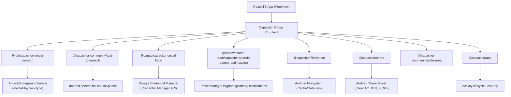
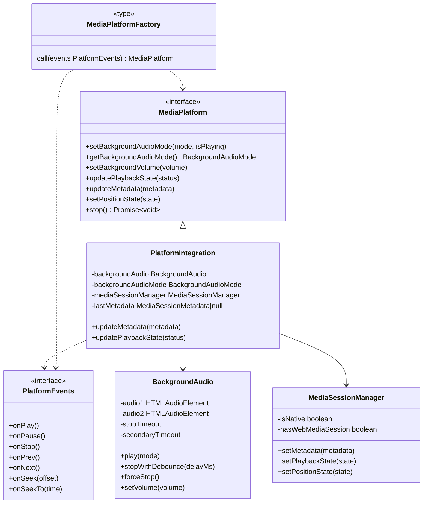
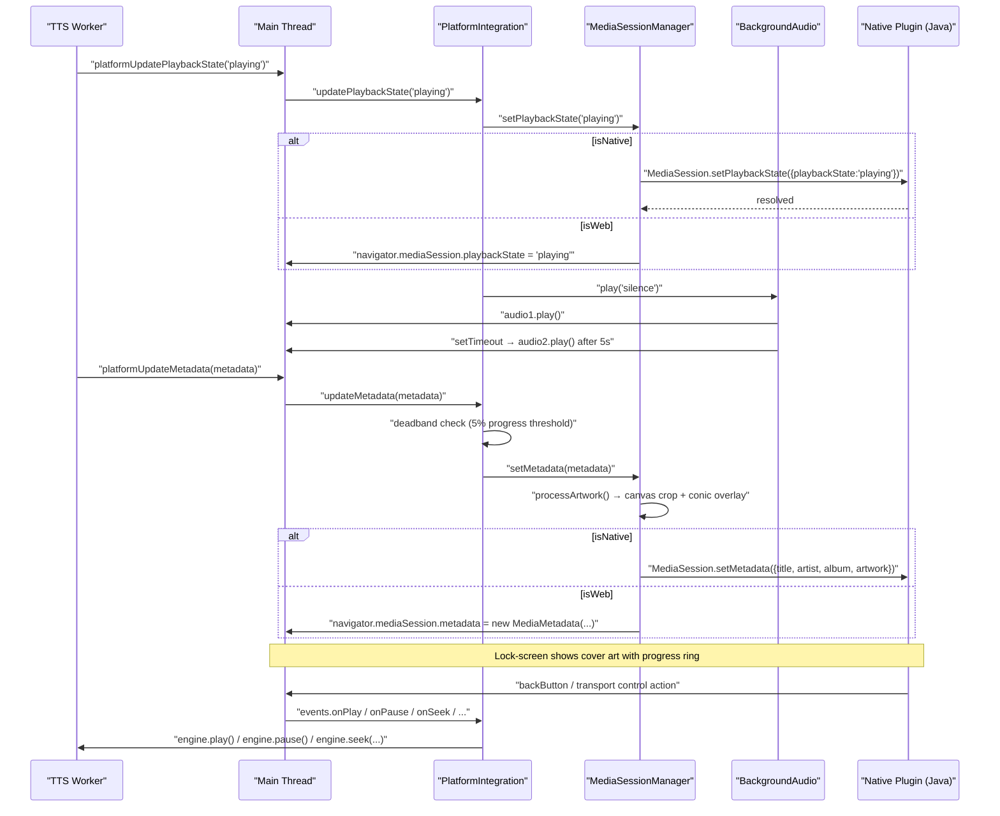
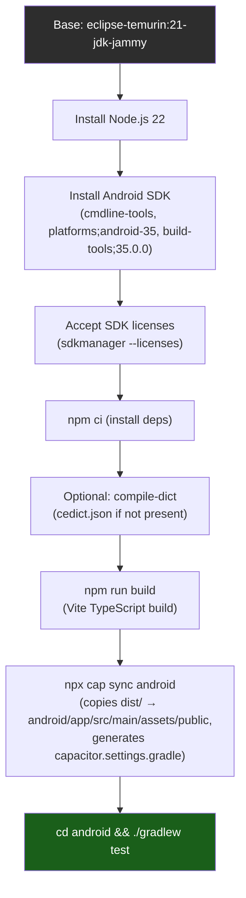

# Capacitor Native (Android/iOS)

Versicle is simultaneously a Progressive Web App and a native Android application
packaged via [Capacitor 7](https://capacitorjs.com/). This document covers
everything specific to the native layer: why Capacitor was chosen, how the project
is configured, the plugin set and the contract each plugin satisfies, the web↔native
platform abstraction that keeps business logic platform-agnostic, the Android build
pipeline (including the containerised Docker build), and the native-specific runtime
behaviours (lock-screen controls, background audio keep-alive, battery optimisation,
hardware back-button, file sharing, social login, and the deliberately-absent Android
Auto Backup integration).

Related documents: [Architecture overview](10-architecture-overview.md),
[TTS providers and platform](33-tts-providers-and-platform.md),
[Bootstrap and lifecycle](14-bootstrap-and-lifecycle.md),
[Backup and restore](23-backup-and-restore.md),
[Build and bundling](60-build-and-bundling.md),
[PWA and service worker](61-pwa-and-service-worker.md).

---

## 1. Why Capacitor

Versicle's product requirements demand three capabilities that are either absent or
unreliable in the pure browser context:

1. **Lock-screen / notification-shade playback controls.** Android's `MediaSession`
   Java API is only accessible from a bound `Service`; no amount of
   `navigator.mediaSession` hackery gives a reliable foreground-service notification
   with transport controls.
2. **Background audio that survives app backgrounding.** Android aggressively kills
   WebView audio when the app is not foreground unless a `FOREGROUND_SERVICE` with
   type `mediaPlayback` is running.
3. **System TTS voices.** `SpeechSynthesis` in Android's WebView is unreliable and
   voice-poor; the system Android TTS engine (via
   `android.speech.tts.TextToSpeech`) is far more capable.

Capacitor packages the entire Vite/React web app as a WebView inside a thin native
shell and exposes a JS bridge to native plugins. The architecture keeps virtually all
product code in TypeScript and restricts Java to the Capacitor bridge layer — a
deliberate minimisation of native surface area.

---

## 2. Project layout

```
capacitor.config.ts            ← single JS-side config entry point
android/                       ← generated Android project (Gradle multi-module)
  app/
    src/main/
      java/com/vrwarp/versicle/
        MainActivity.java       ← BridgeActivity + SocialLogin hook
      AndroidManifest.xml       ← permissions + service/receiver declarations
    src/test/java/…/            ← Robolectric unit tests for plugins
  build.gradle                  ← top-level Gradle config (AGP 8, GMS plugin)
  variables.gradle              ← SDK version constants
  capacitor.settings.gradle     ← auto-generated plugin project includes
  gradlew                       ← Gradle wrapper (executable in Dockerfile)
Dockerfile.android              ← hermetic CI image for Android builds
```

The `android/capacitor.settings.gradle` file is **auto-generated** by `npx cap sync`
and must never be manually edited — it lists the Gradle sub-project path for every
native plugin in `node_modules/`.

---

## 3. Native integration architecture



The WebView hosts the full React app. Every native capability flows through the
Capacitor JS bridge — the web code calls a plugin method, the bridge serialises the
call to JSON, the Java-side plugin implementation executes it on the appropriate
Android thread, and the result is returned to the JS promise.

---

## 4. `capacitor.config.ts` — the single JS-side config

[capacitor.config.ts](../../capacitor.config.ts) is the authoritative configuration for
both the JS toolchain (`@capacitor/cli`) and the native shell (the CLI writes its
values into the Android project). The file is small; every value carries a
consequence:

```typescript
const config: CapacitorConfig = {
  appId: 'com.vrwarp.versicle',
  appName: 'Versicle',
  webDir: 'dist',
  server: {
    androidScheme: 'https',   // WebView loads https://localhost, not http://
    cleartext: false,
    allowNavigation: []
  },
  plugins: {
    MediaSession: {
      foregroundService: "always"
    },
    SafeArea: {
      "detectViewportFitCoverChanges": false,
      "initialViewportFitCover": false
    }
  }
};
```

### `androidScheme: 'https'`

This is security-critical. Without it the WebView serves the app from
`http://localhost`, which is not a *secure context*. A secure context is required for:

- The Web Crypto API (`crypto.subtle`) — used for key derivation in Firestore sync.
- Certain audio APIs that are gated on HTTPS in Chromium.
- CORS compliance when calling external APIs such as OpenAI (the request origin header
  must be `https://`).
- Secure cookies (if ever needed for authentication).

### `cleartext: false`

Prevents the app from navigating to or fetching over plain HTTP in production.

### `allowNavigation: []`

Blocks all navigation to external URLs from the WebView. An EPUB containing a link
to an external site cannot redirect the WebView to that site — an important
sandboxing constraint given that Versicle renders arbitrary user-supplied EPUB content.

### `MediaSession.foregroundService: "always"`

This is the key to reliable background audio on Android. When set to `"always"`, the
`@jofr/capacitor-media-session` plugin binds to its `MediaSessionService` immediately
on activity creation, not lazily on first `setMetadata` call. The
`AndroidManifest.xml` declares this service with `foregroundServiceType="mediaPlayback"`,
and the Robolectric test setup in `MainActivityTest.java` must stub the service binder
because Robolectric has no real service infrastructure:

```java
// MainActivityTest.java — why every test needs this setUp boilerplate
// The MediaSessionPlugin attempts to bind to MediaSessionService on load because
// foregroundService is set to "always" in capacitor.config.json.
MediaSessionService service = Robolectric.buildService(MediaSessionService.class).create().get();
IBinder binder = service.onBind(new Intent());
shadowApplication.setComponentNameAndServiceForBindService(
    new ComponentName(..., MediaSessionService.class),
    binder
);
```

### `SafeArea` config

The safe-area plugin injects CSS variables (`--safe-area-inset-*`) so the React UI
can account for notches and navigation bars. Both options are `false` here: Versicle
does not dynamically respond to viewport-fit cover changes, and the initial cover is
not forced on.

---

## 5. Android manifest and permissions

[android/app/src/main/AndroidManifest.xml](../../android/app/src/main/AndroidManifest.xml)
declares every native permission and component the app requires:

| Permission | Why |
|---|---|
| `INTERNET` | All network I/O: Firebase, TTS APIs, Google auth |
| `WAKE_LOCK` | Prevents CPU sleep during background audio playback |
| `FOREGROUND_SERVICE` | Required to start a foreground service at all |
| `FOREGROUND_SERVICE_MEDIA_PLAYBACK` | Required for `foregroundServiceType="mediaPlayback"` (API 34+) |
| `POST_NOTIFICATIONS` | Required to show the media-session notification (API 33+) |
| `MODIFY_AUDIO_SETTINGS` | Audio focus management for TTS |

The manifest declares two plugin components:

```xml
<service
    android:name="io.capawesome.capacitorjs.plugins.foregroundservice.AndroidForegroundService"
    android:foregroundServiceType="mediaPlayback"
    android:exported="false"
/>
<receiver
    android:name="io.capawesome.capacitorjs.plugins.foregroundservice.NotificationActionBroadcastReceiver"
/>
```

The `AndroidForegroundService` is the foreground service that keeps the app alive
during background audio. The `NotificationActionBroadcastReceiver` receives
notification action intents (play/pause/stop buttons in the notification shade) and
routes them back to the JS engine.

`android:allowBackup="true"` is present on the `<application>` tag. Its relationship
to the (now-deleted) `AndroidBackupService` is covered in
[Section 14](#14-android-backup-the-deleted-integration).

### FileProvider

```xml
<provider
    android:name="androidx.core.content.FileProvider"
    android:authorities="${applicationId}.fileprovider"
    android:exported="false"
    android:grantUriPermissions="true">
    <meta-data android:name="android.support.FILE_PROVIDER_PATHS"
               android:resource="@xml/file_paths" />
</provider>
```

The FileProvider is required by `@capacitor/share`. When Versicle exports a backup
file, it writes the file to the Cache directory and then calls `Share.share()` with
the content URI — Android requires a FileProvider to expose internal file paths to
other apps. The `file_paths.xml` resource exposes both the external path and the
cache path.

---

## 6. The plugin set

### 6.1 Plugin inventory

| npm package | Capacitor plugin name | Purpose |
|---|---|---|
| `@jofr/capacitor-media-session` | `MediaSession` | Lock-screen controls, notification transport |
| `@capacitor-community/text-to-speech` | `TextToSpeech` | Android system TTS engine |
| `@capacitor/app` | `App` | Back-button events, `exitApp()` |
| `@capacitor-community/safe-area` | `SafeArea` | CSS inset variables for notch/nav-bar |
| `@capgo/capacitor-social-login` | `SocialLogin` | Google Sign-In via Credential Manager |
| `@capawesome-team/capacitor-android-battery-optimization` | `BatteryOptimization` | Battery optimisation prompt |
| `@capacitor/filesystem` | `Filesystem` | File read/write in Cache/Data directories |
| `@capacitor/share` | `Share` | Share-sheet for file export |

### 6.2 `@jofr/capacitor-media-session`

This plugin bridges `navigator.mediaSession` calls to the Android `MediaSession` Java
API and keeps a foreground `Service` alive. Key mechanics:

- `MediaSession.setMetadata(...)` → sets `MediaMetadata` on the Android session,
  populating the notification and lock-screen.
- `MediaSession.setPlaybackState(...)` → updates the session's `PlaybackState`,
  controlling which transport buttons are active.
- `MediaSession.setPositionState(...)` → updates seek position for the lock-screen
  seek bar.
- `MediaSession.setActionHandler(...)` → registers callbacks for transport control
  actions (play/pause/stop/next/previous/seekbackward/seekforward).

The JS wrapper `MediaSessionManager` (see Section 9) handles the dual path
(native vs. web).

The `package.json` overrides section pins the `@capacitor/core` peer dependency to
avoid a version conflict:

```json
"overrides": {
  "@jofr/capacitor-media-session": {
    "@capacitor/core": "^7.0.0"
  }
}
```

### 6.3 `@capacitor-community/text-to-speech`

Wraps `android.speech.tts.TextToSpeech`. The JS-side class
[CapacitorTTSProvider](../../src/lib/tts/providers/CapacitorTTSProvider.ts) is the sole
consumer. Key calls:

- `TextToSpeech.getSupportedVoices()` → enumerates the device's installed TTS voices.
- `TextToSpeech.speak({ text, lang, rate, category, queueStrategy })` → initiates
  synthesis. `category: 'playback'` routes audio through the media stream (important
  for correct audio focus and Bluetooth routing). `queueStrategy: 0` flushes;
  `queueStrategy: 1` appends (used by the Smart Handoff preload path).
- `TextToSpeech.stop()` → stops current speech immediately.
- `TextToSpeech.addListener('onRangeStart', ...)` → fires a callback with
  `{ start, end }` as each word is spoken, enabling word-highlighting in the reader.

### 6.4 `@capacitor/app`

Used in [BackNavigationManager](../../src/components/BackNavigationManager.tsx):

```typescript
App.addListener('backButton', async () => {
    const handled = await executeHandler();
    if (!handled) {
        if (locationRef.current.pathname === '/') {
            App.exitApp();          // exit the application at root
        } else {
            navigate(-1);          // navigate back in history
        }
    }
});
```

The `@capacitor/app` plugin is the only way to receive the Android hardware back
button in a WebView — the standard browser `popstate` event is not fired when the
hardware button is pressed. `App.exitApp()` calls the Android `Activity.finish()` to
terminate the app cleanly (rather than leaving a zombie process).

### 6.5 `@capgo/capacitor-social-login`

Used for Google Sign-In on Android via the modern Credential Manager API (not the
deprecated Google Sign-In SDK). The `MainActivity.java` must implement the
`ModifiedMainActivityForSocialLoginPlugin` interface and forward
`onActivityResult` to the plugin, because Credential Manager redirects back via an
activity result:

```java
public class MainActivity extends BridgeActivity
        implements ModifiedMainActivityForSocialLoginPlugin {

    @Override
    public void onActivityResult(int requestCode, int resultCode, Intent data) {
        super.onActivityResult(requestCode, resultCode, data);
        if (requestCode >= GoogleProvider.REQUEST_AUTHORIZE_GOOGLE_MIN
                && requestCode < GoogleProvider.REQUEST_AUTHORIZE_GOOGLE_MAX) {
            // … route to SocialLoginPlugin.handleGoogleLoginIntent
        }
    }

    @Override
    public void IHaveModifiedTheMainActivityForTheUseWithSocialLoginPlugin() {}
}
```

The JS consumer is
[GoogleAuthClient](../../src/domains/google/auth/GoogleAuthClient.ts), which wraps
`SocialLogin.login()` with a typed cache, scope-superset validation, and a strict
interactive/silent token split. On Android, the login options use the
`'bottom'` credential manager style:

```typescript
// src/domains/google/auth/holder.ts
export function defaultPlatformOptions() {
  return Capacitor.getPlatform() === 'android'
    ? { style: 'bottom', autoSelectEnabled: true }
    : {};
}
```

The `socialLoginTask` boot task (see [Bootstrap and lifecycle](14-bootstrap-and-lifecycle.md))
initialises the `SocialLogin` plugin at app start and re-initialises it when the
user changes the configured Google Client IDs in settings.

### 6.6 `@capawesome-team/capacitor-android-battery-optimization`

Android Doze / battery optimisation can suspend background processes. When Versicle
detects it is about to attempt background playback on Android, it checks whether
battery optimisation is enabled and, if so, prompts the user to whitelist the app.
The check and the prompt both route through the `PlatformInfoPort`:

```typescript
// src/app/tts/createZustandEngineContext.ts
platform: {
    isBatteryOptimizationEnabled: async () =>
        (await BatteryOptimization.isBatteryOptimizationEnabled()).enabled,
    openBatteryOptimizationSettings: () =>
        BatteryOptimization.openBatteryOptimizationSettings(),
},
```

The engine [PlaybackController](../../src/lib/tts/engine/PlaybackController.ts) calls
`platform.isBatteryOptimizationEnabled()` before engaging background mode; if it
returns `true` on Android, the engine calls `openBatteryOptimizationSettings()` and
stops:

```typescript
// PlaybackController.ts
if (!engaged && this.ctx.platform.getPlatform() === 'android') {
    this.setStatus('stopped');
    this.notifyError("Cannot play in background");
    return;
}
```

The engine never blocks on the settings screen — the stop happens immediately, and
the user restarts playback after granting the exemption.

### 6.7 `@capacitor/filesystem` and `@capacitor/share`

Used together in [src/lib/export.ts](../../src/lib/export.ts) for the unified file-export
path:

```typescript
export async function exportFile({ filename, data, mimeType }) {
  if (Capacitor.isNativePlatform()) {
    // Write to Cache (no permission needed on modern Android)
    await Filesystem.writeFile({
        path: filename,
        data: dataToWrite,
        directory: Directory.Cache,
        encoding: data instanceof Blob ? undefined : Encoding.UTF8
    });
    // Get a FileProvider URI and open the share sheet
    const uriResult = await Filesystem.getUri({ directory: Directory.Cache, path: filename });
    await Share.share({ title: `Export ${filename}`, files: [uriResult.uri] });
  } else {
    // Web: FileSaver.saveAs
    saveAs(blob, filename);
  }
}
```

Blobs (e.g. a ZIP export) are converted to Base64 before the `writeFile` call because
the Filesystem plugin's binary write mode expects Base64 strings, not `Uint8Array`.
The `Directory.Cache` location requires no runtime permission on modern Android;
it is visible to the FileProvider because `file_paths.xml` exposes `cache-path`.

---

## 7. Platform abstraction design



The goal of this layer is to let the TTS engine core — which runs in a Web Worker
and therefore has no access to `navigator.mediaSession` or `HTMLAudioElement` — stay
platform-agnostic. The engine communicates through the `MediaPlatform` interface; the
real implementation (`PlatformIntegration`) lives on the main thread and is injected
at the composition root.

### 7.1 `PlatformIntegration`

[src/lib/tts/PlatformIntegration.ts](../../src/lib/tts/PlatformIntegration.ts)

This is the concrete `MediaPlatform` wired to real OS capabilities. Its constructor
takes a `PlatformEvents` object of callbacks from the engine and constructs:

1. A `BackgroundAudio` instance (manages the keep-alive audio loop).
2. A `MediaSessionManager` (manages `navigator.mediaSession` or the native plugin).

Key behaviours:

#### Metadata deadband

`updateMetadata` implements a "deadband" to prevent excessive Bluetooth head-unit
refreshes. Progress updates are suppressed unless the progress fraction has moved by
at least 5%:

```typescript
const diff = Math.abs(metadata.progress - this.lastMetadata.progress);
if (diff < 0.05) {
    // Also check: titleChanged || artistChanged || albumChanged || artworkSrcChanged || sectionChanged
    if (!titleChanged && !artistChanged && …) return;  // skip update
}
```

Without this, every sentence advance would regenerate the lock-screen artwork (which
involves a Canvas crop-and-overlay operation) and push a Bluetooth metadata update,
causing visible flickering on some head units.

#### Playback state → background audio lifecycle

`updatePlaybackState(status)` drives the `BackgroundAudio` keep-alive loop in sync
with TTS engine state:

| TTS status | Background audio action |
|---|---|
| `'playing'`, `'loading'`, `'completed'` | `backgroundAudio.play(mode)` |
| `'paused'` | `backgroundAudio.stopWithDebounce(500)` |
| anything else (stopped, error, idle) | `backgroundAudio.forceStop()` |

The 500 ms debounce on pause prevents the background audio from stopping and
restarting during brief sentence boundaries, which would cause audio glitches on some
Android versions.

#### Stop behaviour

`stop()` checks `Capacitor.isNativePlatform()` and, on native, calls
`mediaSessionManager.setPlaybackState('none')` to clear the lock-screen notification.
On web, this is a no-op (the browser clears the media session automatically when the
page unloads).

### 7.2 `BackgroundAudio`

[src/lib/tts/BackgroundAudio.ts](../../src/lib/tts/BackgroundAudio.ts)

Android will suspend audio from a WebView when the app goes to the background,
unless the `MediaSession` foreground service is running *and* there is actively-playing
audio. The background audio loop satisfies the "actively-playing audio" requirement.

Two `HTMLAudioElement` instances (`audio1`, `audio2`) are maintained to guard against
race conditions where one element glitches. Two audio modes are supported:

| Mode | Asset | Use case |
|---|---|---|
| `'silence'` | `src/assets/silence.ogg` | Standard background keep-alive (inaudible) |
| `'noise'` | `src/assets/10s_8k_sub_bass_vbr_off.webm` | User preference: sub-bass noise |
| `'off'` | (none) | Completely disabled |

The `'silence'` mode plays an inaudible OGG file in a loop. This satisfies the
Android audio engine's requirement for "active playback" without producing any audible
output from the background loop itself — the TTS audio comes from a separate
audio path.

The `play()` method has a 5-second stagger: `audio1` plays immediately, and `audio2`
begins playing 5 seconds later (via `secondaryTimeout`). This redundancy ensures that
if `audio1` is interrupted by an audio focus loss during a call, `audio2` can sustain
the background-playback claim.

Volume is applied with perceptual (cubic) scaling for `'noise'` mode:
```typescript
private getPerceptualVolume(linearVal: number): number {
    return Math.pow(linearVal, 3);
}
```
Silence mode always plays at `volume = 1.0` (the inaudible track makes the value
irrelevant).

### 7.3 `MediaSessionManager`

[src/lib/tts/MediaSessionManager.ts](../../src/lib/tts/MediaSessionManager.ts)

Wraps both `@jofr/capacitor-media-session` (native) and `navigator.mediaSession`
(web) behind a single interface. The `isNative` flag is set at construction time
from `Capacitor.isNativePlatform()` and never changes.

#### Action handlers

On native: each action is registered via `MediaSession.setActionHandler({ action }, handler)`.
On web: the standard `navigator.mediaSession.setActionHandler(action, handler)` loop.

One important difference: the native plugin does **not** support `seekto`
(absolute seek) in the same way as the web API — only `seekforward`/`seekbackward`
(relative). The `PlatformIntegration` constructor maps both relative seek actions to
`events.onSeek(±10)` (a 10-second jump), while `onSeekTo` from the web API
(received in full-screen progress bars) is passed through but is also mapped to a
no-op in the worker engine client because the engine uses `onSeek` for all seeking.

#### Artwork processing

`setMetadata` calls `processArtwork`, which:

1. Fetches the cover image and crops it to a centre square using an off-screen
   `<canvas>`.
2. Optionally applies a **conic gradient progress overlay** to indicate reading
   progress. The overlay uses perceptual colour blending when `perceptualPalette`
   is provided:
   - Computes `bgL` (background luminance in CIELAB) and `stL` (standout colour
     luminance) from packed RGB palette values.
   - Chooses `'multiply'` blend if the background is lighter than the standout
     colour; `'screen'` otherwise.
   - Falls back to a simple alpha-blended overlay at extreme luminances with low
     delta-E (nearly monochrome covers at near-white or near-black).
3. Exports the canvas as JPEG at 0.8 quality (base64 data URL) for the media
   session.

A 2-second timeout guards against stalled image loads, returning the original URL
in that case.

---

## 8. Web↔native platform dispatch flow



The key invariant is that `PlatformIntegration` always lives on the main thread.
The TTS engine (in the worker) never directly touches the DOM or Capacitor plugins —
it calls through the `EngineHost` interface, whose implementation forwards to
`PlatformIntegration` via the Comlink message channel.

---

## 9. Provider dispatch: native vs. web TTS

The provider registry ([src/lib/tts/providers/registry.ts](../../src/lib/tts/providers/registry.ts))
encodes the platform split declaratively:

```typescript
{
    id: 'webspeech',
    displayName: 'Web Speech (Local)',
    kind: 'device',
    platforms: ['web'],        // only offered on web
    build: () => new WebSpeechProvider(),
},
{
    id: 'capacitor',
    displayName: 'System Speech (Local)',
    kind: 'device',
    platforms: ['native'],     // only offered on native
    build: () => new CapacitorTTSProvider(),
},
```

`TTSProviderManager` picks the right provider at construction time:

```typescript
if (Capacitor.isNativePlatform()) {
    this.provider = new CapacitorTTSProvider();
} else {
    this.provider = new WebSpeechProvider();
}
```

`resolveDescriptor('local')` maps to `'capacitor'` on native and `'webspeech'` on
web, providing backwards-compatibility with the pre-5b persisted `'local'` id.

### `CapacitorTTSProvider` — Smart Handoff

[src/lib/tts/providers/CapacitorTTSProvider.ts](../../src/lib/tts/providers/CapacitorTTSProvider.ts)

Native TTS has latency between `speak()` calls. The `CapacitorTTSProvider` implements
**Smart Handoff** to achieve gapless playback: while the current utterance is playing,
the engine calls `preload(nextText, options)`, which immediately queues the next
utterance to the native TTS engine with `queueStrategy: 1` (Append):

```typescript
async preload(text: string, options: TTSOptions): Promise<void> {
    this.nextText = text;
    this.nextUtterancePromise = TextToSpeech.speak({
        text,
        lang,
        rate: options.speed,
        category: 'playback',
        queueStrategy: 1  // Add (Queue)
    });
    // Fire and forget — the promise is stored for handoff
}
```

When `play(text, options)` is called for the next sentence, if `text === this.nextText`
and the previous utterance has finished (`currentUtteranceFinished`), the provider
adopts the already-running native promise instead of calling `speak()` again:

```typescript
if (isContentMatch && isNaturalFlow && this.nextUtterancePromise) {
    // SMART HANDOFF — native audio is already playing, just adopt the promise
    this.emit({ type: 'start' });
    this.nextText = null;
    this.nextUtterancePromise = null;
    // ... resolve when the adopted promise resolves
    return;
}
```

If the content does not match (user skipped, re-ordered) a standard flush path runs:
`TextToSpeech.stop()` cancels any pending speech and `speak()` is called with
`queueStrategy: 0`.

**Pause implementation:** The native pause API is not reliable on all Android
versions, so `pause()` is implemented as `stop()` plus incrementing
`activeUtteranceId` (which causes any in-flight `end` or `error` events to be
ignored). The `lastText` is retained so the `onRangeStart` listener can still
bounds-check correctly until the listener is removed.

**Word boundaries:** The `onRangeStart` listener is registered during `init()`:

```typescript
this.listenerHandle = await TextToSpeech.addListener('onRangeStart', (info) => {
    if (!this.lastText) return;
    if (info.start >= this.lastText.length) return;  // stale event from old utterance
    this.emit({ type: 'boundary', charIndex: info.start });
});
```

The bounds check (`info.start >= this.lastText.length`) filters out spurious
events fired after the previous utterance's text was replaced with a shorter string —
a real edge case when the user skips rapidly.

---

## 10. `platformDeviceProviderId` and the settings store

[src/store/useTTSSettingsStore.ts](../../src/store/useTTSSettingsStore.ts) exports:

```typescript
export const platformDeviceProviderId = (): TTSProviderId =>
    typeof Capacitor?.isNativePlatform === 'function' && Capacitor.isNativePlatform()
        ? 'capacitor'
        : 'webspeech';
```

The defensive guard (`typeof Capacitor?.isNativePlatform === 'function'`) is
necessary because the store's default value is evaluated at module-load time in
tests, where Capacitor is partially mocked. This returns the correct id for the
platform's device provider without importing the full plugin registry.

---

## 11. Android back-button handler

[src/components/BackNavigationManager.tsx](../../src/components/BackNavigationManager.tsx)
is a renderless React component that coordinates two back-navigation sources:

1. **`App.addListener('backButton', ...)`** — fires on hardware back-button press.
2. **React Router `useBlocker`** — intercepts browser-history POP events (e.g. swipe
   gestures or in-app back navigation).

Both sources invoke the same `executeHandler()` logic: it takes the highest-priority
handler from the `useBackNavigationStore` and calls it (e.g. to close a modal). If
no handler is registered:

- At the root path (`/`): calls `App.exitApp()` to finish the Android activity.
- Elsewhere: calls `navigate(-1)` to go back in history.

The store uses four priority levels defined in `BackButtonPriority`:

```typescript
export enum BackButtonPriority {
    DEFAULT = 0,     // baseline
    UI_ELEMENT = 25, // sidebars, minor elements
    MODAL = 50,      // dialogs, bottom sheets
    OVERLAY = 100,   // full-screen overlays
}
```

Handlers are sorted descending by priority when registered, so `handlers[0]` is
always the highest-priority handler without a linear scan at dispatch time.

---

## 12. Social login boot task

[src/app/boot/socialLogin.ts](../../src/app/boot/socialLogin.ts) is a `BootTask` that
initialises `SocialLogin` with the configured Google Client IDs:

```typescript
export const socialLoginTask: BootTask = {
  name: 'google/social-login',
  run: (ctx) => {
    initializeSocialLogin().catch(err => logger.warn('SocialLogin init failed:', err));

    if (!subscribed) {
      subscribed = true;
      const unsubscribe = useGoogleServicesStore.subscribe((state, prevState) => {
        if (state.googleClientId !== prevState.googleClientId ||
            state.googleIosClientId !== prevState.googleIosClientId) {
          initializeSocialLogin().catch(...);
        }
      });
      ctx.addCleanup(() => { subscribed = false; unsubscribe(); });
    }
  },
};
```

The task is fire-and-forget: boot never awaits social login initialisation because a
failure at this point only affects the sign-in surface, not the reader or TTS. The
store subscription re-initialises the plugin whenever the user changes their Google
Client ID in settings, without requiring a page reload.

---

## 13. Content Security Policy for the WebView

The CSP is injected into `index.html` at build time (see
[Build and bundling](60-build-and-bundling.md)) and covers the Capacitor Android
WebView — the WebView previously had no CSP at all (tracked as privacy report D4 in
the overhaul). The CSP is rendered by
[src/kernel/net/csp.ts](../../src/kernel/net/csp.ts) from the egress registry.

The Phase 8 `connect-src` strict flip removed the legacy `https:` scheme wildcard:
every fetch destination must now be enumerated in the registry. The `img-src` policy
is `'self' data: blob:` — remote EPUB images are stripped by the HTML sanitiser
before they ever reach the WebView, so no `https:` image wildcard is needed. This
also kills tracking pixels embedded in EPUBs.

---

## 14. Android Backup — the deleted integration

[docs/adr/0002-android-backup.md](../../docs/adr/0002-android-backup.md)

An `AndroidBackupService` class existed (`src/lib/sync/android-backup.ts`, 65 LOC)
that serialised `backupService.generateManifest()` into `backup_payload.json` in
`Directory.Data` for Android Auto Backup to pick up. It was deleted in Phase 9 of
the overhaul.

**Why it was deleted:**

1. **Zero callers.** Neither `writeBackupPayload` nor `readBackupPayload` was called
   by anything except the module's own test — verified at Phase 1, Phase 3, and
   Phase 9.
2. **Zero native wiring.** No `BackupAgent`, no `dataExtractionRules` XML, no
   WorkManager job — only the passive `allowBackup="true"` attribute. Even if a
   payload file existed, nothing on the restore side would read it.
3. **The product already has three real backup/restore paths:** explicit file
   export/import, Google Drive library sync, and Firestore workspace sync (all tested
   and landed). A fourth, OS-mediated channel adds complexity without adding user
   capability.
4. **Auto Backup is a poor transport for this payload.** The 25 MB quota can be
   silently exceeded (Auto Backup stops backing up the entire app); proper native
   backup requires a `BackupAgent` or size-capped key-value backup.

The `android:allowBackup="true"` attribute was retained because it predates the module
and governs OS backup of app data generally (not the payload-file approach). Whether
to change it to `false` (or add `dataExtractionRules`) is a future privacy/QA
question, explicitly out of scope for Phase 9.

---

## 15. Android build — `Dockerfile.android` and Gradle



[Dockerfile.android](../../Dockerfile.android) builds a hermetic CI image:

1. **Base image:** `eclipse-temurin:21-jdk-jammy` — JDK 21 on Ubuntu Jammy.
2. **Node.js 22:** installed from NodeSource (pinned to `<26`, matching `engines` in
   `package.json`).
3. **Android SDK:** `commandlinetools-linux-13114758_latest.zip`. Capacitor 7
   requires API 35 (`platforms;android-35`, `build-tools;35.0.0`).
4. **`npm ci`:** reproducible install from `package-lock.json`.
5. **`npm run build`:** `tsc -b && vite build` — produces `dist/`.
6. **`npx cap sync android`:** copies `dist/` into
   `android/app/src/main/assets/public/`, syncs plugin configuration, and regenerates
   `capacitor.settings.gradle`.
7. **Default CMD:** `./gradlew test` — runs the Robolectric unit tests.

### Gradle configuration

| File | Content |
|---|---|
| `android/variables.gradle` | SDK versions: `minSdkVersion=23`, `compileSdkVersion=35`, `targetSdkVersion=35` |
| `android/app/build.gradle` | Application plugin, `namespace="com.vrwarp.versicle"`, `compileSdk=36`, `applicationId`, Robolectric test dep |
| `android/build.gradle` | AGP 8.13.2, GMS plugin 4.4.0 |
| `android/capacitor.settings.gradle` | Auto-generated plugin sub-project includes |

`minSdkVersion = 23` (Android 6.0 Marshmallow) is the Capacitor 7 minimum. The
`compileSdk = 36` in `app/build.gradle` allows use of API 36 symbols while still
running on API 35 devices.

`google-services.json` is applied conditionally — if absent, the GMS plugin is
silently skipped and Firebase integration is disabled. This allows CI builds without
production Firebase credentials.

---

## 16. Android Robolectric tests

The Android project includes Robolectric unit tests for the native plugin integrations
under `android/app/src/test/java/com/vrwarp/versicle/`:

| Test class | What it verifies |
|---|---|
| `MainActivityTest` | `BridgeActivity` starts, Capacitor bridge initialises, `MediaSession` and `TextToSpeech` plugins are registered |
| `MediaSessionPluginTest` | `MediaSessionPlugin` is retrievable from the bridge; `setMetadata` and `setPlaybackState` do not crash |
| `TextToSpeechPluginTest` | `TextToSpeechPlugin` is retrievable; `speak()` and `getSupportedLanguages()` do not crash |
| `BatteryOptimizationTest` | `BatteryOptimizationPlugin` is retrievable; `isBatteryOptimizationEnabled()` does not crash |
| `PluginInitializationTest` | (general plugin init smoke) |

Every test class shares a `@Before` setup that:

1. Mocks the WebView package (`com.google.android.webview`, version `120.0.0.0`) —
   Capacitor's bridge requires the system WebView to be present.
2. Builds and registers a `MediaSessionService` binder in Robolectric's shadow
   application — required because `foregroundService: "always"` causes the plugin to
   bind immediately at bridge startup.

These tests run in the Docker image via `./gradlew test` with `robolectricVersion = '4.14.1'`.

---

## 17. `src/App_Capacitor.test.tsx`

[src/App_Capacitor.test.tsx](../../src/App_Capacitor.test.tsx) is a minimal JS-side smoke
test for the Capacitor platform detection mocks. It:

- Mocks `Capacitor.getPlatform()` and `Capacitor.isNativePlatform()` using Vitest's
  `vi.fn()`.
- Verifies that rendering in an "android" context (`getPlatform → 'android'`,
  `isNativePlatform → true`) does not crash.
- Verifies the same for `getPlatform → 'web'`.

The test renders a `<div>` rather than the full `<App>` component because full
initialisation is covered in `App_SW_Wait.test.tsx`. The primary value is confirming
that the Capacitor mock setup (which many other test files share) is correct.

---

## 18. Edge cases and failure modes

### Background audio gap on pause

If the user pauses TTS and then resumes within 500 ms (the `stopWithDebounce` window),
the background audio never stops. This avoids audible glitches on Android when a
brief pause transitions immediately to the next sentence — the debounce absorbs the
transition.

### TTS worker 15-second timeout

`createWorkerEngineClient` wraps the initial `engine.connect()` call with a
15-second timeout (`withWorkerGuard`). If the worker fails to load (e.g. a Capacitor
plugin unavailable in the WebView environment), the error is surfaced and the
`workerError` string is included in the timeout message. This prevents the app from
hanging silently if the TTS worker fails.

### `onRangeStart` stale event filtering

The `CapacitorTTSProvider` may receive `onRangeStart` events from a previous, longer
utterance after it has switched to a shorter utterance. The bounds check
`info.start >= this.lastText.length` discards these events. This avoids emitting
`boundary` events with invalid character indices that would advance the reader
highlight incorrectly.

### `MediaSessionManager` on web without mediaSession

`hasWebMediaSession = typeof navigator !== 'undefined' && 'mediaSession' in navigator`
is checked at construction time. If the web browser does not support `mediaSession`
(an old browser), all `setMetadata` / `setPlaybackState` calls become no-ops, and
the artwork-processing code is never run.

### CSP in the WebView

The CSP meta tag is injected at build time. During development (`vite dev`), the meta
is absent (the dev server needs a WebSocket HMR endpoint that would be blocked by
a committed `connect-src`). The Capacitor WebView always receives a production build,
so it always has the CSP enforced.

### Battery optimisation on non-Android platforms

`BatteryOptimization.isBatteryOptimizationEnabled()` is in the Capacitor plugin
registry for Android only. On iOS or web, `platform.isBatteryOptimizationEnabled()`
returns `false` by default (the `WorkerEngineContext` default is
`async () => false`), and `openBatteryOptimizationSettings()` is a no-op. The engine
only checks the result on `getPlatform() === 'android'`, so the call is never made
on other platforms.

### Worker vs. in-process engine context

The `EngineHost` and `WorkerEngineContext` worker path both provide the platform API
through the same `PlatformInfoPort` interface. In the in-process path
(`createZustandEngineContext`), `Capacitor.getPlatform()` and
`Capacitor.isNativePlatform()` are called directly. In the worker path
(`createWorkerEngineClient`), the platform name is obtained from
`Capacitor.getPlatform()` on the main thread and passed as a string to the worker's
`WorkerEngineContext`:

```typescript
const host: EngineHost = {
    platformName: () => Capacitor.getPlatform(),
    // ...
};
```

Inside `WorkerEngineContext`, `isNativePlatform` is derived as
`this.platformName !== 'web'`, ensuring the worker never needs to import `@capacitor/core`.

---

## 19. Summary: what `Capacitor.isNativePlatform()` gates

The following table enumerates every production site where `isNativePlatform()` or
`getPlatform()` gates a different code path:

| Site | Native behaviour | Web behaviour |
|---|---|---|
| `TTSProviderManager` constructor | `new CapacitorTTSProvider()` | `new WebSpeechProvider()` |
| `useTTSSettingsStore.platformDeviceProviderId` | `'capacitor'` | `'webspeech'` |
| `providers/registry.ts currentPlatform()` | `'native'` | `'web'` |
| `MediaSessionManager.isNative` | Use `@jofr/capacitor-media-session` plugin | Use `navigator.mediaSession` |
| `PlatformIntegration.stop()` | Call `MediaSession.setPlaybackState('none')` | Skip (no-op) |
| `lib/export.ts exportFile()` | Write to Cache + Share sheet | FileSaver.saveAs |
| `domains/google/auth/holder.ts defaultPlatformOptions()` | `{ style: 'bottom', autoSelectEnabled: true }` | `{}` |
| `PlaybackController` background-mode check | Check `isBatteryOptimizationEnabled()` | Skip check |

Every one of these dispatch points is covered by a test with a mocked `Capacitor`
object, ensuring no native API call leaks into the web or test environments.
