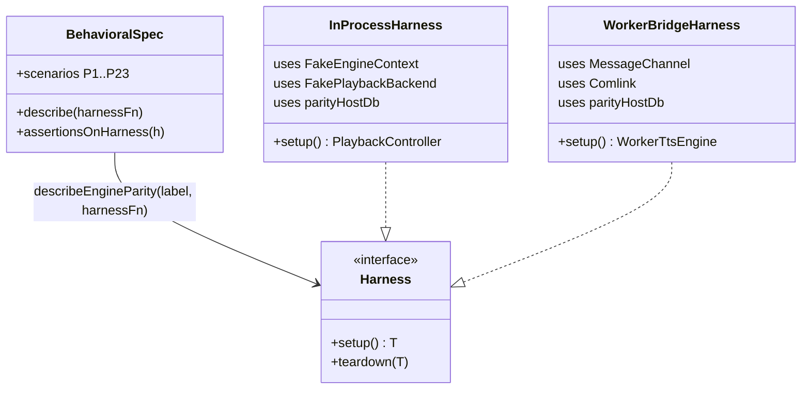
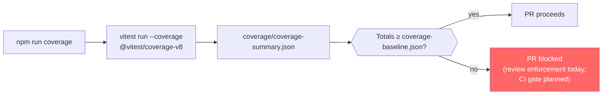
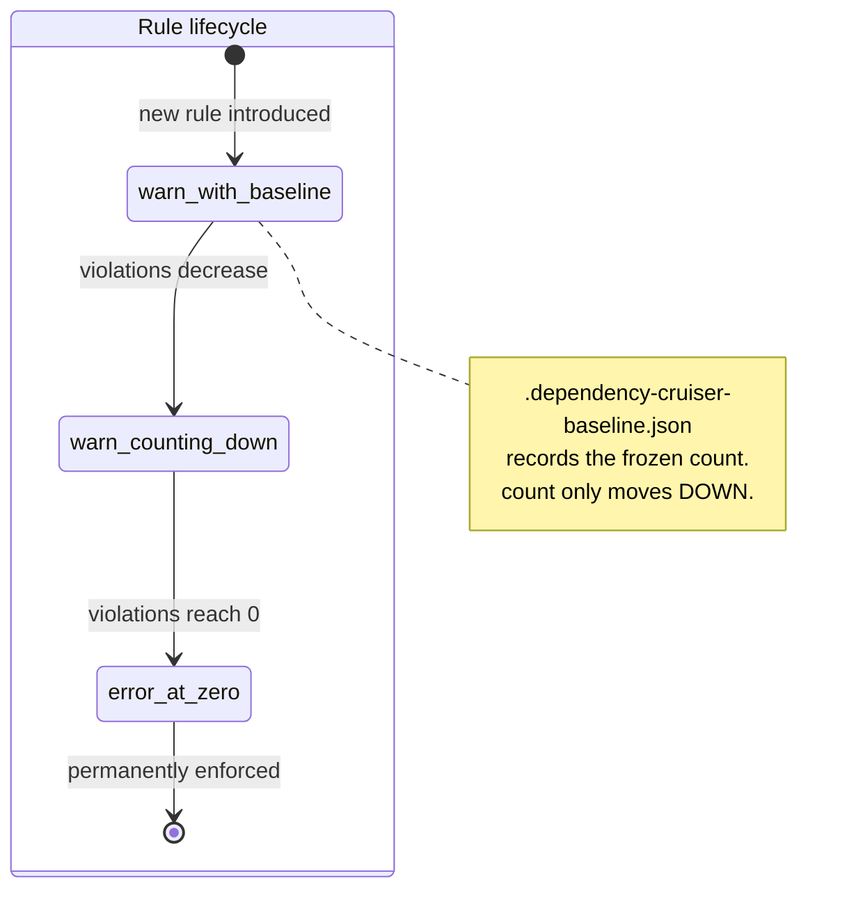
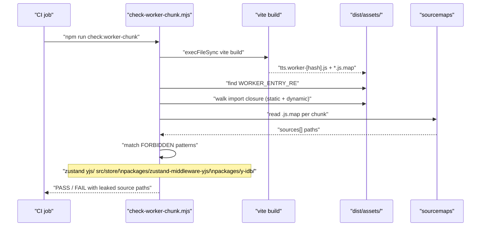
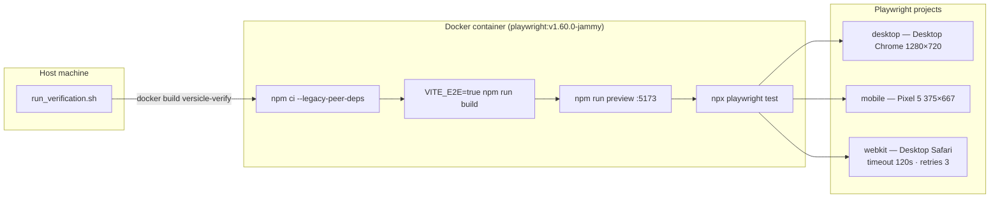
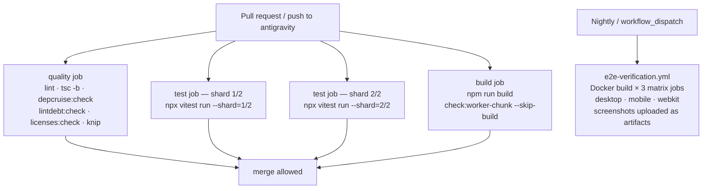
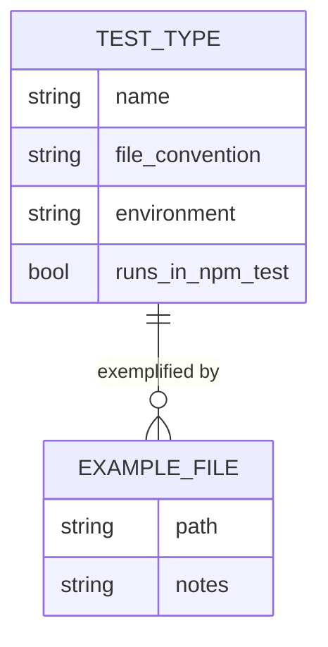

# Testing Strategy

This document is the narrative companion to [TESTING.md](../../TESTING.md) — the
authoritative command reference. Where `TESTING.md` lists what to run, this
document explains why the suite is shaped the way it is, how every layer
works, and what invariants must be preserved as the codebase evolves.

Cross-references: [Architecture overview](10-architecture-overview.md),
[Contract-first registry](12-contract-first-registry.md),
[State management / CRDT](13-state-management-crdt.md),
[TTS engine](32-domain-audio-tts-engine.md),
[Sync domain](36-domain-sync.md),
[CI and quality gates](65-ci-and-quality-gates.md).

---

## Design intent: why this test landscape exists

Versicle runs on one browser page, persists user data to IndexedDB,
replicates state through a Yjs CRDT over Firestore, and runs TTS playback in
a Web Worker over Comlink. That combination creates three distinct
correctness risks:

1. **Two-process divergence.** The TTS engine runs in a worker. Any
   behavioral drift between the in-process and worker-bridge paths is
   invisible without a suite that runs the same scenarios over both
   transports simultaneously.

2. **Format-change correctness.** Every CRDT schema bump (v1 through v9 at
   program close), IDB migration, and serialised-blob version must be
   provably backwards-compatible. A migration that works on current data
   but silently corrupts a v4 user's doc is undetectable without captured
   binary fixtures and a matrix test.

3. **Boundary erosion.** An app of this complexity — stores, domains, data
   layer, kernel, worker — degrades toward a big ball of mud when imports
   are unconstrained. Static analysis alone can be worked around; the suite
   must enforce boundary rules in the emitted artifact, not just in source.

The testing architecture is therefore **contract-first**: every significant
seam between subsystems is defined by a named contract (C1–C12 in
[12-contract-first-registry.md](12-contract-first-registry.md)), and the
primary testing obligation is to pin each contract with a suite that runs
the same behavioral spec against every implementation. Pure unit tests exist
but are secondary; the contract suites and boundary checks are what make
changes safe to ship.

---

## The test pyramid

```mermaid
graph TB
    subgraph L5["L5 — E2E journeys (Playwright, Docker)"]
        E2E["78 spec files — 3 browser projects\ndesktop 1280×720  mobile Pixel5  webkit Safari\nRuns nightly; NOT a PR gate today"]
    end
    subgraph L4["L4 — Emulator-gated suites (Firebase emulator, Node env)"]
        EMU["security-rules.test.ts  +  syncBackendContract.emulator.test.ts\nReal Firestore rules  ·  Real anonymous auth  ·  Auto-skips without emulator"]
    end
    subgraph L3["L3 — Contract / parity / characterization suites"]
        C1["engineParity × 2 transports  (P1–P23 scenarios)"]
        C2["describeProviderContract × 6 providers"]
        C3["describeSyncBackendContract × 2 backends"]
        C4["ReaderEngine.contract × 2 implementations"]
        C5["CRDT migration matrix  v1/v2/v4/v5/v6/v7/v8 → v9"]
        C6["zustand-middleware-yjs fork contract suites"]
        C7["importFlows.characterization  +  SyncOrchestrator.characterization"]
    end
    subgraph L2["L2 — Integration / store tests (Vitest + fake-indexeddb)"]
        I1["Store flows through real Zustand stores + injected fakes\n(useLibraryStore, reading-state, annotations, CRDT)"]
        I2["Fuzz suites — 10 *.fuzz.test.ts files  (500 iters, seeded LCG)"]
        I3["Perf companions — *.perf.test.ts  (functional + timing assertions)"]
    end
    subgraph L1["L1 — Unit tests (Vitest, co-located)"]
        U1["Pure-logic modules: segmentation, CFI, lexicon, CSV, validators"]
        U2["Typed harness doubles: makeBookContentDouble, FakeTTSProvider …"]
        U3["Captured fixture drift guards"]
    end
    subgraph L0["L0 — Static / artifact analysis (no runtime)"]
        S1["ESLint boundary bans — import-path, idb, fetch, vi.mock in engine dirs"]
        S2["dependency-cruiser — 10 boundary rules, 8 at error/0; ratchet baseline"]
        S3["check:worker-chunk — 5 emitted-artifact assertions (C12)"]
        S4["tsc -b — all test + e2e code in the compiler's view"]
        S5["check:single-instance — one physical yjs/zustand/lib0/firebase"]
        S6["knip — dead-code gate"]
        S7["lint-debt-ratchet — as-any/eslint-disable counts may only decrease"]
    end

    L5 --> L4 --> L3 --> L2 --> L1 --> L0
```



The pyramid is deliberately lopsided toward its bottom half. L0 and L3
catch the most important failure modes (wrong imports, behavioral drift
between transports) with sub-second feedback. L4 and L5 exist to close the
gap between "vitest passes" and "the real app works in a browser."

---

## The Vitest configuration

**Single authoritative config:** [vitest.config.ts](../../vitest.config.ts).
There must never be a `test:` block in `vite.config.ts` — when a root
`vitest.config.ts` exists, vitest gives it full priority and ignores the
`test:` field in `vite.config.ts` entirely. This drift happened once (the
`.claude` worktree exclusion landed in the wrong file) and is documented as
a comment inside `vitest.config.ts`.

Key settings (all grounded in the real file):

| Setting | Value | Why |
|---|---|---|
| `environment` | `jsdom` | Default for all suites; node suites opt out with `@vitest-environment node` pragma |
| `globals` | `true` | `describe`/`it`/`expect` are global; matched by `tsconfig.test.json` `"types": ["vitest/globals"]` |
| `setupFiles` | `['./src/test/setup.ts']` | Installs fake-indexeddb, media/speech mocks, localStorage, matchMedia, ResizeObserver, structuredClone realm fix |
| `testTimeout` | `60000` ms | Generous ceiling; individual test suites expect well below this |
| `include` | `src/**/*.{test,spec}.*` and `packages/*/{src,test}/**/*.{test,spec}.*` | Co-located with subjects plus vendored-fork packages; excludes `verification/` and `.claude/` worktrees |
| `exclude` | `configDefaults.exclude`, `verification/**`, `.claude/**`, `**/.claude/**` | Defense in depth: the Playwright suite and agent worktrees never run under vitest |
| `coverage.provider` | `v8` | Native V8 coverage via `@vitest/coverage-v8` |
| `coverage.include` | `src/**/*.{ts,tsx}` | **All** `src/` code, not just imported files — the denominator is stable; deleting a test cannot inflate percentages |
| `coverage.exclude` | `src/test/**` | Harness code is not production coverage |
| `resolve.dedupe` | `['yjs', 'zustand']` | Belt-and-braces against a second copy splitting `instanceof Y.Map` identity |

**Path aliases:** the `resolve.alias` map in `vitest.config.ts` is a
deliberate copy of the one in `vite.config.ts` (which vitest does not
merge). Both must stay in sync with `tsconfig.app.json`'s `paths`. The
`virtual:pwa-register/react` alias points to
[src/test/harness/pwaRegisterStub.ts](../../src/test/harness/pwaRegisterStub.ts),
an inert stub with the same API shape, because the real virtual module only
exists inside a Vite build with `vite-plugin-pwa` active.

---

## The global test setup (`src/test/setup.ts`)

[src/test/setup.ts](../../src/test/setup.ts) runs before every test file in the
jsdom environment. What it installs:

**Browser API mocks** (all behind `if (typeof window !== 'undefined')` so
node-environment suites are unaffected):

- `HTMLMediaElement.prototype.play/pause/load` — resolved/void `vi.fn()` stubs
- `HTMLAudioElement.prototype.play/pause` — same
- `Blob.prototype.text` and `Blob.prototype.arrayBuffer` — FileReader-based polyfills for jsdom
- `window.localStorage` — in-memory implementation (`let store: Record<string, string>`)
- `window.matchMedia` — `vi.fn()` stub returning a false-matches object
- `window.ResizeObserver` — class with no-op `observe/unobserve/disconnect`
- `window.speechSynthesis` / `window.SpeechSynthesisUtterance` — no-op stubs
- `fake-indexeddb/auto` — the entire `indexedDB` global replaced with an
  in-memory implementation; installed at import time via the auto import

**The structuredClone realm fix** is the most subtle piece. `fake-indexeddb`
clones stored/retrieved values using the global `structuredClone`, which
under vitest's jsdom environment is Node's implementation. Values read back
from IndexedDB come back as Node-realm `ArrayBuffer`/typed-array instances
that fail `instanceof ArrayBuffer` checks in app code (which sees jsdom-realm
intrinsics). Real browsers are single-realm, so production never hits this.
Without the fix, branches like `BackupService.toBackupManifestRow`
(cover → base64) and `bookContent.getTableImages` (ArrayBuffer → Blob
normalization) silently took the wrong path. The wrapper in `setup.ts`
rebuilds binary containers in the jsdom realm after the native clone,
patching `globalThis.structuredClone` at the one call-time location
`fake-indexeddb` uses.

---

## Typechecking as a test invariant

`npx tsc -b` builds a project-reference graph defined in
[tsconfig.json](../../tsconfig.json):

```
tsconfig.json
  ├─ tsconfig.app.json       — production app sources (tests excluded here)
  ├─ tsconfig.node.json      — root config files (vite.config.ts etc.)
  ├─ tsconfig.test.json      — ALL vitest test code + src/test/ harness
  └─ tsconfig.e2e.json       — verification/**  +  playwright.config.ts
```

[tsconfig.test.json](../../tsconfig.test.json) extends `tsconfig.app.json` (so
path aliases are inherited), overrides `"types": ["vite/client",
"vitest/globals", "node"]` to match the `globals: true` vitest setting,
sets `"include": ["src"]`, and clears `"exclude": []` to un-exclude the
test files that `tsconfig.app.json` deliberately omits. It references both
`packages/zustand-middleware-yjs` and `packages/y-cinder` so store and sync
tests importing the vendored forks resolve their declarations.

[tsconfig.e2e.json](../../tsconfig.e2e.json) covers `verification/**/*.ts` and
`playwright.config.ts`, loading both DOM and node types since Playwright
test code runs in Node but `page.evaluate()` callbacks execute in the
browser.

The result: approximately 42k LOC of test code is in the TypeScript
compiler's view on every `tsc -b` (which `npm run build` also invokes), not
just linted. A stale mock whose shape no longer matches the real interface
fails the build.

---

## The shared test harness (`src/test/harness/`)

The harness was built to replace the pre-overhaul pattern where 712 hand-rolled
`vi.mock` blocks appeared across 141 test files, with 38 files mocking
`useTTSStore` and 36 mocking `DBService` in slightly different ways that
drifted silently because nothing typechecked them.

The harness surface exported from [src/test/harness/index.ts](../../src/test/harness/index.ts):

| Export | File | What it is |
|---|---|---|
| `resetStore(store)` | [stores.ts](../../src/test/harness/stores.ts) | Restore a Zustand store to its module-load initial state via full replace |
| `seedStore(store, partial)` | stores.ts | Reset then apply `partial` (can include action overrides as spies) |
| `autoResetStores(...stores)` | stores.ts | Register an `afterEach` that resets the given stores — call once at `describe` scope |
| `makeBookContentDouble(overrides)` | [doubles.ts](../../src/test/harness/doubles.ts) | Typed loud-failure double for `bookContent` repo; unstubbed methods throw with actionable messages |
| `makeLibraryPersistenceDouble(overrides)` | doubles.ts | Typed double for `LibraryPersistence` seam injected into `ImportOrchestrator` |
| `captureToasts()` | [toastCapture.ts](../../src/test/harness/toastCapture.ts) | Wrap `useToastStore.showToast` to record every call through the REAL store; returns `{ toasts, messages(), restore() }` |
| `FakeTTSProvider` / `makeTTSVoice` | [fakeTTSProvider.ts](../../src/test/harness/fakeTTSProvider.ts) | Full `ITTSProvider` implementation with `vi.fn()` spies and an `emit(event)` seam |
| `makeInventoryItem`, `makeBookMetadata`, `makeTTSQueue` | [fixtures.ts](../../src/test/harness/fixtures.ts) | Typed domain-object factories (no `as any`; overrides typechecked against real types) |
| `makeTestLibrary`, `makeFullExtraction` | [library.ts](../../src/test/harness/library.ts) | Higher-level library domain fixtures |
| `renderWithStores(ui, opts)` | [renderWithStores.tsx](../../src/test/harness/renderWithStores.tsx) | Render a React component against the real Zustand singletons after seeding; auto-resets on `onTestFinished` |
| `runAxe` / `view.axe()` | [axe.ts](../../src/test/harness/axe.ts) | `vitest-axe` configured with `color-contrast` and `region` disabled (layout-dependent, page-level rules) |

### The `makeLoudDouble` pattern

`doubles.ts` uses a `Proxy`-based loud-failure strategy:

```typescript
function makeLoudDouble<T extends object>(name: string, overrides: Partial<T>): T {
  const throwers = new Map<PropertyKey, () => never>();
  return new Proxy(overrides as T, {
    get(target, prop, receiver) {
      if (prop in target) return Reflect.get(target, prop, receiver);
      if (typeof prop === 'symbol' || prop === 'then' || prop === 'constructor') return undefined;
      let thrower = throwers.get(prop);
      if (!thrower) {
        thrower = () => { throw new Error(
          `[test-harness] ${name}.${String(prop)}() was called but not stubbed. …`
        ); };
        throwers.set(prop, thrower);
      }
      return thrower;
    },
  });
}
```

The key design point: unstubbed members exist on the proxy (so
`if (db.someMethod)` optional-feature probes behave like the real object)
but throw with a clear error when called. The double is typed with
`PublicOf<T>` — stripping the nominal class identity so plain object
literals can satisfy `Partial<PublicOf<T>>` — so overrides are checked
against the real type at compile time.

### `renderWithStores`

```typescript
export function renderWithStores(
  ui: ReactElement,
  options: RenderWithStoresOptions = {},
): RenderWithStoresResult {
  const { seeds = [], ...renderOptions } = options;
  for (const seed of seeds) seedStore(seed.store, seed.state);
  const resetSeededStores = () => {
    for (const seed of seeds) resetStore(seed.store);
  };
  onTestFinished(resetSeededStores);
  const result = render(ui, renderOptions);
  return Object.assign(result, {
    resetSeededStores,
    axe: (axeOptions?: RunOptions) => runAxe(result.container, axeOptions),
  });
}
```

`onTestFinished` is Vitest's equivalent of `afterEach` scoped to a single
test. Each seeded store is reset to its module-load `getInitialState()`,
which for Yjs-backed stores also propagates the reset into the shared Y.Doc.

---

## Contract suites: the architecture of "write once, run everywhere"

The highest-value tests in the codebase follow a single pattern: one
behavioral specification, N transport harnesses, the same assertions.
Behavioral drift between any two implementations of the same seam fails
exactly the harness for the non-conforming side.



### The engine parity suite

The TTS engine behavioral contract lives in
[src/lib/tts/engine/engineParityScenarios.ts](../../src/lib/tts/engine/engineParityScenarios.ts).
It defines 23 scenarios (P1–P23) covering: normal play/pause/stop, queue
identity, skip masks, table adaptations, section navigation, dragnet
capture, provider fallback, analysis dedup, and restore. Two files run the
same `describeEngineParity` function:

- [engineParity.inprocess.test.ts](../../src/lib/tts/engine/engineParity.inprocess.test.ts) —
  drives `PlaybackController` directly with `FakeEngineContext`,
  `FakePlaybackBackend`, and injected `parityHostDb` storage ports. Zero
  `vi.mock`.
- [engineParity.worker.test.ts](../../src/lib/tts/engine/engineParity.worker.test.ts) —
  drives `WorkerTtsEngine` over a real `MessageChannel` + Comlink, exactly
  the production wiring minus OS-thread isolation.

The rule "ZERO vi.mock in engine/ and providers/" is enforced by an ESLint
`no-restricted-syntax` rule (the `no-vi-mock-in-engine` entry in
`eslint.config.js`). The engine reaches storage only through `EngineContext`
ports; the suite injects in-memory fakes through those seams instead.

**`FakeEngineContext`** provides every context slot as a public field or spy
array: `ttsSettings`, `genAISettings`, `activeLanguage`, `platformName`,
`analyses` keyed by `${bookId}/${sectionId}`, plus output logs
(`toasts`, `addedAnnotations`, `genAILogs`, etc.). Tests configure inputs by
setting fields and assert outputs by inspecting the log arrays.

**`FakePlaybackBackend`** records every command the `PlaybackController`
issues (`played`, `preloaded`, `earcons`, `initCount`, `pauseCount`,
`stopCount`) and exposes `fireStart()`/`fireEnd()`/`fireError()` methods for
tests to drive the playback lifecycle deterministically.

### The TTS provider contract

[src/lib/tts/providers/describeProviderContract.ts](../../src/lib/tts/providers/describeProviderContract.ts)
pins four surfaces across every provider implementation:

1. `play()`/`preload()` semantics — `play` resolves when audible playback
   has started and emits exactly one `start`; `preload` never starts
   playback or emits.
2. Single-shot failure signaling — one failure, one signal.
3. `dispose()` — listeners detach; nothing emits afterwards; an injected
   shared sink is never destroyed by the provider.
4. Speed policy — synthesis always at 1.0; the speed-free cache key.

The contract uses `InMemoryTTSCache` (a `TTSCache` subclass backed by a
`Map<string, CacheAudioBlob>`) instead of the IDB-backed real cache, so
tests run without fake-indexeddb overhead. Six provider harnesses exercise
this contract: `WebSpeechProvider`, the Capacitor speech provider, the
Piper (local offline) provider, the cloud TTS providers, and the fallback
chain.

### The SyncBackend contract (C3)

[src/lib/sync/syncBackendContract.ts](../../src/lib/sync/syncBackendContract.ts)
exports `describeSyncBackendContract(harness)` covering workspace CRUD,
tombstone semantics, doc replication, and the `SyncConnection` event
surface (`connection-error`, `sync-failure`, `save-rejected`,
`corrupted-document`, `saved`). Two runners:

- [syncBackendContract.mock.test.ts](../../src/lib/sync/syncBackendContract.mock.test.ts) —
  runs against `MockBackend` on every `npm test`
- [syncBackendContract.emulator.test.ts](../../src/lib/sync/syncBackendContract.emulator.test.ts) —
  runs against `FirestoreBackend` + the vendored y-cinder `FireProvider`
  over the full auth+firestore+storage emulator trio; **auto-skips when no
  emulator is reachable** so the default `vitest run` stays green

The emulator suite uses the `@vitest-environment node` pragma (Firebase
SDK emulator transports are unreliable under jsdom's XMLHttpRequest). It
connects a real anonymous auth user to the emulators using
`@firebase/rules-unit-testing` to load the repo's actual
`firestore.rules`/`storage.rules` — so `request.auth.uid` in the rules is
a genuine token claim, not a baked-in test context.

### The CRDT migration matrix

Captured binary Y.Doc fixtures in
[src/test/fixtures/ydoc/](../../src/test/fixtures/ydoc/) hold historical CRDT
formats:

| File | Era | Notable content |
|---|---|---|
| `v1.update.bin` | v1 | Y.Text strings; one INVALID session (`startTime: 'corrupt'`) |
| `v2.update.bin` | v2 | Y.Text encoding, sessions pruned |
| `v4.update.bin` | v4 | Plain-string encoding; pre-`fontProfiles` preferences |
| `v5.update.bin` | v5 | v4 + `fontProfiles` backfill; still carries `popover` |
| `v6.update.bin` | v6 | `meta` map present; vocabulary carries TRADITIONAL keys |
| `v7.update.bin` | v7 | Vocabulary CANONICALIZED (simplified keys) |
| `v8.update.bin` | v8 | v7 + reading-list `bookId` FK linker |

The [migrations.test.ts](../../src/store/__tests__/crdt-contract/migrations.test.ts) suite
drives every era through `runCrdtMigrations` and asserts the result
terminates in canonically equal doc JSON (the F.3 matrix). It also pins the
two-client quarantine invariant (F.2): a pre-bump stack receiving a
migrated doc must fire `onObsolete(version)` before any store patch and
halt outbound writes.

The [fixtures-manifest.test.ts](../../src/store/__tests__/crdt-contract/fixtures-manifest.test.ts)
suite recomputes sha256 of each `.bin` against `manifest.json` entries and
validates structural content checklists in CI. Fixtures are never
regenerated in CI; regeneration is a deliberate, reviewed act via
`scripts/capture-ydoc-fixture.ts`.

---

## Fuzz and property testing

Ten `*.fuzz.test.ts` files use the seeded PRNG infrastructure in
[src/test/fuzz-utils.ts](../../src/test/fuzz-utils.ts):

```typescript
export class SeededRandom {
  // LCG parameters (same as glibc)
  private static readonly A = 1103515245;
  private static readonly C = 12345;
  private static readonly M = 2 ** 31;

  constructor(private seed: number) { this.seed = seed % SeededRandom.M; }

  next(): number { /* LCG step */ }
  nextInt(min: number, max: number): number { /* … */ }
  nextString(length: number, charset?: string): string { /* … */ }
  nextCfi(): string { /* epubcfi(/6/N!/4/2/1:offset) */ }
  nextUnicodeString(length: number): string { /* ASCII + emoji + CJK + accented */ }
}

export const DEFAULT_FUZZ_SEED = 12345;
export const DEFAULT_FUZZ_ITERATIONS = 500;
```

Determinism is the key property: a failing fuzz case can be reproduced
exactly by re-running with the same seed. `getSeed()` returns the current
state so a test can log the seed on failure.

The subjects:

| File | What it fuzzes |
|---|---|
| [cfi.fuzz.test.ts](../../src/kernel/cfi/cfi.fuzz.test.ts) | CFI parse/stringify round-trip |
| [cfi.equivalence.fuzz.test.ts](../../src/kernel/cfi/cfi.equivalence.fuzz.test.ts) | Fast-path vs. reference oracle equivalence (>10k cases) |
| [TextSegmenter.fuzz.test.ts](../../src/lib/tts/TextSegmenter.fuzz.test.ts) | Segmenter with random Unicode |
| [LexiconEngine.fuzz.test.ts](../../src/lib/tts/LexiconEngine.fuzz.test.ts) | Lexicon lookup with random strings |
| [TextScanningTrie.fuzz.test.ts](../../src/lib/tts/TextScanningTrie.fuzz.test.ts) | Trie scan correctness |
| [TableAdaptationProcessor.fuzz.test.ts](../../src/lib/tts/TableAdaptationProcessor.fuzz.test.ts) | Table adaptation with random nodes |
| [CsvUtils.fuzz.test.ts](../../src/lib/tts/CsvUtils.fuzz.test.ts) | CSV round-trip with random data |
| [csv.fuzz.test.ts](../../src/lib/csv.fuzz.test.ts) | Kernel CSV utilities |
| [search-engine.fuzz.test.ts](../../src/lib/search-engine.fuzz.test.ts) | Search indexer with random queries |
| [features.fuzz.test.ts](../../src/domains/genai/features/features.fuzz.test.ts) | GenAI feature parsing |

The CFI equivalence suite is the model: it runs the fast-path implementation
and a reference oracle on the same 10k+ random inputs and asserts they
return identical results. This pattern is more powerful than hand-written
cases because the generator explores paths a human would not think to cover.

---

## The coverage ratchet



[coverage-baseline.json](../../coverage-baseline.json) records the floor
re-pinned at the Phase 9 close (2026-06-12):

| Metric | Phase 0 floor | Phase 9 floor |
|---|---|---|
| Lines | 65.30% | **75.49%** |
| Statements | 64.04% | **74.29%** |
| Functions | 58.65% | **69.89%** |
| Branches | 56.08% | **65.50%** |

The ten-point gain on every metric reflects the contract/fixture/parity
tiers added during the overhaul (306 test files, 3,087 tests at the
baseline capture).

**Why `include: ['src/**/*.{ts,tsx}']` with `exclude: ['src/test/**']`:**
the denominator counts all production `src/` code, not only files a test
happens to import. Deleting a test that was the sole importer of a module
cannot inflate the percentages — the module stays in the denominator.
Similarly, deleting a module from `src/` only benefits coverage if the
module was uncovered.

The baseline never decreases (program rule 8). Any PR that moves or deletes
tests must re-run `npm run coverage` and show the totals held; when
coverage legitimately moves, the file is regenerated in the same PR with an
explanation of the delta.

---

## Dependency-boundary enforcement

Boundary rules live in [.dependency-cruiser.cjs](../../.dependency-cruiser.cjs).
The committed ratchet baseline is
[.dependency-cruiser-baseline.json](../../.dependency-cruiser-baseline.json):

```json
{
  "counts": {
    "no-circular": 0,
    "no-circular-runtime": 0,
    "types-imports-nothing": 0,
    "kernel-imports-nothing": 0,
    "lib-not-to-store": 19,
    "lib-not-to-components": 0,
    "data-no-upward": 0,
    "domains-no-store": 0,
    "ui-imports-kernel-only": 0,
    "worker-no-state-typegraph": 16
  },
  "total": 35
}
```

Eight rules are at **error** with exactly zero violations. Two legacy
counters remain at **warn** with frozen baselines (19 and 16
respectively) — they may only decrease. The `no-circular-runtime` rule
runs on a separate graph [.dependency-cruiser.runtime.cjs](../../.dependency-cruiser.runtime.cjs)
that excludes type-only imports, ensuring not just that there are no
circular file dependencies but that no circular dependency exists in the
runtime call graph.



The ratchet philosophy (program rule 3): a rule flips to error only when
its count reaches zero in the phase that establishes the boundary. Never
flip a rule to error while the repo violates it; never increase a baselined
count.

---

## The worker-chunk purity check (C12)

[scripts/check-worker-chunk.mjs](../../scripts/check-worker-chunk.mjs) builds
the production bundle and runs five emitted-artifact assertions. This is
**the ground truth** for the TTS worker isolation invariant — source-level
`import type` discipline and depcruise rules are necessary but not
sufficient; one missing `type` keyword with `verbatimModuleSyntax` on can
silently pull store code into the worker bundle.



The five checks:

1. **Worker purity (C12)** — the TTS worker chunk's full import closure
   contains no `zustand`, `yjs`, `src/store/`, or vendored-fork sources.
   A second `Y.Doc` + `IndexedDB` persistence inside the worker is the
   data-corruption scenario `src/app/repositories/BookRepository.ts`'s
   docstring warns about.

2. **Prod mock purity (rule 9)** — no `MockBackend`/`MockFireProvider`/
   `MockGenAIClient` source in ANY production chunk. The mock sync backend
   is reachable only through the composition root's dynamic import inside
   an `import.meta.env.DEV || VITE_E2E` branch.

3. **Lazy-lexicon purity (P5c)** — `bible-lexicon.json` stays an async
   chunk, out of the entry/worker static closures. (The original 2,899-line
   TypeScript Bible lexicon module was converted to lazy JSON during Phase
   5c.)

4. **Entry-chunk budget (P8)** — the ENTRY static closure contains no
   firebase/epubjs/GenAI-implementation/reader-surface sources (content
   assertion), and gzip sizes ratchet against
   [bundle-baseline.json](../../bundle-baseline.json).

5. **PWA shell (P8)** — single manifest with installability fields; service
   worker precache and runtime-caching expectations hold.

---

## The E2E test API (`window.__versicleTest`)

[src/test-api.ts](../../src/test-api.ts) installs a typed page-side API on
`window.__versicleTest`, included only when
`import.meta.env.DEV || VITE_E2E === 'true'`. Production builds never
execute this module. The verification Docker build sets `VITE_E2E=true`.

```typescript
export interface VersicleTestApi {
  flushPersistence(): Promise<void>;   // drain y-idb + playbackCache debounces
  resetApp(): Promise<void>;           // wipe all IndexedDB + localStorage
  disconnectYjs(): Promise<void>;      // release y-idb IDB locks
  closeDb(): Promise<void>;            // close EpubLibraryDB
  genai: {
    setMock(fixture: MockGenAIFixture): void;
    setDebugMode(enabled: boolean): void;
  };
  seedContentAnalysis(bookId, sectionId, payload): void;
  tts: { play(): void; pause(): void; };
  reader: {
    isReady(): boolean;
    currentCfi(): string | null;
    currentHref(): string | null;
    locationsTotal(): number;
    hasManager(): boolean;
    highlightCount(layer: HighlightLayerId): number;
    next(): Promise<void>;
    prev(): Promise<void>;
    display(target: string): Promise<void>;
  };
}
```

**`flushPersistence()`** is the critical method that replaces the E2E
suite's legacy `waitForPersistedWrites` sleep (1,500ms). It:
1. Calls `playbackCache.flushPending()` — drains the 500ms-debounced
   `cache_session_state` write
2. Calls the vendored y-idb `flush()` (a first-class operation added as a
   fork surgery in Phase 3) — drains the 200ms-debounced Yjs update queue
   and awaits commit; retries until quiescent; times out at 10,000ms with
   a descriptive error naming `_pendingUpdates.length` and `_writing`

Both writers funnel through the shared exclusive IDB write gate
(`src/data/write-gate.ts`), so flushing them sequentially is also the
ordering the app itself guarantees.

---

## The Playwright E2E suite



**What every page receives** (from [verification/utils.ts](../../verification/utils.ts)):
- `addInitScript(ttsPolyfillContent)` — the main-thread Web Speech mock
  (word-timing events; moved from a worker to the main thread after
  WebKit dropped postMessage events headlessly)
- `addInitScript('window.__VERSICLE_SANITIZATION_DISABLED__ = ...')` —
  off by default; the Phase 6 characterization specs opt back in with
  `test.use({ sanitizationDisabled: false })`
- Optionally `addInitScript(idbProbeContent)` when `TTS_IDB_PROBE=1`

**Spec categories** (78 `.spec.ts` files):

| Prefix | Count | Subject |
|---|---|---|
| `test_journey_*` | ~41 | Full user journeys (library, reader, TTS, sync, backup, search, settings) |
| `test_bug_*` | 4 | Named regression scenarios |
| `test_tts_*` | 8 | TTS-specific scenarios (queue, cross-chapter, worker, stress) |
| `test_characterization_*` | 2 | Overlay and pinyin geometry pinning (P6 entry gate) |
| `verify_*` | 3 | Bible toggle, lexicon a11y, audio-bookmark inbox |
| Other feature specs | ~20 | Font profiles, GenAI, maintenance, search, workspace deletion, responsive |

**TTS in E2E:** every journey runs against `verification/tts-polyfill.js`,
a mock Web Speech engine that fires `start`/`boundary`/`end` events at
simulated word boundaries (150 WPM, configurable). No real TTS provider
runs in E2E because real speech engines are not testable headlessly.

**Sync in E2E:** sync journeys inject `window.__VERSICLE_MOCK_FIRESTORE__`
etc. via `addInitScript` before the app boots; the app reads these flags
from [src/test-flags.ts](../../src/test-flags.ts) at startup. This routes sync
through `MockBackend`/`MockFireProvider` without touching `FirestoreBackend`.
The emulator-gated Vitest suites cover the actual Firestore path.

**Known honest gaps** (from `TESTING.md`):
- Sanitization is off by default for most journeys — only the Phase 6
  characterization specs run with it on
- No `toHaveScreenshot()` golden assertions; screenshots are informational
- The Docker lane is nightly + `workflow_dispatch`, not a PR gate

---

## The emulator-gated suites

Two suites carry the `@vitest-environment node` pragma and auto-skip when
no Firebase emulator is reachable:

**Security-rules suite** ([src/lib/sync/security-rules.test.ts](../../src/lib/sync/security-rules.test.ts)):
Uses `@firebase/rules-unit-testing` to load the repo's actual
`firestore.rules` and `storage.rules` into the emulators and then asserts
authenticated read/write/delete operations across every path pattern (user
collections, workspace docs, storage blobs). Ports come from `firebase.json`
(Firestore 8080, Auth 9099, Storage 9199); `emulatorReachable()` does a
2-second `AbortSignal.timeout(2000)` fetch probe before any test runs.

**SyncBackend contract emulator runner** ([src/lib/sync/syncBackendContract.emulator.test.ts](../../src/lib/sync/syncBackendContract.emulator.test.ts)):
Uses the production modular Firebase SDK connected to the emulators (not the
`@firebase/rules-unit-testing` context SDK), with a real anonymous auth
user, and exercises `FirestoreBackend` through the full C3 contract
including realtime round-trips, the `saved`→`lastSyncTime` flush case, and
the honest-delete purge (Firestore updates/history/metadata/maintenance
documents plus Cloud Storage blobs). Last verified live on 2026-06-12:
37 passed + 1 todo.

Running the emulator suites:

```bash
# One-shot: start emulators, run the two files, tear down
npx firebase-tools emulators:exec --only firestore,storage,auth \
  --project demo-versicle-rules \
  "npx vitest run src/lib/sync/security-rules.test.ts \
   src/lib/sync/syncBackendContract.emulator.test.ts"
```

---

## The single-instance check

The vendored zustand-middleware-yjs uses `instanceof Y.Map` / `Y.Array` /
`Y.Text` throughout its patching code. If npm ever resolved a second
physical copy of `yjs` for the middleware (they were regular deps before
vendoring made them peers), every instanceof branch would fail against
objects created by the app's `yjs` — and sync would corrupt silently.

Three-layer defense:

1. **`scripts/assert-single-instance.cjs`** — fails unless exactly one
   physical copy of `yjs`, `zustand`, `lib0`, and the Firebase SDK is
   installed in `node_modules`. Run after any dependency change.

2. **`resolve.dedupe: ['yjs', 'zustand']`** — in both `vite.config.ts` and
   `vitest.config.ts`; the bundler-level guard that prevents a second copy
   from entering a bundle.

3. **[single-yjs-instance.test.ts](../../src/store/__tests__/crdt-contract/single-yjs-instance.test.ts)** —
   the runtime check; runs in every `vitest` job:

```typescript
it('middleware-written shared types are instanceof the app yjs classes', async () => {
  const doc = new Y.Doc();
  const store = createStore<TestState>()(
    yjsMiddleware(doc, 'instance-check', (set) => ({ … })),
  );
  store.getState().setItem('x', 'hello');
  await Promise.resolve();
  const map = doc.getMap('instance-check');
  expect(map.get('items')).toBeInstanceOf(Y.Map);           // cross-instance yjs fails this
  expect((map.get('items') as Y.Map<unknown>).get('x')).toBeInstanceOf(Y.Map);
});
```

---

## Lint-debt ratchet

[scripts/lint-debt-ratchet.mjs](../../scripts/lint-debt-ratchet.mjs) counts
`as any` / `: any` / `eslint-disable` directives in first-party production
code and enforces against [lint-debt-allowlist.json](../../lint-debt-allowlist.json).

Rules:
- A file with `any`/disable counts and no allowlist entry fails
- Counts above an allowlist entry fail (regression)
- Counts below an allowlist entry fail too — run `--update` to lock the
  improvement in; it cannot quietly creep back

At the Phase 9 close: 20 justified `as any`/`: any` instances and 25
`eslint-disable` directives remain, all with explicit reasons in the
allowlist. The Phase 0 baselines were 138 and 245 respectively.

```bash
npm run lintdebt:check   # CI gate
npm run lintdebt:update  # lock in a decrease
```

---

## CI architecture



Key CI invariants from [.github/workflows/ci.yml](../../.github/workflows/ci.yml):

- Node version comes from `.nvmrc` — never hardcoded
- `npm ci` only; `npm install` is banned in CI (lockfile fidelity)
- Vitest runs in two shards (`--shard=1/2`, `--shard=2/2`) with
  `fail-fast: false` so a failure in one shard does not suppress the other
- `forbidOnly: !!process.env.CI` in `playwright.config.ts` — a committed
  `test.only` fails CI (for Playwright; CI must pass `CI=1` into the
  Docker container for this to fire)
- The Docker E2E lane is deliberately NOT a PR gate — it is experimental
  until proven stable on hosted runners

---

## Accessibility testing (three layers)

Layer 1 — **ESLint jsx-a11y:**
- `error` for Phase 8 directories: `components/ui/`, `app/settings/`,
  `app/shortcuts/`, and pill feature dirs
- `warn` everywhere else (ratchet; flip a directory only at zero warnings)

Layer 2 — **vitest-axe in component tests:**
The `runAxe` export from the harness is a `configureAxe` instance with
`color-contrast` (requires layout engine) and `region` (page-level rule,
not meaningful for a fragment) disabled:

```typescript
export const runAxe = configureAxe({
  rules: {
    'color-contrast': { enabled: false },
    'region': { enabled: false },
  },
});
```

Usage: `expect(await view.axe()).toHaveNoViolations()` — the matcher is
registered when the harness is imported.

Layer 3 — **@axe-core/playwright in E2E:**
[verification/test_a11y_axe.spec.ts](../../verification/test_a11y_axe.spec.ts)
scans the library grid, reader, settings dialog, and audio deck. Baseline
mode: scans always run and attach full violation JSON as artifacts, but
only fail on serious/critical violations when `A11Y_ENFORCE=1` is set.

---

## Android tests

```bash
docker build -t versicle-android -f Dockerfile.android .
docker run --rm versicle-android   # runs ./gradlew test
```

[run_android_tests.sh](../../run_android_tests.sh) wraps both steps.
[Dockerfile.android.dockerignore](../../Dockerfile.android.dockerignore) exists
specifically so the `android/` directory reaches the build context — do
not re-add `android` exclusions to it.

---

## Program rules governing tests

These rules from `plan/overhaul/README.md §4` apply to every PR that touches
tests:

1. **Test-absorption ledger (rule 8).** A per-bug test file may be deleted
   only in the same PR that lands its assertions as a named
   `describe('regression: …')` block in the owning suite. The coverage
   baseline never decreases across such moves.

2. **Regression-describe convention.** New regression tests go into the
   existing suite that owns the subject (`Foo.test.ts` next to `Foo.ts`),
   as a `describe('regression: <what>')` block. Never create
   `Foo_BugXyz.test.ts` / `Foo.repro.test.ts` one-offs — the sprawl this
   repo dug out of came from exactly that habit.

3. **Ratchets never regress (rule 3).** `.dependency-cruiser-baseline.json`
   and `coverage-baseline.json` counts only move in the good direction;
   warn-level lint rules flip to error only at zero violations.

4. **Characterization before change (rule 7).** A subsystem's
   behavior-pinning suite (parity scenarios, contract suites, journeys)
   must be green before its internals are touched.

5. **Contract suites move with contracts (§3 operating rules).** A contract
   version bump requires a matching contract-suite change in the same PR.

---

## Test type taxonomy



| Type | Convention | Environment | In `npm test` |
|---|---|---|---|
| Unit (pure-logic) | `Foo.test.ts` co-located | jsdom | Yes |
| Unit (node) | `@vitest-environment node` pragma | node | Yes |
| Fuzz | `*.fuzz.test.ts` | jsdom | Yes |
| Perf companion | `*.perf.test.ts` | jsdom | Yes |
| Contract / parity | `*{Contract,Parity,contract,parity}*` | jsdom or node | Yes |
| Characterization | `*.characterization.test.ts` | jsdom | Yes |
| Fixture drift guard | `fixtures-manifest.test.ts` | jsdom | Yes |
| Emulator-gated | `*.emulator.test.ts` | node | Auto-skip |
| Component test | `*.test.tsx` co-located | jsdom | Yes |
| E2E journey | `verification/*.spec.ts` | playwright browser | No (excluded) |

---

## Infrastructure map

| Path | What it is |
|---|---|
| [vitest.config.ts](../../vitest.config.ts) | Single vitest config (discovery, jsdom, coverage) |
| [src/test/setup.ts](../../src/test/setup.ts) | Global jsdom setup (fake-indexeddb, browser API mocks, structuredClone realm fix) |
| [src/test/harness/](../../src/test/harness/) | Typed doubles, store seeding, `renderWithStores`, vitest-axe, toast capture |
| [src/test/fuzz-utils.ts](../../src/test/fuzz-utils.ts) | Seeded LCG PRNG (`SeededRandom`, `DEFAULT_FUZZ_SEED=12345`, `DEFAULT_FUZZ_ITERATIONS=500`) |
| [src/test-api.ts](../../src/test-api.ts) | `window.__versicleTest` (DEV/VITE_E2E only): `flushPersistence`, `resetApp`, reader/TTS predicates |
| [src/test/fixtures/ydoc/](../../src/test/fixtures/ydoc/) | Captured Y.Doc binary fixtures v1/v2/v4/v5/v6/v7/v8 + manifest + seed |
| [src/lib/tts/engine/engineParityScenarios.ts](../../src/lib/tts/engine/engineParityScenarios.ts) | 23-scenario TTS engine behavioral contract |
| [src/lib/tts/engine/FakeEngineContext.ts](../../src/lib/tts/engine/FakeEngineContext.ts) | Injectable deterministic EngineContext |
| [src/lib/tts/engine/FakePlaybackBackend.ts](../../src/lib/tts/engine/FakePlaybackBackend.ts) | Injectable recorded PlaybackBackend |
| [src/lib/tts/providers/describeProviderContract.ts](../../src/lib/tts/providers/describeProviderContract.ts) | TTS provider behavioral contract |
| [src/lib/sync/syncBackendContract.ts](../../src/lib/sync/syncBackendContract.ts) | C3 SyncBackend contract spec |
| [src/lib/sync/security-rules.test.ts](../../src/lib/sync/security-rules.test.ts) | Firestore/Storage security rules (emulator-gated) |
| [src/domains/reader/engine/ReaderEngine.contract.test.ts](../../src/domains/reader/engine/ReaderEngine.contract.test.ts) | C7 ReaderEngine conformance suite |
| [src/store/__tests__/crdt-contract/](../../src/store/__tests__/crdt-contract/) | Migration matrix, fixture drift guard, single-yjs-instance test |
| [tsconfig.test.json](../../tsconfig.test.json) | Typecheck all vitest test code (extends app config, clears test excludes) |
| [tsconfig.e2e.json](../../tsconfig.e2e.json) | Typecheck verification/ + playwright.config.ts |
| [.dependency-cruiser.cjs](../../.dependency-cruiser.cjs) | Boundary rules (10 rules; 8 at error/0) |
| [.dependency-cruiser-baseline.json](../../.dependency-cruiser-baseline.json) | Frozen ratchet counts (total 35; only decreases) |
| [.dependency-cruiser.runtime.cjs](../../.dependency-cruiser.runtime.cjs) | Runtime-only graph for `no-circular-runtime` |
| [coverage-baseline.json](../../coverage-baseline.json) | Coverage floor (lines 75.49% / stmts 74.29% / funcs 69.89% / branches 65.50%) |
| [scripts/check-worker-chunk.mjs](../../scripts/check-worker-chunk.mjs) | Five emitted-artifact assertions (worker purity, mock purity, lazy lexicon, entry budget, PWA shell) |
| [scripts/depcruise-baseline.mjs](../../scripts/depcruise-baseline.mjs) | Ratchet regenerate/check |
| [scripts/lint-debt-ratchet.mjs](../../scripts/lint-debt-ratchet.mjs) | `as any`/`eslint-disable` count enforcer |
| [scripts/assert-single-instance.cjs](../../scripts/assert-single-instance.cjs) | One physical yjs/zustand/lib0/firebase install |
| [lint-debt-allowlist.json](../../lint-debt-allowlist.json) | Justified rest (20 `any` + 25 disables, each with reason) |
| [playwright.config.ts](../../playwright.config.ts) | Three Playwright projects (desktop, mobile, webkit) |
| [verification/utils.ts](../../verification/utils.ts) | Custom Playwright fixture (TTS polyfill, sanitization switch, `flushPersistence`, helpers) |
| [verification/tts-polyfill.js](../../verification/tts-polyfill.js) | Main-thread Web Speech mock (150 WPM, word-timing events) |
| [run_verification.sh](../../run_verification.sh) | Dockerized E2E runner (builds `versicle-verify`, mounts screenshots) |
| [firebase.json](../../firebase.json) | Emulator config (Firestore 8080, Auth 9099, Storage 9199) |
| [firestore.rules](../../firestore.rules) + [storage.rules](../../storage.rules) | Security rules under test |
| [.github/workflows/ci.yml](../../.github/workflows/ci.yml) | PR/push gate (quality, vitest shards, build + worker-chunk) |
| [.github/workflows/e2e-verification.yml](../../.github/workflows/e2e-verification.yml) | Nightly/manual Docker E2E (3-project matrix, experimental) |
| [TESTING.md](../../TESTING.md) | The canonical command reference; `AGENTS.md` is generated from its local-gate table |

---

## Suite state at Phase 9 close

As of 2026-06-12:

- **307 test files** — 305 passed, 2 skipped (the emulator-gated suites
  when no emulator is running)
- **3,103 tests** — 3,063 passed, 37 skipped, 3 todo; approximately 80
  seconds wall clock
- The growth from the Phase 0 baseline (258 files, 1,805 tests) reflects
  the contract tier (engine parity, provider contracts, sync backend
  contracts, CRDT migration matrix), captured-fixture suites (Y.Doc eras
  v1–v8, IDB v18/v24), and seeded fuzz/perf companions

**Vendored-fork tests** are discovered through the `packages/*/{src,test}/**`
include pattern:
- `packages/y-cinder/test/` — data-integrity, fuzz-compaction, fuzz-state-vector,
  fuzz-update-merge, update-metadata, provider validation, provider contract
- `packages/zustand-middleware-yjs/test/contract/` — merge-defaults, scope,
  scoped-diff, diff-contract, ytext-repair, echo-prevention, hydration-api,
  outbound, atomic-keys-dead-code, synced-keys, hydration

These suites are the acceptance gates for their respective vendored forks:
a fork surgery that breaks one of these tests must not be merged.
