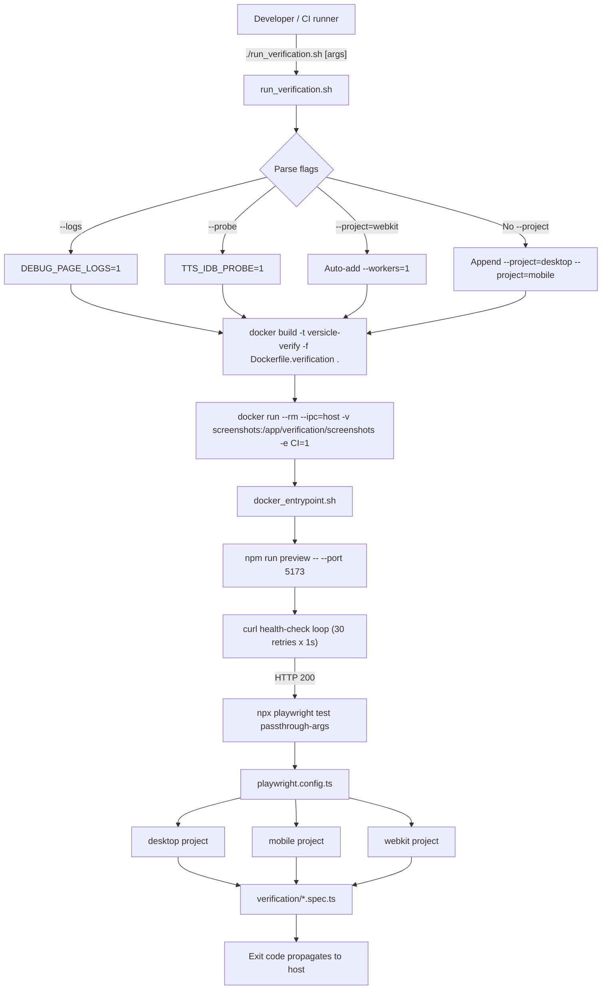
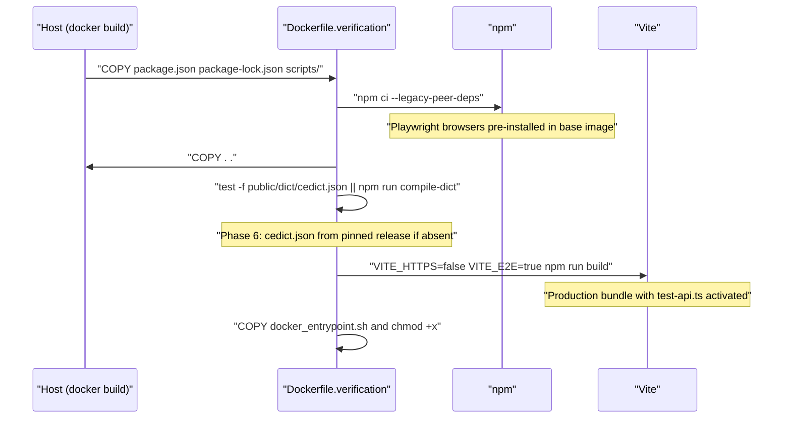
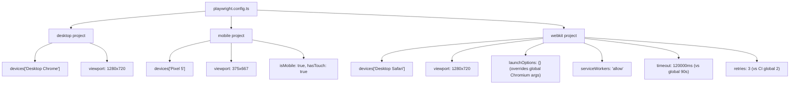
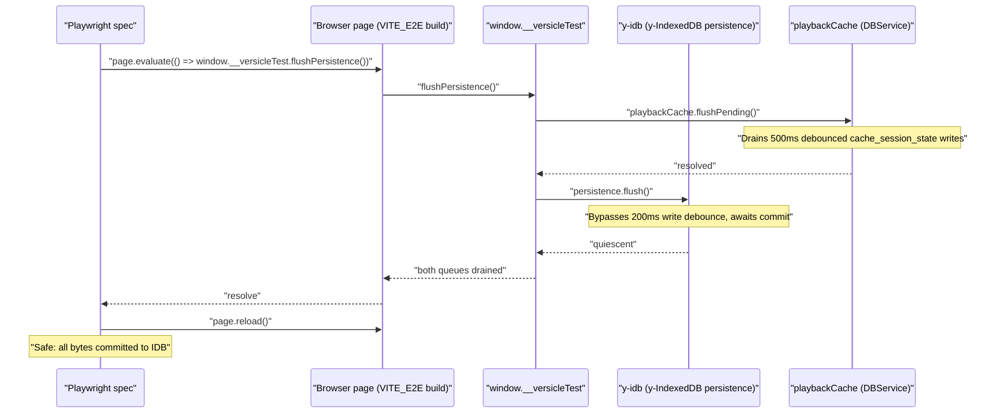
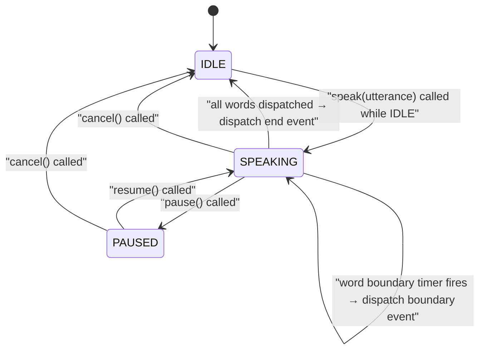
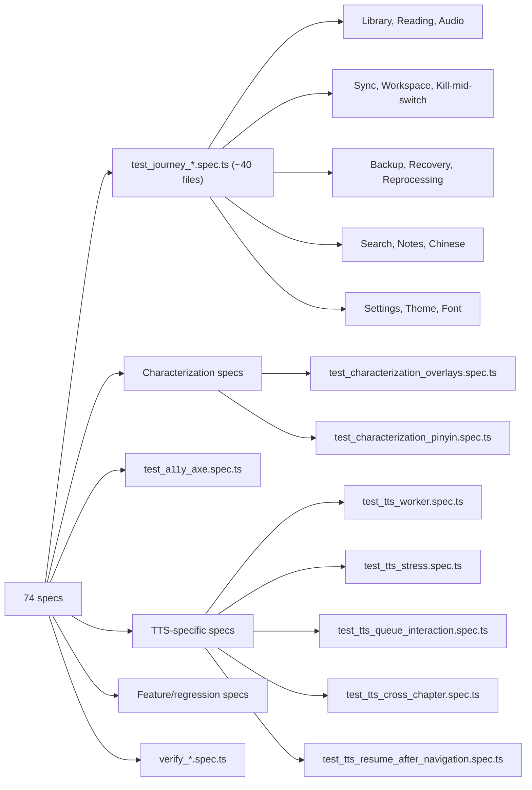
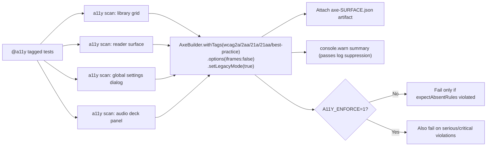

# End-to-End Verification

The Versicle E2E suite is a Dockerized, Playwright-based journey harness that
drives the fully-built production-mode app as a real user would: browser opens,
EPUB gets imported, reader navigates, TTS plays, sync propagates across two
browser contexts, and crashes are injected at deterministic kill points to prove
the recovery state machine. This document explains the design intent, then
drills into every layer from orchestration script to individual spec technique,
including the hard-won WebKit robustness lessons that now live as comments in
[playwright.config.ts](../../playwright.config.ts).

For the broader test-pyramid context — unit tests, Vitest config, coverage
baseline, emulator suites — see [Testing strategy](63-testing-strategy.md).
For CI quality gates, see [CI and quality gates](65-ci-and-quality-gates.md).

---

## 1. Design intent: why a Dockerized suite?

The conventional approach for Playwright is to run it directly against `npm run
dev` or `vite preview` on the developer's machine. Versicle deliberately takes
the heavier path of building and serving from inside a Docker container for
four reasons:

**1. Production parity, not dev-server parity.** The Vite dev server uses HMR
modules with no tree-shaking and no bundler splitting. The Docker build runs
`VITE_E2E=true npm run build` — the full production pipeline — and then serves
it with `vite preview`. This means bundle-level bugs (leaked mock code, TTS
worker import contamination, lazy-chunk race conditions) surface in the same
lane that catches functional regressions.

**2. Deterministic platform.** The `mcr.microsoft.com/playwright:v1.60.0-jammy`
base image pins a specific Playwright version and ships the browser binaries at
known build levels. A "passes on my machine, fails in CI" class of bugs is
structurally impossible — the container is the environment.

**3. The `VITE_E2E` gate.** The build-time flag `VITE_E2E=true` (visible in
[Dockerfile.verification](../../Dockerfile.verification)) causes `src/main.tsx` to
dynamically import `src/test-api.ts` and install `window.__versicleTest` at
boot. This API does not exist in production (only `DEV` or `VITE_E2E` builds
activate it), so test seams stay structurally absent from user-facing builds
rather than simply unreachable.

**4. Artifact persistence.** `run_verification.sh` mounts
`verification/screenshots/` from the host into the container, so every
`captureScreenshot()` call lands a real PNG on disk, accessible after the
container is gone, and uploadable as CI artifacts without additional tooling.

---

## 2. The pipeline: from `run_verification.sh` to `npx playwright test`



### Flag handling in detail

[run_verification.sh](../../run_verification.sh) parses its argument list before
handing the remainder to `docker run … versicle-verify`:

| Flag | Effect |
|------|--------|
| `--help` | Print LLM.txt-format usage and exit (no Docker build) |
| `--logs` | Set `-e DEBUG_PAGE_LOGS=1` in the container; enables `page.on('console')` forwarding in the `utils.ts` page fixture |
| `--probe` | Set `-e TTS_IDB_PROBE=1`; causes `utils.ts` to inject `_idb_probe.js` into every page and dump its summary after each test |
| `--project=webkit` | Detected by `*webkit*` pattern; auto-appends `--workers=1` unless the caller already set `--workers` |
| *(no `--project`)* | Appends `--project=desktop --project=mobile` (webkit excluded from the default run) |

All other arguments pass through to `npx playwright test` unchanged, including
`--grep`, `--workers`, specific spec file paths, and `--headed`.

### `--ipc=host` and shared memory

The `docker run` invocation passes `--ipc=host`. Without it, the container's
`/dev/shm` device is capped at 64 MB, which is insufficient for Chromium's
shared memory renderer and causes "Page crashed" renderer failures,
particularly during long and memory-intensive journeys. The flag shares the
host's IPC namespace with the container. It is Playwright's own documented
recommendation for browser-in-Docker scenarios.

### The entrypoint

[verification/docker_entrypoint.sh](../../verification/docker_entrypoint.sh) runs
three steps inside the container:

1. `npm run preview -- --port 5173 --host &` — starts the Vite preview server
   in the background (serving the pre-built `dist/`)
2. A `curl` poll loop — 30 retries at 1-second intervals against
   `http://localhost:5173`, failing with exit 1 if the server never starts
3. `npx playwright test "$@"` — runs the suite with all passthrough arguments;
   `EXIT_CODE=$?` is captured and propagated to `docker run`

The preview server PID is killed at the end to cleanly terminate the container
process tree.

---

## 3. The Dockerfile build



Key build-time environment variables:

| Variable | Value | Purpose |
|----------|-------|---------|
| `VITE_HTTPS` | `false` | Disables the dev-cert HTTPS mode; the preview server listens on plain HTTP, matching the `BASE_URL=http://localhost:5173` the runner passes |
| `VITE_E2E` | `true` | Activates the `window.__versicleTest` API (see §6); kept out of the production build by this gate |

The `npm ci --legacy-peer-deps` step uses the `--legacy-peer-deps` flag because
some vendored workspace packages (`packages/y-idb`, `packages/y-firestore-crdt`)
declare peer dependencies that would otherwise trigger npm 7+ conflict errors.

Layer ordering follows the canonical "copy lock-files first, then source" pattern
so that the npm install layer is cached as long as `package.json`/
`package-lock.json` are unchanged — avoiding a multi-minute reinstall on every
code change.

---

## 4. The Playwright project matrix

[playwright.config.ts](../../playwright.config.ts) declares three projects with
rationale comments worth reading verbatim:



### Shared settings

All three projects share a base `use` configuration:

```typescript
use: {
  baseURL: process.env.BASE_URL ?? 'https://localhost:5173',
  trace: 'on-first-retry',
  launchOptions: {
    args: [
      '--disable-web-security',
      '--disable-features=IsolateOrigins,site-per-process',
      '--ignore-certificate-errors',
    ],
  },
}
```

`--disable-web-security` is required because epubjs loads blob-URL iframes
that are technically cross-origin relative to the parent document's `localhost`
origin. `--ignore-certificate-errors` is present for the local dev path
(where `baseURL` defaults to `https://localhost:5173` with a self-signed cert);
the Docker path overrides `BASE_URL=http://localhost:5173`, making this flag
inert but harmless.

### Desktop project

Chrome, 1280×720. The default project for development runs. The global
`launchOptions` arguments above apply. No per-project overrides.

### Mobile project

Pixel 5 device emulation, 375×667, `isMobile: true`, `hasTouch: true`.
Exercises responsive layout breakpoints, the mobile settings tablist (which
has lower tabs that sit below the fold and must be scrolled into view before
clicking), and touch event paths.

### WebKit project

WebKit ("Desktop Safari") at the same 1280×720 viewport. The WebKit project
carries additional configuration that encodes hard-won lessons about headless
WebKit behavior in a container:

**`launchOptions: {}`** — overrides the shared `launchOptions` to an empty
object, dropping the Chromium-specific flags (`--disable-web-security`,
`--disable-features=IsolateOrigins,site-per-process`, `--ignore-certificate-errors`)
that are invalid for WebKit and cause launch errors if passed.

**`serviceWorkers: 'allow'`** — initially Playwright's default, but the project
once had it explicitly disabled. The comment explains the full story: when
service workers were blocked, `navigator.serviceWorker.ready` never resolved,
so the app's `waitForServiceWorkerController()` — which gates the entire UI
behind a `swInitialized` flag — fell through to its 3-second timeout on every
single page load. This added roughly 2 seconds of dead time per load on WebKit
alone. With service workers allowed, the SW registers and activates in ~10ms,
reaching parity with Chromium.

**`timeout: 120000`** — WebKit's extended test timeout (120 seconds vs the
global 90 seconds). The comment attributes the previous need for a 180-second
timeout to the now-removed per-load 3-second service-worker penalty. The
current 120-second ceiling leaves ~2x headroom over the slowest observed
WebKit test (the multi-device sync handoff journey at ~58 seconds under full
parallel load).

**`retries: 3`** — WebKit retries more aggressively (3 vs 2 for all other
projects under CI). The comment distinguishes two sources of WebKit flakiness
that retries absorb:

1. **Instance degradation.** WebKit reuses one long-lived browser instance per
   worker across the entire run. Over its ~25-test lifetime, memory/disk/IO
   accumulate, causing render-sensitive panels (for example the audio deck
   settings tab) to occasionally miss a paint deadline within the default wait.
   These failures are environmental, not deterministic — the tests themselves
   pass in isolation.

2. **CPU/IO contention.** Full-suite WebKit runs keep the project parallel for
   runtime efficiency, so multiple WebKit worker processes contend for the same
   CPU/IO resources. This intermittently lags a reader or library load enough
   to miss a timing-sensitive assertion.

### CI=1 serial mode

`playwright.config.ts` sets `workers: process.env.CI ? 1 : undefined`. The
`run_verification.sh` script passes `-e CI=1` to the container. Combined with
WebKit's auto-serialization from the `--workers=1` flag added by the script,
this means:

- **Desktop and mobile**: serial within the container (one Playwright worker
  process), which is safe because `--ipc=host` ensures no shared-memory
  starvation.
- **WebKit** (when explicitly targeted): forced to one worker regardless of CI
  by the script, then again by CI=1 — doubly serial, which is the intended
  behavior.

Parallelism is the local-dev default (no `CI` env set, no `--workers` override)
to keep local iteration fast.

---

## 5. The test-API seam: `window.__versicleTest`

This is the most architecturally significant piece of the E2E harness. The
problem it solves: Playwright tests used to be littered with `page.waitForTimeout(1500)`
calls that existed purely to let debounced IndexedDB writes reach disk before a
`page.reload()`. These sleeps were both fragile (too short on slow CI, too long
in fast test runs) and deceptive (a well-placed sleep can mask a real hang).

The solution is a typed, page-side API installed by [src/test-api.ts](../../src/test-api.ts)
that exposes deterministic flush and reset operations.



### API surface

The `VersicleTestApi` interface declared in both `src/test-api.ts` and mirrored
in [verification/utils.ts](../../verification/utils.ts) (since `tsconfig.e2e.json`
excludes `src/`) defines:

| Method | What it does |
|--------|-------------|
| `flushPersistence()` | Drains the `playbackCache` 500ms debounce AND the y-idb 200ms write debounce via the vendored fork's first-class `flush()`. Times out loudly after 10 seconds if a transaction hangs. |
| `resetApp()` | Delegates to `wipeAllData({ reload: false })` — flushes, closes every writer, deletes both app databases, clears Versicle-owned localStorage and caches. No reload — the caller controls navigation. |
| `disconnectYjs()` | Destroys the y-idb persistence binding so `versicle-yjs` releases its IndexedDB locks before spec teardown deletes the database. |
| `closeDb()` | Closes the `EpubLibraryDB` connection. Legacy fallback for builds where `resetApp` was unavailable. |
| `genai.setMock(fixture)` | Swaps the composition-root `GenAIClient` for a `MockGenAIClient` primed with a response or error. |
| `genai.setDebugMode(enabled)` | Toggles GenAI content-analysis debug mode (used by the P6 overlay characterization specs). |
| `seedContentAnalysis(bookId, sectionId, payload)` | Writes through `useContentAnalysisStore` so the reader's debug-highlight layer picks it up like real GenAI output. |
| `tts.play()` | Routes through `TtsController.play()` — same path the UI uses. Replaced the deleted `window.useTTSStore` shim. |
| `tts.pause()` | As above for pause. |
| `reader.isReady()` | `getActiveReaderEngine()?.status === 'ready'`. |
| `reader.currentCfi()` | Current location start CFI via the active `ReaderEngine`. |
| `reader.currentHref()` | Current section href. |
| `reader.locationsTotal()` | Length of the epubjs locations index. |
| `reader.hasManager()` | Whether the overlay container is mounted. |
| `reader.highlightCount(layer)` | Count of highlights in a named layer (`annotation`, `tts`, `history`, `debug`, `search`). |
| `reader.next()` / `reader.prev()` / `reader.display(target)` | Typed navigation commands through the active engine. |

### Installation gate

`src/main.tsx` installs the API conditionally:

```typescript
if (import.meta.env.DEV || import.meta.env.VITE_E2E === 'true') {
  void import('./test-api')
    .then(({ installTestApi }) => installTestApi())
    .catch((error) => console.error('Failed to install test API:', error));
}
```

The dynamic import keeps `src/test-api.ts` and all its dependencies (`wipeAllData`,
`getActiveReaderEngine`, `getTtsController`, etc.) out of the production bundle.
Production browsers never execute this code path; the `window.__versicleTest`
property is simply absent.

### The flush deadline

`flushPersistence` uses a race between the actual flush and a 10-second
`setTimeout` deadline:

```typescript
const FLUSH_DEADLINE_MS = 10_000;
const deadline = new Promise<never>((_, reject) => {
  deadlineTimer = setTimeout(() => reject(
    new Error(`[test-api] flushPersistence: y-idb queue did not drain within ${FLUSH_DEADLINE_MS}ms ...`)
  ), FLUSH_DEADLINE_MS);
});
await Promise.race([persistence.flush(), deadline]);
```

This means a hung IndexedDB transaction fails the test loudly with a
descriptive error instead of stalling the suite indefinitely. The fallback in
`waitForPersistedWrites()` (in `utils.ts`) still accepts a 1500ms sleep for
builds that do not have the API, degrading gracefully rather than silently
skipping the wait.

---

## 6. Shared test infrastructure: `verification/utils.ts`

[verification/utils.ts](../../verification/utils.ts) is the only file all specs
import. It provides the extended `test` fixture, the `VersicleTestApi` type
declaration (mirrored from `src/test-api.ts`), and a set of shared helpers.

### The extended `test` fixture

```typescript
export const test = base.extend<{ sanitizationDisabled: boolean }, { _suppressLogs: void }>({
  sanitizationDisabled: [true, { option: true }],
  _suppressLogs: [async ({}, use) => { /* noop console.log/info/debug */ }, { scope: 'worker', auto: true }],
  page: async ({ page, sanitizationDisabled }, use, testInfo) => { ... }
})
```

Two custom fixtures extend Playwright's built-in:

**`sanitizationDisabled`** (per-test option, default `true`). When true, injects
`window.__VERSICLE_SANITIZATION_DISABLED__ = true` before app boot via
`addInitScript`. This skips epubjs CFI sanitization, which was the legacy
default for the entire suite (an admitted honesty gap documented in TESTING.md).
The Phase 6 overlay and pinyin characterization specs opt out:

```typescript
test.use({ sanitizationDisabled: false });
```

This causes those specs to exercise the real sanitize path, matching production
behavior for CFI computation.

**`_suppressLogs`** (worker-scoped, auto-applied). Replaces `console.log`,
`console.info`, and `console.debug` with no-ops across the worker process.
`warn` and `error` remain to keep failure output visible. Override with
`./run_verification.sh --logs`.

### The page fixture

Every page receives:

1. `page.setDefaultTimeout(10000)` and `setDefaultNavigationTimeout(10000)` —
   10-second defaults for all assertions and navigations, tighter than
   Playwright's 30-second global for faster failure discovery.
2. Conditional `DEBUG_PAGE_LOGS` console forwarding.
3. Optional `TTS_IDB_PROBE` init-script injection (the `_idb_probe.js` blob).
4. The `tts-polyfill.js` mock Web Speech API (always injected).
5. Optional `__VERSICLE_SANITIZATION_DISABLED__` init-script.
6. Post-test IDB probe dump (when `TTS_IDB_PROBE` is set).

### Key helper functions

| Function | Purpose |
|----------|---------|
| `resetApp(page)` | Full data wipe + reload. Prefers `window.__versicleTest.resetApp()` + service worker unregister; falls back to manual IDB deletion. |
| `waitForPersistedWrites(page)` | Calls `window.__versicleTest.flushPersistence()`; falls back to 1500ms sleep if API unavailable. |
| `ensureLibraryWithBook(page)` | Idempotent: if Alice in Wonderland is already present, returns immediately. Otherwise clicks "Load Demo Book" and waits for the card. |
| `captureScreenshot(page, name, hideTtsStatus?)` | Saves to `verification/screenshots/${name}_{mobile,desktop}.png`. Optionally hides the TTS debug overlay (`#tts-debug`) to avoid it appearing in screenshots. |
| `navigateToChapter(page, chapterId?)` | Opens the TOC, scrolls the target item into view (needed for off-screen items), clicks it, waits for the TOC to close, and waits for the CompassPill to appear. |
| `getReaderFrame(page)` | Returns the epubjs iframe Frame (matching by name `epubjs` or blob URL), or null. |
| `acceptConfirm(page)` | Clicks the Radix `ConfirmDialog` confirm button (replaces legacy `page.on('dialog')` for the `window.confirm`-removed flows). |
| `openSettings(page)` | Clicks the settings button and waits for the settings tablist. |
| `gotoSettingsTab(page, id)` | Scrolls and clicks a named settings tab, asserts `aria-selected`. |
| `openAudioSettings(page)` | Opens audio deck, scrolls the settings tab into view, force-clicks it (overcomes the mobile Sheet's tts-queue centerpoint interception). |
| `switchAudioPanelView(page, view)` | Switches audio deck between "Up Next" and "Settings" views; same force-click pattern. |
| `closeSettings(page)` | Force-clicks the close button and waits for the tablist to detach. |
| `waitForReaderReady(page, opts?)` | Polls `window.__versicleTest.reader.isReady()`. Optional `{locations: true}` also waits for `locationsTotal() > 0`. |

---

## 7. The TTS polyfill: `verification/tts-polyfill.js`

All E2E tests run against a mock Web Speech API, never against a real TTS
provider. The mock is injected into every page via `page.addInitScript()` in
the page fixture before the app boots.



The mock lives at [verification/tts-polyfill.js](../../verification/tts-polyfill.js).
Key design decisions:

**Main-thread, not Web Worker.** The comment explains the history: the mock
used to run in a dedicated Web Worker (`public/mock-tts-worker.js`). WebKit's
worker↔main `postMessage` delivery is unreliable in the headless test container:
messages — including the critical `'start'` event — were intermittently dropped
or stalled. Because `WebSpeechProvider.play()` resolves on the utterance `start`
event and serializes play/pause through a single task chain, a dropped `start`
event wedged the entire TTS sequencer permanently. Moving to a main-thread
`setTimeout`-driven engine removes the worker message channel entirely.

**Word-by-word timing.** The engine tokenizes each utterance by whitespace and
schedules one `setTimeout` per word at `(60/150)*1000/rate` milliseconds (150
WPM at rate 1 = 400ms/word). This exercises the real boundary-event handling
in the TTS pipeline without being so fast that race conditions are skipped or
so slow that tests time out.

**`SpeechSynthesisEvent` is always polyfilled.** The class is overridden
unconditionally to avoid native constructor checks failing when the mock
utterance object is passed to the real `SpeechSynthesisEvent` constructor in
some browsers.

**`#tts-debug` overlay.** The mock creates a small fixed-position `<div id="tts-debug">` with `data-testid="tts-debug"` and `aria-hidden="true"`. This provides machine-readable `data-status`, `data-rate`, `data-char-index`, and `data-last-event` attributes that specs can assert against without depending on application UI. It is aria-hidden so the reader surface axe scan does not count it as an unlandmarked region node.

**Voice list.** Two mock voices are registered (`Mock Voice 1` lang `en-US`,
`Mock Voice 2` lang `en-GB`) with a 500ms delayed `voiceschanged` event, mirroring
real browser behavior where voices are not synchronously available.

---

## 8. The IndexedDB probe: `verification/_idb_probe.js`

[verification/_idb_probe.js](../../verification/_idb_probe.js) is opt-in
instrumentation for diagnosing IndexedDB hangs. Activated by
`./run_verification.sh --probe <spec>` which sets `TTS_IDB_PROBE=1` in the
container environment, causing the page fixture to inject it via `addInitScript`
before the app boots.

The probe wraps three APIs at the page level:

**`IDBFactory.prototype.open`** — records every database open request: start
time, whether/when it settled, duration. Catches a `getDB()` that never opens
(for example if blocked by another connection holder).

**`IDBDatabase.prototype.transaction`** — records every transaction: start
time, object stores touched, read/write mode, settlement. A transaction that
starts but never fires `complete`/`error`/`abort` is a genuine hang. The probe
captures a trimmed call stack at open time so an outstanding transaction can
be attributed to the exact call site.

**Event-loop heartbeat** — a self-scheduling `setTimeout(beat, 30)` measures
the gap between beats. Gaps larger than 250ms indicate main-thread starvation
rather than slow disk I/O — the signature of the specific WebKit TTS sequencer
hang that motivated this probe.

After each test body, the page fixture dumps the probe summary:

```typescript
const summary = await page.evaluate(() => (window as any).__idbProbe?.summary?.() ?? null);
```

The summary includes: total transaction count, outstanding (hung) transactions
with their age and call site, slow transactions (>1s), per-store worst durations,
outstanding DB opens, and the maximum observed event-loop gap.

---

## 9. The test-flags system: `src/test-flags.ts`

[src/test-flags.ts](../../src/test-flags.ts) provides typed readers for the input
flags that Playwright injects via `page.addInitScript()` before the app boots.
These must be set before the app initializes — which is why they live as raw
`window.__VERSICLE_*` globals rather than inside `installTestApi()`. Production
code never reads them directly; all access is through this module's functions.

| Flag | Reader function | Default |
|------|----------------|---------|
| `__VERSICLE_MOCK_FIRESTORE__` | `isMockFirestoreEnabled()` | `false` |
| `__VERSICLE_MOCK_USER_ID__` | `getMockFirestoreUserId()` | `'mock-user'` |
| `__VERSICLE_MOCK_SYNC_DELAY__` | `getMockSyncDelayMs()` | `undefined` |
| `__VERSICLE_FIRESTORE_DEBOUNCE_MS__` | `getFirestoreDebounceOverrideMs()` | `undefined` |
| `__VERSICLE_SWAP_PAUSE__` | `getSwapPausePoint()` | `undefined` |
| `__VERSICLE_SANITIZATION_DISABLED__` | `isSanitizationDisabled()` | `false` |

The three `SwapPausePoint` values (`'swap:staged'`, `'swap:before-apply'`,
`'swap:mid-apply'`) arm the staged workspace swap to park at a deterministic
kill point, which the kill-mid-switch journey spec uses to simulate process
death (see §11).

---

## 10. Spec categories and what each covers

The 74 specs in `verification/` fall into several distinct categories:



### Journey specs

The `test_journey_*.spec.ts` files are the core of the suite. Each drives a
coherent user scenario from an empty slate:

**Library journey** ([test_journey_library.spec.ts](../../verification/test_journey_library.spec.ts)):
Empty library → Load Demo Book → verify card → delete → upload from file
(alice.epub via `setInputFiles`) → `waitForPersistedWrites` → reload → verify
persistence → click to open reader → verify URL pattern.

**Reading journey** ([test_journey_reading.spec.ts](../../verification/test_journey_reading.spec.ts)):
Opens book → navigates via TOC → exercises ArrowRight/ArrowLeft keyboard
navigation with a frame-text diff assertion → verifies TOC item text → tests
CompassPill accessibility attributes (`role="button"`, `tabindex="0"`).

**Audio journey** ([test_journey_audio.spec.ts](../../verification/test_journey_audio.spec.ts)):
Play → pause from CompassPill → open Audio Deck Sheet → verify queue has ≥3
items and non-empty text → switch to settings view → verify "Voice & Pace" and
"Flow Control" sections → return to library → verify summary pill visible.

**Audio bookmarking** ([test_journey_audio_bookmarking.spec.ts](../../verification/test_journey_audio_bookmarking.spec.ts)):
Previously WebKit-skipped. Now passes. Starts playback, waits 1s for index
advance, pauses, re-plays within 2s (triggering Dragnet capture), polls
`window.useAnnotationStore.getState().annotations` for a bookmark, then
programmatically triggers inline triage via `window.useReaderUIStore`.

**Firestore sync** ([test_journey_firestore_sync.spec.ts](../../verification/test_journey_firestore_sync.spec.ts)):
Two browser contexts (`contextA`, `contextB`). Device A imports 5 books and
syncs via `MockFireProvider`. Device B loads the same mock user's Firestore
snapshot, sees the sync-halt warning, switches workspace, handles the Radix
overlay interception pattern (see §12), and re-supplies the epub binary for
the offloaded book.

**Kill-mid-switch** ([test_journey_kill_mid_switch.spec.ts](../../verification/test_journey_kill_mid_switch.spec.ts)):
Sets `__VERSICLE_SWAP_PAUSE__` to arm each of three crash windows. The spec
creates a non-empty library, arms the swap, executes the switch, calls
`page.close()` at the armed point (simulating process death), reopens the page
in the same context (IDB and localStorage survive, exactly like a real crash),
and verifies the recovery boot arm picks up from the correct migration state.
Also verifies rollback restores the previous workspace with its data intact.
`test.setTimeout(180000)` is set for this spec.

**Settings persistence** ([test_journey_settings_persistence.spec.ts](../../verification/test_journey_settings_persistence.spec.ts)):
Changes settings values, reloads, and asserts they survive. Exercises the Yjs
CRDT sync path for user preferences.

**Chinese** ([test_journey_chinese.spec.ts](../../verification/test_journey_chinese.spec.ts)):
Uploads `test_chinese.epub` (generated by `create_test_chinese_epub.cjs`),
opens the reader, enables the Pinyin overlay via settings, and verifies that
pinyin ruby text renders above CJK characters. The overlay is portaled into the
parent document (not the epub iframe), which is why the assertions query the
parent document's DOM.

**Sync scenarios** ([test_journey_sync_scenarios.spec.ts](../../verification/test_journey_sync_scenarios.spec.ts)):
The largest spec file (607 lines). Covers the multi-device seamless handoff:
Device A reads to a specific position, Device B opens the same book in a fresh
context and receives a sync-halt warning, switches workspace, re-supplies the
epub file, and the reading position from Device A appears on Device B. Also
covers the note marker affordance and other sync edge cases. This is the spec
whose slowest WebKit run (~58s) drove the 120-second project timeout.

### Characterization specs

**Overlays** ([test_characterization_overlays.spec.ts](../../verification/test_characterization_overlays.spec.ts)):
Explicitly sets `test.use({ sanitizationDisabled: false })` to exercise the
real sanitize path. Uses `window.__versicleTest.reader.highlightCount('annotation')`
rather than polling `window.rendition`. Pins annotation rendering, search
highlight layer, history highlight layer, debug highlight layer, and TTS
highlight layer. The spec is an "entry gate" (P6) — it must remain green before
any Phase 6 reader engine internals are touched.

**Pinyin** ([test_characterization_pinyin.spec.ts](../../verification/test_characterization_pinyin.spec.ts)):
Also opts into real sanitization. Pins pinyin geometry and ruby text rendering
against the CURRENT implementation before the reader engine strangler migration.

### Accessibility spec

[test_a11y_axe.spec.ts](../../verification/test_a11y_axe.spec.ts) uses
`@axe-core/playwright`'s `AxeBuilder` to scan four surfaces: library grid,
reader, global settings dialog, and audio deck panel. See §13 for the full
accessibility story.

### TTS-specific specs

**Worker smoke test** ([test_tts_worker.spec.ts](../../verification/test_tts_worker.spec.ts)):
Proves the TTS engine genuinely runs in a real Web Worker. Uses
`window.__ttsWorkerSmokeTest()` (installed in `src/main.tsx`) which boots the
worker, drives a full play cycle across the Comlink boundary (setQueue → play →
provider start/end events → status broadcasts → queue advance), and returns a
typed result. Asserts `ok: true`, `queueLength: 2`, and that the status
progressed through the play cycle. This test does NOT use the extended `test`
from `utils.ts` — it imports directly from `@playwright/test` to avoid the TTS
polyfill being injected before the real worker is tested.

**Stress test** ([test_tts_stress.spec.ts](../../verification/test_tts_stress.spec.ts)):
Two scenarios: rapid play/pause (10 toggles at 150ms intervals) to verify the
UI remains responsive and the queue is intact; mid-sentence cancel to verify the
sequencer recovers cleanly.

---

## 11. WebKit-specific robustness lessons

The WebKit project's extended comments document an evolution from "WebKit is
flaky, let's add timeouts" to "WebKit has specific failure modes; here's the
root cause and the fix for each."

### Lesson 1: Service worker blocking caused a 2s-per-load penalty

**Symptom.** WebKit tests were consistently slower than Chromium, even when
CPU was not contended.

**Root cause.** An earlier version of `playwright.config.ts` blocked service
workers on WebKit (a defensive choice, since some SW features behave differently
in WebKit). But `serviceWorkers: 'block'` makes `navigator.serviceWorker.ready`
never resolve. The app's `waitForServiceWorkerController()` — which the UI
mount gates behind a `swInitialized` flag — has a 3-second timeout fallback.
This fallback fired on every single page load in the WebKit lane, adding ~2
seconds of artificial dead time per navigation.

**Fix.** Set `serviceWorkers: 'allow'` (the Playwright default). With the SW
allowed, the service worker registers and activates in ~10ms, reaching parity
with Chromium. The 180-second project timeout was then reduced to 120 seconds
because the original 180 was padded to absorb the now-removed 3s dead time.

### Lesson 2: Worker postMessage drops wedged the TTS sequencer

**Symptom.** The audio bookmarking journey was WebKit-flaky — it would pass
locally or in isolation but intermittently wedge in the headless container.

**Root cause.** The mock TTS engine used to run in a Web Worker
(`public/mock-tts-worker.js`). In the headless WebKit container, `postMessage`
delivery between the worker and main thread was unreliable — the `'start'`
event was sometimes dropped. `WebSpeechProvider.play()` resolves on the `start`
event and serializes all subsequent operations through a single task chain.
A dropped `start` event meant the entire TTS sequencer was permanently wedged.

**Fix.** Move the mock engine to run on the main thread via `setTimeout`. The
worker message channel is eliminated entirely. Events fire synchronously in
the main-thread task queue where `setTimeout` callbacks always execute, removing
the unreliable cross-thread channel from the path.

### Lesson 3: React Router's `startTransition` starved on WebKit

**Symptom.** After clicking the reader's back button, the route change from
`/read/:id` back to `/` was slow or sometimes missed on WebKit.

**Root cause.** React Router 7 wraps navigations in `startTransition()` by
default. On WebKit under load, the concurrent mode scheduler's low-priority
transitions could be starved, so the library route never re-rendered within
the test's wait.

**Fix.** The reader back button navigates with `{ flushSync: true }` (visible
in the audio bookmarking spec comment). This forces the navigation transition
to be synchronous on the React side, bypassing the scheduler starvation.

### Lesson 4: Per-test browser launch caused renderer crashes

**Symptom.** An earlier "fix" for WebKit instance degradation used a per-test
browser launch (each test got a fresh browser process). This introduced its
own failure mode: "Target crashed" renderer errors during the heavy
launch/teardown churn when each test was running serially across the WebKit
project.

**Root cause.** Rapid sequential browser launches consumed memory faster than
it was reclaimed, causing the renderer to crash mid-launch.

**Fix.** The underlying cause (IndexedDB hangs from the y-idb migration era)
was fixed at the source. With the hangs gone, the shared per-worker browser
model is safe again. The `utils.ts` comment explicitly describes this reversal:

> An earlier "fresh WebKit browser per test" override was added to dodge
> long-run instance degradation — but that degradation was caused by the
> IndexedDB hangs (Yjs persistence + cache_session_state), which are now
> fixed at the source. The per-test browser launch added its own cost…
> The shared per-worker browser avoids that churn.

### Lesson 5: Radix dialog overlay intercepts clicks after workspace-switch reload

**Symptom.** After the staged workspace switch completes its two-reload sequence,
click events on library cards (or on confirmation buttons) appeared to be
swallowed — nothing happened.

**Root cause.** The workspace switch lands on `/settings/sync` after each reload,
which causes the Radix `SettingsShell` dialog to re-open automatically. Meanwhile,
the app-level workspace confirmation modal appears on top. The Radix Dialog
backdrop (`[role="dialog"]`) is rendered as a sibling overlay that fills the
viewport. When two Radix dialogs are stacked, the lower dialog's backdrop makes
the upper dialog's content inert in some positions.

**Fix pattern** (documented in multiple specs):

```typescript
// The staged-swap reloads land back on /settings/sync, so the Radix SettingsShell
// dialog re-opens UNDER the confirmation modal and makes it inert — its overlay
// intercepts the "Yes, Finalize" click. Escape closes the settings dialog
// (its Escape handler still fires beneath the plain confirmation overlay),
// navigating back to the library so the confirmation button is interactable.
await page.keyboard.press('Escape');
await expect(page.getByRole('tablist', { name: 'Settings sections' })).not.toBeVisible({ timeout: 10000 });
await page.getByRole('button', { name: 'Yes, Finalize' }).dispatchEvent('click');
```

The pattern: press Escape (which closes the settings dialog without closing the
confirmation modal), wait for the settings tablist to detach (proof the backdrop
is gone), then dispatch the confirmation click.

### Lesson 6: Comlink timing and the IndexedDB getter

During the phase when TTS orchestration moved into a Web Worker via Comlink,
WebKit exhibited a specific timing issue: the first `getVoices()` call across
the Comlink boundary would return an empty array if called before the worker's
`voiceschanged` event had fired. The mock TTS polyfill's 500ms delayed
`voiceschanged` dispatch was the proxy for this behavior. The `_idb_probe.js`
was created precisely to measure whether the event-loop gap (the `maxLoopGapMs`
field) was a confounding factor — distinguishing "slow disk I/O" from
"main thread starvation."

WebKit also has a non-standard behavior where `window.indexedDB` is a getter
that throws in some contexts if called before the document is fully initialized.
The IDB probe wraps its `IDBFactory.prototype.open` override in a try/catch
for this reason (`try { ... } catch (e) { /* ignore */ }`).

---

## 12. The accessibility scan spec

[verification/test_a11y_axe.spec.ts](../../verification/test_a11y_axe.spec.ts)
covers four surfaces tagged `@a11y`:



### Baseline mode vs. enforced mode

The scan uses a "ratchet" model:

1. Every scan always runs (no skip) and attaches the full violation JSON as an
   artifact (`testInfo.attach()`).
2. A `console.warn` summary is printed (this level bypasses the suite's log
   suppression).
3. **Serious/critical violations only fail when `A11Y_ENFORCE=1`** is set.
4. **Fixed-baseline findings always fail**, regardless of `A11Y_ENFORCE`.

The `expectAbsentRules` parameter controls the fixed-baseline assertions. The
reader surface spec uses it with:

```typescript
await scanSurface(page, testInfo, 'reader', {
  expectAbsentRules: ['frame-title', 'aria-hidden-focus', 'region'],
});
```

**`frame-title`** was fixed in Phase 6: the ReaderEngine titles every section
iframe at content render (the C7 SR accessibility contract).

**`aria-hidden-focus`** was fixed in Phase 6: note markers ride the ReaderOverlay
`'interactive'` contract (focusable buttons are never inside an `aria-hidden`
container).

**`region`** was fixed in Phase 8: the CompassPill dissolve and the
`ReaderControlBar` is now a named region landmark; every reader-surface node
lives inside a landmark.

A regression in any of these three rules fails the nightly lane outright, even
without `A11Y_ENFORCE=1`.

### Frame scanning limitation

`options({ iframes: false })` and `setLegacyMode(true)` exclude the epubjs
blob iframes from axe scanning. This is intentional: epubjs creates and
destroys sandboxed blob iframes during section loads; axe's frame injection can
hang or throw against them. The `<iframe>` element itself is still audited by
the parent document scan (for `frame-title`). Accessibility of book content
inside the iframe is an open item (TESTING.md "honest caveats").

### Running the axe scans

```bash
./run_verification.sh --project=desktop --grep @a11y
# With enforcement:
A11Y_ENFORCE=1 ./run_verification.sh --project=desktop --grep @a11y
```

---

## 13. CI integration

The Docker E2E lane is deliberately **not a PR gate**. Per [TESTING.md](../../TESTING.md):

> In CI the Docker E2E lane is deliberately not a PR gate: it runs nightly +
> on `workflow_dispatch` via `.github/workflows/e2e-verification.yml`
> (experimental until proven stable on hosted runners).

[.github/workflows/e2e-verification.yml](../../.github/workflows/e2e-verification.yml)
runs three parallel jobs, one per project, via a matrix strategy:

```yaml
strategy:
  fail-fast: false
  matrix:
    project: [desktop, mobile, webkit]
steps:
  - uses: actions/checkout@v4
  - name: Run verification suite (Docker)
    run: ./run_verification.sh --project=${{ matrix.project }}
  - name: Upload screenshots
    if: always()
    uses: actions/upload-artifact@v4
    with:
      name: verification-screenshots-${{ matrix.project }}
      path: verification/screenshots/
      retention-days: 14
```

`fail-fast: false` ensures that a WebKit failure does not cancel the desktop
and mobile runs. Screenshots are uploaded unconditionally (`if: always()`) as
14-day artifacts, providing visual evidence even from failing runs. The per-job
`timeout-minutes: 90` covers the worst-case combined Docker build + suite run
time.

The `run_verification.sh` script passes `-e CI=1` to the container, which:
- Forces `workers: 1` in `playwright.config.ts` (serial execution)
- Enables retries: 2 (global) and 3 (WebKit)
- Forbids `test.only` (the `forbidOnly: !!process.env.CI` config flag)

---

## 14. Test fixtures: EPUBs and their roles

The `verification/` directory ships several test EPUBs:

| File | Role |
|------|------|
| `alice.epub` | The standard fixture. Used by the majority of journeys (library, audio, bookmarking, sync). Loaded via "Load Demo Book" or `setInputFiles`. |
| `pride-and-prejudice.epub` | Used in bulk-import and multi-book sync scenarios. |
| `frankenstein.epub` | Used in multi-book scenarios. |
| `jane-eyre.epub` | Used in multi-book scenarios. |
| `room-with-a-view.epub` | Used in multi-book scenarios. |
| `test_chinese.epub` | Chinese-content fixture for the Chinese journey and pinyin characterization. |
| `test_chinese_astral.epub` | Tests astral-plane CJK characters (Unicode supplementary planes). |

`create_test_chinese_epub.cjs` generates the Chinese test fixtures from a
template using the `epub-gen` or similar library; the checked-in files are the
pre-generated outputs. The `test_maintenance.spec.ts` and
`test_journey_reprocessing.spec.ts` specs open `EpubLibraryDB` directly with a
hardcoded version number — these must be updated when `src/db/db.ts` bumps the
DB schema version (noted in AGENTS.md as a maintenance coupling).

---

## 15. Authoring guidance: how to add a new journey spec

The following rules apply to new E2E coverage, derived from the program rules
in [TESTING.md](../../TESTING.md):

**Always use the extended `test` from `utils.ts`**, not Playwright's base
`test`. This injects the TTS polyfill, the test API, and the suppressed log
fixture automatically:

```typescript
import { test, expect } from './utils';
import * as utils from './utils';
```

**Reset state before each scenario.** Unless the spec is explicitly testing
persistence across a reload, call `await utils.resetApp(page)` at the start.
This calls `window.__versicleTest.resetApp()` (preferred) or the legacy IDB
deletion fallback, followed by a reload and library-ready wait.

**Use `waitForPersistedWrites` before reloads.** Any spec that asserts "X
survives a reload" must call `await utils.waitForPersistedWrites(page)` before
`page.reload()`. The function drains both the 500ms `playbackCache` debounce
and the 200ms y-idb write debounce deterministically.

**Prefer `data-testid` over text.** Text-based selectors break on localization
and copy changes. `data-testid` attributes are a first-class authoring surface
in Versicle components.

**Avoid fixed `page.waitForTimeout()` sleeps.** The existing codebase has some
residual sleeps, but they represent technical debt. New specs should use:
- `page.waitForFunction()` for store-state polls
- `waitForReaderReady()` for the reader engine
- `waitForPersistedWrites()` for IDB
- Playwright's built-in auto-waiting on `expect()` assertions

**Mock Firestore for sync scenarios.** Set `__VERSICLE_MOCK_FIRESTORE__` via
`page.addInitScript` before `page.goto()`. The mock provider uses
`localStorage` for storage (key `versicle_mock_firestore_snapshot`) and
supports all the sync operations the real Firestore provider does. Also set
`__VERSICLE_FIRESTORE_DEBOUNCE_MS__` to a small value (20ms) to speed up
the sync debounce cycle.

**Opt into real sanitization for overlay/geometry specs.** If your spec
asserts CFI-dependent behavior, add `test.use({ sanitizationDisabled: false })`
at the top of the file. This matches the production path.

**Don't add one-off bug specs.** Per the program rules: regression coverage
goes into the existing journey that owns the subject, as a separate `test()`
block in the same file. New `test_bug_XYZ.spec.ts`-style files are prohibited.

---

## 16. Honest caveats and open items

The documentation for the E2E suite is notable for its explicit honesty about
what a green run proves and does not prove:

**No real TTS provider.** All TTS tests run against the mock Web Speech
polyfill. Real provider latency, API key flows, Piper binary behavior, and
LemonFox cloud connectivity are not exercised in E2E.

**Sanitization off by default.** Most journeys run with
`__VERSICLE_SANITIZATION_DISABLED__ = true`. CFIs are computed
post-sanitize in production, so the suite measures behavior with sanitization
off for the majority of specs. Only `test_characterization_overlays.spec.ts`
and `test_characterization_pinyin.spec.ts` opt into real sanitization. This is
a documented open item.

**Mock sync, not real Firestore.** Sync journeys run against `MockFireProvider`,
not the real Firestore backend. The Firebase emulator suites in
`src/lib/sync/security-rules.test.ts` and `syncBackendContract.emulator.test.ts`
cover security rules and real-Firestore behavior, but those are not part of the
Docker E2E lane.

**No visual golden assertions.** Screenshots are captured by many journey specs
at key steps (for example `captureScreenshot(page, 'audio_1_hud_visible')`),
but there are no `toHaveScreenshot()` golden-image comparisons. Visual
regressions are detected by humans reviewing the CI artifact screenshots.
The plan (master plan §7) was to add golden-image assertions, but they were not
built before the program close.

**E2E is not a PR gate.** The Docker E2E lane runs nightly and on
`workflow_dispatch` only. It is experimental until proven stable on hosted
GitHub Actions runners. The PR gate is the `ci.yml` quality workflow (lint,
typecheck, vitest, build, ratchets).

---

## Cross-references

| Topic | Document |
|-------|---------|
| Overall testing strategy and the local gate | [Testing strategy](63-testing-strategy.md) |
| CI workflow structure and quality gates | [CI and quality gates](65-ci-and-quality-gates.md) |
| Accessibility requirements and layer 1/2 | [Accessibility](72-accessibility.md) |
| TTS worker architecture and Comlink boundary | [TTS app integration](51-tts-app-integration.md) |
| CRDT and y-idb persistence (what `flushPersistence` flushes) | [State management and CRDT](13-state-management-crdt.md) |
| Sync domain and staged workspace swap | [Domain: sync](36-domain-sync.md) |
| Reader engine and overlay contract | [Domain: reader engine](30-domain-reader-engine.md) |
| Reader UI, CompassPill, and overlays | [Reader UI and overlays](31-reader-ui-and-overlays.md) |
| Bootstrap lifecycle and service worker gate | [Bootstrap and lifecycle](14-bootstrap-and-lifecycle.md) |
| Build and bundling (VITE_E2E flag context) | [Build and bundling](60-build-and-bundling.md) |
| Program overhaul history and phase references | [Overhaul history](80-overhaul-history.md) |
