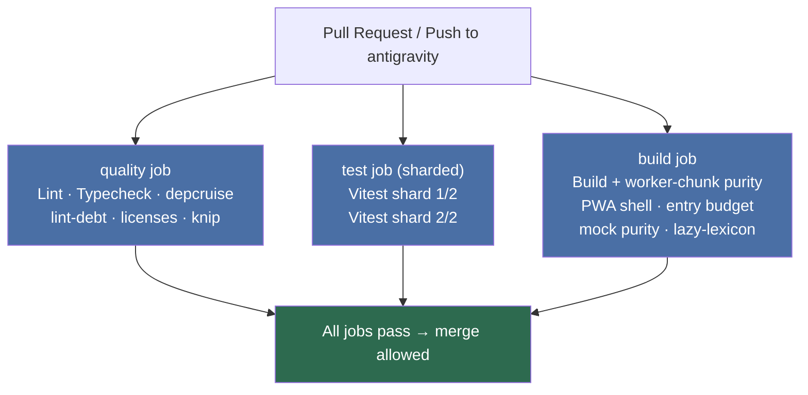
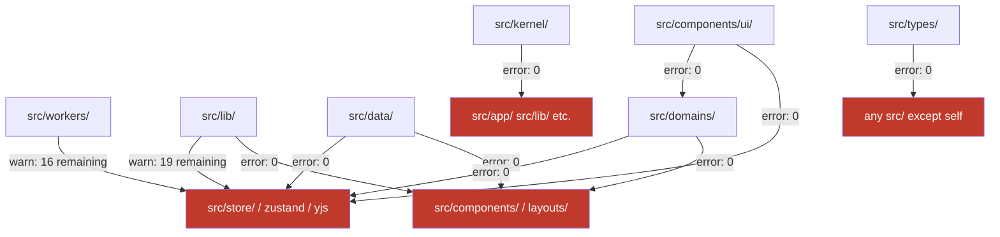
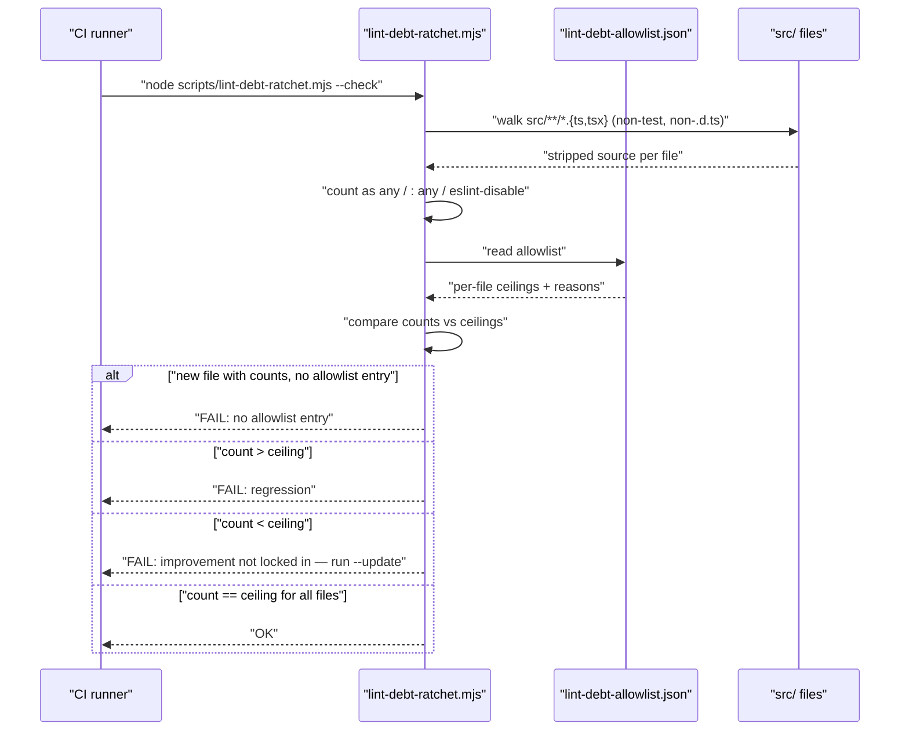
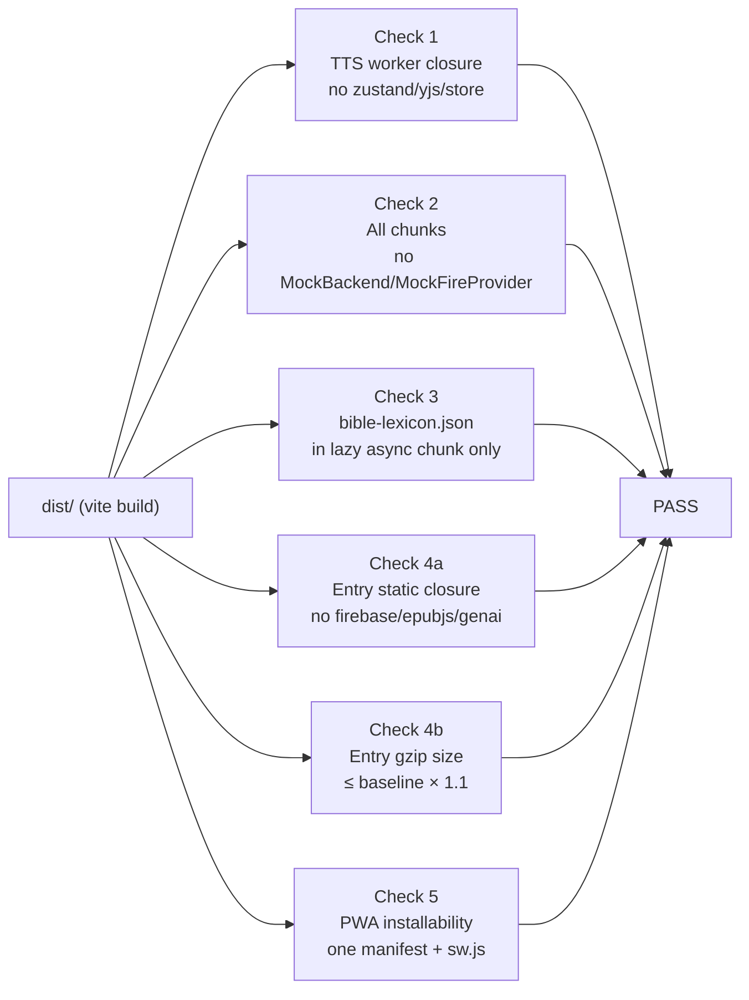

# CI & Quality Gates

Versicle's CI system is built around a single philosophy inherited from the ten-phase overhaul
program ([80-overhaul-history.md](80-overhaul-history.md)): **quality is a ratchet that only
tightens**. Every metric, count, and size floor is frozen in a committed baseline file. A PR
may only improve the number or leave it exactly where it found it; any regression fails the
build before merge. This document explains why the system is designed this way, what each gate
checks, how each ratchet script works mechanically, and what the failure path looks like.

---

## Why a Ratchet, Not a Fixed Rule

The conventional approach to quality gates is a hard threshold: "coverage must be at least
80%", "no `any` types allowed". Hard thresholds have two failure modes that both manifested
in Versicle before the overhaul:

1. **The "not my problem" threshold.** A threshold set at 80% tells every contributor that
   the codebase at 80.1% is fine. Nothing pushes it to 90%. The number drifts to the floor
   and stays there.

2. **The "impossible cliff" threshold.** A strict "zero `any`" rule applied to a codebase with
   138 `as any` sites creates a wall that blocks every PR until someone does a heroic cleanup.
   The practical result is the rule gets disabled, not the debt fixed.

The ratchet solves both: the floor is wherever the code actually is right now. Every
improvement is immediately locked in — you cannot "unimprove" by a later PR. The debt shrinks
monotonically over the life of the codebase. Anything that was not yet fixable when the
ratchet was set gets a documented justification in the allowlist; "add an unjustified entry"
is the meaningful policy violation, not "the count is non-zero".

The overhaul tracked this explicitly. The Phase 0 baseline was 138 `as any` sites and 245
`eslint-disable` directives. By Phase 9 close the production counts stood at 20 `any` sites
and 25 directives — every one with a per-file reason in
[lint-debt-allowlist.json](../../lint-debt-allowlist.json). The ratchet script enforces that those
numbers never go back up.

---

## The CI Workflow: Three Parallel Jobs

The primary CI definition is [.github/workflows/ci.yml](../../.github/workflows/ci.yml). It runs on
every push to `antigravity` or `main` and on every pull request.

```yaml
on:
  push:
    branches: [antigravity, main]
  pull_request:

concurrency:
  group: ${{ github.workflow }}-${{ github.ref }}
  cancel-in-progress: ${{ github.event_name == 'pull_request' }}
```

The `cancel-in-progress` policy is specific to pull requests: if a new push arrives on the
same PR branch while a run is still in progress, the old run is cancelled. Pushes to the
integration branches are never cancelled — every commit on `antigravity` gets a complete run.

The workflow defines three parallel jobs, all `ubuntu-latest`, all pinning the Node version
from [.nvmrc](../../.nvmrc) (currently `25`) rather than hardcoding it:

```yaml
- uses: actions/setup-node@v4
  with:
    node-version-file: .nvmrc
    cache: npm
```

The comment in the workflow file explains why this matters: `npm install` in CI can re-resolve
git dependencies and silently test a different tree than the lockfile. Every job uses `npm ci`
to guarantee the locked dependency graph.



### The `quality` Job

Runs six checks sequentially on a single runner:

| Step | npm script / command | What it checks |
|---|---|---|
| Lint | `npm run lint` → `eslint .` | ESLint rules including all boundary bans |
| Typecheck | `npx tsc -b` | All four tsconfig project references simultaneously |
| Dependency boundaries | `npm run depcruise:check` | depcruise ratchet vs `.dependency-cruiser-baseline.json` |
| Lint-debt ratchet | `npm run lintdebt:check` | `as any` / eslint-disable counts vs `lint-debt-allowlist.json` |
| License gate | `npm run licenses:check` | Production dep licenses + inventory + notices |
| Dead-code gate | `npm run knip` | Unused files, exports, types, and dependencies |

### The `test` Job

Runs Vitest with a 2-shard matrix so the test suite (3,103 tests across 307 files at P9
close) can run in parallel:

```yaml
strategy:
  fail-fast: false
  matrix:
    shard: [1, 2]
steps:
  - run: npx vitest run --shard=${{ matrix.shard }}/2
```

`fail-fast: false` means if shard 1 fails, shard 2 still runs and reports its own failures.

### The `build` Job

Performs a full production build (`tsc -b && vite build`) and then runs the artifact-purity
script ([scripts/check-worker-chunk.mjs](../../scripts/check-worker-chunk.mjs)) over the emitted
`dist/` with `--skip-build` so the build output is reused rather than rebuilt. A dictionary
compile step uses GitHub Actions cache keyed on
[scripts/cedict.lock.json](../../scripts/cedict.lock.json) to avoid downloading the full CC-CEDICT
release on every run:

```yaml
- id: dict-cache
  uses: actions/cache@v4
  with:
    path: public/dict
    key: cedict-${{ hashFiles('scripts/cedict.lock.json') }}
- name: Compile dictionary (pinned release, checksum-verified)
  if: steps.dict-cache.outputs.cache-hit != 'true'
  run: npm run compile-dict
```

The cache comment in the workflow makes the failure mode explicit: a cache hit means the
network is never touched, so a flaky `mdbg.net` download can only ever fail a step — it can
never degrade an artifact by shipping an incomplete dictionary.

### Other Workflows

Three additional workflows exist but are **not PR gates**:

- [.github/workflows/e2e-verification.yml](../../.github/workflows/e2e-verification.yml) — the
  Docker/Playwright E2E suite, runs nightly at 09:23 UTC and on manual dispatch. Explicitly
  marked "experimental" in its header because hosted runners have not been verified green.
- [.github/workflows/deploy.yml](../../.github/workflows/deploy.yml) — deploys to GitHub Pages on
  push to `main`.
- [.github/workflows/android.yml](../../.github/workflows/android.yml) — builds and tests the
  Capacitor Android layer, triggered only when `android/**` paths change.

---

## Gate 1: ESLint and the Boundary Bans

[eslint.config.js](../../eslint.config.js) uses ESLint's flat config format. The rule set is not
simply "lint the code for style" — it is the primary **structural enforcement layer** for
architecture boundaries that dependency-cruiser cannot express as import-path rules.

### The `downgradeToWarn` Ratchet Pattern

A helper at the top of the config captures the upgrade lifecycle:

```js
const downgradeToWarn = (rules) =>
  Object.fromEntries(
    Object.entries(rules).map(([name, entry]) => [
      name,
      Array.isArray(entry) ? ['warn', ...entry.slice(1)] : 'warn',
    ]),
  );
```

New rule sets land at `warn` until the codebase is clean, then flip to `error`. The
`jsx-a11y` recommended preset is applied through this helper for the global scope:

```js
...downgradeToWarn(jsxA11y.flatConfigs.recommended.rules),
```

Phase 8 directories (the design system `src/components/ui/`, the settings shell
`src/app/settings/`, the shortcut service, and the pill feature homes) were cleaned and the
preset re-applied at full `error` in a carve-out block, creating a per-directory a11y
ratchet. See [72-accessibility.md](72-accessibility.md) for the accessibility story.

### Structural Import Bans

The config defines several constant rule shapes that encode architectural contracts and are
then spread into the relevant rule blocks.

**Cross-root relative import ban** — enforces path aliases:

```js
const crossRootRelativeImportPattern = {
  regex:
    '^(\\.\\./)+(app|components|data|domains|hooks|kernel|lib|store|types|test|workers)(/|$)',
  message: 'Cross-root relative import. Use the path alias...',
};
```

The codebase was codemodded clean (1,069 imports changed) at Phase 1 and the rule flipped to
`error`. Any future relative import that climbs out of one source root and re-enters another
fails the build.

**Raw IndexedDB ban** (`idb` import ban outside `src/data`):

```js
const idbImportBan = {
  name: 'idb',
  message: 'Raw IndexedDB access is the data layer's job...',
};
```

Applied at `error` to all `src/**` except `src/data/**`. The data layer is the only place
allowed to hold `idb` imports; everything else calls the typed repositories. See
[20-storage-gateway.md](20-storage-gateway.md).

**Raw-egress ban** — four selectors covering every egress surface:

```js
const rawEgressSelectors = [
  { selector: "CallExpression[callee.name='fetch']", message: '...' },
  { selector: "CallExpression[callee.object.name='globalThis'][callee.property.name='fetch'], ...", ... },
  { selector: "NewExpression[callee.name='XMLHttpRequest']", ... },
  { selector: "CallExpression[callee.property.name='sendBeacon']", ... },
];
```

All production code must go through `NetworkGateway.egress(destinationId, …)` from
`src/kernel/net/`. The one carve-out is `src/kernel/net/**` itself. Test files share the
carve-out because tests stub `fetch` via `vi.stubGlobal` rather than calling it.

**Readwrite-transaction ban** outside `src/data`:

```js
const readwriteTransactionSelector = {
  selector: "CallExpression[callee.property.name='transaction'] > Literal[value='readwrite']",
  message: 'readwrite transactions are banned outside src/data...',
};
```

This is the WebKit IndexedDB hang prevention rule. A `readwrite` transaction opened outside
the write-gate can overlap a Yjs flush and trigger the browser-level hang that the write-gate
was built to prevent. See [20-storage-gateway.md](20-storage-gateway.md) for the write-gate
architecture.

**`toLocale*` formatting ban** — directs all user-facing date/time/number rendering through
the cached, UI-locale-aware formatters in `src/kernel/locale/format.ts`:

```js
const toLocaleSelector = {
  selector: "CallExpression[callee.property.name=/^toLocale(String|DateString|TimeString)$/]",
  message: 'toLocale* formatting is banned (Phase 8 §F) — use the cached formatters...',
};
```

**`addEventListener('keydown')` ban** outside `src/app/shortcuts/`:

```js
const keydownListenerSelector = {
  selector: "CallExpression[callee.property.name='addEventListener'] > Literal[value='keydown']",
  message: "addEventListener('keydown') is banned outside src/app/shortcuts/...",
};
```

The P0 destructive-conflict hotfix traced to two overlapping `window keydown` registries. The
solution was one `KeyboardShortcutService` that receives all events, and a lint ban that
structurally prevents a second registry from forming.

**`vi.mock` ban in engine and provider directories** — these directories use injected fakes
instead of module mocks, which is both more robust and easier to read. The allowlist reached
zero at Phase 5b-PR4 for the engine directory and Phase 5a-PR2 for the provider directory.
One named exception remains in the provider directory: `@capacitor-community/text-to-speech`
(a native plugin with no injection seam).

**epubjs runtime import ban** — only `src/domains/reader/engine/` (the `EpubJsEngine` sole
runtime importer) and `src/domains/library/import/extract.ts` (the C8-sanctioned ingestion
preamble) may import the epubjs runtime package. Type-only imports (`allowTypeImports: true`)
are still legal everywhere. The epubjs CFI submodule is additionally quarantined to
`src/kernel/cfi/epubcfiShim.ts`.

### Flat-Config Rule-Replacement Semantics

A critical implementation detail repeated throughout the config file: in ESLint flat config,
a later block's `no-restricted-imports` (or `no-restricted-syntax`) **replaces** an earlier
block's declaration for the same files — rules with the same name never merge their options.
This means every carve-out block must restate the full set of patterns it wants to preserve,
not just the ones it is adding or removing. The config comments explicitly flag every such
restatement.

---

## Gate 2: TypeScript Project References (`tsc -b`)

The CI `Typecheck` step runs `npx tsc -b`, which compiles all four tsconfig project
references simultaneously:

| Config | Scope |
|---|---|
| `tsconfig.app.json` | `src/` production code |
| `tsconfig.test.json` | `src/**/*.test.*`, `src/test/**` |
| `tsconfig.node.json` | `vite.config.ts`, `vitest.config.ts`, tooling scripts |
| `tsconfig.e2e.json` | `verification/` Playwright suite |

All ~42,000 LOC of test code and all 78 Playwright spec files are typechecked as a build
invariant. This is boundary rule 10 from the master plan: TypeScript project references per
layer (kernel → data → state → domains → app) make dependency direction a compile-time
property. A domain that imports `app/` will fail `tsc -b`, not just a lint warning.

---

## Gate 3: Dependency-Cruiser Ratchet

### Design Intent

[.dependency-cruiser.cjs](../../.dependency-cruiser.cjs) encodes the module layering contract
(master plan §2 boundary rules, called C12 in the contract inventory). The key design choice:
all rules are set to `severity: "warn"` so that `depcruise` always exits 0. The ratchet is
enforced by a separate script that compares current violation counts against a frozen
baseline.

This separation solves a bootstrapping problem: you cannot land a rule at `severity: "error"`
while violations exist. A `warn`-severity rule with a frozen baseline lets you say "this
violation count may not grow" and progressively eliminate violations without blocking the
build on the very first day. Once a rule reaches zero violations, it flips to `error` — at
that point the baseline entry is redundant (error exits non-zero immediately) but is kept for
documentation.

### The Baseline Script

[scripts/depcruise-baseline.mjs](../../scripts/depcruise-baseline.mjs) has two modes:

- **Regenerate** (no flags): runs `depcruise src --output-type json`, counts violations per
  rule name, and writes [.dependency-cruiser-baseline.json](../../.dependency-cruiser-baseline.json).
- **Check** (`--check`): re-runs the cruise, compares against the baseline, exits 1 if any
  rule's current count exceeds its baseline.

An improvement (count below baseline) also exits 1 with an "lock it in" message:

```
improved lib-not-to-store: 17 < baseline 19
Lock it in: node scripts/depcruise-baseline.mjs && commit the baseline.
```

This is the ratchet-only-decreases invariant enforced mechanically: you cannot leave an
improvement un-locked. If you reduce violations, you must commit the new baseline in the same
PR.

### The Runtime-Graph Problem

The `no-circular-runtime` rule (import cycles in the non-type-only graph) is measured on a
separate runtime-only config [.dependency-cruiser.runtime.cjs](../../.dependency-cruiser.runtime.cjs),
not the main full-graph config. The reason is documented in that file:

> dependency-cruiser reports at most ONE cycle per dependency edge. On the full graph
> (`tsPreCompilationDeps: true`) an edge that participates in both a type-edge-tainted cycle
> and an all-runtime cycle may get reported only with the tainted cycle, which the rule's
> `viaOnly` filter then discards — so the runtime-cycle count undercounts.

When `types/db.ts` was split in Phase 1, the full-graph cycle count jumped 6→13 from
type-only edits while the runtime graph was bit-for-bit unchanged at 33. The solution is to
cruise the runtime graph with `tsPreCompilationDeps: false` for this specific rule. The
baseline script runs both cruises and combines the results.

### Current Baseline State

```json
{
  "counts": {
    "no-circular": 0,
    "no-circular-runtime": 0,
    "types-imports-nothing": 0,
    "kernel-imports-nothing": 0,
    "lib-not-to-store": 19,
    "lib-not-to-components": 0,
    "data-no-upward": 0,
    "domains-no-store": 0,
    "ui-imports-kernel-only": 0,
    "worker-no-state-typegraph": 16
  },
  "total": 35
}
```

Eight of ten rules are at zero — those rules have been flipped to `severity: "error"` in the
config. Two residual ratchets remain:

- **`lib-not-to-store` (19):** `lib/` services still reach into `store/` via `getState()` in
  19 places. These are the remaining service-locator inversions (LD-3 in the layering-deps
  analysis). The destination pattern is ports + injected adapters. Each PR that moves a
  `getState()` call out of `lib/` and into an injected adapter decreases this count.
- **`worker-no-state-typegraph` (16):** The TTS worker's import closure (including type-only
  edges) still reaches `src/store/`. These are the "one `import-type` typo away" hazards
  (LD-7). The RUNTIME invariant (no zustand/yjs/store code in the emitted worker chunk) is
  separately enforced by the build-artifact check; this rule covers the type-graph hazard.

### Rules in Detail

| Rule name | Severity | From | To | What it prevents |
|---|---|---|---|---|
| `no-circular` | error | any | circular | Any import cycle (full graph) |
| `no-circular-runtime` | error | any | circular (runtime only) | Runtime import cycles |
| `types-imports-nothing` | error | `src/types` | any other `src/` | types/ staying dependency-free |
| `kernel-imports-nothing` | error | `src/kernel` | any `src/` except kernel/types | L0 layer integrity |
| `lib-not-to-store` | warn (19) | `src/lib` | `src/store` | Service-locator anti-pattern |
| `lib-not-to-components` | error | `src/lib` | `src/components` or layouts | Services knowing about UI |
| `data-no-upward` | error | `src/data` | store/hooks/components/app/lib-sync | Storage gateway independence |
| `domains-no-store` | error | `src/domains` | store/hooks/components/app | Domain services needing state |
| `ui-imports-kernel-only` | error | `src/components/ui` | anything except kernel/types/lib-utils | Design system purity |
| `worker-no-state-typegraph` | warn (16) | `src/workers` | zustand/yjs/src/store (reachable) | State leaking into worker type graph |



---

## Gate 4: Lint-Debt Ratchet

### The Allowlist

[lint-debt-allowlist.json](../../lint-debt-allowlist.json) stores per-file counts of three debt
markers in production source:

- **`asAny`:** occurrences of `as any` (value casts)
- **`colonAny`:** occurrences of `: any` (type annotations)
- **`disables`:** `eslint-disable` directives

Each file with non-zero counts must have a `reason` field explaining why the debt is
irreducible. A sample entry:

```json
"src/data/schema.ts": {
  "asAny": 9,
  "colonAny": 0,
  "disables": 9,
  "reason": "C1 migration registry (Phase 3 IDB v25): upgrade steps address LEGACY store
    names that no longer exist in the current TypedDB union by design — the registry replays
    history, so its store handles cannot be typed against the v25 schema. Shrinks only if
    idb ever types versioned schemas."
}
```

The entries cover:
- `src/data/schema.ts` — 9 `as any` in the IDB migration registry (untyped legacy store names)
- `src/domains/library/import/extract.ts` — 3 `as any` at the epub.js vendor boundary
- `src/domains/reader/engine/EpubJsEngine.ts` — 1 disable for `no-this-alias` (upstream epub.js pattern)
- `src/domains/reader/engine/epubTheming.ts` — 2 `as any` on untyped epub.js private theme API
- `src/domains/reader/engine/offscreen/offscreen-renderer.ts` — 5 disables/casts at epub.js spine internals
- `src/hooks/useCfiCoordinates.ts` — 1 disable for variadic dependency contract
- `src/store/useTTSSettingsStore.ts` — 1 `: any` on legacy `tts-storage` blob shapes
- Three React UI files — 1 disable each for intentional `react-hooks/exhaustive-deps` suppressions

### How the Ratchet Script Works

[scripts/lint-debt-ratchet.mjs](../../scripts/lint-debt-ratchet.mjs) scans all
`src/**/*.{ts,tsx}` files excluding tests and ambient `.d.ts` files. Counting is done on
comment- and string-stripped source to avoid false positives from doc comments that mention
`as any` in prose.

The stripping is a hand-rolled lexer that handles:
- `//` and `/* */` comment blocks (collapsed to whitespace, newlines preserved)
- `'`, `"`, and `` ` `` string/template literals (content replaced, interpolations kept as code)

After stripping, `as any` and `: any` are matched with word-boundary regexes. `eslint-disable`
directives are matched on the original (unstripped) source — comments starting with
`eslint-disable`.

**Check mode** (`--check`, used in CI):

```
a production file with counts and NO allowlist entry → FAIL
a count above its allowlist entry → FAIL (regression)
a count below its allowlist entry → FAIL (improvement not locked in)
```

The third case is intentional and distinctive: if you eliminate two of the nine `as any`
casts in `schema.ts`, the check fails and tells you to run `--update`. This prevents the
allowlist from drifting above the actual state of the code.

**Update mode** (`--update`):

Updates the allowlist in place, but **only downward**. Counts can decrease; they can never
increase. Adding a new file or raising a count requires a hand-edited entry with a `reason`.
This structural property means the allowlist cannot be used to quietly accumulate new debt:
every new entry must be explained in a PR where reviewers can see it.



---

## Gate 5: License Gate

[scripts/license-gate.mjs](../../scripts/license-gate.mjs) runs three independent checks:

### 1. Production npm Dependency License Scan

Uses `license-checker-rseidelsohn` with `{ production: true, excludePrivatePackages: true }`
to enumerate all production dependencies including transitives. Private packages (the repo
root, `zustand-middleware-yjs`, `y-idb`) are excluded from the npm scan — they are licensed
via the inventory instead.

Every license is checked against [third-party/license-allowlist.json](../../third-party/license-allowlist.json).
The allowlist covers GPL-3.0-compatible licenses that appear in the actual production tree:
MIT, Apache-2.0, BSD-2-Clause, BSD-3-Clause, ISC, GPL-2.0-or-later, GPL-3.0-or-later,
LGPL-*, MPL-2.0, AGPL-3.0, CC-BY-*, CC0-1.0, OFL-1.1, and others.

The license expression evaluator handles SPDX OR/AND expressions: an OR expression passes if
any branch is in the allowlist; an AND expression requires all parts to be allowed.

The `packageExceptions` map handles packages with incorrect npm metadata. Each exception
requires a version-exact key (`name@version`) and a reason — a new version of the same
package must be re-verified.

The script also reports (but does not fail on) copyleft production dependencies that are
GPL-3.0-compatible, since Versicle is itself `GPL-3.0-or-later` and the combined work must
stay so. The license floor is enforced by `third-party/inventory.json`'s `licenseFloor`
field.

### 2. Third-Party Inventory Completeness Check

[third-party/inventory.json](../../third-party/inventory.json) tracks non-npm artifacts: the
vendored Piper runtime blobs, font files, and similar components. Every entry must have all
five required fields: `name`, `version`, `source`, `license`, `provenance`. A missing field
fails CI with a specific error pointing to the array index and field name. The `provenance`
field may honestly be `"UNKNOWN — needs investigation"` but must not be absent.

### 3. THIRD-PARTY-NOTICES.md Presence Check

[THIRD-PARTY-NOTICES.md](../../THIRD-PARTY-NOTICES.md) must exist. If it is missing, the gate
fails with the regeneration command. The file is generated by
`npm run licenses:generate` (scripts/generate-third-party-notices.mjs) and committed to the
repo — it is not generated during the CI run itself.

---

## Gate 6: Dead-Code Gate (knip)

[knip.jsonc](../../knip.jsonc) configures the [knip](https://knip.dev/) dead-code scanner. After
the P9 deletion audit, the repository tree is **knip-clean**: unused files, exports, types,
and dependencies fail CI.

### What knip Discovers Automatically

knip's built-in plugins handle entry discovery for the main build tooling:
- `index.html` → `src/main.tsx` (Vite entry)
- `vitest.config.ts` includes (test entries)
- `playwright.config.ts` `testDir` (verification entries)

### Manual Entry Declarations

Anything knip cannot see through the import graph requires explicit declaration:

```jsonc
"entry": [
  "src/sw.ts",               // vite-plugin-pwa injectManifest service worker entry
  "src/workers/*.ts",        // Workers constructed via new Worker(new URL(...))
  "scripts/*.{mjs,cjs,ts}", // Operator tooling invoked via npm scripts / CI steps
  "verification/*.{js,cjs}", // Playwright runtime-injected helpers
  ".dependency-cruiser.runtime.cjs", // loaded by config option, not import
  "src/domains/sync/index.ts" // domain barrel with zero cross-domain consumers today
]
```

### The Vendored Fork Policy

Vendored fork source (`packages/*/src`) is excluded from knip's analysis — it is
diff-minimal against upstream by design and may carry unused exports that the upstream
codebase needs. The first-party contract suites in `packages/*/test/contract` ARE analyzed.

```jsonc
"packages/y-cinder": {
  "ignore": ["src/**", "test/unit/**", "test/utils/**"]
}
```

### Intentional Keeps

The `ignoreDependencies` section covers CSS-pipeline imports that knip cannot parse
(`tailwindcss`, `tw-animate-css`) and native Capacitor plugins registered by `npx cap sync`
rather than JS imports (`@capacitor-community/safe-area`).

The policy: anything knip would flag is either deleted or carries an explicit ignore with a
reason in `knip.jsonc`. Source files must not carry `@public` JSDoc tags or file-level
`// @knip-ignore` comments without a corresponding allowance — the allowances live in one
place.

---

## Gate 7: Worker-Chunk Purity and Build Artifact Checks

[scripts/check-worker-chunk.mjs](../../scripts/check-worker-chunk.mjs) performs five checks over
the production build artifacts. It is the ground truth for invariants that cannot be fully
expressed at the source level.

### Check 1: TTS Worker Chunk Purity

**Why it exists:** The TTS worker must never bundle zustand, yjs, or `src/store/` modules. A
second Y.Doc + IndexedDB persistence inside the worker is the data-corruption scenario
documented in `src/app/repositories/BookRepository.ts`. Source-level guards (`import type`
discipline, dependency-cruiser `worker-no-state-typegraph` rule) are necessary but not
sufficient — with `verbatimModuleSyntax: true`, one missing `type` keyword silently pulls
real store code into the worker bundle. The artifact check is the ground truth.

**Mechanism:** The script finds TTS worker entry chunks matching `tts.worker-*.js` in
`dist/assets/`, walks their static+dynamic import closure across emitted chunks (following
relative `./` import paths), reads each chunk's `.map` sourcemap, and fails if any `sources`
entry matches a forbidden pattern:

```js
const FORBIDDEN = [
  { pattern: 'node_modules/zustand', label: 'zustand' },
  { pattern: 'node_modules/yjs/', label: 'yjs' },
  { pattern: 'src/store/', label: 'src/store' },
  { pattern: 'packages/zustand-middleware-yjs/', label: 'zustand-middleware-yjs (vendored)' },
  { pattern: 'packages/y-idb/', label: 'y-idb (vendored)' },
];
```

The vendored fork paths are explicit because, after vendoring, their sourcemap paths are
`packages/<name>/src/*` rather than `node_modules/*`.

### Check 2: Production Mock Purity

Every emitted chunk is scanned for `MockBackend`, `MockFireProvider`, and `MockGenAIClient`
source paths. These modules are reachable only through dynamic imports behind
`import.meta.env.DEV || VITE_E2E` branches at the composition root. If they appear in any
production chunk, a static import somewhere re-eagered them — Rollup tree-shaking surprises
(risk R7 in the overhaul risk register).

### Check 3: Lazy-Lexicon Purity

The Bible lexicon data (`src/lib/tts/bible-lexicon.json`, ~85 KB) must exist only as an
async chunk loaded via the dynamic import in `src/lib/tts/bible-lexicon.ts`. The check uses
a data marker unique to the Bible lexicon (`約翰三書`, 3 John in Traditional Chinese) to
identify which emitted chunk contains the data, then verifies that chunk is NOT in the static
closure of the entry chunks or the TTS worker.

### Check 4: Entry-Chunk Content + Size Budget

**Content assertion:** The entry chunk's static closure must contain none of the
first-use-loaded heavyweights: firebase, @firebase, y-cinder, full epubjs engine modules,
`FirestoreBackend`, `composeSync`, `GeminiClient`, GenAI feature modules, or `ReaderShell`.
These moved behind dynamic imports in Phase 8 (lazy routes, `createSync` → `composeSync`
split, lazy GenAI facade).

```js
const ENTRY_FORBIDDEN = [
  { pattern: 'node_modules/firebase/', label: 'firebase' },
  { pattern: 'packages/y-cinder/', label: 'y-cinder (vendored sync provider)' },
  { pattern: 'node_modules/epubjs/src/epub.js', label: 'epubjs (engine entry)' },
  // ... (seven more patterns)
];
```

**Size ratchet:** The gzip size of the entry static closure is compared against
[bundle-baseline.json](../../bundle-baseline.json). The current baseline is 441,686 gzip bytes.
A 10% headroom is applied (limit = `Math.round(baseline * 1.1)`). If the closure grows
beyond the limit, CI fails. Deliberate growth requires regenerating the baseline with
`--update-entry-baseline` and justifying the delta in the PR.

### Check 5: PWA Shell Installability

Verifies the built `dist/index.html` links exactly one manifest, the manifest contains all
installability fields (`id`, `start_url`, `scope`, `display`, `lang`, `dir`, `name`,
`short_name`, plus 192×192 and 512×512 icons), and `dist/sw.js` was emitted at the root
scope.



---

## The Ratchet Lifecycle: From `warn` to `error`

A new rule cannot land at `error` if violations exist. The lifecycle is:

1. **Land at `warn`** with a baseline count frozen in the relevant baseline file.
2. **Pay down violations** across multiple PRs. Each PR that reduces the count commits an
   updated baseline.
3. **Flip to `error`** when the baseline count reaches zero. Delete the baseline entry
   (or leave it as documentation). The rule now exits non-zero on first violation — no
   baseline check needed.

```mermaid
stateDiagram-v2
    [*] --> WarnBaseline: "New rule; violations exist"
    WarnBaseline --> WarnDecreasing: "PR pays down N violations"
    WarnDecreasing --> WarnDecreasing: "Another PR pays down M more"
    WarnDecreasing --> ErrorZero: "Baseline count reaches 0;\nrule flipped to error in config"
    ErrorZero --> [*]: "Rule enforced structurally;\nbaseline entry obsolete"

    WarnBaseline: "warn (N violations)\nbaseline frozen at N"
    WarnDecreasing: "warn (K violations)\nbaseline updated to K"
    ErrorZero: "error (0 violations)\ncannot regress"
```



This progression happened across all ten rules over the course of the overhaul:

| Rule | P0 | End state |
|---|---|---|
| `no-circular` | warn (117) | error (0) — flipped P9 |
| `no-circular-runtime` | warn (33) | error (0) — flipped P9 |
| `types-imports-nothing` | warn → 0 early | error (0) — flipped P1 |
| `kernel-imports-nothing` | born at error (0) | error (0) |
| `lib-not-to-store` | warn (97→54→...) | warn (19) — still decreasing |
| `lib-not-to-components` | warn → 0 | error (0) — flipped P9 |
| `data-no-upward` | born at error (0) | error (0) |
| `domains-no-store` | born at error (0) | error (0) |
| `ui-imports-kernel-only` | born at error (0) | error (0) |
| `worker-no-state-typegraph` | warn (?) | warn (16) — type-graph cleanup ongoing |

The `lib-not-to-store` (19) and `worker-no-state-typegraph` (16) residuals are the
documented hand-off items — see the master plan's honest not-done list. They decrease with
each PR that moves a `getState()` call into an injected port.

---

## Coverage Floor

Coverage is not a blocking PR gate in CI — it is not enforced by the Vitest run in ci.yml.
Instead, the floor is committed in [coverage-baseline.json](../../coverage-baseline.json) and
enforced by review convention: any PR that consolidates tests must run `npm run coverage` and
demonstrate that no metric decreased.

The Phase 0 floor was: lines 65.30%, statements 64.04%, functions 58.65%, branches 56.08%
(253 test files, 1,863 tests). After P9 close, the floor was re-pinned:

```json
{
  "totals": {
    "lines": { "pct": 75.49 },
    "statements": { "pct": 74.29 },
    "functions": { "pct": 69.89 },
    "branches": { "pct": 65.50 }
  }
}
```

3,087 tests across 306 files. The contract/fixture/parity tiers and the strangler rewrites
carried every metric up approximately 10 percentage points.

The vitest configuration ([vitest.config.ts](../../vitest.config.ts)) counts ALL `src/**/*.{ts,tsx}`
in the denominator — not just files that tests happen to import — so the denominator is
stable: deleting a test cannot inflate the percentages.

---

## What Is NOT a PR Gate

Two notable things are explicitly excluded from PR blocking:

1. **The Docker/Playwright E2E suite** — [.github/workflows/e2e-verification.yml](../../.github/workflows/e2e-verification.yml)
   runs nightly and on manual dispatch. The workflow comment explains: "the Dockerized suite
   has not been verified green on hosted runners." Until it is proven stable, it is
   informational. See [64-e2e-verification.md](64-e2e-verification.md) for the full
   verification architecture.

2. **Coverage percentage** — enforced by convention and committed baseline rather than a
   Vitest `--coverage` `thresholds` config. The rationale: a threshold that fails the build
   creates an incentive to delete tests to reduce the denominator, or to write coverage-only
   tests that assert nothing useful. Review enforces the floor instead.

---

## The Decision Tree for a Quality-Gate Failure

When a CI run fails, the following logic applies:

```mermaid
flowchart TD
    FAIL["CI job fails"] --> WHICH{"Which gate?"}
    WHICH -->|"quality / Lint"| ESLINT{"ESLint error"}
    WHICH -->|"quality / Typecheck"| TSC{"tsc -b error"}
    WHICH -->|"quality / depcruise:check"| DEP{"Which rule?"}
    WHICH -->|"quality / lintdebt:check"| DEBT{"Regression or\nimprovement?"}
    WHICH -->|"quality / licenses:check"| LIC{"Which check?"}
    WHICH -->|"quality / knip"| KNIP{"Unused export\nor dependency?"}
    WHICH -->|"build / check:worker-chunk"| WC{"Which check\n1–5?"}
    WHICH -->|"test / Vitest shard"| VT{"Failing test"}

    ESLINT -->|"boundary ban"| FIX1["Fix the import or\nget carve-out approved"]
    ESLINT -->|"a11y warn at error dirs"| FIX2["Fix the accessibility issue"]
    TSC --> FIX3["Fix the type error;\ncheck project-ref direction"]
    DEP -->|"error rule > 0"| FIX4["Fix the boundary violation;\nnever raise the baseline"]
    DEP -->|"warn rule > baseline"| FIX5["Pay down violations;\ncommit updated baseline"]
    DEBT -->|"Regression"| FIX6["Remove new any/disable,\nor add justified allowlist entry"]
    DEBT -->|"Improvement"| FIX7["Run lintdebt:update\nand commit the allowlist"]
    LIC -->|"new dep unlicensed"| FIX8["Verify GPL-3 compat;\nextend allowlist or exception"]
    LIC -->|"inventory incomplete"| FIX9["Fill missing fields\nin third-party/inventory.json"]
    KNIP -->|"unused export"| FIX10["Delete export or\nadd ignore + reason in knip.jsonc"]
    WC -->|"Check 1 (worker purity)"| FIX11["Find the value import;\ncheck import type discipline"]
    WC -->|"Check 2 (mock purity)"| FIX12["Find static import of Mock*;\ncheck dynamic import gate"]
    WC -->|"Check 4b (size budget)"| FIX13["Find what eagerly imported;\ncheck ANALYZE=true vite build"]
    VT --> FIX14["Fix the failing test\nor the code it covers"]
```



---

## How the Gates Interact

The quality gates are layered to catch different classes of problems at the cheapest possible
stage:

1. **ESLint** (fast, static) — catches structural violations at the source level: wrong import
   path, banned call expression, missing `import type`. Runs in the `quality` job in seconds.

2. **tsc -b** (medium, static) — catches type errors and project-reference violations that ESLint
   cannot see (e.g., a domain that tries to import `app/` code will fail here).

3. **dependency-cruiser ratchet** (medium, graph analysis) — catches module layering violations
   that require a full import-graph walk: reachability through the type graph, multi-hop
   dependency chains that bypass the import bans.

4. **lint-debt ratchet** (fast, text scan) — catches `as any` and eslint-disable accumulation
   that could mask ESLint errors.

5. **knip** (medium, whole-graph) — catches dead code that passed type checking (unused exports
   are valid TypeScript) and phantom dependencies.

6. **Vitest** (slow, runtime) — catches behavioral regressions, contract violations, and
   integration failures that static analysis cannot detect.

7. **Build + artifact checks** (slowest, post-emit) — catches bundling failures and invariants
   that only exist in the emitted artifact: worker chunk closure, mock code elimination, lazy
   chunk isolation, entry budget.

A source-level ESLint error that slips past lint will usually be caught by tsc or by the test
that exercises the code path. A `vi.mock` that sneaks into an engine test is caught at the
ESLint level (rule at `error`). A zustand import in the worker is caught at three layers:
ESLint `consistent-type-imports`, dependency-cruiser `worker-no-state-typegraph`, and the
build artifact check. The redundancy is deliberate.

---

## Extending the Gate System

When adding a new architectural constraint:

1. **Determine the right enforcement mechanism.** Import path → ESLint `no-restricted-imports`.
   Call expression pattern → ESLint `no-restricted-syntax`. Module reachability → dependency-
   cruiser rule. Artifact property → extend `check-worker-chunk.mjs`. Dead artifact →
   `knip.jsonc` entry.

2. **Land at `warn` with a baseline.** Do not block existing PRs while you pay down existing
   violations.

3. **Add per-file reasons for any intentional exceptions.** In the lint-debt allowlist, a
   `reason` is required. In ESLint, a carve-out block with a comment explaining the exception.
   In knip, an `ignore` entry with a comment.

4. **Flip to `error` when clean.** The flip is a one-line change in the config. No baseline
   entry is needed after the flip.

5. **For flat-config ESLint rule blocks, restate the full rule options.** Same-named rules
   replace, never merge. Any carve-out block must restate every pattern and path from every
   previous block it applies to.

See [83-extending-the-system.md](83-extending-the-system.md) for the broader guide to adding
new domains and boundaries.

---

## Cross-References

- [11-layering-and-boundaries.md](11-layering-and-boundaries.md) — the architectural layer model that the depcruise rules enforce
- [12-contract-first-registry.md](12-contract-first-registry.md) — the C1–C12 contract inventory
- [20-storage-gateway.md](20-storage-gateway.md) — the write-gate and why the readwrite-transaction ban exists
- [60-build-and-bundling.md](60-build-and-bundling.md) — Vite config, chunk splitting, ANALYZE mode
- [63-testing-strategy.md](63-testing-strategy.md) — the vitest setup, coverage rationale, test tiers
- [64-e2e-verification.md](64-e2e-verification.md) — the Docker/Playwright lane
- [72-accessibility.md](72-accessibility.md) — the jsx-a11y ratchet per directory
- [80-overhaul-history.md](80-overhaul-history.md) — the ten-phase program that established these gates
