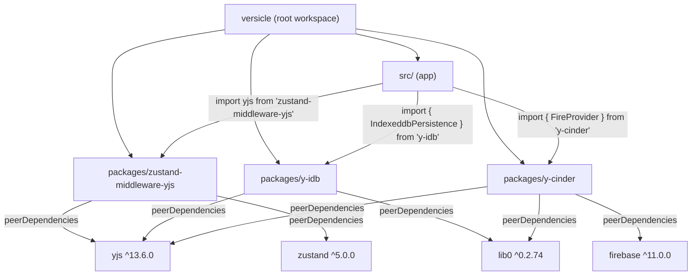
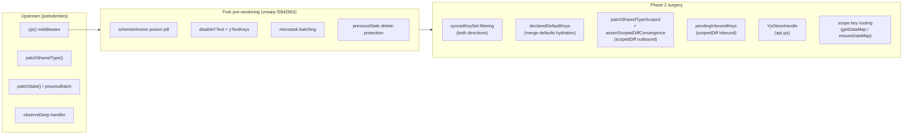
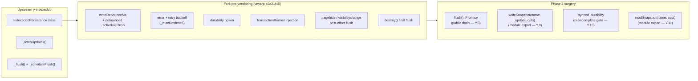
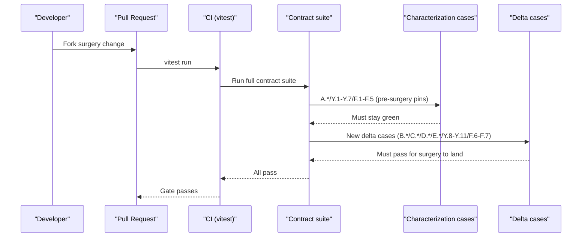
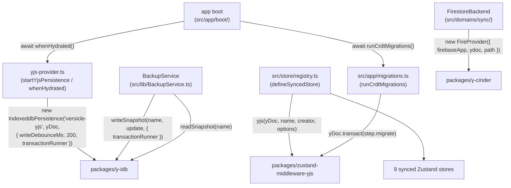

# Vendored Forks (packages/)

The Versicle monorepo contains three npm-workspace packages under `packages/` that are not independently published libraries — they are **vendored forks**: copies of third-party open-source packages imported directly into the repository, modified first-party, and treated as internal code subject to the same CI, contract testing, and review discipline as `src/`.

This document explains why vendoring was chosen over alternative approaches, describes the lineage and surgery performed on each fork, and documents the contract-suite gate that enforces behavioral integrity across all changes.

---

## 1. Why Vendor at All?

### 1.1 The Problem with Remote Forks

Before vendoring, all three packages were consumed as git-SHA-pinned dependencies in `package.json`:

```json
"zustand-middleware-yjs": "github:vrwarp/zustand-middleware-yjs#f2842963",
"y-idb": "github:vrwarp/y-idb#e2a21f45",
"y-cinder": "github:vrwarp/y-cinder#9c5c205e"
```

This arrangement had several practical defects, each documented as a "finding" in the overhaul analysis:

| Defect | Impact |
|---|---|
| Fork changes could not be lint- or type-checked in CI before shipping | A broken change went undetected until integration |
| The packages' test suites ran (if at all) against isolated dev-server setups, not the app's real Vite/vitest environment | Test code path ≠ shipped code path |
| `yjs` and `zustand` were declared as regular `dependencies` (not `peerDependencies`), making single-instance enforcement "dedupe-by-luck" | Subtle CRDT corruption if npm resolved a second copy |
| The forks needed precise surgical changes (not just configuration) that had to be made in a separate repo, tested there, pushed, bumped, and re-installed — a multi-step manual cycle vulnerable to drift | Unsafe to iterate under the overhaul's rapid cadence |
| `BackupService` re-implemented y-idb's private IDB store layout from scratch because there was no public `writeSnapshot` API — layout knowledge was duplicated and could drift | Backup silently writes wrong data if the fork's schema changes |

Vendoring solved all of these at once: the fork source is the artifact, the package resolves to `src/` TypeScript, the app's root `vitest.config.ts` discovers and runs its tests, and TypeScript's composite project solution (`tsc -b`) type-checks it alongside `src/`.

### 1.2 The Vendoring Protocol

Each fork follows the same three-step protocol, established in [Phase 2 fork surgery](../../plan/overhaul/prep/phase2-fork-surgery.md) and repeated for Phases 3 and 9:

1. **Pin to an exact SHA** — the SHA the app was already running as a git dependency. The committed fork artifact at that SHA is diff-verified byte-identical to what was previously installed in `node_modules/`.
2. **Rewrite `package.json`** — `private: true` (never republishes), move peer libraries from `dependencies` to `peerDependencies`, point `main`/`module`/`types`/`exports` at `src/` directly.
3. **Write the contract suite first** — characterization tests that pin all semantics the app depends on, written against the unmodified vendored source. These must pass before any surgery begins (master plan program rule 7: "characterize before you change").

Every fork carries a [`PROVENANCE.md`](../../packages/zustand-middleware-yjs/PROVENANCE.md) that records lineage, the byte-identity verification, and an append-only modification log. Every surgery entry in the log names the contract cases that gate it.

### 1.3 Workspace Structure



All three packages are `private: true`, so no npm license scan touches them. License attribution is handled through [`third-party/inventory.json`](../../third-party/inventory.json), and MIT license text is retained verbatim in each package's `LICENSE` file.

Single-instance integrity — a single resolved copy of `yjs`, `lib0`, `firebase`, and `zustand` — is enforced at CI time by [`scripts/assert-single-instance.cjs`](../../scripts/assert-single-instance.cjs). The move of peer libraries from `dependencies` to `peerDependencies` during vendoring made this structural rather than luck-based.

---

## 2. `packages/zustand-middleware-yjs` — CRDT-Store Bridge

### 2.1 Origin and Purpose

**Upstream:** `github.com/joebobmiles/zustand-middleware-yjs` (MIT, © 2021 Joseph R Miles)  
**Fork:** `github.com/vrwarp/zustand-middleware-yjs`  
**Vendored from:** commit `f2842963ecbd5b2bc80fc1898267c0e41b5a1834` (v1.3.1)

This package is the bridge between Versicle's nine Zustand stores and the shared `Y.Doc`. Its default export is a Zustand middleware that:

- Mirrors every outbound `set()` call into the Y.Map as a Yjs transaction (with batching so N mutations in one tick become one transaction).
- Listens to `Y.Map.observeDeep` and patches the Zustand store whenever a foreign-origin update arrives (inbound).
- Prevents echo loops: own-origin transactions are skipped outbound-side, and inbound patches run through the "original" `setState` so they never re-schedule an outbound write.
- Supports schema versioning via a `__schemaVersion` poison pill: if an incoming transaction carries a higher version than the local `schemaVersion` option, replication is permanently halted and `onObsolete` fires.

See [State management and CRDT](13-state-management-crdt.md) for the store-level view; this document covers the fork internals.

### 2.2 Pre-Vendoring Fork Deltas

The fork already contained several changes relative to upstream before vendoring. These are pinned by the characterization suite (contract cases A.1–A.11 in `test/contract/`):

| Delta | What it does |
|---|---|
| `schemaVersion` / `onObsolete` | Per-map `__schemaVersion` check; halts inbound and outbound permanently on schema mismatch |
| `disableYText` / `yTextKeys` | Plain-string storage instead of `Y.Text` (became the global default at schema v4) |
| Microtask batching | One Yjs transaction and one `patchStore` per event-loop tick instead of one per `set()` call |
| `previousState` delete-protection | On outbound DELETE, if the key was not in `previousState`, skip it — concurrent remote inserts survive |
| `undefined` value handling | `undefined` values stored as-is and round-tripped correctly |

### 2.3 Phase 2 Surgery: Four Additive Options

All four Phase 2 changes are **additive** — existing behavior with default options is byte-for-byte identical to the pre-surgery fork, pinned by the characterization and legacy-hydration cases.

#### Surgery 1 — `syncedKeys` Whitelist

**Problem:** Every top-level key of every synced store replicated in both directions. The `annotations` store had a stale `popover` key in old documents (pre-hotfix) that would silently insert itself into store state on inbound hydration, causing a phantom `popover` property in the store.

**Option added:** `syncedKeys?: readonly string[]`

When provided, replication is limited to exactly these top-level keys in both directions:

- **Outbound:** `patchSharedType` operates on `pick(state, syncedKeys)` vs `pick(mapJSON, syncedKeys)`. A non-listed key can never be written into the Y.Map by this client.
- **Inbound:** `computeInboundState` filters the map JSON to the listed keys before diffing. A foreign map key (e.g., the stale `popover`) is never inserted into store state.
- **Resurrection guard:** a key removed from `syncedKeys` whose value still exists in old docs is silently ignored both directions — only a migration can remove it from the doc.
- **`__schemaVersion` is implicitly synced** whenever `schemaVersion` is set (the poison-pill machinery depends on it reaching the top-level map).

In [`src/index.ts`](../../packages/zustand-middleware-yjs/src/index.ts):

```typescript
const syncedKeySet: ReadonlySet<string> | undefined = options?.syncedKeys
  ? new Set<string>(
      options.schemaVersion !== undefined
        ? [ ...options.syncedKeys, "__schemaVersion" ]
        : options.syncedKeys
    )
  : undefined;
```

Dev-mode misconfiguration is a loud error at store creation:

```typescript
if (options?.syncedKeys && isDevEnvironment()) {
  options.syncedKeys.forEach((key) => {
    if (!(key in initialRecord)) {
      throw new Error(
        `[zustand-middleware-yjs] syncedKeys entry "${key}" is not a key ` +
        `of the initial state of store "${name}". ...`
      );
    }
    if (initialRecord[key] instanceof Function) {
      throw new Error(`...`);
    }
  });
}
```

Contract cases: B.1–B.6 in [`test/contract/synced-keys.test.ts`](../../packages/zustand-middleware-yjs/test/contract/synced-keys.test.ts).

#### Surgery 2 — `hydration: 'merge-defaults'`

**Problem (finding D2):** `getRecordChanges` emits `[DELETE, key]` for every state key absent from the map JSON. On first hydration from an older doc (one that predates a newly added field), that field is wiped. The v4→v5 migration's sole job was to re-add `fontProfiles` to the preferences store — a problem that should not require a migration.

**Option added:** `hydration?: 'replace' | 'merge-defaults'` (default `'replace'` = legacy behavior)

Under `'merge-defaults'`, the middleware captures `declaredDefaultKeys` at construction time:

```typescript
const declaredDefaultKeys: ReadonlySet<string> | undefined =
  options?.hydration === "merge-defaults"
    ? new Set(
        Object.entries(initialState as Record<string, unknown>)
          .filter(([ , value ]) => (value instanceof Function) === false)
          .map(([ key ]) => key)
      )
    : undefined;
```

On every inbound patch (initial hydration and every `processBatch`), top-level `[DELETE, key]` changes are suppressed if `key in declaredDefaultKeys`. Nested deletes are untouched — they ride inside a `PENDING` chain under a present top-level key and propagate fully. This is intentionally shallow: the rule is "top-level key presence in the map, not richness of nested content."

Contract cases: C.1–C.8 in [`test/contract/merge-defaults.test.ts`](../../packages/zustand-middleware-yjs/test/contract/merge-defaults.test.ts).

#### Surgery 3 — `scopedDiff: true` (the D13 Fix)

**Problem (finding D13):** Every outbound flush serialized the entire Y.Map (`sharedType.toJSON()`) and deep-diffed the full state tree. For the `progress` store (reading state for up to 500 sessions × device × book), this is O(library × history) on every page turn — an unbounded cost responsible for the `selectors.ts` heroics (finding D9).

**Option added:** `scopedDiff?: boolean` (default `false` = legacy full-tree diff)

When `true`:

**Outbound:** `patchSharedTypeScoped` is called. It uses `Object.is` to find which top-level keys changed between `batchPreviousState` and the current state, then diffs only those keys' subtrees:

```typescript
if (options?.scopedDiff && previousState !== undefined) {
  doc.transact(() =>
    patchSharedTypeScoped(ensureDataMap(), state, previousState, sharedOptions), api);
  // Divergence tripwire: occasionally run the full diff in DEV and fail loudly on drift.
  if (isDevEnvironment() && Math.random() < __scopedDiffDevSampling.rate) {
    const dataMap = getDataMap();
    if (dataMap !== undefined)
      assertScopedDiffConvergence(dataMap, api.getState(), syncedKeySet);
  }
}
```

The sampling rate is exported as `__scopedDiffDevSampling.rate` (default 0.02, i.e. 2% of flushes) so tests can set it to 1.0 for deterministic coverage.

**Inbound:** `observeDeep` collects affected top-level keys across the microtask batch into `pendingInboundKeys`. In `processBatch`, only those keys are re-read from the map; untouched keys keep their **object identity** — a free win for selector stability.

```typescript
if (options?.scopedDiff) {
  pendingInboundKeys ??= new Set<string>();
  const keys = pendingInboundKeys;
  events.forEach((event) => {
    if (event.path.length > 0)
      keys.add(String(event.path[0]));
    else
      event.changes.keys.forEach((_change, key) => keys.add(key));
  });
}
```

**First-flush fallback:** when `previousState === undefined` (the very first flush), the code falls back to the legacy full diff. This means the first flush of a store is always safe regardless of `scopedDiff`.

The divergence tripwire has two forms: the DEV sampling assert (runtime, probabilistic) and a fast-check property test (contract D.1) that runs randomized update sequences through both scoped-diff and full-diff stores and asserts identical convergence.

Contract cases: D.1–D.6 in [`test/contract/scoped-diff.test.ts`](../../packages/zustand-middleware-yjs/test/contract/scoped-diff.test.ts).

#### Surgery 4 — `api.yjs` Store Handle and `scope: { key }`

**Problem:** The only way to know when a store was hydrated from the IDB snapshot was the `onLoaded` callback plus a nested-`queueMicrotask` timing hack (`yjs-provider.ts:182-184`) to ensure the inbound microtask had run before callers read state. App boot also had a poll loop waiting for `books` to be non-empty (`App.tsx:283-287`). Both were fragile ordering contracts.

**API added:** `YjsStoreHandle` (modeled on `zustand/persist`'s `api.persist`):

```typescript
export interface YjsStoreHandle {
  hasHydrated(): boolean;
  whenHydrated(): Promise<void>;
  markHydrated(): void;   // provider calls when doc synced + map empty
  flush(): void;          // test API: synchronously drain pending outbound microtask
  isObsolete(): boolean;
}
```

`whenHydrated()` resolves strictly after the hydrating `setState`, so an awaiting caller always observes hydrated state. Three hydration sources can flip `hydrated`:

- **(a)** Synchronous initial patch when the map is pre-populated at store creation
- **(b)** First applied inbound `processBatch`
- **(c)** `markHydrated()` — provider signals "doc synced, this map is legitimately empty"

The handle is attached to `api.yjs` and accessed via `getYjsStoreHandle(store)`:

```typescript
const handle: YjsStoreHandle = {
  hasHydrated: () => hydrated,
  whenHydrated: () => hydratedPromise,
  markHydrated,
  flush: () => { if (isOutboundPending) flushOutbound(); },
  isObsolete: () => isObsolete,
};
(api as unknown as { yjs: YjsStoreHandle }).yjs = handle;
```

**`scope: { key }`** binds a store to a *nested* Y.Map at `doc.getMap(name).get(scope.key)` instead of the top-level map. Designed for the preferences fold (v6 migration §5.3): `usePreferencesStore` rebinds from `preferences/<deviceId>` (nine separate top-level maps, one per device) to a single `preferences` map with the device id as a nested key — zero consumer call sites change because the flat `PreferencesState` shape is unchanged. The nested map is created lazily on the first outbound flush (late-join safety); the poison-pill check always reads the TOP-LEVEL named map regardless of scoping.

Contract cases: E.1–E.4 in [`test/contract/hydration-api.test.ts`](../../packages/zustand-middleware-yjs/test/contract/hydration-api.test.ts), scope cases in [`test/contract/scope.test.ts`](../../packages/zustand-middleware-yjs/test/contract/scope.test.ts).

### 2.4 Surgery Map



### 2.5 Complete Options Surface

```typescript
export interface YjsOptions {
  // Existing (unchanged semantics, pinned by characterization suite A.*)
  atomicKeys?: string[];
  disableYText?: boolean;
  yTextKeys?: string[];
  onLoaded?: () => void;
  schemaVersion?: number;
  onObsolete?: (incomingVersion: number) => void;

  // Phase 2 additions
  syncedKeys?: readonly string[];            // B.* cases
  hydration?: 'replace' | 'merge-defaults'; // C.* cases (default 'replace')
  scopedDiff?: boolean;                      // D.* cases (default false)
  scope?: { key: string };                   // scope.* cases
}
```

### 2.6 Per-Store Configuration

The nine synced stores are wired via `defineSyncedStore` (replacing the old `getYjsOptions()` seam):

| Store | Y.Map name | `syncedKeys` |
|---|---|---|
| `useBookStore` | `library` | `['books']` (+ implicit `__schemaVersion`) |
| `useReadingStateStore` | `progress` | `['progress']` |
| `useAnnotationStore` | `annotations` | `['annotations']` (stale `popover` key structurally ignored) |
| `usePreferencesStore` | `preferences` | 16 pref fields; `scope: { key: getDeviceId() }` post-fold |
| `useReadingListStore` | `reading-list` | `['entries']` |
| `useVocabularyStore` | `vocabulary` | `['knownCharacters']` |
| `useLexiconStore` | `lexicon` | `['rules', 'settings']` |
| `useContentAnalysisStore` | `contentAnalysis` | `['sections']` |
| `useDeviceStore` | `devices` | `['devices']` |

---

## 3. `packages/y-idb` — IndexedDB Persistence Provider

### 3.1 Origin and Purpose

**Upstream:** `github.com/yjs/y-indexeddb` (MIT, © 2014 Kevin Jahns / RWTH Aachen)  
**Fork:** `github.com/vrwarp/y-idb`  
**Vendored from:** commit `e2a21f45b55190e22d165817e9bc2a2ca1aa40cf` (v9.0.12)

y-idb persists the shared `Y.Doc` to IndexedDB (`versicle-yjs` database) so that the document survives page reloads without waiting for the Firestore sync. On construction it reads all stored update rows, applies them to the doc, and emits `'synced'` when the hydration is complete. On each outbound update from the doc it appends a row to the `updates` object store (batched and debounced). When the row count exceeds `PREFERRED_TRIM_SIZE` (500), it triggers a snapshot compaction: write a single `encodeStateAsUpdate` row and delete all older rows.

See [Storage Gateway](20-storage-gateway.md) for the application-level context; this section covers the fork internals.

### 3.2 Pre-Vendoring Fork Deltas

The fork already contained the following changes relative to upstream `y-indexeddb`:

| Delta | What it does |
|---|---|
| `writeDebounceMs` option | Debounced, batched update flush — one IDB transaction per batch rather than one per Y.Doc update event |
| Flush retry with exponential backoff | On transaction error/abort, retries up to `_maxRetries = 5` times with `Math.pow(2, n) * 100` ms backoff; emits `'error'` and `'retry-exhausted'` |
| `durability` option | Passed through to `IDBDatabase.transaction({ durability })` — `'relaxed'` for faster writes at the cost of weaker guarantees |
| `transactionRunner` injection | Every write path runs through an injected exclusive-write gate when provided — the mechanism that prevents WebKit IDB transaction hangs across concurrent contexts |
| Best-effort synchronous flush on `pagehide` / `visibilitychange: hidden` | Direct IDB transaction issued without `await` so it completes before the process suspends |
| `destroy()` flushing | Flushes pending updates before closing; idempotent via `_destroyPromise`; `_destroyed` flag short-circuits throughout |

### 3.3 The Database Layout

The IDB database has two object stores:

```
versicle-yjs (autoIncrement key)
  updates  ← Uint8Array rows, autoIncrement integer keys
  custom   ← key-value store for provider.set() / provider.get() metadata
```

This layout was previously duplicated in `BackupService.ts:347-375` as a raw re-implementation. Surgery 2 (`writeSnapshot`) moves layout knowledge into this one module.

### 3.4 Phase 3 Surgery: Four Additive Exports

All four surgeries are additive to the module's public API. The internal `IndexeddbPersistence` class mechanics are preserved verbatim; the characterization suite (Y.1–Y.7) must remain green alongside every surgery.

#### Surgery 1 — `flush(): Promise<void>`

**Problem:** The debounce timer could hold pending updates for up to `writeDebounceMs` (200 ms in production). `BackupService` used a 1000 ms sleep to work around this. Test code poked private internals (`_flush()` / `_flushPromise`). There was no public API to drain the queue on demand.

**Implementation:** Added as an instance method to `IndexeddbPersistence`:

```javascript
async flush () {
  await this._db
  for (;;) {
    if (this._flushPromise) {
      await this._flushPromise
      continue
    }
    if (this._destroyed || this._pendingUpdates.length === 0) return
    if (this._retryCount > 0) {
      // A backoff retry is pending — yield instead of hot-spinning.
      await new Promise(resolve => setTimeout(resolve, 50))
      continue
    }
    this._flush()
    if (!this._flushPromise) {
      // _flush declined (connection mid-open or debounce race) — yield and re-check.
      await new Promise(resolve => setTimeout(resolve, 10))
    }
  }
}
```

Key invariant: `destroy()` keeps its own final-batch drain that runs with `_destroyed` already set (mid-hydration destroys short-circuit `_fetchUpdates` where `flush()`'s loop would exit early by design). The two paths are intentionally separate.

Contract cases: Y.8a–c in [`test/contract/surgery.test.ts`](../../packages/y-idb/test/contract/surgery.test.ts).

#### Surgery 2 — `writeSnapshot(name, update, { transactionRunner })` Module Export

**Problem:** `BackupService.ts:347-375` re-implemented the database open, store creation, and IDB transaction sequence from scratch — duplicating y-idb's schema layout. If the layout ever changed, backup silently wrote to the wrong structure.

**Implementation:** A standalone module-level export:

```javascript
export const writeSnapshot = (name, update, { transactionRunner } = {}) => {
  const work = () => idb.openDB(name, db =>
    idb.createStores(db, [
      ['updates', { autoIncrement: true }],
      ['custom']
    ])
  ).then(db => new Promise((resolve, reject) => {
    let tx
    try {
      tx = db.transaction([updatesStoreName], 'readwrite')
    } catch (e) { db.close(); reject(e); return }
    const store = tx.objectStore(updatesStoreName)
    store.clear()
    store.add(update)
    tx.oncomplete = () => { db.close(); resolve(undefined) }
    tx.onerror = tx.onabort = () => {
      db.close()
      reject(tx.error || new Error('writeSnapshot transaction failed'))
    }
  }))
  return transactionRunner ? transactionRunner(work) : work()
}
```

The function opens (or creates) the database using this module's own layout, clears the `updates` store, writes a single snapshot row, and resolves only after the transaction's `oncomplete` fires — guaranteeing durability before the caller proceeds. The optional `transactionRunner` wraps the entire open→commit→close unit so a backup write cannot interleave a live `IndexeddbPersistence` binding (the app passes `runExclusiveIdbWrite`).

**Precondition documented in source:** no live `IndexeddbPersistence` binding on `name` — a concurrent binding could interleave its own update rows.

Contract cases: Y.9a–c.

#### Surgery 3 — `'synced'` Durability

**Problem:** The constructor's initial-state write was issued without awaiting. `'synced'` was emitted mid-transaction via `_fetchUpdates`'s promise chain — `whenSynced` could resolve before the write committed. The checkpoint service's temp-provider dance was durable only via the side effect of `IDBDatabase.close()` waiting for in-flight transactions.

**Fix:** Move the `'synced'` emit to the hydration transaction's `complete` event:

```javascript
// (inside _fetchUpdates().then(updatesStore => {...}))
const emitSynced = () => {
  if (this._destroyed) return
  this.synced = true
  this.emit('synced', [this])
  this._scheduleFlush()
}
const tx = updatesStore.transaction
tx.oncomplete = emitSynced
tx.onerror   = emitSynced   // legacy: still emits on abort (consumers must not wedge)
tx.onabort   = emitSynced
```

Now `whenSynced` resolves only after the hydration transaction (which carries the initial-state write) has committed. On abort/error the emit still happens (legacy behavior), but the happy path is durable. The stored-updates-before-emit ordering (Y.7 / Y.10b) is unchanged.

Contract cases: Y.10 / Y.10b.

#### Surgery 4 — `readSnapshot(name, { transactionRunner })` Module Export

**Problem:** The boot interceptor needs to read the staging database (`versicle-yjs-staging`) before any `IndexeddbPersistence` binding exists. Constructing a temp binding just to read would recreate the temp-provider dance that Phase 3 deleted.

**Implementation:**

```javascript
export const readSnapshot = (name, { transactionRunner } = {}) => {
  const work = () => idb.openDB(name, db =>
    idb.createStores(db, [
      ['updates', { autoIncrement: true }],
      ['custom']
    ])
  ).then(db => new Promise((resolve, reject) => {
    let tx
    try {
      tx = db.transaction([updatesStoreName], 'readonly')
    } catch (e) { db.close(); reject(e); return }
    const request = tx.objectStore(updatesStoreName).getAll()
    tx.oncomplete = () => {
      db.close()
      const rows = (request.result || []).map(row =>
        row instanceof Uint8Array ? row : new Uint8Array(row)
      )
      if (rows.length === 0) resolve(null)
      else if (rows.length === 1) resolve(rows[0])
      else resolve(Y.mergeUpdates(rows))
    }
    tx.onerror = tx.onabort = () => {
      db.close()
      reject(tx.error || new Error('readSnapshot transaction failed'))
    }
  }))
  return transactionRunner ? transactionRunner(work) : work()
}
```

Resolves `null` for missing or empty databases (opening a missing database creates it with the correct schema but with no rows). Multiple rows (snapshot + incremental updates) are merged via `Y.mergeUpdates`, so the result always hydrates a fresh doc to the full persisted state.

Contract cases: Y.11a–d.

### 3.5 Surgery Map



---

## 4. `packages/y-cinder` — Firestore Realtime Provider

### 4.1 Origin and Purpose

**Upstream:** `github.com/podraven/y-fire` (MIT, © 2024 Pod Raven)  
**Fork:** `github.com/vrwarp/y-cinder`  
**Vendored from:** commit `9c5c205e6bfef008c5dd8733c67619a5a73d5f62` (v3.0.2603210004)

y-cinder is the Firestore-backed Yjs provider that enables real-time sync across devices. Unlike y-fire (which used a WebRTC + Firestore hybrid), y-cinder is **pure Firestore**: every update travels to Firestore and back to all listeners. This makes it stateless/serverless (no peer connectivity required) at the cost of higher latency (~500 ms) vs. WebRTC's sub-50 ms.

The provider exposes the `FireProvider` class. Versicle's sync domain wraps it behind the `FirestoreBackend` / `C3` contract interface — see [Sync domain](36-domain-sync.md).

### 4.2 Pre-Vendoring Fork Deltas (Relative to Upstream y-fire)

The fork is a substantial rework of y-fire; the deltas Versicle depends on:

| Delta | What it provides |
|---|---|
| **Tiered storage** | Debounced `updates` subcollection writes → `history` segments → compacted snapshot (Cloud Storage spill for oversized blobs) |
| **Distributed compaction locking** | `metadata/lock_compaction` Firestore document; clock-skew measured once per session; partial/resumable compaction |
| **Failure event surface** | `connection-error`, `sync-failure` (circuit breaker after 5 sync retries), `save-rejected` (`document-too-large` proactive + server-side detection, `max-retries-exceeded`), `corrupted-document` (per-session quarantine set) |
| **Off-main-thread update merging** | Inline blob Worker (`mergeUpdatesAsync`, graceful sync fallback when `Worker` is unavailable) |
| **Best-effort beforeunload flush** | Attempts `saveToFirestore()` on page close |
| **destroy() flush** | Flushes `updateCache` before destroying |

### 4.3 Key Internals

**`FireProvider` extends `ObservableV2<any>`** from `lib0/observable`. The public event surface is its primary contract surface with the application; no internal methods are called directly.

**Update path:** every local `Y.Doc` update event fires `handleUpdate`. Echo-origin filtering: updates tagged `FIREBASE_ORIGINS.SNAPSHOT`, `FIREBASE_ORIGINS.HISTORY`, or `FIREBASE_ORIGINS.UPDATE` are skipped entirely — they came from Firestore and looping them back would cause duplicate writes.

```typescript
const FIREBASE_ORIGINS = {
  SNAPSHOT: 'origin:firebase/snapshot',
  HISTORY:  'origin:firebase/history',
  UPDATE:   'origin:firebase/update',
} as const;
```

Local updates are merged into `updateCache` (`Y.mergeUpdates`) and a debounced timer (`_debouncedSave`, `maxWaitTime` default 500 ms) triggers `saveToFirestore()`.

**`saveToFirestore()`** is the convergence point for all three save paths (debounced, threshold-forced, and `destroy()` final flush). It:
1. Proactively rejects updates exceeding `DEFAULTS.FIRESTORE_DOC_LIMIT` (1,048,576 bytes) with `save-rejected({ code: 'document-too-large' })`.
2. Calls `addDoc(collection(db, path, 'updates'), { update: Bytes, createdAt: serverTimestamp(), createdBy: uid, ...aggregateMetadata })`.
3. On success: resets `_saveRetryCount`, emits `'saved'` (fork surgery 1), and if `updateCache` has new arrivals, schedules another save.
4. On server-side size rejection (`invalid-argument` error code): emits `save-rejected({ code: 'document-too-large' })`, terminal — no retry.
5. On generic failure: increments `_saveRetryCount`; after `MAX_SAVE_RETRIES` (5), emits `save-rejected({ code: 'max-retries-exceeded' })` and resets.

**Initial sync:** `sync()` is called from the constructor. It measures clock skew once per session (`measureClockSkew`), then calls `performInitialSync(syncCtx)` to pull all Firestore tiers in priority order (snapshot → history → updates). On success, it sets up three real-time listeners (`createUpdateListener`, `createSnapshotListener`, `createHistoryListener`) and emits `sync(true)` (fork surgery 2). On failure, a circuit breaker retries up to `MAX_RETRIES` (5) with exponential backoff via `calculateBackoff`.

### 4.4 Phase 9 Surgery: Two Events Added

#### Surgery 1 — `'saved'` Event

**Problem:** `FirestoreBackend` (the C3 wrapper) needed to know when a Yjs update was successfully committed to Firestore in order to update `lastSyncTime`. Before this surgery, a committed save announced nothing — the event surface only covered failures. The `lastSyncTime` was updated on a connected-transition floor as a workaround.

**Implementation:** One line added to `saveToFirestore()` after `addDoc` resolves:

```typescript
// FORK SURGERY 1 (Versicle P9; phase4-sync-strangler.md §D6.1)
this.emit('saved', [Date.now()]);
```

The event fires for the debounced save path, the threshold-forced path, and the `destroy()` final flush alike — they all funnel through `saveToFirestore()`. Consumers map it to `SyncEvent{ type: 'flushed' }` → `lastSyncTime`.

Contract cases: F.6 in [`test/contract/provider.test.ts`](../../packages/y-cinder/test/contract/provider.test.ts).

#### Surgery 2 — `'sync'` Handshake Event (Recorded Deviation)

**Problem (recorded deviation beyond the §D6 delta list):** Every consumer already listened for the y-fire-era `sync(isSynced)` event — `FirestoreBackend.connect` forwarded it as the C3 `synced` event, `downloadWorkspaceState` resolved the staged-swap download on it, and `MockFireProvider` emitted it. But the vendored SHA never emitted it anywhere (`grep emit src/*.ts` returned zero hits). On the real transport, `synced` never fired and every clean-sync/switch download waited out its full 15-second timeout.

**Implementation:** One line added at the end of the `sync()` method's success path:

```typescript
// FORK SURGERY 2 (Versicle P9; recorded deviation — see PROVENANCE.md)
this.emit('sync', [true]);
```

The handshake is emitted once `performInitialSync` has completed and the three real-time listeners are attached. A stalled sync (e.g., a `getDocs` that never resolves) emits nothing — contract F.7 pins this explicitly.

Contract cases: F.7 in [`test/contract/provider.test.ts`](../../packages/y-cinder/test/contract/provider.test.ts).

### 4.5 `FireProviderConfig` and Defaults

```typescript
interface FireProviderConfig {
  firebaseApp: FirebaseApp;
  ydoc: Y.Doc;
  path: string;                   // validated: non-empty, no leading/trailing/double slash
  maxUpdatesThreshold?: number;   // default 50 — triggers compaction consideration
  maxWaitTime?: number;           // default 500 ms — debounce window
  depth?: number;                 // default 0 — subdocument recursion depth (max 100)
  lockTTL?: number;               // default 60000 ms — distributed compaction lock TTL
  compactionLimit?: number;       // default 200 updates per compaction run
  testHooks?: TestHooks;
  persistence?: { enabled: boolean }; // Firestore offline persistence
}

const DEFAULTS = {
  MAX_UPDATES_THRESHOLD: 50,
  MAX_WAIT_TIME: 500,
  DEPTH: 0,
  LOCK_TTL: 60000,
  COMPACTION_LIMIT: 200,
  MAX_RETRIES: 5,
  MAX_SAVE_RETRIES: 5,
  FIRESTORE_DOC_LIMIT: 1_048_576,  // 1 MB hard limit
  SYNC_BATCH_SIZE: 100,
  REALTIME_LIMIT: 200,
} as const;
```

Path validation runs before any Firebase SDK calls (P1.8/P2.20 fix), so an invalid path produces a clear `Error` with the bad value rather than a cryptic Firebase error.

---

## 5. Contract Suites as Acceptance Gates

Every surgery in every fork is gated by a contract test suite. The rule is a hard program invariant (master plan program rule 7):

> A fork-behavior change without a matching suite change in the same PR fails CI.

The suites use **real Y.Docs** (not mocks) and two-doc replication via `Y.encodeStateAsUpdate` / `Y.applyUpdate`. The `fake-indexeddb/auto` vitest setup provides a fake IDB environment for y-idb tests. y-cinder's tests mock the Firebase SDK at the module level via `vi.mock`, while live transport behavior is pinned by the emulator-gated C3 runner (`src/lib/sync/syncBackendContract.emulator.test.ts`).



### 5.1 Case Map by Fork

| Fork | Suite location | Case groups |
|---|---|---|
| `zustand-middleware-yjs` | `test/contract/*.test.ts` | A.1–11 (characterization), B.1–6 (syncedKeys), C.1–8 (merge-defaults), D.1–6 (scopedDiff), E.1–4 (hydration API), scope.* (nested map), outbound.*, lifecycle.*, echo-prevention.* |
| `y-idb` | `test/contract/characterization.test.ts` + `surgery.test.ts` | Y.1–7 (characterization), Y.8a–c (flush), Y.9a–c (writeSnapshot), Y.10/Y.10b (synced durability), Y.11a–d (readSnapshot) |
| `y-cinder` | `test/contract/provider.test.ts` | F.1 (constructor validation), F.2 (echo filtering), F.3 (debounced batching), F.4 (save failure surface), F.5 (destroy teardown), F.6 (saved event), F.7 (sync handshake) |

### 5.2 The Characterize-Before-Change Rule in Practice

For `zustand-middleware-yjs`, all characterization cases (A.*) were written and verified green against the unmodified vendored source before surgery 1 began. For y-idb, cases Y.1–Y.7 were written and verified before the first surgery (flush). For y-cinder, cases F.1–F.5 were written before the `saved` event surgery.

This means if a surgery accidentally breaks a characterization case, CI fails immediately — the break is visible as a regression in a _pre-existing_ case, which is far harder to miss or rationalize away than a failing new case. The house style is "loud failures, never silent divergence."

For `scopedDiff` specifically, two tripwires exist simultaneously:
1. A fast-check property test (contract D.1) generating random update sequences and asserting scoped-diff ≡ full-diff convergence.
2. A runtime sampling assert in production DEV builds (`__scopedDiffDevSampling.rate = 0.02`) that calls `assertScopedDiffConvergence` after 2% of scoped flushes, failing loudly if `Object.is`-invisible mutations cause drift.

---

## 6. Fork↔App Integration



Key integration contracts:

- **`whenHydrated()`** in `yjs-provider.ts` drives the gate: after `waitForYjsSync` confirms IDB hydration, it calls `markHydrated()` on each store whose Y.Map is legitimately empty, then `await Promise.all(stores.map(r => r.store.yjs.whenHydrated()))`. This replaced the nested-`queueMicrotask` hack and the poll loop.
- **`runCrdtMigrations()`** uses `Y.Doc.transact` directly (no store access). The migration coordinator is the only caller; it runs exactly once per boot, strictly after `whenHydrated()`.
- **`BackupService`** now calls `writeSnapshot` / `readSnapshot` directly rather than re-implementing the IDB layout. The `transactionRunner` argument is always `runExclusiveIdbWrite` — the cross-context write gate that prevents concurrent IDB transactions from the TTS worker.
- **`FireProvider`** is constructed by `FirestoreBackend.connect()` and destroyed by `disconnect()`. The `saved` event is forwarded as `SyncEvent{ type: 'flushed' }`, and the `sync` event is forwarded as `SyncEvent{ type: 'synced' }` to the sync domain's state machine.

---

## 7. Invariants and Edge Cases

### 7.1 Single-Instance Requirement

`yjs`, `lib0`, `zustand`, `firebase`, `@firebase/app`, `@firebase/firestore`, and `@firebase/storage` must resolve to a single copy each. Two Y.Doc instances cannot share updates if they use different `yjs` instances — the CRDT state vectors would be incommensurable. `scripts/assert-single-instance.cjs` asserts this in CI and is part of the `check:single-instance` script.

### 7.2 The Echo Invariant

Both `zustand-middleware-yjs` and `y-cinder` maintain strict no-echo invariants:

- **zustand-middleware-yjs:** outbound Yjs transactions are tagged with `api` (the store object) as the transaction origin. `observeDeep` checks `transaction.origin === api` and skips. Inbound patches use `originalSetState` (captured before `api.setState` is overridden) so they never re-schedule outbound.
- **y-cinder:** outbound `addDoc` calls write to the `updates` subcollection. The real-time listener checks `createdBy` and skips updates the current session wrote. Tagged Firebase origins (`FIREBASE_ORIGINS.*`) suppress the `doc.on('update')` handler for remotely-applied updates.

Contract cases A.4 (echo prevention) and F.2 (echo-origin filtering) pin these invariants.

### 7.3 Destroy Ordering

When the app shuts down or a workspace is unloaded, destroy order matters:

1. `FireProvider.destroy()` flushes `updateCache` to Firestore (final save), then stops all listeners and subdoc providers.
2. `IndexeddbPersistence.destroy()` flushes `_pendingUpdates` to IDB (final drain), then closes the database.
3. Neither destroy is awaited simultaneously — Firestore flush and IDB flush can race (they operate on different backends and different data).

### 7.4 Mutation-in-Place Risk

`scopedDiff` uses `Object.is` to detect which top-level keys changed. A store that mutates an object in-place (without spreading) makes the reference-equality check invisible to the fast path — the mutation is lost from the doc. Mitigations:

- All nine synced stores follow zustand's immutable-update convention (every `set()` spreads the changed subtree). This is verified by the `assertScopedDiffConvergence` tripwire.
- The fast-check property test (D.1) applies randomized operations and asserts convergence.
- `__scopedDiffDevSampling.rate = 0.02` catches drift in development before it reaches staging.

### 7.5 `'synced'` vs. Hydration

`IndexeddbPersistence`'s `'synced'` event (and its `whenSynced` promise) means "the hydration IDB transaction has committed and stored updates have been applied to the doc." It does NOT mean "the Zustand stores have been patched." The inbound `processBatch` in `zustand-middleware-yjs` runs on the next microtask after the `observeDeep` callback fires. `api.yjs.whenHydrated()` is the correct gate for "stores are ready."

### 7.6 Obsolete Client Halting

When a Yjs transaction carries `__schemaVersion > options.schemaVersion`, the middleware:

1. Sets `isObsolete = true` (permanent kill switch in closure).
2. Calls `onObsolete(incomingVersion)`.
3. Returns from the `observeDeep` callback, skipping the inbound patch.
4. On the next outbound flush: `if (isObsolete) return` short-circuits.

This halts both directions permanently. The application's `onObsolete` handler calls `handleObsoleteClient`, which locks the UI and disconnects Firestore sync. The residual (D5): the Y-level merge has already happened at the doc level before the middleware check fires, so y-idb may persist the higher-version update. Phase 4 addresses this with a synchronous pre-merge version check on the `meta` map before `Y.applyUpdate`.

---

## 8. Provenance Records

Each fork's `PROVENANCE.md` file is the authoritative record. It is append-only: new surgery entries go at the bottom of the "modification log" section. The content contract for each entry:

- The surgery number and short name
- The design doc section (e.g., `phase2-fork-surgery.md §2.1`)
- The precise behavior change (not just "added X" — what it does)
- The contract cases that gate it

PROVENANCE records also document **design corrections** (flagged `▲`) that were discovered during implementation and differ from the original design doc.

| File | | Entries as of this writing |
|---|---|---|
| [`packages/zustand-middleware-yjs/PROVENANCE.md`](../../packages/zustand-middleware-yjs/PROVENANCE.md) | | Surgeries 1–4 + `atomicKeys` dead-code note |
| [`packages/y-idb/PROVENANCE.md`](../../packages/y-idb/PROVENANCE.md) | | Surgeries 1–4 (flush, writeSnapshot, synced durability, readSnapshot) |
| [`packages/y-cinder/PROVENANCE.md`](../../packages/y-cinder/PROVENANCE.md) | | Surgeries 1–2 (saved event, sync handshake) + recorded deviation |

---

## 9. Contract Suite Gate Flow

```mermaid
stateDiagram-v2
  [*] --> CharacterizationGreen: "Fork vendored; char. suite written against unmodified source"
  CharacterizationGreen --> SurgeryDesigned: "Design doc section written"
  SurgeryDesigned --> DeltaCasesFirst: "Contract cases for the surgery written first (program rule 7)"
  DeltaCasesFirst --> DeltaCasesRed: "Cases fail against unmodified source (expected)"
  DeltaCasesRed --> SurgeryImplemented: "Surgery implemented in fork source"
  SurgeryImplemented --> AllGreen: "All characterization + delta cases pass"
  AllGreen --> ProvenanceUpdated: "Append to PROVENANCE.md modification log"
  ProvenanceUpdated --> [*]: "PR merged"

  AllGreen --> CharacterizationGreen: "Regression: char. case broken → revert and fix"
```



---

## 10. Relationship to Other Documents

- [Architecture overview](10-architecture-overview.md) — where these packages fit in the overall layering.
- [State management and CRDT](13-state-management-crdt.md) — the nine synced stores, `defineSyncedStore`, and `Y.Doc` lifecycle; the consumer view of `zustand-middleware-yjs`.
- [Storage gateway](20-storage-gateway.md) — the `src/data/` layer that wraps `y-idb`; `YjsSnapshotService`, the write gate, and how `writeSnapshot`/`readSnapshot` are invoked.
- [Sync domain](36-domain-sync.md) — `FirestoreBackend`, the C3 contract, and how `FireProvider` events map to `SyncEvent` types.
- [CRDT format and migrations](22-crdt-format-and-migrations.md) — schema version history (v1–v6), the migration coordinator, and how fork surgery interacts with schema bumps.
- [Testing strategy](63-testing-strategy.md) — the broader test classification; where the fork contract suites fit relative to unit, integration, and E2E tests.
- [CI and quality gates](65-ci-and-quality-gates.md) — the CI scripts that enforce single-instance integrity and run the contract suites.
- [Overhaul history](80-overhaul-history.md) — the chronological record of which phase vendored which fork and what was fixed.
