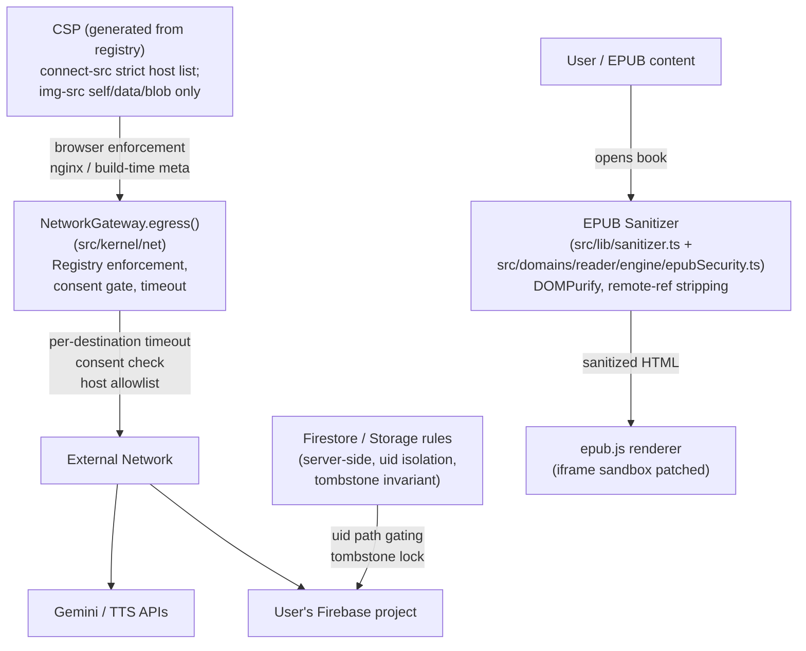
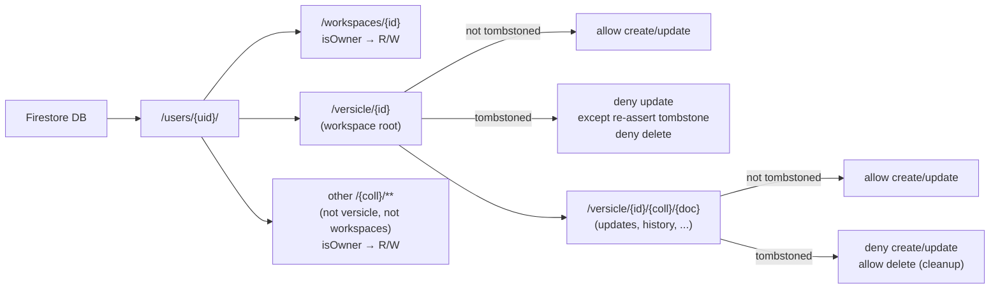
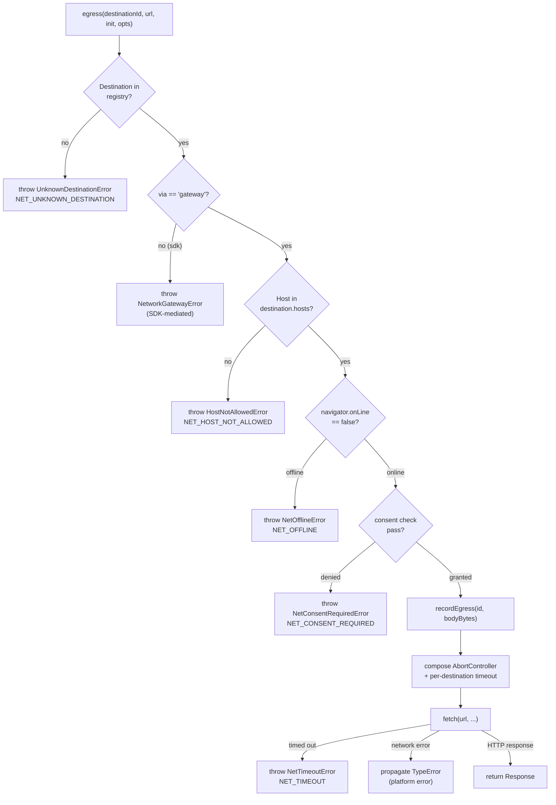
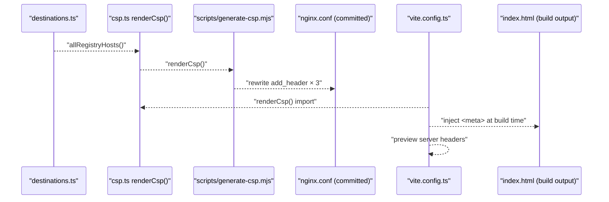
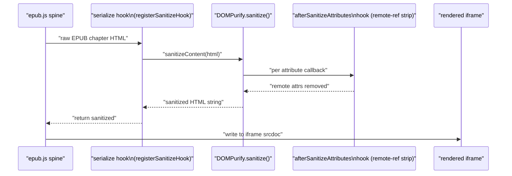
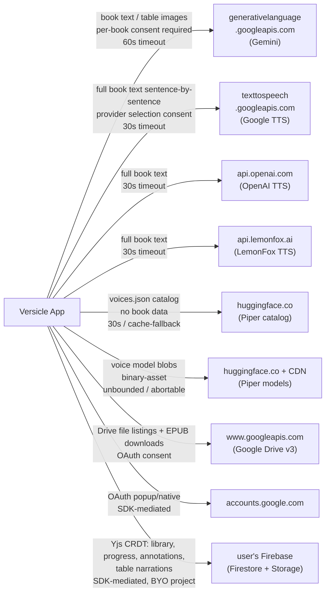
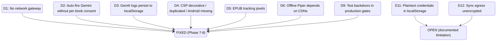
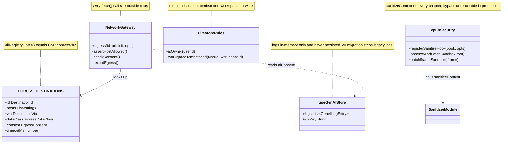

# Security & Privacy

Versicle's headline product promise is "Privacy-Centric: We don't know what you read. No
analytics" ([README](README.md)). This document explains every mechanism — and every
limitation — behind that claim: how the codebase enforces it in the server-side rules, the
browser content-security policy, the EPUB content sanitization pipeline, and the network egress
boundary; and where genuine gaps remain.

Cross-reference: [Architecture overview](10-architecture-overview.md) for the overall
module map; [Domain: sync](36-domain-sync.md) for the Yjs/Firestore sync path; [Domain:
reader engine](30-domain-reader-engine.md) for the epub.js render pipeline; [TTS providers
and platform](33-tts-providers-and-platform.md) for cloud TTS data flows.

---

## 1. Design Intent and Threat Model

### 1.1 What "no first-party server" means

Versicle is a **BYO-Firebase** product: the developer never runs a backend that touches user
data. There is no Versicle cloud; there are no Versicle analytics SDKs (confirmed: zero
`sentry`, `posthog`, `gtag`, or `firebase-analytics` imports in `src/` or `package.json`).
The product's privacy property rests on three structural facts:

1. **Books never leave the device by default.** EPUB files are stored in IndexedDB and served
   by a same-origin Service Worker. The sync path serializes Yjs CRDT deltas — not book
   bytes — to the user's own Firebase project.
2. **Every remote connection is opt-in.** Cloud TTS requires choosing a provider and entering
   an API key. GenAI features require enabling a global toggle _and_ granting per-book consent.
   Google Drive import requires an OAuth flow.
3. **User-owned infrastructure.** Firestore stores go to the user's own Firebase project.
   Credentials (API keys for TTS/GenAI, Firebase config) are stored locally in the user's
   own `localStorage`, not on any Versicle server.

### 1.2 What the threat model covers

| Threat | Mitigation |
|---|---|
| Malicious EPUB embedding tracking pixels | Sanitizer strips remote `img`/`src`/`srcset`; strict `img-src 'self' data: blob:` CSP |
| EPUB XSS via inline scripts | DOMPurify `sanitize-at-serialize` hook; `FORBID_TAGS: ['script', 'iframe', 'object', 'embed']` |
| Reverse tabnabbing via epub links | DOMPurify hook forces `rel="noopener noreferrer"` on `target="_blank"` links |
| Unauthorized cross-workspace reads | Firestore rules: strict `uid`-path ownership; no shared collections |
| Zombie updates to deleted workspaces | Tombstone invariant in Firestore rules: `isDeleted == true` gates all writes |
| Production code triggering AI egress without consent | Per-book `aiConsent` gate in the NetworkGateway; `NET_CONSENT_REQUIRED` blocks fetch before bytes leave |
| Raw-fetch escape hatch bypassing gateway | ESLint bans `fetch`, `XMLHttpRequest`, and `navigator.sendBeacon` outside `src/kernel/net/` |
| Test backdoors in production | `__VERSICLE_SANITIZATION_DISABLED__` kill-switch unreachable in production builds by construction |
| GenAI log data persisted to localStorage | Explicit `partialize` allowlist excludes `logs`; in-memory ring buffer only; v0→v1 migration strips legacy persisted logs |

### 1.3 What it does NOT cover

| Gap | Status |
|---|---|
| End-to-end encryption of synced Yjs data | Not implemented (no `encrypt` hit in `src/lib/sync`). Data at Firestore is readable by the user's Firebase project owner (Google). |
| WebSpeech "Google" voices are network-backed | The `WebSpeechProvider` maps all `speechSynthesis` voices with no `localService` filter. Chrome's "Google US English" streams text to Google. |
| Android Capacitor vs nginx CSP | The nginx headers apply only to web deploys. The Capacitor build-time `<meta>` tag now covers Android (Phase 8 §H). |

---

## 2. Security Model: The Four Layers



The layers compose as defence-in-depth: a tracking pixel that escapes the sanitizer is blocked
by `img-src`; a fetch that bypasses a consent check is blocked by the gateway's host allowlist;
a gateway that is bypassed is blocked by the lint rule and CI. Each layer fails independently.

---

## 3. Firestore Security Rules

Source: [firestore.rules](../../firestore.rules)

### 3.1 Path structure

The rules protect two sub-trees under `/users/{uid}/`:

| Firestore path | Purpose |
|---|---|
| `users/{uid}/workspaces/{workspaceId}` | Workspace metadata index (name, icon, soft-delete flags) |
| `users/{uid}/versicle/{workspaceId}` | Workspace root doc (snapshot pointer, version counter, tombstone) |
| `users/{uid}/versicle/{workspaceId}/updates/*` | Incremental Yjs delta updates |
| `users/{uid}/versicle/{workspaceId}/history/*` | Compacted history segments |
| `users/{uid}/versicle/{workspaceId}/maintenance/*` | Clock-skew probe documents |
| `users/{uid}/versicle/{workspaceId}/metadata/*` | Compaction lock (`lock_compaction`) |

### 3.2 Ownership function

Every guard in the file starts with the same function:

```javascript
function isOwner(userId) {
  return request.auth != null && request.auth.uid == userId;
}
```

This is the **uid isolation invariant**: a user can only reach documents under their own uid.
Because all real paths carry the uid as the first segment, there are no shared collections and
no way to access another user's data through any path exposed by the rules.

### 3.3 Tombstone invariant

The most subtle security property is the tombstone lock on deleted workspaces:

```javascript
function workspaceTombstoned(userId, workspaceId) {
  return exists(/databases/$(database)/documents/users/$(userId)/versicle/$(workspaceId))
    && get(/databases/$(database)/documents/users/$(userId)/versicle/$(workspaceId))
         .data.get('isDeleted', false) == true;
}
```

Once the workspace root document has `isDeleted == true`, the rules enforce:

- **No new writes** to any subcollection (updates, history, maintenance, metadata) — guards
  `create, update: if isOwner(userId) && !workspaceTombstoned(userId, workspaceId)`.
- **The only legal update** to the root doc re-asserts the tombstone (idempotent retry), and
  may only touch the `isDeleted` and `deletedAt` fields:

```javascript
allow update: if isOwner(userId) && (
  resource.data.get('isDeleted', false) != true
  || (
    request.resource.data.get('isDeleted', false) == true
    && request.resource.data.diff(resource.data).affectedKeys()
         .hasOnly(['isDeleted', 'deletedAt'])
  )
);
```

- **Deleting the root doc is denied** once it is tombstoned — deleting the tombstone would
  erase the record that deletion happened and allow resurrection. Residual subcollection
  documents can still be deleted (cleanup) but cannot be created or updated.

This closes the "zombie workspace" attack: an offline client that reconnects after a workspace
is deleted cannot write stale Yjs updates into the dead workspace.

### 3.4 Catch-all carve-out

A depth-wildcard catch-all for other user data is deliberately scoped to exclude the two
critical namespaces:

```javascript
match /users/{userId}/{collectionId}/{document=**} {
  allow read, write: if isOwner(userId)
    && collectionId != 'versicle'
    && collectionId != 'workspaces';
}
```

Without the explicit exclusions, Firestore's "any matching rule allows" semantics would let
the catch-all silently neutre the tombstone denials. The exclusions ensure only the
fine-grained guards above govern `versicle/` and `workspaces/`.

### 3.5 Firestore rules structure diagram



---

## 4. Cloud Storage Security Rules

Source: [storage.rules](../../storage.rules)

The storage rules are deliberately simple: a single depth-wildcard under the user's uid prefix.

```javascript
match /users/{userId}/{allPaths=**} {
  allow read, write: if request.auth != null && request.auth.uid == userId;
}
```

The paths y-cinder writes to are:

- `users/{uid}/versicle/{workspaceId}/snapshot_v{N}.bin` — compacted CRDT snapshots
- `users/{uid}/versicle/{workspaceId}/large_updates/*.bin` — oversized Yjs updates

Without these rules, a BYO-Firebase project in default mode falls back to "test mode" (deny
all) or worse, permissive mode. The rules ensure compaction uploads succeed while maintaining
uid isolation.

---

## 5. BYO-Firebase Model and Its Privacy Implications

The BYO-Firebase design is Versicle's primary structural privacy control for sync. The user
configures their own Firebase project (API key, auth domain, project ID, app ID) via the
settings UI. These values are stored locally in `localStorage` via `useSyncStore`.

[firebase-config-presence.ts](../../src/lib/sync/firebase-config-presence.ts) reads these
values and manages the auth domain proxy:

```typescript
const useProxy = import.meta.env.DEV || import.meta.env.VITE_AUTH_USE_PROXY === 'true';
if (useProxy && typeof window !== 'undefined') {
  return { ...firebaseConfig, authDomain: window.location.host };
}
```

On web deployments, the nginx config proxies Firebase Auth through `/__/auth/` to avoid the
BYO authDomain needing an explicit CSP entry. Capacitor builds direct the auth call natively.

[firebase-config.ts](../../src/lib/sync/firebase-config.ts) lazily initializes the Firebase
SDK only when sync is first needed and enables Firestore offline persistence with the
multi-tab manager:

```typescript
firestore = initializeFirestore(app, {
  localCache: persistentLocalCache({ tabManager: persistentMultipleTabManager() })
});
```

**Privacy caveat:** the sync path carries `book-derived` data — annotations (including the
selected text passage and user notes), reading progress positions, vocabulary, and
Gemini-generated table narration strings. None of this is encrypted end-to-end before reaching
Firestore. The user's Firebase project owner (ultimately Google) can read it. This is
documented as a known limitation; E2E encryption of Yjs update blobs is a future project.

---

## 6. Network Egress Architecture

The most significant security engineering in the codebase is the **NetworkGateway** — a
single enforced egress point for all cross-origin fetches, plus a corresponding ESLint rule
that makes bypassing it a compile-time error.

### 6.1 Destination Registry

Source: [src/kernel/net/destinations.ts](../../src/kernel/net/destinations.ts)

Every host the app may contact is declared in `EGRESS_DESTINATIONS`, a typed const array with
no runtime dependencies (the file imports nothing, enabling direct Node.js `import` by the
CSP generation script). Each entry carries:

```typescript
export interface EgressDestination {
  id: DestinationId;
  hosts: readonly string[];          // exact hostnames or *.wildcard
  via: 'gateway' | 'sdk';           // SDK-mediated (firebase, capgo) vs gateway-routed
  purpose: string;                   // human-readable for disclosure UI
  dataClass: EgressDataClass;        // 'book-content' | 'book-derived' | 'metadata' | ...
  consent: EgressConsent;            // 'per-book' | 'per-action' | 'oauth' | ...
  timeoutMs: number | null;          // per-destination abort timeout
  offline: 'fail' | 'cache-fallback';
}
```

The complete registry as of the current branch:

| ID | Hosts | Data class | Consent | Timeout |
|---|---|---|---|---|
| `gemini` | `generativelanguage.googleapis.com` | book-content | per-book | 60 s |
| `google-tts` | `texttospeech.googleapis.com` | book-content | provider-selection | 30 s |
| `openai-tts` | `api.openai.com` | book-content | provider-selection | 30 s |
| `lemonfox-tts` | `api.lemonfox.ai` | book-content | provider-selection | 30 s |
| `hf-piper-catalog` | `huggingface.co` | metadata | provider-selection | 30 s / cache-fallback |
| `hf-piper-models` | `huggingface.co`, `cdn-lfs.huggingface.co`, `cdn-lfs-us-1.huggingface.co` | binary-asset | provider-selection | unbounded |
| `drive` | `www.googleapis.com` | binary-asset | oauth | unbounded |
| `google-oauth` | `accounts.google.com` | auth | oauth | unbounded (SDK) |
| `firebase` | `firestore.googleapis.com`, `identitytoolkit.googleapis.com`, `securetoken.googleapis.com`, `www.googleapis.com`, `firebasestorage.googleapis.com`, `*.firebaseio.com` | book-derived | oauth | unbounded (SDK) |

Note that `remote-code` no longer appears in the registry. Phase 5a vendored onnxruntime into
`/public/piper/` (same-origin), eliminating the previous cdnjs dependency that imported remote
JavaScript into the Piper web worker.

### 6.2 NetworkGateway enforcement steps

Source: [src/kernel/net/NetworkGateway.ts](../../src/kernel/net/NetworkGateway.ts)

The `egress()` function applies five policy checks before any `fetch()` runs:



Each error is a typed `AppError` subclass (codes `NET_*`) so callers can branch on
`instanceof` or `.code`, not message strings.

### 6.3 Consent gate

The `per-book` consent constraint is the mechanism that replaced the pre-overhaul
"global toggle only" model for Gemini egress. The gateway calls an injected `ConsentResolver`:

```typescript
export type ConsentResolver = (
  destination: EgressDestination,
  consent: EgressConsentContext,
) => boolean;
```

The resolver is installed at the composition root by
[wireGoogleDomain()](../../src/app/google/wireGoogle.ts):

```typescript
setConsentResolver(
  makeAiConsentResolver({
    getConsent: (bookId) => usePreferencesStore.getState().aiConsent[bookId],
    hasAnalysisRecords: (bookId) =>
      Object.keys(useContentAnalysisStore.getState().sections).some((key) =>
        key.startsWith(`${bookId}/`),
      ),
  }),
);
```

The resolver logic ([aiConsent.ts](../../src/app/google/aiConsent.ts)) applies in order:

1. Interactive calls (explicit user gesture) → always allowed
2. No `bookId` supplied → allowed (legacy posture for user-initiated surfaces like Smart TOC)
3. `aiConsent[bookId] === false` (explicit denial) → denied
4. `aiConsent[bookId] === true` (explicit grant) → allowed
5. Book already has `contentAnalysis` records (grandfathered) → allowed
6. Otherwise → **default-deny** (the consent prompt UI is the affordance)

This closes the pre-overhaul finding (D2) where content analysis for unvisited chapters fired
for every book the global AI toggle was on for.

**Observe mode:** Before `wireGoogleDomain()` runs (early boot), `consentResolver` is `null`.
The gateway treats `null` resolver as "observe: allow and count, do not enforce." This
ensures the gateway never breaks boot but also means consent enforcement does not apply to
calls that race the composition root. In practice, Gemini egress cannot happen until the
TTS pipeline is active, which is well after boot.

### 6.4 Per-destination egress counters

The gateway records session usage for every call:

```typescript
interface EgressCounters {
  requests: number;
  bytesOut: number;       // best-effort: string.length / Blob.size / ArrayBuffer.byteLength
  lastUsedAt: number | null;
}
```

These replace the dead `CostEstimator` (which tracked character counts but had no reader).
The counters are accessible via `getEgressCounters()` and are intended to power the Phase 8
"Network activity" panel in the settings UI, surfacing real-time egress metrics to the user.

### 6.5 ESLint enforcement

[eslint.config.js](../../eslint.config.js) bans raw network primitives outside `src/kernel/net/`:

```javascript
// Raw-egress ban (Phase 7 §I; C9/C12 rule 7).
const rawEgressSelectors = [
  { selector: "CallExpression[callee.name='fetch']", message: 'Raw fetch is banned...' },
  { selector: "CallExpression[callee.object.name='globalThis'][callee.property.name='fetch'], ...", ... },
  { selector: "NewExpression[callee.name='XMLHttpRequest']", message: 'XMLHttpRequest is banned...' },
  { selector: "CallExpression[callee.property.name='sendBeacon']", message: 'navigator.sendBeacon is banned...' },
];
```

The only carve-out is `src/kernel/net/` itself (the gateway implementation) and test files
(which use `vi.stubGlobal('fetch', ...)` for mocking). TTS provider fetch sites and the
previously-unbundled `public/piper/piper_worker.js` have migrated onto gateway routes.

---

## 7. Content Security Policy

Sources: [src/kernel/net/csp.ts](../../src/kernel/net/csp.ts),
[scripts/generate-csp.mjs](../../scripts/generate-csp.mjs),
[src/kernel/net/csp.test.ts](../../src/kernel/net/csp.test.ts),
[nginx.conf](../../nginx.conf)

### 7.1 Generated from the registry

The CSP is not hand-maintained. A generation pipeline ensures every deployed copy is
derived from `EGRESS_DESTINATIONS`:



`renderCsp()` builds the policy string from two parts:

**Static directives** (not derived from the registry):
```
default-src 'self';
script-src 'self' 'unsafe-inline' 'unsafe-eval' blob: https://apis.google.com https://*.firebaseapp.com;
style-src 'self' 'unsafe-inline' blob:;
img-src 'self' data: blob:;
font-src 'self' data:;
```

**Dynamic `connect-src`** (derived from the registry):
```
connect-src 'self' blob: https://accounts.google.com https://api.lemonfox.ai https://api.openai.com https://cdn-lfs-us-1.huggingface.co https://cdn-lfs.huggingface.co https://firebasestorage.googleapis.com https://firestore.googleapis.com https://generativelanguage.googleapis.com https://huggingface.co https://identitytoolkit.googleapis.com https://securetoken.googleapis.com https://texttospeech.googleapis.com https://www.googleapis.com;
```

### 7.2 The strict flip (Phase 8 §H)

A critical improvement in the overhaul was removing the `https:` scheme wildcard from both
`connect-src` and `img-src`. Prior to Phase 8:

```
connect-src 'self' https: blob: https://*.googleapis.com ...
```

The bare `https:` source allowed any https host, making the host entries decorative. The
enforcement step required two prerequisites: (a) the Piper offline caching landing so
`voices.json` works without a HuggingFace CDN hit, and (b) the EPUB sanitizer stripping
remote image references so the `img-src` tightening would not break legitimate EPUB images.
Both prerequisites are now met.

The csp.test.ts suite pins this permanently:

```typescript
it('the bare https: scheme wildcard appears in NO directive', () => {
  for (const [directive, sources] of parseCsp(renderCsp())) {
    expect(sources, `bare https: wildcard in ${directive}`).not.toContain('https:');
  }
});

it('img-src stays covers-capable but remote-closed (self data: blob: only)', () => {
  expect(parseCsp(renderCsp()).get('img-src')).toEqual(["'self'", 'data:', 'blob:']);
});
```

### 7.3 Android coverage via build-time meta injection

Previously, the nginx CSP headers applied only to web deployments. The Capacitor Android
WebView loads assets from the bundled `dist/` without nginx, so it had no CSP at all.

The fix: `vite.config.ts` imports `renderCsp()` and injects a `<meta
http-equiv="Content-Security-Policy">` tag into `index.html` at build time. The source
`index.html` contains no such tag (a test asserts this), and the dev server HMR WebSocket
requires the `ws:` scheme that would be blocked by a committed meta. The CSP test verifies:

```typescript
it('index.html source has NO meta CSP (build-time injection owns it — dev HMR needs ws:)', () => {
  const html = readFileSync(join(repoRoot, 'index.html'), 'utf8');
  expect(html).not.toContain('Content-Security-Policy');
});
```

### 7.4 Registry–CSP invariant in CI

The `csp.test.ts` suite enforces that the committed `nginx.conf` matches `renderCsp()` on
every `vitest` run. If a developer adds a destination to `destinations.ts` without running
`node scripts/generate-csp.mjs`, the test fails:

```typescript
it('the committed nginx.conf carries exactly the rendered policy (all copies)', () => {
  const nginx = readFileSync(join(repoRoot, 'nginx.conf'), 'utf8');
  const matches = [...nginx.matchAll(/add_header Content-Security-Policy "([^"]*)";/g)]
    .map((m) => m[1]);
  for (const policy of matches) {
    expect(policy).toBe(renderCsp());
  }
});
```

The `--check` flag enables a non-rewriting mode for CI:
```
node scripts/generate-csp.mjs --check  # exits 1 if nginx.conf is stale
```

---

## 8. EPUB Content Sanitization

Untrusted EPUB content is the primary XSS and privacy surface. The codebase uses a layered
defense: DOMPurify at the serialization hook level, plus a consolidated `epubSecurity.ts`
module that both render paths (live reader and offscreen ingestion) share.

### 8.1 DOMPurify configuration

Source: [src/lib/sanitizer.ts](../../src/lib/sanitizer.ts)

`sanitizeContent()` is called on every byte of EPUB HTML before epub.js renders it:

```typescript
export function sanitizeContent(html: string): string {
  return DOMPurify.sanitize(html, {
    WHOLE_DOCUMENT: true,
    ADD_TAGS: ['link', 'style', 'svg', 'path', 'g', 'circle', 'rect', 'line', 'image', 'text'],
    ADD_ATTR: ['xmlns', 'epub:type', 'viewBox', 'd', 'fill', 'stroke', 'stroke-width', 'target'],
    FORBID_TAGS: ['script', 'iframe', 'object', 'embed', 'form', 'base'],
    FORBID_ATTR: ['on*', 'javascript:', 'data:', 'formaction'],
    RETURN_DOM: false,
  });
}
```

DOMPurify's default behavior already strips most XSS vectors. The explicit `FORBID_TAGS` list
covers the highest-risk elements. Note: `FORBID_ATTR` entries `'on*'`, `'javascript:'`, and
`'data:'` use glob/value syntax that DOMPurify does not actually match by pattern — they are
no-ops because DOMPurify strips event handlers by default. The `formaction` entry (exact
attribute name) is functional.

### 8.2 Remote image stripping (Phase 8 §H privacy hardening)

A DOMPurify `afterSanitizeAttributes` hook strips remote resource references from any
resource-loading element, closing the read-tracking-pixel attack:

```typescript
const REMOTE_URL_RE = /^\s*(?:https?:|\/\/)/i;
const REMOTE_REF_TAGS = new Set(['IMG', 'SOURCE', 'VIDEO', 'AUDIO', 'TRACK', 'IMAGE', 'USE']);
const REMOTE_REF_ATTRS = ['src', 'srcset', 'poster', 'href', 'xlink:href'];

DOMPurify.addHook('afterSanitizeAttributes', (node) => {
  if ('getAttribute' in node && REMOTE_REF_TAGS.has(node.tagName.toUpperCase())) {
    for (const attr of REMOTE_REF_ATTRS) {
      const value = node.getAttribute(attr);
      if (value === null) continue;
      if (attr === 'srcset' ? srcsetHasRemote(value) : REMOTE_URL_RE.test(value)) {
        node.removeAttribute(attr);
      }
    }
  }
});
```

The element is **not removed** — only the remote attribute is stripped — so `alt` text still
renders as a placeholder. Legitimate EPUB images arrive as `blob:` or `data:` URLs (epub.js
resolves them from the EPUB archive) and pass through untouched.

External CSS link removal:

```typescript
if (node.tagName === 'LINK') {
  const href = node.getAttribute('href');
  if (href && (href.startsWith('http:') || href.startsWith('https:') || href.startsWith('//'))) {
    node.remove();
  }
}
```

Reverse tabnabbing fix: `target="_blank"` links receive `rel="noopener noreferrer"`.

The strict `img-src 'self' data: blob:` CSP is the defence-in-depth backstop: even if a
remote image reference escaped the sanitizer, the browser would block the load.

### 8.3 Content sanitization flow



### 8.4 epubSecurity module — unifying both render paths

Source: [src/domains/reader/engine/epubSecurity.ts](../../src/domains/reader/engine/epubSecurity.ts)

Before the overhaul, the sanitize hook and iframe sandbox patch were duplicated between the
live reader and the offscreen ingestion renderer, and only the live copy honored the E2E
kill-switch — making the bypass reachable in production builds. The `epubSecurity.ts` module
now serves both paths:

```typescript
export function registerSanitizeHook(book: EpubJsBookLike, opts: RegisterSanitizeHookOptions): void
export function patchIframeSandbox(iframe: HTMLIFrameElement): void
export function observeAndPatchSandbox(root: HTMLElement): () => void
```

**Key invariant — production bypass is structurally unreachable:**

```typescript
const bypassReachable = opts.allowTestBypass && (env.dev || env.e2e);

serialize.register((html: string) => {
  if (bypassReachable && isSanitizationDisabled()) {
    return html;   // only in DEV or VITE_E2E builds, only when opted in
  }
  return sanitizeContent(html);
});
```

`allowTestBypass: true` is passed only by the live reader; the offscreen ingestion path
passes `false`. Even if `allowTestBypass` is `true`, the flag is ignored unless
`import.meta.env.DEV || import.meta.env.VITE_E2E === 'true'`. Production builds tree-shake
the bypass entirely. The `epubSecurity.test.ts` suite pins all four combinations.

### 8.5 iframe sandbox patching

epub.js recreates iframes for each section. The sandbox patch must be re-applied on each
recreation. `observeAndPatchSandbox()` uses a `MutationObserver` to catch new iframes and
attribute resets:

```typescript
export function observeAndPatchSandbox(root: HTMLElement): () => void {
  const observer = new MutationObserver((mutations) => {
    mutations.forEach((mutation) => {
      if (mutation.type === 'childList') {
        mutation.addedNodes.forEach((node) => {
          if (element.tagName === 'IFRAME') patchIframeSandbox(element as HTMLIFrameElement);
        });
      } else if (mutation.type === 'attributes' && mutation.target.nodeName === 'IFRAME') {
        patchIframeSandbox(mutation.target as HTMLIFrameElement);
      }
    });
  });
  observer.observe(root, { childList: true, subtree: true, attributes: true, attributeFilter: ['sandbox'] });
  root.querySelectorAll('iframe').forEach(patchIframeSandbox);
  return () => observer.disconnect();
}
```

`patchIframeSandbox` adds `allow-scripts allow-same-origin` while preserving existing tokens,
and only calls `setAttribute` if the value actually changes (to avoid infinite observer loops).

---

## 9. GenAI Egress and Log Privacy

### 9.1 Data minimization in Gemini prompts

When content analysis runs, `GenAIService` truncates book text deliberately before sending it:

- For reference detection: first 60% of text groups truncated to 8 words; tail 40% to 120
  characters. The truncated prompts are described in the privacy analysis as "real data
  minimization."
- For table adaptation: a screenshot of the rendered table (base64 PNG) is sent to Gemini
  for narration generation.

### 9.2 GeminiClient and the gateway

Source: [src/domains/google/genai/GeminiClient.ts](../../src/domains/google/genai/GeminiClient.ts)

The `GeminiClient` replaced the deprecated `@google/generative-ai` SDK (which could not be
injected with a custom fetch and therefore could not route through the gateway). All Gemini
calls now go through `egress('gemini', ...)`:

```typescript
const response = await this.egress(
  'gemini',
  `${GEMINI_API_BASE}/models/${modelId}:generateContent`,
  {
    method: 'POST',
    headers: { 'Content-Type': 'application/json', 'x-goog-api-key': config.apiKey },
    body: JSON.stringify({ contents, ...(generationConfig ? { generationConfig } : {}) }),
  },
  {
    signal,
    consent: { bookId: context?.bookId, interactive: context?.interactive },
  },
);
```

Config is read **per call** from the injected `GenAIConfigProvider`:

```typescript
private modelsToTry(): string[] {
  const config = this.deps.getConfig();
  return config.rotationEnabled
    ? fisherYatesShuffle([...GENAI_ROTATION_MODELS])
    : [config.model];
}
```

This eliminates the pre-overhaul mutable-singleton clobber where the TTS pipeline's
hardcoded `configure(apiKey, 'gemini-1.5-flash')` call switched the model for all subsequent
requests.

### 9.3 Log payload redaction

Source: [src/domains/google/genai/logging.ts](../../src/domains/google/genai/logging.ts)

Table adaptation prompts include `inlineData.data` (base64 image bytes). The `redactPayload()`
function deep-copies the payload tree and replaces every `inlineData` node before the entry
ever reaches the log sink:

```typescript
if (key === 'inlineData' && isInlineData(value)) {
  out[key] = {
    byteCount: Math.floor((base64.length * 3) / 4),
    hash: fnv1aHex(base64),      // FNV-1a hex for cross-request correlation
    mimeType: value.mimeType,
    redacted: true,
  };
}
```

Prompt text (book text snippets) is not redacted in the in-memory log — it is useful for
debugging — but it is never persisted.

### 9.4 GenAI store persistence contract

Source: [src/store/useGenAIStore.ts](../../src/store/useGenAIStore.ts)

The `partialize` function is an **explicit allowlist** — only settings are persisted:

```typescript
partialize: (state): PersistedGenAIState => ({
  apiKey: state.apiKey,
  model: state.model,
  isEnabled: state.isEnabled,
  isModelRotationEnabled: state.isModelRotationEnabled,
  isContentAnalysisEnabled: state.isContentAnalysisEnabled,
  isTableAdaptationEnabled: state.isTableAdaptationEnabled,
  contentFilterSkipTypes: state.contentFilterSkipTypes,
  isDebugModeEnabled: state.isDebugModeEnabled,
  referenceDetectionStrategy: state.referenceDetectionStrategy,
  maxLogs: state.maxLogs,
  // `logs` is NOT in this list — it is an in-memory ring buffer only
}),
```

The persist version is `1`. The `migrate` function strips the legacy persisted `logs` and
`usageStats` from any existing v0 blobs:

```typescript
migrate: (persistedState, version) => {
  if (version < 1 && persistedState && typeof persistedState === 'object') {
    const state = persistedState as Record<string, unknown>;
    delete state.logs;
    delete state.usageStats;
  }
  return persistedState as PersistedGenAIState;
},
```

This one-time migration prevents the pre-overhaul scenario where full book text and base64
table images were persisted to `localStorage['genai-storage']`, causing both a privacy
exposure and latent `QuotaExceededError` corruption when the capped-at-500 entries of base64
images filled the ~5 MB localStorage quota.

### 9.5 Test backdoor cleanup

The pre-overhaul codebase had production-reachable test backdoors:

- `localStorage.getItem('mockGenAIResponse')` could short-circuit `isConfigured()` and
  `generateStructured()` from any XSS or browser console paste.
- `window.__VERSICLE_SANITIZATION_DISABLED__` disabled EPUB sanitization — unconditionally in
  the pre-overhaul live reader path.

Both are now closed:

- The `mockGenAIResponse` localStorage seam no longer exists. E2E mocks inject a
  `MockGenAIClient` at the composition root via `window.__versicleTest.genai.setMock(...)`.
- The sanitization bypass is gated by `(env.dev || env.e2e) && opts.allowTestBypass`, making
  it structurally unreachable in production builds.

The `__VERSICLE_SANITIZATION_DISABLED__` flag still exists in
[test-flags.ts](../../src/test-flags.ts) as a named `isSanitizationDisabled()` reader, but
`epubSecurity.ts` only consults it when `bypassReachable` is true — which requires a DEV or
VITE_E2E build and `allowTestBypass: true`.

---

## 10. Data Egress Matrix

The following table is the complete egress matrix for the current codebase. "Local-only" flows
are listed separately below.



**Egress by destination and data sensitivity:**

| # | Destination | Data sent | Trigger | Consent mechanism |
|---|---|---|---|---|
| 1 | Gemini | Book text excerpts (truncated), table screenshots | TTS content analysis (automatic), Smart TOC (user-initiated), Smart Link (user-initiated) | Per-book `aiConsent` bit for automatic; user gesture for interactive |
| 2 | Google TTS | Full book text, sentence by sentence | TTS provider selected + playback started | Provider selection |
| 3 | OpenAI TTS | Full book text | TTS provider selected + playback | Provider selection |
| 4 | LemonFox TTS | Full book text | TTS provider selected + playback | Provider selection |
| 5 | HuggingFace (catalog) | No book data; IP + usage pattern | Piper provider active (session start) | Provider selection; cached offline |
| 6 | HuggingFace (models) | No book data | User downloads a voice | Provider selection |
| 7 | Google Drive | Folder/file listings, EPUB file bytes | User connects Drive and browses/imports | Google OAuth |
| 8 | Google OAuth | Auth tokens | User connects Google account | OAuth consent screen |
| 9 | Firebase (BYO project) | Yjs doc: library metadata, reading positions, annotations (selected text + notes), contentAnalysis results, device registry | Sync enabled + Firebase config entered | Explicit BYO setup; no E2E encryption |

**Local-only flows (not egress):**

- Cover image fetch: `blob:` URLs from epub.js — same-origin
- Sample book: `fetch('/books/alice.epub')` — same-origin
- Chinese dictionary: `fetch('/dict/cedict.json')` — same-origin
- Piper WASM assets: `/public/piper/*` — same-origin (vendored in Phase 5a)

---

## 11. Capacitor Native Hardening

Source: [capacitor.config.ts](../../capacitor.config.ts)

```typescript
server: {
  androidScheme: 'https',   // WebView loads from https://localhost (secure context)
  cleartext: false,         // blocks HTTP cleartext on Android
  allowNavigation: []       // no WebView navigation to external URLs
}
```

`androidScheme: 'https'` is required for:
- Secure cookies (if used)
- Secure context APIs (Web Crypto, some Audio APIs)
- CORS compliance when calling HTTPS APIs from a localhost origin

`allowNavigation: []` blocks WebView navigation to external URLs — a separate guard from
`connect-src` which governs fetch but not top-level navigation.

The Capacitor build receives the CSP through the build-time meta injection described in
§7.3 — a gap that existed throughout the app's history until Phase 8 §H.

---

## 12. Credentials Storage

API keys and Firebase config are stored in `localStorage` as part of their respective Zustand
stores:

| Credential | Store | Key |
|---|---|---|
| Gemini API key | `useGenAIStore` (`partialize` allowlist) | `genai-storage` |
| TTS provider API keys (Google, OpenAI, LemonFox) | `useTTSStore` | `tts-storage` |
| Firebase project config (incl. apiKey) | `useSyncStore` | `sync-storage` |

**Risk:** These credentials are readable by any XSS, browser extension with `storage`
permission, or shared-device user with DevTools access. The `localStorage` storage model is
a product constraint (BYO-key, no Versicle backend to hold secrets server-side).

Mitigations available but not yet implemented:
- Android: Capacitor SecureStorage / Android Keystore
- Web: at minimum, segregate secrets into a separate storage module, never include them in
  state exports or log payloads

The Gemini API key was previously spread into the entire persisted state (including the `logs`
array), so it appeared alongside full book text in localStorage. The Phase 7 `partialize`
rewrite ensures the key appears only in the settings slice, not adjacent to log payloads.

---

## 13. Remaining Known Gaps and Roadmap

The privacy analysis ([gap-privacy-posture-data-egress-ma.md](../../plan/overhaul/analysis/gap-privacy-posture-data-egress-ma.md))
catalogued 14 technical debt items (D1–D14). The following table tracks their status at the
current branch:



| Finding | Severity | Status | Fix summary |
|---|---|---|---|
| D1: No network gateway | Critical | Fixed | `src/kernel/net/` NetworkGateway + lint ban |
| D2: Auto-fire Gemini | High | Fixed | Per-book `aiConsent` gate in gateway + `makeAiConsentResolver` |
| D3: GenAI logs in localStorage | High | Fixed | `partialize` allowlist excludes `logs`; redaction in `logging.ts`; v0→v1 migration |
| D4: CSP wildcard, 4 copies, no Android | High | Fixed | Generated from registry; strict flip; build-time meta for Android |
| D5: EPUB tracking pixels | High | Fixed | `afterSanitizeAttributes` hook strips remote `src`/`srcset`/`poster`/`href` |
| D6: Piper depends on cdnjs/HF at runtime | High | Fixed | onnxruntime vendored (Phase 5a); voices.json cached stale-while-revalidate |
| D7: WebSpeech "local" voices are network | Medium | Open | No `localService` filter; labeled "local" but may stream to Google |
| D8: Dead CostEstimator / enableCostWarning | Medium | Fixed | Replaced by gateway egress counters |
| D9: Test backdoors in production | Medium | Fixed | `mockGenAIResponse` seam removed; sanitizer bypass gated to DEV/VITE_E2E |
| D10: No timeout/abort on cloud fetch | Medium | Fixed | Per-destination `timeoutMs` in gateway; composed with caller `AbortSignal` |
| D11: Plaintext credentials in localStorage | Medium | Open | Acknowledged limitation; Android Keystore not yet used |
| D12: Sync egress unencrypted | Medium | Open | BYO project mitigates; E2E encryption is future work |
| D13: No privacy documentation | Medium | Fixed | This document |
| D14: GenAI model id duplication | Low | Fixed | Single `GeminiClient`; `GENAI_ROTATION_MODELS` constant; config per-call |

---

## 14. Summary: Security Invariants

The following invariants are pinned by tests and/or enforced architecturally:



1. **All remote fetches route through `egress()`** — enforced by ESLint AST selectors banning
   `fetch`, `XMLHttpRequest`, and `navigator.sendBeacon` outside `src/kernel/net/`.
2. **The CSP connect-src equals the registry host set** — enforced by `csp.test.ts` on every
   CI run; `scripts/generate-csp.mjs --check` enforces it separately.
3. **`img-src` permits only `'self' data: blob:`** — tracking pixels in EPUB content are
   blocked at both the sanitizer and the CSP layer.
4. **Gemini egress to non-interactive book-content requires per-book consent** — enforced by
   the gateway consent gate plus `makeAiConsentResolver`; `NET_CONSENT_REQUIRED` is thrown
   before any bytes leave.
5. **GenAI log payloads are never persisted** — enforced by the `partialize` allowlist
   (TypeScript-visible) and the v0→v1 migration (runs on rehydrate).
6. **EPUB sanitization is unreachable to bypass in production** — enforced by
   `(env.dev || env.e2e) && opts.allowTestBypass` condition gating, pinned by
   `epubSecurity.test.ts`.
7. **Firestore workspace isolation holds even after workspace deletion** — enforced by the
   Firestore tombstone rules deployed server-side.
8. **No remote code is executed from third-party CDNs** — onnxruntime is vendored
   (`/public/piper/`); the `remote-code` data class has no entries in the registry (pinned
   by `csp.test.ts`).
