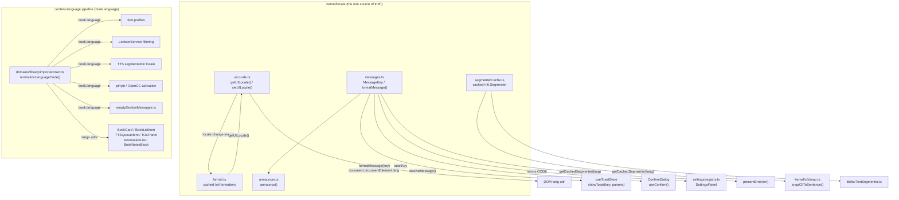
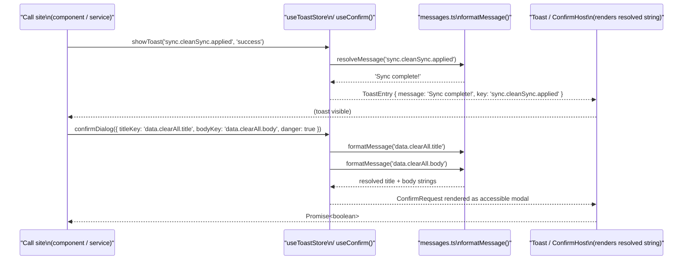
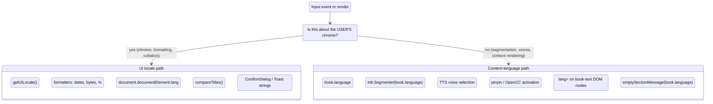
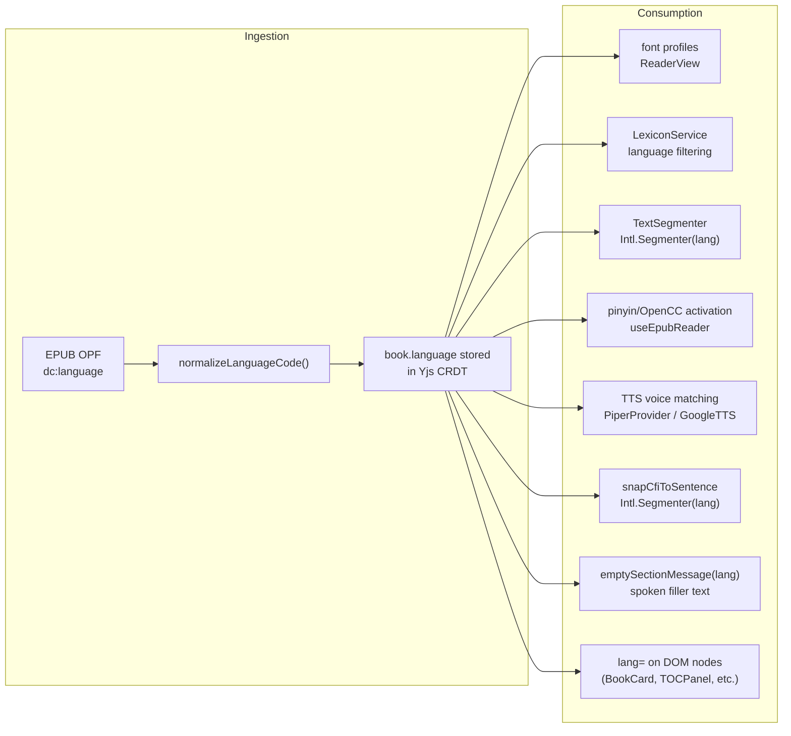

# Internationalization

Versicle is a Mandarin-learner's reading tool — pinyin annotation, OpenCC
simplified-to-traditional conversion, CC-CEDICT dictionary, per-language font
profiles, and zh TTS voices are all first-class features. Yet as of Phase 8 it
ships exactly one UI locale: English. This document explains why that is
deliberate, how the codebase is structured so that shipping a Chinese UI later
costs almost nothing, and how the existing locale machinery already does real
work for correctness even before any translation file exists.

The authoritative decision is [ADR 0001](../../docs/adr/0001-i18n-strategy.md).

---

## Why "i18n-ready, English-only"

### The gap Phases 0–7 inherited

Before the overhaul began, a
[gap analysis](../../plan/overhaul/analysis/gap-internationalization-string-ex.md)
quantified the problem:

| Surface | Pre-overhaul count |
|---|---|
| Double-quoted multi-word English phrases in components | ~348 |
| JSX text nodes starting with a capitalized word | ~186 across 47+ files |
| `aria-label=` sites | 159 |
| `showToast(...)` call sites with inline English | 81 |
| Native `confirm()` / `alert()` sites | 24 |
| `throw new Error('<English prose>')` surfaced verbatim in UI | ~53 |
| `toLocale*` formatting call sites (all defaulting to system locale) | 16 |

The total was approximately **800+ user-visible strings spread across ~100
files**. Three separate hand-rolled relative-time implementations, five
byte-size formatters, and hand-rolled English pluralization coexisted with zero
uses of `Intl.RelativeTimeFormat`, `Intl.NumberFormat`, or `Intl.Collator`.

More critically, the overhaul planned to rewrite exactly the seams where
internationalization plugs in: the toast store, `presentError`, `useConfirm()`,
the settings registry, and the TTS spoken-string path. If those new APIs were
designed around raw string prose, a future zh-UI request would force re-touching
all ~800 call sites *plus* the freshly rewritten infrastructure. The migration
would be paid twice. Conversely, designing the APIs around message keys means
that localization later touches catalog files only.

### The decision (ADR 0001)

**No user-facing locale work in Phases 0–7. No i18n library is adopted yet. No
language picker ships. English remains the only UI locale.** But every new
choke-point API is keyed from day one, and the catalog infrastructure exists so
the first key-bearing call site compiles on day one.

The concrete rules (from `docs/adr/0001-i18n-strategy.md §2`):

1. New shared APIs — toast queue, `presentError`, `useConfirm()`, settings
   registry labels, TTS spoken strings — accept `(messageKey, params)`, never
   raw prose.
2. Components may still author prose inline for now; strings are externalized
   opportunistically when the component is rewritten, never as a big-bang pass.
3. `document.documentElement.lang` is set from the resolved UI locale at boot
   (replacing the static `lang="en"` in `index.html`), and
   `lang={book.language}` is placed on every top-document element that renders
   book-sourced text.
4. The **two-locale rule**: UI locale governs chrome strings, formatting, and
   collation. `book.language` governs segmentation, voices, pinyin/OpenCC, TTS
   spoken filler, and content `lang=` attributes. Neither ever substitutes for
   the other.
5. Full catalog extraction is deferred to ride each already-planned component
   rewrite (ratchet model: `no-literal-string`-style lint rule enabled
   per-directory as each is migrated, never repo-wide ahead of migration).
6. Library choice is deferred to Phase 8 at the earliest, but is constrained
   now: must work from plain TS modules **and inside the TTS Web Worker**
   (ruled out React-context-bound i18n); type-safe message keys; ICU
   plural/select; small runtime with lazy locale loading. Candidate: paraglide-js
   first, `@lingui/core` as fallback.

---

## Architecture overview



The key architectural invariant is that there are **two separate locale
concepts** that never intersect:

- **UI locale** — resolved by `getUILocale()` in
  [uiLocale.ts](../../src/kernel/locale/uiLocale.ts); governs all chrome formatting
  and `document.documentElement.lang`.
- **Content language** — stored as `book.language` on every book record;
  governs segmentation, voice selection, pinyin/OpenCC, TTS filler text, and
  `lang=` attributes on book-sourced DOM elements.

---

## The locale kernel (`src/kernel/locale/`)

All i18n primitives live in the kernel layer so they are importable from stores,
services, and the TTS Web Worker without a React dependency.

### UI-locale resolution (`uiLocale.ts`)

[src/kernel/locale/uiLocale.ts](../../src/kernel/locale/uiLocale.ts) owns the
resolution chain and the change-notification bus.

**Resolution order** (first non-null valid BCP-47 tag wins):

1. `localStorage.getItem('versicle-ui-locale')` — per-device override, writable
   by the eventual language picker or tests.
2. `navigator.language` — the browser/OS system locale.
3. `'en'` — hard fallback.

```typescript
export const UI_LOCALE_STORAGE_KEY = 'versicle-ui-locale';

export function getUILocale(): string {
  if (cachedLocale) return cachedLocale;
  const override = readOverride();
  if (override && isValidLocale(override)) {
    cachedLocale = override;
  } else if (typeof navigator !== 'undefined' && navigator.language && isValidLocale(navigator.language)) {
    cachedLocale = navigator.language;
  } else {
    cachedLocale = FALLBACK_LOCALE;
  }
  return cachedLocale;
}
```

Validity is checked by constructing `new Intl.Locale(tag)` — any tag that
throws is rejected and the fallback chain continues. `localStorage` access is
wrapped in a try/catch because privacy modes can throw.

The module is deliberately **not** backed by the Yjs CRDT, for two reasons:
(a) it must be readable before the Y.Doc hydrates (boot-path strings in
`SafeMode`/`ErrorBoundary` are displayed before sync completes), and (b) UI
locale is a per-device preference — two devices on the same account legitimately
differ.

**Change notification** is a lightweight pub/sub:

```typescript
export function setUILocale(locale: string | null): void { /* writes localStorage, nullifies cache, fires listeners */ }
export function onUILocaleChange(listener: LocaleListener): () => void { /* subscribe, returns unsubscribe */ }
```

**`applyDocumentLanguage()`** is called once by
[registerBootTasks.ts](../../src/app/boot/registerBootTasks.ts) before any boot phase
runs:

```typescript
// registerBootTasks.ts (before any phase is registered)
applyDocumentLanguage();
```

It sets `document.documentElement.lang` to the resolved UI locale immediately
(so even the pre-boot loading screen carries the correct lang attribute), then
subscribes to `onUILocaleChange` to keep it in sync on any future
`setUILocale()` call. The static `lang="en"` in `index.html` remains as the
pre-JavaScript fallback.

**Test seam**: `resetUILocaleCacheForTests()` nullifies the in-memory cache
without touching `localStorage`, so test suites can call `setUILocale()` and
clean up with `localStorage.removeItem(UI_LOCALE_STORAGE_KEY)`.

---

### Message catalog (`messages.ts`)

[src/kernel/locale/messages.ts](../../src/kernel/locale/messages.ts) is the entire
in-repo message catalog — a plain TypeScript `const` object behind a typed key
union, with no i18n library involved.

**Design intent**: When a second UI locale ships, paraglide-js or `@lingui/core`
replaces only this module's *internals*. The external contract — `MessageKey`,
`MessageInput`, `formatMessage`, `resolveMessage` — is what every choke point
imports, and that contract does not change.

#### Key conventions (ADR §2)

- Keys are **domain-namespaced**: `sync.cleanSync.applied`,
  `settings.tab.general`, `reader.annotation.delete.title`, etc.
- The `errors.*` namespace keys **1:1 by `AppErrorCode`**. A TypeScript mapped
  type enforces this at compile time — a missing entry is a compile error:

```typescript
type ErrorMessages = { [C in AppErrorCode as `errors.${C}`]: string };
const errorMessages: ErrorMessages = {
  'errors.APP_UNKNOWN': 'Something went wrong. Please try again.',
  'errors.INGEST_DUPLICATE_BOOK': 'This book is already in your library.',
  // ... one entry per AppErrorCode, enforced by the mapped type
};
```

- **Params** use `{name}` placeholders, resolved by `formatMessage`:

```typescript
'sync.workspacePurged': 'Remote workspace data purged ({docs}, {blobs}).',
'syncSettings.deleteWorkspace.title': 'Delete workspace "{name}"?',
```

- No ICU plural/select yet (English-only catalog). Plural-bearing messages take
  pre-pluralized params or split into separate keys until a real library lands.

#### The typed API surface

```typescript
/** Typed key union — the contract every keyed choke point accepts. */
export type MessageKey = keyof typeof messages;

/** Bare key, or key with params. */
export type MessageInput = MessageKey | { key: MessageKey; params?: MessageParams };

/** True when value is a catalog key (vs free-form prose). */
export function isMessageKey(value: string): value is MessageKey

/** Resolve a key to its display string, substituting {name} placeholders. */
export function formatMessage(key: MessageKey, params?: MessageParams): string

/**
 * Resolve MessageInput or raw prose to a display string.
 * The transitional overload for legacy call sites still passing prose.
 */
export function resolveMessage(content: MessageInput | string, params?: MessageParams): string
```

`resolveMessage` is the transitional overload: it accepts a `MessageKey`, a
`{ key, params }` object, or raw prose (which passes through unchanged). This
allows the toast store and announcer to accept legacy call sites while they
migrate incrementally. New call sites must use `MessageKey`.

#### Compile-time exhaustiveness guarantee

```typescript
export const ERROR_MESSAGE_KEYS = APP_ERROR_CODES.map((c) => `errors.${c}` as const);
```

The test suite verifies that `messages[`errors.${code}`]` exists for every
entry in `APP_ERROR_CODES`, and that `ERROR_MESSAGE_KEYS.length ===
APP_ERROR_CODES.length`. Adding a new error code without a catalog entry
produces both a TypeScript compile error (the mapped type) and a failing test.

---

### Locale-aware formatters (`format.ts`)

[src/kernel/locale/format.ts](../../src/kernel/locale/format.ts) is the single home
for all user-facing date, time, and number formatting. It replaces:

- 3 hand-rolled relative-time implementations
  (`DeviceList`, `DriveImportDialog`, `SyncPulseIndicator`)
- 5 byte-size formatters
- 12+ hand-rolled percent formatters
- 3 hand-rolled English pluralizations
- 16 `toLocale*` call sites (all banned by ESLint after Phase 8)

Every exported function resolves its locale from `getUILocale()` and caches
`Intl` formatter instances per `(locale, options)` key. A `localStorage`
override invalidates all caches via `onUILocaleChange`:

```typescript
const dateTimeCache = new Map<string, Intl.DateTimeFormat>();
const numberCache  = new Map<string, Intl.NumberFormat>();
const rtfCache     = new Map<string, Intl.RelativeTimeFormat>();
const collatorCache = new Map<string, Intl.Collator>();

onUILocaleChange(() => {
  dateTimeCache.clear();
  numberCache.clear();
  rtfCache.clear();
  collatorCache.clear();
});
```

The public API:

| Function | Intl object | Example output (en-US) |
|---|---|---|
| `formatDate(input)` | `DateTimeFormat { dateStyle: 'short' }` | `6/12/26` |
| `formatTime(input)` | `DateTimeFormat { timeStyle: 'short' }` | `3:42 PM` |
| `formatDateTime(input)` | `DateTimeFormat { short, short }` | `6/12/26, 3:42 PM` |
| `formatRelativeTime(ts, now)` | `RelativeTimeFormat { numeric:'auto', style:'narrow' }` | `5m ago`, `now`, `2d ago` |
| `formatBytes(bytes)` | `NumberFormat { style:'unit', unit:'kilobyte'/'megabyte'/… }` | `1.5 MB` |
| `formatPercent(ratio)` | `NumberFormat { style:'percent' }` | `42%` |
| `formatDuration(minutes)` | `NumberFormat { style:'unit', unit:'hour'/'minute' }` | `2h 5m` |
| `compareTitles(a, b)` | `Collator { numeric:true, sensitivity:'base' }` | sort comparator |

`formatRelativeTime` replicates the "≥7 days → absolute date" behavior that
all three hand-rolled implementations converged on independently. For durations
< 1 minute it uses `rtf.format(0, 'second')` which produces the locale's
"now" string rather than a zeroed value.

`compareTitles` uses `Intl.Collator` with `numeric: true` so "Book 2" sorts
before "Book 10" — the pre-overhaul bare `localeCompare` calls got this wrong
(`'Book 10'.localeCompare('Book 2') < 0` is false under lexicographic ordering,
which is exactly backwards). The ADR explicitly notes this uses the **UI locale**,
not `book.language` — pinyin collation (`zh-u-co-pinyin`) is a deferred
content-language concern.

All functions accept an optional trailing `locale` override used by the unit
suite to pin assertions to known locales (avoiding host ICU flakiness).

**ESLint enforcement**: `toLocaleSelector` in
[eslint.config.js](../../eslint.config.js) bans `toLocaleDateString`,
`toLocaleTimeString`, and `toLocaleString` across all production source
(except `src/kernel/locale/` itself and test files). Any call to a raw
`toLocale*` method in production code is an error.

---

### Segmenter cache (`segmenterCache.ts`)

[src/kernel/locale/segmenterCache.ts](../../src/kernel/locale/segmenterCache.ts)
maintains a per-locale cache of `Intl.Segmenter` instances (sentence
granularity). Constructing an `Intl.Segmenter` is expensive (loads locale ICU
data); this cache is the pattern that all other Intl caches in `format.ts`
copy.

```typescript
export function getCachedSegmenter(locale: string = 'en'): Intl.Segmenter | undefined
```

Returns `undefined` when `Intl.Segmenter` is not supported by the host
(guarded by `typeof Intl === 'undefined' || !Intl.Segmenter`), so callers must
treat it as optional.

This module is consumed by **content-language** paths — segmentation uses
`book.language`, not the UI locale:

- `src/kernel/cfi/snap.ts` — sentence snapping for CFI anchors
- `src/lib/tts/TextSegmenter.ts` — sentence segmentation for TTS playback

---

### Screen-reader announcement channel (`announcer.ts`)

[src/kernel/locale/announcer.ts](../../src/kernel/locale/announcer.ts) is a plain
pub/sub channel (no React, no DOM) through which stores, services, and the TTS
adapter can dispatch live announcements. Content is keyed per the ADR:

```typescript
export function announce(
  content: MessageInput | string,
  opts: { assertive?: boolean } = {},
): void
```

The single subscriber is `src/components/ui/LiveAnnouncer.tsx`, which renders
two persistent visually-hidden live regions (polite and assertive) in
`RootLayout`. A monotonic `id` on each announcement causes the live region to
re-announce even when the text is identical to the previous value.

The catalog carries three announcement keys used by the TTS adapter:

```
'announce.tts.playing': 'Playing — {section}'
'announce.tts.paused':  'Paused'
'announce.tts.stopped': 'Stopped'
```

---

## The choke-point contracts

The ADR's core requirement is that every shared infrastructure API accepts
`MessageKey + params`, never raw prose. Phase 8 implements this for four
surfaces.



### Toast queue (`useToastStore`)

[src/store/useToastStore.ts](../../src/store/useToastStore.ts) is the Phase 8
replacement for the legacy single-slot toast store.

```typescript
showToast: (
  content: MessageInput | string,  // key | {key, params} | (deprecated) prose
  type?: ToastType,
  duration?: number,
  action?: ToastAction,
) => void;
```

`resolveMessage(content)` is called at enqueue time, so the resolved string is
stored in the `ToastEntry` (not the key). The key is also stored as
`ToastEntry.key` for deduplication: an identical `(message, type)` pair
replaces rather than stacks, with a fresh id to restart the dismiss timer and
re-trigger the live-region announcement.

A cap of `MAX_TOASTS = 5` drops the oldest beyond the limit, preventing
per-file import errors from flooding the screen.

The **deprecated prose path** (`resolveMessage` passes through unknown strings
unchanged) allows the 81 legacy `showToast('English sentence', ...)` call
sites to continue working while they migrate to keys. New call sites must pass a
`MessageKey` or `{ key, params }`.

### `useConfirm` / `ConfirmDialog`

[src/components/ui/ConfirmDialog.tsx](../../src/components/ui/ConfirmDialog.tsx)
replaces every native `confirm()` / `alert()` call. Those calls are now banned
at ESLint `error` level:

```javascript
// eslint.config.js
'no-alert': 'error',
'no-restricted-globals': [
  'error',
  { name: 'confirm', message: 'Use useConfirm() / confirmDialog from @components/ui/ConfirmDialog.' },
  { name: 'alert',   message: 'Show a keyed toast via useToastStore.showToast.' },
  { name: 'prompt',  message: 'Build a real dialog on @components/ui/Modal.' },
],
```

The `ConfirmRequest` type enforces key-based content:

```typescript
export interface ConfirmRequest {
  titleKey: MessageKey;
  bodyKey?: MessageKey;
  params?: MessageParams;         // applied to both title and body
  danger?: boolean;
  confirmKey?: MessageKey;        // default: 'common.confirm' / 'common.delete'
  cancelKey?: MessageKey;         // default: 'common.cancel'
}
```

Implementation is a module-level queue (not React context) so `useConfirm()`
works in any component and `confirmDialog()` is usable from non-React code,
as long as one `<ConfirmHost/>` is mounted. `App.tsx` mounts it above the router
gate so even the SafeMode reset path can show a confirmation dialog.

### Settings registry

[src/app/settings/registry.ts](../../src/app/settings/registry.ts) carries the
`SettingsPanel` descriptor type:

```typescript
export interface SettingsPanel {
  id: SettingsTabId;
  labelKey: MessageKey;  // resolved by SettingsShell via formatMessage()
  icon: LucideIcon;
  load: () => Promise<{ default: ComponentType }>;
  order: number;
  danger?: boolean;
}
```

The `labelKey` field is typed `MessageKey`, so adding a settings tab requires
adding a catalog entry first — the TypeScript compiler rejects a missing key.
Every current tab entry references a `settings.tab.*` key:

```typescript
{ id: 'general', labelKey: 'settings.tab.general', ... },
{ id: 'sync',    labelKey: 'settings.tab.sync',    ... },
// etc.
```

### `presentError`

[src/app/errors/presentError.ts](../../src/app/errors/presentError.ts) is the single
error→user-message mapper. It currently contains a local `MESSAGES` map keyed by
error code strings, which is an interim representation. The ADR designates its
eventual shape as a direct catalog lookup:

```typescript
// interim (Phase 8 §A):
export function presentError(error: unknown): string {
  if (error instanceof AppError) {
    return MESSAGES[error.code] ?? FALLBACK;
  }
  return FALLBACK;
}
// target: return formatMessage(`errors.${error.code}`, error.context)
```

The `errors.*` namespace in `messages.ts` already provides full coverage of
every `AppErrorCode` with the production-quality copy (the local `MESSAGES` map
in `presentError.ts` has only 10 entries; `messages.ts` has 34, one per code).
Migrating `presentError` to call `formatMessage` directly is a one-line change
once the migration is scheduled.

The critical architectural invariant enforced by both files: UI code never
renders `error.message` verbatim. The `message` field on an `AppError` is an
English developer/log string; user-facing copy is always resolved from the
catalog by error `code`.

---

## The two-locale rule in practice

The two-locale rule is the most important invariant in the system: **UI locale
and content language never substitute for each other.**



### Where content language is threaded

**At ingestion** ([src/domains/library/import/extract.ts](../../src/domains/library/import/extract.ts)):

```typescript
const language = normalizeLanguageCode(metadata.language || metadata.lang);
// stored as book.language, used for the rest of the book's life
```

`normalizeLanguageCode` in [src/lib/language-utils.ts](../../src/lib/language-utils.ts)
maps ISO 639-2 three-letter codes to two-letter codes (`'zho'` → `'zh'`,
`'fra'` → `'fr'`), strips subtags, and falls back to `'en'` for unrecognized
inputs.

**In DOM rendering** — book-sourced text always carries `lang={book.language}`:

```tsx
// BookCard.tsx
<h3 lang={book.language}>{book.title}</h3>
<p lang={book.author ? book.language : undefined}>{book.author}</p>

// BookListItem.tsx
<h3 lang={book.language}>{book.title}</h3>
<span lang={book.language}>{book.author}</span>

// TTSQueueItem.tsx — sentence text in the TTS panel
<p lang={contentLang}>{item.text}</p>

// TOCPanel.tsx — chapter titles
<span lang={contentLang}>{item.label.trim()}</span>

// BookNotesBlock.tsx — annotation excerpts
<div lang={book?.language}>{excerpt}</div>
```

This matters for two concrete reasons: (1) Han unification — under `lang="en"`,
browsers may render shared CJK codepoints with Japanese-variant glyphs; `lang="zh"`
selects Simplified Chinese variants. (2) Screen reader voice selection — the
AT picks its Chinese voice for `lang="zh"` elements even when the document's
root `lang` is `"en"`.

**In TTS segmentation** — `getCachedSegmenter(book.language)` is called, not
`getCachedSegmenter(getUILocale())`:

```typescript
// kernel/cfi/snap.ts — sentence snapping for CFI anchors
const segmenter = getCachedSegmenter(language || bookLanguage(source) || 'en');

// lib/tts/TextSegmenter.ts — TTS sentence segmentation
this.segmenter = getCachedSegmenter(locale); // locale = book.language
```

**In TTS spoken filler** ([src/lib/tts/emptySectionMessages.ts](../../src/lib/tts/emptySectionMessages.ts)):

```typescript
const CATALOG: Record<string, string> = {
    en: 'There is no text to read here.',
    zh: '此章節沒有可朗讀的內容。',
};
export function emptySectionMessage(language: string | undefined): string {
    const primary = (language || 'en').toLowerCase().split(/[-_]/)[0];
    return CATALOG[primary] ?? CATALOG.en;
}
```

This replaced the pre-overhaul `AudioContentPipeline`'s ten randomized English
`NO_TEXT_MESSAGES`, which were spoken verbatim through zh voice models. The
deterministic single-message-per-language design also eliminates the cache
fragmentation those random variants caused (audio cache entries are
content-addressed).

---

## Chinese sentence-snapping: the locale-aware CFI fix

One of the gap items (I18N-7) was that `src/lib/cfi-utils.ts` hardcoded `'en'`
as the segmenter locale for CFI sentence-snapping. This meant that on a Chinese
book, the snap function used English sentence-boundary rules, which produce wrong
results for CJK text (Chinese sentences are delimited by `。`, `！`, `？` — not
by the English `Intl.Segmenter`'s rules for European period-space-capital
patterns).

The Phase 5c fix in [src/kernel/cfi/snap.ts](../../src/kernel/cfi/snap.ts) threads
the book's OPF language through to `getCachedSegmenter`:

```typescript
export async function snapCfiToSentence(
    source: Book | CfiRangeResolver,
    cfi: string,
    language?: string,   // BCP-47, explicit from TTS callers; auto from OPF metadata
): Promise<string> {
    // ...
    const segmenter = getCachedSegmenter(language || bookLanguage(source) || 'en');
```

`bookLanguage(source)` reads `source.packaging?.metadata?.language` from the
epubjs OPF object. TTS callers (which know the book explicitly) pass `language`
directly; the reader-side snapCfiToSentence call (adopted in Phase 6) derives it
from the OPF metadata.

The pre-5c behavior was the fallback: a hardcoded `'en'`. The post-5c behavior
is: explicit parameter → OPF metadata → `'en'` last resort. This is a
correctness fix for the app's primary audience (zh readers).

---

## Content-language pipeline in depth

The content-language pipeline is the "good half" of i18n that predates the
overhaul and must be preserved intact.



**Normalization** (`normalizeLanguageCode`): handles ISO 639-2 three-letter
bibliographic and terminological codes:

```typescript
const langMap: Record<string, string> = {
    'eng': 'en',  'zho': 'zh',  'chi': 'zh',
    'fra': 'fr',  'fre': 'fr',  'spa': 'es',
    'ger': 'de',  'deu': 'de',  'jpn': 'ja',
    // ... 20+ codes total
};
```

The function strips subtags (`'zh-Hant'` → `'zh'`) and rejects the result with
an `'en'` fallback if it is not a 2–3 letter `[a-z]` string.

**TTS engine replication** — the TTS Web Worker maintains a
`bookLanguages: Record<string, string>` map updated by `applyStateUpdate({
kind: 'bookLanguage', bookId, lang })` messages from the main thread. This keeps
the worker informed of the content language for each book it may be asked to play,
without the worker holding a reference to the book store.

---

## Catalog namespace map

The catalog in `messages.ts` is organized by domain prefix. The following table
summarizes the namespaces currently in use and what they cover:

| Namespace | Covers | Example key |
|---|---|---|
| `errors.*` | One entry per `AppErrorCode` (enforced by mapped type) | `errors.INGEST_DUPLICATE_BOOK` |
| `common.*` | Shared button labels | `common.cancel`, `common.delete` |
| `settings.tab.*` | Settings panel tab labels | `settings.tab.sync` |
| `sync.*` | Sync domain toast and confirmation copy | `sync.cleanSync.applied` |
| `app.*` | App-shell confirmations and PWA events | `app.resetAll.title`, `app.updateReady` |
| `data.*` | Data management panel confirmations and toasts | `data.clearAll.title` |
| `genai.*` | GenAI consent and cache-clear dialogs | `genai.consent.title` |
| `syncSettings.*` | Sync settings confirmations | `syncSettings.deleteWorkspace.title` |
| `diagnostics.*` | Diagnostics panel confirmations | `diagnostics.deleteSnapshots.title` |
| `devices.*` | Device management confirmations | `devices.applySettings.title` |
| `reader.*` | Reader panel confirmations | `reader.annotation.delete.title` |
| `lexicon.*` | Lexicon import confirmations | `lexicon.import.replace.title` |
| `abbrev.*` | Abbreviation import confirmations and toasts | `abbrev.import.empty` |
| `announce.tts.*` | TTS live-region announcements | `announce.tts.playing` |
| `shortcuts.*` | Keyboard shortcut help strings | `shortcuts.tts.playPause` |

---

## ESLint enforcement

The following lint rules enforce the i18n contracts at the static-analysis
level:

| Rule | Where it applies | What it bans |
|---|---|---|
| `no-alert` (error) | All production source | `alert(...)` — replaced by keyed `showToast` |
| `no-restricted-globals: confirm` (error) | All production source | `confirm(...)` — replaced by `useConfirm()` |
| `no-restricted-globals: alert` (error) | All production source | `alert(...)` — redundant with no-alert |
| `no-restricted-globals: prompt` (error) | All production source | `prompt(...)` — build a real dialog |
| `no-restricted-syntax: toLocaleSelector` (error) | All production source (except kernel/net and tests) | `toLocaleDateString`, `toLocaleTimeString`, `toLocaleString` — replaced by `@kernel/locale/format` |

The `toLocaleSelector` AST selector:

```javascript
"CallExpression[callee.property.name=/^toLocale(String|DateString|TimeString)$/]"
```

It is absent from test files (tests may compute expected values however they
like) and from `src/kernel/net/` (the only source that has an unrelated carveout
for that block).

---

## Open gaps and deferred work

The ADR explicitly defers several items. The following table records the status
of each gap item from the original analysis:

| ID | Description | Status |
|---|---|---|
| I18N-1 | No UI-locale dimension existed, no decision recorded | **Fixed** — ADR 0001 accepted, locale kernel shipped |
| I18N-2 | Service layer authored user-facing prose; UI surfaced `err.message` | **Fixed** — `presentError` maps by code; choke-point APIs use keys |
| I18N-3 | ~800 hardcoded strings with zero indirection | **Partially fixed** — infrastructure keyed; components migrate per-rewrite |
| I18N-4 | No locale policy for formatting; triplicated relative-time | **Fixed** — `kernel/locale/format.ts` + `toLocale*` ban |
| I18N-5 | `<html lang="en">` static; no `lang=` anywhere in JSX | **Fixed** — `applyDocumentLanguage()` at boot; `lang={book.language}` on content nodes |
| I18N-6 | TTS spoke English filler through zh voices; randomized | **Fixed** — `emptySectionMessages.ts` deterministic + language-keyed |
| I18N-7 | CFI sentence-snapping hardcoded `'en'` segmenter | **Fixed** — `snapCfiToSentence` threads book language (Phase 5c) |
| I18N-8 | Language override UI offered only en/zh; 20+ supported | **Deferred** — VisualSettings.tsx still has a two-option Select |
| I18N-9 | GenAI smart-TOC baked "English Title (Original Title)" into persisted data | **Deferred** — structured `{ original, english? }` title shape not yet implemented |
| I18N-10 | Library/notes sorting used bare `localeCompare` | **Fixed** — `compareTitles(Intl.Collator, numeric:true)` |
| I18N-11 | Exported artifacts hardcoded English templates | **Deferred** — export prose not yet routed through catalog |

### The deferred library choice

The ADR deferred the i18n library decision to Phase 8 at the earliest, binding
it to these constraints (from the gap report):

1. **Worker-importable** — not React-context-bound. Spoken strings live in the
   TTS engine layer (a Web Worker). The catalog must be importable from plain
   TypeScript modules. The current `messages.ts` is the prototype of this:
   a plain `const` object with no runtime dependency.
2. **Type-safe message keys** — compile errors on missing/renamed keys.
3. **ICU plural/select** — kills the hand-rolled `n === 1 ? '' : 's'` patterns.
4. **Small runtime + lazy locale loading** — the PWA/mobile bundle budget is
   tracked by the bundle analyzer wired in Phase 6.
5. **Per-message tree-shaking** preferred.

Leading candidates: **paraglide-js** (compile-time, zero-runtime, fully typed
per-message functions, Vite plugin) and **`@lingui/core`** (~8 kB runtime,
mature ICU, compile-time extraction). `react-i18next` fails the type-safety and
tree-shaking constraints.

### Migration path to a second locale

When a Chinese (or any) UI locale ships, the work is:

1. Swap `messages.ts` internals for the chosen i18n library's runtime (the
   external `MessageKey` / `formatMessage` / `resolveMessage` contract is
   unchanged — choke points do not need to change).
2. Add catalog files for the new locale (`.po` / `.js` / paraglide messages, per
   library).
3. Add a language picker in settings that calls `setUILocale(tag)` (one
   localStorage write, no store changes, no Yjs schema impact).
4. Audit the UI chrome font stack for zh rendering.
5. Optionally enable `Intl.Collator('zh-u-co-pinyin')` for library sort —
   `compareTitles` already reads from `getUILocale()`.

No data migrations are required for steps 1–3 (no persisted user-visible strings
change shape). The one potential migration is the GenAI smart-TOC title shape
(I18N-9), which would need a lazy parse-on-read migration of existing
`"English (Original Title)"` strings to a structured `{ original, english? }`
form.

---

## Related documents

- [ADR 0001 — i18n strategy](../../docs/adr/0001-i18n-strategy.md) — the authoritative
  recorded decision
- [Architecture overview](10-architecture-overview.md) — where the locale kernel
  fits in the layer model
- [Layering and boundaries](11-layering-and-boundaries.md) — why kernel modules
  are worker-importable
- [Domain: Chinese](35-domain-chinese.md) — the content-language pipeline for
  Chinese books in depth (pinyin, OpenCC, CC-CEDICT)
- [Domain: TTS engine](32-domain-audio-tts-engine.md) — TTS segmentation,
  `TextSegmenter`, voice selection by `book.language`
- [Domain: reader engine](30-domain-reader-engine.md) — `snapCfiToSentence` and
  the locale-aware CFI anchor
- [Error handling and recovery](15-error-handling-and-recovery.md) — `AppError`,
  `AppErrorCode`, and the `presentError` mapper
- [Accessibility](72-accessibility.md) — `LiveAnnouncer`, the `announce()` API,
  and the `lang=` attribute strategy
- [Settings shell](41-settings-shell.md) — how `SettingsPanel.labelKey` is
  resolved by the shell
- [Bootstrap and lifecycle](14-bootstrap-and-lifecycle.md) — where
  `applyDocumentLanguage()` is called in the boot sequence
